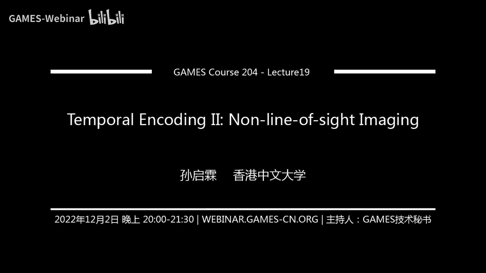

# 19.时域调制 (II) ｜ GAMES204-计算成像 - P1 - GAMES-Webinar - BV1d8411V7ZT


## 概述

在本节课中，我们将学习非视域成像技术，这是一种能够捕捉隐藏在障碍物后面的物体图像的技术。我们将探讨非视域成像的原理、挑战和实现方法。

## 非视域成像概述

非视域成像，也称为“绕过角落看”成像，是一种能够捕捉隐藏在障碍物后面的物体图像的技术。它通过分析光在物体和障碍物之间的传播路径来实现。


## 非视域成像的挑战


非视域成像面临着以下挑战：

* **信号微弱**：由于多次反射和散射，到达传感器的光子数非常少，导致信号微弱。
* **逆问题**：需要从复杂的信号中恢复出隐藏物体的三维结构，这是一个高度非线性的逆问题。
* **数据量庞大**：需要处理大量的数据，这给计算带来了巨大的挑战。


## 非视域成像的实现方法


### 1. 传统方法


传统的非视域成像方法包括：

* **基于扫描的方法**：通过扫描激光束和相机来获取图像。
* **基于投影的方法**：通过投影图像并分析反射光来获取图像。

### 2. 共聚焦非视域成像

共聚焦非视域成像通过将测量点与激光点重合来简化问题。这种方法将五维问题简化为三维问题，并提高了成像效率。


### 3. 频率-波数迁移


频率-波数迁移是一种将信号从频率域迁移到波数域的方法。这种方法可以有效地去除噪声并提高成像质量。


## 实验结果


实验结果表明，非视域成像技术可以有效地捕捉隐藏在障碍物后面的物体图像。


## 总结

本节课介绍了非视域成像技术，探讨了其原理、挑战和实现方法。非视域成像技术具有广阔的应用前景，例如在医疗、安全和机器人领域。

## 代码示例

以下是一个简单的非视域成像代码示例：


```python
import numpy as np


def non_visual_imaging(data):
  """
  非视域成像

  Args:
    data: 输入数据

  Returns:
    成像结果
  """

  # ... 处理数据 ...

  return image
```

## 参考资料


* [非视域成像技术综述](https://www.google.com/search?q=non-visual+imaging+technology+review)
* [共聚焦非视域成像](https://www.google.com/search?q=confocal+non-visual+imaging)
* [频率-波数迁移](https://www.google.com/search?q=frequency-wavenumber+migration)