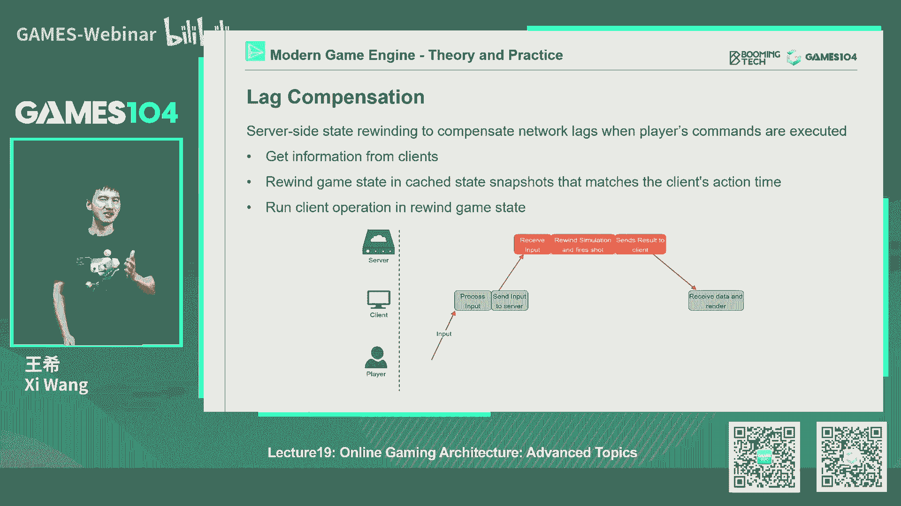
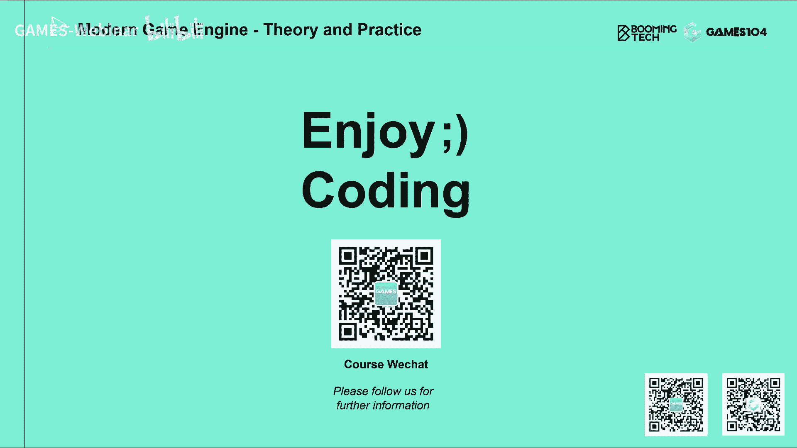

# 19.网络游戏的进阶架构 (Part 1) ｜ GAMES104-现代游戏引擎：从入门到实践 - P1 - GAMES-Webinar - BV13B4y1L7bZ

Hello，大家好，欢迎大家回到games104，现在游戏引擎的理论与实践，我是王希，然后今天开始我们的第19讲，那么在开奖之前的话，大家有没有注意到今天我有什么区别对吧，大家看看我今天穿的什么。

对我们的社区的T恤终于印出来了，这个我还我今天还特别高兴，因为课程准备到最后几分钟的时候，课程组告诉我说我们的T恤已经印出来了，所以我迫不及待的就穿上去了，给大家看一看，大家觉得效果怎么样。

看看自己还不错吧，然后那个我们那个课程组的小伙伴的话，会尽快安排给我们的，就是所有被抽中的同学，还有我们社群的热心的同学们，还有什么，还有我们作业做得非常那个好的，同学都给大家寄过去。

大家还记得上节课我们讲过，就是说作业中的话，大家只要做完两个作业的话，我们就会把T恤送给大家，因为也是想鼓励大家，一起去参与到我们的课程中来，说实话啊，我们也不知道有什么目的，反正我觉得能跟着我们一起。

把这个课程跟到现在的同学都是好汉，因为我自己想了一下，我们的课程现在总时长已经接近50个小时了，然后我觉得我在大学读书的时候，让我一个学期上一门课，我有的时候还很难坚持不逃课。

所以说我觉得能坚持下来的都是很厉害的，这个选手，那么其实呢说实话，我们自从那个就是上几节课，说鼓励大家在我们的B站上面去留言的时候，其实收到了很多很多大家的声音，真的很感动，有的时候我们很enjoy。

看大家跟我们讲什么东西，确实特别让我有感触的是，说一其实准备这个课的话，我们蛮辛苦的，然后我每天都在想要争取下一周不上课，我又可以偷懒了，但是的话呢真的到临近尾声的时候，还真的有点舍不得说。

哎呀我每个星期能跟大家打个招呼，告诉大家我们学的一些东西，想要一些东西，好像已经成为了我们生活的一种习惯，所以的话呢呃我我我们也在想说，后面怎么样子能够继续帮助到大家，这里面。

我就想正好跟大家好长时间没有讲一件事情，就是说那个大家我们好久没有讲，我们的PICO引擎了，实际上的话呢，最近整个课程组在非常忙的准备课件，但是的话呢我们那个忘了，这个就是说呃跟大家讲皮克罗引擎。

其实我们一直也在偷偷的在去做一些新的模块，争取能够帮助到我们的社群，跟大家汇报一下，现在我们正在做的事情，第一个的话呢就是我们把我们的这个r chi，也就是我们面向graphics底层的东西。

我们又把它这个就是又更新了一个一个，重新的结构，因为以前我们RH还写的不够专业，我们这次的话呢，争取给他换的稍微专业那么一点点的RH，这样的话能够未来大家想要移动端移植啊。

大家想往这个其他的甚至游戏主机移植的话，提供这样一个一个帮助，另外一个的话呢就是说呃，包括特别是对于DX12啊，对于这个metal特别是metal的支持要变得更好一点，另外一个的话呢。

就是哎这个是我觉得非常的这个，非常的amazing的一件事情，就是我们前两天我们有个同学这个发奇想，我们给我们的PICO还写了一个GPU particle，也就是说虽然你看了这个图上，你看不清楚。

现在我还配视频来不及了，然后呢，但是的话我们是真的实现了一个非常简单的GPU，PARC系统，这样的话诶大家可以在皮克罗里面可以去看看，这个GPU particle该怎么去实现。

当然那个我们做的是非常简单的，给大家做了个框架，那么有同学们，如果想要PICO做个自己的小游戏啊，比如说做一个你自己的毕设的话，我相信你可以秒杀那些没有用过PICO的小伙伴。

因为我们104的精神就是人均一个，这个就是开源引擎嘛，然后另外一个的话呢，就是说呃我们现在的话呢，就是在这个就是我们的皮克罗引擎里面，还加了一个小小的debug做系统，为什么加了个debug做系统呢。

因为现在好多同学们跟我们讲说，他们想要PICO做自己各种各样的小应用啊，想要做自己的小游戏，那实际上的话呢，如果你真的作为一个稍微复杂点的开发的话呢，你就一定要有这个debug做系统。

而且这个系统呢写不好，可能会把性能写得非常低，所以的话呢我们就加入了这样的一个，第八个做系统，然后争取再给我们一两周的时间，因为我们这是开源的代码，所以我们不好意思把代码写得特别的丑。

所以呢我们会做一些code review，如果我们觉得质量可以的话，也给大家，所以说不定的话就是说我们的104课程啊，这个告一段落之后的话，在新的课程还没开始之前。

我们可能会持续性的去对皮克洛进行更新呃，到时候零四课程的可能，games的视频号我们不能用了，我们可能会到时候大家可以在B站上找到，我们自己的视频号，然后的话呢我们也会定期的给大家讲一下，皮克罗的一些。

比如说结构讲解呀，或者是皮克O的一些大家要的什么功能，我们怎么去开发，跟大家一起，能帮助大家就真的实现我们这个课程的口号，就人均一个自研引擎对吧，那么另外一个的话呢就是上一节课的话呢。

其实同学们在那个我们各个QQ，那个就是微信群里面讨论的真的是非常的热烈，我自己都没有想到，然后呢，这里面的话呢就是同学们也问我们的一些问题，这是我们从大家问题里面挑出来的。

第一有同学们问我们说诶有没有游戏，它混合了真同步，和这个就是说呃那个状态同步的啊，其实是有的啦，就是大部分的真正的游戏的话，很多时候都是这样，举个例子吧，比如说我们玩一个MOBA游戏，MOBA游戏呢。

真正的游戏的game play，就是你进入到一起游戏的时候，很多时候大家会用的是真同步，但是呢你进入到游戏大厅呀，比如说你看到一群人在那跑来跑去啊，那时候玩家特别多啊。

而且又对游戏的逻辑要求不是那么严格的话，其实状态同步就可以了，所以说其实很多的实战性游戏的时候，都会把两种状态给混合在一起，那还有同学问我们一个问题，就是说哎，如果将来以后整个游戏都变成了语音游戏了。

我们是不是就不用学这个网络同步，这些东西了啊，这个怎么说呢，这件事情首先还没有发生对吧，我们还没有看到真正的云游戏引擎，那么我也不敢说的特别的断言，但是呢我觉得肯定了，大家如果都上了云游戏之后。

那很多网络同步啊，包括今天这节课我们会再给大家讲的这个防反，做反作弊啊，会简单很多，但是呢我个人觉得就是说，如果是真的是超大规模的游戏的话，你还是需要大量的这个状态同步的。

因为我不可能把所有的用户的输入，直接连到我的server端，你前面还是有很多的类似于client的东西，它可能做的比较轻，所以呢，特别是如果用户从不同的地域接近来的话。

但是前端还是有些节点来进行这样的处理，所以我个人认为状态同步还是必要的，在整个这个游戏世界中的话，可能是同一个真同步，那说不定真的就像大家讲的，那个世界是一个真核状态，同时混合的一个状态。

但这个里面的话呢，我觉得现在还在一个呃，大家在做很前沿的探索阶段，所以说啊我是我相信再过几年会逐渐的清晰，然后最后一个同学也问我们一个问题，就是说诶就是说如果是不是真同步了，就没有人作弊了。

其实上节课我已经讲过了，就是原则上来讲，真同步确实能够防范很多的作弊，但是呢也不能够防范掉所有的作弊，举个例子，比如说上次也讲过，比如说我把地图全开了对吧，什么战争迷雾完全没有用了。

比如说我打撸啊撸对吧，对方出什么英雄对吧，对方在干什么事情，我一清二楚，其实如果是真同步的话，我确实可以做这样一件事情，为什么呢，因为他所有的状态全部同步到这，我们是一模一样的那个逻辑。

如果没有做必要的防范的话，我可能连他在商店里出了什么装备，我都知道很清楚对吧，所以说啊这这个东西的话呢，也就也就是说很多事情，他都是就这也是做网网游的，非常复杂的一件事情，就是说因为你架不住。

就是大家会从各个角度去尝试攻击这个系统，好的好，那就是我们这一次整个社群的一个反馈，在开始今天这节课之前的话呢，我给大家做个简单的预告，首先的话这一节课讲完，我们网络课讲完之后呢，我们会暂停一周。

然后后面会开始我们的高级课程，那为什么我们要暂停一周呢，因为我们的高级课程，每一节课实际上都是非常非常重的一节课啊，其实我自己压力很大，因为我们选了三个topic的话，应该来讲都是分量很重的。

而且技术密度非常高，我还不是特别有信心诶，我第一个，我自己能不能把这个知识掌握得足够的准确，足够的到位，第二个就是说能不能在课件上给大家讲清楚，比如说我们的第一节课的话，我会给大家讲真正的面向数据编程。

就d o p dorange programming和job system，这个是对于现代高性能引引擎，或者是系统开发来讲的话，是一个非常核心的一个架构对吧，那这样的话如果这套体系的话。

其实这就像现在很多商业引擎都没有完全做到，比如说我们那个unity著名的ECS对吧，也是在尝试往这个方向去发展，那荣耀其实它的新的那个massive的这个系统，也在做这样的一件事情。

这是我们的第一个advance topic，那么第二个advance topic呢，那就是大名鼎鼎的对吧，就是虚幻五的那个NORMAN和拿来night这两个技术，那这两个技术呢。

说实话复杂度还是非常非常高的，就是说你了解他的大概可能呢没有那么难，但是你真的去一个一个知识点去理解它，然后能够把他这些东西串到一起的话，其实非常的复杂，真的是要对这些高手还是要保持敬畏之心。

就是说这两个技术的话，就是说从他技术概念很早以前就有人提出来，但是还还是很了不起的一件事情，就是大家真的在工业化上面，把这个问题解决掉了，所以啊我也是诚惶诚恐，我说一节课的时间我能不能把它讲清楚。

那么第二个的话呢，就是大家诶喜闻乐见的motion matching对吧，这个这个还有什么呢，APPGC就是那个基于pro procedure，generate content对吧。

这个也是大家特别喜欢的一个一个内容，但是这里面PGC的话，你的内容其实也是非常的多，而且很多孩子不是不是我特别熟悉的领域，比如说胡迪尼，我用的就不是特别好对吧，那那那这里面的话就有很多东西我们要去准备。

所以呢我们也会跟games课程组商量，能不能就是说每节课都能中间空一周，这样的话我们课程组能够进行更充分的准备，当然大家也可以在社区里投票，说我不需要，我就是要三节课连着讲，那我也没办法了。

我觉得勉为其难对吧，如果那个games允许我们这样调整，如果大家也支持我们的话，我个人会倾向于就是说每节课花两周时间准备，这样的话能讲得更透一点，因为这几节课都是啊非常的硬，这个里面我要做一个高能预警。

前方高能，所以的话呢这是我们在下一个就是整个基础，今天是我们的基础课程的最后一章嘛，然后这三节课呢是我们的高级课程的开始，就未来的话我们有可能会跟games商量，就是啊，这个会可能可能考虑给大家开一个。

二零系列的高级课，对不对，但是的话呢我们先拿着三节课给大家做个预热，看看大家喜不喜欢这些东西，那么那如果真的要开高级课的话，请大家允许我们先躺一年啊，躺个半年，我要我要好好的回点血了。

OK那所以这个地方呢也给大家做一起讲一下，我们后面的课程安排好的，言归正传，每次开场10分钟回到我们今天的课程，就是继续讲我们的online gaming architecture。

那今天讲的呢就是高级的topic，我记得我上节课卖过一个关子对吧，我说虽然我们上节课讲了那么多，还是蛮硬核的东西，连网络技术协议都跟大家讲一下，大家意识到说原来我要做一个online gaming。

连网络协议我得自己都得改一改对吧，都得写一写，确实还是还是这个蛮硬的，但当你把这些硬菜全部学完，我也懂了，什么叫真同步，什么叫状态同步，我们是不是就能做一个online gaming呢。

在上节课我最后一页，我说唉，大家可能不要高兴的太早，这些都只是foundation当你真正的做个游戏的时候，实际上还有一些很有趣的东西我们没有掌握，那这时候你的游戏做出来，你说能不能联网呢，能够联网。

但是你打起来就是很奇怪，所以今天这节课的话呢，是真正的教大家怎么去做网游对吧，那么这个东西的话呢，用一句更简单的话解释，就是说，假设你们你们俩好几个同学们一起做个游戏，分一个团队。

如果有同学自告奋勇的把那个online game的basic，那个那个课程里的东西全部实现完之后，你呢就可以很愉快的做那个高级的部分，确实你可以装作它下面的东西都不知道，没关系，那你接下来在上面的话。

你来看看你要解决什么问题，OK好，那么今天呢这节课的话呢，我们的structure首先还是从game play上面的要求讲，我们会跟大家讲，就说如何在不同的客户端之间怎么同步，玩家的移动。

Character moon replication，那大家想想哇，连网络移动同步这件事情，都要单独作为一个章节来讲对吧，这个听上去好像有点意思了。

那么第二个的话呢就是A叫head registrator，简单翻译就是如何在网络游戏的情况下，我能打中敌人，而且能正确的打中敌人，你想想看做一个游戏，你就又不能移动同步，又不能打中敌人。

那你这个游戏肯定是不成立的，所以我上节课为什么说，学完上节课还不足以做游戏，就是这个道理，因为这两他是大家首先要掌握的，有了这两盘之后呢，大家基本上就知道怎么就做游戏了，然后接下来第三章节呢。

我给大家讲一个诶，我们一个M游戏，就是说很多玩家在一起的这样一个游戏，它不一定是一个MRPG啊，可能是个MOFPS，Whatever，它的网络基础架构大概是怎么架的。

它这个其实不是network architecture，实际上是他整个这个啊server端的这个framework，应该怎么去架，但是我们因为时间有限，我们只会跟大家讲这个纲要，让大家知道这个框架。

然后呢最后给大家讲一下，诶，这个里面，其实如果你要做这样的一个游戏产品的时候，你最关注的一个东西是什么，诶你也得优化它的带宽，如果带宽不优化，你会发现你的服务器内部都会炸掉。

还有呢最后一个也是大家特别关心的，有感感兴趣这个话题就是如何反作弊对吧，那么反作弊的反面是什么，叫作弊，那作弊这件事情呢，我要跟大家高能预警一下，就是说，根据我们国家这个这个信息安全法的规定啊。

大家这个非法入侵计算机系统是个违法行为，那大家同学们一定不要试啊，虽然你们知道这些技术，但请你们不要试这个试了之后真的不好，那么最后一个的话呢，我们会荡开一笔跟同学们讲一下，就是说诶。

如果我们要做一个非常时下最热热烈的，最火爆的开放大世界对吧，那我们要做开放世界，你最基础的一个架构该怎么去架它呢，当然我们还只是点到为止，但是我觉得也能够帮助同学们去理解和思考，一些有意思的问题。

所以这就是我们今天往那个online game，architecture的这样的一个高级篇，跟大家讲的内容怎么样，大家觉得这个课程提纲还是让诸位客官满意吧，好，那接下来的话呢。

就是我们开始我们今天课程的正文，首先第一趴的话呢，我们给大家讲一下，就是说角色位移的同步，Replication，replication的意思就是诶我在那边复制出来，这个词，听上去很简单对吧。

那为什么这个问题要单独拎出来讲呢，其实啊就是说大家知道在上节课里面，我们讲了这个网络的传输不仅不稳定，还有什么，还有还有lagging，他是老师会有一个latency对吧。

我们上节课专门分析了各种的就是延迟，那实际上的话呢，就是我在我的玩一个游戏的时候，我看到别的小伙伴在那个世界里跑来跑去，真实的情况是什么呢，是那个小伙伴自己已经跑到很前面去了。

然后呢他需要把自己的状态诶，他首先自己有个tick，它不是随时随地发大家发给自己的服务器，这中间的话从他到服务器是不是有个延迟，所以服务器你看这就是如果那个上面的小伙伴，自己是个蓝色的。

那么它同步到中间那个灰色的话呢，就是这个这个服务器服务器比较慢，半拍好服务器，老人家他自身的tick还比我慢的吧，一般服务器我们不讲师个十帧每秒嘛，对不对，好他那个老人家反应过来了。

然后再把这个这个状态replicate到我这边，无论你是真同步还是状态同步啊，那我们这边假设你做的是状态同步诶，到我这边，就是我下面最下面那个红色的那个区域的话，是不是变得更慢，而且你看我的那个移动。

是不是一个消息来了之后，诶，我傻了，我就走一步，一个消息来我就傻了，走一步，那么当然了，我们说如果延迟特别小对吧，比如说你每个1/10秒或者是1/20秒，有一个，那我看到别人在我的客户端上同步的时候。

诶，看看看看看看还行，但是如果大家想象一下，网络讲师LEX就是网络的latency不稳定的时候，我是不是会出现那个人就是一抖一抖一抖一抖，一抖一抖，对不对，所以说我要实现一个最简单的一个。

对方移动的同步，那么好像用一个最简单的消息来了，我去更新这件事情好像是不对的，因为整个这个状态看上去就非常的奇怪，所以在这样的一个情况下的话，我们怎么去解决这个同步问题呢，哎这里面我们就祭出我们的。

大名鼎鼎的数学工具了，叫什么呢，叫差值对，差值这个东西的话呢，同学们如果在学大学高数的时候对吧，学工程数学的时候应该是耳熟能详了对吧，这个凡事不举就是差值嘛，对不对，只要觉得这个信号不smooth。

我们就开始把它smooth一下，怎么smooth，我就跟你差值嘛，那么差值呢有两大流派对吧，第一个流派呢我们叫做INTERLATION内差对对，还有什么呢，extra polation y差值对吧。

内插值我们都很熟了，对不对，我们有多个控制点对吧，我们去内差值，大家还记得我们在前面很多会反复提到的，比如说cut more曲线啊，那个BASI样条，BER样条好像比较复杂，它不会控制点。

那cut more曲线它就很棒，它可以过所有的控制点对吧，而且让你线条看着非常的光滑，那么或者是我直接就是这个用一段段的折线，我也能插值啊，对不对，内差值大家想到了很正常，对不对。

但是呢诶在网络同步的时候，我们可能还需要外插值，外插值本质是什么，是预测对吧，比如说根据这个哎我们这个今年的人口出生率，明年的出生率，后年出生率我们可以引引引出一条曲线出来，那是什么，那叫外差值对吧。

那么其实在网络这个这个角色位置同步的时候，实际上，这两种差值还扮演了一个很不一样的角色，所以呢这个section我给大家讲一下，就怎么利用差值来让这个这个replicate。

这个character动起来看上去更smooth好，那我们先讲这个内插，内插其实非常简单，就是说当我的网络随着时间不停的给我，信息包的时候，这个包可以不均匀啊，他可能一开始密一点，后面因为网络有波动了。

我会稀疏一点，没关系对吧，我可以根据你的时间，我把你这些只是给你插出来，而且我可以保证你的平滑性，保证平滑，大家在前面的课程也学过了，其实都比较简单对吧，比如说用cut more曲线。

就可以很容易地用一个POLLAMO的计算复杂度，我就可以叉出它的一条光滑的过渡曲线好，那这样的一个方法的话呢，其实在我们在做网络同步的时候，就可以很简单的用下来了。

那这里面有一个小小的trick是什么呢，就是说我们以这张图为例啊，就是在这个我们的就是client，在那个就是server端，它如果同步过来别人的一个位置信息，注意啊。

这里面我把那个就是那个那个authorize，那个那个client，我把它隐藏掉了，我最上面就直接server了，已经知道那个撞这个角色在S1S二两个状态，就沿着时间轴。

那么它同步给我的client的时候呢，实际上已经有一个小小的延迟了，对不对，好，这个时候我要插值，我知道我是在S1S2之间，但是如果我每一次都要去这个急急忙忙的，立刻马上去插值的话，你会出现什么情况。

就是你查到了之后，后面的数据还没有来，因为你要跟未来去插值，对不对，除非你做预测，所以呢你要用内插值的时候，有一个很重要的一个trick，就是说我要把从server端来的这个角色的状态。

要把它cash到一个buffer里面去，我要稍微加上一点点的offset，然后呢，这样的话，当我在比如说S1和S2之间差值的时候，我有足够的时间等那个S3到我这边来。

所以这个time offset其实是非常的重要，而这也是就是内插值的这个游戏引擎，它的一个很典型的一个特征，就是说如果server到client的这个延迟已经是，比如说50ms了，我很可能会要让我本地。

我在master，比如说一帧的时间在八分个100ms对吧，我可能又增加了额外的延迟，但是的话呢它的好处是什么呢，就会让我在客户端上看到对方的移动，无比的平滑，这就是内插值的一个很重要的一个特点。

就是说它的延迟是会被加剧的，那如果是这样的话，诶我们用这种简单的方法，你会发现当上面的人在动的时候，server慢了，但是到我这边看上去的时候，大家发现没有，其实基本是平滑的。

其实这里面是有一个潜在的bug，就是说啊如果那个真正的就是那个authorize那个client，就是那个那个主动在跑的那个对方，他跑跑停停跑跑停，如果说跑停的频率很高的话，其实你用内插值的方法的话。

有可能会把这个这个这个这个状态，都可以smooth掉对吧，这就是差值带来的一个额外的你，你不能说它是好处还是坏处，反正它让信号更加的平滑，但是呢我们的人眼很有意思。

就是人眼观察这个世界的所有信息的时候呢，我们都会倾向于去看那个就是连续的信号，所以呢这也是就是内插它的道理所在，就是我们一般来讲一辆车也好，一个对面来了一个一个一个一个玩家也好，它的移动如果是光滑的。

就相对就是不会急停，急走的话，我们会觉得它移动得更加自然，其实也并不care那个玩家到底是真是怎么弄的，所以这就是内插，但是那一插呢实际上它有一个问题，就刚才我讲的就是诶他加剧我的延迟对吧。

而且实际上在两个客户端的话，我们看他的状态一定是严格不一样，对不对，因为我看你的世界慢了，比如说150ms或者200ms，你看我的世界也是200ms，这个200ms你觉得多吗，它也不多。

但是呢对于这种高速移动的游戏，举个例子，你玩的是一个赛车游戏对吧，那么这里面举个例子，比如说在这个就是最啊，应该是最，不好意思，我左右不分，我小时候左撇子，然后比如说这是我的左边对，左边的话。

大家看左边那个红车，他自己呢是authorized的对吧，他觉得我应该要撞到那个灰色的车，因为灰色的车是同步过来，但灰色车呢他自己是往上跑的，在在在灰色车的客户端，他看到的。

首先红车的位置是不是诶稍微滞后一点，所以红车其实没有到我们的交汇点，但是灰车自己觉得自己呢唉我已经跑掉了，因为我的速度总是领先于server嘛，那这样的话就会出现一个很有意思的事情，就是说啊。

红车的authorized端认为我已经撞到了灰车，但灰车的authorize端的话呢，他会认为我自己没有撞到那个地方，就是个罗生门了，到底是你们谁说的是对的呢。

那这个其实呢就是有interpolation，就是内插值必然会带来的一个，很头疼的一个问题对吧，那么这个问题的话呢，再就是说碰撞没有那么敏感的，比如说我自己个人移动的游戏呢还可以，但是对于你如果开船。

比如说我们要做一个像战舰世界的游戏对吧，我们要做一个online的，像GTA这样的游戏，我们互相拿着车开碰碰车玩，那这个问题就变得很很头疼了对吧，所以呢诶这个时候呢，我们就要祭出。

我们另外一个可能的法宝是什么呢，叫做extrapolation，外差值什么意思，就是说我既然每个客户端都知道，我得到的消息肯定是比真实的世界晚，那假设我对这个我的latency是有一个估计的话。

我是不是可以根据你现在告诉我，你的位置和速度，包括还有加速度对吧，我可以预测，其实如果这个中间比如说这150ms里面，没有任何其他的事情发生的话，你就应该出现，就是就是怎么说呢，这有点相对来讲的。

就是说我们的时钟是不对齐的，但是的话我知道此时此刻哎，这跟相关的没有关系啊，我这个混淆了，这其实是牛顿的时空观，是绝对时空无关，不是相对使用感，这个里面不能够做民科，就是在这个绝对时空里面，你此时此地。

你在地球的另一端，你实际上是在哪个位置，所以说这个其实呢就是外查的核心原理，就是如果我就像我说的啊，我相信以前我看过一个一个动画片，我还是个这个古装剧，就是啊有一个人收到一封信，他这封信他说诶。

说什么什么人要要要要要谋反了，然后呢他收到信之后，他马上就派兵就出去了，然后旁边人问他，你为什么派兵出去，他说这封信技术啊到这边至少要一个月，所以那个人早就已经模仿，好像把那个什么什么已经杀了。

所以我这时候应该不用等了，直接去清，就直接去抓它就可以了，其实这就是外差的思想，就是说因为我考虑了信息在路径传递中的，这个latent这个这个时间耽误，所以我预判了别人的行动对吧，怎么样。

这个预判了别人的预判，对不对，所以呢我这个时候就会去这个派兵过去了，这个就把这事做了，其实外差的核心思想就是我已经预判到说，你现在其实应该是什么呢，虽然我没有收到你的信息包。

这个地方稍微有那么一点点抽象，但这个东西大家一定要理解清楚，为什么呢，这个在后面讲，那个比如说怎么样保证彼此能打通对方，这件事情，想要这种外差的思想就预判了别人的行为，也是非常重要的。

好那这个地方的话呢，我们就遇引入一个大名鼎鼎的算法了，叫dead recording，对吧，这个中文翻译我也不知道叫什么算法，这个DEBUCI这个名字听上叫死亡什么什么，这个也挺奇怪的。

但是呢他这个算法其实非常大名鼎鼎啊，他以前是航空航海上面的一个概念，什么意思，就是大家想要啊，我一架飞机在空中飞，以前没有GPS的时代的话，我大概知道我七发出发点的位置，然后呢我只有一根空速管。

这空速管告诉我相对空气的这个这个相对速度，然后呢我又知道说诶大气风的方向和速度，然后呢我要想去我的目标点，我是不是要规划一条一条路径，去对抗风对我的影响，而且这个风格一直在变啊。

最终能保证我能到达我的目目标点，其实这个在航空和航海上还是非常勇的，海上有什么东西，有洋流，对不对，想想在那个浪漫的大航海时代，大家没有GPS的时候，我怎么去导航，能够精准地到达一个海岛。

这件事情其实还是很很很厉害的一件事情，所以这个算法的，就是在我们这里面用的一个核心是什么呢，就是说如果我们收到了一个网络包，我们知道我现在已经跟这个，你的真实状态已经不一样了，时候我怎么去追你。

有两种追法，一种追法是说，因为我知道我现在的位置姿态跟你不一样，我直接朝朝着你这个姿态去追，对不对，那这地方会出什么问题诶，我追到你的时候，你其实已经到另外一个姿态了对吧。

所以这个时候呢我必须要预判你的动作，对不对，所以DCI的这个在我们这里的算算法的思想，就是说我怎么去预判别人下一步的动作，那这里面的话讲一个大名鼎鼎的算法叫PROJECTIVE。

velocity blending对吧，PVB它的核心的思想是什么呢，就是说当我诶这个地方稍微有一点点小高能，大家如果看不懂没有关系，因为但是换气算法是个很经典的算法。

而且大家如果要写到这样的同步的时候，有很多的资料可以去查，我这里面就跟大家讲一个最核心的一个思想，就是说当我现在发现我的位置，就是经过了一段时间之后，诶，我发现我在点PP0对吧，我的速度是V0。

然后呢我再往前走，这个时候呢我突然收到了一个包，这个包告诉我说，哎哥们儿，你错了，其实呢你真实的位置应该在这个P01撇点，对吧，你的速度呢应该也在V01撇，你这时候还收到了一个A01撇的加速度。

那大家想想看诶，那我是不是经过了一个就是一个固定时间之后，我们假设这个时间叫tb啊，这个b stands for what呢，就是代表的是blending对吧，就是经过了某一个时间之后。

我的心的位置是不是在PT1撇，等于你当前的就是我收到你这个包，告诉我当前的精准位置对吧，加上当前的真实的速度，和当时真实速度的加速度的这个时间平方对吧，这这个公式应该是非常简单，我当时第一次看。

我记得我当时我第一次看到公式的时候，我说这是什么公式，后来一想，这不就是牛顿第一第二定理嘛，对不对，就是速度加速度的变化嘛对吧，很简单，就是诶我就知道啊，其实经过了一个固定。

比如说一个从现在的T0到TB那个时间之后，你实际上应该出现在那个PT撇那个点，那我不幸的是说在我的客户端里面，诶你的位置还在P0这个点，你的速度还是V0对吧，那我接下来要做的事情是什么呢。

我不就是找一条曲线，让我能够着你吗对吧，仔细想想，这个算法是不是很简单好，那具体怎么去构它呢，其实dead recounting这个这个PVB的这个算法，其实可以这么说，非常的简单粗暴。

他说OK我假设我提个要求，就是在这个一个时间固定的时间间隔里面，比如说我希望在tb的时候，你就B就指的是blending，就是大B的时候我就要追上你，那实际上呢我就在这个时间轴里面，我做两个差值。

第一个差值是什么呢，我对我的速度进行差值，那我就希望我的速度，因为这里面我会假设我的速度，5月嘛我就打，我就希望等到了那个就是说到tb的时候，我的速度跟你一样，那其实就是个线性差值对吧，第二件事情呢。

诶我要对我的位置进行价值，这里面就有一个有趣的trick了，就是说因为啊当我没有收到你的新包的时候，其实呢这个这个这个particle，它自身也会受到一个速度或者加速度的影响，对吧。

它会如果没有收到那个新包，它是不是沿着上面那个红色的线去走，对不对，他会这样走下去，但是呢因为我收到了你的包，所以我就知道说你在那个tb那个时间的话呢，你会沿着那个绿色的线。

走到那个新的PT1撇的那个点，这里面，注意这里的一撇就是假设是真实的位置，而没有加一撇，就表示是我这边复制你的位置，那我其实最核心的方法是什么呢，就是我在这个就是T0到TB之间的时候。

我线性的在两个位置之间依次的进行差值，一开始的时候用我的聘礼，到后面逐渐逐渐逐渐逐渐逐渐逐渐，我越来用你条绿色线的那个数值，其实看上去数学很高深，但实际上就是一个非常简单的线性差值。

但是这样一个差值的好处是什么呢，就是说我们不会看到这个物体的位置，瞬间的被变掉，他是逐步逐步的诶追上了那个目标点的位置，而且呢大家注意这里面有个细节，就是说这个PPPPB的算法的话呢。

它并不符合动力学原理，它其实就是对位置进行一个非常生硬的差值，所以的话理论上讲的话呢，他有可能出现一些，就是它的速度和加速度一直在变对吧，但这不重要，重要的是说我最重要的是，到最后我的到了那个时时间的。

tb的那个目标点的时候，哎我的位置也给你重合了，我的这个就是速度也跟你重合了，对吧，加速度我就换成你的了，那我们俩就一致了嘛，对不对，那么这个时候如果来了个新包的话，那我们的结果。

如果你在这过程中没有发生新的变化的话，我们的结果其实是一致的，这就是这个带康尼的一个核心思想，但这个方法呢其实他的挑战是什么，等你在tb的时间追到之后，诶新的包来了。

你发现在这过程中间哎又发生了一些新的变化，其实它的位置又发生变化了对吧，所以说你仔细看看这个它的实现，就是你会看到一条啊蓝色的曲线，就是你真实的运动轨迹，你一直在尝试追那条绿色的线。

而绿色的线呢是真实的，就是author在的玩家的这个在世界上的移动，而你在这个RPC端移动的话，总是尽可能smooth的，就是尽可能平滑的，但是呢一直在努力的追求着那个哈。

就是那个真实世界的那个就是AUTHORIZON的移动，其实我们以前在做一些网，网络同步的debug的时候，观察这两条曲线的这个走动的时候，是特别有意思的，有的时候你怎么记bug，它。

我会在authors端反向的把那个就是rap，RAPC端的这个数据传回来，然后两边进行比较，看两条曲线的这种重合度，大概多久能追得上，包括我们会加上一些固定的一些网络延迟，我们会看这个延迟的情况下。

这个会不会让DCI算法会出问题，所以大家如果有兴趣写这一趴的话，这里面还有很多很有趣的小trick，让你这个效果更好，我今天这里面给大家介绍的还是最简单的算法，那么这个这个算法的话呢。

其实大家理解了这个最核心的思想就可以了，其实到后面的话会有很多小的变种，帮你去解决各种各样的小边界情况好，这其实就是那个外插值的一个一个想法，那么其实对于赛车这样的游戏的话。

外插值是一个非常必要的一个东西，但是外插值呢其实也会有问题，比如说当我们发现对这个世界进行碰撞的时候，对吧，比如两辆车要撞起来的时候，你也在外差值，我也在外插值，那我们有可能就是说。

虽然我们其实已经撞到一起了，但是呢因为你的位置是外插值过来的，你会发现它就不管不顾的插进了我的车头里面，对吧，你会发现诶这两个的行为就很奇怪，而且呢因为就是大家知道，我记得我在那个就是物理那节课讲过。

就是说我们在做这个刚体动力学的时候，会发现那个server会有一个有一次的问题，就是说当你发现两个缸体，事实上已经发生穿插的时候，很多物理引擎会给他们一个很大的力，会把那个物体猛地推开来。

所以本来你觉得是一个不是特别重的，一个一个一个碰撞，但结果你发现整个东西被弹飞了，大家想象一下，你们在玩一些带那么一丢丢，物理模拟的网游的时候，有没有经常会发现这样的bug。

就是A看似两个两个东西只是轻轻地撞在一起，但是你会发现它非常恐怖的弹开来了，如果发现发生这种情况的话，那就是有可能就是A那个对方的游戏，可能用了外差值的一些算法，然后呢。

物理的两个那个就是那个他们两个actor，真的穿插了，穿插了之后，物理引擎的话会反向的给一个很大的利普，他们推开了，这个有很多时候可能就是这个原因，那么对于这种情况怎么去处理呢。

其实这个问题首先我要跟大家讲一下，非常复杂，挺难的，真的很难啊，这基本上你会针对不同的游戏，比如说你做个赛车游戏，你做个飞机游戏对吧，你作为一个boating的游戏，那你都要单独考虑和设计过。

那这里面有一个非常简单的一个思想，就是说我会在客户端提前的进行物理的检测，也就是说，其实如果我在我的客户端已经检测到了，我已经和某一个，比如说啊，强或者是另外一个物体发生碰撞的时候。

我就会把这个就是位置同步的权利，从网络同步，和他的那个，比如说DCI的这个这个这个外差值的这些算法，切换回什么呢，切换为物理引擎的算法，这里面是有一个switching的。

但是呢他可能是一瞬间切给物理了，然后呢过了一段时间之后，我再逐渐的把这个过程回还给你，比如说像那个就是这里面我们举的例子，就是说啊watch dog，看门狗里面它的假定是说撞车之后，如果我没记错。

好像是一秒钟之后，我们逐步的把这个就是这个位置控制权，交还给这个来自于网络端的消息，这样确保我们的世界状态是同步的，那一秒里面其实很多事情我就不能动了对吧。

那完全交给我本地就是client端的物理来结算，那这里面其实会导致一个问题，就是说我们不同客户端的，这个物理模拟的结果是不一样的，我还记得大家还记得。

我在上一节课讲到物理的deterministic的时候，讲过一件事情，就是说诶你输入条件有那么一丢丢的变化，比如说一辆车被撞飞的时候，可能有一个是这样，这样这样飞掉了另外一个世界。

你模拟手这个车是这样这样飞掉了，他俩的位置不会相差的非常大对吧，这里面又很麻烦，所以其实呢在很多的引擎里面，如果我们真的要处理这件事情的话，是挺复杂的，比如说有的算法是说诶，我预测到你可能要撞了对吧。

那我首先就把你这个那个，好像是那个那段时间的玩家在控制，我都给你关掉，当然这没有个假设，就是说人类的反应时间不会快过100ms对吧，就算电竞选手，好像也很难超过100ms的反应速度。

所以我如果在前50ms，我已经判断你要这个撞车的时候，诶，我全部交给双方的差值，而且位置同步起来，这样大家的结果尽可能的是一致吧，所以这里面是有很多很难的一些trick在里面。

但是这里面跟大家讲的这个事情，就是说，当我们真的用外差值去做这样的一个，一个一个应用的时候的话呢，哎大家一定要考虑各种各样的边界情况，这就是做网游的困难，就是网游大家记住啊。

就是如果你做个单机游戏做的很漂亮，很多很复杂的这种哎呀这个物理效果啊，你觉得很厉害啊，但是如果把这件事情做到一个online game里面，而且这个东西还能够就真正的跟game play。

结合在一起的话，其实这是一个在设计上非常挑战的一个问题，好这就是外差值，其实外差值的话呢也是一个非常重要的系统，所以其实啊这两种差值，对于我们一开始抛出的问题，就是如何在网游里面去同步玩家的位移。

是一个基础性的算法，那么这两个应用的场景呢也是不一样的，比如说内差呢一般会应用在，就是说玩家会经常进行各种各样的瞬间的移动，或者说突然很大的加速度，我想问大家一个问题。

你们觉得什么情况下玩家的加速度会比较大，大家会会不会觉得诶我开一个跑车游戏，加速度很大对吧，但其实这是一个错觉，实际上的话，如果我现在是个赛车游戏的话，即使你开的最好的跑车，它的加速度啊。

实际上也就那么回事，顶多一秒，比如说这个这个百公里三秒，百公里百公里两秒对吧，也就那么回事了，但是的话呢其实在这个游戏里面，真正加速度最大的是什么呢，是我们讲的controller，什么东西。

就是玩家自己，因为我们很多时候，大家在操控游戏里的角色的时候，我们要求角色很灵活，很有响应感，实际上在那里面角色的运动是反物理的，我们的加速和减速几乎是瞬时的，哎这个跟大家感觉不一样的呀。

大家会觉得我们不是有个提速的过程，其实不是的，如果我们真实的按人类的提速过程，去做到游戏里面的话，你会觉得那个角色很粘滞，就是你会觉得操作手感不好，所以其实包括我们的角色。

很多时候有那种什么哎瞬间位移啦，突然一下跳高了，其实在游戏里面角色跳起来或者是落地，他很多时候它的加速都是反物理的，因为如果真是按物理的gravity那个系数的话，你会觉得很怪。

所以说所以在很多FPS游戏里面，在MOBA游戏里面，我们一般用interpolation内差值比较多，因为内插值的好处是什么呢，相对比较稳定，它不会外，也因为外差时它其实是个危险的嘛。

你要去predict未来，所以有的时候会进入到一些我们不希望的状态，比如说外插值，有时候会把你插到墙里面去了，或者插到一个死胡同里面去了，就很麻烦，就是有些游戏写的不好，就会出现什么情况，我们用了外插。

结果呢，那个角色自己，OSA团觉得自己可以在世界里走来走去，但是在ROPA段的话，那个家伙已经钻到了墙的那头，过会儿又被拉回来了，你看起来也很奇怪，但是这里面解决方法也是有的。

比如说我可以本地还会做个物理检测，保证它不会穿墙对吧，那么另外那么如果外查呢，一般适用于什么样的游戏呢，就是诶这个它这个整个运动啊，是符合物理学规律的，比如说我们做一个像开船的游戏，开车的游戏对吧。

你看着它很复杂，但是呢这个船的加速也好，车的加速也好，包括给了给低音加速下，你调它ROTTO就是它的这个这个油门的话，它实际上整个的位置速度变化，都是符合物理学规律的。

这样的话我对他的未来的prediction其实是准的，所以这个时候的话呢，唉我们基本上是能够用外插的方法，去对它进行插值对吧，这个其实是有道理的，就是说我举个例子吧。

就比如比如说我们要做一个自动瞄准的一个，远程武器，让我去打辆车的话，这个车一般不会疯狂的，一会儿加速，一会减速，其实很难，所以我其实很容易做一些提前量计算，把它打中，但是我要打一个人的话。

这个人一块儿翻滚，一会左摇右摆，其实你做体向量的计算的时候，很多时候很难打中，他也是这个道理，那么实际上在真实的游戏里面的话呢，就是说呃，我们有的时候也会把两种算法合到一起。

比如说我们做一个像战地这样的游戏对吧，那我们可以对角色移动的时候，我们用的是内插，这样的话确保它的安全性，但是呢当角色上了载具之后，载具，因为它符合我们的物理学原理啊，那我们载具可以用外插的方法。

所以说真实的在游戏的场景中的话呢，这两件事事情是会混合在一起用的，也是一个，这就跟我们上次讲了一个什么，真同步和状态同步一样的对吧，所以大家千万不要就是我还是讲这句话，就是大家在学游戏引擎的时候。

千万不要陷入到这种甜豆浆咸豆浆之争，只要是一个方法，它产生了，它一定有它的这个应用场景，而且呢在真实的游戏世界里面的话呢，就是我们认为基本上每一件事，每一个方法都有它的应用场景的。

而且很多时候拿来主义能解决问题就是好方法，OK好，所以讲到这一趴的话，同学们大概知道了，哎，我们的这个角色，终于知道怎么在网游里面彼此同步了，否则你如果没有不知道这套算法的话呢。

那个角色看上去就很很诡异，好那我们知道这个东西的时候，接下来我们下一件要具体的问题是什么呢，我们怎么去打中别人叫hate registration对吧，这个词registration这个词是个专业说法。

就是我们怎么把这个击中的这个信息，互相能够对齐好，那为什么这件事情是很重要的，就是我们在打CSGO也好，打这个设计也好，我们觉得自己是枪神，那把我叫砰一枪，爆头特别爽。

但是在一个真实的online游戏里面，爆头这件事情其实比大家想象的还要复杂得多，首先当这个敌人出现的时候，他首先要经过一段时间同步到这个，经过一个RTT，半个RTT同步到哪，同步到服务器。

但服务器呢他很坏，他也不是马上处理，他还先buffer一下，对不对，在上节课讲过服务器的很多时候，它会Buff一起这个状态，然后呢在传递给你，好，服务器传给我的时候呢，哎我又要buffer1段。

那个这个又要经过一段时间，RTT到我这儿对吧，好到我这儿了，我又不是马上就看见，大家想到我们很多时候，本地也会buffer一下网络的状态啊，对不对，比如说你用的INTERLATION。

比如说是一个啊距内插值的这样状态同步的话，那我还做过INTERLATION，诶，这个时候我才能看到这个老哥，出现在我的画面里了，然后你这个时候再再经过，你自己的一个反应时间，说来我一枪爆头对吧。

大家想想看，你本来觉得是对方一瞬间出现在你的面前，然后你机智果敢的一枪把对方头打爆了，实际上在真实的物理世界里面，这中间已经发生了无数次的，时间的偏移和延迟了，那么在这么多的不确定性下的话。

我怎么知道我我真的能打中这个人的头呢，对吧，我说我打中了，别人怎么信我呢，所以这其实就是在这个网络游戏里面的，这个命中判定，实际上是一个非常难的一个问题，那这件事情难在哪里。

我第一个问题就是敌人到底在哪里对吧，还是搬出这张很经典的这张图，对不对，你发现就是说那个灰色的，就是那个半透明的，是别人现在真实的位置，也就是对方是那个玩家自己跑的位置。

然后呢中间那个半半透明的那个是什么呢，诶是这个我们的server端，server端呢稍微慢那么一点点，但是它勉强能追得上诶，然后呢再到传递到我这的时候，这个老哥是那个时我看到的是那个十的部分。

他已经相对于那个真实的玩家已经落后了，至少有两三个身位，现在看上去大概有4~5个身位以上的，这样的一个时间的距离，所以说这样的这么大的一个距离的话，我们到底怎么算命中他了对吧。

那么第二件事情就是说诶对方这样移来移去，我怎么就打中他了呢，而且对方的位置在同步的时候，很多时是不稳定的，然后还有一个更让人觉得难受的一个问题，就是说诶现在有一个掩体，一个cover对吧。

这个老哥我现在看见他的，他在那个掩体之外，我一枪命中他，但是他觉得我已经进了掩体对吧，他肯不愿意被你打死，那这件事情怎么去解决呢，所以说其实当你在网游里面，你看到对方一个人头的时候对吧。

尤其你的弹道不是瞬间的，你有的时候可能是有一个project，就是说诶我有个飞行的过程对吧，如果呢我还要加上一个重力加速度，我的弹道还有下坠，大家如果玩战地的话，就知道那个战地里的狙击枪。

它是有下垂的对吧，那好了呀，那这个时候我怎么样才能做一个完美的，这个是一枪开了完美的一枪能够命中敌人呢，其实这就是hit registration，也就是说射击命中判定的话，最核心要尝试解决的问题。

哎注意啊，这里面我讲了一个词叫尝试，什么意思，就是我事实上认为，虽然我这节课后面，我记得这下面会跟大家讲很多的方法，但是我个人认为，这个问题到目前为止，还是没有得到一个完美的解决。

因为确实是上帝老人家太完美了，我们就做不到，对吧好，那我们就讲这个问题，我们怎么去解他，所以这里面就引入了著名的这个这个这个这个，hit registration的概念，那么黑就是黑。

hit registration的话呢，在我的理解中呢，它其实啊，就是在一个online的一个非常不确定的网络环境下，我们让所有的client能够，关于我到底有没有命中我的目标达成一个共识，哎注意啊。

这里面讲的是共识，而不是这个fact或者reality，也就是说其实啊在一个网络延迟的环境下，你开了一枪到底有没有击中目标，这件事情并不存在，一个ground truth，就是一个真实的解，诶。

这个是个很让人绝望的一个结论啊，因为因为确实是因为在每一个人世界里面，你开枪的时间点，对方和环境所在的状态，对方所在的位置都是不一样的，你这时候开了一枪之后，那我们怎么说你一定能打中这个人呢。

特别像我们特别喜欢的那个爆头，对不对，所以呢在这种情况下，我们既然没有ground truth，所以大家最重要的是达成一个共识，说你到底算打中了还是没打中对吧。

所以这就是head registration的一个核心的目标对，那么his registration的话呢，实际上有两种大的解决方法的流派，第一种方法呢哎比较简单，就是我们的客户端来决定。

这个时候呢我们一般不叫his registration，我们叫head detect detection，或就是说诶我的射击检测就好了，而没有如果我们交给服务器端来处理的话。

我们一般叫它head registration，就是说诶这个我们的叫击中哇，这个registration怎么翻译的啊，不管了，反正就大家记住这个词就好了对吧，那么我们先讲一个呃。

最简单的就是说我们在客户端去判定它，其实客户端判定的游戏啊，一般来讲它有一些特征，比如说大家特别喜欢的这个PUBG对吧，这个有100多个玩家在一个世界里面，那么多的玩家，其实你说一枪打中，我。

让这100多个玩家跟我的服务器一起，达成一个共识啊，好像有那么一丢丢的比较难对吧，所以呢PUBG的话，我不知道他现在最新的版本，至少早期的版本它是用客户端去做的，哎这里面我后面会讲的就是。

为什么PUBG有那么多的挂对吧，大家听完这个section，大家知道为什么它有很多的挂了对吧，另外一个比如说这个世界非常的动态，非常的复杂，比如像战地，战地里面的话，有一有几座的时候。

你可以把墙整个拆了，我记得有一座我特别印象特别深，就是一个屋子，我可以一一块一块的把这屋子整个拆了，那时候我就觉得嗨的不得了对吧，然后呢我可以通过我拆掉屋子的那个墙的边缘，躲在那边给别人射击。

那这个世界如果是非常的动态，有大量的破坏的时候，其实呢我们会认为它更适合在客户端直接判断，那客户端判断呢它其实就非常的简单了，也就是说我就是一个head Scout，就是我去看一下我这个能不能打中。

那么注意，这里面就是那个对于这里面讲的设计游戏，specific了，就是说它有三种不同的弹道对吧，一种是说我开枪，我直接设一条速度无限快的一条射线，注意啊，这里的速度是无限快，你比光还快。

就是我开枪的一瞬间，只要你在我那条射线上，你就死了对吧，那这个的话呢就是说呃，很很多早期的设计游戏是这么设计的，那么一些比较，这个就相对追求这种真实感的游戏的话呢。

我们会追求说诶你的子弹还是要飞过去的对吧，最早比如说我做的halo，halo里面那个子弹很多时候飞的是直线，但是呢有些弹药它是打的是那个，它是有个飞行过程，所以你有的时候会展现一下我的秀操作。

就是看见子弹过来，我会尝试去躲一躲，其实大家如果打设计游戏就知道，如果对方的弹速比较慢的时候，特别是那种什么rocket launcher过来的时候，你觉得自己顺势来个翻滚测试，让过的时候。

你内心的那种那种肾上腺素分泌，会让你觉得特别的爽对吧，所以说这也是我们的乐趣之一，那么在一起更加拟真的游戏里面的话呢，就是他会加上一个这个抛物线对吧，这个其实是我个人还是蛮喜欢的。

我觉得这个就是因为我我我我，我觉得射箭是一件很爽的运动嘛对吧，那么其实说其实，因为因为我们的这个人类是狩猎出来的，所以说我们天然的对这种抛物线弹道，是有一种呃很很发自本能的一种愉悦感。

所以说其实在你在客户端的话，你用这三种不同的弹道都没有问题，为什么，因为你做的都是对的，那么其实客户端呢它的算法本身是非常的简单，就是说我只以你本地看到的东西为准，就是你一枪打过去。

然后我你你在你本地看到对方在什么位置，就是什么位置，你这样的好处是什么呢，它非常的准确，非常的符合人的直觉，所以我做那种很精准的爆头啊，做一些非常复杂的操作都是可以的。

所以说基本上在客户端判定的射击游戏，一般来讲都是你射击手感比较好的游戏，但不能说是最好，因为手感好，还有很多很复杂的原因的来来影响它好，那是不是你客户端说诶我打中了就一定打中了，这个呢，当然了。

我们可以这么干对吧，但是呢作为一款网游呢，有的时候我们还是不会那么容易的放弃治疗，所以在server端的话呢，我们会做一个过程叫做verification，我们会做一个验证。

这个验证其实一般来讲做的都不会特别的麻烦，因为我既然已经选择了相信客户端对吧，那我怎么办呢，那我很简单说诶，你客户端你把你开枪的位置告诉我一下对吧，然后呢你告诉我你到底打中了谁，你到底打中他哪一点。

你发给我，发给我之后呢，server就会说哎，首先我验证一下你开枪的点是不是假的对吧，比如说如果在服务器端，你的位置和你开箱的点差了10万8000里对吧，那我知道你在作弊，那我给你把它踢掉。

然后呢你说你打中了张三的哪个点诶，我说这个，如果我发现那个你的被击中的那个家伙，和你击中那个家伙的位置点差的也很大，那你可能也是在乱说对吧，那这个地方我也认为你可能在作弊，对不对。

你比如你本地可能修改了那个角色的位置，比如说你写个外挂，把所有的敌人都拉到你的面前，然后你一枪一枪把别人枪毙掉对吧，那这个我肯定能detect出来，最后一个的话呢，如果这两个都没有作弊好，我接下来看。

就是说从你的开箱点到这个你的hit point之间，就shoot point和hit point之间，哎我们连一条线看看中间有没有这个障碍物，因为你想想如果我做个CSGO这样的游戏的话。

你说OK我开了全图透视的这个外挂，然后呢我我确实是真的打了那个人，但是的话我根本不管所有的墙和掩体对吧，那这个这个我们的服务器端表示说唉，这种低级的问题你还是不能糊弄我的，那我还是能帮你检测到。

就是我做一个简单的recasting，就知道你有没有穿过墙体去打了别人对吧，但是CSGO里面有些墙是可以好像可以打穿的，Ok anyway，所以的话呢，这个其实是在这个就是客户端的这个。

这个这个就是hit detection的时候，我会做一个非常简单的这样的一个检验，但是真实的就是说就算是一个客户端的这个，检验的游戏里面的话，呃，我们实际上的真实的情况比这个要复杂很多。

我这边举个简单的例子啊，比如说大家看了大名鼎鼎的这是什么，这是守望先锋，对不对，守望先锋诶，他就是选择了在客户端做检测，所以手腕的设计手感确实是不错的对吧，那人家是怎么做的呢。

这里给大家看看这个这个很很神奇的一件事情，就是说你在客户端说你打中了一个人呢，实际上他在他的服务器上会做一个检测，说你到底有没有打动他，但是呢他也知道说哎呀，我们彼此之间的网络的情况非常的复杂，对不对。

很多不可信，他就以那个人为核心，做了一个box，这个box可能做的比他本人大很多啊，就是红色框的那个区域诶，大概是那么大的一个box，说只要你打中那个box，我就算你打中了。

这个听上去大家是不是呃好像有点反直觉啊，这么高级的一个设计游戏，原来这么粗暴的就判断了我能打中，这个，让我极大的激发了我写外挂的这个这个动力，对不对，但是再次再次说一遍啊，外挂本身是违法的啊。

大家不要去碰它，但是呢确实啊，但是我相信啊，他的防范的方法还有很多，包括现在最新的守望二，我不知道他用了什么技术啊，这至少是他自己公开资料讲师，我是这样去做他的。

这个就是这个这个服务器端的verification，所以这个里面反过来讲一件什么事情呢，就是说如果你选择了相信客户端，去做这个hit detection的话，在服务器端的检测检测呢。

我很多时候基本上是靠蒙的哈哈，我只能做一些呃，基本勉强能说得过去的这样的验证，然后其他的我只能交给这个，我相信这个客户端，但是其实没有那么简单，因为我们为了防止用户作弊。

其实我们会在本地做很多的这个防作弊措施，后面会具体的讲，那么所以这个其实就是这个在客户端做检测的，这个方法，那这个方法的话呢，其实刚才也讲了，就是它的好处是什么呢，就是非常的高效，非常的准确对吧。

那你真的打的很爽，对不对，第二个的话呢，他真的还高效，为什么高校呢，因为他很多计算比较麻烦的计算机，全部在本地做完了，所以在服务器那边其实是比较轻松的，你想要做一个RECOSTING。

这个是很快的嘛对吧，但是效率很高，但是呢他最大的问题就是，我们讲的就是非常的这个不安全，因为客户端一旦被破解，或者说网络包一旦被破解的话，它就非常麻烦，那真的要做很多特殊的处理。

我才能勉强避免你的作弊啊，这里面我给大家讲一个非常简单的这种，如果是客户端检测游戏怎么去作弊的方法，这个方法是这样的，有一种方法叫luck switch，什么意思呢，就是说哎呀这个这个叫小朋友学坏了啊。

就是你可以用软件也好，用硬件，硬件的话，你把你的网络当场给断一下，这样他就没有新的包过来了，没有新的抱过来的时候，你面前的敌人是不是就暂时停了一下，对不对，诶，你这个时候一枪一枪的往你面前。

时间静止的敌人爆头，然后呢再过比如说一秒钟或者是0。5秒，把这个网络再接回去，诶，这个时候因为这个时间很短嘛，所以一般服务器不会判断你掉线对吧，但是你完美的完成了这个一次的，这个这个什么枪毙爆头诶。

这个时候服务器导弹就受到了一个，相对真实的说，你把人家爆头的这样的一个一个一个现状了，特别是如果对方移动没有那么大的时候，唉你真的可以这么干的，所以说这其实哈是客户端，这个就是检测的时候。

真的是玩家有各种各样很奇怪的骇客的方法，比如说还有一个方法，就是比如说我们弹药量是有限的对吧，但是的话呢客户端那个发出这种hit的，有的时候可以如果写的不好的话，它可以用无限的弹药。

我们自己写写那个online游戏的时候，我们也会遇到这样的一个bug对吧，也是因为客户端那个detection本身的不可靠性，所以说这其实就是cosk detection的问题。

所以这其实是一个很不安全的一个方法，那如果客户端很不安全，那我们怎么办，我们把这个击中命中检测放到服务器端，那这里面就出现了一个很有意思的问题，就是说在服务器端你看到了这个人的位置。

一定会比你在我本地看到的这个这个这个慢，对吧啊快，因为服务器端这个老哥已经跑到，比如说跑进掩体了，但是在我的世界里面，他还没有跑进掩体，对不对，这个时候我我看到这个世界这个人没有跑进你。

我想一枪把他毙了，但是的话呢服务器端说他已经跑进去了，他认为你这箱开的是无效的，那尤其是我要进行精准瞄准的，这样的一个射击游戏的时候，是不是你永远也打不中移动中的目标呢，对吧就是如果放在客户端。

我对方在移动，我能击中它，但是如果在服务器端的话，只要对象在运动，除非我知道服务器端，那个人真实的位置已经往前走了，否则的话我是打不中他的，这其实就是这个啊，放在服务器端一个最基本的一个问题。

那这个问题怎么解呢，哎这里面的话呢，就要引入一个大名鼎鼎的概念了，叫lack composition，延迟补偿，这个听上去这个名字听上去就非常的高端，叫延迟补偿对吧，我补偿个啥呢。

其实他补他的想法其实非常的简单，就是说当我收到了一个客户端，说我开枪了的一个指令的时候，我不是说马上把我现在假设我是服务器啊，我收到了说诶那个张三开了一枪，想打李四对吧，没问题，我当时我不知道他要打谁。

我就说张三开了一枪，我知道他设计的位置，设计的点设计的方向给我了，这个时候呢我不会简单的说，因为我现在的状态，就是现在状态里面李斯的位置去检测一下，有没有被这个弹道给击中，因为什么呢。

因为如果李四在动的话，在张三那边的这个李斯的位置，肯定比我这边感受到的位置要慢，为什么呢，因为李四的位置是要通过我才同步给他的，对不对，可能会慢个100ms以上对吧，那么好，那怎么办，诶，公平起见。

我把这个我这里的状态的时钟往回拨，拨回倒回去，100ms，100ms之前，李四在哪，哎，我这个时候跟这根射线进行检测，如果我发现我这边存在一秒100ms钟之前的，这个李斯的位置的时候。

真的能被他打中的话，我认为张三同志，你打的是对的，是这个这句话用更简单的话一起解释，就是说我猜测在每一个shooter开枪者的时候，你开枪的那一瞬间，你的世界是什么状态，虽然我作为一个服务器。

我并不知道你是真想要，但是我可以根据延迟，根据我们的算法，我可以去猜测这件事情，所以这个都想这个思想叫什么呢，叫做延迟补偿，但是大家想想看，如果我想去真的实现这样的一个延迟补偿的，这个算法的话。

是不是我有个前提，就是说在我的服务器上，我的server的这个这个世界的这个state的，这个每一个tick的时候，我是不是要对state的做一个快照对吧，我要存一段时间，这样的话。

比如说唉有的客户端是50ms，有的客户端是100mm，有的客端150ms，我呢都能够找得到对应的过去的人，所以说呢其实这个对服务器里面有个要求，就是说我要对世界各个这个状态进行一个快照。

我要形成一个buffer，这也是延迟补偿的一个基础，好那更具体的讲这个case的话，这张图看的就比较清楚了，就是说哎当这个服务器在这个位置的时候，我蓝色的是我现在这个在跑的人，就是我的目标人物对吧。

红色的就是那开枪的坏人对吧，他要打打别人，那么蓝色它开始在从位置一移动的时候，实际上它首先到我的这个服务器的话，已经有一个延迟了对吧，哎然后呢再传到他的rap段，就是那个红色的那个。

就是要开枪的那个地方的话，又有一个延迟，其实呢还不只能延迟，大家记住，如果我们之前讲过是PS游戏，很多时候是什么，是内插值对吧，内插值是什么呢，我还要去等一段时间，我对你的位置进行插值之后。

我才能得到你的位置，所以这样的话呢，其实这个时候我在红色那个地方，我看到的时间其实已经很落后了，好那个红色那个玩家说，OK我看到你了，我开始开枪了，砰开枪开枪的时候呢。

诶这个开枪的消息也不是立刻马上能告诉server了，他还得经过一个延迟才能传到我的server，所以当server最后收到那个红色的玩家开枪的时候，你发现没有，蓝色玩家目录到那个点的时间。

已经差了10万8000里了，那好那那个蓝色玩家你真的你到哪，我们不care对吧，这个这个我们能理解，但是的话呢这个就是说至少在我server里面的话，我也跟我的状态也差了10万8000里。

所以说这个时候如果用server那边的，这个蓝色玩家的位置，去做那个那个他的那个就是射击机检测的话，肯定是错的，所以那个composition的这个核心思想是什么，诶。

我要把我的时间就rewind time，我把时间倒回什么呢，就是我当前的时间减去你的各路的latency对吧，还减去什么呢，你客户端如果采取的内插值，因为我们知道你们因为我们是同一个游戏。

所以我知道你内插值用的什么算法，所以我知道你的interpretation offset是多少，所以我就可以把时间拨回到那个点，然后我就能猜测在你开枪的那一瞬间，在红色的那个客户端，你看到的位置在哪里。

这个听上去稍微有那么一丢丢的抽象，但大家只需要知道他的思想就可以了，其实这个思想，其实我觉得还是一个蛮聪明的一个思想，这里面这张图就是一个真实游戏的一个案例，就是说其实那个角色就是你拿着枪的。

就是诶蓝色那个玩家我要开枪了，对不对，诶那个红色的玩家呢，就是我在我看过了那个红色玩家是一啊，它真实的其实呢已经跑到了那个前面一点点了，但是的话呢在服务器上，这里面的话就是说啊，如果我没记错的话。

因为字看的不是特别清楚，那个如果red的话，其实是那个你的你的，当前的那个就是玩家在服务器端，我倒回去的时候所在的位置，而红色的话呢，实际上是诶在你射击者的世界里面，看到他的位置。

所以这样的整个时间我倒回去的时候，你会发现如果网络的波动基本上是稳定的，就是网络不会lens，也不会一直在波动，那么我们对服务器的这个ticking的周期，和客户端TK的周期，包括客户端进行差值的算法。

是全部对焦过的话呢，其实la composition是能给你一个，相对好的一个结果的，这也是为什么就是说像那个就是有些设计游戏，敢采用这种就是说啊这个状态同步的方法去做，其实也是有基于这样的一个。

就是啊敢敢采取这种就是hit registration，就是服务器端做设计检测的原因，就是因为我能够对你客户端的状态进行补偿，那这个补偿有个很大的好处，就是说如果客户端进行一些攻击的时候。

诶我可以选择无视对吧，你比如说刚才我讲的那个你突然拔网线的话，我也不管你要拔就拔，对不对，反正我预测的那个延迟就是那样的，你肯定是打不中的，对所以说这是like composition的话。

一个很核心的一个思想，那这里面有个细节，就是说你就是根据你不同的算法，比如说你是用内插值呀，外插值呀，其实在这个LOCAUATION里面，你都要单独的处理，实际上大家如果真的去写一个，实战的游戏的时候。

你会发现这里面要处理的情况真的非常的多，比如说你用了外插值，还再加上本地的一些物理检测，对不对，诶这个方法好像又变得更复杂了对吧，那这里面我就不展开了，反正我自己要写这个东西的话，我也写的头疼。

肚子疼对好，所以的话呢这个地方的话就是诶，尝试已经解决了我们所有的问题，是我们很开心了，但是呢实际上我为什么要讲说has registration，到目前为止，我不认为它完美地解决了。

比如说这里面一个最经典的问题就是cover，就是掩体问题对吧，掩体问题分两种，第一种是什么呢，我现在在开阔地，我要躲进掩体，这个时候呢你会发现一个很有意思的事情，就是说我觉得我已经躲到掩体后面了。

大家如果玩一些设计游戏，你没有发现，我感觉我已经做了一个完美的躲避了，但是对我躲到掩体后面，被人家一枪打死了，就像一个视频中出现的这个情况，但是为什么呢，其实它还是由这个leg导致的。

就是说在对方的客户端里面，你还没有进掩体，所以他在比如说0。1秒，0。2秒开了一枪之后，你的位置已经发生变化了，但是他还是把你打死了，而且这个东西的话呢，因为有like composition对吧。

那服务器端，服务器端是以开枪人的那边的世界为准的，这是菲尔的，对不对，所以你就是被打死了，所以说在这样的一种情况，就是如果你躲进掩体的时候，实际上呢这是一个对开枪者有利的一种情况，对吧。

那么再讲一个第二种情况，很有意思的，就是说哎我现在我先躲在掩体后，我开始偷窥别人的时候，唉，因为由于legging的原因，其实我已经看到对面来了一个人了，但是呢因为我的位置还没有同步过去。

所以在他的世界里面，我还躲在掩体后面，他还看不见我，而且呢我那个时候无论是以发现他呀，还是这个开枪啊，其实我都会抢一个先手的优势诶，大家看到没有，这里面是不是有一个，如果对方用黑特瑞斯生的方法。

做这个这个这个做射击命中判定的时候，有一个大家想到了非常棒的一个作弊的方法，对你从掩体后面突然冒出来的时候，其实注意如果网络延迟比较大的话，你就是优势方，为什么呢。

因为对方可能在100ms之后才能看到你，但是你已经抢了一个100ms的先手了，所以其实在这个case里面的话，如果冲出来的人是picker对吧，那个在外面假卡住位置，打算mini的人叫holder的话。

那其实这个时候呢是冲出来的人，就是掩体后面冲出来的人，他实际上是有优势的，你发现没有，虽然我们讲了，那么多的luck composition的这个算法，但实际上在一个网络的这种延延迟的情况下。

他的这个这个宇宙啊，它其实是不对等的，在不同的SCENARO情况下，就是它实际上都会产生了，不同的优势方和劣势方，这也是为什么我们讲作为一个网络游戏，其实非常复杂的一个原因，那么这里面的话呢。

比如说我们做一个专业的一个职业的设计，比如FPS游戏的一个竞技比赛的话，一般我们都会选择用局域网，要把延迟控制的足够小，因为啊假设你的延迟只有十几毫秒的话，这个应该还好。

但是呢其实这里面还要做一件事情是什么呢，就是说我们会哦这里面我这样把它去掉了，就是我们会怎么，我们比如说一个专业的cs的，一个一个一个一个server的话。

我们可能会把server的这个frame rate，这个这个tick rate调得非常高，这样的话，尽可能把每一个环节的延迟都会降下来，这样对双方的选手来讲相对公平一点，所以同学们现在就能理解说。

为什么就是如果网络对战游戏做不好的话，很容易就会出现就是某一种操作，它必然有先天优势，也是这个道理，但是呢hit registration呃，他特别是like composition的话。

还是一个目前为止最为重要的一种，就是网络同步，这个在网络情况下去同步击中判定的一个方法，O那么这里面还有没有别的方法呢，其实还有一些方法，比如说我们叫做这个能不能用一些hack的方法。

能够让大家的命中变得更加的符合我们的认知，有一个最简单的方法是什么呢，哎叫前摇，这个大家肯定没有听这个这个词，如果玩游戏的同学们一定知道我在讲什么对吧，就是当我发动攻击的时候。

假设我让角色播放一个非常炫酷的，这个起手动作，哎其实你会觉得这是个表演对吧，而且你也觉得非常的合理，但是呢就那么几帧的起手动作，给我们的网络同步争取了，比如说50ms，100ms。

这样的话也能够非常有效的降低，就是在网络的波动情况下，或者网络延迟情况下，我们导致了就是客户端和服务器端状态不同步，的这个latency，所以说很多游戏，特别是啊我们在动作游戏的时候。

我会建议就是说大家会做一些设计的前摇，因为前摇这件事情能够给网络同步争取时间，当然了，这个地方要去单独的处理，那么另外一种呢，就是让大家觉得感觉好的方法是什么呢。

就是虽然我用的还是这个这个服务器端判定的，这种hate registration，但是呢我在本地首先检测觉得你命中了诶，我假设命中的时候，我先让他播放一个巨大的这个雪花的，这种particle出来对吧。

或者一些什么特效，这个时候你在本地的感觉就打击更好，为什么呢，因为否则的话你老等服务器回来的话，你开一枪，你觉得你打中别人了，但是呢你的消息到服务器，服务器算完之后再回来，可能是150ms。

200ms钟的时，已经0。2秒之后了，你就会觉得那个感觉很奇怪，就像塑料打空气的感觉诶，所以我在本地先让你把播放出一个，比如说巨大的雪花啊，或者说我让你出现一个，就是说这种这个暴击的这个数字啊。

我上次不讲暴击，可以在本地做预算，预算嘛对吧，但是呢这里面有一个细节，就是说这里面所有你想要的特效，这些东西呢它都是让你感受好一点，但是真实的伤害数字我们叫做结算诶，它还是以服务器的计算为准。

所以这样的两种方法的话呢，能够让大家的感受会好很多，其实我个人特别推荐的，如果你做一款动作游戏的这个引擎的话，一定要鼓励大家多做前摇，因为前摇的话确实能给网络同步，这个这个这个这个就是说争取很多时间。

但是钱要做长了，大家都感受什么，哎呀这个英雄这个技能起手实在太慢对吧，所以的话世界上没有免费的午餐。

