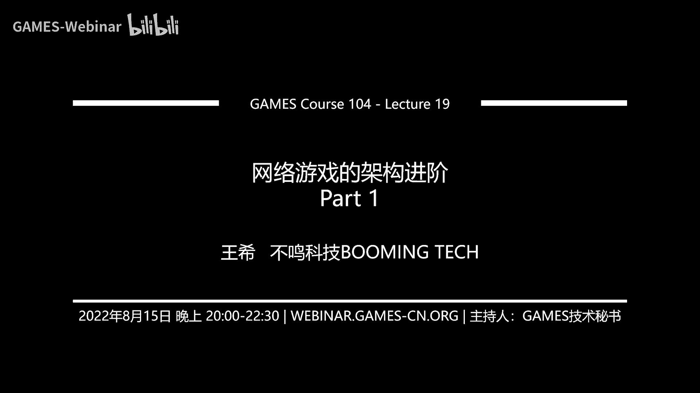
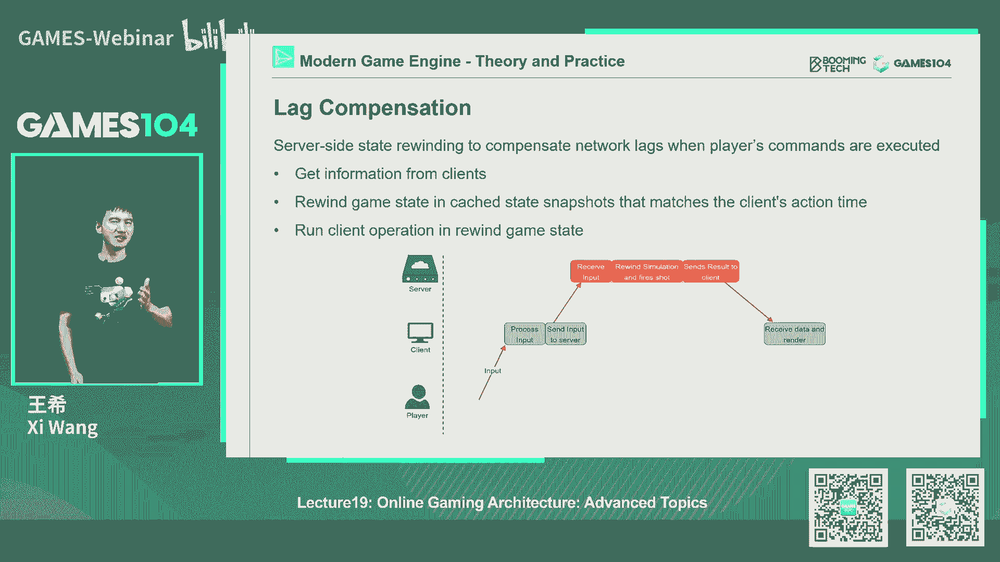
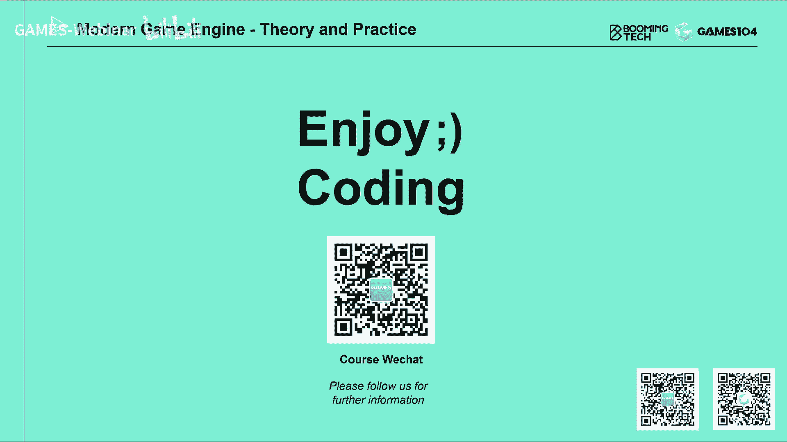

# 课程19：网络游戏的进阶架构 (Part 1) 🎮

在本节课中，我们将要学习网络游戏开发中的高级主题。我们将探讨如何在不同客户端之间平滑同步玩家的移动，如何实现可靠的命中判定，以及大型多人在线游戏的基础架构设计。这些知识是构建一个真正可玩、体验流畅的网络游戏所必需的。

---

## 角色位移同步 🔄

上一节我们介绍了网络同步的基础概念。本节中我们来看看如何让其他玩家在你的客户端上移动得更加平滑自然。直接根据网络包更新位置会导致角色“抖动”，因此我们需要使用插值技术。

### 内插值

内插值用于在已知的过去数据点之间生成平滑的过渡。在网络同步中，我们通常将服务器发来的状态数据缓存一小段时间，然后在两个已知状态之间进行插值。

以下是实现内插值的一个核心思想：

```cpp
// 伪代码：在缓冲的状态间进行插值
Vector3 InterpolatePosition(State previous, State next, float currentTime) {
    float t = (currentTime - previous.timestamp) / (next.timestamp - previous.timestamp);
    t = Clamp(t, 0.0f, 1.0f); // 确保t在[0,1]范围内
    return Lerp(previous.position, next.position, t); // 线性插值
}
```

这种方法的好处是移动非常平滑，但代价是增加了额外的延迟，因为客户端需要等待未来的数据包才能开始插值。

### 外插值

当内插值带来的延迟不可接受时（例如在赛车游戏中），我们会使用外插值。外插值本质上是预测：根据物体当前的速度和加速度，预测它未来的位置。

一个著名的算法是 **Dead Reckoning**，其核心思想是预测并追赶目标的真实轨迹。一个简化版本是 **Projective Velocity Blending (PVB)** 算法。

以下是PVB算法的核心公式描述：

1.  **预测目标真实位置**：根据最新收到的网络包（包含位置 `P0'`、速度 `V0'`、加速度 `A0'`），预测经过固定混合时间 `Tb` 后，目标的真实位置 `PT'`。
    `PT' = P0' + V0' * Tb + 0.5 * A0' * Tb^2`

2.  **混合追赶**：在本地，从当前模拟的位置 `P0` 和速度 `V0` 开始，在时间 `Tb` 内，通过线性插值，使其位置和速度逐渐与预测的真实轨迹 `PT'` 和 `V0'` 重合。

这种方法能让本地角色快速追赶并贴合真实轨迹，但预测可能出错，尤其是在发生碰撞或急转弯时。

### 应用场景与混合使用

-   **内插值** 常用于角色移动灵活、瞬时变速多的游戏（如FPS、MOBA），因为它稳定且平滑。
-   **外插值** 常用于运动符合物理规律、预测相对准确的游戏（如赛车、飞行模拟）。
-   实战中，两者常混合使用。例如，在《战地》系列中，角色移动可能用内插值，而载具驾驶则用外插值。

---

## 命中判定 🎯

解决了移动同步问题后，下一个核心挑战是：在网络延迟下，如何判定攻击是否命中目标？这直接关系到游戏的公平性和手感。

### 客户端判定

在这种模式下，命中检测完全在开枪玩家的客户端上进行。服务器只进行事后验证。

**优点**：
-   手感极佳，响应即时。
-   服务器压力小。

**缺点**：
-   非常不安全，容易作弊（如通过“延迟开关”技巧制造时间静止效果来瞄准）。

服务器验证通常比较宽松，例如《守望先锋》早期版本会用一个比角色模型大得多的碰撞盒来进行粗略验证，只要子弹命中这个区域即视为有效。

### 服务器端判定与延迟补偿

为了公平和安全，许多竞技游戏将命中判定放在服务器端。但这带来了新问题：由于网络延迟，开枪者客户端看到的目标位置与服务器端的最新位置不同。

解决方案是 **延迟补偿**。其核心思想是：当服务器收到“开枪”指令时，并不使用当前世界的状态进行检测，而是将时间“回滚”到开枪者开枪那一瞬间所看到的世界状态。

**实现前提**：
服务器需要保存过去一段时间内每一帧的世界状态快照。

**工作流程**：
1.  服务器收到客户端A的“开枪”消息。
2.  服务器根据A的网络延迟和插值偏移量，计算出A开枪时的“过去”时间点 `T_shoot`。
3.  服务器将世界状态回滚到时间点 `T_shoot`。
4.  在回滚后的世界中，检测从A开枪位置发出的射线是否命中目标B。
5.  如果命中，则判定此次射击有效，并基于此结果推进世界状态。

这种方法极大地提升了公平性，但实现复杂，且对服务器性能要求更高。

### 无法完美解决的问题

即使有延迟补偿，网络延迟仍会导致一些固有矛盾：
-   **对冲锋者有利**：从掩体后冲出的人，由于他的位置信息延迟到达对方，因此他能先看到并攻击对方。
-   **对躲避者不利**：躲进掩体的人，在对方客户端看来可能还未完全进入掩体，因此仍可能被击中。



为了改善玩家体验，常采用以下技巧：
-   **设计前摇动作**：为攻击技能添加起手动作，为网络同步争取时间。
-   **本地预表现**：在客户端命中时，立即播放命中特效、音效和伤害数字（但真实伤害结算仍以服务器为准），减少操作的迟滞感。

---

## 总结 📚

本节课中我们一起学习了网络游戏开发中的两个高级核心问题。

首先，我们深入探讨了**角色位移同步**。通过对比**内插值**和**外插值**，我们了解到如何根据游戏类型选择合适的算法，让其他玩家的移动在本地客户端上看起来平滑自然，并理解了预测算法可能带来的碰撞检测等边界问题。

其次，我们研究了**命中判定**这个关乎游戏公平与手感的难题。我们分析了**客户端判定**和**服务器端判定**两种模式的优缺点，并重点介绍了服务器端判定的基石——**延迟补偿**技术。我们也认识到，在网络延迟的物理限制下，完全的公平难以实现，但通过精妙的算法和设计技巧（如前摇、本地预表现），可以最大限度地提升玩家的游戏体验。



掌握这些知识，是构建一个真正可玩、可信的网络游戏世界的关键一步。