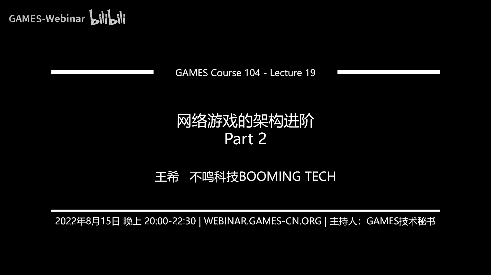
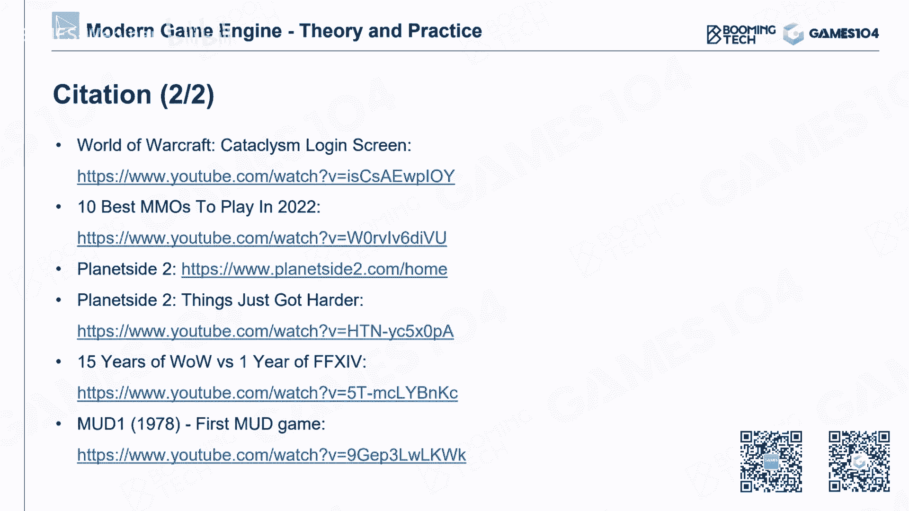

# 19.网络游戏的进阶架构 (Part 2) ｜ GAMES104-现代游戏引擎：从入门到实践 - P1：GAMES104_Lecture19-Part02-3 - GAMES-Webinar - BV1RG411t7TP

那我们接下来开始我们课程的第二部分，就是真正的去讲一个如何做一个mo game，首先的话呢就是说什么叫m game对吧。

m game的话呢其实叫massive multiplayer online gaming，他其实讲的意思就是说我们有很多很多的玩家，然后呢他们在这个多人在一个世界里面去online的连接在一起。

这种游戏其实很多了，大家会想到m是不是都是指的在我们比如说在中国，我们讲mo很多人都觉得是m o r p g对吧，但实际上并不是的，比如现在的无论是这个f p s游戏，其实很多都已经是m了。

就是用户量非常大，那么mo这就是说当玩家online联系在一起啊，这些游戏其实啊很早就已经有了，其实最早的一个这是我们课程组找到的最早的这个networking，连在联网在一起的游戏对吧。

大家一起几个人一起走个迷宫，互相去经济，那么其实呢最早的这个multiplayer这个role playing game的话，其实是文字游戏，哎这个游戏这种叫什么，就是那个叫这个是最早的。

但是我记得我们很早以前玩过一种游戏叫做mut啊，那真是充满乐趣的一个时代啊，大家在那边就是说我进了一个房间，我在桌上捡起了一个碗，然后门的那个房间的左边有个门，房间的那个有个桌子，桌子前面坐了谁。

你是上去跟他讲话，还是决定出门推门而出对吧，哎真的是玩的大学时代，那个时候真的玩的不亦乐乎对吧，ok所以说其实呢这就是online游戏，它这个最早的雏形。

其实online游戏真的是个非常了不起的一种游戏类型，就是猫猫这种游戏就是说它真的让用户能够连接在一起，我们第一次能够在一个cyberal word里面能够感知到彼此，所以随着这么多年的发展的话。

其实现代的m o的话已经变得非常的丰富和完善了，就是说今天我们去进入到一个m游戏的时候，我个人的感觉啊，那其实就是一个小的虚拟世界，我个人还是蛮认可鸡胖讲的那句话，就是说现在很多人讲什么元宇宙什么的。

他就说你们这些讲元宇宙的人，你们还不如打打游戏呢对吧，如果你打打这个我们mo游戏的话，比如说你打个final fantasy对吧，你就知道了，那个那你们你讲的很多东西人家就已经有了呀，对不对。

在那里面就是在梦的世界里面，我们就可以进行星空探索对吧，我们也可以进行这个一起去挖矿，一起去做什么各种很有趣的事情，所以说实际上的话呢，就是现代的m游戏的话已经变得极为复杂和丰富了。

那么其实呢他和一个单独的做一个gameplay，比如刚才在前面我们教大家更多的是说诶，我们一个session就是一个战斗里面，我们怎么去玩呢，就大家怎么去战斗。

但是我真的去构建一个这样的一个网上的这样的一个虚拟世界，能够让几10万上百万的人能在这个世界里面彼此连接，一起进一起下战场对吧，一起在这个主城里互相能看见，而且在这里面的话，我们还可以互相对话。

互相交易，这样的一个游戏世界该怎么去架呢，哎今天这个section的话呢，我就给大家简单的讲一下这个结构，其实呢如果要解决这个问题，其实你会发现一下子多了很多的子系统。

比如说我们就需要对很多的玩家数据进行管理，我们需要user management的这个系统，我们的这些玩家在一起，我们要去匹配对战或者一起下副本对吧，我们需要一个matchmaking系统，对不对。

然后呢我们还有什么呢，我们彼此之间还有能交易对吧，我们有的交易甚至是会牵扯到大家真实世界的货币，那就是非常严肃了，对不对，就大家知道在网游里面的话，如果你的道具被偷了的话。

这个有的时候严重的时候是会直接产生法律责任的，为什么，因为它实际上是有经济属性的，所以说他的确定系统可能也要做得非常的严格，要保护好玩家们的安全，另外一个的话呢，我在这个世界你们还跟别人交好友啊。

我要跟他去聊天啊，对不对，我还可以组织更重要的这个社群啊，这种公告啊，所以说诶我还需要一个社交系统，那最后呢我这么多的数据存在，那我们还有一个data系统存在，这大家会发现没有。

就是说从一个单纯的只是构建一个小小的那个游戏的一个场景，我们在彼此去玩，去打一个session的时候，真正你做一款mmo的时候，实际上这个系统就会变得非常的复杂，它有很多的subsistence构成。

那这个系统会以什么样的结构在一起呢，这边的话呢是我们画的一个非常简单的一个m的architecture，那么在这最上面的话呢是各种各样的玩家对吧，玩家连接到我们这个世界里面。

那首先的话呢有一层叫link层，就是连接层，连接层干什么呢，就是说哎这么多用户他要login到我们的世界里面，他还有个login server对吧，它还有一个叫gateway，待会我给他解释。

就这一层就是我们把用户的所有的链接管理好，然后接下来有很多的服务了，这些服务层的话呢，它就会提供各种各样的服务，比如说账号那个就是你的房间那个大厅服务啊，你的每一局对战的服务啊对吧，你的社交服务啊。

你的这个存储服务啊等等等等等的这些服务，然后最下面一层是什么呢，有真正的数据存储层，有各种各样的db，就数据库那个那个数，以数据库为核心构建的这样的一个数据存储和服务层。

所以你可以看一个就是一个网游的架构啊，大概就是三层，这三层是最核心的，那么首先的话呢从一个最简单的就是呃也不叫巨匠，其实挺复杂的，就是这个这个连接这一层来讲，有两个概念。

可能是大家没有做过网游的人没有概念，第一个就是我们要做一个login server，就是我们那么复杂的这个就是这个游戏的m的服务器，它本身是一个一定要被保护起来的一个这样的一个东西。

所以呢所有的用户不是直接往服务器里面去连的，他都是要先跟我们一个叫login server训练在那里面干嘛呢，诶我们要完成链接，我们要完成握手，大家还记得我们前面讲htb对吧，其实在真实的时候。

我们一般会用http s吧，我们要经过更安全的信道的去加密，我们连到一起，我们要验证你的什么账号密码，这样我才能允许你登录我的游戏，好，我允许玩家你登录的，你假设用的真实的账号密码的时候。

我是不是就允许你直接开始跟我的各个server去token呢，诶不好意思，绝对不行，这个时候你要做一个叫晚关服务服务器的服务，这个叫gateway，为什么要做这个gateway呢。

其实大家一般会讲很多关于gateway的功能对吧，gateway有很多功能，我待会会讲，但是gateway在你从最至少是我个人的一个理解，它最核心的作用是什么呢。

也就是说用户他永远只跟gateway去talk，而gateway才会负责和内部的，比如说character server，角色服务器啊，lobby服务器啊，就是大厅服务器啊，什么邮件服务器去t。

大家想想看怎么去理解它，其实非常简单，对不对，它就是一个防火墙，也就是说因为虽然你有正确的账号和密码，假假设你这个黑客，你是不是会给我发很多很奇怪的数据，尝试去这个破解我的服务器的很多东西呢。

那么gateway它实际上就会去验证你跟我所有的信息的合法性有效性，比如说像游戏服务器，有的时候会遭遇一些比如像ddos攻击对吧，那gateway这边的话其实要有一定拦截的功能。

但是呢ddos更复杂的时候有更复杂的机制，我我的解压缩这些所有的操作其实都在gtav里面做完了，而gtav的话实际上工作任务是很重的，所以说很多时候无论是这个gateway的话，一般都会同时开很多个。

随着你玩家的数量越来越多的话，越开越多，他们你可以理解什么呢，他们就是大厅接待员对吧，他来去接待你们这些所有人，真的就是服务的这个这个怎么就跟那个你们去那个啊，比如说某一个公司这些人是提供服务的。

这些我们叫客服客服团队，他提供了所有的客服好，那么你有了这层link 3的话呢，哎接下来你就进入了游戏大厅，大厅很多时候呢它其实就是一个游戏，一个场景。

其实你可以认为就是大厅实际上就是一个特殊的游戏模式，只是在这个游戏模式里面的话，你不能放技能了，你不能跟别人去那个打架，但其实有的大厅里面，比如说玩家可以在主持人里面彼此去决斗对吧。

那可能这里面还要允许一定的这个就是玩家game play的功能，但是大厅呢很多时候会作为一个缓冲池，就是说让玩家在等待这些，比如说match making的时候，彼此之间能够被管理起来。

就是其实有的时候大厅它不一定真的是一个场景，有的时候就是个虚拟的大厅也是有的对吧，是不是也有一个虚拟的大厅啊，大家在里面玩的也很开心对吧，before，我们真的进入到一一局的这个游戏里面来。

那接下来的话呢就是大家不太熟悉的叫character server，其实在网游里面啊，就是用户的数据其实是非常多的，就是大家可能想象不到，就是说一个你你的一个角色，他的数据量肯定达到几兆甚至几十兆。

因为大家想想看，我如果玩一个游戏，我在这个游戏里面，我发生的所有的事情，我获得的所有的道具，我以前完完成了哪些任务，这些数据大家一开始觉得不会多，但是随着我们的游戏时间增长的时候，这些数据会越来越大。

而且这些这些数据的话呢，它会被各种各样的这个server都会去问，那这个时候的话呢，如果这些数据分散在比如说又是战斗的server里面去，又是交易的server里面去，又是聊天的server里面去。

那是不是这个数据就会708落，谁也管不了了，对不对，所以呢一般在网游里面有一个专门的叫character server，它其实负担特别重，他就会管理所有的玩家的真正的这个属性数据，而且这个数据的话呢。

它就相当于说你无论是发邮件也好，还是这个战斗中，比如说对方那个获得了某个道具交易成功了对吧，获得某个道也会战斗中，诶我我我这个突然受了一个很重的伤，那这个时候哦对这个有的时候不会马上同步与carry。

但是的话比如说我要问一下，我现在是不是装备了什么什么什么一个道具，那这些东西的话呢其实都是character server要完成的这个这个任务，那么接下来就是大名鼎鼎的这个交易系统了，那交易系统的话呢。

这个讲起来就很多了对吧，我们不展开，但是呢其实这里面大家记住有一个重要的属性是什么呢，就是交易系统它是有非常重的，我们叫做啊就是这个金融属性的什么意思，就是说你去写它的时候。

要求保证它的安全性是足够高的，每一笔交易要保证它的绝对的原子性和安全性，全部都要可以roll back，这样的话就是说这样去保证就是在任何的情况下，打个比方。

比如说啊对方的client交易到一半突然断断线了对吧，或者服务器突然发生了什么异常的情况，那么我们做的每一个transaction，它都能够被准确地记录下来，而不会出现我们担心的各种各样的异常的数据。

所以说这个地方的话呢，就是当我们作为一个m游戏的时候，这一点是非常重要的，那接下来也就是大家经常熟悉的这个搜索系统，那基本就是聊天啦，邮件啦，其实其实在网游里面的话，这些系统还是非常的重要。

而且它写起来其实并不简单，因为即使在一个小小的网游里面，我们还有一个叫什么拉黑别人的功能啊对吧，我还跟几个朋朋友一起组队啊对吧，开小群组聊天啊，分很多的频道啊，实际上依靠网游的这个搜索系统也是很复杂。

甚至有的时候比如说邮件有专门的邮件server对吧，诶他这个就分得非常细，为什么呢，因为你如果把它全写到一起的时候，当很多很多人同时在彼此发邮件，彼此聊天的时候，你一个单一的server它可能就会炸掉。

所以说呢哎这个social system也是要分成若干种不同的server，那么接下来还有这个match making，match making，其实对于很多网游来讲是蛮重要的，因为比如说我们做一个啊。

大概比方我们作为一个lgleon这样的游戏对吧，英雄联盟这样的游戏，其实最重要的就是说把不同等级的玩家诶，你全部都要说我要匹配，他要把大家这个这个这个ranking值差不多的玩家。

就是我们讲的这个大家的天梯分差不多的玩家，我们要把它集中到一起，这样的话你玩起来才会觉得这个好像相对公平对吧，那么其实match making的话，实际上在后面做了很多工作，比如说举个例子啊。

就比如说啊，如果我们做一款射击游戏，假设这是一个全球联合匹配的这个联网的这样一个设计游戏的话，其实match max系统是非常复杂，为什么呢，它不仅要考虑大家之间的这个啊。

就是说我们的这个rank值就是大家的那个scale，就是大家的技能是差不多的，我还要考虑你们彼此的延迟，我要尽可能把延迟相近，而且不要那么大的玩家匹配到一起，否则我才能保证大家之间的这个体验是ok的。

所以说其实比如说大家在玩很多moba游戏的时候，很多moba游戏它的match making系统都是最核心的系统，就是要确保所有用户的匹配体验尽可能好，当然这里面有个有一个特殊情况。

就是如果你远程的跟你的队友开黑的话，那他就没办法了对吧，那你们强行要在一起，那我只能配合你们了，对不对，但是呢一般来讲在匹配系统里面，如果你开黑的话，他一般会把开黑的玩家扔到一个单独的池子里面去匹配。

因为你开黑了，我真让你匹配那些开黑的人，否则那些人不公平对吧，你看这里面就是设计一款网游的时候，他考虑的东西其实还是蛮多的，所以那接下来的话呢也是一个大家以前可能不会太注意到的，一个网络游戏的一个架构。

就是数据的存储诶，这个东西其实啊就是大家想想看，如果我们要构建一个online gaming的世界的话，这个世界它是不是一直要存在的对吧，那我我的电脑，我的游戏可以关掉，对不对，但是服务器是不能关的。

而且这里面的数据随时随地都会去产生啊，这这这里面产生大量的数据，谁来存它，谁来保管它，谁来负责去调用它，所以其实在这个就是online game里面的话，数据的存储设计是一个非常核心的设计。

所以今天的这节课上的话呢，我们只能给大家点一下皮毛，比如说一般来讲我们会有三类的这个数据存储的这个服务，第一类的话呢就是这个关系数据库，比如像大名鼎鼎的micro对吧，如果你有钱。

你可以用oracle对吧，但是好像我很少听到网游会用oracle的，那么anyway，就比如说我们举一个mysql这样的一个一个数据库，那我们游戏中很多的核心数据，我们都是用这种关系数据库存储的。

但这里面其实讲起来就比较深了，就是说实际上在你一个网游的这个海量的数据面前的话，我们实际上采用的架构是类似于分布式数据库的架构，就是你同时写的时候，我会写到好多个并行的表里面去。

这样确保就是说诶我写的效率图的效率足够高，而且万一有一个服务器这个挂掉了之后，我的数据不会丢掉或者不会毁坏对吧，还有什么冷热表呀，还有这种各种各样的。

这个就是说我们的这个叫这个这个这个这个为在灾难备份啊，这些东西其实都是这个就是说做游戏的数据存储的时候，很核心要解决的问题，那么其实最早期的网游你们用的最多的都是关系数据库，但是呢随着游戏的发展。

你会发现一个很有意思的事情，就是说你会产生很多呢没有，那么需要严格的就是a你用关系数据库的逻辑，就是诶我一句query的才能获得的数据，为什么呢，因为关系数据库它首先存储的负载还是比较重的。

因为你一个数据存下去，他要把很多的建制建立一个他自己的关系表对吧哈希好，这样的话你用各种carry组合它才能查得到，但是很多时候比如说假设是我游戏里面最重要的log信息对吧。

大家知道一个游戏里面一天能产生的log，可以以这个tb为单位产生它的log，但这里面的话呢我经常又要去对你们的数据进行query，但这个query的话呢又不需要特别的及时。

但是呢我确实对这个数据要进行一定的检索，这个时候呢就是非关系数据库，它访问速度更快，更清亮的这种数据库又提上了用那个我们的这个那个需求，这个清单里面，所以比如像芒果db这种低轻量db诶。

非关系数据库它又起了一个用处，所以说其实在游戏里面很多临时性的game state啊，或者说一些logging的信息呀，特别是game state，我们基本上就用非关系事故直接往里面去当铺。

这样的话它形成一个非常大的一个数据集，但这个数据集的话呢，其实我们不需要那么高效率的，也不需要非常复杂的去查询，但这个数据对我们其实是有用的对吧，那现在再多讲一句，现在有的时候我们会用到。

比如像数据仓库也能够去处理m所产生的海量数据，大家可能没有感觉，就是说如果我们真的做一个m的话，实际上他每时每刻都会产生海量的数据，大家打个补偿，比如说你玩一个网游，如果你发现你的道具丢了。

你打电话给客服诶，客服小姐姐会说啊，你跟我说说你的角色id，你这个是因为什么事情丢了，那他可能过一段时间就真的能把你那个道具给你找回来对吧，那为什么呢，就是因为他要在这里巨量的这个数据里面。

这个log里面这个尤其state的这个这个这个村这个cash里面，把你的这个状态找到验证，你说的事情都是真的，然后把这个道具还给你，实际上这对于一款网游来讲也是非常重要的。

那么最后呢就是这是现代游戏中用的也越来越多了，我们叫做in memory storage，就是说叫内存数据库，这是一个现在比较啊还比较新的概念，其实也不算特别新吧。

就是说我们发现随着游戏的系统变得越来越复杂，比如说一一款这个网游跑起来之后，我们可能有几百个server去从事探跑，那么这些是分布在我的内存中，那实际上呢我会产生很多的游戏的中间数据，这些数据的话呢。

如果我只是road扔在哪，那么我们对它的查询和管理都会非常的复杂，这个时候其实我们需要有一个效率非常高，能够帮我们把这个数据管理起来，但是呢他又不会那么重的存写读写磁盘，因为读写磁盘就慢了嘛，对不对。

那我们只需要在内存中把它保存下来的这个数据，说那个数据管理的工具，所以内存数据库的话呢，现在在就是游戏那个游戏的服务器端架构中也是越来越这个popular，那这件事情的话。

我个人倒是蛮推崇这个内存数据库的，因为它实际上当你去你想想看我们有那么多的server对吧，这个然后这些server中间一些中间数据公共数据怎么存储。

其实用一个内存数据库可能是一个更好的更整洁的一套处理方法，所以说的话呢这个其实就在我们的一个做一个online game的时候，你真的做一个m的时候，你会发现数据存储这一趴其实非常的复杂。

所以说就像我们最早在讲做游戏引擎的时候，我会跟大家讲说，你要先从数据结构开始去思考，其实当我们去架构一个mm的这样的一个网络服务器的架构的时候，我会建议是从数据开始思考，因为你把数据想清楚了。

你上面的各个系统的结构它也就清楚了对，所以说这其实就是一个m的一个大致的框架，那么这个框架呢基本上你是能做一个诶，有点那么意思的网络游戏了，但是呢这个好日子一般都不会长久。

如果你的这个游戏引擎做的非常的好，上面做的游戏也很成功，你接下来会遇到一个什么问题呢，诶你就会有越来越多的玩家加入你们，当你面对了1万多个玩家的时候，你觉得还好，我一台服务器就能扛得住对吧。

当我面对的是，就比如说10万个同时玩家同时在线，假设你很厉害，你做了一个百万玩家同时在线的时候，你会发现你的服务器根本不可能，无论你怎么优化，你都看不出百万很夸张了，比如说就10万玩家在线的时候。

你的服务器可能就扛不住了对吧，那这个时候你该怎么去做你的架构去处理这件事情呢，那其实解决方法就是分布式的系统，也就是说把服务器的各个服务把它变成就是可以用多个进程，同时帮你满足的是一个分布式系统架构。

而且分布式系统里面这些服务我可以加可以减对吧，那这样的一个架构如果做好的话，那恭喜你，你的这个服务器架构呢它就开始有弹性，所以说如果我们要讲大家要做mmo的话。

就是massive multiplayer对吧，我们既然lan我们是massive multiplayer，那你就可能要考虑分布式的架构了，好那分布式的架构呢其实是技术原理上讲还是蛮简单的对吧。

比如说我前面举的cart server对吧，我同时管理在rt里面就1万个玩家的属性的话，那我一个进程就可以了，但是现在我假设同时有10万玩家登录的时候，我管理10万玩家的数据的话。

那我一个进程可能就一个cpu就吃爆了对吧，那我就可能必须要拆成十个服务好，这个时候呢你就要解决很多问题了，比如说同样一份数据不同的就是就分开来的这service访问他的时候，他彼此之间不会冲突。

不会产生这种竞争啊，不会产生死锁，对不对，然后呢，当你网络发过来的消息的时候，有的时候因为这这么多服务，他可能说不稳定嘛对吧，那你这些消息冗余的发过来的时候，你能不能保证这个处理的叫密等性对吧。

那密等性的意思是什么呢，就是说一个消息发了冗余了之后，你也不会出现异常，你能够自动地把那些荣誉的信息给过滤掉，执行你正常的逻辑，而且你的系统一旦分布式的时候，中间总有地方会挂掉。

那你挂掉之后也不会影响你整个的逻辑，其实当你真的做一个mm的分布式系统的时候，那你的服务器各个服务，网络链接出现各种各样的问题，这就是你的日常，所以我们经常说什么什么某某大厂是土豆服务器。

这里面要跟他们去这个小小的替他们解释一下，就是说如果真的要做一个鲁棒的服务器，这件事情其实是很多东西都要考虑的，否则的话你可以把业务逻辑做对，但是呢它的健壮性就是有问题的对吧，还有什么呢。

就是说如果我把这个服务分得特别开的时候，如果有一个服务产生了一个bug之后，如果不去做好必要的防护的话，这个bug可能会在整个这个分布式的系统里面来回的震荡，震荡也就算了，还会什么呢，还会放大。

这个就是本来是一个小型的bug，如果在在第一个服务里面没有被及时的给他，就是检测到，并且把它按掉的话，那这个错误的数据可能会传递到另外一个服务，另外一个服务面假设没处理好，他会把这个错误再放大。

然后再传递出去对吧，r p c互相调来调去，有甚至有可能会出现什么情况呢，就会在这个系统里面无限的震荡，唉这个情况我讲的不是这个编出来的，其实在就是真的实战型的网络游戏团队里面，他们真的遇到这种bug。

就是一个很难被检测到了，低频的一个bug，一旦他开始在系统里震荡的时候，首先你很难发现它，但是它会导致你服务器的性能急剧的下降，然后大家只能把那个rpc dump下来看。

发现有一些rpc很诡异的被吊了无穷很多很多次对吧，这就是一个我们讲就是我自己蛮喜欢一本书，叫复杂系统嘛，就是说其实当我们构建一种分布式系统的时候，你实际上用的整个架构思维方式就是复杂系统的范围了。

那在复杂系统里面确实有这种震荡的这种现象的存在对吧，那么你把服务分得这么开的话，你还要解决什么呢，还要解决他们彼此之间这个形成了各个业务的它的数据的一致性对吧，就是同样一个业务我们处理完之后。

a的服务和b的服务产生的结果必须是一致的对吧，这样的话呢我们才能保证整个业务的这个绝对安全，所以这里也不一展开了，就是说当你把一个简单系统一旦变成分布式系统的时候，实际上就会对你代代码的安全性鲁棒性。

而且他的这个这个要求就会高很多很多，但是它的好处也是显而易见的对吧，那么一旦我们有了这样一个分布式系统的话呢，哎我们就可以把load去balance去，就刚才那个例子。

比如说我的character server对吧，我要同时管理1万个在线的这个玩家，我可以把它分成十个，这样每个人管1万个诶，我觉得能处理好了，对不对，那么这里面就有一个叫负载均衡的概念了。

那为了解决这个负载，为了实现这个负载均衡，实际上有一个很重要的这个这个算法，这个大家可以就是关注叫什么呢，叫一致性哈，希他怎么去解决这个问题呢，我们先讲还是举刚才那个案例，就是假设我有1万玩家诶。

我现在有一个有有一个有一局战斗正在如火如荼地进行，这个战斗里面的话呢，我这个玩家想这个这个获取了一个道具，这个道具的话呢再捡到了，捡到了之后呢，那我就要写到玩家的数据库，对不对，那我按照我们的说法说。

这个玩家的数据应该存在哪，应该存在character server里面对吧，少在服务器端，现在跑的是这样的，好，我讲这个角色的i d叫101对吧，或者叫104，我们叫104吧，好好ok。

我现在有十个这个character server s1 s2 s一直在s 10，那我到底这个是我自己是存在哪的呢，那我这个这个这个我这个game server我就一路的去问。

说这个十个server s1 ，我是不是在你这s一说我不是好s2 问是不是我不是，我一路问下去，你想想看这个效率是不是非常的低对吧，那有没有一种方法能让我快速的知道我是在哪个server上。

那大家说很简单嘛，我就分配嘛对吧，我就我就等等比的分配，但是这里面有一个假设的前提是我知道我现在有多少个character，但实际上的话大家如果对游戏有研究的话，你会发现character id啊。

它是不重用的，它会一直去加的，但是真的在一个网游里面，玩家会不断的这个登录，就是增加新的character，对吧，诶但是有一个玩家logo的离开，有些character又会有些数字又是空的。

所以说你多少到多少之间分配到哪一个character server，这件事情其实是不稳定的，另外一个的话呢就是说我们的这个server的数量，比如说一开始只有2万玩家在线的时候。

我两个server就够了，对不对，这是三位玩家的时候，我就变变成三了，你如果一开始约定好说奇数位都属于server，一偶数位都属于sv没问题，但是我第三个server来的时候，哎你怎么办对吧。

你可能这个事情就不对了，那我第四个第五个第六个呢对吧，而且中间假设我又发现这个就是用户量变少了，我又把一些server要释放出来，那我释放的时候，那我那些角色怎么办呢。

所以这其实啊真的大家真的去写一个分布式系统的时候，你会发现其实类似的问题非常的多，这一类的问题怎么去解决呢，有一个很经典的算法叫一致性哈，希它的核心想法其实非常的简单，就是说无论对于服务器也好。

对于play也好，我的设计对应的哈希算法，注意啊，服务器和那个player，就刚才那个例子里面，我设计两种不同的海峡，比如服务器我用你的这个ip地址端口号作为哈希值，我算一个值。

但是呢我映射到比如说0~0到二的32次方减一，这个范围里面对吧，然后呢我把你的这个player id我也作为一个哈希值，我也算出一个也到零的30 30 33，然后呢我把我的服务器放到这个圆环。

我们把这个东西把这个整个数据啊变成一个环，注意啊，只是环就是说零的下一个元素是什么呢，是二的32次方减一，我行那个花为什么是二的32次方减一呢，我假设用integer作为我的整个一个上限去管理它。

我就是用一个int好，那你会发现啊，在这个环上面，这个服务器有一个分布对吧，我的所有的数据它其实也有个分布，那我定义一个非常简单的规则，比如说像逆时针规则对吧，也就是说我所有的cc的数据。

我就逆时针方向找到我最近的那个server作为我的存储，其实这个怎么找的，因为server的数量不多嘛对吧，每个server的k值我知道，所以我很容易就知道说哦，比如说我知道s1 s2 。

我就知道我现在实际上是在哪个server上，我找那个server那个数据我就能找到server存储数据也遵照这个规则，那我假设有这样的一个哈希算法的话，是不是我就能够很方便的把这个数据分配到这个。

就是整各个服务器上去了，而且的话呢但这个算法其实它有一个前提啊，这是我个人的理解，就是说你的这个哈希算法是要认公式，是要认真设计过的，因为那个阿强如果设计的不好的话，对吧。

或者说player分布的过于集中的话，那你这个负载它其实也是不均衡的，这个里面的话其实是啊，后面还有别的方法可以优化的，但是这个其实是一个基础性的要求，那么好，这个时候如果我删掉了一个server对吧。

我们先讲个简单的case，就是删掉一个server，那其实它非常的简单，就是说诶假设这里面我把s2 退出去了，那在s一和s3 之间的那些就是原来放在s2 上的那些server。

它就顺眼的按照逆时针方向找到他下一个server，那找到的是谁呢，他找到了s3 ，那这样就意味着我把s2 以前的那些character全部扔到s3 就好了，他这个算法就是这么淳朴，同样的道理就是反之。

如果我们增加了一个server的话，是不是就相当于在这个圆环中我又加一个这个这个中间的那个server节点，然后呢这样我就把这个珍珠的话在中间又分开了，其实你想想看。

不就是一个珍珠中间无限分的一个问题嘛是吧，所以它非常的简单，那这个好处是什么呢，就是说它为什么叫一致性哈希呢，就是说只要你的player的这个哈希算法哈希函数和server的哈希函数，只要定下来之后。

那我不需要进行任何的rpc的cory，我就能知道就是你的每一个player到底属于哪个server，这个事情就是他就把一个一个一个复杂问题变得非常简单了，因为大家知道就是在真实的一个服务器架构里面的话。

如果我我让每一次都去问轮询一遍，所有的server说诶我在不在你下面的话，这个成本其实是非常非常高的，就是它的成本，一个是rpc本身的成本，大家想想看r p c怎么怎么发生的，对不对。

我的这个这个指令对吧，先要去serialize，然后呢网络传输那边还有deserialize，然后呢出去之后，而且一般来讲一次cos是两次rpk，我先去问一圈。

过一会儿等他另外一个rpc回来告诉我说哥们儿你到底是在还是不在，所以而且他你真的去问他的时候，那边的话大概率会做一个query，那做一个就是比如说至少是啊log n的一个复杂度去，才知道我在不在你上面。

所以这个其实也是这个就是说一致性哈希的一个很好的地方，那么回到刚才我讲的这个哈希函数呢是很难设计的，特别好，可能会出现就是说诶如果server的数量不够多的时候，就算多了。

所以这里面还有一个简单的算法叫做virtual server node的方法，就是说我会在这个环上，我会再随机哈希出来几个server。

然后呢这些virtual server的话呢又会对这个珍珠进行一个更详细的划分，然后呢我这个vivirtual server，比如说我会映射回原始的server，实际上也能让这个负载相对均衡。

这个就是一个很细节的算法，如果大家真的去用这种一致性哈希的方法去写这个分布式系统的话，大家可以去用一用对吧，但是这个我相信学104的同学，如果你刚刚入学写基础的时候啊。

我不建议大家一上来写这么复杂的系统架构，因为这个架构的话，其实我刚才我一直在讲，就是分布式系统，其实是一个初步想想很简单的一个系统，但是你真的把一个很复杂的逻辑放进去的时候。

你会发现他简直就是一个很简单的功能嘛，写一两个月是很正常的，因为就是写写其实很简单，但是你去真的上线测试，然后各种各样的边界情况处理掉的话，周期是非常非常的漫长的，ok所以我我自己跟大家分享一下。

就是我自己的经验，就是说当我们的引擎写到这一块的时候，我们如果在线上出了一个bug，我每次都说，如果这个bug我能确定的重现它的时候，那这个bug我一定能把它解决掉，但是如果这个bug是什么。

你服务器上线跑了三天之后，偶然的会有一次出现了这个非常恶劣的bug的时候，一般来讲写分布式系统的这个程序员就会非常的痛苦，因为他最恐惧的是说我都抓不住它，真的分布式系统。

所以它的架构对这个大家的这个要求是非常非常高的，那么其实呢如果我们采用了分布式系统的话，还会产生另外一个问题，就是说哎呀有太多太多的服务了对吧，这么多的服务对吧，服务本身还要被管理，为什么呢。

因为这些服务会不断的被创生，刚才我们讲了句，刚才那个例子就是负载均衡的例子里面，你玩家登录多了对吧，我要创建一些什么character server，game server，让你去处理我跟他的业务。

但是呢诶玩家这时候到了半夜了，很多玩家走了，我这服务还得关掉，对不对，而且呢我起了这么多服务，几百个服务，上千个服务，有的服务可能一绕绕到一半，比如说自己产生了逻辑错误，他自己挂掉了，对不对。

你这个别人都不知道，那接下来其他的服务就跟着一起，就是灾难性的雪崩式的，大家就一起崩溃了，对不对，那么其实在这里面，而且呢就是说这么多服务我怎么找到彼此对吧，其实大家如果观察一下。

真的一个啊mo游戏里面的话，各个服务之间的连接啊，真的像一团乱麻一样，我以前特别喜欢用一个词儿叫spaghetti对吧，就是一种一种意大利面的特点，那种意大利面的特点是什么呢。

就是说这个这个真的就搅在一起，你你想吃一根面条是不可能的，你一筷子下去，可能一碗面就直接起来了，那种对吧好，所以这个时候呢其实就产生了一个非常重要的一个需求，就这些服务怎么去管理。

那这里面的话呢就是service management的，实际上就是叫最更专业的说法，叫服务发现，实际上也就应运而生了，这里面无论是阿帕奇的这个zoo keeper对吧。

还是这个etc d e t c d这个名字其实特别有意思，好像e t c是个中国人写的吧，就是那个e t c的话，etc的意思就是好像linux下面的话就是分布式统有这么一个目录对吧。

所以说呢就是啊这个就是有这个目录，所以e cd可能stands for distribute，所以说其实这些工具的话，他就帮你说把各种的服务就是你只要创建好的时候，诶，你通过一个简单的注册流程注册。

因为我我们自己我喜欢用etcd的好，我们就注册到我们etcd里面去了，o好，你有有一段这个它的标识，它的地址，这样的话任何一个其他的服务想找你这个服务的时候，只要用这个标识，他就能找到你对吧。

你可以这个时候呢你去query说这个服务有没有，他会说有，然后你跟他说诶这个服务以物有什么变化，你得告诉我啊，对不对，比如这个服务挂了对吧，这个服务或者有什么异常，你得告诉我，所以你要去卧室。

它e d c d也说可以，没问题，我帮你看着他，只要这哥们儿有什么风水走动，我马上就告诉你对吧，另外一个的话呢，我起了这么多服务，假设有个服务已经挂了对吧，那我etcd演的发现说诶哪个服务内存已经爆了。

他自己就死掉了，我把这个进场给杀了，诶，同时的话呢我会通知所有的观察者，那么如果需要重启这个服务的重启。

其实这件事情的话就是这个service的recovery discovery或者是service的管理的话，实际上当我们在做一个大型分布式系统的时候，是非常非常重要的。

那么对于一个mamoo的引擎来讲的话呢，这也是大家必须要做，我个人觉得就是在未来是大家必须要做的东西，否则的话这个服务器其实挺难嫁的，因为一一款网游的服务器跑起来真的是至少上百个服务吧，要起来。

而且比如举个举个例子吧，比如说房间服务器对吧，大家那个冲进来打一个游戏，开个房间，打个游戏，开个房间，那这个房间就会不停地创生对吧，要加和减，当然有的房间我可以reuse了。

但是这里面的话它的管理实际上是挺复杂的，所以说的话呢服务管理实际上是一个非常重要的一个东西，所以讲到这一块的话呢，基本上我们的一个网游的服务器架构就是这么一个用用了这些工具，但是大家听完这一节啊。

大家千万不要觉得我就能做过网游了，实际上真的去做一款这个mo的时候呢，这里面基本上每一页它都有很多小细节，大家可以在里面去去去思考，实际上大家现在听到这里的话，大家去做一个对战游戏，没问题不大了。

但是你如果想做个m的话，还要补很多，其他的更多的技术细节和知识体系好，那接下来的话呢就是讲一个比较实战的两个问题了，第一个问题就是说带宽要去优化，这个大家会觉得哎我们学了半天做网游。

为什么要学带宽优化呢，因为带宽优化真的非常重要，为什么呢，首先它会和你的这个游戏实战的这个成本息息相关，因为其实网络的带宽实际上对这个就是说游戏的影响特别大，特别大家想象一下，我做一个mm的话。

特别是那种大场景，其实它的数据量是特别大的，就算说ok我不care对吧，我觉得我可以付得起这个网络的钱，但是这里面会产生另外一个问题是什么呢，就是说如果你的数据量不去做优化的。

因为这是网络协议本身保证的，大家还记得我们前面讲了一些网络协议对吧，如果你的数据量过大的时候，它就会产生拥塞，拥塞的话，它就会产生latency对吧，而且呢就是雷特在过大的时候，有的时候甚至有的地方。

比如说有些网关他会主动的帮你把这个网连接给你掐断，因为他要保证，比如说我们进了小区，小区配了一个策略对吧，你这一个人，你的网关需求量太大了，他就把你给掐了，因为什么呢，因为你这样用的话，其他人怎么办。

其他就没得用了对吧，所以说其实对于带宽的优化，其实对于网游的体验来讲是一个非常关键的一个需求，那么怎么去计算这个带宽的，其实讲起来很复杂，实际上也比较简单，就是说第一个玩家的数量对吧。

我玩家到底传输玩家数量有多少，第二个的话呢就是我大概多长时间跟用户做一次数据沟通，那其实对你的数据量是不是也是有影响的，诶那我也问题不大，但如果我每次都更新一大堆数据的话，那显然带宽消耗量已经比较大。

所以其实我们在进行带宽优化的时候呢，我们实际上也就是对这三个点进行优化，那么好，那首先想到的是什么，a就是数据压缩，数据压缩这个事情的话，那就我这边当然大家知道就是有很多ononline的这种。

就是说流逝流数据的压缩对吧，这个呢在有些网游你不会用，但有些网友你们不一定会用，因为还有可能考虑这会让get way的负载太大了，因为gateway本身还要处理很多很多的东西，其实在网游中啊。

最常用的一种数据压缩方法是对这个浮点数转成定点数，也就是说比如说我们表达一个人的位置，大家想到什么是vector 3 x y z对吧，我的坐标对吧，三是什么，三个float。

一个float是四个bite对吧，所以我还要花12个beat能表达一个人的位置，同样的其实vex 3的东西特别多，比如说我的速度，我的velocity对吧，又是个vector 3，对不对。

又是x y z，对不对，whatever都可以，但是大家想想，那我去表达，比如说我的位置的时候，我需要用vector 3，首先在很多游戏里面，比如说我就是个大致基本的2d的一个品牌。

或者说虽然我不是2d的，但是我人都是贴地的好吧，甲这种情况下，那我是不是只要传一个xy就可以了，我可以少一个channel，对不对，好第二件事情就是说如果我这个世界不是特别大。

其实我用一个16位的定点数，是不是就能够把精确到比如说以厘米为单位的这个人的位置呢，其实很多时候其实是可以的，所以呢我们就会想方设法的把一些浮点量变成定变量，比如说我们要表达一个人的朝向。

orientation quarantine的时候，有的时候我们就会用bt 4个beat表达一个人的朝向就可以了对吧，一个或者一个character的朝向，所以这种就是就是那个quantization。

就是说我们把浮点数变成一个定点数的这种方法的话，而且这个实战中的效果是非常非常好的，那么所以呢有的时候为了配合这个方法，我们甚至会对游戏地图进行分区，就是我们每一个区的时候，我们不会把这个区弄得特别大。

这样的话我用定点数存储一下你的位置也好，那实际上就可以表达得非常的准确，所以这件事情的话，大家千万不要小瞧，至少很多时候很容易的就会下降一半以上，那这个其实对网络游戏的这个体验稳定性帮助其实是非常大的。

所以这也是我觉得在压缩带宽，我最想讲的就是，首先要用这种简单的方法进行数据压缩，那么第二种呢，其实哎稍微有点高深了，就是说我们整个世界上有那么多的对象，对不对，那我们是不是要把所有的对象都同步给我呢。

大家会说不需要，为什么呢，因为其实只有一些我关注的对象对吧，比如说我要做开放世界的游戏，方圆这个什么这个几百平方公里，但是他们对我重要吗，不重要，对不对，很多时候我只关心我方圆1百米。

2百米之内的这个情况对吧，那么那个所以的话如果是一个动作，这个这个这个这个近战游戏的话，我可能关注的范围会更小，所以说其实我们只要把相关的物体传递给我。

这件事情我就可以去这个我做我本地的各种game play了，所以呢其实呢这里面就有很多的方法了，比如说我把这个世界分成一个个的这个静态的zoo对吧，把玩家呢放到这个zone里面去。

那这个zone呢打个比方，比如说我们做个开放世界，我们每个市每个区域之间我是用pto连在一起，那put to隔开之后，那我在这个比如说城外发生的事情跟城内就没有关系了对吧。

然后呢我进到一个比如说某一个巨大的building，building进去之后，诶，这样的话我在每一种情况下，我们彼此的这个信息全部都能隔绝掉，这种静态中的方法的话。

就能非常有效地屏蔽掉大量的不必要的这个状态同步好，但是的话呢如果这个世界真的是开放的，我们不希望有photo，就不希望有这种传送门的这种情况发生的时候。

诶有一个很重要的概念叫aa aa in interest就出来了，就是说我们以我自己为中心，就是以每个play为中心，我只需要关注我周围的数据的情况。

唉这个就是大家如果真的有机会加入到一个网游团队的时候，你可能如果你在做这个game server的话，可能你一上来接触到的就是这个m a o i的概念，你在做任何消息的rpc同步啊，做任何的状态同步啊。

结算的时候，你可能首先就要考虑说哎我只和我的a2 区，你们的物体有关系对吧，如果我的一个比如说什么技能啊，我的一个什么开枪动作啊，其实诶都要考虑a2 的这个范围好，那么这个l o l的话呢。

其实讲起来非常简单，最简单的一种方法是什么，就是我给个半径对吧，在我这个半径之内的都是我care的，比如说我们是一个这个这个比如说是一个射击游戏，可能半径3百米，5百米就是我的范围，5百米之外。

我不管了对吧，我的狙只能打5百米，实际上真实的世界狙可以打的很远，但是在游戏里面的话，因为那个空间是被扭曲过的，所以你一般打到5百米之外都已经觉得很远了，那其他的事情我就不管了。

虽然你这个地图可以开放做的无比的大，那最简单的做法就是在整个世界里面进行一个query，那这个query的话啊，如果角色数量不多，没关系，你就暴力运算，但是如果角色数量多的时候，这其实就会有些问题对吧。

那怎么办呢，哎其实大家想到了一个最简单的方法，那个我们的传统艺能就来了，在空间中画格子，是的这个大家千万别笑，在空间的画格子实际上是个非常鲁棒的好用的一个方法，比如说在早期的网游中。

我们最常用的一个尺寸是多少呢，我印象特别深，就是1百米就1百米乘1百米是个格子，然后一个大家如果有幸看一些，就是古典时代的这个网游的这个这个代码的时候，你会发现就是服务器的架构。

很多时候都会以1百米为1百米定义一个zone或者叫region对吧，然后的话呢这样的话我玩家在一个zone里面去站着的时候，诶，我方圆再去扩展两个，我大概这个这个方面你们的这些人我都会去看的到。

所以说的话呢就是说我们每一个角色，我就把它扔到这样的一个nt里面去了，那这样的话呢就是我可以根据这个这个我自己的，比如说我们假设这个人感知的范围是3x3的zone，都是我的a o l唉对吧。

就我当前假设在在这个zone里面，那么我3x3的周围的这个纵都是我关注的，那好那这个时候我这九个字关注了，那好那如果我就形成了一个我的a o l的这个一个列表。

那当有entity进入和离开这个33怎么办呢，哎其实很简单，他给我发一个event就好了，就是说如果有一个人诶进入到这个这个zone的话，那我的event就会被更新，如果我离开的话。

我的我的这个a2 就会被把那个删除掉，反之亦然，就是对于我自己来讲，我进入到一个zone，我我退出一个zone，我也会notify其他人，这一次因为玩每一个玩家进出众都是相对低频的事情，大家仔细想想啊。

听上去好像很复杂对吧，大家仔细想想，大家都知道，其实呢这个频率并不高，因为1百米乘1百米，你在游戏里面自己跑跑，怎么着也得跑个几秒钟对吧，实际上很多时候它只要处理几十个这样的消息可能就可以了。

并不会让大家想象的那么高频，这样大家的每个人的a2 都会相应的得到这样的一个更新好，那么这个时候呢其实就是我们就可以用这种简单的空间画格子的方法。

我们就可以去query到我们的这个就是周围的这个a2 的这个区域，那这个方法呢实际上我们称之为叫一个空间换时间吧，就是说你实际上还要在空间形成一个点状的分布。

有的时候大家会argue说这个格子到底是1百米乘1百米好呢，还是这个更大的好，因为有的时候你会发现就是格子画的太密，那你这个zone就太多了，格子画的太稀疏。

那一个zone里面的character也太多了，你本身的效果也没有达到，所以另外一种方法呢，其实就是诶大名鼎鼎的数据结构里面的方法叫什么呢，十字链表法对吧。

十字链表法其实呢呃说实话作为一个性情很有意思的，对不对，就是说诶我们以这个x轴为方向，假设我们假设空间我们认为是一个2d分布的，这个我们简化一下。

那我沿着x轴把所有的a把所有的那个所有的object去这个排个序，然后呢我再沿着y轴把所有人排个序，那实际上我自己在这个x轴y轴哪个位置，我是不是都知道，然后呢我往两边都去找，那我就可以找到。

就是比如说我说我的这个ai的半径，比如是150米，那我就在x轴上往前走150米，往后走150米对吧，那实际上我就能找到一个圈儿，一群这个一些一些的这个这个nt的id，然后呢我在y轴上做同样的事。

我又能得到另外一圈的id，那么如果你在x轴的那个排序的列表上和y轴排序列表上都满足，都在我的这个这个这个满足的话，就是两个set有两个集合的交集的话，其实这些人是不是就是我的那个aoi。

你们的这个案例挺大家想想十字链表是不是就非常的简单，它就能解决这个问题对吧，那么同样的就是当有任何一个物体在这个世界上去移动的时候呢，实际上呢我就会相应的去notify别人。

我去更新每个人各自的这个ai这件事情也就能完成了，所以呢其实十字链表呢本身啊还是一个非常高效的一个一个算法，那么就是说当当然了，这里面大量的物体都在高速移动的时候，这个14连秒稍微有一个维护的需求。

但其实我觉得你画格子的方法还是用十字链表的方法，都是大家各自的选择，我觉得这里面本身没有什么太大的这个啊，这个这个就是说一定说谁好谁坏，诶我们可以根据你现在所在的位置，我把这个世界我已经预先生好了。

visibility的这个这个set，那这样的话在不在我的p vs里面的东西，我可以不关注，这个其实也是一个更宏观的帮助我们快速的filter out，我们不关注东西的这样一个点。

那么这个对于这种就是说空间分割能力啊，分割感更强的这种游戏来讲会更也更实用一点，所以说其实啊就是a i是一个很宽泛的概念，但是呢在网络游戏做同步的时候，其实如果想降低带宽，是一定要做a i的。

因为而且还有一点，它不仅是降低带宽，其实也节约了，这个是服务器端和客户端的算力，为什么大家想想看啊，你本身要处理要对逻辑状态进行更新，大家想想这个负载是不是很大对吧，而服务器端就更惨，把它传送出去。

所以服务器端那边的传输的压力，其实你有时候你去理解一下网游的服务器端的话，很像什么呢，我自己的感觉像是一个快递公司，你知道吗，然后每一个这个一client像是每一个家庭住址，然后呢那个服务器端就很惨。

然后呢pp的发给每个不同的地址，所以服务器端其实非常的辛苦，所以我们自己玩游戏的时候，我们觉得很简单对吧，我们在一起能跳能看，但实际上真的要大家去做引擎的底层去实现这个功能的时候。

大家会发现它其实还是挺复杂的，很多的细节好，所以呢其实啊即使我们有了这个a i的这样一个东西啊，实际上在一真正的网游设计中的话呢，我们还有一个方法就是我们会降低这个server的这个传递数据的频率。

其实这里我们会用到一个细节，就是说特别是对于那种啊，比如说近战型游戏或者什么游戏的时候，我们会把月在近处的jus，我们的这个object传自动频率会略高一点，比如你身边突然疾驰过的一辆车。

跑过去的一个人，那稍微远一点，比如对方已经在50米开外，比如说三次两次对吧，比如说1百米开外，我每隔一秒，比如1百米到2百米开外，我每隔一秒同步一次，如果对方没有进行过多的急转弯。

因为其实前面讲了那么多的差值和外差的算法，它基本能保证这个东西的平滑的运转，而且那么远的地方你不一定注意到，所以其实在真的这个网络游戏的这个架构里面的话，我们会做这样的一个策略。

就是说根据它以我主体的远近，我们会调整这个信息同步的频率，这样的话才能够让这个带宽最大利用，最大效率的利用起来，所以呢这个就是对带宽的这个优化好，这段讲的稍微的有那么一丢丢的枯燥。

但是同学们要这个不要在乎他枯燥，他真的很实战，如果你真的做做一款网游的话，这个能帮助你真正的节约你的这个运营成本好，接下来讲一个大家会比较感兴趣的问题了对吧，首先的话呢是高能警告，就是说这个反作弊对吧。

还是这个这个这个这个这个非常高危的一个行业啊，就是说大家千万不要把nt去掉了，搞作弊了，作弊你就完蛋了对吧好，那为什么反作弊这件事情非常重要的，首先我们大家都在玩网游对吧。

我想想谁在以前玩单机游戏的时候，我们有没有谁没有用过这种各种作弊神器呢，反正我承认我用过对吧，但是呢当我们去玩网游，网游的时候，一旦作弊的时候，对游戏也好，对玩家也好，都是巨大的伤害的，游戏就不用加了。

对不对，对于玩家来讲，这个我们会有个调研会告诉你说这个这是一个stea的一个调研，他就说70%的玩家如果发现别人在作弊的时候，他就不想玩这个游戏了，确实是这样的，就是这很奇怪。

就是我我自己玩单机游戏的时候，我可以作弊，修改我的血量，修改我的这个金钱，但是我玩网游的时候可以我作弊，但是我受不了别人作弊，所以作为任何一款online gaming的时候。

反作弊是一个非常非常核心的一个系统。

这是必然要面对和解决的问题，但是呢其实呢因为它变成了一个online game了，那么作弊就会变得特别特别的，这个怎么说呢，用一个词儿叫vulnerable，就是你会变得非常的脆弱。

这个黑客会从各种角度来攻击你，比如说它可以直接修改你游戏的带那个那个主体，它把你的内存给你改掉对吧，甚至给你注入一段代码，你怎么办，这个就很麻烦，甚至把你的客户端给你破解掉，这个就很痛苦。

那么他也可以不动你的客户端，他把那个系统的底层d k给你破解掉，比如说最著名的一个叫透明挂对吧，怎么怎么怎么做的，他可以这样。

他把d3 d的就是这个rendering sdk的底层的那函数入口给你重载掉，所以当你一旦扩一些，比如说画一个画面片，画这些东西的时候，它被你全部变成线框了，所以在这个线框的世界里面。

所有的东西就一目了然了，对不对，类似于这样的东西，就是说你根本防不胜防，那这样的话，比如说大名鼎鼎的某某精灵对吧，它就能解决这样的问题，你你你还真的是很难去提第二个，然后呢还有什么呢。

就是说诶我不去动你的这个系统，我也不去注入到你的这个这个你的客户端，但是我干什么呢，劫持这个事情，甚至可以用第三就第三台机器把你的网络通讯给你劫持掉，这样的话我给你发一些假的消息对吧。

那么这个时候其实你也会产生很多的作弊的方法，所以说其实啊作弊他真的是很难很难防的，那这边我就一次跟大家讲一下，就是作弊的各种各样的点，比如说第一种就是我去查内存，其实大家会发现就是说在作弊里面。

我们很多说要抓这个用户的数据嘛，其实最简单的方法就是说我去定位内存中，哪个数据存的是你最敏感的数据，然后我把你这个数据给你改了对吧，因为特别是很多在客户端做校验的这种啊，游戏逻辑的话。

实际上很多作弊器都是在你客户端找到你的数据，把你这个数据改了，所以这个方法呢对于单机游戏比较有用，比如说我们以前玩一些单机游戏的时候，我们会用这种方法去锁定我的血量，找到我的血量内存内存值，那怎么办。

我就会一直改它对吧，那这样我就会在我服务器端产生很多的，那个就是如果啊这个我的数据就一直不变，但这里面怎么办呢，其实很多时候我们可以给客户端诶，我们给客户端加个壳儿，把客户端加密。

然后呢到你这个游戏运行起来的时候，我实时的在内存中把这个客户端给给这个解掉这个壳，然后我这个ex可以运转了，这件事情呢它本身呢应该来讲是非常复杂的，是专门有公司给你的客户端加一个壳儿帮你保护。

特别是你在做刚才我讲的，比如说我做个设计游戏，我这个设计游戏是用的client side detection的话，那事实上我的客户端的保护反防止被别人注入，是我最核心的一个需求。

那么我相信就是很多游戏其实是做了这个房屋的，但是我跟大家讲一个很悲观的现实啊，至少以我所知道啊，几乎所有的客户端加壳的这个这个服务好像据我所知都被别人攻破了，我也不知道那帮人怎么那么强。

但是如果因为你要是有真的客户端加壳的很好的软件的话，我肯定是第一个用的，但是实际上是非常的难，那么这里面呢还有一种方法叫什么呢，其实叫内存混淆，什么意思，就是说呃我可以把我最关键最敏感的数据。

我不希望那个就是那个那个写外挂的人抓到的话，我可以对它内存进行混淆，刚才有同学问我说那个真同步的游戏怎么样防止别人作弊对吧，其实真同尊同步的游戏，防止别人的就是偷窥嘛对吧，你看到很多。

你不要看到这个信息嘛，那其实有一种策略就是内存混淆，就是把我高度敏感的game play数据在内存中进行加密，只有在用的那一瞬间给它给它给它读读掉，然后再写进去的时候呢，我又把它再变掉。

但是呢好像这个东西啊比较难破解，但是好像也有人能破，我也不知道，反正对吧，民间的高手实在太多了，所以的话呢简单来讲的话，就是你要想方设法的把你的这个程序保护起来，那也会把你的这个内存也保护起来。

那么另外一种的话作弊的方法是什么呢，就是说诶我去修改你本地的文件资源，打个比方吧，比如说我做个设计游戏，我帮你把这个贴图资源全部改掉对吧，比如像这个吃鸡游戏，我把你本地贴图都改成发光的这个材质好了呀。

那你里面看到的所有的敌人，所有的目标都非常的一目了然对吧，这个你你穿一身迷彩，你趴在地上对我来讲都是无视了，我就直接把你打掉了对吧，那就相当于直接开了地图透视挂，那这种问题怎么去解吧，解解第一个解决呢。

其实啊一般来讲是用那个本地文件哈希值，就是说我要求你的客户端不停的去算以本地的资源文件的哈希值，然后把这个哈希值传上传到我的服务器，跟我的服务器的进行比较，如果我发现你这个哈希值不对。

我认为你篡改了我本地的数据，那我就把你直接踢下线了，那这个其实是一个啊，基本上现代的online gaming的这个引擎啊都会做的一件事，因为确实篡改本地文件数据是这个非常常见的一种啊外挂的方式。

这个确实是很麻烦，就是啊基本上所有的网游最开始遭到的攻击都是这，比如说刚才讲了，如果采取这种啊客户端的这个这个检测的话，那我就不听他说，我打众实时的消息过来，那服务器那边的话，它怎么检测。

就算服务器检测，服务器可能不堪重负对吧，它会产生很多的问题，我们最核心的方法就是要首先是一定要加密，那这里面就讲到一个就是这个加密的一个细节了，就是大家知道在网络上这个连接啊，加密算法有两种。

一种叫对称加密算法，一种叫非对称加密算法，那么精神加密算法其实比较简单，就是说诶我的客户端和服务器共享一个密钥对吧，然后呢我们之间的通讯就是用这个密钥来，但问题就在于你这个密钥存在哪呢对吧。

如果你的客户端被破解了，别人很容易就知道你的你的密钥是什么，那好了，那你的这个客户端和服务器间的通讯，是不是就变成了这个透明大白于天下了，就是就相当于两个人打电话对吧，你说的所有的话。

别人都能够谈旁听到，那么如果是这个黑客厅听到的话，那你基本上就没有任何的秘密而言了，对不对，所以这里面就有一个很著名的东西，叫做非非对称算法，什么意思呢，就是说呃你在这个就是客户端。

我只给你一个公钥对吧，你破解了就破解了，但是呢我的服务器端是有一个私钥的，它两个对称是不对称的，那么这样的话呢就是你即使把我的客户端破解了，你知道我的公钥是什么，你也不会去知道我聊的内容是什么。

因为你没有私钥，打不开这个数据，对吧嗯好，那这个时候呢我怎么去建立一个网游的这个网络游戏的链接呢，其实刚才大家讲的，我们讲这个在有一个login server对吧，在很多网游里面一般是这样。

就是说我首先建立连接的时候，我会通过比如说像ssr这样的一个非常高度安全的网络链接，他走的就是一个非对称加密，但是非对称加密的问题是什么呢，它的这个速度比较慢，成本比较高，但没有关系。

因为你登录的时候用一次对吧，当我们一个安全的网络链接建立好的时候，诶，我们用这个加密的方法把一个就对称的钥匙传下去，所以接下来我的客户端和服务器之间的通讯呢用的都是一次性的对称，下面的钥匙。

因为你一旦破解了也没有关系，你只会破坏掉我一个客户端，你不会影响到我其他后面所有的链接，而且这个钥匙其实如果有必要的话，我还可以不停的去更换对吧，所以说其实呢在整个网游的这个服务器架构里面的话。

我们的网络这个traffic是一定要加密的，其实很麻烦，所以其实在现代网游里面，很多时候我们都会对这个加密的问题是非常的重视，而且这个我也会建议就是作为一个引擎底层提供的一种服务。

如果你做的是一款网络游戏的引擎的话好，那其实呢还有一种方法就是我们经常讲的就是这个啊软件注入，那么其实这个呢还是也是一个非常常见的这个游戏的作弊的方法，就是它通过一个钩子勾到你的游戏里面去。

然后呢注入到你们的这个引擎代码，那这个方法怎么去怎么去处理呢，其实这里面我们要讲到一些很多仿作弊的软件呢，大家大名鼎鼎的v a c对吧，大家如果上steam的同学玩游戏的同学就知道诶。

很多游戏好像进入了vc对吧，其实这些东西呢都是一些反作弊的这个软件，这些软件它的核心工作原理其实大同小异，其中就有个很重要的功能是什么呢，它会扫描你的这个内存中的这个游戏的签名。

如果他发现你这个游戏被人家注入了一些奇怪的代码，或者内存的这个这个这个这个它的比如说它的check on，或者是说他的哈希值不对的时候，诶他就知道你被人家外挂挂上去了，或者是你被人修改掉了。

那他就会直接认为你作弊了，但是他防作弊的方法有很多种啊，但是最重要的一点就是他会检查你的这个那个你的内存中的这个游戏，是不是没有被人改过，其实另外一个还有很重要的一个东西是什么呢。

诶很多的可疑的外挂程序，比如说有些经常用的一些内存修改器啊，当你开了这样一些可疑的软件的时，候，像vc这些软件它就会检测到它就会报警，他说你这个账号是可能在作弊对吧，当然还有可能是一些常用的外挂。

那常用的外挂的话，我们也会去检测，所以其实它这个东西就是道高一尺，魔高一丈，所以说实际上有人尝试去注入到你的游戏中间去，那像vac，像这个ez a c e a c的话，他就是专门去扫描这些可疑的进程。

可疑的服务，所以其实只要大家做网游反作弊是一个最核心的一个需求，这你们讲个有意思的笑话，就是说呃我们在和某一个国家的这个开发者，我们在合作的时候，我们会发现一个很有意思的问题。

就是说我们中国的游戏开发者会非常的关注做反作弊的问题，但是呢你会发现那个国家的开发者，他们好像就我不点名了，就是他们就是诶觉得好像为什么要写那么多反作弊的代码呢，会把你的这个游戏体验变得非常的差对吧。

然后我们就很郁闷，就跟他解释说为什么这个很重要，但是呢在那个国家里面是这样的，如果你敢在游戏中作弊的话，在那个国家是一个违法行为，所以没有人会作弊，所以他们的游戏就不需要花很多时间去写反作弊的代码。

那么这个就很有意思，所以我们也希望就是说如果有一天玩游戏的作弊就是违法行为的话，那这样的话那个也会让我们反作弊的压力会小很多，但是这个目前来看在全球想落地的可能性还是蛮小的。

因为全世界确实有那么多的国家太多了对吧，每个国家的法律基础都是不不不太一样的好，那么其实呢这些以上讲的这些作弊啊，我觉得我们多多少少还是有些方法能够防范他了，反正就道高一尺魔高一丈嘛。

我们就反正就反复的去追嘛，但是有一种作弊说实话真的是非常难的，就是ai的作弊对吧，现在的人工智能实际上是非常的强了，对不对，假设我用人工智能的技术，我直接图像识别出来敌人在哪里对吧，然后我我去移动。

我就training我的鼠模拟鼠标和键盘的操作，然后我就开始去这个这个训练这个机器人了，比如说那我真的我什么作弊方法都没有用了，对不对，因为对方是真的是很真实的操作。

当然这里面我可以检测说你虚拟的键鼠标键盘操作，我可以检测你，但这个其实已经很难了，那么实话实说呢，当我看了这些ai作弊的这些这些这些视频的时候，我不知道诸位看了什么感觉啊，反正我看了觉得挺爽的。

你不觉得你看这个打的比我们的这个人打的要牛逼多了吗，真的是行云流水啊，这个见面爆头，见面爆头看起来一种莫名其妙的爽感，所以有时候我怀疑说我要以后要不这个游戏就直接交给ai去打了。

我们就在旁边一边吃着泡面，一边看着他枪枪爆头，然后两边的ai的话相爱相杀，他们彼此之间互相k讲，我的ai干掉了你的ai，我觉得也是一种游戏玩法，但是说实话这个其实是真的是很难很难防的一种这个作弊的形式。

而且这件事情呢说实话现在的门槛已经是越来越低了对吧，现在越来越多的比较像优菈的，已经出了v5 v7 ，那你在一个图片中自动的识别别人，甚至你可以精准到知通过skeleton识别出来哪些是关节。

哪些是重要的头部对吧，我可以做到枪枪爆头这件事情其实已经门槛越来越低了，所以说其实呢在下一代的反作弊的这个软件研发里面的话，其实ai作弊实际上是一个啊，我觉得大家重点考虑的一件事情。

确实是特别是对于这种对抗性越来越强的游戏的话，那么我们这也是我们这个行业所要面临的一个问题，说实话到目前为止，我也没有想到这个有什么好的方法，当然了，这里面也有一些方法，比如说用魔法打法魔法。

用ai来识别ai作弊对吧，也有人提出这样的方法，但是我个人觉得这种方法还在一个非常早期的阶段对好，那所以说的话呢其实这里面也有一些很很淳朴的做法，我们发现了一些可疑的行为。

通过大数据统计发现你这个人这个行为有点可疑，跟你传统的这个比如说爆头率啊，你的这个击杀力数据明显出现不对了，玩家给你打分，说你到底是这个作弊了还是没作弊了，但这件事情呢我个人一直觉得可能有一点点难。

因为你并不知道这个降下者是不是相对公平，而且呢呃我反正听说了很多的事例，就是有些高玩玩家，他一通行云流水的操作发挥到非常的了不起，就被其他玩家误判为作弊了，然后就被干掉了。

这个说实话当然你是威慑爸爸无所谓对吧，你就干了就干了呗，但是对于一般的一个游戏或者游戏引擎来讲的话，如果这么做的话，还是有点狠了，所以说我觉得靠人力去判断是一个方法，但可能也未必是一个好的方法。

但是呢诶这个还是我们今天这节课中，唯一一个跟技术没有关的一个方法去反作弊好，那么其实呢就是基于统计数据的方法，就是就是我刚才讲的，其实正常玩家的模型是有一个pattern的，对不对。

我把那些开了挂的用户的信用模型其实可以训练成另外一个pattern，这样的话呢它可能不会纠结于单次的操作，单次怎么样，但是它确实能够从浩如烟海的战局数据中，我能detection你在作弊。

这个确实是这样，但是呢这个假设就是那个写ai作弊器的人比较笨，如果我ai写的真的足够聪明，我就比你正常的操作好那么一丢丢，比如说我这个ai只是给你提供一个叫辅助瞄准的功能对吧，大部分操作还是人在做诶。

我只是这时候想作弊的时候，我开一下辅助瞄准一下，让我发挥稍微那么启动，那么一下那这个你能发现我吗，我觉得他的那个就是那个这个这个这个这个deep。

就是那个就是数据的这个deep learning的这个算法要求还是比较高的，但是呢这个东西这种东西呢我认为就是道高一尺魔高一丈吧，也是作为这个未来技术发展的一个方向，所以呢其实这个啊还有一点就是说。

其实啊所有的其实我个人认为一个比较实用的一个反作弊的方法，是这样，就是说一般来讲做外挂程序都是牟利的，所以呢它就必然会在网上去叫卖，对不对好，那你可以把已知的别人做的外挂的气。

把它的这个特征给识别出来对吧，总是有signature的，那么我就在这个内存中扫描，我只要扫描到已知的外挂的东西，我就可以知道你的作弊了嘛对吧，所以说呢其实这个方法其实对于所有的商业性的外挂。

是一个非常好的方法，所以综上所述啊，就是如果你想做一个大家真的不会弃坑的一个online game的话，那反外挂实际上是一个叫长期战持久战对吧，当然了，你每天要忍受你的用户更对你各种指责。

但是你自己是知道这件事情其实非常的难，所以这也是就是下一代online gaming的话，我觉得必然要面对的问题，当然有同学会说诶我是不是用了这个cloud gaming，这个反作弊就不用解决了。

唉in siri确实是这样，但是啊大家记住我前面讲过了，如果对方用ai作弊的话对吧，你怎么办，人家模拟的是鼠标键盘的操作对吧，人家读取的数据就是你的屏幕信息，我觉得一样，你还是防不了的。

所以说啊这个事情还真的是非常有意思，很要挑战，ok好的，那最后呢我们讲到这一块的话，我们的这个online game的这个架构啊，基本上就讲完了，最后呢我们就荡开一笔，就是这也是课程结束的时候。

我们就放飞一下自我，那个如果我们要构建一个真正的开放世界对吧，那怎么去构建呢，那首先你要做第一件事情，就是你得把这个世界做得足够大吧，足够大，里面能放入足够多的这个character，对不对。

那这个时候如何构建一个scalable的实数据呢，这个其实很复杂，那我们今天就讲一个最简单的一些它的这个知识，就是诶我怎么去把这个世界，这个就是把这个世界做的能够hosting这么多的人，这么大的地方。

其实啊它的方法其实也非常的简单，我们去看整个世界的这个这个构建啊，无非也就三种模型，第一种呢是中间的叫instancing，就是说诶我们把世界分成副本对吧，大家往往有都知道下副本对不对。

其实一个魔术里面我可能有几万人，是更多的人在一个服务器里面，但是的话呢同时下副本就那么十几个人，所以我这个世界里面就是每一个副本里面就有十几个人，就是比较简单的，那么还有一种做法是什么呢。

诶我真的要实现于开放世界，我把世界分块，就是刚才我讲的分成一个个zone对吧，那么好，那我们把这个世界分成无数次zm之后呢，诶我这个人就可以在zm之间一来一去对吧，那么我怎么把这个room做的。

让你感受不到它有边界的存在呢，唉这里面肯定是有方法的，或者说呢我这个世界呢room，你可以理解成是对这个世界的横向的这个空间上的分割对吧，但实际上还有一个方法是什么呢，我们叫做replication。

就是说诶我们这个世界分很多的这个虚拟的层，我们把成千上万的玩家分到不同的层上去，这个跟我们前面讲的那个分布系统里面那个就是load balance是不是很像。

就是说我每一个就是这个这个这个这个这个这个世界的层的话，我的hosting，比如1万个玩家，假设现在10万玩家在世界上跑，我就分十层嘛对吧，那我这个数据其实也能够处理。

所以其实如果大家想构建一个开放世界的话呢，诶你最重要的就是让你的这个game server具有这种stability，那么好具体讲一讲这个怎么去做一个这样的是第一个几种方法呢，就是用zi的方法。

我怎么去构建一个无缝的zone呢，其实很简单，我对这个世界还是分块对吧，那每一个角色，你每一个character你属于哪个zone的话，那我就放在那儿呗，那我一个用上的人，我假设是不会太多。

这里面其实有个细节，就是说啊实际上的话character就是觉玩家在这个世界上的分布，比如说我作为一个很大的开放世界，比如说啊几千平方公里，但是已经很大了，对不对，那我假设有几10万个玩家撒上去的话。

它的分布式会怎么样呢，是不是有问题对吧，很多zone里面可能没有人，很多zone里面比如像主城都已经塞爆了，但是你可能就要炸掉了对吧，那这个送的话，其实它是可以动态的这个这个创建或者添加的哦。

就是划分的，就是一般来讲我们会用那个四叉树在进行不断的划分，但是呢划分到一定小的事情，我们就不划分了，这个里面的细节我们以后再呃，后面会简单讲一讲，但其实这个有很多小细节处理好。

那有这样的一些room之后呢，接下来我们就做一件事，其实你唯一要处理的问题就是这个角色要跨边界了，从a送到b中的这个问题对吧，那怎么办呢，其实首先我们不讲了一个a o i的概念吗。

每一个角色关注的什么呢，不就是我旁边一个半径的区区域吗，那我有了这样一个半径，我在zone之间呢做一个就是border边界好，那么当每一个角色到了这个边界的时候，我就知道说你进了这个边界。

虽然你还你现在还在a中za，但是呢你虽然没到zb，但zb的玩家应该要能看到你了对吧，因为否则的话你会当你从a中到b中的时候，会突然看见你出现了这个感觉，是不是很奇怪对吧。

哎这个时候其实做法其实非常的简单，就是说我在za的那个服务器上，zb的服务器上，我只要你的这个character这个entity，你在zone的那个区啊，border那个区域里面。

我会去做你的一个ghost诶，这里面就引入了ghost的概念了，就是说啊，虽然这个其实就是说你虽然这个时候，你这个比如说我们举一个nt da为例，你这个虽然还在a这个这个nt里面去。

还在a这个zone里面，但是的话呢在zombie里面我会做你一个ghost，这样做zombie的玩家是能看到你的，只是你真正的逻辑，你真正的行为其实还是有原来那个a的那个server去hosting了。

对不对，这件事情其实就完美的解决了，而且因为你我们只处理它在波段里面的情况，所以说是用我们就假设ghost不会太多吧，我们第一个有了这样一个ghost，那么第二件事情是什么呢。

诶当我们去跨越这个zone的时候，实际上他就做一个简单的fleeping，就是比如说这个nt体跨越从za到zb的时候，他越过那个边界线的一瞬间，我本来是在za服务器里面的这个实体，b服务性的ghost。

然后呢我把数据迁移一下，把a里面变成ghost就可以了，但是呢实际上在实际做的时候呢，我们一般会做一个小小的一个缓冲区，什么意思呢，就是有的玩家特别的坏，他就专门当然玩家其实也不知道你的动画在哪对吧。

假设有个玩家特别的坏，他就反复的在你那个边界那边来回来回来回抖动，那你就会就会不停的这两篇的数据考来考去，这种情况还真的是有的，所以真的我们要再做一个就是无缝的这个大世界的时候呢，我们一般会做一个阈值。

就是说诶你得穿过了这个zona的这个边界，比如说过了20米，30米了，诶，我在考虑万一迁过去对吧，那么你如果从那个b又后悔了，往往回跑，你跑到一段距离之后，我才切回来，这样避免这种高频的震荡对吧。

假设有一个老哥不长心，他就老是沿着那个边界线跑的话，那你这个两边服务器忙得要死，数据考来考去考虑考虑去对吧，所以的话呢其实这里面还会有一些相应的处理，但它最核心的思想就是里面大家记住一个核心的思想。

什么就是ghost，我要做个ghost，就把这个哎这样我两边就感觉好像彼此真的存在了，但实际上我们并不在一个服务器里面，所以这就是一个无缝的大世界，用用的方法来解决。

那么另外一种方法就是replication，其实刚才如果大家理解的什么叫ghost的概念的话，其实replication就好理解了，就是说我这些每一个character呢。

我是扔到多个这个世界的镜像里面去处理的，这个世界足够大，但是呢我比如说你可以想象一下，我们把这个宇宙这个把这个这个这个这个一个城市分了很多诗意的层，对吧。

每一个cd的每个每一个玩家都扔到了不同的层来处理，每个层上平均那处理1万个市民，那我但是呢其他的这个九层的市民，他在我那个层上面的这个是个ghost，但是呢这个ghost其实是虚拟的。

有的时候我只是在穿做的ri的时候，我会去取一下它的数据，所以用这种简单的rap思想的话，那我也能够去处理很多很多的用户，但是呢如果我们去真实的去构建一个哎这样的一个大世界的时候呢，那至少我个人会推荐。

就是说应该把两个方法去结合，你既要用空间划分的这个思想，而且这个划分的思想最好是要用这个adaptive的，这个这个这个这个这个这个划分，为什么呢，因为就像我刚才讲的。

就是说真的你做一个上千平方公里的地方的话，大家想想玩家都喜欢在哪聚集，玩家都喜欢在主城里面聚集对吧，野外很多地方大家都是空着的，所以你这个zone到底花多大都是不合适的。

所以呢它一定是就是当用户聚集的时候，它会这个划分会再变得更密的，但是注意这个不能够划分的就是过于的迷，为什么，因为你老是动态的去切割他的话，这个数据会在各个服务器之间来回跑来跑去好。

但是呢你这个z又不能变得太小，因为z变得太小之后呢，你的a i又不能太小对吧，a i一般都是要12百米左右，那你z太小，如果比如说zone太小了之后，你这个数据就是老是会来回的这种搬来搬去。

所以呢到了一定的尺寸之后，假设我在这个方圆100x100的平方米的地方，角色数量已经超过了我单台服务器的hosting能力怎么办，哎我在下面再去点他的replication来去分担他的压力。

所以呢我就说这两个东西的结合，是一个相对完整的这样的一个解决方案，所以同学们如果想做一个开放大世界游戏，你们可以尝试用这个结构对吧，所以的话我觉得就是说我们经常讲。

就是也许这就是我们的online gaming的未来对吧，就是像绿洲这样的一个世界对吧，我已经看到地平线上已经有很多的这样的产品在研发，确实是这真的是啊，也会让我们非常激动的这样的一种游戏的类型。

所以讲到这一part的话呢，也是我非常开心，就是用这这这一页图纸作为我们这个online gaming section architecture的一个结束，心中想的一定是个绿洲这样的世界，ok好的。

今天这个课程的话两个半小时好，接下来的话呢就是也感谢一下我们的课程组的小伙伴们，大家那个非常的辛苦对吧，每节课都是这句话，这个台词再用一遍也不嫌也不嫌麻烦，然后呢接下来就是我们的reference方。

这一节课的话reference也是比较多的，确实是我自己的感受，就是我们这两节课的话，基本上每一节课的内容如果真的在学校里去讲的话，可以讲一整个学期吧，就内容量挺大，所以呢确实很遗憾。

就是在课程上没有办法给同学们讲的很细，很多算法其实有很多的细节才能真的做出来，所以呢我们也尽可能的把这个各个算法的这个reference交给他。

比如像这一页的话是就是replicate character movement的这一部分，有这样的一些比较好的一些论文或者是一些文献，大家可以去读，然后呢比如说像那个like medication。

其实就是我刚讲的like composition呢，还有heatregistration的，基本上在这些文章，你们会有那么这个m网络网络游戏的架构呢，其实资料不是特别多，但是大家可以看一下，有这些东西。

其实今天分享的很多东西都是我们自己的经验之谈给大家，那这个架构呢其实也是就是被行业里面官方验证的这样的一个架构，但是这里面其实还有很多很多的细节，那么接下来呢还有就是说这个带宽怎么去优化。

也有一些gdc的文章跟大家去分享对吧，然后还有就是反作弊，反作弊的文章就比较多了对吧，大家有兴趣的话，可以在你们深入的研究，但是还是那句话，大家一定要学好的，不要学坏的，一定要学antchat。

千万不要去学chat，ok然后所以呢这就是我们今天内容的全部好了，同学们有什么问题，那个我们可以在这里面去交流啊，第一个问题是有同学问我说，如果玩家在服务器端做了微调。

这个命中判定这个服务器能不能判定出来啊，这个答案应该是取决于你是什么什么怎么做的，假设是客户端判断的话，那按照刚才我讲的守望的一个案例的话，他打中那么大的一个盒子都算你打中的话，那确实是判定不出来的。

所以他的假设是客户端是不会被compromise，是不会被人hack进去的，那如果是这个就是说采取的hate registration，在服务器端判定的话。

呃就是说如果你发射的那个射线是真的命中了那个目标，而且服务器端做做那个就是luck composition，他算的结果也是一样的话，那他就只能认为你就是真的击中了对吧，假设你在本地其实没有击中。

或者你调整了，你在本地强行的把你的这个就是那个对方的位置做了一些移动，就是跟你差值算法不一致的话，那服务器那边肯定是认为这个事情是不对的，他会让你判定不出来，所以说啊就是看你微调的性质到底是怎么回事。

就是其实很难讲，因为其实客户端微调你可以微调你枪的角度，你可以微调你的这个这个你的靶子的位置，一般来讲的话，如果是hate registration，你动的是靶子的位置的话。

那么我的那个服务器端的算法的话，会跟我服器上算的不一致，那我可以判断出来，但是如果你微调你枪口的位置，你真的是通过某种那个外挂把你的枪真的对准那个人去打的话，那我服务器端真的是判断不出来的。

啊这个问题是同学问我们说分布式系统在游戏行业应用广泛嘛，呃其实在早期的时候呢，就是网络游戏的服务器架构没有那么复杂，其实我知道最早的有些很厉害的游戏啊，它整个服务在一台服务器上。

就是一台物理机上就跑完了，真的很厉害，而且那个游戏产品非常的厉害，真的是常青树，但是呢随着现代网游的这个复杂度越来越高，现在越来越多的这个服务器的引擎的，就是服务器的架构的话，采取了分布式系统架构。

但是整个行业其实我的理解啊还是在一个过渡阶段，就是说大家越来越多的用这个分布系统的架构去架构，整个服务器引擎的底层，就保证这个就是我们的整个服务的现状性。

所以我觉得这件事情在未来的五到10年就要不了那么久，可能3~5年吧，我觉得就会逐渐的成熟，而且应该我也会成为这个行业的一个标配哇，这个第三个问题太难了，同学问我说无缝大世界的mmo实现的难点有哪些。

首先第一个这个吴桐大师的m我自己还没做出来，所以我不敢说我知道什么难点，因为这件事情其实是蛮挑战的，那么我觉得他第一步的话不能说难点就在我们的课程，最后一把讲的就是你首先要做一个足够大的世界对吧。

能让诚信上的玩家在世界里面走来走去，那么这里面的话呢其实除了你的server host能力，还有一个很复杂的东西是什么呢，就是说哎这些玩家不是只看到彼此的，对不对，他们还有很多的这个消息。

我有很多的行为，比如说我可以开枪打到那个远处的敌人呢，我可以突然把一个墙摧毁掉呀对吧，而且这些人的话会有很多其他的这种transaction这些行为啊，这个时候就像我们讲的这个复杂度的话。

又变成了一个m平方的复杂度，所以这个时候实际上当这个世界如果只是静态的，大家只是在里面走来走去，say hi，跳个舞对吧，做一些简单的战斗，操作比较简单，可以在世界里面去构建战斗，创造所有的事情的话。

那这个它的复杂度其实还是非常非常大的，因为今天我们看很多网游的架构啊，实际上它还是分房间的价格，就是说当用户进入到战斗模式的时候，它很多时候还是会进入到一个个房间，就真的在这个世界上。

你能让就是几万甚至几10万的人在一起，又是战斗，又是移动，又是交易，又是对话，又是做各种行为的话，其实啊他对其他各个server就是不仅仅是这个就是这个世界的hosting server。

比如说甚至连聊天，连这个就是啊，我觉得就是基本上所有的server都得要重新按照分布式的架构，而负载均衡的架构重新加一遍，而且要保证它们叠在一起还能work，所以这件事的话呢啊其实是非常非常挑战的。

这也是为什么举个例子吧，比如说啊大家知道就是像那个最早是epic的tim sweeney，他在游戏引擎界就讲说matters对吧，就是元宇宙，但是呢其实就是team的话。

他自己在他的一个talk中也就讲了，就是说构建manners的这个底层的这个引擎，它其实有很多的要求的，这个这个要求的话，实际上他讲的比如像persistency啊，这个这个整个世界的事物原子性啊。

这个要求的要求非常的高，那么到目前为止的话，我至少在商业引擎里面，我看到大家都在往这个方向去努力，但是还没有人敢说我交付了这样的一个这个技术平台，这也是我认为下一代游戏引擎很值得大家去努力和推动的东西。

所以这里面的话呢很值得我背去跳进去弄，如果同学们有兴趣去做的话，我非常愿意跟大家去探讨，因为确实只作为我个人来讲的话，就是我的终身的职业梦想，真的就是作为一个游戏人的话。

作为一个游戏引擎的这个这个程序员，这真的是没有什么比比，这个让我更兴奋的事情，而且我自己非常清楚说这件事情很难很难，就是可能需要我们再去努力，五到10年才能交付这样一个世界出来，ok好的。

那今天要不就先这样，好的，那就下一节，同学们下一节课的话，我们就休息一周，充满乐趣，充满挑战的这个我们的游戏引擎课。

那同学们。

