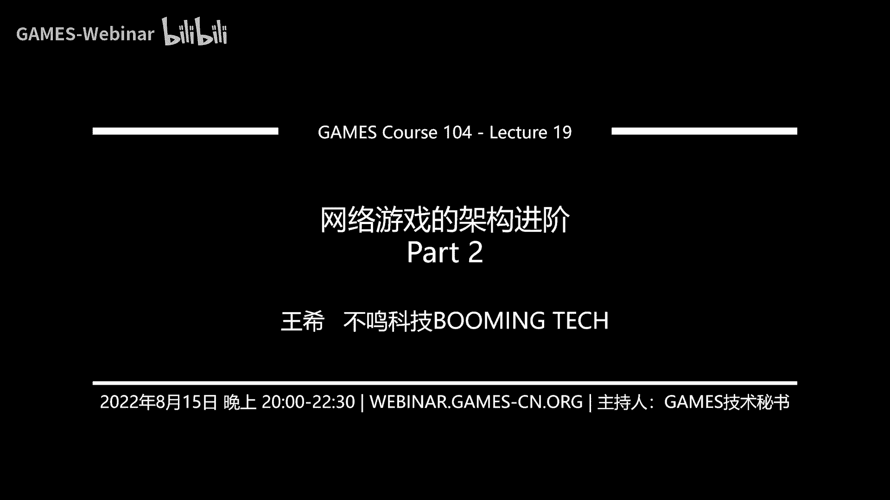
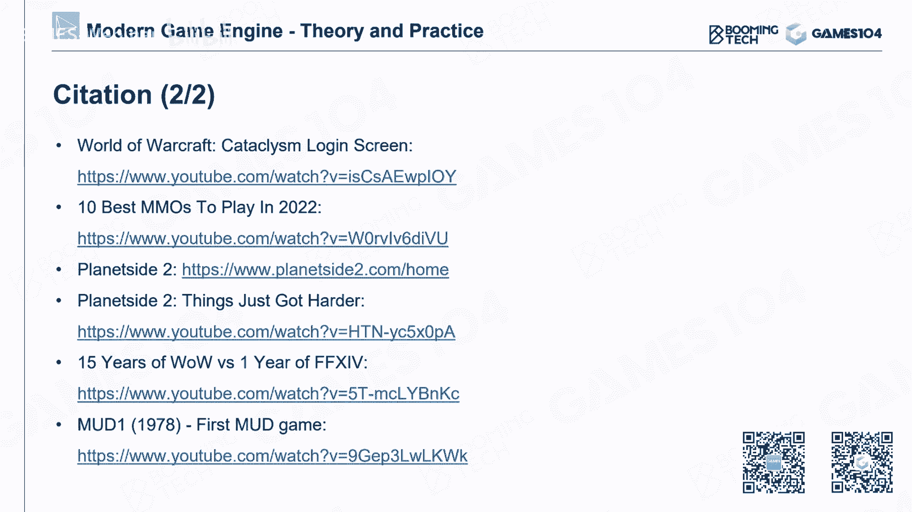

# 🎮 课程19：网络游戏的进阶架构 (Part 2)

在本节课中，我们将深入探讨如何构建一个大型多人在线游戏。我们将从MMO的基本概念入手，逐步解析其复杂的服务器架构、核心子系统、分布式设计、带宽优化以及至关重要的反作弊机制。最后，我们将展望构建无缝开放世界所面临的挑战与未来。

---

## 🏰 什么是MMO游戏？

MMO，即大型多人在线游戏，其核心在于让海量玩家在一个持续的虚拟世界中连接、互动。这不仅仅是传统的MMORPG，现代的FPS、MOBA等游戏类型也具备了MMO的规模与特性。

最早的联网游戏可以追溯到文字MUD时代，玩家通过文字指令在虚拟房间中探索、互动。发展至今，MMO已经演变成一个极为复杂和丰富的虚拟社会，玩家可以在其中战斗、交易、社交，体验近乎真实的世界。

从构建单一游戏对局到构建一个能容纳数十万乃至百万玩家的虚拟世界，系统复杂度急剧上升。这引入了许多新的子系统需求。

---

## 🏗️ MMO的核心架构概览

一个典型的MMO服务器架构大致可分为三层：

1.  **连接层**：管理玩家与服务器的初始连接、认证和路由。
2.  **服务层**：提供游戏的核心功能，如角色、战斗、社交、匹配等。
3.  **数据存储层**：持久化存储所有游戏数据。

上一节我们介绍了网络同步的基础，本节中我们来看看如何将这些基础组合成一个完整的、可扩展的在线世界。

---

## 🔗 连接层：网关与防火墙

连接层是玩家进入游戏世界的第一道门。它主要包含两个关键组件：登录服务器和网关服务器。

*   **登录服务器**：负责玩家的初始连接、握手和账号密码验证。通常使用HTTPS等安全协议建立加密信道。
*   **网关服务器**：这是架构中的关键。玩家通过验证后，**所有**后续通信都只与网关进行，再由网关与内部的各种业务服务器通信。

**核心作用**：网关实质上是一个**防火墙**和**协议处理器**。它验证所有传入数据的合法性，过滤恶意攻击，并承担协议解析、数据压缩等工作，保护内部脆弱的业务逻辑服务器。随着玩家数量增加，可以部署多个网关实例进行负载均衡。

---

## ⚙️ 服务层：错综复杂的子系统

通过网关后，玩家便进入了由众多专业服务构成的世界。以下是几个核心服务：

*   **大厅服务**：玩家聚集和等待的场所，可以是一个虚拟空间或实际场景，用于管理玩家并准备进入具体游戏对局。
*   **角色服务**：管理玩家所有核心数据（装备、任务、属性）的中心化服务。几乎所有其他服务（如交易、战斗）都需要查询或修改角色数据，因此其负载和重要性极高。
*   **交易系统**：具有强金融属性，要求绝对的**原子性**和**安全性**。每一笔交易都必须可以回滚，以应对客户端断线、服务器异常等情况，保障玩家虚拟财产的安全。
*   **社交系统**：包括聊天、邮件、好友、公会等功能。在高并发下，这些功能通常会被拆分为多个独立的服务以防止单点过载。
*   **匹配系统**：在竞技游戏中至关重要。它不仅要根据玩家的技术水平进行匹配，还要考虑网络延迟、开黑队伍等因素，以保障对局的公平性和体验。

---

## 💾 数据存储层：数据的家园

在线世界需要持续存在，因此数据存储设计是核心。现代MMO通常采用多种数据库技术组合：

1.  **关系型数据库**：如MySQL，用于存储核心、结构化强的数据（如玩家基础信息、物品表）。在海量数据下，常采用分布式、分库分表等架构。
2.  **非关系型数据库**：如MongoDB，用于存储日志、临时游戏状态等无需复杂关联查询的海量数据。它写入速度快，适合做数据倾泻。
3.  **内存数据库**：如Redis，用于存储需要极高速访问的中间数据或缓存。在分布式服务器集群中，内存数据库是管理共享状态的优秀工具。

**架构建议**：设计MMO服务器时，建议从**数据模型**开始思考。理清了数据的流动与存储，上层服务的结构也就清晰了。

---

## 🌐 迈向分布式：应对海量玩家

当玩家数量从一万增长到十万、百万时，单机或简单架构无法承受。解决方案是**分布式系统**：将每个服务拆分成多个可以独立部署和扩展的进程。

然而，分布式带来了新的挑战：
*   **数据一致性**：同一份数据被多个服务访问时，需避免冲突和死锁。
*   **消息幂等性**：网络波动可能导致重复消息，系统需要能安全地处理重复请求。
*   **服务发现与管理**：成百上千个服务如何找到彼此？如何监控健康状态？如何自动重启故障服务？这就需要如 **etcd**、**ZooKeeper** 这类服务发现与协调工具。
*   **负载均衡**：如何将玩家请求合理地分配到多个相同的服务实例上？

---

### ⚖️ 一致性哈希：优雅的负载均衡算法

一个经典的负载均衡问题是：如何快速确定某个玩家数据应该由哪个角色服务实例管理？一致性哈希提供了优雅的解决方案。

**核心思想**：
1.  将服务器节点和玩家ID通过哈希函数映射到一个固定的环上（例如，`0` 到 `2^32-1`）。
2.  每个玩家数据**顺时针或逆时针**找到环上最近的服务器节点，即为其归属。
3.  当增加或删除服务器节点时，**仅影响环上相邻区间**的数据，大部分数据无需迁移。


**公式/伪代码示意**：
```python
# 简化示例：确定对象object应存储在哪个服务器节点上
servers = ['server_A', 'server_B', 'server_C']
ring = {} # 哈希环

# 将服务器和虚拟节点加入环
for server in servers:
    hash_value = hash_function(server)
    ring[hash_value] = server

# 为对象寻找服务器
object_hash = hash_function(object_id)
sorted_keys = sorted(ring.keys())
for key in sorted_keys:
    if object_hash <= key:
        return ring[key]
# 如果没找到，说明在环的尾部，返回第一个节点
return ring[sorted_keys[0]]
```
这种方法避免了全局查询，极大提升了效率。还可以引入“虚拟节点”来使数据分布更均匀。

---

## 📉 带宽优化：成本与体验的平衡

网络带宽直接关系到运营成本和游戏体验。优化主要从三方面入手：**玩家数量**、**更新频率**、**单次数据量**。

以下是核心优化策略：

*   **数据量化**：将浮点数转换为定点数。例如，用16位整数表示游戏内的位置坐标，可以大幅减少数据量。这是最有效且常用的方法之一。
*   **兴趣区域**：玩家无需感知整个世界，只需同步其周围一定范围内的对象状态。这是降低带宽和算力的关键。
    *   **静态分区**：将世界划分为固定的格子，玩家只同步所在格子及相邻格子的实体。
    *   **动态查询**：使用**十字链表**等数据结构，动态查询玩家周围实体。
*   **动态更新频率**：根据实体与玩家的距离，动态调整状态同步的频率。远处的实体更新更慢，近处的实体更新更快。

---

## 🛡️ 反作弊：永恒的攻防战

在网游中，作弊会毁灭游戏生态。反作弊是一场艰难的技术攻防。

**常见作弊手段与防御**：
1.  **内存修改**：外挂直接修改游戏内存数据。
    *   **防御**：客户端加壳、内存数据混淆加密、反调试技术。
2.  **文件篡改**：修改本地游戏资源（如让敌人贴图发光）。
    *   **防御**：校验本地文件哈希值，与服务器比对。
3.  **网络劫持**：拦截并伪造网络封包。
    *   **防御**：通信链路加密。通常采用非对称加密交换密钥，再用对称加密进行实际通信。
4.  **注入钩子**：将作弊代码注入游戏进程。
    *   **防御**：反作弊软件扫描内存签名和可疑进程。
5.  **AI作弊**：使用AI进行图像识别和自动化操作。
    *   **防御**：目前最棘手。可能的方向包括行为模式分析、AI检测AI等。

反作弊是系统工程，需要持续投入，并结合技术、运营甚至法律手段。

---

## 🌍 构建无缝开放世界

终极愿景是构建一个能让海量玩家自由探索、无感知切换区域的“绿洲”式世界。核心思路是两种技术的结合：

1.  **动态分区**：将世界动态划分为不同区域，每个区域由一个服务器实例管理。当玩家靠近区域边界时，相邻服务器会为其创建**幽灵副本**，实现平滑的视野过渡。只有当玩家真正跨越边界一定距离后，才进行主控权的迁移，避免在边界频繁抖动。
2.  **分层复制**：将世界复制多份，每份承载一部分玩家。玩家在自己的“层”中是实体，在其他层中是幽灵。这可以应对主城等玩家高度聚集区域的负载问题。

将动态分区与分层复制结合，才能构建一个既广阔又能承载高并发玩家的、真正无缝的虚拟世界。

---

## 📚 总结

本节课我们一起学习了构建大型多人在线游戏的全景图。我们从MMO的三层基础架构讲起，深入探讨了连接层、服务层和数据存储层的核心组件。为了应对海量玩家，我们引入了分布式系统架构，并讲解了**一致性哈希**这一关键的负载均衡算法。接着，我们探讨了**带宽优化**的实战策略和**反作弊**这场永恒的攻防战。最后，我们展望了通过**动态分区**和**分层复制**技术构建无缝开放世界的可能性。





MMO服务器的架构是一个极其复杂的系统工程，充满了挑战，但也正是这些挑战，推动着游戏技术不断向前，去创造那个令人向往的、连接所有人的虚拟世界。