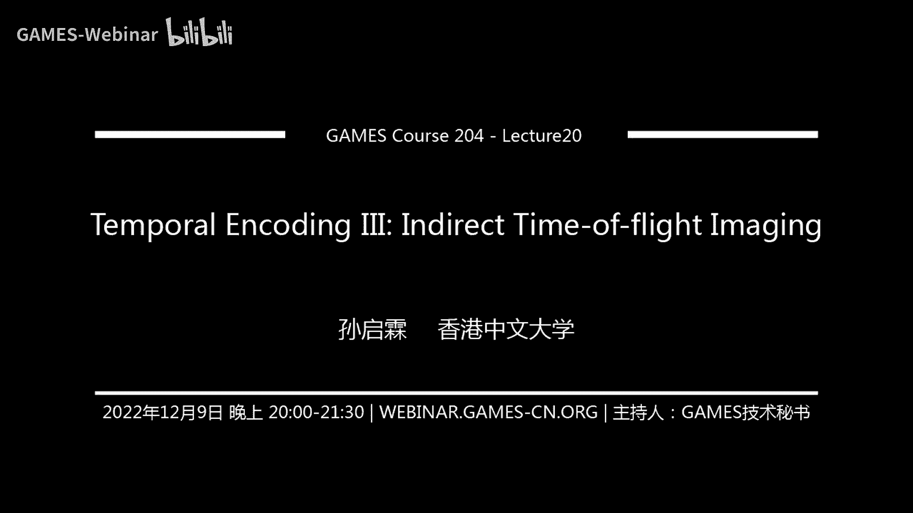

# 20.时域调制 (III) ｜ GAMES204-计算成像 - P1 - GAMES-Webinar - BV1T8411V7ne

## 概述
在本节课中，我们将深入探讨时域调制技术中的连续波成像原理，分析成像模型，并介绍如何解决多路径问题。

## 连续波成像原理
### 什么是连续波成像？
连续波成像通过发送连续调制的波形（如正弦波或方波）来生成深度图像。

### 成像模型
1. **光源**：发出连续调制的波，例如正弦波。
2. **场景**：波被场景反射。
3. **传感器**：接收反射波，并测量其相位变化。

### 相位测量
1. **信号处理**：使用相关技术（如锁相放大器）测量相位变化。
2. **深度计算**：通过相位变化和光速计算深度。

## 相关传感器工作原理
### 基本原理
相关传感器通过自相关测量参考信号和接收信号的强度值。

### 像素模型
1. **感光元件**：光电二极管。
2. **电容**：存储电荷。
3. **参考信号**：控制开关，选择节点连接。

### 相位计算
1. **电压测量**：通过测量节点电压计算相位。
2. **环境光和偏移**：考虑环境光和偏移对测量的影响。

## 多路径问题
### 多路径效应
光在场景中反射，产生多个路径，导致相位测量误差。

### 解决方法
1. **提高频率**：通过提高频率放大相位变化，减少多路径效应。
2. **查找表**：建立相位和深度之间的关系，校正非线性误差。

## Facer Image
### Facer Image原理
1. **光传输方程**：描述光在场景中的传播和反射。
2. **相位变化**：考虑相位变化和振幅衰减。
3. **多路径反射**：考虑多次反射对相位的影响。

### Facer Image应用
1. **消除多路径效应**：通过提高频率减少多路径效应。
2. **提高测量范围**：使用两个高频函数实现大范围测量。

## 总结
本节课介绍了连续波成像原理、相关传感器工作原理、多路径问题及其解决方法，以及Facer Image技术。这些内容为理解时域调制技术提供了基础。

## 下节课预告
下节课将继续讲解Facer Image的详细内容，并介绍相关论文和优化方法。