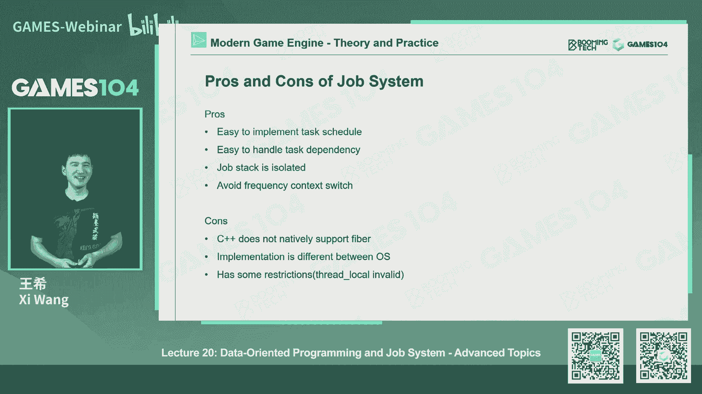

# 课程20：现代游戏引擎架构：面向数据编程与任务系统 (Part 1) 🚀

## 概述
在本节课中，我们将学习现代游戏引擎架构中的两个核心高级概念：面向数据编程和任务系统。我们将从并行编程的基础知识开始，探讨为什么现代游戏引擎需要充分利用多核CPU的计算能力，并深入讲解任务系统的工作原理和实现挑战。

---

## 课程前言与安排

大家好，欢迎回到GAMES104。课程已进入尾声，最后三节是高级课程。

课程组根据与同学们的交流，决定做以下几件事。

第一件事是颁发课程证书。课程组会根据同学们提交的作业进行评分。作业全部完成且达到60分，将获得课程毕业证书。如果有两个作业获得100分，将获得“优秀”证书。如果三个作业都是满分，将获得“杰出”证书。

第二件事是课程组将赠送T恤给所有完成作业并成功毕业的同学，作为坚持学习的纪念。

第三件事是关于作业提交时间。考虑到课程难度，最终作业的提交截止日期将设定在10月底，以便给大家更多时间完成，并在课程结束后向课程组寻求帮助。

第四件事是关于Pico引擎。课程结束后，课程组计划从10月10日开始，通过微信公众号和微信群，为同学们解读Pico引擎的架构与代码，例如反射系统的实现。欢迎大家关注公众号并加入群聊。

第五件事是回答上节课同学们提出的问题。

第一个问题是游戏能否彻底解决反作弊。答案是目前不能。这是一个动态平衡的过程，需要技术、设计和社区共同参与。技术手段如加密和服务器端判定可以缓解，但无法根除。一些社交化方法，如Steam的VAC系统，通过关联惩罚来增加作弊成本，也是有效的策略。

第二个问题是微服务与分布式服务器架构的区别。分布式服务器架构是一种经典模式，指将业务拆分到多台物理机或进程上协同工作。微服务是一种设计理念，是分布式架构的一种实现方式，强调将后台服务拆分为单一、无状态的服务单元，便于弹性伸缩和服务发现。在实际游戏服务器架构中，两者常结合使用。

第三个问题是如何构建全球联网对战系统。这是一个复杂的技术挑战。核心在于全球服务器的分布式部署、机房之间高速专线网络的搭建，以及对全球网络拓扑的理解。需要根据玩家地理位置部署服务器节点，并优化节点间的连接路径，以减少延迟。这不仅是技术问题，也涉及基础设施和成本。

---

## 并行编程基础

上一节我们概述了课程安排，本节我们来看看为什么游戏引擎需要并行编程。

现代游戏引擎运行在操作系统和硬件之上。我们对性能要求极高，但算力和带宽有限。我们需要在1/30秒甚至1/60秒内完成物理模拟、游戏逻辑、动画和渲染等大量计算。为了压榨硬件极限，我们必须充分利用多核CPU。

随着集成电路工艺接近物理极限，CPU主频难以大幅提升。解决方案是增加核心数量。因此，现代编程必须考虑如何利用多核算力。

在传统操作系统中，我们熟悉进程和线程的概念。
*   **进程**：拥有独立的存储空间，由系统管理。
*   **线程**：在进程内部，共享进程的内存空间。线程间通信更高效，但需要小心处理数据竞争。

为了实现多任务处理，操作系统有两种调度模型：
*   **抢占式多任务**：调度器可以主动中断正在运行的任务。这是Windows等通用操作系统的常见模式，保证了系统响应能力。
*   **非抢占式多任务**：任务会一直运行直到主动让出控制权。这在某些实时操作系统中使用，但对任务设计有严格要求。

线程间的切换成本很高。一次上下文切换可能消耗数千个CPU周期，如果数据不在缓存中，延迟可能达到数十万周期。这是设计高效并行系统时必须考虑的问题。

在并行编程中，我们常遇到两类问题：
1.  **独立任务**：任务间没有依赖，可以完全并行执行，例如蒙特卡洛积分采样。
2.  **依赖任务**：任务间存在数据依赖或执行顺序依赖，这使并行化变得复杂。

依赖任务中最核心的问题是**数据竞争**：当多个线程同时读写同一数据，且读写顺序影响结果时，就会发生不可预知的行为。

解决数据竞争的经典方法是**阻塞式编程**，使用临界区、互斥锁等机制保护共享资源。但这可能带来死锁、优先级反转等问题，并且难以处理任务失败的情况。

另一种方法是**无锁编程**，利用硬件支持的原子操作来保证对单个变量的读写是原子的。这避免了死锁，但原子变量间的等待仍可能导致CPU空闲。

理论上还有**无等待编程**，能保证所有线程持续执行。但这需要复杂的数学证明，通常只用于对性能极其关键的特定数据结构（如队列）。

编译器优化和CPU乱序执行也会给多线程编程带来挑战。编译器或CPU为了效率可能重排指令顺序，在单线程下结果不变，但在多线程下可能导致依赖假设失效。在移动端（如ARM架构）或Release编译模式下，这个问题尤为突出。

---

## 游戏引擎中的并行模式

了解了并行编程的基础挑战后，我们来看看游戏引擎中常见的几种并行架构。

最简单的做法是**固定线程分工**：将渲染、物理、逻辑等不同系统固定分配到不同的线程上运行。这种架构清晰，但在2-4核环境下效果较好。它的主要问题是**木桶效应**：所有线程必须等待最慢的那个完成任务，导致CPU利用率不均。且无法动态适应不同核心数的硬件。

另一种思路是**分叉-汇合模型**：将一批相同的计算任务（如动画骨骼计算）分发给多个工作线程，完成后收回结果。这比固定线程更能利用多核，例如Unreal和Unity引擎就采用了类似方法。但它仍然难以处理负载均衡问题，图中仍会存在空闲间隙。

更复杂的模型是**任务图**：显式定义任务之间的依赖关系，形成一个有向无环图，由调度器根据依赖关系决定执行顺序。这更符合任务间有复杂依赖的场景。但它的缺点是任务图通常是静态或半静态的，难以在运行时动态创建复杂的、嵌套的任务依赖。

讲了这么多，我们终于要引出本节课的第一个主角：**Job System（任务系统）**。这是现代游戏引擎中讨论和实践较多的一种更彻底的并行化方案。

在深入Job System之前，需要理解一个关键概念：**协程**。

协程是一种非常轻量级的“线程”，它允许函数执行到一半时暂停，让出执行权，稍后再从暂停点恢复。这与线程有本质区别：
*   **线程切换**：涉及昂贵的操作系统内核中断和完整的上下文保存/恢复。
*   **协程切换**：在用户态由程序自己控制，只保存必要的上下文，成本极低。

协程有两种主要类型：
*   **有栈协程**：需要保存完整的函数调用栈和局部变量状态，恢复时能完全回到之前的环境。对开发者更友好。
*   **无栈协程**：不保存调用栈，恢复时状态丢失。实现简单、性能高，但对开发者要求极高，通常只用于底层库。

在C++中，语言本身不直接支持协程，需要借助库或内联汇编实现。Windows有Fiber概念，PlayStation等平台有原生支持。实现有栈协程需要管理栈空间分配，是一个底层挑战。

---

## 基于纤程的任务系统

有了协程的基础，我们就可以理解**基于纤程的任务系统**的核心思想。

Fiber-Based Job System的理想状态是：有一个全局任务调度器，管理着一组工作线程，每个工作线程绑定一个CPU逻辑核心。开发者将任务封装成Job提交给调度器。调度器根据工作线程的忙闲状态、任务优先级和依赖关系，动态地将Job分配给工作线程执行。

这里有几个关键设计点：
1.  **工作线程数量**：通常与CPU逻辑核心数一致，以避免昂贵的线程切换。
2.  **任务调度顺序**：在游戏引擎中，通常采用**后进先出**的栈式调度。因为新产生的Job往往是当前Job的前置依赖，需要优先完成。
3.  **任务窃取**：调度器会监视所有工作线程。当某个线程空闲时，它会从其他繁忙线程的任务队列中“窃取”任务来执行，以实现负载均衡。
4.  **依赖与等待**：Job执行中可以等待其他Job完成。被挂起的Job会被放入等待列表，工作线程转而执行其他就绪Job，从而保持CPU繁忙。

Job System相比之前模型的最大优势，是它能以极细的粒度动态调度任务，最大限度地填满CPU时间线，实现极高的硬件利用率。它的输出性能图看起来非常“整齐”，满足强迫症患者。

然而，实现一个健壮、高效的Job System挑战巨大：
*   **平台差异**：需要在不同平台实现底层协程机制。
*   **数据竞争与ABA问题**：即使使用原子操作，也可能遇到ABA问题（一个值从A改为B又改回A，导致检测逻辑误判）。这类Bug难以复现和调试。
*   **对底层知识要求高**：实现者必须深刻理解多线程硬件、内存模型和编译器优化。

因此，虽然Job System对上层开发者隐藏了复杂性，使其能轻松编写并行任务，但底层系统的实现需要扎实的理论基础、严谨的形式化推导和丰富的经验。

---

## 总结

本节课我们一起学习了现代游戏引擎高级架构的第一部分。我们从游戏引擎对性能的极致追求出发，回顾了并行编程的基础概念、挑战与常见模式。我们重点探讨了协程这一轻量级并发原语，并深入介绍了基于纤程的Job System的设计思想、优势与实现挑战。

Job System代表了游戏引擎充分利用多核CPU的未来方向，它将复杂的并行调度、依赖管理和负载均衡封装起来，为游戏开发者提供了强大而简洁的并行编程模型。然而，其底层实现充满挑战，需要开发者对计算机系统有深刻的理解。

下节课，我们将继续探讨另一个关键理念：面向数据编程，看看如何通过优化数据布局来进一步提升引擎性能。