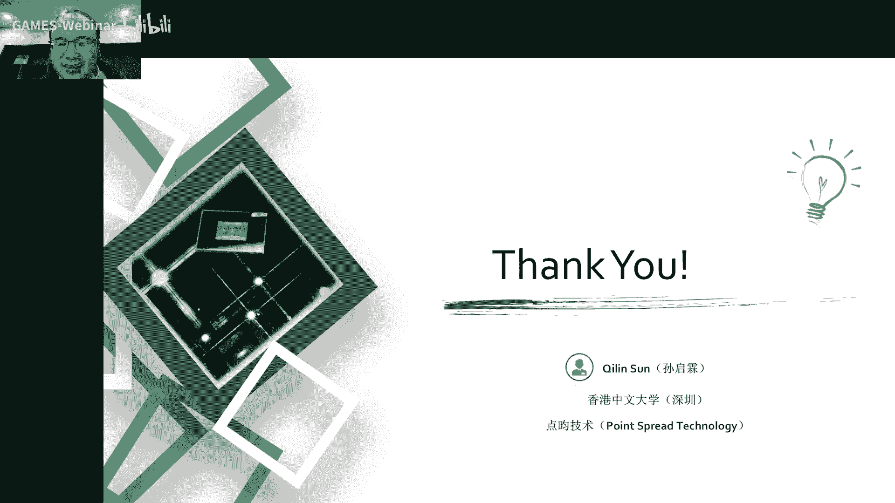

# 20.时域调制 (III) ｜ GAMES204-计算成像 - P1 - GAMES-Webinar - BV1T8411V7ne

很好我们时间到，我们正式开始啊，首先欢迎同学们来到games，204计算摄影的课堂啊，计算成像我们已经上到了第20节课了，已经上了，大概覆盖了60%，到70%的一个内容啊。

后面我们还会呃整个我们这个temporal encoding，大概会覆盖到5~6节课，唉，这个temporary encoding我们讲完之后哎，再给大家讲这个special encoding啊。

在我们在空间域的一个调制诶，这个整个的一个呃宏伟蓝图啊，就给大家描绘的差不多了哈，今天是武器，正式进入到我们这个temple encoding的一个第三课，这叫间接光成像，说到这个渐进过程。

像我们把今天的这个topic分为，首先给大家介绍一下，什么是连续波的一个tam flaming，然后再给大家分析一下我们这个interrupt temple，flying的一个成像的一个模型，呃。

我们照明啊有什么样的trick啊，还有怎么样的设计，我们这个多路径的问题是怎么引入的，然后去怎么解决这个多路径问题啊，最后给大家引入一个非常经典的案例啊，叫facer mei啊。

facemi今天我们可能时间不够啊，我们就把这个facing拆成了一半哈，这个我们今天讲墙面前半部分，下节课我们在讲这个facer image的后半部分哈，说到这个连续波的q调整。

因为我们之前上节课讲到了一个呃direct time flight，它是发送一个脉冲波，但从这个名字上来看，我们这个连续波的一个top成像，就是我们打出一个连续调制的一个波形。

哎他比如说我们用一个正弦波诶，或者是用一个呃这种方波来做调制，来最后生成，我们通过这个相位的解调，来生成我们最后想要的一个深度图像。

当然这个continue wave的一个time fighting ming，它是具体是怎么工作的呢，首先啊我们的光源啊，光源我们看到这个地方，我们用我们的光源发出一束连续调制的波啊。

我最开始还是你一个呃一个seniso的，一个就是正弦函数的一个波形打出去，因为正弦函数本身你到频域啊还是正值函数，对不对，这个时候我们哎到频域，它就是一个单单独的一个频率，这个时候还比较好表示哈。

所以说我们整个先用一个正弦波来去讲解，我们用这个正弦波打到了这个场景上，然后再被这个传感器所感知到啊，我们这个receive the light，我们用蓝色的也来表示诶。

这个时候我们加了这么一个计时器哈，我们计时到这个连续波发出去，到我这个连续波收回来，他的这个时间是有多少，诶怎么记这个时间呢，你看我们发出去就这么一个正弦波，正弦波它是这么一个波形，经过一定的时间后。

它这个波形我们可以看到会有一定的下移哈，我们最后我们器件能做器件能做到的事，就是我们想把我们这个象仪啊，face shift，你拿到再结合我们本身这个调制波形的周期啊。

我们就可以知道我这个face shift，在这个周期里占了多了多少比例，哎我们在通过这个周期跟光速的一个啊，光的一个速度啊，最后就可以把这个深度来推算出来哈，那我们是如何去来测量这个相位的一个象移呢。

啊什么我们知道了，我们最后拿到了一个intense图像，我们这个呃发出了一个正弦波，然后收到一个正弦波，这个正弦波本身呢我们收到了正弦波啊，它不再是一个啊直接被打出一只光。

它那个振幅相位都会发生一定的变化，同时呢呃我们还会受到光本身自个儿的影响哈，光本身自个儿的影响，它是嗯有一定的这个偏执的哈，偏执的哎，我们拿到了这个象仪啊。

我把它denote as fi recora record outset呢，呃即为o啊，empty就记为a哈，最后我们这个收到了一个，就在我们进入这个传感器之前的一个，波形的函数啊，我们记为l。

它是一个关于时间t的函数，它是一个offset，加上他的etitude，最后再加上一个正弦波哎，剪掉它的一个相位的移动号，相位相移，总共呢我们可以知道，我们在探测器上拿到这么一个信号。

我们总共有三个未知量，第一个未知量就是它的一个offset，第二个未知量就是我信号的一个复制，two，第三个信号，也就是我们最终的目的，就是想要拿到了一个相位的象仪，这个呢我们器件本身啊是没有办法诶。

我很快的，比如说我们现在调制速度到100兆，我要采样这么多个点，我不可能用采用100个点，那就是一个实际的一个采样率来去采这个波形，怎么办呢，怎么办呢，这个时候如果同学们学过电路的这种情况。

大家特别是学过啊通信的同学们哈，可能会我们可以用相关呀，对不对，这个地方是十分类似于我们的一个呃，就是信号处理的一种信号采样的一种方法，诶，这个叫lock in啊。

这个叫lock in这种方法叫做这个叫叫什么来呃，所向哈，就有一种就是电路的一种采样的一种方法，就是采样的一种方法叫所向放大器啊，我们是用一个跟它同频的一个信号，就是我们一个参考信号。

跟我们接受过来信号做一个相关啊，就是做一个correlation，实际上就是对在一个周期内对它进行积分啊，最后我们通过积分就可以拿到一个啊，跟相位相关的一个强度值哈，我们就可以。

当然这个周期是可以非常多的，我们也可以积累到一个比较强的信号，这样的话我们就可以拿到一个信噪比比较高的，一个correlation的一个值哈，本身我们有三个未知量，好就是e1 e2 e3 。

就是amplitude offset，还有一个fidelay啊，我们通过给他一个参考信号，我们这个地方把它记为，11213，这三个信号呢分别是由一个90度的一个象移。

最后我们通过这样一个相关就可以拿到三个啊，就是三个强度的一个测量值哈，三个强度的测量值，它本身这个频率是一致的，这个时候我们可以通过这三个方程啊，这三个测量值121223来去计算出来。

我们这个face delay到底是多少啊，当然这个offset empty也可以写出来，我们一般嗯可能就懒得解释了，就直接把这个depth来算出来哈，这个时候呢。

我们本身这个continue wave的一个飞行时间法，是可以拿到一个比较高的seed的通道zero啊，也可以实现一个实时的一个捕获啊，但现在业界最高已经可以做到，120帧的一个啊，etf的一个捕获哈。

就是啊我们先比较一下我们的depth accuracy，这是time of flight imaging，我们可以看到啊，结构光呢就是中间这个是结构光的一个方法，我刚才讲到哈。

这个本身这个off是可以做到，1mm左右的一个精度啊，这个stripper line本身呢你要离得近的话，精度其实挺高的，但是你要到10米这个范围大概嗯一般是1cm，厘米厘米级的左右的一个精度哈。

这个当然也跟他的一个baseline有关啊，这个baseline有关系啊，用双目呢，双目其实啊这个也是会随着我们深度的变大，距离的变大，它的一个精度会下降，在10米的时候哦。

可能这个精度会差到一个10cm左右的，一个量级哈，当然这个也会因为有很多位置，因为缺少这个texture的匹配，而从而导致一个非常巨大的错误啊，这是啊一些方法的优劣，这是一个业界比较先进的一些器件哈。

左边这个是我们造了一款呃，比较高端的一个就是tm flat传感器哈，右边这个是微软的connect，就是业界比较常见的一些啊器件哈，这个是可以做到100跟120Hz的，一个彩色同步的点云输出。

kk net可以做到30Hz，让我们来分析一下这个imagine model，然后这个我们这个艾特怎么来去分析，它的一个成像的一个过程，它到底是如何成像的，我们的器件又是怎么样子的呢。

让我们来详细的解答一下，我们这个itt的一个成像模型，首先说到这个itp的成像模型，我们就不得不先提一下，我们这个correlation sensor，他这个sense到底是怎么工作的。

这个这个器件哈叫就叫相关传感器啊，就有时候也叫photonic mixer device，我现在有家啊这个top的传感器啊，非常大的一家top传感器就叫啊p m d哈。

就是就是pta mia divide divide的缩写，我们可以通过电路上对我们的参考信号，跟我们的一个receive的一个信号，来进行自相关哈，但是在电路里面就自己做相关了。

这个时候我们就可以直接测量，我们最后相关的一个强度值，哎这个时候我们也可以对参考信号进行项移啊，同时拿到多个测量信号，这个右边是我们一个像素的，一个就是一个示意图吧，示意图，其实大家看看就好了哈。

这个我后面会给大家详细的讲解一下，这个就pmb这个器件是怎么工作的，这个我从这个德州仪器的一个官网上，找了一个简化的一个pixel模型，他这个是怎么怎么工作呢，就是我们你看中间这个蓝色的部分啊。

是一个呃就是假设一个理想的foto die的，就是一个感光的一个部分啊，我们本身这一个像素有两个node，node和node b上面呢分别有一个电容叫c a跟cb哈，这个是用来存储电荷用的。

这个时候我们的参考信号，就刚才我们讲到一个参考信号，就是这个时候我们用的是方波了哈，就不再是正弦波了，因为正弦波在电路上是比较难实现的，我们就方波来测白测这个方波的相仪，我每次reset之后。

这个ca跟cb就会充满电，然后呢我们参考信号啊，参考信号它会使这个d mix 0跟d mix 1，选择其中一个开关，我们这个参考信号就相当于一个开关来选择，node a接通还是node b接通。

当我们这个左边是高电平啊，左边是高电平，就是note a接通的时候，哎我们这个受到我们接收过来的这个参考光诶，跟这个传感器反应，然后再加上这个本身这个信号，这个电流就会往外流。

往外流到这个信号关闭我们电这个电荷，这个电容b上的一个信号往外流，最后我们就可以读出来这个ca instant b，c b两个电容上的一个呃电荷值哈，就是最后我们的一个电压值，通过这个电压值了。

我们就可以判断这个相位到底是有多少哈，我们来看一下这个是怎么判断的，就是我们现在假设，我们现在理想的一个情况下哈，就是我们的一个理想的pixel，没有一个环境光的干扰。

我们把这个a记为a上的一个node，a上的电压，b呢即为这个node b上的电压，我们有个reference的一个电影，就是参考电压叫几个vr，我们的一个照明光哈，发出去的一个呃，发出去了一个照明光。

它有一个周期，周期是2t我们这个传感器上接触到的光，也就是这个蓝色的一个传感器上接触到的光，哎我们就记为这个第二行reflected light本身呢，它这个t r t就是我们最后要求到了一个啊。

向移的一个就是就t2 t，比上t就是我们最后目标的一个项移的一个值，the mix 0呢也就是我们这边啊这边导通，这个时候我们这比发低电平的时候，这边导通这边导通我们整个电荷假设它是满的。

在t r t的部分，就把这个d mix 0这个地方电压放出去，一部分电荷放出一部分，同理呢，demix一哎在这上面是高的地方啊，这这上面是低的时候，就是fancy line是低的，这个位置也是放电了诶。

我就把这一部分买了电荷放出去，这个按周期按时间周期放出去，诶这么一个比例，最后我们的一个a d c，就跟传统的一个图像传感器一样，我们就分别读出这个node a跟node b上的电压啊。

node a跟node b上的电压，我们就可以通过这两个电压值啊，这两个电压值来直接算出，我们最后的相位到底是多少，这个时候呢，我们假设这个放电率是k啊，我们导通的时候放电率是k。

本身呢我们的一个电压是一个参考电压，vr就是c a c b的一个参考电压，都是vr啊，我们记为vr，然后经过这个t减t r t唉，经过这么一段时间放电啊，有一个比例k哈，我们就可以啊知道这a上的电压。

就把它记为vr减去tr t，减t乘以k b上的电压呢，就是在tt这段时间按一个k的一个速率放电，最后呢我们把这个k消掉哈，把这个k消掉，是可以直接拿到这个t减去r t r t比上啊，t的一个值。

实际上就是我们最后要求到的一个相位哈，然后这个相位呢本身我们就可以啊，再按那个光速传播，就可以直接把这个深度值来算出来，这是我们理想的情况下，我们可以直接哎用一个用一次测量，就可以把这个深度值拿出来哈。

这个是理想的情况下，因为我们本身这个vr这个电压是已经知道的啊，vr这个电压是已经知道的，我们读到了a b两个tap的一个电压的时候，哎就可以直接把这个相位算出来了，这是理想的情况下，但实际上呢。

我们又不得不考虑环境光的一个干扰哈，这个时候前面的三个像ab电压太高，电压还是带的这个受到环境光的影响呢，就是我们的环境光会干扰，会照在我的一个图像传感器上啊，到到我一个图像传感器上，因为环境光引起。

我们会引入一个新的一个叫v a x叫，因为环境光引起了一个电压，同时呢我们要考虑这个offset，有时候那不等于这个v o b，这个set multage会让两边不相等。

这位这个呃又会啊引入一个新的一个未知量啊，这个三七同学问机器没有办法精确控制相位吗，我们是有办法精确控制相位的，我们可以用啊扫向环呀或者被频电路啊啊，再加上一些我们的一个主要是锁相环，pll锁相环唉。

来精确的控制相位，当然这个时候它不是我们工，精确控制相位的问题啊，这个是因为我们本身，我们对这个测量这个高速信号的一个相位，的一个问题，就是我们怎么样去在这个node a node b去选通。

然后精确测量这个电压值，当我们考虑这个offset啊，场景还有环境光的时候，我们又引入了三个未知量啊，最后呢本身我们在node a跟node b测上电压哈，刚才上一上一页，我们知道理想情况下。

我们只有一个we reset这么一个电压，这个在node a的时候，我们考虑到环境光的干扰，再考虑到reset，noise，reset voltage不一样，这个时候我们a上拿到了电压。

就是v a a加上vv加上vr啊，减掉我们放电的一个过程，b上的电压呢，我们要考虑这个在这个node b上的一个reset butage，还有note b上的一个呃环境光啊。

再去啊加上这个vr减去我们这个放电，最后呢我们现在呢是有两个方程，两个方程哈，我们上到a b两个tap的电压，但是呢我们实际上这个时候，我们有四个未知量哈，四个未知量。

就是我们的我们可以把这个写在一起啊，这个把它当成一个整体的未知量，v a b加上v o b第二位质量，当然还有这个放电速率，k还有t r t就是我们最后要求的这么一个值，怎么有四个未知量。

但是我们只有两个方程，这个咋办呢，其实这个思想很简单，我们就简单的可以增加它的一个测量数量，就是比如说呃我们对这个illumination做一个像移，或者对一个啊参考官进行一个像仪啊。

当然最简单的办法就是我们再测一次，我们不在，我们把这整个快门关上啊，快门关上再去曝光相同的时间，来测到一个a关上的一个电压，还有b关上了一个电压，这个时候我们就可以a off就没有再放电了。

b off也是在没有再放电了，我们直接就可以把这个环境框的一个干扰诶，直接去掉哈，还有这三个未知量的干扰，这是最简单的一种做法，这个时候我们就有四个方程，四个未知量啊，我们就是。

a0 减去a of b0 减去b off，然后再一比把这个k消掉，我们就可以拿到t r t跟t的一个比值，实际上就是把我们最后的一个相位，给计算出来了啊，这是我们呃稍微考虑一点实际情况，但实际上呢。

我们面临的一个场景会更加的复杂哈，现在呢对一个实际的一个，就是我们实际最后工厂加工出来一个pixel来说哈，pixel来说，我们两边的还会对这个电容c a c b，它的一个进行一个模拟放大放大。

收了之后再回材料，但是呢两边分别跟一个运算放大器，他们两边的一个增益往往是不一样的，而且这个增益的值也不是很好精确，的确去测量哈，所以说这个时候考虑到这个进error哎，我们又搞进来这两个变量啊。

又又搞进来两个未知量，这个咋办呢，我们可以看到当我们不考虑这个呃，前面一连串的这个就是这个这个这个啊，前面一连串的这些常数的一个电压哈，本身这个a上面放了电，就已经有12344个未知量。

就g a g b k跟t r t这四个未知量，这个时候为这个问题就变得有点复杂哈，这个不好解啊，不好解怎么办呢，这个时候我们就引入了我们top里面，常见的四相位的测量方法，我们就分别测量0度，180度。

90度跟270度这四个相位上的一个呃，coration的一个值哈，这个时候我们a0 减b0 ，a0 减b0 本身啊，我们就涵涵盖了一个相位的一个信息哈，在a在0度的一个地方，它有一个常数值。

前面就是第一串，在180度的时候呢，哎这个常数值也是前面那一串，但是后面我们可以看到它是一个ga加gb的，这么一个对，他把这个两个tap的一个相互影响，给相互消掉了。

我们第三次测量呢就会啊还是拿了一个constant，但是这个是跟sn相关的，sn相关的一个呃，下位在270度的时候呢，诶这个时候我们发现这总共1234，四个方程啊，四个方程，但我们有多少个未知量呢。

cos 1 cos 2 g跟gb对不对，这个时候我们发现我们仅仅只有四个未知量，这个时候而且我们是有四个方程的哈，四个方程，然后呢，我们这个时候就可以把a0 b0 减三个。

a180 度减去个b180 度，记为i，a90 度减b90 度减去一个a，270度减b270 度即为q啊，最后我们的相位就是arc tan的q除以i，这就是我们常见的一个top计算的一个公式啊，公式哈。

这个有时候同学们就是特别是嗯，玩一些这种top传感器的时候，我们会经常会拿到这个饶恕句里面哈，它有两个tap，一个tape a type b啊，这个我们最后啊有时候你也可以设置模式啊。

就输出一个啊type a减tape b的一个值哈，实际上就是我们这个地方的a0 减b0 ，你拿到了一个数值，就是一个a0 减b0 ，就是我们最后adc读出来node ag node b两个值的相减。

最后呢我们就通过诶这四个，这四个差值，然后就可以算出阿根q啊，阿gq就可以最后算出我们的相位哈，这个相位实际上就是意味着深度，当我们把这个iq画成一个在一个单位坐标下，我们把它画出来哈。

这个i的平方加上q的平方，最后就变成了一个我们定义为叫confidence，confidence，当我们考虑到有噪声的情况下，我们发现诶我们在这个competence画一个圈，对不对，在这个圈的附近啊。

这个就是当我们画了一个圈哈，我们可以看到啊，给大家画一下，有圈的时候，大家可以看到吗，好有圈的时候我们就可以，看到，德尔塔data，而且这个噪声越大，噪声越大，噪声越大。

我们这个德尔塔theta也就越大，对不对，当然我们要考虑到这个confidence的时候呢，我们就会发现我们的confidence越大的时候，我们本身这个noise。

noise半径半径就近似出一个confidence，就是约等于theta，对不对，dsa我发现这个confidence越大的时候，哎我们噪声对深度的一个det error的影响就越小，就越小。

ok我们继续，那这节课可能会有点难哈，因为它涉及的一些底层的东西会比较多啊，希望大家同学们啊耐心的就是去消化一下哈，去消化一下，本身呢我们要引入一个叫few factor的一个概念，就是我们的填充率。

实际上就是啊我们有效感光的一个面积，对上我们整个的一个像素的面积，比如说我10微米的像素，但是我中间只有一个呃，3x3的，一个3微米乘3微米的一个小区域感光，这个就是它的一个few factor。

这个要提前给大家打个预防针，本身呢我们器件啊叫responsibility，它有一个概念叫quantum phency，也就是我们，整个生成的电，就是我们光子打到我们这个传感器上，我们生成的一个电荷数。

比上我们达到这个传感器上的一个光子数，这个就叫它的一个呃量子效率，我们记为n lambda，它的一个responsitivity是怎么记得呢，responsivity就是我们现在产生的电流。

跟我们轰击到这个传感器上的一个啊，这个光功率哈，它的比值，最后呢我们就可以把它记为lamba q e，比上hc，然后再乘以一个我们的量子效率啊，这个lambda就是我们的一个来不来。

就是我们这个波长波长，这个是跟波长相关的，我们知道这个波长越短，他这个能量哈，他的这个能量就越强，然后呢q呢q这个小qe呢，就是我们嗯一个啊电荷的一个电荷量啊，就是一个电荷量标准单位的电荷量。

h就是普朗克常量，c就是光速，把前面这一坨呃，前面这一坨我们就简单的记为一个，前，前面这一坨简单的记为一个啊，这个常数就好了哈，实际上我们发现这个responsivity哈。

实际上就是跟这个qe直接正相关的，这个时候我们记为记一个呃电压哈，就是在就是每个pixel他们左右两个node上的电压，实际上呢它是什么呢，我们捕捉到的电荷量比上这个光速哈，实际上这是它的一个电压。

它是跟这个responsivity直接正相关的，也是跟时间啊直接正相关的，最后呢我们发现我们刚才计算的这个confidence，也就是，呃confidence，也就是i方乘q方。

和我们的这个responsibility for factor啊，还有一个积分时间啊，诶都是正相关的哈都是正相关的，也是我们积分时间越长，fire fake越高，我们的一个响应率越高。

我们的confidence也就是越强的，与之对应的，我们这个噪声对我们深度精度的影响，唉也就越小，我们还要说一个概念叫demodulation contrast。

demotivation contract是什么意思呢，就是我们在node a减去node b的值，note a上的电荷减去node b上的电荷，比上他们两个总共捕获的电荷的总量的比值。

叫demodulation contrast，这个demodulation contract越高了，我们发现啊这个dem 0 c ctrl降低的时候，a减b就变低了，confidence就更低了。

实际上大家有时候看到这个这个top传感器的，这个有个飙升的一次参量叫demotivation contrast，也就是这个值我们希望它越高越好，因为越高啊，我就可以拿到更高的一个confidence。

也就是可以拿到一个更高的一个noise，in competence的一个ritual，也就是嗯，也就意味着我们的噪声实际上是更小的，通常呢啊对我们的硅光起点啊，硅光起点啊，差不多，在850nm的时候。

我们的这个demodulation contrast，比如说在100兆哈，举个例子，因为频率越高，这个demolicontrast会丢失100兆，一般是可以做到40%多哈，你要到了949百40nm。

这个在100兆的情况下，一般是可以做到20%多的，30%多啊，这个是呃跟波长也是有关系的哈，本身这个top本身是有什么样的一个，噪声的影响呢，首先我们要考虑他一个reset noise。

也就是我们那个电荷上它会要reset，每次要reset，这个还有reset noise，这个是跟温度相关的一个嗯值哈，叫我们叫nt啊，这个温度相关，这个很明显哈，这就是reset nice，也是一种。

就破松噪声吧，应该是可以这么理解哈，本身呢除了这个之外，我们光子打到这个传感器上，它是有一个腹痛short noise的，也就是它是有一个这么一个散粒噪声，散粒噪声，我们这个depth noise。

也就是深深度上的一个噪声，也就是直接决定了我们啊深度的一个分辨率啊，我们就可以把这个化为等号哈，实际上这个d noise也就是等于d resolution，我们把这个记为nd哈，它是跟什么相关的。

我们就会发现啊，这个光束呃，那个光咱就不说了，这个格式统一的bug好，我给大家标一下啊，这个地方就是，fm cd啊，实际上我们最后发现它跟什么正相关呢，就是，我们的一个，最后的一个得到了一个光强啊。

光强越强哈，符文拿到了一个呃深度的一个分辨率就越高，有趣的是，我们频率越高，fm频率越高，我们这个深度精度也越高，我们的demotivation contrast越高。

我们这个death noise也小，我们这个深度分辨率也越高，所以说我们想要更高的一个幅值，更高的频率，更高的demotivation contrast，这样的话。

我们就可以拿到更加高精度的一个深度分辨率，好来这几个东西挺矛盾的哈，挺矛盾的哈，我们要同时拿到比较高的一个啊强度值啊，频率值啊，可以一个这个demodulation contrast，这个啊挺难的哈。

挺难的，这个时候我们就要考虑到我们这个照明的一，个情况了哈，这个考虑到照明的情况，我们知道我们深度的一个噪声，也就是深度的分辨率啊，它是呃，直接正比于我们这个刚才说到了那三个地方，刚才说到那三个地方。

就是我们强度这个频率，还有一个demodation contrast，是不是，当我们提高这个强度，也就是，那怎么提高我们这个最后的一个信号的强度呢，哎简单一点，我们就是增加一下我们这个进光量。

是不是就可以了，所以我们想要更更大的光圈，也就是更小的f数或者是更强的一个照明功率，来实现我们这个nm的一个提升啊，m的提升，这个地方还给大家强调一下哈，这个是根号下n m那三个啊黄金的一个指标哈。

fm调制频率，还有demodation contrast 3个黄金指标，第一个就是我们提高这个强度哈，这个强度我们知道这常数不管嗯这个距离，比如固定的apture，apture。

我们可以想办法提高这个app，而且我们可以也可以想办法提高qe，对不对，同时大家没办法，我就可以提高这个照明的一个功率，提高这个照明的功率，这个是最直接的哈，qe这个是半导体的。

有时候他器件买回来就不好整了，对不对，但这个aperture跟这个illumination，我们是可以想办法让这个呃光圈更大呀，或者是照明功率更大，来降低我们这个depth noise的一个影响。

但是我们平均的一个照明功率呢，照明功率实际上就是哎，我们这个照明的功率乘一个距离啊，这个啊这个是duty cycle哈，duty小d integration，duty cycle。

还有一个就是frame rate啊，这个就是我们最后的一个平均的一个照明功率，当我们考虑到这个距离，和这个相位之间的关系呢，有时候我们发现我们这个信号会变形哈，它不再是一个呃，进行照明的时候。

我们会发现这个发出来这个光波啊，他不大可能是这个就是sin呀，或者是一个正弦波参考光呢，它也会受到带宽的限制，它也会产生一定变形哈，比如说我们在100兆的情况下哈，100兆的一个情况下。

一个单品是一个理想的一个正弦波，但是我们比如说一些带宽啊，比如说像呃一个方波打出去，我只能保留机屏，就是100兆100兆的一个方波，我们材料频率稍微高一些，他就是一个变形的这么一个波形诶。

500兆一起1g采样率，它都是一个变形的，就是我们最后啊这个受受限于带宽啊，或者一些其他电路上的一些干扰啊，比如说驱动电流诶，它是电磁辐射的一些干扰，或者是电路自激了啊，有些大的电感效应啊。

都会影响我最后波形的形状哈，这个波形的形状我们做了相关之后，我们发现这个这个波形的形状，会直接影响到我们最后测量到来的一个相位值，我们就会发现，最后我们的相位跟我们的一个距离。

它会有一个非线性的一个关系，也就是右边这个图里面，我们线性的一个这样写一个关系，我理想的情况下，我们的一个深度跟距离，它是一个线性的一个关系，但是呢，实际上哎，我们就会拿到一个非常难看的一个波形哈。

非常难看的波形，这是因为我们这个信号走样引起的，当我们把这个走样的信号啊，走样的信号用这个arin q去把它画出来的时候，哎我们就发现啊，这个它不再是一个圆了，它不再是一个圆了。

它是一个像红色标注的这个地方诶，它会随着这个相位的变化，它的一个confidence也在变化，它的confidence也在变化，这个时候我们就会拿到一个周期性的一个误差。

就是相位跟我们的深度有一个周期性的误差啊，有时候我们也叫这个周期性的误差，叫非线性误差，这个是可以通过标准解决的啊，这个其实问题不大，问题不大，诶不好意思，这个解决方法呢。

就是我是通常建立一个这个look up table啊，look up table通了，建立这么一个look up table哎，来就是找一这么一个通过这么一个查找表吗，建立起来这个相位和啊。

我们这个深度之间的一个关系好，怎么样建立这个查找表呢，一般哈我们是可以用一个呃，下位扫描的一种技术哈，下位扫描的一种技术，我们比如说100个采样点，我们去扫描啊，这么一对这个face进行一个延时哈。

把这个100个点建成一个表，另一种方法就是我们用一个呃，可以精确移动的一个物体哈来做一个啊，又把它测到了一个深度值作为相位哎，来直接建立起真实深度跟相位的一个关系啊，这是我们校正这个非线性误差的一种啊。

两种基本的一种常见方法哈，当然说了这么多哈，我们终于到了今天的一个比较头痛的问题啊，我们刚才讲到了，我们整个itt的一个成像原理啊，还有一些基本的误差呀，啊我们这个深度的精度到底跟什么相关哈。

我们这个我们记住哈，啊，跟这个confident，跟这个我们最后的一个呃能量强度啊，跟我们的这个调制频率，跟我们的这个demodulation contrast，都是啊直接相关的一个三个参数啊。

大家记住，当然我们现在就要考虑到这个外在的一些影响，就是叫multipath，这个影响叫多路径，当我们考到这个多路径的时候呢，我们会发现哈我们一个pass啊，一个pass我们拿到了一个值。

哎我就是一个理想的一个呃下位的一个移动啊，对不对，但是本身啊这个光可不听你的哈，我们这个光它要考虑到它的一个global ation，它这个path啊是想往哪走。

就是根据他那个b r b r d f方程，去跟着往哪走，最后我们在我们传感器上拿到的一个信号呢，往往是很多路径反射回来信号的叠加，这个信号都会被你的这个就是photonic mister device。

可看到这个就会引起相位的误差，所以说呢这个是外在跟sin相关的，跟我们场景直接相关的一种误差啊，这个是怎么玩呢，我们先仿真一下哈，我们这个嗯用这个康奈尔box，康奈尔box来先做个简单的仿真哈。

我们把这个camera放到这个box的一个正前方，正前方，我把这个可能要box本身的一个尺寸，都设为3米哈，然后把这个sensor距离设为5米，理想的情况下，我们测到了一个深度值啊。

它就是一个3米乘3米的一个boss，诶但是好家伙，我们考虑到这个多路径的测量呢，比如说这个五次的一个global elimination，这个时候我们后面多次反射，它路径本身比较长嘛，我们在相互叠加。

我们就会得到一个相位的延时，最后我们这个计算到了一个ship，就会有一个很大的一个误差，本身我们只考虑多路径，不考虑scattering的时候呢，这个误差往往是比我们实际测量，实际的一个真实值会大一些。

哎最后我们实验哈也会跟这个相似，最后我们发现我们最后计算到了这个ship，比我们实际这个ship大一米左右啊，大一米左右，侧面呢也大了0。6米，这个就是非常大的一个误差哈，这是etf啊本身的一个痛点。

当然这种啊multipass本身，在这种director ilumination，就是我们这种就直接嗯就是direct time flat，这种情况也会有，但是direct flies呢本身哈。

他那个他那个那个，我们可以直接提取前面那个相位就好了啊，我们可以很快把这个time his gram测翻，把直接提取出整个相位就可以比较好的算出来，哎我们这个相位真实的位置，但是对这个i top自己哈。

没办法，我最后就拿到了三个强度值，我要通过这个强度值结算相位啊，对不对，这个时候比较难比较难，怎么办呢，那我发现诶这个multipinference，就考虑到整个场景，我们怎么解决呢。

我会发现这个相位叠在一起，根本就没有办法去搞定这个事啊，但是啊聪明的人类呢就会发现这个还真有，为什么我们说这个这个time of flight image这一系列呢，是这个人类智慧的一个巅峰哈。

他真的有非常多的一个技巧，可能你看了就会觉得这些技巧真的非常惊艳，非常惊艳，我们可以看到这个sensor radiance哈，我们是怎么样去就分开，这个不一样的一些成分呢。

不一样的成分呢我们有这个直接照过来的光，也有啊，这么多次反射间接照过来的光，我们去啊，怎么样去把这个啊intersection去把它分离开了，对不对，我们会有不一样的一个呃，face delay啊。

这个是其实挺讨厌的哈，挺讨厌的，它呢还会有不一样的一个emptitude的叠加，不一样的emptitude叠加，哎我们最后发现，我们最后传感就是光源发出去的，这个一个一个正弦一个信号啊。

mit snl soul，经过这个场景，我们这个最后拿在传感器上，拿到了一个正弦波呢，理想情况下就只有这么一个向移哈，然后有一个相位跟outset衰减，但是呢。

我们考虑到这个multipath就会变得非常复杂，所以说啊这是gpa跟rnana哈，就我们rnas是我们这个整个啊，计算摄影里面的鼻祖之一哈，鼻祖之一，那时候跟啊上课大于金玉老师之前说过啊。

于老师就觉得这个这个这个这个，水男也非常厉害啊，这是整个计算摄影的鼻祖啊，哎这个我们干脆下节课就邀请一下，水南亚组里的一些啊老师来给大家讲一讲啊，这个是大亚组里的一些工作，好了哈，我们下下下周安排哈。

下周安排，这个时候我就有一种方法叫faceming啊，facemail，我们这个菲美景来如何描述，我们这个呃这个弦波发射出去，到接收的一个过程呢，那么左边还是一个正弦波啊，有他这个offset。

还有mg 9的a他的目前的相位是five哈，我们把这个公式写出来，就是i等于a cos我们一个t啊，这是motivation frequency，然后有一个延时费，我们用facer image来做表示。

我们就可以用一个欧拉方程啊，来直接表示这个啊幅度啊，相位啊，来好表示一下哈，唉这个时候我们就可以用一个fer啊，也就是一个欧拉方程来去描述这个下面编号，最后我们发现我们发射出去的一个正弦波。

它有这样一个相位，这样一个振幅，经过这个这个这个场景的一个反射，我们这个振幅啊衰减了下位啊，经过一定的一个啊延时哈，就打到这个位置，哎呀我们最后拿到了这么一个vector啊，这么一个vector啊。

就是像图里面这种形状，本身呢我们就可以用一个我们这个场景啊，就可以用一个light transport coeffici，这一个负负函数啊，哎来表示这整个这个它的一个变化，实际上就是啊。

一个相位和相位的移动跟幅度的衰减哈，哎我们最后就会拿到这么一个嗯，就是一个receive的一个呃下位跟赋值吧，但我们要考虑到这个多路径反射的时候呢，多路径反射哎。

我就有很多个这么一个light transport，qualification的一个叠加哈，一个叠加，最后我拿了一个叠加法的信号，它是什么样子呢，本身啊我就发现这个这个非线性啊，这是多次反射。

它每个信号都是可以直接线性叠加的，也就是我们这个输入输出哎，它是线性的好，但是线性的其实这个其实挺好的，唉我们这边最后就可以用，我们这个最后我们在图像传感器上收到了值。

就是那个light transport matrix，一个这个array哈，哎最后再乘上我们这个发射取势一个方程啊，最后通过我们考虑到这个，propagation的一个问题啊。

我们发现这个一个发射器的光自由传播，诶我们可以看到啊，这个cpu所有的这个这个散播啊，只是发生了一个像移，这个facer呢也就是这个vector转了一下哈，这个角度转了一下哈。

这就facer就是稍微转了一下，当我们考虑到这个场景的一个反射呢，我们这个啊，这个正弦波跟这个facer又是怎么变化的呢，诶考虑到一次反射到这个位置哈，这个反射我们只考虑它的反射率哈。

仅仅只是幅度有了个轻微的衰减啊，幅度有个轻微的衰减，诶这个时候我们发现诶，这个整个过程描述的非常清晰可观，哎我们回过来的时候，就考虑到一些呃这个光的衰减啊，或者是一些什么。

我们这个幅度跟相位都发生了变化，相位是因为岩石哎，幅度是因为啊，随着距离的一个或者是一个介质的，引起的一个衰减，最后我们才发现我们的facer啊，这个这个vector，它的这个幅度和相位都发生了变化。

当我考虑到这个多次路径，比如说这是一个scattering的一个medium，它会一次反射，二次反射，三次反射，诶，最后就会产生这么一个facer一个叠加哈，这么这么样一个facer的叠加，对不对。

这是我们最后拿到了一个啊result的一个值，最后我们要看一看这个下位的一个变化，跟这个modulation frequency有什么关系呢，就跟我们调制的频率有什么关系呢，你考虑到我们一个固定频率。

我们移动了一个啊d的一个距离，我们发现我们的相位啊，产生了一个f的一个变化，这是我们我们考虑到这个modulation frequency是omega，诶，我们不断增加这个频率。

我会发现这个相位是不是诶变大了呢，就是说我在有一个固定的距离，我十兆的时候我变了1度，我100兆的时候是不是就变了10度呢，是不是哎，这个时候我们就可以增加频率，提高频，通过提高频率来放大我们的相位。

这是一个线性变化的一个过程啊，我们这个呃相位啊，实际上就是我们一个d除以c哈，我们一个d除以c，我们发现频率越高，唉相位变化的越大，对不对，然后我们最后发现诶，你不断提高频率，第二次反射诶。

多路径我们整个路径就可以啊，但是我们这基本上很近的邻居哈，很近的邻居，它会产生一个嗯大致相等的一个eu，然后呢我们在这一一定的范围内拿到了一个啊，拿到一个face的一个像仪呢。

就会产生这么一个fser啊，这么一个扇形的一个fser，在整个扇形区域内都是我，因为嗯就都是有可能的一个深度值啊，这就是这个multipath带来了一个误差哈，multipath带来的误差咋办呢。

提高频率，提高频率，我们把这个角放大，这个我们差不多平均的位置哈，就是这个啊result的一个位置哈，就大概我们的一个啊深度值，那它周围这个黄色区域都是啊，与之对应的一个误差的一个范围，在嗯都有。

在这整个范围内的值都是可以得到的哈，这有可能会得到的，让我们看一下，但是我们提高频率，不断提高频率哎，再提高频率，整个误差在360度1个范围内，最后变成了啥呢，变成了一个offset，变成一个常数值。

这个时候我们就发现，当我们把频率提高到一定程度的时候，给你提到一定程度的时候，多路径带来的误差消失了，这个频率很高的频率，使这个多路径的一个误差消失哈，这是一个非常神奇的现象，来给大家再看一遍哈。

再看一遍哈，提高频率提高频率，所有的误差再分布到360度的一个地方，它就会最后就变变成了一个平均过的一个offset，最后你测量了一个峰值在哪，它就是这么一个值啊，然后呢我们就发现。

我们知道了这个增加这个调整频率也可以啊，到一定程度之后，可以把这个多路径的效应减为零哈，这个是非常呃，这个让人家啊兴奋的一个这个这个这个发现，哎我们最后发现这个int reflection。

就是我们这个多路径反射诶，仅仅只是变成了一个offset啊，这个offset，大家可以看到这个offset这个变化，也就是我们频率速度高的时候，这个多路径不再影响我们的相位了。

只是影响了一个offset，因为我们在这个360度的一个范围内，平均了，来我们要考虑这个啊，这个face的一个ambiguity啊，这个是怎么办呢，我发现a b两个地方拿到了一个呃，相同的效应啊。

实际上这个b这个地方是它是移动了二派，再加上这么一个相位哈，这个我们有时候啊把这种现象叫做face waking，face waking，但是有face win呢。

我们就需要face and waking哈，把这个这个一环一环的这个深度值校正起来，校正起来，啊这个距我们一般的话是嗯可以用两个频率啊，或者是降低这个调制频率而来实现呃。

这么一个face and working，但是我们发现用一个低调制频率，就和这种误差可能会比较大哈，一是哎d的调制频率会让这个噪声深度，噪声影响比较大，第二个是d的调制频率。

本身这个multipath的影响会比较大，但是呢我们又要想比较大，比较大的一个测量范围，就是比较大的一个vip的一个范围哈，我们就需要怎么办呢，这个时候人们就提出了，我们可不可以用两个很高的高频。

来产生一个波波啊，产生一个波波，最后实际上我只有两个高频在测量，但是呢我是又是用一个低频的一个win的范围行，诶这个时候怎么处理呢，我们可以看到这低频率可以做到一个。

非常大的一个呃face ambiguity的一个范围啊，就是我们可以测量范围，比如说嗯100兆的时候，我们只能做到1。5米，十兆呢我们就可以看到15米才会产生face wip，有15米已经非常好了哈。

15米非常好，所以说这个还是解决不了根本问题，所以说我们通常是用两个高频函数啊，来啊解决这么一个问题哈，目前我们有一个高的一个调整频率，一，有一个另一个高度特殊频率二，这两个频率会稍微有点不一样哈。

稍微有点不一样，michael period of small perio，据说也叫michael tom flight，我们传统的一个呃cofly shifty呢，在我们一个低的一个频率下哈。

我们组上用一个三个测量值哈，但是这个ml shift t呢我是用两个高频，两个高频有四个测量值来，我们看一下这个在我们connect boss里面的一个表现。

诶这个director radiance没问题，intel这是多多路径反射诶，我们最后诶通过两个相近的这个900兆，当然这个器件上调制是不大可能哈，现在可能啊最快最快的一个top器件就是嗯。

长光辰星的可以做到165兆哈，当然这个地方咱就先仿一下，再仿一下，我们发现这个957兆跟930兆，是两个调整，平均下他这个位置变的哈，都是相互不一样的，我们就可以通过这一点微小的变化来去啊。

把这个ambiguity去干掉，同时也会减少啊，这个对multipath本身对这个深度值的影响，哎这是我们本身的一个face map啊，face map这两个都是相互不重叠的，这每一圈都是一个nbc。

就超过二派的范围，就是产生这么一个彩虹圈哈，我们这个啊传统的一个top image呢，比如说这个10Hz的时候，我们这error有多大呢，这人有多大吗，我刚才仿的是这个1米哈，这个好家伙。

这个30%的这个误差哈，这个痣有点大，这个有点大，这个micro他们flying mei，它就是基本上和这个肯定box，本身已经非常接近了，已经非常接近了，就说下节课呢我们会继续的讲解。

我们facer imagine的第二部分哈，这个嗯会给大家讲一下呃，更加详细更加有趣的内容，当然除了这个fashion image到底是怎么实现的，还有一个我前2年好像是19年siggraph。

我们看到一篇论文叫那个叫那个，我们下节课会讲到哈，它是一个优化的一个连续波的调整，函数的一个内容哈，当时我们也看到这个不是很难啊，不是很难啊，但是看到这个效果啊，是真惊艳啊，这个难怪人家能种西瓜。

是不是，所以说今天的课程就到这里啊，同学们有什么问题啊，可以在现场问一下，我们下节课哎将会继续本节课的一个内容，继续来给大家讲解这个啊，in dtime flat image，这个课的内容是啊。

非常有兴趣，但今天的课程可能会涉及一些啊，非常底层的一些内容，可能会有些难哈，大家还是推推荐一下，大家去啊，好好消化一下啊，他这个可能可能有些同学没学过电路和信号，这个底层发生了啥，不是很清楚。

这个要需要啊，同学们再花点时间去看一看这个里面的内容，大家还有什么问题吗，好既然没有问题了，我们今天的课程就到这里，再次感谢啊，同学们来到games 204啊，我们下节课同一时间最近哦，对对对对。

忘了嗯，刚才说到了，我们下节课嗯，我们这个干脆就邀请一下这个，我们这个计算摄影鼻祖，是那样他们组里的一个啊工作者啊，我们就可以邀请他们来给大家给一个guest lecture，这个希望大家下节课可以啊。

准时收听啊，准时收听，这个咱说到做到啊，说邀请咱就邀请了，啊这个同学问有啥教材没有，这个，这个这个可能这个方向确实没有什么教材可以，那个大家还是可以看ppt哈。

这个我给大家啊花了很大的精力去收集这些ppt，大家还是可以看一下，这个低调制频率下消除multipath有啥好方法，那除了我们课上讲过的这个啊，这个消除modetest方法其实还是有其他的办法的哈。

比如我们两个呃低频情况下，我们测到了一个，比如说十兆跟15兆这两个低频，我们测到了一个multipath不一样哈，我们是可以通过这个不一样，搞一个嗯优化函数哈，优化函数来把这个去优化一下哈。

因为我就是通过这个差异来去算一下，第二种办法呢，其实之前我们组里在18年啊，做了一篇这个论文哈，就可以哦，还是还是得用两次测量，两次到三次测量，这个时候我们就可以用这个呃两次测量，搞一个小神经网络哈。

我们通过这个呃不同频率下测量的差异，来进行对深度值进行校正啊，这个论文的名字叫end to end time of flight imazing啊，你可以去搜一下啊，除了这个之外啊。

就我们圈里有一个好朋友叫郭麒，他有篇论文叫啊flat dataset，做了一篇这个啊，top就是这种消除multipath的一种方法，这个是18年18年那篇论文吗，18年诶，18年是19年。

叫flat data set，f l a t data set，这个是可以看一下哈，那天不是我的那篇，是我一个师兄的，但我那时候还比较小，那天是苏若晨，给同学们还有什么问题吗，好没有问题啊。

今天的课程就到这里，再次感谢同学们来到204，下节课，同学们来给介绍一下，那样大佬最近的一些工作啊。

