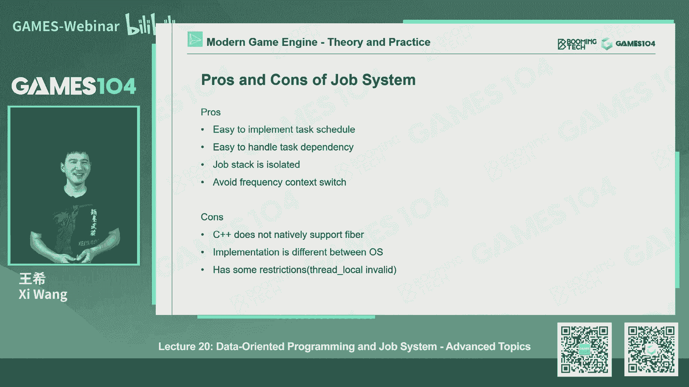

# 20.现代游戏引擎架构：面向数据编程与任务系统 (Part 1) ｜ GAMES104-现代游戏引擎：从入门到实践 - P1 - GAMES-Webinar - BV1EP411V7jx

哈喽大家好，欢迎大家回到game 4104，现在引擎的理论与实践啊，我是王鑫，那个时隔两周没和大家见面了，那这两周同学们过得怎么样，那个希望大家这个马上要开学了对吧，然后大家都能够顺利的返回学校。

那么暑假呢总是这个过得非常的快，而且今年暑假有个很大的特点，就是特别特别的热，真的我从来没见过这么热的暑假，那么所以的话呢那我们的课程的话呢，其实也进入到我们的尾声，也就是最后三节课。

也就是我们的高级课，那那么这里面的话呢其实也是我们开始逐渐去有时间去思考，我们的小伙伴们现在学的怎么样，大家进入这个课程有没有什么困难，所以今天的话呢我们首先跟大家讲一下。

我们现在课程组跟同学们交流下来，我们决定要做的几件事，第一件事情的话呢就是说实际上这个课程大家如果能真的跟下来，实际上是非常非常的挑战的，那么所以的话呢我们觉得确实就是要给同学们发一个证书对吧。

那么就是根据同学们完成的情况，那我们课程组呢也会很认真的去那个根据同学们提交上来的作业，然后给同学们打分，然后呢就是如果大家做的都是对的，我们给大家60分，如果做的非常好的话，是100分。

就所有的点全部实现了，那个我们当时作业的要求，所以的话呢如果就是说同学们每一个作业的话都做了，而且都能够及格的话，我们认为应该给大家发一个。

这个就是成功的毕业于game 104课程的这样的一个一个一个证书，那么如果同学们如果有两个作业能达到100分的话，我们认为是非常优秀的，那我们要给大家的这个就是不一样的，就是excellent。

那如果大家真的三三门作业做的都是满分的话，那我觉得一定是非常的outstanding了，所以这件事情的话实际上啊非常了非常有意思啊，就是我自己想想，要是我到时候毕业的时候找工作的时候，诶。

我game 4204课程我真的学完了游戏引擎，然后我而且我还拿到了all standing的话，嗯反正我觉得这个工作应该是蛮好找的对吧，这个好像说的很现实啊，今天找工作还是非常挑战。

然后的话呢就希望大家一起多多加油，多多努力，那么其实104课程的话呢，我觉得教的很多东西还真的是在就是游戏行业，甚至游戏行业之外都是蛮有用的一个东西，所以我自己也是蛮开心的，就是随着小引擎啊。

随着这个课程的话，同学们都说诶，教的这些东西能够帮助大家能够这个更快的适应自己的行业的需求，这个诶我觉得不错，挺棒的，然后呢另外一个课程组的话，我们肯定要鼓励大家去好好这个这个做作业了，对不对。

那但我们也很穷对吧，我们也没有太多的东西可以奖励大家，那我们怎么办呢，我们想了想嗯给大家，那个我们的t恤我们多印几件，就是所有的同学大家只要做完了这个我们的作业的，我们就是全部做完了。

而且60分以上我们成功毕业了，我们课程组就送给大家一些t恤吧，也是留作一个纪念，因为这半年能够坚持下来，其实真的非常的不容易，我自己讲的已经是累得要死要活了，今天他们说我的眼睛都肿了对吧。

那但是的话呢我觉得其实大家能坚持学下来也是非常的怎么说呢，非常的厉害，我觉得这真的是一种人生的考验和体验吧，那么然然后呢，因为考虑到好多同学刚刚进入到我们的课程呢。

后面的话我们也会想办法给大家更多的帮助，所以的话呢我们想这次作业交的时间的话，不一定要等课程结束，我们的课程大概在9月中下旬就最后一节课能讲完，104讲完哎，大家是不是有点舍不得。

反正我有点舍不得大家啊，虽然说每每每次都很累，但是每周跟大家来讲一讲我们的东西，那么那我们的作业的话呢，就是说我们想把它设在就是呃10月底给大家有更多的时间去完成作业。

而且课程那个时候没有那么紧张的时候，大家有什么困难啊，或者题目不知道怎么做的话，像我们的课程组的小伙伴去那个求助，然后呢我们尽可能给大家帮助，争取我们能够拿到毕业证书的同学越多越好对吧。

这个我也会很有成就感，那么这是第一件事儿，那第二件事情的话呢，就是哎呀这个是这个是我们欠大家很久的一个东西了，就是我们的皮克罗引擎，其实现在一直在开发。

然后的话接近过段时间可能会有一个比较大的update，上面给大家讲到的就是我们还是比较丧心病狂的，比如说我们会做gpu particle，做一个版本进去了。

我们甚至还在想把他那个rh那一层整个重新设计一遍，让它做得更漂亮一点，这个就作为程序员嘛，有的时候一旦代码开写了，你会忍不住不断的把它写得更好，但是呢我们课程的很多同学就是说这个引擎很棒。

但是我看不懂怎么办对吧，那些代码为什么这么架构，比如说大家一直想了解的，比如说我那个反射是怎么做的，对不对，那实际上呢我们就在这个地方立一个flag吧，就是等我们把104课程忙完之后。

我们争取在10月10号我们开始这个flag立在这了，就是我们开始跟同学们去讲解一下我们的这个pico的引擎，我们也尝试去回答一下，那么就是说呢因为那个尤里斯课程结束之后，大家可能很难找到我们了。

我们当然我们有自己的这个就是呃那个那个就是我们的b站上，好像是有个视频账号的吧，是我好像叫叫我的名字，然后但是的话呢就是说呃同学们也可以关注我们的微信公众号，我们专门为po这个课程做了一个微信公众号。

大家可以扫到那个旁边的二维码，加入到我们的那个就是呃微信公众号里面，然后大家在里面选择点击那个入群啊，点击那个入群之后呢，输入入群之后可以进到我们104课程的各个微信群里面。

这样的话我们如果后面有代码解读啊，这些东西我们就把这些资料分享给大家，有什么问题也可以告诉我们，就是说我们还挺希望就是说这个pico的效应器，我们一起合力把它做的越做越有趣对吧。

就是将来以后变成我们大家这个毕设的这个标配，那就太棒了对吧，人人手一个游戏引擎，就这么实现的对吧，其实我们都基于plog folk一个出来，所以说这个是啊就是10月10号我们争取能够开始启动了一件事吧。

但那个时候不一定是我了，可能是我们的课程组的，后面的无数的这个无名英雄跟我们一起来做这件事情好，那么第三件事情的话呢，就是哎回答一下上一节课同学们问我们的一些问题啊，我今天看到这些问题的时候。

我的第一反应就是我已经严重怀疑我们课程组是不是真的，这个筛出来是我们同学们问的问题，因为这些问题问的实在是太专业了对吧，第一个问题相对来讲还比较回答好回答。

就同学问我说诶这个就是到底游戏有没有可能去反作弊对吧，怎么能不能彻底解决它啊，这件事情的答案就是至少我目前知道的肯定是no搞不定的，因为这玩意儿真的是道高一尺，魔高一丈。

就是说这也是全世界所有的online gaming的一个极其头疼的问题，就是其实有很多种解决方法，首先从技术上来讲的话，你可以通过加密啊，通过各种方法来解决它，对不对，但是就像我讲的。

就是无论你用什么方法，总有人能破解，那么接下来呢你还有方法什么的，就是你从设计上就尽量避免就是别人去作弊的时候，他能够获益，那其实在比如说像有的游戏，它的彻底是放在服务器判定的，这当然是一种解法。

但是它会影响手感对吧，它不再用本地的物理或者其他东西来解决，它实际上是用那个就是其他的一些更多的可控制的，这种机制来进行判定，那么其实呢我自己个人觉得还有一个很有意思的方法。

就是说诶采取这种这个这种很奇怪的这种社交化的方法去打个例子，比如举个例子啊，比如说像vac对吧，就是那个那个steam上的那个反作弊的那个方法，他的做法是什么样的。

但是说诶你只要在一个产品里面被那个游戏的发现了，你作弊了，我给你报到vc去，那你整个steam账号可能都要受影响，我想想看，我stea上那么多的游戏对吧。

我要是在一个就是你们做了b导致了我那一串游戏都不能玩了，我想想打死我也不作弊了，我觉得这个可能是一个很好的方法了对吧，所以但是简简单来讲的话，就是说其实在游戏里面。

反作反作弊是一个很长期的一个艰苦卓绝的斗争，那么他是要持续的去不断更新，而且呢我一直认为它不是一个纯技术的问题，它实际上还需要就是说我们和社区一起，玩家一起来，就是说联动去解决和发现这些问题。

所以啊它永远是个动态的平衡，那么第二个问题呢，这个问题就非常的专业了，他说唉请这个说一下，就是微服务和分布式的服务器架构到底有什么区别，其实呢差两个不是区别的关系，我个人理解啊，什么意思呢。

分布式的服务器架构呢是一个标准的，也是最经典的一个服务器的选择方法，它相对于就是说你把所有的这个业务写到一个进山里面去了对吧，那你就不是分布式的，那分布式的意思就是说我会在多台物理机。

用多个进程或者是线程协同去工作，然后呢每个人各司其职就完成工作，但是这种这种分布式呢它的一个架构可以很多种，比如说我们可以把数据库的访问和游戏逻辑分开了，对不对，那我们在游戏里面开很多战局对吧。

那我每一个战局我会形成形成一个独立的game server，那你只要把一个整个游戏世界的业务分成一个一个的这个单独的进程，或者是现成的话。

那这就是叫做分布式的这个游戏的这个这个server arc architecture对吧，但是呢microservice呢它其实是一种设计理念，它我认为是分布式那个服务器架构的一种实现方法。

他是讲的一种思想是什么呢，就是说诶我会把这些这个就是说这个服务器在后台的一些东西，拆成尽可能干净和单一的我们的一个业务的实施单元，那比如说邮件聊天对吧，用户登录，比如说房间的匹配等等。

都有了变成独立的服务，那么这些服务的话呢，它其实呢microservice的一个点，就是最早期的microservice都是尽量争取是无状态的，就是希望诶我可以很容易地对他进行扩容啊。

对它进行这个减负啊，因为我要支持弹性的变化嘛，另外一个点是什么呢，就是说哎一旦有些服务一旦出了问题之后，诶，我可以通过那个服务发现对吧，我会发现这些问题，同时的话我会再去spa更多的这个服务出来。

所以呢它是一种就是说非常好的基于容器的一种这个服务器的分布式，服务器系统的一种实现方式，那么这里面无所谓高下吧，其实就如果大家真的去研究一下。

就是啊现代online game的这个游戏那个服务器架构的话呢，它也不是完全的microservice，它有些服务它是用mc service的架构去做的，但有些东西的话呢，它还是要全局的进行。

这个就是说自己去管理自己服务，所以这件事情的话呢，就像我一直在讲，就是当大家真的开始在做有性情的时候，千万不要纠结于某些具体的概念，一直要强调就是甜豆浆，咸豆浆到底哪个好，实际上是适合你这个snl的。

就是你最好的方案，那么第三个问题呢，哎呀那就是那就太难了，这个问题我觉得同学们，我们说诶如何构建一个就是全球能够联网对战的这样一个战斗系统，那这个问题要是真的大家能回答的清楚的话。

基本上你到很多的这个游戏的大厂里面，可以申请一些比较资深的开发者的这个职位了，确实这个事儿啊，问的还是挺挑战的，因为全球联网的这样的一个这个battle game，就是或者说这个开房间的这个游戏的话。

技术上还是有蛮多挑战的，因为这里面有比较大的一些挑战吗，比如说全球的这个物理连接的延迟对吧，你这么多的节点来回，他怎么去延迟，这么简单来讲的话呢，实际上第一个你的服务器可能是要进行分布式架构的。

就是说在世界各地它都有各种各样的服务器，那这些服务器之间的话呢，你要建立它的高速通讯，那么这里面的话一个简单的做法就是说你可以给他们加一些，就是我称为叫这个high speed。

那个那个那个主干线就是高速的那个干线，让你的全球各个机房之间，它是走专线，通讯速度要足够快，当然了，你再快也快不过光速，对不对，但这里面有个小有意思的小细节，就是说我们比如说从一个地方。

比如说中国连接到美国，或者从中国连接到欧洲，这个中间最大的延迟来自于什么地方呢，实际上并不是光传播的速度，光传播速度过去了，也就是差不多，如果没记错，应该也差不多也就100ms左右吧，或者是还不到。

但它真正慢在什么地方呢，是无数次的网关路由，就是说诶这个地方不停的转发转发，转发转发这个地方会导致很多的延迟，所以的话呢实际上就是如果你真的要做这种全球联网的游戏的话，那是一个很花钱的事。

因为你要在世界各地，要么就购买，要么自己建设这种专用的机房，机房之间用那个光纤尽可能直接连起来，当然这里面有些虚拟的这种叫做那个专用通道，这其实有很多的这个就是通讯服务商提供这样的服务，那么同时的吗。

还有一个技术呢，就是说哎比如说我在欧洲对吧，欧洲的用户是来自于各地，他们不要直接连你的服务器，其实你可以提供一些他们本地更方便的这些节点给大家举个例子吧，比如说如果你要去服务南美玩家。

大家可能看到南美洲是一块大洲，对不对，但是南美洲你看它的西侧有个国家叫治理，特别的长，然后那个山好像是应该是那个忘了哪个山很很长的，就是全世界最长有1万多公里，就是从北美洲一路贯穿下来到南美洲那个山。

那个山的左边和右边的话，虽然大家都在南美洲，但是它的网络是非常隔绝的，所以说你他那些国家连接，可能亚洲的速度都比连接套那个那个那个大陆的另外一边的速度要快。

所以说当你要去服务南美洲这样的一个一个一个世界的时候，你实际上在那个区域要做很多专门的处理的，你的服务器到底架在墨西哥还是阿根廷对吧，你千万不要加到智力取，那然后呢你跟北美到底是直接连接。

还是通过其他的方式，这里面就有一些很有意思的问题了，这个里面的话呢就下次有机会给大家详细讲，其实非常好玩，就是你可以看到全世界的这个网络的图图图谱，所以说这个问题的回答呢。

其实从它的概念层面上来讲还是不是很复杂的，但是呢你真的去实施它的时候，你发现你还真的需要知道全球的这个高速的光纤的分布图对，所以说这个问题是我这个问题的答案好。

那我们今天那个就是前面给大家的那个闲话就讲到这儿了，就是这个d o p dorange program programming，面向数据编程和job sim，但是我实际讲的顺序可能是倒过来的。

因为我今天在写这一趴的时候，我发现哇这里面的概念真的特别特别的多，然后这也是大家很期待很久的，因为什么呢，因为这些都是现在特别时髦的一些概念。

那今天的话呢我的责任就是尽可能用大家都能懂的语言给大家讲清楚，这里面的这个基础的想法和思想是什么，具体的s d k啊，什么东西，大家可以自己去查对吧，好，那我现在来挑战一下，看看能不能用这个简单的语言。

让大家有大学cs的基础，就能听得懂这两个比较前沿的这个游戏引擎开发的理念好，首先给大家讲一下，就是为什么要做这件事情，实际上的话呢在现代游戏引擎，它实际上是跑在我们这一代的各种各样的操作系统上面。

而操作系统呢又是跑在各种各样的意见上面，所以说呢其实游戏引擎最大的特点是什么，就是我们对performance要求非常高对吧，但是我们的带宽也是有限的，我们的这个算力也是有限的。

那你想我们在1/30秒啊，我们要完成大量的这种物理的这个逻辑的运算对吧，物理的模拟还有什么，我还要一瞬间炫出那种就是几百万，是上千万个像素里面无数的光的反射积分。

这些东西大家记得我们在rendering那一刻讲了，那天那些运算，大家觉得是不是很恐怖对吧，那我们后面讲到物理呀，讲到游戏逻辑啊，讲到一大堆这种动画这些系统的时候，大家想想这些都是不是很恐怖。

这个对算力的要求都太高了，但是呢游戏引擎还挺恐怖的，为什么诶，所以我1/30秒全部得算完诶结果我们的游戏玩家说我不满意，我要60帧啊，60帧感觉还不对，我要打电竞，我要120帧好了吗。

这个游戏引擎就疯掉了，我我怎么样才能够对吧，这个这个臣妾做不到这么高的要求，我就这么一个cpu，我怎么做到，所以说其实当我们在设计游戏引擎的时候，我们实际上是需要把操作系统。

把硬件的所有的性能几乎压榨到极限，这就是为什么所有的这个就是重型游戏团队或者是引擎团队的话，基本上都是游戏的这个这个硬件和操作系统性能的这个大师，就是这个道理，那么今天的话呢我们先从第一拍开始讲起。

就是这个并行编程，epio programming对吧，其实写到这一part的时候，我我当时准备这个课程的时候，我跟我们的课程组的小伙伴，我们就一边准备，一边在笑，为什么呢。

因为我这一趴说实话让我回想起了，我在大学上这个操作系统这门课的时候，我印象我上这门课的时候，那个老师啊年纪很大，是一个很一个老教授，每次敷这个眼镜，然后这样看着我们我们这么厚的一本教材。

然后每次我听他的课听得都昏昏欲睡，然后全部就忘了，然后考完试之后基本上全还给他了，但是呢当我们去准备这个power program programming的时候。

我发现哎呀哇老教授讲的所有的东西我又全部回想起来了，但我今天尽量不要切换到老教授模式，我还是用这个很简单的语言，争取把这个并行编程的一些有意思的东西给大家讲清楚。

因为它这个东西就是我们讲的job system的基础，就是首先的话第一点的话就是为什么要并行编程对吧，那其实这就是一个事实，就是说其实随着现在的晶体管，就是现在的那个就是集成电路的工艺。

已经almost hit到它的那个量子力学的上限了，大家都知道我们现在在做吐人类的突破，22nm，对不对，将来以后好像理论极限是0。5nm，但是这个应该是几乎不可能了对吧，再往下1nm。

那接下来再怎么上呢，也上不去了，对不对，那那怎么办，其实我们可以看到，在过去几年，如果大家经常买电脑的人，就知道就是好像这个核是越堆越多，但是呢主频现在基本上三点几个赫兹就上不去了吧。

我我们我们团队有一个就是英特尔送给我们的那个主频，可以冲到四点几，但是那那个那个声音已经是基本上有点吓人了，所以说事实上的话呢，就是啊我们的整个processor已经到了他的一个理论的上限了。

就是说我们再往上冲的话，无论是散热也好，功耗也好，都有很大的问题，所以这个问题的解决方法是什么呢，就是说哎我既然不能够把这个盒越做越快，那我能不能用更多的核解决这个问题，所以今天大家买电脑的话。

什么四核八核16核已经是它的常态了，那么当我们有这么多的核之后，实际上呢我们必然呢就要想办法，就是能够把这些和的算力全部利用起来，那这里面在传统的操作系统里面。

诶我们大家很熟悉的两个概念就是a进程和线程对吧，大家还记得进城和县城有什么区别对吧，我当时上操作系统课的时候，老教授这第一个问我的问题就是诶这个是什么问题对吧。

哦我们就说哦进程就是它有独立的存储单元对吧，它的存储是完全独立的，然后系统去管理的，而县城的话呢是在竞争之内的，然后呢它实际上是这个共享了这个存储的memory，所以线程写不好，互相内存会打架的对吧。

但是县城要比近程强了很多，但这个是windows下的，如果在linux下的话，a进程也可以做的很清亮等等，布拉布拉对吧，但这个确实是个很基本的概念，就是我自己的理解，就是说其实县城的话之间的话。

他会share很多这个memory的，这个memory就是我们数据交换通道吧，精神之间的话，实际上你要通过特殊的机制才能彼此去交换信息，所以这个是我们所有的并行化编程的一个foundation基础。

那么这个时候呢实际上我们就要去做multi tasking，就是说我既然有那么多盒，我就让他同时处理很多很多事情嘛，这样大家去回想一下，在前面这些课程中，我们讲的游戏引擎的话，大家有没有发现。

其实游戏引擎要做的事情其实特别的多对吧，我要做动画，我要做物理，我要做逻辑对吧，我还要做一些rendering的表现，所以其实这个时候我就是multi tasking的，那你如果有四个核，八核16核。

我非常的开心，我就用起来，那这么多tasking他在一起怎么去管理呢，这里面就讲到了两个很经典的模型，一个模型的就是preemptive multist tasking，就是抢占式的多任务诶。

这个就是操作系统的，哎呀这个我我真的不知不觉地进入了大学操作系统课的这个模式了，同志们，原谅我一下，我接下来要给大家发linux源代码了，我觉得那个时候我们还要去一边学操作系统。

一边要读一段linux源代码，给老师写个报告，说证明我真的读懂了，我看得懂这个是怎么回事，好那这个preemptive multitasking的意思就是说抢占式的，就是说当这个县城在跑的时候，诶。

或者这个任务在跑的时候，调度者如果认为你该出去了，他就把你调出去了，过一会儿再把你调回来，这个东西是调度者自己决定的，比如说我有一个high priority的事情来了对吧，我就要打断你。

我调个中段哥们儿，你出去，然后我再进来，那这个过程的话呢，这个听上去很霸道，但是大家仔细回想一下我们的操作系统，比如说windows操作系统它是什么性质，它就是抢占式的，因为你我不可能让你一个进程。

把我的这个整个所有的系统资源全吃光了，那我操作系统本身怎么跑呢，对不对，所以这也是一个比较常见的一种方式，那么另外一种呢就是那个nperimati，就是说非常难吃的marketca，他的意思就是什么呢。

哎你居然说你干活，我不会主动打断你，除非你自己说你自己结束了对吧，那这样的东西呢，其实它的好处是什么呢，就是你对它的运行值，如果所有的任务都是你给的话，其实你的控制能力是很强的对吧。

但是它的缺点是什么呢，就是万一你写坏了对吧，你一直把我的东西站在这，那我们其他所有人都被迫要去等着你，那这种东西其实在操作系统中实际上是很少用的，但是呢其实在有一些这个非常我们就是real time。

那个要求非常高的操作系统里面，也会采用这种非抢占式的这种多任务模型，那这两个东西呢，实际上对于我们整个就是说这个做我们的多线程系统来讲的话，这是两个两大基础对吧好，那既然有这样的一个东西。

我们就意识到一件事，就是说诶我们可以启动很多的线程对吧，那么县城和县城之间，他如果在不断的被打断，在多个任务之间来回切换，比如说我启动了20个thread，但是我只有四个核。

那我就意味着我要在这threat之间来回的去切换，对不对，那好那这个切换的时候你会发现这个系统它其实很不cheap，就非常的不廉价，为什么首先一个县城被打断的话，它是掉了一个中段。

那这个中段呢至少要2000多个cpu的cycle对吧，想想最快的a l u就是最快的指令，只要一个cycle对吧，但是呢大部分是不会不止一个一个circle。

但是2000多个circle实际上是很慢的诶，这个时候你如果因为你要去把占空间切换出去对吧，你要把计算机切换出去，那这个时候你会发现你掉进来的县城的时候，他这个数据并不在它的各级缓存里面。

它的要去从内存里面再去调这些数据的时候，那这个时候他的时间可能会从1万甚至到100万的这个circle之间，去这个这个delay，所以大家这里面建立一个概念是什么。

就是说县城之间的切换实际上是很贵很贵的，这也是后面我们讲为什么job system它的设计就是fiber base，就是那个job system，它是有道理的。

就是他意识到这件事情其实是非常的expensive，今天讲的东西稍微有点硬核啊，我会被迫，然后讲很多硬件是怎么操作的，操作系统怎么操作的对吧，大家甚至要理解各自的cash，但没关系，大家这个先姑且一听。

然后呢以后大家一边学一边自己写代码，一边就能感觉到，所以这其实是这个paralpmi我们经常会遇到的这样一个问题好，那其实呢在我们在写这种病性化编程的时候呢，我们一般来讲就是有两种不同的。

就是多线并行化的这个这个开发的问题，第一类问题呢实际上是非常简单，就是说ok你这些现车我不打断你对吧，你该做你做就做完，我不会把让你停下来。

那这样的好处就是它不会有这个threat interaction或thread，thread swapping的这样的问题，那这种问题呢它就是一堆独立的问题，它各自算完，然后大家一起收口这个模型的话呢。

其实最简单的一个案例就是蒙特卡罗积分对吧，我就是每一个负责撒1000个采样点对吧，然后我采一个100万个采样点，哎我这个事情就做完了，对不对，这挺好的，这个就他们这样的话呢。

其实不会遇到那个就是thread swapping的这个瓶颈，但是呢其实在真实的游戏的这个案例里面的话，我们没有办法把一个游戏所做的模拟分得那么清楚。

那我们彼此之间各个就是surprise之间有很多数据的这个依赖，还有什么呢，还有一种依赖关系叫dependency，就是说诶我得等你这个事情做完之后，我才能启动我的事情。

所以这个时候就会导致这个program parallel program变得非常的复杂，这个大家如果有一点点的经历写过多，就是那个就是说并形化编程的时候，这是大家一定会遇到的问题，那这个问题怎么解决呢。

其实呢有在这里面的话呢，首先你要理解就是这里面会产生的问题是什么，其实最容易出的问题就是dracing，就是什么意思，就是说同一个数据，当一个县城在读它的时候，另外一个线程正在改变它。

而且你如果这个逻辑判断是我读完，根据它的一个值，然后我再去做一个做一个操作的时候，很可能你读的时候是一个值，当你在对它进行操作的时候，那个值已经被修改了，另外一个值了，那么这两个东西是不是就有问题了。

就像大家有没有试过，就是比如说三四个小伙伴一起在墙上，就是大家一轮流的，其实他们写的东西对吧，其实你看到的和你打墙写的东西是完全不一样的，这个data ring的话呢。

实际上是围绕着所有的b计划编程的一个核心问题，产生的这种死锁，产生所有本都都是这件事情为核心的，那么这个时候呢其实最简单的做法是什么呢，哎我们做一个叫这个这个blocking的这个方法。

就是说其实这里面有一个词叫critical section对吧，就是以前我们在学多边那个就是学操作系统的时候，一开始老师跟你讲什么叫critical section，然后我就想哎呀。

这是个这个critical section，就是很重要的很艰难的部分对吧，critical这个词英文直接翻译过来就是这个这个这种感觉嘛，那其实呢它本质上讲的就是这一段代码对吧，我进去了，直到我出来。

你们不要捣乱对吧，你必须要让我完整的执行完，其他人都不许去执行这同一个点，就是在别的线程里面，这段代码不能够被同时重复执行，这样他就能保证当所有的人，比如说我们有计数器，比如说每个人都会啊注册学生对吧。

然后我们现在有个count叫学生的account，然后呢学生我要塞入到一个数据库的表里面，那这个这个学生呢抗的增加的时候对吧，如果我的数据库是个单线程的话好，那我们每个人去往数据里面塞东西呀。

我就通过一个mutex把它全部控制住，那其实这个critical section的话呢，在这个现代的编程语言里面有很多种实现方法了，比如说有这个真的显示的定义叫critical section。

也可以通过mutx对吧，还可以通过什么cm four这些东西，就是那个都能够去解决，叫信号量我都能去解决它，但是呢这样的一个东西的话呢，它实际上是一种阻断式的编程，诶，不好意思啊。

我怎么觉得我现在在讲这个哎真的在感觉在像讲操作系统啊，大家原谅我，我我好像回到了大学这个讲操作系统课的这个模式，而且我觉得我讲的很不好，因为一般来讲操作系统这一节讲到这个的时候。

老师会差不多一节课的时间给你讲这些东西，而我大概只有几分钟的时间给大家点一些这些概念，那我今天把重点还是放在后面，那么其实呢就是说这样的一种阻断式的这种变形化编程呢，它会产生一个比较严重的问题。

第一个呢会产生死锁对吧，大家想想看，就是说诶我再写一个变量，我在等个变量，其实很容易产生思索，另外一个问题是什么呢，这个问题其实是蛮头疼的，就是说呃我们假设并行化变成我同时启动了。

比如说几十个甚至上百个任务，其实在真正大型系统的时候，你并不能保证这些task他一定会成功，有些task甚至写的会自己死掉，那么这个时候如果有一个task failure的，甚至crash了。

它会导致整个系统的思索，这件事情是很难去，就是如果写代码的时候不小心的时候，很多时候就会出现这种很严重的问题，实际上当有一些更高优先级的任务进去之后，按照目前的这个调度的算法，它其实是不会被打断的。

所以说你的高优先级的东西很难去去去打断它，所以这也是因为你一旦进入critical section，它实际上是被彻底保护住的，所以你在这个lock的这种方法的话呢，有的时候你就会出现。

就是说你很难去动它，所以这是一种很古典的一个架构，那但是当我去架构一个很大型的系统的时候，其实lock就有个简单的做法，叫你lock尽量不用要用，它是越少越好。

待会我们讲的那个job system时候会讲的就是这个东西我会用，但是会用的非常非常的少，ok好，那接下来的话呢其实有一种叫lock free of编程了，他其实想法很简单，就是说既然你有些亮。

他很敏感，我也怕大家所有人去改变难度怎么办，我把它变成叫原子性操作，原子性操作其实很神奇啊，就是说实际上它是一个在硬件和底层支持支持的一个东西，其实我刚才也没搞清楚，就是cpu到底怎么实现这件事。

但是他确实是在硬件底层去实现了这样一件事，他能保证就是说你对这个变量的读写操作实际上是这个非常的，这个就是说不会被多个任务同时侵占，那这里面有两个概念，一个就是说诶我对数据从那个内存中读出来。

我去看这个数据多少对吧，漏漏到我一个，比如说跟我read安全的这样的一个存储空间，我去看他一眼就漏了他诶，或者说呢我要写进去，就是往那个就是那个那个计算机里面或者那个memory去写。

它就load和save，实际上是原子性操作的一个很核心的概念，其实说实话我最开始的理解的时候，lodc store，load store这个数据对我来讲还是有点抽象的，有的时候。

那么其实呢这里面有很多的概念，但听着都很高大上，比如说arm w对吧，就是你read modify and r就是a你去读它的数据，你去修改它的数据对吧，你还可以去写进去这个数据。

但其实有的时候我们要做cs对吧，就check and这个这个这个就是store，就check，我还还去啊set去改变它，所以这里面有一系列的原子形的指令。

但是它具体核心的想法就是说你不需要把一整段代码给它锁住，因为这段代码里面如果有崩溃啊，有什么样的问题，你控制不住，但是我只是在一个绝对保证能够执行下去的这个一个一个指令里面，去保证对这一个内存的数值。

比如说是integer也好，是个布尔也好，我对它的操作是具有原子性的，一般来讲是个integer了，所以其实呢这个是我们那个在做这个就是说啊多并行化编程的时候，用的另外一种方法。

而是用原子性操作来去实现它，那么这里面其实啊就是当我们去真的去实现一个闭性化操作的时候，你一般看到的如果大家知道有很多这种抓抓抓你的那个硬件啊，抓你的那个系统providing的这种软件。

你会看到一些很很就是如果你有很多个盒的话，你会看到一张图，这张图会让你很有压力，比如像我们这种强迫症的话，我比如说我看见我们的引擎跑起来之后，我发现哇我上面有很多的空洞，说明什么呢。

说明那段时间我的cpu是在那idol的，他在等着其他的任务在启动，但实际上大家如果在写多线程编程的时候，大概率你会写成这样，所以lock free编程的话，它的好处就是说它能够尽可能的避免死锁对吧。

通过这些人进行操作，但是呢因为这些原子变量之间的彼此等啊或者依赖啊，诶他彼此之间会产生很多的空洞，那么另外一种方编程的，但这个是理论上的叫wait free，就是等待几乎为零的这种编程，这种编程的话呢。

它事实上是有一套数学的方法，然后呢能保证我在多线程的研发中，我尽可能把所有的cpu资源全部占掉，但是wait free这个编程实际上挺复杂的，说实话我自己都没有完全搞清楚。

那么我我就是实际上现在大家能够看到的就是说，如果给你一个非常复杂的系统，你能保证这个系统彼此之间它对cpu的利用率是百分之百，这件事情几乎是不太可能的，到目前为止我没看到一个理论的架构。

但是呢你对一个具体的，比如说对一个对战对吧，对一个q对一个队列，你把它对他的操作，你把它变成wait free，这件事情现在在行业里面已经有些解法了。

那么如果你对一个性能非常critical的这样的一些应用，比如说我们写那种高频的这种这种通讯协议对吧，那你可能就是要用这种解释这种结构的编程，但这种编程的话呢，它是要需要严格的数学和推演证明。

就是他不会产生我们前面讲的各种各样的异常对吧，那所以的话呢就是我觉得对于我们做做引擎的时候，很多时候大家能掌握到lock free这一层就可以了，因为接下来大家看到这些gap啊。

在job system里面我们能够相对好的去解决这个问题，那么其实呢在这个多线程里面的问题比大家想象的更复杂一点是什么，就是说我们在写一段代码的时候，我们天然的认为这个代码会顺序的执行下来对吧。

12345，lone nine two，比如说我们小时候学的这个语言叫什么呢，叫解释执行语言，我不知道有多少同学真的还写过解释，比如现在的很多脚本语言，有些脚本语言还是解释执行。

那么你就可以看到非常清楚的，他一行一行一行一行的这个执行下来，我觉得最早的那个basic语言就是解释性语言，但是当我们去写一些高级语言，比如像c语言或者这些语言的时候，交给现代的编译器。

其实编译器编译完之后，你完全不知道他真实的用汇编是怎么去实现的，就是你定义了一个操作，一个在前，一个在后对吧，或者说你这个变量在用它，你你会认为这个变量我先设成了一个一个值，比如说零。

然后呢我对这个零进行加一，我后面对它重新设置支持成三，然后呢对三进行简易操作，我还是用a b这两个变量，但实际上编译器很可能会把你优化成两段无序的代码，为什么呢，因为它只要保证你顺序执行下来。

它的结果是一致的，他就认为这个是一个有效的变异，但它但这种情况的话，可能在多线程的情况下就会出很大的问题，这里面给大家举个简单的例子，比如说我们写两个线程，第一个我们一开始呢把a这个变量初始化零对吧。

b这个变量初始化一，那我们在进程一里面跑的这个函数是什么呢，a我把a等于b加一，那b一开始是什么，b是一对吧，那a就是什么呢，a就等于二了，对不对，然后呢这个时候呢b是我们把它设成零。

然后呢我后面做一个循环，我我的我的第二个新县城，我做个什么事呢，就是我现在循环就是当b不等于零的时候，那就意味着必备清零这件事情没有发生吗，那我就持续的循环，直到我b不等于零了，好，b等于零了，好。

b等于零之后，我就assert，我觉得验证我说a等于二这个东西，如果大家去理解一下，假设我们的代码真的按我们想的这个顺序去执行的时候，那我们看到的应该是这样一个结果对吧。

你会认为就是当你看到b等于零的时候，a一定是等于二的，对不对，但实际上编译器在编译这个左边的这个方程一的时候，他会认为那个上面那个a和下面那个b是两个无关的变量，他最后出来的b是等于零的。

a呢也是等于二的，但是呢它有可能b设为零，会在就是它用一个临时计算器这类次性把这个值设成零了，过一会儿它反应它的输给b，但是a呢会抢先的用那个前面那个b的值的话，另外一个b的值的话设成二了。

所以当你去这边去，假设说你看到b等于零的时候，a已经完成了等于二的这个操作的话，实际上这个假设是不成立的，而这种编译器的乱序的话，实际上是在我们写这个就是叫b型化开发的时候，是特别特别容易出问题的地方。

就是给大家讲一个非常恐怖的一件事情，就是说我们看到各种各样的这个这个这个就是那个意见，比如说啊从我们的pc x86 架构对吧，到这个power pc，然后呢再到这个就是我们的arm的架构。

实际上很多cpu它其实并不能保证，你一定按照你的这个代码的顺序依次执行下来，而且特别像arm架构，它是非常追求功耗和性能的，所以它要追求就是尽量的简单，所以它实际上当一段。

比如说你写了一个100行的函数对吧，编译器分析完之后，把你的函数框框切成大几段，然后这里的变量一通乱替代对吧，它最终保证结果是一样的，然后呢最后这个结果就出来了。

但是呢当我们人天然的去理解你这个函数执行顺序的时候，你会认为前面第一个section做完之后，我就会做第二个section对吧，那么第二个section是基于第一个39，这没有问题。

但是你在另外一个县城里面，假设这件事情的发生也是section one，section b，section two的话啊，second three的话，那你就完蛋了。

所以同学们如果在做这个移动端开发的时候，会遇到这样一种情况，就是说诶我有时候在pc的模拟器上，我的这个代码跑起来完全没有问题，为什么我的真机上就突然down的死去活来，其实就是这个原因，而且这一点的话。

其实在新一代的c加加的语法中，好像我没记错，好像是c加11吧，其实你可以显示的要求说编译器要确保这些东西的执行顺序是一致的，但是呢你所付出的代价是什么呢，实际上是它的执行性能会变得更差。

那为什么编译器它会把你乱序呢，因为实际上大家如果对现在cpu的原理，这个我后面也会提到，就是现在cp的原理是这样的，就是说我实际上要从内存中反复地读出你的数据和指令。

那么有的时候啊他这个cpu速度是很快的，就是我会就是他总是会饥饿的等着数据，所以呢现在cpu的话，他有的时候它不会等着你的指令一条条执行，根据你的指令在决定，从那时候读数据。

他恨不得把一个就是一大段函数，一整块的，就是切成很多块，一股脑扔进去，就是你的指令和数据同时在里面运行，这样它的结果才会快，所以现代编译器基本上也是按照这个原理去优化的。

但是呢它所带来的问题就是说在单线程的情况下，你不用去，就是这就是为什么大家去玩那个在做那个开程序开发的时候，我们有一个版本叫release版对吧，我们还有什么debug版。

大家会发现debug版有个特点是说你的函数执行的时候，基本上你可以认为它的顺序是对的，但是你一旦到release版的时候，诶，其实它的最后编译出来的汇编和他的执行逻辑，可能跟你想的完全不一样。

而且呢我反正我们自己这个有很多很惨痛的，这个我个人有很多很惨痛的经验，就是说如果你去写一个多线程的这样的一个代码的时候，在debug版诶，你发现没有什么问题对吧，逻辑都很成立，一堆246写得很开心。

但是你一旦写成这个release版，变成release版的时候，经常会莫名其妙的就挂掉了这个，而且这种bug是非常难查的，因为你根本不知道编译器的优化是什么样的。

所以其实当我们在进行这种就parallel programing的时候，实际上这也是一个大家必须要建立起来的一个基本常识，就是说其实一段函数在这个cpu中执行，它是乱序的。

那你就不能假设这些变量的值符合你writing下来的那个顺序，那么知道了这些基础的常识，那接下来就回到我们课程的这个正题了，就是那在游戏引擎中，我们怎么去做这个parallel programing呢。

对吧，我们要怎么做framework，那这里面的话呢其实最简单的做法，这也是大部分现代游戏引擎的一个做法，就是很简单，我们就把这个每一项任务分到一个thread rendering。

果然rendering的事对吧，simulation，simulation，比如像物理啊这些东西我都放在这，然后呢哎我逻辑一个县城一人一个县城，大家井水不犯河水。

那么彼此之间的通讯呢也是在就是这个这个每个fm开始的时候，我们交换一下数据，其实大家如果看一些比较古典的这个游戏引擎的话，很多都是这样一个架构，这个架构其实挺好使的，基本上你在比如说2~4个盒吧。

或者说这种情况下，这个架构其实真的很好，而且你可以摘得非常的清楚，但是这样的一个架构它会有什么问题呢，就是说你其实很难保证，就是说诶我这四个thread大家的就是在workload是一样的。

有的有的thread a workload很轻，很快就结束了，但是没办法，我只能等对吧，有些thread呢他work load很大，你得等着他，所以说这是个木桶效应。

就是所有人都等着那个最慢的那个worrid完成他的任务，我这我这一天才能结束，那同学们会说那很简单啊，如果是这样的话，我们要不要把这个这个这个比较重的workride把它拆掉对吧。

把它给那些很轻的workri，这件事情呢其实非常的复杂，很难，为什么呢，两件事情，第一个就是说这里面牵扯到了数据的访问的这个locality，就是我尽可能一个thread访问的数据是在一块地方。

比如说像rendering，我们希望rendering的数据就是集中在一起的，你不能说诶我这个对rendering的这个基础数据的访问。

记得render read里面我看到simulation thread有空，我就把它再放到session read里面，那完蛋了，那这个这个数据的访问有时候就会出现data ring的这个问题。

就是因为你这些数据全在一个这个threat里面去读写的话，它是安全的，但是你多个threat同时对这一块数据进行读写的话，刚才前面讲了那么多东西，大家知道这是很麻烦对吧。

所以说你很多时候这个数据你没办法去分，第二点是什么呢，就是说ok其实对于一个游戏来讲啊，对于不同的场景，其实是每个thread它的负载是完全不一样的，比如说就以这个游戏为例。

你有的场景他是渲染特别在某些环境下渲染特别慢，诶到另外一个环境下的话呢，哎因为游戏里的角色和敌人特别多，我的逻辑我的什么东西忙不过来对吧，而这个东西它全是在一个游戏里面。

你不能说根据这个我在玩到游戏的不同阶段，我把这些threat的分工做一些动态的调整，那这个的话会导致更多的bug，所以说对于这种固定的这种多线程的这种架构的话呢，它其实就有这样的一个问题。

这也是为什么就是说你如果大家去看固定作用这架构的这个providing，看起来它总是会有大概我的感觉，至少有1/3左右的计算资源是会浪费掉的吧，但这个数据不一定准，因为这只是个经验数据。

那么另外一种思路是什么样的，我们叫做 join，什么意思，就是说我明白就是我要分这么多的这个thread，动态的调整很很难，但是呢诶我发现一件事情，就是在游戏计算中，有些东西它的一致性非常高。

但是呢它计算量很大，比如说动画对吧，大家大家在前面那个动画课里面学到动画的结算，大家会知道那个动画其实是非常复杂的这种重复的运算，它一下子有很多的一些平衡，方程的这个这个那个那个就是那个线性代数啊。

这些方程的这些这个矩阵啊，这些运算，所以的话这些运算全部可以把它分开来，那这个时候呢其实就有一个pattern叫做 join，就是说我到了一定时候，我的那个固定好的线程，扔到哪。

扔到我们的叫works read，我们预先会申请好一些工作的thread，做完之后呢，这些thread诶我又把它收回来，我就收起来，然后就放到我的结果里面去，所以这个架构呢其实大家如果看现在的。

比如说像很多游戏就基于unreal，基于unity这个引擎的话，他基本上做的就是这个focking join的这个方法，这个方法的好处就是说诶我能够相对充分的利用你的多核算力资源。

你这个时候是四个核也好，你是八个核，你是六核，我都能相当的把你利用到，但是呢就是说他一定还是有很多的这个大家从这个图上就能看出来，有很多地方还是空的，对吧对了，我刚才忘了讲了。

就是固定的那个thread的那个方法呢，他一个最大的问题是，比如说你一上来分了四个thread对吧，你这时候如果遇到了一个双核的电脑怎么办，其实你就很尴尬了，对不对。

那你只能是把这些thread两个thread在一个和尚来回的竞争，当然讲了thread来回切换怎么样会很慢，对不对，那还有一种情况呢，这是一个幸福的烦恼，就是玩家配了一个八核16核的电脑。

你这个时候不能够游戏引擎，根据这种情况再去把这个虽然分布在动态的去改制是不可能的嘛，因为你很难去第八个这个事情，所以呢那你就眼睁睁地看着那么多的计算资源放在那儿，你用不了，所以大家可以看到有很多游戏啊。

虽然说你配了一个很高配的电脑，配了很多的盒，但是它就是你感觉游戏已经卡住了，但是呢你很多计算机cpu资源是没有被占用住的，其实就是这个原因，那么像这个 join的这个模型呢，它会能缓解这个问题。

因为他的workread的话的数量，其实很多时候跟你操作系统说你有多少盒给我，那我就把它开在这儿，所以就相当于说你有这些工人，我不用白不用，我就把你用起来了，所以这个方法的话呢。

它实际上比它的适应性要比这个固定thread要稍微好那么一点点，但是呢它所带来的问题，就像我们讲的，就是说它实际上还是有很多的工作，他非常难以去balance，他还是在中间产生了很多的gap好。

其实呢这个架构呢实际上是一个很经典的架构，去比如意大家去看虚幻的话，它实际上就有两种thread，一种叫name read，他就很明确的告诉你说这是for游戏逻辑的，这是for rendering对吧。

大家如果在循环，你们可以看得很清楚诶，他还有很多的这个那个working threat，它就是比如说把物理啊，我可以扔到这些threat上，把它整个去展开，就是大家如果看一个虚幻做的游戏的话。

你用那个profi攻击抓抓出来的图大概就是这个样子的，所以这个forehand join的话呢是一个比较呃，怎么说呢，比较清晰，也比较鲁棒的一个架构，实际上如果大家对多线程的要求没有那么高的话。

这也是一个非常好的一个架构好，那么实际上的话呢在多线程中的话呢，第三种方法呢就比这个要复杂一点了，join，它其实是一个数展开来再收回来，对不对，但实际上还有一种更复杂的就是叫那个task graph。

就是以前在有一个很著名的s d k t v b对吧，就是我可以创建很多的任务，我把这些任务呢设置好他们的dependency，然后呢我一下子扔给这些核去处理。

然后呢这些盒可以自动的根据我这些任务之间的dependency，去决定哪个先执行，哪个后执行，而且呢哪个能够并行执行这个东西，其实大家想想看，如果今天我们是在做一个多线程的这样一个系统的时候。

这是一个很自然我们认为就应该发生的事情，确实是这样，但是的话呢对于游戏这个scenario来讲，这个任务这点东西是非常重要的，为什么呢，因为游戏它所创建的大量的计算任务是有dependency的。

所以的话呢你确实你要用多核方法去运行它的时候，你又不想把这些任务写死在，比如说哎task 2，我就把你扔到the read，他三我就把你扔到这个animation thread。

实际上的话呢你必须要构建这个dependency gram，所以现在很多引擎你们用的也是这样一个技术，那这个task graph它怎么做呢，其实比大家想象的要简单得多，很淳朴，你看他就在你代码里面。

这个当然现在你可以用普通方法来很多，说什么代码的方法，就是我一个一个的link去构建，比如说诶我先表示说我task一的dependency是这个下一个是task对吧，我task一的下一个是task 3。

然后呢一个标记下来，最后呢你把这些dependency这些依赖关系其实全部做好之后，它就形成了下面的这一张图，然后呢这个系统拿到这个图之后，它就可以执行下去了，其实非常简单。

但是呢这个task graph它一个问题是什么呢，就是说其实他并没有这个就是说它的这个task这个树的构建，对于很多的技术来讲，第一个它是不透明的。

第二个的话呢它很多说假设这个task是执行了完一之后我才能执行二，但实际上在我们真实的游戏引擎里面发生的事情是什么呢，就是经常我一个任务执行到一半，我突然发现哎我得还得做很多很多的事情。

我才能把这个任务做完，大家想想看，比如说我要做一个角色的动画对吧，做到一半我突然意识到说我得先做完他的一些，比如说物理，我甚至会fork出一些就是它的这个伤害检测等等这些东西。

然后这些任务完成之后才能回到我的身上，所以大家如果看一个真实的游戏引擎里面这个这些任务的话，他们彼此是在运行中不断的创新，不断地设置越来越复杂的这种dependency。

而task graph这样一个静态的方式，它有两个很大的问题，第一个就是说它在动态不断的增加这些节点的时候，实际上是非常的复杂，第二件事情的话呢，就是说它早期的版本里面并没有实现一个就是a我做到一半。

我要等其他的事情做完之后，我才能继续走的这个东西，这个东西必须要靠后面的系统才能解决，所以呢经讲了这么多了，我们差不多讲了半个小时，我们才能回到我们今天的第一个主角就是job对吧。

这个是现代游戏引擎里面大家用的比较这个弹的比较多，而且呢也有引擎在实践的这样的一个东西，那首先讲这个job system之前，我们先讲一个概念叫携程core routine。

哎呀这个词听上去还是很高大上嘛对吧，这个携程呢实际上是一个什么呢，非常清亮的一个就是啊，这个这个叫什么叫叫做多线程的一个执行的一种上下文的一种方式，诶这个听上去这个听上去很不像讲人话了。

简单来讲就是说我一个函数执行到一半，我可以调一条指令叫做医药的，医药的意思就是英文就是让道的意思，就是说诶我是应该一半，我要等别的事情发生，我把我的执行权让过去，然后过一会儿的话。

诶别人再把我再去invoke，把我激活对吧，哎我又激活了，我又可以继续按照刚才那个东西去执行下去，大家想想这件事情是不是很有意思对吧，那如果我在c语言里面，我们写一个函数对吧，那我执行到一半。

我突然发现这个打个比方吧，比如说我现在是这个讲一个比较大好理解的例子啊，假设我是一个学生，我要去学校报名对吧，我这个我去准备报名的这个事情做到一半的时候，我突然发现我缺了材料，那怎么办。

我得去先把我这事让一下，我要去先找打印机去打印，我玩我所有的报名材料，我才能走下面的流程，那打印机打印不是说你要打当场就能打，对不对，那打印机他自己你要去要的出去让打印机打完。

直到打印机打完我的材料之后，我才能回来，继续进行我下面的操作，所以携程它的核心就是这个原理，就是你虽然在做一个任务，但这个任务中间的话我能让道出去，过一会儿别人回来的时候，我还能能回来。

那么这件事情的话呢，其实在现代的很多的高级语言里面，是特别是并行化编程里面，比如说像那个应该go语言本身原生态就支持了，对不对，比如说c sharp里面这些概念就用的特别多。

因为当我有这样的一个结构的时候，我去写一个变形化的编程的东西，就会非常的方便，但是非常的遗憾，就是说在c加加里面，携程这件事情就很蛋疼，我待会我解释为什么这个事情很头疼好。

那么其实呢携程相对于县城来讲的话呢，有一个很大的区别，就是说县城呢是一个调硬件的中断对吧，那整个硬件的这个中段，他的那个站啊，他的所有的这个环境啊，context全部会重置一遍。

所以它它的成本其实非常高的，大家如果对这个性能有所了解，你们就知道在线程之间切换的时候，其实操作系统成本是非常非常高，但是我最后我也长头跟大家讲，而携程呢其实它一般是由程序自己来定义的。

而且呢它一般在一个read里面，我可以把很多个携程之间来回切换，就是从从cpu来看的话，这还是一个sr没变过，从来没掉过终端，但其实是我们自己的程序逻辑，让它之间可以换来换去。

所以呢实际上这里面你根本没有激活kernel的switch，因为线程切换为什么那么贵，你要不断的去调一个中断，是整个kono级的东西，不就操作系统都知道这件事了，你想这事就麻烦了对吧。

就像你平时给你的小伙伴换个座位对吧，你们说作业我们俩互相换一下，你们自己商量一下，这事就完了，但是如果这件事被你教导主任发现了，你觉得这事儿就很麻烦了。

所以携程和线程的区别就在于就是说县城它是这个公事公办，那个就是整个系学校系统全部报备，而携程是什么呢，就相当于我们在在读书的时候，我跟我的同桌商量一下，我们俩把座位自己换换对吧。

这个事情诶叫我老班主任是发现不了的，也不需要向学校报备，所以而且呢我们可以今天画到这，明天放到哪，随便我们根据我们的需求，但这样的话实际上就会让整个的overhead下降非常多。

那么县城呢它其实比有两大的这个实现方啊，那个quot就是那个携程，它有哎呀，我觉得可挺好一点吧，老师现在现场我会叫叫错的，就是chroutine，实际上有两种类型，一种是什么呢，叫stuck for。

就是有状态的，我有站的，大家想想看一个函数执行到一半，诶，这里面函数里面有什么，有很多local web，对不对，还有很多计算机状态，比如说我现在这里面定义了一个本地的变量，比如叫a a5 。

哎算算到现在刚刚算到了100对吧，接下来就a加一了，这个时候你跟我说掉了个页的行啊，没问题，过一会儿我回来的时候，我这个a的这个所有的这些变量是不是要全部智慧了，但是大家想想看。

就是说其实在这个就是计算机语言里面，你这个东西你函数跳跳出去了没问题，但是那个时候又有其他的函数来了，那个占空间别人就要用掉了，那你这时候站怎么去恢复这件事情其实非常的难，但是呢如果你从编程的角度来讲。

就是程序员写代码的时候，你会天然的认为我要的后面我从医药的地方再回来的时候，实际上我的所有的local variable，我所有的计算器全部都应该不会被污染，否则这个代码就非常的一个逻辑。

写下来就非常的难，就像上次我跟大家讲的就是rpc的道理一样，就是为什么会有rpc这个东西，就是说当你真的去写这个系统的时候，你会天然就是我们人的大脑对一个事情业务逻辑的理解，天然的就是会一次记录下来。

举个例子，还是以刚才那个学生报名的这个例子啊，就是说你可能前面先去要来了，你的学号对吧，你要来的你的班级号，ok这个时候你打算打印你的申请表格的时候，这个时候你要的了，对不对，好这个表格打印回来之后。

这个这个表格纸打印回来，开始你要去填写了诶，你其实天然的assume，就是说我知道我的学号和我的班级号，但是记住在你完成这个报名这个任务里面，这个学号和班级号是你本本地的一个web对吧。

你的大脑实际上把这个东西记录下来，等你回来，等那张纸拿到的时候，你的大脑a resume，你整个这个corrine，然后呢，他就开始继续往下走下去了，所以其实这个stuck for这件事情非常的关键。

就是说我能不能把这个函数执行的所有的context恢复得了，那么相对于stuck for的话，另外一种的话就是stocklist，the cooking，这就是无障无状态的这样的一个口如瓶对吧。

那的意思就是我回来了，我不管了对吧，我就认为你前面所有llocal viable对吧，你的所有的计算机全部被清掉了，如果是这么做的话呢，其实这个携程就非常好写，给大家举个例子，比如在c加加里面。

c语言里面，你想实现这样的一个无状态的qing怎么写对吧，其实很简单，写一个go to直接从函数里面跳出去了，然后你有本事再跳回去，你整个状态就全错掉了，对不对，但这个事情就是我建议大家轻易不做这个。

因为其实他有很多很多的问题，但是呢stuck is cooking它的好处是什么呢，就是说它的实施起来相对来讲比较简单，但是的话呢他对这种quot的开发者来讲要求非常高，而且他一旦写不好。

它就会产生大量的bug，其实我在这里给大家顺便讲一下，就是游戏引擎开发的一个核心的一个挑战是什么，不是说我的技术越高端越好，实际上一个游戏引擎它只是一个基座，当我们去做一个不同的游戏产品的时候。

上面做应用的时候，很多人会基于你的接口进行开发，那么如果你对这个开发者要求特别高，比如他要非常能清晰的理解这种并行编程的各种坑的话，那基本上这个引擎是没人能用的，因为大家知道这个挑战太大了，对不对。

所以游戏引擎有个很重要的任务，就是把这个困难留给自己对吧，把最难的东西留给自己，然后呢对于开发者来讲，你能写这个简单的代码，能解决的问题，尽量用简单的代码，你能用脚本写完的是最好，脚本甚至不用写。

你能连几张图，连几个图片啊，连几个graff就能完成的任务，那是更好，所以说其实的话呢就是像stylist的quotine的话，除非在很底层，我们自己用，否则的话我们会尽量的不用。

但是呢就是它并不是一无是处的，因为对于这种无状态的苦入性，它一个很大的好处是什么，你不需要再去保存和恢复整个站啊和local register的这样的一个状态，所以说如果这些非常高频的代码。

然后呢它又是底层，就是只有少数几个很核心的同学去写的话，那其实你用stuck city也是一种方法，但是只是说写这个代码的同学水平要求非常高，这个地方讲起来就有点硬核了，大家仔细体会一下好。

那实际上哎我就我已经把两个比较已经写完了，讲完了，实际上确实就是这两个东西无所谓高下，但是呢就当我们作为一个引擎，我想做一个高度并行化的一个引擎，让所有的程序员。

就是游戏开发程序员也能享受这种并行化的乐趣的话，那我们会非常强烈的推荐，就是是就使用这种有状态的quoting，stuck，foot，quoting name stucklist quotine的话呢。

我们会建议就是说用在非常底层，只有少数人控制的，而且是非常native code，甚至你惹急了，你写汇编也没有问题对吧，但是呢cine有一个很大的一个难点是什么，就是说其实在这个就是说不同的操作系统下。

就是语言，就是native语言，比如像c c加加汇编这些底层语言，特别是c和c加加，它其实并不支持chrot这个机制，就比如说我们在这个windows下对吧，我们想实现quoting，这里面有一些方法。

比如说用boost boost有一套底层机制，它实际上是能帮你实现cking这种机制的，但是呢如果你仔细读它的代码，你发现它其实里面调用的是汇编是吧，就我调用了中段，我还得啊也没有调用中断。

但是我要把那个这个这个register寄存器啊，我要把战战堆栈全部给它导出来，那个占的大小你还得设置，就是说我要一上来告诉作系统，说诶我这个这个系统，我这我这个程序每一个函数它的占空间多大对吧。

有的占空间你设置小了，你的函数写着写着就占空间炸掉了，大家如果写过递归的代码的时候，清查或者有些函数这个局部变量又申请了太大的时候，你们会遇到一个问题叫占空间爆炸。

但是大家如果只是写一些什么python呢，或者h2 f语言，你可能很少遇到，但是如果大家写c加的同学会遇到这种情况好，那占空间如果设置的小了怎么办呢，对小了，首先我的性能。

比如说我的我的stock for quot出去的时候，那肯定性能会高嘛，因为我把这些这一段占空间对吧，把它拷贝出去保存起来，在内存中保存起来，在最后再恢复肯定是快的，但是呢诶哦如果是大了的话。

如果是大了的话，就是那你每一次的quotine yeld和他的这个resume，实际上它的成本就会高，所以你会发现很有意思，就是当你去写这样的一段系统的时候，其实你就要对对操作系统的调度的底层。

在内存中怎么去分配的，它的数据怎么存的，代码怎么存的，你要理解得非常的清楚，那么而且这个事情非常蛋疼的一件事情是什么呢，就是说你的这一套quot的底层实现机制在windows平台下对吧。

在那个playstation playstation好像是有native的去支持quartet这个东西，哎这是好消息啊，好像我如果没记错，好像是这样的，哎呀不好意思，这好像是保密的信息，我就不讲了。

那么那但是呢就是在那个就是说比如说在arm base的这个芯片上面的话，好像是你要自己通过一段汇编去实现这个类似于cor，肉体的这样的机制，但是好消息就是说这个这些方法怎么去实现的话。

其实在网上有很多的很好的一些样例对吧，大家实在不行，参考一下boost也能知道怎么做，所以的话呢这个是这个quotine，特别stuck for the quoting的话呢，是在我们的游戏引擎。

我们在构建很多基础的时候，它是我的一个foundation基础好，那么你有了这样一个就是，比如说你有一个stuck for cooking这样的东西的时候，接下来我们就开始我们有趣的东西了。

这个东西听上去非常的高大上啊，叫fiber base job system，fiber这个词呢呃怎么说呢，就是说叫管道叫光纤对吧，fiber英文光纤好像也是fiber对吧，那么这个词其实还是蛮高大上的。

这是windows的一个概念，为什么我对这个词特别有感情呢，因为就是十几年前，当我在美国去学架构下一代的引擎，就那个时候我们在架构design引擎的时候，我们那时候就想要加这个多线程高度并行化。

所以我们就会研究fiber这个技术，所以这个词我也觉得特别的酷对吧，其实fiber你可以理解成就是说我们架构一个就是非常高速的，这个就是说一个一个一个一个一个进程管一个一个县城管道。

然后呢我们可以在这里面高速的放很多的task，这些task里面可以自由地进行各种croot的这种，就携程的这个切换，那么而在这里面的话呢，就是说我们的很多的任务就可以自由地塞到这个fiber里面去。

往里面塞塞塞，然后fiber会不停的去执行，而且我塞进fiber里面的这些任务的话，这些就我们叫做drop对吧，诶它可以设置dependency，而且呢我还可以进行各种priority的设置。

他这个想法其实非常的简单，其实大家想想看，当我们去实现一个真正的多线程系统的时候，这个job system是不是我们最理想的情况对吧，原则上来讲的话，你有100个1000个不同的任务，我有十个核好了。

你们就大家就纷纷根据每个任务的长短，我去像搭积木一样的凑在一起，尽量确保所有的fiber他的任务是在同一时间进来的，乡间的时间完成。

所以这是fiber based the job system最简单的一个想法，那这里面有一个有意思的细节是什么呢，就是哎fiber你可以想象成一个works read，这里面有个workre概念对吧。

就是那这个我到底申请多少个mo，比如说我拿到一台我我的游戏跑起来之后，我的引擎跑起来哎，我发现这台电脑有四个核对吧，那我申请多少个works read，那么我假设发现这个电脑有16个核。

我申请多少个workra，这里面其实有一个trick，你比较缺口，这是也是那个fiber系统的一个很核心的一个一个思想，就是我尽可能的一个work read对应一个盒，这个盒呢可以是个逻辑盒。

也可以是个物理核，一般我们会对应那个逻辑和逻辑盒什么概念，就大家看现在cpu都是什么hyper thread，对不对对吧，它实际上是呃一个盒，但是它逻辑上分成两个盒，一般来讲我们一个hyperread。

我们会给它做一个working read，这样的好处是什么呢，就是说当我不停地往这里面去加不同各种各样的job的时候，我并不需要这些thread进行swap，这也是fiber系统最核心的一个思想。

就是说我们在这个系统里面，这个thread的这个swap几乎是零，这个是非常重要，因为刚刚刚刚刚大家在前面已经看到了，就是说每一次thread的切换实际上是非常昂贵的，所以哎你看这里面就很淳朴了。

对吧啊，那我就知道了，那我有多少个和我就生成生成多少个working thread，而这个时候呢实际上就比较简单了，就是说我们这个walking read，还有叫fiber，对吧，好。

我用户生成了一个一个的job的时候，我就把它压到这个fire里面去，我就让你们去依次去执行那thread就是个很working read，就是个可怜的工人，我就开始一个一个执行这些所有的job。

那么这里面的话呢，其实注意啊，这个job中间的话其实有两个很核心的概念，第一个就是他们之间是有优先级的，但是我还讲优先级怎么处理，还有一个是什么呢，他们之间是有dependency的。

就是说诶有些任务我要完成我这个job的时候，一个joke就它可以fork出来很多其他的jo对吧，那这个时候我最近我这个就是working read，怎么去调度呢。

这里面就讲到一个就是首先它有一个global的调度系统，它叫job scheduler，他会你你的job其实并不是直接递给working read，实际上是job scheduler。

他会根据每一个walking read，他的这个饱和状态，把这些任务扔进去，所以这个和大家刚才看到就是说比如说那个 join，那个模型应该不大不同，是什么呢。

他那个function join的那个模型啊，实际上是它还是一个单线程的，但只是到了一段之后，他突然生成了一大批诶类似的任务，你们做完之后再合到一起，它并不是真正的就是全b性化的这样一个模型。

而真正的全面信号模型一定是这样的一个系统，就是说诶我有个schedule对吧，你所有的这个硬件的计算资源对我来讲只是我的resource，都是我的worker，然后呢我来决定说，哎你这个任务大一点。

你就把它扔到这儿，你就做得长一点，你任务小一点，我就给你多塞几个小任务对吧，我尽量保证大家的任务基本是均衡的，而这里面就有一个非常有意思的问题了，就是说当我有这样的一个working task的话。

我是先认认据的任务先完成的，就是像一个q一样像个队列一样的，first thing first out，还是这个系最后扔进去的任务先执行对吧，last thing first out，这个是什么。

是个堆栈，大家想想看这个东西你天然的理解是什么，我相信所有的同学天然的理解都是，那肯定是first in first out嘛对吧，我先生的任务先做完嘛，对不对，后续容才能做嘛，诶这里面就是一个啊。

当我们做游戏引擎的drop sister的时候，大家要注意的一点，就是说其实在游戏引擎的工程实践中啊，我们实现我们的job system的时候，一般啊只能讲一般这个东西不一定呢，也许我讲的是不对的。

但是一般来讲我们会用last thing first thought，为什么呢，因为在游戏引擎中，很多的job产生的话，都是前一个job做到一半，突然发现我要产生四五个不同的job。

而这个job在执行到一半的时候又会产生新的job，所以他彼此之间是个dependency关系，那就意味着说我fork出来的这些任务如果不去完成的话，我的自身是完成不了的。

大家想想这件事情是不是这样的对吧，所以的话呢它的实施方法其实是last thing for salt，像个堆栈一样的，就这个很有意思，其实那个就这也是我们在企业去opl特别容易犯的一个错误。

好那这个时候呢我们的这些job的执行的时候，实际上是按照一个debeng事情，如果我这个时候发现我的job被药的掉之后，我们就会把那些医药掉的任务呢，我把它全扔到一个waiting list里面去。

诶这个事情这个事情谁干，schedule干吧，所以在这个working ride里面，你的任务塞进去了，并不是永久的，只要我会依次的去执行，对不对，但我一旦发现你被要了之后，我就把你框一扔。

我就执行下一个可以执行任务，大家想象一下，这样的话是不是我们就可以把这个cpu尽可能的利用起来，对吧，你你要等着你的那些dependence执行完之后，你才回得来才能执行的了。

而这里面的话呢还有一个很重要的东西叫job stein，什么意思，就是说在这些walking read里面的话，我堆了很多的jobs，对不对，实际上无论你做最好的再好的skype。

你实际上是并不能估计这个任务要跑多久呢，因为有两种情况，第一个这个任务的gb的运算太复杂了对吧，你看的是一个函数扩，但里面你给我算了一堆这个很神奇的这个计算，那我等半天等不了。

有的时候我的job是要等i o的对吧，这很疯狂，我的我要等i o画很久，那么还有一种可能性是什么呢，就是说哎你的教育本身不复杂，但是呢你又很你在这个过程中间产生了一堆dependency。

或者你天然的就有很多dependency，那就会导致什么问题呢，就导致了就是说我其实没有办法让就是我给你100件任务，实际上scheduler他是没有办法去estimate每个任务要执行的时间的。

所以就会出现一定会出现什么呢，就是有些workread他的活已经做完了，有些workread呢还剩下很多活没做完，那怎么办，哎，works read，会schedule。

很聪明的把那些没有做完的那些那个那个那个read里面的那些任务，偷过来，放到我们的这个空闲的这个sd里面，大家仔细看，这个想法其实非常的简单，就是job system。

它实际上就像有一个工厂里面有一个这个这个经理对吧，他时刻看每个工人手上的活儿，然后这个工人的这段任务的话，实际上呢第一个它又相对独立，但是呢他彼此有一有一赖，比如说我们造一个鞋对吧，有人去刷鞋底。

有人去做鞋面，有人在穿鞋带，对不对，还有一些其他的，比如说还有皮鞋，也有凉鞋在一起，那当这么多的任务，这些部件塞过来的时候，这个manager他就会不停地把这些任务堆到这些人前面。

然后不停地观察这些工人的状态，然后呢尽量保证每个人手上都有活干，而且呢他尽可能的他用lasting for all的这个方法，尽可能的保证，就是说它的前导工序做完之后再去完成后面的工序。

其实啊就是大家讲起来job sim是一个很高大上的概念，实际上说实话job si实现起来还是蛮复杂的，就是对于特别对游戏这种case来讲，但是呢它的最核心的思想就是这些。

就是说你其实它是一个更彻底的用多线程的思想，就是用那个parallel programing思想或者多线程就是b型化编程思想，充分的利用了所有的cpu的资源，这个东西我们个人认为就是在未来的话。

就是说嗯随着我们的计算机的核越来越多，比如说那x86 架构里面八个和16和32核，那一定是发生的事情，对不对，比如说army base的芯片中，我们的那个盒也会越来越多，为什么。

因为我不能够做得太快对吧，我要降低功耗，那这个时候其实job system，实际上还真的是一个未来的一个很重要的一种实施方式，那么job system呢实际上是一个非常好的一个系统吧。

就是说他实际上非常容易实现这个任务的这个schedule，而且呢它也能很容易地去处理这些任务之间的dependency，它不像刚才我讲的那个就是tx graph的方法对吧，你要很傻的。

在你的这个程序启动之前，要不断地定义这些task，定义它的dependency那个东西大家如果写写就知道就很难受，但是这个东西有没有用的，他graph其实也是有用的。

比如说在现在的很多的引擎或者一些平台里面的话，它有些大的模块之前在dependency还真得用中方法去定义下来，但是当我在产生几百个上千个上万个这样的db在一帧里面的时候。

实际上只有job system才能够非常高效地解决这个问题对吧，而且呢就是每一个job的这个堆栈它都是独立的，彼此之间不会去干扰，而且呢就是说因为它是基于可如亭的这个架构，而且我们也讲了。

就是说每个works read它是对应的一个物理的和，所以的话呢它就不存在这个context switching，因为他只要不触发硬件那个中断的话，它的效率就会非常的高，那么它的挑战是什么呢。

就是说首先的话c加加语言natively，它并不支持fiber对吧，你得自己实现一套这个quotine这个机制，但是我刚才讲了，就是说实在不行，用boost对吧，但是你如果嫌boost特别大，你怎么办。

你把boss里面的代码给抠出来，其实也是可以的对吧，就是说所以呢它只是在不同的那els平台上，时间的方法不一样，那么另外一个的话呢，就是其实这样的一个系统啊，真正实现起来其实挑战还是非常大的。

特别是就是你去实现drop system底层的时候，因为它的特点是什么呢，就是说对于上面的这些可入性的这些业务逻辑的开发者来讲的话，这些对你来讲全部透明了，你看不见的对吧，你觉得诶好像我的任务扔进去了。

我只要不停在中间，我说我在fork一个job job就出来了啊，任务数据结果就拿到了，很开心，那么这个任务你就可劲的写，写完之后你去跑起来之后，profile一看。

你发现诶这东西就像小砖头一样垒得整整齐齐的很，就是那个job system跑出来的这个系统，providing特别满足这种叫强迫症的患者，比如像我就是个强迫症患者，你会发现那个cpu看着特别的整齐。

很开心对吧，就是有种叫拼花拼图的快感，但是呢你真的要去实现这样的一个就是非常鲁莽和稳健的job系统，其实是要求你对这个就是多线程硬件的这个底层开发的话，要非常的了解，举个例子啊。

比如说在硬件开发中会产生很多数据racing的challenge挑战，甚至有时会产生一些非常难以这个被发现和debug的这个问题，举个例子，比如说我们内存中分配了一段空间。

你在一个县城里面说这个空间我认为无效了，我要把它的内存释放掉，对不对，过段时间我要检测一下这个释放是否成功，如果不成功的话，我就认为这个是我成功了，我就后面把这个东西干掉，如果这个数据没有被分配掉。

那被被释放掉，我就继续要的逻辑，但是这时候另外一个线程他发现这段内存空了，他又开始他又产生了一个新的分配任务，有可能那个heap就是那个我们的那个就是heap，就是那个系统管那个那个叫堆吧。

heap叫堆，对不对，就是他去分配这个内存的时候，他又把他的那段内存地址又重用了，而且呢他又好死不死的在那个地方放的数值又是一模一样的，好等后面的数据再接后面的逻辑，在另外一个系统的数据在检查它的时候。

它发生在你们的数据其实没有变化，他没有检测到这个数据已经变成guid，这个case case叫什么呢，我们叫做a b a case对吧，就是其实你认为就是在一个线程里面。

前面一段代码对着数据进行一些修改，后面再去检测的时候，发现它没有变，但是没变了，我的逻辑就就就就是就完全另外一个方向去走了，对不对，但实际上在这个两次中间的话，在另外一个县城里面。

我实际上已经把这个数据改过去一遍，我再改回来了，那这个时候其实你的业务就会产生一些非常深刻，就非常深的，非常难以发现的bug，这种bug的特点是什么呢，就是说呃你基本上可能跑几天几夜。

然后呢突然你的系统就异常了，就挂掉了，然后呢你几乎没有办法浮现他，因为那个内存分配它是很随机的过程，而且呢它还得随机到叫做那个地方的数据，恰巧又被写回到原来的状态，所以导致你很多的检测函数全部无效。

而当我们去真的去实现一个这样的一个对于上层开发者来讲，非常简单好用的这样的一个job system的时候，实际上在底层写它的人的话。

一定要非常小心谨慎地把所有的parallel programming可能出现的一些异常，k4 都得要防范掉，否则的话你狠狠的这个系统上线之后，就是说出现了一些就是我们最怕的问题就是什么。

就是说诶你如果我们百分之百会当场crush掉的bug，一般来讲对于我们来讲就很开心，说这种bug i crush掉了，比如说q a报上了这东西，crush，我就问第一个问题，说这东西能不能出现。

他说能复现，复现率多少百分之百，那我就很开心了，我说你们不要怕这个问题，我们一定能修得好对吧，但是的话呢如果他告诉我说诶我们这个服务器开服了三天之后，有概率突然就挂掉了哇，一般遇到这种问题的时候。

我们就很惨，我们真的很害怕，因为其实当我们去实现这样的一个b型化开发的时候，我们实现这样一个drop system的时候，大家一定要注意，就是说千万千万要把你的理论功底，基本功练得足够扎实。

然后呢才开始去搭这些底层系统，否则的话你很容易搭出一个看上去很酷的一个东西，但是当一些丰富和复杂的业务逻辑压进来之后，你会在各种很奇怪的地方挂掉，所以呢其实对于这种就是por program。

特别它的底层核心系统的话，我会建议大家就多做一些形式化的推导，就是说去从理论上证明这个东西是安全的，而不是完全基于自己的经验去看这东西是不是合理的，另外一个的话呢就是多去网上去查一些资料。

就是说实际上比如说像vivi啊，这上面有很多的那个那个那个国外有很多这个开发的这个网站，有很多程序员总结了很多的pattern，就是说当你去并行化的时候，在这个地方会遇到问题。

所以说呢虽然我们这节课讲的是高级课，讲的一个就是说诶怎么去实现一个这个非常彻头彻尾的一个，b性化的游戏引擎对吧，用job sim听上去很高大上，我也想去做，但是的话呢就是当大家真的去做这件事情的时候。

因为这里面你很可能吭哧吭哧搞了半年，然后呢整个系统挂的在这个四处漏风对吧。

