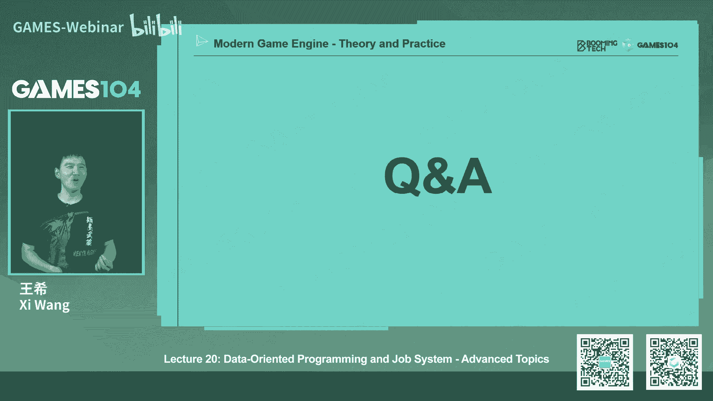

# 20.现代游戏引擎架构：面向数据编程与任务系统 (Part 2) ｜ GAMES104-现代游戏引擎：从入门到实践 - P1 - GAMES-Webinar - BV1Md4y1G7zp

那接下来呢我们给大家讲的是什么呢，诶就是家这个特别喜欢的d o p对吧，面向数据的变态，听上去非常高高大上，那么在我们先讲db之前呢，我先跟大家简单的就是快速的过一下。

就是说哎各种各样的编程的paradi，就是编程模式，比如说面向过程的编程对吧，面向对象的编程对吧，o那个o p我相信我们所有的同学学的最多的就是op了，对不对。

那其实的话呢其实在我们在做游戏引擎的时候啊，我们各种编程范式都会用的，其实呃这也是我后来进入到游戏引擎这个行业的时候，我才意识到一件事情就是1000，我总觉得自己写代码还不错对吧，就凭着一点小聪明。

我这个代码写的也挺好的，但是当你面对一个游戏引擎这么复杂的一个系统的时候，你会发现就是你不读书是不行的，真的游戏引擎真的要读书，就是说你要学各种各样的编程的pattern。

就是design pattern，大家我记得以前有本书吗，特别好玩，就是那个封面上是个女孩儿，戴了个眼镜，老师这样盯你看叫什么，design pattern，教你各种比如说listener啊。

什么这个机制啊，教你什么publisher，什么subscriber的这种pattern，你是面向过程的编程呢，你还是面向这个就是对象的编程呢对吧，这件事情其实对游戏引擎来讲是一个非常重要的一个。

这个怎么说呢，你一开始要想清楚的一个问题，那么这里面的话呢，其实在早期的游戏引擎其实比较简单，比如说我们要做一个小乌龟的这个这个这个游戏的话对吧，小乌龟吃豆子的这个游戏，那其实很简单。

就是他就是用面向过程就好了，一个函数对吧，我各种情况进来，我的数据做各种处理，我各种输入和输出其实非常的简单，但是呢其实我们一旦讲到这个现代游戏引擎的话，大家很天然的。

大家学过的component的系统对吧，我跟大家讲了数据集成是不是跟数据集成一模一样，对不对，不好使啊对吧，我成为一个g o，我可以派生出各种各样的东西对吧，vehicle啊，飞机啊，武器啊。

人呐什么都可以，万物皆goo嘛，对不对，那这个思想其实就是面向对象的思想，就是object oriented programming，这个思想其实非常的了不起啊，就是从它诞生至今的话。

实际上它非常非常的符合我们人类对这个世界的认知，所以他去写代码的时候，其实你写起来会很舒服对吧，那么object orange orange programming，它是不是完美的呢。

实际上今天呢我要开始去黑他了，你看这个我们为了都是我们的d o p就是面向数据编程，我们就开始开始狂黑我们的老朋友，这个op编程对吧，那o b编程它其实第一个问题是什么呢，他虽然理论上你会觉得很舒服。

但是他有很多的r一系，举个例子，比如说我一个actor，他的战斗逻辑，你比如说这里面的这个怪物，它是一个actor对吧，那个人也是actor，他们俩都是g o，那我现在怪物这个人去攻击怪物的这件事情。

我是把它写在这个，就是说人这个逻辑就是我去attack对吧，我去apply damage to，然后你们来传一个我我target的这个这个这个extra或者target的g o，还是说诶我被收集了。

我这个这个这个就是说我这个龙，我说been damaged对吧，我被人打了，那我谁来打击我，谁来打我的，他给我造成多少伤害，其实你会发现就是虽然面向对象看起来对这个数据分析的非常的清楚。

但是这个操作就这一个动作，他到底归属就是动作，在o里面就是一个function对吧，就比如大家想象一个目前对象的语言，你有很多的这个变量和这个这个类下面会有很多它的function。

那个function就是动作，那这个动作到底是挂在这个这个这个在这个案例里面，是这个攻击者呢还是受益者呢，其实这是有2亿性的，而且不同的程序员它有不同的写法，大家如果打开一些游戏的这个逻辑的代码。

比如说你们真的打开一个真正的商业级游戏的时候，你发现这种游戏它有很多的程序员一起写吗，你会发现有些程序员就喜欢从这个攻击者的角度去写对吧，有些程序员就喜欢从数据角度去写。

然后两啊这个这就是this is real，这是真的这个这样的，所以这个时候你就很蛋疼，就是面向对象的时候，你就会发现哎呀这个代码的一致性强迫症患者又受不了了，对不对。

那么第二个就是这个面向对象的一个很大的问题是什么呢，就是说它实际上是一个非常深的一个继承数对吧，那我现在假设我说我对一个东西造成了一个魔法伤害，我一层层的继承，其实我并不知道这个魔法伤害这件事情。

你是在base class里面，比如说gu内层做的呢，还是在actor这一层，是所有的actor都能受到魔法伤害呢，还是说你在这个monster这一层去这个继承去做的，所有的monster受到魔法伤害。

还是说派生出来说monster，你的这个flying呢，或者能变身的这个monster里面去，他能受到这个魔法伤害，大家想想看，是不是当你面对一个几百万行的这样的一个，真实的游戏引擎代码的时候。

你现在这个时候当你产生了一个需求，你想了解这个事情是在哪个函数实现的时候，你在这个深不见底的这个这个继承数里面去找到这个函数的继承，这其实也是一件非常逗那个头疼的一件事情，而且就像我刚才讲的。

就是它是具有很强的恶意性的，有的时候有的人觉得这个东西是个通用的需求，我要写到鸡肋去对吧，积累才是有道理的，有人觉得哎呀这个不行，这个是很特别的，我得把它写到派生类对吧。

排序内派到最后也发现诶这个东西又是共用了，怎么办，我们把这个函数又移到它的积累里面去，其实如果大家去写这个就是o的这个程序员的话，这是我们的日常，我们经常会在这样的一个这个纠结。

这到底属于这个叫基础服务还是属于特殊服务，这个问题上会纠结很久对吧，这个也是我们程序员之间的这个这个日常的对话，好，那还有o还有个什么问题呢，就是唉这个问题是我觉得也是很头疼的问题。

就是这个base class就是鸡肋，会做的非常的繁复，这里面就讲一个案例吧，在这里我们就不黑了，是你某个引擎吧，某引擎的actor积累，大家有时间可以研究一下，你会发现就是说我的天呐。

这个actor里面放了无数的功能，连迪巴克做这种功能在里面放了我，我当时第一次看到这个代码的时候，我就说我的天呐对吧，但是你仔细想想，如果我们在做一个真正的商业级游戏引擎的时候。

你会发现你还真的是这样的，这里面就是会放很多很多功能，所以就是当我去写一个非常小的功能的时候，我派生是actor的时候，我会发现就是我本来只要你这么几个功能，结果你给了我一个全家桶对吧。

这个大家想想这是不是一个商业销售的一个经典套路，其实在我们的程序员开发里面的话，我们有时候也会干这样的一件事情，所以其实这个base class的这个肮脏臃肿，实际上是oo的一个一个大型系统啊。

o o做到大系统做到后来大概率会发生的问题，那么如果大家这个想一切身感受这件事情的话，可以打开任何一个商业引擎的源代码，大家就知道我在讲什么，ok那另外一个的话呢就是o还有一个很大的问题。

就是性能其实很低，那为什么o的性能很低呢，因为其实o它非常符合我们人的直觉的数据的理解，对不对，但是大家发现没有这些数据啊，全部会分散到各个的这个object里面去。

而且呢这个object通过派生继承它的数据全是异构的，然后他就每一个对象的创生对吧，allocate deallocate都是这个分散的进行，所以它在内存中啊。

你们如果你们看一个oo系统的内存抓下来看的话，那真的就是东一块西一块，东一块西一块，那大家想想我们的cpu怎么去处理，是不是很疯狂对吧，很难受了，对不对是吧，所以它的内存是全是分散掉了。

那么另外一个是什么呢，就o里面它是有这个类的这个函数的这个派生和继承对吧，其实很多函数会被重载，那么还有什么呢，虚函数对大家知道什么虚函数的概念，对不对，好啦，那就是虚函数是什么，全是指针。

所以这段代码也是在内存中跳来跳去的，就是你本来这段execution的这段code是在一个地方，但是到另外一个执行到这块，突然跳到另一个地方执行另一个函数了。

所以其实o的系统如果你用profile工具去看的时候，你会发现它的profiling是非常的，就是怎么说呢，非常丑的，这边是我们一个图了，大家看到这个图，你不管你懂不懂，这个就是这个高性能开发。

你看到这个图基本上你就知道嗯，这个系统的性能做得不是很好，它非常的不稳定，所以其实欧有非常严重的这个性能的问题，那么第三个呢呃也就最后一个吧，就是o有一个更难的一个问题是可测试性，其实大家想象一下。

就是说我们一个非常复杂的系统，你们有几百个上千个模块对吧，那我经常的每一个模块，比如说我要去测算这个啊，比如说角色的某一个业务或者是某个业务逻辑，比如伤害结算这个逻辑是不是对的，就是这个逻辑应该被人改。

对不对，我要确保它的公式，最后的测试项全部都通过，那为了测试这个伤害的这个计算公式，我们需要干嘛呢，如果用oo写的系统的时候，我们需要把整个环境给创建起来，我们需要把这些这个所有的对象。

所有的东西全部拿起来，然后呢我再去测试，中间呢有一个函数，对不对，因为我要把整个对象全部创建起来，但实际上呢在现代那个就是说软件工程里面，我们一般讲的概念叫unit test，他最理想的情况是什么。

就是你一个庞大的code base对吧，你的代码可以一直改，但是我有比如说几十个上百个这种unit test，他只去测你的一个特定模块的数据，所以你为了测那个数据，你得把整个对象筛选出来。

那么对象一层套一层一层套一层，到了之后你就很难把一个面向对象的这个世界里面的一个对，就是一个元素提取出来，对它单独进行测试，所以o的话你面对一个非常重度的oa系统的话。

你对它进行这样的一个就是说unit test的话，这个代码其实是非常非常难写的，这也是欧啊传传统上有很大的一个问题，其实现在当然了，克服这个问题的话呢，方法不仅仅是这个就是面向数据编程。

其实还有其他的方法，在今天呢我们不展开，比如说面向函数编程对吧，那其实也能解决这个问题，但为什么有这样的不同的编程的parade存在，其实跟这个也是有很深的关系的，特别是在这种超大型的软件工程。

因为一个游戏引擎啊，真正的一个到达可以用的规模的话，一般都是几百万行以上的代码，那这个时候其实它的可测试性实际上要求也会非常的高，所以我们用前面大概十几节课，大概19节课给大家讲了。

这个就是这个游戏引擎的架构，一直在用o的速度跟大家讲，诶，我今天为了卖我们的这个面向数据编程，你看我就狠狠的把我们的oo也黑了一遍对吧，这个真的真的就是这个我们这个叫叫什么叫喜新厌旧，我们都是大猪蹄子。

看见好东西就把老就把这个新人胜旧人了，我们就把以前的小甜甜现在叫牛夫人了，好那接下来我们就看看我们的小甜甜长什么样啊，那其实呢我们的小甜甜叫什么呢，叫这个dorange programming。

面向数据编程这个名字听上去就非常的高大上，确实是很高大上，那么它的基础原理是什么样的，就是说事实上就是现代的计算机的发展，我们会发现一个很有趣的一个一个特点。

就是说我们的processor的速度其实是越来越快，但是呢我们的内存访问速度实际上增长的速度跟不上我们cpu速度，刚才就跟我前面讲了一个东西是矛盾啊，前面我讲哎呀这个cpu已经发展它它到它的这个瓶颈了。

对不对，我们必须要多喝了，诶怎么现在你又去讲说哎cpu发展速度很快，把这个内存甩到后面去了，其实所有的东西都是相对的，这没有办法，就是说确实在过去的20年里面的话，我们的cpu是以将近上千倍吧。

往下去讲，但是我们的内存访问速度呢大概也就提高了大概十倍左右，一个数量级左右，所以这两个之间的差距啊已经拉开了，将近是两个数量级以上了，2~3个数量级以上，所以这个实际上也是为什么就面向数据的。

其实这里面直接导致了，就是说现在计算机里面有很复杂的这个叫cash的这个机制，其实在前面讲render的时候，给大家已经讲过这件事情了，对不对，那么这也直接导致了就是我们面向数据编程这个思想的产生好。

那为了解决这个问题的话呢，其实在这个就是现代计算机架构里面的话呢，我们会做这样的一个叫cash机制，他你可以理解成就是他像个水泵一样的，就是说我们会cpu在最上面。

那好靠近最靠近cpu的是我们的l e cash，那也是最快速开的cash，它能体量也比较小对吧，那么接下来的话呢就是我们的第二季cash叫l two cash，一般来讲是十兆左右，现在已经很难。

我记得最早以前我买电脑的时候，只有两兆的l to cash，现在大家动不动可以买到十兆的l two cash，但是这个cash的话呢，它的速度大概比l e快慢一个数量级左右。

好af cash是不是直接跟内存一打交道，其实没有，早前只有两层，但现在的话一般还会做l3 级的cash，它呢一般是在就是十几兆到上百兆左右吧之间，那么它呢实际上是比l two开始又去卖一个数量级。

然后再到主内存，内存又慢一个数量级，所以它们之间依次是1000倍的差距，所以说当我cpu在进行处理的时候，无论是你的代码也好，还是你的数据也好，就通过这个cash。

就像那个就是像那个什么叫分级水那个水泵一样的，一一磅一磅一磅的，把你的这个水就是我们的这个data从内存导到我的l3 l3 ，导到l2 l2 导弹l1 ，然后cpu才能对这个数据进行处理。

那处理处理者诶发现数据没有了怎么办，哎那没办法了，现在l一找l一没有怎么办，问l r有没有r2 要有好，等一下你从l r调上来，如果l2 说唉我也没有怎么办，那好那不好意思，那就l3 掉。

l3 是我也没有，那怎么办，不好意思了，那就从内存去掉了，那这样的话一路问完之后，当你决定要从内存中调数据的话，那基本上是1000倍以上的这个这个成本速度变得很慢。

所以说今天我们在做整个高性能编程的时候，实际上这就是我们always keep in mind，就是脑子中一直有这个图，就是我们对这个cast是不friendly还是不friendly是吧。

那么其实呢这就导致了就是当我们在写编程的时候，我们会非常讲究的一件事情，就是说我们的数据是具有locality，就是数据总是很紧的在一起，我对数据处理的时候尽量是一次性处理，哎大家这个概念是不是很熟悉。

对的呀，因为我们在讲这个就是渲染的时候，讲到这个渲染如果要做得好，怎么能做得好，你必须要理解gpu是怎么工作的对吧，gpu里面有什么也有开始啊，对不对，他gpu里面那个他每一个那个rapper。

那个每个rap对吧，每一个这个这个库塔核对吧，他也是要从各个cast里面去读数据的，这个数据的话它也有显存，那实际上的话呢就是说它也是需要就是保证这个数据尽可能的local。

这样的话我的这个cpu才能疯狂的跑起来，才能读这个数据，那么这里面最简单的一个方法是什么呢，是s m d对吧，其实我们在讲render也已经讲过这个概念了。

就是现代的这个cpu基本上全部实现了m i d，就是说你对一个四个vector啊，就四个这个float的加减乘除，你可以把它看成一个vector for，然后呢可以一个指令全部做完。

它一次性会读四个内存的这个空间，而一次性写也是四个空间，所以当我们去packing这些data的时候，我们尽可能把它packing成这个a这个一个sm d的，比如16个bt的这样的一个一个空间。

这个东西够不够呢，其实还不够，其实这里面今天给大家的就是这里面的话呢就是内存中的cash啊，它的数据是有一个管理的原则的，实际上这个你们原则的话最简单的做法就是什么呢，什么意思。

就是说我的cash一旦满了之后，我会把那些不就是在最近一直用的东西，我会留住，把最不常用的东西，就最近最没有用的东西，我把它扔掉，其实是一个非常简单的一个调度算法。

但这个算法的话呢实际上是一个经典算法了，但实际上还有一种算法是什么呢，叫随机的扔掉诶，大家会觉得你不是这个很合理的，是说在cash里面，我最近最近听来的东西，扔掉这个这个留在这儿，这个不长。

那个就稍微远一点，不用的东西，那个留在那个扔掉，这不是一个正确的做法吗，那为什么你会采用随机呢，其实这是个概率的东西，就是说如果你的cash足够大，想象一下，比如说我有个将近1k或者一兆的时候。

假设我每一个tick我随机扔掉，比如说64k64 个bt对吧，或者是128个bt，它相对于整个这个存储空间来讲的话，可能是1‰左右的这个地方，那你这样随机扔掉的一个基础是什么，是这个数据没有被访问到。

你会发现就是说当你从概率去讨论那个去去讨论的时候，你会发现就是随机扔的策略，那么实际上就是说啊就是最近没被用到的数据，只要我被随机扔掉的话，实际上也符合了我们那个数学期望，就是说谁最久没被用到的东西。

它有最大的概率会被扔掉对吧，所以其实呢这也是一个cash管理的机制，那这也是为什么我们在pc数据和代码的时候尽可能的放到一起，那这个时候呢我们要需要理解一个概念，就是说在内存中啊，我们去管理数据的时候。

我们有个cast live概念，就是说一般来讲我们一次就是从这个比如说l2 l3 扔到l two，l two的l一的时候，我每次取的是一个cash line，就是大概是64个bt左右。

就数据一个line，一个line的读写，实际上他这个讲起来就比较抽象了，就是说比如说我们看到一个我们第一个变量，一个是一一个，就是说呃integer对吧，我们定义了一个数字，其实啊他在cpu里面。

如果它你对它进行计算的时候，他是不是在最顶级的cash，就l一里面有他的一段数字，有一段内存，对不对，它其实在l2 里面也有他的一段l3 里面也有一段，在内存中也有一段。

而且呢是整个操作系统和cpu要保证应该是cpu，它要保证在这三个cash和memory的它的数据最终是一致的，而这些数据的读和写的操作其实呢是按照一个cash light进行的，什么意思。

就是说我一次性去读这个64个bt的数据，我去对它进行赌的操作，如果这些数据发生改变了，我我要必须要写回主内存的时候，我也是一次性的一级一级地写下去，所以其实我们cpu在处理数据的时候。

他是用csl的机制进行处理，那这样就会导致一个非常有意思的事情，就是说诶我们如果做一个array，做一个啊，不是array做一个取证吧，那我们怎么去读它和写它的效率高呢。

其实这里面大家会发现就是同样的一个矩阵，如果你假设这个数据是按照这个一行一行的存储的对吧，那你逐行的去读它的话，你的效率可能比你拙劣的去读它的话要高个几百倍甚至上千倍，为什么呢。

因为当你这个矩阵非常大的时候对吧，它在内存中连续的程序，但是你如果按照列取程序的话，你虽然只是往下移了一个y坐标，加了个一，但是他在cast line上可能跳过了很多次。

然后他每一次要被迫的从my memory里面一层层的往上去放数据，所以这个时候它的效率其实是非常非常低的，所以这也是就是当我们去对数据进行访问的时候，它的order非常的重要。

你要是按照这个order来，但这个具体在写代码的时候，大家就能有感觉，大家可以测一下，如果有兴趣可以去测一下这件事情，那么其实dorange的programming它的核心点是什么呢。

就是他认为在游戏里面我的所有的这个事件发生的事情，所有事情的表达它都是数据，它也是一段数据，而这段代码和这个就是说数据放到一起，我核心关注的点是什么呢，就是说这个所有的这些东西在cpu中的话。

我要把它的cash miss降得越低越好，这里面开什么miss，哎我这段代码执行完了，我要我要加载新的代码了，新的代码也会导致我的开始miss，就是这里面我给大家显示一个profile。

就是说你会发现就是说导致了我们的时间消耗中，将近有7%的消耗是什么，就是我这段代码执行完了，我要被迫再去弄个新的一段代码，我有7%的性能损耗在这个地方，大家想象一下，这是不是远远的高于我们大家的想象。

我们一直觉得啊数据的访问，数据的处理比较慢，其实人家代码的优化都是这个当你做高性能编程的时候，你要去思考的问题，所以说呢其实在这种面向数据编程的时候，我们会把数据和代码看成一个整体。

而且我们尽可能的要保证数据和代码都尽可能紧密的，就是说在cash里面在一起，注意内存中他们可能分开，但是在cash里面我们要尽可能在一起，这样保证就这一段代码执行完之后，这些数据刚好能够处理完。

接下来的话呢哎我们在swap下一批的数据和代码在一起，这就相当于是说我这件事物的处理者和我要处理的事物都是在一起，千万不要就是a就像这个打个比方，现在工厂里面啊，比如说我们要做一个斜的加工。

我们还是继续鞋厂为例，那我们希望就是这个工人就能处理这些鞋的这个工人，和他的这个要处理的这个鞋的这些工艺，这些这些原料全部放在一起，这样的话呢他能一次性处理完之后。

哎我再把这些这个工人和谐这个这些制成的东西全swap出去，然后呢我再换一个工人和他家处理的东西，这样的话我的效率就会非常高，那千万不要出现什么情况呢，就第一就是这个工人只能做一道工序，做到一半。

你后面的工序需要另外一个功能来，你这个要切换工人，你要再从再从那个就是memory你把这个工人给调出来，对吧，那那我这些数据在这等这个工人了，还有一种情况是什么呢，就是说哎我工人是确实可以处理完这些鞋。

但是呢这些鞋的原料四散在各个地方，我做到一半，我要从别的地方去掉原料，这两种情况都是面向数据的编程，很核心的想去avoid就想去避免的一种情况，他有的时候比你传统的o o的话高。

就是一个到两个数量级是很正常的，大家听听这个数据是分开了，能快将近100倍，诶这个东西真的是不夸张的，就是说比如说像那个就是啊u体做过一个测试嘛。

就是他用那个他的那个d o t s的系统做了同样的一个东西，大概能快到呃，差不多接近100倍以上，这也是就是你的这个系统和代码必须要这样去架构，才能有这样的一个能力好。

那所以呢这个地方如果大家知道了这样一个基础知识之后，那第一点的话呢，诶我们在做这个任务的时候，我们尽量的避免就是说要对于他的执行顺序的这个order dependency。

这个在前面其实讲的编辑时候跟大家讲过了对吧，就是尽可能让它之间order是无关的，那这样的一个无关为什么这么重要呢，因为很简单，就是说其实这里面有很重要的概念叫fourth sharing，什么意思呢。

就是说我们有两个函数，他们在写一个，比如说读写一个变量，比如两个人再改一个变量，一个人在读，一个人在撇，但是如果这两个线程的任务，他们在写这个变量的时候啊，实际上它在内存中是在一个cash line。

就是正好在64个bt里面的话，这个时候对于整个系统来讲负载特别大，为什么呢，系统你去读它的时候，它要这个要确保就是这个数据all the way到l一的那个cash对吧，你去改了它另外一个人去。

比如说你去你去那个改了他另外一个人去读它的时候，或者两个人同时在写他的时候，他整个这个think和读的过程要专门的做两遍，才能让你的数据一致，所以呢当我们在写这样一个超高性能的这个系统的时候呢。

我们会尽量避免两个线程会同时读写一个csline，这个地方就要求意味着就是说你不要把很碎的数据，就是同时让两个线程去访问，基本上就是一个线程访问的数据就是自己的这一块，双方尽量不要有任何的交集。

否则的话你会发现就是说你觉得你没有做什么操作，而且你也保证了他们彼此之间写的地址是不一样，但是只是因为它的地址是在那个一个开始的范围里面，会导致整个这个内存swap的成本要高非常非常的多。

那么第二件事情呢也是代码上，就是大家以前会经常不注意的一件事情，就是说我们在写代码的时候，我们今天会写什么呢，写if else对吧，if something else something，对不对。

这个写起来非常的舒服，非常的逻辑清楚，但是其实在现在cpu里面啊，它实际上会做一个东西叫什么呢，叫branch prediction，就是我会预测这个branch对吧，哎这个人大家会觉得很奇怪。

你凭什么预测我这个事情发生什么呢，但是呢没办法，就是cpu呢他为了追求极高的性能，因为他会发现就是说在很多时候，你100次进入到这样的一个判断的时候。

可能有99次甚至100次走的都是上面那个branch对吧，可能是第101次会走到下一个branch，所以呢在实践中我们会发现就是branch prediction是个非常有效的，这样的一种方式去处理。

那这样的话，但是它就意味着他会提前把那一端就是这个branch if着你们的，比如说这100行代码提前加载到我的这个l e的cash里面去，这样cpu可以直接去执行它。

注意这里面就讲d o p的一个核心概念，就是说我们优化的不仅仅是数据啊，我们优化的还有代码，那么那这样的话呢，但是但是这时候如果你在下一次进来执行的时候，这个条件突然不满足的时候。

诶这一段代码在l一开始里面他就无效了，他就他要被swap出去了，然后我再去调那个else的那个200行代码，它掉进来，那这个一调的话，如果很不幸的是，这段代码既不在什么l two cash。

也不在l3 cash对吧，它是个冷代码，在在we meer里面的话，那就麻烦很大了，那这个系统就要等很久，所以说如果大家做个测试啊，你们去写用非常随机的数据去测这个就比较复杂的ef s的判断的时候。

你会发现这个代码的性能就会非常非常的低，其实就是因为cpu他在做这个branch prediction的时候，就会这个产生很多的错误，那这件事情呢举个例子，就是说比如说这个函数非常简单对吧。

说诶我从一到十，如果呢你这个中间中间这个这个这个a的这个数组里面的数字，假设大于十的时候，我就做第一种工作，如果不大于十，那我就做第二个工作，那其实你会发现就是他在前面走走走走，走到八也没有问题。

但走到11的时候，第四个元素的时候他就错了，好他就他就那个那个branch prediction，那个系统，就cpu里面他就会说好，那我把下面那个else里的代码给调进来诶，但是呢做着做着就发现不对了。

我靠这个你又小于十了，怎么办，哎我就把那个就是这个这个就是衣服那个代码也掉进来，这样来回倒腾的话，其实你的系统的性能就会下到非常的低，那这种情况你怎么办呢，其实呢有一个简单的方法对吧，答案就能想到了。

那我能不能先对这个数据进行排个序呢对吧，排完序之后，那这样的话你可以看到这个血液里面，它只有在11的时候需要做一个切换，而后面的话就基本上全是els的代码，前面全是if的代码。

那这个性能的话就是如果排序的时间不算进去的话，那假设你的这个读方式一方块二的话，其实是比较麻烦的话，那这个函数的性能它就会高于前面那个函数的性能，大家想想看，同样是逻辑的代码对吧。

你的实现方式不讲效率就会变得非常大，那真正的在就是我们的就是说这个更高性能的要求的时候，一般来讲我们会提前的把这个数据分好，就是简单来讲就是说我们尽可能避免复杂的这个if和else，而我们一上来的话呢。

会对数据，比如说我在创建每个数据的时候，我会加到不同的数据容器里面去，然后呢对于一个容器的处理，我只做一个逻辑，就是保证你的整个逻辑是高度一致性的，大家会觉得这件事情真的那么重要吗。

但是如果你真的在写这种高性能代码，特别是高频的代码的时候，大家就会意识到这件事情对性能的影响真的非常大，特别是这个branch prediction的话，对于这个就是性能的store。

因为那个时候你即使数据在cs里面也没有用了，为什么呢，因为它的代码要去swap，然后呢有的时候代码swap又会导致这个数据无效，所以是非常的麻烦，所以我们会非常就是鼓励大家。

如果你在写这种高性性能的计算的时候，尽量的减少这种branch的运算也是这个道理好，那其实呢第二个呢就是说哎对于这种超高性能的，这种高性能的这种代码的开发的话，你的数据该怎么去摆发。

其实刚才已经讲了一些基础的概念，就是说其实在memory的话，就是刚才讲的面向对象的话，它的数据就会通过各种各样的引用啊，指针啊，就是满天飞对吧，特别像现在很多同学已经不太接触。

比如像c和c加加这种底层语言的时候，其实大家对一个对象，它在内存中的到底怎么放的，大家其实没有感觉的，我们都扔到各种各样的容器里面，对不对，容器里面什么功能都有什么反射啊，什么都有特别特别的方便。

确实是这些代码写起来真的很方便，但是的话呢如果你要去写这种高性能的开发的时候，你还真的需要理解像汇编啊，像c语言这些底层的东西，那这个时候呢你去arrange你的memory的时候就要非常的讲究。

这里面有两个很重要的概念，一个叫array of structure a，一个叫structure array this sa，听上去是不是很这个这个这个很高大上啊对吧，但其实他的想法非常的简单。

就是大家想象一下，如果我们是用的这个oo的思想去定义或者一个定义一个结构，比如说一个particle，那它所有的属性是不是一个structure对吧，那我假设第比如说100个particle。

你最自然的在内存中的这个数据排布是不是a第一个particle的position，velocity对吧，它的color，它的age对吧，接下来是第二个，第三个，第四个，这叫什么呢。

叫array of structure，那这样的话当你对这个数据进行逻辑处理的时候，你会发现你需要没，比如说你你你做一个函数是要更新它的position的，你实际上是要读什么呢，它的velocity。

它的position对吧，但是呢你为了读这两个数据，你每一个party的时候，你都要跳过去跳，因为你要跳过后面的color和edge，这样的话你的cash coherence就不够好。

而当我要进行一种超高速的这种数据处理的时候，其实呢我们很多时候是把数据and structure array，就是同一个数据，我直接排成一个超长的r来进行处理，这个思想啊，其实大家再去看那个。

其实大家真的理解现代高性能高性能编程啊，实际上有一个东西是特别类似的，就是大家理解一下，比如像那个好像computer shader，像在gpu上，为什么同样一个运算上了gpu对吧。

上了显卡就变得非常的快，其实显卡他骨子里面就是一个以数据为驱动的这样编程，就是每一个shader你可以理解成是个函数啊，数据的话呢就非常紧致的，这样排不起来对吧。

那其实的话当我们去arrange这个data的时候，一般来讲如果你想追求高性能的话，我们会按s a的方法去排除他所有的数据好，那接下来的话呢就如果大家懂得这个概念，就进入了大名鼎鼎的这个叫ecs系统。

就是antity component system对吧，这个我相信如果对游戏引擎感兴趣的同学的话，对这几个概念就会耳熟能详，我我得首先道个歉，就是我不要首先我在这地方道个歉。

就是说实话这节课讲的东西实际上是比较晦涩的，而且要求你有一定的这个开发的这个基础，而且很多概念它概念有很多，但是呢你哪一个他之间的关联不像大家想的那么紧密，它很难做到一环套上，为什么。

就比如说最后我们讲的这个e c s系统的时候，它实际上就是前面那么多零散的概念，最后串在一起诶，大家提出了这样一个架构，就是说我们最开始去构建这样的一个游戏引擎的时候。

我们会天然的想到就是我之前讲的component base的系统，对不对，用组件搭出一个我们想要的东西，那么这里面的话呢，你最自然的一种实现方式是用那个用oo的方式。

你就会去构建很多的这样的一个一个对象，一层的派生继承，那显然它无论是它的代码是分散在各个那个就是类里面对吧，还有虚指虚函数只占一塌糊涂，另外一个他的数据也是非常的分散。

所以这样的代码执行起来它的效率非常低，如果同学们尝试写过用oo方法实现的，component base的这样的一个机构系统的话，当你的机构里面confirm变得多，当你的肌肉变得多的时，候。

你每一帧去tick它，你会发现它的性能比你想象的慢很多很多，有的时候你都很郁闷，你说我其实也没有做什么特别复杂的运算呢，那为什么我的系统性能这么慢呢，其实大家今天如果听懂了前面的第一个就是说就是cpu。

它和内存和cash是怎么写作的，你就知道其实很多时候我们会浪费在非常无效的，就是cpu等指令加载，等数据加载对吧，执行到一半发现数据没有了，我又去找那个数据，然后数据值现在一半又发现我要调另外一个函数。

这个函数是个虚指针，我要开始去找那个函数实现，然后找到那个函数之后，我要再把那段pc code再去加载，然后就这样来回倒腾，就搞得一塌糊涂，所以你可以认为这个工厂就是他没有人管理他所有的师傅。

就凭自己的感觉去做，做了缺原料，我就去从库房拿原料，这个我我只会做了这个鞋底，我会做斜面，哎，我就去把这个鞋底的鞋面去递给另外一个做鞋面的师傅，然后大家去做。

所以整个的这种就是说你可以认为整个任务的调度是完全无序的，所以这就是component base以及oo的导致了一个很大的问题，而ec s系统他就想彻底的解决这个方法，那他这个方法呢其实提出来之后。

它的核心想法是这样的，第一对所有的我们的g o哎，我们叫什么呢，我们叫做entity antt呢，在我们的这个就是component base系统里面，它是个什么呢，哎它是一个类对吧。

这个类里面可以装很多的component，对不对，那在这里面的话呢，nt t是非常非常的清亮，它就是一个i d i d指向了一组component，哎看这个我看到有点像，对不对，好。

第二个就是它的组件组件呢在ec里面的话呢，实际上指的就是一个一组一块数据，比如说一个位移数据，一个速度数据这些数据，而这个component的话，实际上它没有任何的业务逻辑，注意啊。

这个就和我们前面讲的这个component base这个系统不太一样了，因为以前我们讲每个component有什么有很多接口，对不对，有t k有什么get property啊。

set property啊，一堆的这种函数诶，但是在ec里面这个是特别容易弄混的，就是说他的component是不允许有业务逻辑的，它就是数据纯数据对吧，你可以对他读，可以对他写。

但是呢他本身并不知道自己的意义，而接下来有一个更抽象的概念叫system，system是什么呢，诶我来对这些component的进行处理，比如说我有一个比如说a moving system对吧。

它会根据你的速度去改你的position，对不对，我有一个叫health system这个函数，它会根据你这个受到的这个damage，然后呢去调整你的health值等等等等。

所以呢它实际上就是把数据全部打平，而且呢把这个数据从它的owner，从以前一个个的g o全部播出来，每一个每一类数据全集中在一起去存储对吧。

然后呢但是呢每一个机他只是说啊我用了这个多少号的这个transform，我用了多少号的velocity，诶这个用这样一种非常离散的关系关联在一起，而对这些数据的处理是由sim进行进行的。

而system他对数据的处理呢，它其实对着component的处理，它并不是一次只处理一个component，比如说我们前面在这个g o的这个component，这里面的话。

其实component很多时候它是对自己的member数据进行处理，对不对，但是呢这里面有一个概念，大家一定要弄清楚，就是system呢很多时候它会同时处理好几类component的数据。

因为这个他就是说因为我把这个单位拆得非常非常的细，所以ecs模型呢是一个大家提出的一个理论框架，就认为用这种模型的话构建的这种系统的话。

他能够充分的利用就是这个这个数据的cash的这个那个coherence对吧，充分的压榨这个这个就是面向数据编程的这种性能，因为你可以发现这个system去处理的时候，它的它的操作是非常简单的。

就是我很容易把system的计算分散到很多很多的和上面去，这也是ecs系统一个很大的一个优势，好这就是一个excel系统，大家听上去是不是有点晕了，很抽象了，对不对，确实啊这个概念其实是有点抽象了。

但是呢你会发现它在实际中的话真的很有用，那怎么去解释这件事情呢，我当我在背这门课的时候，实际上是非常难的，因为我觉得就是说呃你前面的这些概念全部理解完之后呢，大概能知道我在讲什么。

那带这东西的一个实际中的一个很好的应用是什么呢，哎我想到了一个帮手，就是我们把大名鼎鼎的unity的这个d o d o t s系统给搬出来对吧，unity呢提出了这个dorigin的text这个系统。

那么这个系统的话呢，好像现在他们已经决定放弃了，但没关系，不妨碍我们这个去拿它来去分析一下，就是说esc系统的整个应用，你会发现就是说unity自己在讲说他的d u t s系统呢有三个支柱系统。

第一个呢就是ec，它是重新的面向数据去组织它整个这个计算的这个框架，引擎的框架，第二个呢诶他有一个c sharp base的这个job system，为什么呢。

因为我既然已经把数据变成这个component了，都要变成这个system了，那我就非常容易地把它b性化处理，我做了一个非常简单的josim，然后呢他还做了一个很有意思的东西，是什么呢。

就是那个burst compiler，诶这个待会我会解释为什么他要重新做过confia这件事情，其实很很很很疯狂，就是你要还做过编译器，但是呢其实如果你想实现一个这么高的数据访问的这种那个效率。

同时呢你要去实现这种quart这些机制的时候，其实你会发现就c sharp的原生的机制，它的效率是很低的，因为c 12 p本质上是跑在一个虚拟机上的，它并不是native code对吧。

而break compiler他最可行干的事情是什么呢，把这个东西全部变成了native code，就是就是等价于汇编的代码了，所以说这在解决这个问题，所以说这三个系统在一起共同工作诶。

它能实现了就是unity的d u t s的这样一个架构好，那我们简单的讲一下，就unity ecs它是怎么做的，首先第一个呢他也是把这个系统分成了无数个component。

但是呢它在上面抽象了一个概念叫archittype，architeb，什么意思呢，就是你可以叫做啊原型或者叫泛型的概念吧，什么意思，就是说你会发现比如说我要做一个呃n p c。

他所要用到的这个component，大概就这几个对吧，我想做一个就是说诶可以跟我战斗的这个这个怪物对吧，比如说monster它也是一个arc tap，它可能会多一些，比如攻击属性啊。

做一些这种伤害属性啊，或者一些行为属性啊，比如说我在做一个比如说veo，它也有一些相应的这个components，所以其实你可以认为就是那个archetype就是什么呢，type of guo。

就是这一类的g o，我叫做一个archite，那为什么他要做这个ark type呢，其实有个很大的原因，就是说当我游戏中有几百个上千个这样的entity的时候。

每个nt底下面挂的component都是不一致的，对不对，那我这个system在处理这些ntt的时候，我不能一个一个的去找他们的，哎，你有没有这个component，对吧。

你这component的这个我能不能用，那就这个问题很慢，但是我有archittype的时候，他就会让我这个就是处理的过程，就是我知道哪些entity我要处理的速度会变得很快，而且也方便别人去理解好。

我有了这样一个ark type之后，诶，这张图是他最经典的一张图，就是说他首先把内存定义成了一个个的chk，然后呢他会把一类ark type的所有的component。

按照他的component的类型唉放在这里面，就是一个个的去去放在里面，这样的好处是什么呢，你们会发现一个细节，第一就是说一个唱歌里面一定是同一类的，二黑，太对吧。

那就意味着当我有个sim认为这个唱k我需要处理的时候，我只要去问这个唱歌的archive，比如说哦这是一个npc的archit好，我现在要做一个就是比如说对话的system。

那我知道n p c这个tap里面有几个我需要的，come on呢，一定有，那我就对他进行处理，如果你这个是什么呢，哎你这个是一个就是载具的这个这个ark type好。

那你这里面这几十个载具我是彻底不需要考虑的，因为我没有跟你对话的需求，那一个唱歌一般多大呢，就早期的架构里面一般它设成16k对吧，其实这个16k是主要是考虑到就是说cast line啊。

考虑到这个l e l cash它是怎么去swap的，但是其实在现代计算机里面的话呢，这个一个唱歌的大小，我看了一下最新的一些资料里面的话，就是说这个唱歌好像变了大了那么一丢丢，具体的数据。

我们团队他们好像上次看，我记得是像虚幻里面把它提到了128还或者是更大一点，这个具体数据大家可以去查，这个是你们可以调的这个量，那为什么他不是把所有的同类型的component的全放在一起呢。

因为第一个如果我把所有的比如transform com的全放在一起，这些东西数据量就已经非常非常大了，它实际上也不符合我们的那个就是locality这样要求，而它实际上就希望这一段的sistent。

这一段piece of code code，这个这个代码和他要处理的这一小块数据正好能塞进去，处理完，我再把整个的下一个system和他的唱歌part往里面一塞，除了外。

这样的话它整个这个数据啊处理起来效率是最高的，这个其实是这个我觉得就是ecs系统是一个非常巧妙的一个地方，就是大家如果去写这个系统的时候，我是非常建议大家这么去干的。

ok那其实这个时候呢系统就比较简单了对吧，比如说我们现在做一个就是这个我们的这个这个这个就是哎我往前去，这个move，我是update the position的系统呢非常简单。

我只要拿到你的这个velocity的component和translation component，那我做一个运算，其实exist你可以理解成一个运算。

怕算完之后这个唱唱你的所有的物体的这个translation的这边，这个这个component都会被更新一遍，因为你无论是毒啊，血啊，它都在一起，所以它基本上这个效率是非常非常高的。

所以说unit也想说e s s系统的效率，就是刚才我讲了接近100倍的这个提升了，那这里面有个非常有意思的一个东西了，就是说那为什么就是哎我们这个unity要费那么大力气，去写一个burst的系统对吧。

去做自己做个编译器呢，其实这里面有个很有意思的一个事情，就是说如果你整个这个系统它是用c hr去写的话，那这些无论你申请的一个array对吧，你申请你定义的一个数据结构。

它实际上在硬件上到底对应的是个什么东西，完全是一个黑盒，它是跑在那个c sharp的虚拟机里面的对吧，大家想一下，在c 12里面，我定义一个变量，它根本就不是一个变量，它有很多的东西。

它存储的数据只是很小的一块，它有很多反射数据对吧，但是如果你要写这么高高性能的，几乎和硬件一对一对抗的这种代码的话，实际上你最需要的是什么呢，你需要native的东西，所以在这个ecs里面的话。

你看着你在去写c 12 p对吧，实际上你定义了一个array，你要明确的告诉他说，我必须要写native的这种container，实际上就很像我们c语言定义的一个真的就是一段裸指针，就分配了一段东西。

那么的话呢这样的话它才能和内存中的memory 11的去对应起来，所以你对他的数据访问才是能够一一的连续的去去去映射起来，否则的话就是对于高级语言的话，他下面发生的事情基本上是不可控的。

那么因为它是非常native了，哎你要加什么呢，你要加很多的安全的check，比如说像你写c sharp的时候，你不用去管这个内存的释放对吧，但是当你去写这样的一个，你就要非常花很多力气去考虑。

就是他希望是在编译器层面，在job system层面去确保所有的这些logo的或者这些无用的资源会被释放掉，其实这件事情是非常非常困难的，所以呢这个时候他就会必须要写一个自己的compiler。

那去把你的这个c sharc，arc的这个语言编译成其实非常底层的语言，并且并且完成必要的检查，所以其实我自己去理解这个就是那个dot系统，我觉得他做的其实是件蛮艰难的事情。

就是说他希望把他的复杂度全部藏在自己的身上，对于这个上面的业务的开发者来讲的话，你不需要理解这么多复杂的这种cash啊，这种这种东西你只需要去按照我的这个follow去写一个c hr的一个东西。

才能实现我想要的高性能，这里面就有个细节，就是说如果你想实现这种d u p的开发的话，如果你用c sharp的这个基础语法，你是很难写出来，分配啊，释放啊，你根本不知道它内存在什么地方。

这些东西都变得非常的抽象和复杂，所以的话呢就是说unity它要实现这样一个d o t s的这个架构的时候，它就必须要实现自己的一个compiler。

把你的c sharp其实他只用了c sharp这个语法，把它编译成了，就是它其实你相当于用c sharp语法，实现一个类似的这样的一个一个功能，所以这也是为什么就是他要写burst。

就是我用burst的方法编译之后，这个性能又提高了很多倍对吧，所以这就是这个大家通过这个东西的话，大家就能理解，就是说为什么就是说呃我们去实现dot系统的话，它的难度有这么大。

那么这也是因为他一开始用c sharp这个语言的，一个一个就是怎么说呢，一个弊端其实cp是个非常了不起的语言，我觉得是非常好的一个语言，但是的话在高性能开发的时候，他确实有这样的一个弊端。

特别是做dop类型的开发，唉这一点就不得不提我们的另外一个很厉害的引擎，就是虚幻引擎了对吧，那我最近呢我因为备课嘛，我们就课程组织很有兴致的去研究了一下，那个arma 5的最新的那个max系统。

大家想象一下最近rr 5最好的那个demo是什么刺客，那个什么刺客信条说错了，那个就是matrix reload，不是mhc reload吧，那个就是matrix那个demo对吧。

在中间大家看到那个曼哈顿，对不对，中间有成千上万的汽车啊，行人啊这些东西，而max系统中呢哎实际上就是而要自己实现了一套就是类似于u s的，类似于job系统的这样一个东西。

那么其实这个mac系统的话怎么说呢，我觉得其实也没什么好讲的，其实很像unity的d o t s，我甚至怀疑他们两个互相抄作业呀，但我就不去评论到底谁抄谁了对吧，那反正就是我看到的就是nt系统呢。

它首先那个e c s系统里面，首先nt的概念，那t d里面的话呢，它也一样，也只是个i d，这里面的话每个i d呢它是有一个siri d。

就是他那个单独永远往上ci number只是往上递增的这样一个东西，实际上就保证了这个i d永远不会就是被重用，其实有点像我们在之前跟大家教大家做憨豆的时候，你会有一个salt对吧。

就保证你这个id可以被重用，但是你这个两个数字是不一样的，这是个小细节诶，我觉得它比较有意思的东西是什么呢，就是在max这个系统里面的话呢，它它的component叫什么呢，它叫fragment。

哎我觉得这个词叫的特别好，为什么想象一下，如果我是写这个unreal的mac系统的人，我就很淡很头疼，因为我那边已经有1000多万行的代码，他在里面定义了无数的component，component。

component，你现在告诉我说，因为我现在实现的是e c s的pattern，我这个东西也叫component，叫此component a非彼component对吧。

而且我个人觉得component这个名字取得确实不好对吧，因为component会让我想起向下com啊，这些接口就你天然的会认为数据服务在一起的东西，但实际上在e s架构里面。

component它就是purely的data，所以呢在这个max这个架构里面，它把它叫做什么呢，叫做fragment a，一小块内存的碎片，一小块数据诶，我觉得这个名字听上去就比较好。

所以的话呢其实整个component的话，它实际上就是放了很多的这个fragment的这个数据，那么对于每一个这个nt来讲的话呢，哎我就会拥有这样的一些类型的这个这个这个那个fragments，诶。

我觉得farm教堂很顺口，那第三个我觉得他做的我觉得蛮有意思的，订婚也就是说sim esim system对吧，system我刚才讲的它其实就是一个函数，它对着一堆这个component进行处理。

他现在既然把抗风的变成了叫fragment，怎么办呢，诶他这个名字我觉得也处理的非常的好，他叫processor处理器，这个很贴切啊，就是说你给了我这么多数据放在这儿，对不对。

我一个processor把你的数据全部处理完对吧，所以说其实max里面这两个几个秘密，我个人还是比较推崇的，而一个processor有两大核心功能，第一大功能是什么呢，我去query。

就是说我需要对哪些满足我的nt对吧，它比如说我每一个这个processor，我需要多少种那个这个这个你的fragments或者多少种component，这component我到底是对你的读还是写。

所以呢我先要做一件什么事情呢，我叫query，叫frankon query，那么他呢就会通过一段描述说诶，我对这个company我要去读这一类的component呢。

我要去读这一类的这个这个component，我要去写，不好意思啊，这个我一会儿component，一一会儿fragment，大家都原谅我，因为确实特别容易混，但是他讲的是同一个东西。

然后呢这个时候当我去对我的query，这就像写数据库一样的，我我先定义了一段数据库query函数，好，接下来一个query函数，一个query操作相机，我就把所有的这个mtt扫了一遍，把这些数据拿出来。

那怎么去扫呢，其实在这个mass里面，他也用了archith这个概念，实际上他这种quy实际上会cash的，就是他上一次query完之后，这一次如果你没有变化的话，我基本上是不用动的。

所以诶我就把所有的我所需要的这些这个archetype的，这些entity的这些fragment全部拿到，接下来干嘛呢，哎我去execute，大家去看他的excel那个代码其实也非常的简单。

就是因为你做完了query之后，其实所有的这些fragment的全部我都拿到了，拿到之后呢，注意啊，这里面只是引用，他，并不是真的把这个数据搬过来，为什么他不需要把这个数据搬过来。

因为对于每一类的ark type而言的话，它的数据全部也是集中存储在一个一个的唱片里面，所以说我对他进行处理的时候，我一个processor，我处理完这个唱歌之后，哎我接下来下一个依次切换的话。

也是整个唱歌给切过去的，所以在这个时候它后面的处理就会相对比较简单一点，所以其实这就是这个max系统它的最底层的一个东西，这个东西的好处是什么。

就是能够让我们在这个虚幻五中能看到那么庞大的一个曼哈顿对吧，陈陈应该是上千上万的这样的汽车啊，人物它其实就用这套系统来实现的，这也是一个c s系统的一个典型的应用案例，所以呢其实这里面我想多说一句啊。

就是e s系统听上去非常的高大上对吧，因为很多同学们一直想让我们去讲一下esc，甚至大家会说诶小引擎里面我们也是不是实现一个e4 ，好像我们的引擎用了ecs对吧，用了这个dp就是非常了不起的一件事情。

但是的话呢实际上我个人的理解啊，就是啊游戏其实是个非常复杂的一个东西，它里面的很多的业务其实非常的啊dependence非常的乱，也非常的复杂，几乎很难你把整个引擎变成e4 s的，这就是我一直在讲。

就是同学们在学了这些前沿的知识的时候，很多时候我们会陷入到那种就是这个理想主义的这种冲动，就是诶我要搭一个彻底基于dp，彻底基于ecs的这样的一个下一代的游戏引擎，这件事情说起来非常的高大上。

但是如果你真的作为一个实战型的这样的一个引擎的话，你会发现你所面临的问题和挑战绝对没有那么简单和抽象，所以的话呢其实ec的话呢对于引擎来讲，在有些单用的地方你就去用它非常的好。

但是呢不单用的地方千万不要到处用，因为它会极大的增加你的代码的维护的复杂度，而且这种代码的开发起来难度也非常大，因为它确实是很抽象的，就是很多人天然的它就很难理解为什么数据和它的业务分开了。

而且很多时候我们写一个业务逻辑都很下意识的就是数据，数据比数据c数据d对吧，我去问自己，问别人问一大堆，然后再说我东西怎么办，特别是大家如果写过真实的游戏逻辑的时候，你90%以上的逻辑都是这么写的。

所以说ec系统一般会用在一些非常确定的情况下，比如说强如虚幻五的话，它的ecs也是放在了mass这个非常特别的这个案例里面，很彻底的用e s s的价格去做了一遍。

它主体的引擎还是我们前面被我黑出翔的那个什么，就是面向对象的component pace的架构对吧，这里面我给大家解释一下，就是虽然我今天把这个o o黑的这个这个这个这个这个一无是处。

但实际上这只是为了烘托气氛，为了抬出我们今天的主角d o p，那实际上的话呢就是说在一个实战型的游戏引擎里面的话，这两种架构是同等重要，甚至坦白的讲了，oo的重要性可能还是更还是大那么一点点。

然后呢这个就是基于doo p啊，至于那个ecs这个系统的话，稍微小那么一点，这里面还有一个概念的话，我想给大家那个就是再去clarify一下，就是其实fiber base的这个job system的话。

和这个e s s有关系，但是也没有那么直接的关系，其实这个fiber base的这个job system呢，它更多的是一种high level这种任务之间的调度，而ec呢更像是在一些大量的运算的时候。

我是面向数据去组织我的预算，所以这两个之间是有交集的，但是呢他又不是完全的高度一致，所以说并不是说我用了这个就是这个e s s，我一定要实现fire的job system。

其实你用 join的这个pattern一样可以运行得很好对吧，我就生成一个静态的graph的方法，能不能做能做，其实啊如果我没记错的话，就是unity的dot和阿荣耀的这个就是max system的话。

它就不是一个完整的一个fiber base的这个job sim，实际上还是基于dependency graph构建了一个就是任务的fork出去，然后呢a回答说完再做下一件事，其实这个效果也是非常好的。

没有任何问题，所以我还是那句话，就是做游戏引擎架构，千万不要执念这个一定要实事求是，就是你什么地方，关键是把你的技术用对好，那基本上讲到这儿，哎我们这节课的东西基本上讲完了，那么首先我给大家再去道个歉。

就是说哎呀我觉得操作系统这门课第一个大学的时候我就没有学好，然后后来工作的时候，因为工作需要还认真的学了一下，但是今天我在讲这门课的时候，我突然发现就是给我的时间特别特别的少，所以像多线程啊。

像那些这个比如说像这个这个mutex啊，像这些什么原子啊，tomic的这些东西到底是怎么回事，实际上今天没有深度的去讲，这个同学们如果深度对这线性感兴趣的话，可以花时间去钻研。

你去理解这个job sim它的核心思想就差不多了，而且理解parallel programing它的挑战在哪里，dp也实际上dp实际上的话呢啊你真的去实现的时候，还是有很多细节需要注意的好。

那今天讲了这么多之后，我说哎呀今天讲的东西我感觉特别的散，零零散散零零散散对吧，我怎么去总结我今天做的所有的事情，我后来想到了一个很有意思的东西，就是这张图，这张图啊。

我觉得如果理解今天这节课讲的所有的东西，其实我们本质上讲的是一个高性能的编程，我们不会学的东西，因为我们更多的学的是怎么去表达一个业务逻辑，但是当你真的懂了怎么去编程之后，当你面对一个剧情系统。

它又像游戏引擎这样对性能这么critic的要求的时候，其实你就被迫要理解操作系统和硬件，cpu memory cash是怎么协作的，而这张图的话呢，同学们如果有时间可以一行一行的看下去。

你在这里面可以看到就是一个au指令到底花多少对吧，一个这个就是说硬件级别的中断，它到底要花多少，一个threat的contest swapping需要切多少对吧。

比如说我们的一个c j i i里面一个函数调用一个虚函式调用对吧，一次站的这个swap你要花多少代价，其实今天我们讲的几乎所有的这个解决方案，它本质上就是对着这张图来优化的。

所以同学们如果有志啊去做这个系统的架构师，对其实我个人一直认为就是说啊我们我们并不缺programmer，但是我们非常缺这个architecture，就是有至于进行这种底层这个系统架构的同学的话。

那我认为就是说今天这节课讲的东西，是非常值得大家去深入研究和钻研的，而且你去钻研他的影子是什么呢，把这张图看完，每一行看明白，说诶为什么这个地方会更慢，为什么地方好像会慢，一就是大家看到这里的差别。

不是说一个线性的，它是数量级的，就是十的零次方，一次方，二次方一直到十的多少次到四次方到五次方位，对不对，就会卖10万倍，甚至是个就是甚至是应该是最高是多少次方，我看一下十的四次方五存在对。

最高到100万倍很可啊，100对100万倍，所以是挺挺吓人的，对不对，所以说一个系统如果写的不好的话，同样的逻辑，同样的代码真的慢个100倍是很正常的。

所以这也是就是说啊就是说今天这节课想给大家讲讲的一个东西，就是说诶第一次让大家真的碰到影和，而引擎最内核的东西就是如何实现这种超高性能的编程，那么抓住这件事情的线索，也许是从这张图开始。

那么你这张图看懂了，你再回过头来看我们课程前面讲的东西，其实就是自然而然就通了，ok那这就是我今天这节课的主要内容，那么还是再次感谢我们的课程组啊，就是大家其实这里面大部分的工作都是我们团队去做的。

那我这个作为这个工具人负责把这些知识传递给大家，那么这里面的话呢，我们的课程组也分享了很多的资料，比如像cash系统到底是怎么work的，同学们可以看这些资料对吧。

比如说那些各种的这个blocking的方法，nblocking的方法对吧，这里面有一系列的文章会告诉大家是怎么去做的，其实这里面有很多的paradise，我认为是很重要的。

就是大家如果想去写一个b进化的程序的时候，千万千万不要土法炼钢，这个我是这个再次提醒大家，为什么呢，因为就是这是我们一直在做研发的一个一个一个观点，就是我认为太阳底下没新鲜事。

我们自己拍脑袋想到的很多的解决方法，实际上别人可能在10年前，20年前，别人已经遇到无数次了，而且整个行业提炼和总结出来的这些paradim，就这些范式的话。

实际上已经是几可以被理论证明是成功的一些东西，去follow他，千万不要发明创造，这是这是我觉得就是做大型软件系统的时候一个一个觉悟吧，那么接下来的话呢就是在游戏引擎里面诶。

你怎么去做parallel的那个framework，也有以下的这些文献对吧，那还有什么呢，就是大家想心心念念的d o p面向数据编程也是有这样的一些文档，会告诉大家怎么去做研发。

所以大家如果对今天讲的这几个两个高级话题的话，很感兴趣的话，尤其是如果特别是你自己已经是个从业者的话，我觉得这些文章很值得你去读，今天我们的reference的阵容是比较大的。

确实今天我们的课程组准备的也是比较用力的，最近的话因为准备这个课程，我们把max系统又整个看了一遍，对吧对，所以的话呢非常感谢我们课程组的小伙伴们，那ok那今天就是我的内容的主体。

最后的话同学们有什么问题啊，这个第一个问题是什么，把cpu跑满怎么办哦，我的天哪，这个问题实在是太硬核了吧，就是说如果自旋锁把cpu跑满，那这个其实我个人觉得就是可能还是你的任务的这个安排的不太合理。

一般cpu跑满之后，你可能会触发一系列的这个，比如说那个你的县城对吧，可能是堵在那儿了，你那个县城可能要被迫swap出去，所以的话呢其实我们在很多时候尽量避免把cpu全部跑满，但实际上的话呢。

如果cpu跑满之后，实际上很多地方很多的进程县城就会拥塞在那边，所以的话呃我我个人我至少我目前没有一个好的办法能解决它，我们比如像我们我们我们自己实现的是job system。

那job system的话，它会一直会monitoring每一个核的它的占用情况，如果这个核占用使用率到过一个阈值，比如说超过80%到90的时候，我们就不会再给他塞任何的job，就是db会挂在那儿。

但是我不会让他去启动，也就尽量避免这种跑满的情况，因为跑满之后的话，你的其实很多时候这个就是很多行为就会发生一些变化哇，这个问题也很难并行编程，有没有比较好的debug方法，对吧，呃实话实说。

至少我首先的话不是一个非常好的并行编程的开发者，因为医院这真的是非常的难，那么并行编程的话呢，其实很多时候我们是通过什么呢，通过log的方法去抓他，就在log里面去抓，看到一些一些数据出现了问题的时候。

我没有办法就疯狂的logo去看的，但是其实log有个很大的问题，就是说log本身在很多系统里面，它会就是说很慢，因为大家知道写那些文件速度是很慢的嘛，结果就导致了什么呢，导致了就是它的时序发生变化。

所以其实在运行编程里面，比如说我举个例子，比如说我们在做那个fiber系统的时候，实际上我们会去做一个功能，就是说一键把这个fiber变成dance read。

就是说把所有的job一次性依次按照dependent去执行，这样我先确保我的业务逻辑基本上是没有错的，如果我是发现我的业务逻辑，如果单线程执行是不会出问题的话，那我再去看是不是多线程出了问题。

比如说那个时候我就可以猜测某些资源会经营就会怎么样，所以其实多线程编程它本身debug就非常的难，这也是为什么，就是说我们会建议就是在做引擎的这种parallel programing的时候。

其实让尽可能少的程序员接触到多线程编程是一个正确的解法，就是说整个团队你们有几个技术最扎实，基础最扎实，而且思维最缜密的同学去把这个比如说带这个这个这个原子操作啊。

待遇这种就是说这个锁啊这些机制的东西把它做完，做成一个底座，而它的上面的程序员，它尽可能地去简单的去开发这些逻辑，而且他所访问的数据，它能调用的函数都尽可能约束好，最好上面的同学只去写脚本就好了。

他不用去关注下面真正发生的事情，这个其实也是就现代游戏引擎，因为你被迫要去支持这种多线程吗，那我会建议是这样的一个开发模式，否则的话就是说多线程开发到目前为止的话，第八个都是非常的困难。

当然现在vc的话，新的一代的vc实际上这方面做的已经越来越好了，能让你看到很多状态，但是他最难的一件事情就是说有的时候你出现你出现你，你发现出现出了问题，你根本断不下来。

你都不知道在哪个thread断下来，所以这个事情是很麻烦的一件事情，其实我们自己在写这样的一个就是job son的时候，其实啊我们的同学实际上在前期遇到了大量的就是非常非常难，第八个的一些问题。

真的有一个问题出来之后，很可能会花一两个星期才能把它找到啊，第三卸载线程和逻辑线程的那个同步怎么做啊，这个其实怎么说呢，现在大家比较常见的方法就是这个诶我做一个ring buffer对吧，我的逻辑的啊。

不是in buffer，就是我逻辑线程算完了，所有的值我一股脑扔给渲染，就是我一帧帧的，就是我相当于逻辑线程形成一个逻辑的friend，这个friend交给了渲染，渲染自己去做就好了。

那么实际上的话呢就是这个地方实际上就会导致一个问题，这个问题就是我们现在经常讲到的，就是诶渲染线程总是比逻辑线程要慢一帧，因为他要等逻辑全部算完之后，然后这个数据才到渲染。

这个目前的话呢大家也在探讨一些其他的可能的架构，就是说避免这样的问题，但至少目前为止啊，我觉得一个成熟的商业疫情，很多时候你还是被迫要让这个这个逻辑线上，现在要等逻辑限制全部算完之后。

否则的话他的数据会产生很多的奇怪的二维性，因为当你dio vs这么复杂的一个系统的时候，有的时候我们必须要给他每个每一个就是每一类任务吧，有一个清晰的分界线，就像我前面讲的。

就是如果你用固定线程法去这个区分游戏引擎的这个架构的时候，实际上这些这一类的任务，你不能够轻易地把它从渲染线程和逻辑线程啊，或者是那个防那个那个那个simulation，比如物理线程之间来回的跳。

因为他之前做的这个事情是完全不一样，而且他很多时候的数据这样的一个依赖关系的，所以我们就讲了job system，job system虽然听上去很高大上，但实际上在真实的游戏引擎里面。

你不太可能把整个引擎全部扔进job system，你可能只是把它部分的可能50%到60的workload，可以扔到那个job system里面去进行paralyzation，对物理呀，对啊。

那么它实际上都是要做一些特殊的处理，才能够真的跑得很好，所以这也是一个非常难的一个问题，所以说我还是讲就是大家讲一个理论是很简单的，但是你真的面对一个引擎的实际情况的时候。

你一般来讲你会对这个算法进行定制，就是为这个特殊的scenario去进行一些定制，好的好那个，那今天就先回答这几个问题，首先的话呢就跟大家讲，今天讲的东西确实是蛮硬核的，就是同学们的话千万不要好高骛远。

先把引擎的基础东西做好，这个东西的话就是说诶如果后面有时间的话，我们尝试在我们的小应勤里面可以做一些小小样给大家，让大家感受一下，但这个这个flag不能立，因为这个有可能会导致那个小雨已经变得过于复杂。

大家现在本来就看不懂了，但改完之后大家可能就更看不懂了对吧，ok好，那就是今天的课程，那我们谢谢大家，下一节课呢我们会去讲那个这个大家很期待的什么呢，哎lumen和nana对吧。

这也是现在最前沿的渲染的两个技术，那同样的跟这节课一样，也是全面的，是高能，所以的话呢这个同学们这个做好这个被这个高能电到的准备，没关系对吧，我们都是一帮很勇敢的人好，那就是今天我课程的全部内容好。

最后谢谢大家。

