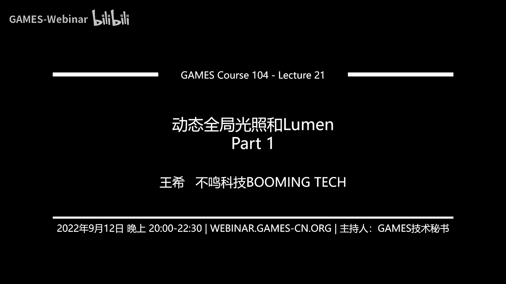
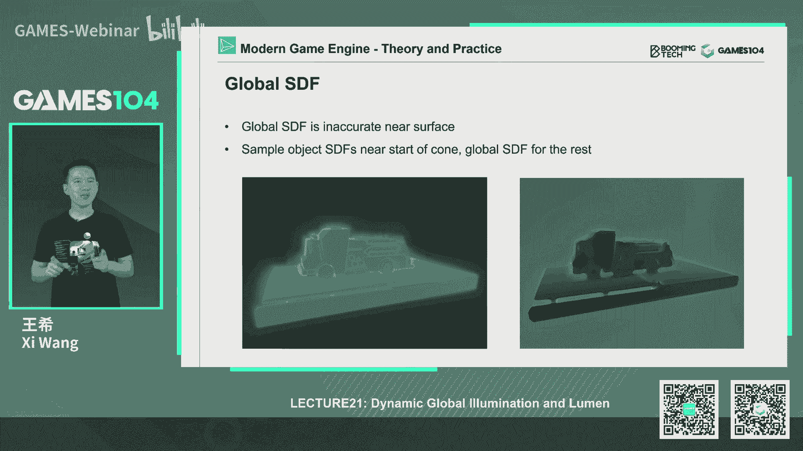
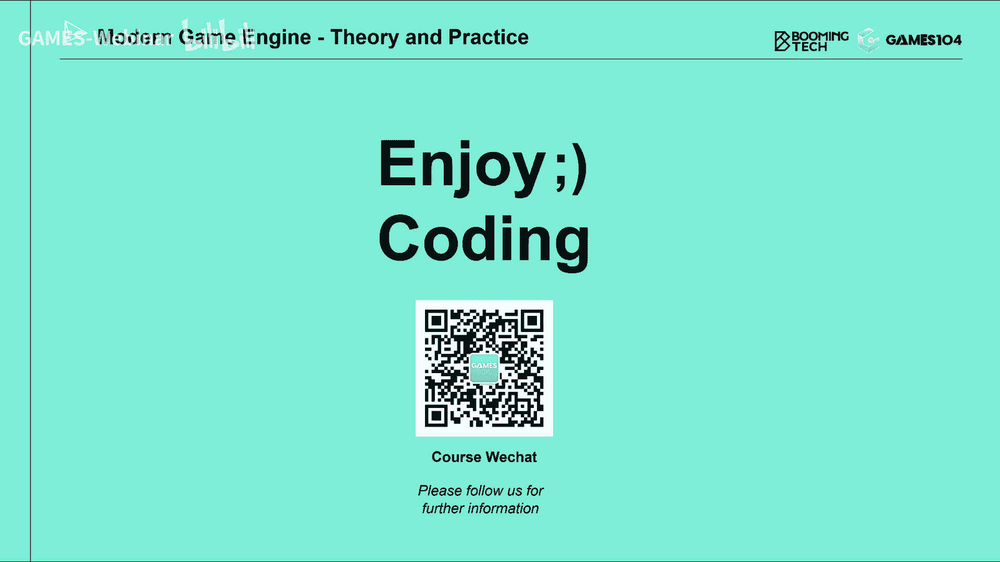

# 课程21：动态全局光照与Lumen（第一部分）🎮

在本节课中，我们将深入探讨现代游戏引擎中的核心技术——动态全局光照（Dynamic Global Illumination, GI）及其在虚幻引擎5中的革命性实现：Lumen。我们将从全局光照的基本概念出发，逐步解析其核心挑战与历史解决方案，最终聚焦于Lumen如何巧妙地整合多种技术，在实时渲染中实现高质量的动态全局光照效果。本节课内容硬核，旨在为初学者构建清晰的知识脉络。

---

## 概述：全局光照的挑战与目标

全局光照旨在模拟光线在场景中经过多次反射和折射后形成的复杂照明效果，这是实现照片级真实感渲染的关键。其核心挑战源于渲染方程（Render Equation）中复杂的积分运算，需要对半球面上所有方向入射的光线进行采样和累加，计算量巨大。

**渲染方程** 可以简化为：
```
Lo(x, ωo) = Le(x, ωo) + ∫Ω fr(x, ωi, ωo) Li(x, ωi) (ωi · n) dωi
```
其中，`Lo`是出射光亮度，`Le`是自发光，`fr`是双向反射分布函数（BRDF），`Li`是入射光亮度，积分在半球面`Ω`上进行。

传统的蒙特卡洛路径追踪（Monte Carlo Path Tracing）方法虽然准确，但需要海量采样才能消除噪点，无法满足实时渲染的性能要求。因此，实时GI技术需要一系列巧妙的近似和优化。

---

## 实时全局光照的技术演进

为了理解Lumen的设计思想，我们首先回顾几种关键的实时GI技术。它们共同的目标是：以可承受的计算成本，逼近离线渲染的全局光照质量。

### 反射阴影贴图（Reflective Shadow Maps, RSM）

RSM（2005年）是实时GI技术的一个重要起点。它的核心思想非常直观：**从光源的视角渲染场景，将第一次被直接照亮的表面像素视为次级光源**。

**实现简述**：
1.  从光源视角渲染一张深度贴图（Shadow Map），但同时额外存储每个像素的世界坐标、法线和辐射亮度（Radiance）。
2.  在渲染场景中任意一点P时，将RSM中存储的所有“次级光源”视为对P点有贡献的光源。
3.  通过对RSM进行重要性采样（例如，400次采样），累加所有次级光源对P点的贡献，从而近似计算出第一次反射的间接光照。

**核心贡献**：
*   **光子注入**：首次明确提出了将直接光照表面作为次级光源进行“光子注入”的思路。
*   **低频插值**：观察到间接光照是低频信号，可以在屏幕空间进行降采样（如每16x16像素计算一次），然后通过插值重建，并对插值误差大的像素进行全采样修正。
*   **启发意义**：为后续许多实时GI方法提供了基础范式。

然而，RSM只能处理单次反射（Single Bounce），且未考虑次级光源与着色点之间的可见性（Visibility），会导致光泄漏（Light Leaking）等问题。

### 光传播体积（Light Propagation Volumes, LPV）

LPV（2009年）旨在解决**多次反射（Multi-Bounce）** 的光照传播问题。其核心思想是：**将场景空间体素化（Voxelize），在每个体素中存储一个描述光照方向分布的球谐函数（Spherical Harmonics, SH），然后让光在这些体素网格中迭代传播**。

**实现简述**：
1.  **注入**：使用类似RSM的方法，将直接光照表面的辐射亮度注入到对应的表面体素中，并用SH表示其方向分布。
2.  **传播**：在体素网格上进行多次迭代。每个体素根据其相邻体素的SH值，更新自身存储的SH值，模拟光在空间中的扩散和反射。
3.  **着色**：渲染时，对于物体表面的任意一点，查询其所在体素的SH光照信息，用于计算间接光照。

**核心贡献**：
*   **体素化空间**：首次将场景离散化为均匀网格来存储和传播光照。
*   **球谐函数应用**：利用SH的旋转不变性和卷积特性，高效地表示和传播方向性的光照。
*   **实现多次反射**：通过迭代传播，理论上可以模拟无限次的光线反弹。

LPV的数学模型存在能量守恒等问题，且对体素分辨率敏感，但它的“体素化+光照传播”思路影响深远。

### 稀疏体素八叉树全局光照（Sparse Voxel Octree GI, SVOGI）

SVOGI进一步优化了空间表达。它认为均匀的体素网格会浪费大量内存在空区域，因此采用**稀疏体素八叉树（Sparse Voxel Octree, SVO）** 来高效存储场景的几何与光照信息。

**实现简述**：
1.  使用保守光栅化（Conservative Rasterization）将三角形网格体素化，并构建一棵SVO。树节点不仅存储自身信息，还存储邻居信息以支持滤波。
2.  光照注入和存储与LPV类似，但存储在SVO节点中。
3.  在着色时进行**圆锥追踪（Cone Tracing）**：不是发射一根细光线，而是发射一个圆锥体。在SVO中追踪时，圆锥体会覆盖越来越粗的体素节点，从而一次性收集大区域的平均光照，极大地提升了采样效率。

**核心贡献**：
*   **层次化空间结构**：SVO显著减少了空区域的存储开销。
*   **圆锥追踪**：这是关键创新，将光线追踪的“线”扩展为“锥”，利用层次化结构实现高效的区域光照查询，特别适合漫反射表面。

然而，SVO数据结构在GPU上构建和管理非常复杂，工程实现难度高。

### 体素圆锥追踪全局光照（Voxel Cone Tracing GI, VXGI）

VXGI可以看作是SVOGI思想的工程化简化与提升。它放弃了复杂的SVO，转而采用**基于相机位置的Clipmap层次化体素网格**。

**实现简述**：
1.  **层次化体素（Clipmap）**：围绕相机，建立多层体素网格。离相机近的层体素小、精度高；离相机远的层体素大、精度低。这符合透视投影的观察特性。
2.  **几何体素化**：将场景几何体素化到最精细的体素层中，并计算每个体素在各个方向上的不透明度（Opacity）。
3.  **光照注入**：同样使用RSM将直接光照注入到表面体素。
4.  **圆锥追踪与着色**：渲染时，对屏幕像素发射多个圆锥（方向根据BRDF的粗糙度决定）。在每个圆锥的追踪路径上，从精细体素层向粗糙体素层查询，并累加路径上体素的辐射亮度（考虑不透明度的衰减），从而计算出间接光照贡献。

**核心贡献**：
*   **视图依赖的Clipmap**：结构简单，GPU友好，易于更新（通过循环UV坐标，只需更新边缘数据）。
*   **实用的圆锥追踪**：结合层次化体素，实现了高效、高质量的间接光照计算。
*   **工程可行性**：相比SVOGI，VXGI更易于在商业引擎中实现和优化。

VXGI的主要问题是光泄漏，尤其是对于薄物体或远处用粗糙体素表示的物体。

### 屏幕空间全局光照（Screen Space Global Illumination, SSGI）

SSGI（2015年）采用了完全不同的思路：**完全利用当前帧已渲染的屏幕颜色和深度信息（G-Buffer）作为间接光照的来源**。

**实现简述**：
1.  对于屏幕上需要计算间接光照的像素点P，根据其法线和视角方向，在半球面内发射多条光线。
2.  利用**层次化深度缓冲（Hierarchical Z-Buffer, Hi-Z）** 在屏幕空间内进行高效的光线步进（Ray Marching），快速找到与场景的交点Q。
3.  交点Q的屏幕像素颜色（即直接光照结果）就被视为一个“次级光源”，贡献给P点的间接光照。
4.  通过复用相邻像素的采样光线，进一步减少计算量。

**核心贡献**：
*   **无场景复杂性约束**：不关心场景中有多少物体、是否是动态的，一切计算基于当前屏幕图像。
*   **高质量接触阴影**：Hi-Z能提供精确的几何相交，能生成细腻的接触阴影（Contact Shadow）。
*   **完美处理镜面反射**：非常擅长处理屏幕空间内的光滑表面反射。

SSGI的致命缺陷是“屏幕空间”的限制：只能看到相机视野内的信息。对于视野外的物体（如头顶的物体对地面的遮挡）或背面，无法产生正确的间接光照，会导致典型的artifact。

---

## 核心挑战总结与Lumen的破局思路

通过以上技术回顾，我们可以总结出实时GI的几个核心挑战及应对思路：

1.  **采样效率**：如何用极少的采样（如每像素1/2根光线）获得平滑的结果？ -> **重要性采样、复用、滤波**。
2.  **光照注入与传播**：如何表示和存储场景中的“次级光源”？ -> **体素化、距离场、屏幕空间**。
3.  **可见性计算**：如何快速判断着色点与次级光源之间是否被遮挡？ -> **硬件光追、软件光追（SDF）、屏幕空间光追**。
4.  **多次反射**：如何模拟光线多次反弹的复杂效果？ -> **迭代传播、递归查询**。
5.  **动态场景**：如何高效处理物体和光源的移动？ -> **增量更新、时空复用**。

**Lumen的破局宣言**：
*   **不依赖硬件光追**：保证广泛的硬件兼容性。
*   **极低采样率**：目标每像素仅需极少量采样。
*   **高精度**：通过将光照探针（Probe）紧贴物体表面放置，实现高质量的细节。

接下来，我们将进入Lumen系统的核心架构解析。

---

## Lumen核心技术解析（第一部分）：高效的软件光线追踪

Lumen要做的第一件事，就是在任意硬件上实现一套**快速、鲁棒的软件光线追踪（Software Ray Tracing）** 系统，这是所有GI查询的基础。其秘密武器是**有向距离场（Signed Distance Field, SDF）**。

### 为什么选择SDF？

SDF是一个数学上优雅的空间表达。对于空间中的任意一点`p`，SDF函数`f(p)`返回该点到最近物体表面的**有符号距离**（外部为正，内部为负，表面上为零）。

**SDF的卓越特性**：
*   **连续且可微**：是场（Field）而非离散网格，支持连续查询和求导（梯度即法线）。
*   **求交高效**：光线步进（Ray Marching）时，当前点的SDF值就是**绝对安全的步进距离**。这称为**球体追踪（Sphere Tracing）**，能快速收敛到交点。
  ```glsl
  // 球体追踪伪代码
  float RayMarchSDF(vec3 rayOrigin, vec3 rayDir) {
      float t = 0.0; // 行进距离
      for (int i = 0; i < MAX_STEPS; i++) {
          vec3 p = rayOrigin + rayDir * t;
          float d = sceneSDF(p); // 查询SDF
          if (d < EPSILON) return t; // 命中表面
          t += d; // 安全步进！
          if (t > MAX_DIST) break; // 超出范围
      }
      return -1.0; // 未命中
  }
  ```
*   **软阴影近似**：通过追踪过程中记录的最小SDF值，可以快速近似面积光源产生的柔和阴影。
*   **存储高效**：可以通过稀疏化存储和LOD技术大幅压缩数据量。

### Lumen的双层SDF架构

Lumen采用了双层SDF结构来平衡精度和性能：

1.  **局部SDF（Mesh SDF）**：
    *   为场景中的每个静态网格资产预计算其自身的SDF，并存储为稀疏体素格式。
    *   **优点**：精度高，能捕捉网格的细节。
    *   **缺点**：一条光线需要对沿途所有可能相交的Mesh SDF进行测试，物体多时开销大。

2.  **全局SDF（Global SDF）**：
    *   将整个场景（主要是静态部分）融合成一个单一的、低精度的SDF场。同样采用**围绕相机的Clipmap结构**（多级LOD）。
    *   **优点**：查询极快。一次查询就能得到到整个场景最近表面的距离，无需遍历单个物体。
    *   **缺点**：精度较低，会丢失细节，且动态物体需要更新。

**协作方式**：
*   **粗碰撞检测**：首先用**全局SDF**进行快速的球体追踪，迅速逼近潜在的交点区域。
*   **精碰撞检测**：在全局SDF指示的附近区域，再使用**局部SDF（Mesh SDF）** 进行精确的求交计算。
*   这种“由粗到精”的策略，在保持高精度的同时，将光线追踪的性能提升到了可应用于实时GI的水平。

通过这套基于SDF的软件光追系统，Lumen奠定了其高效进行全局光照查询的基石，摆脱了对特定硬件的依赖。

---

## 总结



本节课我们一起学习了动态全局光照的基础知识与技术演进。我们从渲染方程的根本挑战出发，回顾了从RSM、LPV、SVOGI、VXGI到SSGI等关键实时GI技术，理解了它们如何从“光子注入”、“空间体素化”、“层次化追踪”和“屏幕空间利用”等不同角度破解GI难题。最后，我们深入探讨了Lumen系统的基石——基于有向距离场（SDF）的高效软件光线追踪。SDF以其连续、可微、求交高效的特性，为Lumen实现高质量、跨平台的实时GI提供了强大的数学工具和底层支持。



在下一节课中，我们将继续探索Lumen系统的其余核心模块：**表面缓存（Surface Cache）**、**光照传播与集成**以及**最终着色**，看它如何将SDF追踪、屏幕空间信息等多种技术熔于一炉，最终实现令人惊叹的动态全局光照效果。