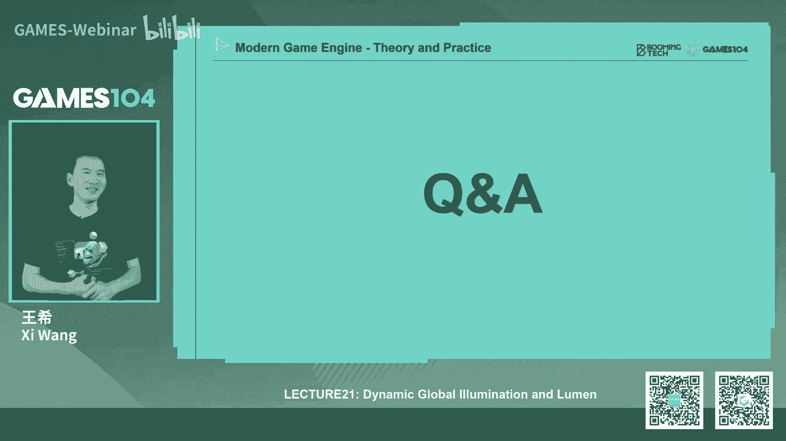
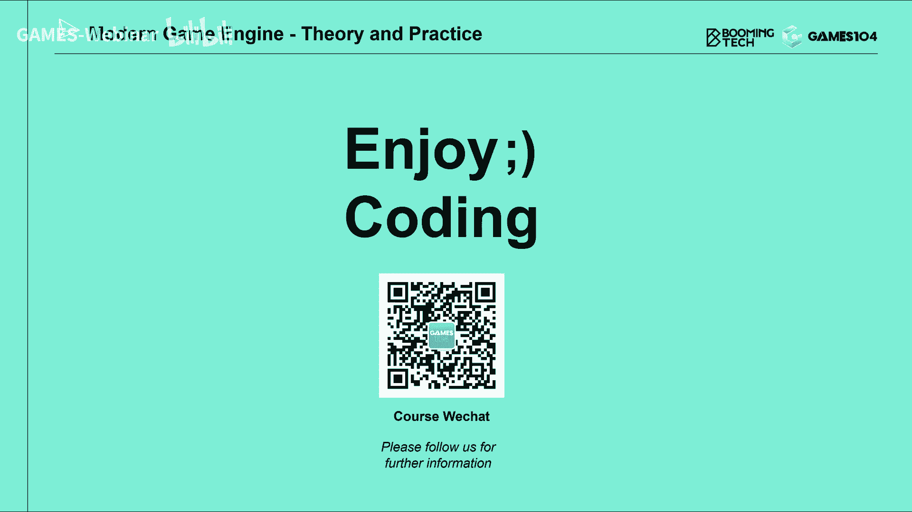

# 21.动态全局光照和Lumen (Part 2) ｜ GAMES104-现代游戏引擎：从入门到实践 - P1 - GAMES-Webinar - BV1Ya411g7Th

好那么第2part是什么呢，唉我既然已经知道了，我在硬件上做retracing，非常的快对吧，那接下来我就要做个事情，就是我要把这些光子注入到这个世界，对不对，然后呢。

我把这个世界先获得直接的第一次光照的结果，然后我基于它我就可以算我的第二次光照结果，但实际上没有那么简单了，但是呢一般讲lumen的时候呢，很多人一上来就讲什么screen space的一个pro对吧。

讲了这个怎么采样啊，怎么点，反正我看到那一趴我就晕掉了，我说我大概知道你在讲什么，但是我的第一反应就是老哥，你不是应该先把光打进去嘛，对不对，你会发现他讲到最后的时候会给你讲一讲，光是怎么打进去的。

但是呢我们这节课反过来讲说哎，光是怎么打进去的，那实际上就是在这个lumen里面，他搞了一套非常特殊的东西，叫做mesh car，我先不讲mash car的这个细节，我先讲这个我们到底要解决什么问题。

就是当我们算全局光照的时候，其实从光的视角我们去照亮整个世界的时候，其实整个世界里面，无论你看得见的还是看不见的pixel，它实际上都会被这个光给照亮对吧，那么这些每一个被照亮的照亮的这个物体表面。

我们叫做比如说叫facet小表面吗，它实际上呢都是为我的这个GI的一个贡献者，就是我的光源之一，但是呢我们有个困难，就是说这么复杂的场景对吧，很可能是一个我现在看不见的一个石头的表面，被光打到了。

它会照到我了，那你用rs版的话，那你实际上就是用光的方向投了一个投影，但是呢rs m的话呢，你只能作为一个is bing对吧，它很多地方它是有这个比较大的局限性，而且呢就是说这个表面上的话。

很多复杂的几何的细节我们都不知道，那么在lumen里面，他提了一个什么方法呢，哎他想了一个办法，就是怕场景，你所有的物体啊，我给他拍了个快照，但这个快照拍的方法呢其实是以相机精度。

相机的位置为这个RAVVLOD的，就是说我靠近我，相机占领，我离我的这个相机的位置比较近的这个物体，我会给你的分辨率会高一点，然后呢相机远离的物体，我面前低一点，但是呢我从六个角度拍你的快照。

就是拍什么拍照就是你被光照亮的样子，因为我并不知道这些光经过一次帮两次帮形，到底是你天顶上的东西照亮的东西呢，还是你这边侧面的东西，还是这边，也许我看，比如说我举个例子啊，比如说我以我这个笔为例。

你真正我眼睛看到的就这一个面，对不对，但是呢有可能是你这个面上一个面照亮了，这边一个面反射给我了，对不对，那么有可能是上面这个面对吧，被光照了诶，这样过来一个东西，那我怎么办，我就对这个物体啊。

六个面给他拍这个六四快照，这个就比较麻烦，就大家知道GI就很麻烦，因为GI它是个全光路的，就direct lighting，很多时候你只要在乎我眼睛看过去的东西，但是呢我做JI的时候。

我需要知道它的全光路到底发生了什么，那么对于每一个物体，我对对它六个面进行采样，我想知道它被光直接照亮，被光照亮的是个什么样子，而这样的话呢我六个面拍下来，你觉得这里面举个例子。

就是说比如说这是这是我们在应用里面，我们自己截的，我们自己搭了一个场景，然后呢你可以看到就是这是它的生成的一个car，这个car的话呢，每个car的它有六个面对吧，你们看到这个细节没有。

它其实呢他是用a b b box，就是用那个轴对称的，沿着那个XYZ轴做的这样的一个面，这样也尽量简单一点吧，好我生成了他的car的之后呢，诶我就会首先把cut，把这个物体从这个角度我拍下去。

我拿到什么呢，拿到他的ABELE，拿到他的normal，拿到的它的一个depth，depth是从绑定开始算的，所以精度不用很高，如果你带反射的，带发射的自自发光源的话，我把你miss也发出来。

所以大家看到真正的GI确实是很丰富，很复杂，就在于就是我场景里每个物体都要排好，那场景物体是很多，对不对，有些物体其实离我很远，有些物体很小，那怎么办，哎我其实是有一套这个啊，应该在这一趴。

就是说它实际上是有一套的方法，就是说当你我的相机近的时候呢，我给的分辨率高一点对吧，我拍的更细一点，比如说我侧面有一个石头，这个石头可能只有2米高，但是呢它可能占据了我平面1/3的地方。

那我平面近处的东西，很可能会受这个石头的影响，远处呢可能有个雕像，它有5米高，但它距离我100米远，那其实呢我这个car的不用给它太高，它的精度可以低一点诶，大家这个思想就是这样的话，我可以怎么样呢。

我可以充分的利用我这个我能存储它的空间，那我存储这些CR的就是那个mesh card，地方在哪里呢，这个东西我们叫做surface cash，哎，这个surface cash就非常有意思了。

它总共分配了一个4096×4096的，这个空间，把每一个这个instance就是每一个mesh的，就其实这边准确的讲应该是每一个instance，注意啊，就是说你两个mesh可能是从几何上一模一样。

但是你放了两遍，那就是instance，注意这里面是讲的是instance，每一个instance它的car在里面packing好，它总共只有4096×4096这么空间，所以呢它这里面就会有些。

随着你的相机的移动啊，随着你的这个就是说主要是相机的移动对吧，那我有些物体就可能会被swap out，有些物体就会被放进来，没关系，因为这个CD你的东西呢主要是用来做GI的，所以呢你多放几个物体。

少放几个物体死不了人对吧，因为dear collection不需要用这个东西好，那么这个surface这个cash呢，这里面特别容易混淆的一个东西是什么呢，就是它不是一个单张的texture。

它是一系列的texture，这个cash形成的集合，它这里面会包括什么呢，会包括他刚才讲到的，比如说他的ABE对吧，包括什么呢，它的normal对吧，还包括他的depth，对不对。

那这样形成了一处东西好，那这里面的话你capture的这些东西的话呢，每一层的这个AIDO啊，or pity啊，这个它的depth啊，他的normal都会用一些硬件支持的。

这个compression method去压缩一下，很简单吧，我们做所有的rendering都知道，我要让内存尽可能的小对吧，4096×4096已经很大了，大家想想看这个什么都不干，4096×4096。

他就是16个兆了对吧，你还有这么多层对吧，轻轻松松给你上百兆的空间就给你用掉了对吧，那这个就是我们的surface cash，这样的话我有了这样surface cash之后呢，接下来我干什么事情呢。

就是说我们如何这个我用这，这这个标题是我自己写的，就是说其实他前面有很大一部分工作，就是当一个光照进来之后，这些光啊，其实在我的这个场景里面直接照亮了一些东西，对不对，照亮这个东西可能是它的正面。

可能是它背面，可能是在反面，I don't really care，哎，这些光还可能在里面，BS对吧，BS的一大堆我也不care，但是呢最后我希望这些radiance。

最后能存储到我的surface cash上去，为什么呢，因为想象一下我的这个世界啊，本来是很多很复杂的几何，当我去做真的各种各样的全局光照的时候，实际上我的一个问题就是如果我看到了一个点。

我去做一个采样诶，我想知道他的那个地方，它到底radiance有多少，那我如果直接在那个就是这个几何事件里面，去问那个面片，你的光热是多少，实际上的过程是非常非常复杂的。

而且每一点的材质都是不一样的对吧，但是呢如果我把整个这个世界，它的最粗的这个光照信息，用这么一种uniform的方法表达出来之后，我在这个世界，你无论做什么样的一种retracing的话。

就是那个蒙特卡罗retracing的时候，我去都能够采样到那个点的表达，所以你可以理解成，就是说surface cash是对这个世界的一个，就是光照信息，其实就是为我们india lighting。

光照信息提过一次表达，我们希望把这个那个这个radiance arradius，固化在上面，这个这个地方又又又去那个怎么说呢，又去祭出了我们的风头。

map这个想法就是说其实呢他用这个就是surface card，这么多的那个mesh card，把它packing成一个surface cash的话，实际上是把所有的风头光子全部固化在上面了。

哎这个我这个土法炼钢，我是这么理解这个事情的，那么在这里面的话呢，我们就产生了一个问题了，两个问题，第一个就是说这个pixel就是那个service开始那个点，它在这个光的照耀下，它到底有多亮对吧。

它有可能会被shadow挡住的，对不对，那我怎么去知道这件事情，第二件事情是什么呢，哎这里面我只有一次的，第一次我竟然知道你的AIO，知道你的normal对吧，那我可以跟主光源算出来。

说到你这儿的第一次的这个光照的强度都大，但如果你是mt bs，我怎么办对吧，我因为我到处收集光的时候，这个光照上我我也不知道你是1month n次month，但是最后我要把这个视频方的光源全部收起来。

所以呢这其实就是我怎么去在surface cat里面做lighting，哎这里面这个就比较复杂了，这也是其实我觉得lumen比较难懂的部分，这张图呢是我们土法炼钢自己画的，其实包括一些名词。

我自己都优化掉了，比如说啊，其实他这个时候最核心的呢，要生成一张什么图呢，就是下面那张图叫surface catch final lighting，不好意思，那张图我觉得我应该标个不同的颜色。

就是说service cash，我们刚才讲了不是有四张图吗，有abele normal对吧，OPPITY还有什么呢，还有他的这个呃depth对吧，但是其实啊你这么多都有了之后，我给你一个光在场景里面。

其实他最终是要选出他一张lighting图的，这因为这张lighting图上面就储存了，乘上百万的小灯泡，它是我lumen工作的整个基础，好，那我怎么样的算他的lighting呢。

我的这里面我自己肉身标记了三步，第一步呢，实际上呃你用一个最简单的方法做它的direct light，很简单，就是说对于surface concash上的每个像素，它的空间就有个位置对吧。

那我跟黑跟光源对吧，算一个它的设定值，但这里面的话呢，其实刚到五炮的第一个问题就是，如果你的沙雕力怎么办，那很简单，我做过shine map对吧，我用光年做SHTP，我其实知道visibility。

至少我不会错的太离谱对吧，那么第二步呢其实是比较复杂的，就是他为了做这件事情的话呢，他在word space里面其实建了一批这个对光的这个，WORKALIZED的表达，诶。

他很多计算机是基于这个WORKLIFE的表达，那这个表达为什么这么这么重要呢，因为你有了这个表达之后呢，你上一帧的这个WORKALIZED的这个光的表达，可以被这一帧就是它的第三步可以采集回来。

然后呢采集回来，这个采集回来不是只是采集一根光线，它实际上是回很多根光线，这样我就能够猜出surface上的delighting长什么样子好，我猜出了你的INDIRELIGHTING长什么样子。

我把这两个合到一起，就变成了我的这一帧的这个final lighting，诶，我从我的这一帧的final lighting呢，我又把它采样成这个workspace workalized的表达。

这个这个放在哪呢，给他下一针用，你现在这个时候很绕，就是这个替云纵左脚踩右脚，左脚踩右脚，但是呢这个东西他这个方法其实是非常的巧妙，但这个方法其实呢也不是他首创的。

其实在以前老的一些ROG上也抢到这个id，就是说我们的光啊，在每一次render的时候，我只算他的一次bouncing对吧，但是呢我去再采样一个上一帧里面的那个一次，BING的数据。

我用那个一次SPONSE数据，对我这个你的每一个空间点进行lighting的时候，我把这两个lighting效果叠加在一起，实际上是什么呢，它就已经是二次BING了，诶这个在数学上大家可以自己去推一下。

那我随着时间的积累，你比如说第一针的时候只有一次BING对吧，当T加F0，我们一般叫F0到F1的时候，其实我就有这个两次BC的值了，我F2的时候，其实我就有三次BBC的值了，它实际上这个猫体方形的数值。

就可以一次的积累，其实在那个呃如果我没记错的话，应该在那个SSGI里面，其实他可以用这个思路也做这个MULTIPING的结果，对吧，你就要从previous frame取出去。

你其实一样可以做这样的一个事情，所以这个呢是他的LILIACTION，一个很关键的一个思想，那这个东西的话其实讲起来比较复杂，我不不是特别有信心啊，完全给同学们讲清楚，但是呢我尝试把它梳理一下。

所以呢大家看到我这边人人肉，打了一个很大的标记叫123，那我接下来就从一步，两步三步给大家去讲一下哇，已经两个小时了，好刺激，那吉尔和拉丁刚才也讲到了非常简单，第一步对吧，那我很简单。

就是说我对这个这个配置的话呢，我就是每一个配置我去找这个lighting对吧，那我呢就是sampling一个shadow map，我就知道这个shine map，我就知道我这个点实际上对这个东西有没有。

那shine map怎么怎么去sample里呢对吧，那很简单，我也不用真的渲染沙滩map，实际上大家想到了我RETRING是不是很方便啊，对不对，我就在我的SDF里面去走啊对吧。

我就是我眼睛看到那个mesh cash，那个那个那个点，那个点的话，它空间上有个位置，然后呢，我就去问他和光的那个那个点和光的连线，我做一个，我再发一条光线，那我用SDF1查，我就知道了。

这光线到底是可见不可见，所以刚才你看我画了那么多屏幕，讲retracing，这个时候就已经用上了，对不对，哎那这时候我就可以把这个direct lighting就算出来，因为我知道你的AIDO。

我知道你的法向，我又知道你的光长多大，那我自然就知道你的那个direct lighting是怎么回事，对吧，当然这里面假设就是点光源那个方向光源，或者是那个那个那个spotlight对吧。

好那么如果你有多光源怎么办，哎它其实很简单对吧，它它就是说那那很简单，那就是我对于每一个，就是这个这个这个那个那个那个surface cash，里面的一个text的话，我一个往下算一遍。

把你们累加在一起就可以了，因为我这个是当个小电小电灯泡用的是吧，我也不care我，我我假设我是一个defuse面的一个反射对吧，所以我就可以把这些光累加在一起，这个东西其实非常的重要，为什么呢。

就是大家想想看，我今天做所有的GI的算法，如果我假设场景里只有一个光源，有积压效果的话，很可能是不可能，因为当时当artist真的去构建这个环境的时候啊，它的光啊是可以随便打的，他会给你一个主光。

然后呢做个场景场景里面再放个光，我这个地方是不能限制那个designer的，所以的话呢这个时候其实任何一种for real time，那个for gaming的就是for游戏实战用的解压算法的话。

他一定要支持多光源，你看这样的话它就会非常简单的支持了多光源，而且效率还非常的高，好诶，这个时候啊，这个时候呢我们要做第二件事情，就是说这个如果我们去去采样这些，这些光的时候啊。

实际上我们实际上呢就是在在这一趴，跟大家讲一下，就是诶稍等，Promission information，就是说我们对进行光源形采样，其实这个它只能对于很近的物体有用，为什么呢。

因为如果我们去踩得非常远，它就会出现一个什么问题啊，出现就是说我们那个要hit掉很多的物体，对不对，所以我们真真正能精确的知道你hit到哪个物体，hit到他哪个表面的这种recasting啊。

他其实做不远，那我这个时候我要去求一个点对吧，他的那个那个cashing，他的cash lighting，如果跑的特别远程嘛，我就必然要用那个前面讲的那个global的SDF。

但是GLOBTF他有个大问题是什么呢，他只能找到采样点对吧，他只能找到他的normal，但你并不知道你hit到了哪个instance，哪个物体，所以那时候怎么办呢，他就想到了一个办法。

他说啊对于近处的物体，我可以精准的把一个物体表面的这个采样的，这个radiance给你达到，但是对于远处的物体又怎么办呢，我把整个场景以相机为中心，做了一个MOLISE的表达。

这样的话你的瑞只要你用global sdf hit到了，那我就给你提供一个那个点上的亮度，因为那个点上亮度我就能做我的灯泡了，对吧好，那传统艺能就来了，很简单，我做一个clip map对吧。

这个clip map里面的话呢就是我四层，然后呢每一层64×64个，这个WAKO它这里面的数据非常有意思，就是说他每个WORKO我们查了一下是0。78米，哎我们的同学还是很强的。

我们真的是看原代码就能看出来的，0。78米，然后我们反算了一下，为什么是0。78呢，应该是0。78×64，好像正好是50×50米，哎我觉得这个这个这个就是哦，这个原作者应该是一个公制单位的热爱者。

因为你知道很多美国人是用什么英尺啊，这种东西我就用的特别头疼吗，但是用米的话，一个是欧洲人，欧洲人喜欢用米对吧，那就是说啊他就是50米乘50×50米，那这样把它缩到一个3D的texture里面。

那这样的话对于每个OXO呢，我在六个面存储它这个亮度，这样的话其实我再去做这个就是image cashing，我做那个intro lighting的时候，其实我就可以去永远hit他一个东西了。

这个东西其实在后面非常的有用好，OK那怎么去对空间进行采样呢，刚才讲的就是，比如说在那个比如说SBUGI里面，比如像那个VXGI里面呢，它一般都是用保守观察号的方法去做对吧，但是呢在这个lumen里面。

他的方法呢就比较巧妙，因为他觉得我既然整个场景我都是有这个mesh，SDF表达了，对不对，那我就用SDF啊，它很简单，他就说他先呢就是说找了一个，他把这个这个WALKMAN呢分成大概是我如没记错。

是44的这个tile还是更小一点，或者每个WORKO，他其实就知道这里面有多少个incident，大家想象一下，如果在12米的范围里面，你不可能框太多的mesh对吧，然后呢我从它的这个边上。

比如说这条边我可以随机的设一根锐进去，如果我能打中任何一个mesh的话，实际上表示什么呢，我这works里面是不会空的对吧，而且我能采样出来你的这个法向啊，你的颜色啊，这些东西其实他就是没有用到硬件的。

Rust riser，直接用他的mesh sdf，他就可以获得自己的这个vocalize，的这个世界的表达，所以你可以看到就是整个lumen，他的很多计算机基础啊，用的全是F，但这里面还有很多的细节。

比如说诶我一假设我做了多次采样，我喝得到很多的面对吧，或者我沿途采到了很多的点，怎么办，这里面的lumen里面的它都有很多的细节去展开，那我们这边今天不展开，但是你大家就要记住，就是处理完之后呢。

我就能得到这个世界上的一个works lies的表达，那那这里面就讲了一个前后多个hit怎么办，它它是在一个44的这个town里面，这个东西是做什么的，其实我的理解就是它的空间切成很多小格子。

这个格子当然比VOX要大一点，那么它吧比如说我有1000多个物体对吧，或者是1万多个instance放进去的话，那我在每一个小的tale里面这个区域，比如说34米的这个区域里面的cube里面的话。

它顶多也就是七八个五六个物体，这样的话我在这样一个就是比如说呃，比如3米乘3米的这个cube里面，我去设一个瑞，只跟大概四五个物体进行求教的话，这个效率是非常非常高的。

所以它的VOLATION速度也是非常快的，那么这个selection的话呢，就像我前面讲VXCI呢，它的更新也不需要每一帧全部更新对吧，它只需要每次你相机移动了，或者场景里的物体移动了，诶。

我只会把弄脏的那几个地方，把它更新一下就可以了，这细节我就不展开了，但是呢他大家记住一点，就是它是用SDF的求教，快速的就得出了每一个WORKO的，第一个就是有没有东西，有东西他应该法向朝哪。

它应该深度多深，然后呢他的lighting应该是怎么样的，他就这个方法就弄得落获得了那么好，当我知道了空间的这个WAKO的表达，我知道这个焦点的时候，那我怎么知道这个walkle lighting呢。

哎这个时候其实就比较有意思了，它实际上呢是这个东西就是个鸡和蛋的问题了，就是说我假设把空间上的所有的表面的WORKO，全部找到了，每个WORKO有六个面对吧，我就朝外面的面有有用。

朝你们那面全没有用的好，这个面我怎么知道他的生命是多少呢，诶刚才不是讲了，我有这个这个surface cash嘛对吧，那么surface cash呢回到这张图啊，我觉得这个这个要怪我时间太紧张了。

没有办法讲的很清楚，但是我觉得还是要回到这张图来来来，如果对于我的第一针的时候，大家可以认为这个时候我的WORKO，那些空间上的WORKO全是黑的，你不用管他对吧，那你既然因为TF0的时候。

F0-1是一帧，这一帧不存在，所以呢INDUALIGHLIGHTING也是没有的，只有direct lighting，这个时候你发现没有诶，我surface cash那个final lighting。

实际上就是直接光照的结果，对吧好啦，那没关系啊，你直接光照的结果，假设我已经知道了空间上的works的表达，然后呢我又知道这个每一个WAKO的这一面，比如说比如说这个VOXEL啊，这个这个不太好。

我就讲这个吧，比如说这个地方你看到大家看到这个啊，相机近点这个地方这个WAKO对吧，这个面OK我知道在那个就是surface cash里面，它对于哪个card的哪一个面的哪一个pixel。

我可不可以知道，其实我甚至可以知道它的整个覆盖面积，那我怎么办，那这个WORKO的这个面的亮度，是不是可以直接取那个cash里面的值啊，这个地方到底是直接取一个点还是filtering。

我已经不太记得了，但是呢啊lumen里面肯定是有办法可以取代，但是它最核心的思想就是，我用这个surface cash的final lighting的结果，去照亮我的这个WORKO的lighting。

诶，好这个works the lighting呢，我把它存在，那等我下一帧去再去更新，我的这个surface cash in发达了nineteen的时候诶，我就用这种WORKALIZE的这个世界的表达。

去这个帮我去做这个in det lighting，诶，而且这个时候呢我取得的东西的话，天然的就具有multi bing的结果，这个方法其实非常的巧妙啊，那但是呢实话实说他在工程上特别的复杂。

而且这个这个就是works lighting呢，实际上和后面他讲的那个worst space pro，是特别特别容易混淆的，那这里面我给大家做个区分，就是说这里面的这个works lighting。

它指的它的每个面，它首先是一个是一个是一个cube的六个面，而且每个面呢它只存一个亮度，啥都不存，但是呢worth后面讲的那个worth it probe，它实际上是一个空间上的光场分布。

他那个作用是什么呢，那是照亮别人的，明白我的意思吧，他是照负责照亮别人的，而这个你们存的是什么呢，哎我被照得有多亮啊，这两个概念很容易混淆，但是大家没办法，我们只能够就是大家这个这个这个容忍一下。

确实是很复杂，但是你确实会发现这样的一个算法，他就真的很巧妙，就是通过因为这个方法为什么好呢，大家想想看，我们rendering的话，111秒钟有30帧对吧，你这样的这个light在。

如果场景的相机动得不是特别的快对吧，光动的不是特别的快，假设像很多时候我们都是相机基本固定嘛对吧，然后那个光也差不多不会太动了，但实际上不出十几针吧，你就能得到十几次boss的光的结果。

这样呢这个光啊看上去它就很自然，哎这个东西为什么很重要，就是我所以我们自己还做了个实验，就是我们用lumen的效果，我们动了一下光之后，我们可以明显地感觉到那个光啊。

就是它会有一个大概可能是零点几秒的感觉，那个光嗯慢慢就变亮了，其实难的就是这个works lighting，他在给你传递那种MULTIFUNCTION的那个结果对吧，这个很有意思。

就是大家有机会可以看一下好，这就是我这边顺便小小的黑一下，就是我们看到很多lumen的截图的时候，他一般给你的都是一张竞争对吧，一张竞争，然后呢你看起来非常的漂亮，那张竞争你就会看着很漂亮的话。

大概率是开了高配，而且呢已经炫了，大概有比如说哎这个0。5秒或者一秒之后，这个多少次BING的结果看上去非常自然，但是如果这个动画的话，比如光和相机动得非常的快的话。

其实我觉得就现在的这个real time gi的技术的话，都还是蛮挑战的，OK好，这就是我们的整个light cashing的pipeline，它最核心的就是让我们怎么解决，就是说我的光源怎么来。

就是我要算基，我要知道空间上无数的光源，那这些光源呢，我就用通过这个方法把它cashing到我的surface cash，其实我的surface cash1套之后呢。

我又用surface cash还在一个WORKALIZE世界的表达，你又做了一套这个东西，不仅是说A帮我去更新，诶，不好意思啊，我这个PPT写的我还要再优化一下，时间实在太紧张了。

就是它不仅是帮我们去算那个surface cash的那个，Final lighting，其实这个workspace works lighting的话，在我后面的那个problem里面也是有用的。

为什么呢，刚才我讲到一个细节了，就是说当我一根锐射出去之后，如果我没有办法用那个就是PROMESH的STF，我必须要用global s t f的话，刚才讲过global s t f的问题是什么。

就是他拿不到你到底诶，稍等是这个这意思，他拿不到，就是说那个你到底hit重了，是哪个instance也拿不到他，你更拿不到你hit动作是哪个面，那个那个面上的他的一切信息都拿不到。

所以呢这个时候你只能在global的这个works lighting里面，去找到它的lighting，所以这个数据就是一套一套对应好的，哎呀我我现在已经突然想起来，这个突然想出来这个PPT怎么画了。

他真的就是数据是一套一套对应好的，就放在这，那么这一趴呢我就不再讲的足够太深了，就不展开，但是呢大家理解一下，就是说他用一个就是说啊surface cash对吧，把整个空间把整个场景表达成一个个的六面。

六个面的那个剪影，就相当于说我本来本来一个人的物体诶，我用六个平板把它罩起来，你们知道在那个呃在做LD的时候吧，有一个叫impose技术点吧，就是说诶我一个远处的物体，我用几个面表达成IMPOSTER。

就大概能表达它的样子，其实你可以认为那个surface cash，看你那个mesh car的技术的话，其实很像这个一个为lighting准备的这个IMPOSTER，那么好。

我又不是所有的物体都能用impostor去表达lighting，也不是所谓letting impossible impose表达。

我同时呢要做multi bouncing the global nation，那怎么办呢，诶他想到了一个方法，就是说我把空间整个把你这个这个哎呀，这个PPT真的要优化一下。

那个就是把你空间整个给你WORKALIZATION，就变成一个表达一个一个更加粗的，但是呢它能表达几百米范围之内的，这样的一个场景的，这个这个这个lighting的这个信息。

你无论是近处的promise的表达，还是远处的整个场景，大致看看它的亮度的话，其实都可以表达，这里面其实还有个细节，我们今天没有展开，比如说有些比较复杂的东西，比如说terrain对吧。

terrain你肯定不能用match cut cut cut cut去表达，那你怎么办，诶terrain他还得单独处理，其实lumen里面还有很多的细节，比如说啊我这边在市面荡开一笔。

比如说你中间假设有一些participate media，半透明的一团雾对吧，那它的光照怎么算，哎这里面有无数的细节了，对不对，那我作为一系列的课程也就不展开了，反正这里面坑特别多。

所以我觉得这个作者还是非常的了不起啊，就是真的把这个技术工程化了，因为全局光照real time real globe dation，而且PDNCALIZE，它真的就是一个非常非常复杂的一个问题。

那么他基本上用了这样的一个方法，然后呢能能踩到cashing了所有的radio，那这个时候呢我就比较简单了，对于每一个这个surface cash的东西呢，他呢说那我既然你对这个世界有这样的表达。

我就知道怎么去sample你的in your lighting了，他的算法是写死了的，我记得我如果没记错的话，我们呢是这样写死的，就是说哎对于surface cash上每88，它定义成一个TL，注意啊。

就lumen in的名词真的是从用率特别高，这个tile这个词在各种地方都有用过，而且每个地方的tell，它表达的意思都是不一样的，所以这个地方的tale指的就是在surface cash里面。

他选择88的这个text，然后呢它采四个样，这四个样呢实际上是在你们JERING的对吧，然后呢他设了16根锐射出去，这个瑞呢跟谁求交呢，哎跟那个WORKO，你空间上的WORKO表达进入注意啊。

就是surface cash不会用自己去做intern lighting，他永远是在那个啊WORKO上面，就是那个worko lighting上去取，他的那个就是那个结果。

然后呢诶我就可以获得这样的一个intro lighting，他把这个intro lighting呢存成什么呢，存成了一个就是这个sofil harmonics，那为什么除了存在SURFHONEX呢。

大家想想看啊，就是我这个空间上这些数据，我真正在shading surface cash上的每一个pixel的时候，哎你看这里面这张图，你们可以看到就是它是8×8，里面有64个点对吧，它只有四个采样。

所以对于每个点来讲的话呢，他要找相邻的四个点去插值，那差值最方便的是什么呢，用SHCOFM去差值，大家仔细推推导一下，就知道这里面还是很巧妙的一个一个变化，我有了这个差值玩的SH的表达的话。

我是不是就可以可以算出来，说这个球面上的间接，这个INTERFLIGHTING对我的shading的结果，实际上我这个时候我的结果上就会加上一层，这个就是dua lighting的结果，那这张图上呢。

就是你可以看到就是这边亮的是它直接光照，对吧，那个intro lighting是在间接光照，这里面，其实那个直接光照它是HDR的，所以你看上去它会偏亮，但是实际上的话呢它这些亮度差得很大。

然后最后合到一起，你可以形成一个你想要的final，结果这个图本身做的呢我觉得不是特别好，但也没办法，因为呃原作者没有提供比较好图，所以我们只能在unreal里面自己写代码，这个东西抠出来了。

后面我们有时间的话，我们会扣得更好一点，但是呢这些东西的话，实际上是啊，我们真的是从代码中深抠出来的东西，对吧对吧，大家原谅一下，那么其实的话呢，这样两个lighting就可以结合在一起。

形成我们想要的这样的一个multiple lighting，而且这里面为什么这个方法非常巧妙呢，就是说其实真实的游戏场景非常的复杂，他用了这样的一个surface cash的这个思路啊。

他还把有一个很难的问题给解决掉了，就是自发光，哎大家如果在这个做游戏的时候，其实自发光这件事情是真的很难，为什么呢，自发光这件事情如果你只考虑它本身变量的话，那很简单，在最终颜色上硬生生的加上去一个光。

对不对，但是我们设想中的自发光是什么效果，比如说哎我这个武士这边有一条灯带，很帅对不对，但你旁边假设我靠近了一个墙，这边假设有一堵墙啊，你希望这个蓝色的光，是不是能把墙稍微硬亮一点点对吧。

我甚至还希望有那么一点点软阴影的效果，那这个怎么解啊，这个其实非常的难啊，因为你知道在游戏里面，我们处理一个光源原始的做法，我觉得渲渲染一次对吧，我最让我们在前面人队里讲了很多方法。

能解决MTILISOURCE的问题，但是我这是一条光带啊，大哥我这个很难是一条光带，我怎么去渲染它，诶，他用这个就是这个surface cash的方法的话，其实即使是一个光带。

我实际上也能够把它整体的cash到我的这个，这个这个就是lighting里面去，我在第一帧的时候，这个光带不起作用，对不对，但是呢我通过这个左脚踩右脚。

我把它三零到我的WORKO的那个light space里面去，诶我下一针就把它给卷回来了，诶再卷两次，卷一次，卷两次，你就能看到那个墙那个地方就会被照亮了，这个地方，其实我个人觉得还是非常非常的巧妙的。

所以surface action说句实话，我乍一看的时候，我我我我我喷了很久，我说好麻烦啊，为什么我要给每个mesh还踩六个面，这个好蠢啊，因为呃呃不好意思，不能说脏话。

就是这个这个反正我就觉得好麻烦对吧，很很很很，你还要去做atlas还是做packing，还要做这个那个内存的分配啊，想想头都疼对吧，我以前特别不喜欢，就是实现那个virtual texture那个算法。

因为就觉得特别麻烦，而且特别容易写出bug，但是呢你仔细想仔细想仔细想，你发现哇这个方法还是很有道理的好，那这个就是其实呢这个地方，我觉得那个mesh cashing啊。

包括那个works workitty啊，其实他都符合刚才我讲的SDF的一个设计思想，就是说我把一个irregular的东西，就是你想在世界里面的这些物体的表达，非常的复杂，对不对。

我用mesh cashing，用用match card，用surface cashing，再加上works lighting的话，把它变成了一个uniform的regular的表达。

那我接下来无论是做他任何的一个积分也好，这个卷积也好，采样也好，都会变得更加的简单，你看这个采样采样采样，这个时候采样的基础是什么，是数学的表达，对吧，我我所以说我觉得学完104的同学的话。

我觉得大家会非常有兴趣，回去学一些什么信号处理啊，什么什么这个这个理这个这个局，那个应该是那个呃应该是线性代数，大家肯定要好好去学的对吧，包括一些几何的一些东西，包括一些比如说像一些数分啊。

一些高等代数的东西，大家都会想学，因为这些东西真的是密切关联的，对于我们来讲好补水了，我们继续往下讲，我们已经讲了两个小时，20分钟，预计今天要三小时起飞了。

好其实呢就是对于整个这个surface cash啊，他的这个更新还是挺废的，所以在lumen里面他做了一个bug，他就说哎我每一帧的话对，直接光照我最多不超过，我不是40996×4096吗。

每一帧的时候唉，我最多不超过1024×24个，TEXO更新对吧，那么for intro lighting呢，因为大家知道间接光照更新起来，其实还是很废的，因为他要在那个很多的那个这个WORKLIES的。

这个世界上去采样，对不对，虽然我讲了基于SDF的采样效率很高的，基于GLOBUSDF是更快了，但是它本身还是挺废的，那怎么办呢，他说诶我每次最多更新512512texture。

所以对于每一个mash card来讲，它都要排排队，说哎我也想更新，我也想更新，那他就要设置一个priority，去进行这种这个去去去管理它，然后呢去选择更新，所以呢这里面其实有一些一整套的。

比较复杂的排队算法，还有bucket salt这个算法，但这个算法的细节我已经就不展开了，因为有兴趣的同学可以去看它，但是你只要和就这一趴lumen，大家就知道了，光到底是怎么设计呢。

且在这个世界里面我把它抓住的，对这个就是我先讲叫freeze，你把这光抓住，就像我，大家也就我又要再提我心爱的phont mapping了，就是phont map里面，最后我要把这些光子。

把它固定在这个mesh的表面，我只要把你这光子固定住了，接下来我就可以做CD了，好，那接下来呢，我们现在只是把这个shading cash住了，那接下来我们要干什么呢。

哎我现在虽然知道了这些光子在物体的表面，但是当我一个做shading的时候，实际上我知道比如说这个mesh的这个表面的，它自己的亮度，它的照度对吧，其实并不能作为我任何一个mesh。

就是任何一个像素设定的基础，我得把对于一个对于一个呃屏幕上的像素而言，我老师指着自己的身体，我现在变成了一个rendering object了，对吧好，那比如我要渲染这块好，那我呢是要把我周围半球面的。

所有的radiance全部拿到，我要得到一个什么东西呢，叫prom a对吧，搞了这么多，其实你这个光照，就是你这个地方还没有办法渲染，因为你只是知道说比如说我面前的这个灯，比如说这边有个灯对吧。

我放到这边来这个灯啊，这这个mesh，比如它它的各个各个点的照度是多少，这个我这只手的照度多少，当我要训练这个肩膀的时候，诶，我要把这些这个radios全部变成一个proper的表达。

所以接下来硬核的东西来了，我怎么去分布这些prop，然后呢对于每一个屏幕上的点，我到底怎么用probe去这个这个这个lighting，所以呢它的第三排也是这个lumen讲lumen的时候。

特别容易上来就讲了东西，就是说我在screen space怎么去分布这些prop，并且能采样到我要的东西，那其实呢他又在worst space做了一些prop采样，所以他搞了两种以上的prop。

这样让你能够永远的踩到东西，所以这是我们的第三方，但那第四趴那就讲了什么呢，我竟然有了这么多的prop对吧，那好我拿到一个screen speed pixel，我怎么去用这些prop做shading。

基本上讲到这一趴，整个lumen就讲完了，好我们到第3part了，也就是lumen的这个经常提的一个东西，就是这个screen space part，在屏幕上的part，这里面呢其实它的基础的idea。

我个人觉得还是非常非常巧妙的，因为啊就是我我我想起来了，今天我还有一有1part没有讲，叫dd j i对吧，diffuse这个dynamic，diffuse global innovation对吧。

还有最新的一些国内的工作，就SDFDDGI对吧，这些工作其实啊problem这个东西呢，你最自然的一个想法是什么呢，在空间上均匀分布，我撒无数个采样点，然后呢，用那个点对一个球面空间的光照进行采样。

因为我既然已经得到了一个surface cash，我又得到了一个WORKO的这个这个，这个surface的这个lighting the cash，其实我去构建这个prop是可以的。

但是呢当我真的去渲染一个场景的时候，场景里面他的这个起伏是非常非常多的，那你的pp怎么分布呢，靠近camera，我放的密一点，离开camera放的远一点，可以的，但是呢当我出现了一个几何结构出来之后。

你比如说1米1米，一米隔一米放一个problem的话，实际上它并不能保证，你真的能够表达广场的变化，但这个变化如果你表达不了的话，实际上你照出来的东西看上去就很怪，就是我们经常用一句行话讲。

就是看上去很平哎，这是所有的，就是如果预先生成好的这个proper displacement的话，他都会有这个proper distribution都会产生的问题，而lumen呢他就比较大胆。

他说我就在screen space打prop对，很粗暴，意思就是说我狠一点的话，我屏幕上的每个像素点，我对它进行整个球面的广场的这个pro采样，那我选出来了一定是对的对吧，但是呢他还没有那么粗暴。

因为如果每个像素点都去踩一个的话，那实在是太疯狂了，他就说那我还是悠着点，我每隔1616个pixel诶，我踩一个screen space的这个problem，这个为什么16×16这个事情有道理呢。

其实很简单，就是说啊你相机看的话，如果离你近的地方，1616个pixel啊，它其实在空间上的距离不会太远，而间接光照呢这个东西它是个低频的东西，所以呢你在这么近的距离里面。

它的virus其实确实不会很大，那么它高频的东西呢，就像我前面讲过，就是它可以用那个表面自己的，这个就是说法线啊，这些材质的细节可以表达出来，所以低频的光照间接光照它可以直接上采样。

而且它每个prop的采样呢，它采了两个数据，第一个当然是radius了，其实呢还包括了一个hit distance，那他对这个东西的，就是他怎么去存储这个problem呢。

这里面一个细节就是用就是那个就是啊叫啊，OCITRON那个main，这个mapping呢，实际上是参数化里面一个非常经典的一个mapping，就是这个这个map，如果同学们在做任何的GI算法。

包括采样算法，我会建议大家去研究一下，其实它很简单，就是说我们在在图形学里面经常遇到一个问题，就是在球面上撒采样点对吧，那最简单的采样是什么呢，经纬度采样对不对，经纬度采样呢。

如果你把它映射到一个2D的texture，它会出一个问题，就是说天顶它采样密度特别高，靠近赤道采样率都很低，那大家一直希望一个分布相对均匀的采样，但是呢它这个采样还有一个特点。

就是我给你任何一个一个一个就是一个方向，我能迅速地知道它的UV空间的位置，那这个数学上他就要求一个是连续的，一个要非常简单，而这个八面体的这个球面映射呢，他就满足这个特点。

第一个它的任何一个方向映射到2D的UI，计算非常简单，就是下面这个SHADER，同时呢它可以进行BINARINTERLATION，因为你相邻的两个TXT之间的采样点的采样，在纹理空间的差值。

基本上逼近于在球面上的差值，所以它是一个非常好的参数化，所以这样的好处就是说诶，我可以用一个不多的采样点，相对均匀地分布在球面上，那么在这个就是crispace prop里面的话呢。

他用的这个采样精度是8×8，也就是说对于整个球面空间的话，哎我上面这个方向大概才四个，下面这个方向才八个，这个方向要踩八个，诶，我大致均匀的分，当然这个不是严格的大致均匀，这样去分布了好。

那么然后呢他有一个非常有意思的思想，就是说那我每隔16个screen pixel，我做一次采样，但是呢如果你在这个screen里面，因为我有depth，我就知道你这个彼此之间。

在真实的物理世界的距离有多大对吧，worst page距离有多大，如果你两个相差特别大，比如说朝向一看，我就知道你们俩根本不共面的，对不对，比如说虽然这个在视觉上投影上，就是在相机位置。

你看上去很相邻的两个pixel，在在真实的物理空间上距离非常远，那怎么办，那你1616个text采样，它其实是有问题的，如果你强行的这么干的话呢，你就会把很多光照的细节模糊化掉了，这个东西怎么去理解呢。

我记得在天文学上有一个概念叫做试灵心，大家有没有听说过，就讲的是两颗恒星，你看上去很近对吧，好像谁相伴的谁，比如小时候我们去听神话故事说，诶这个食指两颗恒星在一起，什么北斗七星啊，我们在一起什么在一起。

但实际上天文学老师，天文学家会告诉你说，他只是在试在视觉上看上去很近，但实际上他们真正的距离非常远，为什么呢，他们的深度值是不一样的对吧，他们很可能相聚了是几百甚至上千公里光年，对吧。

那实际上呢在这个lumen screen space，这个我的这个低度采样的时候，就会出现这种情况，那我就需要有一个方法，就是说如果我发现啊，我在这个16×16的这个采样区域里面。

它其实很多点之间的这个距离，在真实距离非常远的时候，我认为这个采样精度不够，那我怎么办呢，我去refine，我把它藏密度在那个在那个grade里面，我把它再增加一倍，变成8×8，8×8不够怎么办。

我再给他refine一下，我变成4×4，这个听上去就很神奇了吧对吧，那怎么知道这个东西我要去refine它呢，诶它是基于一个基础的假设，就是一个有效的差值，这个有票的差值怎么去定义呢，就是说想象一下啊。

我对于一个16×16的这个这个，这个这个这个这个一个tile，就是我一个spring weet prop所取得这个区域，假设我任何一个pixel我要去渲染的时候，我要设定的时候。

我要从这四个problem这个采样，就是那个从我临近的四个probe之间去取取，它的差值，我这里面的取，比如说取16个或者取32个点，我去采样的时候呢，我这个点呢其实除了我自己的空间位置之外。

还有什么呢，还有我的法向，我就会得到一个平面，我把你这四个prop的中心点投影到我的平面上，我去看你的投影距离的权重，诶，这个时候作者就开发了一个非常high的一个函数，大家看到了，这里面就说诶。

我距离的平均相机到那个点的距离，还有他要乘上一个这个到ex f的那个，就是那个ex p就是他的那个多少次幂对吧，还给了一些很牛逼的一些常数放在一起。

然后呢他说你这个error只要累计大于某一个press hold，我就认为这个采样点是不能用了，如果我这些采样点足够多的不能用的话，我认为就是你这四个采样点对我是无效的。

这个思想就是在基于我的这个点的法平面，去做投影距离进行插值，包括我的空间距离差值啊，这个思想其实啊如果我没记错，好像是在那个r seven里面，还是在那个就是啊WAI里面都用过这个思想。

就这个思想其实是被证明了，是个很有用的一个思想，因为这个思想的话呢，其实哦哎好像是S级里面用了也用了这个思想，就是说这样我就可以就是避免，就是我的采样是无效的采样，为什么呢。

因为我相邻的两个pixel之间相距，可能会在真实世界里相距可能会非常远，对不对，那么同样你踩过来的这些，这个这个这个就是props，它在物理空间的位置可能是非常的远，那对于我这个点所设定的时候。

如果我用了你这个pro实际上就是无效的，当我这种无效率大了足够多的时候，那我认为这个采样就是不够的，所以呢我就要申请，你把这个tile再给我去细分一下诶。

我再去采用一个额外的pro这种adaptive sampling，实际上是这个lumen，我认为是一个非常聪明的一个做法，因为这个方法你听上去可能非常的复杂，但实际上呢。

他对存储空间的消耗并没有大家想象的那么大，为什么呢，他把screen space所有的prop做了一个APOL，那大家想想看啊，我们做texture uv的时候，一般是不是一个方形texture对吧。

但是呢我们在绘制的时候，屏幕一般是什么样子的，一般是一个长条形，那好那假设我屏幕上的pixel都是1616的，你们发现没有，我把这个prop就是每个prop是个88嘛。

我就占用88的那个那个那个text，我当当当当存进去的时候，你发现没有，下面正好有一节空间是没有用的，对不对，诶，他的聪明的地方就来了，他把你这些需要refined的这些problem。

我就把它packing在它的下面，反正我就存个index就好了嘛，就相当于我每个spring pop我会存一个值，说哎我这个problem有没有被refine，如果有被refine。

你你的位移应该在哪里诶，我就把它存在，那同样的，我你我找到这个如果是L0的这个problem，觉得这个反过来就D最大最粗的那层problem，找下去发现它需要一放，我就找到往下一层，哎。

往下那个project又存了，说哎你还可以再往下走，所以你看他其实没有用多少额外的存储空间，因为你text分配的时候，反正是个方形，放在那下面的地方我都用起来了，但是呢哎我就可以对我的视空间的这些。

这个这个这个lighting的信息啊，进行了一个什么呢，叫做adaptive sampling，自适应的一个采样，这个对这个rendering来讲其实非常的重要。

这个我个人觉得是lumen非常巧妙的一个想法，哎我我我们在分析前面的工作的时候，好像这还是第一个提出来，用screen space的方法去这个进行这个radiance采样。

而且他他还搞了一个这个adaptive，才这样的话就避免了，就是以前我们讲这个比如说啊VXCI啊，我们讲的这个就是那个R3嘛，这些东西，它其实你本质上它都是UI风的采样对吧，像r seven里面的话。

它其实已经有一点点adapt的思想，大家还记得r r seven里面有那些红色的pixel吗，他觉得不够怎么办，哎我还在对他进行采样，其实呢在这个lumen里面的话。

screen space prop的话呢，它的这一套adapt to something，我个人觉得还是非常精彩的一个想法，对，其实我为什么这么有兴趣，给大家去把鲁曼讲清楚呢，我个人觉得就是说。

lumen其实是一个非常具有启发性的，一个算法体系，就这里面的很多算法你不止可以用在GI上面，你肯定会用在一些你其他要用的rendering上面，好，OK那这个地方我就讲到这儿了。

好那这里面呢就是这个是我们课程组啊，土法炼钢的一个一张图啊，如果大家一定要这个原谅我们的粗糙，那么但是呢虽然粗糙，但是我们的结果非常的真诚，就在这张图上，大家可以看到。

就是我们是把lumen的这个QUEPROM打印出来了，你可以看到那种啊应该是黄色的区域吧，哦应该是红色的区域，暗红色的点是1616的resolution，而那个黄色的呢就是这个啊，8×8或者4×4的。

为什么8×8和44没有做区分呢，代码要改的数量地方太多了，我们就懒得改了，所以我们就偷个懒，就是把8×84乘四就统一标记出来，就告诉大家那个地方被refine，大家可以看到。

就是说所有被refine的地方的话都是几何，他这个就是变worries比较大的地方对吧，这个也是很直观的看到了，其实说实话，我我们看了几乎所有的lumen的这个这个presentation。

那大家能看懂的话还是蛮挑战的，OK好那就是就是说这是我们突法炼钢的一张图，OK好，那其实我们在进行这个crisped prop，采样的时候呢，其实我们用了JERING对吧，那接触的原因是什么呢。

就是防止这个东西看上去太repeat啦，或者过度太太太太高了，但是呢当你有多少次多次接触你的结果的话，那实际上它在时序上又变成了一次这个multi bing，这个采样诶。

这个其实也是我们在这个我们最早最早讲那个，按ta类型的ta啊，讲到这个，其实像那个SGI里面，也都用了这样的一个技术，就是我要不停的接触我的采样，但这个就是一个很细节的东西，我们就不展开了。

好那这个时候就来了，我们最痛苦的东西了，我们已经大概知道我们怎么去分布，我们的problem了，那我们就要去采样了呀，采样怎么办，我们不是说8×8嘛，对不对，那我就我就往球面上8×8的这个。

参数化方向去采样就完事了呀，但是呢这个对于真正的RENEE来讲，肯定是有问题的，为什么呢，因为窗户在哪里，我不知道对吧，我在一个房间里，我的英doc里面窗户在哪是一个很重要的问题，因为我的采样。

如果不是使劲地朝着窗户那个方向去踩的话，相信我任何GI的算法算出来的结果，都是像那个怎么说呢，就是像是那个秃头般一样的，就是七七黑一块白一块，非常丑，哎所以接下来一个很重要的东西。

就是我怎么进行important sampling好，那这个大家看到了，就假设我们不做这个important3330的话，我们看到了lighting的结果大概是这个样子的对吧。

但是我这个因为这是原作者提供了一个图嘛，他到底开了哪些上网没看到，我们也不是特别清楚，但是很显然他在讲就是没有input30，我们会怎么样好，但这里面的话呢最重要的一件事情是什么呢，就是找窗户。

就是我要尽可能往窗户的那个方向多设一些锐，对吧，这个其他的地方无关紧，要是能少设一点，就少设一点，哎这就是GI的妙处，就是你需要environment advance，环境感知啊，这个听下来很高大上。

对不对，那但是呢其实我们的render里面很土好，那实际上呢我怎么在进行这个important呢，我们可以看到就是这个lighting函数啊，它本质上是一个一蒙特卡罗retracing对吧。

蒙特author蒙特卡罗这个这个integration对啊，下面的这个概率函数呢，它的我要尽可能让我的这个概率函数，符合上面这个函数的分布，那上面这个函数呢是两个函数的积，一个是光，一个是什么呢。

一个是我表面的BRDFA，这就是找到这个问题的因子了，第一个你需要知道光在哪强对吧，第二个你还知道什么呢，我的法相在哪，我的法向在哪，就告诉我说哪些东西对我来讲可能重要一点，因为你就算光在这儿。

我的法相在这，那你我你就光对我有什么意义呢，对不对，我我其实是我是背对你的，我可能要更多的要踩一下背面的光对吧，所以这件事情就比较复杂了，没有那么简单好，那怎么做呢，那首先我们先怎么去鼓激光诶。

这里面lumen就有一个很巧妙的思想，他说呢，哎呀我当前帧我想知道光亮的地方在哪儿，这个哎呀，不好意思，我打的是英文，打错了，待会我们负责在这个今天真的是火线赶出来的，这个这真的是这这一这一页。

可能是上线之前不到半小时吧，我在这疯狂的在那手打的应该叫approximate，gradient importance from the last frame props对吧。

大家原谅我这个英文的type，但是它实际上讲的是什么呢，哎很聪明，我我既然想知道光在哪怎么办，我把上一帧的problem踩一遍吧，也就是说我并不知道这一帧的光在哪，但是我做一个假设。

就是光的变化没有那么快，那我从上一帧的这个这个prop里面的话，我去从最近的上一段的screen space prom里面，我去做一个采样，就是把它们的值积在一起，合在一起，我就大概知道哪个地方亮。

哪个地方不按，那怎么知道呢，其实很简单，就是说哎你不是什么SH啊，或者什么东西啊，哎我把这四个指路性价值，我一样可以得到一个8×8的，这个明暗相间的这个图，这个图中亮的地方就是光比较亮的地方。

就是相当于是在我这个位置，我大概猜测天会亮在哪儿对吧，所以这个last frame其实在GI里面是非常有用的，就上一帧的数据千万别丢，它有很多妙用，哎这就是他用的第一个方法，就是我去估计一下好。

第二个方法呢，唉我这个方罗姆，那normal大家天然的想到，就是说哎对于我这个problem，我不是知道我这个pixel是哪嘛对吧，就算你JERING，我一定JERING在一个点上。

那我的normal实际上的话就有明确的方向，那我就沿着normal做一个cos nope对吧，那下面的半个那个就是区域肯定是黑的嘛，这个听上去是不是很合理啊，很科学合理啊。

哎但是这里面有一个很大的错误是什么呢，因为你在FRAMEBUFFER里面拿到的那个normal，是一个像素的normal，那个normal是非常非常高频的，大家想象一下。

如果我下面的max是用nut做的哇，那个细节不要太多啊，但是我对于一个比如说啊一个小区域而言，那你们可能cover了，比如说32×32，1000多个pixel，如果更大一点，有更多的pixel对吧。

那1000多个皮索的真正的它的大致的法向朝向，并不能由我这一个单独的这个采样点的法向，所代表大家思想是不是这样的，那如果我这个时候去在这个位置去做一个light，prop的时候。

我是不是要考虑我周边所有的诶几何的，就是screen space连接的这个几何的，它的normal的朝向是这样的，他所以呢他是个什么呢，它是个distribution，唉。

它不是一个单一的一个normal的点，这个地方是特别特别容易弄混的，那他怎么做呢，他这时候就想到了一件事，就是说我在做shading的时候，哎我其实肯定large bob是要插值的嘛，对不对。

他就想了个办法，他呢就是在大概这个32×32的，这个范围里面，32×32什么概念，我不是一个一个一个TOL，是16×16吗，为什么三十二十三二，因为你对这个screen space进行by inia。

TEMPLATION的时候，你会发现你的一个prop的值最多会影响哎，离你最远32个pixel的值，大家想象一下，就是两个两个之间连接，是不是这样的，对吧好，那我在这个3232里面有多少个pixel呢。

1024个pixel，那我把1024个pixel的normal的，所引发的这个distribution function全部加在一起，我是不是要疯掉了，对不对，这个就要死了，那怎么办呢。

哎我认64个点去载你们去采样，你看各种hack啊，而且这个采样呢它还不是一个简单的，就是说我把我就在周围，32×32的区间里面，我就随机砸了64个点，没有他呢还要去做一个什么呢。

Death's weet，就确保我们的depth彼彼此之间，因为我知道我这个prop这个点在哪里嘛，就是你们我们的DESWEET在我的投影平面上，彼此相差不要太大，这里面有一整套的这个数学的这个古籍。

它简单的讲就是说你的投影距离我太远，法向这个就是那个距离我太远的地方，我全部给你扔掉一堆的hack，然后呢我把这些normal的每个normal。

它其实每个normal的importance是不是个cos loop，对不对，每个cos lol是不是就一个SH对吧，我把这些SH全部积分在一起诶，最后我才可以得到一个什么呢。

norm的这个diribution function，那我有了这样的一个东西的时候呢，哎我大概就知道哪些区域从normal上看，哪些方向，从NO more上看，我需要重点的去采样，我就得到一个BTF了。

好，那接下来呢我们要做一个很有意思的这个，这一页我发的有点早了啊，这个normal视频function，因为这个原图上也讲的不是很清楚，就在讲到下下一页的时候会讲的比较清楚，那我下一页跟他讲。

这个里面呢它就有一个非常巧妙的一个想法，他说啊对于每一个就是screen space prop，我最多呢还是只采样64个，为什么呢，因为我硬件那么多的prop对吧，虽然说我是16×16。

但实际上呃我还是有，大概我想想可能要将近上万个吧，还赚十几万个prop对吧，每个prop要设设那么多的锐的话，实际上现代硬件也是扛不住的，他他就给了一个想法，就是说我能不能够在我需要采样的地方。

采样加密一点，比如说这个这个方向它很重要，我做设四根采样锐主曲，但是呢我存储的时候呢，我还是把它们合到一起，存一个存成一个TXT，因为就相当于说大家想一下这个，这当然是一个这个这个最早的思想。

其实在摩托卡老师内里面就有了，就是说我在做这个retesting的时候呢，那个地方，我因为发现那个地方可能光源很小很密，我会把这个地方射线射的密一点，但是呢最后我在做shading的时候呢。

我可以把这些射线所有的结果，因为他们彼此的角度很接近嘛，所以我可以把它合到一起的，就是做设定的时候，我们并不需要做那么多次的这个这个累加对吧，所以的话呢我要保证总的采样次数不变。

但是呢我要有他的importance诶，这个时候就有一个他一个非常巧妙的一个算法，这个标题是我自己写的，就是说它实际上是说我所有采样的数量，设得瑞的数量是不变的，所有的这个pro都是64根尾射出去。

但是呢我算出来了，你的这个BRDF，就是你的法向所这个所提供的这个这个这个PDF，也就是你的importance function对吧，和你的lighting，lighting是从上一帧抠下来的。

你的important function，我把这两个诶一卷积在一起，我觉得到了哪些点是重要的，哪一点不重要的，那我这时候呢有64×64个点，我怎么做呢，哎我对这个点进行排序，我这样一排序我就知道什么呢。

就是最不重要的那些那些那些方向，和最重要的那些方向，那我呢设置一个阈值，我就从最不重要的方向1231次走，当我找到三个，就是倒数前第三个，前三个，这个就是最不重要的方向，当然假设他们的这个PDF值。

都小于我的阈值的时候，就意味着什么呢，我那个最需要采样的那个方向，我可以对它进行一次super sampling，为什么呢，因为本来只能采样一次，我给你再加三次的话，你不就四次了，四次就意味着什么。

意味着你就可以进行一次refined，sampling的对吧，那以此类推，就是说我通过这个PDF的值，我把你最不重要的方向全部过滤掉，然后呢，让我的采样尽量集中在这个很重要的方向。

这个方向可能来自于你的法向，朝那个法向的分布，也可能来自于光源，诶，这个地方其实是非常的巧妙，就是64根瑞，这也是lumen我认为非常巧妙的，很实战化的一个东西，因为这样就让我的硬件的时间。

成本就可以算出来了，这样的话你看这里面就一张图，就是这个acs pro，它的光线，你会发现它就会集中在墙上相对比较亮的地方，那这样的话，它整个这个rendering的结果就会好很多。

那就是你有这个就是啊fix bug这样的，Adaptive sampling，就基于这个光墙，基于你个normal的方向和没有的话，他两个的noise真的是不一样的，但是它它有很多前后的对比。

其实你根本不知道这些东西，比如说因为它有很多种field dream dnose的方法，每一次你看了都说哦这个东西上去很重要，但是后面一个图的时候，他又说又很重要，但是你不知道这一层层的怎么样。

所以后面等我们有时间的话呢，我们把东西实现的时候一步步的看，大家可以看得更清楚一点，OK好，那么同样这个结果也是这样，前面的话他没有做这个important sampling对吧。

后面这个光方向做了important，important sampling的时候，他很显然这个场景你们看到都有共同的特点，是什么，都是室内诶，都是有一张窗子对吧，窗子就是我们的GI的一生之敌。

那么有一扇窗子，那这个时候呢哎我们这看到就是你有import sample，我对光的采样就会好很多，那我这样的一个积压的效果就会稳定，非常的多好，那有了这样的东西的时候够不够还是不够。

你看我们这边又来了，我们要降噪，我们要进行这个过滤，进行filtering，那么只要你做CI这个FILIN，就是你逃不掉的东西好，那它怎么做filtering呢，其实是这样的。

就是其实按1616的这个screen space，这个这个TOL去做的problem，它采出来的信息其实还是非常非常不稳定的，有很多的noise，那怎么办呢，他每一个prop我在旁边找。

临近的这样的一个一圈对吧，他一般讲33这个kernel，我把周边的prop的这个光线，我把它filter出来，但是这个proper之间的fil train啊，就比大家想象的要复杂了，这里面的大家想想看。

我每个prop我是射出去了什么呢，我设置了64根啊，68乘八六十四根锐对吧，那我旁边那个prop我是把那个锐就是同方向的，我就直接把它给加到一起，这样对不对呢，哎其实是不对的，为什么呢。

因为我旁边那个problem距离我不是一个距离吗，那他呢很可能他测的那根锐啊，他射到的这个物体离我非常的近对吧，他呢那个东西呢其实在我的这个prop里面，他我看过去的角的射线角度是完全不一样的。

这里面举个例子，就是前面有个有一个反射物在我的球在我前面，注意啊，他不知道他是反射物啊，然后说不定光源在头顶上照下来，所以那个那个面罩的非常亮，我这个light probe一定要踩踏了，对不对。

那我我取得我的NEIGHBORNPM呢，他那根锐其实是方向是朝下的，但是呢我如果把那个瑞直接用到我上面的话，那我会发现他彻底用错了，为什么呢，因为对于我这个problem来讲的话呢。

它的方向是从上面过来的，所以呢当我去加权这些re的时候，我是要看你的方向，如果你的方向跟我不一致的话，我认为这跟ray就这个方向是一个不一致的差值，哎你发现没有，这个for循环很好玩。

他写的是说我所有的neighbor prop的，所有的R我都要做一次可用性的一个检测，比如说这里面它就hard code的一个，这个是我们放代码翻出来的，他写的是说如果这个夹角超过了十度，我就不用了。

这个RIO，你这差十哥们，我就不用你了，我只相信我自己，不相信你，OK那好，那如果呢呃呃如果这个东西不处理，你看到这里面就有这个error了，大家看见没有，就是说这个墙上会有很多的noise。

就是因为他在临近会踩错很多东西，好这个听上去很有道理对吧，但这个呢就又产生了另外一个问题了，假设我邻居的那个瑞啊，他其实射的是非常非常的远，你把那个远处的那个焦点拉回来，这个角度呢也是对的，也没问题。

对不对，但是呢你去看你自己，你发现你自己发出来同样一个角度测试光线，你射到的距离其实很近的，所以你们两个锐之间，就是蓝色的和绿色那根线的夹角，虽然小于你的十个度的这个press hold。

但是呢你很明显，你的hit distance和他的his distance有很大的差距，那你又在哈克的一把说，不好意思，虽然我们俩的夹角对吧，看起来好像那么的接近。

但是呢你好像是在100米之外打中了一个东西，但是呢我自己在同一个方向测试，我发现我在5米之外我就被拦住了，所以你那个踩出来了，那个那个radio大概率是对我是无效的，那不好意思，我还是用我自己的诶。

这个地方它又能解决这个问题，因为他这个你不解决的话呢，它就会出现这种漏光的问题，比如像这点这个case里面，你发现那个毛巾的这个内侧面，它跟靠墙的那个地方诶，如果你生硬的不考虑这个差值呢。

它就会发白很多，光漏进来了，被插值插进来了，但是呢如果你考虑这个问题的时候，你会发现诶它这个光也开始变得比较有道理了，怎么样，无数的骇客啊，对，所以它这里面光的差值就是prop之间。

光的差值是非常讲究的好，那整个在一起的话，你就会看到这个结果就会好很多对吧，所以lumen是一个，我个人觉得还是非常实战的一个技术，就是他的每一个细节考虑的，真的是我用一个词形容叫什么呢。

叫周到得非常的周到，哈哈OK好，那接下来的话呢就是说诶，我们虽然在screen space里面可以做这么多的prop，但这个prop第一个数量非常大，第二个的话呢它这个是就是shading呢。

他跑的太远，其实它的效率并不高，那lumen呢又想了一个办法，他说我呢就是在这个screen sweet pop，你就去找一些周边的东西了好吧，但是呢对于非常远的东西。

其实呢你会发现他那个方向啊就射得远之后，他基本上大差不离的对吧，你每如果每一个scrsweet pop，每个ray都跑了那么远，其实你的效率是很低的，但这里面讲一个细节。

就是说我们经常讲硬件的hardware retracing对吧，其实retracing呢，它的性能不止受这个你设了多少个瑞的影响，其实还受什么的，你的场景复杂度的影响，场景复杂度的影响之外呢。

还影响什么，你这个锐到底跑多远，如果你的retracing recasting，你只是非常近的话，它的效率非常的高，但是呢如果你射得非常远，比如说我一下子投个100米远的话，它的效率就会非常的低。

那我们就有一个比较漂亮的想法了，我们呢在worst space里面预先放好一些prop对吧，这个prop里面呢我就把那些远的那些lighting，把它cash在那。

这样当你的这个screen space prop，我要取一个方向的锐的时候，我就可以找一个沿途的比较靠近的一个worth，Facet pro，我把你那个方向的光线给你取出来，诶，这个想法是不是很有意思。

哎这真的是很有意思，因为这样的好处是什么呢，因为如果你的场景啊不怎么动，你的你的哎这个已经跳到后面去讲了，但是其实这两个真的是有，就你会发现它确实没有办法顺序讲清楚。

因为如果你的场景是一个相对静态的场景，光源呢也基本固定，比如说主要是太阳为主对吧，你的相机仍会走来走去，那你screen space的一个probe啊，其实一直是不稳定的，每一帧都要去更新，对不对。

但是呢我家是在worst space里面，预先撒好了一些problem，这个worst space prop，假设我用clip map方法去部署的话，前面已经讲了无数遍了对吧。

我动的时候我只需要在边缘处增加几个problem，后面删掉几个prop，这件事情我就搞定了，其实我只要更新一点点的prop，但是的话呢我就可以获得一个远处很好的，这个光线的这个采集，所以这个地方的话呢。

lumen就非常聪明，他说哎我还要再做一层worst space radio cash，而且呢它的目标非常明确，就是你去解决比较远的这些光怎么来好，那么这个里面这是我们土法炼钢啊。

给大家那个截下来的这个图，你看这个场景都是我们自己搭的，嘿嘿除法连高，然后呢这就是workspace probe的这个分数，大家看到没有，哎他一样的也是个clip map，所以呢他给了一个很神奇的数字。

就是六十四十八乘三对吧，我也不知道为什么是48×3，但人家就选了这个数字，然后呢他大概做了四层对吧，大概clip map的距离大概是50米左右，那么它呢因为是worbased problem。

因为他可能会被srt space兄弟们采用super space，大家记得它的采样角度是多少，在整个球面上也就8×8，其实球面上8×8，自己想想是不是非常的稀疏啊对吧，那我作为老大哥。

我放在外面是作为你们的参考的对吧，给你们试试你的最后的救赎者，那我是不是应该踩得更密一点，这样的话，无论你是上面那个球面的那个那个SCRESPACE，Prop，还是下面那个problem。

你这个方向随便来，我这边的力度都扛得住，都跟得上对吧，你看从这张图上可以看得比较清楚，所以呢它这个采样呢就会这个比较密一点，它会踩到什么呢，32×32，差不多1000多个瑞。

大家想想这个RESPACE这个worst space prom，它就是比较霸道一点，他第一个他踩的距离远，第二个呢它的采样密度是高的，这样的话我很多时候screen speed pop，它不用跑很远。

它只要跑到附近的，what's the problem就去借他的光嘛，哎这里面就讲了一个很有意思的概念了，叫connected race，我把光怎么接起来，这里面就有点像老中医接骨头啊。

就是这个光我们把它分成一节节的，也就是说the screen space那个problem里面呢，我只是踩这个瑞啊，就往前走那么一丢丢，当我走到这个临近的worst space。

这个problem的时候，哎大哥你的这个方向也有也有也有人，你射出去了吧，那我就不走了，我就接下来问你了，说那边到底有没有东西，如果有东西，那东西有多亮对吧，这个就有道理了。

所以呢这个时候呢其实它的方法就很简单，就是这里面有个很有意思的概念，就是说我在这个screen space里面去做retreating，的时候，我大概只会找最近的一个worst space。

包围他的这样的一个bounding对吧，然后呢我取它的这个对角线长度的两倍，其他我就不走了，这里面有个细节啊，就是那大家会问这screspite prop，这个锐走的这个长度呢是不是个定场呢。

哎其实不是，为什么呢，在近处的screen supp的话呢，他的那个workspace，那个problem的那个那个，那个那个那个那个就是那个那个WORKO啊，它其实密度会高一点。

所以它那个距离就是比如说一米乘一米对吧，你两对角两倍，大概323米左右，但是呢如果你到了远处，一个它虽然也是在你的spring space，但是远处的一个房子那个地方距离你看50米，在那个时候。

你的这个就是war space的那个那个，那个那个WALKO啊，他其实已经比较大了，所以那时候的RIN呢跑的距离就会比较远，诶这个地方一定要注意这条，千万不要写死了，他这个是有很有很深的道理的。

那同样的就是我的word space probe那个那个瑞啊，它采样的时候它也会skip掉自己的对角线，长的那个距离，就是我没有必要进出的，我不要踩了。

因为我认为进出respace pop已经采完了对吧，我只给你提供你踩不到的地方的一个rap，这样的话我的recasting的这个起点可以往外推，这样变相呢也可以缩短我的距离，同时避免重复采样。

你看这个事情是不是很有道理好，那这个时候呢当然了，会有很多的artifact，这里面讲一个很有意思的artifact，就是说哎我毕竟啊，就是我从这个screen space设一跟ray出去啊。

你很难找到exactly，就是我即冲过worst space，那个那个那个那个点的，那个中心点的，这个这个，这个那个就是那个那个那个那个workspace prom，同时呢我又那个瑞呢。

我只能沿着那同样的方式去找，那这样就会产生一个很有意思的问题了，这个artifact这个ARTIFA就很有意思了，就是原作者提供的嘛，就是说哎我在screen space找了一个probe对吧。

然后呢他在worst space那个，因为我是跑出去去找的嘛，那world space的话呢，他很可能会跳过靠近我的一个阻挡物，我这个时候就会出现漏光的问题对吧，那怎么办呢。

哎这个rendering的万能的hack大法就来了，我们就让光线弯曲一下嘛，你看就是说我们做这个gaming啊，就rendering有一个很神奇的东西，就是我们有的时候呢其实是不是那么特别care的。

物理的完全的正确光线需要它拐弯的时候，它光线就给我改拐弯嘛，他的想法其实蛮简单的，就是说你求到我的那个最近的war space，那个那个采样的SFL那个编码，我可以找到你的焦点。

我用那个焦点和你的中心去找一根线，然后呢我用那根线的连线出去，其实光是转弯了，但是这个转弯的特点就是说避免了不正确的，这个就是说visibility的问题，但这个呢实际上啊我个人认为是一个hack了。

但没关系，但是但确实它能解决一部分的漏光的问题，但不是所有的问题，其实这个案例给的不是特别好，其实我本来想改一个这个图，这个案例会看得更清楚一点好。

那其实呢我们的worst space这样的一个problem呢，放在这了对吧，那大家仔细想想，就是每一帧我到底要更新多少，我SPM呢，哎这里面就有一个很有意思的细节了。

这个这个这个很很重要的一个实现的点，就是说其实刚才我讲了这么多的probe，但是在lumen至少我自己看下来他的shading，我们看下来shading是什么呢。

它还是用screen space prom，因为你只有这个screen space这些这些pixel是有用的，因为我去渲染它对吧，worthy prop只是帮助我去快速的去采集这些。

帮我这些在就贴近我物体表面的这些prop去，或许远处的光线，所以呢那我的word probe去采样的时候呢，如果这个这么大的空间是没有东西，而且也没有物体，也不在我的spring space里面的话。

其实那些地方的problem是不需要采样的，诶这这就很有意思了，所以呢他这个WORKO啊就是worfacet prop，它只有被screen space prop有差值需求，有什么叫有差值需求呢。

就是说我的那么多screen prom里面，它周围的八个spice pop它会标记为marked，那只有这些被Mark的worst space park，才有必要进行采样，所以它可以采集的那么高。

什么30 243 12对吧，也可以踩得很远，就是因为他不需要，那个刚才讲的是48×48乘48，再乘4×4，那么多的problem，每一次都要去更新，那个就是那么多的瑞，他其实不需要了。

第一个就是它只有Mark的worth space prop，需要被更新，第二件事情呢，唉刚才也讲到了，就是你不动的时候，如果场景没有变，光没有变，它也不需要更新，你看它这个地方是处理得还是很巧妙的。

那么这两个光接到一起的时候，你看到它就启动，比如像这张图里面，如果你只是用这个screen space的这个这个prop的话，他如果只有2米的话，你看到的结果大概是这个样子的。

但是呢如果你word space给它增加一下，你可以看到这个光看上去就准确的多了对吧，你看到这个结果就看起来更加符合我们retracing，真正一个想，我们这个就是GI真正想实现的效果对吧，OK好。

因为大家看到就是在没有这个，这个这个就是worst space prop的时候，它实际上这个光其实是很不正确的，是漏了很多东西，因为很多WZ它不对，但这个时候它的光就相当于正确一点，就是原作者给出来了。

那我们就假设他说的都是对的，好哎呀，我们已经三个小时了，很棒啊，看来我们今天要刷新记录了，lumen确实确实是个硬菜，真的是个大硬菜，OK好，我加油加油，继续大家讲完啊，我已经开始讲的有点耳鸣了。

OK好，那接下来最后一步呢，其实也是我们最后呃第四个face了，我忘了写face for了，你看这个这个这个确实这个写的太仓促了，那么其实就是说我要去shading了。

我要去把这个屏幕上每一个像素都要给它点亮，那我就用用什么呢，这里面有一个细节，就是说我要用screen space pro，所以刚才折腾了那么多东西对吧。

他最后呢他还是在每个screen space的prom里面，把这个光啊给收集好，真的这个真的很折腾，大家看看前面我用match card生生生成了那个car surface，对吧。

我还做了works lighting，大家还记得那个work lighting的东西吗，已经忘了，差不多对不对，好，这个时候我在进行screen space，这个这个probe reciprom呢。

我还要对它进行这个adaptive sampling对吧，然后呢我发现这光采样的距离不够，我还得在这worst way再给它加一个pro，把它光给它接上，然后我还得要进行filtering。

还进行important sample，搞来搞去，搞到最后诶，我最后还是在屏幕空间生成了无数的，密密麻麻的screen space pro，好，这个时候我们呢怎么办。

哎呀伟大的super homex就起作用了，因为虽然我做了important sample，但是呢是实际上如果对intro lighting，我假设真的用它一个方向采集的光啊，他那个光啊还是很不稳定。

还是有很多的JER，那怎么办，我们就把这些光全部投影到S上面去，其实S本质上是什么呢，相当于对我们的整个这个intro lighting光啊，进行了一个低通滤波，把它变成了一个低频信号，那你啥也不干。

你把这个光投影到SH之后，哎这个property它就引用它来做shading的时候，它这个样子看上去就柔和了非常多，那么那这就是我们最终那个设定的这样的结果，看上去就很漂亮了对吧。

当然大家知道如果听懂我前面讲的东西，就知道这张图是不正确的，为什么呢，这张图上面那个prop的采样是uniform的，对不对，我们刚才讲adaptive，下面还有很多小的那个就是8×8的。

4×4的东西挂在下面，但没关系，这不重要，这是细节，最后你能看到这么漂亮的一个结果，那么总体来讲呢，lumen是一个非常复杂的系统，其实今天我讲了讲这么多啊，讲了快三个小时。

lumen本身讲了快两个小时，实际上它还是有很多细节我没有展开，因为他真的是个非常工程实战的一个方法，也就是我为什么在前面花了那么多时间去讲，那个去lumen的那个那其他的GI算法。

因为它真的是这些GI思想的集大成者，包括我还怎么备课，紧张了，我还把dd g r给秒掉了，本来我还给忘掉了，我还想讲一点那个哈very retracing的东西，后来想想算了，来不及了。

我们就全部扔到二零系列的课程吧，我们就一零系列先讲到这儿，那简单回到lumen本身的话，就是这个OVERWORLD，我们去讲一下，就是说实际上呢他是利用了一个核心思想。

就是对于不同的retracing啊，其实在硬件上它的成本是不一样的，其实最快最快的就是基于global s t f对吧，那其次呢就是在屏幕空间，我进行linear的step去插值。

那么比他稍微慢一点的就是match sdf，就PROMASHSDF差距那个retracing，但是呢这里面有个前提条件，就是说你这个跨的步骤不要太大，不要一下子involve太多的mesh进了。

如果你太多的mesh的话，它速度其实是非常慢的，那么high zb呢它其实这个respace retreating呢，它稍微比这个linear的step要慢一点，但是呢它的这个cos要高一点。

但是呢它的准确度其实会更高，他比那个neon step更高，那么hardware retreating的准确度肯定是最高的，但是呢他的cost就比较大了对吧。

那么就是hardware的这个基于的surface cash，我也可以进行hardware tracing对吧，当然我讲过就surface cast，它本质上是IMPOSTER对吧。

但是呢它的成本也很高，这张图也是原作者给出来，就是他你可以看到他在工，因为他要解决一个非常难的一个工程问题，就是说在一个实战的游戏里面，真的把这套GI算法变成一个real time。

而且能处理很多的动态光源，这种复杂的情况，以及包括刚才我讲的，我个人觉得非常巧妙的就是那个surface cash的方法，因为我以前特别难以解决的一些，比如说自发光的物体怎么去照亮环境这件事情。

他好像就自然而然就把这问题给解决掉了，好，那么其实呢，这里面这就引入了一个大名鼎鼎的一个图，就是说诶lumen到底是个什么算法，有人就说包括我自己以前也黑黑他，我说lumen他就是几个算法的缝合怪对吧。

那为什么大家会说这句话呢，实际上就受这张图的影响，只是官方给出来的说诶我在每一个SQUEEPROM，我到底是怎么获得他的这个IRRADIANCE的，就是他的radiance的那红色区域就是什么呢。

我是用screen space的垂线的方法获得了非常快，那么绿色的区域是什么呢，我是用mesh的方法取得的对吧，blue呢就是哎我我mesh df，如果蓝色的话呢，它就是在这个就是说更远的。

我只能用GLOBSDF去的，其实这个地方讲起来就很糙了，但实际上大家仔细看，如果每一个pixel，他的那个就是那个他做那个prop train的方法，是单一的话，我们应该看到什么样的一张图。

是不是应该三个颜色的图，但现在我们看到的图是什么呢，是个渐变图对吧，所以我大胆猜测一下，就是说对于每一个RECIPROP，我要踩这个八乘八六十四个方向，那么这64个方向里面有多少个方向。

我是用screen space trace多少，我用math df的trees多少方向，我用这个global df trace，其实呢在这里面是有一个权重的，所以我们可以看到这样一个渐变的东西对吧。

那更具体的详细的去讲啊，就是说其实lumen的核心，我觉得有个核心的点是怎么快速的做tracing，那么它这里面就讲的就是说，第一他首先的话是用scratch screen space trace。

我如果呢它基于high zb去trace，最多50步，如果能trace得到，那很好，我就把这个结果拿过来对吧，如果screen space trace我拿不到怎么办，我用mesh sd f trace。

那match stef trace的话呢，我其实你可以发现它trace的距离非常近，只有1。8米对吧，他这原我们是在这个代码中翻去看的，然后呢，就是而且呢它只在，就是说这个位置在我相机的40米之内。

我才会用mesh staff，那这个时候呢我可以返回更详细的数据，就mesh id啊，这个hit word position啊，normal啊对吧，我可以直接把他送到我的final。

我去sample in他的final好，因为我有那个surface cash，对不对，那如果再远一点，比如说200，这个就更远的距离的话，我一次性这假设前两个条件都不满足，要么你推线的距离太远了。

我特么1。8米配的东西，或者说我的这个position就是我70的position，超过了40米怎么办，我就一股脑设20米的阴影，瑞我走我我用的是什么呢，我只用global s t f。

但是呢GLOBTF我能拿过来东西什么呢，只有walker lighting，所以works lighting其实非常的重要，对于我们的整个lumen的这个广场的采集，因为你可以理解成就是problem。

是我采集的结果，但是我采集的源头，下面是我的surface cs和我的works来，下次我有更多的学习准备的时候，我可以把这个图画的更清楚一点啊，否则的话这些概念是特别特别容易混淆的。

然后呢这里面再补充一条，就是原原作我没有讲的，就是说如果我的global sdf这个tracing对吧，re retracing也失败了，怎么办，诶其实人家还有一招，你就踩到天球上去。

铅球我们就sky sky box上面，你天球反正是无数无数无穷远，对不对，我采来的就是天光哎，这个hack其实非常有道理的，因为大家想想看，就是说对真实的场景表达的时候，我对上市的很多problem。

天上有蓝天白云啊，这些东西鱼可能云还在动啊，那其实它对于我表面的光照，其实影响还是蛮大的，天光其实很多时候是很亮很亮的，所以我觉得这个其实不是hack，如果我们在写lumen的时候把这一趴少写的话。

我个人觉得对效果应该会影响特别大吧，OK所以这就是一个整个lumen他的这个tracing呢，它整个结果，所以这样的话大家就能理解那张图，它到底在讲什么好。

那其实这里面呢我要特别想high一下SCI对吧，SJS这个怎么说呢，听上去是一个hack screen space对吧，但是呢其实lumen他SDI在lumen中还是蛮重要的，这也是那个官方给的一张图。

就是说如果我只有龙门，我看到的结果是这样，大家可以看到下面那个倒影看着很粗糙对吧，但是对于高频的，对于近出的这些东西的话，其实s gr还是蛮重要，大家仔细比较一下这两个字的区别对吧。

所以所以说呢我要小哦，假设有人想黑鲁班书啊，你下面用的就是SC，这个黑的就是既对也错对吧错，肯定lumen本身很复杂很丰富，但是呢，lumen确实离了SCI的一些基础思想的话，确实也很难work。

所以我一直认为就是lumen这个方法很了不起，他是过去这十几年吧，我们对real time gi的研究之后，一个集大成者，也是第一个真正把GI哦，应该不能叫第一个。

其实以前有一个我记得有个中间的叫什么lighten，他也尝试把dynamic gi变成软碳的，但是呢这个这个这个公司，好像现在据说是不在了，没关系，大家会前赴后继。

那么我们去做这样的一个real time gi，的这样的一个方法，OK那么其实lumen呢他最了不起的地方，我觉得还是在工程上，他真的完成了交付，也就是在PS5的这个硬件平台上。

大家知道PS5它的GPU还是很强的，但CPU其实一般吧，GPU其实也跟现在的这个显卡来讲，还是有一些差距，但是它能做到3。74ms就做完了对吧，而且呢如果你愿意把这个屏幕的。

比如screen space那个light problem，Worst beat problem，分辨率在下降那个四倍对吧，但你其实你的效率可以更高，就是可以从将近四秒3。74ms啊，下降到2。

15ms，刚才讲错了，不是秒，是毫秒，秒就完蛋了，哈哈秒的就是offline的那个计算了，那么当然了，这里面你去SACRIFED，你去损失掉的是什么呢，哎就是精度，那这里面你可以看到。

就是这个里面的话是相对比较low，resolution的，这样的一个就是screeneprom or swift prom，你看到这样的一句，这个结果去看上去已经非常非常amazing了，真的。

但是呢如果你用他的FORESOLUTION的时候，你可以看到更多的这种光照的细节，所以其实1616的这个pixel的这个选择，我相信这个作者自己肯定也做了大量的尝试，也就是8×8肯定试过了。

32×32肯定也试过了，这可能是他们最后觉得是一个，大家最能接受的东西，而且这个东西我猜呢可能和他们在UU5里面，和这个就是NI的这种复杂的场景，这个密度去进行了一个配合。

他们选择了一个最好的这样的一个适配哇，我们已经讲到了哇，我的天呐，讲到了11点了，同志们真的要陪我翻页了吗，好OK那这是他lumen的一些结果了，这边说实话，这个结果我个人觉得还是非常的了不起。

就是它基本上就是过去一些offline的这个，这个这个retracing的这个render的结果，其实就是我们很多比如说室内设计师，效果图公司啊，所梦寐以求的一些效果啊，金一天的话随着硬件的发展。

随着算法的发展，我们几乎可以实时的产生这个结果，这个其实对整个电影行业，对于过去那些离线渲染行业的冲击的话，还是包括动画电影行业吧，我学的都是一个巨大的影响，也非常有非常巨大的影响对吧。

这也是奠定了未来10年，我们下一代的游戏引擎的渲染了一个基础标杆，也就是我们认为GI应该是下一代，顶级引擎的标配，就是你只要做下一代引擎的，你的基必须是摇弹的，而且这个呢我认为lumen呢。

其实只是这一系列伟大征程的开始，真的这是我个人的感受，就是说你可以看到lumen还是做了大量的妥协，也是基于这一代的硬件，在未来10年随着硬件的发展的话，real time gi的话将会变得更加的成熟。

可能会变得更加的简洁，所以我认为lumen是这个方面的开山鼻祖，就奠定了这件事情，所以我觉得他的创作者的话必然会载入史册，而这是我个人作为一个程序员吧，我觉得还是要这个奉上我的这个这个双膝。

就是表达这种敬佩，这工作做的非常的了不起，OK好，那最后啊今天时间非常的仓促，所以我根本就没有时间去写总结，那最后呢想到了用一张图去表达我的心情，那又把我们的祖师爷卡基亚给举出来了，就这张图。

大家记得我们在那个rendering的第一节课，用了这张图，所以说其实啊我们整个rendering体系，我们在解决的就是这个问题，就是怎么样的把卡提亚的这个方程real ta算出来。

其实这里面lumen只解决了GI吗，比如像TRANSLUENCY啊，像那个fur啊，像透明物啊这些东西的渲染对吧，其实还是很复杂的，所以这其实也是未来我们的，就是游戏引擎的一个征程对吧。

所以说对于高级的游戏引擎技术，其实，所以大家如果真的想立志进入游戏引擎行业，我觉得大家一定要做好就是啃硬骨头的准备，千万不要认为游戏引擎是一个哎人人都可以，哎呀，我这句话说的是不是打自己的脸。

我说人手一个自研引擎，那今天我要讲另外一句话，就是游戏引擎其实深度非常的深，他真的是计算机科学的最前沿的东西，就是有很多很复杂的技术，所以的话呢就是我们要有敬畏之心，对这种前沿的技术好。

那接下来呢就是我们这节课的reference，课程组的小伙伴们还是花了很多时间，但在这节课我们真的是特别特别的干，真是爆肝啊，就就好多次开会开到晚上11：12点，就大家一个算法。

一个算法的撤开一个一个就是因为很怕讲错，虽然我一上来先挂了个免死金牌，如果讲错了，大家千万不要打我，但是呢我们在准备的时候还是态度端正的，就尽量避免讲错，所以我们还是花了很多时间，去研究这些相关的东西。

这里面有些东西我今天没来得及，比如像DDGI对吧，其实大家有机会可以真的去研究一下这些东西，包括像SDFDDGI对这些东西，然后呢解压的话有一系列的东西，包括像hardware tracing。

有些东西大家都可以看一看，大家也可以想想，就是有HARBTRACING之后，那lumen这样的框架怎么去优化，其实他们原作者也做了一些，有团队还是花了很多时间去做了很多工作。

我们我真的再次感谢我们的课程组的努力，然后呢我其实是一个工具人对吧，我负责把这些知识表达出来，剩下的东西啊都是我们课程组小伙伴，他们真的在过去的，可以说是一个多月里面非常的辛苦。

因为lumen的这套体系非常的复杂，然后在课程的最后阶段呢，我们又提高了要求，就希望能够把GI的整个体系给讲清楚，所以大家又去展开了做了很多的研究工作，那我们也争取奉上了。

这个我们能拿出来最好的一个讲GI，讲lumen的这样的一个课程，希望同学们能够接受和喜欢好，那接下来同学们有什么问题问我们对，第一同学问我的第一个问题，就是说硬件光追发展的这么快。

但是lumen还是做了一整套基于SDF的这个软件，光追对吧，那就是说在未来的这个引擎里面，软件光追和硬件光追是不是都是必须的啊，这个问题实话实说啊，也是我最近思考的很多的一个问题。

因为harry tracing呢其实从NVIDIA在猛推这个东西嘛，实际上我们都看到他的potential，比如说我们现在是三零系列显卡，马上我们将面对四零系列显卡，据说四零系列显卡。

他的那个real time retracing的能力又会加强很多，但是呢就是我们真的实测下来呢，就觉得hodor retracing，它本身的这个能力还是没有达到，就是我们的需求。

因为其实我我上次我现在讲三零系列显卡，我们测了一下，大概是啊十个billion，就是100亿的retreat recasting profit啊，per per second1秒。

那这个呢作为这个GI来讲的话，其实还是不够，尤其是你说一次半次两次半次对吧，但是呢其实就是lumen自己的作者，他们现在也在尝试，就是说如果你有harder这个retracing的话。

我可不可以用harder retracing取代掉部分的，比如说基于距离场的这样的一个retracing，那这个方向呢我个人觉得还是非常值得尝试的，但这件事情的话呢，我个人觉得蛮挑战。

因为lumen本身是一个很复杂的系统，他最后能work啊，其实他每个参数都是很精细的，调校过的，包括lumen，如果大家真的去玩它，你会发现他还是有很多broken case。

就是我们最近我本来那个来不及了，否则我给大家展示一下，我们最近自己用虚幻五搭了很多case，我们就看在这种场景下，不但是这个绝对不是黑龙吗，恰恰相反，我们很清楚你做这样的一个real time。

接下算法的话，其实你很多时候很难做到，就是说面面俱到，那反过来讲，就是说现在我自己认为比较大的一个不确定性，就是说hardware retracing这件事情到底能走多久，因为大家知道现在的显卡。

它本身已经做得非常大了，功耗已经很高了对吧，我们已经基本上hit到了摩尔定律的一个，一个一个边界了，在未来的比如说5年或者10年，hardware tracing可能它的性能会增加一个数量级。

那他可能对于GI这个问题的话呢，并没有本质的去改变，那么另外一个就是在很多场景下，比如在游戏主机，它的硬件换代速度会比较慢，比如在移动端对吧，它的硬件换会更慢，那这个时候我们怎么去做一个积压的方案。

所以我个人觉得就是啊，lumen的局距离场的这种reaction的话，很可能还是目前我们找到一个比较好的一个，software retring的一个方案，对，这是我目前我对这个问题。

我保持的是一个open minded，就是还是开放的一个状态啊，对这个同学问的问题就是直击灵魂，他说lumen的效果非常的好，但是呢听完我们的课，就发现这个系统非常的复杂。

那是不是那个就是我们要就是是不是很难维护，对吧，那我们要不要开发这样一个类似的系统，那这个问题其实是一个直击灵魂的一个问题啊，就是啊lumen是一个非常非常复杂的一个系统。

所以我觉得呢大家确实可以认真思考一下，对于你自己的case对吧，你是不是实现它的部分的算法，实现它部分的效果，比如说我在B站上，看到很多小伙伴会发一个视频，说哎我自己实现了lumen的效果对吧。

然后做的很漂亮，但确实是就是说，如果你不要达到那么高的工程级的需求的话呢，你可以取他部分的算法，也能产生非常好的效果，但是你把它全套的算法全部实现一遍的话，这个对你的编程功底，数学功底。

包括系统功底要求确实是挺高的，而且呢刚才同学问的那个问题，提到那个点，就是说他是不是好维护，我个人觉得也是lumen，接下来面临的一个非常大的一个挑战，就是说因为我们在做游戏的时候。

就知道游戏引擎它所面临的场景是极度复杂的，举个例子，比如说刚才我随便提了一个东西，比如对于地形terrain，你没有办法生成mash card对吧，你没有办法生成Mac mashcard。

你就不能够直接把它放到那个那个surface cash，里面去，那这个时候他怎么去进行这个采样，那么第二个问题呢，比如说像中间我刚才讲的有些气体，participate media对吧。

就比如中间有一团雾出来了，对不对，那他的鲁门怎么，它的光照怎么去处理，那还有呢对于就比如说非常动得非常快的场景，这里面很多东西都在动对吧，那这个时候因为他动的速度非常快嘛。

比如说我要做一个像sonic这样的游戏对吧，大家跑的非常的快，那lumen能不能work，所以这些东西呢，我个人觉得都会是一个实战化的，lumen系统的一个很大的挑战，我们也非常期待能看到几U5的。

有lumen全态效果，这样游戏出来，这里面的话，也能对这些问题给我们提供一些参考，我的预测就是说啊今年明年吧，GDC上应该有一系列的实战的游戏，产品的文章会讲到，就是说在自己的产品中。

我用lumen这个技术，我需要做哪些调整和优化，才能实现一个真正的sheep wall的，这样的积压的效果，就是sheep就是什么呢，可以发售了的一个解压效果。

因为今天lumen的demo to be honest，他还是个技术代码，它还没有变成一个商业级的产品啊，第三个问题就是很有意思，他问我说，实时动态GI，会不会成为下一代这个3A游戏的标配。

那我个人的观点是yes，是的，因为人眼就是这样的，你一旦被training好了，一旦习惯了那个东西的时候，你是非常不习惯那个东西是没有的，那么就是GI这个东西呢。

它on hand off其实直接就定义了，你是一个就是就是像古老的这种塑料化的，这种渲染的感觉，和一个你感觉很实景化的感觉，就像刚才我展示的那个几个，就是那个室内仿真的那个效果嘛。

那个效果的话呢如果再去调一下，它已经非常逼近于你用相机拍出来的效果，那么一旦人接受的说哦，游戏就应该是这样的话，那大家其实可能很难接受这个东西没有的情况，包括我也看到有些人很有意思，就是用GI的效果。

再加上那个就是NP2就是什么呢，就是卡通化的渲染，它也能产生一个以前的那个卡通化渲染，不能产生的效果，所以我个人认为就是说啊虽然它非常的难，非常的复杂，但是的话呢可能未来五到10年游戏的主流。

可能就是这个方向，因为硬件的算力啊也会逐渐的增加，所以这里面的话呢也会给我们提供更大的空间，所以啊其实说实话，我并不认为，lumen今天算彻底完全解决了积压的问题。

但是呢它确实是在整个游戏GI的这个历史上，迈出了我觉得是关键性的里程碑性的一步，好的那今天的话哇，将近三个多小时我没有刷新的新的记录，怎么样，同学们对我们这一节课的内容还满意不满意。

那我希望我们的肝对吧，中秋节都没有休息，我今天是我压力最大的省份，今天下午都快已经爆掉了，你知道吗，我准备课的时候其实非常暴躁的，因为每个细节我都会扣，那anyway。

就是说啊希望同学们还满意我们的这个结果，然后呢最后再跟大家预告一下，我们啊明天会有我们的50万播放的彩蛋出来，也跟大家嗯轻松一下，换个换个脑子，另外一个的话呢，下节课两周之后，我们给大家讲NNIGHT。

那又是一场硬仗了，真的是一场硬仗啊，希望同学们哎呀，我得吃点补品吧，然后那个然后呢，我们104的课程就第一趴就算全部结束了，希望同学们也会喜欢我们这个课程，然后后面的话呢。

我们有更多的精力可以跟在皮克罗上，包括在更多的一些内容专题上，给大家提供我们的帮助，也很希望就是呃怎么说呢，能够把我们中国所有热爱引擎开发的同学，聚集起来，我们一起做一些有意思的事情。

好谢谢大家好。

