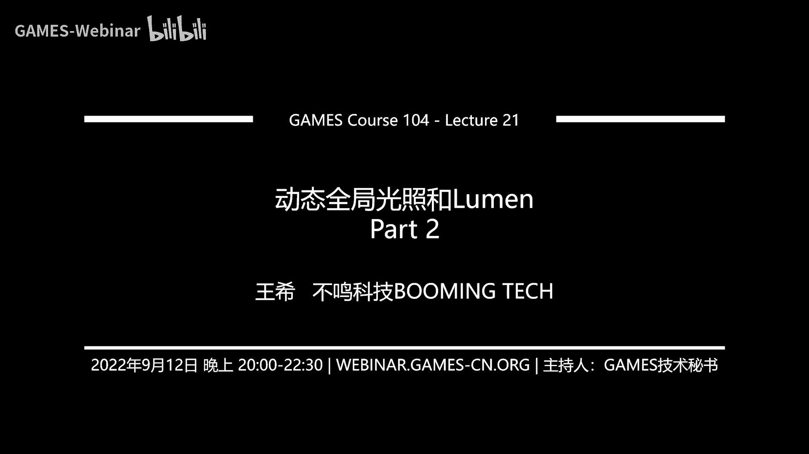

# 课程21：动态全局光照与Lumen (Part 2) 🎮

在本节课中，我们将深入学习Lumen系统的核心工作原理。我们将探讨如何将光照信息“注入”到场景中，以及如何利用这些信息进行高效的实时全局光照计算。Lumen是一套非常复杂且工程化的系统，它巧妙地将多种技术结合，以解决动态全局光照这一难题。

---

## 概述：光照信息的捕获与表达

上一节我们介绍了Lumen的硬件光线追踪基础。本节中，我们来看看如何将光子“注入”到世界，并构建一个用于全局光照计算的统一表达。

Lumen的核心挑战在于：当计算全局光照时，场景中每一个被照亮的表面（无论是否可见）都可能成为间接光源。我们需要一种高效的方法来捕获和表达这些遍布整个复杂场景的光照信息。

Lumen提出了一套特殊的系统来解决这个问题。

---

## Mesh Cards：为光照准备的“快照” 📸

Lumen采用了一种称为 **Mesh Cards** 的方法。其核心思想是：为场景中的每个物体实例（Instance）从六个角度（+X, -X, +Y, -Y, +Z, -Z）拍摄“快照”。

**为什么要这么做？**
因为全局光照（GI）需要考虑全光路。一个点被照亮，可能来自其正面、侧面或上方的反射。为了知道物体表面每个方向被直接光照亮的样子，就需要从六个面进行采样。

**实现细节：**
*   这些快照以相机精度和位置为依据，进行LOD处理：离相机近的物体分辨率高，远的物体分辨率低。
*   每次快照捕获的信息包括：**Albedo（反照率）**、**Normal（法线）**、**Depth（深度）**，如果是自发光物体，还会捕获 **Emissive（自发光）**。
*   所有这些Mesh Cards的数据会被打包存储到一个称为 **Surface Cache（表面缓存）** 的地方。

---

## Surface Cache：光照信息的统一存储 🗄️

Surface Cache是一个固定大小的存储空间（例如4096x4096），用于存放所有Mesh Cards打包（Atlas/Packing）后的数据。

**关键点：**
*   它不是一个单一的纹理，而是一系列纹理的集合，包括Albedo层、Normal层、Depth层等。
*   数据会使用硬件支持的压缩方法进行压缩，以节省内存。
*   随着相机移动，Surface Cache中的内容会动态更新（Swap in/out），因为GI计算可以容忍一定程度的数据延迟。

Surface Cache可以理解为对世界光照信息的一次“固化”表达。它将所有物体表面的辐照度（Radiance）信息存储起来，为后续的蒙特卡洛积分采样提供了统一的查询接口。这类似于将光子“烘焙”到这些表面卡片上。

---

## Surface Cache Lighting：计算缓存上的光照 💡

有了Surface Cache，下一步是计算存储在这些“卡片”上的光照强度。这被称为 **Surface Cache Final Lighting**。计算过程分为三步：

### 第一步：计算直接光照（Direct Lighting）
对于Surface Cache上的每个像素（代表世界中的一个表面点）：
1.  获取其世界空间位置、法线、Albedo。
2.  对于每个光源，计算其对该点的贡献。
3.  **可见性（Shadow）处理**：利用上一节讲的Mesh SDF进行快速光线追踪，判断该点与光源之间是否有遮挡。这避免了渲染传统的Shadow Map。
4.  支持多光源：将每个光源的贡献累加即可。这使得Lumen能天然支持动态多光源的GI。

**公式简化表示：**
`DirectLighting = Sum_over_lights( LightIntensity * BRDF * Visibility )`

### 第二步：构建体素化世界表达（Voxelized World Representation）
直接光照只能处理近处物体。对于远处物体，需要一种更粗粒度的表达。Lumen在**世界空间**中构建了一套体素化（Voxelized）的光照表达，称为 **Voxel Lighting**。

**实现方式：**
*   将世界空间划分为网格（例如，每个体素0.78米边长的立方体）。
*   利用Mesh SDF，向每个体素内发射探测光线。如果能击中任何Mesh，则记录该击中点的法向、Albedo等信息。
*   这个体素化表达不需要每帧全部更新，只更新“脏”（发生变化）的区域，效率很高。

### 第三步：累积多重反射（Multi-Bouncing）光照
这是Lumen非常巧妙的思想，实现了“左脚踩右脚”式的光能传递：
1.  **初始帧（T0）**：Surface Cache上只有直接光照（Direct Lighting）。Voxel Lighting是黑的。
2.  **帧T1**：利用T0帧的Surface Cache Final Lighting（此时只有直接光）来照亮并更新Voxel Lighting。此时Voxel里存储了一次反射的光。
3.  **帧T2**：计算Surface Cache上新的间接光照（Indirect Lighting）。方法是对每个Surface Cache点，向周围半球空间发射光线，并**从Voxel Lighting中采样**其击中点的亮度。由于Voxel Lighting里已经有一次反射的光，所以这次采样得到的结果就是**二次反射**的光照。将直接光和这次采样的间接光相加，得到T2帧的Surface Cache Final Lighting。
4.  **后续帧**：重复此过程。用T2帧更新Voxel Lighting（包含二次反射光），再用更新后的Voxel去计算T3帧的间接光（得到三次反射）... 如此迭代，多重反射的光照效果就随着时间累积起来了。

**核心循环伪代码表示：**
```
// 假设已有上一帧数据
for each frame:
    // 1. 计算当前帧Surface Cache的直接光照
    DirectLighting = ComputeDirectLighting(SurfaceCache);
    // 2. 用上一帧的SurfaceCacheFinalLighting，更新VoxelLighting
    VoxelLighting = UpdateFromSurfaceCache(PrevSurfaceCacheFinalLighting);
    // 3. 采样VoxelLighting，得到当前帧的间接光照
    IndirectLighting = SampleIndirectLighting(VoxelLighting);
    // 4. 合并，得到当前帧最终缓存光照
    CurrentSurfaceCacheFinalLighting = DirectLighting + IndirectLighting;
```

这种方法使得Lumen能以实时性能，渐进地逼近多次反射的全局光照效果。

---

## 自适应屏幕空间探针（Adaptive Screen-Space Probes） 🎯

现在，我们有了存储在世界表面（Surface Cache）和体素（Voxel）中的光照信息。接下来，需要为屏幕上每一个待渲染的像素收集其周围半球空间的所有辐照度。Lumen采用在**屏幕空间分布探针（Probes）** 的方法。

**基本分布：**
*   默认在屏幕上每隔16x16像素放置一个探针。
*   每个探针会向周围半球空间发射固定数量（例如8x8=64根）的光线进行采样。
*   采样结果（辐照度和击中距离）使用**八面体映射（Octahedral Mapping）** 存储在一张2D纹理中。这种映射能实现球面到2D的相对均匀映射，且插值友好。

**核心代码（八面体映射方向->UV）：**
```glsl
// 将标准化方向向量映射到八面体UV
vec2 DirectionToOctahedronUV(vec3 dir) {
    vec3 absDir = abs(dir);
    float sum = absDir.x + absDir.y + absDir.z;
    dir /= sum;
    if(dir.z >= 0.0) {
        return dir.xy * 0.5 + 0.5;
    } else {
        return (vec2(1.0 - abs(dir.yx)) * sign(dir.xy)) * 0.5 + 0.5;
    }
}
```

**自适应细化（Adaptive Refinement）：**
一个关键问题是，屏幕相邻的像素在3D空间中可能相距甚远（例如，前景物体和远处的背景）。如果强行用同一个探针插值，会导致光照错误。

Lumen的解决方案是**自适应细分**：
1.  对于每个16x16的图块（Tile），检查其覆盖的像素在3D世界中的深度和法线变化。
2.  如果变化超过阈值，则认为该区域的采样精度不足。
3.  将这个图块细分为更小的区域（例如8x8，甚至4x4），并分配额外的、更密集的探针。
4.  这些细分的探针被巧妙地打包（Packing）到屏幕空间探针图集的空白区域，内存利用率高。

这种方法确保了在几何复杂的区域有更高的采样密度，而在平坦区域则保持较低采样以节省性能。

---

## 重要性采样与过滤（Importance Sampling & Filtering） ✨

简单均匀地向半球发射光线效率低下。Lumen采用了**重要性采样**，让光线更多地射向对最终贡献大的方向。

**重要性来源有两个：**
1.  **光源分布**：从**上一帧的屏幕空间探针**中估计出哪些方向更亮。这基于“光照变化不会太快”的假设。
2.  **表面法线分布（BRDF）**：不仅考虑当前像素的法线，还考虑该探针影响区域内（如32x32像素）**所有像素法线的分布**。通过采样这些法线并计算其加权后的球谐函数（SH）表示，得到该区域整体的法线分布重要性。

**实现策略：**
*   保持每个探针总发射光线数量不变（如64根）。
*   计算每个采样方向的联合PDF（光源重要性 * BRDF重要性）。
*   对PDF值排序，剔除那些低于阈值的最不重要的方向。
*   将省下来的采样次数，分配给最重要的方向，实现**超采样（Supersampling）**。
*   这保证了计算量可控，同时光线集中在了对光照贡献最大的区域。

**过滤（Filtering）：**
即使经过重要性采样，探针采样的结果仍有噪声。Lumen在空间上对相邻探针进行过滤：
*   收集相邻探针（如3x3区域）的采样光线。
*   **角度过滤**：如果相邻探针某根光线的方向与当前探针对应方向夹角过大（>10度），则丢弃。
*   **距离过滤**：如果相邻探针光线击中点的距离与当前探针的估计击中距离相差太大，则丢弃。
*   只合并那些方向和距离都“合理”的相邻采样，从而在降噪的同时避免错误的漏光（Light Leaking）或模糊。

---

## 世界空间探针作为后备（World-Space Probes as Fallback） 🌍

屏幕空间探针擅长处理近处、相机视野内的光照。但对于非常远处的光照，每个屏幕探针都发射长距离射线效率很低。

Lumen引入了**世界空间探针（World-Space Probes）** 作为后备方案：
*   以相机为中心，用Clipmap的形式在世界空间中放置探针（例如4层，每层48x48x3个探针）。
*   这些探针的采样密度更高（如32x32方向），专门用于捕获远距离光照。
*   **光线连接（Ray Connection）**：屏幕空间探针的射线在发射一段距离后（例如，到达其最近世界空间探针包围盒的对角线长度两倍），如果尚未击中物体，则停止。转而查询该射线方向上的世界空间探针的采样结果，作为后续光照。
*   同样，世界空间探针采样时也会跳过近处区域，避免与屏幕空间探针重复工作。
*   只有被屏幕空间探针“标记”为需要的世界空间探针才会被更新，性能可控。

这套机制形成了层次化的光线追踪：屏幕空间探针处理近处和细节，世界空间探针提供远处和稳定的光照环境，两者无缝衔接。

---

## 最终着色（Final Shading） 🎨

经过上述所有步骤，我们最终为屏幕上的每个像素准备好了光照信息。

**着色过程：**
1.  对于每个像素，找到其周围最近的几个（如4个）屏幕空间探针。
2.  从这些探针中，根据像素与探针的空间距离和法向差异进行插值，获取该像素的间接光照球谐（SH）表示。
3.  将间接光照SH与直接光照计算结果结合。
4.  由于光照信息已投影到低频的SH上，自然起到了平滑滤波的作用，最终得到柔和、真实的全局光照效果。

**整个Lumen的射线追踪策略总结：**
Lumen根据距离和精度，智能选择不同的射线追踪方法：
1.  **最近处（屏幕空间）**：使用基于深度缓冲（Hi-Z）的屏幕空间光线步进（Ray Marching），速度最快。
2.  **近处（~40米内）**：使用Mesh SDF进行精确追踪，可以获取击中点的具体Mesh ID和属性，用于查询Surface Cache。
3.  **远处（~200米内）**：使用Global SDF进行粗略追踪，只能获取击中点的Voxel Lighting信息。
4.  **无限远**：采样天空盒（Skybox）作为环境光。
对于每个探针的每根射线，Lumen会按顺序尝试这些方法，直到获得有效击中或达到最大距离。这种混合策略在速度和质量之间取得了最佳平衡。

---

## 总结与展望 🚀

本节课中，我们一起深入剖析了Lumen动态全局光照系统的核心架构。我们从如何通过Mesh Cards和Surface Cache捕获并表达场景光照信息开始，学习了通过Voxel Lighting实现多重反射累积的巧妙算法。接着，我们探讨了在屏幕空间自适应分布探针进行重要性采样的方法，以及利用世界空间探针作为远距离光照后备的层次化结构。最后，我们了解了如何利用所有这些信息完成最终像素着色。

Lumen是一套工程上极其复杂、精妙的系统，它并非单一算法的突破，而是将距离场追踪、表面缓存、层次化探针采样、时空重投影等多种技术深度融合的“集大成者”。它首次在游戏引擎中实现了高质量、全动态的实时全局光照，为下一代游戏渲染树立了新的标杆。

尽管Lumen已经取得了巨大成功，但实时全局光照领域仍在快速发展。硬件光线追踪的普及、新的算法研究（如DDGI， SDF-DDGI）都在推动着这个领域前进。Lumen为我们展示了解决这一难题的可行路径和工程智慧，未来的渲染技术必将在此基础上变得更加高效、强大与普及。

---
**本节课我们一起学习了：**
1.  **Mesh Cards与Surface Cache**：将复杂场景的光照信息统一捕获和表达。
2.  **光照缓存计算**：通过直接光照计算与Voxel Lighting的迭代更新，实现多重反射。
3.  **屏幕空间探针**：自适应地在屏幕分布探针，进行重要性采样以收集间接光照。
4.  **世界空间探针**：作为后备，高效提供远距离光照信息。
5.  **混合射线追踪策略**：根据距离和精度需求，智能选择最合适的追踪方法。
6.  **Lumen的系统性思想**：将不规则的世界转化为规则化的数据表达，从而应用高效的采样与积分方法。


Lumen的诞生标志着实时全局光照从预计算和妥协方案，正式迈入了全动态、高质量的新时代。理解其设计思想，对于从事图形学和游戏引擎开发至关重要。