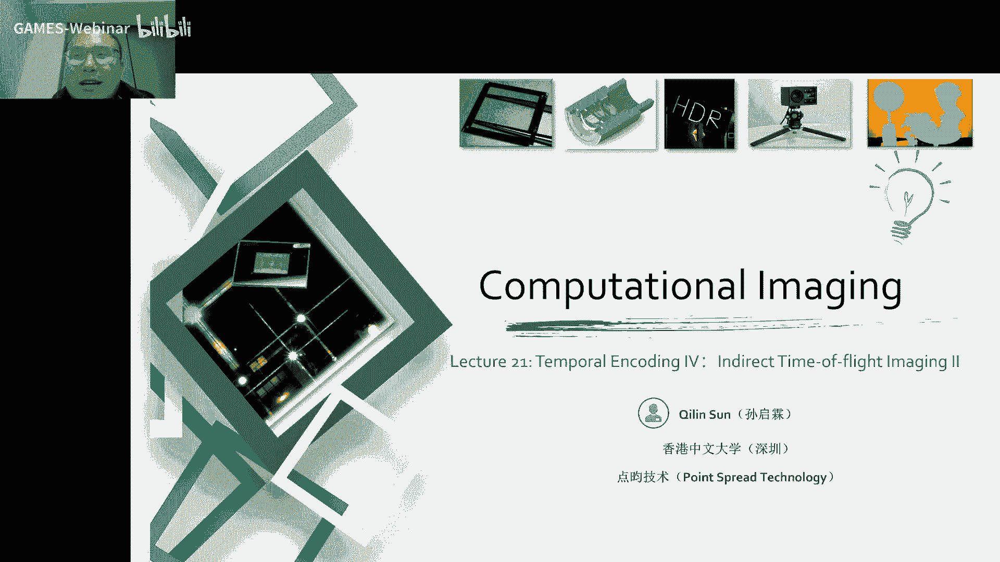
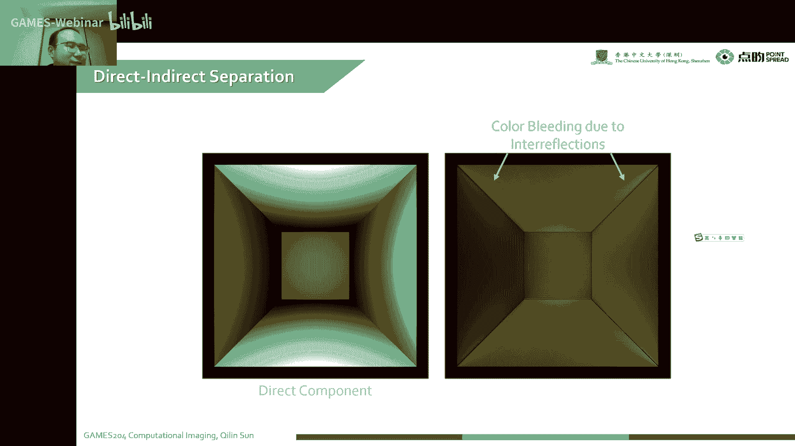
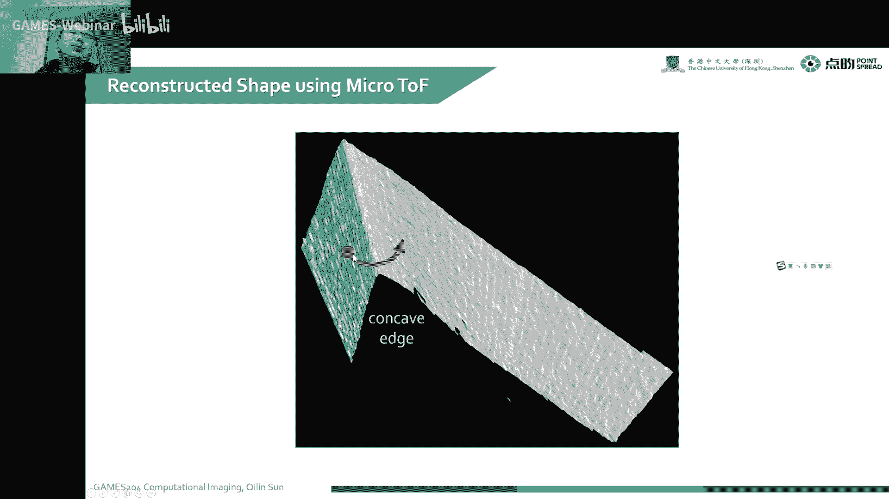
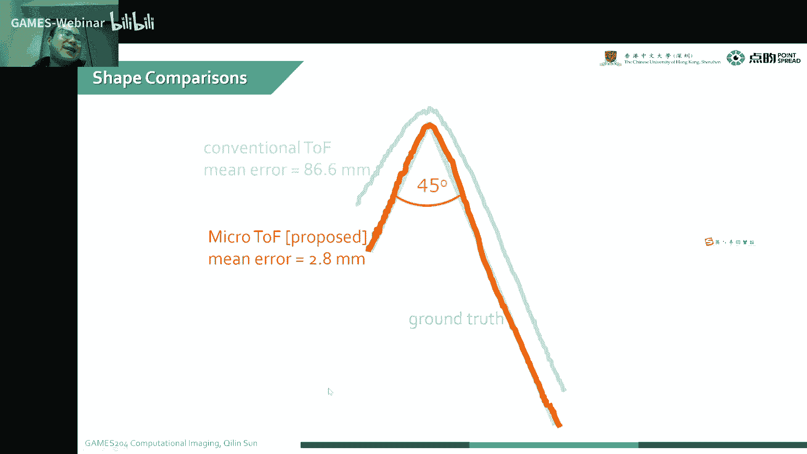
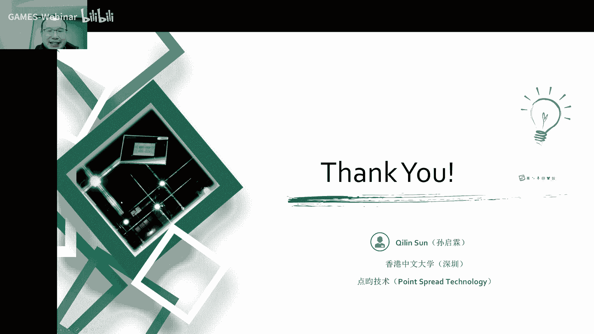

# 21.时域调制 (IV) ｜ GAMES204-计算成像 - P1 - GAMES-Webinar - BV1KM41117Ss

好诶，时间差不多了，今天就正式步入到我们这个食欲调至四哈，这个已经我们呃讲了四节课了，这个内容还是非常多哈非常多，今天就给大家来到了进阶光成像的一个第二节，这有点卡，上节课我们讲到了嗯。

这个基本的一个就是间接光调制。

成像的一种基本原理，就包括我们从像素结构，然后套是两个像素，并之间是怎么调制诶，包括我们遇到了有多少个变量啊，啊比如说我们左右两边的增益不一样，我们需要多少个测量来去解决这么多未知量啊，包括一些偏置啊。

一些啊resist no reset电压的问题，我们需要最后我们发现我们可以用四相位方法，用四次测量唉，来解决这么多未知量的一个问题，从而构建了我们经典的一个啊。

这个arc tan来去解相位的这么一个公式，当然到了最后，我们还是遇到了一些比较头疼的问题啊，比如说像我们这个多路径，因为这个相位啊，它不是那种我们直接光测量的一个pose，像我们像直接光啊。

直接光成像的啊，可能是我声音比较小哈，这个我现在喉咙不是很舒服呃，直接光成像它本身它是一个脉冲啊，就是我们回回回过来的一个波，本身虽然说还是有这种各种脉冲的叠加，也就是他after pose。

就是他那个后面的一个道路径的叠加，但是对直接光成像而言，我只需要检测它第一个相位的一个位置，我就可以解决多路径的问题，但是间接光成像呢它就很头疼，他就很头疼，因为我们测到的是相位，它多次反射的光诶。

它是经过一个correlation，它是一个混合的过程，也就是一个由多到一的一个映射，所以说呢我们这个问题就会变得非常头疼，我们这一个东西会有非常多的解，然后我们会这个多路径问题就会变得非常困难。

所以说人们提出了一个用两个呃，频率比较近似的一个高频的做一个调制，然后形成一个波包啊，形成一个波包，这样的话高频本身我们知道上节课学到了facer，image，频率达到了一定程度之后。

我们这个它的整个pser，就可以在一个360度的一个，实际上我最后所呈到的一个嗯就是传感器上，就是我们计算经过计算，它最后就会平均掉在这个360度上，平均掉，我们就会这个登陆进去变成一个offset。

频率足够高的话，我这个动力性效应它自然而然的就会消失，但是呢我们知道这个器件自个儿它不太可能去，就很轻松的达到一个非常高频的信号，所以说我们通常是用两个比较高频的一个信号，比如说两个100多兆啊。

这个时候可以实现的诶，两个信号稍微有一点点的一个频率差，这样的话就会形成一个包包啊，通过包包的形式啊，来一定的程度缓解这个啊多路径的问题，像今天这个第一部分啊，我们会啊讲一讲。

继续上节课的一个micro micro的一个imagine，去讲一讲这个director和direct一个分离的问题，然后呢啊我们会发现这个在食欲调制上，就我们这个encoding function。

就是我们这，因为这样是不是就好了，微微，诶好了，我们继续好，我们从这一页从头开始哈，就我们遇到一个scattering medium，就刚才啊像我们遇到了那种，比如说像雨，像雾啊，大雾呀或者是灰尘天气。

这种是非常头疼的，而且这种同样的一个问题，更严重的是我们在水下，我们想做这个水下time of flat image的时候，就会变得非常困难，就理想的情况下，我们这个一个光源打出光。

然后经过我们这个场景的一次反射，直接被这个深色捕捉到，所以说呢与之对应的，我们这有一个直接的一个radiance，就是我们sense上捕捉到这个radiance。

但是呢经过我们这个scatter medium，就是我们这种散射型的一个介质啊，我们这个光源发出来这个光，它不再是直接被这个物体反射，它可能会被前面的一个呃就是散射体啊，首先经过反射。

经过散射体的反射进入到传感器，这个问题是非常头疼哈，像我们之前的多路径，我们知道我们多次反射，始终是在我们这个multipath的后面啊，我们multipath始终在这个直接反射的后面。

但是你有了这种这种这种散射体呢，它可能会反射的波，可能会在你这个真实的信号的前面，这个时候你就不知道我到底哪个信号是好的，是坏的，这就变成就，你要是想通过这个直接就是先验知识在家，那就不灵了不灵了哈。

最后我们在传感器上拿到了一个信号，就是唉经过这个散射体反射，跟你原本信号的一个啊乱七八糟的叠加哈，你这个很难受的，这个我们最后就拿到了一个face error，这个face可能是偏甜的，也可能是偏厚的。

这种就就非常头疼，这怎么办呢，我们理想的情况下，唉我们知道理想的情况下，它它的ground truth是一个，就是它是一个深度图，深度图就会一个平面就会变成一个弧，因为是我们从一个点。

连到一个各个平面的一个距离，受到这种scattering medium的一个影响，我们知道他的项目提前了，也就是我的一个error就比之前小了，就是相位提前了嘛，这个时候我们整体的一个测量值就偏小。

就是蓝色的，是我们就是不管没有没有校正过的一个测量值，同样的我们还是用这种双屏的一个原理，用两个高频，两个高频，然后通过两个高频的一个correlation，形成一个包包。

这样的话我们本身的调制频率是非常高的，我们在这两个高频下，我们有可以去分解这个深度上面的，一个小的一个immigrity，这样的话就可以在一个啊，相当于一个比较高频的一个测量下，来实现。

我们对这个这种散射体的一个道，路径的一个校正，本身呢，我们要实现这个直接光和间接光的一个分离，我们发现这个就direct radiance，跟着director radiance，哎。

我们发现我们最后我们的实际测量，是一个直接加上一个整体的一个偏置，我们把这个啊直接信号它的一个赋值啊，赋值就也就是它的整个分封值的一半来，即为amplitude，整体的呢呃到这个峰值的中心呢。

我们把它记为offset，解为o实际上我们最后想要计算的一个值，就是直接关了一个峰，峰值，就是两倍的一个amplitude，然后它的一个整体的偏执呢，就global的偏执。

就是一个o减上a这么一个很小的一个值号，当然我们发现我们要解这么一个，把这个直接光和间接光这个量解出来，我们需要三次测量，三次测量来把这个量具体的算出来。

我们可以看一看啊，来怎么样实现来这个direct direct的一个分离哈，我们左边这个是一个渲染一个康奈尔box，它是一个直接，就是我们直接一个点连到那个连连线，它的一个深度，然后右边呢。

实际上就是我们一个间接的一个分量，间接的一个分量，这个间接的分量它是嗯在多路径的问题里面，就是多次多次反射在这种chedule medium，就是因为我们这个散射体的一个，提前的一个散射哈，这里面啊。

就我们把这个相当于多路径，跟这个这种scatter medium统一了，实际上它都是对相位的一个干扰，只不过是前向干扰和后项干扰，它本身都是一种多路径的效应哈，这种多路径的问题。

在这种拍这种我们把这个问题统一之后。

我们就可以啊，用这种micro的一个image的一种方式，两两个高频，但是有一点点的一个频率差，来去统一的解决这个问题，比如说我们在拍一个墙面的问题哈，就是两个墙之间有一个锐角，有一锐角。

我们我们理想情况下，也就是我们这个direct component，就是理想的一个深度的一个位置，它就是理想的一个这么一个角，但是呢我们经过这种就多次反射呀，或者是一个偏执的一些问题。

它就会有一个global的一个分量，这是当时啊他们做的一个原型啊。

这是这个，这这个实际上是我们组的一个变形计哈，这个这个这个东西在我们组那时候，这是一个p m d的一个camera board，就是最早的像德国那个psmixer device。

后来可能是被那个英飞凌收购了，这个是可以搞到125Hz，当时是用了两个啊，接近125Hz，20 125兆赫兹哈，125兆赫兹的两个比较高的一个频率，两个比较接近的高手频率来实现这个marko的。

这么这个image当然我们要验证的验证，一般哈大家验证这种多路径啊，或者是呃这种多次反射的这种问题的时候，大家都会用一个这种叫v字型的一个墙角哈，实际上只是两个板哈来做一个啊。

仿真和实验的就是两种方式的验证，就有一个墙，我们把这个固定住，另一个墙是可以移动的，然后中间我们选择一个固定的一个角度，然后呢我们把这个就是传感器哈，把这个相机一般是放到5米左右的一个位置。

也可以3米5米，这个就看你的这个调制频率了，这个尽量不要产生挖平这种问题，比如说你100兆的时候啊，它的一个挖平距离就是1。5米，那60兆呢啊实际上就是2。5米，当然你也可以降了十兆，大家可以类推。

就是呃15米哈，对不对，然后这个时候呢，简单地考虑这个就是多路径的一个问题，哎我们发现这个锐角理论上它测量哈，我也可以看到这45度的一个锐角，60度的一个锐角，还有90度的一个直角。

我们拍摄出来了这个这个深度图啊，它是有一个严重的变形的，好严重的变形，大家也可以可以很清晰的从这个图里面看到，他这个到底是怎么变形的。

但是呢我们用两个比较高频，然后有一个但是有一点点频率差，去拍这个来解决这个ambiguity的问题的时候，就可以比较好的比较好的恢复出来，他这个正确的角度，我们可以看到理想的情况下，这个45度。

它就是实际上就是一个理想的一个角哈。

但是呢你只考虑一个单屏的啊，单屏的一个传统的一个time of flight，它的一个mi error就可以达到86mm哈，86mm就是8cm多，我这一个偏了一个8cm多哦，好家伙，这个有点大。

大概10%的误差了哈，但是呢，当我们用这种mo就mo time of flight，它那个mierror可以降到2。8mm，就非常接近光荣柱子了，就比它一种普通的一个单品的一个top，可以提高啊。

三四十倍的一个进度程度啊，这个就是解决了一个多路径问题的一个影响，当然也不是完美解决哈，就我们最后发现这个还不是很完美，这个也不是很完美，所以后来呃哪怕到了今天，这个多路径依然是这个研究的一个热点问题。

大家可以看到这60度的一个呃角。

拍摄出来的一个情况，60度的时候哎。

这个偏差也是不小哈，像传统的就是达到了7cm，90度也到了5。6cm，就是mo time of flight，就这个思路就很好啊，我们用了这两个高频来去呃，相互correlation。

然后形成一个播报诶，这个时候就可以形成一个有效的一个深度的，一个辨别能力，大家可以看一下。

我们记录到了这个形状，跟我们啊最后频率的一个关系，这频率不断升高，升高升高，它的精度也会变得越来越高，啊这个是实拍的一些效果，实拍的一些效果。

这个就实现了一个啊director跟global的一个分离，就是我们这个director，就是我们最后想要的一个啊，真实的一个就是深度的一个值。

来我们总结一下我们前面啊这种time of flight，遇到了一个问题啊，这这这种呃indirect illnation，经常是受到这种多路径啊，scattering medium一些影响。

它影响都是比较消极的哈，但是呢我们解决的方案是什么呢，就是用一个两个比较高频的一个信号，但是这两个高频的频率比较接近，我们用这两个频率的测量，来去抵消我们这个道路径的一个。

还有这种scattery medium的一个影响，但是呢我们这个测量频率要到了多高，才能说真正的实现我们这种精细的测量呢，就我们本身的一个测量范围，从我们的一个比如汽车或者是一些啊卫星啊。

或者是飞机上的一些雷达的使用，可以到公里级啊，然后到这起车载几十米呀，到我们就是日常生活啊，厘米级分米级啊，到我们最后比如说呃生产线上，我们要做到一个啊毫米级甚至亚毫米级。

就是几就是几百微的这么一个精确测量，那从我们这个就是测量本身那个频率，就是呃效果来看，就我们不一样的这种测量范围，它对这个我们深度测量的一个表面，平整度的要求也不一样，比如说啊要到了一个米量级哈。

就是千米量级，我们通常就是就是几几赫兹啊，或者是几百赫，几k赫兹，我们不断不断的变得清晰，我们需要更高的频率来去实现这些精细的测量，包括到啊就是g赫兹呀，甚至是到太赫兹。

来实现这个毫米微米级的一个三维测量，就我们比较经典的一些器件啊，比如说像这种pmb的一个camera neo哎，这个时候就是可以实现一个厘米级的一个，三维精度的一个测量，然后呢这个也有g赫兹的一个d哈。

这是啊以前做通信用的哈，以前做通信用的一般哈，这个成像啊都是跟着通信后边哈的，通信有了刚需，把这些器件搞出来之后啊，大家搞成像的时候就发现诶这期限挺好，调制频率挺高，我们可以用一下。

其实呢本身现在还有很多太赫兹成像，太赫兹成像的技术可能太多了，就不再给大家详细的讲这些太赫兹的技术了，我们总结一下前面的一个啊time fly的成像，包括我们讲到了facer与美景。

我们可以通过这个facer就发现诶，我们可以描述我们这个向角的变化，可以描述这个向角的它的一个角度变化，跟一个幅值变化，就可以非常清晰地描述，我们这个整个三维图像的过程。

本身这个facer它自身的一个抖动，也就是我们这种深度误差的来源，我们就可以把这一个箭头换成，换成一个小小的这样一个包啊，但是我们这个包是可以通过提升频率，把这一个相位的误差来到了足够高的一个频率。

情况下，就变成一个global offset了，然后呢我们就讲到了一个generalize的一个continuous，wave的一个time flies，它会受到这种自身的一个多路径的一个影响啊。

或者是受到一个啊这种散射体的一个影响，就会产生这种非直接光的成像的，一些不好的干扰哈，当然我们讲到了这种不好的干扰，可以用这种micro display，也就是两种高频，但是频率相近的去解决这个问题。

最后来恢复我们这个direct的这种测量，也就是我们想要的一个理想的一个shape，当然我们也可以一些分析一些，这个光传播的一些效应哈，这些是大家这前面的这有问题吗，像没有问题的话，第二部分。

那我们像之前我们做这个就直接光的一个，间接光的一个调制成像啊，我通常可能模型比较简单，大家只是用一个单屏的一个这种方波啊，或者是一个呃正弦波来进行发射跟解调，但是这种我们真正的说我们这种。

大家可以想一下哈，这个方波跟这个正弦波哪个好一些，从大家的感觉上来说，就方波跟正弦波哪个好，就是咱在这个进入正式进入到呃，这个optimal encoding这个问题上，咱先说一下两种强常见的方式。

就同学们觉得哪一种会更好一些，放波好还是正弦波好，大家有没有这种可以先抛抛出来这个问题啊，到底是方波好呢还是正弦波好呢，哪一个我更鲁棒，我的深度精度更高，咱先不谈实现的问题。

因为我们最后这个激光管发射出去之后，他那个波形肯定是会变形的，它又不是方波，也不是正弦波，也就是遇到了，我们之前讲到了一个这种非线性的问题，但是他理想考虑理想一点哈，那就是方波，理想的方波和正弦波。

每一个对我的一个系统有更加积极的影响呢，同学们可以说一说，发表自己的观点，这我先不说哈，我先不说，然后给大家就是先回顾一下哈，我们通过这种相位的一个偏移，然后再做一个correlation。

来进行这个深度测量的时候，我们之前讲到过，我们需要三次测量来解决这三个未知量，我们有三次相关啊，r one拿到了一个相关值，也就是我们这个发射区的一个一个光波。

跟这个接收出来的光波做一个correlation，然后呢我们要通过这三次测量，这三次测量，一般我们可能会用四次冗余性来解决，这个解出来这个相位，那我们直接就把这个相位来解出来，这是我们想要的一个深度呃。

放这同学说方博哈，这个kph mt同学说方博呃，方波确实是比这个正弦波好一些哈，但是确实不是因为这个方波频谱宽，而带来的积极影响，这个咱先把问题留着，让大家继续看。

这个到底是怎么样带来这个积极的一个影响，本身呢我们也知道了，我们这个近极光成像，它会有一个比较高的一个信噪比，同时也可以实现一个实时的捕捉，但是呢我们从这个正弦波出发哈，我们这个调制方程跟这个解调方程。

理想的情况下，咱们也没有理想的两个正弦波，他们两个做相关的时候，我们实际上是拿到了一个，就是标准的正弦波对吧，但实际测量呢我们可能会有一些相位的偏移，这个时候我们还是比较理想啊。

只是只考虑有一个相位的移动，也是我们最后拿到了一个coration的一个方程，实际上也就是简简单单的一个相位移动啊，同理哈，再一次测量也是这么个情况，我们最后解散出来的这个相位的偏移。

就是我的一个深度上的一个变化，啊这个rpsi说方波新型信噪比高，嗯这个也不是因为这个为什么性价比高呢，这个同学可以解释一下吗，为啥这个方波的信噪比会高一些，确实会高一些。

我们做这个相位解调相位到深度的一个变化啊，实际上我们是建立了我们整个的一个测量到的，相位到一个深度的一个映射，我们现在比如说有三个颜色，也就是212223，这三个就是口音相关的一个值。

我们是通过这三个一个相关的值，来建立到我们对深度的一个映射表是吧，也就是说我们每一个深度的一上面的一个点，每一个深度哈，每一个深度都有它有三个相关的一个值，r1 r2 r3 。

也就是我们就是传感器上测量的值诶，不一样的深度，就会有不一样的一个对应的i123 的值，这就是一个三维到一个深度的，三维的一个值到一个深度的一个映射，这么一个关系，也是我们可以把这r1 r23 。

把它描述成一个三维空间，这三个值就直接决定了我最后深度值是多少，这个同学们是不是可以理解一下嗯，就我三个测量，然后每一个深度值对应的三个测量值，实际上我们就这个r1 r23 这个相关值。

就建立了一个嗯这种映射关系，这种映射关系，对这个比较好理解啊，然后换一个呢，比如说换一个深度值，我们又出现了一个三个点哈，我们就可以认为在这个三维空间里面，每一个点都有一个对应的一个深度值。

这样的话我们是可以建立一个啊，直接这么一个映射关系啊，哎再换一个深度值，我们发现这个点儿跑到这儿来了是吧，但最后呢我们这个相关的一个值，也就是这这三种颜色描述出来的值诶。

就会构建成一个哎我们通过扫描不同的深度，我们发现正弦波，从零到d这么一个远的一个距离，会出现一个这么环型的这么一个coding coach，也就是我们这个环上的这么一个，每个点都对应着一个深度。

这就建立了一个啊，从r1223 到深度的一个映射，当然我们可以看到哈，不一样的depth就是对应了不同的一个coding cover，上上的一个点，就基本上每个点就直接对应了一个深度的值。

当然同学们想一想，当我超过二派的时候，会出现什么情况呢，现在我们还是一个周期范围内，当我们这个深度，这个只是对应的相位超过二派之后会怎么办呢，会出现一个什么情况呢，其实啊也就是比如说从这个点诶。

超过二派绕一圈绕一圈，到了二派又回到这个点了，也就是出现了花屏，在我这个这种3d的这一个r1 ，r23 的一个space里面，超过二派之后，我都不知道这个只是前面的还是后边了，这就出现了wap。

实际上也就是这一个闭环的一个coding，科贝车里面，也可以很清晰地看到这个vip这个问题，当我们解码的时候，实际上就是从i1223 想解出来，真实的一个深度值，当我们看到我们还是我们。

当我们这个深度直射的噪声影响的时候，比如我们这个r1 r2 r3 ，我们测量的时候会有噪声，会有噪声的，我们这个测量点实际上就是围绕着这个噪声，我们可以画一个画一个球哈，比如说这个点对应了这个深度。

但我们会受到噪声的影响，实际上我们这个测量的一个不确定性啊，也就是在这个点周围诶，围绕这么一圈噪声的问题，那这个噪声我们映射到我们这个深度上，会有一个什么样的问题呢，也就我这个噪声。

实际上对应了这么大一段的一个不确定性，这么大的一段的一个副确定性，同学们想一想，我们如何减少这个不确定性，最简单的办法是什么，假设我这个测量的那个噪声是恒定的，就我传感器的测量噪声。

它就是就是一个固定的一个噪声，我怎么样去降低我这个深度测量的一个宽度呢，怎么样最简单的一种办法是什么，嗯同学们最简单的一种办法是什么，最简单的办法是不是我们可以把这个r1 r2 。

r3 这个box做大一点，最简单还不是这个科普是加长啊，这个可能科室加长还比较难，你要一就做边吧，你光强加强一点，你这个r1 r23 值变大一些，噪声是固定的，但是你这个靠近科学者变大了。

是不是这样的话，唉我们受到噪声的影响是不是就小一些，最简单的就是把这个整个就是照明的一个光墙，拉墙拉墙，我们最后这个整个值就变大了吗，我造成那个球还是这么小，对不对，这样的话。

我对应的这个就深度的一个不确定性就会变小，对不对，也就是我们这个小的一个深度的一个accidity，就对应了一个更高的一个深度的分辨率，也就是top的测量，它的噪声直接决定了他这个分辨率是深度的。

分辨率是多少，当然要考虑理想的情况下就是没有噪声啊，我们没有任何噪声，所以说我们没有任何噪声的时候，也不考虑多路径哈，这个时候我们top本身测量的一个精度，可以认为是无限高的。

来我们实际情况不可能一直的，就是我们实际情况里面，不大，可能，一直的这种增强这个激光的一个照明功率哈，因为我们最后有些像这种相机，它是要符合安全标准，他达到一定程度之后。

它就不让不再是class one了，这个时候就很麻烦，不大好，靠这个光强增强，我们怎么样解决这个这个说到这个coding cobt的，这个就是我们这个深度精度的问题呢，就我们现在光源固定了，光圈固定了。

这个咋办，所以说刚才有个同学一个思路很好，就是说我们这个coding confeature可以尽可能的变长，从而我这个噪声相对于我这个coding，curvature来说。

对我们最后深度的影响就会变得更小一些，当我们想一想，我们在这个r e，r i s3 构成的一个3d空间里面，怎么样去尽可能的延长我们这个coding confession，对不对。

然后聪明的人类就想一想，当我们比如说我们用一个这种方波哈，方波做调制的时候，刚才同学啊就问了一个问题，说就问了同学们一个问题，就是到底是方波好还是我们这个正弦拨号，当然我们可以看到这个方波。

方波的这个correlation matrix，然后最后对应的一个coding curvature，它是好是比这个这个圆稍微大一些哈，是大一些，这是它的一个呃encoding的一个曲线。

你们知道两个方波这个做相关，它就是一个三角波嘛，我给你发现诶，这个换成方波调制稍微强一点哈，比刚才会鲁棒一些，因为我们最后这个coding confeature变长了，但是我们这个3d的空间。

还是没有很有效的利用好，很有效的利用，我们还可以尽可能的设计一个更长的一个coding，curvature，来减少我们噪声对深度精度的影响，我们知道哈我们这个深度的一个分辨率哈。

我们记为这个这个这个这个数，然后我们coding curvature越长，我这个精度就越高啊，他直接跟这个深度的一个精度成正比，然后本身呢我图像的噪声越大，我这个精度也就越差。

当然这个还跟这个深度的一个范围有关，但我们只考虑这个coding courage，其他的地方都已经定死了哈，我现在只考虑这个coding curvature。

对我们最后这个det是resolution的影响，那我们要考虑到这种本身的这个呃，正弦波的一个编码哈，它是这种情况，正弦波呢它对应的在这个r1 r2 ，r3 构成的一个曲线，实际上就是一个圆。

我们这个圆的一个半径呢是啥呢，是1/4的根号下二分之k k呢，实际上就是我们的一个对应的一个呃，测量的一个量，在这里面我们这个k是三，就r t r r3 ，你也可以测量更多维。

比如r4 r5 构成一个四维到五维的空间，从而建建立到了一个高维的一个coding curvature，对一个depth的一个映射，这个都随你哈，那最少我们是三，我们这个就用三个。

我们可以算一算我们这个圆的一个周长是多少，是多少哈，周长实际上就是我们知道这个这个半径和半径，二派r2 派r就拿到了二分之派，然后跟下二分之k，这个k我们可以就认为3号，我们可以约等于的去算一下这个值。

当我们考虑到这个square encoding，也就是我们方波的情况下，方波的情况下，我们建立到这个表之后，实际上我们是拿到了一个嗯，这种三个面拼成的一个图哈，三个面拼成一个图。

它总共有这个就是2k的一个pology，每个边的边长他是啊，这整个都算好，也你可以这个整个都算好，这个是更换一下k分之一，四个边哈，四个边，我们然后再算上2k，实际上我们实际上也是对整个值啊。

乘以一个2k，就是也就是我们最后达到二倍的根号k，这么一个值，这个里面这个k还是等于3号，这是我们一个square encoding的一个情况，我们coin function实际上就是这么一个三角波。

三角波经过这个变化啊，就变成了一个这种很奇怪的这么一个coding cov，最后呢我们发现经过计算哈，大家可以口算一下这个根号k咱就不管了，然后k这两个值相等，我们就是比较这个二跟这个二倍的根号。

二除以派两个值哪个大，这个这个就是二嘛，这3。14除以个二乘一个1。4，一四就3。14除以个2。8，明显就是二比较大一些嘛，所以说也就是我们这种方波调制，它的一个coding length。

是比我们正弦波要长的要长的嗯，大概就是3。14÷1。414的倍数啊，也就是我们大概能提高一倍左右的一个精度，1。8啊，1。8增加这个值，我们怎么样来实现一个最优化的一种，编码方式呢，我们将方波正弦波的。

是我们比较常见的常见的一种调制波形，我们可不可以设计一种最优化的一种编码方式，来让我这个coding coach无限长的，也不可能无限长哈，它是在这个有限的空间里面尽可能的长。

有限的一个三维空间里尽可能的长，所以说呢我们这里有这么多未知的一些量哈，我们想到了一个通信里面常用的这个办法，通信里面编码，我们想要避免我们这个因为相邻的编码相似。

而产生了一个就是这种immigrate，就是因为相似的一个相近的一个编码来混淆，所以说呢，人类发明了一种非常有意思的一种编码方式，编码方式叫格雷马哈格里马，这个我后面会讲到这个格雷马是怎么样啊。

去应用到这个嗯，就是他们flight imaging的一个encoding上面，当然我们想要在这个有限的三维空间里面，那可能实现一个尽可能的一个coding curvature。

就是人们早期里面也是做了非常多的一，些想象哈，比如说我在这种梅花型的，它是很长哈，他是很长，但是他自己自个儿给自个儿相交了，也就是我最后深度我分辨不出来了，那就不好办不好办了。

而且我们同学们是不是想想我这个画一个环环，是不是也可以呢，但是画这个缓一缓再有啥问题呢，就是就是我们这个局部的一些细节保持不住，保持不住，比如我这个噪声哈，我搁这划了一下，这几个都包进去了。

这个细节保持不住啊，这个最后咋办呢，大家可以看到这个就很难办哈，诶这有点卡了，这ppt卡了，同学不好意思，这个有点卡了，所以说我们又不可能说随手画一个这种，很长的一个cvt来实现这个encoding。

所以后来人们就想到了格雷马这种方式，哈格雷马这种方式，这个这个是这种优化的方式，经过从从格伦玛借鉴过来了，叫哈密顿编码，我们可以想一想这个哈密顿这个cycle，假设我们一个高维还是三维吧。

就简单一点就是到三维用了，它可以是一个超超超超超立方体哈，我们有这么多个note，然后这么多个边缘，我们这个哈密顿这种编码，我画这个啊，在这个编的时候，这种哈密顿的编码是可以实现一个最长的一个。

coding path，他这个coding coverage length呢可以达到2k，减掉个二哈，剪掉个二，也就是我们这里一根两根，三根四根五根六根六倍的边长这么大，也就是在我们这一个超立方体里面。

能实现的一个最长的一个coding pad，是吧，那我们把这个回到这个问题啊，我们就就就三维，就r1 r23 这三个相位测量值，我们把这个这个，coding path，然后解成相位啊，解成相位。

反着推回成推成相位也好，我发现我们这个correlation function，它是一种梯形的一种口味方式，这个是不是很神奇哈，也就是说在这种畸形的一种条件下。

我们可以实现一个最长的一个coding co，最长一个coding coach，但实际上我们要想做到这种梯形的这种cod，这种调制波哈，实际上是比较困难的哈，这你想想这个理想的一个方波，你都整不出来。

他要345次斜坡，你比如说你这个100兆，你搞个五次斜坡，这都五六次，这五次解剖哈，一三这个34524446484，那这几次斜坡好家伙就就就大几百兆上g了，这个条例来说是非常困难的。

你要想搞个这种奇形怪状，这种梯形的这种波形调制出去，实际上是更困难的，它是一种高速斜坡，实际上是更难实现了，但是呢这个聪明的人类是有办法的，后面我会讲到。

怎么样实现这种哈密顿的一个coding coach，也就是我们调制波是方波，那我们要考虑到更高阶的一个哈密顿编码，就是我们要四次五次测量的时候，哎，我们就可以通过这种办法来实现一个这种呃，调制。

其实这个办法是从这种格雷法借鉴出来的，我们可以看到这个格雷码，我们让任意两个相邻的这个相邻的两个马，只有一位是不一样的，这一位是不一样的哈，我们看看第一个点000，它最后一位不一样。

然后这两个相邻的中间这位不一样，后两个就是最后一位不一样，然后在这两个第一位不一样，在后面最后一个不一样，它每两个相邻的编码之间只有一位，是不一样的是吧，这个就是呃1953年啊。

就是大家就可能通信里面会讲到这个格雷马，就是我们这个哈密距离在任意两个编码之间，它只有一位是不一样的，我们这个哈密顿编码呢，也是借鉴于这个格雷马里面这个思想，当然同样的这种思想也可以用到这种结构框的。

一种3d成像啊，这个这个用这种格雷码编码的一种python，已经是有了，它可以啊，比较有效的提高我这种结构光的，一个呃精度的分辨率，大家可以看看这个用格雷码，是不是跟我们这个对应的。

000~01这个位置对吧，到011，刚好跟我们的哈密顿编码是对应的哈，只是我们的这个哈密顿编码，它是一个连续的一个编码，这个格雷马是一个离散的一个编码，很神奇啊，很神奇这个各个领域之间。

所以说为什么就是喜欢推荐同学们去跨领域的，看一些东西啊，这可能拿过来就是一个非常经典的一种方法，来解决一些非常实际的一些问题，我们对比一下这个coding confeature的length，在比如说。

我简单点三次测量，三次测量，四次测量，五次测量，在这几种情况下，我们发现哈密顿编码，哈密顿编码是可以非常有效的提升，我这个coding coverage的l，也就是提升我对深度精度的一个鲁棒性好。

也就是在相同的一个照明强度情况下，噪声也比较固定了，我通过哈密顿编码，可以非常有效的提升我的深度测量的一个精度，这是一些比较仿真的一些结果啊，大家可以看到楼梯啊，楼梯这种多路径是非常恶心的。

我们可以看到这个，不同的场景哈，像正弦波，正弦波调制派一个平板，大家会发现诶，这个狂热兔子是一个这个深绿色的哈，正弦波和方波，我们发现方波可能会比正弦波这个误差小一点，小一点。

哈密顿编码呢是可以非常接近的，这个光非常接近这个光出色的，这是一个剖面图啊，这个剖面图，同样的我们测了这个圆的时候，ground truth是这个深绿色，那么哈密顿编码是黄色，它的误差可以做到很小哈。

24mm，但是我们这个正弦波正弦波这种这是红色的，就会误差非常大，误差非常大，它会受噪声的影响非常大哈，然后这个方波好一点，大概我们可以看到1。8倍哈，这个好像这个这个值还是挺准的。

我这个coding lt差不多1。8倍，这k等于五哈，这五大家可以算一算，这个误差的这个error跟这个coding lens，可以课后算一算到底是不是混合的，这是一个楼梯的一个情况。

我们发现这个这个正弦波，受楼梯影响已经非常严重了，看哈佛对编码可以非常有效的去降低，这个造成对深度精度的影响，那我们可以拿一些嗯在强太阳光下，比如说强太阳光是一个噪声噪声源。

一个global offset，一个噪声源，我发现这种正弦波编码五张图哈，就五四测量方波母子测量哈密顿编码，它的误差从14。5mm，8mm降到了用毫米的编码呢，这种k等于五的时候可以降到1。46mm哈。

差了接近一个数量级，我看到这个人脸这个细节也会变得清晰起来，对这是他的一个smooth后的一个结果，这是一个室外的一个测量啊，把这50米的一个top，你可以看到正弦波这个细节，已经基本上完全看不到了。

误差40多厘米，但是这个哈密顿编码是可以有效的去恢复出来，它表面上的一些细节，也就是我对噪声更加鲁棒了啊，更加鲁棒了，当然我们刚才讲到了，我这个好像这个梯形不大好不大，好实现，对不对。

我们要实现这么一个梯形的一个correlation function，对吧，我们可以比如说我们用一个就是dota function，跟一个这种梯形的一个这种图去做一个相关。

我们是可以拿到一个coration方式，当然我们想要发出非常窄的一个impulse function，是非常困难的，这个是不大可能哈，因为它频率太高了，我们怎么样通过我们通过合理的手段。

通过我们现有的一个这种电子的一些信号，来去实现这么一个梯形的一个correlation function呢，我们要怎么样去设计这个调制波跟这个解调波，从而发现我们这两个波形之间做一个卷积。

就可以出现一个梯形的这种模型，实际上这个问题在我们实际的应用里面，是比较简单的哈，比较简单的，大家稍微调一下这个战控笔就可以了，就我们正常情况下是一个50%，50%的一个方波哈，做一个相关。

我们拿到一个三角波，我们把这个调制这个方波占空比调窄一点，与之对应的呢，我们这个p modulation的这个参考信号，把它的占空比调大一些，我们这两个信号之间的相关就可以实现，比较轻松的实现。

我们这个理想的一个梯形的一个口人声方式，这个就是在实际应用里面，就会把这个问题变得非常简单，就是我最后调一下真空，比我这个理想的一个呃，codlss就可以做出来的啊，这个是啊实际电路里面是怎么样操作的。

当然我们最后要总结一下这个深度的测量，跟这个就是深度的精度，之间的一个矛盾的问题和矛盾的问题，就是对我们这个三角就是用这种结构，光用三角测量法来测量我们这个深度的时候，在比较近的距离。

因为这个三角我们知道是通过结构做参考，来去算计算这个深度的，也就是我们在比较近的距离，是可以实现一个比较高的精度的，就可以，甚至可以实现就几个微米量级的一个，深度的进度，但是呢它的这个精度。

会随着就是测量范围的变大，比如测量距离的变远，而很戏剧性的下降，本身呢我们这个tom fighting image，他就反正进的地方精度不是很高哈，进的精度地方精度不是很高。

我们目前可以做到的就是可能比这个更高一些，可能我们自个儿能做到1mm左右，1mm左右它不大，随着这个深度的变化，它的精度不大随深度变化而变化，但是啊绝对的测量精度不是特别高。

现在我们自个儿顶多也就做到1mm左右，那我们理想的情况下是啊又要远啊，这个精度要高啊，这是理想的，我们后面要实现一个努力的一个目标，今天呢讲这个课程可能呃比较比较难懂哈，比较难懂。

就我们最开始讲了这个micro image，也是来针对我们这个多路径啊，或者是这种scattering medium，这种产生的这种非直接测量的一个啊去除哈。

我们用micro imaging这个就这种方法，两种相近的高频，然后后面呢我就抛出来这个问题，怎么样实现一个更鲁棒的一个coding，也就是我们想尽可能的，去延长我们的一个coding path。

在有限的条件下去延长我们这个coding path，来提高我这个他们flight image的系统，对噪声的一个呃罗邦性啊，也就是提高啊在相同的造成情况下，提高我的深度的一个分辨率。

最后呢我们讲到了这个哈密顿编码啊，哈密顿编码，实际上是借鉴于格雷马的这种一种思想，把这个格雷马的思想运用到这个continuous wave，他们flat ming。

最后来实现了一个有效的一个精度的提高，甚至可以提高到一个数量级的一个，精度的提高啊，这是一个非常有意思的一个啊过程啊，啊今天的课程就到这里啊，同学们有什么问题吗。

这今天挺有意思啊，这个哈密顿编码是可能是19年还是20年，西瓜那时候还是18年，我忘了，当时wolf港问我，你觉得哪篇论文今年开会的时候最有意思，当时我就跟我说的是这个哈密顿编码哈。

他当时这听完觉得就是眼前一亮，耳目一新，这么简单的一个变动，就可以很戏剧性的提高，我这个深度的一个精度哈，同学们还有什么问题吗，可能今天讲的也比较清晰了，比较清晰的，那么有什么问题的话。

可以借着这个直播间的机会快速的问一下哈，当然这个我们现在也对这个刚开始，方波和正弦波的这个哪个好做了一个解答啊，当然有同学说方波信噪比高，有的同学说风波频谱宽。

其实呢本质上都是延续了我在这个coding space里面，他的一个coding curvature的一个长度哈，同学们还有问题吗，啊如果同学没有问题的话，今天的课程就到这里，下节课我们会讲到这个啊。

temporal encoding的最后一课也是cody啊，temporal photography啊，这也是一个非常有意思的课题，后面我们会进到这个special encoding的一个范畴。

好今天的课程就到这里，再次感谢同学们啊，耐心的聆听。

