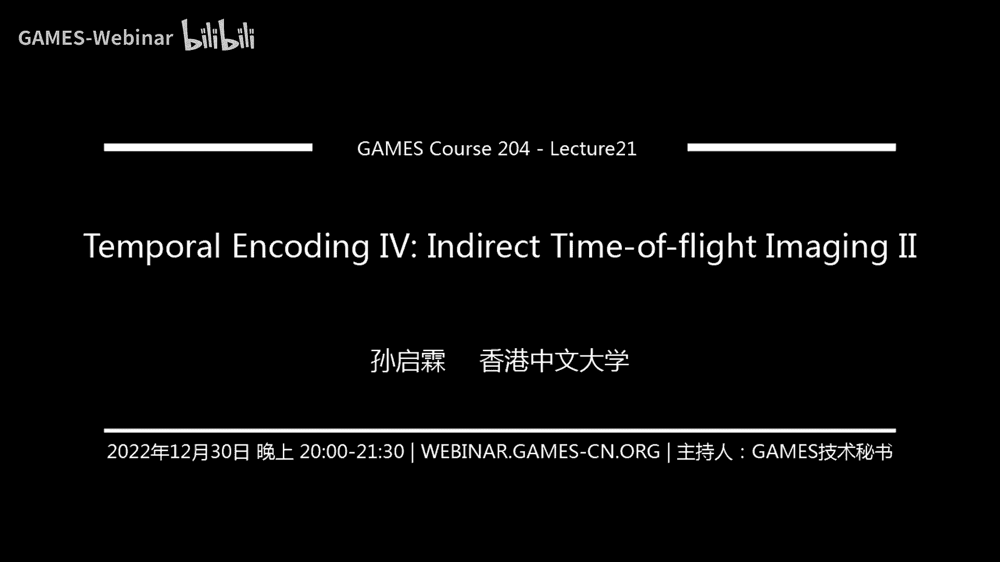

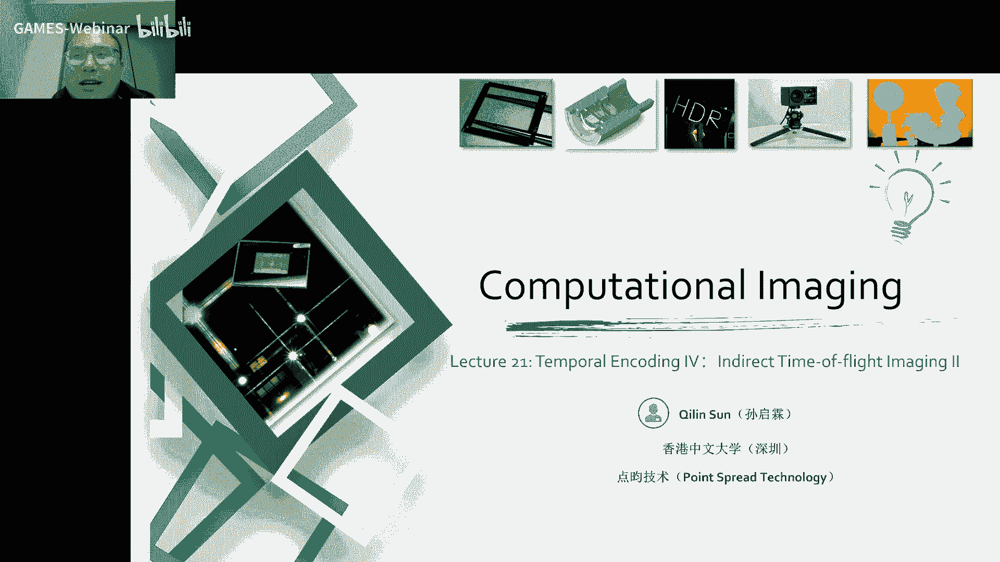

# 21.时域调制 (IV) ｜ GAMES204-计算成像 - P1 - GAMES-Webinar - BV1KM41117Ss 🎥

### 概述

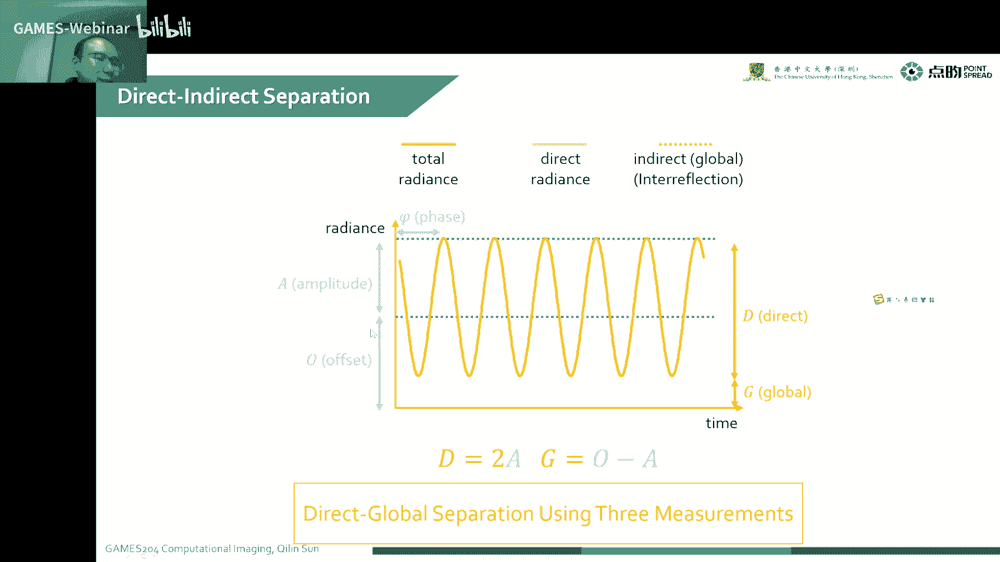

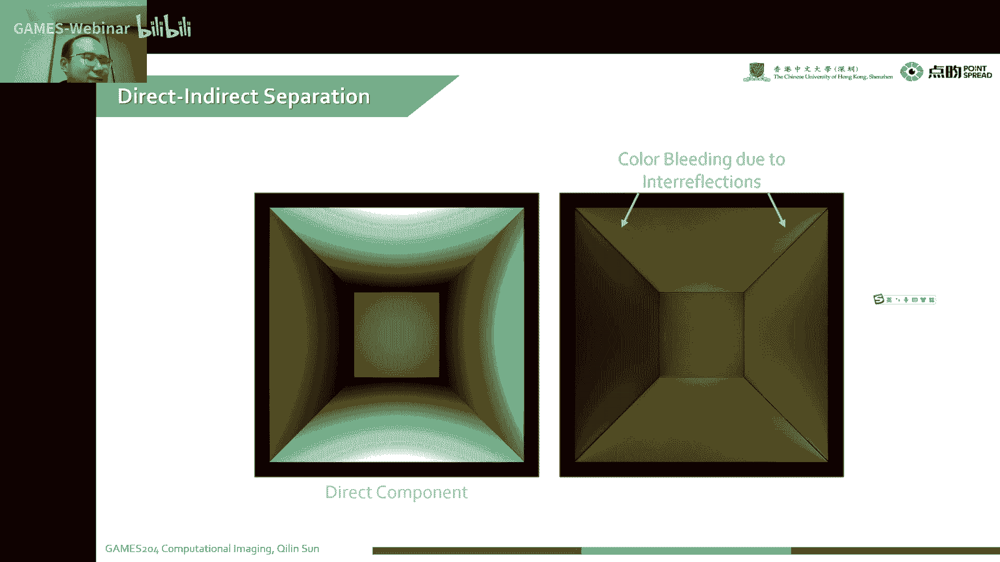

本节课我们将继续探讨时域调制在计算成像中的应用，重点关注如何解决多路径和散射介质带来的影响，并介绍哈密顿编码在提高深度测量精度方面的应用。

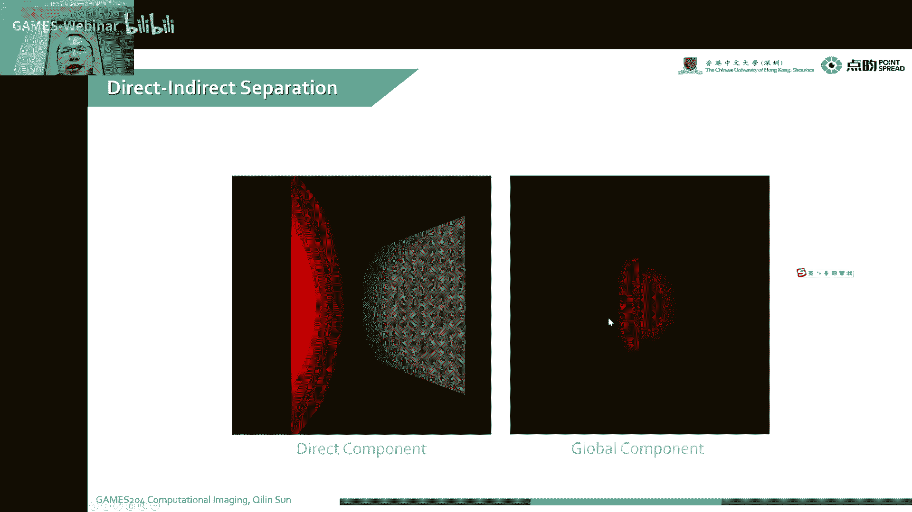

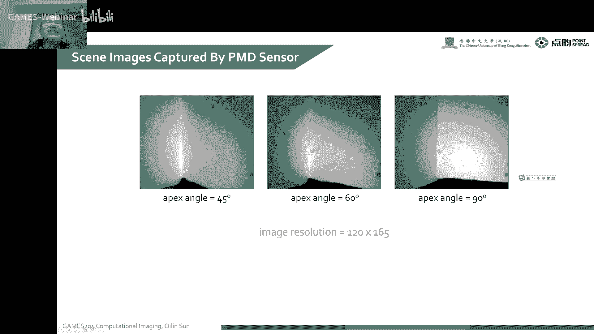

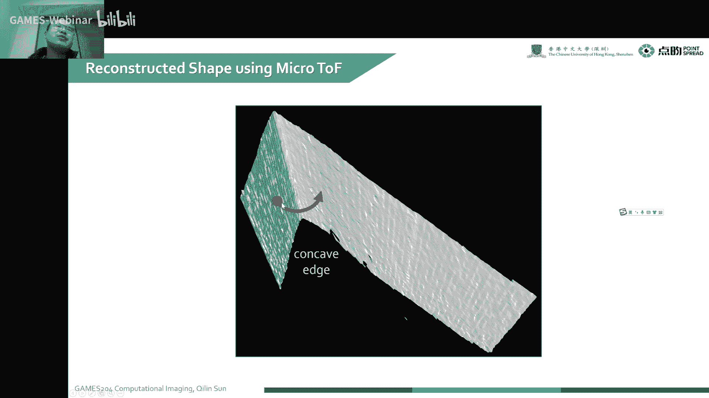

### 1. 多路径和散射介质的影响

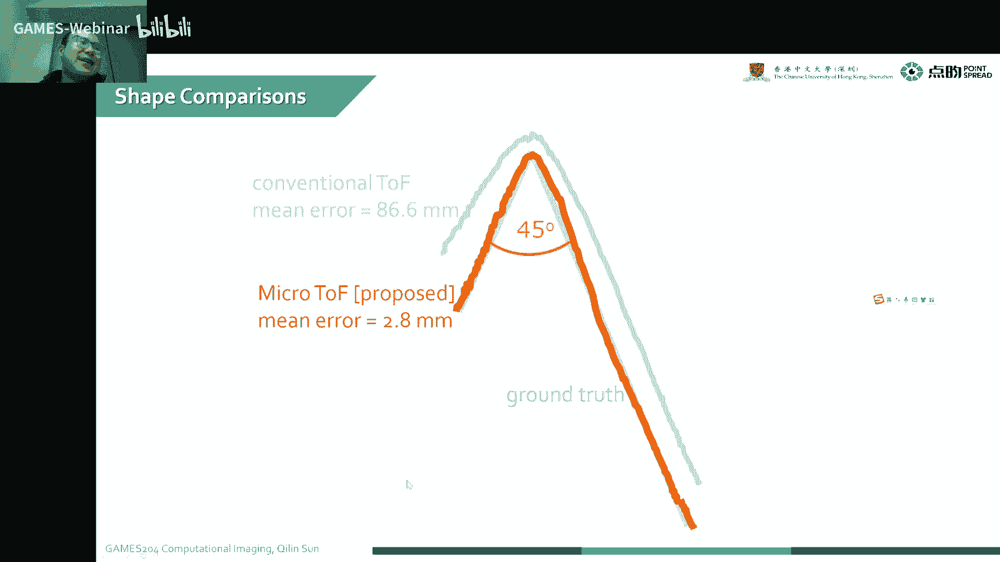

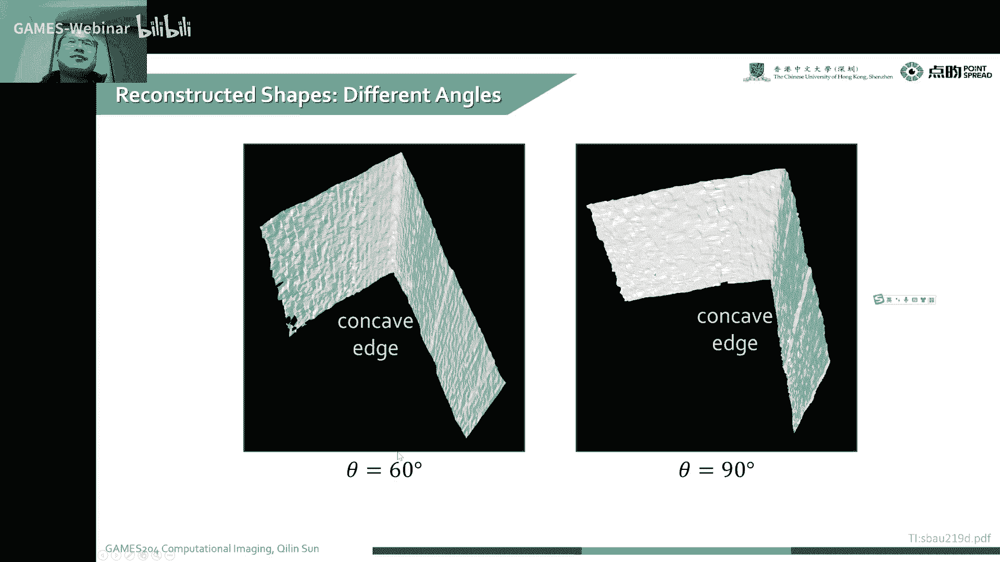

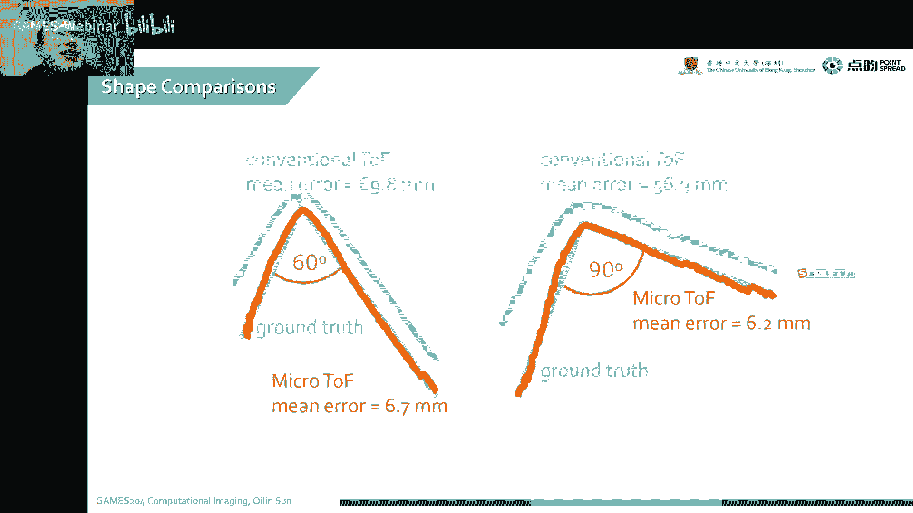

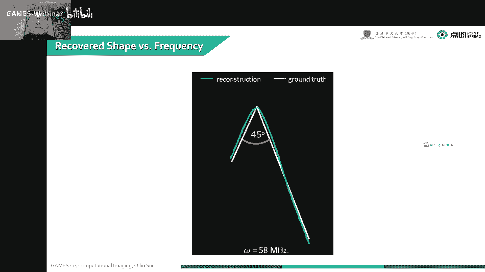

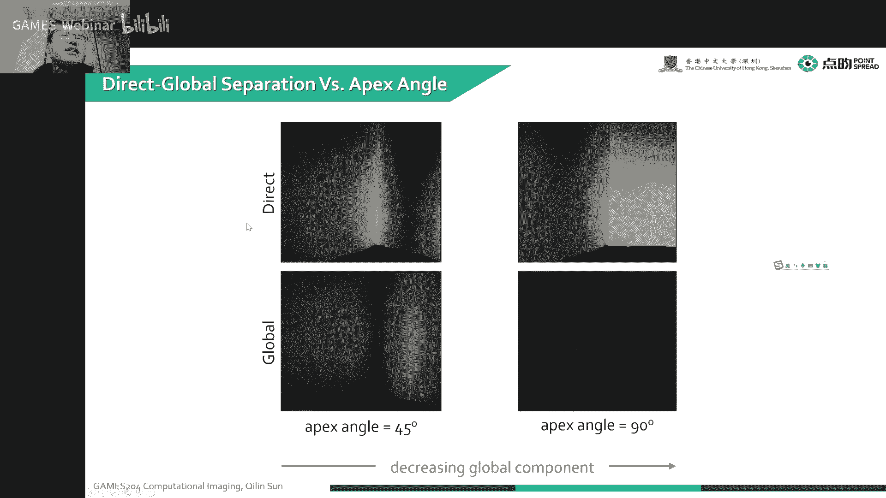

*   **多路径问题**： 间接光成像中，光经过多次反射到达传感器，导致相位信息模糊，难以区分直接光和间接光。
*   **散射介质**： 散射介质会改变光的传播路径，导致相位信息进一步模糊，难以进行深度测量。

### 2. 微成像技术

*   **原理**： 使用两个频率相近的高频信号进行调制，形成波包，通过波包的干涉效应来消除多路径和散射介质的影响。
*   **应用**： 可以有效地分离直接光和间接光，提高深度测量的精度。

### 3. 哈密顿编码

*   **原理**： 借鉴格雷码的思想，将编码方式设计为相邻编码之间只有一位不同，从而延长编码路径长度，提高深度测量的精度。
*   **应用**： 可以有效地提高深度测量的鲁棒性，降低噪声对深度精度的影响。

### 4. 代码示例

```python
# 哈密顿编码示例
def hamming_code(bits):
  # ... (实现哈密顿编码算法)
  return encoded_bits
```

### 5. 总结

本节课介绍了微成像技术和哈密顿编码在提高深度测量精度方面的应用。通过使用这些技术，可以有效地解决多路径和散射介质带来的影响，提高深度测量的精度和鲁棒性。

### 6. 下节课预告

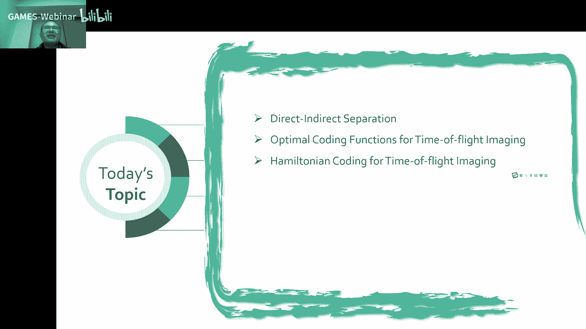


下节课我们将继续探讨时域调制在计算成像中的应用，重点关注时间编码和空间编码。