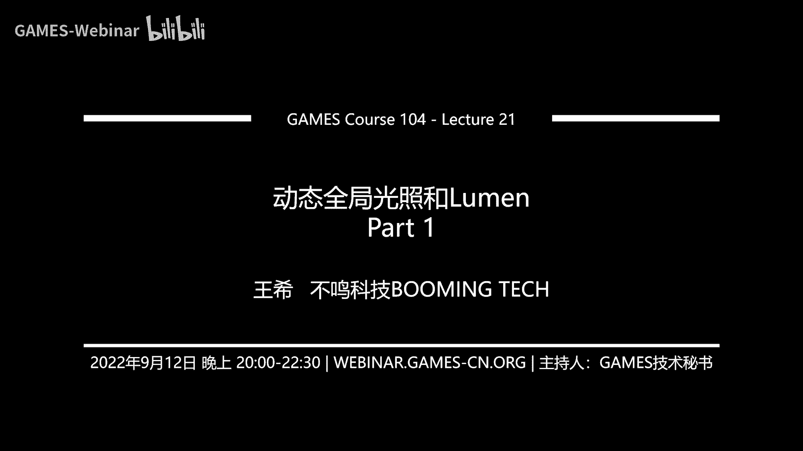

# 21.动态全局光照和Lumen (Part 1) ｜ GAMES104-现代游戏引擎：从入门到实践 - P1 - GAMES-Webinar - BV1oe411u7DJ

我们几乎是准备到最后的一秒啊，这节课的内容实在是太硬核了，然后硬核到我们现在都没有办法准备，上一期同学问我们的问题，那我而且很多知识都是新鲜出炉，哎反正就是各种的这个这个情况百出，待会儿给大家讲。

那我现在呢先给大家讲一下，我们这一期要讲的内容，去那个大家说我的脸都肿了，还准备这篇那个这这次这个talk对吧，然后我们就在中秋节对着月光，我们去讲一下lumen对吧，其实讲论我觉得讲的不过瘾。

我们要把整个全局光照给大家讲一讲，那首先的话呢诶我这不是我的第一，不好意思了，果然已经偷一局晕了，首先的话呢，第一个就是我们的课程组，给大家讲一些有意思的好消息，我们课程组准备了一些小卡片，然后呢。

我们会在小卡片里面给同学们写一些，我们的祝福的话，然后呢，以后大家如果能收到我们课程组的，这个那个t恤衫呐或者什么小礼物的时候，我们也会附送这个小卡片给大家，所有拿到这个卡片的。

就是我们games 4104课程的口号是什么，人均一个自研引擎，所以的话呢我觉得所有想做，想探索自研引擎的小伙伴，都是勇气和智慧的化身，所以的话呢我们也想用这个小卡片一起，共勉一下我们这个社区。

你的这个每一个人确实我们很需要鼓励啊，到现在为止的话，我们在行业里还被称为是异类好，那就所以呢这是我们课程组的一种，大家精神共鸣的表达，那么另外一个的话呢，就是告诉大家一个好消息。

我们的pico引擎的话呢终于上新了，我们刚刚实现了一个小小的gpu particle，然后就是觉得好玩，其实也没有什么特别的意思，就是说啊就是你看上面一个问号，我们的party落下来之后。

地上会形成这样的一个pattern，这个其其其其其实呢是一个怎么说呢，你可以认为叫屠龙之技吧，就是说在现代的这个3a游戏里面的话，这是个蛮常用的一个基础系统，但是的话呢。

就是如果作为一个就是休闲游戏的话，一般不会用到这么复杂的功能，但是我们就是觉得很好玩对吧，也让大家看一看，就是其实引擎这东西没有那么神秘，就什么高端的算法啊，其实你都可以实现的，所以啊这个东西的话。

我们好像已经check in到，我们的那个github上了，大家可以上面可以下载，那这个我我个人觉得还蛮好玩的，等我们的课程上完之后的话呢，我们会尽可能的就是抽时间。

跟同学们去讲一讲皮克的引擎的代码解读，就是欢迎大家关注我们的微信公众号，这样的话我们拉了一个微信的小社区，这样大家可以就在社区里面可以去讨论，然后后面时间允许的话呢，我这边也在想当然。

我得我得我得说服我们课程组的小伙伴，大家已经累得都不行了，然后如果我们还有一点残残留的力气的话，我们就那个持续的给那个pico里面，注入一些有趣的代码，其实我个人还觉得挺好玩的。

因为我自己在做自己引擎的时候，觉得哎呀那个代码太大了，维护起来太难了对吧，当然pico的话呢我就觉得很很简单，很轻便，可以很easily的加入各种各样，我们想要的feature。

所以的话希望那个整个pico，变成我们大家的一个playground，大家一起去享受这个过程，而且呢现在课程组check的东西多一点吧，到后面的话，我是希望我们社区里的小伙伴。

我们一起来check in，这样的话我们把这东西越做越好玩，反正就是个开源社区好，然后第三个的话呢就是我必须得highlight一下，我们的同学们实在是太有才了，就是我们改作业改到了越来越怎么说呢。

就是呃应该来讲的话，就是说作为一个就是真的很有意思，就是说作为一个其实还没有怎么功能搭完，的一个开源小引擎的话，大家已经开始很快的把它变得越来越像个，专业的游戏引擎了，就是大家你像这种材质的调整啊对吧。

这个做的还是很酷吧，这个已经有点像那个，就是专业的游戏引擎的样子了，然后呢，我觉得很酷啊，这个后面如果大家需要什么工具的话，千万不要不好意思，直接来问我们课程组，说不定我们做着做着就把皮克我做了一个。

真的能做成一个商业游戏引擎的，这样的一个商业游戏的这样一个小引擎，反正无所谓，只是开源引擎，大家随便用，所以啊我觉得挺好的，就是说实话讲了快有大半年的课程了，然后看到这些东西的时候，还是蛮有成就感的。

觉得嗯，我这这大半年我们同学们没有一起很辛苦，然后呢最后一个就是说啊，本来我们今天准备了三个社区问答的问，题的问题，但是呢我后面时间实在来不及了，就是准备这些问题怎么回答，我说这边我先狗头保命对吧。

我先挖一个坑，就是下一次下一次讲none night的时候呃，我争取这个把一回答那个社区两波问题，就这这次这一波和下一次的这一波，这样的话呢这个实在才能回得上来，然后最后告诉大家一个这个有趣的消息。

就是啊，马上因为我们上次说，我们哎我们又是职业的这个歌王，本来说这个30万播放量的时候呢，我们会做一个彩蛋视频，但是呢我们就割啊割啊割割，一直割到现在已经快五上播完了，谢谢大同学们对我们的支持啊。

真的没有想到，就是我们会播放量会有这么大，那我们呢就做了一个就是这个彩蛋视频，这个视频还蛮有意思的，大家明天那个敬请期待对吧，有可能你们想看到的一些小伙伴，还有一些你想看到的一些有趣的东西啊。

会在那个彩蛋视频里看到，那就留留了一个小小的惊喜，留给明天，那我们就言归正传，就讲我们今天的课程主题内容啊，就是动态的全局光照和lumen啊，对这个lumen对吧，这个大名鼎鼎。

但是为什么我们备课背背到最后已经背的，就是我觉得就是属于这种不断的跑题，就是这个就是我们也是跑题小王子，就是本来准备个len，但是我们却突然决定想跟大家讲g i了，确实是呃。

我大概记得是准备到上个周五的时候吧，上个周五晚上我就说哎呀，我我我要把lman讲清楚，我如果不把以前的那个ji讲一遍的话，好像陆妹是讲不清楚的，因为如果大家不去讲那个g i的话呢。

大家看到rom里面的东西，那个技术细节就是无比的多，然后呢大家也不知道这个细节，感觉从天上掉下来的，其实它因为你们的很多算法，很多思想，在之前的一些gi的那个方法里面，都会出现过。

所以它很像一个算法的集大成者，然后索性就一不做二不休，我就说算了吧，我们就这节课擅自未经大家的那个许可，我们就擅自修改了主题对吧，我们把那个决定把那个什么pgc啊，把那个就是那个啊还有什么啊。

match making那个the motion match啊，这些东西我们把它先放在一边，这个大不了我们看二零系列的课程，给大家补上什么地方，又挖了一个更大的坑，我们一零还没讲完呢。

我们就开始讲二零系列的这个坑了，那么我们呢就是在一零系列，最后两节课的话，我们就放飞自我，就讲两个核心技术，一个讲lumen，一个讲null，那么如果lumen采取这种，叫做把它历史渊源的讲清楚。

我们在讲这个算法的话，nana的大概率也可能是不只是讲nana，可能把这种class base的rendering啊，这种新的这个visibility buffer match。

这种新的mesh apply啊，也可能也会跟大家去提一下，所以的话呢，我们是第一次这么任性的去准备一节课，但是呢任性归任性啊，工作量其实非常的大，而且呢说实话呃卫生这节课准备到最后的，几乎是到最后的。

我想想啊，对上课之前最后两分钟截稿，然后我们十分钟预热就开始上线了，真的是新鲜出炉，这里面的很多知识点是我刚刚确认过，可能不到15分钟，那为什么会这样呢，因为真的是细节特别多。

很多时候我们被迫要扒开源码去看源码，所以呢我不能讲这节课是在给大家讲课，更像的是什么呢，就是王鑫师兄带着大家一起做paper reading，我不知道大家以前有没有，在高校里面参加过这种科研组啊。

就科研组以前有个活动，就是说，我们比如说会把今年或者某个系列的文章，同学们分头，然后呢我们一起做paper reading，大家读完文章跟大家去讲，那么preparing的特点是什么呢。

就是说其实我也是新学的，我也是心理解的，但是呢我愿意用我的眼睛，用我的脑子先把它消化一遍，然后再和大家分享，这样的话降低大家去理解这部分的工作量，所以papi的特点是什么，有些东西讲的可能不一定正确。

但没关系，我在尽我最大的可能性去讲这个东西，那么今天这节课呢第二个特点呢就是说啊，其实lumen的话，实际上无论是咱们虚幻自己啊，还有很多优秀的同学都做过一些分享，可能我们讲的结构会跟船长。

那个常规的结构不太一样，我们更多的是从全局光照的思路，然后呢把它的算法重新组织了一遍，就是我想尝试一下，就这样讲，是不是更容易让大家，就是说跳过那些非常非常琐碎的细节。

而更多的去理解它整个算法的整体结构，其实我为什么一上来会先讲那个gi的话，其实也是出于这个思路，也就是说你去理解gi最宏观的结构，你才能理解lin是怎么产生的，那你基于机关机y的这个基础的，方法论的话。

其实你就能理解，如果有那么多算法，它到底分成几大块，这也是我们今天这节课，我想尝试的一个方法，因为确实这个我觉得既然开讲了，我觉得还是希望大家讲的能明白吧，而且这是我们是一零系列的课程对吧。

很多同学以前的基础可能还是需要补充的，那我这时候正好把基础给大家补一下，但好那就废话不多说了，首先讲global nomination对吧，那这节课首先的话呢，我要把我的祖师爷再抬出来一下，对不对。

这个render equation，我记得我在第五讲的时候讲的rendering的，第一节课的时候，我就讲过，recreation，简直是这个hello，也不叫也不叫害。

我们不能说应该就应该是指导我们了，整整这个多少年了，已经35年了对吧，确实30 30 35年以上了，那么确实是这，这也是反映了这个科学家的了不起啊，就是它可以放在mental类的，把一些物理现象的本质。

用这么简单的数学语言表达出来，那我们今天做的几乎所有的rendering的工作，都在去满足这个render equation对吧，这就像爱因斯坦说出e等于mc平方好，大家都很开心，讲清楚了。

但是你真的把原子弹造出来，你会发现这个后面的挑战，技术的工程的各种问题就是让你难如登天，所以我们会用曼哈顿工程工程，但是最终原子弹是炸出来了对吧。

但是这个这个就是我们的render increation的话，到现在为止啊，这个核弹还是没有爆炸，因为其实直到今天，我们并没有任何的一款游戏引擎。

能够做到实时的fly render equation来做，这个真的是非常非常难，但是我们现在在做什么呢，我们在无限的逼近这件事，我们在一步一步的逼近它，而今天为什么给大家这么着重的去讲一下，lumen。

我个人认为就是说，它代表了我们在一个关键领域，就是gi这个领域正在这个非常明显的，这是一个significant mstone，就是一个非常重要的一个mstone，我们在逼近这件事。

ok那这件事情为什么这么难呢，它其实最核心的点就是说直线光照，当一个光源照向你的时候，那就是个点点光照着你，那是比较简单的，但是g i的意思就是说你四面八方来的光，和我表面的b r d方程要进行积分。

最后能形成我的这个最宏光的光照，这个里面这个复杂的积分过程，其实是非常麻烦的，因为大家想想在现在计算机里面，对于屏幕上将近十个变量的pixel对吧，如果你是8k，你如果那就会更高。

那么这个时候每一个像素，每个点，我要去采集四面八方的各种各样的，这个这个这个射过来的光线，算出来的值，这个计算量有多大，那这个想想大家想想是不是很吓人，那么更复杂的是什么呢，就是这个光从什么地方来对吧。

他不是说诶我在四面八方摆了无数个灯，其实灯在哪里，灯是无限多的，就是说为什么呢，因为当一个你只在这个场景里面，你只放了一个光源，但这一个光源它可以把周围的无数个，就是物体的无数个叫小面片全部照亮。

那每一个被照亮的小面片，它就是一个光源来照亮你，那同时呢这些小面片照亮其他的地方，它会再反弹回来，又会形成新的光源，那么你如果是一次反弹，就是single bus对吧，如果多次反弹就是multibs。

这个我记得在前面讲range的时候，给大家讲过这件事情，那么这样的一个case的话，实际上对random来讲就是极为复杂的，大家想想这个数学上就很复杂，那么最著名的这个g i的一个案例是什么。

就是我们的右手边这张图叫什么，canair box对吧，这是大名鼎鼎的kair box，大家想想多简单，一个正方形的q，左边是那个红色，右边是绿色，上面放了一个光源，注意啊，这个光源它不是点光源。

它是一个面光源，光源本身你可以把它分解成无限度，然后下面就放一个长条，那个长方块，一个一个方形块，哎，就这一个conor box，实际上你想把它做的跟光猝死一样，就会真的是难以非常的非常的难。

然后如果这东西还要real time，你就更痛苦，那么这里面为什么这个光学现象，大家仔细看什么复杂，你看到没有，这边光射到那边红色的墙反弹回来，就会有很多红光，红光就会照亮这个那边那个长方块的。

那个那个那个就是它的左侧面对吧，同样的你看到又靠右边的墙上，也看到绿色的这个这个这个light leaking嘛，就是这种光color的leaking，那么这样的一种很复杂的光影效果。

其实就是这个gi的效果，而gi的效果的话呢，在真实的游戏场景里面会更复杂，那为什么gi这么重要呢，因为我们这以游戏为例，如果游戏它只能处理deoliking的话，比如说以一个这个这个博物馆为例的话。

那你看到的环境就是这样了，那为什么我们的游戏你看的不是这样的，因为我们还会加上一些hack，我记得我在讲专顿时，我就讲过一个最简单的hack叫什么呢，叫那个啊，就叫ambion light对吧，环境光。

那其实这个对gi的一个hack，但是那个效果其实很一般，而真正的积压的话，它的效果是非常丰富和复杂的，而对于现代游戏来讲的话，就是我们很多时候，比如说诶一个一个岩洞，我给他打个洞对吧。

围着一个房间打开窗子，你看到光射进了，拉开窗帘，对不对，或者说在一个昏暗的晚上，几个人打着手电对吧等等，各种复杂的这种光学现象，其实都需要在游戏中模拟，当然这也是我们。

现在rendering已经进入了一个恐怖谷，就是说过去我们可以一眼看出来说诶，这是计算机生成的画面对吧，比如说我们在玩super maria的时代，我们不会要求他画的很真实。

你只要那个maria做得足够可爱就完事儿了，对不对，至少在过去10年以前，游戏里的画面我们还不敢，这个基于说我们逼近于真实，但是现代的商业游戏的话，其实已经越来越逼近于。

就是至少是达到一个动画片的这种质量，其实已经跟动画片质量差不多了吧，已经逼近了，然后呢我们还要逼近什么的，其实现在很多游戏的，如果你看他的过场动画的话，其实非常像手持相机拍出来的，这种纪实电影。

所以说在未来10年的话，就是我们rendering的核心的挑战其实之一吧，只能说之一其实是gi，因为你不上gi的话，它的整个画面看上去就是塑料的，就是这个cg的呃，呃不要黑cg啊，cg也是很了不起的。

就是就是说我们那个游戏的这种画面，但是呢你上了g i之后，如果你再加上pp r材质对吧，再加上那个就是更丰富的几何细节，确实现在游戏引擎所说出来的东西，有的时候能达到以假乱真了，就大家可能如果看一下。

有些现代的一些东西释放出来的话，确实是很震撼，所以整个return rendering行业，游戏行业，我们已经在非常非常逼近那个恐怖谷，而这个恐股到底有多少年，我们才能爬得出来的话。

那就要看我我背的是造化了，所以这也是今天我们讲这节课的重点，就是也是鼓舞大家，更多人冲上去去解决这个问题，那么其实呢这个就是gation，最复杂的问题是什么呢，就是积分就是你对光各种各样的积分对吧。

那么积分怎么办，哎这里面就有一个大名鼎鼎的蒙特卡罗，integration，蒙特卡罗积分对吧，他的想法其实非常简单，就是对一个函数对吧，你就是从a到b，那么你假设是一段的。

比如说我做rendering的时候，不就是在一个半球上进行积分嘛，好嘛我怎么办，我对你进行采样嘛，我加了50个点，哒哒哒哒哒对吧，我把你的每个点踩完之后加在一起诶，平均一下啊，这应该加在一起对吧。

some of the area，然后呢我就能知道你的这个光的多多少，对于cd来讲，不就是把所有的方向的这个光全部给，那个他的设定的每一个那个radiance，全部算出来，加在一起。

就是我最后的样子嘛对吧，这就是这就是蒙特卡洛积分的一个方法，那这个方法呢，其实是我们过去可以说是差不多啊，这几十年吧大家在做gi的话，一般的方法，因为其实从这个quation提出来，就是过去的几十年。

我们的图形学行业真的是前赴后继啊，就是在解决这个全局光照的问题，这个问题真的是很痛苦很痛苦，那么其实呢我们就有大名鼎的motor，color retracing对吧，这个方法其实呢思想非常的简单。

就是我从眼睛的地方，对于屏幕上每个像素对吧，我就可以射中一个物体，这个物体的话呢我就往它四面八方去投射，这个瑞什么意思，就是找这些方向，有没有那个射来的这个光光光，然后呢这光呢射出去又打中物体。

其他的方面在那个点呢，他又踩四面八方去问，然后呢这样的话你就看到什么一次半死，两次半次三次bs，大家发现没有，它的计算复杂度是怎么上去的，我相信聪明的同学，可能马上就能感觉出来了。

这就是一个指数级的扩张啊，对不对，所以说做single box的话还可以，我勉强能忍对吧，但是我要做multi bounce的话，四次bx，那基本上就是要死人的对吧，而且呢。

这里面还有一个很有趣的一个点是什么呢，就这里面这张图还没有讲清楚啊，实际上在场景里面，他的那个真正亮的地方，像康奈尔box这种整体基本照亮的case，实际上是很特殊的，在很多场景里面。

比如说一个硕大无比的房间，它真正亮的地方，可能就是天顶的窗子那一点，但是你整个房间就是被这个multi bounce的，这个光照亮了，这个时候你在进行三零的时候，你会经常发现一件什么事情呢。

比如设设了啊50根锐，但是只有极少数的锐，所以他根本没踩到光，唉这个事情真的是会发生的，所以说这种蒙特卡罗吹醒在过去的几十年，他的一生之敌是什么呢，哎就是采样，如果采样不好，你就会发现我因为是随机的嘛。

对不对，所以我没有办法保证，我的pixel a和pixel b形成的这个采样的结果，它在结果是连续的，我们就会产生大量的noise，对这个你想想看，就是过去我们就算用那个就是cg p u对吧。

一帧渲染几个小时，其实我们为什么要选那么慢，就是大家如果听说过，以前做动画电影的成本为什么特别高对吧，一帧可以炫一个小时，大家想多恐怖，而且还是一个那个还是一个farm，就是一个render fm。

就渲染农场，它就是这个原因，就是因为你要做这种蒙特卡洛retracing啊，这简直是丧心病狂啊，对然后呢，所以呢这个里面最痛苦的事情是什么，就是sampling，就是说这这个概念的同学们。

一定要建立起来，因为你去理解啊，这个lumen的所有的他的技术上，用的各种各样的hack，它的hack实在太多了，但是呢它核心解决的这个问题啊，其实就是怎么更好的300的问题对吧。

怎么有效的去分布这些3伏林的问题，那么好三零就是重要的k了，因为你会发现，比如对于蒙，基于蒙特卡罗贝斯的这种方法的话，一般来讲你的三炮里数量越多一定是越好，但是呢你不是越越多的话，系统的消耗会不会越大。

它就会越慢对吧，这里面给了个例子，就是比如说像这里面做一个蒙卡reacing，如果只有一根瑞，就是我们的左上角那个的话，你可以看到很明显的noise，然后呢它每一张图呢大概是从左到右。

从上到下都是double一下的对吧，那你到后面那个就是已经二的16次方，26次方多少，就是每一个点要射出去，大概64000根瑞的时候诶，你看着已经很smooth了对吧，但是这如果是single bs。

我觉得几分钟你也许能选得出来，但是如果是multi bs的话，我反正已经不知道需要多久才能，算得出来了，所以说其实如何，三零是这种所有的蒙特卡罗贝斯的这种gi，犯法的一个核心点，那三怎么做呢。

那最简单的方法是什么，这个呢其实是最好的一个一个方法对吧，一个一个一个最传统的一个方法，但是呢其实如果你的信号，哎你这样的三里呢，他除非密度很高，否则的话呢，它可能是对采样率并不是有效的利用。

比如说我想三破一个，在一个空间上的一个广场对吧，对我的光照积分，那我如果这个窗只有一个窗子，它是有量的，你在你采用的两根锐中间的夹，夹在这个空间的话，如果飞出10米之外，他那个采样线之间的夹角。

很可能就把一个天井的窗子整个漏掉了，所以这事呢就是说unix 3的一个问题对吧，那么在这里面，我们发现一个很有意思的东西，这里面就是数学概念，我就不展开讲了，哎这里面有一个很有趣的概念叫pdf对吧。

probability distribution function叫pdf，这个不是我们的打印的文档的pdf啊，它就是一个数学上的一个定义，就是说我如果对这个函数的分布，它哪些地方有这个强烈的信号来。

一定要，实际上我如果采样也按照这个probability，进行分布的话，那我其实就可以用尽可能少的采样，获得尽可能逼近于它，想要的就是那个那个真实值对吧，就比如说我的信号是这样的。

那么我的这个pdf的话呢，如果是下面的这样一个波峰波谷的话，这个可以在数学上证明啊，就是这种采样肯定是比uniform采样，就同样的三零read是呀，如果你真的是纯随机的话，它会更好地帮我求出它的积分。

这个数学上我就不展开了，但是呢这个概念其实也很简单，比如说我在做设定的时候对吧，我尽可能朝着光比较亮的地方，尽可能沿着我的法线的这个正对的地方，去多设一些采样的锐，那这样的话我可以用少量的锐。

就可以获得我想要的结果，对不对，那其实这个东西的话呢，在我们过去讲什么，无论是基于这个所有做解压的方法，比如说啊我让我回想一下这个地方，我可能会有一点不一定对。

比如说我们最早做radiosity复数度算法，基于retracing的算法对吧，monocle retracing对吧，比如说还有风投来品对吧，其实基本上所有的这种方法大家都会。

如果一个基础方法提出来之后，就会有无数的这个这个衍生的work，就是在讨论说怎么去做它的important，三零，在同样的计算时间下，或者说这个在同样的采样率下，我能达到一个更好的，更稳定的。

更smooth的效果，如果大家搜索过去十几年的这个，graphics paper的话，你会发现有大量的这样的工作存在，而且这些工作呢，这个实际上是有非常大的实战价值的，所以这个是我们去理解gi算法的。

一个核心的技术点好，那其实的话呢就是刚才已经讲到了，就说哎那我要是这个做running的时候，我的pdf怎么选呢，哎这里面就很简单了，比如说回想我们的render equation对吧。

那我们最好的这个pf是什么呢，哎大家想到了，如果我的反射，大部分我可以假设是debu面的话，但你的这个我对光的这个敏感度，是不是这个诶一基本满足一个deflop对吧，就是你越这个基本上是你靠近我。

normal的方向，我会敏感一点对吧，就扩散嘛，然后呢你如果从侧面射来的光的话，其实就算你光线很强，我的感应度其实也是一般对吧，那这个default loop是很正常的，那么如果更猛一点的话。

比如说你假设是这个啊，那这样的话我们就比较一个例子吧，进行这种广场的这个积分的话，你可以发现同样是256个，那个那个那个就是sampling per pixel s s p p，你会发现它有很多噪点。

但是呢如果我们按照cos loop去分布，我们的点就是靠近那个天顶的那个地方，我分布的稍微密一点对吧，靠近下面我分布的稍微稀疏一点诶，我这个时候采样的噪点数就会下降很多，同样是256个sp。

那么对于那种非常glossy的东西的话，打个比方啊，比如说像这种符合gg x x材质的，大家还记得我们在前面讲的时候，讲过gg s对吧，我们理解那个就是那个p b2 的时候，就讲过gg s g s。

我记得以前我给大家讲的，就是它的特点是什么，跟音响一样的，叫高频足够尖，足够高a但是呢低频音域足够宽对吧，这是jjs方程的一个特点，那么简单来讲，gg s它个loop呢。

会比cos会更加的sharp一点诶，那如果我基于normal，基于g s我去进行优化的话呢，实际上我可以就是能够抓住更好的，glossy的这种效果，但是实际上这个东西是一个很。

我觉得很specific的东西，它不具有普遍意义对吧，那么所以呢在这里面我们讲的这一part的话，就让大家理解，就是说gi这个东西，它的核心就是说你要去找到一个好的一个，sample方法。

用尽可能少的瑞去获取，一个来自于四面八方的光场，对你影响的，这样的一个一个一个一个一个一个，怎么说呢，一个表达，也就是说我对于每个屏幕上的每个像素点，就是这是一小配match，然后我需要知道说哎。

我的前上下左右光到底是怎么样呢，我就去我就发瑞去问，那这个问他讲究，就是说你要问在正确的地方问，在重要的地方，其实这里面讲的三里只讲了那个，你表面才知自己其实呢还有跟光有关系。

所以这是我们在过去啊算gi的时候，经常会想到的问题，遇到的问题好，这是我们的基础知识好，接下来呢我们就讲诶在这个real time rendering，我怎么用，为什么呢，前面我讲的这些gi啊。

michelle retracing啊，至少在呃很多年以来吧，他是一个研究了很多年的一套算法，以前都是离线算法，什么意思，都是说在cpu上跑，但是呢它基本上是说电影for，这个就是这些领域去应用。

因为大家在我们普遍的尝试，我认为就是g i的东西，播游戏的话实在是太废了对吧，那从大概十几年前就有一些非常厉害的，这个同志们就再去想一个问题了，就是说诶我们有没有可能把gi做成real time。

真的在游戏这样的场景里面能用起来，所以我个人去理解啊，就是说这实际上是lumen的这个算法，它的源头的思想，那我首先呢要讲一个老祖宗的算法，叫reflective shadow map rsm。

这是一个2005年的工作，这个工作，为什么我会放到今天的第一趴来讲呢，因为就是说我个人认为啊，他是这一系列的方法的，一个就是说开山鼻祖就让启发了很多人，让大家敢于想象说啊。

原来real time机啊我也是可以做的对吧，那么这个reflective shmap呢，它核心解决的问题是什么呢，就是说我怎么把光注入到这个场景里面去，诶这个问命题听起来有点抽象啊。

这其实确实是有点抽象，那么当然了，因为我们很多同学可能没有学过，这个系统的图形学，其实在图形里面我们算gr有两类方法，一类最经典的就是蒙特卡拉retracing，对吧，那我们就是从屏幕射光。

然后不停的放肆放肆放肆放肆，这种方法是一个很经典的方法，但其实呢还有一个很著名的方法，是这个叫ftmapping，我不知道大家有没有听说过这个词，这个词儿红糖产品还是一个很棒的方法，这如果我没记错的话。

也是一个在我们腾讯学的黄金年代吧，也是一个英雄辈出的那个年代拍的，我应该没记错，应该是拍的harry哈，去这个写的，他是stanford的一个大教授，然后呢他有一本书叫冯特map这么厚。

然后普通mp的思想非常有意思，他说你们以前都是从相机那边去看对吧，我看到一个物体，我看那个物体有多少东西能照亮他，对不对，他说不行，我要从光那边看，他说呢你们看到所有的东西啊。

实际上都是从光源射出来的光子对吧，然后呢打到了物体表面，不停的反弹反弹反弹，然后呢你人眼的collect收集到了这些光子，所以你们的retracing呢都是从眼睛倒着去搞，仔细想想，对不对。

那为什么我们不去政治搞呢，用光学的最基础的概念，就是从光的角度去看这个问题呢，所以风头外面呢就算我今天不展开，其实哎呀今天时间实在来不及了，如果按照我的性子的话。

我可能花两页给大家讲讲phone map的技术方法，但简单讲了红糖发病的算法是这样的，就是说我是cost无数的风头，然后呢到一定条件，它在那个光子就会停留在物体表面，然后你最后shaking的时候呢。

其实那就是他的那个radiance，就是每一个表面点上，它它的整个光的那种分布诶，你在做设定的时候，就在这些收gather，好的这些风头上面进行收集，进行插值，然后最后给出这个设定。

这个就是photo mapping的一个核心思想，大家如果有兴趣的话，可以查这个这个资料，其实我自己去看整个lumen的这一脉的工作，我个人觉得起始于rs呃，只起于l r3 m。

终于这个就是说lumen的话，其实蛮有一点封腾map的味道，当然我不是原作者对吧，所以我不能猜测揣测他心里在想什么，反正我作为一个外人去看他的时候，我觉得老哥，你这个想法好像跟风台外面的思路很像嘛。

好那就不展开了，因为现在讲起来太抽象了，那我们先讲什么叫reflective china，他的想法其实非常简单，它基于一个observation，就是说我们在选英语的时候。

我们是不是要选一只shadow map，对不对，那大家觉得china map和我们正常的渲染，最大的不同是什么，他是从我们正常的渲染是从相机视角去看，而shadomap呢实际上是什么呢。

是从光的视角去看的，所以说我在炫耀shut map的时候，我只取了一个depth，对不对，但是大家想想，如果我在shut up那个camera，那个那个那个那个那个位置的话，我把场景整个炫一遍。

如果我把它再沿着这个光设定一遍的话，你其实是不是得到了，如果这个世界上没有积压的话，只有deflighting的话，是不是所有被照亮的面都在那个map里面，对不对。

所以我个人是觉得那个reflective shadow map，这个词啊，其实是非常让大家confuse，因为shadow map你会觉得它是shadow吗，就是变黑的东西吗，其实他那个是什么呢。

他那个实际上是我觉得叫做呃啊mination map啊，radiance map什么都好，我觉得挺好的，就是他就是在相机位置，然后呢就是啊从光的位置，你看到的所有被照亮的表面，注意啊，从从光的角度。

如果光没有multbs的话，其实那张图里面看到的，如果你是一个一个spotlight，就是说是一个追星光的话，还真的就是所有被第一次照亮的表面，不会多一个像素，也不会少一个像素，大家仔细想想。

是不是这个道理，诶这个rs就是基于这个想法，那如果我现在知道，就是所有在空间中被照亮的点，以及它被照亮的第一次照亮的时候，它的亮度的时候，这个亮度它可以散射出来，对不对，散射出来，那我在渲染任何一个。

我眼睛看到的点的时候，我是不是把这些空间上的这些被照亮的点，诶，把它的散射出来的radiance全部收集一下，我是不是就可以照我的点了，大家想对不对，这个想法其实非常简单。

那所以呢这里面这张图呢是原作者的图，我个人觉得这个图画的，其实非常的confuse啊，我今天不好意思啊，今天我也是跟大家现学先买，大家权当我是这个教研组内paper reading的节奏。

就教练组内ping的时候，我们是赶黑原作者的，我们说原组的图画的很不好，如果公开课让我们不敢讲呢，因为我们怎么敢diss这个这个原作者呢，所以今天如果我什么地方讲错了，冒犯了大家，一定要原谅我。

比如说我就觉得这张图画的，非常的confused对吧，你其实明明要讲的是这个xp那一点，对下面那个被照亮的那x那一点的影响，你为什么还要画一个，就是这个x q那一点。

你还画一个y那个点就非常的confuse，真的我看的就是当时这个图，我看着就非常的晕，所以我就用加了两个篮筐放在这儿，就是说其实那个下面的公式呢，它讲的就是就是光射到了，而且那个图画的特别特别糟糕的。

一点是什么，我给大家讲的就是那个上面是一个光源，他结果在那给我画了个camera，我也想，我也特别想喷他对吧，你那是个光嘛对吧，camera应该是我这样看过，就算camera，当然如果我理解错了。

大家对吧，我记得那期年利奇讲到这一趴的时候，他有一趴讲那个四次方，他说要吃键盘，那我目前觉得我也可以，如果我这段讲错了，我可能也可以是键盘好不好，可以吧，就是我觉得那个上面那个画的相机。

那个位置实际上是一个光，当然他可能那个是一个探照灯头对吧，看着很魔性对对，反正如果换成我的话，我可能换个大灯泡在那边，那么那你这个光呢射到xp那一点对吧，根据xp的，就是那个那个那个那那一面被照亮的话。

它会有个法向，那这样的话我就可以算出来说，根据number是模型对吧，你沿着各个角落，你就有这个散射系数，对不对好，那我对于x这点来讲的话，我就可以把那边的那个radiance给接过来。

然后呢再给我自己进行shading，那我就知道了那个我的多少在这里面，注意，就是这个readings衰减呢，是按照距离的平方衰减，那么这里面有一个梗啊，就是令其讲到这一趴的时候。

他说哎呀这个东西一定是二次方，不应该是四次方对吧，我跟大家老实的交代啊，我昨天前两天我备课的时候，我也对着黑板敲了半天，我觉得这是平方，怎么可能是四次方呢，后来我们吵了大概五分钟之后。

十分钟之后突然一下子意识到，卧槽不对，因为它上面那个就是那个xp减x啊，还有x减x p，它没有规划，就是它实际上还是一个带长度的一个向量，所以它下面除四次方，本质上是做了个规划而已。

所以四方真的是对的是吧，确实很有意思，但是我觉得原作者真的有点坑人对吧对，因为因为确实你很容易就会晕掉，但是呢他这样写也是有道理的，可能对于从shader实现来讲是速度最快的。

这是r s m的一个核心想法，ok好，那就很简单了嘛，那我既然知道，就是说诶对于x这个点来讲的话，对我的第一个光源我就找到了xp对吧，那以此类推，我可不可以把reflection杀在web上的。

每一个点都去搂一遍对吧，把你根据你们的距离啊，根据你们的头像，我这个方向观察，实际上我做了一个积分，是不是就能得到我想要的点，诶这个方法就对了对吧，但这个方法呢有个问题是什么呢，太粗暴了。

因为你想啊我的rs 3 m对吧，我选的最少，比如说512x512，那也是将近有这个啊，将近有几10万个点了，对不对，那你怎么可能就是全每个像素，就是每个screen speed像素都做一遍呢。

诶他又提出了一个想法，说我呢搞一个空tracy对吧，他其实这个空缺他是个hack，他那个时候还没想明白这个事，他就说呢，诶我我去随机的按照各个方向去去打，然后呢，如果我打的近，打得远。

我实际上就意味着我这个空啊，再再扩散对吧，那对于扩散的空大的地方，我给的权重高一点，扩散空小一点，我给的权重小一点，其实这样的一个方法它实际上就能够完成，就有点像蒙特卡罗是睡醒一样的，我就对诶。

那我刚才讲的那个词叫billions of leslighthouse对吧，那无数个小光源进行一次随机采样，他自己的原文中，他说的400多个三浦基本够用了，而且他是要用破破的方法分布这个三步。

但是后面的人有很多更好的方法，但是呢他就是说啊，就能得到一个基本可以的一个结果，那么其实呢这里面one more step，就是说实际上它这个空tracing啊，在后面的工作中。

大家可以发现就是我可以对r3 m7 做me，做秘书的好处，就是说我可以直接去sampling，比较高密谱的这个rs，这样的话呢，我觉得一次性我能三破的这个空会更大，如果你是非常debus的面对吧。

但是如果你是非常gloss这边的话呢，诶我就去三破的密比较低的点，我就要在那个尖角的地方多采样，这个地方就不至于细节我不展开，但是确实是，作为一个2005年的工作的话，我觉得已经非常了不起了。

是啊你现在已经有17年了对吧，那么其实呢，这里面还有一个很有意思的思路，他说呢哎虽然说我只需要做400次采样，我就能得到first bounce的gi的效果，但是的话呢这个还是很费，那我怎么办呢。

我把屏幕用half pixel，就是我我每隔两个我做一次对吧，这个时或者是每个四个都可以，那么这个时候呢我就去进行sa建议呃，我在做做那个shading的时候。

因为我只是做那个低频的那个in indirect，innovation，借机光照，间接光照，大家都知道它是低频的，它不像直接光照那么高频诶，这个时候实际上呢。

我收集过了低频的那个intrination的话，实际上可以旁边的pixel都可以共用，这是也是一个非常了不起的发现啊，因为我们后面再讲的那个lumen的那个。

就是那个screen space的那个prop的时候，他为什么16x16就work了，其实他自己讲，我有个什么伟大的observation对吧，但其实从这个rs m时代，大家就已经发现了这件事情。

就是interstation，我可以用低频，就是在screen space屏幕空间，我可以很低频的去采样，我就可以去拿它，那么这个时候呢，他又提出了一个非常有益的思想，就是说诶我对于每一个渲染的像素。

我要去用这些更稀疏，采样的这些这个ation的时候呢，我发现一个问题，就是说如果我我的那个采样点跟我，比如说那个空间位置相差特别大，或者是法向朝向很不公，我位置很不共，面对吧，那我就想办法。

我认为这是个无效的一个这个差值，那我要把这个差值踢掉，他肯定自己遇到了很多artifact的，所以呢他发现这个问题，他他就把这些得不到有效差值的，这些pixel呢把它标出来，这些pixel呢量不大。

对于整个屏幕来讲，可能不到1%甚至1‰，哎这1‰的pixel，我呢啊对他进行这种一次完整的采样，其实这个方法非常的了不起，因为这个observation其实大家如果研究呃。

像lumen里面的很多差距上吧，它的核心思想就这样，就屏幕上我有100万个像素点对吧，那我用这种这个低密度的这个光的采样，然后呢插值到每一个像素点，对它进行光照的时候，大部分时候是work的。

但是架不住有些时候他work怎么办，其实这个思想源头的话，我在r semi就已经看到，这个是非常的有意思的一点好，那这个方法呢其实又简单，其实也是work，早很早以前，无论是girls war啊。

就是还有那个girls for war，还有uncharted for，这里面其实都已经实现了这个，所以你可以看到一些手电筒照的那诶，旁边就照亮的效果，因为r3 m真的能做这件事。

而且他的案例里面用的也是个spotlight对吧，我刚才黑了一下那张图，画的不好，说不定人家说我就是特别适合做手电筒，人家说的说不定说不定是对的，那其实呢我觉得就是为什么。

我这这这是我很个人情感化的表达，就是非常感谢r s m，因为我认为他是个非常inspiring的一个work，你看他这两个老哥是原作者的言论文对吧，那么我觉得他非常easy。

第二个的就是说他实际上第一次啊，这至少是我自己研究，我自己总结下来，我发现他可能是我找到了第一个工作，就是想到了用这个方法，把这个光子真的注入到这个世界了对吧，第二个的话呢。

诶他在那个这句话写的不一定对，就是我我今天我们团队又查了一下，觉得好像他没有想到用mmap的方法，就是那个rs m码的方法，去实现高效率的空contracing，然后呢还有一个很重要的思想，就是说诶。

我可以在low resolution的screen space，里面去采集这些这个间接光照，同时呢我在真正渲染的时候，我在这个低频采样里面进行插值，但是我加上一个error check。

而且他也研发了一些早期的err车的方法，能够保证就是尽量减少这种artifact，当然了他这里面其实有很多的局限呢，毕竟是个早期算法，所以呢它只能解决single bce啊对吧。

他而且他也不检测visibility对吧，它会假设就是说，因为他他去向那光采样的时候，他一步检测的时候，我这个光是不被被遮挡，所以它其实有很多的artifact，但是呢毫无疑问，我觉得r s m是一个。

非常具有启发性的一个工作，所以大家去理解一些基础的思路，都积压在记录的时候，这个思路这个文章的话是，大家一定要简单的去读一读的这个工作好，那么有了rs m这个东西的时候呢。

哎我们接下来就想我们该干点什么了对吧，那既然光子已经住进去了，那我们就要让这个光在这个世界里面，流动起来呢，这里面就介绍一个我个人认为是一个啊，怎么说呢，是一个非常inspiring idea。

就是非常启发我们的想法，但是个人觉得他的数学上，好像是有那么一丢丢问题的，这么一个工作叫lpv，叫light propagation volu，就是在空间中传递光的，这样的一个一个个的涡轮，对吧。

好哎这个这句话好像说的跟废话似的对吧，不好意思，我也不知道怎么去表达他，那么其实呢最早是在cg 3里面，就是c cpp 2009年，距离现在大概13年前，有一个这个c应该是cos去讲了。

他是怎么去做这件事情的，他的核心想法怎么样呢，哎这地方我要倒一下我师弟的图了，闫妮琪的这个图，我觉得这个图画的非常的灵魂，我很喜欢我，我怀疑他可能是用格子纸画的，所以天然就具有这个vox lize的。

这个这个东西对吧，它就是世界，我把世界分成无数的格子，然后呢当我的光就照到这每个格子里面，格子里面如果有物体的话，我的这些光就会在里面形成bouncing，就会形成一样的ance的这个radiance。

这样的分布对吧，当我去设定任何一个点的时候，这个这个它其中纸张看过去的话，应该是camera space，诶，我camera不是任何一个点的话，我就可以去把这些wallet，里面的东西给它取出来对吧。

这张图就是一个非常灵魂的一个表达，确实是就是说想象一下我的空间，把它分成无数个大格子对吧，整个场景扔进去，光的射进去，那其实对于所有物体的地方的话，这些东西就会形成一个诶。

光的这个四面八方散射的这种叫reading，你可以认为它是个cube吧，也不是cube，说错了，是一个是个sfile，就是一个球面分布的一个函数对吧，这个函数的话呢，实际上你的整个东西被照亮。

就是基于这个球面分布的函数，那这个时候我怎么去做这种这个light，这种multipx啊，这些所有的效果呢，诶他老人家有一个很核心的东西，其实这个算法本身很长了对吧，很长，我觉得你不长个。

因为今天重点要讲ler，所以哦对跟大家声明一下，就是今天我讲的所有的在lumen之前的算法，都是点到为止，并不会讲它的细节，其实每个算法后面都有很多的细节，那为什么呢，因为我要每个算法都讲的很细的话。

那差不多这本身可以讲大概呃六七节课，没有什么太大的问题对吧，但是呢今天我们只有一节课的时间，我们讲len，所以时间已经快接近一个小时了，所以我要抓紧时间，那么这里面的话呢，我觉得最关键的是这个诶。

他的light怎么去propagation，在这一个个的vocsol里面怎么去propagation，他的想法其实非常的淳朴啊，就是说他这个radiance，照到这些像素里面之后，你不表现物体对吧。

我就把在这个worko里面的话，这个这个这个就是说四面八方的，这个反射的四面方的radio，我把它全部这个三骂就合到一起，那怎么合呢，这个是个球面的分布函数对吧，你怎么和这很麻烦，对不对。

你你多少个采样点才合适呢，诶他突然想到一个数学工具了，我为什么不用ssh呢，是发红外x对吧，这个时候伟大了，surf红帽x就起了作用，为什么呢，因为你无才，无论你采集无数个这个表面上的点。

其实它的这个贡献，其实都可以用加权累积在一起，他最后就可以用一个s去表达这个函数，就特别的好，所以呢我就得到了一个在这个worker里面，你的radiance的一个在空间上的分布场，那我有任何一个物体。

我想设定用它来shading的时候，实际上用这个s就可以拿得到好，那这个时候其实对于每个worker，我就可以拿到它内部光照的s h对吧，那实际上的话呢，哎我假设有表面上的这些worko的话。

我其实在空间上可以向无数个voxel，去扩散，这个扩散的话呢，他的想法就是哎我都是通过一个编码，我从左边出去对吧，我我就也以前s h的这一部分，我推到一套数学方程，我就传到另外一面去了，然后呢。

这种扩散呢本身呢有一个词叫propagation啊，这张图特别的迷啊，就是说就是我当时的问题就是诶，你这个radiance扩散出去之后，你这个box one内部还有没有readers。

如果你内部的radiance还在的话，那不好意思，你的能量是不守恒的对吧，你的radiance如果不在那个地方就是青黑啊，那为什么你们还能被照亮，你看到他最后那个propagation的感觉。

像是一种扩散的效果对吧，它甚至clan我可以做multi bs，但是呢我们自己在做数学推导的时候，我们会发现这个好像感觉，你这个光的扩散的这个这个速度，扩散的范围跟你做了多少次，你都是有关。

这种感觉就像是说呃，光是由有限速度，在各个这个voxel里面去传递的，所以所以其实我们在找原文啊，最后发现就是说lpv的方法，就是感觉它不太符合物理学原理，实话实说，然后呢，第二个的话呢就是说呃。

这里面有很多的hack，很多的细节，我们现在想不清楚，但是呢就是说他作为一个17年前的一个，老的算法呃，呃十大概15年前的老算法，我觉得13年前，我觉得他肯定有他自己的想法，因为为什么提这个算法呢。

我觉得最核心的就是他是第一个想到说，我把空间进行workout的划分，在每个worker里面去，cash这个radiance是怎么分布的，而且他想到说把这东西扔到s 10去了。

因为扔到s 10有很多好处，大家在前面讲到那个p p2 的时候，讲的l那个那个那个那个那个来image，baib 2的image barendering时候，大家就会发现。

就是说诶我球面上来了个天光对吧，我把它变成s h，就可以用我的这个b2 df进行卷积了，对不对，所以说这些东西呢，我认为都是他很好的一个工作，但是这个工作呢我个人觉得就是说太老了。

而且很多东西没有讲的特别清楚，反正我是没有讲明白，如果没有想明白，如果同学们有人真的看懂了，而且呢真的能彻底的理解它的物理学，意义的话，也希望同学们跟我们分享一下，反正呃我个人觉得呢。

它这个东西呢没有完全搞明白，不太影响就是对norman的理解，而在这之后呢，其实大家的方法就会更加的科学了，那这里面的话就会提到一个大名鼎鼎的，叫s v o g i了对吧。

这个呢是nvidia同学们都做的工作，这个老哥的想法呢其实非常的淳朴，就是说ok如果你对空间进行voxel划分，对吧，你分得多粗呢，分的多细呢对吧，你分的太粗，那你其实不能够准确地表达。

这个世界里面的光的这个分布，那你要分得太细，那我就有无数的worko诶，但是我们很自然的就知道，就是说其实呢你很多时候空间里面是空的，是没有worker的，而且很多时候worker呢你只需要存它的表面。

里面的东西，你看不见，你也不需要对吧，诶他们就提了一个方法，说我能不能用硬件的叫保守观赏画，保守观上听上去很高大上啊，但是你简单理解它，就是说对于那种很小的三角形，对于很薄的三角形。

它至少能保证诶你有一个pixel在那边，那你你对这个三角形进行三个方向照，照片的时候，把这个pixel这个三方向投影，你是不是就能得到他的works的表达，对不对，那好保守，光栅化。

它就能保证就是说这个再薄再小的三角形，它也能够works alize，这个其实在lumen里面啊，我想看他在莫斯沃克斯莱先生的时候，是用了这个技术的，对，好哦，然后呢哦他没有追求。

他用了另外一个就不展开，不重要，重要的是这个诶，那这样的话，我就把所有的surface的worko全部都收集起来，这个手看上去是不是特别的细腻，特别的漂亮，那我要表达这个空间就会非常的大，对不对。

那很自然而然的嘛，凡事不许怎么上树嘛，我们就上了一个诶八叉树对吧，为什么是八叉树，大家知道空间上我的每一个维度上的二分，那在空间上的就是二的三次方，八八次分对吧，那我就是里面没有物体。

我就分得特别特别的粗，直到分到有物体，这时候我对空间的形成的表达，但实际上你们去看原文的实现的时候啊，是非常复杂的，对于每一个节点，它不仅存了自己，它还存了周围的三个邻居啊，就是左边一个右边一个。

上面一个，下面就是就是周围，就把原来1x1变成3x3，为什么呢，因为他很多时候要做filtering的时候，诶，他做bina trainia templation的时候，我需要我的零。

所以那个数据结构是惊人的复杂，那这件事情的话，我们我们最近在整备课的时候，我们就努力的想找到它的源代码，但是很遗憾的是，我们这个信息渠道不够充沛，我们没有找到源代码，我们很关注的一些细节。

所以啊这个s v o g i的话，实际上mad给出了一个demo之后，其实就没有太多的这些就是细节的表达了，但是呢，用这种这个这个ospark box tra的这个思想，其实是一个非常啊怎么说呢。

非常经典的一个思路，因为大家在前面学到我们的引擎，running man的时候，好多次，很多地方大家都看到，用了一个就是稀疏的八叉树，对不对，就是基本上你只要空间结构表达，这个就是一个很自然的想法，嗯。

他所以我理解他们就是真的是，把这个很自然的淳朴的想法，在这个就是十几年，现在硬件上硬生生的把它实现了一遍，如果我没记错的话，一个工作，或者11年12年左右的一个工作，差不多现在有10年左右对吧。

那个时候我们的computer shor啊，这些东西还不算特别成熟，刚刚开始那个时代，那在这里面的话，还有一个非常有意思的想法，这个想法其实对后面的很多工作，影响特别大，就是说我去这个时候。

当我去设定任何一个物体的表面的时候，诶，我实际上不是一个在球面上的一个积分吗，那我怎么样呢，我采样呗，对不对，我采样的话，如果我只是采样一根锐的话，那你可能要采样几百根瑞，才能达到理想的效果，对不对。

那他的想法是什么呢，诶第一个我根据我的法向啊，根据这些东西，我可以猜出来说哪些地方对我比较重要，然后我想我重要的地方呢踩的不是一个锐，是一根空好，那这个空的特点就是一个一个空的，英文的意思就是圆锥。

它这个这个这个圆锥体啊展开的时候，它实际上在worko那个表达里面，是不是，他到后来会扫到越来越大颗粒的voxel，对不对，那你这个worko对空间的表达，是一个树状结构，就越往这个数越靠近根节点的话。

它每个我所表达的空间区域就越大，所以你那个时候你只要取到一个worker的值，实际上可能就是一个很大面积的，这个radiance的一个和对吧，是他的一个平均，所以这是个非常巧妙的思想。

就是你用这个思想的话呢，你实际上就可以反向的就可以查到，就是说你的光照到底是什么东西，所以这个思想实际上的话呢，在这个我觉得是s u g i里面，大家最早提出来的，我认为这思想其实非常的好。

因为你只要对空间进行hierarchy的这种，works lize的表达的话，你就有这样一个优势，就像我刚才讲的r s m对吧，它是那个光光，你可以认为它是对空间的光的一个表达。

那么你对它进行一层一层的密p的话，你实际上也能大概能实现这样的，一个效果啊，23m行不行哦，对他不行，他那个因为他每个pixel其实表达的是，在空间上可能距离很远的这个点。

ok但是worklife的表达确实有这个好处，所以这个是一个contracing，那么其实呢很遗憾s b u g i的话，很多细节我们查不到对吧，但是也不重要，因为实际上没有人在用这种算法，原因很简单。

那个spark spark archittree那个数据结构啊，在gpu上表达非常的复杂，那那一页被我去掉了，它其实是什么，一层index指向另外一层index，而且你指向的每个node的话。

他存的不是自己的数据，它是从它前后左右，上下邻居的数据全存一遍对吧，然后的话一层层要保证，这个数据都是一致的，怎么去对他们进行mini map场景更新了，怎么办啊，一堆的hack的细节。

但是呢这是所有的这个这个所有的hack，当v x积压来了之后，一切都被变成了浮云，为什么呢，大家突然发现一件事情，我为什么要这么麻烦呢，对吧，我为什么要把整个场景做进去呢，对于一个gr来讲。

对于我来说最重要的事情是什么，不就是我眼睛看到的这一片区域吗，对不对，那我眼睛看到的这片区域丢了呀，最重要的是什么呢，离我近处的区域啊，远处的远处的虚拟机还重不重要重要。

但是呢我不需要对它进行很高精度的采样，诶，这个时候我们传统的clip map的思想就来了，这里面我小小吐槽一下，就是那个clip map这个词，我觉得中文翻译其实挺糟糕的，叫什么剪切剪切图剪切面。

其实clip这个词英文的原意是什么，是回形针，所以可以map在我的理解中，它就像你一沓文件对吧，比如说我用一个回形针把它别到一起，它就形成了一就随手拿起来就是一组对吧。

但是这个中文翻译我也想好怎么翻译啊，但是确实他的那个中文翻译，确实让大家很confused，其实clip map的意思更像是说诶，我这些图最大的一张图1/2尺寸，1/4存这些东西。

我用回形针把它全叠到一起，你这一拎对吧，最上一层只有一张明星，只有一张名片那么大，最下面那张可能是张a4 纸那么大，诶你这个一拿就走，这感觉是不是很形象对吧。

其实那我对空间的workalize的表达的话，实际上也可以用clip map的这个方法，那很简单嘛，就是说离我相机近的地方，比如说方言呃，50米，30米啊，方圆50米对吧。

我用很密的这个这个vocal去表达，离我远一点的话呢，哎我粗一点，比如说半径这个最近的地方，比如半径0。5米对吧啊，每个vocal 0。5米远的地方呢就远一点，每个下一层是每个vox一米。

我就能表达50米对吧，再远一点是什么2米，我就能表达1百米，再再下一层的话，每一个是比如说这个这个4米对吧，我现在表达这个1百米范围，一般来讲做到12百米就差不多了对吧，既然很多时候。

你假设就是你在这个人的这个位置的话，这么远就可以了，那这样的话，我就不要这么费劲巴拉的去构建一个，sparse稀疏的ocitra结构，因为大家知道，稀疏的oxy结构是非常非常复杂，很难管理的。

那这样的话，我其实还是构建了一个树状结构，只是这个树状结构的话呢，是一个非常好的view dependent destiny distribution，所以vx jr为什么最后在这一这一盘里面。

几乎是这个碾压性的取代了suv g啊，也就是个道理，因为他对gpu更加的friendly，而且实现起来更加的清晰明确简单，那么这个时候呢，哎这里面要讲一个细节，就是那场景里面你相机总是在动，怎么办对吧。

那我怎么办呢，哎我这个这个clip map的话，我总是要更新的，这里面讲了一个细节，就是说就是那个可循环的这个uv，其实非常简单，就是说我设置你的宽度之后，我实际上在存储的地方是拿你的空间的xyz。

记住是空间的xy啊，size的x y，这样的好处是什么呢，当你的相机发生了变化之后，我的那个原来做的那些数据啊，它其实不用在内存中更新速速更新位置，也就是说，无论你是在内存还是应该主要是在显存。

在gpu中，你只要去覆盖掉另外那边的那个数据，实际上你做三破零的时候，你的数据是不会发生错误的，这是一个小的trick，但这个trick实际上在lm里面，它很多地方都用到了这样的一个trick。

这样的好处就是说但这电影给大家讲，就是如果我们要做这个，比如说啊，比如说virtual texture呀，很大的世界的空间的表达，我我我今天要做个cash结构对吧，跟我的没有dependent。

我的相机就随着我一直在动对吧，那这个数据在空间上uv怎么去packing呢，用这个思路是最好的，为什么呢，因为你每次只需要更新更新他边上那些数，据，边上那些数据呢，它其实是反向的，又写回来了。

而不需要把中间那些没有，没有必要更新的数据重新给它一个位置，因为大家知道在内存中，你做一次memory copy其实是很慢的，在显存中呢，你去牵引一下那个速度可能就更慢，为什么显存那个就是gpu。

你还得等一个下一个更新周期过来，那个就很麻烦了对吧，这里面我们就不中奖了，重点讲了，ok好，那实际上的话，这样的话我对整个空间就有一个workless，这个这样从近处到密，远处到稀疏的表达。

大家看这个图里面进出，他的vocal明显就细一点，远处呢粗一点诶，但是你有没有发现，好像远处也没有显得特别粗，对不对，诶，你有这样的一个视差，感觉就是对了，为什么呢。

因为远处它实际上voxel是越来越大，但是呢它基本上保证在screen space，给你感觉没有那么特别明显的变化，实际上它已经离你很远了，接下来我们看到月亮和太阳对吧，月亮和太阳看起来一般大。

但是大家知道，月亮和太阳正好直径相差400倍，距离相差400倍，所以你看上去就是一样的对吧，就科普一个天文学的小知识啊，好所以呢这个就是空间上的，你可以看到这样的一个vocal的，这样的一个表达。

ok好，那接下来就很简单了，就是说这里面是一个细节，就是说其实每个vocal啊，它不是纯黑或者纯白，就是能透光还是不透光，实际上呢它每一个workle，实际上是有一个opie。

就是你光从这边射过去的时候，因为你的worker毕竟是一个，1米乘1米的一个大方格对吧，你把一个mesh放进去，你很可能光透了多少，透了55%对吧，挡住了45%，对不对，这个时候其实你要沿着它各个方向。

算出它的opposity，算出它的那个就是说不透明度，为什么呢，当我积积分一个点的光照的时候，我在近处的voxl，可能近处就有vocal里有东西，但是呢它实际上里面可能只放了一只小，班里对吧。

他只挡住了这龌龊的，可能是1/3的地方，好你另外2/3实际上是继续要往后走，我当时我也讲的就是，其实这个就是基于这个vocal的，这个这个方法的话呢，你的沿着这条光路啊，一个空tracing下去的话。

它是一个一层层叠加的过程，不像大家想到的时候，我hit一个box，我就停在了，其实不是的，它是一个有半透明效果的，所以呢这里面你在一开始build这个，就是voxel的时候。

你实际上是有一个叫a pity的词，但注意呢这个pcity的人比较复杂，就是说他基本上每个方向，应该是三个方向都要算一遍，就是从左右看诶，他可能透了30%对吧，从上下看透了70%。

从这个这个前后看可能透了50%，它是不一样的，因为大家想三维空间的一个形体嘛对吧，所以这个opacity你可以理解成，就是它的这个阿尔法好，那这个时候呢。

这个地方就是我们把一个directional coverage，展现出来，大家可以看到，还有很多半透的或者灰色的取值，对于一个场景而言好，那这个时候呢我们的light用r s m。

就是用那个就是那个reflex map注入进去，那这个时候呢，我们在每一个表面的vocal上，都去收集他的radiance，然后这个时候呢，我这这是我们第一次光照下去。

大家可以看到这些被照亮的worko，这里面为什么只有这些点会亮的，就只有这些点他是接受到了直接光照，其他的点看不到，为什么呢，因为它全部被挡在shadow里面去了，而这个时候诶。

我们对于每个屏幕上的像素对吧，我们就进行这种空吹ing，但是这个里面你可以发布，你可以那个热搜是不用全屏幕，也可以，因为在那个rs原始方法大家也知道。

就是说他不用for resolution injure lighting，那个太废了，但没关系，我们就进行控，那么对于非常低，因为我屏幕上每个像素点，我知道你的roughness对不对。

对于你非常diffuse的表面，我怎么办呢，哎我就沿着那个normal的normal为主轴，408354面八方五的扫一扫对吧，那么如果你表面是非常speaker怎么办。

哎我就沿着那个反射方向反射向怎么算，很简单，你的normal拿到了，我眼睛看到了，对不对，我就开始沿着大概演的那个spark方向，去去搜一下，如果你那个地方是非常非常细的。

这个speker的这个那个就是呃，非常非常光滑的表面，怎么办，我不仅沿着只沿着那个反射方向，去取那个间接光照，我还把那个空变得非常的细，我这样就穿过去对吧，所以这个时候呢。

基于因为你的vocalist的表达，它是一层层的嘛，实际上我就可以就像刚才讲s p o g i，你们的思路一样的，就是我在这个clip map的不同的层，我就可以模拟这样的一个空缺性的结果。

刚才讲到一个细节是什么，就是他即使你这根瑞，因为我我在retracing的时候呢，我实际上只能找那个中间那根线去走，对不对，我现在打到了一个vocal，我并不是因为打到vocal我就停了。

那个vocal有直，但是呢如果他的这个opacity沿着这个方向，不唯一的话，说明什么，我这个光含着透露过去，对不对，就是那边的光还能透露过来，反过来了啊，那这时候怎么办，我再继续往后走，越往上走。

我的面积越大的时候，诶，我就取那个clip map里面更高的，mp的那个worko，这样我一次性就能覆盖很大的区域，那这些那个他的阿尔法呢就会不断的变低，对吧，就像我们这个东西很像什么呢，很像一个。

就大家知道，那个我们在绘制transparency的时候啊，就是大家都知道就是那个啊会染绘制透明，我记得我在渲染那一刻跟大家讲过，就是其实是现代图形学里面，很难的一个问题，return对吧。

我们这么多年一直在研究一个叫order，indepenindependent transparency，但是so far好像大家也没搞出来对吧很难，那么实际上的话呢，如果场景里的透明物。

我们都排好了序的话呢，那其实我们是知道怎么弄的，那同样的，就是对于这个就是空吹型来讲的话，我们沿着voxel就一路哒哒哒哒哒哒上去，这个这个透明物之间是被排好序的，所以我们把它阿尔法就不停的垒成垒成。

垒成垒成，但是呢当你的阿尔法小于某个阈值的时候，对吧，很接近于零的时候，我们就说哎你反正已经不透明了算了，我们就不往后走了，所以这样能让我们的算法更快一点。

所以呢它实际上就是along the read pass啊，每个voxl反射出来发射出来的radiance，然后呢把它opposity呢进行这个累积，直到这个满足我的那个阶段的阈值。

所以这个东西呢其实挺重要的，ok好，那其实基于这个东西呢，我们就能得到一个a，非常不错的一个ci的效果，所以y x r实际上是一个，我个人认为是个蛮好的一个算法，实际上它也被实装了。

我记得虚幻的有一代里面有一个插件，就可以实现vx t i，我我对这种所有能够实装的算法，我都是比较敬畏的，因为实际上你真的不敢把一个算法放出来，让大家在各种场景里测试的话，说明它本身的效率性能。

而且我个人觉得vx i的话，他对s v gi的话是一个呃取代性的，这个地位，也就是说你有了vcr的话，我个人觉得没有必要再去搞s b u g啊，那么复杂的一套东西了对吧。

我个人天生对复杂性系统我就比较抵触的，因为工程本身已经够难了对好，那么其实呢vx呢其实也有很多的问题了，比如说就是说唉实际上这种contracing啊，我们把这个opie累积。

它是一个approximation对吧，那对于比如像这个case里面啊，三角形它在那个vocal里面，他只挡了部分的阿尔法对吧，那个黄色的方块它也挡了部分阿法，虽然他两个阿尔法如果按照乘法累积的话。

它肯定不为零，对不对，但是在实际上光路上，如果你想象那是个平面啊，假假设不是三维平面，简单一点，它实际上那个里面的话，光已经是后面的vocal已经彻底无效了，但是呢我们没有办法进行有效的阻挡。

这个呢其实就是我们看到的特点是什么呢，就是light leaking，光被漏掉了，特别是对于那种啊一些很薄，还有一些很薄的物体，它已经小于我最放的那个vocal，但是还有可能它本身不是啊很细。

但是他距离我比较远，他只能用那个sparse的那个worko，去表达的时候，就是比较那个开lol worker表达的时候，光都会被漏过去，但这个所有的积压算法对吧，特别是早期的你都会遇到这个问题。

这个问题其实是我们全局十roll time的节，哀的一生之敌，真的这真的是我们的一生之敌，我并不认为luna完全解决了这个问题，ok好，所以呢这就是那个vcr的一个问题，那么讲到这儿的话呢。

基本上就是我们对空间的radiance啊，进行以vocal为单位，就是以一个个体数为单位，进行采样的思路对吧，到vx g i的话，我认为是这个这这一脉思路的集大成者，对吧，但是大家都是用了什么呢。

哎都是用了r s m对吧，就是这个这个就是把风筒，把光子注入到了我们的世界里面去，然后呢你用voxel对吧，无论是这个平铺直叙的voxel，还是这个就是hierarchy worko，来收集这些这个光。

注意这里面有个细节，就是所有的hierarchy base works的方法呢，它的一般都是做这种最fine level的vocal的，这个radiance的采集，采集完之后呢。

它上面的密封呢都是用密码一层层上去的，这样的好处，就是说会减少一些不必要的计算量，而且这样的话它的数据其实会更加的准确，而且呢它相当于做了一次free，所以这个结果看上去会更加的我刚才讲了，g i的话。

一做不好就会有很多的这种噪音的问题，好那这是一my思路，另外一门思路呢也是最近刚刚出来的，就是reen space los g i哎，这个screen space这个词就非常的好对吧。

我记得我们在讲rning的时候，讲过a s s s a o对吧，屏幕空间的那个a o怎么算对吧，这个这个ss reflection screen space的反射。

screen space gi的他的想法其实非常的淳朴，真的淳朴到极点了，这个文章呢这个工作呢最早是2015年，由寒霜first bad在那个gdc上，就是说这样的一个一个工作。

那这个你现在大概7年前了对吧，它的方法其实是非常非常的巧妙，原始思想很简单，就是说我们看到一个场景对吧，上面红色框框的，就是我直接渲染出来的东西，那我去渲染它的indirect lighting的时候。

假设你的表面非常的mirror的话，是不是只要在spring里面把它反一下，这些数据我就可以用了，对不对，所以我们在做spring space reflection的时候。

就是用了这么淳朴的一个思想对吧，那好如果我们只设一根锐，我们能踩到它的这个reflection对吧，它的它的这个就是镜面反射的话，mirror flection的话，那我可不可以设多跟瑞。

把这些渲染好的这些这些像素点，作为我的小光源，作为我全局光的小光源呢对吧，s s g i就是这么一个很淳朴的想法，非常淳朴对吧，那其实非常简单，就是说当我要设定一个这样的一个，黄色的点对吧。

那我假设屏幕也选好了之后，我在我知道你的normal对吧，我知道我的相机的方向，我就跟着normal，沿着相机那个反过来那个方向，我去反发散的设一些锐，然后呢，这些瑞呢就在我的rs里面去找一个空间上。

位置正确的点，那个点是亮的好，那就成我的闪光源对吧，那个点如果是红色，我就我知道了，我获得了一些红色的瑞典，那个点是个绿色，我就收到了一个绿色的瑞典，这样的话我就可以直接用屏幕空间的数据。

进行这样的一个这个indirect lighting，你想大家想想这个想法是不是很淳朴对吧，哎这个想法实际上呢他真的work，就是说那好，那我怎么在screen space里面进行这个这个。

这个进行这个remarching，就是recasting呢，它这里面一个最简单的做法是什么呢，就是remarching，大家如果听过我们前面节课，讲那个s s l的话，其实就知道这个方法其实很简单对吧。

就是我从那个一个点出发对吧，我就开始设一个锐下去，这个r呢我就一路走走走，找一个虚拟的间隔对吧，那我只要找到有一点，他的depth比我那个dex更靠前，说明什么，说明我被挡住了。

那这个时候呢我就认为我找到了一个焦点，那么其实呢这个就是fixed，那这个方法的话它是work，但是他要求那个间距特别特别的密，那这样的话是不是很慢，这里面就有一个很巧妙的算法。

这个算法我需要给大家简单讲一讲，就是大家知道我们在讲shadow的时候，讲到那个action的时候，讲到那个就是遮挡的时候，讲到一个东西叫hiit，什么叫hz呢，就是说呃是gpu提供了一个算法。

当然我们可以自己实现，那么在dx 12里面，很可能a啊应该是a p i就已经支持了，就是我在渲染的时候得到一个z8 分，它会自动的把我z8 法做成一层层的密码，但是呢它有个特点。

就是说每一个上一层密布里面的这个点，他在下一次你不对应了四个点吗，那我在这四个点的depth里面，我选取那个最小值，就是离我最近的那个值，也就是说最突出的那个点对吧，你可以认为就是说我一个瑞。

如果给你的孩子就给你开了，我的这个密度那个不相交的话，那我一定是不跟你相交了，但是呢如果我跟你相交了，那我有概率给你更细的某一个几何相交，所以它实际上把这个debuffer做成了一个。

hierarchy的结构，然后呢在数学上它又保证了，就是说你你的那个，就是你你的每一层higher的那个z啊，它一定是下面的那个真正的那个z的，诶，这个就是一个就有点像它的bounding样的。

就是每一层z就是shine，每每一层z都是他下一层z的那个bd对吧，那么好，当我有了hi的时候，我想做remarching呢，诶就比较简单了，我呢先往外走一格，发现我没有焦点，那我怎么办呢。

我往hiit那一层往上跑一层，这样的话我做一次testing的时候呢，我就相当于走了两格对吧，这个时候如果我发现还没有焦点，我就开始胆子更大了，胆子更肥了，我在wp 8再往上走一层。

我再做一次testing的话，我相当于做到了四个对吧，好诶，这个时候假设我不小心发现我hit了something了，对不对，但是呢刚才讲了hz呢，比如像这里面已经到了mp 2了对吧。

我就知道他可能交到了mp 1，或者p0 的某个点叫到哪个点，我不知道，那好我再把这个把这个锐呢，我再往回退一下，哎我都推到mp一上去，我发现诶好像跟mp一的那个东西有个交点，好吧。

那我再往下走就能回到密林的时候，诶，我这时候发现我的焦点实际上是在下面，所以这个方法大家仔细看啊，采样更复杂，但是大家会发现，我对整个screen space depth。

做了一个high的这样一个hierarchy的话，其实我每一次recasting，它理论上讲你就算把整个屏幕走一遍，它的复杂度是log 2的，也就是我们以前最喜欢的叫log的复杂度，对吧。

也就是说你就算是1024啊对吧，更高的分辨率，我可能十几步就走到了，如果你用uniform remarching，可能要走五六十步才能做到，而且它可以在很短的时间，你跨一个很大的距离。

所以这个东西的话呢，这个方法其实很有用的，它有的地方也用了这个算法，所以这个地方的话呢，也是一个很好的一个技巧，就是大家以后在screen space里面，无论你是做a o你还是做什么东西的时候。

你如果需要进行这种remarching testing的话，用hz肯定是比你那个用风的采样要好的，在这个s键里面呢，他就用了high z b的这个方法，我去做这个testing，诶。

这个效率也会更高了对吧，毕竟是这个游戏引公司去写的这个算法，所以工程实战性还是真的是非常强，ok好，那这个时候呢还有一个很有意思的点，这个思想也非常有意思，就是说诶。

那我现在这个我假设旁边的这个pixel对吧，我要对空间进行了几次采样，我用high的方法我求出了采样点，这个采样点我在离他很近的一个位置，我也要对进行球面采样的时候，这个采样点我能不能reuse。

能不能重用诶，他发现其实如果你不考虑visibility的话，那实际上是不是就不考虑这个光，这根光线到你这儿，被那个点到你这儿被遮挡关系的话，是不是他踩到了一个小灯泡对吧。

我们我们global nation，会把所有的这个空间上的物体，都可以想象成无数个灯泡嘛，它踩到了那个小灯泡，实际上也是你的小灯泡，所以说相当于帮你也做了一次采样。

所以这个light其实是可以被reuse诶，这个思想其实也是非常重要的，为什么呢，因为在我们真正做碳的积压的时候，你真的不可能对于每一个采样点的位置，设那么多的人去做，那这样整个计算就会爆炸的。

所以说经常我们会在相邻的空间的时候，我们把这个瑞啊，大家直接重用你，你采完了对吧，就是你往那个方向打了一个瑞，告诉我说在5米之外有一个点，在空间上的x y z位置，那我假设我认为那个点跟我之间。

是没有东西遮挡的话，那那个点上的它的那个它散射，它发射出来的这个radiance的话，我也可以直接使用，但是这个曲用的话，因为我和你的角度不同吧，那我会我的强度跟你有不同对吧，因为那是一个比如漫反射。

但是这个空间上那个颜色，它那个位置我可以直接用的，所以这个reuse这个思想的话，也是几乎所有的这种real time gi的话，会用的一个思路，这个思路其实我个人觉得是非常的好，而且这个思路的话呢。

其实还有一种宠物速度什么的，在temporal就是在实际上其实也可以重用，所以当我们做real time ji的时候，一定要善于用这个reusing这个思路好，这个应该比较好理解吧。

好那我有了这样一个东西的时候，那很简单了嘛，我就开始对吧，对于每一个方向，我就沿着这个空一路的哒哒哒，往上走去吹tracing了对吧，那么其实呢这种tron就像前面讲的，就是说它实际上相当于对这个。

这个对整个光照进行了一次，那个那个那个profiling进行了一次filtering，那么其实呢我们在这个就是说，在这个就是在估算的时候，其实我们需要考虑到很多的roughness，这些东西。

在前面这张图已经给大家讲过了一遍，对吧好，那其实s g i呢就是我今天讲的比较粗啊，因为我今天更多的时间给lumen，那么其实s g i，我个人认为是一个非常好的处理，这种比较偏高。

oc比较偏spectre的reflection，第二个呢它的质量其实不错的，它能补充很多的细节，但是他的问题呢就是说因为我在我是spring space，就是在屏幕空间没有的东西我就看不到。

比如像上面那个例子，比如说那个上面浮在空中的cube对吧，地上有个偏镜面的东西，那cube下面的底面的话应该是偏黑的，对不对，但是因为黑色的那个像素点没有，所以呢那边的反射的数据我就拿不到。

其实类似的这种artifact的话呢，在这个s加里蛮多的，但是不这个，但是呢这不影响s加加，作为一个非常有用的算法，那这个s加不是有很多artifact吗，那这些artifact呢在哪儿。

被基本上全部解决了呢，诶这个首先讲r c s g r s加，其实的啊是一个非常有用的方法，为什么呢，它有几个点特别的好，第一个呢它能够处理非常近的那种contact shadow。

因为你想他反而在switch用high z b对吧，就是那个那个high z buffer，进行这种re remarching，其实high贼b的精度是很高的，那么所以我能够比如说两个物体的交界面。

那么细腻的几个pixel的内容误差，他都他都能把你算出来，这个contact shadow他处理的很好，但是以前那个就是light william，就是那个worklife的方法呢。

这一点反而处理得很糟糕，第二个呢就是它的这个hit点计算，因为用了hz b的方法去算的比较准对吧，这比你那个就是一个worko去approximate，要准的多，第三个呢就是说无论你的场景有多复杂。

我不管你场景是有什么东西限制的，比如说你用了非常复杂的nana技术对吧，你这个场景里面还有什么，还有动态的物体，对不对，那对于我s j来讲，i don't care对吧。

我都对我来讲就是一张带深度的对吧，带亮度的这样的一个有million的，上百万个小灯泡组成的一张图而已，剩下我所有的计算都是基于这张图来做的，所以的话呢它实际上对场景的complex。

complexity是无感的，同时呢它也能够处理动态的物体，哎，这几个属性其实非常的重要的，为什么呢，因为这就是为什么，在这么复杂的len架构里面，sg还是有用的好，我讲到这儿呢。

基本上把我搜集到的lumen的，一些前导的研究工作，基本上就全部讲了一遍，这个有同学在弹幕里跟我们讲，说，讲到九点半了，我们的课程主体还没有开始，对是的，这就是我们一四的风格啊。

我们114其实还是蛮学术向的风格，我们以前在这个搞科研的时候，我们去理解一个算法的时候，一般都会做这个叫那个就是那个叫sway，我们会把所有相关的东西全部给它，sv一遍，这个东西为什么很重要呢。

因为接下来我要讲len，len其实是一个蛮难理解的一个系统，它里面的细节之多啊，真的是惊人啊，真的非常惊人，而且我们了解到很多的背后的故事嘛，就是他们这个团队做了好几年对吧。

持续不断的去在这个方向去推进，最终能够大成就是真的能变成，u e5 的当家花旦的这样一个feature，其实我们是做工程的人，我们是知道就是你做的一个技术科研，能变成一代引擎的核心feature。

这个难度之大是远远超过大家的想象的，因为你要面对很多很多很复杂的case，而且很多要求都是非常苛刻的，所以的话呢就是如果没有这些前导的，这个知识的，主要作为我来讲的话，是非常难以理解。

就是lumen他为什么这个地方这么干呢，ok好，那就废话不多说了，我们先回到我们今天的主角了，正菜上了鲁莽了对吧，肚子已经吃了半饱了，居然你才上我的主菜对，这就是我们风格好，再讲中文。

那其实呢首先呢我弟弟用几年lumen自己啊，这个这个原作者写的这个p p t，你可以发现它的特点，第一首先黑一下real time retracing对吧。

大家都会问real time reaching这么强，为什么你们还要用中文对吧，他就会说哎retracing很慢对吧，你如果想达到一个好的结果的话，第一个就是trc的话呢，很多硬件其实它是不支持的对吧。

那么就算是支持的话，n卡支持的还算是勉强可以，a卡支持的其实是比较糟糕的对吧，那么我还要在那个就是说呃，主机上其实是可以支持为tring，但效果怎么样，大家也是表示堪忧，其实我自己测算一下。

就是那个呃retracing的话，我当时测了一下，是应该是3070还是3080，我有点忘了，但是这个量级的差不多吧，就是我们预计下个比如四零系列的话，double一下triple一下可能也就差不多了。

那么你实际上用它来去做这个j i的话呢，实际上还是比较费力的，对不对，那么但是我们在做很多的场景的时候，比如说有些你最常见的印度的场景的话，那你你要多少根ray才能得到效果，他作者他自己说诶。

你需要500分ray在印度的时候，但是呢我们只能afford，就是能够只能付得起每一个pixel，1/2个人对吧，我才能够达到我们的这个，这个这个就是性能的criterion，就是性能的要求。

所以说我们要研发下lumen这样的一个系统，那么第二个的话就是三林的问题，三林确实是很难的问题，其实无论是这个过去的离线的算法，对我讲过，就是我们花了十几年时间，应该是几十年时间。

和这个important sa去做殊死搏斗，对吧，到现在为止的话呢，也没有特别让我们自己的满意，那么一旦到了real time，与三零数量又这么低的情况下，其实三破零的话呢，比如你这个例子里面。

就是你靠近窗口的时候，你的三零结果基本是可以接受的，你可以看到虽然说他还是很noisy啊，但是你可以通过filter解决这个结果，但是呢如果你离窗子稍微远一点，那filter也救不了。

你看到的就是一个一个的大色斑对吧，就是这就是你所有看所有的gi的结果啊，基本上你第一版做出来之后都是黑一块，白一块，这个特别的难受，但是这就是事实，就是就是所以说rendering。

他其实真的是个非常难的一个，一个一门学科，真的这个rendering的壁垒呃其实蛮高的，对你的数学基础的要求也是非常高好，那么还有什么呢，诶我们发现就是说其实啊我们的intro lighting。

其实可以在low resolution上面去这个踩出来，他的想法是什么呢，诶我在screen space放一大堆的probe，wiped的特点是什么呢，我就紧贴那些要被照好的物体表面。

我去获得这个pop，就pop就是这个光照嘛，这个球星的光照，然后呢我这些spars的采样，比如16x16个pixel，我再放一个他去照亮我的几何，但以我的几何呢，我每个每个像素去设定。

所以呢实际上它的高频，可以通过每一个表面上的法线的朝向啊，对吧，这些东西来产生这样的效果，最后我能产生一个非常逼真的效果，那就是我们的这个右边的结果，其实lumen它最核心的思想啊，就这么一个思想。

就是说我我我不要用retracing对吧，我在什么硬件都能跑起来，第二个的话呢，我尽可能的把三林做的优化，同时呢我的我的probe，尽可能贴着我真实要付的这个表面，要要绘制的表面去放。

这样的话让它的精度足够的高，能产生我这样的结果，这个就是三句话讲，len讲起来就是这样，是不是很简单，诶，这个你就被误导了，其实鲁曼里面的细节真的非常的多，那好那怎么讲len呢。

我自己呢就是这个自作主张，因为其实讲lumen的这个分享还是蛮多的，但是我发现就是我自己看起来还是蛮累的，因为我看到了一大堆的算法，但是我看不出结构，所以今天当我自己在整理这个思想的时候。

我把它分成了几个大的部分，分成几个阶段，我定义成飞一飞二飞三飞四，不好意思，因为时间特别仓促，我没有办法给它做一个整体的一个总结页，那我就那我就依次去讲好吧，我就讲诶，第一趴呢。

它的一大堆算法解决的是个什么问题呢，解决的是说我怎么样的，在一个任意硬件上能进行一个，非常快速的retracing，为什么呢，因为你无论是用什么样的一种解压的方法，你一定要解决一个核心的问题。

就是说我射出一根锐，我到底能不能交到一个物体，我交到的是谁对吧，那那这个这个retracing的话，我当然是可以用hardware releasing去做，其实roman最新的一些时间也讲了。

如果你用hardwretracing，我也可以调对吧，但是呢如果你没有呢，还有一个就是阿特瑞事情太废了，我希望它更快一点，那我怎么解决呢，哎len呢，他用了一个方法，其实是大名鼎鼎的sdf。

就是sign distance field，sdf这个概念很有名，我相信在同学们前面几节课都跟他讲过，对不对，就是叫空间距离场对吧，去什么意思，就是说我一个match在这。

那你的距离这个我空间上的任何一个点，那么如果你在我外面，那些距离全是正的对吧，当你到我的表面的时候，这个距离变成什么呢，变成零，哎你在我里面的时候，这就是反向的找到表面的距离，那什么那就是负数。

那么sdf就是这么一个简单的定义，那为什么sdf这么重要呢，其实我自己也一直在思考这个问题，我跟大家分享一下我个人的思考啊，就是说，其实sdf，在对于现代的渲染引擎来讲的话呢。

很可能会成为一个基础性的数学构建，那为什么sdf它有这样的一个，就是这么吸引人呢，就我后面会讲到他有些实际应用嘛，但是其实从纯数学上来讲，它是一个就是对于空间上的形体，形状的一个对偶的表达，什么意思呢。

就是大家知道在数学上啊，我可以用一种形式去表达一个，比如说形状一个或者一个一个一个属性，一个函数对吧，但这个函数呢，其实我可以把它换成另外一种形式，这两种形式之间其实是等价的，但是呢。

但是你一旦把它换成一种队伍形式的，去表达的时候，它会展现出很多非常良好的数学数学属性，那我很多计算就可以开展了，哎这个讲了讲起来有点有点抽象啊，但是呢我觉得如果立志做渲染的同学。

一定要这个把这句话理解透，那我跟大家解释一下，就是说过去我们对一个形体的表达，我们是用船狗对吧，去表达一个个的点线面表达，这非常好，这个好处是什么呢，它非常符合我们人的直觉，但是它的坏处是什么呢。

第一它是离散的，大家想想对不对对吧，它实际上是，无论是顶点数据和它形成的空间上的，这个面的数据之间其实是没有关系的对吧，它必须要通过index buffer关联起来，那好三角形和三角形之间的连接呢。

其实也是不存在的，为什么呢，因为它必须要通过顶点的，就是就共用两个相相同index的顶点，我才知道三角形两个边是连接起来的，所以大家以前在做很多match处理的时候呢。

我们会写大量的叫jason jason information，就是会做很多冗余的数据，把这些点线面的连接关系全部找起来，比如说过同一个点有哪些三角形啊，过同一个边有多少三角形啊，这样的话。

我在上面才能进行各种几何的处理对吧，但是sdf的话呢，它从数学上，时而是和那个表面是一个等价的一个变化，但是它的好处是什么呢，第一它是连续的呃，它吧第一个它是uniform的，第二呢它是空间上的一个厂。

这个厂的好处是什么，是连续的，连续的话讲一个最近比较高大上的概念，就是它是可微的，哎你既然可危了，你就能做很多事情了对吧，所以说呢其实sdf的话呢，实际上是一个非常重要的基础，这也是我也能理解。

就是为什么在这一代的就是硬件上，大家会大量的就是现代图形渲染，你们大量的使用sdf这个作为概念，我个人觉得sdf，它未来的潜力可能不止于此，我个人也会对这个问题非常的感兴趣，好了，这里的弹开一点。

我太喜欢这个，把一些我的思考给大家分享了，不过还好我们的小伙伴还很不介意，大家应该是不介意的吧，ok好的，那我们就就单开一笔讲讲sdf好，那既然有了sdf之后，诶，我们就可以对空间进行表达。

那最淳朴的表达是说诶，我对整个场景做一个df对吧，但是呢这样的话这个场景很大很大呀，对不对，那我就会浪费很多空间，存储这些无效的东西，所以很自然和直觉的想法就是，我对场景里的每一个mesh。

我去做个sdf，当然这些max的每个max自己的sdf的话，合到一起，它又会形成我整个空间的sdf对吧，但这里面是有一套数学变化了，我今天就不展开了，那我就形形成了一个promise的。

这样的话对于我的一个游戏场景来讲的话，我里面有成百上千甚至上万个对象的话，其实呢这上万个物体可能就是几百种物体，通过比如说平移旋转放缩得到的，那么这个时候呢，我只需要存着几百个物体的sdf。

我加上它的位移，这个这个transform的这个数据的话，其实我就可以把场景表达出来对吧，这个就是非常自然的一个表达，但这里面有一个细节，这是我自己现在还没推完呢，就是说如果我对这个物体的放缩。

不是uniform的，什么意思，就是x y z轴是等比例的放松，比如说x轴放长一点，y轴放短一点，那这个sdf方程怎么去找啊，好像是有那么一丢丢的问题对吧，这个好像呃，我现在还没想到数学上怎么变化。

但是呢如果你是等比例放缩的话，那无论是这个就是平移变化还是旋转变化，还是这个放缩变化，那都是可以的，sdf可以简单的变化，也就可以直接用，ok好，那我们如果有每个mesh的sdf的话呢。

哎这个时候我这里面讲个细节，就是说我们在工程实践中，如果用sdf表达一个match的时候，这也是lumen原来讲就是你特别细的，怎么办，你啊已经跨过了我最小的两个worker之间的，这个距离。

因为我毕竟是对空间进行点采样嘛，那怎么办，我就把你撑开了一点，也就是说否则的话呢，你这两边的这个面啊，它的那个那个那个distance值都是正直，没有一个负值，所以我就检测不到你那个面的存在。

这是sdf的一个问题，就是说对特别细的面我比较难以表达，但这个没关系，这个瑕不掩瑜，因为很多时候sf，我做的也不需要那么的精细好，一旦有了sdf之后呢，我们就会变得非常的efficient，做一些事情。

比如说我们做retracing对吧，我们做marsh，那marshine呢这里面最难的一个问题是什么，就是不长对吧，我记得我从最开始讲ranging的时候，都讲到这个问题对吧，比如说讲了hz b对不对。

但是如果不是screen space，在workspace里面我做个marching的话，那我怎么知道我这一步到底跨多远呢，我以前的做法只能是一步步的试对吧，我可以用object bounding去试。

但是绑定去试它也是很废的，但是你如果有整个这个场景的，这个这个这个就是sdf的话，实际上你从出发点出发，你的第一个这个它的第四层的距离的话，是不是就是你最安全的第一步的距离。

你就会从p0 点跳到p一点对吧，那你从p一点的话，你再去找一个，他的那个一个安全的距离对吧，他帮你，你可以找到p2 点，这样以此类推，我们可以非常快的就可以hit到物体的表面。

而且大家可以思考一下这个表面啊，实际上是比较安全的，就是因为你就算步子大了一点，你穿进去了，因为sdf它是有符号的嘛对吧，你进去之后给你个负数，那个负数就告诉你说你的表面应该在哪，你还可以弹回来。

所以这个retracing它是非既快又鲁棒，诶这是sdf非常多的好处，那么sdf第二个好处是什么呢，诶我假设做contracing contracing，我们举个例子。

比如说我们要做soft shadow对吧，其实soft shadow本质上讲了什么呢，就是说如果天空中有一个面积光源对吧，假设这个圆形的，那我这个时候我去看他的时候，大概多少面积会被挡住。

那么我现在假设求到了一个他那个点的话，实际上我军machine的时候，我根据你从那个点出发，到mash的最近的点的距离，我可以画一个画一个球，画一个圆出来对吧，那在那个点的，整个你的空的这个disc。

和那个最近的距离之间的disc之间，画一大一小两个圆，这两个圆之间的比值啊，是一个非常好的approximation，就是说你离那个东西有多远，但是大家很多都会讲说这肯定非常不准啊，确实是非常的不准。

但是呢它已经是非常好用的一个东西，而且这个东西的话呢，其实如果我们在做设定的时候，比如说我们在天上进行这种a lin，采样的时候，是不是sdf这时候也可以起作用对吧，所以sdf在这个时候它是非常的好用。

所以最早的时候就有人想到用sdf做soft shadow，但今天来看的话，这实在是大材小用了吧，sdf这么牛逼的东西可以做很多事情好，现在有的发展的话，就是可以考虑到就是说诶我可以。

如果你对一个物体做一个绑定，你生成的sdf很可能就是用采样很大对吧，那怎么办，哎我可以对它进行这个稀书画，你会发现很多的vocal它实际上都是空的，那么如果那些vocal。

他的diss都会大于那个阈值的话，我们就把它全部干掉，这样的话我用一个简单的index，我就可以把这个存储啊给它减少很多，那么这样的一个东西的话呢，实际上也是一个工程上的一个时间。

但确实可以有效地减少df的存储的空间，但是我个人呢一直在怎么说呢，我一直在怀疑一件事情，就是说确实你只要大于一个第四的阈值，你把那些vocal全部标为空对吧，你这样只要存那些有用的地方，有用的区域。

但是的话呢它会导致你的这个remarching的，这个迭代的步长就会变长，为什么呢，因为以前我一次性，比如说我从那个天上那个角进来的时候，我一次性可以这个跳一大步，但现在的话呢我发现哎。

我只能一步一步的试了对吧，但是这里面工程上肯定有办法可以解决，我们就不展开了，还可以进行l o d对吧，那我每一层的l o d实际上可以达到sdf，还有一个很有意思的属性。

就是说因为它是空间上连续的可导的，它的导数呢实际上是什么呢，是它的法向诶，这个很有意思对吧，你可以用它的反向求它的梯度啊，其实就是它的法向，而这个时候呢，也就是说我们用了一个uniform的一个表达。

可以表达出一个无限精度的一个mesh，我既能得到它的面积，而且又能对它进行快速的求交运算，还能够迅速的求出它连续的这个法线方向，这也是sdf很巧妙的一个点，所以呢你有了这样的这个sf。

它本身因为它是uniform的，它很容易做，大家想想我们以前做mash d的时候多痛苦，对不对，有多少软件专门是把你传给mesh，面片简化对吧，大家以前听说过什么simply count啊。

各种各样的中间键，但是如果你切换成s t f表达mesh的话，不好意思，他就是个当桑风铃的问题，它就是可以去表达，所以呢如果你有了这个就是说p r o d，你在用spss match的话。

实际上你的存储的话呢，就是用一个简单的表达，你可以大概省掉大概多少呢，我大概40%到60的空间就可以省，掉，在硬件上还是蛮可观的对吧好，而且呢因为你l o d比如说远处的物体，你可以先用这个lol的。

就是那个mp比较高的这样的一个sd f，等你到近处的时候，你切到这个比较近处的sdf，而且你如果用一些简单的，streaming的概念的话，这样也可以控制好你内存的消耗诶，这个时候是不是各种好处。

你全部占上了啊，对的，masdf确实是一个非常好的一种表达，那为什么就是鲁莽，它是上来的一个数学基础，就是sdf呢，就是因为它有一个应用场景，就是说假设你没有retracing的这个harder。

tracing，或者呢你有hardwretracing，但是性能太慢了，那这个时候sdf是一个非常好的real time的，这个就是recasting的一个一个基础的表达。

那么其实呢这种你用那个sf promise to，去做retreating的，其实还有一个挑战是什么呢，对于单个mesh来讲，你做retreating速度很快，你可以先找到他的绑定对吧，找到绑定之后。

开始从绑定直接按照s t f往里面打，但是你架不住场景的物体，数量特别特别的多对吧，那我比如说我一个人也打过去的话，我沿途所有的object我都得问一遍，这里面举的例子。

就是说如果把场景分成全是物体的话，那你的计算复杂度就会越来越高，这里面就讲它是hit了多少step，你会发现越靠近这些mash的边界，上的这些这些这些像素的话，它那个step就要走的非常的远。

这个时候怎么办呢，就是我我因为我要沿着那个方向，有很多的很多的瑞要去测试嘛，那一个非常简单的想法就是那好吧，既然你们都是分散了，对不对，那我现在已camera空间对吧，我把你这些这个这个s t f了。

合成一个大的低精度的这个global的sdf，对不对，这就是一个场景的表达，那当然了，这里面比较复杂，第一个就是从permission sdf怎么合成，一个就是global，这里面是有一些数学变换的。

那么第二个的话呢，就是说这里面假设有些物体移动了，有些物体的那个这个新的消失了，有些物体增加了，这里面你还要提供一套update的算法，在今天的课上我就不展开了，如果有兴趣的同学可以自己研究。

但是你就想理解一件事，in the end，最后呢能形成一个整个场景的sf，那如果整个场景有了sdf的话，其实在这里面进行，recasting的速度就会非常快，因为它不再依赖于一个一个的物体了对吧。

当然它的缺点是什么呢，因为存受制于存储空间，它不能像promise sdf那么精细。

他做的一般会比较粗，所以呢在lumen里面的话呢，这两个东西都用了，就是mash sdf，global sd f都有用，但是我们在最后跟大家讲，为什么两个都有用，那么实际上当我们这样去做的时候，诶。

一开始如果你每个物体做的话，你要测试多少物体，这里面这张图里面，如果灰阶是就是亮度是百分之百的话，那就意味着要200多次的物体测试对吧，但是你一旦做了global的sdf之后呢。

它物体的测试数量就会极大的下降，因为可以快速的找到一些近处的点，然后再根据周边的match去做的话，他就会快很多，所以你有了这样的一个架构啊，是实际上你再去做任何一个recasting的时候。

他其实就既不依赖于这个硬件的这个，这个hretreating，同时呢，它的速度又要比你直接去测那个，什么a b box啊，测那个ray和船go的焦点啊，这个要快很多很多。

ok那么就是说呢其实这个global sdf呢，在实际上的预算中，它会做成一个密不，就是四层密布在camera这边，近处呢我的sd f精度高一点，远处呢我s t f精度低一点，因为大家讲过sdf是什么。

它跟tt一样，他是一个非常uniform的表达，所以他又天然的去支持这个clip map对吧，所以你可以实现，比如进出50米，这个sdf密度高一点对吧，远处1百米，2百米。

4百米s d f d f精度就低一点，这个完美的，就是解决了我们各种各样求教的需求，所以说这个其实大家可以看到，就是说啊，为什么我刚才前面给sdf，这个贴了那么多金呢。

因为我们自己做rendering的底层研究啊，做了很久之后，你会发现其实数学表达非常的重要对吧，就是说当我还记得，我在以前学图形学的时候，学过什么叫影视曲面对吧，就是你一个形体。

你怎么样用数学方程去表达它，如果你是一个影视曲面的话，你可以做很多事情了对吧，它可以无限的被精细化，无限的被求导的一堆的好处，但是如果我把这个空间变成点云啊，变成离散化的三角形的话。

三角形是一个最糟糕的表达，为什么呢，它既是离散化的，同时它又是irregular，那么另外一个相应的表达是什么呢，诶就是点云对吧，就是worko的点云，我记得在之前我也讲过。

就voxel base的这个表达，那vox的表达呢，它的好处是说它是uniform的，它可以进行过滤，进行filtering r进行各种处理，但是呢它的坏处是什么呢，就是它还是离散化的。

所以sdf的话呢，这个属性其实我个人觉得还是比较完美的，但是sdf大家也不要高估，它并不能直接作为渲染，但是它可以很多渲染的计算，把它给这个进行这个迅速的这个优化掉，o，所以说这其实是lumen里面。

它最核心的一套防思想，在用一些简单的camera base的这个l o d的思想，实际上的话呢，我们就可以快速地提供这个场景的一个表，达，这个表达的上面做retracing的效率非常的高。

这样我就不依赖于hardware retracing了，好这是他的第一。

