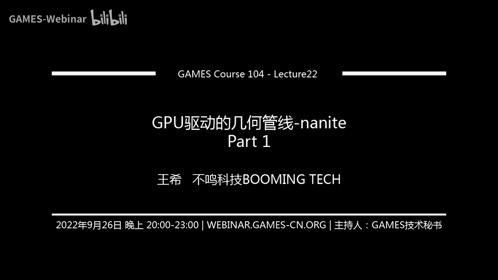
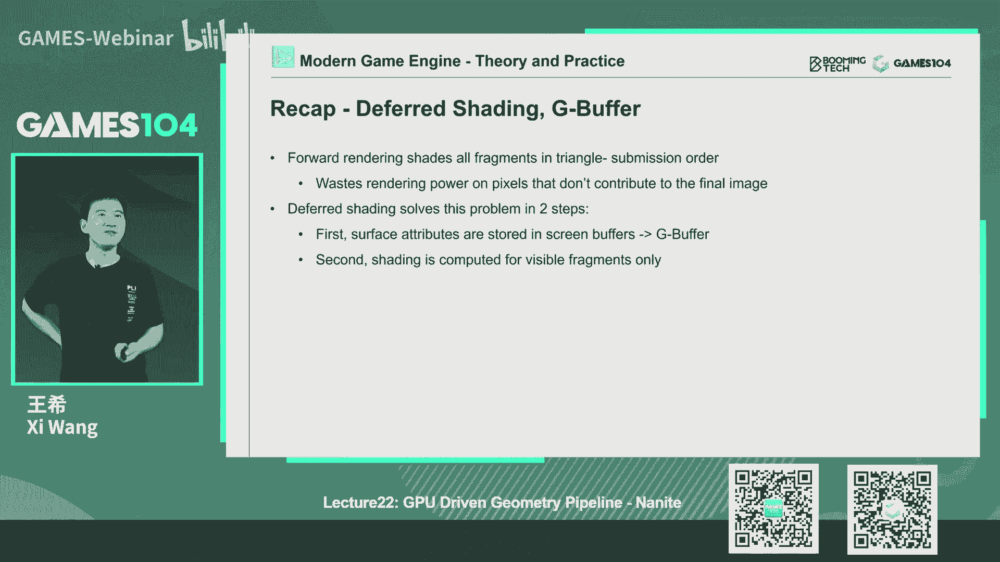
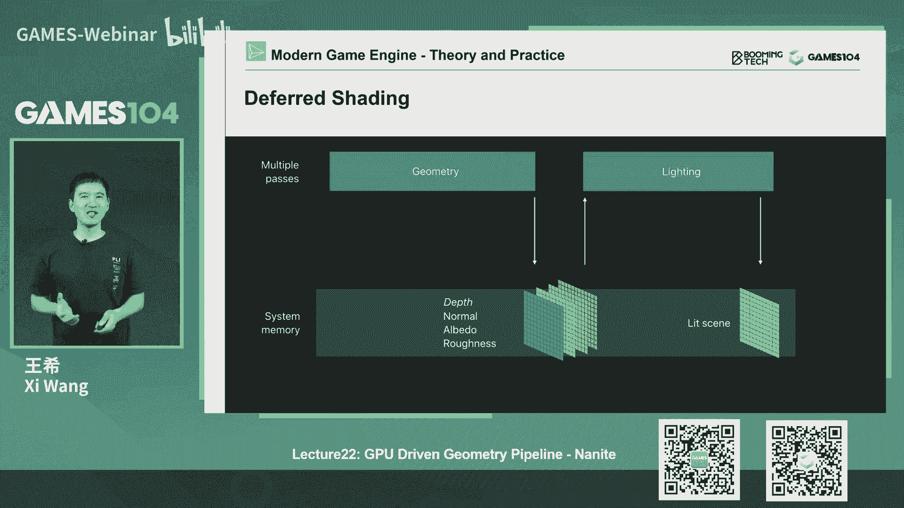
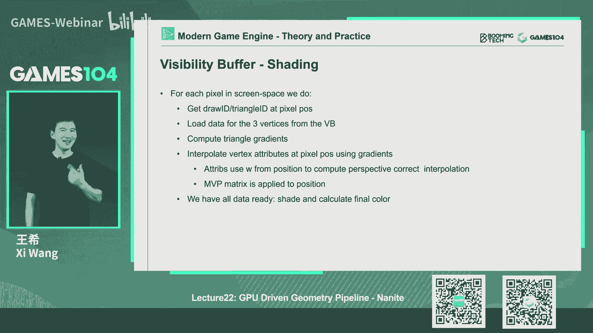
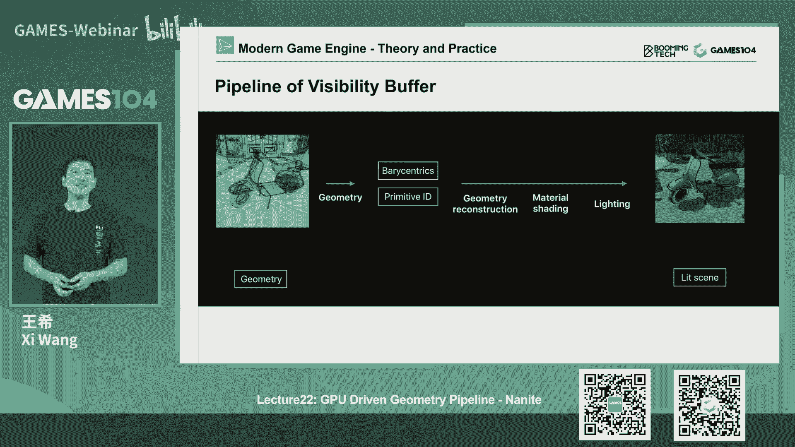
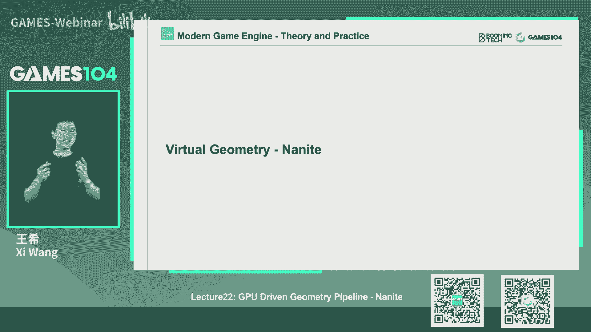

# 课程22：GPU驱动的几何管线 - Nanite (Part 1) 🚀

在本节课中，我们将要学习现代游戏引擎中一项革命性的技术——**Nanite**。Nanite 是一种能够近乎无限地渲染高精度几何细节的虚拟化几何管线。为了理解它的精妙之处，我们需要先回顾其技术根源。本节课我们将首先介绍两项关键技术：**Cluster-Based Rendering** 和 **Visibility Buffer**，它们是理解 Nanite 工作原理的重要基石。

---

## 回顾：传统渲染管线的瓶颈

上一节我们介绍了游戏引擎渲染的基础。在传统的渲染管线中，CPU 负责发起绘制调用（`DrawPrimitive`），准备渲染状态（如材质、纹理）并将数据提交给 GPU。这个过程存在显著瓶颈：

*   **CPU 开销大**：每次绘制调用和状态切换都非常昂贵，尤其是在场景包含成千上万个物体和材质时，组合爆炸会导致 CPU 不堪重负。
*   **GPU 等待**：GPU 经常需要等待 CPU 准备好数据，造成算力闲置。
*   **数据传输慢**：CPU 和 GPU 之间的数据拷贝是性能瓶颈。

现代游戏的趋势是场景几何极其复杂，材质种类繁多，这使得传统管线难以为继。其根本矛盾在于：**CPU 忙于为 GPU 准备渲染指令，而 GPU 的强大算力却无法被充分利用**。

---

## 曙光：GPU Driven Rendering

为了解决上述矛盾，业界提出了 **GPU Driven Rendering** 的构想。其核心思想是：**将尽可能多的渲染准备工作（如视锥裁剪、LOD选择、可见性判断）从 CPU 转移到 GPU 上执行**。

实现这一构想依赖于两项关键技术的发展：
1.  **计算着色器（Compute Shader）**：允许在 GPU 上执行通用计算，无需与 CPU 频繁交换数据。
2.  **间接绘制（Indirect Draw）**：允许 GPU 通过一个参数缓冲区（`DrawIndirect`）一次性绘制大量网格，极大减少了 CPU 的绘制调用。

理想状态下，CPU 只需设置相机参数并发出一个“绘制整个场景”的指令，剩下的所有工作（几何处理、可见性剔除、最终绘制）都由 GPU 自主完成。这释放了 CPU 资源，使其可以专注于游戏逻辑、AI、物理等任务。

---

## 关键技术一：Cluster-Based Rendering 🧱

以下是理解 GPU 驱动渲染的第一个关键概念：**基于簇的渲染**。其核心观察是：对于一个复杂的物体（如建筑），我们通常只能看到它的一小部分。传统的按物体（Instance）进行可见性剔除粒度太粗，会导致大量不可见三角形被提交渲染。

**Cluster-Based Rendering 的核心思想**：将每个大的网格（Mesh）进一步细分为许多固定大小（如64或128个三角形）的小块，称为 **簇（Cluster）**。然后，在 GPU 上以 **簇** 为粒度进行精细的可见性剔除。

### 工作流程解析

以《刺客信条：大革命》的实现为例，其管线流程如下：

1.  **CPU 端（粗略剔除）**：
    *   对场景中的物体（Instance）进行简单的视锥剔除。
    *   根据材质等信息进行哈希分组，合并渲染状态，减少提交次数。
    *   将每个物体的数据（变换矩阵、LOD 信息等）打包成一个缓冲区提交给 GPU。

2.  **GPU 端（精细剔除与绘制）**：
    *   **Instance 级剔除**：利用上一帧的深度信息进行保守的遮挡剔除，过滤掉明显不可见的物体。
    *   **Cluster 级剔除**：对每个可见物体内部的簇进行视锥剔除和背面剔除。
    *   **三角形级剔除**：在簇内部进一步剔除背面三角形。
    *   **索引缓冲区压缩（Compaction）**：将所有最终可见的三角形的索引信息，紧凑地打包成一个巨大的全局索引缓冲区。
    *   **最终绘制**：通过一次或少数几次间接绘制调用，将这个包含所有可见三角形的“超级缓冲区”绘制出来。

**公式/代码示意：核心剔除逻辑**
```cpp
// 伪代码：GPU Compute Shader 中的簇剔除
foreach (visibleInstance in instanceList) {
    foreach (cluster in instance.clusterList) {
        if (IsClusterVisible(cluster, cameraFrustum)) {
            if (!IsClusterBackface(cluster, cameraViewDir)) {
                foreach (triangle in cluster.triangleList) {
                    if (!IsTriangleBackface(triangle, cameraViewDir)) {
                        // 原子操作，将三角形索引写入全局缓冲区
                        uint idx = AtomicAdd(globalIndexBufferCounter, 3);
                        globalIndexBuffer[idx] = triangle.v0;
                        globalIndexBuffer[idx+1] = triangle.v1;
                        globalIndexBuffer[idx+2] = triangle.v2;
                    }
                }
            }
        }
    }
}
// 最终通过 DrawIndexedIndirect 使用 globalIndexBuffer 绘制
```

**该方法的优势**：
*   **最大化几何利用率**：只绘制真正可见的像素，极大减少了 `overdraw`。
*   **减少 CPU 开销**：复杂的剔除计算在 GPU 上并行完成。
*   **单次绘制调用**：将场景渲染简化为极少的绘制指令。

**挑战：遮挡剔除（Occlusion Culling）**
对于簇渲染，高效的遮挡剔除至关重要。因为即使簇在视锥内，也可能被前面的物体完全挡住。
*   **方法一（大革命采用）**：重用上一帧的深度缓冲（Depth Buffer），将其重投影（Reproject）到当前帧视角，生成一个近似的深度挡板，用于快速测试簇的可见性。这对静止或缓慢移动的场景效果很好。
*   **方法二（Two-Pass Occlusion）**：
    1.  用上一帧深度做一次**保守剔除**，得到“可能可见”的物体列表。
    2.  快速渲染这些“可能可见”的物体，生成当前帧的一个**粗略深度缓冲**。
    3.  用这个新的深度缓冲，对所有物体再进行一次准确的遮挡测试。
    这种方法更精确，能更好地处理动态物体。

**挑战：阴影渲染**
阴影贴图（Shadow Map）的渲染复杂度同样取决于几何数量。Cluster-Based Rendering 同样可以应用：
*   重用上一帧的阴影贴图进行粗略剔除。
*   利用相机视角的深度信息构建一个“遮挡体”，快速判断哪些物体在光的视角下不可能产生可见阴影，从而在渲染阴影贴图时跳过它们。

---

## 关键技术二：Visibility Buffer 👁️

上一节我们看到了如何高效地提交几何。接下来，我们看看如何高效地对这些几何进行着色（Shading）。传统的前向渲染（Forward）或延迟渲染（Deferred）在面临极度复杂的几何（如茂密植被）时，会遇到 `overdraw` 过高或 G-Buffer 过“胖”的问题。

**Visibility Buffer 的核心思想**：将几何渲染和材质着色彻底解耦。第一个 Pass 只做一件事——记录**屏幕上每个像素对应的是哪个几何图元**。第二个 Pass 再根据这些信息，去获取所需的材质数据并进行着色计算。

### 工作流程解析

1.  **Visibility Pass**：
    *   渲染所有几何，但不像延迟渲染那样输出庞大的 G-Buffer（法线、漫反射、高光等）。
    *   只为每个像素输出一个精简的标识符，通常包含：
        *   `Primitive ID`（三角形ID）
        *   `Instance ID`（实例ID）
        *   `Material ID`（材质ID）
    *   这个缓冲区非常小（例如每个像素 32 位），写入速度极快。

2.  **Shading / Material Pass**：
    *   对屏幕上的每个像素，从 Visibility Buffer 中读取其 `Primitive ID` 和 `Instance ID`。
    *   **几何重建（Geometry Reconstruction）**：根据这些 ID，从原始顶点缓冲区中取出对应三角形的三个顶点数据（位置、UV等）。
    *   利用相机参数和屏幕坐标，手动计算该像素在三角形内的**重心坐标**。
    *   使用重心坐标对顶点的 UV 等进行插值，得到该像素的材质采样坐标。
    *   根据 `Material ID` 采样对应的纹理（漫反射、法线等）。
    *   最后进行光照计算。

**公式/代码示意：重心坐标插值**
```cpp
// 伪代码：在Shading Pass中重建像素属性
struct Vertex { float3 pos; float2 uv; };
Vertex v0 = GetVertex(primitiveId, 0);
Vertex v1 = GetVertex(primitiveId, 1);
Vertex v2 = GetVertex(primitiveId, 2);





// 将顶点投影到屏幕空间，计算当前像素的重心坐标 (bary)
float3 bary = CalculateBarycentricCoords(screenPos, v0.pos_proj, v1.pos_proj, v2.pos_proj);

// 使用重心坐标插值UV
float2 uv = bary.x * v0.uv + bary.y * v1.uv + bary.z * v2.uv;

// 采样材质
float4 diffuse = texture2D(materialTextures[materialId].diffuse, uv);
```

**该方法的优势**：
*   **极致抗 Overdraw**：Visibility Pass 极其廉价，无论一个像素被覆盖多少次，昂贵的纹理采样和着色计算只在 Shading Pass 执行一次。
*   **缓存友好**：相邻像素很可能属于同一个三角形，因此在 Shading Pass 中读取顶点数据时缓存命中率极高。
*   **内存带宽节省**：避免了写入和读取庞大 G-Buffer 的带宽消耗。
*   **灵活混合管线**：可以轻松与传统延迟渲染管线结合。对于 `overdraw` 低的物体（如角色）使用传统延迟渲染写入 G-Buffer；对于 `overdraw` 高的物体（如植被）使用 Visibility Buffer。最终在同一个 Lighting Pass 中，从 G-Buffer 或重建的数据中读取信息进行统一光照。

**挑战与细节**：
*   **导数计算（DDX/DDY）**：在 Shading Pass 中手动进行纹理采样时，需要计算 UV 在屏幕空间中的梯度以确定正确的 Mipmap 层级。这需要通过屏幕空间坐标和顶点 UV 反推出来。
*   **抗锯齿**：需要额外的处理，例如结合 MSAA 或 TAA。





---

## 本节总结

本节课我们一起学习了 Nanite 虚拟几何管线的两大技术支柱：

1.  **Cluster-Based Rendering**：通过将几何细分为簇，并在 GPU 上并行进行极精细的可见性剔除，实现了从“逐个物体绘制”到“一次绘制所有可见三角形”的飞跃，解决了几何提交的效率瓶颈。
2.  **Visibility Buffer**：通过将几何标识与着色分离，用极低成本的 Visibility Pass 应对复杂几何的重度 `overdraw`，再在 Shading Pass 中按需重建数据，解决了复杂场景下的着色效率瓶颈。




这两项技术共同指向一个目标：**构建一个完全由 GPU 驱动、能智能且高效处理近乎无限几何复杂度的渲染管线**。它们为 Nanite 的实现铺平了道路。在下节课中，我们将深入 Nanite 的核心架构，看它是如何将这些思想发扬光大，并引入 **虚拟几何（Virtualized Geometry）** 和 **虚拟纹理（Virtual Texture）** 等概念，最终实现令人惊叹的无限细节渲染。