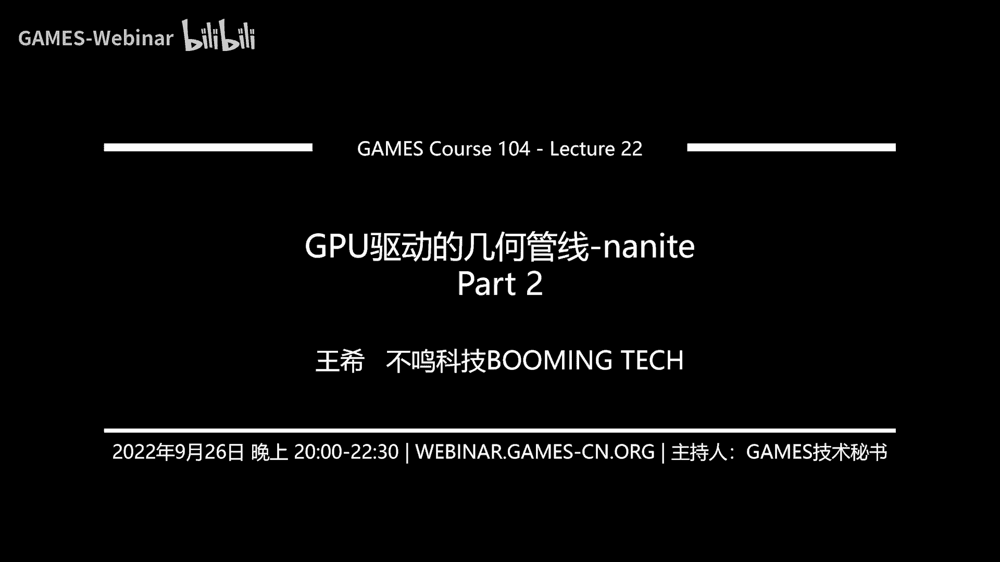

# 课程22：GPU驱动的几何管线 - Nanite (Part 2) 🎮


## 概述

在本节课中，我们将深入学习Nanite技术的核心部分，特别是其几何表达方式和渲染管线。我们将探讨Nanite如何解决无限几何细节的挑战，以及它如何通过创新的数据结构与算法实现高效渲染。

---

## 一、Nanite的起源与目标

上一节我们介绍了GPU驱动几何管线的概念，本节中我们来看看Nanite的具体实现。Nanite团队的目标是实现电影级的实时渲染精度，其核心思想是将几何虚拟化，类似于虚拟纹理技术。

作者分析了多种几何表达方式，包括体素、细分曲面、置换贴图和点云，但最终选择了三角形作为基础。原因在于三角形是内容生产管线最成熟、硬件支持最完善的几何表达形式。

---

## 二、核心几何表达：Cluster与LOD体系

Nanite最核心的创新在于其几何表达方式。它并非直接处理海量三角形，而是构建了一套复杂的层次化系统。

### 2.1 Cluster的构建

首先，Nanite将精细的模型分割成许多小的**簇**。每个簇包含固定数量的三角形（例如128个）。这构成了几何处理的基本单位。

以下是构建簇的简化概念：
```cpp
// 伪代码：将网格分割为簇
for each mesh in scene:
    clusters = splitMeshIntoClusters(mesh, trianglesPerCluster=128)
```

### 2.2 视图相关的LOD过渡

Nanite实现了**视图相关的LOD过渡**。这意味着对于一个实例，其内部不同簇可以根据与相机的距离，独立切换到不同的细节层次。这与传统方法中整个实例锁定一个LOD级别有本质区别。

为了实现这一点，并避免在LOD切换时产生接缝或视觉瑕疵，Nanite采用了更复杂的结构。

---

## 三、Cluster Group与有向无环图

简单的簇合并简化方法会带来问题，例如在簇边界产生永不变动的“缝合线”，导致视觉上的不均匀和瑕疵。

### 3.1 Cluster Group的引入

Nanite的解决方案是将多个簇（例如16个）分组为一个**簇组**。在进行几何简化时，它锁定整个簇组的**外部边界**，而允许组内簇之间的**内部边界**被打碎并一起简化。

简化完成后，再次运行簇划分算法，会得到一组新的、数量更少的簇。关键点在于：
*   新生成的簇与原始簇之间不再是简单的父子树状关系。
*   它们之间形成了**多对多**的关联。

### 3.2 理解有向无环图

Nanite用**有向无环图**来描述不同LOD层级之间簇的复杂关系。下图展示了其核心结构：


**注意**：图中每个节点代表一个**簇**，不同颜色的框代表不同的**簇组**。可以看到：
*   LOD1层的簇可能由LOD0层多个不同簇组的簇简化合并而来。
*   这种关系是局部的、多对多的，而非整洁的树状结构。

这种设计的精妙之处在于，每一层LOD的簇组边界都在变化。当相机移动导致LOD切换时，没有固定的高频边界会被人眼持续注意到，从而避免了视觉上的“接缝”感。

---

## 四、并行的LOD选择与BVH加速

有了复杂的DAG结构，下一个挑战是如何高效地为每个簇决定在当前视图下应该使用哪个LOD层级进行渲染。

### 4.1 并行化决策

传统方法是遍历树状结构。Nanite则希望利用GPU的并行能力。它通过两个关键设计实现：
1.  **误差单调性**：在DAG中，从叶节点（高细节）到根节点（低细节），几何简化的误差是**单调递增**的。
2.  **拍平决策**：每个节点（簇）独立判断。一个簇被渲染的条件是：
    *   其父节点的误差 > 当前视图的误差阈值
    *   且该簇自身的误差 <= 当前视图的误差阈值

**公式**：`Render(Cluster) = (ParentError > Threshold) && (ClusterError <= Threshold)`

这使得所有簇的LOD决策可以完全并行化计算，无需复杂的图遍历。

### 4.2 BVH加速结构

即使并行化，需要处理的簇组数量仍然巨大。Nanite进一步引入了**包围层次盒**进行空间加速。

它为**每一层LOD的所有簇组**分别构建一棵BVH树，然后将所有这些BVH树的根节点连接到一个共同的根节点下，形成一个“超级BVH”。

**优势**：
*   当物体距离相机很远时，可以快速剔除整棵高层LOD的BVH树（及其下所有簇组），无需逐一检查。
*   极大地减少了需要参与LOD选择的单元数量。

---

## 五、Nanite的渲染管线

有了几何表达和LOD选择，接下来看看Nanite如何渲染。

### 5.1 软件光栅化

当三角形小到接近像素大小时，传统的硬件光栅化（通常以2x2像素块或瓦片为单位）效率低下。Nanite对此进行了优化：
*   **规则**：如果一个簇内所有三角形在屏幕上的投影边长均小于16像素，则整个簇使用**软件光栅化**。
*   **实现**：通过计算着色器实现，直接计算三角形覆盖的像素，比硬件管线更高效。
*   **深度测试**：通过原子操作模拟Early-Z，将深度值编码在64位数据的高位，实现快速的深度比较和写入。

### 5.2 可见性缓冲渲染

Nanite采用**可见性缓冲**进行着色：
1.  **几何通道**：不直接计算颜色，而是将每个像素对应的**簇ID**和**三角形ID**写入缓冲区。
2.  **着色通道**：根据ID反查出顶点数据，进行插值，再采样材质纹理并计算光照。

这种方法将复杂的材质计算延迟到后处理，与传统的延迟渲染思路结合，可以很好地混合渲染Nanite几何和传统几何。

### 5.3 材质处理

场景中材质种类繁多。Nanite的解决方案是：
1.  **早期方法**：为每种材质执行一次全屏Pass，只渲染材质ID匹配的像素。材质多时开销大。
2.  **改进方法（瓦片化）**：将屏幕划分为瓦片（如64x64）。为每种材质生成一个位图数组，标记哪些瓦片包含该材质。渲染时，每种材质只需处理包含它的瓦片，大大减少了冗余计算。

---

## 六、虚拟阴影贴图

如此高精度的几何对阴影提出了极高要求。Nanite搭配了**虚拟阴影贴图**技术。

### 6.1 核心思想

其本质是解决阴影贴图的采样率问题：根据**视图空间**的采样密度，动态分配**光空间**的阴影贴图分辨率。
*   将阴影贴图划分为许多小页。
*   相机近处，对应阴影贴图页的分辨率高；相机远处，对应页的分辨率低。
*   这实现了阴影细节与屏幕像素密度的最佳匹配。

### 6.2 优势
*   **高质量**：阴影质量远高于传统的级联阴影贴图。
*   **高效更新**：当相机和光源不动时，大部分阴影数据可复用，只需更新少量页。
*   **无突变**：避免了级联阴影层间切换时的“跳跃”感。

---

## 七、数据流与压缩

为了支持开放大世界，Nanite需要动态流式加载几何数据。

*   **流式加载**：基于构建好的BVH和DAG结构，根据视图依赖，仅加载所需LOD层级的簇数据页。
*   **数据压缩**：
    *   **内存中**：使用**量化**技术，将顶点位置、法线、UV等浮点数据转换为定点数，大幅减少存储空间。
    *   **磁盘上**：使用硬件支持的LZ压缩算法，结合Direct Storage技术，实现数据从SSD到显存的直接解压加载，绕过CPU和主内存瓶颈。

---

## 总结

本节课我们一起深入学习了Nanite技术的核心机制。我们从其选择三角形作为基础表达开始，探讨了它如何通过**簇**和**簇组**构建复杂的**有向无环图**来实现无缝的视图相关LOD过渡。我们了解了其**并行化的LOD选择算法**以及用于加速的**BVH结构**。在渲染方面，我们学习了**软件光栅化**对微小三角形的优化、基于**可见性缓冲**的着色流程、高效的**瓦片化材质处理**，以及配套的**虚拟阴影贴图**技术。最后，我们简要介绍了其数据流式加载与压缩策略。

Nanite代表了一种全新的几何管线思路，通过极致的工程优化将当代硬件性能推向极限，让我们在实时渲染中首次触及电影级的几何细节。它不仅是技术的胜利，更是对实现逼真虚拟世界这一梦想的坚实一步。


---
**注**：本教程根据GAMES104课程第22讲内容整理，旨在提炼核心概念，简化复杂细节，以帮助初学者建立对Nanite技术的基本理解。部分实现细节可能随技术发展而变化。