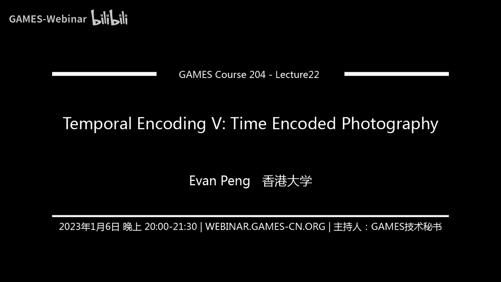

# 22.时域调制 (V) ｜ GAMES204-计算成像 - P1 - GAMES-Webinar - BV1cg411s7Cp

各位同学晚上好，新年快乐，新的1年开始了。今天我们来学习一些关于运动模糊的内容。

**运动模糊**是摄影中常见的一种现象，它是由物体在相机曝光时间内移动造成的。例如，拍摄星轨、运动的汽车、行人以及瀑布等场景时，都可能出现运动模糊。

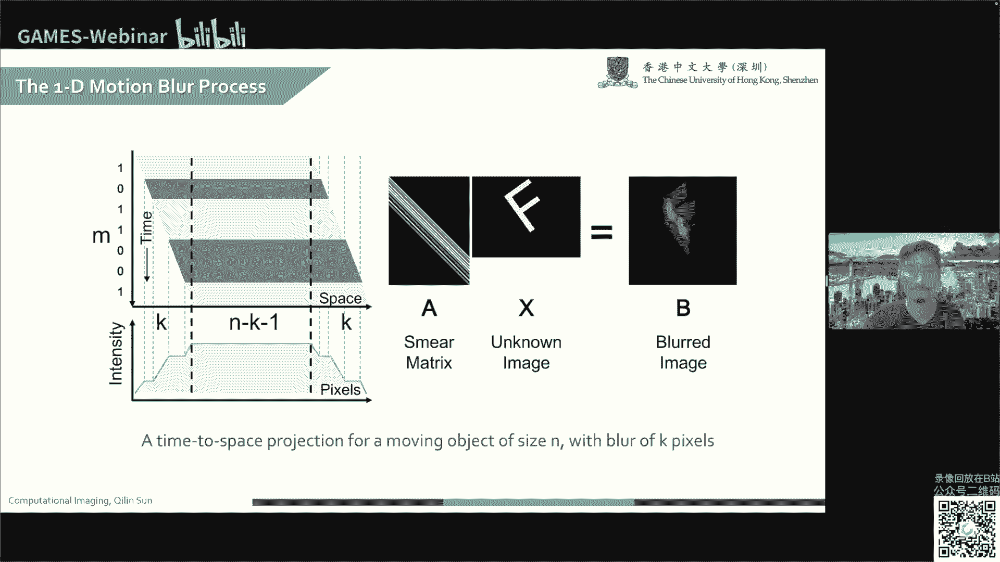

### 消除运动模糊的技术

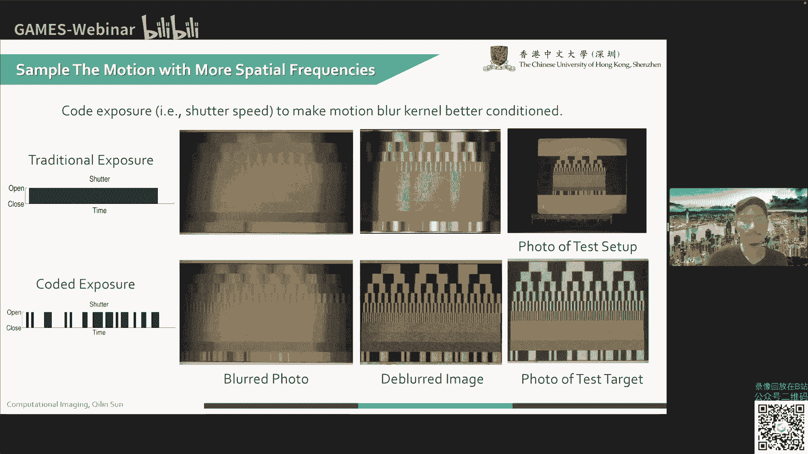

消除运动模糊主要有两种技术：

1. **编码曝光摄影**：利用震颤快门技术，通过在不同时间点打开和关闭快门，记录下物体在不同时刻的位置信息，从而在后续处理中恢复清晰图像。
2. **运动不变摄影**：通过控制相机运动，使场景中所有物体都进行额外的运动，从而实现运动模糊的均匀化，便于后续处理。

### 编码曝光摄影

**编码曝光摄影**的核心思想是时间采样，通过在不同时间点打开和关闭快门，记录下物体在不同时刻的位置信息，从而在后续处理中恢复清晰图像。

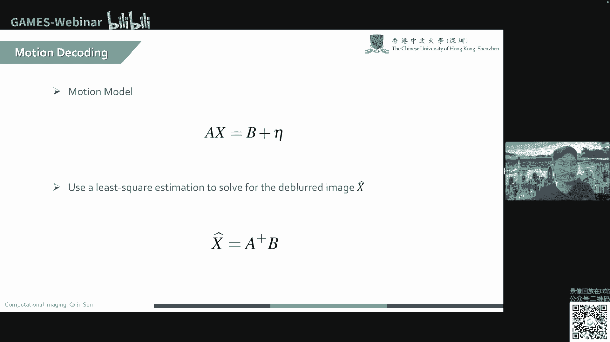

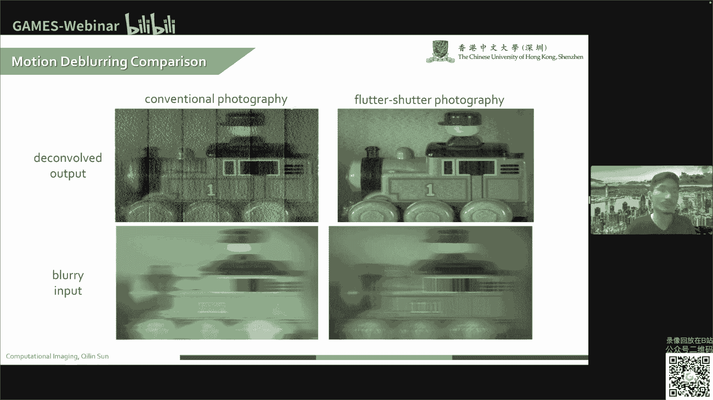

**公式**：

$$
\text{模糊图像} = \text{物体图像} \times \text{卷积核}
$$

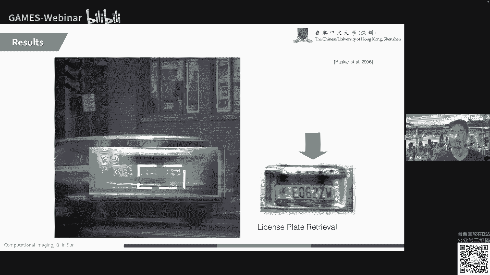

其中，卷积核表示物体的运动轨迹。

**挑战**：

1. **卷积核未知**：实际场景中，很难获取准确的卷积核信息。
2. **场景复杂**：场景中可能存在不同运动速度、方向的物体，以及固定的背景，需要单独分割处理。

### 运动不变摄影

**运动不变摄影**通过控制相机运动，使场景中所有物体都进行额外的运动，从而实现运动模糊的均匀化，便于后续处理。

**公式**：

$$
\text{模糊图像} = \text{物体图像} \times \text{抛物线扫描卷积核}
$$

其中，抛物线扫描卷积核表示相机的运动轨迹。

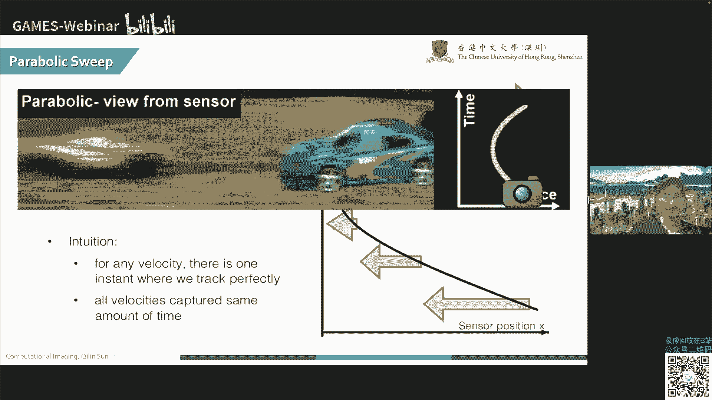

**优势**：

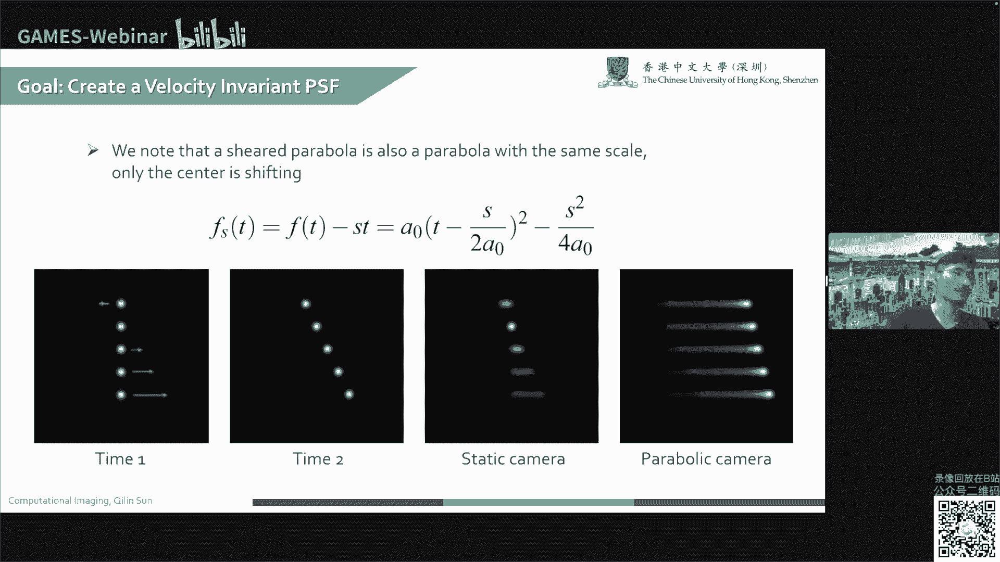

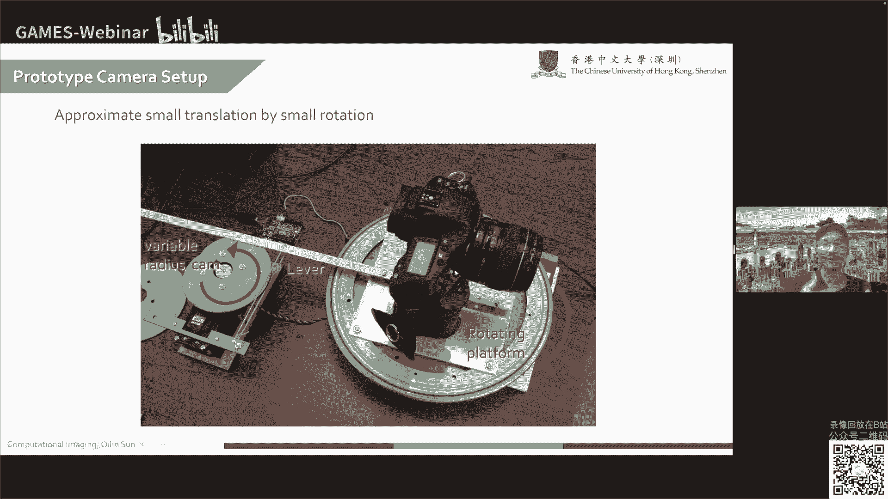

1. **无需分割**：无需对前景和背景进行分割处理。
2. **保留更多光通量**：整个曝光时间内，快门都是打开的，因此可以保留更多光通量，提高图像亮度。

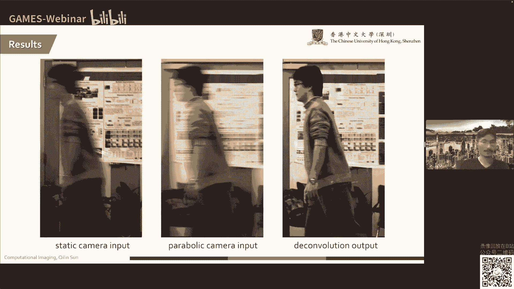

**挑战**：

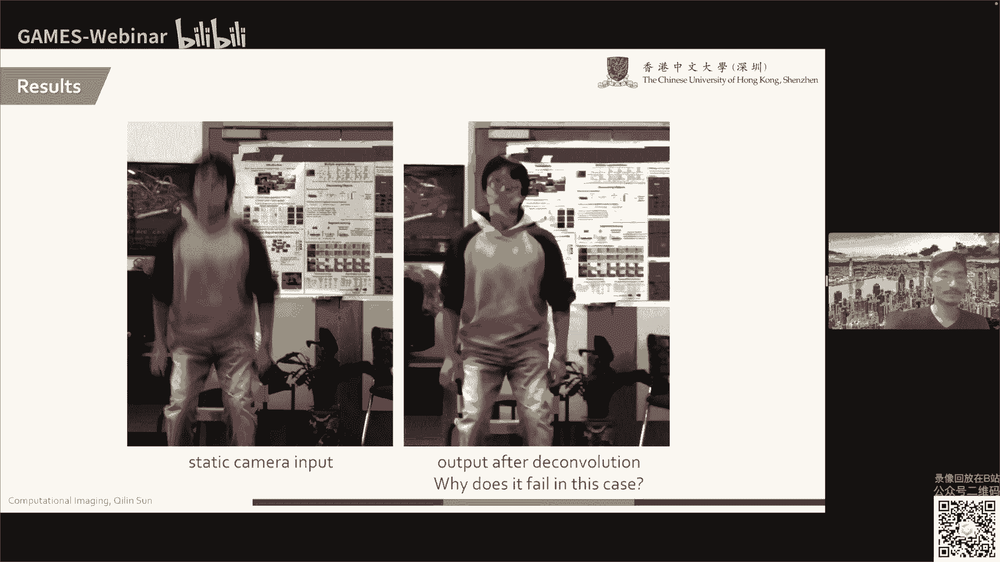

1. **机械实现**：需要额外的机械装置来实现相机的抛物线扫描运动。

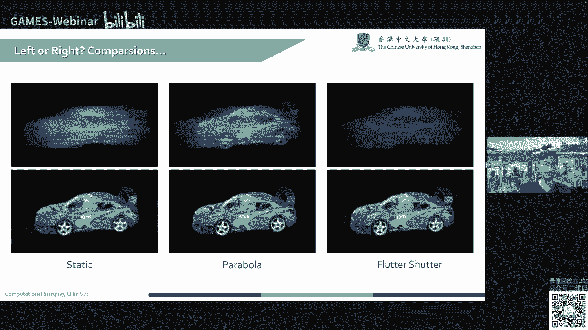

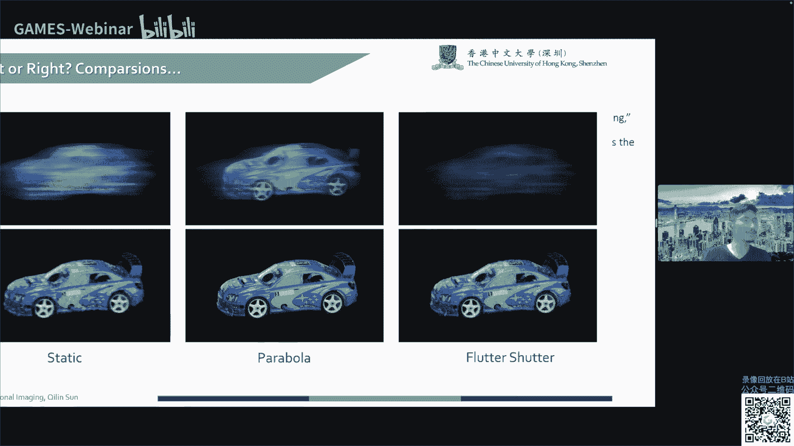

### 总结

本节课介绍了两种消除运动模糊的技术：编码曝光摄影和运动不变摄影。编码曝光摄影通过时间采样记录物体位置信息，运动不变摄影通过控制相机运动实现运动模糊的均匀化。两种技术各有优缺点，需要根据具体场景选择合适的方法。

**本节课我们学习了以下内容**：

* 运动模糊的概念和产生原因
* 消除运动模糊的技术
* 编码曝光摄影和运动不变摄影的原理和实现方法
* 两种技术的优缺点

**希望同学们能够通过本节课的学习，对运动模糊的消除技术有更深入的了解**。