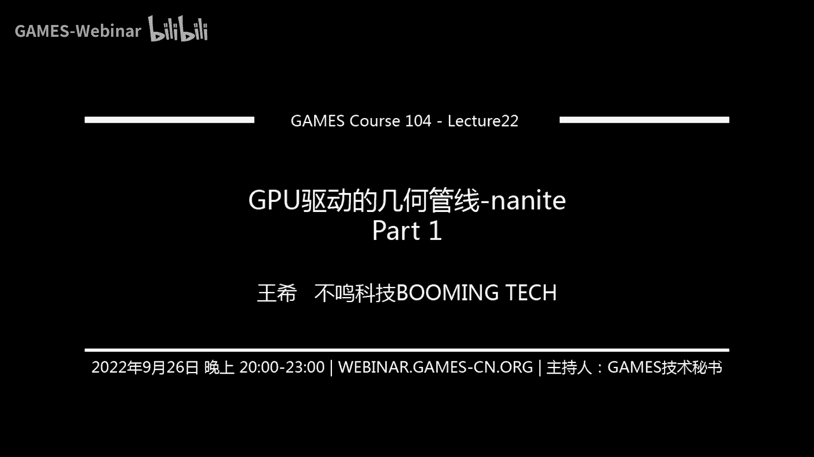
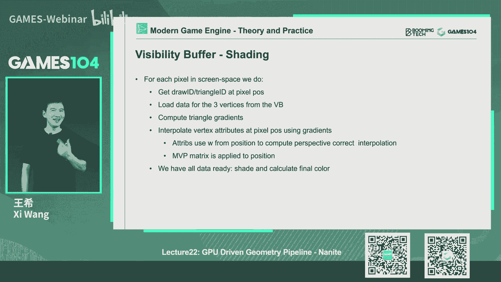

# 22.GPU驱动的几何管线-nanite (Part 1) ｜ GAMES104-现代游戏引擎：从入门到实践 - P1 - GAMES-Webinar - BV1Et4y1P7ro

感谢大家一直跟我们在一起。

那今天作业最后一节课呢，我们给大家公布一些我们课程一些啊，我们做的最后的一些准备，比如说很多小伙伴已经完成了我们课程的作业，将近有100多个同学教了我们的作业，然后呢。

有40多个同学达到了我们的毕业的标准，还有十几个同学是全部答对，非常的厉害，然后呢，我们课程组就很用心地设计了一个，我们的毕业证书，那我们也极尽所能，我们想让我们的证书看上去更漂亮和专业一点。

那么也就是说所有的这些小伙伴的话，你们把你们的地址在群里面告诉我们的，课程的助理，我们会把这些那个证件证书发给你，我相信的话，也会帮助同学们未来在寻找自己的工作呀，在自己的求那个求职啊。

那个求学的道路上，也是大家的一个certificate，因为就是games104的课程，这些作业全部做完的话，实际上本身还是蛮挑战的，就是说昨天的话恭喜我们这些同学们，然后另外一件事情的话呢。

也就是说啊实际上随着课程的逐渐的接近尾声，那我们就课程组的话，终于有些时间，就是把前面这将近十几个十个月吧，没有有没有十个月哦，将近有六个多月我们做的这些课程，然后呢把这些资料准备好。

所以我们会把我们的课程整理成文字版，这样方便同学们去阅读，同时的话呢，大家可以关注我们课程的这样的一个公众号，这样在这里面的话呢，我们会持续性的把那个PICO小引擎持续更新，因为那个也是我们的爱。

然后前面一直在准备课程，大家都非常的忙，确实准备课程压力太大了，但现在随着课程那个准备，我们可以告一段落的时候，那我们可以有更多的时间，好好的跟大家一起维护我们的piccolo引擎，包括一直欠大家的。

我们的PICO的源码解读啊，包括我带着大家一起去给我们的皮卡罗，增加一些更多的feature对吧，说不定一年后会有很多同学用皮卡做出自己的，很酷的大作业，很酷的这个毕设很酷的游戏，那作业这一点的话。

非常的兴奋，那么最后呢其实课程组终于有时间做一些，这个就是说呃怎么说呢，回顾和总结的事情，那这里面的话呢，其实啊哇这里面有个tb，实际上我们课程组的话，前两天把我们POO引擎里面所有的知识点。

全部做了个图谱，大家看到这个图谱上是不是密密麻麻，对不对，不好意思啊，那只是整个图谱的1/10都不到，其实它是一张很巨大很巨大的图，到时候我们课程组会把这个图分享给大家，然后确实准备这个课程的话。

我们花了好多好多的时间啊，就是查了上万种材料啊，然后总结了大概1500多个知识点以上，然后呢，其实将近2000多个人天wow在这个那个工作里面，所以的话呢希望同学们会喜欢我这门课。

那么在今天的课程结束的时候，大家不要走，我们会有一个课程组精心准备的一个彩蛋视频，也是送给我们所有能坚持到最后一刻的小伙伴，然后呢，也就是也是表达一下，我们课程组这一这将近半年以来我们的情感。

我们特别想和大家一起say个hi，这也是第一次我们课程组让全员让大家看到，OK所以呢感谢的话先说先先说这些，我们还要回到我们今年课程的正文，那上一节课呢因为准备的特别仓促，所以欠了大家的QNA对吧。

那这节课我们先补上大家的QNA，那么第一个问题的话，大家就问我们说诶，这个在ECS这个架构里面的话，如何解解决一个NT被删掉这件事情，其实在ECS架构里面呢，它追求的这个就是硬件的性能。

所以说它它一般一个ANTITY或者被删掉的时候呢，他不会真的把内存释放掉，因为大家知道，每一次内内存的allocate和DEALLOCATE的话，都会牵扯到那个hip的这种操作就会很慢。

所以呢它其实只是把那个index把它制成空了，那下次再有一个新的allocation的话，那直接reduce那个index，那么怎么样的区别，就是新版的那个音ITY和老板的entity呢。

我们在之前跟大家讲过，就是加一个salt对吧，SD一般就是累加的，就是意味着就是说，所以我每个东西看到的时候啊，诶我看到你的index是一样的，但我的salt吃的不一样，我就知道哦。

这个之前指向那个nt handle是无效的，所以简单来讲的话，在这种高效的这种非常高频的这种啊，这个系统里面的话，我们会尽可能降低memory allocation的第一个allocation。

我们把内存直接有一个有一个链表，直接把所有free space全部串在这，然后直接就用起来了，那么第二第二个同学问我们说，哎我们怎么去测量这个catch beast，哎呀这个问题就非常的难了。

首先第一个呢啊在程序里面，我们自己去测KASHMISS其实是很难的一件事，但是我们可以估算对吧，但是的话呢实际上一般都要基于GPU厂商提供的，这样的一些工具，把我们的application跑起来。

挂上那个挂到那个那个那个那个就是工具里面，然后呢他会帮我们抓到说诶你的CPU cg啊，你的这个l to l three cash的这个miss啊对吧，会告诉我，那比如说在英特尔的CPU上。

我们有个工具叫wow tube，他会告诉你这样的东西，所以小伙伴们如果想写这种高性能的代码的话，一定要学会用这些工具，包括我们教rendering里面很多讲到的cash，miss这些东西的话。

其实在GPU上也有这样的一些就PROFING的工具，这一般都是硬件厂商给你开放出来的，因为你自己是没有办法知道那个硬件的spec，对吧，那最底层的那些接口函数，那么第三个问题呢。

就是说诶就是说我们如何给designer，一个面向数据编程的，这样的一个架构的工具集啊，这个要求实在是太高了，因为其实当我们在一个真实的游戏团队，你们工作的时候，你会发现就是说在游戏团队里面。

我们的艺术家artist，我们的设计师，designer和programmer程序员是完全三种不同的物种，真的大家的这个这个这个思维方式，差别是非常非常大的，这其实也是这个就是说我觉得做游戏也好。

游戏引擎一个乐趣，就是说因为你实际上游戏引擎的本质是什么呢，我们是做工具的对吧，我给大家一直在讲，就是我们是做工具的，那么你的工具的使用对象，他的思维方式和做工具的人是完全不一样的，对吧。

artist看见一个东西，他就喜欢边边边往上往上去那个贴对吧，他就是他不会去特别在意这个结构和逻辑，而designer呢更多的是希望AI will express myself。

就是说我希望表达我自己对吧，我希望创造出各种各样，如果你告诉我说一辆车必须有这五个部件构成，那我一定要做一辆车，是用加上一些额外的功能，跟你想象的那个车完全不一样，为什么，因为这样的车才会有耗。

才会有这个我们叫NOVT，就是说比较有趣，比较有创意，对不对，所以designer天然的就是要打破你设计的这个，Paradise，就你设计的范式，所以呢在DP里面的话呢。

我们是希望每一个component它的那个模组啊，就是这个功能都是明确的单一的，这和designer的需求是天然是有冲突的，但是呢怎么说呢，其实在我们在做这样的一个一个架构的时候，给自己的工具。

我们尽量的把每个component变成一个个的积木，然后呢哎让designer自己去组合，但是相信我，designer可能很快就会需要一些不一样的东西，那这里面的话呢其实我们需要做一个工具。

告诉第三点说，诶如果你希望做一个非常customize的功能的话，那么你就可能不能走那个DOP的pipeline，它的性能可能只有DOP的110，你愿不愿意，比如说我给他一个budget。

他就是说总的性能的bug，然后他就他就开始思考了，说嗯，我是以十倍的成本做一个非常酷的一辆车呢，还是以非常高效的这个成本，我做100辆车对吧，这就是让他去想的一个问题了，那么所以呢工具测的话呃。

首先他一定要允许这个设计师去组合，另外一个的话呢就是说呃我们不去替他做选择，但是呢我们要非常清晰的把他做的每一个选择，所产生的这个成本告诉他，所以呢其实在真正的实战性的游戏团队里面。

就巴基control就是预算的控制，包括呢这个预算的这个visualization，就是说这个预算指的不是钱啊，这你们讲的哎我的CPU的性能啊，GPU的性能，我这个预算控制，包括直接可视化。

其实是非常重要的一件事情，如果讲的更深一点的话，包括我们的QA流程，也就是说你做了设计师做了一版的改动，然后呢整个游戏不就变了吗，那游戏里面有那么多的关卡，我跑一遍，我要保证它的性能完全符合我的需求。

那这件事情的话呢其实也是非常复杂的，而且在真正的实战性游戏团队里面的话，这些流程全部都是自动化的，也就是说设计师改了一个玩法，那或者改了一个比如说小怪的AI啊，或者兵团这个这个这个。

或者说NPC作战的模型啊，那其实很多的测试全部会自动发生，告诉我们说对性能有没有大的变化对吧，包括他自己也要知道收到这个report，那么第四个问题呢，就是说哎这是跟我们上一节有关的。

就跟我们说诶the moon，你们能不能就是如何解处理这个自发光的材质，对吧，其实我记得我在那一刻我特别强调了这件事情，就是说其实四方光材质呢，它的lighting。

在这个就是说在传统的我们的rendering里面的话，其实是比较难以处理的，我们很多时候会给它加一个fake lighting，加一个假的光源，挂在那个自发光的材质上，看起来就像你身上有个led照亮了。

但是在lumen的这个结构里面的环境，其实对于这种低频的自发光，它解决的还真的是蛮不错的，就是大家大家如果急得我上一节课讲的，就是说这个四方框材质呢。

它这个radiance会写到一个单独的surface cash里面，那里面有个emission的那个channel的那个texture，然后呢，当我们在空间中采样了一个个的。

就是water metric lighting的时候，这些光这些radio全部会被踩进去的，踩进去之后呢，当我再去生成那个screen space的那个probe的时候。

这些光就会被踩到我的这个screen space里面去，而且呢它还有很神奇的设定，大家记得吗，就是左脚踩右脚踢云纵对吧，我这一帧的光到下一站又变成我的intro lighting。

这样的话我的那个就是自发光的multi bounce，实际上也可以在这个就是说一帧一帧，一帧的去这个传递中的话，形成multi bounce的这样的一个效果。

所以说我个人觉得lumen里面在解决自发光的，这个就是特别是自发光的这个这个就是GI，也就自发光形成在场景里多次反射的效果的话，这个方法其实还蛮漂亮的，但是呢我自己也很希望能够做一些实验。

看看它最终的效果怎么样，比如说这个自发光我能不能支持HDR呀对吧，它的效果是不是足够明显和准确啊，这个需要花一点时间我们再去验证一下，但是整体的它的结构做得还是蛮好的好。

OK那这就是我们今天的QN的内容，也算是回那个还了我们上一节课挖的一个坑好，那今天就到我们的课程的主题了对吧，NAT耶，这个哇，这个简直是一个神坑级的这样的一个topic，那么NT的话呢。

实际上也是大家很关注的，这一代游戏引擎的一个很很顶级的一个技术，那么我们也是花了很长一段时间去理解，NT这个技术去分析，也希望给小伙伴讲的清楚，但实际上这个准备课的过程是实话实说，是非常艰辛的。

我我我们课程组的小伙伴经常会争得面红耳赤，我记得我在课程备课中最常讲的一句话说，哎你们不要忽悠我对吧，因为其实呃从它的本身的PPT啊，到作者的讲解啊，其实这里面空白的地方盲区还是很多的。

所以呢我们课程组最后大家真的很多时候，被迫打开源代码，一行一行源代码去看，包括也做了很多小实验，确保我们对它的理解尽可能的去正确，那么基于类似于上一节课的我们的传统。

就是说我们不太会把原始的这个这个presentation，顺序的给大家讲一遍，因为原作者讲的肯定比我们好，我们尝试给予我们的理解，从这个技术的源头讲到这个技术里面，最关键的我们认为的一个大的结构点。

有些细节我们会跳过，但是呢我们要确保，把最核心的东西给大家点出来，好啊，废话不多说，到我们今天的正题，NT对吧，一个新一代的这个geometry pipeline，就是无限极和细节的叫pipeline。

那么首先的话呢在理解NANA的这个事情的话，哎我们要去开始复古的理解一下，就是我们在前面那么多节课讲的，rendering pipeline对吧。

其实我们在前面讲的很多rendering pipeline，实际上呢是一个传统的render，那么这个pine一个很大的特点是什么呢，就是所有的需求是在CPU那一端发起的，就是我们经常会发生一个桌扩。

那么大家如果学open g2，那学direct，你们会知道一个指令叫draw primitive对吧，画一画一个mesh，告诉他vertex啊，index啊对吧，一小篇match出来这个东西呢。

其实啊在GPU上，首先呢你还要准备一大堆的，这个你要用哪个texture呀，你的阿尔法布兰妮设成什么样子呀，你一大堆的我们叫做render state，这一大堆都设计好之后诶。

你进入那个漫长的pipeline，在CPU里面他还要通过swapping到GPU里面，然后GPU里面开始进行这个处理来跑vs p s，还有rust riser，那其实在这个过程中啊。

很多时候CPU实际上是第一个，它速度可能跟不上GPU，第二件事情呢，CPU本身会有大量的算力，会浪费在准备这些素材的本身，大家可能都不知道，就是说桌括其实是一个非常expensive的东西。

比如说我们以前大家还记得我们在讲SHADER，讲材质的时候，尽量讲材质，同一个材质的渲染，我们要merge在一起，为什么呢，因为我们这样可以把他的桌这个设置。

那个render set全部merge在一起，其实这一条长长的排不来，就是哪怕你就画一个一个三角形的话，整个pi你得走一遍，所以这是垂直上的render一个很头疼的问题，那么这样的一个问题之后呢。

其实啊对于现代游戏来讲，现代游戏的特点是什么，就是哇我的几何会，这个就是我们的场景中的这个几何，会非常的复杂对吧，而且有很丰富的材质，大家还记得我上次给大家讲那个就是啊，在那个迪斯尼那个那个那个报告中。

他讲，他说他一个屏幕上好像是有上千上千种材质吧，对吧，那这里的组合就会爆炸了，我有我有我的mesh，哪个mesh呢，我渲染的时候我有我的render state对吧，我mesh还有我的LOD怎么设置。

然后呢我还要设置我的材质，材质可不是一个参数，它有一大堆的参数，还包括各种各样的texture对吧，然后呢我还有skinny with animation哇，这就是一个combination。

就是什么组合爆炸了，对不对，那这个时候当我们去做客的时候，我们每一个组合我得扩一次桌括，你想我们要扣多少次桌扩，而且呢为了每次周末之前，我还要propel它的render state。

大家如果对现代GPU，包括在显卡的，这个是那个性能有所一些了解的话，大家都知道就是这个render state的这个这个设置啊，其实本身是非常expensive的，非常贵的。

所以的话这就会导致就是说诶按照传统PIPINE，如果绘制像现代，特别是3A级游戏这样复杂的场景的话，它基本上是跑不动的对吧，它就是会非常非常的费，但是呢好消息是什么呢。

就是说在这样的一个这样的一个情况下呢，我们就会发现，就是说GCPU实际上会被做了大量的，比如说计算，比如说我们做的wow russian colin对吧，就是这个在CPU里算完，对不对。

然后C哥算完结果我还得提交给GPU，而且GPU呢这个时候很多说他啥也干不了，他只能等着CPU把这数据准备好，而且呢就是说在java里面。

每一次去change exchange的render state的话，本身也会非常的费，所以呢这是traditional rendering pipeline，就是非常头疼的一件事。

这也是就是已经成为了一个瓶颈，那这个瓶颈呢实际上他的曙光是在哪里呢，就是第一个就是随着这个2010十年前，computer shader逐渐逐渐的成熟，到现在为止。

computer shader已经非常成熟了，那么他呢就可以做一件事情，什么意思，就是我们可以不用在CPU和GPU之间来回导数据，大家还记得我们在之前讲过，就是我从一个数据从CPU里考进GPU对吧。

这个事情是很废的，因为在CPU里面的话呢，我的这些render pipi，还得从这个memory里面load到cash，Cash，再到我的pick shader workshop去处理。

那能不能所有的计算就在GPU的内部，那就有个前提，比如说我要做一个唉世间锥裁剪，这里面一大堆的数学运算，对不对，那能不能在GPU里面写一个通用的计算器，把它处理掉，它的曙光是什么呢。

就是计算SHADER，Computer shader，那么它呢就是说可以完全的在GPU上做出大量的，以前只能在CPU上做的通用计算，所以呢就是说这样就使得我们的很多的这个。

CPU和GPU之间的通讯变得非常的简单，那么另外一个的话呢就是rendering API，以前的话呢，我们一个桌primitive只能画一个mesh，对不对，哎但是现在我们可以做indirect的时候。

我们可以把一个就是这个array of the parameters，或者叫一个parameter buffer，把它整个录得进去，我一个周末可以画很多的mesh，那这样的话也是使得我们能够尽量的减少。

就是在CPU到GPU的桌括这件事情上，就是成为了可能，所以的话呢其实在就是56年前，其实更早一点，就是说大家应该是我67年前了，更早了，就是说大家提出来了，就是说哎我们以前是一个一个对象的渲染。

我能不能把以前很多CPU的给rendering做的计算，比如像visibility啊，l o d selection啊对吧，全部把它移到这个GPU上去，而且呢我把整个场景数据全部放到显存。

大家看打开现在的显卡，你们发现一个特点，没有显存都很大对吧，动辄就是几个G的，所以我整个场景其实是可以基本放进去的，对不对，那我就不想让这个CPU再去做什么操作，CPU只是发一条指令。

说把场景给我绘制一遍，我设置一下相机参数对吧，剩下的事情最好你GPU全部搞定诶，那这样的话，这个我们就从以前的一个draw primitive，就变成了一个JC，这个呢其实就是我们讲的时候哎。

现代GPU上GPU driven的rendering pipeline，最理想的最终极的状态，那么这样的一个很大的好处是什么呢，就大家还记得，我以前在一开始给大家讲的，就是游戏引擎的架构里面。

游戏引擎它是一个对实时性要求非常高的一个，一个一个就是SDK，那么大家想想游戏里面除了渲染啊，是不是还有很多其他的东西啊，比如说我们的这个AI对吧，我们的游戏逻辑对吧，我们的各种各样的玩法。

把物理检测一大堆东西，对不对，那这些东西的话呢，我们啊包括网络通讯，那我们就可以把这些东西，全部放回到这个CPU来做，这CPU一下子就被释放出来了，那么GPU呢就等于说渲染的东西交给显卡，你来做了对吧。

我CPU就不要在这瞎忙活了，以前大家如果看的话，render thread是很满的，对不对，后来为了解决这个问题的话，我们还提供了就是这个多线程的这个state的提交，这个大家如果了解一下DX12的话。

这个架构包括我很架构是很核心的，就是个多性能的提交，那么哎但是的话呢，其实这个时候我CPU资源大量的被浪费，所以这些东西啊，其实是我们讲的这个就是后面要讲的cost，Brendering。

visb buffer啊，包括我们讲的NAT的话，它最原始的一个思想，就是说我希望整个这个世界的几何的裁剪，LOD的选择，甚至包括几何的这个就是选择哪些东西，可见不可见，全部在CPU内部完成。

然后呢我尽量不要让CPU特别的慢，所以这个是我们这节课的体验，就是什么时候我们能从一个draw，primitive到JC，这是我们要解决的问题，这里面最早的这个先先驱者呢。

就是我自己找到的是那个刺客信条，大革命那一作，对，这里面应该叫secret，这个这个这个那个unu unity对吧，那么其实呢就是GPU driven的这个pipeline的话。

最早是他在我印象中是2015年SEGA上，他们给了一个分享，这个确实做的非常的了不起，他们要解决什么一个问题，就是大家看大革命这一组啊，他所展现的那个场景，有大量的这个精细的。

这个这个这个巴黎的这种建筑啊，那些浮雕其实非常的让人震撼对吧，那么这么里面这么多的精细的几何，你去怎么去渲染它，怎么去绘制它，其实是个非常难的一个问题，在过去传统里面我们去表达这个几何的话，没有办法。

我只能把整个几何low的进去对吧，然后呢我就开始一个instance，一个inst的rendering，但是呢这里面就会出现很多问题，就比如说很多的instance其实是不可见的。

甚至是对于一个建筑来讲，一个建筑是对不对，但是你看到他的前面的柱子，它柱子后面的很多，虽然也属于这个建筑的mesh，它其实也是不可见的对吧，那我要为这些东西设置多少个状态。

那么我才能解决我的这个渲染高效率的问题呢，就是大家想象一下，如果我有上亿级的这个面片的话，我去渲染它的时候，实际上我里面可能有上万个物体，我怎么去渲染它，其实这就是当时大革命这一作的话。

它所面临的一个非常大的挑战，那他怎么解决呢，诶他们是最早提出来说，我们用cluster based rendering方法去解决它，这个方法呢讲起来很高大上，实际上是非常简单的一个淳朴的思想。

就是说对于一个每一个这个游戏世界里面的，一个instant的一个物体对吧，它可能是几万个面甚至十几个方面很大，但是呢我把它分成无数个，有128个三角形呃，应该是他选择当时选的是64个三角形对吧。

这不重要，大概就是一个小的固定尺寸的一个叫cluster，这样的一个一个一个一小片的mesh，那这样的话呢，其实我就可以把一个instance，分成无数个小的cluster。

而每一个小小的caster呢，它实际上都可以做自己的BINBOX，那这样就好了呀，当我去去渲染这个东西的时候，我以前只是检测说这个instance是不是可见对吧，但是现在我有了这cluster的时候。

其实我可以检测什么呢，每个class是不是可见，而且呢每个cluster他的是不是会被背面裁剪，会不会被那个depth去遮挡掉，这样的话，我对整个这个世界的表达的颗粒度就会细，非常非常多。

哎这个东西听上去有点反直觉啊，但是其实这个是非常重要的一个observation，就是说因为我们在computer shader里面的话，我们是可以就是批量的处理，这种uniform的结合的。

但是的话呢我们整体的去对于每个instance，LOD切换啊，包括就是这个我的卡林对吧，我大家知道我们画一个instance，无论这个东西可不可见，但是你如果有10万个三角形，只要这个instance。

我只要一个角可见的话，那10万3角形我得整个再炫一遍，这个其实是很废很废的，但是你想一下，如果我们在大革命这样的一个场景里面的话，很多时候这些建筑这些东西，它本身就是一个很精细的模型。

但是你站在一个里面的话，你看到的就是它一小块，所以呢哎我把这些mash分成很多cluster的话，实际上理论上来讲，它可以实现对船购的这个最大化的利用，就是对于所有不可能看见的三角形。

我是尽可能少地绘制它对吧，所以这个看上去很复杂，但其实大家如果仔细推演一下，你会发现他对几何的利用率是最高的，那么他这个拍拍案想起来呢其实也非常的简单，这是他画的整个这个流程图，它首先在蓝色的。

在CPU的部分呢，它其实就是对这个instant做了一个最简单的，比如说view russian coming对吧，然后呢在GPU阶段的话，它会进行一个比较精细的这个view fcm。

它就是会把很多的看不见的instance给卡掉，这里面其实还包括depth，然后呢每个instance的话，就是每一个物体它又会分成很多的cluster对吧，他把这个cluster再做斯卡林。

这样我把这个可见的这个物体的，不可见的那些小的部分全部也扔掉，然后呢我把这些锁，然后呢每个cluster它不是164个面嘛，对不对，我甚至把一些不可见的三角形我都扔掉，最后呢我把所有的可见的啊。

这个讲起来比较拗口了，叫可见的instance的可见的clustered，可见的船go，把他们全部packing成一个超大的index buffer，它这个过程叫什么呢，叫index buffer。

compact compaction对吧，然后哎我最后一个桌扩或者一个indirect jk，可以是这个这个这个INTELJA，也可能MULTINTELJAL诶，我就把你整个场景画出来了对吧。

这其实就是当时刺客信条他这一做的时候，它的一个核心的思想，你可以理解成，就是说他在前面用这么多的GPU的运算，包括这么复杂的class base的结构，诶他做了一件事是什么呢。

就是啊做了一个超级的这个啊visibility carly，就是把所有不可见的triangle，尽可能给你全部干掉了，而且呢把所有可见的这些几何，全部group成了一个大把粉。

然后呢我一个周后我把你全部搞定，所以它就达到了性能的最优，同时的话呢也尽可能降低了屏幕上呢，我们叫做什么呢，叫这个这个这个overdraw，就是说同一个pixel我很多三角形画的话。

他们就彼此之间产生了浪费嘛，这个其实是它最核心的思想，那么这个思想为什么我要先讲它呢，因为其实大家去理解NT的话，他的思想的源头实际上是来自于这个思路，就是clasps rendering。

那么包括就是我们看到那个非常有意思，就是啊，发明这个就是COSPARENDERING的这个这些老歌的话，那会写很多的，这个twitter就是在讨论说诶，你NT哪些技术是你更厉害的。

哪些技术是我发明的对吧，彼此之间还在讨论说谁才是这个技术的发明者，但是没关系，我们不卷入他们的争论，但是呢确实这个就是大革命的这一作的话，确实引发了一个class based。

rendering的这样的一个革命，那么其实在GPU赛呢，CPU赛就是在那个就是非常的简单的，他只是做了一个非常简单的，就是对instant cotree的一个coming in对吧。

他就是把这个就是说那些各种各样的桌括呢，他还做了一件事，就是说根据你的材质不同，他做了一个哈希表，把你相同的材质，相同的render state的东西，尽可能顾不到一起往里面去去去去提交。

那么接下来的话呢我就把每一个instant data，无论是你的transform l o d啊，你应该用哪一层的LOD啊，注意啊，这里面在大革命里面的话，每个instance l o d是自己算的。

就是这个其实还有一个古典做法，就是说啊比如说这边有个柱子，它讲的是一个是一个instance的话呢，它的LOD是整体说我切的LOD0，还是12345depends，我靠近相机的距离。

这个其实后面我会讲了，这其实是和那个NT有个本质的不同呢，我们先不讲开，那这些信息呢诶我把它packing成一个buffer，然后一股脑就交给我们的GPU来开始处理了，那GPU干什么事情呢。

其实GPU非常的简单，哎这个虽然这个图画看上去非常的复杂，但是我尝试用最简单的方法去解给大家讲清楚，就是说呢，哎我这个时候我就有一个，我现在要绘制的instance的列表，对不对。

那么我一个每个instance的假设，大家知道有几万个三角形，对不对，我呢把这个几万个三角形分成很多的cluster，但是呢很多的cluster呢其实太碎了，他还做了一个叫chunk对吧，就chunk。

就是你可以认为就是把一群cluster grp到一起，比如说啊16个啊，或者32个对吧，这个depends on他的选择可能一般是32个，为什么呢，就是这个里面有个小的trick。

就是说我们在这个就是说显卡里面，我们的那个那个，就是大家还记得我们的每一个computer shader对吧，他有一个叫wave或者叫wave from，或者叫那个那个叫安安VIDIA，叫WP。

就是说我一次次性发出一批工作对吧，把我所有的working thread全部吃满，一般来讲的话NVIDIA是32个工作同时发，然后呢那个AMD的话以前是64个对吧，但是呢其实就是说。

你如果能够把所有的thread全部用完的话，效率最高，所以这个CHK的意思也就是说哎我一个cluster，一个我这一批就扔出去了，所以呢他其实在这个cluster和这个那个instance。

之间又建了一层唱K的架构，但是大家不用特别担心这个东西，这个东西其实只是个加速架构，对吧好，那我的这个有这个唱歌的时候，当然这里面多说一句，就是在后面我们讲nut的时候，有个东西特别难理解。

叫cluster group，就是我们把cluster变成一个group，其实跟这个呢有那么一丢丢的异曲同工之妙，包括我后面会讲的就是说那个class group的话。

使得大家去理解NT产生了非常多的困难，我们尝试今天把这件事情讲清楚，OK那么其实呢每个instance的话呢，它中间分成一个个chunk，每个CHK里面包含了若干个cluster，没关系。

我先去看唱歌的可见性好，接下来我去干什么呢，诶我看每一个cluster的可见性，那cluster的可见性，每个class有自己的绑定嘛对吧，包括我可以做自己的这个那个depth testing。

我什么都可以做，诶这个时候呢我还能做什么事情呢，就是在cluster呢，它实际上是一个曲面，对不对，但有些三角形呢是在我的正面，有的三角形是在我的背面，对吧，我还可以把背面的三角形给干掉。

那么我能进一步降低我的三角形数量，然后呢，我的computer shader里面就会把所有的instance的，所有的乘客，所有的cluster，所有的三角形全部跑一遍。

最后呢我会输出一个最后可见的所有三角形的，一个超级大的index buffer，那他怎么办呢，他一上来会先分配一个大概八兆的这样的一个，伊森的buffer的这样的一个一个一个一个空间。

然后呢你们所有的这个walking street，就是你们去便利所有的这个instance啊，所有的这个这个class唱歌啊，所有cluster所有船口，你们只要这个船口最后可降了。

我就把你这个instance part，这个这个这个TRIGLE的信息index buffer p写进去，然后呢依次的往后去ding这个东西，为什么可以做呢，其实是因为就现在的这个GPU的话。

它实际上能支持，就是说在这个computer shader里面，我可以并行的处理很多的工作，但是呢我能保证它的血的运算，具有一定的原子性对吧，但是这个你要做的不好的话，他互相就会你等我，我等你。

但如果你写的他这个几乎是比较那个稳，就是比较工作量比较均匀的话，他们写的话真的是能够非常高效率的，往那个最终那个buffer里面去写写写写写，当然这里面有个细节。

就是说因为我的所有的这个instance的便利，所有的cluster的便利，实际上都是并行的，所以那个instrument buffer那个英特尔谁先写谁后写，其实可能是乱序的。

这种外序呢本身没有什么太大问题，但是如果这些几何的密度特别特别的高，那么你会出现什么情况呢，就是比如说啊啊在第一针的时候，诶，我同样是这些可见的物体，我的渲染顺序可能是啊instant1。

然后呢instant5，instant8对吧，但是呢我到第二针的时候，我可能变成了insert5INCENT8int一，那么这个渲染呢，因为z buffer它本身的精度啊，它还是有限的。

可能会产生一个z fighting，所以呢作者在他的那个presentation的后期会讲到，就是说诶因为硬件厂商提供了叫multiple multi director，扩对吧。

它可以锁死这个inn的绘制的顺序，那么a cluster绘制的顺序，因此CROSSC绘制的顺序，这样的话呢它能避免这种the fighting的现象出现。

但这个是一个非常小的这样的一个hack trick，不过同学们在做这个render的时候，其实特别注意一件事情，就是说我们希望就是在针与针之间的话。

我们一些渲染它的顺序最好是deterministic的，否则的话呢当这个几何的密度特别高，而且贴的非常近的时候，比如说啊我举个例子大家就知道了，比如说啊我们在墙上再加一层贴花的几何对吧。

他两个几何之间就非常的近，那么当你的这个相机离得稍微有点远的时候，那个z buffer的精度就不够了，那么你是先画那个贴画，就是那个想细节几何再画墙面，还是先画墙面再画细节几何呢。

那个Z会产生fighting的，所以他两个的顺序确实要保证起来，否则的话你画出来的东西它就是不对的，但这里面的这是一个非常细节的一个东西，但是大家如果在做真正做游戏的时候，大家需要注意这些细节。

所以呢这一步核心的就是说，我把所有的物体全部变了一遍，把它里面所有的COSER全部变了一遍，然后我把所有可见的传统customer，可见传口全变，我把所有的在这一帧相机下的可见的传统。

build成了一个超级大的一个index buffer，我111个pass把它渲染完，诶，这个是不是就实现了，我们在之前GPU driven里面讲的那句话叫做哎。

我们从JOEPRIVITI变成了JING对吧，而且这个calling是非常彻底和充分的，哎这就是这个刺客信条大革命，它最核心的一个一个渲染上的一个想法，这个想法说实话，在那个时候我们刚刚看到的时候。

确实是惊为天人，就是觉得哇塞这个老哥还是挺猛的，居然敢这么搞，甚至是会觉得哇这个这个会不会，这个导致这个CPU上的运算过过于负载，但是你后来发现就是说确实这样做，对于那种非常细密的这种高精度几何的话。

确实是效率最高的一种做法，而且呢这个也毫无疑问就是逐渐成为了，我们下一代这个rendering pipeline的一个，可以说是个标准解法之一吧，OK那么这里面其实有很多的细节了。

比如说像baha calling作者提出了一个想法，就是说哎我可以在一个cube上面去CODEC，就是说我有128个面，对不对，那你每个面对于我一个cube的六个面来讲，你到底是可见和不可见好。

那我有了这个cube之后呢，当我一个相机的视角过来之后，其实我就可以知道说，因为你这三个面对于我可见，所以你那个三角形的话，假设这三个面中只要有一个人的B特，是是是是亮的话，那这个东西我就是亮的。

因为你总共就是64个三角形嘛，所以说我六个6×64个，这个这个vector就能表达我三角形的这个可见性，这一点其实非常的重要，因为其实back is calling的话呢，用这个方法速速度是很快的。

当然了，就是说其实在NANA里面的话，好像没有用到这个技术，但这个技术我觉得是一个非常好的一个trick，所以其实呢这个就是我们这个最原始的就是。

cost based mesh rendering的一个思想，其实非常的简单对吧，大家想想哎，理解了就不难了，但这里面又引入了另外一个细节，就是说哎这么多的cluster。

我如果只是用wow fashion对吧，那我实际上那么多的几何层层叠叠的话，那后面那些几何画了不是全都浪费嘛，对不对，而且你虽然说我们说一个周末对吧，一个JING就可以把所有的现在可见的这个。

传染狗的可见，但是其实你背后藏着很多实际上是被遮挡掉的，这些cluster我也绘制了，这一点，其实对于rendering来讲的话是非常重要的，为什么呢，因为其实大家知道。

就是说如果没有做clusion culling，基本上所有现在游戏它的性能都差得一塌糊涂，真的就是啊当大家做游戏的时候，经常会遇到一个性能的bug，就是如果库存卡里没做，对对吧，那你会发现同样一个场景。

直接就帧率下降个级别是很正常的，所以说其实接下来一个很重要的一件事情，就是说唉对于那种彼此遮挡的这些几何的话，虽然你都在我的相机的视野内对吧，虽然你所有的三角形面都嘲笑我。

我能不能把你这个cluster整个给干掉，这其实是这个就是说啊，对于这种class based machinering的话，很重要的一个议题，同样的就是对这么细密的几何。

那我就做你的shadow map的时候，我的天呐对吧，shadow map大家理解吗，就是说哎他要从光的角度再去渲染一帧，那它的复杂度呢很多时候不是由材质决定的，因为那个时候材质不重要，对不对。

哎几何是直接决定了我渲染一个SHUTMAP的成本，那我怎么样在渲染它这个这么复杂场景的，shadow的时候，尽可能变得廉价，所以这也是就是说a cluster based rendering。

很核心的一个技术点，就是ACLUSION怎么去calling，这一点的话，其实一直到我们本节课要讲的重点，拿net技术的时候，这也是一个非常核心的一个技术好，那作者怎么做呢，哎其实在大革命那个时代。

他其实有一个非常聪明的一个想法，就是说我当前这个物体，我要去算他的这个这个这个东西可不可信，怎么办，我呢把上一帧他的depth，重新投影到我当前的相机位置啊，重新算一遍。

因为大家知道在那个depth buffer里面，其实我们知道一个深度，其实我们还知道它的XY，就是实际上我们就知道了，在这个物世界坐标系里面，我们形成了一个怎么说呢，这个图很难表达出来。

但是其实是一个像一个模样的，就每个模带深度对吧，这样的一个个的pixel呢，当我把它当我的相机位置换掉之后呢，这每个pixel其实可以重新，投影到我的新的相机位的，那么假设这个世界你的相机移动不要。

那么就是跳它是一个光滑的移动，第二件事情呢，场景里大部分物体都是静止的话，那大家有没有发现，实际上这个ACCA的话呢，实际上是可以重用的，这是他一个很核心的一个观察。

另外一个这个DEBUFFER可以重用，上一段代码可以重用，另外一个的话呢，作者呢他还想了一个trick，就是说我写了一个HEISTIC启发性的算法，就是因为我的场景里面有上万个，甚至是更多的这些物体。

因此对象对不对，我有一套启发式算法，就告诉我说哪些物体就是很大，而且它离我相机很近对吧，我就把它作为优先的酷睿，我先找到300个，就是最有这个可能性的这些aqua。

我先把它z buffer就是在我渲染出来，这样形成我的指导，然后呢桶把它呢就是当sample的，到我的512×256，然后呢我们再把上一帧的z buffer诶，把它REPROJECTION出来。

那上一轮这样的话呢，因为你只选了300多个那个物体啊，实际上你会是那个Z8手上面有很多洞的，对不对，诶他把上一段东西representation过来呢，把这个洞填一填，对不对。

然后这个时候我就用这个z buffer，我build一个HZHZ，大家还记得吗，就是说我的z buffer1层层的往上密铺，但是这个mp是很特别的，就是说我选择那个他的是应该是最近的那个Z。

也是最小的那个Z，也就意味着说你跟我的hey test，如果过了就说明你肯定是没有被遮挡，如果没有过的话，你可能被遮挡对吧，它其实是一个啊保守5G诶，那我就可以去做这个GPU上的直接卡里面。

因为我每个COSER不都是有绑定吗，对不对，或者我每个唱歌其实也有帮你，对每个音色也有帮你，实际上我很早就可以快速的判断出来，音色到底可不可见，如果伊森森的可见，那我的这个唱K是不可见。

唱歌是不可见之后，那如果可见，我在问我的classroom能不能可见，这个想象想象起来其实是有点抽象的，但是大家去理解它的时候，就知道就是他有个很巧妙的想法，其实他想法分成两派。

第一趴呢就是说我选就是我有一套启发式算法，选取三个最有可能去遮挡住别人的ACCORDA，把它先渲染出来，然后呢，我把上一帧的z buffer那个重新的REPROJECT一下，然后呢我就形成hey。

这样我在GPU上能快速的做他的哭声，但这个方法会有什么问题呢，哎作者自己也讲了，我相信聪明的同学们可能很快就发现了，就是说如果上一帧Z里面的有些物体，它在这其实它是高速移动的物体对吧。

那你在这一帧是不是就会产生问题啊对吧，那么这个问题确实是存在，但是据作者自己讲啊，说哎呀我这个虽然是in theory，理论上会有artifact，但是呢他说这个结果基本可以接受，但是呢我个人是觉得嗯。

反正你游戏已经发布了对吧，我就相信你了，那么当然到后面的话呢，其实大家也提出了一个诶更有意思的方法，叫two face accursion calling对吧，这个呢其实是啊。

当时和他们一起做研发的另外一个老哥，那个老哥他以前是个独立的公司，但是呢因为他后来被育碧收购了，他们两个两个团队会经常在一起协作哈，这个老哥的话呢。

他提出的就是说两次的accushion calling对吧，那怎么去做呢，他首先的话呢把所有的物体对吧，用上一帧的这个Z去给它这个测试一遍，那这样的话呢，就是说我对于所有的。

就是说那个通过上一帧的Z测试的物体呢，我把它快速的画一遍，其实那个时候已经就相当于，比如说我有1万个物体啊，我用上一帧再测试一下，我可能通过了，只有比如说啊100个，很多时候这个这个通过率其实是很低的。

大家想这个真实的游戏场景里面去，通过率非常低，大家想象一下，就是说在一个复杂的巴黎的整个场景里面，你你站在一个街道里面，其实你满眼看到的也就是几十个建筑，但整个巴黎城可能有很大很大的，这个上万的建筑。

对不对，所以呢唉我先用上一代Z，我去测试一下这个哪些物体可能可见好，我把这些所有可能可见的物体呢，我去按照当前的这个相机啊，就在当前的相机下，我跑一下干嘛呢，我形成我这一帧的新的Z。

那但是呢你上一周通过的物体呢，他的那个Z可能会产生很多的动，这个大家要知道第二个呢，他对这个Z的这个表达很可能是错误的，那怎么办呢，哎他这个时候用这个生成的Z啊，把所有钢材。

你认为不可见的物体也快速的测试一遍，注意啊，这个时候是用当前针下去测试的，他跟刚才那个用上一帧，那个强行的那个投影过来是不一样的，它是用当前的相机，用当前可能可见的物体的Z全部画了一遍，然后呢。

这个时候用这个形成的新的，这个这个depth的话，去测刚才被过滤掉了所有的物体诶，这个时候他就会发现一些新的物体又可见了，哎这个这个方法其实是非常巧妙的，实际上你可以认为就是说他用上一帧的那个Z。

做了一次提前过滤，但是这个过滤呢大家不用担心，它是一个保守过滤，也就是说你所有被过滤掉的物体在后面，当我在这个depth空间又填了一些东西之后，再被测一遍，这样的话呢。

其实我就可以省掉大量物体的可见性的测试，这个讲起来有点抽象，但这个方法的话呢，实际上是啊我们在做现代渲染的时候，很多时候大家会用的方法，这个方法的好处就是说啊它是准确的，就比如说在我的近处。

有一辆马车高速通过的时候，你不用担心说这个Z是有错误的对吧，你大不了就是少a rude的几个物体，你在你在你后面的测试中一定能把它画出来，诶这个其实是啊，当时呃另外一个作者提出来对这个方法来改进。

同学们需要花点时间去理解这个算法，那么但是呢就跟大家讲一下，就是对于这种所有的cluster base这种rendering的话，ACCUTION是一个非常复杂，但是呢又是非常重要的一个计算。

它的基本思想就是什么呢，我尽可能快速的低成本的基于当前的相机，相机位置构建一个depth buffer，这个DEBUFFER呢我一旦有了之后。

哎我就基于他beautiful beautiful high c，你可以认为就是我形成了一层层的幕布，当我拿到任何一个物体啊，任何一个cluster呀，无论你是用那个就是你是用什么东西表达了。

你最后肯定有个绑定对吧，我用那个bounding和那HZ，能够快速的在GPU里面进行测试，这样的话，我就能迅速的把那些大量看不见的东西给踢掉，所以呢这个Z的那个挡板其实非常的重要。

所以其实你可以发现他所有的这些算法，都是用尽可能低的成本，形成那个你想需要的挡板O所以这个地方的话，大家如果有兴趣真的去实现这个算法的话，我会建议大家两个算法都去实现一下，比较一下好。

那么其实呢对于这个two faces的OQUENT，COLIN的话呢，它的效果还是非常好的，就是这个老哥，他自己这是一个非游戏的一个案例，他就做了一个在这个行星边界，漂漂漂漂浮的一片，那个叫做那个啊。

我们叫做云小行星带，这里面有大概是啊，我记得是25万个这个小行星，或者是那个陨石，他这个呢这个他这个案例给的非常挑战，就是说陨石也是随时随地在动的，嘿他这个时候能够用这一套two pass的这个。

accution coming in的算法的话，能够实现一个非常好的一个效果，所以这也是呢，我觉得这个算法它其实在那个时代吧，已经被提出且被很有力的验证过了，因为真实的游戏场景的话。

我们动的东西的话呢应该到不了25万个，但是的话呢我的场景里的物体数量，可能还真的到这个数量，所以的话呢，这也是就是说LUCI算法的一个很大的优化，那同时呢在大革命时代的话，就是那个那个算法中的话呢。

有一个很重要的技术是什么呢，就是shadow，因为shadow这件事情其实非常的难，就是说刚才我这样，我刚才讲的就是shadow，当我们如果大家对真实的写过一个游戏引擎啊。

特别是你真的生成一个游戏级的场景的时候，你会发现就是casket shadow generation，在整个渲染pine中的话会占据非常显著的时间，它可能占据占据你前绘制时间呢。

比如说到1/10到1/5都不止，想想看这是很大的一个成本啊，那么而且他的很可怕的一件事情是什么呢，它只和你的几何复杂度有关对吧，也就是你材质上做任何简化，它不受影响。

而且呢我的shadow caster它的几何的进步，实际上要和我的这个camera space，看过去的精度是一致的，否则的话，你假设用一个低精度的几何去cast the shadow。

你投到那个高精度的几何上的话呢，那两个的他的这个depth信息是不能匹配的，你会产生很多很脏的东西对吧，这一点也会让他这个过程变得非常的expensive，其实我们后面讲到nine的时候。

shadow也会重点的去讲一下他的挑战，其实也就是在这个地方，那这个作者怎么去做呢，他其实思想跟刚才我们讲的cushion，calling的想法是一样的，就是说我要想方设法的在我渲染下的map的时候。

尽可能少的渲染物体，而不要渲染太多的物体，那怎么办，他呢，首先一个就是说他把上一帧的shadow map，里面的那个depth buffer重新投影成我们这一帧，但是它精度采样的非常低。

只有6464个pixel对吧，然后呢，我们把这一帧的这个这个就是说这个shadow的话，我会用它去快速的去进行一次卡里，把很多物体就用上一帧的那个depth，把它给裁掉了，你看这个老哥是不是很粗暴对吧。

但这件事情其实非常的重要，因为否则的话你想想看，我要把整个巴黎城，在光的方向再给你绘制一遍啊，大家想想这是casket shadow，大家记得他的最后一层，可能是方圆几平方公里的物体啊。

大家想想看这个是不是很要命的一件事情，所以呢这个时候我们要尽可能用这个，就是z buffer这个depth buffer，把它很多东西能挡掉，就尽可能挡掉，这样的话就是节约我的时间。

那么这一点够不够确实不够，这里面我还想提一下，就是他在那个大革命这一组里面，提了一个很有意思的一个想法，就是说哎当我相机去平视，我在我的camera space生成一个depth buffer的时候。

我对它进行采样，我把他的每1616个spring tel的话，我其实可以拿到一个他的，就是说最近的这样的一个一个一个depths对吧，我可以生成一个cube，那这个时候呢。

其实我就可以知道说对于每一个物体的话，你对于我这个就是这个这个其实它不是个cube，是一个四棱柱的这个东西，你到底跟我有没有焦点诶，为什么这件事要这么做呢，其实你会发现啊，就这个地方我要讲一个细节。

就是说之所以他这个方法，可以用一个很大的假设，就是说在这个游戏中的话，很多时候我们的建筑物是平的放在这，而人呢很多时候是走在街道上面，所以我的人一眼看过去的话，如果前面有一个比较近的物体挡住我的话。

那这个近的物体啊，他大概率不会受到后面那个shadow的影响，为什么呢，因为他shadow形成那个VOLUO，和我的这个camera形成的涡轮，它两个之间是没有交集，所以在数学上你可以知道。

就说那些shadow caster，实际上并不能有效的在我当前的这个相机位，投影到我的shadow诶，这个加上讲起来也有点抽象了，但实际上这个算法，我个人觉得对于这种向城市集的场景，渲染的时候。

它能够帮助你非常高效的剔除掉很多的物体，那这样的话就像刚才我讲的，就是如果我要渲染一个casket对吧，我站在一个街道的中间，这个街道在拐角，其实我前面的几栋房子。

它所形成的这样的一个一个一个切割面的话，它可以把大部分的后面的这个shadow caster，全部给过滤掉，那这样的话我的shadow才会比较高效，那大家看一下这个场景，对不对，大家回想一下。

在游戏里面，是不是很多时候我们是站在这个视角，所以你前面几个房子它所形成的depth，然后呢，在空间上会有一个无线投影的，这样的一个，一个，一个一个就形成这样的一个，就是一个一个四棱锥的一个区域。

那么我刚过来的时候，其实很多的就是instance的话，它的投影实际上是不可能出现在我的可见性的，这些追里面的那这些物体，当我去渲染shadow map的时候，我是不是可以完全跳掉。

比如说我在这个里面的话，那栋房子就是那个远处接的那头，那个房子背后的整个巴黎城，其实在算shadow的时候，我也不需要投影，当然了，如果你这个东西特别特别的高对吧，我的算法也能告诉我说，诶不好意思。

他还是会跟你有交集，但是呢能够达到那种高度的物体的话，在整个场景里应该没有几个，所以说那个这也是，我觉得，就是说他们在这个点上做了一个很深的优化，其实这里为什么要讲的这么细呢。

我在想就是同学们如果想去理解NT，他很多技术的设计对吧，包括他们和我们提出了非常那个复杂的，叫virtual map对吧，其实都是在解决，就是说这个在这个camera space。

在光的space如何高效的去渲染，能够把这么复杂的几何能够快速的做裁剪，只画我最有必要的一些东西，而且用我想必要的精度来绘制，这也是下一代的这个rendering pipeline。

必须要思考和理解的东西，所以我个人认为就是说ACCUTION的话，是这个下一代渲染pipeline，非常核心的一个算法模块，这个地方如果做不好的话，那就算你把几何做的再高效，它实际上也是很难渲染的。

非常好的对吧好了，我这句话是不是立了个flag，没关系，反正是我个人一家之言，大家可以不理我好，Ok，那这其实呢我今天讲的这个大革命的这个算法，实际上是啊。

我们所有的这个cost base的这个geometry，rendering的一个老鼻祖吧，鼻祖之一，至少我至少我找的是最早的一篇文章了，那么好，另外一个呢跟NANA的很相关的一个工作是什么呢。

叫做a visibility buffer，大家还记得我们前面讲rendering的时候，哎，最早的讲folder rendering对吧，那个然后呢后面讲的er rendering。

大家different shading，大家都觉得大名鼎鼎，对不对，那么visibility buffer呢，实际上是一种现在越来越，这个就是那个引起大家关注的一个新的渲染。

PAPI这件东西为什么这么重要呢，给大家解释一下，首先的话呢大家回顾一下，在我们前面课程中讲到低分的设定里面，讲到G8分，它实际上在解决什么问题呢，就是说哎我们一个场景放的是。

如果我们用最简单的古老的这个shading对吧，那么我们叫forward rendering，那其实很多的几何是彼此被遮挡的，但是呢我在forward shading的时候呢。

唉我的这些像素他都要进行这个什么呢，都要进行一次完整的texture采样啊，什么的采样全部做一遍，然后呢还做一次光啊，就变得非常的复杂，所以大家就发现，这里面其实是有很多的计算的浪费。

其实另外一点也是我们的defending，最著名的一个点，就是说诶我假设有很多屏幕，screen space动态的光源对吧，那我每个光源所有影响到的几颗，我得再给它绘制一遍，还得叠加上去。

这个过程变得非常的复杂，那differ shing说，哎我来解决这个问题，他把渲染分成了两步，第一步呢把所有可见的几何，他的诺他的那个法向啊，他的这个这个这个这个texture呀，他的diffuse啊。

那个sparkler roughix啊，包括TG的这些数据，全部打到了一个screen with buffer里面，但注意这个buffer里面的话呢，它只会指你可见的这个pixel。

然后呢我这时候根据你的光，我去shading这些pixel对吧，那这个的话就避免了很多不必要的pixel CD，这就是而且呢刚才如果你有很多动态光源的话，它可以在上面无限的去叠加对吧。

如果你是talist rendering的话，你可以在每个屏幕的这个小的tale里面缩，我会受到比如说两个光源的影响，三光源的影响，我可以实现，这个就是最近很火的一个叫什么。

thousand lies对吧，上千个光源在那里动来动去也没有什么问题，那这就是differ shading，之所以before the rending大家觉得比较好的地方。

但是呢differ shading呢，它其实这个pine大概是这个样子，但是它会产生一个比较大的问题是什么呢，它在中间过程中啊，就是它会产生很多的，就是跟屏幕的分辨率一样的中间数据。

比如说你要存normal，你要存阿B，你要存roughness对吧，就是形成了一个叫G8er，g buffer本身是很肥的，很大的，我们叫做feat g8er。

那么这个发七八分呢，就是每个pixel我要存这个多少，可能是将近几十个，甚至是接近100个这种BT的数据，那其实大家知道就是在显卡中的话，我们的cash miss是很重要的嘛。

那如果你的buffer过大过肥，比如说我们是4K4K屏的话对吧，那么多的像素，然后每个像素我要存这么多数据的话，那这个buffer光写一下，光去fetching一下，它就很废。

所以呢这其实是这个differ shading的话，它在现代的绘制中，有的时候大家很诟病的东西，特别是大家如果做那个就是手游的时候，会经常讨论的一个问题，就是说因为积分确定用了G8分对吧。

他的那个FB是非常厉害的，所以呢我们不能够直接上different shading，我们要用td base方法，再加上1hack，能hack出来一个类似different shading的方法。

这其实也是这个原因导致的，就是因为手机上的那个就memory的那个带宽，是很紧张很紧张的好，那different shading的话呢，其实他真正最吃亏的地方在哪里呢，是在类似这样的一个场景。

大家看到这个场景里面，它有很多很多的三角形，这个三角形有个特点是什么呢，就是说你在屏幕上找一个点射过去，因为这些植物的叶子它会层层叠叠，层层叠叠在一起，因为呢我没有办法保证，这些植物的叶子。

是一定是从优先从靠近我的相机开始绘制对吧，如果他优先从我的靠近相机绘制的话，那其他的pixel都会被那个就是说哎，early z把它干掉，所以下面的那些挡在下面的那些叶子会看不见。

那我不会产生性能的问题，但实际的绘制渲染的话呢，我并不知道我的这些几何提交到显卡中的顺序，对不对，就不受我控制，那好了呀，那就可能会出现，就是说对于屏幕上一个像素，我可能会绘制十几次，哎。

这个设计是什么概念呢，就是对每一次这个pixel的话，我都要去把他的texture sample出来，把他的什么abele roughness normal，包括把它转成local space对吧。

然后呢这个而且呢还要把它写到哪呢，这这一大堆这个texture sample运算本身就很废了，对不对，大家还记得我们前面讲过，每次take some something是什么呢。

是一次TRAINOR差值，就是说首先要做个呃，你要找到对应的map对吧，在mp上下两层mp之间的差值，每个mp内部是什么呢，是一个binary差值是1trainer差值，对不对。

我要做若干次trainer差值，算出他的这个这个color呀，他的那个那个那个ABEL啊，RAGHNESS这些数值，同时呢哎我这些乱七八糟的数据算好了之后，将近100个BT的啊。

将近100个beat的这个数据我要往哪跑呢，我还得写到那个G8份里面去，那个G8份每次打开来往里面写一下框，一创数据好，下一次在绘制的时候，那个周会来了，我再来一遍啪，那其实大家知道就是说也许AU计算。

对于这个现在的这个GPU来讲还OK，但是呢你大量的这种texture sampling，再加上往基本方面读写这个啊，这个写这个数据实际上性能就会变得非常的慢，所以对于像foliage对吧。

像你比如说看到很多植被的情况下，那你的这个这个这个偶尔做是非常严重的，这个时候传统的differ shading的方法，它就会产生巨大的问题，哎这个就是很有意思的一个点啊，那这个时候怎么办。

就有猛男横空出世了，他说来我们提出一种新的方法，叫visibility buffer对吧，他这个自称是一个cash friendly的一个方法，去这个这个去优化这个differ shining。

这个最早这篇paper是我们查到的是2013年，他的方法是什么样子的呢，唉其实非常的粗暴，真的这个超乎大家想象的粗暴，他说呢我在这个我第一张渲染几何的时候啊，我不要像different trading。

我把你所有什么什么材质啊，这么normal啊，这些全部采样，我觉得太费了，你呢就把几何给我汇上去，对于每个pixel呢，我在你的这个buffer里面只存几件事。

那个比如说你的primitive id对吧，你的incident id放在这，当然它有很多有很多细节的，比如说这篇文章是原作者，他说我把哪些东西是有alpha mask的，哪些没有阿sa mask的。

我也把它区分开了，他其实就表示两种不同的材质，就是有的是带阿尔法master的材质，我要走单独的设置通道，如果其实其他这个类似于，我们后面真正的就是说啊。

就是叫我们叫产品级的这个微visibility buffer，based rendering的话，你们用的这个mature id，但这里面就可以理解成就是一种mature id吧，然后呢。

他把它packing成一个32个比特的UINT对吧，然后呢，我就把它直接打到这个screen speed buffer里面去了，大家看到就是这样的一个，比如说我的这个球这样的一个简单的场景诶。

我最后打出来的全是一堆，这个叫instant index啊，全国index啊，还有这个material index，Material id，诶，你就形成了这样一个色彩斑斓，毫无这个可读性的这么一个东西。

好这个pass渲染完之后，哎我接下来要做的事情怎么样呢，我要做shading了，这个设定就非常粗暴了，他呢首先拿到这个这个这个这些insert id，拿到全国id之后，他干什么呢。

诶我可以把这个船给的四个vertex全部拿到，对不对，然后呢我知道camera所有的参数，其实我可以把这三个三个传狗啊，三个顶点投影到屏幕的空间，然后呢因为这个点呢我也知道它的深度。

而且我也知道他的那个就在屏幕空间的，XUV对吧，所以我也知道他在那个我可以反算出来，他在那个三角形中间的重心坐标，然后呢好那我把三个顶点的UV，我也知道我三个顶点text3朋友都能拿到对吧。

那我去通过重心坐标插值，可以查出我这个像素点，它应该有的这个比如说那个ABEL才出来，texture应该是什么样子的，RAGH才出来，应该是什么样子的对吧，spec才出来应该是什么样子的，然后这样的话。

我接下来就可以开始对它进行设定了，因为我知道光在哪里嘛，对不对，那其实这个地方大家觉得就是哎呀，我的天呐，这个太粗暴了，因为以前这些工作啊，全部都是由rust rizer和vertex shader。

做掉的对吧，所以vertex shader把每个顶点的数据算好之后，哎，我在rust riser的时候，把这些数据插值到每个screech pixel，他老人家说你们都不要做了。

你只要在屏幕上打出了所有的这个这个，几何的id信息，我自己手动的去取顶点的数据，对它进行插值，然后呢我再进行设定，这个听上去好像非常非常的费对吧，但事实上呢他的速度比大家想象的快，那为什么呢。

因为其实很简单，就是where is buffer里面取每个顶点数据的时候，其实它的CCHHOENDS是很高的，他很多时候就在那一小块子和你去取，那么第二点呢，就是因为你可以发现屏幕上。

你看到一小块几何对吧，它实际上很多时候都是同一个三角形，所以说你是反复的取那个三个顶点的数据，那这样意味着什么，它的KASHMISS率是很低的，但我在前面跟大家讲过，对性能影响最大的是什么。

是CASHMISS，对不对，所以的话呢但这一点它带来的好处是什么呢，就是说对于屏幕上，无论你多少层overdraw的这个节目水，你在前面真正付出的代价，就是打赢这个花里胡哨的ID。

但那个计算量是极低极低的，等你把这个ID打印完之后，其实我在这个shading pass的时候呢，我绘制的永远是你屏幕上有多少个像素，我做多少次采样，所以我几乎是没有over做的这个cost。

唉这个其实就是with buffer一个很核心的想法。

那么这里面的话呢，就是这是那个另外一篇paper里，他讲了这个整个的PAPI对吧，我的这个几何放在这，他这边为什么没有网格，就告诉你说这种情况下，我只要关注几个，你的材质是什么呢。

我其实不太特别不是特别在意，然后呢我把你的这个就是PROPD传go的id，包括你的material id全部打印上去，然后呢在那个就是后面shading pass的时候。

我会做一个geometry reconstruction对吧，我把你的这个三角形的信息全部拿到，然后呢，我超值出来，我这个像素点的所有所需要的这个shading information。

然后需要ly lighting，那么这个维斯比巴尔这个方法呢。

哎大家去理解它呢，实际上它是一个非常有意思的东西，就是说它可以和传统的低分的设定结合在一起，这一点其实非常的重要，就是说在NANA中的话，我们也利用了这个特性，因为比如说就是说在我们的渲染中。

如果有些几何，我还是用了传统的different trading对吧，它几何的over作并不是很多，但是呢有一些几何他真的就是这个密度太大了，我们就需要用维CB的buffer的方法。

那我怎么把两种完全不同的绘制的东西，混合到一起呢，哎他这里面就提出了一个解法，就是说我首先呢在这个with a bility buffer，这个pass的话，我还是输出了vivid buffer，诶。

我我有一个叫G8分，这个pass这个或者叫material pass，我把根据你的这里面存储的这个instance id，传个id，我把你的这个你要的那些什么啊，bile啊，SPECER啊。

那个roughness，这些数据全部还是打在这个FRAMEBUFFER，打到你的g buffer里面去，然后呢，你那些走传统管线的同学，是不是也去写了G8份呢对吧，反正我有我们的，我们有Z8分嘛。

所以不用担心他们的数据会产生这种唉，不必要的这样的一个一个冲突，最后我一上光过就是lighting pass的话，我完全不care。

你这个g buffer的数据是来自于这个via via via buffer，这个pass还是来自于传统的pass诶，我给你直接上光，整个场景就渲染出来了，其实这一套架构的话呢。

在早期的就是visibility buffer based，render里面是挺常用的，比如说在有的游戏情里面，我去渲染这个植被，就是我们叫做foliage对吧，那种灌木丛啊，小树林啊。

树林上那么多树叶啊，哎我用的就是visibility buffer的这个方法，因为大家可能想象不到，比如说我要绘制一个丛林，forest的这样这样的一个一个场景的时候，其实啊你对它进行这种啊。

就像素卡里是很难看的，因为你说那棵树挡在前面，他到底是透明还是不透明的呢，你觉得嗯他可能是不透明的，但是那个树上树叶上有很多洞对吧，那后面一眼看过去，那几十棵树，其实都你并不知道哪棵树叶被挡住对吧。

这个时候就很很很麻烦，那怎么办，像这种密密麻麻的这种复利计的，这种情况的话呢，我们一般会倾向于用VIVITY发布的方法，去节约这种overdraw的这种cast，但是呢当我画那个主角对吧，主角很帅。

我们画主角，我们画那个一些近出的一些物体的时候，其实你没有必要用无zz buffer这么复杂的方法，你怎么办呢，哎你就可以用传统的different shading。

然后呢最后在g buffer那边汇合，我最后给他来一个final的lighting，这个呢其实也是一个非常重要的pipeline，那这个呢也是我们去理解nmt rendering的话。

一个很重要的基础对吧，所以我们今天在讲这一课的时候呢，我们不会就着那就讲，我们先把大家把这些基础知识全部建立好，所以呢这是一个就是vcb buffer，这个方法的一个很核心的一个思想，那么这个思想呢。

其实他当然有很多的细节需要处理，其实其实你用wily buffer去做rendering，还有蛮多的细节需要处理，我这边只举一个简单的例子，就是说哎我们以前做texture的时候，我们要算他明白对吧。

以前是在那个就是啊vertex shader里面做完之后，rus rise它就自动给你生成了DDXDDY，那么就是说当我们做texture sampling的时候，我调硬件的API的话。

它自动会帮我选择正确的密码，但是当你只是把这个船狗的id，打印到那个像素的时候，我怎么知道他DDXDY呢，其实在那个就是说reb buffer render的时候，我还得做一部额外的处理。

说哎我知道这个点在这对吧，我得根据我那个小三角形的三个顶点UV，我把它投影到screen space，这样的话其实我就可以算反算出来这个UV的话，就是这个点的这个这个pixel。

他的那个UV的在screen space啊，注意啊，是不是在几几何空间，是在screen上的梯度到底怎么样，这样就能够告诉我说，我到底该采mini map的哪一层的运算，这里面的细节我就不展开了。

但是的话呢大家注意，就是说，如果我们自己去写这个via visibility buffer based，rendering的话，那么就大家一定要注意这些细节。

否则的话你生成的结果会有很多的artifact，就像这个图上给出来的说，诶你在这个凳子的拐角有看到很多的小白边，但实际上是因为它两边的密度不匹配，导致的这样的一个问题。

所以呢其实这个visibility buffer rendering，他其实对于这种非常密集的这种，overdraw的这种情况，比如说几何特别的细碎很多小几何，而且彼此之间层峦叠嶂的这种状态的话。

他是一个最好的解，其实原作者当时给了一个sample，就是对于一个有800万个三角形的这样的，一个场景的话，他会发现，就是说当你的屏幕的精度越来越大的时候，诶你走这个visibility buffer。

它的性能就会遥遥领先于deer shing，但是这个他这个测试做的其实有点早了，距离现在已经有78年了，其实我很好奇啊，其实对于现代的显卡来讲的话，我猜这个差距不但没有变小，可能会变大，为什么呢。

大家还记得我们在那个课程中讲过，就是说哎我们的就是那个显卡的算力，很多时候是这样上去的对吧，但是呢我们的memory的这个速度很多时候是这样的，他两个是不匹配的。

就是对于visb buffer这个方法来讲的话，你的算力越强，它实际上它的优势就会越大，哎，这也是为什么在我们后面要讲到，NAS的绘制的时候，它就会直接采用了这个机制。

就用vivisibility buffer的方法去shading，最后我渲染出来的这个NANA的这个几何，也是这个基础，所以呢这也是我们讲NNT非常重要的一个基础，那基本上讲到这儿呢。

我们算是把这个就是NANA的两个前导的知识点，给大家讲清楚了，接下来呢就进入到我们今天的神坑了，就给大家讲讲NANA到底是怎么做的对吧，包括他自己提了一个非常大气的名字。

叫virtual geometry，待会我跟他讲一下。

