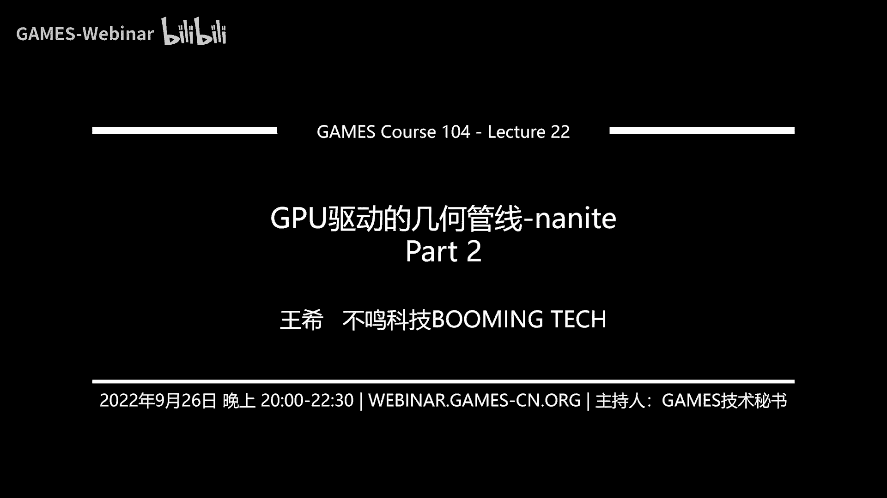
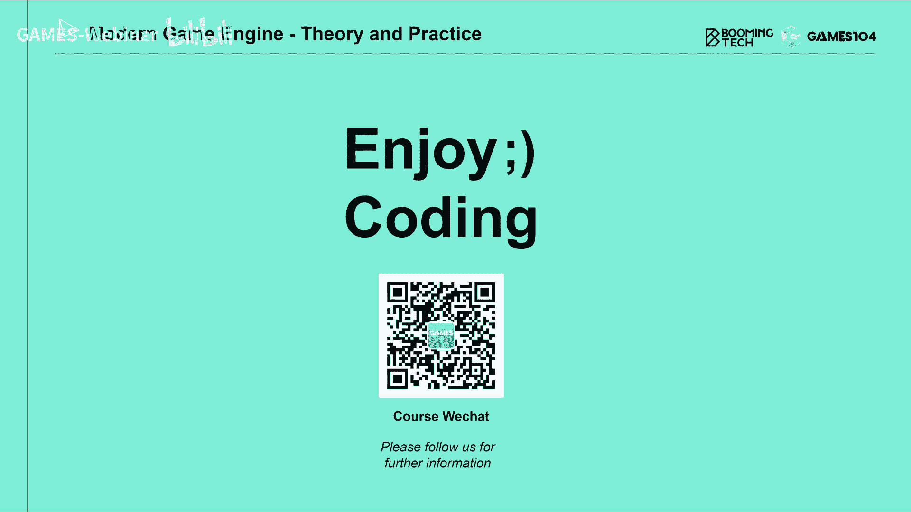

# 22.GPU驱动的几何管线-nanite (Part 2) ｜ GAMES104-现代游戏引擎：从入门到实践 - P1 - GAMES-Webinar - BV17G4y1x7VX

欢迎大家回来，这个我们就开始讲我们的virtual geometry，none night对吧，这是他自己官方给自己贴的标题，其实从这个标题我们就可以看出。

none night这个团队的话确实是野心勃勃，那首先讲它要解决的问题是什么，实际上的话呢，这个是我从他的那个官方的那个塔，叫做journey to the nut中截的这张图。

我个人还是蛮喜欢这张图的，因为其实从我开始做这个就rendering开始啊，其实我们是每一个做渲染的人，脑中都有一个梦想，就是说我们希望在计算机的世界里面，还原真实的世界。

但如果大家真的观察一下真实的世界，你会发现哇这个大自然实在是太美了，我我以前经常举了一个例子，就是说你在海边看那个浪花，去拍拍击那个那个海岸，特别像这种岩时代，你看到那种无穷无尽的那种细节的时候。

你就能知道说哎呀，我们的渲染，其实离这种realistic真的还是非常的遥远，这其实是所有的做渲染的同同学的话，心中的一个梦想，就是我们也希望达到这种，就是我们叫cinematic。

就是电影级的这样的一个精度，这其实也是所有实时渲染的人，他无论是做硬件的还是做算法的，大家心中的这样的一个梦想，所以其实none night，它就是这个作者他一直在思考的问题，就是说我们怎么样子。

在这个游戏引擎的pipeline中，实现这种无限的几何细节，那这件事情的话呢其实啊非常的复杂，所以今天呢我再去讲nana的这个技术的时候，其实我遇到一个非常大的挑战是什么呢。

就是说啊这个技术我读了他的所有的这个，原始的这个文档，我发现就是说其实他比较晦涩，就是他讲的这个东西的话，其实有很多的细节，很多关键性的东西，其实你要花很长时间去猜，所以呢这是我自己尝试整理了一下。

就是今天我讲的第一部分，我想讲就是none night，他最开始的思考就是all of you，就是他为什么选择了这个solution，第二个呢，第二part也是今天的重点，就是说也是nt最核心的。

就是说它的几何到底是怎么去表达的，而且这个几何你没有两个东西，特别容易混淆，一个就是诶，我去cluster构建了它的l o d体系对吧，哎后面他还做了一个叫b v h这个东西，这个bbs他讲的。

我个人觉得是最没有讲清楚的部分，但是后来逼得我们看了很多的代码，才能能猜出他大概是怎么做的，然后呢接下来就讲，如果我们有这样的一个表达之后，诶，我们去怎么去做它的渲染。

这里面其实有很多的很关键性的一些实施，比如说基于软光上化，在这里面起的作用对吧，他是怎么去用这个vivisibility buffer的技术，做shading，因为nat是一个实战型的。

这个游戏引擎技术，所以它的材质会非常的复杂，那么多的材质它怎么处理，还有呢就是说诶，我的材质就有那么多的材质，那么你有了这么详细的几何，接下来另外一个挑战，刚才我在反复强调的是什么。

就是如果你的几何做了足够的细，那你在做shadow的时候，你也就更头疼，因为你的几何的complexity在急剧的增加，所以其实这个时候在虚幻五里面。

提出了一个很重要的技术叫virtual shadow map，我个人觉得这个技术也是非常了不起的，一个技术，那最后呢，其实我个人觉得在原作中讲了大量的什么，我怎么去做streaming啊。

怎么去做压缩啊，我个人觉得那可能是更多的是一些，implementation detail，所以呢当然我会点一下，但是我希望今天的重点是，能够把几何的representation跟大家讲清楚。

这个也是啊倾尽了我们课程组的权力吧，希望小伙伴们不要跟我们砖头，如果讲错了的话，也欢迎大家给我们更正好，那我们先讲nana它到底是怎么个源头，其实呢我个人去理解这件事情。

我首先想到的一个词就是virtual texture，因为virtual texture的其实是啊，如果我没记错啊，是这个游戏引擎的发明者对吧，那个哎叫什么来着，突然想不起来了，对。

反正就是写quick的那个老哥哇，我的我的我心中的神，我居然忘了他叫什么名字了，这个实在是太过分了对吧，那么那个就是他呢提出来的这样的，一个一个一个核心思想，就是说他说呢，我们在一个真实的游戏场景里面。

有很多的物体，每个物体都有自己的tt，这个text数量是非常非常大的，我没有办法这么多texture全部装入内存，存也不可能哦，也谢谢大家在弹幕里提醒我啊，对john k对，然后哎呀。

这个罪过罪过大神的名字我都忘记了，对这个确实是最近脑子里填的东西太多了，ok john camer确实非常了不起，就是他在我如果没记错的话，好像是在quick 3的时代，还是那个他提出了。

就是说应该是q3 之后一点，他其实是virtual text思想，每个物体有大量的tt，这text如果全部加载的内存，显存其实都会炸的，但是呢我能不能给一个budget。

就是说在当前的我的这个相机的位置，我能看到的世界，其实根据近处texture的精度高，远处texture精度低，我实际上可以形成一个texture的这样的一个，a clip map。

那么我可以在一个限定的八gt里面，把我当前view下的所有需要的材质的texture，全部给他cash起来，那这样的话，实际上他就提供了一个unify的表达，去表达所有的材质。

那这样还有更大更大的好处是什么呢，就是说大家还记得我前面讲的传统的render，pipeline里面对吧，我要不停的，我每次换一次材质，我都要切一次他的这个render dd，对不对，我要换一下哎。

我设置我的ab to text是什么，这个这个这个这个这个diffuse texture是什么，对吧，我的那个spectre text，什么那个roughetexture是什么。

那这个东西其实叫起来就很麻烦了，对不对，那如果我把它全拍到了一个巨大的versity，texture里面的话，诶我至少在材质切换这一趴，我一次性就搞定了，这其实是个非常了不起的一个想法。

那个turn rendering的时候，其实tern rendering，实际上用的也是这个virtual texture这个思想，所以这个这个方法呢，实际上对于啊游戏引擎来讲的话。

是一个非常elegant的一个一个一个solution，真的非常的美，非常的美，就是啊大家如果搞系统架构的人的话，就会感受到这种就是这种系统架构之美吧，或者是算法之美，确实他是非常了不起的一件事情。

所以呢我not net的作者，他就在这是我盗用他的p p t啊，这里面我用了一部分他的原始的p p t，就是说他的梦想是什么诶，我能不能够把几何也virtualize变成一个virtualize。

geetry对吧，也就是说我因为我知道在screen space，在我的屏幕上有多少个像素，我的几何数量不可能超过我的像素数量，所以我每一刻，我只要渲染了几百万个三角形就可以了，对吧。

而且我的周末要尽可能简单，但是呢这就要求什么呢，我要对这个几何，这个就是他有个方法能够进行filtering，能够进行进行处理，而且我一旦我达到了每个像素，一个三角形的话，其实我也达到了fmc。

就是说电影级别的这种画质，这就是他的一个梦想，但是真正的挑战是什么呢，就是说其实几何的数据，就像我前面在讲到那个lumen的时候，反复强调一件事情，就是什么。

哎呀几何的数据是一个irregular data，对不对，它是一个就是不是uniform data，那这个时候你对他进行各种处理，比如说这个ping啊，loading啊对吧。

你比如说你的一个index buffer，他可能说我在画一个mesh，他可能在verse，八经跳到了一个非常远的地方对吧，你只能把整个vb搂进来，你不能把它一段段的load进来。

大家想想是不是还有什么呢，还有那个就是说诶我的几何，我的l o d0 和d一的那个match，其实彼此之间可能没有关联性对吧，它是两个完全不同的mesh，当然了。

你可以说有些vertex 5可以reuse，那我可以就同一到vb，但是两道不同的index，但是那个它的filter其实是不连续的，所以jg ree其实是非常难以进行filter，为什么filter呢。

所以大家想要texture对吧，近处你看到非常的细，到远处哎，越来越熟越来越熟越来越熟，对于这种有风的data的话，你是比较好去过滤的，那这里面可以好filter的数据有没有呢，有啊对吧。

大家还记得我在讲入门的时候，为什么我大吹特吹，sdf这个东西确实很很酷啊，就是因为sdf它可以过滤啊对吧，你可以对他信形成各种各样的密码，但是呢sdf实在是太粗了，我没有办法在它直接进行绘制。

那么我还有别的什么方法呢，可以用voxel的方法对吧，用像素的就用那个vocal，就是vocal，不要叫体术，对体术的方法去对它进行表达，我还可以用什么呢，point cloud floud是什么呢。

就是说啊大家有没有用过那个scanner，就是那个呃3d scanner对吧，其实3d的scanner，它扫出来的其实原始数据就是点云，我们为什么看到那么漂亮的几何，它其实是基于点云重建的。

那么这些数据呢诶好像是可以filtering，所以作者呢他就在他思考他自己呢，他把这些东西都全部过了一遍，其实啊我我个人还是蛮欣赏他的工作的，就是说他在决定做nana的这个方案之前。

其实是便利了几乎所有的可能性，比如他讲的worko对吧，那worko呢，这个东西呢确实是一个非常uniform的表达，当然works so有两个很大的问题是什么呢，第一个就是说它的本身的数据量。

其实还是很难压下去的，特别是如果你想表达那种非常高频的in的，这种边界的话，那works slide表达，其实他就要求那个works的精度很高，实际上啊它的数量还是惊人。

诶他的这个数据你对它进行filtering啊，进行处理啊，就变得非常的费，大家还记得我们上一节课讲，len讲全局光照的时候，有一个基于sparse orchestre的方法，去做gi的那个方法。

你有没有发现我讲的那一趴的时候，我讲的就非常的简单，非常的跳，为什么呢，那个算法好像我们没有找到他的source code，我们一直很担心，那个算法自己实现起来会有很多的坑，为什么。

因为他对这个世界的表达太复杂了，那么其实另外一个呢，我个人觉得这是作者非常重要的一个观察，就是说其实现在我们的整个，比如说艺术家的pipeline，比如说你用max maya对吧。

zbrush生成的所有的资产，他都不是基于worker的去表达的，那么如果我今天为了我实时渲染的目的，我要逼着你把所有的asset资产，变成worker li的表达的话，那这个成本是不是很惊人的。

大家想想看对吧，所以说其实也是基于这个原因，虽然worko的表达，有非常好的这种filtering的个性，你甚至它的密铺啊非常的方便，但是的话呢作者到最后还是把它by pass style。

我个人觉得就是存储是一回事，但是这个就是说不你对传统pipeline呢，就传统艺术家的管线的工作的，实际上是啊致命的对，因为我们自己在做一个心情嘛，我们非常清楚的知道一件事情，就是说你必须要尊重。

那么第二种方法呢，其实也是，现在这个就是说gpu猛推的一个东西，就是说比如说我们在看在这个10年之前，我们就提出了这个jb shader对吧，我们提出了这种mesh shader这些概念。

就意味着我们可以on the flight，增加很多几何的这个这个这个就是精细度，以前那个叫什么whole whole shader对吧，还有dman shader这些很奇怪的词。

说实话我到现在都很痛恨这些名词的命名，我觉得明明一个我能懂的东西，结果他名字一命我就不懂了，那他其实核心要解决的问题是什么呢，就是诶我有一个粗的集合，我可以在软碳。

要用类似于这种subdivision的方法，就是把这个几何呢给他再继续细分，subdivision的意思就是细分曲面嘛对吧，我可以用各种各样的样条啊，各种各样的控制点的方法。

可以把它几何面变得无比的光滑，其实这种subdivision faces啊，就是这种几何，实际上呢它有几个特点，第一个就是真正在啊，如果没记错的话，在电影工业里面用的是特别特别多的。

那么那时候你看到的很多几何，它都是a4 边形面，大家想象我们渲染的基本上是三角形对吧，但是哎如果你想用subtivation的话，他说你得要用四边形面，那么这个四边形面呢，实际上在我们的艺术家。

在做这个一些精细的模型的时候，他一上来全部用的都是四边形面，帮助他们造型，对这个跟大家理解可能不太一样，那么好了，我有这样一个四边形面，作为一个control points的话。

那我其实可以形成一个cage，然后呢我可以形成很多很细的几何，那么这个时候呢哎我对它进行细分的话，我就会形成很多我们想要的那种，光溜溜的几何细节，但是呢作者这里面。

他讲了他这个subtification的很多的问题嘛，我个人觉得，其实如果我要去实现一个，像nat这样的技术的话，最卡住我的东西是什么呢，你的subdivision呢，他只能不断的去refine。

比如说美术做一匹小马对吧，他做了一个5000个面的，这个马的这个这个原始版本，我可以把它all the way of sampling到100万个面，没有问题，但是如果这个小马离我非常非常远。

我希望就是几百个面就表达的时候，诶他subdivision不能够往下进行，当三，那这个你会发现就是在not net实现中的话，它每一个对象它其实可以all the way，减到100多个面。

甚至可以减减到一个imposter，这一点上，其实当我在大规模的应用这个技术的时候，肯定就会有问题对吧，所以这也是作者，他自己就是pass掉这个方案的一个，很核心的原因，那么另外一个呢，这也是啊。

我们在这个图形渲染领域里面，讲了很多年了，就是a displaced map啊对吧，这些这个这些这些技术，我可以在一个一个cross的cost的三角形面上，增加很多的几何，这个方法好不好。

当然非常好了对吧，但是作者他就说，如果你要用这个方法去做一些硬表面的时，候，你那个design map是很难去设置的，他说你做出来做这种organic的，这个方面的效果是非常的好。

而且呢它确实可以做ft，但是呢，如果你要表达一些非常硬的一些东西的时，候，它很难，另外一个就是，假设我拿到一个很精细的几何，我怎么去生成一个比较好的design map，这本身呢还是需要一些运算的。

但是这一趴我个人觉得是啊nana的这个技术，大家现在debate最多的东西，如果大家关注最新的这个，nvidia的发布会的时候，你会发现他四零减显卡专门提出一个东西，叫做啊叫叫叫啊。

应该叫michael mash吧对吧，其实也就是说mv的同学还是在猛推，就是说诶基于这种这个gpu的方法，我自动的把你的几何加密，然后呢我还可以在上面做retracing。

这套方法就是不要再用你那么复杂的，哪来的那套技术对吧，所以我觉得其实在未来的10年的话，就是到底是nt这套方法是会成为王者，还是基于硬件的对吧，我还是用这个几何，用硬件去加密几何对吧。

这里面我当然可能用的是map，可能用的其他的技术，然后呢同手环的兼容retracing啊对吧，更复杂的一些光照啊，这个地方是大家，我个人认为现在还没有决出这个生死的，这样一个战斗。

我感觉是我看得非常清楚，就是两派都在这个快速的往前走吧，所以这个呢当然作者会认为，这个方法其实不是特别通用，那么最后一个作者就是这个a提了，提到了就是说诶point in the base的方法。

我渲染结果怎么样，首先pinbase方法做filtering是非常方便的，但是呢，如果你要达到这种我屏幕绘制进度的话，其实他其实那个point of running是在屏幕上叫spring。

就是我打一个个的小小小disco上去对吧，那实际上对于每个像素的话，很可能有很多的overjo，而且你要达到一个比较高的精度的话呢，那个效果其实并不是特别好，其实也是比较大的问题，所以的话呢。

作者分析了这些的表达方法之后，作者说，所以呢我的选择是很明确的，我要选择三角形，因为三角形呢是大家最熟悉，最成熟的一种几何表达形式，整个的这个content pipeline。

就是所谓的比如3d max maya zbrush，这些工具全面支持对吧，另外一个硬件上对他的支持，也是最最成熟的，所以呢它的整个那个无限几何的解决方案，都是基于三角形构建的，所以作者做出这个选择。

这也是none night的一个foundation，那既然我们选择用三角形，那这个几何到底是怎么构建的呢，哎这个真正难的问题就来了，就是在nt里面几何到底怎么去表达好，那其实呢他这他这里面。

作者提出了一个一个一个思想，它的原作讲的是说诶我这个几何数量，int数量可以持续增加，但是呢我希望我绘制的三角形数量，不要跟着它持续的增加，因为为什么呢，其实我个人的理解是这样的。

就是说你无论增加多大的场景复杂度，在屏幕上你的像素数是一定的，对不对，那么好，你有多少个像素，原则上一个像素对吧，一个三角形或者两个三元就够了，那我其实就可以算出来说，在任何一个view下。

你应该绘制多少个三角形，所以说我们有没有可能像virtual text一样，就是根据我屏幕的这个精度，决定了我的这个geometry，诶这个cing的精度，这两个时间能不能建立一个对应关系。

这其实也就是拿来一个，最最核心的一个思想好，那我们有假设有这么多这么细密的几何，我们怎么去表达它呢，诶他首先第一个思想就是说，其实跟刚才我讲的那个就是啊，class based rendering。

我对这种细密的几何，我把它分成一个个的cluster对吧，这是我们的课程组的小伙伴自己做的啊，这个原作没有，我们自己搞了一条dragon，然后呢我们把它分成了无数个cluster。

用的是nana一样的算法，你可以看到这样的很多的cluster，好，这个方法很简单，对不对，好，我有了这样class的表达，make a cluster，比如说是128个三角形组成的，对不对啊。

接下来我就可以做一件很淳朴的事情了，我们这个这也是nat，我个人认为是非常强的一件事情，就是说他的技术可以实现一个叫view，dependent，lo d transition。

就是说对于这样一条dragon，它是有240万个面构成的，对不对，但是呢哦是对2400万的船购构成的，那么当我的相机去看它的时候，我可以让它实现，在近处的这个显示的密度非常的高，但是呢稍微远一点点。

它这个每个coser的精度就会逐渐的降低，这样我能极大的节约我的面数，这一点其实啊也是它和刺客信条那一做的，那个技术一个本质的区别，在刺客信条那个技术里面的话。

它每个instance l o d level是锁死的对吧，你不可能在一个instance里面，每个caster用不同的l o d，但是呢在nt里面他真的是实现了。

就是will dependent这个l o d的transition，这也是他最引以为傲的一件事情，同时也是他整个算法中，我个人认为最复杂的一部分，因为待会我会介绍几个好几个概念。

这个这个概念在原始的这个报告中的话，那绝对是神坑级的这样的存在对吧，但是大家记住一个概念，就是说not that它能实现就对一个物体，一个inst，它的每一个它的cluster会切到不同的。

这样的话能够实现对这个屏幕空间的，这个船口最大化的利用，那么大家可以看到这只龙的话，就是说诶，他几乎用只用了1/30的船狗，就能够实现了，就是每一个pixel，就是每个屏幕几乎有一个三角形的，这个精度。

那他是怎么做到的，诶我们先讲一个最简单的算法，这个算法其实啊，这是我去他原作全部整理了一遍，因为他那个方法以前讲的就是，确实让大家混淆，我们先讲一个最简单的东西，就是说，假设我已经对这个mash。

变成了很多的cluster，对吧好，我假设把每个cluster 22的去合，合了之后呢，我把cluster的团购的数量都减少一半，那我就形成了一个l o d e的，上面的cluster，对不对。

然后呢我假设我下面有四个cluster，我上合一层，我就变成两个cluster，对不对，然后我再往上一层只有一个cluster，那这样的话我就可以构建一个非常简单的，这个就是这个cluster的。

l o t的这个hearchy对吧，那有了这个hy呢，我每一次简化的时候，其实我会知道他的error的对吧，有几何每次简化我的error就会增加，那好在当前的这个view的情况下，我可以算出来说诶。

你这个caster离我的绑定是多少对吧，我觉得能够算出来说，你的误差不高于一个pixel的，这个error tolerance是多少，如果你的class是做几何简化的时候，和你的这个原始的几何。

这个误差小于一个subpixel的话，那我就觉得你可以绘制了，但如果我发现你大于的话，那怎么办，我继续往下走，所以呢我其实就可以decide一个cluster base的。

l o d的这个实时的卡里的这个li，这个是不是很简单对吧，这是个非常难义务的一个solution啊，好诶如果我有这样的一个line的话，大家想象一下，我假设场景有很多很多的几何对吧。

那我是不是我的streaming，也可以用这种方法去做对吧，对于那种下面很细的，但是其数量很大的那些那些翻译脚本，就是精细的几何，我其实一上来可以不加载，我先加载它的扩展的锤。

当我的相机推进那个小雕像的时候，诶我发现那个l o d2 不好使了，怎么办，我就加载l o d一嘛对吧，当我发现我相机太近了，我d一都不好使了，我加载l o d0 ，你发现没有，诶。

这个方法是就又可以实现了，那个拿来最引游也好的，就是这个这个这个几何数据，可以streaming的去加载，你想这个难用的方法，是不是，就基本把他所有的核心的需求全部解决了，对吧。

这就是nana的最最基础的我们去class base的方法，但这个方法有没有问题呢，哎这个方法其实问题还是挺严重的，但问题出在哪里呢，就是说当我对这些cluster进行合并，进行简化的时候。

我只要简化完之后啊，我的三角形数量少了一半，但是呢我不能保证我减耗完的那个几何，它的边和那个没有简化的几何，就比如说我这边的这几个claer，是用l o d0 绘制的对吧，我回到这张图里面。

这几个cos蓝深蓝色的caster，他用的是l o d0 绘制的那个浅蓝色的，l o d e的那个caster呢，就是我被那个姓掐中的那个那个，那个那个就是那个那个coser呢。

他可能是用l o d e绘制的好，那么它两个之间呢本来是watertight，水密性在一起的，但是呢他们就会形成一个我们的叫cx对吧，大家还记得我们在讲turing的时候，会有这样的cx，对不对，好。

那怎么办呢，其实这个问题呢也是一个很好，很好解决的问题，怎么办，我把它的边锁住嘛对吧，就是说我每次简化的时候，我把我的class的边全部锁住对吧，这样所述之后呢。

我这个cluster虽然已经切到l o d一了，但是呢我实际上这就是我跟旁边，你无论是用d0 还是d2 ，我们那边都能够watertight在一起对吧，但实际上你会发现它一直锁的是那个。

l o d0 的那个边，那个边的话呢，三角形随着你的l o d，从012345678上去之后，你会发现，那个地方的采购的密度是永远都是很高的，那很高，那意味着什么呢，意味着两件事情。

第一个你肯定你的面片简化的利用率不高，你想想看啊，比如说我在l o t0 的时候，我我最后占据的就是比如说我的l d 10，那个时候我的一个cluster，虽然只有128个，128个面。

那它所表达的区域，在原来的那个几何中的区域是很大很大的，对不对，但是你要锁边，光你那边的那个是那个船口数量，可能128就远远装不下去了对吧，这个这个实际上你就没法搞了，这是第一点很头疼的事。

第二点是什么呢，就是说这些边假设你不care说我就歪了了，我对高高级的l o d4567 的话，我就不加那个，128个三角形的约束了，对吧好，我这边就放在这儿，其实你会发现这个几何啊。

当你去拉开来的时候，你会发现有些区域，它的几何的密度和它整体的这个密度啊，其实是就是就是nine uniform的，这个在信号采样上，你会看到一些artifacts，就是你会看到一些非常明显的那种地方。

就是看起来也是连续的，但是你会notify那个地方好像很密，举个例子，这种感觉像什么呢，就像是两件衣服对吧，两块布你缝在衣服的缝合处，你可以看到那个地方，好像有秘密的缝合线的感觉一样。

因为那个地方加了很多几何细节，但是他其他面上的细节全部都没有了，你会notify，就人眼是这样的，人也是一个很神奇的设备，就是我们人的大脑和眼睛，其实对高频信号非常的敏感。

特别是对于franky change，就是频率发生变化的时候，我们人眼的detect的能力是非常非常高的，这个大家如果做render，你就知道就是说其实你从数值上看，它的artifact已经非常小了。

但是呢人眼总是能注意到这些artifact，所以这个地方的话呢，也会产生一个很严重的问题，所以大家会发现没有哪一种方法它work对吧，如果这个方法work了，我们就很省事了，那今天的课程讲到这。

我就可以回去睡觉了，就可以休息了对吧，但实际上的话呢这个方法是不work的，那怎么办，哎，not nice就提出了一个非常神奇的一个想法，这个想法，其实我个人觉得还是非常的惊讶似的。

就是说他把这些cluster 10几个cluster，我变成一个叫cluster group，这个数字我有点忘了，是八个还是还是16还是32个，但是反正不重要，他自己选了一个数据。

那么我的l watch锁整个classer group的边，我里面的这个in inner的这个age啊，就是这个coser之间的boundary啊，全部打打打碎掉，你们就一起去简化，这样的话呢，就是说。

我实际上能够最大化地利用这个，简化所带来的好处，比如说我一个cos 128个三角形对吧，那我假设那个我把16个cluster，聚成一起的话，那我将近有2万多个三角形，对不对，好。

我把这23000集合到一起，我还是锁它的边，这个边可能就1000多个三角形，但是呢，我把2万个三角形减到1万个三角形，这时候你就会发现，它的边其实没有那么痛苦了，而这个时候诶。

我的简化就会变得更加的有效，那么这样做的一个这样做，这样做下去的话，你会发现，他接下来对于那个简化过的那个，1万个三角形的再做一次cover class，他把那个class的数量一下子就减了一半。

这里面就是他原作给的这样的一个案例，就是说诶大家看这四个不同的颜色，就代表了四种不同的caster对吧，那个就是黄色，红色，绿色和蓝色诶，这是代表四个相应的点，就表示caster。

然后呢我把它们合成一起，变成一个class group，然后我整体做出简化，但是它的整个class的外边我还是保持住啊，因为我要保持它在l o d transition的时候。

是what tight的好，这个时候我就会得到就是三角形，数量减一半的三角形，然后呢我再去run co，我就会得到大概少一半的cluster，比如说你们这两个coser，你会发现。

这个时候他就一个很有意思的事情，来这个这个地方也是哪里来，大家特别容易弄混的地方，就是你后面的class数量上面只有两个，但是它和下面的那个class之间的，父子关系的话，不是我们传统理解的树状的。

就是一对一的关系，它是一个一对多的关系，也就是说有可能简化过的cluster，每个cluster实际上是和下面的四个的，l o d0 的cluster都有关联关系对吧。

简化的l o d e的两个cluster，他两个是兄弟关系，这个关系其实是非常非常重要的好，那么它的整个这个算法的核心，就是说，我每一次把这个现在当前的这个l d0 的，比如说l0 。

所有的cluster把它先变成若干个group，然后呢我在group内部做简化，然后简化完之后呢，我去做简化，把它再分成cluster，这里面一个很重要的一点是说，我分成l o d e的。

比如说我假设在l o d0 ，我有2000个cluster对吧，l l o d e的话，2000个cluster，比如说我们十个cluster，一个group，我有200个group，对不对，诶。

我在l o d一的时候，我有1000个cos，对不对，那我这个时候呢，还是用一比十的比例把它变成了，比如说啊100个group，但注意这里面100个group和那个两，以前那个200个group。

它的边界是不保证是一致的，这也是它最核心的一个思想，为什么呢，这样就保证了什么呢，保证了就是当它在l o d切换的时候，你看不到一个持续存在的一个boundary，那个boundary。

否则的话就会一直出问题，好那这个东西是不是很复杂对吧，来我们的课程组的小伙伴，也发挥了我们的这个土法炼钢的神功，我们就开始用not a的算法，来去做了一个实验，我们拿可爱的班尼做了个实验对吧。

这是一个bunny，那用nt的算法，你会发现诶他生成了这么多的claer对吧，这个看上去，这些每个coser大概是100多个三角形，128个三角形诶，下一步干什么事情呢。

我们把caster把它聚类成一个gp，大家注意到这个课件上，那个红色的那个区域，那就是呃大概是十几个哦，16个cluster给18coser是吧，我们变成了一个coser group。

然后呢我们对这个coser group进行一次简化，那么按照课程中的那个按照那个原文的话，你可以发现，就是一开始是那个秘密的cluster对吧，然后呢我们把class cop融合在一起去。

对于整个功夫进行了一次简化，简化完之后呢，我们再run一次classroom，你会发现得到了一些新的cluster对吧，而这些新的cluster呢，和老的cluster之间的话，实际上是不再是一一对应。

而是是说在这个l o d e里面的，这个class group的所有的cluster，可能和d0 里面这个class都是有关系的，因为这些三角形被reuse了，唉这个结构就会非常复杂了。

这其实也是nana的，大家特别容易弄混的一件事情，就class group到底是什么东西好，你有了这个group之后呢，你会发现就是他为什么要这么做呢，其实啊。

他希望每一个每一次这个group的boundary，在不同的l o d里面，因为group boundary是什么，在做l d的是什么，需要它的边的精度是要锁住的，大家还记得吗，他一定要锁住那个边。

那么他希望这个被锁住的边啊，在每一层lo d的时候，它都会变换掉，这个很像什么东西呢，哎我自己一个土法炼钢，就是说很像你在做这个，比如说做这个三破零的时候。

你比如说你做那个呃screen space ao的时候，你的采样那个r的分布，你每个pixel你希望他做一次接触，如果你不做杰train的话，你会发现你这个noise是很有pattern的对吧。

你会注意到那个pattern，但其实他在这个几何采样的时候，他对他每一层的l o d的时候，他是强迫的把这个boundary做了一次gl three，所以使得你当这个几何在进行l o d调。

就是随着你的相机的移动，它的l o d在不停的popping popping切换的时候，你没办法定死住，一个，就是说诶，一个你能注意到的一个高频的数据，因为那个高频的区域，在每一层l t变化的时候。

它都会发生变化，这样你人眼就注意不到这样的一个，清晰的这样一个锁边的boundary，它实际上我我用最土的方法去理解，就是他就接触，但这个方法说句实话，我认为是非常非常巧妙的，真的很巧妙。

那么这里面的话呢，所以这里面的话，这个图是很多人会弄混的一件事情，就是这张图实际上不是classer boundary，它是classer group的boundary。

比如说红色的表达的是他的l o d0 的，所有的class group boundary，哎当我这些group里面做简化，然后呢我再去做classroom，然后呢我再去跑一次grp的时候。

我可能得到的是这些绿色的这一层，你会发现绿色的这个边界，好像和那个红色的那一层就没有关系了，对不对，那我们再往上走一层，诶，那我到l o d r的时候，我这个class group就越来越大，那么它呢。

实际上和这个就形成了这样一个套接关系，这个图的话呢，实际上是理解nana的几何的基础的一个，非常核心的一张图，也就是你会发现它这个用一个，非常巧妙的方法，把这个我们以前在做l o d。

这个transition的时候，要左边的这个挑战给它彻底的给它解决掉，那么在这里面特别容易混淆的是说，他这里面展示的不是cluster，而是cluster group，好。

那我们有了这样的一个表达的时候呢，原作给了这样的一张图，就是说你看我们基于这个，我们构建了这样一个漂亮的deck，deck是什么，deck就是一个有向无环图对吧，但是你们看这个deg。

是不是不像一个复杂的这个有向无环图，更像是一棵树对吧，所有人看到这个都觉得哦，这个这个就是我基于这个class group，我去merge的时候，那这里面每个节点它到底是这个啊。

到底是cluster呢还是cluster gp呢，对吧，其实这里面画的每个东西它是一个cluster，但是class之间的关系，它这个图画的实际上是有问题的，因为你到了l o d一到d2 的话。

它的连接不应该是那么干净，实际上它的连接是非常非常复杂的，所以呢我们课程组呢，基于我们翻看了源代码，我们画出了我们的版本的这个图，它为什么是个deg，而不是tree，实际上这个图应该长的是这个样子。

就是说首先大家看l d0 ，它下面的是同一个颜色，它其实表达的是在l o d0 里面，一个class group里面所有的cluster对吧，比如说红色的那些class group。

蓝色组的class group，那个绿色组的class group，然后呢当你对它class group进行简化，你就可以得到了l o d e的那些cluster。

然后呢在l o d e的那个coser呢，你会发现，当你再去run一次这个古品算法的时候，它实际上会和以前的l o d0 的那个，cluster功夫的关系是打乱的。

你会发现我们用每个框表达一个class group的话，那实际上你会发现比如说在l d e的时候，左边这个classroom里面，它有一些cluster。

指向的是这个红色区的cluster 0 level 0对吧，有些是指向，有一个是指向蓝色，就是那个蓝色的class那个group 0，那么在另外一个侧的class group里面的话呢。

它也是这样去指的，所以这一张图的话实际上是none night，最重要的这张dg这个图，其实如果大家对这个图不理解的话，你后面他几乎所有的算法都很难理解，这个图我可以讲我们课程组吵了三天三夜。

昨天夜里两点钟我还在电话，那个我们在视频会议里面，大家还在吵架，说中文到底是怎么回事，今天早上一时兴起打开源代码，一通看完，终于把他看明白对吧，这简直是个神坑，因为这张图说实话。

画的绝对让大家很confuse，这他妈到底是为啊，这为什么一定是个dg，这很明显看上去是个数吗，但实际上的话呢，这一层层的cluster之间的连接的话，其实是这样的关系，这里面的话呢你可以看到乱中有序。

首先是乱，就是说他l不同层的l o d之间的这个，caster之间链接啊，是多对多的链接，对不对，它就是每一个底层的cluster，他可能有multiple parents对吧，就是他上一集有多个。

那么同时的话呢它有趣的地方在哪里呢，你会发现他虽然说它的parents可能是多个，但是他不会和上一集的所有的这个，同一级的coser都会建立，这种就是parent的关系，它只和由我自己做简化。

就是simple带上去的那几个cluster有关系，所以他的这个影响是一个在localized的对吧，那么这个的话呢，就是说是一个很重要的一个系统，很重要的一个结构，你有了这个数据结构之后。

你就能理解他后面的l o d是怎么做的，哎这张图大家一定要记得，我们后面还会再出现一次呢，大家不用着急，好好，那这个时候呢，我们还是拿我们可爱的班尼做案例，你会发现这就是我们课程所拿到的算法。

去跑了一遍，你看l o d0 的时候，class我就切成这样了，那我们到l o d e的时候，按l d2 来，我们跳了几局啊，你看见这个classr已经变成这个样子了对吧。

那他l d4 的时候一class这么大，到最后那个l d的时候，它大概是128个，就是那个班里就变成这个样了，所以呢，其实这就说明了他的那个原来的这张图，的解释啊，是对的。

就这张图也就是说它每一集的classer，这个boundary确实一直在变，class group boundary，所以你不会就是当我们在这些cluster，来回切换的时候。

你不会注意到一个consistent的那个bdi，让你注意得到哎，这就是拿来它是一个很巧妙的一个东西，但是呢这个漂亮的架构呢，实际上你要去维护它，是这个非常复杂的这个deck对吧。

这个deck我去做l d怎么做，是不是很复杂，所以呢接下来就进入none night，第二个我认为比较难懂，大家特别容易computer的一个地方好，那这里面有个细节，就是这也是我对原作者。

非常震惊的一个地方，就是他花了很多笔墨，讲了他怎么做这个simplification，对吧，当然我我觉得他讲这个也是有道理的，其实我个人一直认为就是mesh supplification。

但是呢确实他讲了一件事情，我认为是对的，就是说如果你想实现not net的算法的话，你对他这个error的计算一定要准确，因为你的l r计算一旦不准确的话，当你的相机推来推去的时候。

你可以注意到就是noticeable的这个poppy，当然他他要保证，就是每一次我的error都是subpixel，而且呢其实他后面还提了一个要求，就是我需要它每一层error往上去传递的时候。

必须是单向累加的，这个累加其实是非常就这个单向增加的，这个单调性取值也是非常重要的一个设定，我们待会儿再去讲，ok但这个地方的话，我觉得这是我们课程组做的一个案例。

就是说他是你是首先生成的classer，它把这个class之间通过链接关系呢，生成了一个graph，然后呢用mice这个中间件把它聚类成了group，然后呢一个grp里面的话呢。

我用这个就是simplification方法，基于这个q e们呢，就是那个这个这个codrick的，那个error metric的这个方法诶，我对它进行了一个简化，简化之后呢。

我又对它进行classroom对吧，我又可以形成我新的部分，它大概是这么一个pipeline，好，那有意思的问题就来了，我既然已经构建了这一个看起来有点像树，它又不像数的这么一个。

deck的这么一个结构对吧，所有的classer从l d0 ，l d e l d r l的adn全部构建起来了，我的软碳，我给了你一个相机位，我怎么去选择它的这个l o d level。

这个问题其实还是蛮挑战的，那么如果我们现在用view dependent的方法，我们去去做它的这个level的话，就是说我们最简单的做法，就是我在这个deck里面去从它的根节点。

因为它这个代表到最后的根节点，是一个cluster，你去看看源代码，你就知道就是他最后发现诶，我的cho只是只能生成一个，只有一个cluster的这样的一个case，说我的这个合并就停止了。

好那我知道他的error对吧，我就根据我的view，我就不停的问我的error够不够不够，我就往下走，就是说我实际上呢，他把这些同一个cluster group的东西，做成了一个大的虚拟节点。

整个这个节点有一个error，有个绑定，那实际上我是不是就可以知道说哎，我对这个group我是不是可见啊，是不是需要被cut掉，如果不要不需要被cut掉的话，我继续绘制它，但是这样的一个dg啊。

你去traverse，他的话是不是还是比较费的，比较复杂的对吧，就是大家想想，这个算法写起来有一点头疼了，对不对，那么好，作者在这边的话呢，提出了一个很重要的思想。

就是说首先他认为你的这些cluster，如果都属于一个group的话，如果我这个caster group如果要往下去绘制的话，那所有人如果选了l o d0 。

那我所有的cluster in the same grou，都要被画成l o d0 对吧，如果我不是l o d0 ，那我就不画，这个想法其实很淳朴，我认为也是可以理解的，这个问题不大。

这样的好处是什么呢，就是它的l o d的选择是比较快的，但是真正最难理解的是什么呢，就是说实际上所有的l o d问题，你在这样的一个类树状的结构里面，你其实找的还是那一条的cut line对吧。

那么这个cut line的话，你想啊我们真实的一个几何，比如像我们做的那个dragon那个例子里面啊，那个例子里面大概将近有1万多个吧，1万多个这个caster，那我把这1万多coser。

以及它构建的那一层层的lled结构，我把它整个traverse一遍的话，大家觉得这个速度是不是会非常的慢，那大家想个办法说，我能不能让我的这个l o d的selection，全部的并行化。

也就是每一个单位，每一个啊指数或者每一个节点，他自己决定我在当前的l o d下，我到底是绘制还是不绘制对吧，比如像这个图像里面，就是说那条被黄线勾中的那些顶点，就是我要绘制的，没有被各种。

我就不绘制对吧，那这样的一条cut line的话，他最好是deterministic的诶，这个就是对于这种dg的这个结构啊，大家会发现，如果你真的假设，你对他的不做一个单调性的约束的话。

你这个数从左向右便利对吧，从上向下深度遍历对吧，或者从右向左边离，你，在数学上，你会发现它有可能这个cut是不稳定的，那么如果这个cut是不稳定的话，你知道会出现什么情况吗，大家还记得我在我在前面讲了。

那个那个算法的时候，就是说他可能会出现the fighting啊，popping啊，就是说诶你的camera没动对吧，这一帧和那一帧算法上，只是因为那个就是b型化的这个计算，它提交的这个先后顺序有。

那么这个，这个这个就是亿万分之1ms的区别，导致了他们的数据就fight了，fight之后这个结果就不一样了对吧，那所以他就希望说唉我的这个决策的话。

同时的话呢它的结果必须是deterministic的，那怎么去做这件事情呢，这也是none night，我觉得很重要的一个点，就所以我这个标题我自己优化过的，就是我觉得如何paralyzation。

第一个呢他要求这个deg树上的这个error，它是单调性的往上涨，因为如果你的单调性的往上涨的话呢，你给我任何一个error sours hold，他的这条cut线一定是唯一的。

哎这个在数学上大家可以去证明一下对吧，第二件事情是什么呢，就是说到底每一个节点，它到底是怎么样的决定，我是否可见的话，它实际上呢你从树的根节点往下去，便利自然是一个解法，但是呢你这个数的便利的话。

其实你很难把它做的并行化，但是他后面其实有个方法并行化，待会儿再讲啊，但是这个并行化的话很麻烦，那他想了一个方法，就是说其实你要的东西是什么呢，对于任何一个节点，他要被渲染，其实要满足两个条件对吧。

第一个条件呢，就是说我的我的父亲的那个节点，他的error要大于你给定的这个threshold，对吧，同时呢我自己的这个coser，我的error要小于和等于的，那意味着我这个caster是可见的。

所以说其实我并不需要把这个树上的，所有的节点，按照你的那个顺序就是遍历一遍，就一定我并不一定要按照从root往下便利，其实我把这所有的节点全部拍平，看成一个列表，我就用这个方程去验证一遍了。

假设我每个节点会存一下，我父亲的arrow的话，实际上我就可以把一个数的traverse，变成一个raid traverse，这个这个地方是有点抽象了，但大家一定要理解，因为你不理解这个的话。

它这个地方其实核心的想法是什么呢，就是说这样就使得每一个节点的l o d的，decision能够并行化的进行，否则的话，我就必须要按照数的结构去访问它，那按照数字结构访问它，随着你的树的深度的话。

我的访问的效率就会下降对吧，如果我并行的话，我一次可以32 30个往里面扔的话，我的效率是不是更高，对不对，这就是它的一个核心的想法，而且呢在这里面还有一个细节是说，在这一颗带给里面。

他去做这个l o d selection的单位到底是什么，是每个卡cluster自己做这个我的检测呢，还是以cluster grp为单位，那我接下来会讲这个细节，这个细节也是特别容易混淆的，实际上呢。

我们看到它的代码是以claser group为单位，但是呢又精准到每一个cluster，但是它核心的想法就是每一个检测，它都是isolated的，其实在这个它的这个数里面，它存储的呢。

就是他其实这个时候已经不需要输了对吧，他其实把每一层l o d0 ，l o d e这里面的cast group变成一个节点，这个节点它可以拍平，但是每一个节点呢它存两组数据。

第一组数据呢是我的parents对吧，比如说我假设我的l o d里面，这个group是有四个caster组成的，我把它四个简化成两个的话，那我这个简化过程中产生的最大的erro。

就是我的parent error，我存在这假如parent error是1。2放在这，然后呢我自己本身的话，比如说l o d0 的话，它实际上是没有l的，对不对，但是呢你哪来的，实践中。

它有一个小trick，它会把这个强制制成-1对吧，很有意思，他就好mark一下，就是说你看我这个是绝对正确的一个几何，但是这不重要，反正是他的细节，他就往上这样做，但是核心反正-1比零小嘛。

所以没有问题对吧，那么好对于那个在l o d一里面，大家可以看到有两个cluster，一个是红色的，一个是那个绿色的，那其实呢它也会存一个我的paraerror，和我们这个cluster。

因为我行过来的话，我各自的error你会发现，就是说它们源自于同一个，就是低级的l o d group of class group的话，他两个简化过了caster。

虽然它们分属于不同的l o d一级的，classroot了，它的error两个class error是一模一样的，诶这个是很重要的一点，就是他们在做网上合并进行简化，即使简化完之后。

即使分成两个不同的coser，它的error都是取得这次简化过程中，产生的最大的error，好那这样的话我这就意味着什么呢，就这里面在这张图里面，假设我的输入是threshold的一点。

这个ao你不能超过我对吧，诶我对于这三个cluster group对吧，有两个是属于l o d1 ，有一个是属于l0 ，我怎么去计算呢，哎很简单，首先我检测第一个条件就是我的parent error。

要大于我的这个ths hold，你会发现这三个cluster都满足你的需求，对吧，我的在lv 0的时候，parent是1。1没有问题，你大于一了，第二个呢led的那个就是那个蓝红色。

那个l d一里面的那个红色的class group呢，他的partnl是1。2更大了对吧，因为往上以及它会变得更大了，好，你也满足了，那个绿色的那个l o d e的cluster，他也满足了，他是1。

4，好都没问题，好我们再看下一个问题，诶，这个地方的话其实是原来pp，就我觉得这块写的不算严谨，应该叫for each cluster in the class group。

你的cast error如果小于等于ths hold的时候，哎，我这个时候，我认为这个cluster就可以被渲染，但是对于我们这里面给的这个案例里面，比如说在红色里面，那个1。1的那个黄色的那个。

就是那个红色那个l l o d y，l o d e的那个class group里面的话，那个1。1等于l的group，他还是不满足这个条件，所以它的下面的那个class group。

那个它这个东西就不会被绘制对吧，那么对于那个绿色的l o d e的，那个class group来讲呢，在l d里面它也一样不满足，所以那个紫色的class group也不会给大家，这个大家就会去想了。

说因为我不会被绘绘制，所以呢我要激活我的children的这个class，对不对，但其实这个地方如果你这么想的话，就意味着你没有理解这个并行化的这个，l o d selection。

实际上每个class group里面的每个classer，他只是做自己的检测，就是相当于是说我那个红色的框class group面，假设有四个class的话。

他每个cluster只是自己决定说我是否会制，但是因为我不会制，所以我需要我的child这个哦，我的下一集的那个l o d0 的那个东西，绘制的话，这个决策跟我没有关系，但是呢因为我的这个error。

他严格的网上传递的话，当你做到那个l o d0 里面，那个绿色的卡斯库的时候，它的数据上一定会满足，说他的paraerror是1。1大于一点的，这个sal的，但是呢他自己的error的话。

应该是-1小于那个一点，所以他这些就是d0 里面的四个小classer，全部会被绘制一点，唉这一点是特别特别容易混淆的，就是大家会天然的认为是说诶，我的上一级的l o d发现没通过，我就看我的下一集。

其实它不是的，他把整个这个树的结构全部拍平了，哪个class不是我自己处理，当然你会发现，就是只要你保证这个error的话，是严格的单调的网上传递，而且我下一集的那个parent error。

一定是跟上一集那个对应的cluster的，那个自己的error是严格一致的话，你会发现这个测试出来的结果，是严格一致的，不会出问题，而且几何不会去渲染两次，这其实是作者一个非常核心的一个，一个想法。

这个想法非常的巧妙，实话实说非常的巧妙，也就是说，因为以前当我们在做一些l o d的时候，我们会天然的会做一个树状结构嘛对吧，那我们对这个l o d树的这个处理的话，天然的就会树状的一次一次下去。

但是的话not net这里面的话，他因为意识到，就现在gpu的b型化处理能力非常强，他就希望把这个o d的selection，变成彻底的b型化的处理，所以很遗憾在这个原原始的这个ppt中的话。

这个作者把这个事情就是，几乎是一一笔带过，nana的技术的时候，会发现这一part是非常非常难以理解的，而且它的源代码中写的是叫club，这个叫class error，小于s的对吧。

但其实他是class功夫里面存的是paraerror，但是呢它这个功夫里面的话有一组cluster，所以每个coser自己会称自己的error，他要所以说这个比较的话是在鼓舞里面，每个l自己去比较的。

然后呢各个class group的l o d的selection，就是我到底是绘制还是不会知道，但是你会发现它最终的结果一定是对的，这也是not net非常巧妙的一个地方，好这个给给他那个点赞的时间。

差不多到此结束了，就不点他的赞了，好那么实际上的话呢，这就是它的整个基于class group的构建了，这样的一个hy的这样一个结构，我可以b进化的决定他的similar那个d。

但是呢诶作者的第二排就来了，我觉得这样虽然我还是可以并行化的做，但是毕竟class的数量太多了，而且呢我的cluster的这个这个，这个数量还是很大，这时候作者就提出了一个很很牛逼的一，个想法。

在这个他的自己的报告中的话，整个这个东西是在一个页面下的，很小的一块，说我构建了一个b v h4 对吧，把所有的children的这个l r全部maximum在一起，然后呢。

所有的l o d ection了，我的天哪，这么复杂的一个算法，老人家用三句话就讲完了，当时哈我自己读到这一趴的时候，我就觉得啊这真的是太难理解了，对吧，然后又是被逼着我们课程组的小伙伴。

又开始钻进代码里面一通狂搞狂研究，然后就就去仔细理解这个我们的原作者，他这个b vh到底是怎么构建呢对吧，这个地方我确实要小小的吐槽一下，就是这个presentation确实是没讲清楚。

但是我猜可能是有意的吧，这么高深的算法，怎么可能让我们这种凡人学会呢，那没办法，凡人也是要修仙呢，所以凡人也是很努力的去理解先人的想法，其实这个想法的核心是什么呢，唉这是我们课程组自己画的图啊。

这个也有，我真的要给我们课程组点赞，就是说其实啊这个bbs是非常的抽象，但是呢他它的实际的情况是这样的，就是说对于这条龙而言，那其实你如果你的l o d0 所形成的，所有的class group。

对不对，那么你可以把所有l o d0 的class group，用一个bbs的方法形成一颗tree诶，那同样呢对于你的l o d一所有的cast group，你是不是也可以形成一个bh tree对吧。

那么l o d一直到l o d n它都能形成bh，然后呢他把这些所有的tree的节点诶，把它连到一个共同的根节点，它就构建了一个超级的b vh tree，他为什么要做这样一件事情呢。

这个事情其实是有很深的道理的，就是前面我一直在讲这个，这也是作者，我觉得一方面大谈这个诶，我的l o d selection，我要paralyzation，但是他又意识到，就是说。

但其实你只要处理的class grp，数量实在太大了对吧，那举一个例子，比如像这条龙，它有700万个三角形，那我会生成11万个cluster对吧，group的，那么group的数量也是几万个。

那我每一次在一个camera的情况下，我要把这个啊其实比11万还要，比那个就是1万多还要多，因为你是1万多个，假设一比十的换算，一比11000个。

cluster group在four l o d0 的话，那你再往上l d一是多少，是5000多个对吧，l d2 是2000多个，把你这个二的密大概是2万多个，这个class group对吧。

你把这个数据就是即使你用并行的方法，把它paralyzation一下，这个效率其实也是很低的呀，啊作者这时候突然意识到原来不香啊，就是这个这个traverse，一个array的数据是很不香的。

那怎么办呢，哎传统艺能来了，我们给他把这些所有因为每个class group，你可以想象成一小片几何吗，它有那个绑定嘛对吧，那这个在空间上的物体块，而且大小都差不多，那我最优的组织方式是什么呢。

我把它升成b vh嘛对吧，而且b vs里面的它这个error的话，我可以取他的这个绑定，我可以取他们的和诶error，我取它们的最大，这样的话，当我的相机看到一个就是一个cluster。

一个一个一个一个物体的时候，比如说对r o d0 ，他跟这个物体如果距离我很远，他这个那个绑定的话，离我最近的地方可能距离我可能10米对吧，然后呢，l o d0 上它最大的l也是-1对吧。

那整个这棵树就这1万多个class grp，我是不是完全不用traverse了，对不对，作者真的是大聪明啊，这个地方它突然又意识到树的好处了，那好我这个这个地方这1万多个class gp 9。

我就不用看看了，那同理l o d1 ，如果10米之外，你可以把整个这个l o d e的这个，这个class groups全部cut掉对吧，那你可能到l o d7 的时候。

你发现这个error我需要notifine，然后呢你平时在里面去traverse了，所以说其实啊怎么说呢，他这个时候这个思想就比vh的话，实际上又引入了。

就是我们以前在做这种with bility的时候，经常用的这个方法，但这个方法有没有道理呢，我个人觉得，虽然我这个觉得他讲得实在是太过分了，对吧，就这几句话，但是呢我个人认为。

这个方法其实对于nt来讲非常的关键，因为确实对于这么高精度的几何的话，如果你即使把所有的coser group traverse一遍，这件事情，它的负载也是惊人的，想想你场景有那么多的物体怎么办对吧。

所以的话呢它构建这个b vs b vs tree的话，对性能的影响非常大，但是这里面为什么它可以就是不用l o d，01234构建了一个tree，它反而把零的节点认成一个税一的节点，一个成一个睡。

实际上这个考虑是很聪明的，为什么呢，对于很多时候，这个物体啊离我的距离可能有点远，比距离我5米，距离我10米，有的时候距离我20米，对不对，这个距离在游戏场景里面不算很远对吧。

但是很可能你的cluster group，数量最多的那个case，那么多，卡斯可以全部不用traverse直接给剃掉，所以那一棵树整个就被踢掉了，所以说这个呢，实际上是作者一个非常聪明的方法。

但是呢确实实话实说，就是在它的原作中没有讲清楚对吧，所以我们课程组绞尽脑汁的时候，把这张图画出来了，同学们就明白了，那这里面特别容易confuse的东西是什么呢，这是啊，其实我们把它那个。

整个那个树都给倒出来了对吧，你会发现他把这些所有的这些l o d的，这些group全部构建成一棵树，它还有一个小trick，就是说诶我我尽可能build一个，就是说这个这个张度为四的这样的一棵树。

它其实做这个大家如果以前学过数据结构，就学学过叫树的那个平衡嘛，我把树原来不平衡的数，把它变成平衡数对吧，否则的话这样让我的这个这个数的便利，尽可能的效率高一点，但这里面有一个有一个细节。

就是说在他这个b vs树，树的这个叶节点里面，挂的是一个个的classer group，不是一个个的cluster，这也是一个大家很注意的一点，但这个点呢大家如果讲错了，大家也可以去查一下。

反正我们是花了很多力气，去研究它的源代码，去看待这件事怎么做的好，那其实呢你有了这样的一个结构的话，实话实说，这里面也是他的自己的一个demo对吧，这是600万个三角形的一个一个case。

那么它会合成多少呢，大概会合成这个就11万cluster，那么如果我们当我们构建了b y h的话，实际上我们大概只check了107个，比vh nose，你看从11万变成107。

然后呢我们只需要去check 4000多个class，这比11万几乎少了，将近有大概有20多倍吧，将近二三十倍左右，然后呢你最后可见的大概是2000多个，所以这回让这个算法变得真正的可以实战。

所以之前我刚才讲的，就是说b y h这个东西的话呢，对于nt来讲，其实是个很关键性的一步，如果他不做这个的话，只用我们上一节就上一章讲了，这个算法的话，其实他实战中的效率是很低的。

所以我认为这个事情也是很关键的一步，那么接下来呢就是原作者是大谈特谈的，就特别得意的说，哎呀我有了个b bh对吧，我怎么去traverse，他呢，他说哎呀传统的方法对吧，我就在这棵树。

我就一层层的去traverse，第一层把根节点扫一遍，产生很多新的子节点子节点，然后呢我扔到新的任务thread里面，我再去跑，然后呢再形成第二层，第三层它是这个方法特别的慢，那怎么办呢。

哎它实现了一个小小的类似于这种，那个就是job system，大家记得我们在前面那个d o p job sister，讲的，就是说诶我把很多的walking thread固定下来。

然后呢我是用一个pmc的方法，就是multiproducer muli consumer的结构，然后呢，就是说我在我产生了任何一个子节点，我就直接扔到一个我的task q里面。

那现在这个walking read里面只要有个thread空呢，他就把这个q把这个任务捡起来，他就处理掉了，就是一堆人往后面opending任务，一堆人的用前面的指针去取任务对吧。

就是这个这其实是一个很简单的一个结构，当然了，因为它要依赖于现在的这个显卡，就是这个computer shor，它其实可以实现，就是叫多很多个working read，之间可以共享一个p对吧。

它可以实现这种原子化的这个锁定，所以能做这件事，实话实说呢，作者在这个这个报告中，大谈特谈的这个这个这个设计，但是我个人觉得，这就是一个实现了一个小trick，然后呢大概大概实现了10%到。

他说10%到30左右的acceleration对吧，但实际上其实我觉得他比bh，是它最核心的一个思想，但是的话呢，就是我们的traverse，速度会变得稍微快那么一丢丢，而且这个方法呢。

我个人觉得大家如果理解了，什么是job system的话，你可以理解成，就是说我在这个就是computer shor上，利用那个compusher，他一次性发出32个walking read的。

这个设计的话，把它32个threat，我可以re全部固定住，然后呢做一个公共的task buffer啊，那个就是to be handle task buffer，然后呢我这头往里面扔入啊。

这头往后面ending任务，那一头呢取任务就好了，两个指针就完事儿对吧，所以的话呢，这个啊是一个作者的一个小的trick，我个人觉得应该比较好理解，那么这样的话讲到这一part。

我觉得none night最复杂的几何的表达，终于就讲完了，我不知道同学们有没有听懂啊，如果大家听不懂的话，我们会再想办法对吧，我们还有二零系列的课程，对不对，虽然我每次跟我的团队讲，二零系的。

可能大家都会说，求不要再做二零系列的课程，实在太累了对吧，ok那我们先把这个坑留在这儿吧，那么好，那有了这样的几何的时候，接下来我们讲讲nmt到底怎么渲染，它想渲染之前呢。

先讲一个他自己特别引以为傲的东西，就是nmt，我们去做rts ation，那为什么要去这个russell zation呢，其实nana，如果达到这么精细的一个几何密度啊，它其实很多三角形。

已经和屏幕上的像素差不多大了，那么如果跟屏幕上像素差不多了，那我三角形的绘制到屏幕上，我们用的方法是什么，诶我们用的是这个硬件的ross rozation，对吧。

大家传统我觉得硬件的ross应该是最快的，肯定比我自己写设计点快了啊，确实是这样，但是呢其实硬件的reservation的话呢，实际上它有一个假设，首先在硬件中为了处理。

我们在做这个texture sampling，你们的dx d d y，他每一次rose rozation的话呢，它一般至少会rose rise，就是2x2的pixel。

这样我才能算出它d d x d y，第二个呢就是run的算法呢，它是一个高度优化过的算法，就是在古典时代啊，我们的三角形都很大，那么我们去对这个三角形进行，扫描的时候呢。

我们用的一般用的是skyline算法，那其实呢如果我是一个像素，就一行像素，一行像素skline的话呢，这个计算其实非常的费，大家如果想想就知道了，那怎么办呢，我们就想到了一个聪明的方法。

我们说把屏幕按4x4，分成一个个的套对吧，我首先检测说这个skyline，是不是在这个town里面，那如果这个skyline不在这个town里面的话，整个topixel我不用检测，这其实也是古典时代呢。

大家意识到，就是说诶，三角形的数量是远远低于屏幕的pixel的数量，就可以快速的，这是cut掉很多，我不需要去进行计算的这些pixel对吧，但是呢这个大聪明的这个，到了我们的这个。

当这个船狗已经小到跟皮克斯差不多的时，候，问题就来了，因为在这个nt里面，我很多三角形其实已经是接近于一个pixel了，我的天呐，我为了去渲染你这一个pixel大小的三角形，我要去这个访问。

我要generate 16倍的pixel去做他的realization，这上有大量的计算是被浪费掉了，那这个时候怎么办呢，哎我们就想到了一个方法，就是拿来的方法就是说诶我们用software方法。

rose rise，只是说他用了computer shader，他就直接把这个小三角形的rust rization，它自己全部接管对吧，这样的话呢。

他自己就就是now night的这个software sation，它自身是比硬件的要快三倍，那怎么去rts其实也是比较简单的，就是说首先的话，如果这个三角形本身小于一个pixel的话，他啥也没干。

他就啪打一个pixel上去就完事了，这个显然比那个skyline要好，这个快很多对吧，否则的话那个是sky，先在16x4x4的，16个pixel里面先算一遍，然后最后抓到说哦。

原来是这个黄色的pix又被点亮，那单身的话呢，nana因为你知道每个三角形的边长和面积嘛，所以你就知道它投影上面它就是一个pixel，啪就丢上去了，对不对，所以它会非常的快，然后呢，因为你知道。

每一个就是这个三角形的vertex，所以你其实可以根据vertex上存的这个uv，可以算出它的dd x d y，你不用去做一个2x2的pixel，对吧好，那么它的原则是什么呢。

其实是个很high的一个数据，但是我觉得这个数据，其实可能是他的经验数据，就是说对于每一个首先的话，对于每个cluster，如果这里面三角形的所有的边长，就是他在投影情况下，它都少。

rust rization都小于16个spring pixel的话，他就把整个这个cluster切换到software ross，zation的这样的一个这个pipeline里面去，那么反之。

如果这个cluster离我比较近，这里面的有三角形，它超过了18个pixel的边长的话，那我怎么办呢，哎我还是交给传统的这个hardware pipeline，但这个我后面再讲。

那这里面有一个很大的一个一个挑战，就是说我去写computer shader，写一个software rather rise pipeline，其实是比较简单的一件事对吧，我就把这个像素的点填好就行了。

这个sky算法其实也比较简单，就是算两头，对于每一行的pixel算两头，我就知道中间这一排点我全部要填，但是大家知道就是在我们做哪来的，这么复杂的几何的时候，它其实很多几何会做的，那么在传统的管线中呢。

我们有个机制叫early z，就是说如果z bar里面这个东西它已经有了，那我就不用再做了，对不对，那么我其实就算没有，lz我总要做z testing吧，software rose riser的话。

他怎么去能够，early的把这个东西给干掉呢，这里面它就有一个有一个trick了，他怎么办呢，他利用了一个扩展的sdk，就是他直接写了一个64位的，这样的一个原子形的操作，然后呢。

他在这里面用了一个interlock max的这个算子，就是说他把深度写到这个，64位数字的高位，那意味着什么，就你后面所有的这个buffer的这些信息，比如说你是哪个cluster呀。

你是哪个triangle啊，这数据随便你写，没关系的，但是只要你的depth比他大，那其他的depth肯定就会被干掉了，对不对，所以说其实呢他用了这个，就是这个其实是一个trick了。

但是我觉得这个trick的话呢，实际上在未来的意见中肯定要支持的，就是说当我去写sofa rose rise的时候，诶，我自己手动的模拟了一下，模拟了一下the testing的这样一个过程。

所以这个是它的一个trick，但是呢这样的一个trick的话呢，实际上我就能够把那些就是说被挡住的，那些几何全部给它过滤掉对吧，那么这个时候你可以看到它，它在这三个维度。

你可以看到它的生成的depth对吧，生成的这个class的i d，然后呢它生产的全过id，这都是用伪彩色把那个id表达出来了，大家可以看到就是非常的有意思对吧，claer其实就算是clar也是非常的密。

那三角形几乎就已经达到，像素级别的东西了，那么这里面就隐含了给大家讲了一件事情，就是nne他的shading啊，它在几何的这一趴深沉的东西，它其实是用visited。

visibility buffer的方法去rendering的，他并不是上来直接生成了g8 分，而是说先把每个class的id，和这个传播的案例打出来，所以谁定的事情放在后面，他先把几何答对好。

那么接下来的话呢，它lighting pass就跟我们刚才讲的visibi barender，一样的对吧，就是我拿到了阴森的id了，拿到传一个id了，我就把你三个vertex index找到。

把vertx的数据position什么全部拿到，我就拿到你的这个什么，根据你的那个每个vertex的uv啊，我进行插值，然后我就算出你的这个啊，你的那个ab do啊，你的这个spacer这些东西。

大家可以发现我们前面为什么要跟大家讲，vc b g visibility buffer based rendering，其实这就是大家去理解nlight，它核心上面一个关键的block对吧好。

那这个时候就是拿来的这个方法好，那你有了这样一个东西的话，其实大家就像经常讲的，就是我们觉得这个算法是不是会非常的费，啊对吧，因为你你想这里面要写这么多东西，其实会非常的对，但实际上的话呢你会发现。

就是说作者说在现代的gpu情况下，其实是在这个那个console主机上，也都实现了，他说其实不像大家想的那么废，我就我个人还是很愿意相信这个结论，那么这里面有个很重要的一点，就是刚才我们在前面讲了。

visibility buffer based rendering，讲的就是说，其实对于一个真正的现代游戏引擎，来讲的话，那我们还是会建议，就是说你要把维斯的buff和deer的renderer。

设定结合在一起，为什么呢，因为你有很多的物体走的还是default，rendering对吧，那你这个时候的话呢，你增加一个mature pass，同样去写他的g8 分的话。

这样的话你后面的lighting pass的，整个papi全部是统一的，否则的话你要除以两遍，如果大家去看那个就是说啊，比如说像aya那个就是曼哈顿那个demo里面。

就是matrix那个那个demo的话，实际上它不是所有的几何都走nt，只有部分几何走的是nt，很多绝大部分几何走的还是传统的低分的，这个就是differ的papi，但这两种东西的渲染的话。

本身毫无压力地混合在一起了，这也是本身我觉得他很聪明的一个地方，因为其实not net只能解决那些静态的结合啊，那对于这种动态的，比如说character角色呀，奔跑的汽车呀对吧。

就是他是让nana的目前的技术是解决不了的，好，那么这样的话呢，其实这里面大家注意到一点，就是not ne他去做这个rozation的话呢，它是以每一个cluster为单位，记住啊。

不是class grp，是每个class为单位，就是根据刚才我讲的那个原则，就是他的如果所有的边都小于18个pixel，那怎么办，我就把整个class扔到这个sofrurider里面去。

那如果是大于的话，那我这classroom没办法，我就扔给hardw，这张图中就是原作者给出来的，就是说诶那个红色的那些区域，就表示走的是hardw，你会发现绝大部分的区域走的全是software。

resation，这也是非常了不起的一件事情，但这件事情呢我自己是很想多说一句，就是我觉得首先他想到用computer shader，做sofarrier是个很聪明的一个想法对吧。

确实比现在传统硬件的实现效率高很多，但是我个人特别好奇的一件事情，就是说比如像nvidia amd对吧，他们看到了这个算法，如果是我的话，我肯定会在硬件上实现一套跟他比，他效率更高。

而且不用你再去写写诗的方法，也就是你三角形，你告诉我说就是tiny triangle对吧，我走的就是一个非常高效的硬件的这个single，pixel的这种管线，那么所以的话呢我个人很好奇。

就是说nvidia最新的，他提出的那个micromash的那个那个，那个那个那个功能的话，是不是就是把这个他的software rose riser，硬件化了一下，反正我如果我是mvd的话。

我肯定会干这件事情对吧，所以有可能这些代码在未来，由硬件直接支撑了，可能不需要我们自己再去写，这么复杂的caitter shor来解决这个问题，好，那么作者也提到一件事情，就是很多的instance呢。

他可能离你非常的远，因为大家意识到就是在真实的游戏场景中，比如说一个小雕像，它这么大，当我的相机凑近的时候对吧，我需要绘制它很多很多三角形，但是它如果我在我20米之外的话，其实它可能只占几个像素。

那这个时候，即使我把它简化到最小的，128个船口，它也是本身也是不好那个精度过度的，而且呢你就像刚才我那个班尼的例子嘛，那个班尼我把它捡到了128个，那个就是那个那个chango的时候。

你觉得那个还像是那个兔子吗，对不对，作者可能也意识到这件事情了，他怎么办呢，他又用到了我们的传统的神器叫做imposter，这个imposter是我们在做l o d的时候，一个很经典的算法。

就是说我对于这些instance的话，诶我去进行12x12个，144，144个view进行采样，然后呢每个view下，我踩踩一个12x12个pixel的一张图，这个图里面的话呢。

我会存什么东西存在的这个abel啊，存在的normal啊，甚至存在的深度啊，那这样的东西的话呢，实际上就是当我这个因此离我足够远的时，候，我的整个nana的管线都不启动，我直接把in post往上一扒。

我的defs也是对的，我的d8 翻你的数据也是对的对吧，你后面的设定该怎么做就怎么做，其实我觉得这个方法其实说明啊，就是传统的这些lled的方法，其实在这么高级的现代管线里面，它还是有用的。

还是实战的东西，所以这是nana他做rendering的这一part好，那么其实呢大家可以看到，就是说用了这样的一套体系啊，这个overdraw，但是实际上一个真实的拿到的场景。

你可以看到就是那个红色高亮的区域，就是偶尔做比较费的，其实这里面他会讲的就是偶尔做啊，实际上还是非常的昂贵的，但是呢它对于整个这个nana的管线来讲，你不同的trango的尺寸。

它的偶尔做的这个瓶颈是不一样的，比如说如果你是small triangle的话呢，其实你会发现因为你go再小，我都要去采集你三个顶点的数据对吧，要进进进进行这种差值啊，百30个codation的计算。

然后还要去插值，要去采样，每个pixel我都得折腾这么一边，而且很多时候这个三角形如果过小的话，在一个pixel里面，可能好几个三角形叠到一起去了。

那实际上我的vertext transformation，那个transform还triangle set up，其实是变得非常的慢，就是说我们在这个visibility buffer。

后面的那一部叫jim concert，那个buff那一把是很废的，那么如果你三角形是个中不溜秋的话呢，其实你会发现就是pixel它在这个coverage的时候，他的肺是比较费，但是如果你全是很大的时候。

他最废的是什么呢，大家还记得刚才我们讲的那个，我们自己hike了一个64个比特的，那个就是depth对吧，那个天杀就很高级，但是呢它其实是有一个叫原子性计算的，这个要求，那原子性计算有什么特点。

就是我去写的时候，我去读读或者写的时候你就不要操，你就不要做操作了，那这样的话呢它会形成一个atomic bd对吧，所以这个呢实际上是就是那个啊，我们讲的就是说这一套他的rose rose方法的话。

会产生的一些性能的问题，我相信在未来随着硬件的优化的话，很可能我们不需要像我刚才讲的那样的，我可能不需要自己去hike那个software arrier，我甚至可能不需要我自己去high一个自己的。

z buffer的testing方法，因为换着我是n v d n n n m d的话，如果我相信这是未来的话，我肯定在硬件上给你解决了，对吧好吧，希望业界的发展，能够追上我们的引擎发展的步伐好。

那最后一个呢呃也不是最后一个，接着讲，就是哎当我们有了这么多的几何，我们有了这样的buffer，接下来来了一个大家特别容易忽视的问题，就是说我到底怎么去给它贴上材质，那为什么这件事情很复杂呢。

就是因为啊其实我们看到一个场景啊，就是在游戏里面看到一个场景，其实它是有很多很多的材质合成的对吧，每一种材质的话，它的texture它的数据都不一样，这里面这个例子，就是说你这样的一个nt的场景。

这个是不同材质用伪彩色表达出来，你就意识到这个材质是不一样的对吧，那这么多的材质你怎么去绘制它呢，诶那none night，他想了一个方法，是这样的，他说呢，我把每个材质i d。

把它变成一个depth的一个指值，这个就相当于说每个i d，它在这个在这个depth里的值是不一样的，然后呢他做一件什么事情呢，他就是我知道我屏幕上有多少种材质对吧，我每个材质绘制的时候。

我把那个材质i d做个z testing，就是这里面this test呢它用的不是小鱼，也不是大于用的是什么，是等于就是说你的深度等于我的时候，你这些pixel我才去绘制。

你就相当于是说每一个材质我扫过去，全屏的话，只有那些你的depth里面的那个呃mature，depth，等于我当前的材质id的这些pixel才会被绘制，哎你想想看这个事情的话呢，它既费有不废。

说先费的地方，比如说我这个屏幕上有50种材质的话，意味着我for screen要扫50次，对不对，但是呢它不废的地方是什么呢，因为这50次里面它对于每个pixel来讲，它只能是指50种材质的一种。

所以呢实际上我去那个非常复杂的做这个，这个做那个pixel shading的，就是大家知道在用的buff去渲染那个pixel，其实是很麻烦的，对不对，诶，我只会对于屏幕上的pixel的数量做一遍。

所以呢早期的not night用的就是这个方法，但这个方法大家意识到有没有问题了，就是说假设我的镜头里面有上百种材质，那我就要渲染上百个full screen pass对吧。

这件事情就算把这个屏幕上几百万个像素，做这个z testing，做这个50次，100次的话，这件事情的overhead，实际上并不像大家想的那么小，我记得以前跟今天跟大家讲。

就是大家我们做particle的时候，最容易犯的错误是什么，就是我画了很多透明的cod，然后呢在相机的镜头叠他个几十个上百个，而且每一个都是全屏那么大，其实基本上都绘制没什么贡献。

但是你会发现这个性能会下降的非常厉害，所以呢作者在最新的作品中，他就发现了这个问题，那现在的这个nana他是怎么做的呢，哎我这是我们最近在看的一个东西，就是说我为什么要把four screen qu。

来进行处理呢，哎我们为什么不用tod base方法呢，这个方法是不是很淳朴对吧，大家还记得我们在讲tairender，其实也提到过类似的思路，它很简单，就是把屏幕分成很多个，64x64的这样的一套。

那其实在每个top里面，它真正有的这个材质的数量不会那么多，对吧，那我怎么办呢，哎我假设用computer shader，把所有的ta我全部扫一遍，我先看讲这个啊，那我就可以得到一张表，这张表是什么呢。

就是说首先我虽然理论上我有1000种，1万种material，但是对于我当前的这个screen来讲，可能只用了100种对吧，我每一个每一个材质呢，我们叫做一个material slot好。

那每个match slot呢，我就在这个tale里面去检测，就是说这个tale里面只要有一个pixel，他是有这个材质的话，那我就把这个tab标记成啊，是yes，是一对吧，那我我用32个比特。

就是我一个数字是不是可以表达32个，太阳里面，我这个材质是否可信，那我把屏幕上的这个，因为屏幕分辨率无非也就是1080对吧，或者是那个就是那个22k或者4k对吧，那你的太阳的数量是有限的嘛。

那好那很简单，那我就就形成了一个array，就是对于每一种可见的材质，实际上我就生成了一个array，我就知道哪些tag里面，我这个材质需要处理的好，当我有了这样一张表之后。

我接下来可以做一件什么事情呢，其实也就非常简单了，对于每一个材质，我用了一次indirect桌括，你看着我也是画了无数个tale，但是呢我可以在computer shader里面。

把那些没有我这个材质的，这些tale全部给跳掉，唉你想这个事情是不是很聪明对吧，因为对于一种材质来讲，我只可能在部分的泰坦尼克见，那这样的话我一个桌括他，其实他每次呢是一批，一次性处理32个太阳对吧。

然后呢他一个屏幕这样快速的扫一扫，扫一扫，虽然你看着这个桌廓比较复杂，但实际上它非常的快，因为最费的是一个一个的像素，他这样的话一次性64x60是多少，3000多个像素点就直接过去了对吧。

所以而且他很多的tap可以直接跳掉，所以在最新一代里面的话呢，它其实是用tiled base的这种方法，对materia进行了极大的简化，这个具体的算法的话，大家去研究一下就可以搞得清楚，非常简单。

但是呢这也反映了，就是说我们用现在的computer shader，实际上我们可以把一个复杂的full screen运算，把它切成tell分而制止，其实在我们的很多渲染里面。

为什么tao base是有道理的，就是有个原因，就是比如说你这里面讲的是材质多样性，对不对，假设我场景里有上百个光源对吧，你也可以用类似的思想，就是说我每我虽然在整个屏幕上，我能看到100光源。

但是的话呢在每个套里面，我可能只能看到两三光源，所以每个套里面的，我的这个光的处理数量也就两三个，那你整体上的数量就会降下来，其实跟这个是一个道理，所以这个的话呢很显然能够极大地降低。

就是在材质比较复杂的情况下，它的绘制的复杂度，ok但其实这里面我再多讲一句，就是其实啊如果他的所有的texture和材质，采取的用的是virtual texture，这个思路。

就是说我整个材质全拍到一个，verttt里面的话，诶，我的材质的数量，是不是也可以进一步的下降对吧，其实这也是作者在他future讲的一点，就是我未来能不能给virtual texture结合在一起。

我个人觉得这个东西是verse consider，就是说很值得去思考一下好，那所以这就是它的这个材质的绘制方法，这个方法其实非常的重要，因为如果这个东西不解决的话，那你虽然做出了那么漂亮的几何啊。

但是呢它和一个就是真正的，我们叫做商业级的引擎，所达到的画面还是有比较大的区别的，因为我们一个商业级引擎所达到画面的话，它的材质是要非常非常丰富的对吧，artist是绝对不允许你说你限制。

我只是用一种材质的，那artist绝对要给你拼命的，那接下来这一part讲完之后呢，基本上就到后面了，后面的话呢我觉得这也是今天nut，我认为最后一个相对比较硬核的东西，就怎么做shadow。

大家想象一下这么复杂的几何，你做shuttle的话是不是非常的挑战，比如说对于gi就globa nation，对低频的间接光照来讲，反正你是低频嘛，所以呢我也无所谓对吧，所以大家可以发现，就是。

为什么none night可以跟lumen在一起做朋友，是因为lumen还是算了低频的间接光照，所以呢他也不一定要把几何做到这么细，这里面这是他们的内部的黑暗料理，我们就不展开。

但是对于高频的就是a光的直接的shadow的话，那你对于nana来讲的话，这就很痛苦了，因为那么高密度几何我怎么去渲染他的，达到我的要要的精度对吧，所以呢其实当我们要做shadow的时候。

shadow在很多时候他是个高频信号，所以呢他做shadow casting的几何的精度，要和渲染的精度是一致的，否则的话它就会出现我们不想要的，各种各样的很脏的artifacts。

那这个问题怎么解决呢对吧，那你用retracing好不好，但是的话呢就是说其实not net，它的这个几何的表达是非常定制化的，也就是对现代的retracing的硬件来讲的话。

他没有办法在他的那个bvh的架构里面，去表达我们nana的集合诶，这个地方的话，其实也是这一代显卡在打架的地方，就是比如说像nv的最新一个显卡，它很强调的就是。

你用我自己的micro mesh的这个结构对吧，你加很多细节没关系，我给你构建，我给你构建了他的b，然后呢你对于这种机器的集合，你也能做出trc对吧，但奈的说啊，你就是做不了。

我的几何是很很special的，大家如果仔细观察一下，哪来的几何的表达的话，确实是非常非常复杂，所以至少目前为止，我不知道怎么用real time，retracing的这个技术。

去把这个几何在这个显卡你表达出来，所以你既然不能去把这个几何在这个显卡，你这个表达出来，让他做retracing的话，我基本上是没有办法用retracing去算他的shadow，那接下来怎么办呢。

那我们先看这个最经典的shadow算法，哎我们这一趴讲的跟那个原作不太一样，就是说其实我认为他很多思想啊，实际上是源自于一些古典的图形学算法，就是其实shadow最大的问题是个采样问题。

就是说随着我的相机的远近近处，我希望这个信号采样的密度要高一点对吧，因为你可能光那边的一个一个，一个小小的一个，就是一个就是shmap里面的一个txt，其实对于我屏幕上的一个pixel来讲的话。

可能就是几乎是一对一的关系，但是远处的话，比如说我屏幕上的一个pixel，其实对相对外部来讲的话，可能是很大的一片区域，对不对，那这个时候呢，其实我可以用更低精度的东西，生成它的shmap。

所以呢我们会有一个，就是用多层次的l o d，根据你的view dependent，我生成这样的一个shut up的精度，那这个方法就是著名的什么，其实casket shadow。

就像我们前面在课程中给大家讲的，这几乎是现代游戏一个最经典的一个，shadow的这个方法，这个方法它的数学本质是什么呢，叫new dependent sembling，就是基于你的相机的位置。

采取不同的这个采样精度，去深圳shadow好，那你用这个方法之后呢，哎我们假设能不能做得更精致一点呢，比如说有个方法叫sample discp的map对吧，他意识到一件事情。

就是说你在在传统的这个coser shadow时候，是围绕着我的相机无脑的，一层层的变得越来越大，但是你其实真正眼睛看见的区域呢，就那么一点点对吧，所以你其实shua map。

你cask shadow生成了很多的区域，其实是无效的，大家如果真的实现过一次，这个casket shmap的话，你就会发现你的，比如说最后方圆2km的那个shadow map里面，你真正用到的区域。

真的就是那个一条的refresh，那个地方其实很多的选择tion，你全部是浪费掉的，所以有人就提出来说，我能不能根据your fan，真的在shut map空间里面的那条切线。

我有效的生成它的shmap对吧，这样的话也能够有效的去利用它的东西，其实当我们去这样去想这个问题的时候，就让我们意识到shadomp本质，shut mc本质是什么呢，是根据我的相机的视空间的这个精度。

去采样光空间诶，这个听上去非常的抽象啊，就是但是这其实是沙特曼不算法的一个，本质问题，就是说叫做为什么沙特曼有利，是因为相机空间对几何的采样和，这个几何在光空间对光的可见性。

采样是两个采样的频率是不一样的，所以会产生了像我们各种各样的artifact，我一直在讲说为什么我们要加个boss呢对吧，就是因为这个产业很不准确，所以我们要加上一点容错对吧。

大家还提出一种叫perspective shadow map，试图，在这两个这个这个这个这个这个两个角度，之间找到一个平衡，但这个这个算法8000年已经没有用了，是很古老的一个算法，大家不用管它好。

但这个时候呢，我觉得这里面就龙这个就是说，其实这个方法的话呢，它的分布就很明显会比硬性的casket，shut up会稍微的这个更合理一点，它会把更多的精度，放在我相机相对近的地方。

而在远处的话没有必要浪费那么多的精度，对吧好，这个方法是非常好的，那我们再接着讲，其实这里面的话我们必须要讲的就是，在在area 5里面，这个virtual map是这个方法，再往前一个很大的进步。

我不得不承认，就是说这个方法其实非常的了不起，就是说它是对于这个采样问题的一个，本质解决，就是说那如果我把我相机看到的这个世界，根据我的resolution对吧，我近处我的采样密度要高一点。

远处采样密度低一点，这是什么，这是个cp map，对不对，好，每个climap的这个区域，他在这个light space里面，我给他分一小块的这个shut map，一小块shut map。

但是呢这个时map的金部，不是以我的这个世界空间的大小来定的，而是以什么呢，你在我的视空间里面的大小来定的，这样的话远处一大片区域，它在那个沙滩漫步里，只需要一小片的这个几何去表达啊。

一小片的那个那个那个他要去表达，金属的话呢，哎他这个tell就很小的一块区域，在里面都有一个表达，那这样的话是不是我们完成了对shadow map，这个空间的采样的最大化的利用，对不对，而且这个东西呢。

还有一个更大的好处是什么呢，就是假设我对这个空间的clip map生成啊，大家还记得我们在前面讲lumen的时候，一直在讲一件事情，就是说诶我们的value magic quemap对吧。

它并不是连续生成的，它是一格一格生成的，这样的话呢我对空间的这个划分的话呢，它是在worth space为角度进行划分，那这样的好处是什么呢，当光不动的时候，我相机不动，那这个沙雕map是不是不用更新。

全部在这对吧，当我在往前动的时候呢，哎我只有部分的东西需要更新，而很多东西其实我不用更新的，你想这个这个方法是不是特别的漂亮，所以virtual map它的最核心的思想就是说。

我啊充分的把shadow map切成一小块一样，确保每一小块，它的这个采样率，是和我的视空间是高度对应的，那么而且呢当你的光不动的时候呢，它其实是可以储存下来的，cash下来的这一点的话其实非常重要。

大家想象一下，我们在游戏的世界里面，很多时候主光源是基本不动的对吧，太阳就是那个角度，所以的话哎，我这个地方的数据的成功率就非常的高，那么实际上的话呢nat它这里面的shadow。

因为它的几何密度实在太高了对吧，那他怎么办，他其实也用的是这个virtual shadow map方法，它就是对于每一个光源对吧，我就给死了一个16k升，16k的一个大的这个沙袋buff buff。

那么这样的话呢，就是说我就会去算，我的每一个在试空间里面，你看到这里面不同的颜色，就表示你相机看过去，这里面对应的是那个不是版本的一个top，所需要的集合，那么这个时候呢，我就可以使我算这个。

这个这个这个每一小块的这个shadow的时候，我就在那个不是沙滩外面找到那个tell，去判断它的光源的可见性，但这里面有个有意思的这个细节，就是说如果你不小心你放了一个点光源。

我们的rs特别喜欢在里面放点光源，放一盏灯对吧，顶高原呢它对世界的投影是六个q，反正我们看了一下那个arl的源代码，就是你放了一个点光源，它会生成六个16k乘16k的，不是ture的mp，我个人一想。

我说哇我的天呐，这个实在太废了，但没关系吧，反正就是说他确实是能够解决这个问题，那么其实你对不同的light light type的话，你会发现他对这个时空间的几何，这个这个这个tell的划分。

它是不一样的对吧，如果你是这个spotlight，你是这个就是这个点光源，你是方向光，它的划分就是不一样啊，你可以发现就是比如最它的左上的那个啊，就右上那个点的话，就是一个方向光源形成的这样一个跑分。

那么这个方法呢看上去是非常的复杂，但实际上这些配置啊，他的allocation每一次只要分配部分的东西，如果你的相机和光源都不变的时候，它不用重新allocation对吧，当你的相机动的时候呢。

它实际上只需要更新这里面部分的tad的，上来map就可以了，就相当于我们以前做cascade的话，我们要画一个很大的一个一大片集合，但今天的话我只画一小片那个几何，我跟光相关的那个。

它其实那个锥很小很小，所以大量的物体都会被cut掉，所以它的更新效率是非常高的，那么这个shadow map的配置，这个在washutmvm里面的话。

它invalidation的case其实是非常简单的，第一个你相机移动对吧，但是呢你相机移动如果是smooth的话，它实际上只有部分的配置需要更新，当你的光一旦动了之后，那没办法。

所有的沙雕map都要变，所以说当你用vtusha map的时候呢，那尽量选择这个主光是不动的场景，所以大家去看那个u v5 的那个demo的时候，很多时候那个光都是固定在那儿对吧。

那个那个最酷的那个山谷的那种，那个光就直直的就射下来了，那么还有就是说这个节目水本身动的时候，这个筛掉也会变，但是呢你也可以把这个变化更local一点，那么还有很多一些一些一些一些原理，就会产生变化了。

那么我们这里面自己是我们课程组，自己做了一个实验，就是说我们搭了一个场景，然后呢，当我们的光就是当我们去推进相机的时候，主观不变的，你会发现那个那些绿色的那些切片，那些那些山，我去山版的那个套。

它基本上是不用更新的，只有少量的那个红色的那些套，需要更新一下，大家发现没有，他其实需要更新的地方是非常的少，这也是这个方法的巧妙之处，但是呢它这个方法有一个很大的好处，是什么呢。

它所生成的shadow的质量是非常非常高的，这比传统的cascade的shadow质量要高，而且呢以前casket shadow map有个问题，就是说当我相机移动的时候。

因为我不同的层级之间的shadow，它是有个transition的嘛，你可以很明显的感受到，那个shadow是有一个popping的，就是说诶我从l d0 的shadow map到d一的时候。

到l d2 的时候，你可以看到邦德瑞那个几何是一个popping的，那个那个shadow是个popping的，但是用vr sem的时候，你可以发现它的shadow基本是很稳定。

而且这套pipeline的话也可以非常柔和的，非常naturally的跟那个nt结合在一起，所以呢这个我也是认为，就是说这是由于我非常了不起的一个发明，我个人认为是啊。

有可能应该是大概率可能会取代掉casket，sha map的下一代的shadow的技术，因为从他的数学原理上来讲的话，我觉得还是用那个词叫做非常的elegant，非常的优美，非常优雅对。

所以说呢其实就是说这个virtual smap的话呢，也是一个大家如果想去理解nas，整个的rendering pipeline的话，一定要去理解的一个基础算法，ok好，那最后呢其实是作者讲了很多了。

就是说啊我们这个nana的技术对吧，当我们去处理这样的开放世界的时候，我们就可以进行streaming了，多么的了不起啊，但其实我个人觉得这里面的，有些很大部分的实现的话，还是比较自然而然的。

因为你既然已经构建了这样的一个b vh，啊，这样的一个tree的结ree的结构的话，你可以很自然地根据you dependent对吧，我可以只露的一些hello，我的降水。

然后呢我再去下面构建它的这个lol的降水，他会把这个降水的话呢，构建成一个一个的page对吧，这样的话一块一块的往里面加载，这个其实在我们的很多的系统里面，是一个很常用的一个技术对吧。

那么另外一个当然了，这个技术对他来讲的话，就是说诶我终于把几何像virtual text一样，可以叫用到即下载，不用急不下载，这个如果我想做一个基于这么nt的技术，这可能是我有必须要用的一个技术。

这个我认为还是有道理的，那么另外一个的话呢就是拿他的一个痛点，就是说哎呀，我的这个数据量实在太大了对吧，那他就要对数据进行压缩，其实它的压缩呢我个人看了一下嗯，还是比较好理解的。

就是说对于内存中的数据呢，它一般用的是quanzation，什么叫quanzation的话，我记得我在之前讲到那个，好多地方都讲到这个概念对吧，表现动画就是说原来你是浮点型的，我把你把把你变成定点型。

比如说你的vertex的位置对吧，我如果知道一个cluster的这个，这个这个bbox的话，实际上我这里面的这个很多的位置，我实际上是可以把它，就是这个那个把它给定点化了，比如说像罗al对吧。

我不需要精度那么高，我也可以定点化uv，也可以定电话对吧，这样的话我可以节约出来我的存储空间，那么这个的话好处就是说你访问他，对它进行反向的低矿的效率都非常的高，那么对于这个存储在磁盘上的东西的话呢。

他就用了hardware lz decompression对吧，lz compression这件事情本身啊，应该说是最效率最高的，而且很多硬件可以支持的一个压缩和解，压缩算法。

应该是microsoft的和啊，md还nvidia的dk里面有一个叫做direct storage，就是说你从磁盘中读一个数据，不用过cpu，不用过主内存，直接可以读到。

那个就是我的显存中间去读的数据过程中，我还可以自动地对数据进行解压缩，这个解压缩算法如果没记错的话，就是la的算法，这样的话实际上我就可以实现，就是比如说像在我记得如果没记错，在cs上就有这个东西。

那我就可以实现那个哎非常多的数据，在磁盘中，快速的，这个磁盘，本身，也是那个就是那个那个那个，就是那个这个那个叫什么h d d对吧，不是hdd，说错了，是那个就是s s d，是我的那个就是固态硬盘。

我的数据可以直接到显存里面去，而且到显存的过程中，它自动就被解压缩了，那这样的话呢就可以被解压缩，所以我觉得他提到的这个数据的streaming啊，无限可以扩展的世界的话。

这也是一个大家很自然的一个想法，当然了其实也讲到了很多的时间细节，比如说为了提高lz压缩的这个效率，他就想到了说诶，我要在里面加一些padding的data对吧，然后让他那个lz的字典的命中率更高。

这样获得一个更高的这样压缩效率，其实原作者其实还是分享了很多小的，trick的，也就是说整个nana在我的看法来讲的话呢，就是说，首先是个非常了不起的一个工程思想，那么另外一点的话，就是说。

作者确实他们这个整个团队在工程上，把这一代硬件的性能基本是压榨到极致了，所以这里面大家如果想学这个，就是一些高性能的编程啊，这在他的实践中可以学到很多，有意思的东西好，那么其实的话拿来的话呢。

它本身它的主要算法就是这些东西对吧，这个很巨大的数据量，我在这边整个跑通了对吧，那今天这节课基本上全部讲完了，我今天还是老问题，就是当我把所有的ppt写完之后，我发现我的时间已经out了。

我其实很想写几句很感性的话，就是说哎呀这个这么复杂的技术，到底在讲什么东西，但是呢我后来觉得用这句话，可能能代表我对这个这个未来的理解，就是说其实下一代的游戏，那你必须要有一套全新的几何管线，能够处理。

能够憨豆这些复杂的事件，那这里面的话呢，我们也给大家分享一个，我们课程组制作的一个小视频，这个视频是什么呢，就是这是nas demo里面，当我们用相机钻下去看你看到的那个山谷。

它下面有多少层的这个几何的细节，层叠而成，所以大家可以想象，就是现代的计算机的这个处理能力之强，就是这么多层，就是达到像素级精度的三角形，一层一层一层叠在一起，形成了我们所看到的这个，丰富的几何的世界。

所以的话呢，这也是我觉得我们的这个就是未来，顶级游戏作品的一个未来吧，就是我们必须在一步步的逼近，这个电影级的影视级的画面，这也是我们一代代游戏人，游戏引擎人的一个梦想，好，这也是作为我这个104课程。

最后一趴的这个感想，好的谢谢大家，那接下来呢我们就是q n a的环节，q n环节之后，大家不要跑，我们会有我们课程的花旦好不好，ok那最后呢就是给大家分享一下，我们这边课程的reference。

这边看的reference reference不多，因为他的资料并不多，其实我们大部分的东西都是肯代码，啃出来的，ok好那就是也感谢我们的团队，就是真的非常的辛苦大家，这个在这个过去的一个月里面。

真的花了很多的精力把这个东西给啃透，那好的，同学们有没有什么问题，第一个问题，同学问我说nana的这种无限精度的几何，可以无无极渐变的这种几何表达方式，会不会成为未来几何表达的主流方式啊。

就是说我觉得确实非常的promising，就是真的很有可能，但是呢其实这里面的话，有几种不同流派的方法，大家也在compete，比如说null本身是做了大量的工程妥协嘛，而且他这个算法本身非常复杂。

它本身对于比如说啊skinny geometry，就是带有比如说我们大量用的角色，他没有办法表达对吧，对一些动态的集合它也比较难以表达，那么但是的话呢，就是说确实它让我们第一次在游戏里看到。

这种实时的cinematic级别的，这样的几何细节，所以其实所以呢我我们在猜测就是在未来，随着硬件的发展，可能有一些更简洁，更elegant的方法会成为主流，因为其实我们观察整个就是引擎行业。

过去几十年的发展，就是一个新的思想出来之后，都要经过好几代的，不同的就是开发者共同去迭代，形成一个共识，形成我们一代的papi，就像我们讲的deer shading对吧，也是经过了很多代的迭代。

才能形成我们现在这样一个成熟度，那么反过来讲，厂商也在疯狂的努力想去解决这个问题，所以的话呢我觉得这两条路，两条腿到底谁能够跑得更快一点，我觉得在未来几年的话，大家会看到非常精彩的一个，你追我赶的过程。

所以现在的话呢说这件事情大局已定的话，还为时尚早了一点啊，第二个问题是大家问我说，not let的应用空间是不是不止游戏领域，这个答案是一定是yes，因为其实现在可以发现。

就是很多我们用游戏引擎做的这个渲染，已经可以逼近于影视级的需要了，我们已经看到很多的，比如说虚拟拍摄，他就用这样的一个nasa的技术，就做一个巨大的led的屏对吧，上面有上亿个像素在里面。

绘制的山和水非常的真实，然后演员在那个l e d屏前面，就直接进行表演，然后一起拍摄下来，那个感觉就像你真的在实景中，其实在影视啊，在游戏之外的各个领域里面，比如说在这种病对吧，比如说像智慧城市这样。

或者建筑的这种光照仿真里面的话啊，建筑可能不需要，就是我们自然场景的表达吧，所以很多时候都需要拿来的这样的一个技，术好的，那我们今天的问题就到这吧，我们的games 104课程，到这一趴就完美的杀青了。

也不见不能叫完美吧，说实话还是蛮感动的，因为这200多天吧，就是从一开始决定开始做这个课的时候，只是一个冲动，但是没有想到冲动的代价是这么的惨烈，然后就是确实大家坐进去之后，觉得这是一个一种本能。

或者说我们觉得是一份责任，其实这个课程实际上准备过程中，我觉得我们有蛮多的遗憾，就是很多东西没有做到，我们想要的这个结果，我们很希望说能给我们再来一次的机会，把很多课程讲得更好。

但是呢我们确实尽了我们的权力，那我觉得其实为什么要做这门课的话，我觉得用一句话形容，就是每一个想做引擎的同学，他的心里都是有光的，所以我们想把这种光传递给越来越多的人，让大家真的敢于去构建自己的世界。

真的去探索这个技术的最前沿的东西，其实我们自己也在这个道路上，其实很多的挑战很艰难，但是的话我觉得把这份光，这份热爱分享给所有不肯放弃的人，我们在一起，然后我们争取以后再见，我们后面跟大家一直在一起。

好谢谢大家games 104，先我们说个拜拜。

