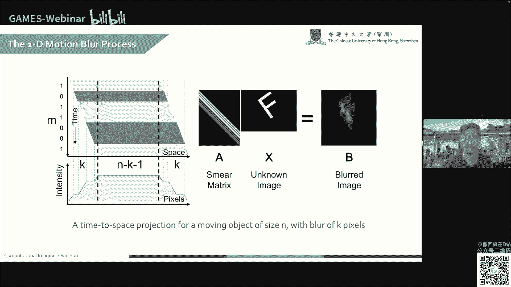
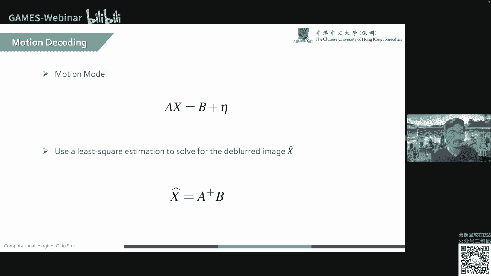
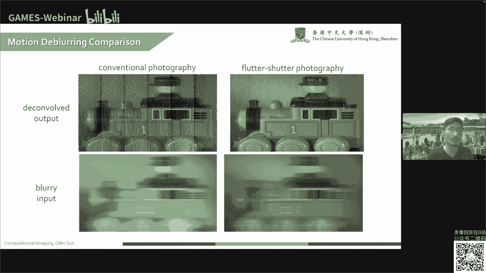
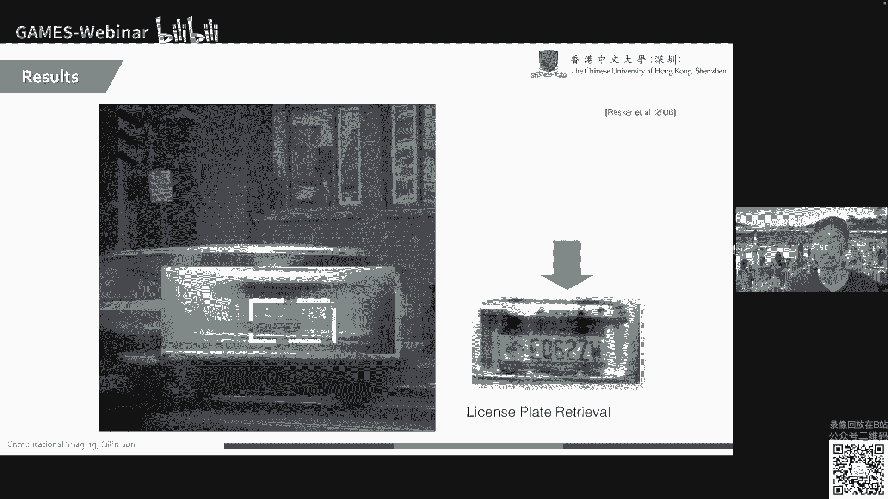
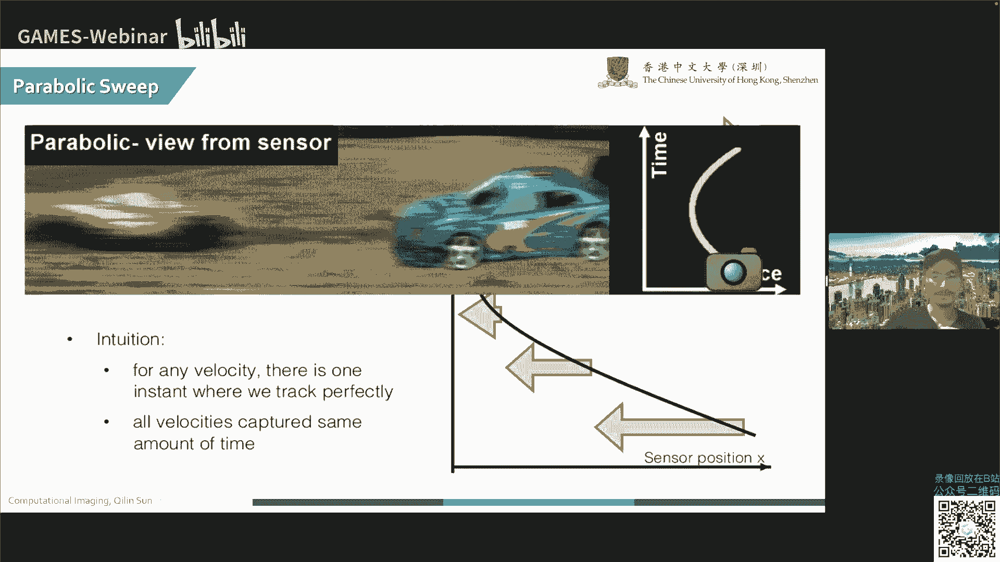
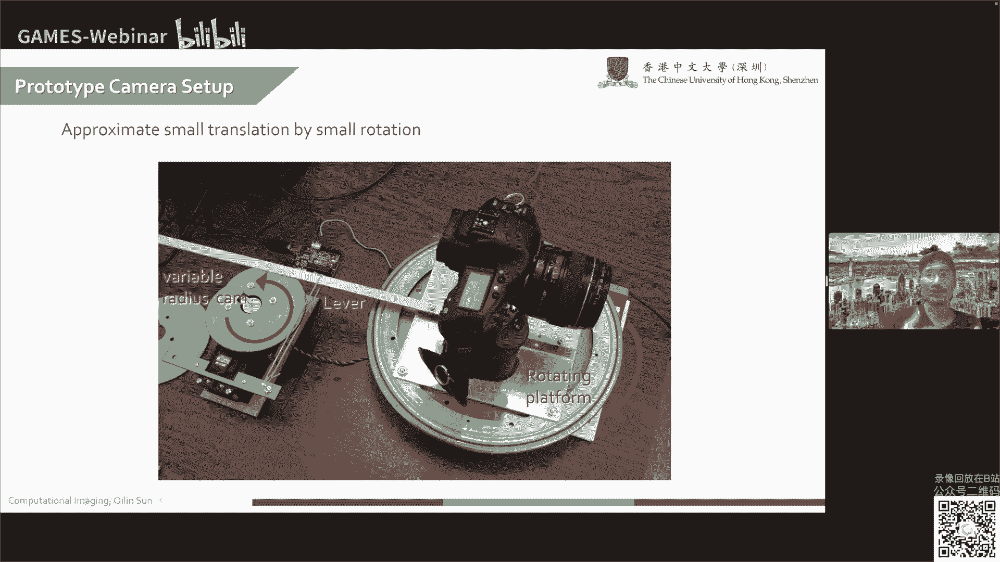
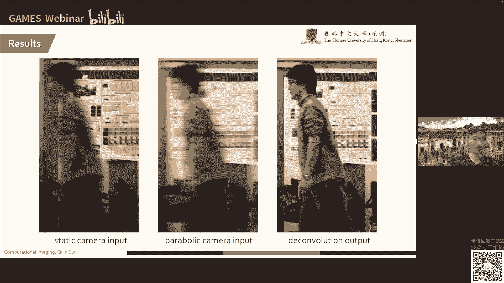
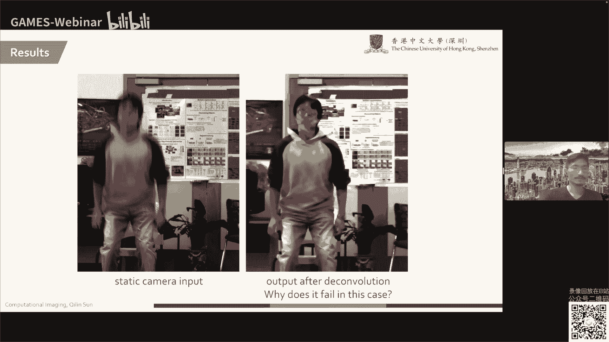
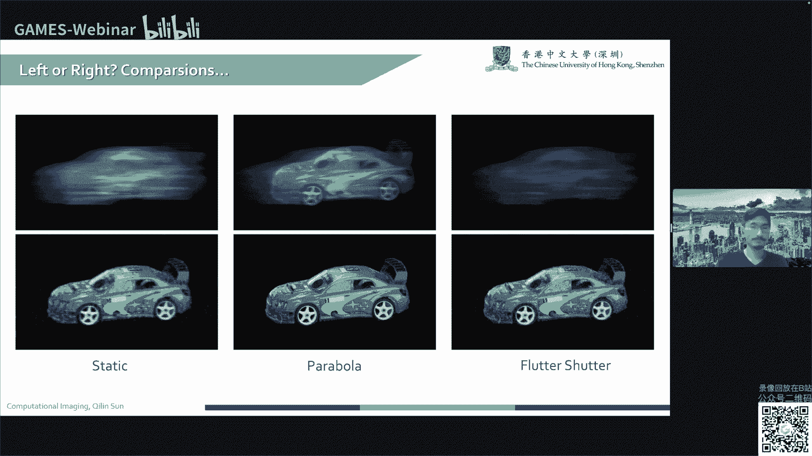
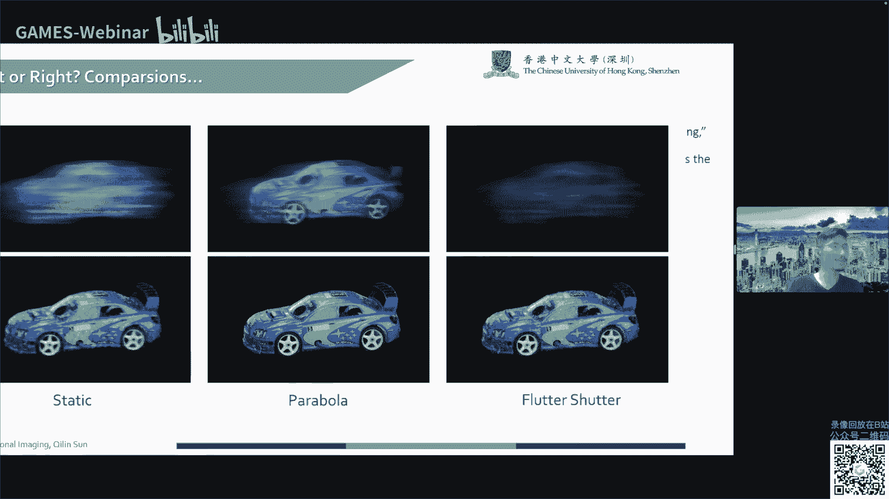

# 22.时域调制 (V) ｜ GAMES204-计算成像 - P1 - GAMES-Webinar - BV1cg411s7Cp

ok啊各位同学晚上好啊，大家好，这个新年快乐，新的1年了，那其实我们之前也跨越了挺长时间的，之前孙老师也给大家讲了将近20期的内容对，所以今天其实本来是孙老师接着讲这个。

dlencoding的那啊临时孙老师有些事情，所以我这个临时代课一下啊，所以我刚拿到这个slice也没有多久，所以没有太多的时间好好准备，我稍微改动了一下，那希望大家能够体谅。

那今天我们就简单来学习下一些呃，campaign coding的一些内容，之前孙老师给大家讲了这个tuo flight，这种啊时间飞行的这个时欲编码的一种方式，那我们今天可能讲另一种方式。

更倾向于传统的这种photograph，就是大家日常摄影中，可能会经常遇到的一个motion blood的情况来讲，啊对，当然首先就是我们还是要代表。

仅代表我个人以及孙老师以及intelligent optics，该公众号的所有编辑，那非常感谢大家过去1年对我们公众号对啊，games 2004计算成像这门课的支持。

那也非常感激这个啊games的技术支持，就小朋友一直每次的这个课程，都在这边协助我们后台上的一些操作，非常感恩，那这里我们是啊，我这边用这个全息显示，就是之前提示给大家也讲过了这个vr a2 啊。

神经全息，neural hargraphic的这套系统，那这个是我们用neural hgraphic，g h算法，生成以及显示的真实的2d的全息显示图，彩色的，那也祝大家在新的1年里新年快乐，一切顺利。

ok那我们今天来说的是motion bro，那我相信同学们中，应该有很多的这个摄影爱好者对吧，那同时让你拿着个相机去拍摄图像的时候，你会经常遇到这样的一种模糊模式，我们称之为动态模糊。

它在自然界中其实是无处不在的，那有很多同学跟我一样会喜欢拍星轨，看起来非常浪漫啊，就像这幅图这样，但实际上新贵，它是天体相对地球运动的一个轨迹，那实际上如果我们认为地球是相对静止的。

那实际上所拍摄的星轨就是一种啊运动模糊，或者我们称之为动态模糊，从更啊学术一点问题，pda的定义来说，它实际上是静态场景或者一系列图片影像，电影动画中快速移动的物体所造成明显的痕迹。

但实际上所谓的多动态模糊，就是物体留下的痕迹在时间轴，那除了我们所讨论的这个呃新轨，那回到现实生活中，大家可能也会经常看到这样的一些摄影作品啊，比方说这个啊运动的汽车，那模糊的这个行人以及背景。

以及右边这幅啊所谓的这个高山流水，大概拍摄到，尤其很多人拍的这个瀑布的场景，这都是所谓的motion blood动态模糊，那我们今天就希望给大家考虑的是，如何去消除这样的动态模糊，那在过去15年中。

摄影领域，今天我们可能更多focus在这个photograph领域，而不是所谓的scientific image啊，通常来讲有两种，比较主流的消除motion blow的一个技术。

一种我们称之为叫做cody exposure photographic，就是所谓的啊编码曝光，对确切的说它是利用一种叫做flutter shelter，就是震颤快门的曝编码曝光技术。

这个我们后面会再展开，那另一种技术则是我们称之为motion，environautograph，就是使之为运动不变的摄影，那这个我们后面也有展开，我们先来看第一种啊，cody exposure。

再来回归一个更加生活中，或者大家经常看见各种paper里所常见的，所谓的摆拍的例子啊，这里我们有一个室内的场景，那有这个背景的部分和部分，固体和部分的物体，它实际上是相对固定的。

比如说我们背景的这幅画作，比方说我们桌面的这个水果啊，这瓶酒以及我们的茶壶，那前面我们有一个装置，这个洪流，这个cs他在啊的托盘，它是快速的移动的，那我们假设说我们可以快速的使这四个啊。

冠瓶装罐装的这个红牛，在这个横向进行向左或者向右的这样移动，那么拍摄的画面中就会出现所谓，前景的运动模糊，ok那如果我们截取这样一个呃，红牛的这个图像给他放大，你就会看到，实际上我们之前也讲过了，很。

宋老师给大家讲过了很多的这个啊，convolution的东西对吧，所以我们可以理解为说这个运动物体，它的模糊图像，实际上我们可以理解为是一个block conner，跟那个shop image。

就是大家看到的这个sharp，steady object image的一个卷积，那我们说之前我们考虑，假设这是一个从左至右的啊快速的移动，一个线性的。

所以我们可以理解为这个motion broker可以近似，等价于是一个dog function，就有点像我们图上显示的这样子，那我们来看成像模型啊，这个就是所谓的成像模型，我们说运动模糊的程度。

通常有哪些因素来决定吗，首先我们这里提到了啊一个运动，所以肯定有这个速度对吧，我们说速度决定了这个corner它的相对的方向，比方说我们说这个左右的移动的这个啊速度。

它决定了这个corner的方向是从横向展开的，那么另一方向另一个维度来讲，我们是capture图像，所以我们有曝光时间，就所谓的相机的快门门时间，那快门时间它其实相对而言。

决定了这个啊corner的宽度对吧，当然我们这里假定了是一个很基本的情况，也就是linear移动所产生的模糊，我们说运动的模糊就是所谓的motion的去模糊啊。

motion debring会有很多嗯问题，但实际上这里罗列了几个比较基本的挑战，尤其是在过去几年中啊，在传统的这个image processing领域，我们所遇到的问题。

那首先当然就是blocker是vocable，这个我们等会也会提到，第二就是black color annoa的，因为我们这里假定，我们知道它是从一个维度的线性移动，但实际场景中其实很难去获取准确的。

这个卷积核，因为卷积核它跟物体的远近啊，物体的运动速度的方向它都是有很大关系的，而实际场景中我们是很难获取这些信息的，除非有这个额外的这个感知，比方说我们的手机底下有各种的sensor。

去帮助你获取这个额外的信息，否则的话这个是比较困难的，第二就是说我们说这个bluka，它是跟场景中的物体是相关的，所以它可能会有不一样，也就是说场景中的各个物体，它有不同的运动方向，不同的运动速度。

而且有可能有这个固定的背景，像我们这幅场景对吧，所以很多算法实际上需要把恢复的部分，单独分割开来，否则的话就会变成一个嗯epose的问题，就好像这个例子，我们恢复了前景。

这个红牛罐装红牛的这个呃motion debring，但实际上我们造成了背景这些物体，包括这个画作，水果茶壶等等的背景的一个啊，how to say raining artifa。

或者是其他的这些degradation，这本身是一个非常困难的物体，因为我们需要将这个前景后景进行一些分隔，那总的来说，我们说运动和是我们回到第一个问题啊。

black color是invertible的，为什么，因为我们说motion blow会造成这个布洛克呢，它丢失了所谓的高频信息，而我们知道啊，如果要使这个图像这个操作更加vertable。

我们希望尽可能多的在频率域去保存信息，ok那我们来看一个啊，wd的运动模糊的具体例子啊，从数学上的表达，那左边我们是一个time to space的投影，我相信大家应该也比较熟悉这种表达模式的。

在上过了这么多课程之后啊，那如果我们对快门进行零一的调制，大家可以看到啊，这是纵轴1001这样一个调制方式，随着时间啊，那这笔的灰色区域呢，我们可以表示是快门的打开，也就是一个全透光。

然后下面这个图呢其实这个就是表征了啊，这个好像说怎么说呢，就像素的积分，强强度积分，这里我们的n表示是一个sn的运动物体，那么k表征的是它的布兰科勒的大小对吧，那如此我们就可以得到右边的这样一个。

线性系统的数学表达，这里我们有一个未知的，image x乘以一个表征corner的矩阵a，当然你要把分化到这样一个矩阵模式对角，那最终我们就可以得到一个模糊的图像b对吧。

那这里看到了大家是一个大写的later，红色的f那我们看到blood的图像会有一些重影，这个并且这些重影不是连续的，那这个就是考虑到我们左边这个对应的，1001的这样一个encoding的曝光模式下。

它所带来的这个效果，这个就是所谓的一个编码的过程啊，ok那我们说嗯曝光编码或者说编码曝光。

它背后的关键思想就是temperencoding，也就是我们这两节课一直在考虑的时间采样，那我们希望的是通过一定的时间采样，使得空间频率损失可以达到最小，那我们这里来看一个最基本的例子啊。

上面这一行实际上是一个传统的曝光模式对吧，大家可以看到啊，传统的曝光就只有开，然后到了对应的曝光时间，我们把快门关掉，所以可以看到它实际上是一个连续的，一个shutter的时间。

那大家可以看到在这个情况下面，他拍摄的图像是比较均匀的，模糊的对吧，那这个时候i'm sorry，它的运动模糊就会丢失掉很多的啊，高频信息就是所谓的高空间频率，那第二排我们就是给了这个编码曝光。

大家可以看到我们有不同的这个蓝色的柱状啊，它分布在不同的这个时间轴区域，并且有不同的宽度对吧，不同的间隔，这几个是所谓对应的零一的编码，那么我们说编码曝光，它保留了这些衰减的频率幅度。

那即使可能大家从第一列看了这个，二者模糊图像，看来直观的感受都是比较模糊的，但实际上呢经过这个去模糊算法，我们到这个second column depload image，大家可以看到啊。

经过编码啊曝光，他所得到的这个图像，它的信息是更完整的，是更能恢复一些细节的，也就是说所谓的对应的高空间频率，在之前的编码曝光中是得到适当的保留的，当然可能无法恢复到这个啊，最右边最右下角。

大家看到了这么完美的这个细节信息，但相对于传统的曝光模式而言，在我们这种编码曝光的情况下，对于运动的物体，它实际上保留了很大程度的高频信息。

所以其实这个code exposure的motion depend，核心就在于如何去super这个motion，使得更多的这空间频率信息可以被保留下来，ok那我们再来啊多说一点，关于这个所谓的编码曝光。

那也可能如果大家谷歌的话。

也可能啊有一些文献叫他这个fter shuttle，那其实编码曝光是high lever的一个一个概念，flash shutter是如何实现code exposure的方式对吧。

那flutter就是说啊，如果中文翻译的话，应该是叫震颤嘛，其实就是所谓的这个相机的曝光，它的快门不是固定的，而是在不断的震颤振动，也就是所谓的开关开关对，那我们看第一栏，第一行的话。

传统的相机从数学上的表达，它等价于是对图像做了一个一维的box theater，对吧，大家可以看，那如果大家这个数学，我相信各位同学数学都很好啊，这个box filter的卷积核。

如果我们对它进行一个嗯不列变换对吧，实际上我们会得到一个sink的函数是吧，那如果是sc函数的话，稍后我们会讲，就可以看到很多的这个接近零的点在频率，那ok下面这一行呢。

我们如果用了这个flat shutter，就是对图像进行编码曝光，那大家可以看到，这个时候他的motion bluka就不再是一个均匀的，所谓只有一个平顶的啊，box filter了对吧。

比方说我们给出的这个释义的例子，这个时候我们相当于是有三个小的box filter，然后有不同的间隔跟不同的宽度，对这个图像进行了卷积，ok那这个会带来什么样的一个一个优势呢，我们前面说到说模糊。

相当于对图像做进行一个一维的filter卷积对吧，那我们来对图像啊，对sorry，对这个模糊的corner进行一个复联变换，所以第一行是这个tom dmd时间预的，那第二行我们就在复利约b域变形了变换。

那大家可以看到啊，这边给出了这个红色的这个震荡的曲线，pro，它实际上是截了一半的这个sync function，像我们之前所说，它会有很多的这个接近李宁的点，比方说这里对吧。

那我们之前的课程苏老师应该也给大家讲过了，我们其实非常不喜欢在频域出现这个零的点，因为是这些所谓的零点，会使得这个inverse fal是非常的unstoppable对吧。

那相对应的就是如果ok怎么说呢，就如果当我们用这个deconution的这个technique，去尝试恢复清晰的图像时，这些零点就会带来很多的噪声了，也就是导致这个图像的信噪比比较低了。

这个时候我们就说这个啊，很多的频率信息，在运动模糊的这个过程中丢失掉了，并且无法准确的被恢复，因为他是immortable啊，就sis not immortable，ok那我们来看右边这个例子啊。

就是加了所谓的啊编码曝光的，那这个时候我们对这个corner，这个蓝色的柱状的这个分布，进行傅立叶变换之后，我们得到的这个频谱的曲线，它的pro它是长这个样子的对吧，大家可以看到嗯，average来讲。

它这个曲线它是呃更加偏离了这个所谓的啊，零点的位置，所以我们说它实际上inverse filter，是更加stable的对吧，ok，然后咱们咱们来看看这个具体的这个，恢复的效果。

对这里我们是啊今天讲的很多内容，这部分的内容其实是从15 6年前的secret paper吧，这是一篇非常经典的叫做code exposure，photographic paper，大家可以关注一下。

里面拿出来讲的这个例子进行一些modify，那我们说直观上在不同的曝光时间内，交替快门的改变，比一直打开这个快门，它可以保持更多的频率信息，对吧啊，我们来看一些不同的例子啊。

讲到运动模糊是由于这个快门的时长造成的，所以自然而然大家可以想到，那如果我们用这个缩短曝光时间呢，那他肯定是造成的这个模糊的程度会更小了，就比方说最左上角的这个，看似是黑色场景的图啊。

实际上是这个啊非常短的曝光时间的这个图像，那我们对它进行一个log都妹的这个操作之后，因为这个图像的亮度太低了，在这个左下角大家可以看到，我们是可以看到这个图像的一些信息和细节。

但是由于这个曝光时间过低，它的噪声是非常非常大的，所谓的信噪比非常的低，当然这不是我们所希望的，于是我们过渡到这个第二张图啊，传统的曝光，所以我们需要假设200个毫秒的曝光时间。

那快门是一直打开200个毫秒的，那在这个情况下，我们得到的是一张模糊的图，那如果我们对这个模糊的图进行去卷积，conclusion的运算啊，就得到了f这个位置下面对应的deblood image。

那正如我们之前所说啊，由于啊高频的信息会被丢失掉，就是所谓的这个inverse filter会有很多的零点对吧，所以就会造成这个恢复的deep broad image，有各种各样的artif。

在这里我们看到的artifact，包括啊很大的噪点对吧，噪声以及这些位置的竖条纹啊带来的问题，那这个肯定就是f f t带来的问题了，然后我们再过渡到最右边的两列，我们已经说了这个快门的交替变换啊。

它能带来更多的信息，那自然而然，如何使得这个开闭快门能带来的，这个好处最大呢，这个时候大家就可以想到，有无数或者说有很多种不同的解对吧，实际上就是在这个完整的200ms以内。

咱们要对这个快门的开关做一个二进制的编码，假设我们说开为一关为零，那这样的编码状态就形成了一个所谓的cody po，那右边两列其实对应的是两种不同的编码方式，这个编码方式在最上方。

这个啊蓝色的柱状分布上面，大家可以看到啊，是稍微有一些不同的，那整体的曝光时间是一样的，大家可以看到通过编码方式的曝光，他最后恢复的the broad images，都比我们第二列传统的这个啊。

统一曝光的模式更加的好啊，对但是它实际上还是有一些不同的，就说明了实际上我们还是要去找一些啊，不同的曝光模式去达达到最佳的编码曝光效果，sorry，这个灯灭了，我就开一下灯，ok于是乎啊。

该论文的研究者就实施随机线性搜索，并考虑大约呃十的六次方，也就是300万个候选的这个零一的编码啊，大家可以看到就是一种比较，blue force的的这种搜索方法，然后他就大家发现说。

如果有一种啊52个bit的编码形态，它能够使得整个系统保留最宽广的频率响应，从而使得信噪比最高，那于是乎，大家就呃这个论文的作者给出了这样一个编码，就是我们这个slice中。

给到了所谓叫做new optimal temporal code，它是对于一个啊motion debra是比较好的，那这样说可能是很难理解啊，就我们来说，从这个intro pp的角度来讲。

直觉上我们所希望的是一种编码频率，它的响应是相对比较平坦的，稳定的，并且尽可能的少这个经过频率的零点，ok那有这样的一个编码模式之后，我们就需要做这个decoding部分对吧。

前面所谓的编码code exposure是encoding的部分，那我们拿到了这个encoding image之后，我们需要做这个motion decoding。

那这里我们再来简单回顾一下这个motion model，大家讲到了前面其实给大家说的，我这里是一个ax plus b，but equals b plus n，那其实最右边这一项是考虑的，它是噪声了啊。

那我们这里其实可以用一些啊，linux squared estimation来去解这个deploimage x head，就是它实际上等价于是一个aa的transpose，乘一个b。

那我们再来回顾放大一下，刚刚看到的这两个比较啊。

左边是我们这个传统的曝光模式所啊，恢复的结果，右边是通过这个编码曝光所恢复的结果啊，结果很好对吧，但是大家注意到的是这样一个场景啊，它的背景就是这个绿布的背景，相对来说是比较均匀的。

所以实际上其实我们不考虑的这个背景啊，不同所带来的这个呃，可能造成的the convolution的butterfx，他也是看不出来的，因为背景比较均匀，但是实际在很多生活场景中。

我们需要考虑这个背景的变化对吧，所以我们来讨论一下，简单提一下这个background estimation。

假设他的那个啊background不是zero的对吧，我们就单纯用之前的这个方式可能会带来问题，因为我们not efficient to known a moving up。

just psf to deploit image，这个时候p sf是未知的，所以我们更希望的是estimate这个psp，那有背景的情况下，有前景背景的情况下。

他的image formation model其实可以我们对简单做一个分解，这里b equals a x plus，ag n x g g的下标，实际上表示的就是说我们有一个相对steady。

静态的这个背景，那前面的x指代的就是说，我们在前景有一个运动的物体，那这里的ag它实际上我们就可以把它写成一个，diagonal metrics。

whose elements attenuate the study background，那这个时候他就表现成这样一种模式的对吧，那在这个情况下面，如果我们能去estimate。

这个可能就是我们的points pread function，那自然它的这个效果会更好一些，我们说实际的场景啊有很多不同的背景，这边我们就是从这个几篇paper中找出来一些例子，给大家简单看一下啊。

首先左上角这个一种场景，就是说我们估计的这个背景啊，它与面部，就是后面这个人物面部为模模糊的部分，它有一些联系对吧，this continuity，在这个前景跟背景这个呃边界的部分，这是一个情况。

然后呢啊接下来这个情况，下面这个小火车的图啊，我们的背景它不再是绿布，而是一个有这个横向条纹的背景对吧，而这个横向的条纹呢，它的方向与这个我们前进的运动的这个方向，就是motion的方向。

也是在横向的运动，它是对齐的，这个情况下面，如果用之前的算法恢复出来的话，那这个啊背景就会出现一些artifacts，大家是可以看到的，ok然后还有一种情况，那我们看这个啊，右上角啊。

我们说用户可以指定在一种在背景中具有强度，梯度的近似五对吧，比方说这个虚线框框出来的这个区域，我们通过只保持这个比较load的这个啊，gradients，这个剪裁部分，就会只剩下模糊的像素被解码对吧。

所以大家可以看到这个恢复出来的这个区域，还是ok的，但是在背景的这个均匀的部分，还是会有一些artif，那还有第呃另外一种情况啊，就是这个所谓的啊右下角这个情况啊。

我们叫做paper means across the face，这个情况的意思是说，假设我们啊背景有一个人物对吧，然后我们有一条非常细长的这个时代，那我们假设这个窄的纸袋在人面前，这个快速的横向移动。

大家可以看到啊啊这个时代造成了这个拖影，就会涂抹在这个人物的脸上，那这里显示的右侧的位置是嗯，右侧的这个小图啊，是指未模糊前景的这个estimation，并且啊他由于的是这个up to c。

模糊的这个图像不够清楚而带来的这个失真，那如何去通过code exposure来实现两个呢，我们刚刚讲了很多东西啊，那在这篇paper里面啊，在实际的实拍过程中，作者是搭建了这样一个样机系统啊。

他这里用到了这个两个的shutter的control，就是有两个快门，那我们看到在单反镜头前面有一个very fast，external shot，就是有一个非常快速的外部的快门。

这里这个快门当然就是为了实现快速的，010101的切换对吧，然后我们可能还有另外一个快门，这个可能是control这个总的，这个0~1之间的切换的，所以这个基本的这个呃prototype是这样子的。

那通过这个prototype呢，可以拍摄很多的这个时间图像，大家可以看看一下，这里是一个这个呃，室外的lesson splay的一个retrieval的场景，就是车牌，大家可以看到这个啊，前景的汽车。

相对于这个建筑物来讲是快速移动的，然后通过这个编码曝光的模式，是不是可以把车牌会从这个看似非常模糊的，这个情况的图像里面恢复出来的，包括这个大众的这个logo，这边还有另一个例子啊。

同样的这个车牌相比于前一个来讲，稍微复杂了一些对，但是还是可以很好的恢复出来，ok那我们前面讲了这个code exposure，那它是实际上通过这种编码的方式。

在一定程度上解决了这个black corner是vertible的，是not invertible的一个问题对吧，但实际上呢它还是有一些问题存在的，就比方说我们前面讲到的啊，两个挑战。

一个是blochner，它是未知的，第二个就是说这个啊除了color，它是different for different objects的，就是不同的物体，比方说前景物啊。

背景他的这个呃模糊的可能是不一样的，如果只是用这种全局的decaution的算法的话，会使得背景被破坏掉，所以我们这里呢，就是要简单的给大家介绍一篇paper啊，这个是2009年吧。

实际上也是啊有些年代了，h v一的一篇paper code，exposure debring，optimize coast for peaceful estimation and invitability。

但它实际上探讨了，就是说在编码曝光的情况下面，有没有一种更optimized的code，它更适用于同时使得p s estimation好，也同时保留住了我们之前提到的这个invitability。

可逆性的这个特点，那肯定的这个说啊，这边paper要做这样一个调研啊，实际上他们同样搭载了一个一个一个，一个prototype，那可能这个paper比前一篇paper稍微晚了几年。

所以大家可以看到这个时候的这个啊，prototype的这个compact程度就会更高了，那这里有一个样机显示在这里，那它是一个低电平的trigger，大家可以看到啊。

所以他这边paper实际上它的核心观点就是说，用一个carefully design code，我们实际上可以achieve both p estimation。

and and invitability for motion buring，那他们给出的这个例子就是啊，同样是汽车的例子，这里我们显示的这个黄色的箭头，跟这个k的值啊。

实际上就是指的这个motion的像啊，这个啊vector它的这个向量对吧，相当于是说在啊向左侧部的44移动了，这个44个像素，那像y轴稍微的轻微的偏移了一点点，这个意思，这个文章其实还是蛮多内容的。

今天时间有限，咱们不展开，那我们简单的只是给大家记住这样一个嗯，inside总会有一些trade off在做cody，cody cover exposure的时候对吧，因为你假设有52个bit。

那如何的这个零一编码是合理的，其实有很多很多的解，那不同的paper是做了不同的研究，那我们这里展示的这个paper中截取的一个表格啊，他实际上说了，我们来看反弹的这个啊，曝光就是均匀的曝光。

他的points prefunction，activation相对来说是简单的对吧，因为你实际上它就是一个连续的模糊，所以你的psm就是连续的一个变化，往一个方向展开，但是这个情况它会使得在越狱。

他的啊带来一些零点，这个我们刚才说过了，所以他的p sf invitability是没有很好的，那我们到第二个方法啊，就是roscoe在2006年提出的paper，也就是咱们之前花了很大这个功夫。

讲的这个code exposure，它其实是通过这样一种便利的方式，找到一个比较好的，10001的这样一个编码模式对吧，它使得频率域的这个零点的节点消失了，所以它保留了空间频率信息。

所以我们可以得到更好的points pread function vertability，但是在这个情况下面，他对points prefunction，estimation可能是比较困难的对吧。

因为它可能会有很多的零一间隔的随机性，大家想象，如果是零一之间的间隔，只是单纯的0101的突变的话，那这个bra ka来讲是比较难以去tm的，所以啊这边2009的paper呢。

它实际上是做了一个车道对吧，它实际上找了一个optimized的code，大家可以看到啊，前面开始的曝光有一连串的一，就是所谓的这个下划线的这个位置，它实际上这个编码的code。

他在两个维度上面都去找了一个比较好的平衡，在invitability的维度上面，他去逼近了之前这边paper所通过便利300万个code，去找到了这个所谓的当前最优解的情况，下面的这个编码。

同时在point spread estimation上面，它又比这个所谓的1/3000000的这个解，要稍微好一些，ok我们来看一个啊，这两种不同的编码模式的例子啊，首先啊大家可以看到。

我们这边做的是对post profunction，做了一个bf f t对吧，列变换，然后黑色的这个曲线呢，就是所谓的传统的这个曝光，大家可以看到，就我们刚才说的。

它实际上是一个think function，所以大家可以看到有很多的这样一个呃跳变，逼近零点的位置，然后后面的话我们呃有两种不同的编码方式，对应的是这个绿色跟红色的编码，那它实际上就会消除了一些零点。

但是大家可以看到它还是在傅立叶变换域，有不同的这个呃曲线的变化就不同的高度变化，那intely咱们之前说到了，我们总是希望说这个嗯编码的变化，它带来的这个频率的变化，相对来说是比较平稳的，比较均匀的。

并且没有零点的，所以我们说在这个情况下面，所以它这个绿色的啊，c two cod的啊，type two它或多或少会比cody one要稍微好一些，那这个也就是这边paper所去论证的一个观点。

那我们来看一下他们所得到的一些实验数据啊，这里是一个简单的例子，大家可以看到啊，第一排是这个模糊的图像，那第二排是我们对前景背景进行一个区分的，大家可以看到啊，摩这个玩具摩托车给他提取出来。

对他进行操作，那这个不同的cod one c one two，可以看到比较大的区别，就是在提示的背景的这个部分有一些区别啊，对吧，这个边缘部分，然后我们看到它恢复出来的图像，可以很明显的看到啊。

这个c two的这个结果相对来说是最好的，那这边是另外一个例子啊，在一个高饱和度曝光的情况下面，大家可以看到啊，c one的这个所谓找到最优解的话，它虽然图像的亮度啊。

前景的这个人物的细节还是比较sharp，但是它可能在啊前后景边缘的位置，也会带来很大的这个artifex，这边是一些其他的例子，大家可以看一下啊，啊左边这个例子的最左边。

我们说一个叫做ground truth，就是那清晰的图像啊，那中间这里有个cody seat best，这个seed best呢就是所谓的嗯，在之前这个便利的方法中找到的。

这个所谓的new optimal code，那这些都是在真实数据是受数据集上的，这个啊debring的一个比较啊，然后右边的就是这个c to l，那同样的我们说c two，它还是有不同的编码模式对吧。

我们假设我们有31个bs，就是有31个零一可以变的空间，这个point啊，这个p sf的sorry，的估计能力就会随着l的增加，二增加对吧，那我们这里的下标五七十这样一个数字，表征的是说什么。

是说这个啊有多少个一的情况，五表征的是我们在这个啊31位里面，我们只有五个一，然后我们有七个一，一直到31，全都是一，也就是所谓的传统的全通的情况对吧，那实际上呢啊我在很小的这个五个一的情况。

它的这个分辨能力是有限的，毕竟这个通过的量也比较嗯少，而且它的这个编码的随机性也比较小对吧，那实际上啊这边peter就说论证的说，在这个c two就是13个这个编码的情况下面，它是最优的。

它同时满足了比较好的p s f的s级美声，以及这个嗯可逆的这个file，ok那之前我们花了大概这个半小时的时间，来讲了这个code exposure。

但是cody exposure还是会带来很多的问题对吧，就一个很大的问题，就是咱们刚刚一直在考虑的，所谓的前景和后景的问题，以及这个啊真实的这个场景中，不同的物体它会有不同的运动轨迹，不同的运动速度。

不同的运动方向等等，对比方说我们去拍摄一个哦路口十字路口，那相对于背景的这个建筑物，前景有不同的行人，有这个不同方向行驶的汽车等等，那在这个情况下面啊。

传统的这个code potion的方法呢就不是最优的解了，因为他可能在啊啊，你需要很强大的这个不同物体的，segmentation的分割，并且针对不同的segmentation分割。

去做一些算法的优化调整等等，那在这个情况下面就有一些另一种思路啊，这是一篇paper，叫做motion in burn photography，是在siggraph 2008年的paper。

是angelin啊，可能大家对这个这位学者也比较熟悉的，他现在是在以色列，就是非常知名的计算成像领域的女性时，那他提出了一个方法叫做paralley sweep，就所谓的这个啊抛物线的sweep。

那我们来首先这个从更high lever的角度来讲，我们希望得到的是什么，我们希望得到的是一种模糊程度，与目标的运动速度，目标的远近，空间位置等因素没有关系的摄影方式对吧，简单来说这个对应的是什么。

就我们是否能够introduce extra motion，就既然我们知道有些前景的物体它是在运动的，有些物体是没有运动的，那反过来想，如果我们让所有的物体都一起动起来，那是怎么样。

那就是所谓所有的everything is blue right，但是这个blog就有可能是更加的environ，因为对所有的物体来说，它都是相对比较均匀的抖动起来了，那如何实现你这个例子呢，那肯定的。

我们不可能让这个真实场景中的物体啊，去增加额外的运动，但是我们可以让相机来做一些额外的运动对吧，那我们再来讨论一下这个进一步考虑这个思路，我们如果使得整个图像的模糊程度变均匀，是什么的。

那比方是这样一个图案，我们背景有这个一个poster，然后啊前景有一些嗯，人物在做不同的动作跟行走等等，最左边是我们拿一个steady camera capture，软背景相对来说是比较sharp。

但是前景产生了模糊，然后呢，那如果我们是啊拿了一个specially design motion的一个camera，我们发现什么，我们发现前景和背景都一起模糊了，那什么叫做special比赛呢。

就说如果我们把相机进行了一些运动，那个对应的反过来可以理解为啊，拍摄场景中的所有物体都进行了extra motion对吧，就所有的物体大家一起读了，并且这个呃无的这个物体。

不论是thetic还是dynamic regions，它相对而言它都是identical的，于是乎我们在做deconution的时候。

我们可以用一个single no one的postprofunction去做deution，那整个图像恢复出来的效果就如最右图所示，让大家可以看到啊，相对于呃steady camera拍摄的结果而言。

他的背景和前景，背景的这个poster，跟前景的人物都是比较sharp的，恢复起来的这个思路，大家可能会觉得有一些眼眼熟啊，其实跟我们之前很多课程内容中提到的，这个所谓的波形编码或者少所谓的叫对焦扫描。

其实是一个概念，那大家想啊，其实所谓的增加额外的运动，其实就是在这个曝光时间内进行了一些积分，对吧，这个swift的概念，扫描的概念其实就是进行了一个积分，那当然了，目前很多的这个paper啊。

包括这篇paper，它其实上做的还是，假定说我们这个motion environ是的目标物体，它只做一维方向的运动，比方说只是水平的运动啊，像这个人物的行走等等，看起来比较严格。

但实际上在很多日常生活中的场景而言，它已经是可以覆盖了，那它的核心在说，我们如何去控制这个所谓的special design motion of the camera，就相机的运动轨迹去。

从而控制这个啊场景中的模糊，这里我们再来给大家讲一下啊，就是不同的这个呃运动轨迹的话，它的积分后会对p sm带来什么样的影响啊，就最左边一列肯定是这个所谓的steady camera对吧，我们不动。

所以我们这个时候对于不同的位置啊，不同的颜色，红蓝跟棕色，这里表征的是不同呃的物体，不同深度的场景，大家可以看到，那么三条线它对应的p s f就是这个样子的。

然后呢我们可以做linear translation对吧，相机往一个方向进行移动，然后我们得到了psf是这样的，那第三列呢，我们就是所谓的叫做parabby translation对吧。

就像当我们将相机沿的这个抛物线的方向，进行移动啊，当然不是沿着抛物线的方向，而是做了抛物线移动，什么意思呢，就是说我们相机先向横向，先向左进行一个快速的移动，然后静止。

再反过来向右进行一个快速的移动静止，那么它的运动轨迹画出来，所以在时间轴上它就是一个抛物线对吧，那大家可以看到这个情况下面得到的points，spread function，对于不同颜色的物体而言。

它大家相对来说是比较靠近的，在这个shape形状上面，虽然说他们不是百分之百的identical的，但是总体而言我们可以说它是更加global environ对，然后最右边一列呢。

就是我们之前半个小时一直在给大家讲的，这个所谓的cody exposure的内容呢，那大家可以看到这个cody exposure，他啊的这个曝光，随着时间轴是我们刚才讲的这个，0101的变化。

它是一个啊断续的间线段，那得到了这个post profunction就是什么，就是说对有一些位置的场景的物体，他的ps非常好，那有一些场景的psf又是另一种形态，让大家看到这个红蓝跟棕色的psf。

它的形态变化差距是比较大的对吧，那这个情况下面，我们就难以用一个idantic的points，prefunction去做decommotion。

所以它就变成了是一个motion brendeconclusion，那它就比较复杂了，ok，那如何实现这个所谓的抛物线，扫描了的控制相机，那我们说我们要达到两个目的啊，第一个是把首先把不受控的模糊。

这所谓的场景中各种不同的物体的模糊，变成均匀的可控的模糊，那我们要通过相机的变换，或者传感器的变换来实现，那第二步当然就是用这个decompression去处理，模糊的中间图像，而得到最终的清晰图像。

嗯为什么我们说这样是合理的呢，那假设我们的这个相机，随时间的这个啊运动的轨迹是如图所示的话，大家可以看到啊，嗯intuition，大家可以想到，对于每一个不同运动速度的这个物体而言呢。

我们总有那么一个时刻，相机与支持相对静止的对吧，这个时候的速度为零，那么也就是说可以被准确的check到，而并且整个啊曝光时间是一样的对吧，并且说我们说所有的速度而言，所有速度的物体目标而言。

它的道光获取时间是一样的，那最终拍摄出来的图像，就会呈现出一种特殊的模糊，就可以用一个简单的啊，single的deconvolution current去做disconvolution。

ok那我们来看这个例子，我们这边有做了一个简单动画，大家可以看到啊，假设我们相机的运动轨迹时时间轴是这样子的，大家可以看到啊，在不总有个位置，这两辆车以及背景的这个屏蔽，总能找到一个啊清晰的图像。

它是相对静止对吧，我们再看一遍啊，首先我们是前景的这个蓝色的啊汽车，然后呢是咱们这个呃背景的草地对吧，最后呢是这个啊反方向运行的，这个红色的小汽车，就总有那么一刻时刻，他的啊相对而言，相对相机而言。

它是静止的，所以这个时候他的这个呃图像是清晰的，然后这个情况下面我们最终得到的图是什么呢，不是，那这个就是咱们最终积分，得到了一张模糊的图像对吧，所有的这个场景啊。

远处的背景，前景的两个不同方向，不同速度运行的这个目标物体，它们的模糊程度看起来而言，相对而言是比较均匀的，那我们就可以对这幅图像进行devolution，我们再从这个呃数学上来说。

咱们的目标是create的一个vlog，ity environ points play function对吧，那我们假设这边把这个抛，所谓的这个抛物线点啊，我们如果把它分解成只有这个五个点。

大家可以看到这边第一个点，我们向这个方向移动，然后再回来呃，后面几个点就向这个方向移动，那么在不同的时刻呢，他其实是在啊，这几个点是在不同的位置对吧，那经过这个总的这个积分曝光时间之后。

通过这种所谓的抛物线扫描，他能得到的这个啊，or prefunction p s m就是这个模式的对吧，但如果不是啊，通过这种抛物线扫描，我们拿一个这个static camera，他就capture了。

那这个时候他的p s f就是这样子的对吧，因为它其实就等价于每一个啊，point source跟这个方对应的方向，跟它的速度进行了一个积分对吧，向这个方向展开，当然每它展开的这个啊越长。

自然而然它的总的这个能量分就越分散，亮度越低对吧，这大家可以理解的，所以实际上呢这个概念就是说，我们去寻找一个使得velocity informing post方式。

那在很多种这个大家就intuitive的情况下面，就突然就发现唉所谓的这个抛物线的这个wap，它是很好的，可以达到这样的一个效果，ok那如何去实现这个啊这样一个抛物线的。

沿着时间轴抛物线的这个受控capture啊，啊这个作者做了一个很巧妙的这个实现，它通过了这个控制现有的相机，镜头马达的方式来完成它，实际上呢我们在看到这个是啊。

paper上的一个图案是有一个外接的机械装置，通过这个变形齿轮加连杆的方式对吧，咱们这里有一个呃齿轮在旋转这边有个感动，使得这个啊这里有一个rotating platform，然后我们这里叫一下单反。

使得这个单反，可以在这个旋转平台上面进行移动，通过模拟这个抛物线扫描的这样一个方式，那接下来咱们就来看这个实拍的啊。

结果了啊，就左边我们是一个啊静态的相机实拍啊对吧，大家可以看到这个unknown and variable blood对吧，然后右边是通过这种啊抛物线扫描方式，所以得到了。

大家可以看到这个blood是envy velocity的对的，因为我们可以看到说背景啊，这个呃呃前面的这个水果呀，包括这个红牛的罐装红牛等等，它的运动轨迹它的速度是不一样的。

那如果我们把它进行这个decaution算法恢复，那得到的结果就是这样子的对吧，大家可以看到不论是前景背景，它的恢复效果来说都是很好的，而且这个decomposition算法，咱们只需要用到一个啊。

single point spread function，single corner，因为它实际上通过这个呃抛物线编码的方式呢，他的这个color已经是global environ。

那这边是另一个例子啊，就我们说刚刚前面假设的这个运动的方向，是在水平的linur的，但这种模式呢它其实也带来一定的好处，这个例子就是说，即使当运动不完全满足单一方向运动时，比方说这个啊人物，它的运动。

他并不是整个人往一个方向水平运动的对吧，他在这个情况下面，通过这样的一个呃抛物线扫描编码的方式，它也能一定程度上恢复出清晰的图像，无论是前景还是背景，当然了，如果实际运动和之前这个所谓的啊。

linear translation的这个假设有非常大的差别。

它也会出现明显的缺陷对吧，就假设我们这个概念，我们说我们相机的这个抛物线运动，是沿着水平方向的，但是这个场景中的这个人物的站立，这个是突然间从椅子上站立起来的这个过程，这个运动的过程。

它实际上是由自下而上的一个，垂直方向的一个运动对吧，那在这个情况下面，这种编码方式可能就会带来一些问题了，恢复出来的结果，虽然说它比这个完全模糊的图，他的这个shop程度肯定是好了不少。

但是大家如果看这个脸部区域啊，就会出现一些啊，party fax这个也就是呃这个编码方式的这个缺陷，因为我们实际上这个抛物线编码是考虑的，一个方向的运动，ok那我们来做一个呃一些实验的总结。

从paper上面中拿到的啊，最左上角是这个steady camera input，包括两个不同的场景对吧，然后是这个debring results，从这篇paper里面拿到的这个场景。

拿到的这个效果大家可以看到啊，然后呃最左下角呢是用这个boss filter，manually to move layer，and applied to the deplode a image。

实际上什么概念，就是说我们通过这个boss filter，因为啊去啊手动的去调去ali不同的区域，那我们可以把前景的这个洪流对吧，对这个运动的位置很好的恢复出来。

但是背景就会产生很大的artifacts，那在这个情况下面，如果用了这个所谓的这个啊，specially uniform的这个啊deconclusion，通过呃抛物线积分的方式去得到的。

它的效果就会很好，因为这个时候我们就不需要去区分前景和后景，用同一个这个filter，我们就可以把整个啊场景的给恢复出来了，ok我们来做一些简单的总结啊，我这里写了一个left and right。

就说啊不同的这个你的算法今天讲了两种，一种是所谓的这个啊，environment就是抛物线扫描的方式，第二个就是所谓的传统的啊flat to shot，就是code exposure的方式对吧。

它都有各自的好坏优势，我们说传统的编码曝光最右边这一列啊，它使得模糊的图像中，保留了尽可能多的频率信息，所以我们这个decaution的过程之中呢，可以得到相对而言比较高信噪比的这个图像。

但是呢由于画面中同时可能存在不同运动数据，运动运动速度的物体对吧，可能还有固定的这个背景，并且这个背景不是像这幅图上是均匀的，那通过这种振动快门，0101编码的方式呢，可能不能做到。

运动的模糊程度是跟速度方向无关的，所以你需要手动介入进行分割来处理对吧，而本身这个图像分割的这个过程，它就是一个epose，并且是比较复杂的一个挑战了，同时呢。

我们很难去估计此时这个有效的blochner，所以你需要很多的这个怎么来说试错，就是其实前面几篇paper都花了很大的功夫去去，找到一个比较合理的这个code，当然还有一点比较重要的一点啊。

就说编码曝光使得快门有一半的时间是关闭的，对吧，所以自然而然就是你获取的图像的整体，画面信息会偏暗，那如果你通过这个啊，增加增益的方式给它调上来，那有可能会带来一些啊信噪比的这个损失对。

然后我们来回到这个中间这一列啊，这个抛物线扫描，它实现的是运动不变的，这个摄影所谓的这个motion inferior，那它通过了，就是我们去增加不同场景物体的，额外的extra motion。

使得整个画面的模糊与运动物体的这个速度，方向都相对而言是无关的，那它还同时证明了说，这个有效的卷积核中保留了，比呃传统的code exposure，会更加多的这个频率信息，所以大家可以看到。

就目前的这个例子而言，我们通过这个所谓的啊抛物线扫描的方式，它所恢复的图像信息是更好的，并且由于它整个这个曝光时间内，快门都是打开的，只是相机在运动，所以它整体的这个积分时间跟光通量。

是比我们通过这个啊快门开关方式，对编码而带来的光通量要更加高的，所以大家可以看到，这辆车获取的图像的这个亮度，整体亮度而言是相对而言比较高的，ok那这边是给大家列了一下我们今天讲的内容。

cover的一些references。

就有兴趣的同学可以再好好看一下啊，今天由于时间有限。

所以我们其实没有办法啊，很多的展开让大家可以看到，其实很多的这个领域的paper都是在西瓜上面，所以sl还是非常值得大家关注的，要ok那我们最后给大家回顾一下今天讲的内容，那我们今天讲了就是啊。

研究的主题是这个motion blood，所谓的动态模糊，是一种在摄影学中非常常见的一种现象，一种既好又坏吧，对那通常来讲我们如何去去模糊呢，就会有所谓的cody posure。

也就是回到了今天这个课题的主题之一，所谓的temporal encoding，那所谓的code exposure，我们就会考虑到说，有很多种不同的encoding的coast。

那我们总是希望去找到一个optimist的code，能够同时使得points prefunction，estimation跟这个filter的invitability更加的好，那我们还给大家介绍了这个。

另一种去模糊方式啊，就是所谓的通过使得运动不变的方式去实现的，那从这个技术上实现，我们就是对相机或者传感器进行了一个sweep，扫描的方式，使得场景中所有的物体都去额外的增加了一个。

extra blood，那并且这个extra blog呢在整个曝光的积分时间内，它会带来的一个好处是整个points profunction，那这个情况下我们就不需要过多的人为的介呃。

介入去进行这个不同场景和不同物体的分割，所以他其实可以省下一些engineering effort，那另一个好处，就是说嗯比起这种零一编码的方式，它可能会啊带来这个保留下更多的光通。

它的画面的亮度会更高，那当然它其实一个很大的实现的难处，就是我们需要额外的一些mechanical engineering，去这个扫描传感器，那最后到最后啊，大家可能看到，其实可能有些同学会注意到。

今天讲的几篇paper，都是大概是95年前乃至将近20年前的paper啊，那为什么我们还要拿出来讲呢，是因为我们觉得这是temporary coding中，非常经典的一个例子啊，虽然说他们已经是很老了。

那现在很多的这个呃头手机或者相机里的算法，也不再使用这种方式的，但它其实这种通过一种很简单的编码方式，而去解决一个很实用的问题的这样一个思路，还是非常值得大家借鉴，那近期大家用了什么方式呢。

我相信很多同学可能会自然而然的想到ai，或者所谓的deep learning，深度学习，我们说dian introduce game，那这里我们今天不再展开啊，这里只是给大家举一个简单的例子。

就感兴趣的同学可以去看一下，那当然也是来自于啊我们组之前的paper啊，the video deploring for hhcameras，这是啊u b c团队跟dobe团队。

在07年的cv p r发表的一篇paper，它是有比较高的引流量的，但他实际上说的就说那他们的这个hi cameras上，包括你手机的这个相机，或者是这个手持式的这个微单单反等等。

经常会通由于这个手抖本身，handshaking带来了一定的模糊对吧，然后同时会有场景中的运动物体，又带来另一个程度的模糊，那这两个模糊结起来通常是比较困难的。

用传统的这种啊佛光model base的方法来解，所以呢呃keep ending，就是给啊大家提供了一个更新的，更有意思的思路，那这篇paper其实就是做了很多的这个呃研究。

包括在data set的处理上面，以及包括这个neural network architecture上面啊，在当年其实是一个比较好的效果了，感兴趣的可以去看一下。

他们有一个比较完整的youtube的video，那介绍了这个具体的这个max的技术细节，包括有很多实拍的啊恢复的案例，大家可以关注一下，ok那今天的内容就基本上到这里对。

最后就是嗯对宣传一下我们的公众号，intelligence optics sheling，所以感兴趣的同学可以关注一下，那我们其实啊新的1年，我们也会继续尽可能的更多的这个呃报道，一些技术解读。

像今天我们刚刚这个报道了，snapchat research，跟这个stamer团队的一篇e c c v的文章，是通过这个闪光灯的控制，就所谓的点阵闪光灯的模式去实现，手机在这个长距离的夜景的拍摄。

所以大家也可以关注一下，ok今天的内容就到这里，也不知道大家有没有什么问题啊，今天可能讲的稍微快了一些，啊如果有问题的同学，因为我现在看不到弹幕对我的好，啊这个同学说这个sorry啊，我现在看到的弹幕。

刚刚的弹幕没有更新好，有同学问说编码越稀疏效果越好吗，那这个其实是不一定的，所以我们刚刚其实有一个例子对吧，那假设有31位的这个可以编码的这个空间，那实际上你这个例子给出了五七十13哦。

25跟31不同的编码的情况，下面它的这个恢复的程度，但实际上不同的编码吸收程度，它带来一个随机性的问题，包括point prefunction的estimation的难易程度的问题，所以才会他们需要啊。

去进行了这么大的一个随机性的啊搜索，进行搜索便利，找到了一个在当前情况下，相对而言比较好的编码模式，当然了，这个编码的还有另一个，这里是假定说我们的这个呃呃呃曝光，说我们的这个相机的拍摄过程。

是基本上没有噪声的对吧，如果我们的这个曝光是有噪声的，那你更加稀疏的透光，自然而然带来的这个光通量会更少，那么相机底噪或者其他的re noise等等，噪声带来的影响就会更大。

那对于整个inverse problem而言，它就是变得更加ear post，就是更难的解了，所以其实并没有所谓说编码越稀疏效果越好的，这个概念是说在当前的那个情况下面。

他们找到了这样一个比较好的编码方式，相对而言是new optima的，但是也是受限于当时的那个啊，那个是在m t f以ntf作为基准去分析的，也就是忽略了噪声这样一个模式。

然后有同学问到说这个抛物线去模糊，得到的到底是哪个时刻的图像啊，这个是很有意思的点啊，实际上我们说抛物线去模糊，它实际上得到的应该是整个积分过程中，average的图像。

所以实际上它你最后得到的图像就无法是啊，通过这种积分方式，decowb的图像，它无法是嗯，场景中所有的任何一个物体都是最sharp的，这个模式，他可能最后拿给你的这个结果可能是中场景。

可能是场景中的这个每个物体，都还是或多或少的会有一定程度小的模糊，但是整体看上去而言，相对于其他的这个study image的获取，它是比较啊，比较这个shot对。

当然这个抛物线啊积分的这个方式去模糊它，其实一个比较大的问题，就是说啊目前而言，他对这个运动方向啊还是比较敏感的，就像我们刚刚讲前面给到例子啊，当然这个大多数情况下它还是满足的。

并且即使这个运动方向跟啊，这个抛物线这个扫描的方向是不一致的，他依然能够恢复一定的讯息，这个其实跟咱们之前可能有些同学了解到了，这个啊，extended depth a few。

就是咱们扩展谨慎的一个方法，叫做focus sweep是一样的对吧，就是我们通过使得相机在z方向的这个积分，对吧，那我们使得这个景深depth of view就可以拓展开，那他积分带来的是什么。

就是这个points prefunction，对不同的深度，我的这个目标而言，它都是比较均匀的，他都被一起扩大了，就是大家园的深度一起模糊了，那其实概念思路是一样的，只不过说在运动模糊的情况下。

咱们把沿的深度的这个积分，变成了沿着这个啊横向的一个凹陷，运动的这个积分过程，对，ok如果大家没有其他的问题，那么咱们今天的内容就到这里，对，下周我们会继续给大家讲一些啊，计算成像的一些课程。

对请大家关注咱们几个微信群的通知和信息，ok也祝大家周末快乐。

