# 23.空域调制 ｜ GAMES204-计算成像 - P1 - GAMES-Webinar - BV1a24y1h77A

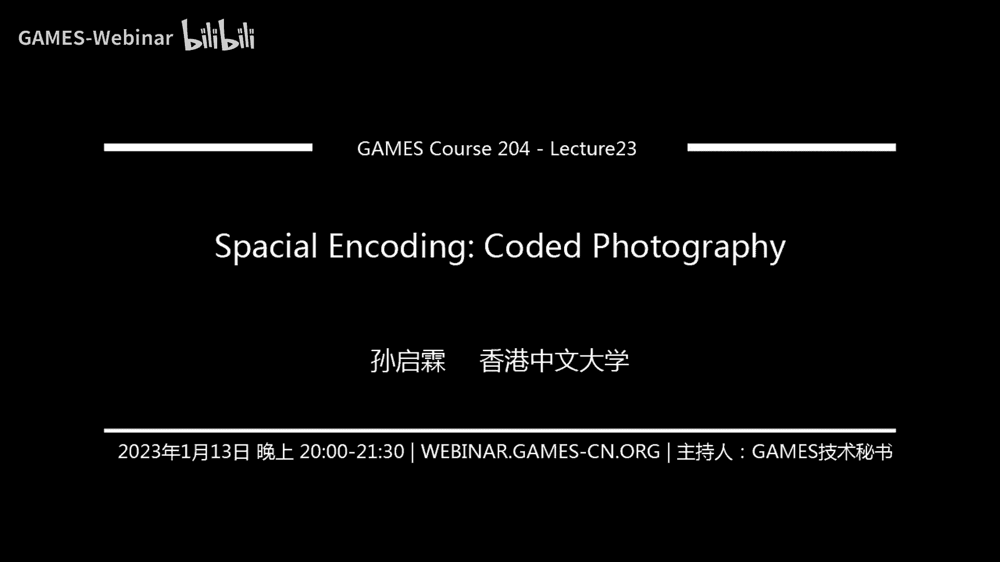

欢迎同学们来到games 204啊，今天给大家讲一个有意思的课题，在这个课开始之前啊，我可以给大家先掰扯一下，这个空域调制里面到底有哪些非常好玩的东西。

其实呢啊这节课我们会讲一些像cod photography，尤其是这个呃像cody这一部分，而其实呢像在我们计算摄影领域里面，它会有非常多的一些，在镜头上做encoding的方法啊。

比如说像我们加一个mask呀，无论这个是一个face mask或者是一个二指的mask，都可以对这个图像进行调制，除此之外呢，我们还可以用一些像自由曲面呀，或者是focus swap。

就是我们扫他的那个频率，有的时候大家可能都用呃，像这种旋转的p s f呀，都可以做这种special ecode，当然啊从本质上来讲，我们做这个special encoding。

基本上就是为了调节它的一个点扩散函数，当然除了很古早的一些例子之外哈，啊像我们最古早最古早的一种玩法哈，就比如说那个叫呃这个这个最枯燥的玩法，叫那个叫拜绿光片，大家当时当年为了看到彩色的情况下。

有这个拜绿光片诶，那个时候这个半径六光片，也是一种special equity的方法，所以说呢呃这个special encoding，它会有非常非常多的一种玩法，当然受限于我们这个课程的一个时间长度啊。

我们已经很接近尾声了，不太可能给大家覆盖太多的一个，special including的一些方法，所以说呢今天就在这里给大家挑了一些，非常典型的一些应用，就包括这个对于我们这个app进行ecoding。

这个app encoding，在无论是从啊差不多是从2000年以后吧，这里面的论文就变得非常多非常多，所以说啊今天会给大家讲讲，这几个有意思的案例哈，这些都取得了非常非常大的一个影响力啊。

这些论文都非常大的影响力，所以说同学们要学到这个呃，整个的一个special including的精髓，它既可以啊，比如说我们去做一个景深延展，也可以去实现hdr，唉甚至可以实现不一样的光谱。

这种都可以通过这种空域的编码方式，来进行实现，诶这个是一个非常有意思的一个办法，那前两天啊，我们从那个阿里这个达摩院的，发布的一个十大什么趋势，好像是其中有一条就是计算摄影。

所以说也更多的希望同学们能够，在这段摄影领域里面继续深挖下去，然后他的未来是非常广阔的一个呃，有非常广阔的一个应用空间跟一个研究空间啊，因为本身像我们计算摄影啊，它是一个涉及非常多领域的一门综合性学科。

它是一个多学科，就是比如说我们涉及了最新学呀，computer vision啊，光学啊，传统的光电成像，还有等等等等一些非常多的一些技术，当然我们最后可以通过这些啊多技术的融合。

取得非常有想象力的一个呃成果哈，跟未来特别是应用这方面，这个今天啊还有一段时间我们可以再聊一会儿，本身像这几年哈，特别是军事领域的发展啊，这个不知道能不能播哈，咱咱先说一说，在军事里面。

这个探测就会变得整个成像的一个探测，在无论是军事还有空间探测领域，都会有非常广阔的一些应用空间，就包括比如说我们要探测一个行星上诶，有一些什么样的地貌啊，或者是在医疗里面。

我们有比如说内窥镜的一些问题啊，包括现在很多大家在做这种腹腔镜的一些手术，它怎么样去呈现这个我们腹腔镜里面的，一个三维形貌啊，这传统的这种top肯定是不行吧，但是我们就可以用一些新型的方法啊来实现啊。

这个我们这种嗯直接的这一种嗯，用用点扩散函数或者是空域调制的方法来实现，我们这一个3d成像的这么一个问题，好我们再等一分钟，然后我们就开始今天的课程空域调制，因为本来这个空域调制是三节课的。

是三节课的啊，因为这个我们年前要把这个课程结束，所以说呃我就删减了一部分内容，只讲了这个比较经典的这个encoded apture，还像focus web的一些方法，大家要记住哈。

这个special encoding是可以做到非常非常多的事情，比如可以做3d成像啊，这个例子多光谱景深延展，还有一些一些非常非常多的一些案例哈，那我们今天就正式开始，我们一个进一步的一个调制方法。

就是之前我们是在食欲进行调制，今天就我们从食欲换到我们的空域进行调制，诶这个地方卡了。

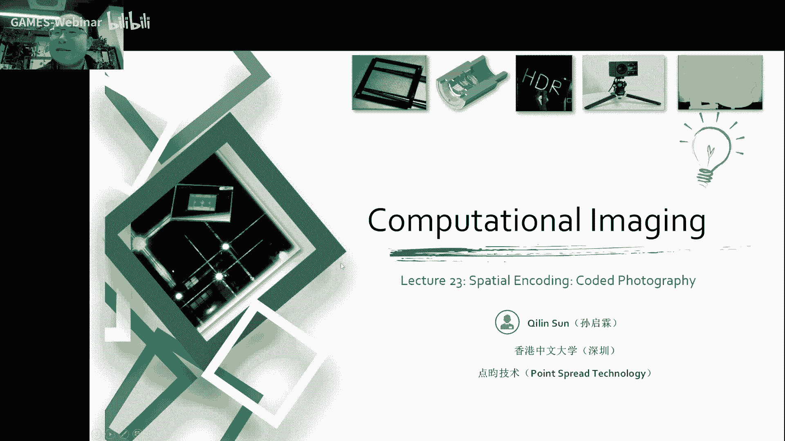

不好意思，首先呢今天我们的课程会涵盖四个方面啊，就给大家介绍我们这个空域调制的一个啊，整体的一个脉络，然后再给大家举三个例子哈，第一个就是code action，我们在这个我们的一个啊这孔栏上进行调制。

为什么要在孔栏上进行调制呢，因为孔蓝我们知道学过光学的同学，可能知道，孔蓝跟我们的相面有一个近似，数列变换的一个关系，所以说呢，通过在一个我们的这个app上进行调制呢，就可以很容易的知道。

我们在我们的一个下面上的一个点扩散函数，会是什么样子，所以说呢实际上我们是可以有效的，直接控制我们的p s f，但是呢我们要表现形式，要表现在我们的这个app上，另一种案例就是嗯要做景深延展的时候。

我们可以做一个focus web，这个idea是什么意思呢，我们在做deconvolution的时候，我们知道受限于镜头的景深，远了近了，它的点扩散函数大小会不一样，这个时候我们要应用一些算法。

整个底部就会变得比较困难，这个怎么办呢，我们很难让我们的镜头在不一样的深度，有一样好的表现，但是呢我们可以想办法让它一样坏，对不对，让我们各个深度不乐都稍微大一点，但是它不乐的均匀一些。

这个时候我们对我们算法来说，就会比较容易的去解它的这个blo，就是说后来人们就搞了一个focal swap，来做一个谨慎延展，但到最后我会把这个呃，整个的光学系统去进行一个一般化。

然后去适应各种各样的不一样的一些应用，本身呢说到这个coded aperture to code photography，这是一个传统的一个啊摄像的一个模型哈，我们在我们的一个真实的一个三维场景里面。

我们通过我们自己传统的一些成像的，一些透镜啊，在我们相面上，在我们的传感器上，我们拿到的图像通常是一个啊，这是一个景深的一个例子哈，聚焦的位置是中间的地方，它是比较清晰的。

然而呢离焦的位置它就变得模糊了，对不对，然后我们可以通过一些呃这个计算的方法，也就是我们一些底部漏的一些方法，来对我们在传感器上不乐的部分进行增强，来进行实现，拿到了一个增强的一个图像。

这就是我们传统的一个成像的一个脉络，然而就是我们想要通过这个cody的photographer，来提升我们相机的一个成像的性能怎么办呢，场景还是场景，对不对，我们可以用一些新型的一些光学系统。

再加上我们对我们这个光学系统，在光学系统里面加了一个调制，加完调制之后，我们再根据这个光学系统的调制，来给它对应的设计一些算法，最后我要想实现的效果。

想要比传统的一个photography的一个效果更好，你可以想一想，同学们可以想一下，这个有什么例子是可以实现，通过这种调制来实现一个更好的，一个成像的一个像质呢，同学们可以想象一下。

这有没有什么生活中的案例，生活中的案例哈，同学们想想有没有生活生活中的案例，最传统的最传统的一种方法，就是我们日常使用的一个彩色的相机。

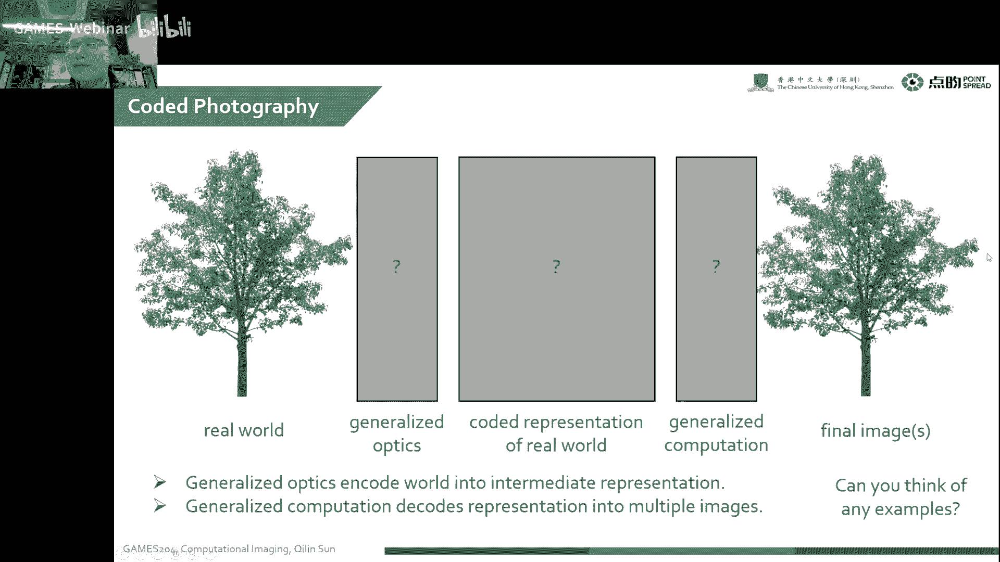

以前呢人们为了实现这个彩色，就设计了一种滤光片，也就是我们平常所说的白夜滤光片，它是由r g g b或者是l y c等，一些其他的一些呃滤光片组成，通过牺牲一定的空间分辨率，来最后实现了一个彩色。

也就是呢我们这个color fter位，把这个颜色信息encoding到一个马赛克里面，然后呢我们再通过去马赛克的一种办法，来把这个整个图像传感器上的一个图片，转化成我们的rgb的一个图像。

这个时候我们可以看到，在我们传感器上拿到的是呃这种code representation，也就是进行编码来实现的一种情况，然后呢我们在我们之前第一节就前面几节课，第六节课就讲到了一个图像的sp。

就给大家教过这个啊，卡拉夫特瑞去马赛克的一种方法，最后拿到了一个我们日常生活中，这个就是最经典最经典的一种，special encoding的一种方法，也是空间调制的一种方法。

当然这个时候呃还是比较简单哈，比较简单，大家可以玩一玩比较高级的一些东西，今天就带大家玩一些比较高级的一些，including的办法，最近呢这几年啊有一种叫光场相机的一种东西。

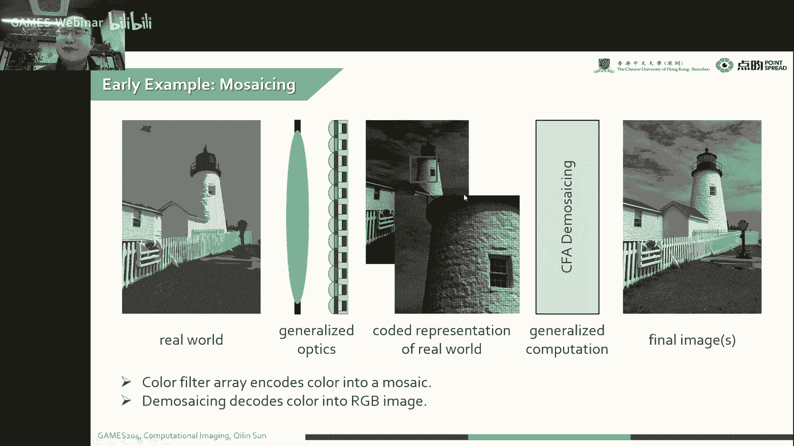

之前有一家公司叫letter，letter，是发布了第一款，就是我们面向消费级的一个光场相机啊，这个里面叫ufly optic opt camera，也就是它一个全光相机。

当然也不是捕捉到我们全光函数的，每一个维度哈，只是它的维度比较多，在我们一个真实的一个三维世界里面，我们之前课上讲过，他有他自己的一个光谱啊，把物体有自己的一个三维形态，光源有自己的形状，本身呢。

同学们的眼睛或者是相机作为一个观察者而言，它有自己的一个呃一个billion point in building direction，对不对，也就是我们呃物理的世界，通过我们一个呃这种一个透镜呢。

然后后面在他的焦平面上放一个微透镜之列，摄入我们这个啊透镜的一个光线的一个角度，实际上呢这个思想就是用整个相面的一个呃，进行一个分块，然后每个小块记录一个角度的一个图像，也就是前面放了一个micro。

就是在焦平面上放了一个macryarray诶，通过这种方式来记录光线的角度，当然它为了记录这个光线的角度，它牺牲了一个分辨率啊，这个牺牲分辨率，其实啊这个东西挺矛盾的，你想要的光场数量越多。

你牺牲的分辨率也就越多，呃同样的情况也适用在我们这个广场显示，其实在我们之前也提到过这个vr里面，其实后面是有希望啊用到这个广场显示的，当然想要把工厂显示来，做到这个非常高的分辨率。

也会有我们这个啊后面的一个背景的一个，这种显示器，跟我们这个mcaller array或者是啊它的一个冲突，但也有一些办法，比如说你双面胶合的，当然他这个计算量比较大，它是要做那个tensor的分解。

让我们传统的一些广场显示，就是我们加个micro sr，这时候就会给有一个跟分辨率的一个呃，冲突的关系，通过这么一种形式，我们在传统的透镜的焦平面上，加了一个微透镜阵列。

这个时候我们就捕捉到了一个它的一个工厂，我们把这个工厂再进行计算，然后再进行渲染，我们就可以拿到一个我们的一个final image，所以说前几年大家提到过这个先拍照后聚焦哈。

就是用了这种光场成像的一种技术，啊这个类似的玩法，这个除了广场哈，这个mrc ray还可以做这个v from coding啊，之前同学们听过这个，王崇利老师给大家做了一个guest lecture。

这个微缩电阵列呢，啊放到前面就可以做到这个拨弦的检测，它也是一种special encoding的一种办法，本身呢啊为什么啊。

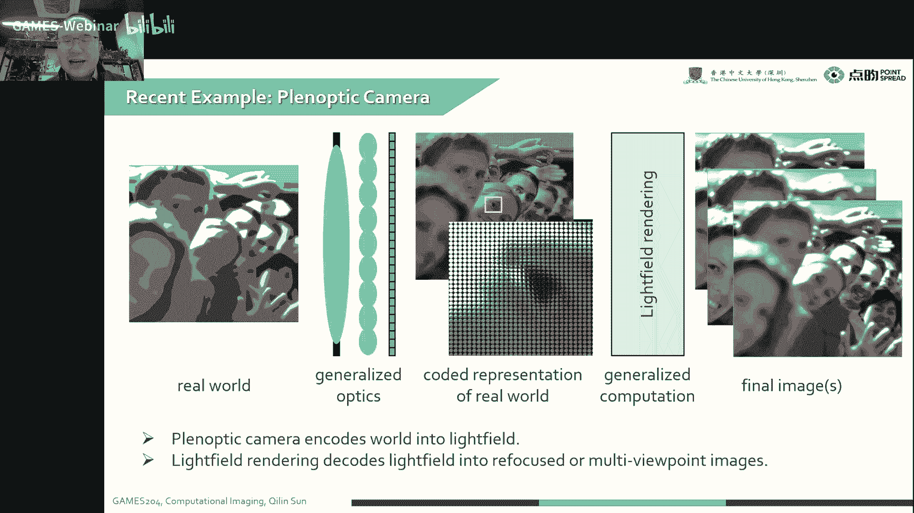

首先问一个问题啊，为什么我们图像会模糊呢，当然我们之前克里夫已经涵盖到了这一部分，比如说我们的这个透镜，它是啊不是理想的啊，这个像我们这个手抖啊，或者相机抖动也会带来一定的模糊场景的抖动。

或者是啊深度的一个呃，就是景深的一个限制，都会影响我最后的一个图像的模糊情况，这个在我们之前的课上已经提及过了，所以说今天呢我们要通过这种special including的方法。

来说一个景深延展的一个故事哈，首先呢要实现一个谨慎延展以前的做法啊，就是很难哈，我们要想要设计一个光学系统，要做到一个非常大的景深，这个是非常困难的，为什么呢啊还要从这个点扩散函数来说起。

就是理想的情况下我们会汇集到一个点，但是实际的啊这种情况呢，我们一个点是不太可能的哈，通常呢我们一个点到了一个啊传感器上，它就是一个不断ko，然后这个科呢到底是跟什么相关呢。

我们在传感器的这个p s f，是跟我们整个的系统，光学系统的哪个部分去相关的，同学们可以思考一下这个问题，哪个部分是跟我最后的点扩大函数，是密切相关的，这个我们在上课之前已经讲到了一些剧透哈。

已经剧透了一部分了，已经剧透了，也就是我们的aperture，直接决定了我们这个点扩散函数的一个形状，然而呢我们的这个深度，决定了我们这个布洛克诺的大小，就是我们最后的点控大函数长得什么样。

第一这个第一个决定因素就是我们这个孔蓝，孔蓝的形状决定了我们顶峰的函数的形状，深度的变化决定了我们这个布莱克头的大小，就是两个两个因素决定的，同学们一个就是孔栏，第二个就是深度。

比如说这是我们一个呃传统的一个单反透镜，我们知道像这个是类似一个五棱镜型的，一个就是五边形的一个app，类似五边形的一个app，当然我们一个理想的点经过这个五边形的action。

实际上呢我们知道大概是他们有一个近似的，一个傅立叶变换的一种关系，它的这个强度就是傅立叶变换的一个呃，一个absolutely value的平方哈，三我们固定这个app不变，我们换一个不一样的景深。

这个时候psf的一个形状是不变的，但是呢我们不一样的景深，比如说呃我在离交的一个部分，它的点光的函数是变大的，这个变大就是决定了这个p s f skill哈，这skill我们再继续变大啊。

景深继续变大啊，这个深度继续变大，我们发现诶，这个点扩散函数同样的也在继续变大，诶这是再继续变大，诶再继续编导，我们发现唉它基本上就是呃在焦平面的位置，在前面的一个呃理想的下面的位置。

它的是直接这一个点的一个点扩散函数，就一个f f t离得越远，它越大，离得越远越大，当这个类似的情况下，也是离得近越近越大，直到它突破了这个焦点的位置，这是我们呃app的一个。

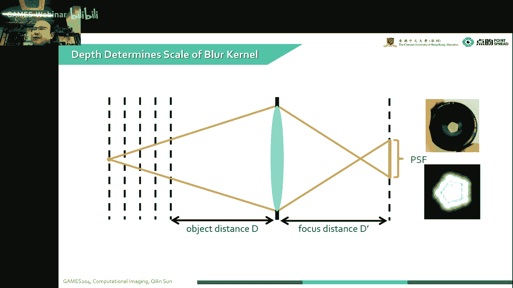

直接就决定了我们这个布莱克诺的一个形状哈，这个最左边这个是我们透镜的一个呃孔完，也就是我们所所谓的一个光圈，他们就是近似一个整个这个action。

有时候呃也叫一个optical transfer function，叫o t f，这个学光学的同学们可能会知道哈，他这个时候，我们这个这个o t f还不全是一个啊，这个并不是这个app的一个啊。

完全就意味着是一个optical transfunction哈，我们这个app上不一定是一个口，也可能是一个相位板，但是这个app整个的这个东西，才叫一个optical transfunction。

因为我们这里面没有一些相位的一些变化，它就是一个物理上的孔，所以说这个时候我们也可以把它叫这个，optical transfer function，当然在下面上我们这个布莱克隆啊。

他就是变pds bad function，就是它是一个o t f的f f t的一个关系啊，当然这只是进轴的情况下哈，这个同学们要到了轴y的时候啊，它还会有一些其他的一些相差哈，这个同学们要注意。

当然这是在不一样的景深下，我们测到的一个呃点扩散函数的一个变化。

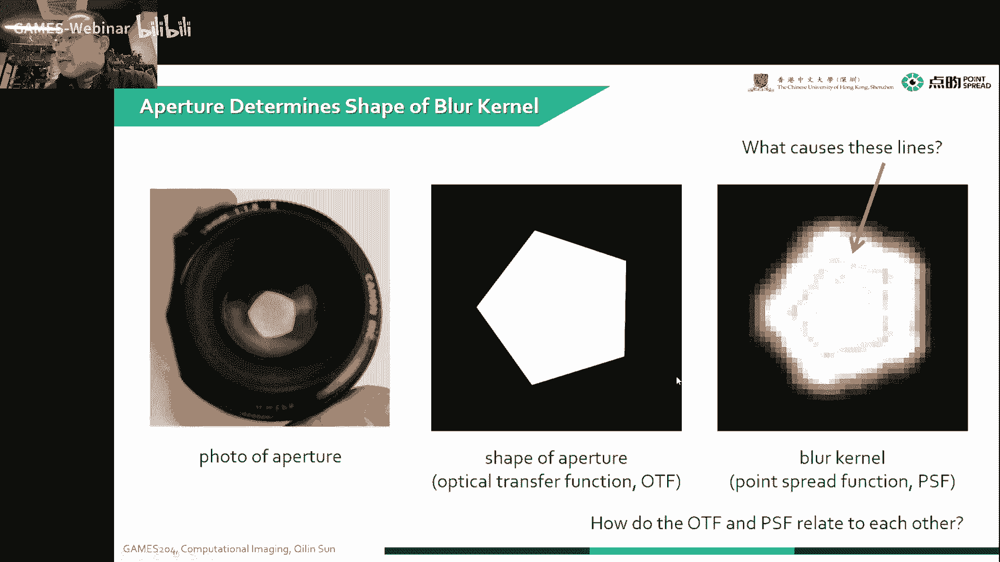

当然到了我们一个实际的一个物理场景，每个点都有它自己的一个深度，也就是每每一个深度，都对应着一个点扩散函数的一个呃大小，这个时候同学们是不是想想就非常难进行，就是做底部的一种处理呢，这种已经是比较难。

因为我没有办法直接去判断哪个地方呃有深度，所以说我们要直接对它做debug是非常困难哈，当然要在这种情况下，我们要做一个呃每一个位置都清晰的一张图像，是比较困难哈，比较困难，然后怎么办呢。

因为同学们之前给大家讲过哈，在这个做实际调制的时候，这种情况跟实际调制也非常类似，你这个阿idea基本上都是相通的哈，我们在做实际调制诶，我们有一个非常大的一个，我们在整个曝光时间段都进行曝光的时候。

它的一个频域里面它会有非常多的零点，当时我们想到的办法啊，这是我们在一个呃或一个encoding，它的一个exposure，叫coded exposure，我们在这个曝光的时候呢，给它加一些编码。

这个时候我们就会使一些零点的地方去掉，也就是在我们的频域里面看，我这个频率是更平了，我可以踩到更高的频率，同样的方法是不是可以挪到我们这种呃，空域里面调制呢，同学们想一想，同样的方法。

是不是可以挪到这个空域里面调制呢，我们看到不一样的深度，进行卷积之后会产生不一样的模糊。

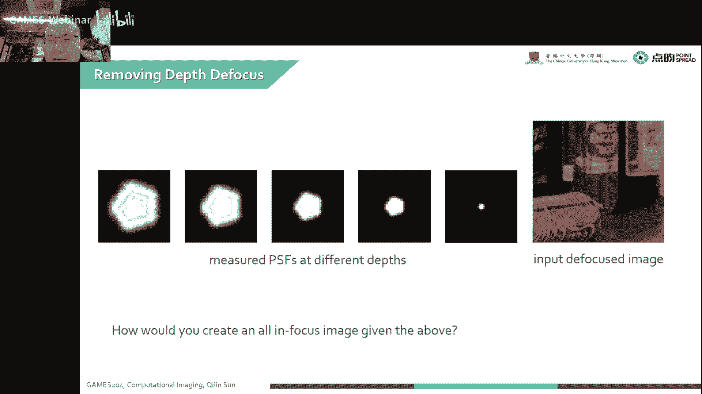

我们怎么样去做一个depth defocus的一个问题，来实现一个all in fox image，那这个呃有些像机器视觉呀或是车载，我们要判断路上情况的时候。

我们实际上是想要希望一个非常大的一个app，但是又有非常大的景深，让每一个点都清晰的聚焦里面，但理论上是不可能的，但是我们可以有非常多的办法，来提升我们这个景深的一个问题。

有的同学就说我们可不可以测一下，不一样的深度的点扩散函数，然后在不一样的深度给它进行分别的debul，其实是一个很难哈，因为很难，因为我并不知道我们并没有获得这个深度图，没有办法根据这个深度的一个位置。

来给他进行有针对性的一个地步了，但是想一想我们这个code exposure，我们可以在时域上进行编码，我们是不是也可以在空域上进行编码呢，对不对，我们在空域上进行编码，在我们的频域里面。

在对应的频域里面把它的一些零点消掉，把我们想要采集的频率，通过我们这种编码的方式来进行提升，这就是我们code的apture的一个核心思想，我们可以看到这种变化的点cos函数，是非常恶心的哈。

它不一样的这个位置我做底部。

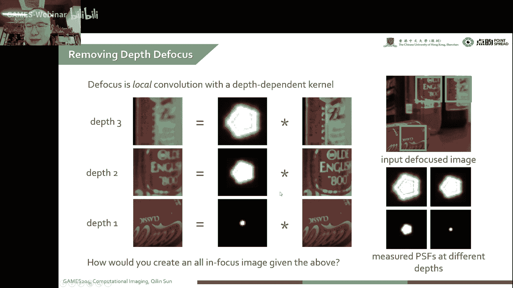

这他那个效果是特别是这个点炮的函数，特别大的时候，他这个效果是非常差的哈，非常差的，所以说针对的办法我们是呃，要进行一个在app上进行encoding，来，在我的点扩散函数里面。

保持住我们想要的一些频率，啊这是我们传统的一个啊，左边是我们传统的一个单反透镜，它的那个app就是一个clear app，就是一个就是一个洞啊，右边的这个是一个编码进行apture。

它是一个二级的一个mask，二指一个mask，当我们当年的时候看论文哈，就看到这篇啊codapp的论文的时候，我们看这个mask是咋算出来的呢，我为什么能算出来这么一个形状的mask。

来实现我最佳的效果呢，啊同学们可以想一下啊，我第一次看的时候也有这种疑问，当年是怎么样找到这么好看的一个mask，它取得最好的效果呢，同学们猜一猜哈，这个没有啥技术含量哈，他们猜一猜这个这个这个形状哈。

这个encoding这个形状，它这个图案为啥是这个样子，当时我第一遍看中文没看明白，看到第二三遍的时候才发现，他这个action的这个这个这个编码哈，居然是穷举算出来的，他是把每一种都试了。

然后最后挑出来一个最好的，这位同学说的非常对哈，是多试几次，他是把每一个都试了哈，然后呢本身像我们在一定的深度，它一个点扩散函数是这个样子，当我们引入我们对它的一个呃，app的一个调制之后。

我们看到它的点扩散函数，现在是不是encoding的一些这个高频的信息呢，在有同学说这个大力飞砖啊，这个唉当年确实是，不，过，我们今天哈我们要再设计这么一个呃app的时候，你要再用这种方式。

那肯定论文中不了，所以随着时间的发展，我们这个本身这个技术也会不断的提升，所以今天呢就我就鼓励同学们，今天听完这节课之后，可以做一篇论文诶，这怎么样做去，我们去可以用做一个可微的一种方式。

把这个app进行encoding来去啊，做那么一个最优的一个mask哈，因为当年这个mask分辨率并不高，就几十乘几十的一个可能是32还是16，32x32还是16x16，这种穷举法是可以的。

但你要搞个高点的分辨率，128x128，这个可能就玩不了了，没有啊，你这个32x32就是二的32次方嘛，这个也还好，对这个还好，可能是16x16吧，我记得不是很清楚了，但确实是穷举法的。

我们这个时候我们在这个对action including之后，我们p s f就变成这个形状，实际上我们在频域里面是有一定的一个提升的。

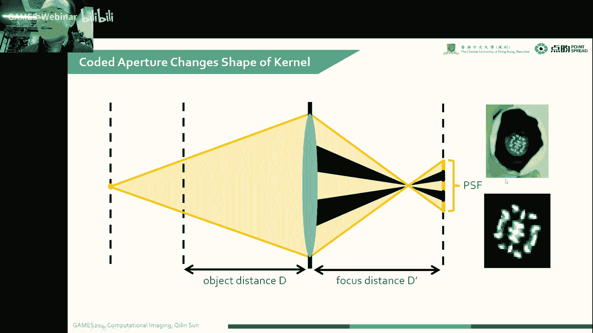

我们通过这种cod的app的方式，来改变了我们这个p s f的形状哈，这是左上角，是当时他们做的一个圆形，其其实哈这个相机是镜头是不太好拆哈，不太好拆。

那个时候他们为了把这个这个app chencoding，他们是怎么做的呢，直接把那个镜头给锯开了哈，这个就把这个相机给破坏掉了哈，嗯本身呢，如果我们要拿到一个all in focus的一个图像哈。

就是它每个地方都是清晰的，当然我们要通过一个传统的一个点扩散函数，就是一个大原班，我们发现这这这个给给这个清晰的图像，进行卷积之后，各个地方诶没有高频，高频，该抹掉了，全都抹掉了。

右边呢像我们这种coded aperture，它是通过这种引入了一部分高频的信息，也就是哪怕是我们卷积之后，一些高频信息还是会有保留的啊，一些高频信息还是会保留的，唉所以说呢。

唉我们最后我们可以看到传统的一个透镜，我会捕捉到这么一个点框的函数，但是呢我们这个里面的一些亮点哈，它就会有这种带给我们这个pattern encoding的，一个点扩散函数的一个变化，当我们看到啊。

在频域里面看这个code apture，是怎么样把这个变化的呢。

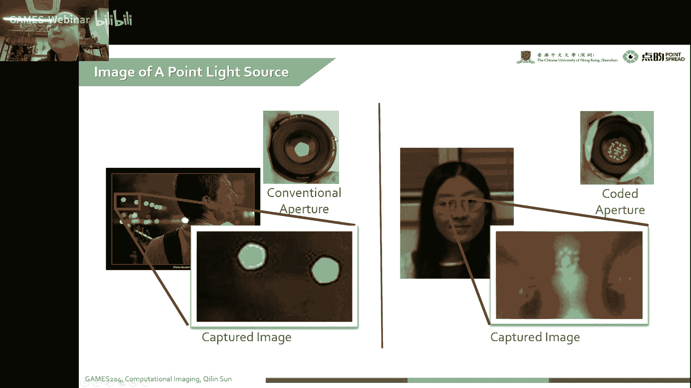

就是一个圆一个圆一个圆形的一个点框的函数，我们在做这个f f t做了一个变化，变化大的一个频率，我们发现它大概就像一个衍射斑一样哈，衍射斑一样，中间能量非常强，然后一环一环的诶这么个情况。

我们这个coded aperture呢，我们对它做一个分列变换，你就发现再往的频率啊，我们可以看到啊，这个这个同学们仔细观察一下，这两个频率的图像有没有什么区别哈，我们想一想，中间这个地方肯定是低频嘛。

能量都在低频，这个地儿边缘的地方是高频，就很明显哈很明显，就是我们这个code的一个边缘部分有更多的高频，也就是我们保留了更多的一些高频信息，当然我们看到啊，我们传统的一个点扩散函数，它是有零点的哈。

就是在我们中心能量的旁边是有零点的，我们知道频域的成就，我们做卷积的时候，频域的乘等于时域的卷，也就是卷积在我们频率里面做卷积的时候，也就到了我们频率里面实际上去做点乘，对不对，当我们一个高频的图像。

跟我们这个传统的psf的这个呃频域相乘的时，候，这些零点啊就意味着我们这些信息完全丢掉了，对不对，同学们这个而且边缘的地方没有高频信息，直接就被这个这个ipad，它就是点扩散函数的一个频率直接给干掉了。

高频信息就完全抹掉了，而且在呃这个他会有零点，有些信息就完全抹掉了，但是我们这个cody action呢，我们看到它基本上是没有零点的，也就是我的大部分频率都是有所保留了。

然后呢我们看到边上一些高频的信息，也是比较有效的进行的保留，同学们注意这一点哈，一个圆形的p s f跟这么一个调制，调制过后的一个psf，它在频率的保持能力哈，我们这个code有一个本质上的提升。

我们这些频域信号的保留住了，然后后面我们可以通过算法，把这些保留住的频率再进行一步一部分的恢复，从而实现我们最好的一个重建的一个效果，因为有信息才可以进行重建，没有信息，那你就是呃瞎猜了啊是吧。

所以说这个时候我们输入的图像是这个样子。

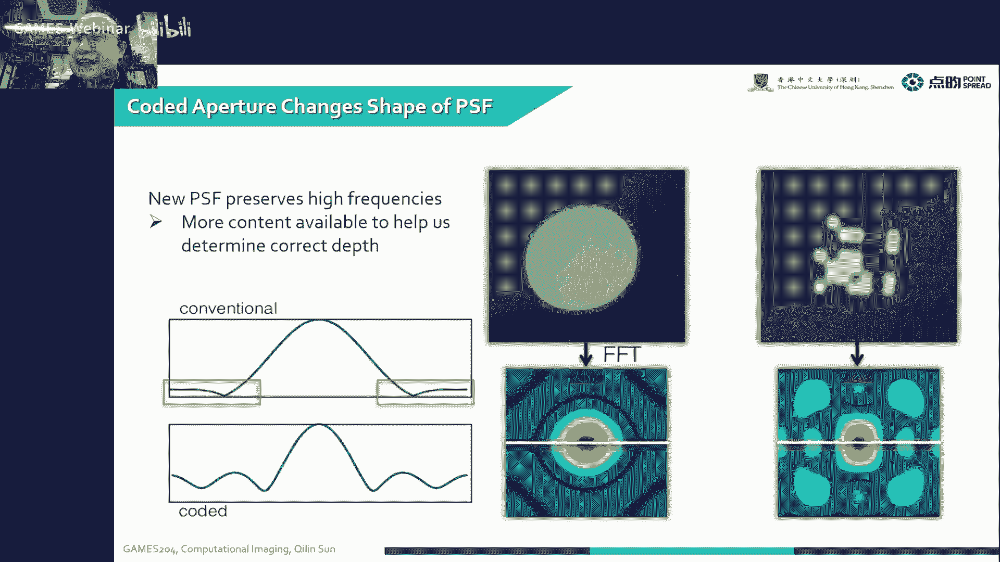

这是一个理想的，每个地方都啊聚焦了非常好的一个情况输入，然后做一个deconvolution，然后呢我们要对比一下这个标准的一个apperture。

跟那个coded aperture有没有什么样的区别哈，当我们做这个底部链的时候，不一样的，这个这个app这个点换的函数的一个大小，它是会非常影响这个decoversion的一个结果的。

我们可以看到大小相符的地方，比如说这个natural这个标这个字的时候，它的抵抗不是效果比较好，但是本身呢像前面这些薯片啊，可乐呀，它这个他的这个啊p sf，跟我们啊就是预设的这个psf不一样。

他那个节卷机出来这个artifex就比较多哈，我们coded or捕捉到的图像就会是这个样子，我们可以看到，当然我们是通过这种编码的方式，我除了对我们已知的图像。

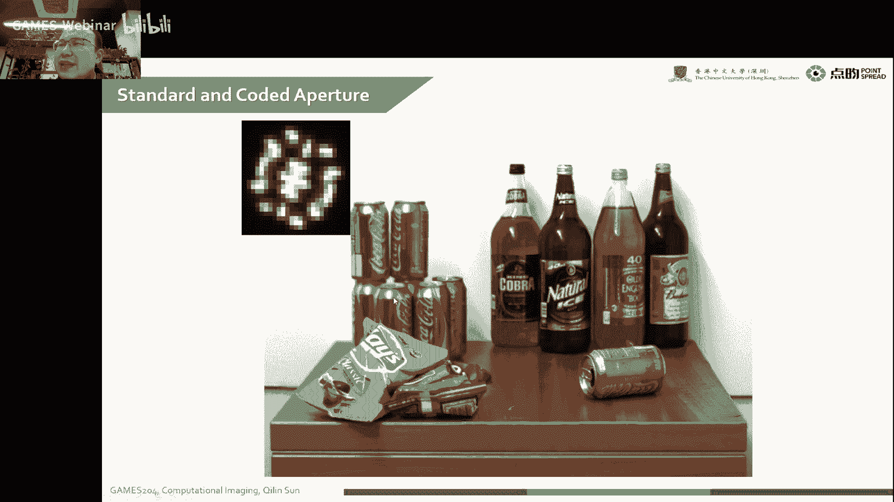

可以拿到一个all in foxes image，也可以通过这种编码的变化，来进行一个deft的重建，我们知道了预估了每个位置的一个深度，然后可以通过这种办法呃，进行各个部分的一个重聚焦啊。

我们已知深度了，我就可以呃想让它在哪个地方清晰，就让哪个地方清晰，背景就可以模糊掉哈，这个就是refoxing的一种啊，玩法大家可以看到诶，我让他假装聚焦在前面啊，这个假装聚焦在中间，假装聚焦在后面。

这是都是来源于我们对通过这个cody action，对它的一个深度的进行一个估计，这是一个深度估计的办法，其实哈近几年我们可以看到，就是整个cv界里面有非常多的这个弹幕，来估深度的一种办法。

当然这种啊只是通过数据集估，它的一个相对深度是比较难估得比较准的，哎所以说后来啊，但是他那个相对相对相对深度是可以估的，还不错哈，还不错，当然工业跟车载里面肯定不会用，因为这个毕竟是猜的。

所以说呢相对深度比较好，我们可不可以用什么办法，来使这个单目深度估计来过的比较好呢，因为我这个通过一个神经网络啊，我只能比较好过他的一个单目的，一个就是一个相对的深度，这个时候怎么办呢。

同学们有没有什么idea，来去对这个弹幕的一个深度估计，进行一个有效的提升呢，单目深度科技，记住哈，弹幕只是弹幕的一个深度，估计可以比较好的估出它的一个相对深度，这怎么办呢，聪明的人类就有一篇论文哈。

看到非常有意思，它是通过一个单点的一个测距仪，测到了一个图像的某一个点的一个深度，这个深度是准的，然后以这个做参考，然后再结合着弹幕深度估计诶，这个时候就拿到了一个啊，有一个点的一个深度估计的一个情况。

再进行结合着这个弹幕深度，因为相对深度是准的嘛，它结合着一个点就可以拿到一个比较好的一个，这种深度估计的结果哈，这是一个单位估计的一个小trick，当然本身这种瞎猜啊还是不太好。

因为它没有一个物理的保障，所以说呃有非常多做计算摄影的一个同志们，可以就用这种啊special including办法，我让不一样的深度有不一样的点扩散函数，这个时候我们通过这种变化来估计。

我们最后的一个啊深度的一种啊，值就有两个公司哈，有两个公司是做这种呃，通过点扩散函数的变化，随深度的变化来进行估深度的一个叫double helix，double helix不是公司还是一种方法。

叫double helix，它是一种显微镜里面常见的一种方法，我们要做三维的显微镜哈，我这个不大可能通过这个光飞行的时间来去测，这个也不大可能用双目哈，这个结构光也不行，咋办呢。

就只能通过这种点扩散函数的变化，他是怎么设计的呢，这种double click，它点cos函数，就像这个我们这个脱氧核糖核酸一样，它是一种双螺旋的结构诶，它就像两个点不一样的深度，这两个点在变化啊。

两个点在变化，最后可以比较好的估计出来我们深度的变化啊，类似的一种做法，有一家公司叫艾瑞斯v d啊，是美国还是加拿大的一家公司啊，这些圈里我们都很熟哈，这这公司就做的。

通过这个光学进行不一样深度的一个点，光大函数的变化，来进行一个三维的一个深度的估计，这是啊我们这个code的一些嗯，结果输入的图。

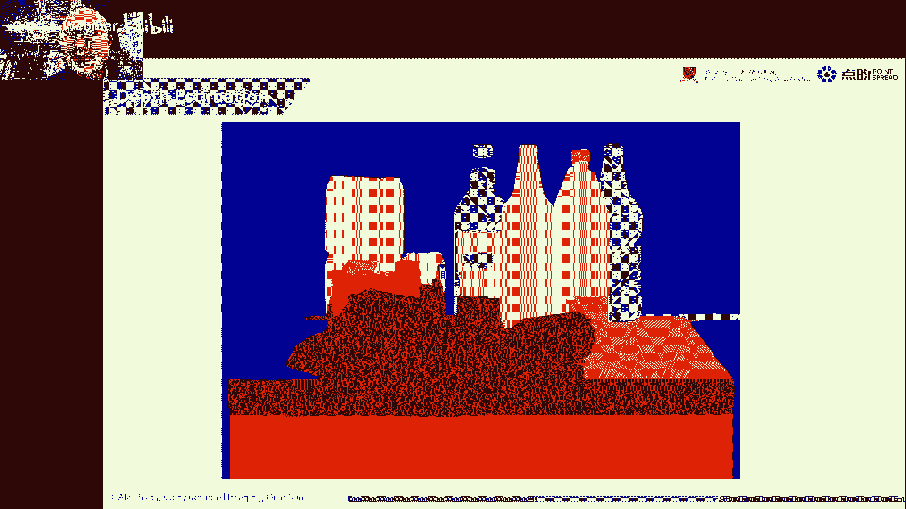

all in fox，这是一个清晰的一个，这是一个coda的一个，然后做题conclusion的一个结果，然后我们可以估深度呀，然后对这个深度进行refoxing，这个是非常有意思的啊，一篇文章。

来同学们想一想，当我们用这个code的时候，它有没有什么缺点呢，有没有什么缺点，就以我们这个手上的这个code action，就是图图里面展示的这个为例哈，首先我们丢失了一部分光。

对这个同学说是光能损失，就你这个透光的地方越少，它这个光头损失就越大，这里面大概是一半啊，这里面大概是一半，然后还有没有什么其他的一些呃缺点呢，对极限情况下等于小孔图像，也就是说我们在这个当时哈。

我第一遍读这个论文的时候也会发现真空，我们这个每一个它像一个二维的，一个像一个二维码哈，我们这个二维码这个每一个小项点，它大一点好呢，还是小一点好呢，大了之后最大之后就变成一个一个孔了吧，小了呢。

每一个点就会带来它的一个衍射的一个效应，所以说这个大小哈当时也是做了一个平衡的，同时呢我们这个psf，你别看它就including了一些高频，然而它还是会受到这个深度变化的一些影响。

也就是这个形状是控制住了，但是我的大小还是会受到唉，这个深度变化的影响，啊我们刚才讲到了，我们对这个点换的函数形状的控制，我们可不可以控制它的大小呢，这就是我们今天的第二部分。

就是对这个focus swap，来控制一个均匀的一个大小，从而实现一个景深的扩展，我们知道啊，这个不一样的深度，决定了我们点扩散函数的大小，对要聚焦的位置就会理想的一个点，它就是一个呃衍射斑。

但是大了之后，你会发现他的一个skill，是会随着深度的变化而变化，当我们聚焦到不一样的位置，但是它还是会随着深度的变化而变化，这个是呃没有办法的事情，但是呢，我们最不一样的这个大小的点扩散函数。

很难debu，我们可不可以让它一样的坏，对呀我不一样好，每个点每个都是一个非常小的p s f很难，我们可以可不可以让它一样坏，就是都是均一的一个大就好了，然后我们对这个大的一个psf进行解卷积。

这个时候人们就想到了一个focal swap，的一个idea，这个售后swap是咋实现的呢，比如在我这么个深度的一个位置，曝光很多很多帧，每帧呢有一个对焦位置，然后把它加起来，就在我曝光过程中。

我是在调焦，从而呢我们最后可以拿到一个积分起来的，一个点光参数，也就是我们对这些扫描的时候进行积分，拿到一个军医大小的一个psf，但是呢虽然这个psv已经损失的比较高频，但是我解剪辑的时候嗯可能还行哈。

解的结果还行，这个他有什么异样的优点缺点吗，同学们想一想，优点就是我的这个点峰赛函数，不再随深度而变化，但是呢他损失了一部分很多的高频信息啊，不是一部分，就是每一个经过这么一个难看的一个，点控的函数。

它的一些高频都会损失掉，也就是我们那个锐利的边缘，都被这个呃大大的p sf给磨平了，但是呢嗯我们虽然不能捕获到每一个位置，都非常的一个清晰可见，但是呢我们通过这种方式，拿到一个均一的p s f。

我们就可以简单的一个简单的做一个deconution，来实现啊，这种我们这个非常大景深的一个成像，哎同学问同学有两个问题哈，刚才我们做code action的时候，我们是可以啊，估深度的。

同时呢我们估了深度也可以做这个refocing，那这种focal swap的一种玩法，可不可以来估深度来做refox呢，这个答案肯定是不行的哈，因为我们最后拿到了一个啊，随着深度不变化的一个psm。

扫完之后都一样哎，都一样的意味着什么呢，就是我们所有的深度信息都丢失了，想要估深度，这就是让每个地方不一样才行，所以说刚才像个double helix一样，还像d都是专门设计光学系统。

让不一样的深度有不一样的点化的函数，当然这个时候我们要刻意的保持住高频哈，它不能像传统透镜，你这都模糊掉了，你重建的深度没有边缘了哈，这个也也不好，所以说要专门设计一些关于系统来啊。

通过不一样的深度来进行编码，来实现一个呃深度的估计，这是一个focus swap的一个原型哈，它有这种调的时候。

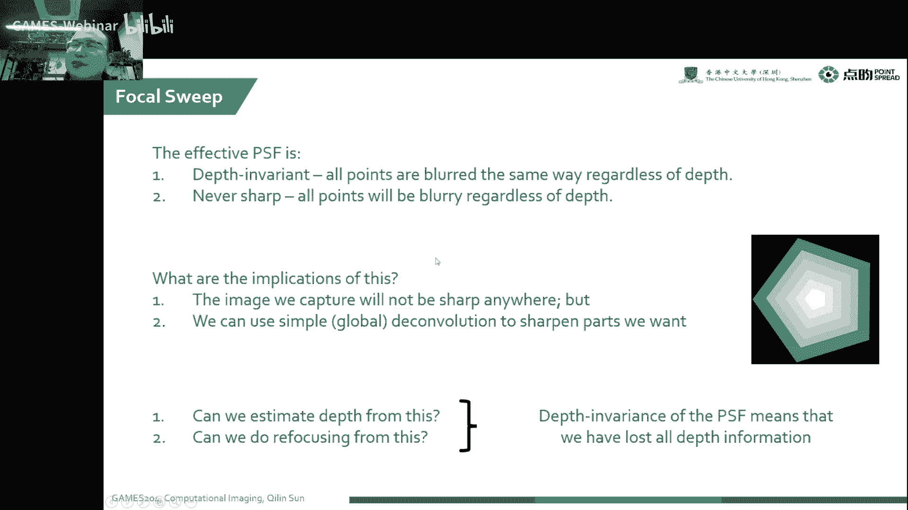

积分的时候，我们在这做对图像进行积分的时候，啪一下调焦诶，这事就搞定了，像我们传统的一个呃相机的一个点扩散函数。

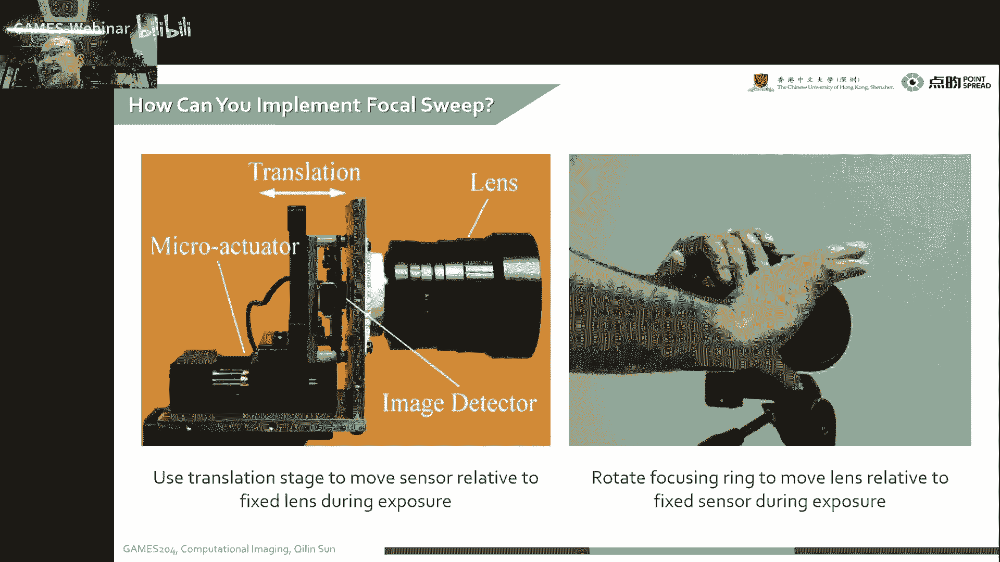

我们看到诶，不一样的，当然我们可以看到这个focal swap，的一个点空单函数，你看它右边，它基本上随着深度不咋变化不大变化。

这个有时候也叫extended depth of field camera，也就是请伸延展相机来谨慎延展，不止这种方法哈，我们也会有非常多的一些景深延展的方法，来实现我们最后的一个啊大景深成像哈。

当然这个大点声前提是要保住它的光圈，光圈足够大，这个时候我们做到了，这个景深成像才会有一个比较好的效果，这是我们对这个啊不一样这个景深的一个对比。

我们可以看到啊，左上角是我们这个呃focal swap amazing，直接拍到的图像，它是一样的弧一样的坏，右边呢是我们做的这个conclusion的一个图像，左下角呢就是我们传统的一个这种镜头。

拍到了一个地方聚焦的位置，清晰理焦之后就模糊了，当我们做一个对他做的conclusion的时候，其实挺困难的哈，这个时候我们本身的这个呃图像，我做deconclusion的时候，他也受到噪声啊。

或者不要这个啊，点关函数的一个大小的一个影响，最后拿到了一个图像，解出来总是有这些artifacts哈，有些artifacts，我们用这种focus sweat sweep的方式来实现呃。

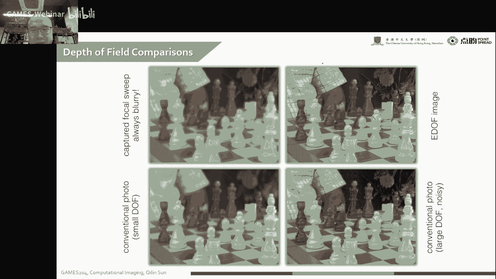

我们这个景深演讲的时候，同学们想一想他有啥一些缺点呢，就最简单的一个缺点，就是我们有一些机械的部件需要它进行移动，所以说呢呃它会有一些像这种扰动啊，或者是motion blur的一些问题。

然后第二个缺点就是我们这个深度不变啊，深度不变，对我们这个整个的一个调教的一个速度，要求是比较高的哈，这个要求比较高的，还有恒定的一个扫描的速度，然后第三个部分就是我们丢失了一些深度的，一些信息啊。

它是一个随深度变化的一个呃，随深度不变的一个psf，当然那最重要最重要的缺点这里没列出来，就是它损失了非常多的一个频率的一个，高频信息，所以说呢这个东西啊玩一玩是不错哈，但是很难用到实际的一个呃。

就是生活生产中中之中，我们可不可以用一些更好的方式来实现这个呃，来对这个景深进行延展呢，我们可以用一些generalized optics来进行调制，可不可以呢，其实是有办法的。

当我们就是传统的一些呃透镜哈，就是一个单透镜，我们可不可以用一种像自由曲面呀，或者是一些呃其他的一些微纳，一些微微纳的一些调制，微纳一些元件的调整，比如d o e或者是超表面的一些元件进行调制。

来实现一个呃就是整个的一个景深扩展呢，这是一个就是拨弦调制的一种方法。

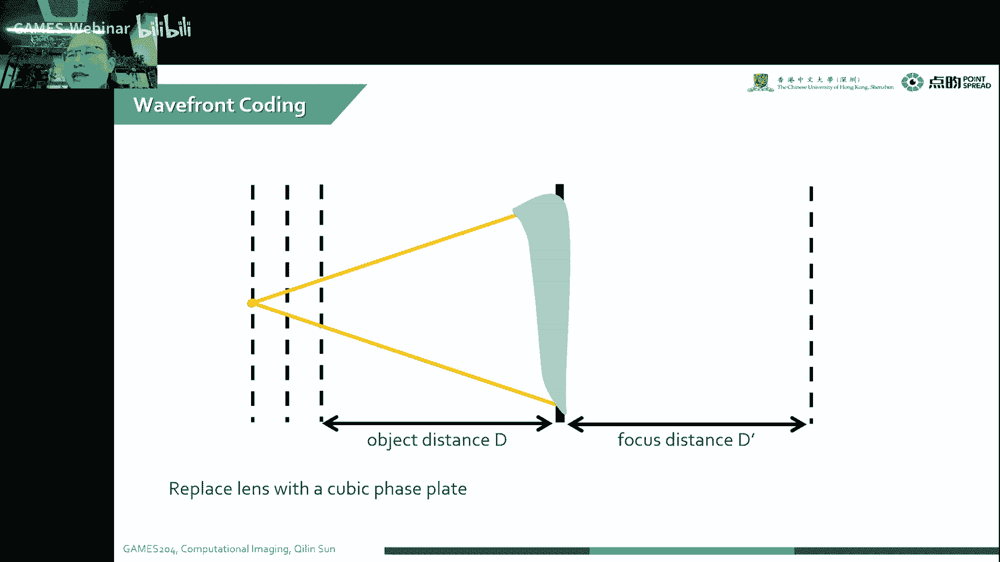

就是用了一个三次相位板，我们传统的这个就是在这个app上就in fox，在聚焦的位置，一个非常小的p s f离焦之后呢，我们可以看到哈，右边这个点空单函数有一个非常大的一个班啊，非常大的一个班。

当我们进行用这个三次强化版，也就是微from coding的一种办法，来进行调制的时候呢，我们可以发现在我们可以保持住在中心，保持住一个比较高的能量，然后保持住一定的高频，但是呢他是牺牲了呃。

就是其他两个方向的一个分辨率，也就是在我们这个xy方向，它是有应对牺牲的，这种方法是可以比较好的对景深景深进行扩展，但是有一个什么问题呢，就是我在xy方向扩散的能量比较高，比较高，会有什么问题呢。

就是有特别亮的一些地方，我这些周围的psf，会让我这些周围的点再次饱和掉，这个时候也就是我们通过这种为防的coding的一，种办法来进行景深延展的时候，我会牺牲一部分的一个动态范围，就是特别亮的地方。

总总是有问题的，这是当然了，要避免这种三次相关板的一种呃。

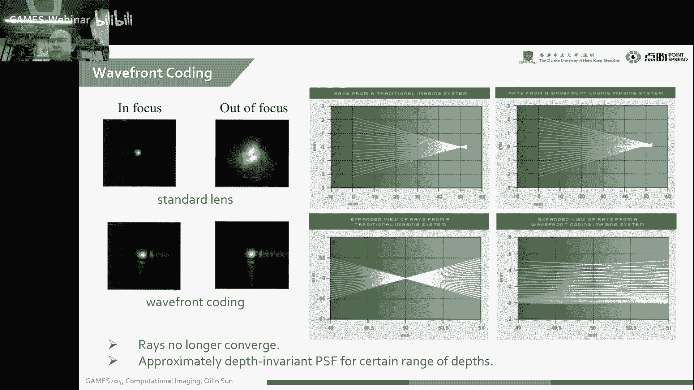

就调制损失这个动态范围的一种办法，但这个很难哈，这个到现在也没有完全解决掉啊，这个对这个动态范围的损失的一个问题，当然除了像我们刚才讲到的一个，三次相关版的一种方法。

我们还有一种lightest length的一种方法来，也就是每个地方有一个啊，它有一个自己的一个小特性进行调制，也就是用一个list light array，来调节我们不一样深度的一个呃焦距吧。

这是一个lettuce lch的模型，也就是在我们的这个嗯在我们这个镜头之前哈，我们加一些小的一些透镜，但这些小的透镜呢有不一样的一个焦距，不一样的焦距，这个时候我们通过这种调制啊，这个也就是这个上面。

直接是直接挪到这个透镜上的哈，通过这么一种方式，我们是可以encoding，很多不同景深的一些高频信息，然后把这些高频信息including在我们center之后，还是信息捕捉到了吗，不知道了。

我们再去解这个高频的信息，哎这就是一种lettuce lunch的方法。

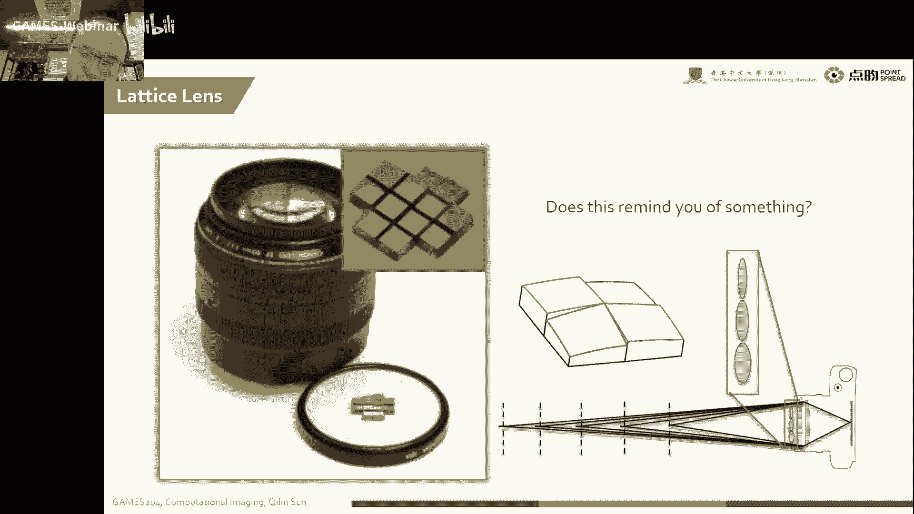

我们可以啊非常有效的啊，去捕捉到我们想要的一些信息，当然它是一个呃4d light field的一个小的一个呃，就自己本身呢我们想拉着锯子呃，包就是fd捕捉的是一个4d的一个信息。

但是我们这个image本身呢，它的一个谱是一个二级信息，深度是一个1d的信息，我们后面两个就是xy，再加上深度是一个3d，最后呢呃我们这个想要拿到一个本身哈。

我们通过这种lettuce encoding它的一个点cos函数，它是一个随深度变化的一个变换函数哈，它并不是不变哈，所以说呢通过这种encoding，我们还是需要对不一样的这个深度进行。

分别的节卷积啊，这个时候其实对应用也带来了一定的困难哈，这是一个传统的一个啊标准的一个途径哈，standard length聚焦的地方诶非常清晰。

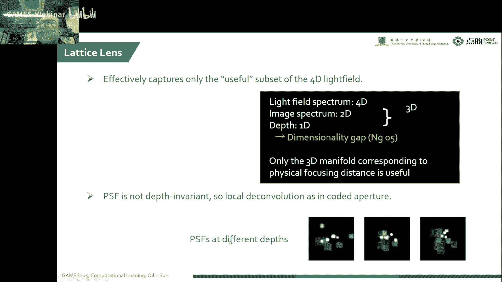

提交之后就会变得模糊，这是一个lettuce length，拍到了一个情况，我们看到哈，这个比之前哈我看到背景前景背景变好了，前景坏了一点，坏了一点，但是这个时候可以接受哈，可以忍。

这一个标准的一个透镜，就是let is length拍到的一个呃，这个图像它是对有效地对高频进行了调制，这里一个标准透镜，life is length。

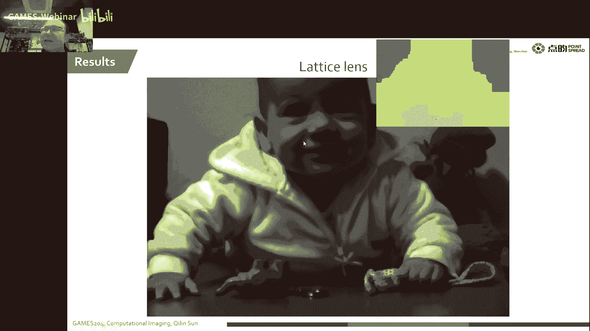

我们可以看到这个letters lse啊，虽然说这个拍到了这个artifacts会有一些好，但是它是可以比较好的保留前景，后景的一部分高频哈，当年那个时候大家可能算法呃，基本上只有这种优化的一种方法。

同学们可以把当年的记，像这个lettuce list的一个嗯，玩法呢换到今天，我们可以通过这种方法，再换一个深度学习的一个重建网络，大家再看一看，重做一遍这种实验，看看我们的这个效果。

会不会有一个本质性的提升，我相信是有一个非常好的一个有效的提升，但这种方法因为我们这个深度点化的函数，随深度变化还是有的哈，所以说这个时候我们是可以啊，比较好的估算它的一个不同位置的一个深度的。

我们能过了深度之后呢，我们就可以对这个图像进行refox，就是啊，就是我们在拿到一个all in fox的一个图像之后，我们根据这个深度的图啊，对啊背景比如说做个布乐呀，做前景做个不乐呀。

来做一个refox的一个效果，这是一个refox的一个效果，不一样的深度的一个距离，当然我们对这个after encoding，就是这个special encoding有非常多的方法。

这个包括像我们标准的一个透镜啊，像code action啊，像focal swap，we found coding，然后还有一个letter length，我们都是有一个呃比较好的一种。

就是我们对不一样的这个以后这种办法来做，对谨慎延长这个特殊情况进行了一个比较好，进行一个比较，我发现这个code action其实嗯效果是比较好的，但是他对一些极限的一个深度就比较难以把控。

极限的深度比较难以把控，所以这个对一个一些比较呃，非常非常大的一个景深的情况下，这个lettuce认识表现是比较好的哈，这个微风的coding呢，当然现在微商coding也有一些比较好的一种啊。

结果同学们啊下了课可以去嗯google scholar，搜一下最近的一些special encoding的一些方法，但除了这个之外，哎我们还可以啊，对这个special including。

我下节课会给大家讲到一些，就我们这个这几年最新的一些研究成果啊，这个时候会有一些呃，除了谨慎延展一些其他的一些，special encoding的一些方法方法。

这是一个diffusion code photography。

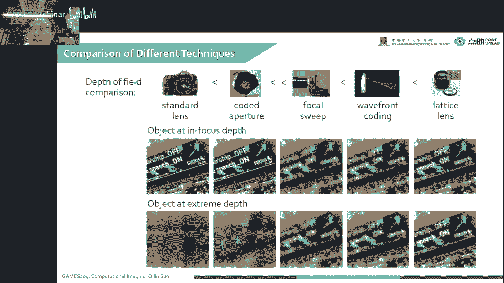

它是用了一种啊滤光片啊，是不是这fer直接把这个diffuser放到这个呃，放到这个app上了哈，它也是可以啊，比较的实现这个有效地实现，这个景深的一个延展。

今天呢就给大家简要的介绍了一个code photographed。

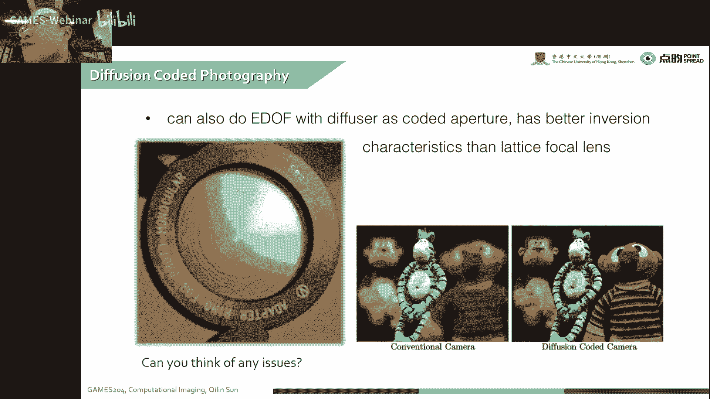

这么一个玩法，然后呢它包括这个code aptor，focus swap，还有一些其他的一些generalized optics，呃，为什么，let us length，这你这整个问题是什么意思。

这这个peter陈同学，为什么lettuce，哦你说这个letters lcode这个景深延展呢。

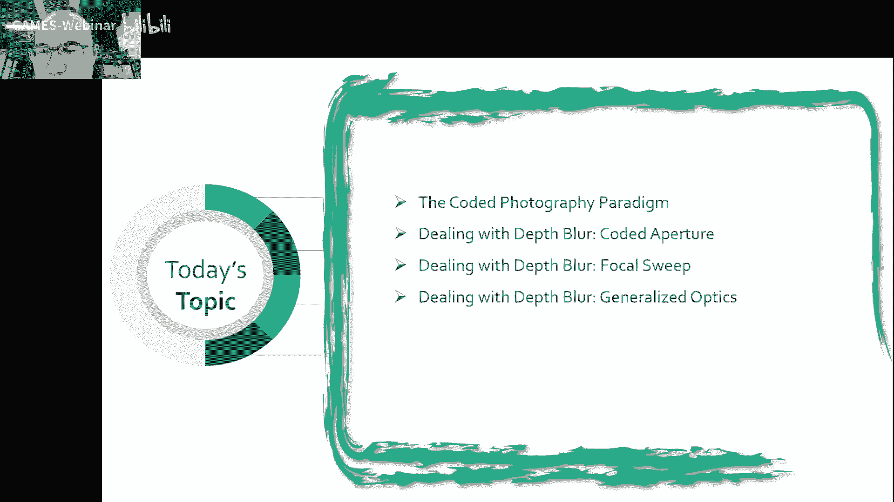

你说效果会就是极限的一个景深延展会大一些，对不对，这是为什么呢，我们这个letters lunch本身啊，上面我们可以加不一样的一个focal length，这个时候也就是对我最后不一样。

景深的一个高频调制会更好一些，但是我cod的app本身我是copy code，本身是已是对那个点扩散函数引入了高频，但是我这个code aptor随着深度还是会有变化的。

就我景深离的离这个聚焦位置特别远的时候，我这个code的app还是很大，这个时候我高频损失还是比较多，所以说在比较极限的情况下，这个lateli会比较好的保持。

就相比这个code action会保持更有效的，保持更多的一些频率，所以说我最后恢复的一些信息啊，也就会更多一些，也就是为什么let us be coded action。

在极限的情况下会表现的更好一些，当然在有效范围内哈，还是这个code action啊，这个图看起来更好看一些哈，好今天的课程就到这里，同学们有什么问题吗。

嗯这个这有同学们有投入产品的吗。

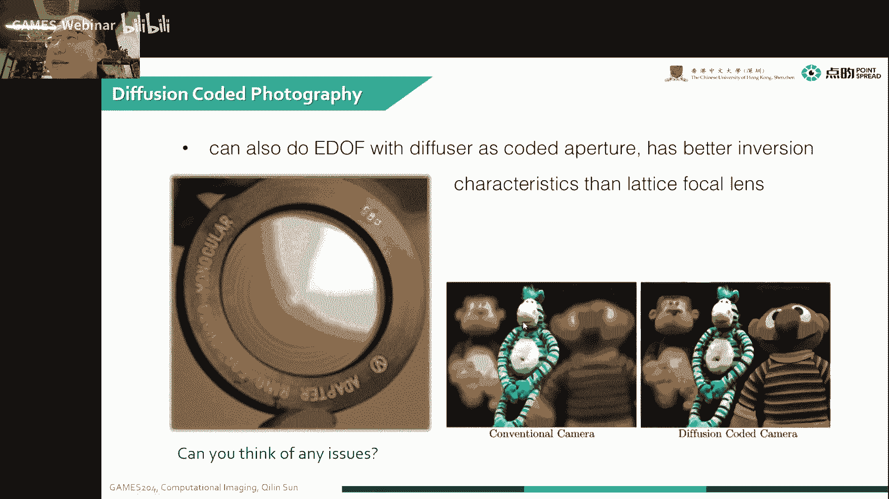

这个没有，还有这个样子，同学问这个every beam，能在播前编码中花费作用吗，应该是可以的，这个应该是可以的，我估计哈，你可以看一下这个艾瑞斯three d这个网站，他们可能用的是用。

用的就是这种方法来进行，这个对这个不一样的深度，来进行电光的函数进行调制，来获取深度，这个可能是可以的哈，这个你可以看看，我没有具体看他们具体怎么实现的，同学们还有什么问题吗，好了，既然同学们没有问题。

那今天的课程就到这里，下次同一时间同学们再见好。

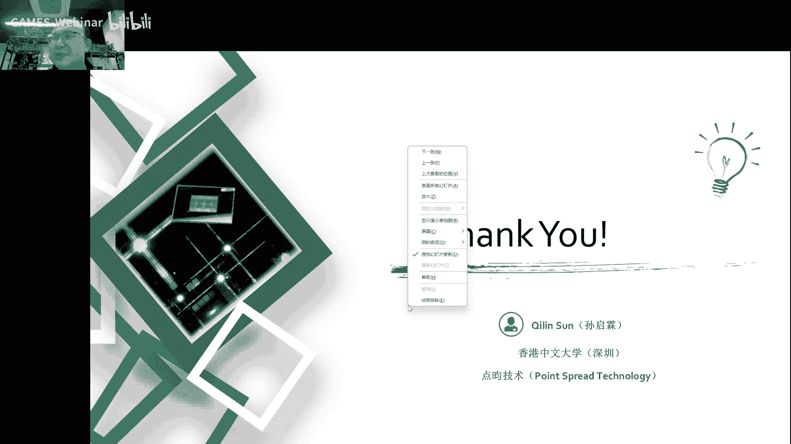