# 23.空域调制 ｜ GAMES204-计算成像 - P1 - GAMES-Webinar - BV1a24y1h77A

欢迎来到 GAMES204 计算成像课程，今天我们将探讨空域调制这一有趣的主题。

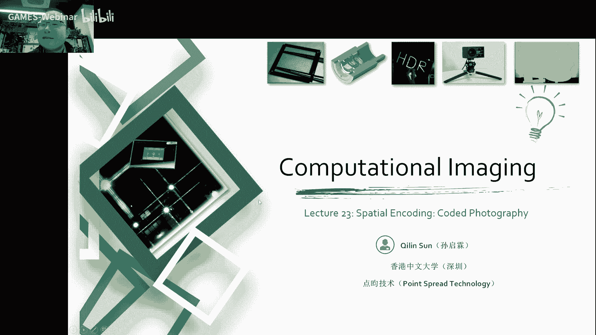

## 空域调制概述

空域调制是一种通过在图像的空域进行编码来改变图像特性的技术。它可以通过多种方式实现，例如：

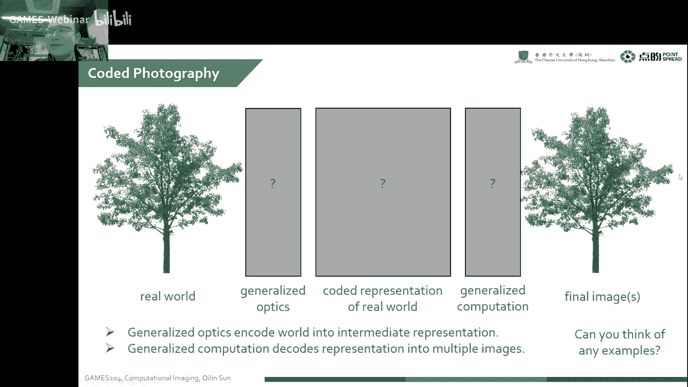

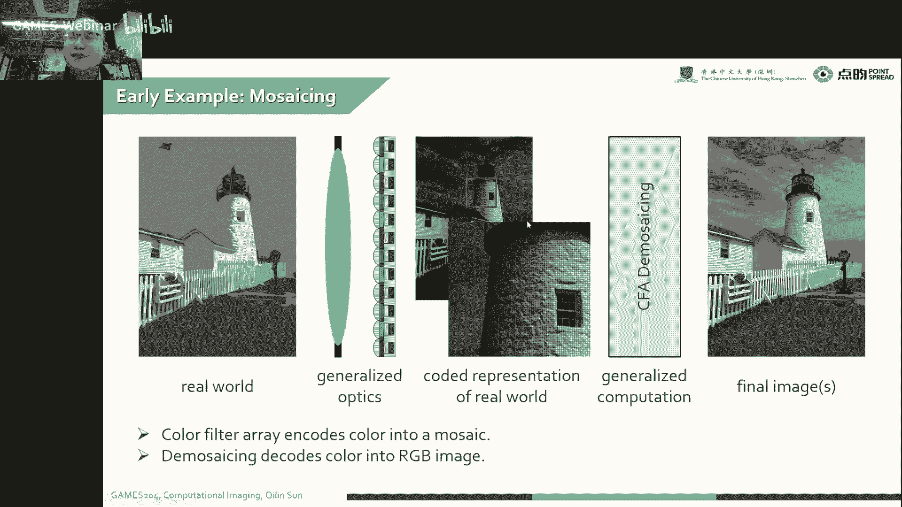

* **编码孔径 (Coded Aperture)**: 通过在孔径上添加编码图案来改变点扩散函数 (PSF) 的形状。
* **焦点交换 (Focus Swap)**: 通过在不同深度进行曝光来获取不同焦距的图像，从而实现景深扩展。
* **广义光学 (Generalized Optics)**: 通过使用自由曲面、微纳结构等元件来改变光学系统的特性。

## 编码孔径 (Coded Aperture)

编码孔径通过在孔径上添加编码图案来改变 PSF 的形状。这可以通过以下步骤实现：

1. **设计编码图案**: 根据所需的 PSF 形状设计编码图案。
2. **制作编码孔径**: 将编码图案制作成孔径，例如使用相位板或微纳加工技术。
3. **成像**: 使用编码孔径进行成像，得到具有特定 PSF 的图像。

**核心概念**：

* **编码图案**: 用于改变 PSF 形状的图案。
* **点扩散函数 (PSF)**: 描述图像模糊程度的函数。

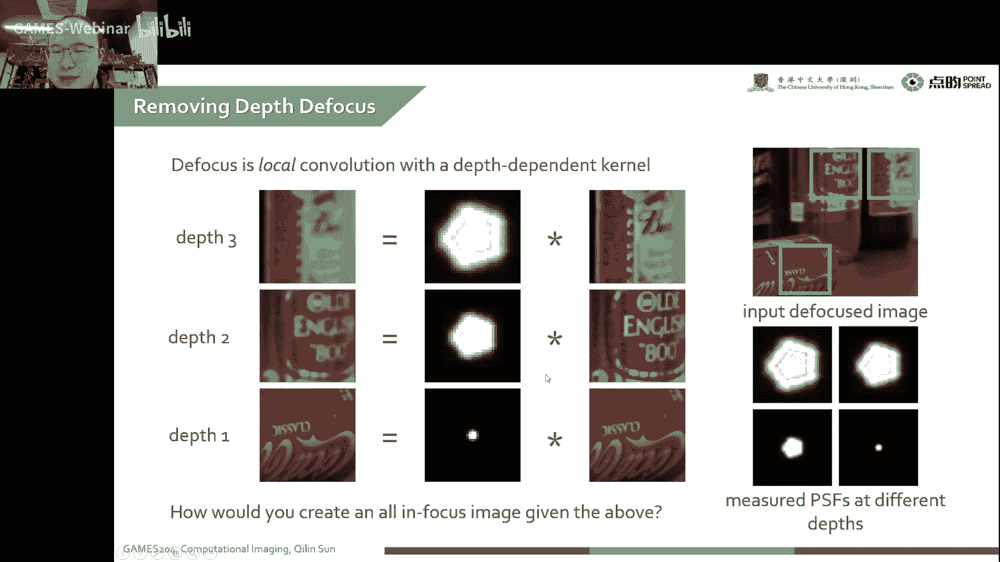

## 焦点交换 (Focus Swap)

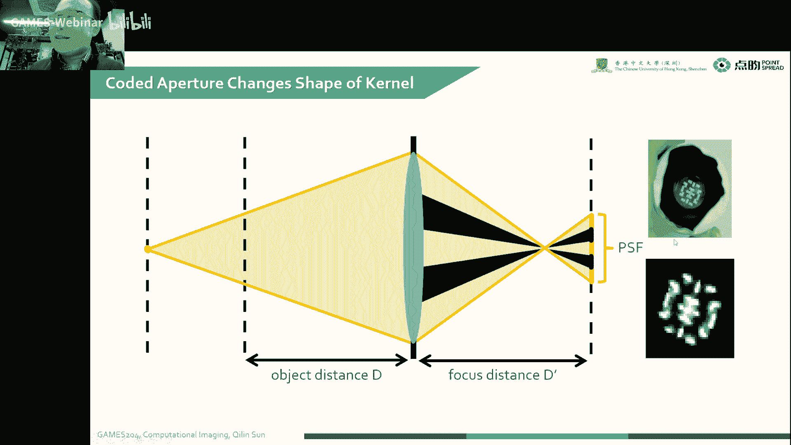

焦点交换通过在不同深度进行曝光来获取不同焦距的图像，从而实现景深扩展。这可以通过以下步骤实现：

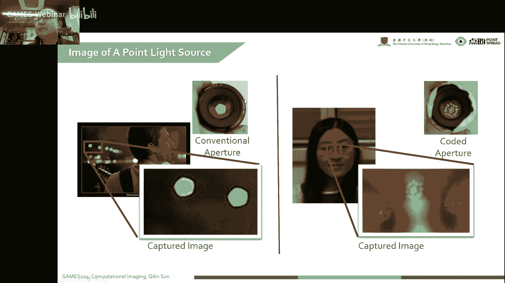

1. **在不同深度进行曝光**: 在不同深度对同一场景进行曝光，得到一系列图像。
2. **图像融合**: 将这些图像融合成一张具有扩展景深的图像。

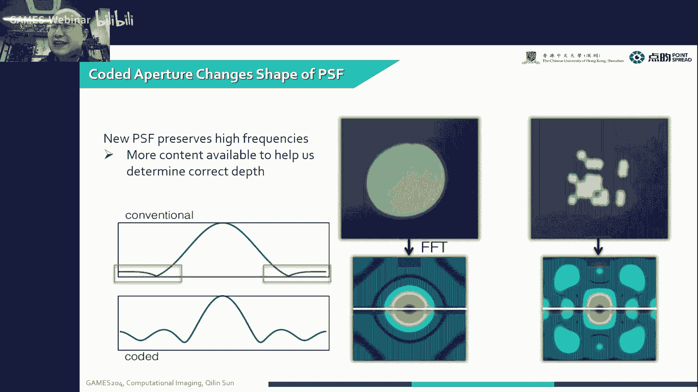

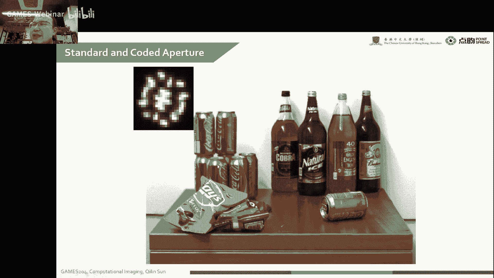

**核心概念**：

* **景深**: 图像中清晰区域的大小。
* **图像融合**: 将多张图像融合成一张图像的技术。

## 广义光学 (Generalized Optics)

广义光学通过使用自由曲面、微纳结构等元件来改变光学系统的特性。这可以通过以下步骤实现：

1. **设计光学系统**: 根据所需的特性设计光学系统。
2. **制作光学元件**: 将设计的光学元件制作出来。
3. **组装光学系统**: 将光学元件组装成光学系统。

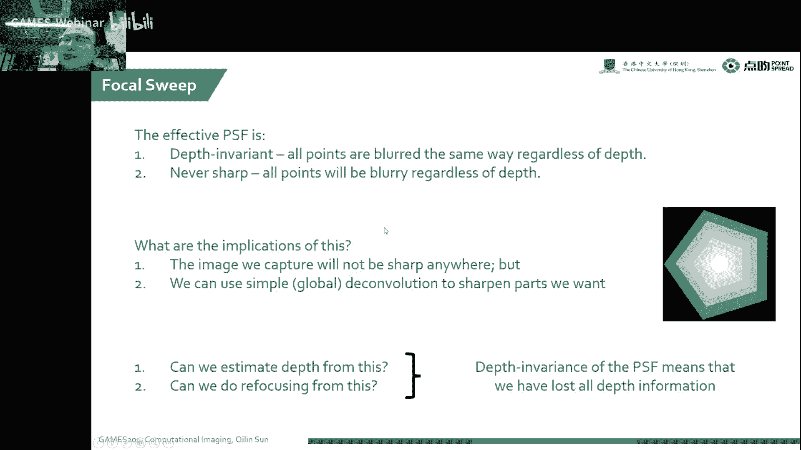

**核心概念**：

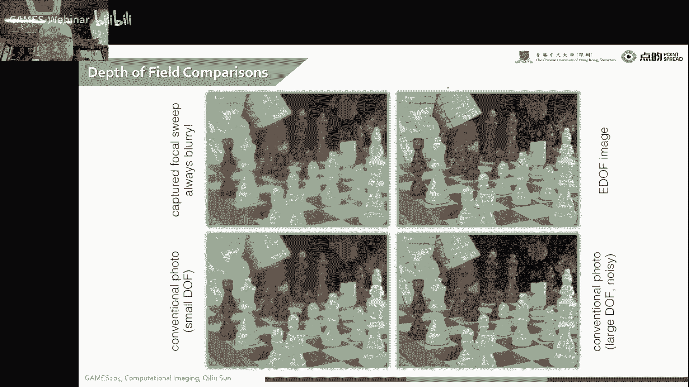

* **自由曲面**: 一种非球面曲面。
* **微纳结构**: 一种尺寸在微米或纳米量级的结构。

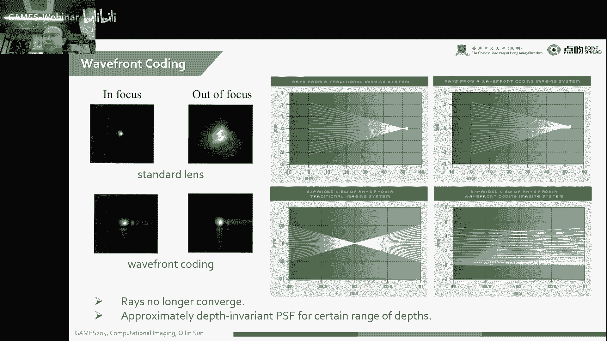

## 总结

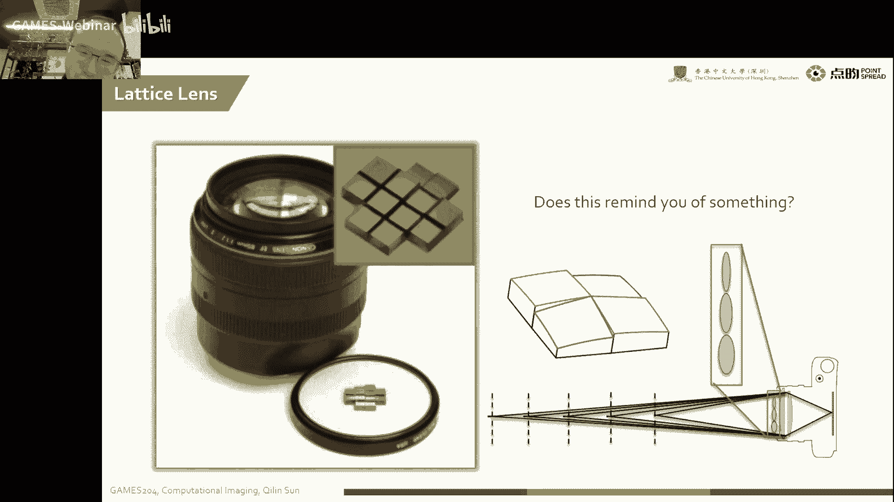

本节课介绍了空域调制的基本概念和三种主要方法：编码孔径、焦点交换和广义光学。这些方法可以用于改善图像质量、扩展景深和实现其他图像处理任务。

**本节课中我们一起学习了**：

* 空域调制的基本概念
* 编码孔径、焦点交换和广义光学的原理
* 这些方法的应用场景

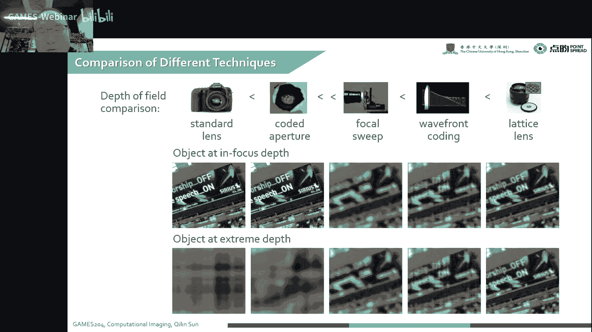

希望这节课能够帮助你更好地理解空域调制技术。