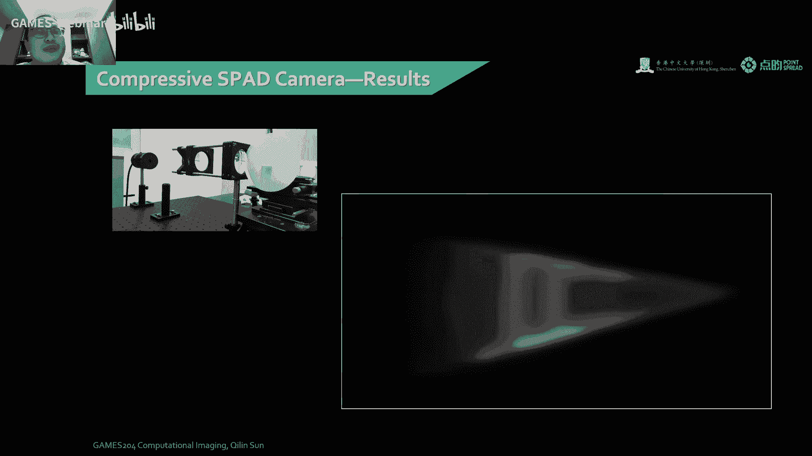

# 24.端到端相机设计 ｜ GAMES204-计算成像 - P1 - GAMES-Webinar - BV178411w7dC

## 概述

在本节课中，我们将学习端到端相机设计，从物理意义出发，从用户场景出发，设计出能够实现特定功能的相机系统。

## 四个维度

以下是本节课将从四个维度展开：

1. **成像系统设计**：从光学系统、传感器和计算模型三个方面进行设计。
2. **优化模型**：建立优化模型，以实现特定功能。
3. **调制方式**：介绍经典调制方式，如食欲调制和空域调制。
4. **端到端设计**：实现端到端的相机设计。

## 成像系统设计

### 光学系统设计

光学系统设计是相机设计的基础，需要考虑以下因素：

* **成像质量**：包括分辨率、对比度、畸变等。
* **视野**：相机能够捕捉到的场景范围。
* **焦距**：相机能够聚焦的距离范围。

### 传感器设计

传感器设计需要考虑以下因素：

* **像素尺寸**：像素越小，分辨率越高。
* **填充率**：填充率越高，图像质量越好。
* **动态范围**：动态范围越大，能够捕捉到的场景范围越广。

### 计算模型设计

计算模型设计需要考虑以下因素：

* **图像重建**：从传感器获取的图像中恢复出真实场景。
* **图像处理**：对图像进行增强、去噪等操作。

## 优化模型

优化模型是相机设计的关键，需要考虑以下因素：

* **目标函数**：定义优化目标，如成像质量、分辨率等。
* **约束条件**：限制优化过程，如物理限制、计算限制等。

## 调制方式

调制方式是相机设计的重要手段，可以增强图像质量、扩展动态范围等。

* **食欲调制**：通过改变光源的强度和颜色，实现图像增强。
* **空域调制**：通过改变光学系统的结构，实现图像增强。

## 端到端设计

端到端设计是将光学系统、传感器和计算模型整合在一起，实现特定功能的相机系统。

## 案例分析

本节课将介绍以下案例分析：

* **单片透镜大视野成像**：通过光学和算法联合设计，实现单片透镜的大视野成像。
* **超分辨率成像**：通过优化采样方案和算法，实现超分辨率成像。
* **HDR成像**：通过空域调制和算法，实现HDR成像。

## 总结

本节课介绍了端到端相机设计的基本概念、方法和案例。通过学习本节课，读者可以了解端到端相机设计的原理和实现方法，为后续的学习和研究打下基础。