# 24.端到端相机设计 ｜ GAMES204-计算成像 - P1 - GAMES-Webinar - BV178411w7dC

好那我们就不等了，你们时间已经已经开始了啊，因为整个课程受到我们整个的时间限制，其实我们这个课程已经从7月份讲到了1月份，其实已经比较长了，但是我们只覆盖到了24节课，本身的一个课程设计。

总共是有32节课，但出于时间原因呢，我们对整个的课程体系进行了很大量的删减，所以说尽可能的把骨干内容，就给同学们讲解清楚，今天呢我们正式步入到了我们最后一节课，因为我们整个课程是在年前。

我们之前讲到了我们整个成像的种种模型，包括它的光学模型，我们的物理世界，还有我们整个的光谱分布呀，它其实整个是用一个全光函数来去描述，我们整个成像的一个过程，到最后包括像我们的传感器模型。

我们想要建立了一些优化模型，还有最后我们一些呃，其他的一些非常经典的一些调制方式，包括像食欲调制，还有空域调制啊，都是给大家带来了很多的一些啊启发吧，可以说今天呢我们就啊授权时间性质啊。

我们把那一部分的一些空域调制，还有一些调制的那些那照明啊，特殊传感器啊，一部分啊删掉了一部分，今天就直接进入到我们最后一课啊，就是我们端到端的一个相机的设计，都要当成像的一个设计本身。

从它的一个物理意义出发，就从某用户的场景，我们用户的场景是什么样的信号，比如说一棵树哎，有树叶子，树叶有它的一个位置分布，它本身树叶会反射光谱，太阳照照出来会有一个光谱，唉像这么多维度的信息。

我们想不想在我的机器里，或者是我们的一个display的一个视觉里，把我们想要的信息恢复出来，但是这个时候我们对我们想要获取的信息，是有一个非常明确的目的的，这个时候我们就可以把我们的光学系统。

我们的一个呃传感器，我们后面的一个计算，整个的打包一起优化，从而实现一个端到端的一个相机的设计嗯，今天呢我们的内容会从四个维度开始。

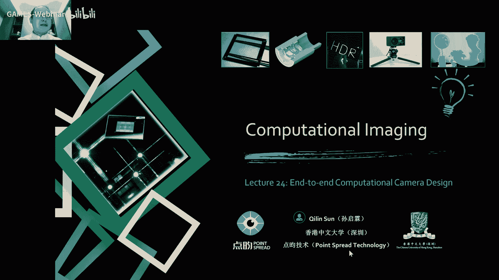

这也是呃我读博期间的一个研究历程啊，包括像我们中间会有非常多的一些小故事，还有一些非常遇到了怎样的困难，这些困难是怎么克服的，我们从高端成像从零到有摸出来，这一条线大概是经历了四个步骤。

最早呢还是属于我们比较传统的一些成像，我们是联合了工学跟算法一起联合优化，后来呢，我们想要通过直接把这个光学系统做成，可以微分的形式，所以说第二步我们就做了一个初次的尝试，就是把我们的一个关联系统。

跟我们的后面的一个算法同时的联合优化，这个时候就需要对我们的整个的光电系统进行，可以微分，那个时候我们实现了一个单波长的，一个可微的一个光学模型啊，当然这个模型是衍射的，到了后来呢。

我们不再局限于一个单个波长的一个成像，因为我们会有很多的一些限制，实际上我们还是想要对一些彩色进行成像，所以说啊到了我们第三步，当时是把它运用到了一个hdr成像的一部分，到了第四部，也就是终结篇。

是要实现一个端到端的复杂透镜的设计，因为前面啊我们都是基于一些可微的衍射模型，它会有很多爆轴近似啊，或者是单层模型可微，这个时候我们还是想要跟我们的一些工业界，或者是我们的一些实际的一些应用挂上钩。

这个时候我们就花了大概这个最后一天工作，花了挺长时间，可能花了1年半2年的时间，最终实现了一个多层多波长的一个复合，透镜的一个设计，这个时候是用一个可微的光线追踪来实现的，当然这个也是世界上第一个。

你可以就把整套复杂通讯系统，和后面的这个orgorithm一起，联合优化的一套系统，今天就给大家分享呃，整个的故事的一个流程哈，这个咱不算是一个课程了，他有很多的一个故事性。

我们会在中间遇到了非常多的困难。

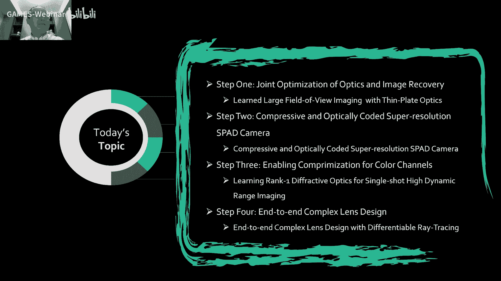

但是呢遇到这些困难之后，我们发现当我们解决了这些困难的时候，就会啊整个人就会变得非常高兴，这第一步整个我们在整个进入端到端成像之前，我们还是做了非常多的尝试，那个时候我们啊做了一个大视野的一个单片。

怎样的一个特性，可能很多学光学的同学会知道，想用一个单个的一个透镜，要实现一个非常大的视野是非常困难哈，但是呢为了实现这么一个东西。

我们是想要以更轻薄化的一些成像装置啊，包括像我们呃一些轻薄化的一些单反透镜啊，或者轻薄化的一些啊，特别是我们内窥镜啊，医疗领域里面用的会更多一些，当然还有一些空天探测，比如说我们这个卫星上。

我要打一个非常大的一个透镜，是非常困难的，就比较贵，所以说把这个透镜轻薄化，一直是一个大家想要追求的一个点吧，所以后来人们就做了一些像直接把透镜，比如说用这个3d打印，打印到我们这个传感器上面呃。

也可以用一些像这种颜色的透镜啊，后来呢嗯还有一些像这种啊，直接去用野生云进去做一个，就这这是费尼尔镜去做一种透镜，然后再继续它的相差，那还有一些像diffusion的这个叫18年，这篇论文是哎。

我记得应该是lower的一个论文，它是一个用一个diffusion的一个faceplate，diffusion plate，然后去做一个成像，然后再做解密问题，但是呢像这些颜色呀还是抄表面的。

在那个时候哈，就是那个时候18年，可能18年的时候想要实现一个轻薄化的设计，但是我又想要一个非常大的一个设计自由度，这个时候当时我们就想到了，可不可以用一个单层的透镜，来实现一个大视野的一个成像呢。

但那个时候不像现在我们有非常多的工具哈，就包括我们后面这个21年siggraph的工作，可以做到一个可谓的光线追踪，来去自动优化这套透镜系统，那个时候呢我们只能想办法。

怎么样把光学跟我们的一个重建的一个算法，去挂上钩，联合起来，这样的话才能最大化我们整个的一个优化的。

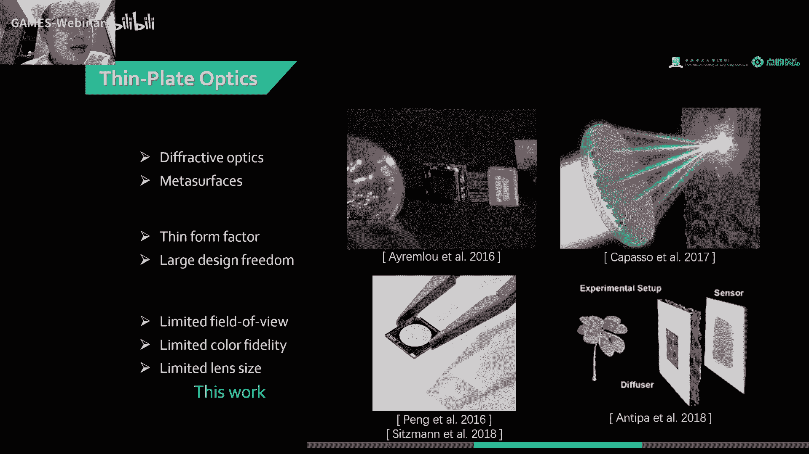

一个效果，像我们比如说单个的透镜啊，就是比如说我们搜lab买一个呃50mm啊，或者是呃25mm的一些透镜，我们知道无论是球面镜还是非球面镜，想要实现一个单片镜的大势，也是都是非常困难的。

我们在轴内的一个相差是可以控制在比较好，但是整个单片的透镜它的轴外相差是非常大的，为了解决这个问题呢，右边这个是我们当时实现的一个效果啊，一般哈单层单层透镜，大概就是10度左右的一个视野，哎。

这个时候我们可以通过光学跟算法联合设计，来实现一个50度的一个大视野的一个成像，仅仅用一个单片的一个薄透镜，当然是怎么设计的呢，当时哈是有这么一个idea，我们很难让我们的这个这个这个透镜啊。

在各个视野里面，它的点扩散函数或者是mtf响应都比较好。

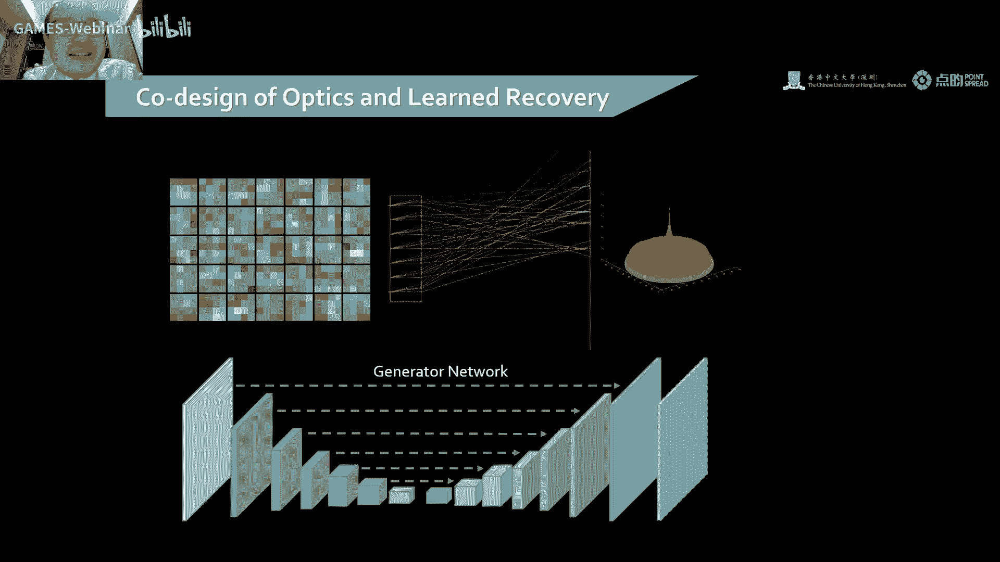

这是非常困难的，但是呢我们可不可以设计这么一个idea，让我们各个视点都一样的坏，对不对，但是一样坏的同时，我在这个一样坏的，这里面又保留一定的高频信息，这个时候我就是保利率的高频。

但是它的尾巴这个点光的函数的尾巴很长，我们就管不了了，对不对，这不管了，但是呢我们编译信息还是中心信息，都是保留了一定的高频信号，这个时候就对我们后面的一个恢复，而从不可能变成了可能。

当时呢像我们设计光学系统的时候，用到了一种叫virtual action的一种技术，就是我们设置一个虚拟光圈，在各个不同的视野里面，我们设置一个虚拟的孔栏，这个虚拟的扣篮。

实际上我们可以看到就把周围的杂光，实际上就是啊都给滤掉了，这个时候我们去设计它的点扩散函数，但是我们知道这仅仅是一个虚拟的空难，当我们考虑到整个全局下面的时候，它的一个尾巴是非常长的。

也就是我有一个点构造函数，有一个尖峰啊，像图里面这样子有一个尖峰，但是呢它的一个周围的一个这个尺寸呀，是非常大的，它有一个很长的一个低频的一个分量，当时我记得我们拍到了那个分量。

可能是这个点扩散函数尺寸啊，可能得有900个像素，你看这个900个像素其实就已经非常大了哈，你这个要对一般的底部其实已经非常困难了哈，所以说最后在图像传感器上拿到的图像，就是右边的这一个图像哈。

当然这个图像我还印象挺深刻的，当时这个事就是你们在群里看到那个顿，熊顿老师，我们跟顿顿老师一起去多伦多玩，然后这是多伦多动物园啊，我带着那个相机玩的时候，就把这个实验给做了啊，这个场景是非常好的。

这应该是他们的一个室内的，一个这个这个这个场景哈，室内的一个像那种看鸟啊，看这些东西的一个地方啊，挺有意思的，当时就拿了一个薄薄的一个透镜，就是落在我们的一个索尼a7 上面。

然后去在我们动物园拍来拍去哈，然后呢把我们这个整个的一个光学成像，跟后面再连接一个呃重建的一个算法就可以啊，最后实现我们一个比较高质量的一个，就是单片层大透镜的一个成像啊，大扩大视野的一个成像。

我们可以看到哈。

这是我们在不同视野里面捕捉到的一个。

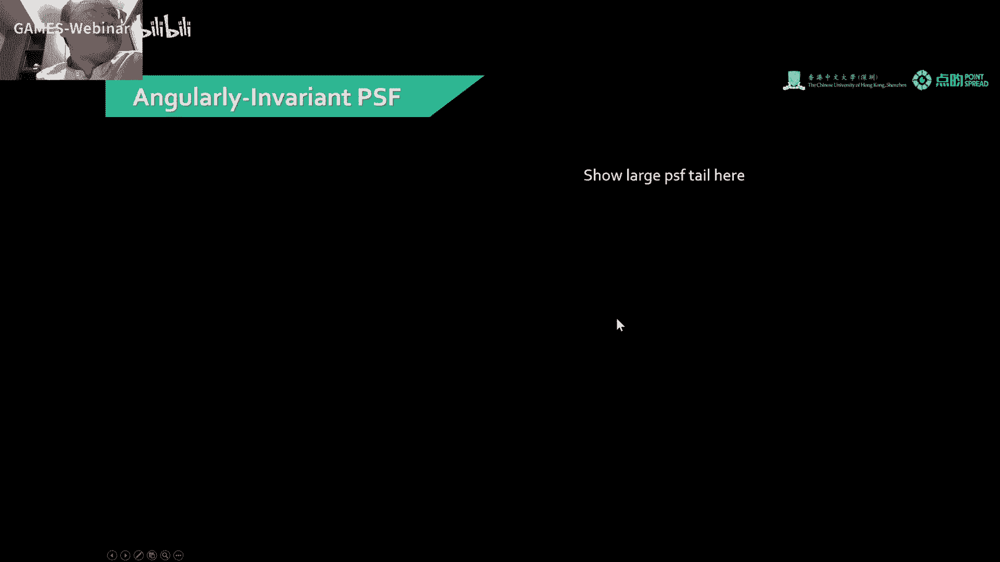

它的一个点扩散函数，左边这个是一个传统的一个非非球面镜哈，这是可能是slab买的，一个50mm的一个非曲面镜，其实这个向日它是它本身是非曲面的话，它是按理说应该是比较好的，我们可以看到在中心视野的时候。

它的一个点光的函数能量是比较集中，但是边缘的地方呢它就会破坏的比较厉害，右边呢是我们的一个设计，大家可以看到，无论是中心还是边缘，它都会有一个比较尖的一个分行，但实际上这个我们会有一些低频的一些损失。

就是我们在整个的一个点光三函数，它周围会有一个非常长的一个尾巴，像这种点放在函数的设计，实际上我们当时是保留了一部分的高频的信号，但是呢周围的一些长的尾巴，是造成了我们整个图像的一个。

就是对比度的损失啊，这个对比度的损失，实际上就是我们最后这个图像上蒙了一层雾，诶，这一层雾雾的感觉哎其实哎当然也不好，它会也会有一些飞跃case，比如说我们有非常强的一个太阳光。

这个时候他这么大一个顶空的函数，它周围的地方像素也会过曝，这个时候就会有一定的局限性，唉这个没关系，这个我们已经带来一个全新的思路哈，就是保留一定的高频，可以恢复它的细节，在一些非常多的场景。

是已经可以解决我们实际的一个问题的，当然这是我们当时重建的一套网络，当时那个干比较流行，当时就用了一个去干来去重建我们这个图像，这个还有一个非常有意思的事儿哈。

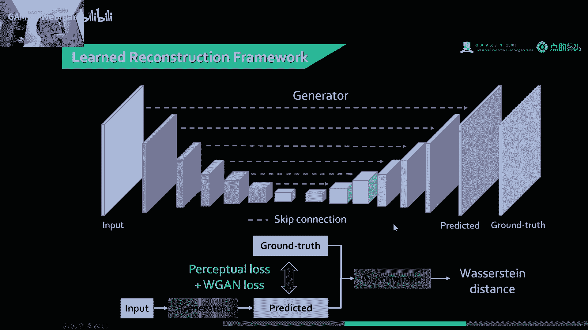

就是那个时候我们这个deficial retracing。

还有像这种渲染啊，都还没有很完善，这个时候我们怎么样去造这么一个数据集，然后去恢复我这个数据集的相差呢，所以当时我跟郑老师就一起想到了一个idea，那个时候我们在cos在沙特，然后去做那么一个实验。

就是拿屏幕拍屏幕，当时这个这个这个想法挺扯的哈，就是我们因为我们知道这个整个屏幕的，它的一个就动态范围呀，还是非线性还是非线性，它的响应它也是非线性的嘛，还有包括一些颜色都会有变化。

这个到底拍了个屏幕来造这个数据集行不行，实际上我们可以看到这个像右边那一栏哈，右边那个图，右边右边那一栏，右边的图就在这个图，就是显示器上诶，显示的那么一张图，左边呢就是我们相机拍到的一张图哈。

同学们想一想，这个整个拍屏幕就困难在什么地方，其实这个是非常非常困难一点，psf这个还真不是拍屏幕标的这个p s f哦，不对不对，就前面看的那张图是拍了一个屏幕，但是你要真正的要标p s f。

你要考虑它的动态范围，你就啊这个屏幕就会受限了，大家就同学们就不要去通过拍屏幕去标psf了，当时会遇到什么困难呢，首先我们这个像素啊，是不是要跟我们这个实际的拍照的像素，是不是要跟我们实际的像素进行呃。

按像素匹配的，对这个屏幕有纹理，这是一个问题，屏幕本身哈，我们这个像素大小，我们的传感器像素大小跟我们的这个屏幕，像素大小在我们像空间频率差不多的时候，这个时候会摩尔条纹，好，摩尔条纹。

当时呢这个我们也没有这么多，这个钱去买这个非常大的一个屏幕哈，所以说这个当时就把这个屏幕离得比较远，实际上就只有中心那一小区域诶，是可以管用的，但是当时本身哈，这个点扩散函数。

其实已经基本上没有办法去标定了，这个基本上没有办法去标定了啊，当时一班老师是在美国这个实验室，我跟郑老师在一起折腾，然后没有办法标定的，这个怎么办呢，因为这整个像素非常大哈，而且它周围的这个尾巴。

他这个值相比你们这个pig非常小，也就是你做标定也是没有办法直接的获取，我这个尾巴到底是什么样子本身呢，这个点估算函数的分布，也会随着整个空间的变化而变化，它又随着景深变化而变化，又随着视野变化而变化。

说这个问题就非常困难，所以说当时也是没有办法哈，就是造了这么一个数据集好，造了这么一个数据集，也就是拍屏幕啊，但后面我也见到了非常多拍屏幕的一些做法哈，这个你说可以吧也可以，但是他并不是特别完美。

因为拍屏幕我们要考虑到非常多的事情，像除了非线性颜色，就是我们要叫颜色本身这个屏幕的一个三原色，它的一个曲线要跟我们这整个的一个，就是相机的一个color filter，它的颜色曲线去匹配啊，去匹配。

但你无论怎么样，都不大可能去完美的去还原，我图像本身自己的一个颜色，这个是非常困难的哈，就是因为三原色跟就是卡拉菲特，而wait它的响应不一致啊，显应不一致，这是第一个challenge在里面了。

所以说其实最后我们拿到的结果还是有点色偏，有点色偏，第二个部分就是本身图像的动态范围，我们知道这个，首先你要把这个图像搞成线性显示，要不然你最后拍的图像会有问题，因为本身我有一些就是这种屏幕啊。

它只已经做了一个汤白品，我一个出了一个16位的图像诶，最后我只能看到一个八位或十位的一个东西，但是本身呢我们周围的一个强弱啊，每个不同位置的强弱也是经过了一个调整。

它有一个local的一个tomap进行调整，最后来把细节给你展示出来，这个整体的图像变化了就非常难受，你要拍个仅仅拍个线性呢，它会有一个这个contrast的一个损失哈，当时也是遇到了非常多的困难。

最后诶就把这个相机先搞一个棋盘格，先标定像素对齐，还好好像素对齐，当然你这个像素对齐也不是特别完美，当时为什么选干来做这个事，其实本身刚开始是想解一个呃，这种优化函数来解这个问题。

但是最后没有办法去做了一个优化函数，因为最后像素啊并不是完美的对齐，哪怕我们做了一个标定，再做一个仿射变换，但我们知道啊，我们实际上拍的那个镜头啊还是有相差的，它的轴外跟中心它的像素会有偏移诶。

这个时候就会变得比较困难哈，比较困难，然后在实验室做了一个自动捕获的，拍一张还弄一张，然后自动处理完，搞了这么一个电扇子，其实最后我们看这个处理效果还可以哈，还可以哈，因为这个卷积稍微偏那么几个像素。

可能也还好也还好，当然这个最难的一个问题就是颜色，还有一个我们这个tomap的一个问题，会有一些hdr损失，同时这里还有一些local tomap的问题，会带来不一样的区域的一个不变量。

区域的一个嗯变化吧，这个时候都会对我们结果收敛的不好，也就是我们最后处理出来的一个实际做实验，处理出来一个图像是比较差的，但除了这个部分的困难，还有就是我们加工出来的一个东西啊。

这个以后同学们做这种实验的时候，可以特别注意一下，就是我们如果要加工透镜啊，那个材料一定要选好，一定要选那种光学级别的一个材料，当时我不记得我们用的是pc还是pmm，但是呢那个那个pc还那个材料。

是淘宝买了一块哈，它的本身工业性质不是特别好，不是特别好，在淘宝上买的这个它会有一定的一个色散，对当时用的p m v，这个好像是淘宝买的材料不是特别好，因为我当时在这个材料这块也不熟。

后来也发现加工这种的材料是有一些，就是对一些它的一个diffusion，会有一定的影响的，就是我们当时的材料不是特别好，其实最后做实验的时候，整个图像整个物感会比较强，就是会有一层雾蒙蒙的感觉哈。

我刚开始觉得是加工不准引起的，后来结果就是后面几几次做论文啊，然后做实验发现这个并不是，这个就是材料引起的，有同学们可以注意一下，这是当时加工的一个pro te。

可以实现一个50度的一个视野啊，就这么一个单个的，当时用一个单点金刚石车嗯。

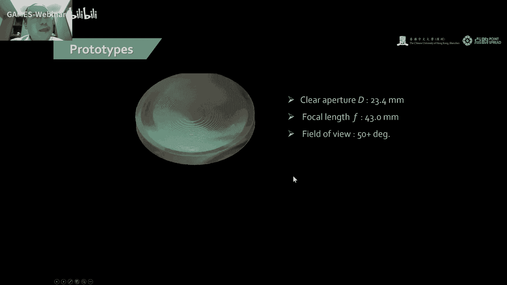

来去把这个加工出来的，当时是一班老师去找这个，就浙大这些一起加工的，但除了这个上面还是有刀纹的哈，这个这个单点应该是车拆东西会有刀纹。

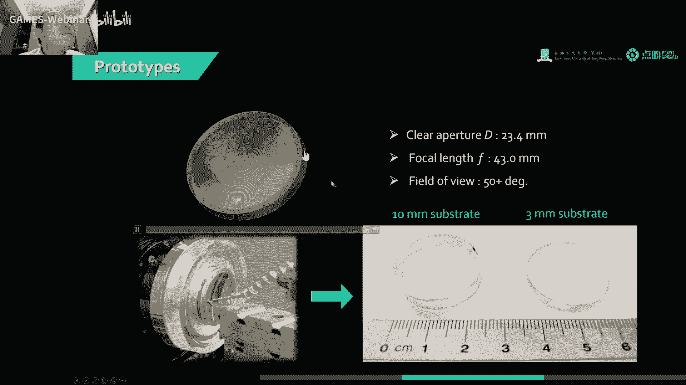

这个也会有影响，其实同学们要是接触到产业界。

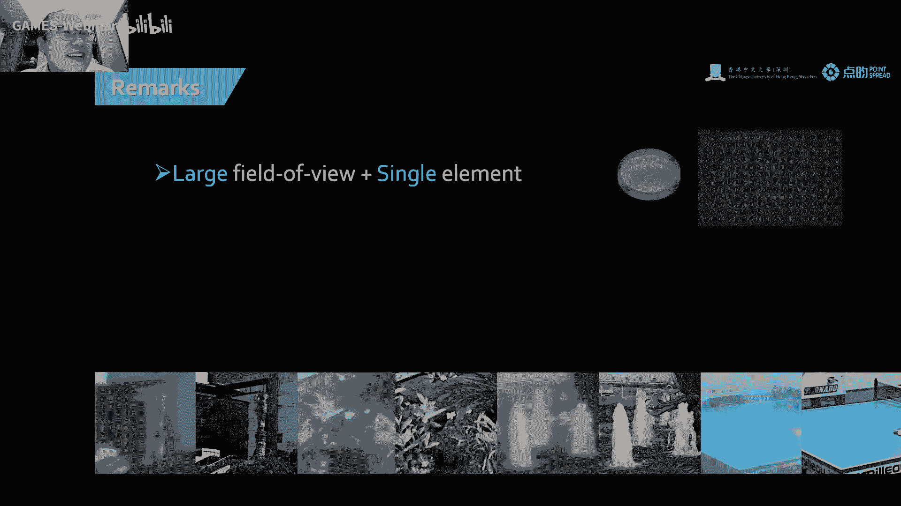

特别是做我们这透镜的模具，我们做透镜的模具实际上也是有刀纹的。

但是我经过注塑，它通过那个表面张力啊，就把这个刀纹实际上是消除掉的。

哎这个同学们注意，就是我们最后注塑出来的这些模具里面的这些。

哪怕模具有刀纹，我们最后注塑出来的表面仍然是光滑的。

它是被张力给拉平了，这个就是非常好。

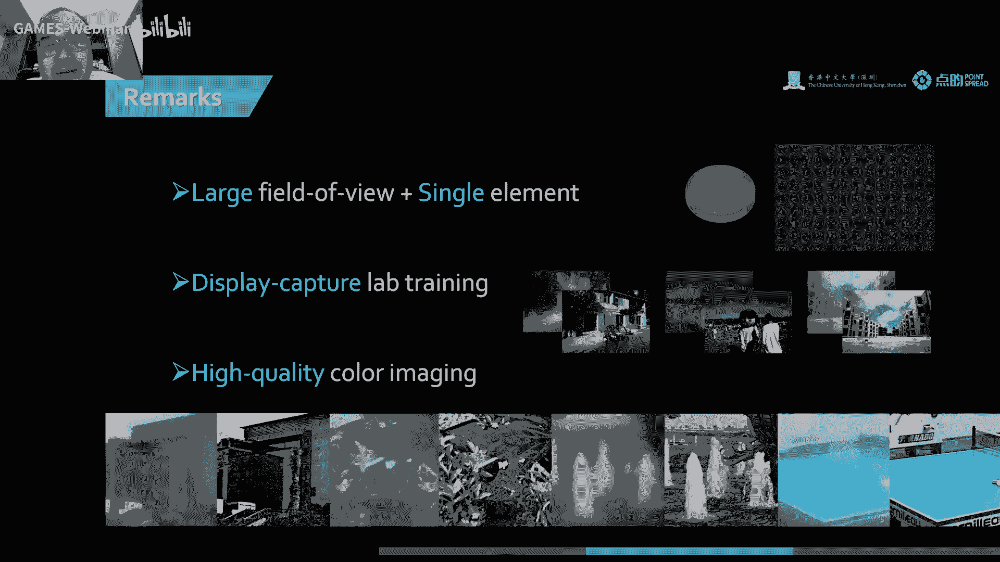

这是我们当时最后做实验的一些结果，当时是在非常多的地方去拍啊。

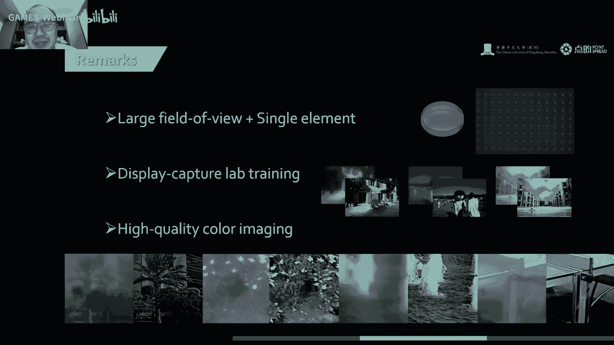

包括这个国王经济城，还有这个当时一个student center里面。

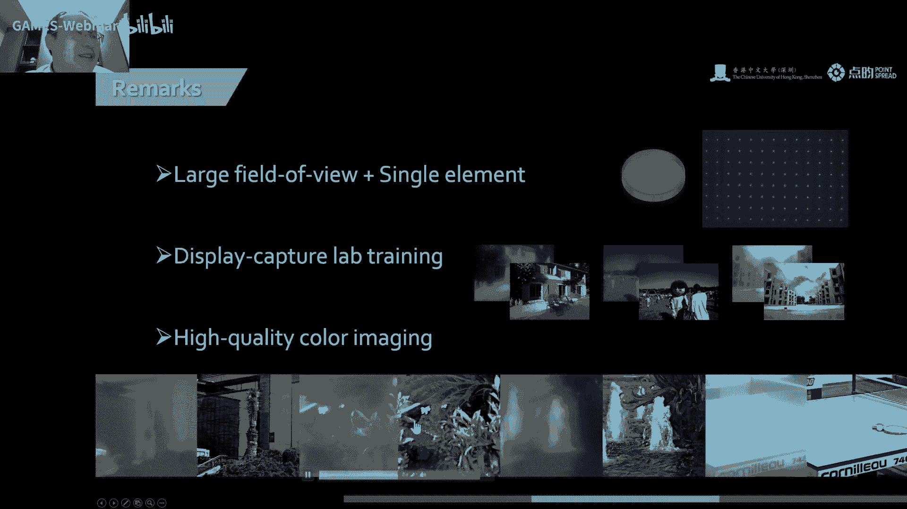

就是搁那瞎拍哈。

但那个是最早的一个尝试。

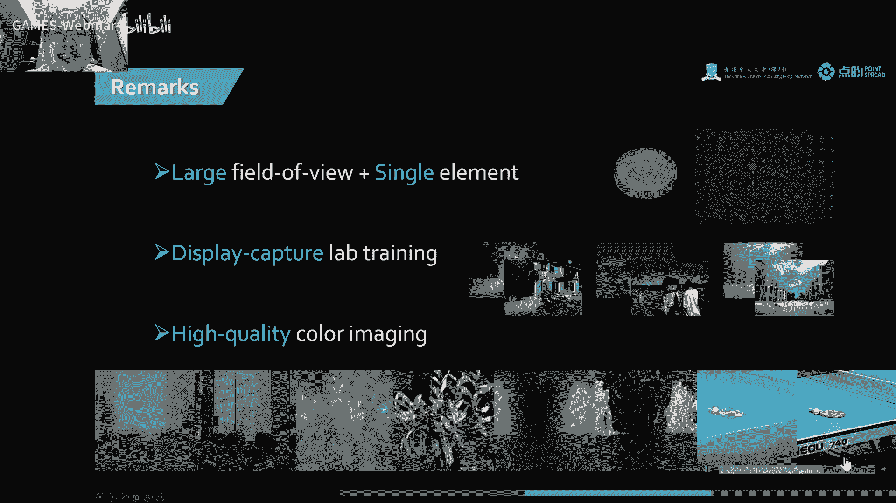

但是那个时候并没有构建起来，我们光学系统跟我们这个呃，后面的一个重建的一个直接的一个关系，后来我们就做了一个尝试，就把我们的一个光系统，但是这个是单单单层单波长的哈。

这个是根据我们speed本身的一个采样率的问题，来进行给他一个优化本身啊，包括现在spt传感器自己啊，它也是有非常多的一些。

也有非常多的英文，包括像nana saimage，还有这个深度成像，包括我们现在国内很多，像消费级跟车规级的一些创业公司啊，都在做这个spt传感器，它本身受限于他是一个一个像素周围啊。

它要有一些技术电路，还要淬火回火呀，然后要有那种计数器，这种这种电路它本身就比较复杂，这个时候受限于周围电路的影响，它的一个few factor，也就是填充率就很难做高，但是呢这个spider自己啊。

它有一个皮秒级的响应能力，也可以有一个单光子的想象能力，这么好的一个东西，最后我们发现受限于电路又难做大，这个分辨率很难做大，同时呢它的一个填充率也很难做高，那遇到这种问题呢。

同学们这就很多搞cv的同学就想想，我们可不可以有些超负面的方法，来去克服它这个分辨率低的问题呢，但是你这个时候要注意到受限于填充率的问题，我们在采用一个高频图像的时候，用这么低的填充率。

实际上是会引入一定的elaine的artifacts，也就是走样的一些问题，就我们踩一个高频信号，但是是用一个比较低的一个频率，去踩这么一个高频信号，那之前呢我们在这做这篇工作之前。

还做了一个继续压缩感知的一个speed camera。

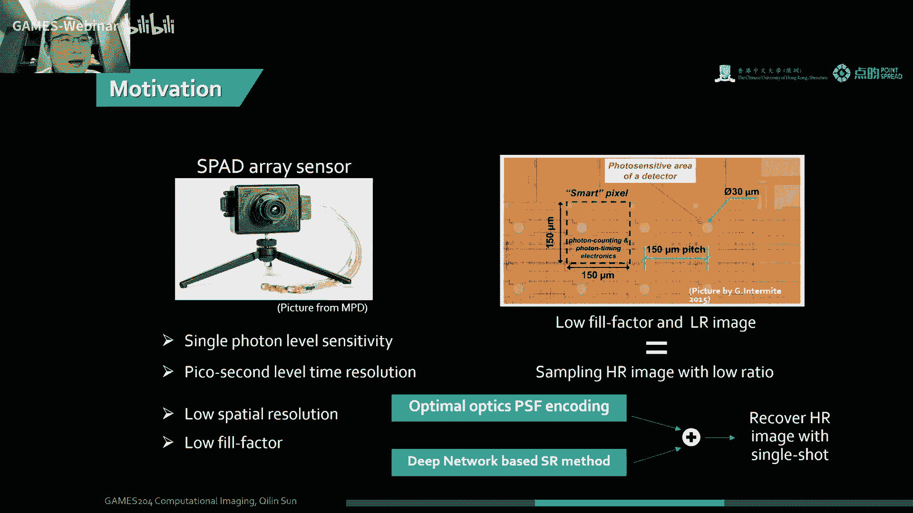

这个时候当时是用一个dlp去做一个调制，然后那个时候整个系统会变得比较笨重啊，这个只能在实验室一个非常稳定的一个，实验桌上去做实验，这个时候不行，我们想要实际一点应用啊，就是真正的落到实处。

这个也是当时一个超封面的一个sweat成像。

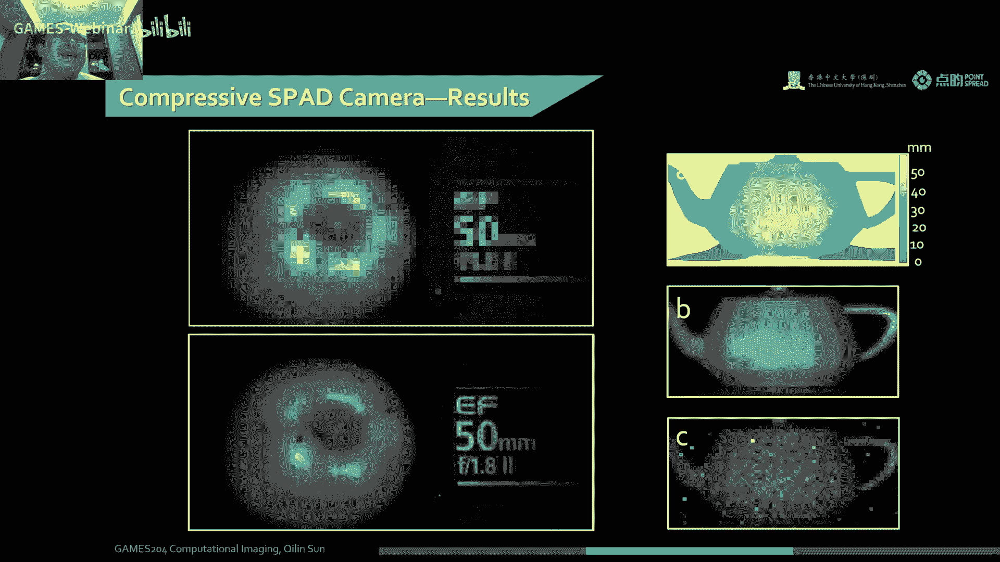

它的成像精度可以非常高啊，当我们克服这个pile up的时候，是可以到0。1mm左右的精度，那你这个拍up要首先搞定，这个当时是拍了一个这个光汇聚的一个过程哈。

光经过透镜汇聚的过程。

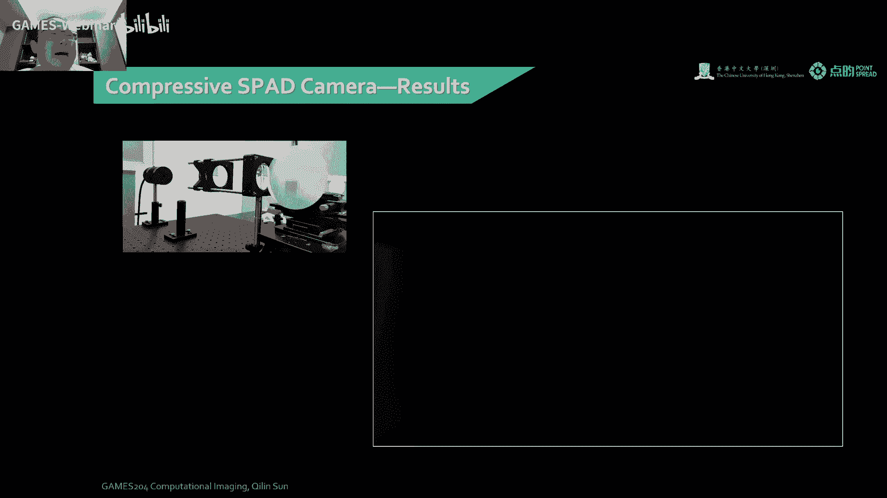

唉怎么去实现我们去优化去采样。

这个根据这个图像传感器自己去采样。

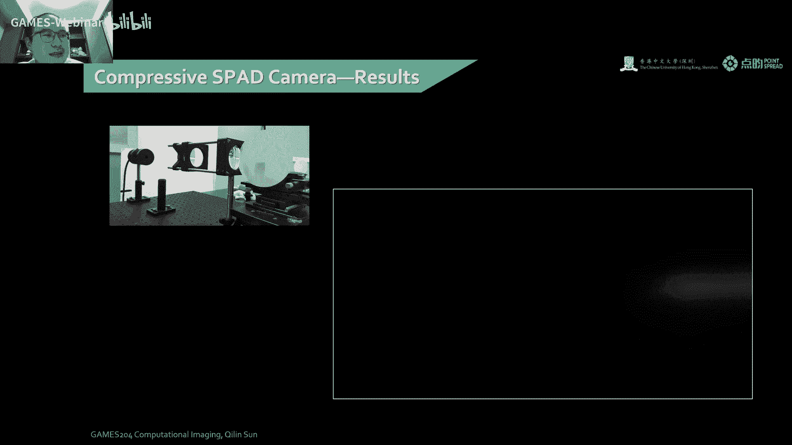

首先我们low few factor就低的一个填充率。

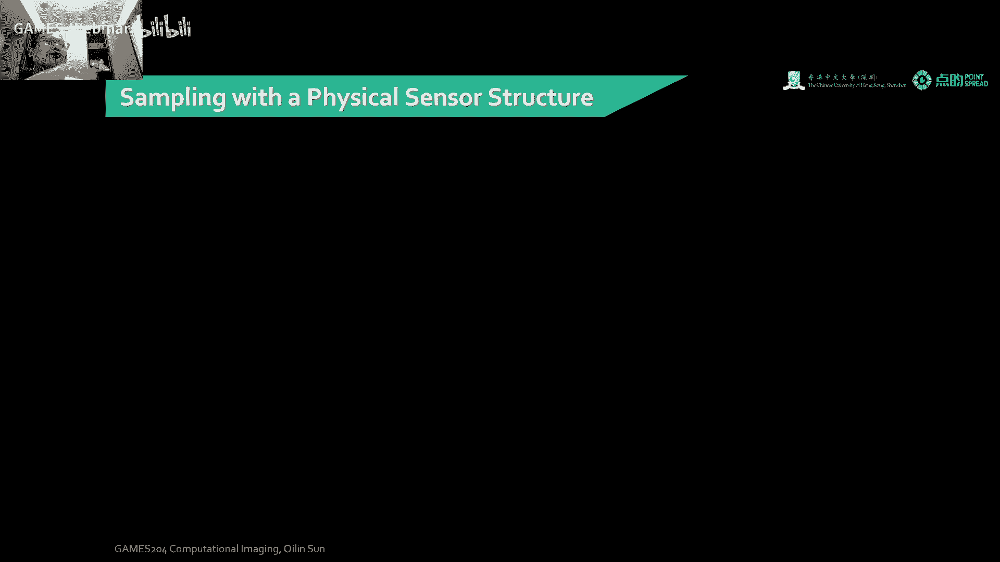

会带来一定的一些走量的问题，同时也会带来一些低效率的问题哈，然后类似的事情也发生在这个带滤光片上，比如说我们会有一些摩尔纹啊，或者是马赛克啊，这个时候唉像这种物理的一些sensor structure。

都会带来我们这个整个的一个图像的采样问题，但是呢我们可不可以优化一个最优的一个，点扩散函数，来让我们这个最后的采样最优，从而实现对我们算法一个进行一个适配呢，也就是我们想要通过做这么一个光学系统。

然后结合着我们传感器的一个形态，再结合的算法一起来吧，我们的信号最后想要的信号完整的恢复出来，也就是涉及一个最优化的一个点扩散函数，来实现我们最后的一个想要的功能，这个时候是我们想要超分辨。

我们知道要直接实现，有一个老fire factor进行采样的话，它会有非常多的问题，当时要建立这么一个点cos函数。

跟关联系统的一个关系，其实最早我们做尝试，就是用一个非常简单的一个模型，就是我们在一个透镜前面，搞了一个不是特别大的孔，就比本身我们透进了自己的一个这个孔蓝，稍微小一些，把它放到它前脚面上。

我们可不可以在一个前桌面上设计一套关系统，最后在我们传感器上直接显示到p s f，实际上我们知道学光学的同学知道，当我们这个孔蓝在前桥面上的时候，我前墙面上的一个光学相位或者是一个二。

就是一个binary map变到我的sensor上，实际上就是一个就弗朗和费衍射，实际上也就是一个祭祀的一个分裂变换，诶我们发现这个点扩散函数跟我们的光源系统，它只是一个数列变换的一个平方的关系哈。

只是对列变化的一个符值的一个平方，这个时候我们可以先设计一个最优的一个psf，然后对我们后面的一个采样跟超分，来实现一个最优的一个呃设计图，然后我们再去把这个光学消化板去反向解出来，是不是就可以了呢。

当然这个时候就是第一次，实现这个端到端的成像，其实这个工作呃，最早做的时候是2018年5月，2018年5月，那这个论文做的时候也比较仓促，第一次做的时候比较仓促。

这idea大概是5月就12号时候弄出来的，当时那个srah asia的一个deadline，大概是可能是5月20几号吧，当时我们阿迪尔一出来，然后快速的就花了几天，就把这个p s f设计出来。

然后再去把这个相位板再设计出来，大概花了三四天，然后郑老师就紧急去抄顶间，去把这个流线流出来，就是我们当时是先用idea，然后更快速设计出来这个东西，然后去流片，大概留了大概有七天吧，六七天。

然后郑老师就快速把这个片子拿出来了，流片的期间呢，我就在写论文，然后大概就几天吧，就是总共这个论文最早第一批，第一次做了三个三周，那这个也要感谢我们邓老师，那时候非常给力啊。

这整个加工流程总共就花了四五天，就把这个没打原件去流出来了，最后呢这个pipeline实际上就设计的是。

我们先去优化出来这么一个，最优的一个点扩散函数，根据我们最后一个重建的一个效果啊，去重建去一起优化，然后优化完之后，再用一个就face retural的一个问题，来把这个相位解出来。

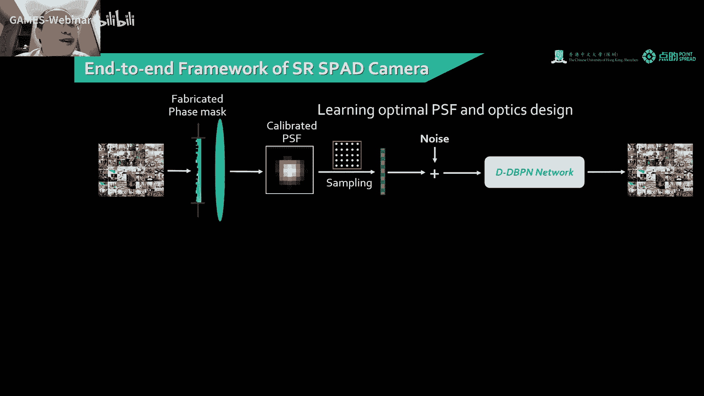

最后再把这个相位然后加工出来，然后怼到我们前面设计的这个，浅焦面的一个孔栏上，这个时候就可以获取我们最优的一个点，空档函数，啊这是我们一些刚开始做了一些仿真的结果，我们发现当我们只用这个蝴蝶翅膀啊。

蝴蝶翅膀这个细节还是比较多的哈，我们只用这个law factor来做采样，再去做一个超面的一个算法，这几个算法应该都是一样的，这个时候我们发现我们恢复出来的这个结果，是有非常多的一个错误的。

然后当时就是出于对比哈，我们还是引入了一些常见的一个满填充率的，一些呃，这个传感器就是作为一个对比吧，就是硬加进去的一个对比，这个时候我们发现这些位置还是有一些呃，比较明显的一个artifacts好。

比较明显的例tx，但是呢我们可以观察到，通过这种最优化的一些采样方案，我们最后这一些部分的小细节，都是可以比较完美的恢复出来，甚至我们可能看着这个我恢复出来，图像比原图还要好，我把噪声都给干掉了。

是不是这个我们可以看到这个效果是比较好的，当时也对比了一些呃，这些在一些小的一些小数据集上去，做了一个小对比，来当我们用到实际的用到了一个spider上面，因为spider这个本身的填充率非常低。

它的一个工作环境是比较恶劣的哈，比较恶劣的，我们没有这个设计了一个doe加在前面，一个关系统加在前面，当它经过算法恢复，因为走样问题啊。

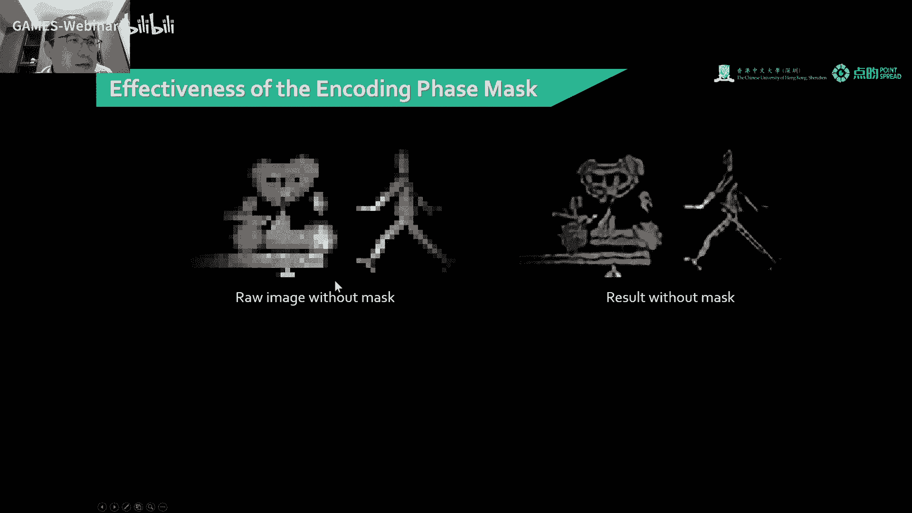

我们这整个恢复出的结果是非常差的，非常强的一个artifacts，这个时候就是想做超声变，你这个低填充率的情况下不行。

但是呢当你设计了一个最优的采样方案之后，联合算法一起设计啊，就可以非常好的恢复出来，你最后想要的结果，其实啊就是我们可以看到cvpr有非常多，精彩的一个超分辨的论文啊，超方面的论文。

但是同学们有没有想过，为什么这些超篇的论文拿到我们实际的生产，生活之中，就是我们实际的应用部署的时候，大部分都没有落地呢，其实有些效果已经非常好了，就是我们可以看到论文里的效果。

这个时候就是对我们采样的模型进行了去，就是整个采样过程有一部分的缺失，实际上就是没有考虑，我们这个就马赛克的白滤光片呀，还有一个呃，像这个我们本身像啊，sensor自己的一些就填充率呀。

就是不一样的这个sensor，他这些响应都会有一些的多多少少的区别，但是呢我们可以看到之前一些超面的论文，大部分都只是用一个biubic down sampling，就是它的一个退化模型。

没有符合我们实际的一个呃部署的一个场景，所以同学们要真正的想把这些超分辨，部署到我们实际的一些应用之中，一定要先考虑我们这整个退化模型是什么样子，然后根据我们的退化模型，再进行我们后面的一些操作哈。

啊这是我们当时的一个pro type，就当时挺贵的一个这个这个这个driver挺贵的。

一个激光啊，前面做一个照明哈，这个时候当时就用了一个卡农的一个大痰盂，去当一个镜头，然后前面做了这么一个在前桥面上做了一个呃，这个透镜好，这个时候是其实很简单，就就在我们普通的通勤前面。

加了一个这种消费版哈。

这是它最后呈现出来的一些效果。

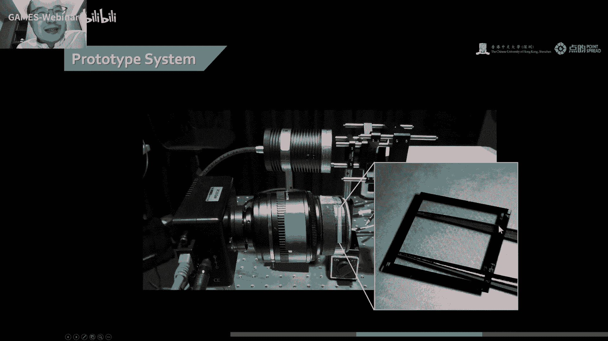

也可以用到深度的一些边缘的一些优化。

在最后是顺带成像。

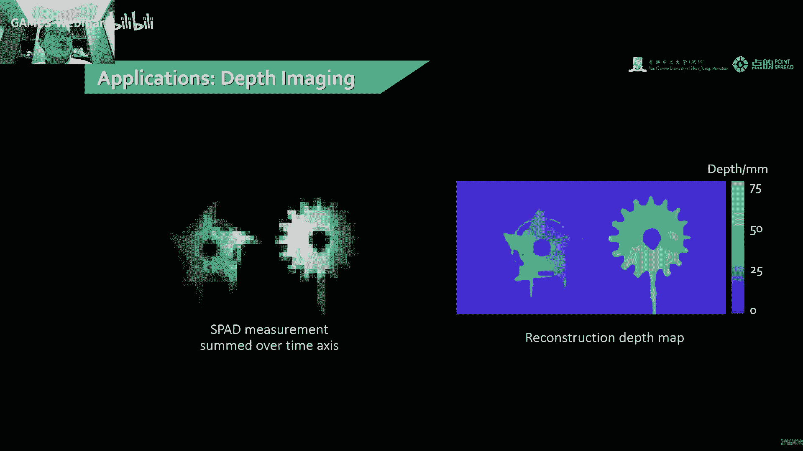

包括呃先照明左边，在左明右边的整个顺带的过程进行一个创业，就实现了一个，包括到现在啊，这个spp传感器要做到一个非常大的一个像素，仍然是比较困难啊，我认识非常多。

做这种这个这个spect to spect传感器的，就是想要设计很大的阵列，目前为止还是非常困难，包括像这个可能最大，我们遇到可以做到这个最大的一个，可能是1024x2024。

当然这个时候成本已经非常非常高了，所以这个就比较困难，这消费板对，这个消费板是要去这个超顶尖去加工的啊，这个这同学不用担心啊，这个想要做的话，这都有地方嗯，这个时候我们还是只是实现了一个单层。

单次波长的一个成像，我们还是没有满足我们最后想要成像的一个呃，能力哈，这个时候我们还是想要多波长的一个啊，多波上的一个成像效果，这个时候就针对了我们这个hdr成像的一个问题。

来设计的这么一套可微的一个模型，当我们知道我们传感器啊，我们之前讲过我们的传感器。

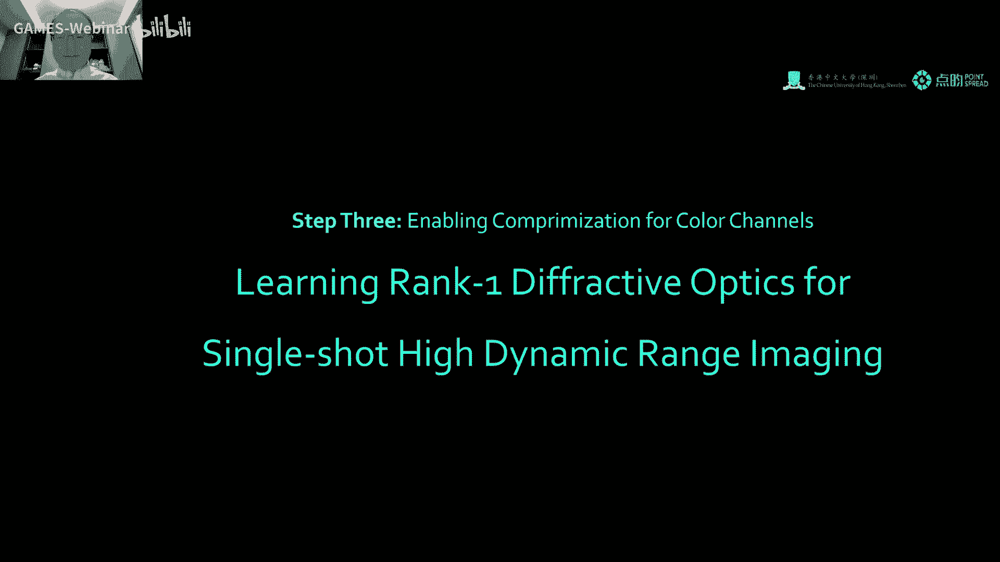

基本上我们自然界里面，它的一个动态化还是非常大的，就无论我们怎么拍照，它总是有过曝跟欠曝的一部分啊，当然我们也知道像一般啊。

像我们手机里面摄影啊，或者是这个传感器里面就是像索尼mx嗯，不记得几几几了哈，像那它一行长一行长报，一行长一行短报，或者是直接三次曝光直接融合，像艾森美啊，或者好微都有这种三次曝光去融合的一些啊。

传感器哈，直接就是不需要呃读出来，我们在缓存里面直接爆爆三次，这样的话可以尽可能缩短了，我们就是每一次曝光之间的一个中间的一个gap，但是这种多次曝光融合。

始终是有一些motion arex物体总是在运动，然后呢，这多次曝光也是需要一定的一个就是处理时间，当然这个处理时间，主要是卡在这个内存瓶颈的地方，那么这些东西都要搞到内存里面再去算一算哈。

对r max 982，还有安森美欧记也有这个索尼也有这些很多哈。

那索尼除了这个还有一种新技术，一个大像素旁边搞了个小像素。

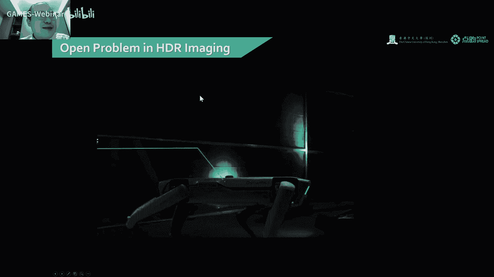

这个另说哈，这个是非常好哈。

这个。

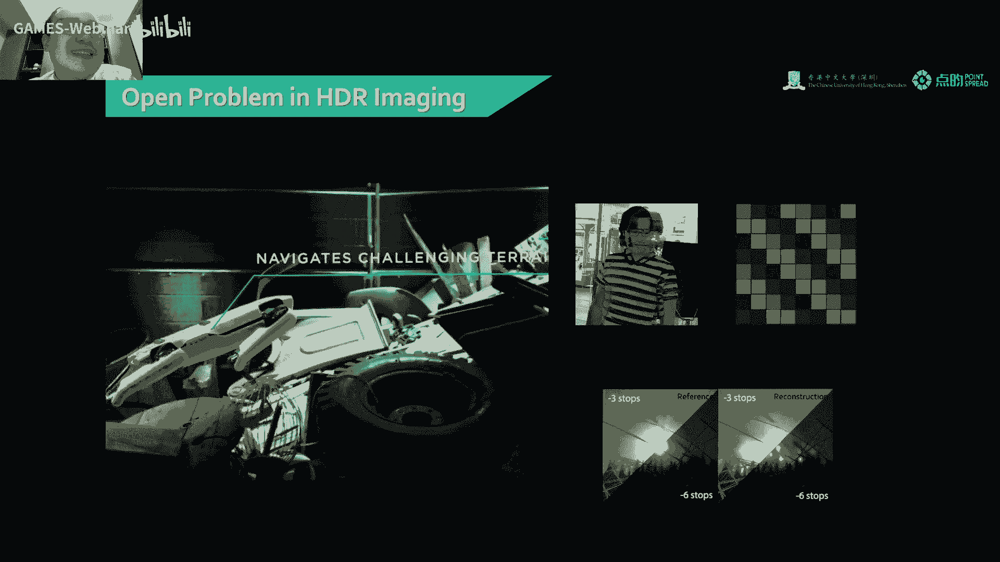

当然针对这种想要实现一个动态的一个hdr，但是又不牺牲这个分辨率。

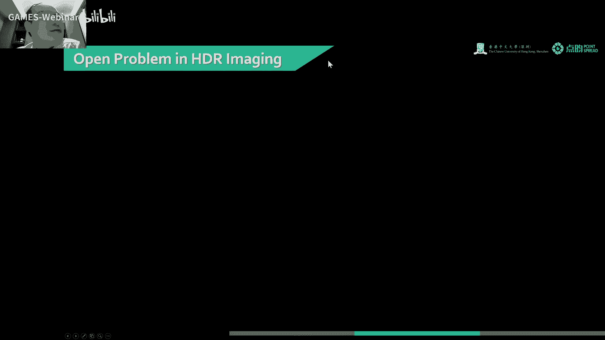

又不想换一个传感器，这个时候我们是有一个什么想法呢，就是我们可以把这些特别亮的地方，通过这么一个光学系统，把它搬到一个没有过曝的地方，然后呢把这些没有翻译过去的信息提取出来，再去重建我们这个过曝的地方。

这个时候是不是就实现了一个啊直接的一个，动态范围的一个延展呢，实际上这是一种空域调制的一种办法，这是一种空域调制的一种办法，这个是当时我们做的一个原型，这套路跟前面一样。

这个还是在我们的这个这个前桥面上，前桥面上做了这么一个呃演示的一个模型，跟之前有点不一样。

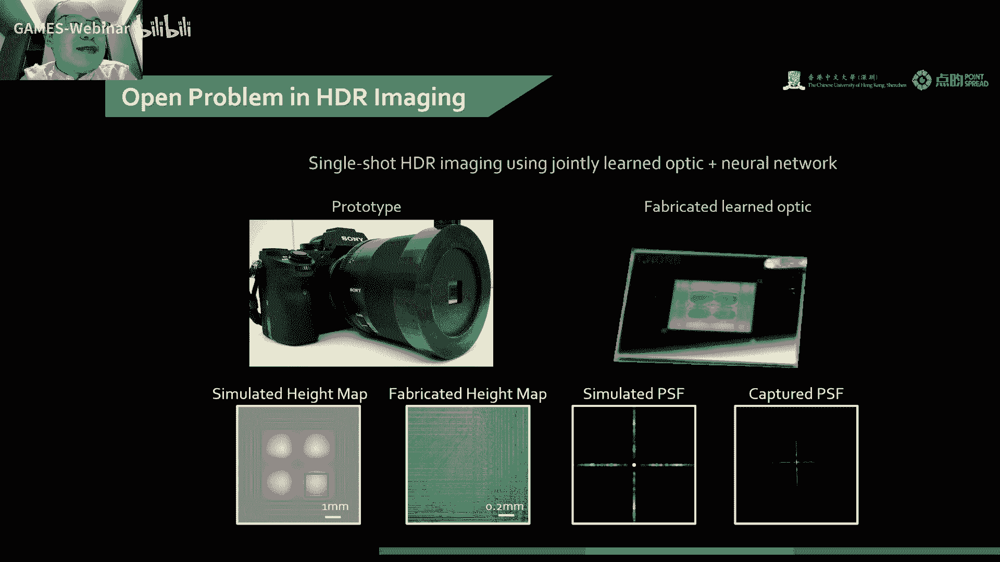

之前我们最开始设计的时候，是先搞一个最优化的p s f，然后再去通过这个face ritual的一个叫叫js base的，face shoal method去重建这个相位板，因为当时是单次波长的。

我们可以非常精准的去恢复，我们这整个相位板的一个相位，但是呢当我们需要考虑不一样的波长的时候，整个这个js face face method就不工作了，这个时候怎么办呢。

就需要一种我们直接建立这个这个点扩散函数，跟这个app的一个关系啊，我们之前知道大概是一个分裂变化的关系，但是呢同学们想一想，这个分列变换实际上在我们算法里面，它只是一个简单的一个碟形变换。

这个碟形变换它是线性的，线性的意味着什么呢，意味着就可微，这个时候我们是可以，直接通过这种线性变化的一种关系，把这整套光学系统做成可以微分的好，这个时候我们就可以在不一样的通道进行。

去compromise，当时呢这是我们设计的一套完整的一个pipeline。

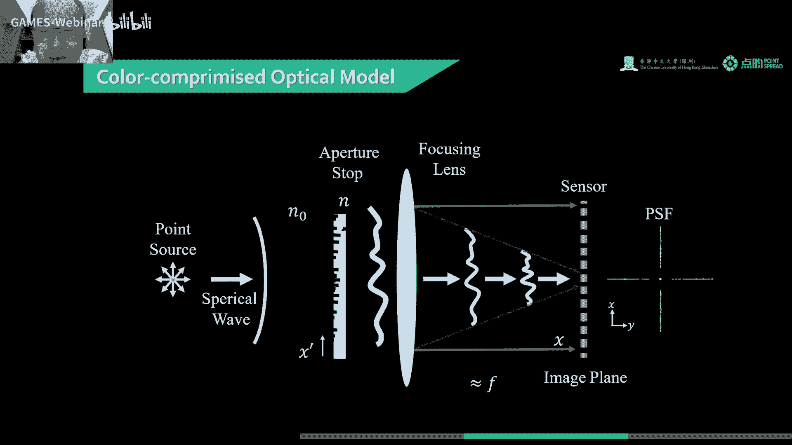

当时这套系统是比较复杂哈，比较复杂，因为我们最后呃捕捉到了信号啊，他是这个挺挺难处理的，挺难处理的，首先呢还是有像我们这个可微的一个呃，衍射的一个演示，一个透镜模型哈。

当时是为了去减少这个整个viable map的一个数量，就viable的量就是因为viable大了，我们把每个像素点都当成变量的话，这个很难收敛啊，同时嗯第一是难受点。

第二是它很难实现一个global encoding，因为我们非常强的一些信号啊，之前我们有一个斯坦福的师兄也做过一个，像这种呃deep optics，一个hdr，但是当时呃。

就是受限于没有实现一个global的encoding，就没有啊，在一个全局范围内进行一个encoding，因为当时他把整个的一个就是这个face map，当成一个大的viable map。

这个时候他收敛就很难收敛啊，很难收敛到一个比较好的地方，这个时候我们就加了一些constraint，一是让他收敛得更快，第二是让他使得一个全局的一个，就是编码的一个能力，这个时候我们最后搞出来一个优。

最优的一个相位板，它的一个点放大函数很奇怪哈，是一个像十字叉形的，也不是也不是很奇怪哈，因为我们设计的就在这两个维度上去优化，它有空间信息，也有彩色信息，同时我们可以看到中心它是有一个高频的。

它保留了一定程度的一个高频信号，这样的话对我们后面的一些重建是最优的，但后面这些套路啊就是跟前面是一起优化，因为这个时候我们整个光学模型，这已经变成可微的了，唉像我们实际上传感器上拿到的图像。

就是像上面这张图像，这个图像是哎这个当时非常难看啊，我们就当时就想这个咋处理呢，其实是也是试了很多种方法，就发现我们先提取我们整个的特征，提取完我再重组哈，提取完我再重组。

但为了因为我们这个本身已经做了一个encoding，global encoding，对我们的充电网络来说，这个充电网络要有一个比较大的视野，才能去抓到我们非常大的一个，面积上的一个信息。

这个我们先通过一个v g g啊，这还是老套路，金字塔啊，金字塔，金字塔这个拿到了一个大范围内的一个feature，然后我们再用一个空洞卷积啊，空洞卷积去重建出来去，也不是重建啊，这个是又是重建。

又是分离信息，这个deleted conclusion，他有两个任务，第一是把没有过曝的地方去，比较干净的剥离出来，比较干净的剥离出来，第二个任务就是把我们这个residual。

就是我们这个残余的这些including的一些信息，就是过曝的播放的信息，跟我们就是我们底下没有过曝的，一个就是正常的信息去分开，最后呢我们过曝那部分的信息啊，就是我们所谓的这个residu。

就是对我们高亮部分的编码，我们在对对这个高亮编码的一些信息进行重建，重建出我们这些过曝的部分，就可以同时的捕获这个on the exposure，跟over exposure两个部分。

但最后把它这个融合在一起，就可以实现一个实时的高端能范围的成像，这个当时这个想法是比较巧妙哈，实际上就是过量的信息搬走搬到，比如说我颁个简单一点，举个例子哈，就我们把这个这个灯啊，这个灯非常亮。

我把这个灯的一个1/5，1/10的能量搬到一边去，就是1/100的能量搬到一边去，这边上这些没有过曝啊对吧，这个时候我们信号是可以捕捉到的，然后呢我们在用这些编上这些信息啊，这些经过编码的信息。

再去把这些过曝部分的一个细节重建出来，这就是当时的一个空滤调制的思想啊，空滤调制的思想，但这里面用到一个呃非常强的一个假设，非常强的假设，这个后面会讲到，这个是当时我们的光学模型。

这个点这个给大家说一说吧。

这个可能很多同学们没有见过呃，也可能学物理的同学已经学过了，一个点的一个光源，就是用它的一个嗯r k r，实际上这是一个r写成矢量，就是一个r，这个就是一个自由传播的一个方程。

自由传播经过我们这一个d u e的layer，这个d o e layer其实更简单，整个d o e自己啊就是一个相位延时版，每个像素有个自个儿的一个延时，这个就完了。

就是不同的高度就会产生不一样的延时哈，就是不一样的相位延时，这高度当时是用了两个vector去表示的，两个就是art product去表示的，最后呢我们过了这个相位板，就是整个的一个广场的相位啊。

进行一定的延时到我们这个图像传感器上，实际上就是一个飞鸟衍射啊，飞鸟颜色，这飞鸟也是我们发现这个变来变去啊，这个最后变成一个非常简单的一个，福利变换的一个近似，再说我们的loss function。

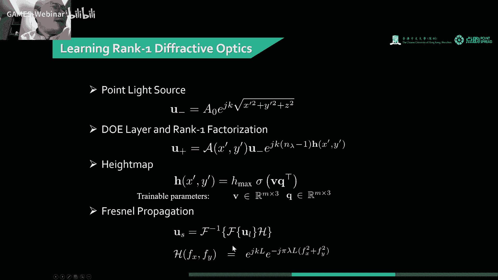

当时这个lofunction是分了三个部分啊，四个部分，这三个部分12344个部分啊，三个大部分，第一个是对于我们飞过报地方的一个呃，一个loss，我们非过曝的地方有两个任务。

第一个我们是需要把我们本身的一个，破坏的信号去恢复出来，第二个部分，实际上我们要把这个重叠部分的一个信号，特别是原本已经有细节了，我把encoding的信息，跟我们原本那个细节要去分开。

这个时候就用到了一个小trick，这个叫explosion loss，这个东西本身是干什么的，当时是我记得是哪位老师，是任ng，就是berkeley的任ng，他们作为一个呃。

这个就是反射去除的一个论文哈，反射去除，我们假设这个反射的一个梯度，跟我们自然的一个场景的梯度是不重合的，这个之前我们在讲这个gradient这部分，可能也提到过这个问题。

这个地方也利用了一个同样的原理，就我们假设我们encoding的一个信息，跟我们最后实际的这个自然场景，的一个gradient它是不重合的，当我们最后试了之后，发现这个先验知识它是非常有效的。

可以剥离我们这个编码过后的信息，那我们在这个后面第二部分，这个这种过曝的地方，那个重建的时候就简单这一个v d g就可以了，最后哎把它fu在一起，有一个小的后面loss就把它f在一起了，这个比较简单。

整个的一个精髓啊，就在我们假设编码部分，跟我们这个就是自然场景的，它是一个梯度是不重合的，这是一个比较精髓的一个地方哈，这是我们当时呃重建的一些效果。

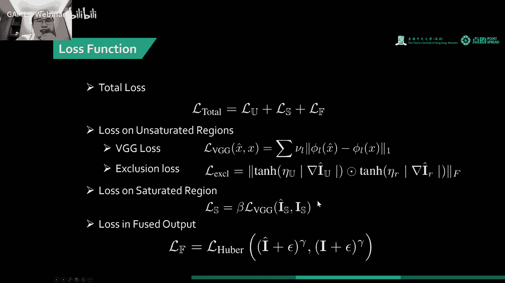

这个是hdr cn是17年square up的一篇论文，这格里尔h r格雷尔hdr，同学们可能看到过，这个是之前我们组2001年的一篇best paper award，cvpr。

best paper award，当时呢这个思想很有点类似，它是一个star future，大家就是那种星芒镜啊，大家拍星星的时候会产生一个星芒，星芒镜通过那个调制，然后再用一个a。m去解出来的。

那个时候极限性比较多啊，就是我们最后重建出来的这些，那这些地方artifex啊会比较多，refx比较多，后来呢就有一个deep optics，就刚才讲到一个整个整个variable map。

实现了一个他因为当时这个encoding没有分开啊，他只是做了一个copy，没有实现一个global encoding，当然这个时候他也缺乏了一个，就是这种调制过的信息跟背景信息。

它的一个梯度是不重合的，这个关键点啊，所以说当时重建的效果比较有限，重新的效果比较有限，这个呢就是我们当时去嗯踩到了一个效果，它实现一个global encoding。

就我哪怕因为这整个的信号都不是特别强，就不会有这种在周围又再次播报的一些情况下，这个时候就非常难处理啊，我们可以看到最后我们重建出来的效果啊，这种细节啊都是非常清晰的，细节都是非常清晰的。

这是另一个场景，我们可以看到像这种过曝的地方。

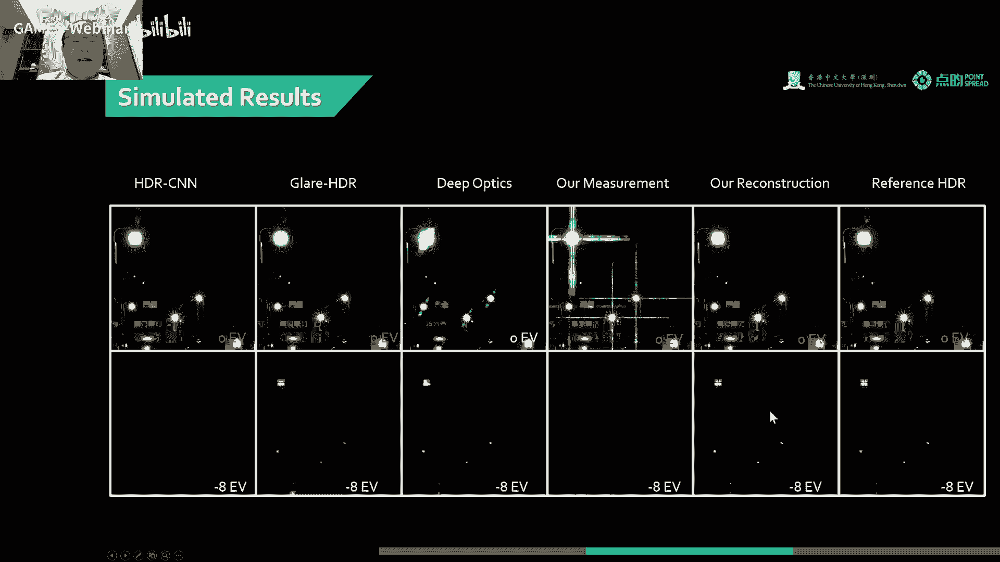

传统的方法都已经是没有办法恢复出来，任何细节了，但是通过这种global以后，我们可以看到哈，这周围这个彩色的这些编码，里面是有非常多的一些这个它的高频信息的，对不对，这个时候我们发现。

这个时候通过这种高encoding的高频信息，是可以非常完美的去重建，我们这个过曝的地方到底是什么样的细节，这是当时就是测试的一个结果。

当时哈从那个实际的一个测试结果来看，就是因为它是第一次实现一个，软硬件联合实现的一个优化，他对这种单次曝光的hdr，相比一些竞品的方法竞品，这就是友商竞品哈，它是一个非常大的提升啊。

我们可以看到比最先进的一个deep optics，有接近8dB的一个提升啊，从hdr v t p是另一个指标可以看到呃，这个大概有个6。5个点的一个提升，我们可以看到哈，这个有了光源系统一起加成。

从deep optics相比之前的，只是一个简单的一个重建啊，或者是一个inverse tomapping来重建dr的时候，它已经是有一个56dB的一个提升，但是这个整个管理系统优化的不是特别完美。

当我们比较完美去优化的时候，又可以有一个巨大的提升啊，这巨大的提升，这是当时实拍的一些效果。

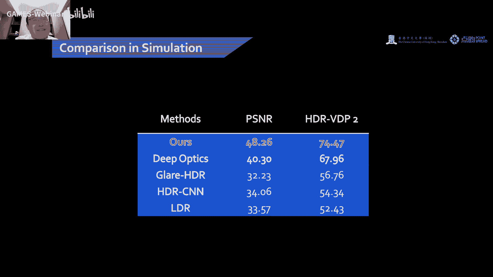

这当时是在我们当时一个合作者家里，叫富强老师。

我看到这个过曝的细节啊。

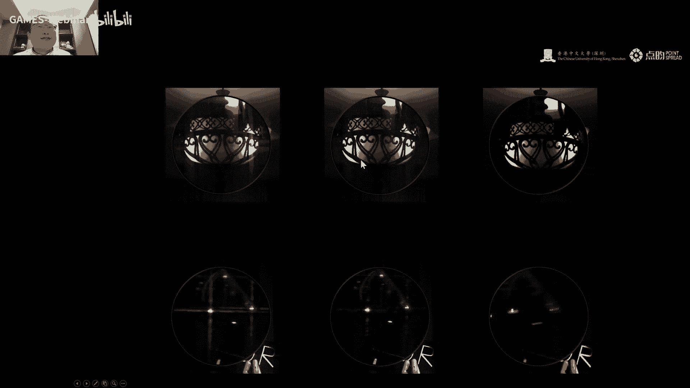

是可以非常完美的恢复出来的。

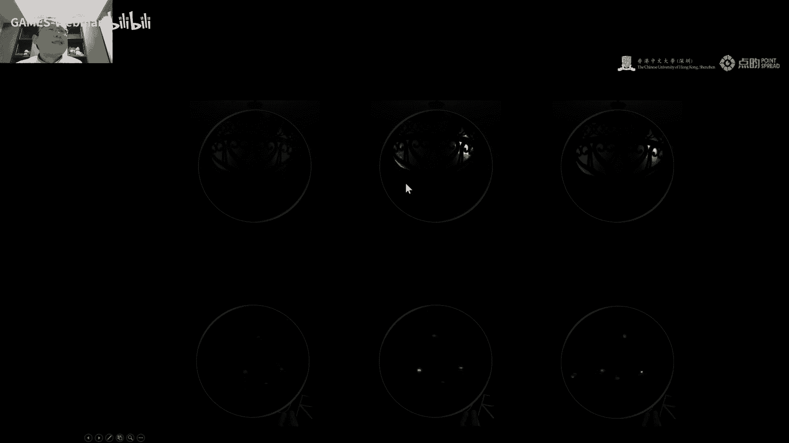

这这这灯啊，这也是我们在实验室拍的一个效果。

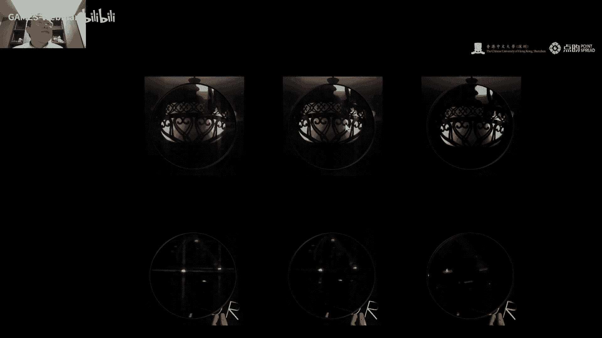

这个已经完全过曝的，这些小细节都是可以比较完美的恢复出来，啊这个是我们在野外拍的，当时嗯这个我不记得是哪个公园了。

当时应该是可能是国王经济城的一个这个公园，花了上百亿美金在海边修了一个，就没怎么有人的一个景点哈，后来可能发展成一个小城市了，当时我们很多做实验的时候，就喜欢去那个经济城去拍这个拍这种景色哈。

我们可以看到这种细节，都是可以比较完美的去恢复出来，当然像之前的这几种办法，我们已经用了非常多的trick啊，包括像就压缩感知的a d m m，好像根据这个模型传感器采样模型进行优化。

还有像包括这个global encoding，可谓的衍射系统，但这些系统呢都是有自己的局限性，这个时候我们想一想，我们可不可以设计一个端到端的一个，复杂透镜的设计系统。

来真正的接近我们商业或者是实用的一些，这办法呢，当然这个可能刚开始想这个idea的时候，会比较困难哈，因为这个咋实现呢，这个是不是有点难呢，其实那个时候就是可微的光线追踪，是刚刚出来啊。

刚刚出来就说米苏八兔，这个时候我们就跟康利老师跟邓老师一起去想，诶，这个干脆就用这种可谓的光线追踪，去设计一套这种自动优化的系统，来去实现这个大招端的一个优化系统，我知道这个复杂透镜系统。

它有非常多的一个镜片啊，再通过这么多的镜片来去消除相差啊。

但是这种他对一个特定的任务来说，就我们就想要一个什么样的信号，它真正的是最优的，往往不是的，因为我们往往是通过经验来去设计，我们这个复杂的一个特定系统，通常呢大家的一个感觉就是，去优化它的一个mtf。

让他mtf响应更好，或者优化它的一个点炮的函数，让我们更锐利，对不对，这个时候啊，就是这跟设计师的一个经验就非常相关啊，这个我们想要实现一个特定的任务，的一个完整的一个优化。

要根据算法一起优化就非常困难，非常困难，但是已经有的work呢。

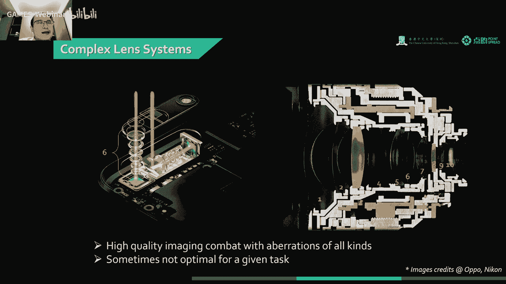

就包括像演示的一些途径啊，或者单个的一个呃折射的途径啊，还有像我们之前自己做的，像那种synfptor这种东西，它都是首先是单层口味好，单层可为用的是进球进四，因为是单层吧。

它的这个就是设计空间也是非常局限的，这个就是自己把自个儿命给革了，当然前面有前面的一些特殊用法啊，这也不算完全把自己的命给革了，像前面的这些东西呢，它因为受限于单层的调制，它那点光的函数有时候特别大。

有时候质量特别差，这个时候我们就恢复的一个图形的质量，都是比较受限的，而且同学们可以观察到，我们最后在图像传感器上拿到的一个，就是项目版的一个分类变换的平方，这个平方哈，但是同学们要想想一个非常一个。

fundamental的问题，就是我们的图像传感器，只能拿到我们最后的强度，对不对，实际上我们这个相位部分是丢掉了的，也就是这个地方我们要做可以微分的话，我们整个光学的相位都是丢掉的。

实际上这个时候整个系统啊，并不是完全可以微分的，它仅仅是部分可微，这个部分可微呢就会引入一个新的问题啊，就是他不一定收敛到最好，他很难收敛到最优的一个位置哈，当然这个光学设计本身。

可能同学们自己做过imax和code five这些课程的话，会可能发现这光学优化本身就是一个玄学哈，你很难让它优化到你想要的一个地方，这个时候就有非常多经典的一些设计啊，像双公司结构啊。

像这种就会指引着大家去呃，根据这种结构再进行去优化好它本身这个，所以说现在很多这个称呼就是叫the art of optics design，并不是the size of optics。

就是也就是说现在我们的光源系统的设计，还是一个艺术哈，所以说大家都是艺术家哈，这个也不用谦虚哈，要实现这么一个可微的一个透镜模型。

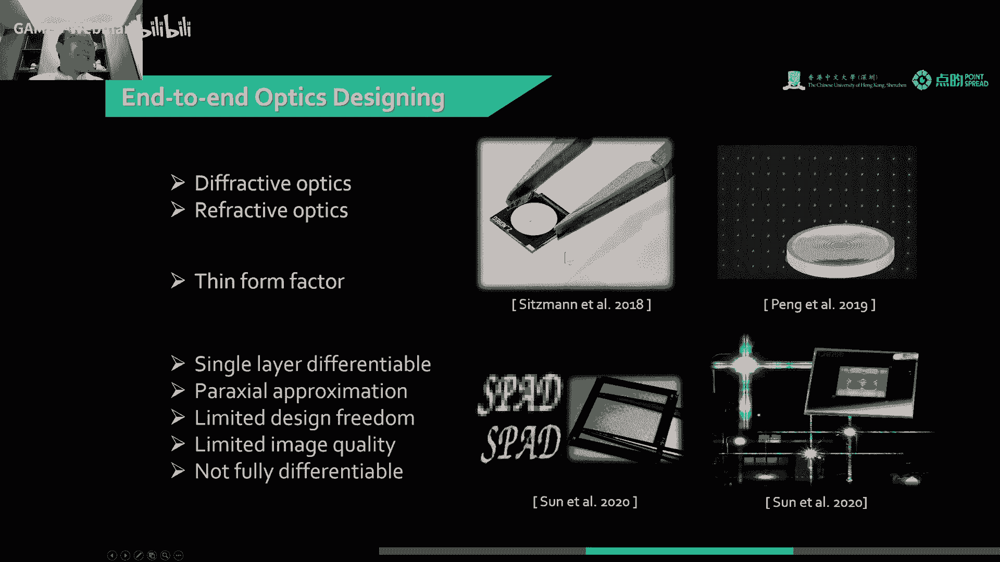

首先我们要先做出来一个单透镜，一个单透镜是怎么表示呢，我们知道我们这个非球面镜啊，非曲面镜它是这个我们的这个离轴，比如说在这个离轴r的肉的一个位置哈，他这个离顶点的一个距离h6 就可以表示为诶。

前面是一个啊这种曲这种曲率系数啊，再加上一个椭圆系数，后面是一些高阶项，高阶项，这个时候就可以表示我们这不同的主外的位置，它的这个呃非球面的一个h6 是多少，要实现整个系统可为咱先简单点。

先把这个这个非球面镜的一个微分先求出来哈，这个就先把这个微曲面，非曲面的一个微分线求出来，然后呢再把它这个inflicity form，实际上我们是最后是对x y z空间进行求导，x y z空间进求。

我们要写出来这个面哈，把假设这个是z的零点啊，这个这个顶点是z的零点，这个面它的一个xx y z的一个dp，实际上我们最后我们的光线，对我们这表面上这么一个面片啊，或者是一个小派势来诶。

根据这个地方的微分变化而变化，这个时候我们对整个implicit form进行求导，就可以拿到这么一个函数，说到这个光这个光线追踪，我们就不得不要从图像传感器上，然后去反而去解这么一个。

就跟我们最常见的一个交点啊，场景的一个交点上，我这个时候就定义一个光线，它的原点是o它的一个方向是d，这个我们要发现就是没有，还有非常多的一个折射面啊，在复杂抽筋的时候有非常多的折射面。

一个一个去往前去找这个焦点的位置，直到找到你最常见的一个焦点好，这个时候每一个面就可以用一个牛顿法，来去解这么一个问题啊，就求交点一个问题，这个很简单，但除了这个之外，我们还要考虑到这个色散问题。

因为我们本身做这个图形学里面的光线追踪啊，它通它既不是通常还是只是，都没有考虑到这个色散问题，这个时候我们要引入主动的引入色彩来去呃，平衡这个因为色彩引起的一个相差的问题。

这个时候就用了一个柯西柯西方程哈，柯西方程在我们这个透镜表面的，这些折射率表面，比如一个科学方程，来把这个色彩也同时的模拟出来哈，色彩也同时模拟出来，这个时候就真正的构建了一个可微的，一个光学系统。

可以把后面的一些呃神经网络呀，或者是一些优化了一些他的鬼点子，往前反向传播，这个时候我们整套系统就可以一起进行优化啊，一起进行优化，但到我们出氧传感器上呢，它这个又比较复杂了哈，这个又比较复杂。

它首先我们这个点光的函数，它是空间位置深度，还有一个波长的一个一个一个函数，同时呢我们这个传感器呢啊，这个他要是要跟这个本身这个信号场景性，卷积场景也是一个跟空间深度相关的一个地方。

在同时呢跟我们这个颜色响应曲线，就是传感器的颜色响应曲线来进行积分，总是要考虑噪声，这个时候，我们这个sensor模型会变得比较复杂哈，我做这个我们学过这个games 2101的同学啊。

大家会发现传统的这个sensor，传统的这个sensor，它都是一个没有一个单位的一个一个东西啊，它就是一个像素，我就划了这么一大，它实际上并没有物理单位，但是我们要设计这种光学系统的时候。

我要重新去写这么一套sensor跟这个integrator，这个时候才可以实现，真正的在物理意义上的一个积分，再通过模特卡的采样，在我们这个在我们这个这个传感器上，这个传感器上。

每个像素上面就会有一些蒙特卡洛，采样的一些呃，直接就是积分，然后最后还会有一个问题哈，比如说我们要我们有一个光柱子啊，比如说我有一张图片或一个场景，我是不是要造一个光柱子来把这个透镜过来了。

一个图像跟我们这个小孔过来了，一个图像进行匹配呢，但是我们知道经过了一个不理想的一个透镜，不理想的一个透镜本身啊，它的像素会随着空间位置的一个偏移而偏移，实际上这就是啊。

我们之前提到过的一个就是相机的模型哈，相机的模型这一节删掉了，好像是这节删掉了，刚才给这个学校的同学们讲过，相机的模型实际上就是它的基地啊，我们要先，因为这个中心点是我们是理想的情况下。

就是模拟的一个情况，所以你也不用再对齐了，但是我们要考虑边缘像素的一个对齐的问题，这个时候先把，因为你要是直接对这个，这个这个就追过来的一个图像哈，就是我们追过来的一个图像，就带几片的图像给他再做校正。

再去跟我们这个广告数字相匹配的时候，就有问题啊，有问题，这个我们做一个按discussion，这个就可微性就没有了，当时咋玩的呢，就是我们把这个理想的一个，过了小孔的一个图像，根据我们现在透镜。

我们trace很多个点啊，trace可能大概是当时是15个点了，就把这个畸变模型算出来，我先对这个理想的一个这个图像，进行预畸变校正，就是把它这个基变给它加上，再去跟我们追求来这个图像按像素匹配。

这个时候才跟后面的算法建设一个端到端的，一个就可微的一个部分啊，这是有一个小吹壳在里面，当时，这是一个完整的一套可微的复杂透镜，追踪的系统，这个是比较复杂哈。

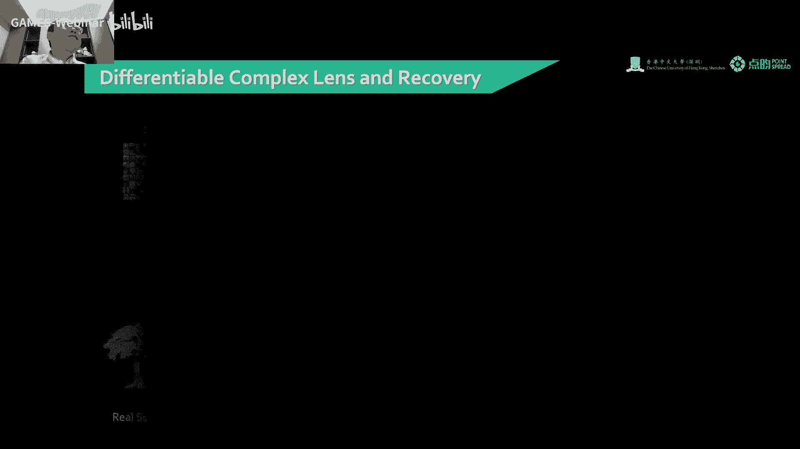

这个代码量也非常大哈，啊这是在传感器上，我们可以看到光学参数不断的变化，在传感器上的一个效果也在不断变化，最后也收敛到我们对我们这个整个重建网络，两边一起平衡，达到最优的一个效果，当时就做了两个应用。

第一个是大势力的成像。

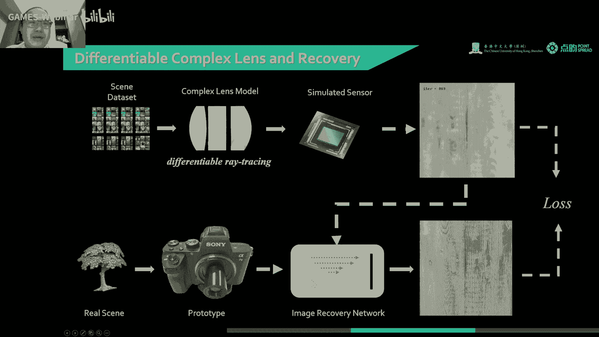

这个是在当时也是自己革自己的命了哈，跟这个邓老师一起做了一个大视野啊，大视野，我发现这个时候无论是现有的一个非球面镜啊，还是一个符合的非球面镜啊，还是已有的这个大视野设计。

都是可以通过这种可微的光线追踪啊，设计一个非常好的一个简单的，单薄的一个大透镜的成像，另一个地方就是实现了一个景深成像。

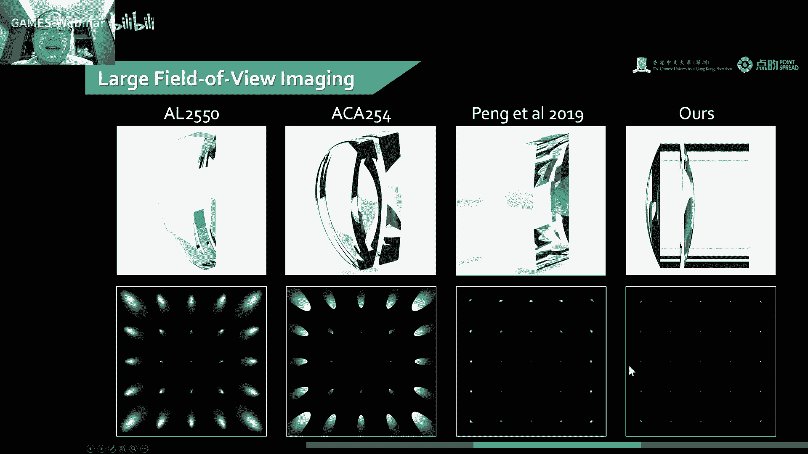

我们知道我们口径比较大的时候，光学口径比较大的时候，也就是f数比较小的时候，要实现一个大点声，它是一个比较矛盾的地方，那这个思想啊，还是跟之前大市场设计的时候一样，不能让它一样好，我可以让它一样坏。

但是一样坏的时候我可以解出来，像我们之前在对焦的位置哈，像这种已经有的商业化的，这种比较高级点的透镜啊，对焦是比较清晰，这是它点空大函数会随着距离的变化，快速的就是去衰退。

这是当时我们设计了一个景深延展的一个呃，设计吧，就我们可以看到不一样的深度，不一样的深度，都有一个比较优秀的一个点扩散函数的平衡。

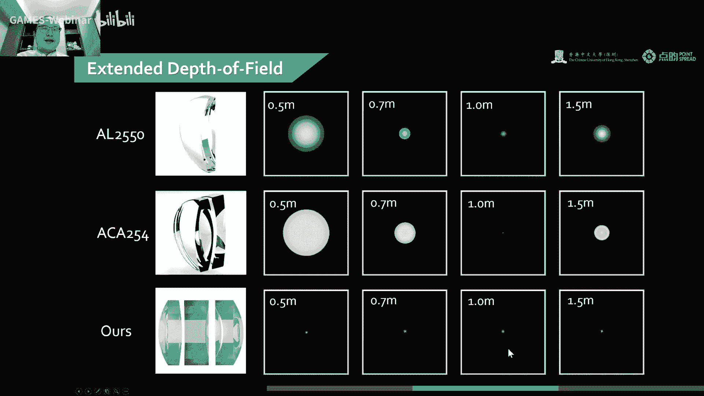

这是当时我们加工出来的一套原型啊，这个是这个是自个儿加工出来一套图，左下面右上上面两个是渲染出来的一个效果，左下面是实际加工出来的，这个其实当时挺紧张的哈，这个这次实验我们还是犯了之前的一个错误。

就是选了材料不是特别好，还是淘宝买来两种材料好，但是偏m跟p c这个吃完之后发现这个好家伙，这个上面起雾了，这个同学们一定要注意，这个以后选这个通讯材料的时候，一定要特别注意。

这个也是用单点金刚石车的啊，可能车的时候有可能夹变形了，夹变形了哈，哎而且这个特点本身比较复杂，它有非常多个面是非球面的，这个对心哈也会有问题啊，他这个开粗的时候周围可能有点太大了，最后磨啊磨。

这可能对其也没有对特别好，不过最后使用的效果还不错哈。

就是左边这个是大视野的透镜，在抽氧传感器上的一个图像，它是有蒙了一层雾，好这层雾我怀疑就是要么是刀纹，要么就是这个材料的问题，右边是我们恢复出来的一些效果，这个是拍了这个是这是啥地方。

这是那个无锡有个什么，怎么说，你哪个旅游景点忘了，这个当时是边出去玩，就把这个实验给做了，这是恢复出来的一个效果，哎这个背景图像就这样，图像不用担心他这个背景它就是这么多花纹，这是景深延展的一个实验啊。

左边这是普通的一个透镜拍出来的，右边这个是我们的一个紧身延展的一个透镜，拍出来的，那效果感觉可能还是加工厂影响了不少，这个也是你看左边是主角传感器的原图，它已经起了非常多的雾哈，这个起了非常多的雾。

跟我们最后仿真上差别就在这一层雾上，这是我们就恢复出来的一个效果哈，我们可以看到各个位置景深都是清晰的，但传统的透镜只有聚焦的位置是清晰的，今天就给大家讲到了最后一节课啊。

也欢迎这个同学们已经我们已经走一起，走过了789 10 11 12月七个月哈，这个课程已经延续了七个月，这个不容易啊，是因为上完这个课，它涵盖的内容会非常多啊。

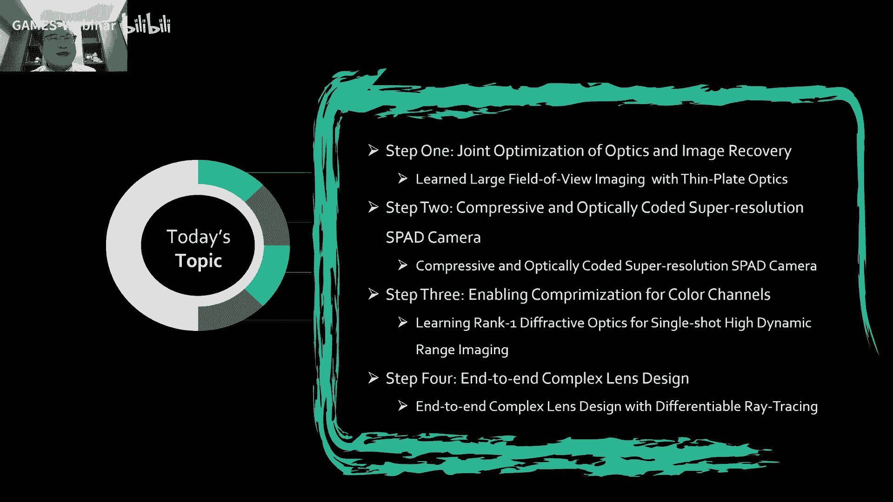

包括像我们的光学系统啊，像素啊，就整个就是就图像传感器的设计啊，还有包括我们后后面的算法设计，还包括人类心理感知，整个成像的表达，他是一个非常大的一个综合学科，讲到最后啊。

这个我对这个整个的计算成像东西，还是非常有感情的，还是希望同学们能够就是深挖下去，因为这个领域的人不是特别多哈，不是特别多，所以说需要同学们去不断的去学习，来去丰富整个领域的一些人才。

也希望大家啊在新的1年里面能够乘风破浪来，去收获出自己想要的一个呃，事业跟学业这个同学们有什么问题吗，说明有问题的话可以问，对啊啊啊啊，后续课程呃，这个因为我们这一次删掉了很多课程哈。

这个我们干脆就把一些课程，可能后面可以安排到一些专题课程里面，比如说四开头的一些，三开头和四开头的一些专题课程里面啊，这个现在还没有完全规划好，我们后面可以合计一下。

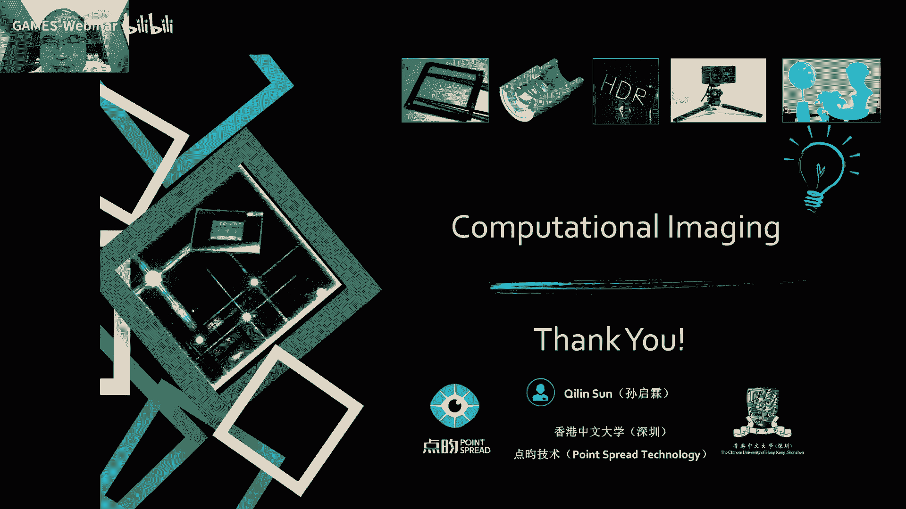