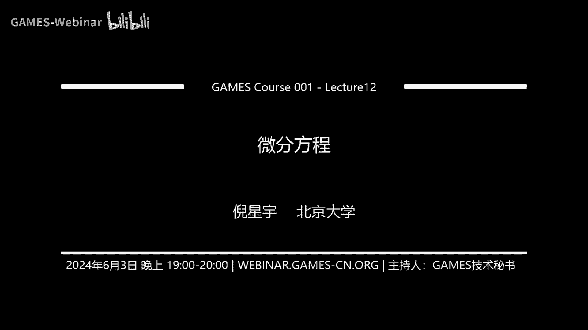
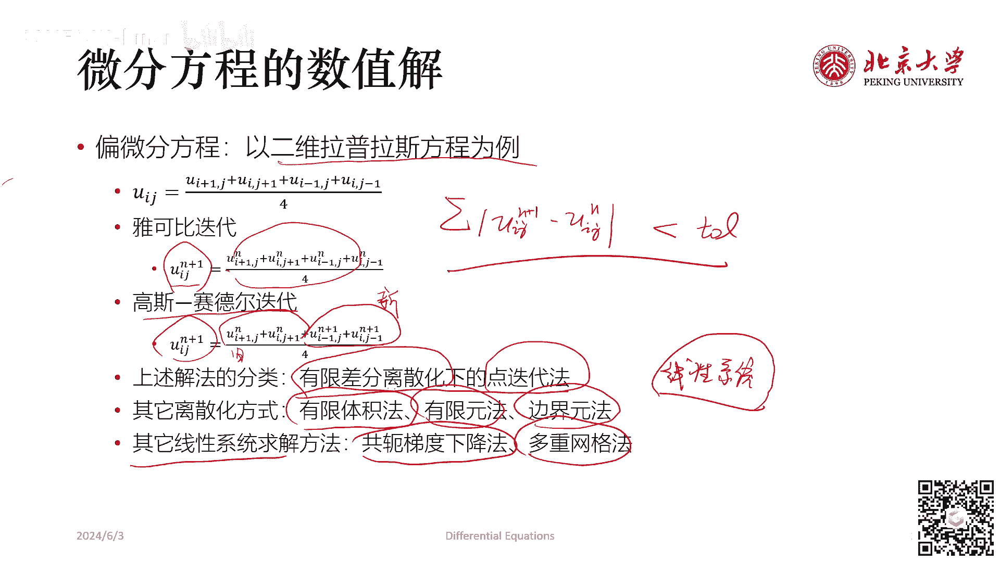
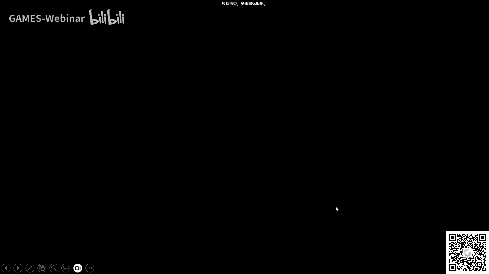

# GAMES001-图形学中的数学 - P12：微分方程 - GAMES-Webinar - BV1MF4m1V7e3

好的啊，同学们好，今天我们来讲这个图形学中的数，学的微分方程的部分，然后本次课程是我们这个连续，数学的最后理解，就如果大家去看我们的大纲的话，可以看到我们我们是之前讲了什么呀，我们讲了这个场论。

讲了这个微分几何，今天是这个微分方程，对这个是连续数学的，就是这个部分的最后一节课了，然后今天这节课之后呢，我们就会进入离散的部分，我们会去讲一些这个线性求解器，然后最优化，以及这个机器学习。

或者可以简单地理解为这以上的部分它是数学，更偏数学，这以下的部分更偏计算机，对，今天这节课就是要起到这样一个，承上启下的作用，那我们下面就来看这个微分方程的相关内容，呃。

我们说这个图形血液当中的微分方程，其实相当多啊，就是从常微分方程到偏微分方程，有各种各样的方程，都是图形学需要去求解的，额所以呢作为一个总结呢，今天这节课呢，就是首先他大家要把定义成这个目录。

就是挂一漏案，我这里肯定没有办法把所有的这个图形学，涉及到的微分方程知识，都给大家在一节课当中讲到啊，有些地方可能就会讲的比较快，大家之后再用到关于微分方程的，相关内容的时候，应该去。

到时候根据我们今天讲的内容，去查阅相关的资料，然后更详细的学习，我们今天可能就会从这个，最简单的微分方程出发，然后一步一步到比较复杂的微分方程好，那我们首先来看什么是微分方程，这个其实呃。

如果大家修的修了这个高等数学的话，两学期的高等数学的话，应该都涉及到微分方程，当然如果大家是这个修的三学期的数学分析，那么对于一个大一的同学来说，可能就还没有学到五分方程，那么我们说的微分方程呢。

它表示的是未知函数，未知函数的导数，当然这里的导数可能是一阶导数，二阶导数，各种各种阶的导数啊，与自变量之间的关系的方程，然后求解微分方程是要干什么呢，就是我们要从这个方程里去，求解出这个未知函数。

求解这个未知函数的过程就叫求解微分方程，微分方程的分类，最基础的分类就是根据这个常微分方程和偏，微分方程来分类，所谓常微分方程就是这个未知函数是一元函数，那么这里面涉及到的未知函数的导数呢。

也就全都是全导数，就是如果您看到的这个里面涉及符号都是D，那么他就是个常微分方程，如果未知函数是个多元函数呢，就是里面涉及到的导数呢都是偏导数，大家可以看到就是这个偏导符号par手。

那么这个时候呢它就是个偏微分方程，微分方程有很多种求解方法，然后今天我们会大体上去讲，以下这四种求解方法，第一种就是通解法，通解法是一些非常简单的特定的微分方程，它会存在一个通解。

也就是说是满足这个形式的微分方程的，所有的解我都给你找到了，你只需要去代值就能决定它的解究竟是什么，这个是通解法，然后第二个求解方法是这个分离变量法，分离变量法也是求解微分方程当中，一个非常重要的手段。

然后它其实呃，在常微分方程和偏微分方程当中，的表现形式是有所不同的，这个我们一会会说，然后就是格林函数法，格林函数法呢，它其实我个人认为，它更多的其实可以用在数值当中，就分离变量法，它是一种分析的手段。

它往往的还是呃就是数学家，物理学家他们也会去用的，而格林函数法呢，就是是一个从数学到计算机的桥梁，因为在计算机当中很多时候，求解方程需要利用这个格林函数，而最后我们就会看到数值法。

那么数值法求解微分方程，事实上就本，它本身就是计算机图形学研究的核心之一，就如果你用这个数值法，发明了一种更好的数值法去求解微分方程的话，那么你是可以去投稿计算机图形学相关的论文，好。

那我们就开始今天的课程啊，有同学问会有录播吗，games系列的课程都是有录播的，首先我们来看这个最简单的分离变量，就是在常微分方程当中的分离变量，分离变量的标准形式是比额等式，左端是普SYDY等式。

右端是PHXDX，那么如果我们将等式两边都做积分呢，我就可以得到方程的通解，就是左边积分成普SYDY，右边积分成这个FXDX的积分，找到它的原函数，找到它的原函数，那么找到原函数呢，这中间一定加一加。

减一个乘数是不会影响方程的解的，对这个，所以我们来看一个例题，就是比如说我要求方程X乘一加Y方，DX减去Y乘一加X方DYY等于零，这个方程的通解，那么首先我们会发现。

我如果想把它整理成我们上面所有所说的这个，标准形式，我要怎么办呢，我要在等式两边同时去除，以一加Y方和一加乘以一加X方，那么左这个时候左式就会变成Y除以一加Y方，DY等于什么呢，等于X除以一加X方DX。

这时候等式两边就都可以积分了，等式左端积分是什么呀，是二分之1LN1加Y方等式，右端积分是二分二分之1LN1加X方，然后这个时候呢他还差一个常数对吧，这个常数呢我们可以把它写成。

我们把这个令这个常数等于二分之1LNC，注意到这个LNC的取值是负无穷到正无穷的，所以1/2，LNC和上面我们这个写的一个某一个常数，C1撇是等价的，这样整理一下会得到什么呢。

会得到LN1加Y方等于LNC乘一加X方，那么我我们在等式两边同时取指数E的，指数次幂就会左边变成这个一加Y方，右边变成C1加X方，就是左边变成这个右边变成C1加X方，然后我们再移一下项。

就会得到这个式Y方等于C1加X方减一，这就是我们求得的这个圆方程，当然你如果想把写成Y是X的函数的形式，也没有关系，你可以把它写成Y等于这个正负根号下，C1加X方，减一，这都是可以的。

这是最简单的求解微分方程的办法，那么我们来看一下稍微复杂一点的情形，首先来看这个一阶的线性微分方程，一阶线性微分方程它是有标准形式的，就是Y对X的导数，加上某一个这个呃函数乘以Y等于另一个函数。

如果呢这个等式右端是恒等于零的，那么这样的方程我们称它为其次的，如果等式右端不等于零呢，这样的方程我们称它为非齐次的，那么下面我们就来看这个线性齐次方程的解法，那么线性齐次方程的解法是。

就是它本身长这样的形式，这个形式是很容易分离变量的对吗，我们首先因为这个一阶偏导数具有线性性，我们可以是等式两边先乘以DX，然后再除以Y，这样就会得到什么结果呢，就是DYY除以Y等于负PX乘DX。

然后等式两端做积分，左边变成LN绝对值，Y右边变成负的PX的积分，加上C然后我再求E的指数幂，就会得到Y等于C乘E的负，上面是PX的积分次幂，然后这里的C是等于正负E的C次幂对，就是分离变量。

然后做积分就可以了，这个在图形学当中是有应用的，最典型的应用就是体渲染当中，我们来求解，这个光线在具有这个透射率的体介质当中，散射的时候，它的这个呃就是辐照度的这个衰减量。

然后这时候我们再来看这个线性非齐次方程，它跟之前上一页，我们看到的线性齐次方程的唯一区别就是等式，右端现在有一个函数QX它不再是零了，那么如何去求解呢，我们使用待定系数法去求解，我们令什么呀。

我们令Y等于你们看到这前面，刚刚我们这里是一个常数C，现在我们令这里变成一个函数CX，首先那么我们假设Y等于这个东西，然后我把这个假设得到的结果去代值，代值的话，因为这个DY除以DX。

我们首先要求Y对X的导数，求出来的结果就是CPX乘以，这个加上CX乘以，这个这个就是一个简单的积分啊，微微分练习求导练习啊，可以自己做一下，做完以后把这个式子给代入到上面的线性，非齐次方程当中去。

那我们就会得到这个呃，展开一下就是Y撇加PXY等于什么，等于刚刚我们令它等于这个，然后呢整理一下就会变成C1撇X的积分，等于QX乘以后面这个东西的积分，然后CPX的积分就是CX。

所以我们就会得到CX等于这个东西，cs等于这个东西，那么Y呢最后我们就会整理出来，它等于这个形式，这里我们会发现它和上一页，我们得到的齐次方程的解，只是多了这一项，如果我把这一项去了。

他就是上述这个线性非齐次方程，所对应的齐次方程，就把这个等式右边变成等于零，它的通解，那么如果我去掉这一项，去掉这个加C这一项，只留下这个多出来的这一项，它也就是这个东西。

它呢其实是这个非齐次方程的特解，也就是说你加不加这个C其实是不影响结果的，就这个地方你加不加这个C是不影响结果，你可以把它去了，它就是这个非齐次方程的特解，然后有一个这个定理就叫非齐次方程的。

通解等于什么呢，它等于其次的通解，加上非齐次的特解，那么什么叫通解，什么叫特解，那这时候就可以有另一种理解方式了，凡是一个简单的记忆方法，凡是在这个解的表达式里面，有某一个不确定的常数C的，它就是通解。

没有这个不确定常数C的，它就是特解，好，我们刚看到的都是线性一阶的线性方微分方程，下面我们来看这个一阶的非线性微分方程呃，最简单的例子是这个伯努利方程，它和我们刚刚看到的式子最大的差别是等式。

右端现在不仅有QX这一项，还要乘以YN啊，这时候我们说N不等于零或一，N不等于零或一，为什么呢，如果N等于零，它就会变成一阶这个呃线性非齐次方程，如果N等于一呢，那其实它就会等于一阶线性齐次方程。

那么怎么去求解伯努利方程呢，简单的做法是这个变量代换，量代换的结果是，我们可以去呃考察这样一个事情，我们把等式左右两端都去除以Y的N次幂，那么左边就会变成Y的负N次幂，然后这里呢就会变成Y的一减N次幂。

右边就没有Y的N次幂了，而这时候我们发现对于Y的一减N次幂，对X求导数会得到什么呢，他会得到Y的负N次幂DYDX，然后只是多了一项系数，所以我们把这个系数给约掉，那么我们就可以把上面这个式子给写成。

底下这个东西，就他们俩是一样的，把上面这个式子写下，写成这个东西，然后这时候自变量我们发，发现就会变成Y的一减N次幂，别的都没有变，那么我们令Z等于Y的一减N次幂，然后在等式两边再同时乘以一减N。

就会得到这样一个式，这个式子它就是一个一阶线性非齐次微分方程，那我们把刚刚的这个通解表达式给代入带下来，就会得到布罗利方程的解，这就是变量代换法，事实上我们已经展示了，求解微分方程的几种方法。

一个分离变量法，一个待定系数法，一个变量代换法，刚刚我们看到的都是一阶的微分方程，现在我们来看高阶的微分方程，高阶微分方程，最简单的情形就是可以降阶的高阶微分方程，比如说啊Y的N次N阶导数等于FX。

那么我们怎么求Y本身，我们只要做N次不定积分就可以求得通解了，然后另一种情况是Y的二阶导数等于FX，Y的一阶导数，就是X和Y的一阶导数的函数是Y的二阶导数，我们可以怎么办呢，我们可以设P等于Y1撇。

那么就有P1撇等于什么呢，P撇就是Y两撇，P1撇等于X和P的函数，那么我们假设一阶方程P1撇是FXP的函数呢，有通解，这时候它是一阶方程有通解，P等于PXC1，那么我们直接积分这个这个通解。

就会得到Y等于什么式子，然后类似的，如果Y两撇，Y的二阶导数等于Y，等于Y和Y的一阶导数的函数的话，我们就设P等于Y1撇，然后这时候我们会得到Y两撇，等于P乘DPDY。

也就是说P乘TBDY等于右边这个东西，我们依然可以解得这个在这个式子里面去解，得Y1撇等于P等于一个phi y c1，这个啊某一个通解，然后我们再把这个东西给做一次积分，就会得到原函数。

在高阶微分方程里面，最重要的是这个二阶微分方程，因为它很具有典型性，并且呢在这个二阶微分常微分方程，在扩展到二阶偏微分方程以后呢，也应用非常的广泛，二阶分常微分方程的标准形式是长这样长，这样就是呃。

Y的二阶导数加上Y的一阶导数，乘以一个X函数，加上Y乘以一个X函数，等于一个X函数，然后一样的，如果等式右端恒等于零，这个方程就叫做其次的，如果等式右端不等于零呢，这个方程就叫做非齐次的，那么一样的。

我们要先去看，其次方程与齐次方程总是更好解的，二阶线性的齐次方程长这样，然后这时候我们可以呃给出一个定理，定理是，如果上述二阶线性齐次方程，有两个线性无关的解，一个叫Y1X，一个叫Y2X嘛的话。

那么Y等于C1乘以Y1X，加上C2乘以Y2X就是方程的通解，换句话说，对于二阶线性齐次方程来说，如果你能找到两个线性无关的解，两线性无关的特解，就是满足这个方程的任意两个函数，只要这两函数是线性无关的。

那么这两函数的线性组合，就得到了所有的二阶线性齐次方程的解，这个定理是可以拓展到N阶线性齐次方程的，就是说啊当你的最高阶的导数是N次的时候，这时候这个方程，你只要能找到N个线性无关的解。

你就可以组合出它所有的解，那么呃对于二阶线性非齐次方程来说呢，就我们刚刚已经说过了，如果你能找到对应的齐次方程的通解，再加上这个非齐次方程的一个特解，那么你就找到了这个非齐次方程的通解。

来看一个具体的例子，二阶常系数齐次线性微分方程就是常系数，就是这个地方的P这个地方的Q它是固定的，不再是X的函数了，这里的解法我们依然用待定系数法，我们假设Y等于E的2X次幂是方程的解。

那么为什么这么去猜这个解呢，因为我们发现就是E的X次幂，不管求多少次导数，它都会保留这个因子对吧，这个性质我们觉得很好，这样的话额我们把Y等于E的X次幂带入，这个方程。

会得到R方加PR加Q乘以E的X次幂等于零，然后因为E的X次幂不可能等于零，所以它只可能是R方加PR加Q等于零，那么这个方程就叫做特征方程，我们把这个特征方程用这个呃，一元二次函数求根的公式就得到了。

这个它就是称为特征根R1和R2，然后这时候我们来看判别式，如果判别式P方减4Q是大于零的，我们是得到两个线性无关的特解呀，一个是Y1，一个是Y2，那我们就已经找到解了，那么如果是等于零的呢。

我们只只导照了一个特解，Y1等于E的二分之PX次幂，然后我们还想找到另一个特解，怎么找呢，我们依然猜，我们，设Y2等于UX乘以一个E的二分之P，X次幂，然后我们把这个Y2去代入原方程，然后整理一下。

我们会得到什么呢，我们会得到Y2等于有一个特解，是Y2等于X乘以E的二分之PX次幂，那我们就找另一个特解，那这样这个所有的通解就都找到，然后特殊的情况是小于零，因为小于零的时候，这个方程是没有实根的。

我们会解得两个负根，也就是I我们设置两负根，因为这两复根一定是共轭的，我们剩下这两个复根是R1R2，等于阿尔法正负I贝塔，那么利用欧拉公式，E的2X次幂等于cos x加上i sin x的话。

我们可以消掉这个虚部，得到Y1等于E的阿尔法X，cos贝塔XY2等于E的FX sin贝塔X，那么我们又找到了两组特解，也就是找到了这个方程的所有的通解，上述论证过程也可以向高阶的常系数。

注意这个常系数啊，注意这个常系数，其次线性微分方程去扩展就是一样的，我们是去解一个特征方程，这个特征方程等于RN加上P1的RN减，一直叫PN减12加上偏等于零，然后这个特征方程的每一个K重根。

R对应于一个通解项，这个通解项是C1加C2X，一直加到CK的乘上X的K减一陈EX，这是一个一个解，一个通解，因为通解会是一个通解里面的一项，他就是特解，然后它的每一个K重的共轭复根。

阿尔法正负I贝塔就对应一个通解项，E的阿尔法X乘以，这前面这前面是因为有K重所造成的，然后这是因为有复根所造成的，只是因为有K重所造成，就是因为有复根所造成，回到二阶。

刚刚我们其实相当于给出了一个二阶常系数，齐次线性微分方程的解法，那么现在我们要看二阶常系数，非齐次线性微分方程该怎么去做，也就是等式右端现在开始有一个函数了，那么我们令这个FX等于E的兰姆达X。

乘以PMX，这里的PMX是一个最高M次的多项式，那么我们会得到这个方程有一个特解是Y星，它等于X的，这个X的K次幂，然后啊MX是某个M4的多项式，然后乘以E两分的X。

假如FX的形式是等于E的兰姆达X乘上一个啊，P l x，这也是一个多项式啊，最高L次的多项式乘以cos欧米伽X，加上QNX乘以sin，欧米伽X呢啊，那这时候我们会觉得他特解长这样的情况。

然后这个时候这个多项式的最高次，是取L和N的最大值，然后呃我们可以看到这前面还有一个SK次幂，这个K次幂的K是怎么决定的呢，就在于第一种情况，上面这种情况就是第一种情况，这里的K次幂的K是由兰姆达。

是不是特征方程的根来决定的，如果拉姆达不是特征方程的根，K就等于零，是特征方程的单根，K就等于一是特征方程的重根，K就等于二，下面也是一样的，下面这个情况也是一样的，我们看兰姆达正负。

欧米伽ARI是不是特征方程的根，如果不是K就等于零，如果是K就等于一，以上就是常微分方程相关的内容，其实这些就是呃高数上的内容，相当于带大家回顾一下，然后下面我们就要走入这个偏微分方程。

而这部分的话其实就是相对来说会啊，超出呃，计算机专业要掌握的数学的基础课的水平，首先我们来看这个二元二阶的线性偏微分方程，它有一个标准形式，就是我们令原函数是U，那么假设这个ABCD。

EGF都是自变量X和Y的函数，那么这个标准形式可以写作，A乘上U的二阶导数加上二，B乘上U的混合导数，加C乘上这个U对Y的二阶导数，加上D乘U对X1阶导数，加E乘U对Y的一阶导数。

加上继承U本身等于一个F然后啊，我们直接在这里给出结论吧，我们如何对二元二阶线性偏分方程分类呢，我们是主要是看它的判别式，判别是B方减AC呃，当然可大家可能会提问，这个为什么不是B方减4ac啊啊。

那是因为我们我们把这个四这个量已经给放，提前放在这个2B这里，如果判别式德尔塔是在于对于任意的X，任意的Y都是大于零的，我们称方程是双曲型偏分方程，如果对于任意X任意YJ的，德尔塔就是等于零的。

我们称方程为抛物型偏微分方程，如果对于任意X任意Y德尔塔都是小于零的，我们称方程为椭圆形偏微分方程，为什么会这么这样呢，因为其实呃如果这里是上面这个地方，不是偏导数，而是这个函数值本身U方或者是U。

类似于这样啊，或就是是比如说我如果是什么X方Y方XY，就如果如果是这样的一个情况，假如啊这问题还不并不完全din，就如果你写成这样一个东西，那么它其实是个圆锥曲线的标准形式。

所以我们这里的这个命名就是根据圆锥曲线来，额如果是刚刚我们给的是二元二阶，如果是多元二阶怎么办呢，他的判断方法其实是啊，我们先列出来它的标准形式，标准形式是U对，先对SI求偏导啊，先对XJ求偏导。

再对XI求偏导，它的系数是AIJ，然后U对xi求偏导，系数是BI然后加上CU等于F，我们是把AI界构建成一个二次型，构建一个二次型，然后我们把这个二次型做标准化，我们可以按照系数的符号去判断。

偏分方程的类型，可以判断这个系数的符号是不是啊都等于零啊，或者是都大于零啊，类似于这样的来判断这个偏微分方程的类型，有哪些典型的二阶偏分方程呢，我们可以看一下，在物理上几种非常典型的偏分方程呃。

双对于双曲形二阶偏分方程来说呃，波动方程就是一个典型的例子，波动方程形式是偏方U它啊它有两个自变量，一个自变量是T，一个自变量是XT就是时间，X就是位置是一尾的一个振动啊，偏方U比偏T方减去A方。

乘上偏方U比偏次方等于零，这个方程我们叫它波动方程，那么呃这个是方程式，其次的右边右向右端项等于零，当然如果这个方程是非齐次的，也就是说我们这个震动，我们时刻在给他一些激励，给他一些外力的话。

它叫受迫振动，受迫振动的方程就是在上面，其次的方程加上一个游览项啊，这个方程就额是可以拓展到三维的，三维就是这是个一维的波动，当然他是二元二阶分分方程，然后这是一个三维的波动。

但它其实已经是一个啊四维二阶平衡方程啊，那么只是把上面的偏方，U比偏X方给换成了一个拉普拉斯拉普拉SION，啊抛抛物型的二阶偏分方程，最典型的例子就是这个热传导方程啊，也是一样的。

就是我们可以观察一下它和上面的这个，函数有什么区别，我会观察他一下，还有什么区别，就是主要区别就在于额，关于时间T这一项，它的偏导是几阶的，额波动方程关于T的偏导是二阶的。

而传导热传导方程关于T的偏导是一阶是一阶，然后这个方程也可以把改成负非齐次，我们在等式右端加上非齐次的原项，它表达的是什么意思呢，是说这个方程当中有热源，就我们在所考虑的区域当中有热源。

这些热源会往外辐射热量，这是热传导方程，而椭圆形二阶偏分方程，最典型的例子就是拉普拉斯方程，它其实可以看成我们刚刚给定的热传导方程，的一个稳定问题，就是假如我们这个不停的传热，不停的传热。

这个他他不可能就是停不下来，他到最后空间会形成一个稳定的热的分布，也就是说这项干掉嗯，剩下的就是U的拉普拉，CTION等于零移过来，就是啊一尾就是偏方，U比偏X方等于零，三维就是U的拉普拉斯等于零。

这个方程就叫拉普拉斯方程，它是椭圆形的二阶平分分方程，如果我们给它加上圆，像加上原项，它就这个方程叫波松方程，这个方程叫波松方程，也就是说空间中有圆和热传导方程是一样的，比如说这个圆可能是什么呢。

可能是一个热源，也有可能是电场方程中的电荷，我们一会儿会具体来看这个电场方程的，写成波松方程的形式，然后如果在波动方程当中的UXYZT，这个波动呢，我们知道它长这样的形式。

等于VXYZ乘上E乘E的负I欧米伽T次方，我们假设我们知道这个波动长这样的形式的话，那么上面这个波动方程会变成一个，亥姆霍兹方程，这个方程等于一个先是一个拉普拉伸，加上K方乘上一个VXYZ等于零。

那么我们如何去求解偏微分方程呢，啊我们又要回到这个分离变量法，首先我们来考虑如何使用分离变量法，求解波动方程，波动方程是偏方U比偏T方减去A方乘上偏方，U比偏X方等于零，我们给定初始条件。

初始条件是T等于零时，U等于负X且偏U比偏T等于cos x，那么下面我们要开始分离变量了，所谓分离变量，我们很呃在这个其实在偏分方程当中，分离变量有的时候就是在拆解，对他其实就是来拆解。

我们假设UXT它长什么样呢，它的X和T是可分离的，它等于一个关于X的函数，和一个关于T的函数相乘，我们将这个假设去代入到波动方程当中呢，就会得到X乘上T的二阶导数，大X乘上大T的二阶导数。

减去A方大X的二阶导数乘以大T等于零，然后分离变量等式，左端变成了T的大T的二阶导数，除以T除以A方，等于X的大X的二阶导数，除以大X，那么我们可以看到等式左端只和T有关，等式右端只和X有关。

这两个事情还得相等，那这个事情成立，就当且仅当等式两端都得为常数了，我们就设这个常数为负，拉姆达可能有同学会问这里为什么会有负号啊，那主要是因为这个解，我其实我已经知道正确答案是什么了。

就是你可以猜它等于正朗姆达，但那样的话你会解除矛盾，所以这里只能假设它是负拉姆达，假设负兰姆达的话，等式左端就会写成T大T的二阶导数，加上兰姆达乘上A方乘大T等于零，就变成了一个这个什么呀。

变成了一个二阶线性齐次常微分方程，它有一个通解，通解是a sin根号下兰姆达AT加上b cos，根号下兰姆达AT，然后类似的等式右端解出来是什么呀，是大X等于C乘sin。

根号下兰姆达X加上D乘cos根号下兰姆达X，好我们现在再加上这个边界条件来求解，刚刚我们说的这个波动方程，你刚分离变量求出来的结果已经等于这个了，我们假设UXT等于大X乘大于T的话。

我们可以解出来这样一个解，现在我们来定解，因为这里我们有很多未知系数，这里的大A大B大C大D都是未知量，我们假设这个波动有边界条件，你可以看成是绳子在震动的时候，我给他捏住两端。

这个边界条件是在任意时刻X0呃，X等于零和X等于L的位置都不发生震动，这两个点的位移都不会发生改变，那么定这个定解条件就是X大X0等于大，XL等于零，那么这意味着什么呢。

这意味着C乘sin0加上D乘cos0也就等于D，它得等于零，还意味着什么呢，等于C乘sin根号下兰姆达L它要等于零，那么我们来看C乘根号sin，根号下兰姆达L等于零是什么意思呢，也就是说。

根号下兰姆达L要等于这个派的整整数次幂，也就是兰姆达N等于N派除以L的平方，然后这里的N可以取变任何自然数，于是呢我们就可以把N作为一个参量，我们会得到啊，取第N个参量时的分离变量去解。

UNST等于sin l分之N派X乘以a an sl，二分之a an派T，加上BN乘以cos l分之a an派T，然后啊这里我们不加证明的给出这样一个定理，对于任何满足这个波动方程的解。

上述这个波动方程的解，它都可以写成分离变量解的线性组合，还都可以看成分离变量解的线性组合，那么我上面还有一些未决定的系数，也就是这个大a an和大BN他们还没决定，他们是由谁决定呢。

他们就是有这个初始条件，U等于FX和偏U偏T等于cos x由他们来决定的，我们只需要把这个T等于零代入，然后同时使用复列展开，就能决定大AN大B其实分离变量法，它背后蕴含的思想就是傅列展开。

它其实相当于说是我们给一个偏微分方程，给出了他的傅立叶展开形式下的解，有了分离变量法，这个求解偏微分方程的手段以后呢，我们就可以定义球谐函数了，我们知道在这个本系列课程。

本呃就是games001课程的前几节课呢，大家就已经接触到求解函数了啊，这里我们就来详细稍微详细的说明一下，这个求解函数它是怎么来的，分函数其实它就来自于拉普拉斯方程，但是呢我们是在求坐标系下。

给出了拉普拉斯方程，这里我们直接给出求坐标系下拉普拉斯方程长，这样，这比额拉布拉斯方程是什么，是他的零，哎不对，是这个等于零对吧，然后在直角坐标系下它很简单，因为直角坐标系下拉布拉升就等于这个。

但是在求坐标系下，拉普拉斯方程啊就比较麻烦了，因为这里的它求坐标系的三个参量啊，THETF它不是对称，那么一样的，我们现在来对它做分离变量，我们首先假设我们解出来的这个URCAF。

它等于一个关于R的函数，乘以一个关于theta和phi的函数，关于R的函数用大R表示，关于C塔和F的函数，我们用Y来表示，然后这样分离变量的结果是什么呢，跟之前是一样的。

我们会得到说这个等式左端只和R有关，然后中间只和YTHETF有关，那么他们俩要时刻相等，只有可能是什么呀，只有可能它永远等于一个常数，我们设这个常数等于负阿尔法，设置个常数等于负阿尔法。

而现在我们来考察中间这一项，就这一项这一项等于负阿尔法是什么，也就是等于我们又得到了一个偏微分方程，又得了个偏分方程，那我还是不会解呀，不会解怎么办呢，遇事不决，我们继续分离变量。

我们把大YTHETF给分解成大西塔乘以大范，然后再做一次分离变量，这一次分离完的结果是什么呢，是这个是长这样，哎我们可以发现这一项只和，只和这个这项的导数里面只和theta有关。

这项的导数里面只和Y有关，当然我们可以看到这里还有sin方，theta啊，这个sin方SA没法把它消掉，然后加法等于零，事实上我们第一次分离完变量以后，得到的仅和theta和phi有关的这个方程呢。

它就叫做求解函数方程，我们把这个方程解出来，得到的这个函数Y呢就叫做求解函数，但是求解函数本身又可以进行进行分离，变量展开，我们怎么怎么展开这个事情呢，我们先把上面的这个就是刚刚展开的结果，写下来。

就是我们把这个地方分离变量的结果给写下来，写下来可以写成是啊，这一端加上阿尔法等于这一项等于这一项，然后呃我们发现呢，就是这两项他如果要时刻相等，又意味着什么，这两项要时刻相等，又意味着什么。

又意味着说，就是他们得等于一个常数除以sin方theta，为什么要除以sin方西塔呀，因为等式右端也就是这一端项里面，如果你给它等式两边同时乘以sin方theta的话，你就可以消掉等式右端。

所有跟三方theta有关的量，所以它一定这个这个等式一定有也有一个值，这个值就等于贝塔除以sin方C，然后我们把与FI有关的量一下来，就变成了一个线性的，其次的二阶常微分方程，那么我们可以解除它的解。

它有两个特解，第一个解是cos根号下贝塔F，第二个特解是sin根号下贝塔F，然后由于我们知道这个球坐标里面的phi等于，0~2派是一个周期对吧，零和二派应该是一回事，也就是说我们用周期性边界条件。

大法零等于大法二派又可以得到呢，得到什么呢，得到贝塔一定等于M平方，贝塔一定等于N平方，因为只有这样的话，你才能满足大法零等于大法阿派啊，这里的M是取变这个自然数集合的，然后我们再来看theta这边。

theta这边我们整理完之后，它等于这样的一个结果，它等于这样的结果，然后这时候呢我们令什么，我们令X等于cos theta，令Y等于大范，我们会惊奇的发现上面这个这个方程呢。

它可以写成一个只和X和Y有关，没有三角函数的这样一个形式，没有三角函数的这样一个形式，这个方程这个方程我们还可以继续去考察，因为我们其实就是我们会发现，当X取正一的时候，这个方程其实是发散的。

因为这里会有个M平方除以1-1，M平方除以零这样的一个东西，我们根据自然边界条件以及它的展开呢，我们可以解得这个时候为了使Y有界，阿尔法一定可以写成L乘上L加一的形式，这里的L是曲变展数几何的。

那么总之我们在球坐球坐标系下，解除了拉普拉斯方程的解分离变量解，他有径向方程，也就是只和R有关的径向方程长这样，这方程是一个二阶线性齐次微分方程，他他的解释什么呢，他的呃，好像不太其次啊，好像不太其次。

但是你可以做一些这个呃啊它啊它是其次的，它是其次是其次的，是其次，我们可以把这个解解出来，这个解解出来是大R等于一个一个一常数，我们可以看成这个常数和L和M相关，再乘以R的L次幂。

加上一个常数B然后乘以R的负L减一次幂，就是大R所满足的这个分离变量方程，分离变量的解得额，分离变量的减函数，然后呃five我刚刚已经解过了，大法一等于cos MF，大F2等于SMF。

那么最最终呢跟theta有关的量呢，我们把L和M都带进来，也就是说这个阿尔法和贝塔两个系数，我们都决定了，这就是得到了这个方程，我们称它为连带勒让德方程，连带这样的方程。

这的L和M都是我人为指定的一个整数，一个非负整数，或者我们把它写成这个X和Y没有三角函数，这样的形式，这个方程就叫连带勒，让德方程，这个连带勒，让德方程呢解出来的多项式呢称为连带勒，让德多项式。

连带勒让德多项式，那么我们刚刚已经说过，就是YTHETF，也就是求斜函数，它等于什么，它等于大西塔乘以大F对吧，所以我们现在来把大西塔和大F乘在一起，在复数域下，我们往往还要要求这个求解函数是归一化的。

所谓归一化就是在整个立体角内，因为如果你在球坐标系中不看R的话，theta和F其实相当于曲变整个单位球面，如果我们要认为认为这个积分满足规划条件，就等于德尔塔KL德塔MN这个规划条件的话。

我们可以解得YLM等于什么呢，它等于一个这个规划系数乘以，连带勒让德多项式再乘以E的i m five次幂，这是负数的负数域的求解函数，那么往往是需要整数域的求解函数啊，啊实数域的求解函数啊。

实数域的求解函数是长这样的，我们需要根据M大于零，M小于零，M等于零去做一个这个讨论啊，注意到我们刚求解的过程当中，其实是认为M1定是大于等于零的对吧，但是我们刚刚在求解当中是说他有两个通解。

一个叫cos m法，一个叫SM法，这时候我们发现这个，我们不如把M小于零的情况也给利用起来，把M小于零的情况利用起来，认为M大于等于零的时候是取上面这个结，M小于零的时候是取下面这个结。

如果你这样去做的话，就可以得到左边我们给出的规划，求线函数的表达式，我们会根据M的符号去讨论一下，那么求解函数就分别有以下的三种形式，以下三种形式，也就是说所谓的球谐函数它是什么。

它是连带勒让德多项式乘以规划系数，再乘以一个三角函数，那么勒让德函既然它叫连带勒让德函数，那么必然还会存在勒让德函数，存在勒让德方程对吧，那么勒让德方程就是连带勒让德方程，在MN取零的时候的特殊情况。

那么它对应的物理图像是什么呢，是说我们的物理解出来的结果与phi无关，与five无关，不管你five怎么变，你得到的结果是相同的，那么它就是满足LN的方程，也就是说我们的解函数绕极轴旋转是对称的。

这种情况下，连带勒让德方程会变成洛朗德方程也就长这样，我们少了这个M方有Y的两，这时候这个方程也会有解，它解出来的解也就是PL0，我们把零省略掉，PLX称为L阶的勒朗德多项式，L阶勒让德多项式。

浪得多项式要怎么计算呢啊，首先它有个级数的表达，这集数的表达可以直接带值算啊，因为这是完全是个多项式，这多项式系数是可以直接直接，你用这个阶乘去计算，或者你写成微分的形式。

微分的形式就是X方减一的L次幂，这个东西你给他去求L阶的导数，这是他的微分表示，洛朗的多项式有一些很好的性质，首先第一个性质是它有L个零点，并且这些零点都是十的，而且它们都在-1~1之间。

同时呢呃连带勒朗德呃，这个勒朗德多项式要么是奇函数，要么是偶函数，是跟L有关的，然后第二个性质是long的多项式，具有这个呃正交性，也就是说当N和L不同的时候，你把两个量能样式相乘。

并且才-1~1上做积分，积出来会是零，如果他们俩是相同的时候，记出来是根号下二，L加21，知道如何计算勒让德多项式，你就会知道如何去计算求解函数，那么球形函数有什么作用呢，在图形学当中。

求弦函数最重要的作用就是作为基底，去展开一个球面函数，比如说我们在做渲染的时候，我们会用一个天空盒，一个球形的天空盒来表达环境光，表达这个我们所渲染的物体周围的环境，光照长什么样。

但是如果你要存一个环境球的贴图的话，就需要非常大的空间去，而且你得做差值，做寻址，这些都是很大的计算量，那么如果你用求解函数去展展开，只用比较低阶的L，比较低阶的M只取这些项。

那我们他其实就仅是若干个系数对吧，因为求解函数的每一项前面只只和系数有关，对这和系数有关，求原函数是固定的，求函数就长这样，求原函数就长这样或者长这样，切函数就长这样。

任何一个球面函数都可以用全面函数去展开，所以我们只需要记前几项的展开系数，就可以近似的表达一个环境光照和贴图了，那么我们想用这个环境光照贴图的时候，就直接在求解函数上去算一下值就可以了。

这时候你就不需要去存储一个非常巨大的环境，光的贴图，而且效果也已经非常的好，好刚刚我们所说的就是这个分离变量法，在求解偏微分方程当中的应用，下面我们来看格林函数法，格林函数要讲格林函数呢。

格林函数法呢我们就干脆先来看这样一个问题，给定空间中的电荷密度分布，我们现在要求电场强度，我们来考虑这个问题，那么首先我们用场论那一节的知识，电场的高斯定理的积分形式是什么呀，是长右边。

这样就是在空间中任意划分一个区域，对这个区域的表面做电场强度的面积分，它等于区域内包含的电荷总量，除以一个物理常量，这个物理常量叫真空介电常数，我们或者叫app系统零，那么上面的这个东西。

用这个高斯定理的微分形式呢，你又可以把它写成是E的，也就是电场强度的散度等于什么呢，等于RO除以F形，RO是什么，RO就是电荷密度，不就是电荷密度，这两个形式是等价的，只不过第一个是积分形式。

第二个是微分形式，但是积分形式还好说，如果空间中有一个点电荷的话，积分形式还好说，你只要把这个点电荷包起来去，算这个面积分就可以了，那你考虑这样一个问题，如果是微分形式呢，你在这个点电荷附近会发生什么。

会发生这个电荷密度变成无穷大了对吗，因为点电荷是物理中，我们认为点电荷是没有体积的，他就在聚焦在空间当中的一点，这个点有一个有限大的电荷，也就是说电荷密度这时候是发散。

但是事实上我们已经知道空间中有一个点电荷，这个时候的电场强度的分布长什么样了对吗，其实在高中的时候我们已经给出来了，高中的时候我们就给出来说，在空间R0处存在一个大小为Q的点电荷。

那么这个时候空间中的场强是由一个系数，K乘以一个这个电荷大小，Q再乘以乘以什么乘以R减去R0，这个矢量再除以R减R0的三方，或者写成大家更熟悉的形式，就是ER等于等于什么，等于KQR减R0的平方对吧。

然后它的方向呢由R减R0这个矢量去决定，或者你可以写成量形式，在大学的物理里面呢，我们又给出了在空间某一点处，大小为Q的点电荷的电势，它可以由啊K乘上K，直接除以R减R0的这个距离来计算。

有时我们其实知道这个解，所以这说明什么，说明点电荷处的电荷密度在无穷的情况下，我们是知道这个电场分布的解的，于是这启发了我们去定义这样一个东西，定义一个狄拉克函数，所谓狄拉克函数就是在三维当中。

迪亚克函数是当R不等于零的时候，德尔塔R就取零，当R等于零的时候，德尔塔就取无穷，但这样不够，我们还要补充一个积分定义，积分定义是在空间当中做一个体积分，对DOTA2做一个体积分。

如果这个取的区域包含原点，那么体积分结果为一，如果取的区域不包含零点，那么取得积分为零，我们设这个狄拉克函数，或者叫迪亚克德尔塔函数，满足这样的性质，那么这时候我们就可以定义点电荷的密度了。

就是等于无穷，这件事情它是没有办法直接定义的，因为就是无穷是一个概念，你这无穷可以有好多阶，有更高阶的无穷，但现在有狄拉克函数之后，我们知道点电荷的密度，就是Q乘德尔塔R加二零，也就是说我们把它带下来。

用散度的形式可以写成呃，E的散度等于Q乘德尔塔R减R0，除以F系统零，或者呢我们令E等于某一个标量式的负梯度，那么就会写成这个标量式phi的拉普拉，CTION等于负Q乘德尔塔R减R0除以F型零。

这个方程是什么呀，它是一个泊松方程对吧，泊松方程，也就是说波松方程的，在等式右端是一个德尔塔函数情况下的解，我我们是知道的，这个知道是怎么知道，是我们在人类做实验的时候，在电场这个特殊的情形下。

我们已经把它这个结找到了，我们把它形式化表达一下，泊松方程，格林函数解标准形式是five的拉普拉升，等于右边是一个迪亚克德尔塔函数，它的解是phi等于四派分之1R减R0分之一。

或者啊我们在等式右端乘以Q除以F系统零，也就是把它写成这个电场的所满足的泊松方程，那么解读的解就等于Y等于四派xx0分之一，Q除以220，这说明什么，我们刚知道，这前面我们是用一个K来表达的对吧。

我们在高中物理里面，这前面是一个K，也就是说四派XX0分之一，就是这个K就是这个K，或者我们称之称称什么呢，乘U等于四派分之一，R减R0分之一，是波松方程，U的拉普拉斯等于迪亚克德尔塔函数。

在无穷远边界条件下的格林函数解，或者我们把它称之为它波松方程的基本解，泊松方程基本解，格林函数解是要指定边界条件的，是要指定边界条件的，而波松方，而基本解释不需要指定边界条件的基本解。

里蕴含了你取得无穷远的边界条件，什么叫无穷远的边界条件，就是当R趋向于R的长度趋向于无穷的时候，这个原函数的值等于零，那么由叠加原理呢，我们就可以求得在无穷远边界条件下。

U的拉布拉CTION等于某一个函数，F的解是怎么算的呀，就相当于你给定电荷密度分布求电势，我们刚刚是给定了空间中有一个点电荷，你去求电势，如果你改成电荷密度分布求电式的话，你就做一个积分嘛对吧。

就做一个积分嘛，就是U等于四派分之一，做一个体积分，这个体积分是FDV除以220啊，这样他就相当于说是你比如说这里有个导体，这导体上面均匀带电的导体进一道两道题，然后你这每个地方它就你考察他的一小段。

这个DV对吧，这个DV它的这个电荷密度就是Q比V嘛，然后你再用这个呃，库伦定律去算一下电场电势嘛，然后给他做积分，其实就是格林函数解的意思，刚刚我们给出的都是无穷远边界条件下，的格林函数解。

现在我们来看看非无穷远边界条件下，格林函数解长什么样，那么首先我们还是举静电学当中的例子，在空间中有一个无穷大的平面，满足电势为零，这这个竖的竖直方向的，这个就是无穷大的一个平面，它的电势为零。

这个地方要以这个或者我写成five，然后呢F要等于零，F要等于零，在左端呢有一个点电荷，我们给他形式化一下，就是先是电场的波动方程长这样，然后满足一个边界条件是X等于零的时候，Y等于零。

那么上述方程的格林函数解等于什么呢，我们可以直接给出来这个方程的格林函数解，等于四派XX0分之一，一个是R减去R0分之Q，再减去四派F系统10，Q除以R减去哎，我们看到他相当于在R0当中。

去把X0做了一个反号，它等同于电荷的电势，加上右侧镜像位置的异号电荷产生的电势，就是说在左侧产有一个，比如说有个正电荷，那么由这个正电荷形成的场强，由于我有个边界条件，是这个无穷大的平面电势为零。

它就会在右端产生一个镜像电荷，这镜像电荷的这个带电量，比如说设这也是正Q的话，那么这就是负Q，它带电量与左边的电荷相反，并且距离呢与它是镜面关系，那么类似的呢，如果是左端不是一个点电荷。

而是一个电场分布的话，我们就可以啊，一个电荷分布的话，我们就可以用这个镜像法的格林函数解，加上叠加原理去求解这个方程，注意我们刚刚给出的所所有的这些，格林函数也好，这个呃对格林函数也好，无穷远的也好。

这个非无穷远的也好，它们都是三维的，在二维的情况下，泊松方程U的拉普拉伸等于迪亚克德尔塔函数，R减R0，它的无穷远边界条件减，不是刚刚我们说的这个R减R0分之一，而是二派分之一的LNR减R0。

LIN啊前要注意这个区别，格林呢他不仅提出了这个格林函数法，去求解平分分方程，同时呢他还证明了三个以他名字命名的恒等式，这个恒等式呢是设区域V内有连续，可微的标量函数场phi和pros。

然后第一恒等式给出了phi和pros，满足的一个体积分的关系，等于这个面积分就是这样的一个体积分，这样一个特殊的体积分，等于在这个体积的面上去做这样的面积分啊，第二恒等式也是类似的。

就是这样的一个体积分等于这样一个面积分，然后前两个恒等式相对来说，就是你可以把两个定义在某个区域上的，标量函数场去找到它们俩之间的关系，那么格林第三恒等式呢，相对来说会比较重要一些。

在对我们同学来说比较重要一些，我们现在假设GRR0是波松方程的基本解，那么波塞尔在区域内满足拉普拉斯方程，也就是说在我们所考察的区域内，普塞这个普塞满足这个东西，满足这个东西，那这个时候我们会发现。

我们会得到普塞尔的一个表达式，普赛尔等于我们所取的区域的边界上，去做一个面积分，去做一个面积分，这个面积分只和cos cos的偏导数，cos在对于这个区域的面上反方向的偏导数，然后波斯方程的基本解。

以及不分方程基本解的偏导数有关，我们可以用这样的方式去得到一个，它相当于说是啊，我在空间当中，我任取一个区域，如果我知道这个区域上的值，以及这些区域上的偏导数，我就能得到任何一个位置里面的cos。

我就能估算这点的菩萨是等于多少，它就相当于对这个区域边界做一个积分，那么这个方程呢就构成了边界元法的基础，边界元法的基础啊，我们今天不会在这里讲边界圆，因为这个偏微分方程的离散化。

本身也是图形学研究的内容之一，好，最后我们简要的来看一下，微分方程是要用什么样的方法去做数值解，那么先看看常微分方程，常微分方程的数值解释，最简单的形式就是Y1撇，X等于X和Y的某个函数。

然后YX0等于Y0，那么欧拉法说I加一时间部的Y等于I，事件部的Y加上FXIYI乘以HH就是步长，步长就是XI加一减去XI，这个方法只有一阶精度，然后可以通过一些手段去提升它的精度。

然后额就会产生高阶方法，我们称之为龙格库塔法，然后详细的内容呢关于这个常微分方程呢，大家就可以看GMC203可以加一下，然后关于偏微分方程呢，以二我们以还是以二维的拉普拉斯方程为例。

我们假设这个空间中有一些格点，这些格点之间都是均匀分布的，这些都是不均匀分布的，然后这些格点上呢都存储了这个拉普拉斯啊，这个这个函数的值就是U这个函数的值，我们假设空间中有这样的一些格点。

那么这个格点就IJ对吧，这个格点就是I加一键，这就是IJ减一，这就是IJ加一，这个就是I减一减，并且我们假设这些矩形的边长都是德尔塔X，这些都是德塔X，他们都是正方形，那么现在来看，如果我们用有限差分。

呃去计算拉普拉CTION这个算子的话，它等于什么，那么有限差分是说呃我们可以用UI加1J，UI加1J减去UI界除以德塔X去计算UI，去近似估算这个位置的U的一阶偏导数，那么类似的。

我们可以用UIJ加一减UIJ这些来算啊，UI界减，UI减1J，来算这个位置的这个位置的一阶偏导数，那么我们又得到这个位置一阶偏导数，这个位置一阶偏导数好，我这些一阶偏导数在一起再求一次，一阶偏导数。

是不是就得到原原来U的二阶偏导数了呀，也就是说我们把它相减，再去做一次有限差分的计算，最后我们把这个左边这这个式子给做一个简化，它就等于相当于说是中间这一点的，拉普拉伸算子等于什么呢。

等于它所有相邻的格点的U的值相加，再减去四倍的中心，这个点的值除以德尔塔X平方除以德塔X平方，那么拉普拉斯方程式说，这个每个格点处的拉普拉斯算子，作用后的结果都等于零，所以我们令这个东西等于零。

令这个东西等于零，也就是说我们跟大叉S无关，我们大S可以约掉了，那么UI界就等于什么呀，等于它所有周围邻居相加，再除以四，所有邻居相加，再除以四，这东西怎么解呢，我们可以用迭代法去求解。

首先牙科比迭代就是在每个时间步内，我们认为U就用它周围的四个格点处的值，除以四来更新，用上移时间时刻，它周围四个格点的值的平均来更新，然后这个方法的收敛效率要稍微慢一些，如何提升呢，其实非常简单。

我们就会得到这个高斯赛德尔迭代，高斯赛德尔迭代是说我们可以直接for循环额，就是我们一半的值用上一次的结果，一半的值用这一次的结果，一半值就是我们刚刚已经更新过的值，我们就用新纸，没有更新过的值。

我们就用旧纸，这也就是旧纸，左边是旧纸，右边是新纸，我们给他去求平均得到UIJN加一，那么什么时候我们知道这个方程解完了呢，就是你可以去估算UIJN加一减去UIJN，你给它取个绝对值，然后取个西格玛。

当这个东西小于你给定的某一个tolerance之后，你就让这个算法停止就可以了，这样你就给出了求解二维拉普拉斯方程，的一个最简单的数值法，数值解法，然后这个是我们今天的这个编程作业。

这个是我们今天的编程作业，上述解法呢额在分类的情况下，他称之为邮件差分离散化下的点迭代法，这里我们会看到他给了一个一个离散化的方式，一个这个求解的方式，那么有没有其他离散化方式呢，是有的。

除了有限差分法以外，会有有限体积法，有限元法边界元法，这些都可以去参见这个games系列的其他课程，然后有关线性系统求解呢，除了我们上面给出的点迭代法以外呢，还有共轭梯度下降法，多重网格法等等。

然后这呢这些呢就是我们下一节课的内容，下一节课要讲这个线性系统，下节课我们了解信息系统，今天这节课之所以是承上启下，就是在于我们巧妙的把什么呀，我们巧妙的把一个二维的拉普拉斯方程，给转换成了这个形式。

转换成一个这个形式，就是它自变量都是格点格点处的值，然后它们之间要满足一些恒等式的关系，这他就是一个线性系统对吧，一些离散的值，这些离散的值之间要满足一个巨大的矩阵方程，也就是说我们通过离散化。

通过这个空间离散化的方式，我们把一个偏微分方程转化成了一个线性系统，那么有关这个线性系统，具体要怎么求解的问题呢，就欢迎大家来到我们的下一次课好，以上是我们今天课程的内容，大家有什么问题吗。

好没有问题的话，我们就到这里啊，作业之后，助教会在群里发布。

