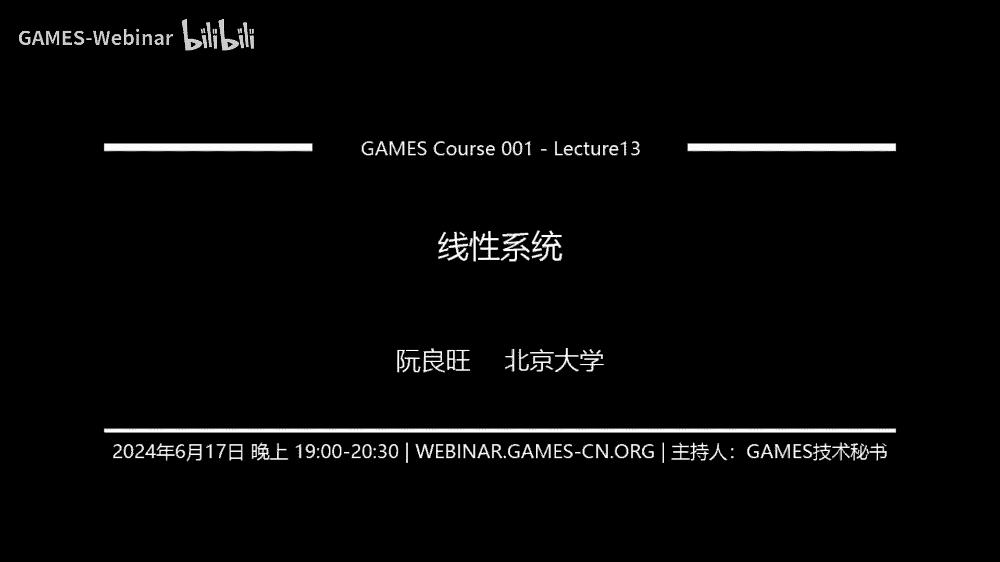

# GAMES001-图形学中的数学 - P13：线性系统 - GAMES-Webinar - BV1MF4m1V7e3

OK那我们就开始嗯，那个今天非常抱歉，我有点感冒，所以这个声音可能听起来有点奇怪，哼然后我尽量给大家讲清楚一些呃，今天给大家介绍这个线性系统求解的相关东西，然后其实解的问题非常简单对吧。

我们就是要解决一个ax等于B的这样一个，矩阵方程的问题，那么这个问题在图形学中其实是非常重要的，它会出现在各个地方，比如在几何处理中，我们可能需要做这个影视的LAUTION，smoothie对吧。

那这涉及到解方程，在物理模拟中，那更不用说了，我们每一步每一个时间步内，都，一般来说都需要去解一个很大的一个系数的，线性方程组，然后在全局渲染中也有，像这种radiosity based method。

基于这个辐照度的算法，它也是需要去解方程的，所以如何去呃针对不同的问题，然后选择合适的矩阵求解器，能够让它解的又稳定，又快又好，就是我们今天要讨论的一个中心的问题。

那我们先看这个最直接的方法就是直接求解，那大家在学习这个呃线性代数的时候呢，应该会涉及到这个高斯消元法，去解一个方程对吧，比如说我们这里举一个3×3的矩阵的例子，我们有这样一个矩阵。

AX等于B那么高斯消元法呢，会第一步会用第一行的这个二去消掉，二层三行的这个三和二，具体做法就是我把第一行，整个矩阵方程的第一行乘以3/2，加到第二行上，那么这个2×2分之3+-3，它就变成零了对吧。

相应的这个8×2分之3+-11，这地方就会变成一，那么这个那同样的我也可以把第一行乘以一，然后加到最后一行，把这个二消掉对吧，那变成下面这样一个矩阵方程，这个矩阵方程跟上面这个矩阵方程是等价的。

那么下面这个矩阵方程呢，你就看到它下面有两个零，那么它就可以有更好的这个求解的方法，我们进一步往下做下去，比如说这一方第二行，这里有个0。5，我们可以把0。5×-4加到第三行上来。

那么这样的话就可以把第三行的这个二消掉，就变成下面这个样子，那么下面这个样子，它就会变成一个上三角矩阵对吧，那么这个上三角矩阵呢我就可以先解最后一行，然后再解倒数第二行，然后再解第一行，通过这种方式呢。

先解X2，先再减X1，再减X0，把所有的这个值求出来，那么这个回去的过程，也可以看成是一个逆向的高斯消元法的过程，比如说我把最后一行，比如说这个地方应该是乘以0。5，加到第二行上来。

然后乘以一加到第一行上来，然后第二行也乘以二加到第一行上来，就把这这这边的一-10。5都消掉，那么最后就变成这样一个对角矩阵的方程，那么这样一个方程，它就告诉我们最后的这个解就是多少了。

那就是X0等于二，X1等于三，X2等于一，所以这就是一个高斯消元法，最基础的求解一个矩阵方程的一个整个过程，那么这样一个过程，其实我们可以换一个角度来看，怎么看呢，就是我们其实干的事情。

就是不断的在进行这个防乘以，某一行乘以某一个常数，然后加到另外一行上来，通过这种方式去消掉矩阵里面的一些变量，那么每一次的行变换呢，其实可以等价于左乘上一个矩阵，比如说这样一个行变换。

我们把第一行乘以1。5，也就是3/2加到第二行上来，它其实等价于我们在把这个矩阵，把原来这个矩阵分解成了右边这两个样子，左边呢是一个下三角的矩阵对吧，他对角线是一，然后只有这个负对角线。

这个地方有个零-1。5，然后右边是我变换之后的矩阵，那么怎么验证这个事情呢，你只需要把对吧，把这个-1。5看它对应的那个那个位置，把它乘回去对吧，比如说这个复印1。5是第二行第一列。

那么它作用到这个上面来，就会是把它的把这个第二行乘以到啊，第二行乘以这个额-1。5啊，把第一行乘以-1。5加到第二行上来对吧，那这样就恢复出了这个额，第二行的这个这个这个原本来原来的这个值。

嗯有没有问题对没问题，是这样的，所以说行变换其实等价于左乘上这样一个，对应的这个系数矩阵，那如果我一直在进行这个行变换的时候呢，那么这个系数矩阵就会一直在左边乘对吧，那么一直在左边乘，它一直是下三角的。

所以这个下三角矩阵一直乘他，最后还是一个下三角矩阵，换句话说高斯消暗法，它整个过程其实我可以写成下面的这样一个，矩阵的LU分解的形式，为什么叫LU呢，叫L矩阵，就是一个下三角的矩阵。

U矩阵就是一个上三角矩阵，上三角的矩阵，然后这个L矩阵对角线是一，然后它的负对角线这些数，其实就是我们每一次做这个高斯消元法时候，的那个系数对吧，比如说你可以我们可以倒回去，看我们到底用了哪些系数。

我们用了1。51对吧，还有四，那么在这个地方它就会出现-1。5，一和四，对吧，所以说这样一个下三角矩阵，其实反映的是我们对后面这样一个矩阵，做了一系列的行变换，然后整个高斯消元导消元法的过程呢，其实是。

我们把原来这个矩阵分解成了一个下三角矩阵，L乘以一个上三角矩阵U，并且这个L矩阵的对角线都是一，那么换成这样一种表示方法之后呢，它就能够帮助我们理解说，高斯消元法，为什么能够去帮助我们解这个矩阵方程呢。

因为我其实是把ax等于B这样一个矩阵，方程呢给它拆分成了LUX等于B对吧，那就是那我就可以先去解什么呢，先去解L这个矩阵方程，然后把U和X作为一个整体去解，它解出来之后呢，我再用哦。

我再把刚才那个解作为我的右手项，然后就解UX等于刚才那个右手项，就把这样一个ax等于B的方程，换成了两步方程去解，而中间的每一步呢，L我去解L的方程和U的方程，它都是可以直接去便利解的，对于对于L来说。

我可以先解第一行，然后再把第一行代入第二行，再去解第二行，然后再代入第三行去解解第三行对吧，U矩阵我就倒过来先去解第三行，然后再代入代入回第二行，然后再去会代入回第一行，所以说。

一旦我把这个A分解成了一个下三角矩阵和上，三角矩阵之后呢，那么原来这样一个矩阵方程，就可以通过这样的两次便利就给它解出来思，所以说这个就是高斯消元法去解方程的一个呃，更形式化的一个表达。

那么这样一个形式化的表达呢，它就可以去转化成一种算法，那么对应的就是我们就要称之为这个，LU分解算法，他长成这个样子，然后这个LU分解算法呢，他还利用了一点是什么呢，就是它其实是把这个L矩阵和U矩阵呢。

并没有把它另外存成两个矩阵，而是就存在A矩阵里面，相当于我们称之为叫一个in place的一个操作，也就是说我的呃，我的这个输入是A经过了这样一个算法，锁完之后，我的输出还是A只不过呢输出的这个A矩阵。

它的下三角部分对应的就是这个L矩阵，上三角部分的对应就是U矩阵，那么中间的算法就是可以写成这样一个，简单的一个形式，这个就是这个额LU分解的一个基本算法，那么这个算法反映的就是我们刚才去推的那个。

劳斯消元法的整个流程，那么这种算法呢呃它的复杂度是多少呢，其实也非常容易看出来，你就看这里有三个for循环，对不对，那么它的复杂度就是N的三次方了，所以啊LU分解算法是一个复杂度，相对来说比较高的算法。

它是一个跟矩阵维度的立立方，成正比的一个复杂度，但是呢他也可以去设应对呃，设计对应的并行算法，来进一步提高它的这个速度，额那么对于LU分解来说的话，它还有一个小地方需要注意在什么地方呢。

就是比如说我们进行到这个中间的某一步，高斯效应的某一步的时候，假如这个地方不是0。5，而是零，这个是有可能发生的对吧，就是你刚好第一行消第二行的时候，不光把第一个元素消掉了，还把第二个元素消掉了。

所以这个0。5，比如说我们假设这个银方0。5的地方是零，那么这个时候如果我用刚才的这个算法，用第二行去消第三行的时候，那么这个0。5那就是作为分母，二是作为分子，那这时候就出现了一个除零的操作。

那这样就会导致这个数值的不稳定，所以为了让这个LU分解算法更稳定，一般来说我们可以进行一个操作，就是在选择这个用哪一行去消掉哪一行的，这个过程中呢，我们可以每次都选那个，用绝对值最大的那一行去消掉。

剩下的好，比如说在这个例子中，我们就不用0。5去消二，而是反过来用二去消0。5，通过这种方法，只要整个矩阵是满质的，那么就可以保证在算法的过程中，我们是不会除以一个小量，而导致这个数值不稳定的情况。

那么这种呃这种啊，这种方法呢就一般称之为这个呃，列主元高斯消去法，或者是部分选主元高斯消去法，简写就是个GEPP，这是一个需要注意的一个小问题，OK那么这个高斯消元法或者说LU分解。

它在对于这个对称半正定的矩阵中，它其实有一个更为简单的算法，也是非常常用的一种算法，叫这个啊，科列斯基分解就choleski decomposition，也称之为LLT分解，为什么呢。

因为这个分解它其实干的事情，就是把A矩阵分解成了L乘以L的转置，那么L是一个下三角矩阵，L的转置呢就是一个上三角矩阵，所以我依然还是把A矩阵分解成一个，下三角矩阵，乘以一个上三角矩阵，只不过这个时候呢。

由于A矩阵是对称半正定的矩阵，那么这个下三角部分和上三角部分，其实它就是一个转置的关系，利用这个关系其实可以去简化，我们的这个LU分解的算法，怎么简化呢，我们就可以把这个LLT对吧。

假设我们额这些L里面的这些未知数，都是带球的，我们来看一看LOT乘出来会是什么对吧，我们把它写出来，写出来之后变成下面这个样子，然后我们希望这个LLT等于A对吧，我们就要一个一个去解这个啊。

LI比如说L22L1L二三，这些值到底是多少，那怎么去解呢，你观察就会发现，其实我们可以按照这样一个顺序，去一个一个的求出来，首先L11的平方，就这一项它是只跟L1相关的，然后它等于A11。

所以L11我就可以直接解出来，就是根号A11，有了L11之后，我把它带入到下面这个式子里面，那我就可以得出来L21对吧，这就是A21除以L11，然后L21有了，我就可以把它代入到后面这个式子来来。

得出这个L22，让它变成根号A22减去L21的平方，所以我可以一系列这么带下去对吧，我可以就这么走，走完之后呢，我就可以得到整个L里面的各个系数，到底是多少，对吧，那么它相比于L1分解的好处是什么呢。

好处就在于说，由于这个A矩阵是对称正定的，所以我只需要知道一个L就够了，我不需要同时知道L和U对吧，那相应来说的话，计算量expect我们是可以减小一半的，对吧，那么是克里斯基分解的。

他的这个额算法我们也呃列在这个地方对吧，这跟刚才那个长得会比较像，但同时注意这个地方，它也是有一个三重的for循环的这个地方，所以它的复杂度也是一个ON的三次方，OK吧。

那么对于对称半径定理的矩阵来说的话，所以四级分解是一个非常常用的，或者LOT分解是一个非常常用的算法，OK那么到这里我们就介绍了两种，这个直接求解的直接矩阵的一个方法，一个是LU分解，一个是LLT分解。

LU分解呢可以啊，LCLU分解直接对应这个高斯消元法，那么它可以求解任意的这个矩阵方程，只不过在为了保证这个算法的鲁棒性，我们需要对这个我们需要在选择主圆的时候，来保证我们不会出现这个除零的情况。

那么对于LT分解来说呢，它只适用于对称半正定的情况，但是呢相应的它的速度也会比LU分解，更快一点，那么这两种算法，它的时间复杂度都是在这个ONN的三次方，所以一般来说只适用于求解小的矩阵，方程有多小呢。

一般是这个呃，这个矩阵的大小是100~1000，那就是1000以下，那么这个量级用LU分解，LOT分解一般是能够解的很快的，那么再往上走呢，然后U由于这个ON3次方的复杂度。

那么这直接这两种直接求解方法，它的速度就会大大的这个减慢，在图形学中，比如说我们经常需要在mesh上解方程对吧，或者去构建一个场景的一个方程，那么这个时候呢这个是这个矩阵的大小。

一般来说是会非常非常大的，比如在图中展示这个mesh，它轻轻松松就会有超过这个10万个顶点，那么如果你对，如果你建出来这个矩阵方程，它就是一个10万×100000的一个矩阵方程，这个时候你再用LU分解。

还有LOT分解，那么它就会非常非常慢，可能需要几10分钟甚至几个小时去解，那么这样的速度显然是不可以接受的，所以对于更大规模的这个矩阵方程而言的话，我们一般来说使用的是这个迭代求解的方法。

那么迭代条迭代方法它整个的流程是什么呢，一个大的框架是说，我们先有一个初始的拆解X0对吧，这X0我们可以随便给一呃，如果你完全没有任何信息的话，你可以直接把X0制成零，然后如果有一些信息。

你如果有一些信息，比如说你大概知道ax等于B的，这个X大概可能是多少，那你就把这个所能的那个值作为我们的初始值，然后反复去执行某一个步骤，从XK推到SK加一，不断这样迭代下去，然后我们期望说迭代到额。

设定某个步数的时候呢，这个SK它放进这个矩阵方程里，它的残差R等于B减AX，它的模长足够小了，那么这个时候我们就认为这个迭代可以终止了，我们得到的这个解差不多就是一个精确的解。

比如说我们可以选择这个啊散发的这个上界，比如我们可以选选择成这个E的六次方，作为呃，就是float的这个精度对吧，那我们已经达到这个数值精度的话，那我们再往下解，再往下迭代也没有意义了对吧。

但是很多情况我们甚至都不需要达到这么小，我们什么E的三次方，四次方也够了，那么这样迭代方法解，跟这个我们刚才说的这个直接求解，还有哪些好处呢，首先是对迭代方法而言，我们始终可以把这个迭代停下来。

然后拿到一个差不多的解，而不需要在比如说像这个直接方法里面，我们需要等待一个算法全部跑完了之后，我们才能拿到一个非常准确的解，那么这个东西就是一个优势，因为很多时候呢。

我们其实并不需要一个非常非常精确的解，我们需要一个差不多的解就可以了，那同时呢，如果我们这个初始拆解给的非常的好的话，那么这个迭代次数呢就会大大减小，我们就不需要迭代多少步，就可以达到一个真世界啊。

那么并且对于很多特定的问题，比如说是这个矩阵是个稀疏矩阵，或者说这个矩阵是一个对称正定的矩阵，那么对于呃类似于这样的问题的话，我们有专门的这个迭代算法，去解决这样的矩阵方程。

那么它的速度就会明显优于我们去直接求解，以及说在很多时候也不是很多时候，在某些时候，我们的矩阵方程ax等于B，它并没有显示的存下来，我们其实只拿到了一个接口，就是我输入X然后返回拿到A乘以X。

然后基于聚于额，至于这个A矩阵到底长什么样子，其实是一个黑盒，那么这个时候呢，迭代算法就会比这个直接算，直接求解要更有优势，因为在很多的迭代方法里面，我们其实用到的也只是这样一个接口。

就是输入X输出ax，所以迭代方法相比于这个传统方法啊，不不是什么传统啊，相比于这个直接速写的方法，它有很多的这个优点，那并且这地方我们给出一个例子，那对于这样一个，比如说我们这里有一个弹性模型对吧。

那我们要求解它的这个矩阵方程，那么这个矩阵方程会有多大呢，在图中这个match里，他一共有这个20万个节点，那么其实对应的我们这个矩阵方程的自由度啊，矩阵方程的维数就是一个60万维的一个矩阵。

这个矩阵是非常大的，但是呢如果我们这个算法这个迭代的这个，我们我们这个迭代求解器设计的好的话，那么我们其实是可以在几10ms的，几10ms内就可以把它解的差不多，但是呢如果我们直接求解的话。

那可能就需要几10分钟甚至更长的时间，所以迭代算法如果设计的好的话，他这个速度是非常的可观的，OK那我们下面就来看这个，今天要介绍的第一类迭代方法，称之为这个不动点迭代，那不动点迭代是什么呢。

我们这里给一个非常简单的例子，就大家如果呃玩过这个卡西欧计算器的话，那么可以试试这样一个操作，就是呃我们可以呃随便给一个初值，比如说初值X等于零，然后不断的执行cos answer这个这个这个方程。

这个函数，就是每一次都把这个cos answer的结果放到cos，然后一直往下算，那么你一直按这个等于号，它最后呢，这个这个值会收敛到某一个特定的值上，那么这个值是什么呢。

这个值反映的其实就是X等于cos x的解，它对应的就是图中的这条绿色的线对吧，我们这个蓝色的线是Y等于X，橙色的线是Y等于cos x，那么我假设我们一直按这个等于号呢，那第一步X0等于零。

然后再算呢就是X等于一，然后再算这个X它变成了0。54，然后再算变成了0。85，然后一直这么算，一直这么算，它就会慢慢的收敛到这个Y等于X和，Y等于cos x这两条曲线的交点上来。

那么收敛的这个解就是这个X减去cos x等于零，这个方程的它的这个解，整个的过程你就称之为不动点迭代的过程，为什么这么叫，原因也非常的直观，就是你这个点他一直在迭代的过程中呢，他最后会呃收敛到这个呃。

收敛到这个呃这个真正的解上来，他最后就不动了，OK所以这个就是呃不动点迭代的一个呃，一个基本的一个原理，那么换到这个X等于B的这样一个矩阵方程，来说的话，它的不动点迭代我们可以怎么来写呢。

我们可以假设A可以分解成两个矩阵，一个是M1个是N，然后M和N的差就是A，那么对于X等于B这个解决方程，我们可以把它改写成MX减去N，X等于B这样一个方程，那么这个方程我们还可以做一下变换。

把这个NX移到右边去，然后把M额两边同时乘一个M逆，那么就可以变成下面这个X等于m-1乘以N，X加B那这个方程跟X等于B是等价的，那么由于这个好，这个方程呢左右两边同时都出现了X。

我们就可以把它改写成下面这样一个，不动点迭代的形式，每一次我有一个SK的时候，我都把它代入到方程的右边，然后让他输出的这个结果等于XK加一，然后到下一步的时候呢，我接着把XK加一再带入到方程右边。

然后得到的结果变成XK加二，如此往复进行，我就可以迭代下去了，那么这样一个迭代过程我们可以验证，如果他收敛了，也就是SK它趋向了一个固定的值X星，那么我们带回去其实一定会有这个啊。

M减去N乘以X星等于B，也就是A乘以X星等于B，所以说如果它收敛的话，那么收敛的这个值一定是这个X等于B的解，所以这个就是一个不动点迭代的一个，基本的一个过程，那么这里有很显然的几个问题。

第一个问题是说，这个m-1M的逆这个矩阵我们要怎么去算，对吧，M矩阵是我任意取得一个矩阵，那么M的逆或者说M去求解后面这样一个东西，它的这个解到底是多少，这个到底怎么算呢对吧。

然后其次就是这样一个不动点迭代，它的收敛效率到底会有多快呢，以及，他到底能不能保证收敛呢，有没有可能这个不动点迭代迭代下去了之后呢，这个X会越变越大，越变越大，最后直接炸药呢，呃有这样几个问题对吧。

那我们可以举一个最简单的例子，也就是这个牙科比迭代的例子叫copy eration，Jo viration，他的选择M的方式就非常的直接，我们直接取M作为M为A的对角部分D，然后把剩下的东西。

把剩下的非对要部分扔到N里去，那我们的迭代就会变成下面这样一个形式对吧，比如说如果我们的A矩阵长成这个样子，那么呢D就是A的对角部分，N就是它的A的非对角部分，然后取反，然后在迭代的时候呢。

我只需要比如说X从零开始，然后每次算NX加B拿个向量出来，然后D的逆，因为D是一个对角矩阵对吧，那么D的逆就是一个很好求的东西，所以D逆乘以后面这一坨东西拿出来，这个东西拿出来的一个向量。

就把它塞回这个XK加一里面去，所以假货币iteration是一个非常简单的这样一个，迭代的算法，我们写成这个算法的形式就可以啊，就是这样对吧，我们就一直迭代，然后在每个迭代里面。

我们只需要进行一个这样的操作对吧，那么对于我们给出的这个例子对吧，如A矩阵是这样的话，那么我们去看这个jo iteration，它的这个收敛的情况，你会发现它确实是可以收敛的对吧。

随着这个ITTIVATION数的增大，整个额矩阵方程的残差，也就是B减去A乘以SK的模长，我们这个东西称为残差，它是在不断的减小对吧，初始有个很大的值，然后后面的不断减小，减小到零，减减到零。

意味着B等于A乘以YX那最后就收敛了对吧，所以他确实可以收敛，那同时大家可以看到说对于这样一个呃，A是一个33的矩阵，那么JOVIERRATION，他需要跑十几步对吧，差不多才能收敛，是。

那么我们换一种情况，比如说我们把刚才的那个我们呃，讲这个LU分解的这个A矩阵拿过来，然后把它套进这个JOVIERRATION里面去，那这时候就会发现一个问题是什么呢，就是整个东西它就没有收敛对吧。

这个residual随着这个iteration的增大，这是在不断变大的，并且这个变大过程是就就是一直会变大，但不会到后面有个地方就会减下来，它会一直这样变大，也就是说这个这个雅克比贾克比特ration。

对于这样一个矩阵来说，他就失败了，它永远不可能达到这个矩阵的一个真实解，那么这个地方就展示了这个角号币的原神，他的失败的情况，所以说啊即使就有呃这个不动点接带，虽然它非常简单。

但是呢在某些情况下它是可能失败的，那么具体是哪些情况他会失败呢，我们就希望有一个这个这样一个准则，能够告诉我说到底什么情况下，这个不动点迭代它是可以收敛的，那我们就可以分析一下对吧。

我们把不动点迭代的形式写出来，然后呢把上面这个形式改写成下面这个形式，怎么改呢，就是把N我们不是有M减去N等于A吗，那我们就把N用M和A表示出来，N就等于M减去A把这个东西带进来，那么带完之后呢。

下面这个形式就只跟M和A有关了，对吧，然后我们可以去定义一个量叫误差，它反映的是这个我在每步迭代的时候，这个SK与真实解X星之间的这个差距，就是EK等于X星减去SK，那同时我们还有残差对吧。

我们残差定义RK它定义成B减去A乘以SK，那么残差和误差是两个不同的概念，它们之间的关系呢就是下面这个式子给出对吧，RK等于B减去A乘以SK，B呢可以写成A乘以X星对吧，那我们可以把它写进去。

变成A乘以X星，减去XKX星减SK呢就是EK了，就是误差了，所以存差和误差之间就差这样一个A矩阵，那么把这个公式带回到上面这个形式里面，来对吧，那后面这个B减XK其实就是参差RK对吧。

那么我们就可以得到下面这个式子，SK加一，它其实等于SK加上嗯，逆乘，以A乘以EK，那么这时候如果我们去计算EK加一，EK加一等于这个X星减去XK加一嘛，那把它带进去。

那么就会得到这个EK加一和EK之间，其实乘的就是这样一个矩阵，I减去M，逆乘以A或者我们可以把这个N再写回来，等于M逆乘以N矩阵，所以说这样一个推导告诉我们一个什么，什么一个结论呢。

就是说如果我们去考虑这个不动点，迭代每一步的它的这个残差啊，他的这个误差的话，那么误差其实是这样一个更新的关系，就是EK加一下一步的这个误差，和当前步的误差，中间正好差的这样一个乘矩阵的一个关系。

那么乘的这个矩阵我们可以取个名字，就叫它迭代矩阵，比如叫T它等于I减去M逆乘，以A等于M逆乘以N，那么有了这样一个关系之后，我们就可以去分析了，我们可以对T进行特征值分解。

把它对角化变成Q乘以拉姆达乘以Q逆，那其中这个拉姆达和Q呢，它是可能有这个复数的，就是它它是因为这个T它也不一定是对称的，对吧，呃也不一定是这个正定的，所以这个拉姆达是可以有辅助的。

那么就是不管我们可以把它分呃，右特质分解变成这个样子，那这个时候呢Q那么这个E呢就可以把它，因为Q是一个正交矩阵对吧，那么我们就可以把EK用这个正交矩阵作为基，进行展开，那么最终的结果呢。

就是我们其实对于H5里面的，每一个特征向量的分量，我们其实是对于这个额再乘以T的时候，我们其实给他成了对应的这个特征啊，特征值，那么如果这个T它的所有特征值的模长，都小于一。

那我们就能保证Q里面的每个分量，就是EK在Q里的每个分量，它都是会乘以一个小于一的常数，那么这样不断叠下迭代下去，我长小于一的常数，不断迭代下去呢，我就能保证最后呢，这个EK它是可以收敛到零的。

那么这个条件其实就是我能就是这个啊，呃不动点迭代能够收敛的充分且必要条件，因为一旦这个T中有一个特征值，它的模长大于一，比如说最简单情况，我们可以认为这个T矩阵他是个对角矩阵。

假设啊假设T矩阵是个对角矩阵，然后它里面有一个对角圆大于这个一，比如就是二，那么我在进行这个矩阵操作的时候呢，就会额乘以这个T矩阵的时候呢，那么E里面就有一维，他会在每一步都乘以一个二对吧。

那就是248 16，这样不断的乘下去，最后他就会炸掉，那么这个时候呢也就意味着这个不动点迭代，它是不会收敛，所以不动点迭代它要收敛的话，那我们就要保证这个T的啊特征值，所有特征值的模长一定是要小于一的。

并且呢对于T来说的话，特征值越小的Q的这个分量，那么它的这个误差收敛的会越快对吧，因为特征值越小的话，相当于我们每一次乘的那个值就会越小，所以如果这个T的特征值越小，那么整个东西收敛会越快。

最极端的情况是什么呢，就是我们假设我们的M矩阵取的就是A，对吧，我们就把M取成A那这个时候T等于多少，T等于I减去A的逆乘，以A就是个零矩阵，零矩阵的特征值都是零对吧。

那我们就直接移步就能把所有的这个error降到零，那么代价是什么，代价就是我是我在迭代的时候，我还是要去处理A逆这个东西，所以这东西我直接处理不了对吧，我的目的就是为了去用迭代法来近似A逆。

所以说在选择这个M矩阵的时候呢，我们的准则是什么，我们的准则应该是让M尽可能的去接近A，去近似A，然后同时呢，M1又是一个我可以方便求解的东西，比如说像刚才这个夹克比迭代里面的，这个M矩阵。

我们取的是A矩阵的对角相对吧，对角项用A的对角矩呃，对角项来近似A那么对角相做一个呃，这个这个对角矩阵它的逆就很好求了，所以这个东西就是不动点迭代，它的这个保证收敛的一个性的标准。

那么这个标准呢在实际应用这里面，肯定是不好应用的，因为我不可能我把T矩阵求出来，然后再对它进行这个特征值分解，来看它里面的每个特征值是不是小于一对吧，那我有这功夫，我的这个迭代可能都直接就是啊。

就迭代很多步了，他说明他就经收敛了，所以这个啊，所以这个判断呢肯定还只是一个，就是呃这个理论上的判断，我们在实际应用的时候呢，我们也有一些简化的判断标准，比如说对于这个雅克比迭代来说的话。

对这样一种特殊的不动点迭代，我们有一个结论是说，如果A矩阵是对角占优矩阵，什么意思呢，就是对于A的每一行而言，它的那个对角的那个元素，它是大于剩下所有那一行的，非对角元素的绝对值的加和。

就是这样一个关系，如果A矩阵是一个对角占优的矩阵，那么雅克比迭代，那就一定能够保证收敛，这个条件是一个充分，但是不必要条件，但是因为它非常的简单，所以说啊我们就可以进行这样一个判断。

就是你可以在呃建矩阵的时候，看一看这个矩阵是不是一个对角占优矩阵，如果是的话，那么这两个比迭代就一定能够保证它是收敛的，比如说在我们给出的两种情况里面，那么第一个情况对这个矩阵而言。

他显然就是一个对角占优的矩阵对吧，那第二个矩阵呢它就不是一个对角占优的矩阵，所以说对于第一个矩阵来说，他收敛了，但是第二个矩阵来说，它就发散了，那么对于这种非对角占优矩阵呢。

我们也不是完全没有办法去去用雅克比迭代，去解它，怎么解呢，我们可以使用一个松弛的方法，松弛是什么意思呢，其实非常简单，就是我们在进行这个压力迭代的时候，我们每次更新的这个步堂需要乘以一个常数，欧米伽。

这个欧米伽是我给定的对吧，我们刚才这个欧米伽都是默认是一的对吧，右边求出来直接给他加到这个SK上来，但是我们现在呢我们就先成立一个欧米伽，这个欧米伽呢一般来说呃就是取得值还挺啊，挺自由的，就是你大于一。

甚至都可以，对，但是如果你面对的情况是矩阵不收敛，那么这个时候欧米伽一般取一个小的值，尽量小的值，比如说在这个这个我们刚才说的，不收不收敛的情况下，对吧，对这个对，这个情况我们如果取欧米伽等于0。5。

所以他每次更新的时候，这个步长取0。5，那么你看这个结果，最后他其实还是会收敛的，对吧就只不过这个已推认数呢相比于额，相比于你这个欧米伽取一的那些，然后结带来说可能会稍微久一点，但是呢可以处理这种。

就是你牙被解带之前会发散的一个情况，你只要把前面每一次前面乘以一个0。5的话，那么这个这个时候X等于B这个矩阵方程，在亚比迭代下，它又是收敛的，所以如果你发现这个东西它发散的时候，可以试一试。

用这个松式法给它乘以这样一个欧米伽的因子，OK那么总的来说呢，雅克比迭代呢是一个每一步代价都很低的，这样一个一个迭代算法对吧，我们每次每一步里面，我们只需要去算一个这个对角矩阵的逆，就可以了。

这是一个非常好算的东西，并且呢由于我是一个对角矩阵，所以是非常利于这个并行操作的，但是总的来说呢，雅克比迭代它需要的这个呃步数是还是挺多的，比如说我们在刚才展示的这个，3×3的矩阵情况。

那需要这个十几步甚至几十步才能收敛对吧，那么这个时候，如果我的矩阵还是几万维的矩阵的时候，那这时候你的这个迭代步数可能也是什么几万，几10万这种，所以他这个总的来说这个时间依然不快。

但好就好在它好就好在它很简单，所以啊然后并且呢亚比迭代啊，但是呢亚比迭代在某些情况下它是收敛的，会很快的，在什么情况，比如说如果这个A矩阵，我们就是个对角矩阵的话。

那这个时候亚布解带他一步就可以收敛对吧，因为这个T矩阵I减去D逆，再乘以A它等于零了对吧，那反过来说呃，换句话说就是这个A矩阵，如果它越是对角占优的，那么也看雅克比迭代，它收敛就会越快对吧。

如果这个A矩阵越是对角占优的，它这个对角对角圆越大，那么JQUITRATION它的这个啊近似啊，这个对角矩阵近似A矩阵的效果就会越好，他的这个迭代矩阵T就会越接近零矩阵，那么它的收敛速度就会越快。

OK这是雅克比迭代，那么牙科比带显然不是唯一的一种，不动点迭代的方法，那么与之相啊，经常放到一起提的就是还有另外一种，你叫这个高斯赛德尔迭代迭代的方法，这种迭代方法与雅克比迭代最大的区别是什么。

就是在M的矩阵的选择是不同的，在雅克比迭代中，我们M矩阵取成是对角矩阵，但是在高斯赛德尔矩阵呃，高斯赛德尔迭代当中呢，我们的这个M矩阵取到了这个A的对角部分，加上呃A的下三角部分。

也可以是对角部分加上上三角部分，这个没有区别嗯，那么换角时对M它是一个下三角的一个矩阵，把A的下三角部分拿出来作为M，那么这个时候ME怎么求，那就可以用到，我们刚才这个说这个高斯消元法的这个不少呃。

那个那个那个原理对吧，来昵称以后面这样一个向量，他其实解的就是MX等于B这样一个方程吧，那我们就可以用刚才的高斯消元法，直接从这个第一行开始不断的求，然后代入，然后不断的求，就代入这样一个方法。

把M逆乘以后面这个向量的结果算出来，所以对于这个下三角矩阵来说的话，他的这个逆矩阵，或者说它的逆矩阵乘一个向量，这个操作是很好算的，那么并且呢由于M矩阵，它是A的下三角部分。

它跟刚才的这个雅克比迭代相比呢，这个M矩阵是更像A的，所以你就可以想象，这个T等于I减去M1乘以A，这个迭代矩阵它也是更接近零矩阵的，所以一般来说高斯赛德尔迭代，它需要这个迭代次数。

是要比这个贾克比迭代要要少不少，它的收敛是要更快的，那么与之对应的代价呢，就是你每一步需要的这个成本会更高，在雅克比解答里面，我们这地方是个对角矩阵，你就可以直接并行的去求它的逆了。

但是呢这个地方M是一个下三角矩阵，我们就只能一行一行的去串行的解答，当然在某些情况下，我们也可以通过重排的方式啊，比如说矩阵是析出的，我们可以用重排的方式去呃，得到一个并行版本的这个高斯赛德尔矩阵。

那这个就是呃就大家有兴趣的话，可以去去查一查，这个并行版本的这个高塞尔指针，高塞尔绝代会长成什么样子，那么同时呢呃与这个呃亚比以带相对的，高赛的迭代，它收敛也有一个充分，但是不必要条件。

那就是这个A矩阵它是一个对称半正定的矩阵，它并不要求A矩阵是对角占优的，他只要求A矩阵是这个对称半正定的矩阵，就是说不是所有对称半正定矩阵，它都是对角占优的，也不是所有对角占优的矩阵。

都是对称半正定的对吧，但是啊高赛道迭代，它收敛的这个充分不必要条件，就是A矩阵是对称半正定的，然后甲coin迭代它收敛的充分，不要的条件就是A矩阵是对角占优的，OK那我们如果把高赛的迭代。

他的算法写出来，然后去对比假币迭代，我们其实会发现其实改动非常小，唯一的改动在什么地方呢，就是说在计算啊，在使用这个夹比简单的时候，我们每一次更新的时候，更新SK的时候，我们用到的始终都是呃我们更呃。

我们在更新SK加一的时候，我们用到的始终都是SK的信息，但是在高斯赛德尔迭代里面呢，由于我们使用这样一个下三角矩阵M，那么在更新SK加一的时候，我们同时还用到了前面更新的SK加一的部分。

也就是说在比如说在更新第二行的时候，更新X2的时候呢，我其实用到了已经更新了X1的值，但是在雅克比迭代里面，我们在更新X2的时候呢，只会用到上一步在没有更新的X1的值。

所以这是两个算法的这个唯一的这个区别，就是这个区别导致了两个算法在收敛性质上的，这个那比，所以一般来说高三的迭代，它是会比这货币迭代更快的，OK那么到这里，我们对不动点迭代方法做一个总结。

对我们其实只介绍了两种，最基础的这个不动点迭代方法，一种是JO并迭代，一个是高SADO迭代，这两种迭代方法呢，他们的优势就在于实现的是非常简单的，但是它收敛速度其实都不是很快。

高settle会比展合并快一点，但是呢他的也不是就是在没有优化的时候，咱也是会跑的比较慢的，那同时呢假货币迭代和高CIL迭代，都有各自的这个收敛的这个判别标准，然后比简单来说的话。

需要它是一个对角占优的矩阵，高三的话需要它是一个半正定位矩阵，要具体矩阵具体分析使用哪一种迭代方法更好，那么如果出现了不收敛的情况，我们也可以尝试使用这个松弛变量的方法。

来让额这个LOSL或者是这后面去收敛，那么同时呢如果我们去仔细分析，不动点迭代的收敛特性，我们其实是可以分析出来哪些额，哪些这个error的分量，哪些误差的分量它会收敛的快，哪些误差的分量它会收敛的慢。

那么我们就可以去把那些呃，我们就可以去构建这个多重的多层的网格，或者说用不断用小规模的矩阵去近似A矩阵，然后呢让误差在不同层之间传递，然后使用不同层的这个不动的迭代去求解。

那么这样一个基本思想就是这个这样一个思想，就是这个多重网格求解器的一个基本思想，那么关于多重网格这个部分，我们今天就不在这里展开了，大家有兴趣的话可以自行去看一看，那么一般来说多重网格算法。

它是求解矩阵方程的这个最优方法，一般来说它是非常非常快的，但是呢需要我们对这个矩阵有一些这个呃，这对矩阵的结构有一些分析，我们先分清楚这个矩阵它的特性是什么，也就是这个不动点迭代作用到这个矩阵上时。

的时候，哪些误差分量它是收敛的快的，哪些误差分量是收敛的慢的，那么如果我们有这些信息的话，我们就可以去构造这个多重网格求解器，然后来加速它的求解，我这里就不展开了，大家有兴趣的话可以自己去查一查资料。

OK那我们到目前为止我们介绍了两种，所以矩阵方程的方法对吧，第一种是这个直接求解方法，就是这个LU分解和LOT分解，然后还有不动点迭代方法。

就是这个joping integration和这个高seal iteration，那我们下面其实在介绍这个第三种呃，迭代求解指这个矩阵方程的方法，称之为这个子空间方法。

这个子空间方法他的数学理论是比较复杂的，不是很直观，没有像这个不动点不动点迭代那样直观，我尽量用这个这个就是简单的语言来给大家，就是描述一下这个子空间迭代，它具体的这个思基本的思想是什么。

那么出发点是什么呢，是我们可以把X等于B这样一个问题，看成是一个优化问题对吧，我们去优化这个X减B的这个残差，那么整个优化的空间呢是RN对吧，就是A是N维的那种优化空间，就是RN那么假设中间有一组基。

这个RN上有一组积E1到EN，那么子空间迭代的一个基本思想是什么呢，是跟我们在第M部M部里面，我们只考虑这个在子空间，由E1到EM章程的这个M为子空间上的，这样一个优化问题的解，也就是我们限制了X。

它只能由哎E1到EM，这M个向量的线性组合构成，然后只考虑X在这个MX空间上，如何让这个X减B它的残差最小，那么通过这种方式呢，由于我们在就是因为我们限制到了我们的问题，在子空间上。

所以我们在每一步迭代的时候，这个考虑的这个优化问题的这个维度，就不再是整个优化空间了，而是在一个子空间上考虑这个问题，那么并且如果我这个GE1到EN，它的构造方式满足某些特性，那么满满足某些数值呃。

这个数学上的特性的话，我们就可以用很少的这个计算，从XM减一更新到XM，XM减一是在E1到EM减一，这M减一个向量上的这个子空间上的解，XM是一到em这个M位子空间上的解，如果这个基。

那构造的方式满足某些数学特性的话，那么从XM减一更新到XM，这个代价它其实是低的，所以额那么那么这样的话，我这个子空间迭代方法就可以进行下去对吧，因为我每次迭代的每每一步里面，这个代价是低的。

然后同时子空间迭代保证了说，我们最多只需要N步就一定可以达到最终的解，为什么，因为在第N步的时候，我们保证我们求解的这个解，是以一一和到EN这N个向量章程的N维，子空间上的这个残差最小化的解。

那么也就是原来的整个空间，RN上的这个最小化的解，所以说我们最多只需要N步，就可以达到这个最终的这个解，那么相比之下，我们刚才说这个后面迭代和高赛道迭代，它是可能迭代很多很多步的对吧。

我们刚才一个3×3的矩阵需要迭代十几步，但是如果我们使用子空间迭代的话，我们最多只需要迭代三步，就已经能够保证这个把解求出来，是吗，额，那我们下面就具体来看一看，这个子空间迭代到底是怎么进行的对吧。

那么最常用的子空间迭代方法，或者最成功的子空间迭代方法，就是这个基于这个clot夫子空间的方法，那clot是一个嗯，应该是前苏联或者俄罗斯的这个数学家，那么由他提出的这个CROODS子空间。

那么具体长什么样子呢，就是对于这个矩阵方程X等于B来说，quo子空间定义成下面这个样子，KRAB等于后面这一坨，这个数学含义是什么呢，是说整个子空间它是由BAB，A的R1直到A的R减一次方。

乘以B这R个向量所作为啊，所章程的子空间，那么整个子空间，它就是一个R维的一个额子空间，因为我们这地方有R个向量，对吧，然后BABA到R四R1直到A到R减一次方，B它中间这些G也不一定是啊。

这些向量也不一定是正交的对吧，我们可以把这些向量啊作为基，但是这个基呢它就是一个不正交的一个基，所以KR是一个R维的子空间，那并且呢他满足这样一个嵌套关系，就是K1是这个K2的子空间。

然后K2又是K3的子空间，一直这样嵌套下去，这个很显然对吧，因为K2相比K1来说的话，我就是多了AB这样一个机，然后K3相比K2来说的话，我就多了一个A的平方B这样的几。

那么一直到这个KN也就是我会有BA的B次方，A的N减一次方乘以B这N个向量，它所章程的空间就是全空间RN之后的，所有这个KN加一，KN加二，虽然我的向量个数变多了。

但是他这空间的维度是没有没有变多的常数，就这样，N加1N加二个向量，它之间是有这样一个线性关系的，那么使用quo子空间进行，我们刚才说的这个子空间迭代方法，那么也就是说我们在DM部考虑的问题。

就是在这个km中寻找这个最优化残差的，这个XM，你这是这个就是关于这个QUOS子空间，迭代方法的一个最基本的描述，那我们下面就看一个具体的例子，也是最常用的这个COU子空间的迭代方法。

就是共轭梯度下降方法，Contra gradient method，它所解决的问题是对于对称半正定的矩阵A，我们要求解一个X等于B的问题，那么对于像这个拐点方法，或者说cg方法来说的话。

我们把X等于B这样一个矩阵方程，转化成下面这样一个形式的一个优化问题，那么这个优化问题把取到最小值，取到最小值的时候，对应的就是它的梯度等于零对吧，那么梯度是什么呢，把这个后面这个形式求导。

对于这个X求导，那么求出来结果就是AX减去B，它刚好就是我们的负的残差对吧，那么如果上面这个形式它取到最小，那就是残差等于零，也就是X等于B了，然后并且由于A矩阵是对称半正定的。

所以我能保证整个后面这个东西呢，它就是一个一个正的一个二次型对吧，所以他有唯一的这个最小值额，那因此呢我们解决这样一个最小化问题，就等价于解X等于B，那么如果我们刚才说说这个呃QUOS空间方法。

在DN步中，我们想要的是让XM在km中最小化前差，或者最小化这个FX对吧，这个是我们在子空间迭代中要做的，那么这个最小化什么时候能取到呢，这个就是些几何知识了，就是这个梯度啊，拉姆达F也就是负的RM。

这个梯度它如果正交于我们的子空间的话，那么这个时候我就能保证整个这个解，它是这个额在km中最小化了，Fx，这是个几何结论对吧，如果我的这个额，如果我的这个梯度正交于我的这个子空间。

那代表我无论在怎么在这个子空间中移动，我都无法再进一步减小它的这个FX的值了，因为我要减小它的话，我一定是沿着这个负RM这个方向移动对吧，我要沿着这个负的梯度的方向去优化这个FX，才能使它更小。

但是由于你这个啊负RM，跟我现在子空间是垂直的关系，所以我无论在这个子空间中怎么移动，都没有办法让它的这个残差进一步变小，所以说啊，所以说额那么我们在每一步迭代过程中，就需要保证这样一个条件。

在每一步迭代当中，我们需要都需要让这个RM和当前的这个子空间，KM是正交的，只要这满足了这个条件，我就能知道XM是在cam中最小化了FX，那我的这个子空间迭代算法就成立了。

OK那么下面就看这个公和梯度方，公过梯度方法是如何去保证，我们上面说的这个RM前差垂直于km，它是在每一步都能成立的，那么我们这地方给出一个共和，梯度下降算法的一个最核心的部分，它的核心思想是什么呢。

是我们如果我们能够构造这个QUOB子空间，他有一系列的共轭的GPM，满足下面这样的关系，就是P1到PM是M个向量，然后这M个向量张成的空间，就是我们刚才说的这个high love子空间。

KMMMV的子空间，并且这呃这N个向量P到呃，呃这这这所有的向量P1，一直到PM一直到PN，他们都满足这样一个共轭关系，也就是pi转置乘以A乘以PJ等于零，如果我们能够构造出QUOS空间的这一系列的。

共同的基，那么，在迭代的每一步，我们在已知XM减一，求YMXM的过程，就是在PM的方向上求最小化FX的过程，写成数学形式就是啊已知XM减一，那么XM和XXM减一的关系，就是这样一个关系。

这个阿尔法M是一个标量，gm是一个啊，是一个我已知的这个啊向量的方向，那么我们现在要知道，就是我要去求解一个阿尔法M，使得它能够最小化FX，那由于这个阿尔法它是一个标量，那么这样一个优化问题。

他就是个一维的优化问题，他就非常好解，那么这东西就是共轭梯度下降算法的核心，那么啊这样的过程就是大家先不去想说，就我们这个P1到PM到底是怎么来的，以及呃，以及这个地方为什么XM减一和XM之间。

就是这样一个关系对吧，我们先把这个结论告诉大家，就是说，如果我们已经有了P1到PM，这样一个一个一系列共和机的话，那么我在每一步迭代的时候，我只需要去解一个一维的优化问题，就可以得到从X减一更新到XM。

那这个东西就是我们啊，这个共和梯度下降算法的一个核心，那么我们下一步的问题就是说，为什么这样一个额这样一个算法，它就能够保证我们刚才说的这个性质，就是XAM它对应的那个梯度RM，它是正交于KM的。

我们下面就去证明这样一个啊这样一个过程，它是满足我们刚才的要求的，怎么证呢，我们就归纳了来证明，那么最开始在迭代最开始的时候，我们是在这个由P1构成了，这个额这一个一维的子空间上。

去解这样一个优化问题对吧，那么P1显因为因为他是个一维的，所以那这个优化问题就可以直接解，然后并且解完了这个解完之后呢，我能够保证这个R1它是垂直于K1的对吧，因为我是在这个一位问题上解到了最优。

所以这个R1它的梯度或者它的残差，是垂直于当前的子空间K1的，然后如果在DM减一部的时候，我们保证了RM减一是和KM减一是垂直的，那我们下面去考虑RM和KM的关系怎么考虑呢，我们把RM写出来对吧。

RM等于B减去A乘以XN，然后XM呢用我们刚才引入的这样一个，更新的关系代入进去解开，然后呢B减去A乘以XM减一，这一项就是对应的RM减一，然后面一项这个阿尔法M乘以A乘以pm，保留对吧。

所以RM和RN减一满足这样一个关系，我们要证明什么，要证明RM和KM是垂直的，怎么证明呢，首先第一点，由于我是在pm这个方向上进行了搜索对吧，我是在pm方向上前面乘了这个一个scale r。

在这个方向上进行搜索，最小化了FX满足了最小化条件，因为我在这样一个一维优化问题上，满足最小化条件，那么一定有这个RN是垂直于PM的，因为这个PM就是额外增加的，那一维的那个方向对吧。

如果我在这个方向上最小化了这个FX，那么你剩下的残差，一定是跟这个方向垂直的对吧，所以这是第一个我们要用的结论，那第二个结论，由于我们啊由于RN减一垂直于KN减一，这是上一步我们的这个归纳的。

这个用的这个条件，然后以及PM也垂直KM减一，因为这个条件呢就是PMPI和PJ任意一对，PIIPJ它们之间是一个共轭的关系，所以PM也是垂直于km减一的，对吧，这个就是我们构造这个G的时候。

用到它的共轭关系，那因此gm p m和km减一垂直，RM减一也和km减一垂直，所以RM就自然和这个KM减一垂直，因为RM就是RM减一，再乘以这个后面这个东西，对吧嗯我看一下哦，不好意思。

这地方应该是APM垂直于km减一，这边改一下，那算了，待会就改了，因为啊对，因为这个地方是因为呃对，pp是pi和PJ中间有个A矩阵嘛对吧，所以这地方应该是APM垂直于km减一。

OK那这样的话结论应该是成立，就是RM是垂直于KM减一的，那因此呢我们证明了RM他是跟KM减一垂直的，并且呢RM也是跟PM垂直的，那自然啊RM就是和km垂直的，那km就是km减一和PM组成的。

那换言之呢，我们通过这样的归纳的方法证明了说，只要我们能够构造出啊一切这个共轭机，P1和P到PN，那么CD算法它就是可以进行下去的，在每一步我们都保证了这个梯度，RM是和当前的子空间垂直的。

也就是说我们每一步都保证了这个呃，我们是在这个当前子空间取到了最优，然后并且呢在每一步更新的时候，我只我其实只需要考虑在PM这个方向上的，一个一维的优化问题，所以我的迭代就可以进行下去了。

OK这个就是工位梯度算法的一个基本的一个，一个想法，我们当然这地方还没有涉及到，说如何如何去构造这样一个P对吧，但我们今天就不展开讲了，直接把这个算法具体形式来告诉大家。

那么这样的算法其实写出来会非常简单对吧，你可以看到说呃，前面一部分这个R求R发K的这样的过程，它其实就是在描述我们刚才说的这个呃，解在pk方向的一维优化问题的过程对吧。

XK减一等于SK加上阿尔法K乘以PK，然后阿尔法K呢是一个我们需要去优化的东西，它优化的这个值就是后面这坨东西，然后拿到阿尔法K之后呢，我们下一步就去构造pk加一，作为下一步的这个搜索方向。

这个搜索方向要跟前面所有的这个呃，所有的这个P幸运值到pk要相互垂直，要相互共轭，那么怎么去构造呢，就是其实啊写出来非常简单，就是我去算一个贝塔K，然后再pk加一等于2KRK加一，加上贝塔K乘以pk。

所以它也是一个一步更新的东西，那么这个东西就涉及到这个QUOB子空间的，一些呃独特的性质，这个就是我们今天就不展开讲了，所以说这个就是共轭梯度算法的一个，基本的一个流程，总体来说共有梯度算法呢。

还是一个写起来非常简单的一个东西，并且呢它的效率也是非常高的，OK那么关于呃过期的算法呢，它的这个具体的数学大家没有了解，就没有没有太听懂也没有关系，就是呃因为很多时候大家只需要用就可以了，对吧。

那么啊呃这个具体的这个就比如说，但是大概的这个思想呢，就是我们刚才说的这个子空间迭代的这个思想，就是这部分应该是额，就可以稍微稍微稍微了解一下，然后具至于说具体这个阿尔法K，贝塔K是怎么算的的话。

这个就是再细节的数学推导，这个就大家有兴趣的话可以去了解一下，没有兴趣的话，其实就好只要会用就可以了，那么共和梯度算法呢，它是一个非常快的收敛算法，它能够保证在N部的时候，N部内就能收敛到最终解。

而且呢一般来说我们不需要真的让它迭代N部，我们只需要迭代小呃，就是远小于不是小于N部的，这样一个一些一些步数的时候呢，它的这个误差，基本上就能收敛到这个阈值以下了。

那么对于常见的这种几万维的矩阵来说的话，我们其实只需要几千步就可以啊，让共和梯度法收敛的差不多了，那并且呢共和梯做法，他有一个额收敛速度的上界，写成下面这个形式，那么这个形式呢SK减一减去X星。

X星是我们的真实解，SK是迭代到第K步的解，XK减一减去X新的模长，也就是DK5的误差，这K步的误差比上初始的误差，这个比值呢它是会小于后面这样一个啊，一个一个幂指数，KK是在这个指数上。

然后里面的这个卡帕减一除以卡帕加一呢，它是一个常数，其中这个卡帕是矩阵的条件数，它定义为A矩阵的最大特征值与最小特征值的，模长的比值，那么那么一定有这个卡帕是大于等于一的，那么这样一个比值。

如果A的这个条件数比较大的时候呢，比如很大很大1000多的话，那么这个卡巴减一除以卡帕加一的时候，他就会趋向于一，如果卡帕趋向于呃，卡帕趋向于一的时候，就是条件数趋向于一的时候，那么哪怕减一。

它就是一个很小的值，那么这个值就会趋向于零，换句话说什么意思呢，就是说如果A矩阵它的条件数越小，那么这个额幂指数的这个底数它就越小，越接近于零，那么整个收敛就会越快，像我每次都乘以，比如说0。10。

001，0。0001这样来收敛，但是如果呢这个条件数它非常的很大的话，那么后面这个值就会接近于一，现在我每次都只乘了，比如说0。0。99，每次只剩0。99，那这时候他的收敛就会很慢了，所以说混合梯度法。

他的这个收敛速度主要相关的条件，设相关的就是这个矩阵的条件数，一般来说，我们希望这个矩阵的条件数要尽可能接近一，这样能保证公共梯度算法，他的这个收敛是非常快的，那么为了让公有梯度算法。

他的这个条件数变小，有一种方法叫这个预处理，叫pre conditioning，我们怎么去改善它的条件数呢，我们可以尽可能去找到这个，A逆的这样一个矩阵，它的一个近似矩阵M等于P转置乘以P。

那么我们去转而求解下面这样一个矩阵方程，那么这样一个矩阵方程，它跟ax等于B显然是等价的对吧，并且呢这个PAGAPT这样一个矩阵，它的条件数一定是比A更啊，一定是比，一定是比原来那个A矩阵单独要更小的。

为什么呢，因为在极端情况下，如果我们考虑这个M矩阵，它就是A逆的话，那么上面这个矩阵的条件数，那就应该是一对吧，所以说如果我们能找到A逆的这样一个，近似矩阵M，那么我们转而去求解上面这个矩阵的话。

矩阵方程的话，那么它对于cg来说就会收敛的非常快了，那么如何去选择M呢，其实跟我们刚才介绍这个不动点迭代，有一些类似对吧，不动迭代我们说到JACCOON高三了对吧，那么这个时候这个M矩阵我们也可以选择。

比如像对角矩阵，我们直接把M选成A的对角，那这个时候对应的这个额cg方法，就成为这个白ano precondition的cg DP c g，同时呢我们也可以用啊，呃用最开始介绍这个LLT分解。

也是CHOLEICITY分解的一个简化的形式，叫不完全的CHAI分解，那么对应的这个CDCD算法，就称为这个不完全的查尔斯D分解的cg。

也就是incomplete choleski preconprecondition，cg就是i c p cg，那么从右边这个图里面可以看出来，这个ICPCG呢，它的收敛速度跟没有非常性能的时候呢。

他这个收敛速度是快非常多的对吧，所以PRECONTAIN，preconditioning是一个非常强大的一个技术，那么ICPCG呢，也是一个，我们在求解这个正定的对称的矩阵方程的时候。

非常常用的一个求解器，一旦你的方程是一个对称的半正定的矩阵的话，你可以试一试ICPCG，那它的结果一般收敛速度是很快的，对于一个这个啊几万维的这样一个矩阵，你甚至可以只需要这个几十步。

就可以让它收敛到不错，OK那我们呃介绍这个双就可以grain的嗯，这个啊cg迭代之后呢，那么这个CD迭代，它只适用于这个对称正定的这个矩阵方程，那么其实clot子空间方法本身，它是有呃其他形式的。

来适用于更啊更宽泛的情况，那么这地方列出了一些常用的，比如说如果我们求解的是一个对称矩阵，但是不一定是正定的矩阵的话，我们可以考虑使用这个MRS求解器，一个是minimal residual方法。

那如果我再求解的是一更一般的矩阵，它甚至都不是对称的话，也有对应的clot子空间求解器，比如说这个啊GM2S以及by cg以及by cg step，那么这些求解器它都能求解这个呃。

一般的非对称的矩阵方程，那只不过呢如果我们用比如说用这个啊JIMRSS，或者说明RSS，去求解这个对称正定的这个矩阵方程的时候，它的速度呢不会就会比这个cg要慢一些，所以为了速度的话。

你就去看一看这个矩阵到底是一个什么样的，一个矩阵，如果是对称正定的话，那么CD就是最优的，如果只是对称的话，那AMMRS是最有的，如果是一般情况下，再考虑这个gm rs和这个by cg step之类的。

一些求解器，Ok，那我们可以总结一下今天介绍的这啊，其实三类的求解器对吧，那我们的结论是什么呢，是说如果我们的矩阵规模比较小，比如说小于1000为，那么通常直接求解是一个最快的方法。

就比如说像这个有RLU分解，比如说LOT分解，对OT分解只剩矩阵是这个对称正定的情况，那当矩阵规模比较大的时候呢，这个直接求解，它的速度就会由于它的这个复杂度的限制，就会非常的慢。

那这个时候迭代球鞋气息会变得更有优势一些，那迭代求解器又分为两种，第一种我们是这个称为这个不动点迭代，比如说像这个折扣be iteration和高sao iteration。

它的优点就在于它的实现是非常简单的，但它的收敛速度其实是不一定很快的，一般来说我们需要去调节这个松弛系数，去平衡这个啊绷点迭代的稳定性和收敛速度，然后不动点迭代呢。

它同时可以可以被改进为这个多重网格方法，我们今天没有介绍，但是呃呃我们需要了解，就是说这个多重网格方法，其实它的速度是非常快的，呃然后呢，另外一类迭代方法，就是这个CROLOVES子空间的方法。

它一般收敛的速度呢是很快的，然后呢，以及我们需要对不同的这个矩阵去使用，相对应的方法，比如说如果是对称正定的矩阵，我们用cg对称矩阵，我们用明rise。

然后一般矩阵用这个gm rise和by cg之类的，算之类的算法，然并且呢如果我们能够对矩阵进行预处理的话，那么这个时候能大大提高这个呃FLO子空间，迭代方法的这些的它的收敛速度。

比如说我们之前介绍的这个DP，cg和sap cg方法等等，所以大家可以看到来说，就是我们解决这样一个X等于B的呃，问题来说的话，他其实没有一个通用的一个最优的一个，一个SOFER，更多时候还是得该大家。

根据自己的这个实际情况，去选择合适的这个啊求解器，那么所有今天提到这些求解器，在这个呃像啊N派呀，S i p y，还有这个其他的一些啊MATLAB呀，这些数据库里面都是有内部的这个实现。

大家就可以啊去掉那些函数的接口，然后它的名字呢，一般来说也就是啊非常的这个直观，比如LU一般来说就直接就是LU，然后LT呢可能叫这个CHOLESKI，然后MRS或者什么cg呢。

一般就直接叫叫cg或者MRS，所以说啊就是大家在以后用这些soft的时候，可以结合自己这个矩阵的这个特性，然后去选择这个最合理的，最快的这个扫分，OK那我们今天就介绍到这里，然后作业的话就是呃。

给大家就是几个代码填空题，就没有理论作业了，然后那个大家可以去啊，就是那个代码填空其实非常简单，就大家就对应这个PPT里的这个算法流程，把那个对应的空给补上就可以，然后大家可以跑一跑看一看，玩一玩。

来比较一下不同的这个热水器的，它们之间的这个速度差别，OK那我们今天就介绍到这里。

