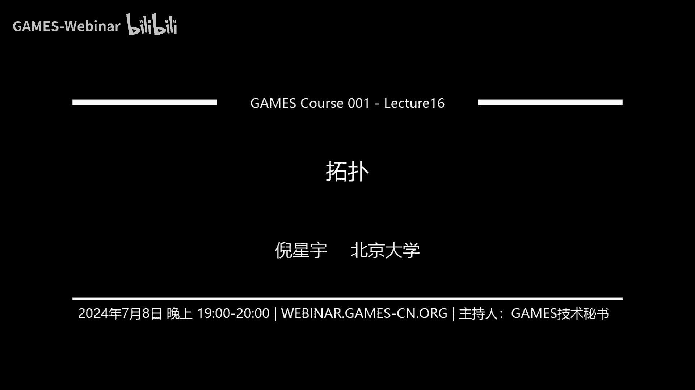
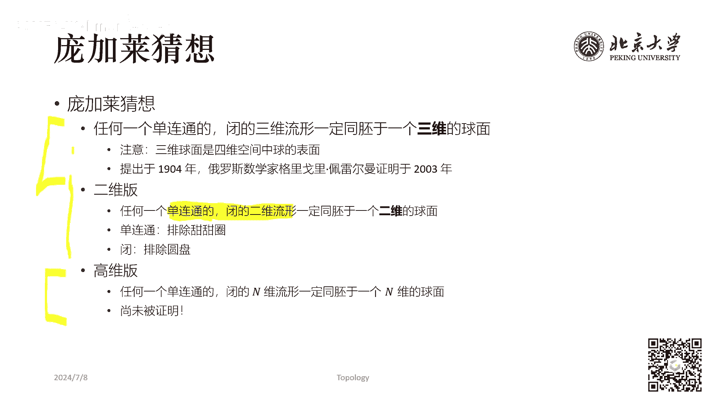

# GAMES001-图形学中的数学 - P16：拓扑 - GAMES-Webinar - BV1MF4m1V7e3

能听到吗，喂能听到吗，好那我们就开始今天的课程，今天是我们games4001系列的最后一堂课呃，我们进入到有关数图形学中，数学的最后一个专题，也就是拓扑的部分，然后今天这节课会比以往的课程都要简单一些。

因为我们会略去那些非常严格的，书写上的定义和证明，因为呃如果说要深入的去讲，拓扑的定义和证明的话，比起前面的那些内容要更加复杂一些，所以我们主要是定性的了解一下，有关拓扑的相关的概念和知识。

然后大家之后再这个学习和研究当中，应用到与拓扑相关的部分的时候，可以引为参考，和往常一样，首先我们来看一下什么是拓扑，拓扑呢，它其实从词源上来说，它又它只是位置分析的意思，什么是位置分析呢。

他就是说我只关心图形和图形之间的，位置的关系，而不考虑每个图形的大小或者是图形上的呃，分析或者代数的相关的内容，就呃暂时不在考虑范围内，我们主要考虑的是图形的位置，图形的位置呢最关键的就是它的相对位置。

呃或者呢这个我们之后也会看到，这个呃位置关系是可以包含图形的连续变形的，什么叫连续变形，我们之后就会讲到，然后它呃研究这种连续变形下不变的整体性质，的一门几何学，它就叫做拓扑。

所以拓扑呢本质上说也是几何学的一个部分，然后最经典的拓扑问题，相信大家一定呃接触过，比如这个四色问题，四色问题又称为地图染色问题，它指的是说呃给定一个一张地图，地图上面有各个省份或者是各个国家。

然后呃我们想说我们至少要用多少种颜色，给每一个省份去涂上颜色之后，保证相邻的两个省份之间的颜色一定不同，那么最少需要多少种颜色呢，这个问题已经被证明了是四种颜色，然后类似的还有这个技巧问题。

或者是大家很熟悉的，小学奥数里面就会出现的一笔画问题，就给定一张给定一个图形，你能不能一笔把它画出来，什么叫一笔画出来的，就是上面的任何一条边你都不会被重复的，经过两次，它最早是来源于这个欧拉在思考。

这个城市里面有七座桥，我能不能够呃不重复的，正好一次性一一条路线走遍这七座桥，然后中间不会重复的把一座桥跨越两次，那么这问题抽象出来，就是我们这个最右边的这幅图，最右边的这幅图，这个七桥就对应。

最右边这幅图上面的每个顶点就是一块区域，然后每条边就是一座桥，然后这个问题的解答也很简单，就是我们直接去看上面每一个节点的度数，就可以了，上面的应该是，如果一个节点是偶数度的，那么它是不影响答案的。

然后奇数度的呢，基数度的节点应该是最多有两个，或者说必须有两个吧，为两个或者零个，只有在这种情况下，可以一次就是一笔走过这个画画完整个图形，或者说走过这七座桥，好那我们稍微深入一些。

来看这个所谓同胚的概念，只有有一个很著名的这个数学上的笑话，说，拓扑学家不能区分区分咖啡杯和甜甜圈，因为为什么呢，因为一个足够柔软的甜甜圈，我们可以把它捏成一个咖啡杯的形状啊，右边这个不是咖啡杯啊。

但是你可以把它看成是咖啡杯，把饼对着天空拎起来的这样一个图形，这里我们说的足够柔软，就是你可以想象这个甜甜圈，它是一个橡皮泥做成的，然后你可以去捏这个橡皮泥的任何一个地方，把它捏成一个别的形状。

但是你不能把两块橡皮泥粘在一起，你也不能把一个橡皮泥从中间挖一个洞，但是你可以手这样捏，那么两个流行，如果可以通过这种操作，把其中一个变为另一个，我们就认为两者是同胚的。

然后这个操作在数学上来看是包括哪些呢，它包括弯曲延展剪切，但是这里的剪切注意一定得，最终还要沿着当初剪开的缝隙再重新粘起来，我们就认为这两者是同配的，那么一些最简单的例子是什么呢。

比如说圆和正方形它是同配的，那那很这这个很很好理解嘛，你把这个呃正方形的这个四个角揉一揉，把它揉成一个圆形，对这样东西它就是同配，那么求面去掉一个极点和二维平面是同配的，这件事情好理解吗。

其实也挺好理解的对吧，因为球面我们知道球面是有参数化的，球面参数化可以用球坐标theta和phi来表示，然后theta和phi表示最大的问题是，如果你theta和phi c a的参考点选的是北极点。

那么你的南极点其实就是，南极点那个地方它也是一个也是一个连续的点，但是我们却没有办法，把那个连续的点给表示出来，所以事实上就相当于说我有一个theta和phi，定义的参数空间，这个参数空间是二维的。

那你说二维的，它肯定是和一个正方形是同配的，或者呃不不需要想的，这用参数化的角度去想的话，你就是想如果一个球，你从最底下给他挖一个洞，然后你是不是就可以把它揉揉揉捏一捏，捏成一个二维的图形了。

所以呢根据以上的这个定义呢，我们还会发现球面和环面它不是通配的，环面就是甜甜圈，它就是一个环面啊，就甜甜圈就是一个环，那么球面和环面它显然嗯不能是同配的，而莫比乌斯环和环面呢它是可以是同配的。

因为你可以把甜甜圈看成是一个圆环，看是一个圆环，然后你把这个圆环从中间给剪开，然后把它转180度，再接上，所以莫比乌斯环和环面是通配的，莫比乌斯环是一种非非常著名的这个拓扑结构。

并且它有一个很重要的性质，就是它无法区分内外，他的两个面是等同等同定义的，就没有内和外的概念，你沿着莫比乌斯环走走一圈下来，可以正好走遍莫比乌斯环上的每一个地，每每一块地方，刷完铜胚以后，我们来看亏格。

什么叫亏格呢，就是说，如果曲面中最多可以画出N条闭合的曲线，同时不将曲面分开，我们就称为该曲面的亏格，亏格为N，那么举一个例子，比如说一个平面，一个平面里面你只任画一条闭合曲线，都一定会将曲面分开对吧。

所以该曲面的亏格就是零，那我们再看这个甜甜圈，你在甜甜圈上画一条闭合曲线，是可以不将甜甜圈分开的，比如说我们它就相当于你沿着甜甜圈的外延，拿剪刀给剪一圈，剪完以后是不是变成一个圆柱形的。

它还是粘在一起的对所以甜甜圈的规格就是一，那么可以证明对于一个十的闭曲面来说，就是亏格是什么呢，亏格是曲面上动眼的个数，比如说球面球面上没有动，所以它的规格是零，然后圆盘或者是甜甜圈呃，这不是就是圆盘。

圆盘也没有动，所以圆盘的规格也是零，然后圆环圆环和甜甜圈是同胚的，它的规格是一啊，或者是这种最右边这个两个圆环的，这个这个情况，那么他的亏格就是二，所以K格是一个非常直观上可以去理解的，这样一种概念。

那么以基于规格的定义呢，我们呃在拓扑学上又形成了这个，闭曲面分类定理，这是一个很神奇的性质啊，他是说所有的二维的闭曲面，它一定同配于以下三种情况之一，其中第一种就是球面，二维的B曲面，它要么是球面。

要么是环面的连通和什么是联通，和我右边举的这个三个例子，一个是甜甜圈，一个是两个甜甜圈，这个呃并在一起，一个是三个甜甜圈并在一起啊，这叫连通和就是我把它并在一起，同时保证它是连通的。

那么甜甜圈的be这是第二种情况，第三种情况是摄影平面的连通和，那么这种曲面它就是不可定向的，就甜甜圈，你是有内和外之分的，而我们看右下角这幅图，这个图是克莱因瓶，它是没有内和外之分的。

可爱音频的右上角有一个洞，但是这个洞竟从这个洞往里面，这个，倒水的话你会发现它是只有一个，只有只有一个面的，就内部的这个面和外部的这个面是连通在一起，它不像我们平常一个圆柱形的水壶，水水呃。

这个水壶你在里面转不会转到外面来，他现在这个内和外完全是连续的连在一起的啊，这种就是不可定向曲面，我没有办法区分内和外这两个概念，然后呃类似于克莱音频这种操作，他就是摄影平面的联通盒。

那么啊这种曲面一般来说是比较就比较少见的，我一般考虑的是前面两种曲面，所以你大致可以认为，所有你在研究当中关心的二维的B曲面，它要么是球面，要么是环面的联通和，同时呢呃B区面呢还有一个三角剖分的定义。

它是说任何闭曲面上都存在一个有限个三角形，表示的三角剖分呃，有一些图形学背景的同学肯定会知道，这个在图形学上去研究一个曲面，我们一般都是把它给变成三角网格的，什么是三角网格。

其实它就是一个对曲面的三角剖分，那么这时候根据我们现在这个定理，任何B曲面上都存在一个有限的三角形，表示的三角图分，也就是说我们用这个三角网格去分析的方法，是适合于任何闭曲面的。

当然这个事情大家平时在用的时候，可能也没有想到这个它为什么是这样，可能也没有思考过，就觉得他已经天然的可以分成三角图分，但是呃就是如果从严谨的角度上来说，这是对应着一个定理的。

有了这个规格和三角剖分的概念以后呢，我们来看欧拉示性数的概念，什么叫欧拉示性数呢，欧拉氏性树是一个不碎，不随同胚改变的拓扑不变量，就是不管你是咖啡杯还是甜甜圈，你的欧拉示性数是一样的。

欧拉示性数的定义是说呃，我记X是这个某一个这个流行，然后他的欧拉示性数K等于一的I次幂，乘上NIKK是什么，K就是X这个流形的三角剖分，而NI呢是这个呃三角剖分当中，I为单纯型的个数。

比如说啊我有一个三维当中有个曲面，就是一个二维曲面，这二维曲面我给它做三角剖分，剖，分完以后单纯型是什么，你有那个零零阶的单纯形，零阶的单纯形就是点对吧，你还有一阶的单纯形。

一阶的单纯形就是边三角形的边，然后你还有二阶的单纯形，二阶的单纯形就是三角形本身，然后呃所以对于一个二维的曲面来说，它的欧拉示性数，就等于它的三角剖分的点的个数减去边的个数，加上面的个数。

并且我们说对于任何必定向曲面来说，它的欧拉示性数K1定等于2-2G，这是一个定理，既是什么，既是规格，比如说对于一个球面来说，球面的规格是零，所以它的欧拉氏性数一定是二二减，因为K等于二减，零等于二。

那么它就意味着说，由于我任何一个简单的多面体，都是同配于一个球面的，所以对于任何的一个简单的多面体来说，我必然会满足顶点个数减去边的个数，加上面的个数等于二，可能大家在别的地方接触过这个公式。

这个公式又叫欧拉公式或者叫欧拉定理，在别的地方，大家可能会想这个VEF这些，他之间是要怎么组合，这东西可能像是要背的，但是我们接触了这个欧拉示性数的概念之后，我们发现这东西不用背。

它就是零阶单纯型的个数，减去一维单纯形的个数，加上二维单纯形的个数，如果你给定的东西是一个高维的，比如说是三维的一个图形，你给他做了这个额四面体的扣分的话，我还是一样的，它就是顶点个数减去边的个数。

加上面的个数减去四面体的个数，并且它还是等于二，然后从这个简单多面体的欧拉示性数K等于二，这件事情呢，我们又可以推导出，任何连通的平面图的欧拉公式，为什么呢，因为我任何一个连通的平面图。

我在平面外取一点，并且将它，并并且将这个点与平面图的边界点连边，会发生什么，会发生，我的顶点数变成了顶点数加一，然后边的数目变成了边数，加上边界上的这个，额加上了这个边界上的边数，边界上顶点数。

然后我的面数变成了什么呀，面数变面变成了面数，加上边界上的顶点数减一啊，这里我少打了一个F加，这少打了一个F加，然后我就可我就变成了一个简单多面体了对吧，我就可以用上面这个公式，V减一加F减二加呃。

V减一加F等于二，这个V减一加F等于二呢，它恰好就和底下的V减E加F是相等的，因为顶点加了1F加了B减一，而E加了B所以最终呢什么也没有变，也就是说对于联通的平面图来说也一样，有欧拉公式。

顶点数减去边数加上面数等于二，举一个例子，这是一个连连通的平面图，它其实就是在一个四边形中间做了一次，切了一刀，图上有几个顶点，还是一共四边形，所以V等于四对吧，图上有几条边，是五条边对吧。

你团有几个面，团上有两个面，诶床上有两个面，我来看一下呃，1234，啊啊啊对对对，这个地方没有没有这个性质，就F会变成的是额F加B啊，F加B因为是有多少个顶点，就会加多少个，那么四。

所以最后会把这个变成V减一，加F等于一，对这是联通的平面图的欧拉公式，或者我们再换一种情况，比如说我多加一个点，主上有几个点呢，12345A等于五，然后有多少个边呢，12345677个边，有几个面呢。

三，然后5+3减七还是等于对，这就是联通的平面图的欧拉公式，可以从这个定向曲面的欧拉公式给他推导出来，这个B定向曲面的欧拉公式呢，我们可以看这个右边这幅图，看这个立方体，这个立方体有额多少个顶点呢。

是有12345678 18个顶点，有多少个面，是六个面，然后呃，然后多少个边呢，是12个边，你看这个8+6减12哎，它等于二，就是这个简单多面体的这个欧拉公式，好我们来看下一个概念，下一个概念是减绕数。

减绕数是说一个，它是一个表示曲线绕过某点的总次数的整数，那么简要数呢它是和曲线定向是有关的，假如我们认为逆时针的环绕是，就是在右手系当中的话，那么逆时针的环绕减绕数加一，然后顺时针环绕一圈呢。

减二数减一，那么简奥术之外呢还会有一个回转数的概念，回转术呢它其实是曲线的速度矢量，什么速度矢量就是曲线的切线，这个切线曲线的切线关于原点的卷绕数，或者我们可以把它看成是曲线的总曲率，除以二派。

那么卷绕数和回转数是不一样的，比如说右图右图整这整个曲线关于来看看呃，换成这个荧光笔吧，右图这整个曲线，关于P点呢，他的卷绕数是二，为什么呀，我们可以看到这样他转了一圈，然后我又这样又转了一圈对吧。

所以它卷绕数是二，但是呢他的回转数是三，它的回转数是三，因为回转数是等于曲线的总曲率除以二派，回转数等于现在总区域除以二派，所以他跟P点是无关的，它没有参考点，他就是看我曲线每一点的曲率。

然后把这个曲率全部算出来以后加和求个积分，然后除以二派，那么这一右图这个期限的回转数呢就是三，它它并不等于P点的减绕数，因为减绕数是要取参考点，这两个概念是有有一定的差别，然后呃平面中的曲线呢。

还会存在这个roll当曲线定理，这个其实我们之前在计算几何那一节里面，已经讲过了，若尔当曲线定理是计算几何当中，用这个呃光线投射算法，来判断点与多边形关系的这样一个策略，他是说任何一条简单的B曲线。

都可以将平面分成两部分，比如说呃我随便画一条曲线，这个曲线是不是把屏幕分成两部分啊，也就是曲线内和曲线外对吧，分成了这两部分，那么连接同一部分，任意两点的弧与该曲线是不相交的，或者相交偶数次。

比如说这个弧和这个曲线相交吗，它不相交，那么或者画这么画，画这么一条弧，这个曲线和这个呃，这个弧和刚刚我们说的是比曲线相交嘛，相交它相交了两次，如果是连接不同部分的两个点呢，比如说这一点和这一点呢。

那么它就会和这个简单的B曲线相交奇数次，然后因此我们会有点和多边形关系的，光线投射算法，我们就取这个多边形是这个简单闭曲线，然后我们取从这个判断点出发的射线是这条弧。

那么弧与多边形相交一次都会改变内外关系，又我们又知道无穷远点一定在多边形外，所以相交点的个数是奇数的时候，点在多边形内，相交点个数为偶数的时候，点在多边形外，下面我们来看这个布劳威尔不动点定理。

他是说一个从欧几里得空间的某个给定的凸，极凸的井的子集设到它自身的连续函数，有至少一个不动点，这个事情呃，我们可以用一些呃比较直观的概念去理解，比如说我们将一张白纸给平铺在桌面上。

再将这个白纸给揉成一团，放在原来白纸所在的地方，我们会发现只要它不超过原来白纸平铺的边界，那么白纸上一定有一点，在水平方向上没有移动过，比如说下面这幅图就是一个例子，一开始啊，这就相当于白纸啊。

能说是棉被也是一样的，一开始这个棉被是平整，然后呢我把这个棉被呢变成一个杂乱的一团，再把它丢在床上，这时候棉被上必然有一个点，它的X坐标，或者说它相对于这个床的不考虑垂直方向。

它相对于床床的水平位置没有发生改变，这个结论呢说神奇其实也没有那么神奇，我们可以看第二个例子，在一张水平放置的城市地图上，一定有一个点所指示的位置，就是地图所在的位置，唉这个事情怎么理解呢。

平面上水平放置的一个城市地图上，你首先找到你所在的这个位置，大体落在什么地方，那么，比如说有一张地图，我先找到我所在的位置，大概在什么地方诶，大概在这个地方，那么这个点它是不是就是。

相当于说是从这个点到这个点本身的映射，就是地图上的这个点和这个地图上指示的，那个点，是不是在这个精度要求的范围内，它就重合了呀，如果你才希望更精细的结果，你只需要把这局部的地图再给放大一点看。

然后你再去找你在哪，对不对，你总是能找到，这样取极限之后，你一定会找到那个指示的位置，就是地图所在位置的那个点，你再看一个定理叫毛球定理，这个定理听起来名字怪可爱的，它其实是庞加莱霍普夫定理的一个推论。

庞加莱霍普夫定理说，一个微分流形上，向量场零点的指标，等于这个微分流形的欧拉示性数，那么指标是什么意思啊，指标就是炫的个数，我们可以看右下角第一个是T等于一，说明线的个数它是一。

你看看这个点它是有有进有出，然后在这个地方形成的这个线呢，这种情况我们把它记作一，然后T等于零，这个就是一个没有线的点，就是个没有线的点，然后T等于正一，就是在这个点附近有一个线T等于正二。

就在这个点附近有两个线，那么只要这个零点的指标不为零，就意味着零点必然是存在的，毛球定理就是说，球面上的连续的切向量必然存在零点，它是上面这个定理的直接推论，为什么呢，因为一个微分流形下。

这个微分流形是个球面，球面上向量场零点的指标，等于这个微分流形的欧拉示性数，球面的欧拉示性数是多少，是二，我们刚刚已经说过了对吧，球面的欧拉示性数是G等于二，所以球面上它的一个连续的切向量场。

必然存在零点，或者我们用一个直观的概念去理解一下，就是说一个稠密的毛球，就是一个长满毛的球，我们没有办法用手把它抚平，一定会有一个地方你抚不平，他还是戳出来的，不信的话。

大家可以自己去找这样一个毛球做下实验，当然呃需要这个毛球足够稠密啊，希望这个毛球足够稠密，我们事实上这个现实生活中是不存在一个，处处都定义了毛都有一个矛，并且这个毛有一定长度的这样一个毛球。

最后呢我们来看一下这个彭加莱猜想，拓扑学里面的庞加莱猜想是说，任何一个单连通的闭的三维流形，必然同胚于一个三维的球面，注意三维的球面，其实是四维空间中一个球的表面啊，这个定理呢提出于1904年。

也就是庞加莱的1904年提出，然后他由俄罗斯的数学家在2003年证明，也就是隔了时隔100年，这个定理被证明了，这个定理的低维版，比如说二维版呢，大家可能更容易理解一些。

他说任何一个单连通的B的二维流形，一定同配于一个二维的球迷，那么我首先我既然要求它是单连通的，那它就不能是甜甜圈，因为单联通它不允许中间有洞，然后又要要求它是B的，那么它就要排它就排出圆盘。

那么一个单连通的B的二维流形，同胚于一个二维的球面，这件事情就看起来非常的trivial了啊，这个概念大家一定能理解，那么庞加莱猜想，就是说它的三维版本也是成立的，同时呢它还有个进化版。

就是任何一个单连通的B的N维流形，一定同配率一个N维的球面，那么这个事情呢到现在为止还没有被证，好，以上呢，就是我们今天关于这个拓扑的这方面的一个，简要的介绍，然后呃今天这节课讲完以后呢。

我们整个games001系列的课程也就到此为止了，然后之，今天本次课程因为只是一个普及性的课程，所以我们没有作业，而之前布置了作业的相关课程呢，啊我们助教团队也在紧锣密鼓的开始批改了。

然后之后批改呢会通过公众号和QQ群，向大家呃告知作业的情况，然后呢呃作业可能会呃，应该会给大家一个标准答案，然后也会看到大家自己各自的这个，每次作业的呃情况如何。

然后会按照我们在这个呃课程开始之前的安排，对于呃作业做的比较好的同学呢，到时候我们会有一个证书和一些小礼品，然后同时也会在games的官网上公示啊，以上就是我们本学期课程的相关内容。

然后呃欢迎大家在QQ群里面继续交流，和图心协和数学相关的知识。

