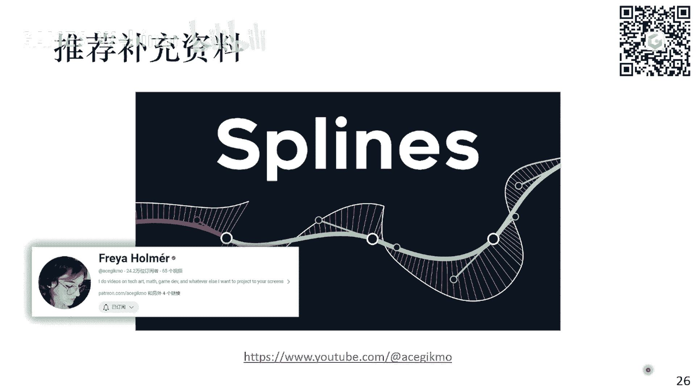
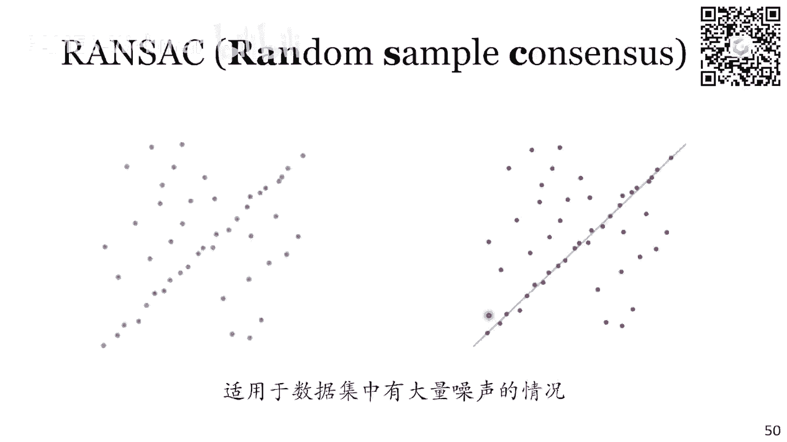

# GAMES001-图形学中的数学 - P6：插值&拟合 - GAMES-Webinar - BV1MF4m1V7e3

然后今天给大家介绍这个差值与拟合，本来是想今天一起把这个采样也讲了，但是发现这个如果讲采样的话，内容可能稍微有点多，然后呢，采样跟这个我们下节课要讲的这个普遍换啊，关系也比较密切。

所以说呢就啊缩减一下内容，我们今天就只讲插值和拟合，因为这两部分本身的内容就已经不少了，然后呃在讲插值和拟合这两件事情之前，我们先要区分这两个概念，就是差值和拟合的区别是什么，其实这两个词经常会弄混。

然后在某些地方声音有点小，那我那我说话声音大点对，就是在在有些地方如果不是那么严谨的话，这两个词会混着来用，但是呢其实他们的定义是非常清楚的，就是它值它是一定要经过这个采样点的。

但是拟合的话它是不要求经过采样点的，所以就会是两个cup，就是对于采样来说，对于对于差值来说的话，大概率是每个点你都确保它是对的，只不过呢你提供的信息不够，所以中间的信息需要你通过差值去给它补出来。

而拟合是说我的信息可能是有冗余的，就比如说我在用，我用这个啊雷达去捕获了一个点云数据，那么这个点云数据里面，是包含了大量的噪声的啊，为了去去除这个噪声，所以我就对这个点击数据进行一些拟合。

所以这是两个的区别，那我们先来看差值，那差值自然想到就是最简单的，肯定是线性差值对吧，就我们只考虑，比如说两个点，一个X0，Y01X1Y一，然后我要补充这两个点中间的这个信息，那我就最简单的。

就是在两条中间画一个线段对吧，那它写成函数的表达式呢，就是左边这个样子是X1啊，Y1减去Y0除以X1减去X0，这是斜率，然后你把它放进去就可以得到第一个式子，然后第二个式子。

第二个式子是第一个式子改写来的，我调一个比，对你只要把上面这个式子变一下形，然后把这个Y0给他提出来，然后Y1给他提出来，他就会写成下面这个样子，那下面这个样子呢，它就是一个Y。

就是一个关于Y0和Y1的一个，线性组合的形式，然后呢前面是它的系数对吧，这个系数我们可以进一步化简，比如说我认为这个X减去X0，除以X1减去X0，这个东西我叫T其实也就是我要求的这个点。

XYX它的它的它的横坐标X在X0，X1这条线段中的一个比例，我们把它叫做T，那么这个Y就可以写成一减T乘以Y0，加上T乘以Y1对吧，那自然就是T取到零的时候，Y就等于Y0，T取到一的时候，Y等于Y1。

然后中间就是一个线性变化的过程，所以这就是最简单的一个线性差值，如果你有很多的点的话，你就每每中间的每一段都做一个求标线段出来，这就是线性差值，那线性插值它有一个很明显的特点对吧，就是线性插值。

我能保证我查出来的曲线是连续的，但是呢这个曲线在每一个区间的这个边界上，它的导数是跳变的对吧，可以明显看到第一段曲线斜率是这样的，第二曲线斜率是这样的，他们在一个地方有一个跳变。

那么这样的连续性呢我们就称为C0连续，它能满足我们的一个最基本的，就是函数值连续的要求，但它的导数是不连续的，所以如果你对于这个，你的连续性有更高的要求的话，那么线性插值肯定是不够用的。

那这个时候我们就可以引入这个二阶差值，呃线性差值的话，我只用了两个点去拟合一条直线对吧，那么二阶差值就非常简单，我是用三个点去拟合一个二次函数，我假设给出X0X1X二，只有三个点。

然后呢我再拟合一条这个中间的二次曲线出来，就是Y等于ax方加bx加上C，它同时经过这三个点，那么经过这三个点，每个点对应有一个方程，所以我有三个方程，然后呢二次函数本身它有ABC这三个未知数。

所以三个方程三个未知数刚好够解，那我们可以把它这个写出来，它也会变成这个样子，这样一个矩阵方程3×3的矩阵方程，然后呢这个矩阵方程它有一个特点，就是左边这个矩阵，他其实长得非常的有规律对吧。

就是1X0X零的平方，1X1X一的平方，1X2X二的平方，那么这样的一个矩阵呢，如果大家之前学过线性代数的话，那应该知道，就是说这个矩阵我们叫范德蒙德矩阵，然后这个矩阵它有一些特殊的性质。

就比如说它的行列式对吧，是一个一个一个有一个有一个这个呃，有一个形式对吧，这个形式我就不写了，如果你行列式有一个有一个闭式解，那么整个矩阵它的逆矩阵，我就可以把它显示的写出来对吧。

所以find的不同矩阵，我可以用符号写出它的这个逆矩阵出来，然后把它乘到这个Y0Y1Y二的左边，得到ABC的一个表达式，然后我再把这个ABC的表达式，代入到这个二次函数里面去。

那么最终我就可以得到这个二次方程，那这个啊二次函数，那么这个二次函数呢，它写出来会是下面这个样子对吧，这个样子当然是进行了一些这个变换，进行一些化解，你会发现呃，我把这些什么。

我没有把它写成什么ax方加上B，X加上C的形式对吧，我把这个二次项，一次项写在了一起，比如说对于第一考第一个式子，你观察X0减去X1，X0减去X2，底下是一个常数对吧，它跟X没有关系。

然后上面X减去X1，X减去X2，这个就是一个二次二次函数的样子对吧，所以他这三个二次函数加起来总共Y，它也是一个关于X的二次函数，并且呢这个二次函数啊，你可以看到它也是一个关于Y的一个。

线性加和的一个形式对吧，我们有Y0乘以乘以一个东西，加上Y11个东西，加上Y21个东西，然后我们可以检查一下，比如说如果我把X代成X0的话，那么这个时候第一项分子就会变成X0，减去X1，X0减去X2。

正好跟这个分母是一样的，所以第一项就是Y0，然后第二项里面有一个X减去X0，所以这项是零，然后第二第三项里面也有一个X减去X0，所以这一项也是零，所以最后Y就等于Y0了，所以这个式子它能够保证啊。

你代入X等于X0的话，那么Y1定等于Y0，也就是说他经过这个X0Y0这个点对吧，那同理它也经过X1Y1这个点，同理它也经过X2Y2这个点，所以呢这个式子底下，这个式子就是我二阶差值的一个形式。

OK那我们这里只有三个点的情况对吧，那如果我有N个点呢，比如说在这个图上画的，我有01234561共七个点，每个点上都有一个函数值，然后我要找一个多项式是经过所有的点对吧，那么我的问题就会变成。

我一共有N加一个数据点，然后我应该找的是一个N阶的多项式，让这个多项式是去经过所有的数据点，为什么是N阶的多项式呢，因为因为如果是N加一个点的话，每个点一个方程，那我一共就是N加一个方程。

而N阶多项式它正好就是A0到AN，这N加一个未知数，所以N加一个数据点，是可以唯一确定一个N阶的多项式的，对吧，那么这个多项式长成什么样子呢，其实就是刚才给大家看的这个，二阶差值的一个拓展对吧。

他写出来会是下面这个样子，它依然是一个Y关于YJ的一个求和的形式，然后这个求和的系数，它是一个关于X的N阶多项式，为什么是N阶呢，你看底下这个这是个连乘对吧，然后连成对象是I并且I不等于J对吧。

也就是说对于一这个点的话，它一共需要乘跟零有一项对吧，呃就是如果这等于一，那么I可以取多少值呢，I可以取零，可以取二，可以取三，可以取四，可以取五，可以取六对吧，所以它是有六项。

然后每一项呢它上面都会有一个X减去XI，所以是六项X减去X相乘，所以啊分子就是一个六阶的一个多项式，然后分母的XJ减去X2，它是一个一个常数对吧，那六次常数乘起来它还是一个常数，所以呃后面这个式子。

它是一个关于X的一个N阶多项式，你从N减一个点里面去除了I等于这一点，所以还剩下N个点，N项的话就是N阶多项式，那么这个N阶多项式这个系数，它有个名字叫这个拉格朗日多项式LJ。

那么LJ它它的性质它有一个很重要的性质，就是跟二阶啊，跟我们刚才讨论的二级情况一样的，就是我考虑这个LJ这个拉杠杆多项式，如果我代入XK进去，J和K不一定是相同的，那我把它写出来。

后面是这样一个连成形式，那么就会发现，如果一旦这个J和K是相等的对吧，那么你上面也是XK减去xi，底下也是XK减去xi，所以最后一定是一，但是如果J和K不等，那么上面就一定会出现一项。

XK减去XI等于零的情况对吧，因为我是要对所有的I不等于J的情况做连成，那么就一定存在一个I让I等于K对吧，这是这不等于K的情况，那么一定会出现这样一个现象，所以分子一定有一项是零。

那你连乘起来这项已经是零了，所以如果K不等于J的话，LJSK它一定是零，那换句话说，拉格朗日多项式，它满足这样一个LJX，K等于德尔塔JK的这样一个结论，那正是这个结论保证了说，我们在上面这个形式中。

如果X比如说X取一的时候，那么这个拉格朗多项式，对于其他的所有点系数都是零，只有对于一这个点系数是一，所以Y就等于Y1，所以这个形式保证了说啊这样一个N阶多项式，它经过了我所有的插值点呃，呃可以吧。

这是一个就是说如果你有N加一个点，如果你想进行多项式插值的话，那么就可以啊这么来做，他直接告诉你这个函数的形式，你只要把它带进去，你就可以得到你啊，在任意点的一个函数值的结果，然后并且呢这个多项式对吧。

它是一个N阶的多项式，那么意味着它的连续性其实是非常好的对吧，一个N阶多项式，你至少可以保证它是比如说二阶多项式，我们刚说的，我们回头啊，比如说一阶多项式就是直线对吧。

分段的直线我们能保证它是这个C0连续的，那二阶多项式，我们就能保证它是C1连续的对吧，所以N阶多项式的话，我就这么保证它是CN连续的啊，CN减一点去，所以这个曲线的性质非常好，它非常的光滑。

呃然后关于这个插值方法，其实有一个非常怪的应用，就是大家如果在呃就平常刷知乎，比如说碰到这样的一些问题，比如说我们要求一个一个数列，找规律的一个问题对吧，第一项二十二十二，25，三十三十七好。

那么下一项是什么，给你几个选项，47，49，55，81对吧，如果就是假如考公的时候，可能也会碰到这样的智力题对吧，然后知乎上就会告诉你有这样一个多项式存在，它的前五项正好就是这个数列的前五项。

二十二十二，25，三十三十七，然后呢这个多项式取到X等于六的时候，他得出来47好，所以这个题选47，但是呢这样的多项式它存在很多个对吧，也存在另外一个多项式，它前五项也是这个数列的前五项。

然后第六项呢是一个49对吧，那49也是对的，然后同理55也是对的，81对的，所以ABCD都对，那么这个东西它这个多项式是怎么找出来的，这个就是我们刚才介绍的这个拉格朗日多项式，你只要给这个。

我给你六个点对吧，然后你给我拟合出来一个五阶的多项式，那么这个多项式呢，就是刚才刚才给出来的这个样子，我能保证这个五阶多项式一定会经过这六个点，对吧，所以就是有这样奇奇怪怪的应用。

但是这只是一个呃只是一个东大，就是给大家交流一下对吧，当然这个题的真实解法估计也不是这样，具体多少我也没具体考好吧，那么更严肃的来说，这个事情就是呃如果你使用多项式插值，它其实有一个很严重的问题。

这个问题是什么呢，叫龙格现象，就比如说我这里存在一条黑色的线，这个黑色的线，我们比如说我们就认为它是ground truth，对吧，我在黑色线上踩了这样11个点，然后我希望通过这11个点它们进行插值。

然后能差出来一个跟这个黑色线比较接近的，曲线出来对吧，那我们怎么做呢，我们就可以用刚才介绍这个多项式插值，我用11个点拟合出来一个十阶的多项式，然后看看把这个多项式画出来，就是这个图中的这个红色的线。

那么这个红色的线它当然是有问题的对吧，尽管这个红色线在中间的这个区域，它跟这个曲线拟合的还是可以的，但是在边缘的地方它会有非常剧烈的震荡，它跟这个黑色的ground truth，这个偏离是非常远的。

那么这样一种偏离就是这个龙格现象，就说明这个曲线你有这样的对，你有这样的震荡的结果，那一定是因为你的这个多项式的阶数足够高，才会有对吧，比如说二阶多项式的话，他一定只有一次震荡，就是它的那个极值点。

三次多项式的话最多只有两次震荡，那如果你出现了这么多的震荡，一定说明这个多项式的基数基数已经足够高了，并且是太高了，然后由于某种原因，由于这个这些采样点分布的比较特殊，然后就导致你拟合出来。

会出现这种非常震荡的结果，那么这种结果显然是我们不想要的，那代表你这个你和你合错了，所以尽管这条曲线它依然是非常连续的曲线，但是由于它太震荡了，所以这个也不是我们想要的，那么如何去解决这个问题呢。

我们可以通过这个样条插值的方法去解决它，那什么叫样条差值呢，其实也非常的简单，就是我通过拼接多段的这个低阶的多项式，来去逼近整个的一个曲线，就比如说我们最开始介绍的这个线性差值，它就是一个样条差值对吧。

只不过他的这个多项式接触过于低了，它是个就是一个一阶的多项式，那么你自然每一段它都是一个直线，但是呢我们也可以让这每一段，它的这个阶数高一点，然后呢让它看起来是比较的这个弯曲的。

然后再把这个多段的这个曲线拼接在一起，形成这个更复杂的这个曲线，通过这种方式，我们就能够避免刚才出现的这个龙格现象，因为我能保证我的每一段曲线，它都是一个低阶的多项式，所以它一定不会震荡的特别剧烈。

对吧，那比如说我们考虑这样一个二阶样条曲线，那顾名思义，也就是说我们每一段曲线，它都是一个二次函数对吧，假设我们有还是一样的问题，有N加一个数据点，那么我一共有中间N个区间。

每一个区间如果都是一个二阶多项式的话，那么它一共对应着三个未知数对吧，就是ABC每一样都来N份，那我们考虑如何去解除，要通过这个我设定的条件去解除这三个未知数，我们看看一共能列出多少个方程出来。

那么首先我们要满足插值条件对吧，就是我说的这个每一段函数，它必须经过区间开始和结束的这两个点，那所以对于每一个区间，我可以列出两个方程来，一共是二运动方程，然后同时呢我希望这个二阶样条插值。

它的结果是足够光滑的，它至少应该比这个啊，线性插值的结果要更好对吧，那么除了这个它是直连续的假设之外，我还要求他保数连续对吧，那么就是对于xi这个点来说，我就要求他左边这一段的二次函数。

在这个地方的导数，和右边这一段二次函数在这个地方的导数，它们是一样的，那么一共可以列出多少个方程呢，一共是N加一个点，但是呢只有N减一个点，是左和右都有区间的，所以我一共能列出来N减一个方程。

最外面的两个点，我是列不出来这个导数连续的条件，那好我们可以先来数一下一共三个未知数，然后我的方程是2N加上N减一个，那么一减就会发现我还少一个方程对吧，那我们这个时候就可以有一些人为的指定。

比如说我可以假设说这个东西这个曲线，这个样条曲线它的第一段呢，我强行给定它是一个线性函数，那么这个时候对于低段的这个，二次函数来说的话，它的A0就自动默认成零了，它只有BI和CI两个未知数。

所以这样未知数的个数就少了一个，或者说我的方程就多了一个，那这样正好方程的个数等于未知数的个数，我就可以把所有的未知数都解出来，得到最终的这个啊，每一段的这个二次曲线。

那我们可以看一下这样的一个差值结果，那自然呢它满足这个一阶导数是连续的，那个这样的连续性我们称之为C1的UT，但是呢他的二阶导是不连续的，它的二阶导不连续的原因也很简单，就是我们并没有要求这个点。

它左右两侧的这个二阶导是一样的，二阶导二阶导是什么，二导就是AI对吧，两倍的AI对吧，我们也没有要求每段曲线AAI是一定一样的，然后第二点呢是说我为了得到这三个未知数，我是需要去解一个方程的。

解一个三的一个系数的矩阵方程，对吧，我并没有像比如说像刚才介绍这个多项式插值，那样的，有一个呃意识的解，就是我直接把X带进去，我就知道这个结构是多少的，我为了得到这个二阶样条差值的系数。

我是需要解一个3N的方程的，那如果你的点非常多的话，比如说我有100个点，1000个点，那这个时候你要解的就是，三百三千的一个矩阵方程，那它截下来就就不一定很快乐，当然有加速的方法，他也不是很慢。

但是呢你如果跟那种B式的方法去比的话，那可能是不够快的，然后第三点其实还有一个问题，就是说由于你是通过解方程解出来的，那么我们每一个数据点，它其实是会影响到全局的差值结果的，什么意思呢。

就比如说对于xi这个点，我如果给它稍微动一下的话，它是可能影响到比如最最末尾的曲线的结果，那么这个性质我们也可以称之为一个，它不存在这个局部性，就是我一个点，它可能牵一发而动全身。

我只要改变一个点上的值，它整个整个曲线的形状都会改变，在某些情况下，你可能不想要这样的结果对吧，所以这是他一个潜在的问题，那么同样的我也可以把这个问题进一步的推广，对吧，我刚才是介绍这个二阶的样条插值。

我们还可以进一步推广来做三阶的样条插值，那么自然就是每一段区间内，它都是一个三阶的多项式，我们可以，那这个时候，我们就可以像二阶样条插值的方法一样，我们去考虑我们需要多少个方程，来去解除所有未知数。

三阶样式超值的话，如果有N个区间的话，自然就是4N个未知数，我们可以加上2N个直连区的条件，N减一个导数，连续的条件就跟刚才是一样的，然后同时我们还可以再要求他，进一步是二阶导数连续的。

那这时候又会再补上这个N减一个方程，那这个时候一共就是4N减去二个方程，还差两个，那么这两个方程呢一样的，你是可以自己去指定的，比如说我可以指定第一段，它依然是一个直线对吧。

那这个时候第一段的这个三三阶的函数，它的前两个参数都是零对吧，或者我可以指定第一段和最后一段两段，它都是一个二次函数对吧，也可以这样指定，就是根据你的这个需求，但不管怎样说，最后一定是个未知数。

个数等于方程个数，然后我把所有未知数都给解出来了，那么它的问题呢，三件样的差值它的好处是什么，好处自然就是我现在的这个连续性更高了，他现在是一个二阶连续的一个插值方法。

但是坏处呢依然跟这个二阶情况是一样的，就是我需要解这样一个矩阵方程，矩阵方程，并且这个方程的大小还比二阶的更大一点对吧，因为我们每个区间我是有四个未知数的，同样的单个数据点也会影响全局的差值结果。

比如说就跟这个动图里画的一样对吧，你在这个点上下动这个点，你会发现离他很远的一条曲线，它也在抖对吧，所以有些时候你不想要这个，也不代表它是一个完全特别坏的事情，那么关于解方程这个事情呢。

其实是在这个games102这个课程中，也就是关于这个这个已散几何，也不是几何，应该叫什么啊，反正是game4102，这个课也是个关于这个图形学里面几何的课，然后再介绍到这个样条方法的时候。

在学习材料里给出了这个方程的一些，求解上的一些方法，比如说我们有什么追击法，因为这个矩阵其实它是它有很好的性质的，比如说对于这样一个啊，这应该是二阶差值的一个方程的话。

它其实是一个只有主对角线和副对角线的一个，三对角的一个矩阵，那么这个矩阵的话你要求解它的时候，你可以有一些比较好的优化方法去解它，所以那如果对这个东西，就是如果大家之后要用到的话。

也可以去学习一下这个game102对应的部分，OK那么我们刚才说到这个呃，二阶样条插值和三阶样条插值，甚至更高阶的样条插值方法，它都有一个问题，就是说我是需要去解方程的。

然后并且这个差值结果它是没有这个局部性的，那我们有没有办法让这个差值结果有局部性呢，那这个对应的就是这个三阶2米差值，这个三阶2米差值，它的名字跟我们刚才介绍这个三阶样条差值，其实它很像的。

就是有些地方也会叫它，比如说这个CUBIERMANSPLINTERPOLATION，三阶恶米样条插值名字是很像的，所以有可能呃，就是当比如说就是当提到说我要做，比如说我用的是一个三阶的插值方法。

你可能就去仔细读一下，来看他用的到底是这个三阶2米差值，还是刚才介绍这个三阶差值，那么三阶2米差值，跟刚才介绍的方法有什么区别呢，它其实最大的区别就是它不需要解方程，并且它的差值结果是有局部性的。

也就是说我去改一个地方的这个一个点上的，这个差值的这个一个点上的这个函数值，它只会影响它周围的这一段曲线的形状，对于远方的曲线的形状它是没有影响，但是呢他也会放弃刚才三阶差值的一个，连续性的条件。

也就是我们放弃了这个二阶导数连续的条件，就是尽管它是三阶的厄米插值，但是呢它其实差值的结果只是一阶连续的，它并不是二阶连续的，就是我们通过放弃这样一个对连续性的一个，高的要求。

然后呢让他的这个差值的结果有更好的局部性，并且我也不需要解方程了，那么具体是怎么做的呢，我们依然假设X0X1这段区间内，他这个函数是一个三次函数，对他有四个未知数，那么就要考虑增加两样的四个条件。

来去把这四个未知数给它给定，其中有两个条件是很明显的，就是我一定要经过X0，Y0和X1Y1这两个点对吧，这是前两个条件，然后呢我再增加两个导数条件，我如果给定了这个Y0上了。

我要求这个点的导数是M0Y1，这个点的导数要导数是M1，那我就多了两个方程，也就是导数的两个方程，一共四个方程，四个未知数，然后带进去，我就可以把这个ABCD全解出来，然后解出来这个结果。

它也可以写成一个相对来说比较漂亮的，结果是什么呢，就是Y最终这个Y它是关于Y0M0，Y1M1的一个线性组合，然后每一个这个呃，Y和M前面它都会有这样一个多项式，那这个多项式里面。

这个T就是我们在最开始定义的那个T，也就是这个X占到这个区间内的一个比值，它跟XT和X之间是一个线性关系，也不是线性关系吧，一次关系，然后呢，那么你这个多项式呢，它是有关于T的三次多项式。

所以它也是有关于X的三次多项式对吧，只是我只是换了一个写法，这个写法啊让整个结构看起来漂亮一点，那我们就可以验证一下，对不对，这样一个结果他为什么满足我们的要求对吧，我们可以把这三个多项式都给起个名字。

叫什么呢，叫阿米级函数，然后这个欧米奇函数也就是三阶2米差值里面，这个arm这个词就是来源，就是说二三阶2米差值里面的2米，指的就是这三个指的就是这四个多项式，那么这四个多项式有什么性质呢。

如果你把它画在图上，画到零一区间里，然后就会得到这样一张图对吧，用不同的颜色标注出来，并且我们可以分别叫H00，H10，H01和H1H00满足什么性质呢，在图中对应的是这条红色的线。

它在T等于零的时候取的是一，在T等于一的时候取的是零，并且在零这个点它的一阶导数是零，在一这个点它的一阶导数也是零，也是这个对应的条件，那同样的关于H10，我也可以写出来他的这个条件。

你就会发现H10在零和一的时候，它取值都是零，但是呢在零这个点的一阶导数是一，但是呢在一这个点一阶导数是零，对于H01呢正好是反过来的，他同时经过零和一这两个零点，但是呢他在一这个点导数是一零。

这个点导数是零，那H11这条啊这条深蓝色的线哦不对，你刚才说错了，这个呃，这应该是这个H01啊，说错了，不好意思，H01这条深蓝深蓝色的线，它跟红色这条线是对应的，它在零的地方取零，在一的地方取一。

然后在这两点上导数都是零，所以这四个函数它有这样好的，这个导数和函数值的性质，那你把它带入进去，你就会发现这样一个差值的结果，它自动满足了我们给定的这个函数值的要求，以及这个导数的要求，比如说第一点。

如果我认为我我把这个T等于零带进去，他是不是经过Y0这个点呢，你就会发现这种零的时候，H00是取一的，然后其他的三个多项式取的都是零，所以Y就等于Y0了对吧，然后如果你去考虑考察导数的话。

H00在零这个点导数是零，H10在这个点导数呢是一对吧，然后由于你这个T是一个关于X的函数，所以你把它求导一个结果，他有一个那个链式法则嘛，然后你把那个链式法则带进去，然后结果拿出来就发现啊。

这一项在T等于一的时候，在X1这个点它的函数值它的导数值是M0啊，说错了，在X0这个点，他的这个导数值是M0，然后剩下H01和H1在，在X0这个点导数都是零，所以是2米奇函数。

这四个多项式满足这样好的性质，所以能够保证我最后这个三阶2米差值的结果，这个值这个函数值Y，他是一个，满足我对于这个函数值以及导数要求的，那如果我把这样的多项式，三阶多项式给它拼在一起。

那它就可以组成一条样条曲线对吧，那自然如果我希望这条这个拼接成的样条曲线，它是导数连续的话，那我只需要规定每个点上它的这个导数值，左右两边的导数值是同一个值，那么它自然就是一个导数连续的医疗曲线。

那么我们具体应该怎样选择，每个采样点上的导数值呢，有不同的方法可以去选，比如说有限差分方法，就是你计算左边的这个啊，这个有限差分出来的斜率和右边有限差，分出来的斜率，然后给它取个平均作为。

然后也有像这个cardinal样条，它里面给定了一个C这个常数对吧，你可以通过调整C这个常数，来调整每个点上的这个啊导出的这个值，它出来的结果也会有一点小小的不同对吧，然后看cl ROM样条呢。

它其实跟有线差分很像，它假设XY均匀划分，那么这个mi就给定成为这个两边这个呃，两边的这个点，右边区间的端点和左边区间端点的一个差值对，所以你可以选择不同的这个导数的规定方法，但是不管你怎么选。

我能够保证这个三阶2米差值出来的结果呢，他一定是这个一定出来是这个导数连续的，它这个C1连续的，并且它有很好的局部性，并且我也不需要解方程，OK吧嗯嗯，然后呢，那既然我的这个每个点上的导数。

可以自由选对吧，那我也可以调整哪个点上mi，这个选择方法，就是我通过一个简单的法则去给定，而是我精细的去调整它，让这个曲线进一步满足一些其他的性质，比如说这个单调三阶样条插值。

它就可以通过去调整每个点的这个老数值的mi，然后呢保证这个差值，结果呢是一个在每个区间内是单调的对吧，就是图中这条蓝色的线，红色这条线呢是一般的这个，三阶恶魔一样的差值。

蓝色的这条线呢是这个单调三阶样条插值，你会发现红色，比如说在0。4到0。5这个区间内，它有个很明显的一个先下降，然后上升的这样一个过程，但是呢如果你使用的是这个呃，单调三阶样条插值的话。

那么它这条蓝色的线在每个区间内，它就是单调的，它就不会出现这种在数据点之间的，这种拐点存在，对吧，这可能也是你希望的一个想要的一个，他的一个好的性质，那么具体是怎么调整这个EI呢，就是有这样一个算法。

就peace wise cubic or mulating polynomials，这样一个一个一个一个方法，然后大家可以自己去进一步了解，这个具体是怎么调整这个N，好吧。

那讲到这里我们就可以做一个总结，我们前面介绍了很多种插值方法对吧，从简单到这个复杂，那么每一种插值方法它都有不同的性质，比如说从连续性的角度来看的话，线性差值它的连续性是最差的，它只能保证值连续。

但是不能保证导数连续，多项式插值呢一般来说它的圆心是最好的对吧，它可以满足非常光滑的性质，然后这个其他的话基本都是这个C1连续，C2连续对吧，那对于这个复杂性来说的话，二阶样条插值和三阶一样的差值。

它是需要解方程的，然后他可能稍微复杂一点，然后其他的这些插值方法都是不需要解方程的，但是呢二阶差值和三阶差值，它的局部性是不好的，多项式插值虽然它很连续，但是它的局部性也不好。

并且它还有很严重的龙格现象对吧，然后呢三阶样条差值，三阶恶米样条差值跟三阶样条差值比呢，它牺牲了一定的连续性，它把连续性从C2降到了C1，但是呢他这个时候就不再需要解方程了，并且呢它的局部性也会更好。

然后单接单调三阶样本差值呢，它会进一步保证这个结果是单调的，所以说啊有这些差值不同的插值方法存在，就是大家可以根据实际情况去选择，自己想要的这个插值方法，OK这是讲到前面部分的一个总结。

大家有什么问题吗，并没有人回来后，今晚那我就假设大家没问题吧，大家如果真的有问题的话，可以随时在这个啊里面提出出来，在聊天里把它打出来，OK那我们就继续，啊然后下一步我们引入一个非常重要的概念。

叫基函数，这个基函数它会帮助我们去理解之前介绍呃，呃用一个统一的框架去理解之前介绍的，各种各样的查询方法，那么奇函数是什么呢，我们还是以这个线性差值为例对吧，线性插值的形式就大家很熟悉的，我这就不说了。

然后呢我可以干点什么事呢，就是我可以定义一个奇函数，对每一个xi定义一个奇函数，它长成的样子就是上面这个图中的样子，他在xi这个地方取一，然后在其他的所有采样点都取零，那么它就是这样一个一个尖尖的函数。

这个函数呢有时候也会大家叫它这个had function，因为它就是一个像一个hat的一个东西，如果你把它的定义式写出来的话，它就会变成下面这个样子，对吧啊，上面这两个两个条件。

222种情况反映的是这个这两条这个直线，其他的结果就直接取零了对吧，那么如果定义了这样一个奇函数的时候，我们有一个怎么样的性质呢，我们发现比如说xi和xi减一的中间这一段直线，对吧，他写成这个样子。

他其实可以写成这个奇函数，与Y的一个线性组合的形式对吧，也就是说前面Y的前YI，前面这个系数，其实它对应的就是bi这个奇函数，在X处的一个值对吧，为什么其实也很明显，在这个xi的时候，这个基函数取一。

在XII加一的时候，这个奇函数取零，它中间是一个线性变化的对吧，那它的作用其实也就是刚才介绍的一减T，然后呢bi加一是XI加一这个点的奇函数，在X这个点取零，在XI加一这个点取一。

它中间是个线性变化的结果，所以它就是T，所以上面这个结果其实可以写成，下面这个求和的形式，那进一步推广，其实所有点上的就是每一段时间内对吧，如果你用函数来写的话，用最开始的函数来写的话。

你可能写出来一个分段函数对吧，但是如果你用金函数来写的话，它就会有这样一个简单的一个形式，也就是说Y它等于所有的YI以及对应点上的，奇函数bi的一个求和，想想我把分段这个东西包含在这个基函数里了。

OK吧，那么写成这样一个形式呢，它其实是一个非常统一的形式，比如说我所有的差值结果，大部分不是所有所有吧，大部分的差值结果，我都可以把它理解成这个形式，唯一不同的就是每一个插值方法的出来。

这个奇函数是不一样的，对于线性插值来说，它长成这个样子，那对于二次差值来说，它可能长成二次，二次样条插值或者三次样条插值，它出来可能就是一个二次函数或者三次函数，是分段二次或者分段三次函数。

那么这个奇函数它一定会满足一个条件，就是这个BI在XJ这个地方的函数值，等于德塔IJ，只要它满足了这个条件，那么我的这个差值就是有效的，也就是说它能够满足，一定经过我的所有的采样点，为什么呢。

如果你把EIXJ等，DEIJ这个条件代入进去对吧，然后你去考虑，比如说我现在问你插值，结果在xi这个点上的值是多少，你把它带进去，然后BJXI就等于加上IJ，那YJ德尔塔IJ对于J求和。

结果就直接等于YI了，因为德尔塔J只会在I等于J的时候等于一，其他情况都是零，所以只要奇函数满足这样的一个一个性质，那么我就能保证使用这个基函数，定义的这个差值，它就是有效的。

那么它其他的性质其实也是通过奇函数，比如说连续性的要求，然后局部性的要求，也可以通过这个通过这个这个什么东西，这个奇函数来看出来一部分，比如说我们可以把这个多项式插值，就是个拉格朗日多项式插值。

它的奇函数给它画出来，那么它的奇函数其实已经写成了，这个Y等于YJLJ的这个形式对吧，也就是这个YJ乘以拉格朗日多项式的形式，所以这个拉格朗日多项式，它其实就是一个奇函数对吧。

然后对于比如说图中现在有四个点，那么这个拉格朗多项式，它就是一个三阶的多项式，如果把每个点上的减函数画出来，他就是右边这个结果对吧，蓝色这条曲线就是对应这第一个点的，这个奇函数，你会发现这个这个G啊。

这个奇函数它在只有在X等于一的时候，它取到一，在后面的245这三个点这三个采样点上对吧，这边也是245，这三个采样点上它的值都是零，对吧，对于basis2，也就是L2这个拉杆多项式来说。

他只有在X等于二的时候，他取到了一，然后在X等于一，X等于四，X等于五的时候，他取的都是零，那以此类推，所以说拉格朗日多项式，它是满足这个奇函数的要求，那你用拉格朗日多项式定义出来的差值，它也就满足啊。

我们刚才说的这个差值的要求，然后并且由拉格朗日多项式，它是一个三阶的多项式，所以你最后的差值结果也是三阶的多项式，它就能满足这个拉格多项式的这个呃，呃满足这个查的结果是一个CR连续的一个结果。

OK这个是拉格朗日多项式插值结果，那我们还可以再看，比如说三阶样条插值的基函数，这个是三阶样式，不是三阶2米样，那他这个基函数其实是我通过解方程得到的，对吧，就我去解方程。

然后再去把它这个系数给他解出来，这个系数画出来，它会画出来是这个样子对吧，你会看到这个结果，他跟刚才拉格多少是那个结果还是比较接近的，为什么呢，因为他们俩其实我刚才都说，因为你正好四个点对吧。

所以拉格朗日多项式的啊，差的结果他也是这个三阶多项式啊，这个地方也是三阶多项式对，所以它看起来比较像，然后并且呢，这个地方也满足我们刚才提到的这个，差值的要求，差值的要求只有蓝色线。

只有在这个X等于一的时候，他去到一或其他都是零，然后我们再看三阶恶米样条差值，它的结果就会有点不一样了对吧，这个差值结果也不一样了，那还不一样，在什么地方呢，你就会看到这个三阶2米1样条差值。

比如说我们看这个蓝色的线对吧，在前面两段，在这个X1X等于一到X2，这一段它是一个曲线，在X2等于X4这一段它也是一条曲线，但是呢在4~5这一段它是平的对吧，它值是零，这个是刚才不一样的地方。

然后你再看，比如说这条红色的线，它在1~2这个区间内，它也取的是零，那么这个东西它其实就是局部性的体现，为什么呢，就是我如果把这个采样点给它取得更多一点，比如说我要对很多点很多的点差值。

然后我去画质每个点的啊奇函数出来，你就会发现这些奇函数都会是长成，左边这个这样一个函数，所有的样子就是它只有中间这一段，在这个中心点附近的一个小区间里面，它是一个分段的多项式函数。

然后在这个区间之外它都是零，这个就是它局部性的体现，那么自然因为你有这样一个性质，所以我只改变这个点上的值的时候，它是不会影响到其他地方的值的，因为你在其他地方的系数都是零对吧，这个就是它局部性的体现。

然后并且三阶二比差值，是它的一个好的性质是什么，就是如果当我excel是等间隔取的，如果就是01234，这样来取一些这个采样点，然后你已使用三阶2米样条插值来进行，插值的话。

他这些basis function它的形状都是一样的，唯一的区别就是给它平移了一下，那这个性质就会在很多事情上对我们有帮助，比如说我们要做模拟，我们要做模拟，那你有可能比如说啊对于一个均匀网格。

你可以使用这样三阶恶样差值，作为我的这个shape function作为形函数，来描述这个弹性体的形变，那这个时候你可以做出来一个方法，它对应的就是这个三阶恶米有限元的方法，对这个东西如果感兴趣的话。

可以大家可以看啊，games有更高级的课程，包括像这个games103的啊物理模拟，然后以及我记得还有一门课，专门讲这个等几何分析的，就是games里面有一门专门讲登记和分析的课程。

然后那个课程里面也会涉及到，这节课里面讲到这个啊恶意样条的内容，大家如果有兴趣的话，也可以进一步去学习这个课程，OK然后我这里再给大家推荐一个一个资料，就是一个在油管上的一个一个一个视频。

然后这个视频应该是有B站的搬运的，我记得我之前看过B站的搬运，然后呃这个视频我觉得讲的非常的好，就是是我学习这个，这不只是我们今天介绍的差值，然后包括像图形学里面的曲线。

其实都是一个非常好的一个一个可视化的教程，因为它的可视化做的非常的棒，就是所有结果都很直观，然后公式很少，但是能让你这个有很直观的理解，所以大家如果对这方面感兴趣。

因为这个方向其实是一个依然active的一个graphics，的一个研究研究内容，所以大家如果对这东西感兴趣的话，可以去再学习这个进步的课程，可以仔细看看这个视频，对我看有同学说看到过。

确实我觉得讲的很好，嗯OK我们前面介绍的所有的差值，都局限在就是这个一维的情况，就是我给你一些X上的一些三破点，然后呃，然后去找这个呃Y的对应的这个差值函数对吧，那么在图形学里面。

当然这是一个最简单的情况，我们还有可能碰到像曲线差值，就是我插值出来的其实不是一个函数，而是一条曲线对吧，或者多项式插值，就是我的这个X它就不是一个低位的东西，不是一维的东西，它是高维的东西。

好像像素差值，那这个时候X就是一个均匀的网格，然后点云差值，我插的这些点它是一个空间中分布的杂乱的点，那么这个时候我应该怎么办呢，我们一个来看大家看一下，首先来看曲线差值，曲线插值问题是什么呢。

是说我有呃，我有很多个点，然后这些点散落在方舟的空间中，所以我给定一个顺序对吧，从P0到PN，然后你要插值一条曲线出来，经过图中的所有点，然后呢，这个时候他跟刚才我们最开始我们介绍的差距，有什么区别呢。

就是之前的话是我们是定义的函数，对函数的话就是一个X只能给一个Y，但这个图片很明显看到一个X可以对应多个Y，那么这个时候我应该怎么办呢，其实解法也很简单，就是我去定义一个参数T。

这个T呢从美在每一段区间里面，它是从0~1线性变化的，然后这个时候我的差值就不再是给定一个X，输出一个Y了，而是我给你一个T，你给我输出一个二维的XY对吧，那这个怎么做呢，其实我们可以直接推广。

前面介绍这个三阶恶米样条差值，他就会得到一个很好的一个差值的结果，具体推广方法是什么，就是我把这个之前的所有这个地方，本来应该是Y0，然后这个地方本来应该是M0，它都是一个标量对吧。

我现在把它都改成矢量G0，就是这个区间端点开始的这个点的XY，这个矢量，其一呢就是区间末尾的端点的矢量，M0和M1呢就是这两个地方的切线对吧，切线也是一个矢量对吧，因为我是在一个二维的平面里面。

然后呢他们做线性组合，线性组合的这个系数，依然是这个我们之前定义的这个欧米奇函数，三阶欧米奇函数，那这个时候我就能保证这条曲线满足，我们之前讲的这个三阶恶米差值的，所有好的性质对吧，它有局部性。

然后并且它的一阶导数是连续的，并且它是一条差值曲线，就是说它经过了我所有的控制点对吧，包括大家如果就是用POWERPOINT来做做这个size对吧，那你一定会接触到这个曲线工具。

那这个曲线power point里面，这个曲线工具，其实也就是三阶2米1样条曲线对吧，你可以在pp里面打开这个界面，去编辑每个顶点上的这个呃这个它的切线，它的位置，然后关于这个大家也是有兴趣的。

开始可以进一步学习这个games102的内容，然后注意有一个地方，就是我们刚才呃，就是图形学里面介绍的这个用到的曲线，它其实不一定是要是差值的，但是我们今天讲的内容，其实是限制在差值这个范围里的。

举个例子，就比如说以下这个曲线，大家应该就是有了解对吧，就是这个曲线就是一条贝塞尔曲线，它很光滑，但是它很明显的是没有经过所有的控制点的，但是呢我们今天讲差值，所有的这个曲线它是一定要经过这个控制点的。

要不然的话它就不叫差值了对吧，那么满足这些差值条件的曲线，在同学里有个专门的名字叫差值曲线，比如说像这条贝塞尔曲线，它就不是差值曲线，然后关于曲线的部分，这就是几何里面的知识了。

大家可以去学习games102对吧，我们今天这个讲差，只是给大家打下一个数学基础，那好我们搞完了这个曲线差值，我们再看这个三角形差值或者多边形差值，对于一个三角形来说的话。

我们要怎么在这个三角形里面来做差值呢，对吧，如果大家学习这个games101的话，就应该知道有个东西叫重心坐标，怎么定义的呢，就是对于这个三角形里面任意一个点，我可以求出三个权重出来，阿尔法贝塔和伽马。

阿尔法定义为A点，这个点相对的这个三角形的面积，除以整个三角形的总面积，然后贝塔定义为B点，这个点对应的这个三角，相对的这个三角形的面积除以总面积，和伽马也一样的，那么这阿尔法贝塔定义出来的话。

阿尔法加贝塔加伽马等于一，就是一个很显然的东西对吧，因为你三个三角形的面积加一等于总面积，然后并且呢有一个很好的性质是什么，是说比如说我们只看阿尔法，如果这个点他在A点上的话。

那么与A相对的这个三角形AA的这个面积，它应该就是整个三角形的面积对吧，所以阿尔法等于一，然后贝塔伽马，这个时候他就会退化成AC和ab的两条直线，所以它的面积是零，所以如果这个点在A点的时候，它取一。

在B点和C点它就取零对吧，这个其实也就是我们刚才介绍这个差值的，所以要满足的这个性质对吧，对贝塔和伽马是一样的，所以如果你使用这个重心坐标的话，我就可以定义三个权重出来。

然后这三个权重就可以把它分别作为ABC，三个点这个数值的一个前面的这个系数，然后同时呢重心坐标它还有一个好的性质，就是我们可以用奇函数的方式去理解它对吧，我可以认为阿尔法是一个关于这个点的。

一个位置的一个函数，然后我把阿尔法单独拿出来，这个阿尔法其实也就是我们刚才定义的这个，奇函数在这个三角形里面的这一部分对吧，那我们把比如说对于NI右边这个图里面，对于这个点来说，把他的在每个三角形里面。

周围每个三角形里面对应的阿尔法都求出来，然后给它画出来，然后给它拼接起来，那么这个东西就是对应的它的奇函数了，这个奇函数长成什么样子呢，它会长成也是一个had function的一个形式。

就是他在这个点对应的这个点上取一，在周围的锁点上取零，然后在更远的地方它当然是零对吧，所以他跟我们刚才讲的这个线性差值的，这个奇函数其实是非常像的，它也是一个线性的一个奇函数，分段线性的奇函数。

那么这个函数它也说也叫这个HIFUNCTION，那么这个东西对于这个大家不管是做模拟也好，还是做几何也好，还是做渲染也好，都是一个有可能碰到的一个东西，那如果我们把问题进一步扩大，变成一个多边形呢。

对多边形我们同样能定义出来，跟刚才一样的中心坐标吗，那这个时候就比较困难了，那么对于多边形差距来说的话，就可以定义另外一个东西叫均值坐标，他和这个呃重心坐标有一些区别，但是它依然满足一个很重要的性质。

就这个均值坐标，比如说第一个图里面画的这个金额均值坐标，它的分布对应的就是这个顶点，它的一个权重的分布，你会发现这个权重在他这个点取到最大值，也就是一在其他的所有点上去的都是零，所以他也满足这个啊。

满足这个差值条件，那关于均值坐标明VALORDINATE到底该怎么做，这个就我们这里不细讲，大家如果有兴趣或者有这个需求的话，就可以自己去了解这个概念，但它基本上可以认为它是一个三角形里面的。

重心坐标的一个推广，那对于像素差值呢，这个问题就会更直观一点对吧，像素它就是网格，网格的话，其实你完全可以看出他是这个两个方向的，一维的推广对吧，那么一维的线性差值在像素里面。

在网格里面就会称之为这个BINATION，也就是在XY两个方向上，都会进行这个啊线性插值，然后如果你在一维上是一个by cube，在是一位上是一个三阶的差值，不管你是三阶样条也好，还是三阶恶比样条也好。

在这地方都会在网格上，都会变成对应的一个by cubic的差值，一般来说用的都是这个双三四的2米差值，好吧，那这个结果其实在games101里面也会讲到，在讲到纹理映射那一章的时候呢是吧。

有这样一个结果就是你使用啊最临近差值，然后线性差值以及by cubic差值去啊，插值一个相同的图片，你会得到不同的这个插值结果对吧，然后它里面比如说呃就是在101里面。

就是杨老师可能主要介绍这个百灵验的差值，对吧，那关于百Q百Q币差值，其实也就是我们今天介绍的内容，就是这个双三四的2米样头，它是OK吧行那我最后来看一下点云差值，点云差值是一个什么样的问题呢。

就是假设我有空间中分布的一堆散乱的点，然后每个点上都有一个函数值，然后我希望得到这个函数值，在整个空间内的差值结果，那么它依赖的这个核心的概念，叫这个镜像积函数。

radio basis function r b f或者也叫kernel function核函数，它定义成什么样子，就是这个fine这个函数的样子，这个F这个函数呢它只跟X减去X的模长有关。

也就是说它只跟你寻求的这个呃，你你要求值的这个点X和目标点xi和和，和这个采样点xi既然这个距离有关，所以呢它会是这样一个对称的一个结果，那么我们有很多的这个和函数的，或者镜像阶函数的定义方法。

比如说常见的有这种高斯和，也有拉普拉斯和二次有离合，它们都有一个特点，就是你取R等于零的时候还是取一的，然后R起到很远的时候，R取到无穷的时候，它是零对吧，所以它也是一个我们刚才定的这个差值的要求。

的一个体现，我喜欢，那么有了这样一个核函数的定义之后，我们要去怎么做典型差值呢，那我们就是把这个F我们带他指的这个函数，写成YI与这个子函数的呃一个求和的结果，但是呢，采样点是唯一的还是采样点，有很多。

采样点有很多X每个xi都是我的一个采样点，然后我要这个X减去，对不对，然后我要得X平方值对吧，那我要注意前面这个地方的YI，它其实并不是xi这个点上的给in的函数值，这个YI其实是我设定的。

我待定的一个未知数，然后我是通过其实是通过求这个YI去满，让这个差值的结果满足插值条件，也就是说在xi这个地方，如果你把X带进去，我要求你后面这个结果喂给我的时候。

他得到的是xi这个点上真实的采样的值FI，但是Y是我需要去解的一个东西对吧，那么我一共有多少个未知数呢，就是我有多少个采样点，就多少个未知数对吧，那一共有多少个方程的一样，我N个采样点的话。

每个采样点它要满足差，都要满足差值条件，所以一共是N个方程，N个未知数，所以对应下面这样一个方程出来，然后这个方程呢它是一个N乘N的对称矩阵，方程N是顶点个数，我只要把这个方程解出来。

我就可以得到每一个和函数前面的这个系数，然后最后得到这个函数形式，它就是一个满足插值条件的一个结果对吧，比如说我们可以看一下这个结果，在空间中，在二维平面上有很多的这些散乱的点。

每个点上都有一个对应的函数值FXY对吧，然后啊，然后呢我最后都要得到一个一个最后的差值，结果，它就是图中的这条啊，这也不是这个这个曲面，它经过了所有的采样点对吧，一个光滑曲面经过所有采样点，F是什么。

F2就是这个图里面画的这个这个纵坐标，就是我们每一个采样点，它上面都有一个函数值，这个数值可以是各种各样的东西，比如说啊这个点的颜色呀，法相啊或者什么之类的东西，OK吧这是点云差值。

那么需要注意的地方是，我们这地方给出来这个点云差值的算法，它是要需要解方程的对吧，因为我们需要这个插值结果满足插值条件，但是和函数呢显然他是不自动满足插值条件的，我只能保证它在无穷远的时候是零。

但是我不能保证它在其他的采样点上也是零，对吧，所以我一定需要解方程来适当满足插值条件，但是呢有的时候呃，就比如说一些论文里或者算法里，它也会称另外一个东西为差值，但这个差值其实不并不满足插值条件。

也就是不满足FI等于FJFI这个差值条件，取而代之呢他是直接给出这样的一个结果，就是唯一的区别跟刚才唯一的区别，就是刚才这个地方是YIYI是我要解的，现在呢它是FIFI是就是xi这个简称的函数值，对吧。

那自然这个时候你是不满足FI等于FXI，等于FI这个差值条件的，也就是说它不经过我所有的采样点，但是呢我可以假定另外一个条件就是满足，假设这个核函数是满足规划的，就是这个和函数在全空间的这个积分是一。

那这个时候他就是另外一个setting，就是你可以想象成xi上面对应的函数值，FI本来在离散情况下只是分布在我这个点上，但是呢我现在通过这样一种较差值的方法，把它均匀地分布在，不是把它分布到了空间里。

然后呢，每一个分布FI对应的这个分布就是呃，xi这个点上对应的这个核函数，F由于这个核函数是归一化的，所以相当于是我就把这一个点上的值给它，撒到这个空间里，但是呢这个结果这个值呢它整体来说。

整体来说是集中在X这个点附近的，OK了，所以这个东西有的时候也会叫它定义差值，但是它其实不满足差值条件，你们可以举几个例子，比如说像这个SPH流体，光滑粒子动力学流体里面，那他使用了这个表达密度长。

以及这个压枪厂差的一比较，表达密度场的方法，就是使用这样一个方法，然后再比如说最近的这个thirty glitting对吧，所以后面这个函数FI这个函数呢，它就是一个一个高斯函数对吧。

然后FI是可以是每个点的颜色呀，然后这个阿尔法不透明度啊什么之类的东西，OK所以这个只是一个给大家区分一下，有的时候这些东西也叫差值，但是它跟我们这节课的差值是两个东西，OK到差值我们就讲到这里。

大家有什么问题吗，没有的话，我们就接着讲礼盒了，那你和跟刚才刚才最开始的时候，已经已经说过了哦，有问题，这个积分方程组是怎么求解啊，这个不是积分方程组，这个是这个是线性方程组哦，你说这个积分吗。

这个积分啊，这个积分我我我我可能方程写的有问题啊，不好意思，就是这个前面要乘一个系数，其实是通过调整那个前面那个系数，然后满足它，过一会就是你把这个函数，把这个five这个函数积一遍，得到一个值。

然后把那个值乘到分母上去，不好意思，这个PC5之后改一下哦，谢谢这个提问嗯，行那我们继续啊，你和的话它跟差值的区别在什么地方呢，就是它不需要经过控制点对吧，然后并且呢。

一般来说你和我是希望我是已经知道了，这个函数它大概会满足什么样的规律对吧，在图上画的就是我大概知道这些曲线，这些点它应该是遵从这个一个直线的分布的，我只不过呢，是需要通过去寻找最佳的这个参数啊。

寻找这个一个最佳的参数，来最小化这条直线跟其他点的这个误差，这是一个拟合的过程，所以前面一部分是你对整个分布的一个先验，后面部分是一个优化的一个过程，那关于拟合的话。

大家最熟悉的应该就是这个最小二乘法了对吧，就是这个应该是高中也学到的一个东西，然后呢关于最小二乘法，其实是我们可以有一个更更general的定义，就是我们在认为这个数据的先验分布的时候。

其实我们不不局限于这个数据，它是一条啊，呃线性直线的分布就是Y跟X是一个一次函数，我们也可以认为这个Y跟X是个二次函数，看你的具体情况也可以认为甚至更复杂，比如说这里没有根号X的情况。

但是有一个要求就是我待定了这些未知数，就这些参数，它是一定要是一个一个一个线性的，一个一个状态，也就是说，我最后是可以写成后面这个矩阵相乘的形式的，然后这个矩阵相乘前面都是确定的东西。

都是已经确定的函数，没有任何的未知数，然后我所有未知数都放到最后面，A0A1A二这些东西都是一个放到后面，也就是说所有的这个呃最小二乘法能解的，这些数据分布都是这个呃，最后这个函数Y它的系数啊。

它是关于系数的一个线性组合，你发现这些我给出来这三个例子，确实是都满足这个假设的，其中就包含了大家最常见的这个线性函数，一次函数，不好意思，那么也可以写出下面这样一个，更通用的一个形式。

就是啊就是呃后面这个矩阵的一个样子，A0到AK减一是K和我待定的未知数，前面G0到GK减一是K个方程，K个关于X的函数，然后这个G都是我知道它的具体形式，里面没有任何未知数对吧，最后写成就是一个GTX。

然后再乘以A，既是一个G和A都是一个K尾的列向量，好吧，这个是最大二乘法要求的这个数据分布，我呃我假定这个先验的一个一个通用的形式，那下面的问题就是说，我假定的数据是满足这样的一个先验。

那么我们怎么去最小化某个东西，得到这个最优的参数A的，对吧，那最小二乘法选择的这个优化目标，就是我带入我所有的这个参数采样点excel，然后我去看了我这个拟合出来，这个结果和我实际的结果YI。

别按这个差距的平方，然后给它加和，反映在图中就是这些啊，每一条小的这个数的线段，把它平方，然后再加和，那么这样一个优化问题，我们可以用矩阵把它写出来，就是如果定一个更大的矩阵，即。

这个记得每一行对应的是啊，对的是这个这要怎么描述呢，就是，每一行对应一个采样点对吧，第一行都是X0，第二行都是X1，第三第N行都是XN，然后每一列对应，我们刚才展示的那些某个函数对吧，比如说X根号X。

然后X的平方是我们定义这样一个G，然后呢，Y的话就是把所有这个采样点的函数值，Y给它叠在一起，那么这样一个写成求和形式的一个优化目标，它就可以写成简单的一个矩阵的一个形式，就这样一个求和。

可以变成这个Y这个向量减去G乘以A，然后再给他求平方，求这个向量的模长，OK这个可以大家回去验证一下，这个应该也不难验证对吧，你只要把它后面这个东西把它拆开之后，他应该对应出来就是左边这个东西。

然后我要去优化这样一个目标，就是优化这样一个一个结果，它其实就是我们上节课在介绍这个SVD与PCA，的时候里面提到的这个矩阵啊，这个矩阵方程列满制的情况，但是但是行数大于列数的。

这个超定矩阵方程的情况对吧，在上节课的时候，我们介绍了说，如果你这个矩阵方程式超定的，那么你最后转换出来的这样一个最小二乘解，就是长成这个样子的一个优化目标对吧，那么关于这个优化目标的解。

其实我们已经知道了对吧，他就是写成下面这样一个矩阵的一个左逆，OK了，所以说矩阵的尾逆或者说矩阵左逆，它是跟这个最小二乘法密切相关的对吧，你可以把那个结果直接拿过来。

然后就可以得到这个最优参数A的表达式了，对吧，那这个结果也就是我们最终想要的这个，这是最小二乘法，得到了这个参数的结果对，就是你先把这个G通过这一通给他代入，得出来一个G矩阵。

然后求一下G转置乘以G的逆，再乘以G转置，然后再求后面再乘一个YY向量，Y是所有的采样点上的值，就可以得到这个最优参数A，然后你再把A带回去，你就可以得到这个啊，最后这个拟合函数。

比如算法流程这样给出来，我先代入一通，然后得到G和Y，然后呢去解一个加了方程，然后再把它乘回去，得到最后拟合的函数结果，那么这样一个流程，它不光适用于我们最开始介绍这个，比如说一减最简单的情况。

一个一次的一个呃，一个一维的一个结果，还可以适应更高位的情况对吧，一样只要把这个系矩阵构建出来，然后这个呃对，然后然后解一样的方程，然后你就可以得到这样一个，比如说我假定这个曲面应该是一个二次曲面吧。

然后你可以得到二次曲面的所有参数，OK这就是最小二乘法的一个整体的过程，在高中的时候可能是这个地方，比如说这个地方他会直接告诉你说这个啊，如果你用这个最好二乘法，去拟合一个一次函数的时候。

那么它的斜率和截距应该是多少，对啊，那个结果其实也就是把这个式子给它再展开对，如果大家有兴趣的话，你可以用这样一个矩阵相乘的结果，然后去推一推，看是不是跟高中的时候学到的，那个结果是等价的。

OK那讲完这个最小二乘法之后，我们再提一个大家可能不是特别熟悉的一个呃，一个拟合的方法叫移动最小2×4，这个东西在graphics里面在很多地方都会有用，然后他跟最小二乘的区别是什么呢，就是最小二乘法。

我是假定这个数据它在全局上，比如说是一次函数或者二次函数，但是移动最小二层呢，我只假设啊在局部里面，这个比如说在一个点的周围，它是一个一次函数或者二次函数或者三次函数，然后呢我只在局部的点上。

只是使用这个点附近的这些点做拟合，就比如说在这个图里面，我要求X等于0。5，这个地方的我的一个拟合的结果，我就只考虑X等于0。2，X等于啊，比如这个要负X等于-0。5，它周围的这些采样点，比如二啊。

比如说负101，这几个结果，这几个点就考虑这三个点，然后用这三个点来做拟合，得到这个地方的结果，得到这个地方的函数值，拟合的值，然后并且呢我使用的这些点它是有权重的，距离。

我当前这个点它远的采样点权重比小，距离近的权重权重都大，然后每当我需要一个点的拟合的值的时候，我都在这个点重新进行一次拟合，比如说我要在求X等于-0。5的时候，我再以-0。5为中心找它的附近的采样点。

然后做一个局部的拟合，不过我要知道这个函数值在0。75的时候，它的拟合值是多少，我在0。75的附近找它的附近的临近点，然后啊然后做拟合，比如说我每次求一个地方的函数值的时候，我都需要进行一次单独的拟合。

然后呢我只要这个不断的进行这个拟合，我最后就得到一个连续的一个对吧，就是布满整个坐标轴的一个曲线，在这个图里面就是对应这条蓝色的区别，OK吧，所以它非常好，它非常好的一点。

就是说他不再需要我对全局的数据都有这个啊，会有一个假设，我只要认为局部一般来说一个点周围的函数，它应该都是一些比较低阶的多项式对吧，就你局部在局部展开的话都会是什么，类似于这种二次三次的函数。

你就可以得到这个点局部的信息，但是我不用管其他所有点的信息，我们可以具体来看一看这个过程，假设我要在X这个点做拟合，然后呢我就去找他附近找N个点出来，对这个N呢可以是你给定的任意点啊，由X0到XN减一。

这N个采样点最上面每个点的函数值，我是知道的是F0到FN减一，然后呢我重新定义一个一个变量叫RI，它是采样点xi距离，我现在带球的这个点X之间的差，把它定义成和I那么我就认为在X的领域内。

这些数据满足的分布是长成下面这样一个，P阶多项式的分布，这个东西我直接写成矩阵形式对吧，大家应该能看出来，它就是A0加A1乘以R，然后一直加到等于加上AP乘以R的P次方，所以它是一个P阶的多项式。

只不过写成这样个矩阵的形式，一样可以写成P转置乘以A的形式，那么如果你有这样一个函数的一个假设的话，那么这个假设它呃，它跟之前跟刚才介绍这个最小二乘法，有些不一样的地方，就是如果你要知道。

你想知道X这个点的函数值到底是多少，你不应该把X带进去，你是直接应该把零带进去，为什么呢，因为我这个F这个多项式，它是一个关于相对点X偏移的一个函数，所以如果要知道想知道X这个点的值的话。

那我应该直接把R等于零带进去，那R等于零带进去，自然就是A0了，所以说如果我想知道X这个点的函数值的话，它自然就是A0对吧，然后并且那以此类推，那A1这个参数代表的含义是什么呢，它其实就是X点的斜率了。

对就是这个X点的切线方向了，它就是A1，对吧，因为你如果对F求导，然后再取X等于零这个点的值的话，那他就是A1了，然后并且呢如果你求二阶导，你得到的就是A2对吧，那这个A2就是跟X点这个点的曲率相关了。

所以这个F多项式呢，它的每一个参数都是有对应的物理含义呃，这个具体含义的A0就是这个地方，这个带球这个点的值，A1就是反映的这个切向信息，然后A2反应就是曲率信息对吧。

所以一般来说我们只要取到二阶就够了，因为一般来说曲率信息就是你想要的这个信息，其他高阶信息其实你不需要的，然后如果你是对高维的数据进行拟合，比如说R这个向量，R这个值它不再是一个单纯的标量。

它也是一个矢量对吧，这样断崖情形呢，就是我们啊刚才讲这个点云拟合的一个情形，我们将点云差值的情形就是我有很多的散点，然后每个散点上都有一个函数值F，然后我希望你呃，你和X这个点领域内的信息对吧。

那我就以X为中心，画一个半半径为一个某个值的一个圆出来，然后框住里面的所有点，就是我认为领域里面的点，然后并且呢我定义这里面的定义，每一个采样点XI，它与X之间的相差的这个矢量RI就是RI。

然后这个R是一个二十二二维矢量，那这个时候如果你要再进行移动，最小二乘差值的话，那么跟刚才这个形式有一点区别，你看刚才这个形式里面有这个，前面是关于R的一个多项式对吧，如果你是二阶的多项式的话。

那前面就应该只有1R和R的平方对吧，但是在这个地方，由于你的数据是二维的数据，那对于一阶的话，它就有三项了，那就是ERX和RY不是二阶的话，它就会里面有六项，就有1RXRY，然后RX的平方。

RX乘以YRY的平方，还会多出来这些混合项，好吧，后面乘的还是那个很长的系数，A0A1A2A3S对吧，那这个时候呢它也有跟刚才一样好的性质，就是X出的拟合值到底是多少，那你就把XR等于零带进去，带进去。

结果发现他就是A0，就是你的第一个参数，然后呢0X这个点它的梯度长成什么样子，因为这是二维吗，这时候就不是导数了，它就是梯度，它的梯度是什么呢，其实就是A1和A2，就是你的第二个和第三个两个参数。

组合在一起的这个向量就是X处的梯度，其中的A1对应的是RX，也就是X方向的梯度，A2对应的是RY就是Y方向的梯度，就是如果你有这个高阶的数据情况，这个情况非常常见，就比如说不过我要有一个空间中有个点云。

然后我会对点云进行这个移动最小二乘拟合，来获取局部的这个曲率信息的话，那你就可能需要这样的一个移动最小二乘的，一个差值的方式对吧，OK那我们还是回到这个比较简单的这个形式，就意味着这个情况。

在这个意味情况下，或者说我们不说一位情况，就是啊一个一般的情况，不好意思，就是一般的情况，这个R现在是一个向量，那么我怎么去定义这个最小化目标呢，这个最小化目标因为是最小二乘嘛。

移动最小二乘它也是最小二乘嘛，所以就一个化目标依然会是一个啊，它的平方求和的形式，如果有一点区别，就是我在每一项后面都成了一个权重WRI，这个WRI反映的就是爱这个采样点，我关心的程度。

如果I这个点距离我很远，而I很大的话，它的模长很大的话，那么W就应该小RI距离我很近，很很短，距离很近，RI很小的话，那这个应该很大对吧，这个就是这个权重权重的作用，那么这个权重他可以选什么呢。

他就可以选到我们之前介绍的这些和函数，这都可以用对吧，高斯和拉普拉斯和二次油离合，甚至其他的和你都可以拿过来用，它只是反映你的一个啊一个偏好的，一个一个一个权重对吧，它不影响啊。

不太影响最后的你这个差值的某些性质，权重需要归一化吗，嗯权重权重应该不需要规范化，需要规划吗，我想想好问题，权重应该不影响国际化，权重应该不影响国际化，因为我最划目标嘛就是这对吧，你如果权重没有规划。

大家都成了一个阿尔法的话，那这就是前面也乘一个阿尔法呗对吧，但它不影响他最后的优化结果，所以权重不需要规划，那好那对于这样一个优化目标，然后你要最小化它，那么你就直接对它求导，对A求导。

然后求他这个结果，那么这个求导就是一个，又是一个大家喜闻乐见的矩阵求导，不是这个我就不具体推了，大家有兴趣的话可以自己手推一下，就是你你看一下这个结果，应该是一个关于A的一个二次函数对吧。

所以就是一个我碰到过很多次，这个二参数的一个求导，那么它最后的结果可以写成，下面这个矩阵的形式，定义两个矩阵，定义一个矩阵叫M它写成这个样子，这个P就是我们前面定义的这个多项式，对吧。

然后这个N本身是一个多少维的矩阵呢，它是一个K乘KP乘P为矩阵，也不能说P乘P哦，说错了，不好意思，M的尾数是你未知数个数的位数啊，为数个数维度就是A都A的维度对吧。

如果你是在呃一维情况下做二阶的最小二栋，一栋一栋二层的话，那你就M就是三维的对吧，对应二次函数的三个三个参数，然后B1样的B是权重乘以FI，FI是我采样的这个点上的值。

然后P是这个对应的多项式那个向量对吧，所以定义M和B，那么最后出来这个A就是M的逆乘以B了，所以对于每一个点来说，我其实都需要我一旦想知道一个点上的信息，我都需要在这个点局部去建立。

这样一个矩阵方程并求解，然后解出来的这个A里面，就包含了这个点的函数值以及它的导数信息，如果你是二阶的话，会有曲率信息，所以这个就是最少1~2乘，它名字上跟最小二乘法关系很大，但它就出差值出来的。

这个结果，跟最小二乘出来的结果是可以完全不一样的，那好我们最后再讲一个东西，就是这个run的概念，FRANCC也是一个图形学中会用到的，一个插值的方法，然后它跟之前我们介绍的东西区别在哪呢。

它适用于某种情况，就是这个数据集中有大量噪声的情况，就是它有很明显的大量的outliers，有大量的这个你不希望的结果，但是呢他又有一些又有很多对的结果，它是满足你想要的这个分布的。

所以你应该做的呢是呃，把这些你想要的东西给它囊括进来，然后做拟合，然后但是那些不想要的噪声，其实你应该把它剔除掉的，应该是根本不考虑的，所以这个就是run act要处理的情况。

那么它对应的这个算法其实也很符合直觉，它具体是怎么做的呢，就是我首先从数据集里面选择随机选N个点，比如说我们考虑直线的话，我就随机选N个点，然后就拟合一条直线出来，然后我可以去啊。

把剩下的这个点分成两类，一类的我们叫内点，是距离这个直线很近的点，距离小于T的点，另外一类叫外点，然后你就去数这个内点的数量，如果内点数量大于等于某一个阈值D，比如说你觉得这个时候那点数量已经足够多了。

那你就这个时候你得到这条直线，就是你想要的这条直线，但是呢如果你的那点数量少的话，那说明你选一条直线，可能还没有踩在那个你想要的那个分布上，那这时候你就重新选择点，然后再做拟合。

然后再判断这个就是rs的一个基本的流程，但是关于里面的这些细节，比如说啊我到底应该选多少点呢，然后以及这个重新选点的时候，我应该按照什么样的策略选，那就有不同的这个方法了，对但是这样一个基本思想呢。

他都是都是都是基本这样一个思想，通过这种方法，你就能规避这个数据集里面有过多的这种呃，完全无关的噪声，但是只想只想只包含，只只选到那种你想要的这个噪声，你想要的这些数据伤害，然后这个算法呢。

在统计学里面应用也非常多对吧，在图像处理里面啊，尤其是图像处理里面有非常多的应用，OK那我们今天呢其实就讲到这里吧，就是关于插值和拟合的部分，就讲到这里，大家关于今天讲的还有什么问题吗。

然后关于这次作业的话，就是啊其实只有一道题，就是给大家就没必要搞那么大的压力，就是啊就希望大家推一下，就是其实我们这里面关于差值，最重要的就是这个啊三阶2米样条差值对，这个也是应用最广泛的。

就是给大家想大家推推一下，这个它的基函数的这个公式，这个东西也不难推，就是你只要理解了，这个今天讲的这部分内容的话，它就应该很自然就能给他写出来，OK那如果没有问题的话，那我们今天就这样了。

那我就直接下播了，作业二和作业三提交不了文件类型，多了个新号啊，这个就啊我我我我我我看一下行。

这个我们会处理，OK那再没有问题的话，我就下播了。

