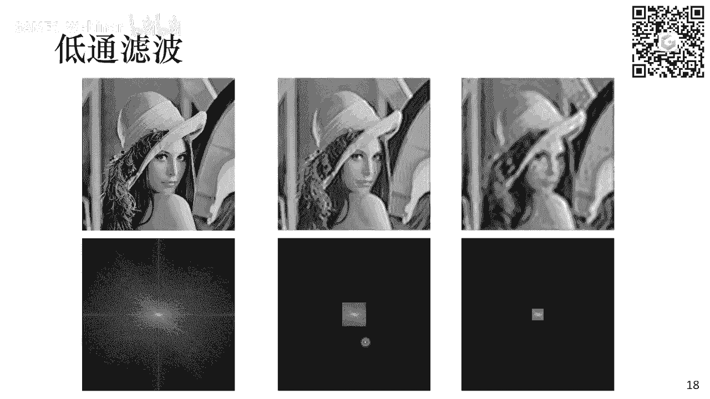
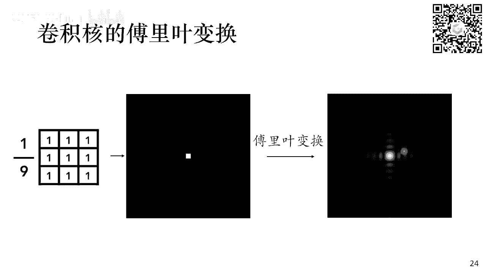
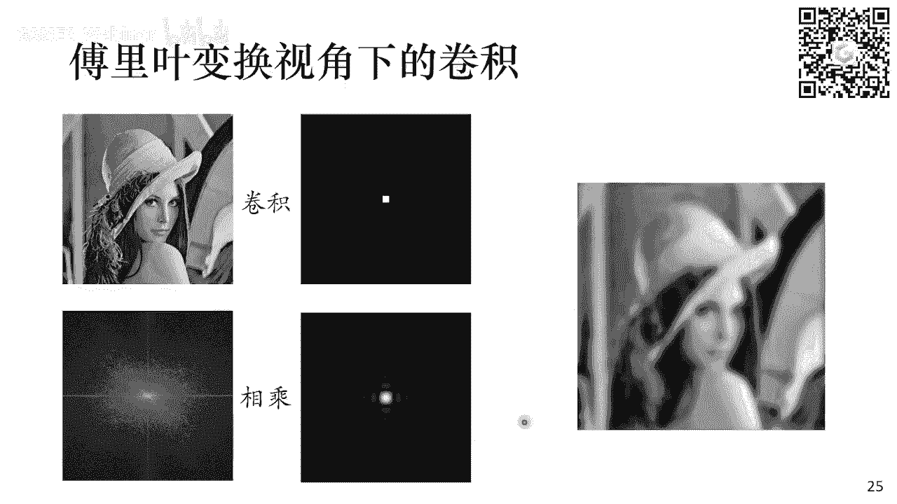
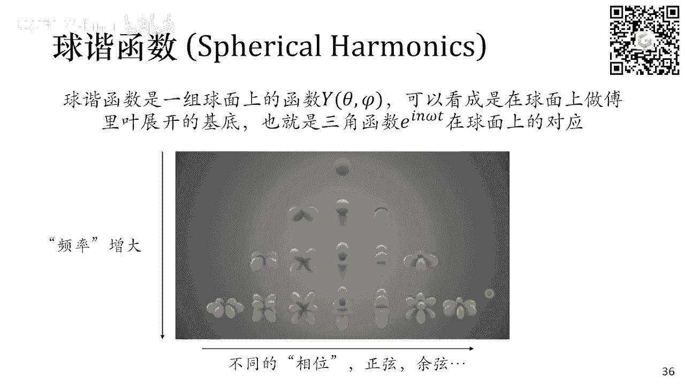
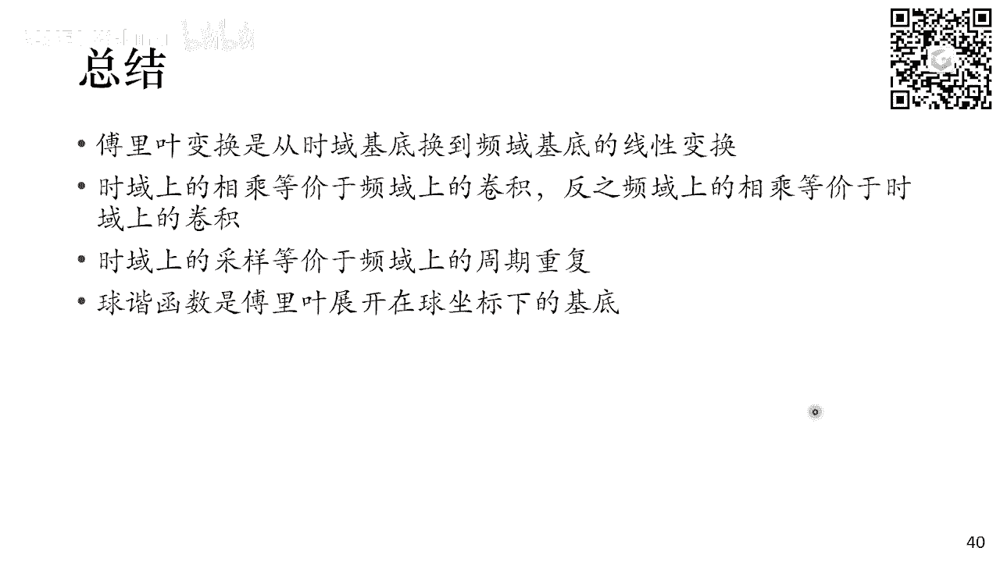

# GAMES001-图形学中的数学 - P7：傅里叶变换与球谐函数 - GAMES-Webinar - BV1MF4m1V7e3

看一下，OK现在是应该大家都能听到对。

然后首先抱歉，那个上一周因为自己的一些个人原因，所以上日工上一周没能按时上车啊，我们这一周其实是本来预定上一周的计划，是给大家介绍这个普遍化的内容，然后后来啊仔细想了一下，这招可能名字再取再直接一点。

其实主要介绍就是两部分的内容，一部分是关于这个傅立叶变换的，还有一部分是关于这个求解函数的，然后这两部分内容其实关联还是比较紧密的，然后同时也是在啊图形学中应用非常广泛的，呃两个东西。

所以我们今天就一起一起来介绍这部分的内容，OK然后呃傅立叶变换可能稍微有一点呃有点难，就是大家如果之前完全没有接触过的话，可能理解起来稍微有点复杂，我尽可能的给大家讲的这个呃就是更直观一些。

就是把一些数学推导都给大家忽略掉，然后大家看一个推导过程，然后如果对细节感兴趣的话，可以啊，之后再再自己去研究，OK那我们就先来看这个傅立叶变换，那讲数列变换，我们先讲这个傅立叶展开，它是什么意思呢。

假如我们有一个周期函数，比如说这里画了一个方波对吧，就是在零到它周期为T，比如说在0~2分之T的时候它取一，然后在0~2分之T到T的之间取一个故意，然后这样一直的啊，这样这样重复下去。

那么这样一个呃周期周期函数，或者说叫周期信号，它其实可以展开成下列一系列的这种正弦，余弦函数的叠加对吧，比如说我们这里画了一堆的正弦函数，然后呢啊这这些正弦函数呢，它的周期或者它的频率是逐渐增加的对吧。

这个正弦函数，它的频率跟原来的周期函数是一样的，它也是T分之一，然后呢后面这个正弦函数，它是这个频率是上一个的三倍，然后这个正弦函数T分之五，它频率是5/7，就是圆周原来的这个频率的五倍。

所以它都是一种倍频的关系，那么如果我把这样一系列正弦函数，都给它加起来，那么其实呢啊会存在某些呃一种这个正弦函数，它这个权重的，或者说他这个振幅的这个选择的一个方式，能够让这些正弦函数加起来。

能够恢复出最开始的这个方波的信号，我们可以从下面这张图来看，就是最开始的时候有一个红色的纯的正弦，正弦的一个一个函数，然后我在上面再加一些小的这个一个，一个平均之前三倍的一个正确来说。

他可能对应的就是根黄色的线，可能看的不是很清楚对，反正是一张黄褐色黄色的线，然后呢我再往里面加一些频率的部分呢，它就会变成这个绿色的线，然后我一直在往上加，比如说一直加到后面什么七倍频。

九倍平之后一直往下加，那么最后呢这个这一堆正弦函数的相加的结果，就会跟这个呃方波信号非常的接近，那么从这样一个方波信号，变成这一系列正弦或者余弦函数的这个加合的，这个过程就是傅立叶展开的过程对吧。

那我们就可以干点什么事呢，我可以把啊这一系列正弦函数或者余弦函数，它的这个振幅把它作为一个频率的啊函数，这个图画出来就会变成右边这个样子对吧，因为这个样子里面，横轴是我这些不同的正弦函数或者余弦函数。

它的这个频率，纵轴是它对应的这个振幅，那么随着频率增加，这些正弦函数呢，而且三角函数它的振幅是会下降的，然后右边这个图，如果你把对应的每一个啊频率，对应的振幅的这些三角函数给它加起来。

它就能够变成原来的这个原函数，所以这个过程就是这个傅立叶展开的过程，那么写成公式的话，它就会是这样一个样子，就是FT就是我们刚展示的，比如说那个方波的一个信号，它是一个周期函数，它的周期是T。

它可以写成后面这一系列，余弦函数和正弦函数的叠加，然后每一个函数前面它都会有一个系数，余弦函数前面是AN正确函数，前面是BN，AN和BN，可以通过下面这两个式子来给他求出来，这个式子我们就呃不正了。

就直接给给给大家，就是告诉大家说，如果你把这个后面这个积分求出来，那么求出来这个对应的系数，就是这个啊这个对应的三角函数，前面的这个系数对吧，然后呢，在这个VKPD上。

也有这样一个非常直观的一个动图来给大家看，就是假设我有跟这个红色这个周期信号，它其实是可以展开成一系列的，这些蓝色的正正弦函数或余弦函数，把它叠加起来，然后如果我把这一堆的啊三角函数。

它的这个频率和振幅的关系写出来的话，那么最后画出来，最后得到这个东西，就是我的傅立叶展开的这个结果，好吧，这就是复利展开，可能大家已经啊之前有接触到过，那么这个傅立叶展开呢，它也可以写成一个指数形式。

写成什么样的指数形式呢，就是啊，我们知道三角函数和这个啊E的IC塔之间，它们是有这样一个一个关系对吧，这是欧拉公式对E的ICA次方，A是这个虚数系数单位E的X次方等于cos theta。

加上A乘以sin theta，那么利用这个关系，我就可以把cos theta和3C塔写成，只包含E的C塔和E的负C塔，这两个指数的部分啊，这两个指数的组合对吧，就在这个地方，那我就可以把这两个式子。

把这两关系带入到上面的这个傅立叶展开式中，把它代入上代入上去，那么上面呢就会呃，就会出现一堆的这个E的C和E的E的IN，欧米伽T和E的负N欧米伽T对吧，那我就可以把它重新组合一下。

然后把E的ION欧米伽T提出来，和E的负I欧米伽T提出来，然后呢再给它写到一起，那就可以写成下面这个样子，左边这个样子FT它其实可以直接写成啊，不同的频率的这个E的IN，欧米伽T这样一个指数形式的加和。

然后这个指数形式，注意这里的N它是从负无穷取到正无穷对吧，因为我这个cos西塔和SA里面，同时有这个E的C塔的正整数和E的负X塔，这样的负指数，这个式子下面这个式子跟上面这个式子呢，它是啊。

我只不过做了一个变量替换对吧，我只是换了个形式而已，那同时呢这个指数形式前面的这个系数CN，它也会对应有一个更为简洁的一个呃，一个积分的形式，就是这个CN到底是怎么求出来的，它可以写成后面这个样子。

那这个时候对这里的CN它就不再是一个实数了，它是它就是一个复数了，并且呢它还有一个很好的性质，就是这个CN的实数部分，其实对应的是这个AN的部分，也就是cos西塔前面的这个指数。

然后它的复数部分或者虚数部分对应的是sin，西塔前面指数BN对吧，那么这个式子他是换了一种这个指数形式的，这个傅立叶展开式，它所反映的这个啊，这个本质的东西，还是没有脱离我们刚才给大家看的这个啊。

写成不同的三角函数求和的这个形式好吧，那么这样一个过程就是把一个周期函数展开成，很多个三角函数求和的这样一个过程对吧，它只适用于周期函数，那么如果我们要处理一般的函数FT的话。

那么我们可以认为一般的函数FT，它其实是一个周期为正无穷的周期函数对吧，他也是周期函数，只不过他的T是趋向了正无穷，那么我们是不是可以通过啊去泛化上面的式子，来得到一个一般函数的这个数列展开的形式呢。

那我们就可以观察观察一个地方，就是啊左边这个式子它是一个对于N的求和，而这个N和omega是乘在一起的，然后这个omega又是一个二派除以T对吧，它是一个关于T跟T是一个成反比的一个量。

那么如果你T趋向于正无穷的话，那欧米伽此时就会是一个无穷小对吧，那么这样一个无穷小针对无穷小量的求和，那如果大家就是对吧，我们学过微积分，那就可以观察得到说看比如说看下面这个式子，如果我要去乘啊。

需要去对一个N乘以，德尔塔X这样一个东西求和，然后德尔塔X是一个无穷小，然后N取到负无穷到正无穷，那么这个式子它其实等价于直接对FX进行积分，对吧，把很多个很多个无穷小进行求和，他最终得得到的结果。

其实就是对FX进行一个积分，所以在这个地方，这个求和其实在T趋向于正无穷之后呢，它就会变成一个积分的形式，并且呢它的上下限就会变成负无穷，也就会变成直接是负无穷和正无穷，所以我们对于非周期函数。

或者说一般函数，其实是可以通过这种啊去拓展周期函数的形式，把它变成啊我们能够处理的形式，那么这样得到的结果，这里也是直接给大家给出这个形式来，就是FT它会等于一个积分的形式。

那这个时候CN它就不再是一个数列，而是一个函数，我们可以把它写成是一个欧米伽的函数啊，注意这个地方这个欧米伽，下面这个欧米伽和上面这个欧米伽啊，这个是当时每每做P的时候没写好，就是他们俩是不一样的东西。

上面这个就是二派除以T，它是一个它是一个有些认为是常数二派除以T，但是底下我们应该是一个变量，OK这个这个是当时没注意到，不好意思啊，所以f ma对的就是CN对吧，那么CN右边这个积分是在欧米伽。

在T趋向正无穷之后，它也会有一个对应的一个极限的形式，它要变成二派分之一，然后后面这个积分的样子，那么最终得到了这个式子，FT和rf omega它们之间的关系，这两这222个等式反映的就是傅立叶变换。

我们可以从这个图里看出来，就是如果我有一个非周期的函数对吧，我这个周期啊，这个非周期函数呢，就是在二分之T到二分之T之间，取一个常数值A然后在其他所有地方都取零，这样一个非周期函数。

如果你把它啊对应的这个复列变换的结果，f ea给它画出来的话，它就会变成右边这个结果，然后右边这个结果呢它也是一个关于欧米伽，一个连续函数对吧，欧米伽其实就是我们刚才介绍的啊，这个不同的正弦函数。

余弦函数的这个频率对吧，只不过之前对于周期函数而言，你做的是傅立叶展开，它的这些频率值是离散的，但是在这个地方，因为你是一个非周期的函数，那么这个平均值它就是连续的。

所以大f ea之间得到是个连续的关系，OK这就是一个关于傅立叶变换的一个，基础的介绍呃，这个大家，大家有问题吗，奇函数是不是一定要跟我们家T，啊对傅立叶展开呢，它是一个它是一个把函数写成三角函数的。

一个展开的形式，所谓三角函数就是cos c大后和这个呃，呃sin theta，然后如果你把它写成指数形式之后，那么他得到的就是这个在这里对吧，写成指数形式之后得到的就是EIEICA。

所以呢它的奇函数就是EC塔，关于奇函数我们待会后面也会介绍，Ok，如果大家对于前面这部分，听得有些云里雾里的话，其实呃我们只要抓一个主干，就是首先是对于一个周期函数呃，周期为T的一个函数。

它可以写成一系列的三角函数的求和，然后这些三角函数呢，它的频率是原来这个函数的这个周期函数，频率的整倍数，那么它写成公式对应的就是这个图里的样子，一个周期函数FG，它可以写成一系列的这个正弦函数和。

余弦函数的求和，然后这些正弦函数，余弦函数的频率是原来这个呃周期函数的，它的频率的整倍数，所以是N乘以一个欧米伽，欧米伽等于二派除以T，也就是原来的这个周呃周期函数的它的频率，这是傅立叶展开。

那么傅立叶变换相对于傅立叶展开，唯一做的东西就是我假设对于一般的函数而言，它不是周期函数，但我可以认为它是周期为正，无穷的一个周期函数，所以我只需要对上面这个傅立叶展开的形式，再取一个极限。

我就可以得到一个呃，一个这个对于一般的函数而言，它的傅立叶展开，也就是傅立叶变换的这个结果，那么由于你啊假设了，原来这个函数F它是一个周期为正无穷的，一个周期为正无穷的一个一个周期函数。

那么也就是对应它的频率啊，F啊他自己的频率是一个无穷小，那么此时啊你对一个无穷小求这个整倍数的话，那么它的这个频率就会是一个，连续分布的一个结果，OK这就是关于傅立叶变换的一个基础介绍。

OK那么有了这个傅立叶变换的这个公式之后，那我们下面就来看一看这个傅立叶变换，它本质上反映的到底是一个什么样的东西，傅立叶变换，通过这样一个已对式子，然后告诉我们说。

FT它可以写成后面这样一个积分的一个结果，然后这个积分的结果，它是一个F大F欧米伽乘以E的I，欧米伽T的相乘积分的形式，然后后面E的IMIT，其实也就是一个三角函数对吧，前面f ea大。

f ea是对应三角函数前面的这个权重，那么FW在某种程度上，它是跟F是一个等价的存在，他们FW和FT描述的都是同一个函数，只不过他们呃使用的，我们可以认为使用的鸡是不一样的，这个具体是什么意思呢。

就是说，福利变换，他其实提供了另外一个去理解，原来函数FT的一个空间，这个空间称为频域FW，也就是对应在频域里的函数，如果我们用线性代数的思想去理解它对吧，我们先不看这个式子，我们先看右边的式子。

假设我们有任意一个向量X，我是可以把这个向量展开在一组机上对吧，比如说最常见的大家应该知道就是这个EI，我可以选择是这个笛卡尔坐标的啊，这个基数对吧，就是X方向，Y方向和Z方向。

然后前面这个AI对应的是X，分解到这个基础上的这个系数AI，那么换算到这个笛卡尔坐标里面，AI也就是这个向量X，他在XYZ3个轴上的分量，对吧，所以对于一个向量在线性代数里面。

我们可以使用这样的G的展开的形式，EI是我选择的一组基，X是一个任意的向量，那么前面这个AI就是对应这组基的，这个展开的系数对吧，那么左边这个式子，其实我们也是可以用一样的方法来理解它。

只不过现在我们的向量不再是一个，具体的一个向量，它变成一个抽象的向量，我们可以认为一个函数它也是一个向量对吧，这个给大家我们之前比如说我们讲到了这个啊，之前讲过这个什么流行的概念对吧。

流行它其实也就是一个抽象的几何对吧，我们这里假设FT呢它也是一个向量，这个向量可以在E的I欧米伽T，这组机上进行展开，然后他前面对应的这个展开系数就是大F1个，这个大家能理解吗。

然后唯一的不同就是呃右边，因为你的积是有限个的，所以我这地方做的是求和，但是我左边这个G呢E的I欧米伽t i omega，可以选择很多很多的值，可以从负无穷到正无穷，所以其实我是有无穷多个G的。

那么这个时候我就要做一个积分来代替求和，所以啊所以左边的这个式子，其实你完全可以把它理解成右边的这个式子，我们只不过是给这个FT选择了，另外一组基函数E的IO米伽T或者基向量，把它做线性展开，然后展开。

拿到展开的系数FW来代替原来的这个函数，所以我们其实在线性代数的概念里面，我们只做了一个啊，这个基含基向量或者基函数的一个替换，从什么一个什么东西替换到现在这个三角函数，OK那么有了这个概念之后。

那我们立马就会有一个问题，就是那么这个FT，它本来的这个奇函数到底是什么呢，对吧，FTFT我是一个能具体写出来它的值的东西，它不是一个抽象的向量，那么它本来的奇函数到底是什么。

那么这个东西为了讲明白这个概念，我们就必须引入一个一个东西，叫德尔塔函数或者叫狄拉克delta函数，这个函数呢它是一个非常奇怪的一个存在，你可以认为它是什么，它可以认为是一个一个本来一个一个一个啊。

一个比较平滑的函数，然后在零这个点上，它凸出来一个非常尖的尖，然后突到极限，导致了这个函数在其他的地方都取的是零，只在零这个点上，它取到了正无穷，然后呢虽然它是正无穷，但是呢整个德尔塔函数。

在整个负无穷到正无穷上的积分，也就是说把这个零这个点包含在内的这个积分，它结果是一，这是一个性质非常奇怪的一个函数，叫德尔塔函数，那么这个函数对于我们理解傅立叶变换，其实是非常关键的对吧。

我们先我们先不管这个的函数，它到底是怎么来的，我们就这么定义了对吧，呃比下T在其他地方取到零，然后在零只有这个零的地方有值，它是正无穷，然后同时呢这个函数它全空间的积分是一对吧。

我们假设我们确实有存在这样一个东西，然后同时呢德尔塔T减A，如果把它写成等下七点A的形式的话，那么这个尖呢它就不在T等于零这个点，那就在T等于A这个点T减A等于零的话，那就T等于A。

所以德尔塔T减A这个函数呢，它是在A点处的一个尖，那么如果我们定义了这个德塔函数之后呢，我们可以看下面这样一个积分，是它的结果到底是多少，对一个任意的函数F，我可以把它写成下面这样一个积分式，啊不不不。

对于任意一个函数，我们可以写出下面这样一个积分式啊，我们直接给出来，然后我们来推测这个积分式它等于多少，那我们观察这个积分式的形式，首先这地方成了一个德尔塔函数对吧。

德尔塔函数在大部分的地方都等于零对吧，所有在T不等于A的地方，或者说A不等于T的地方，那么这个结果它自然都是零，所以我就不需要管它，那么唯一需要管的是什么，唯一只需要管这个A在T的领域范围内。

我们来看这个积分结果是多少，那我们就可以得到下面这样一个关系，左边这样一个积分呢，它可以把它缩减到T的一个小的领域范围内，然后来只看它的结果，因为其他地方都是零，然后呢由于我限制在了这样一个T的领域内。

那么FA，我其实是可以把它扔到极限外面来对吧，因为我限制在T的领域内，然后FFA在T的领域内，它值一定最后去向是FT的，所以可以把FT区拿出来，FT拿出来之后，里面只剩下了一个关于表达函数的求和结果。

还有一个积分德拉函数的积分结果对吧，然后这个积分结果里面这个积分结果，因为德拉函数它只在呃T等于A的地方，它是取到正无穷的，并且它全空间积分是一，所以后面这个积分结果一定是一对吧。

所以呢这个积分式它其实就等于FT，OK所以我们啊，我们先不说这个这个积分是哪里来的，但我现在知道说这个积分是，他就直接等于F对吧，那我们可以把这个积分式给它拿出来，然后再仔细观察一下。

它会得到一个水平的结论呢，你会发现这个积分是，其实跟刚才的傅立叶展开的形式，它是非常像的对吧，它也是一个函数，FT它写成了前面那个系数，FA在后面后面乘以一个什么东西，在积分的一个形式对吧。

那如果你去对比，我们刚才介绍这样一个线性代数的，一个线性空间的一个思想，去理解这个积分式的话，那你就可以把它理解成这个德尔塔函数，德尔塔T减A，然后对于不同的A的选择，它其实是一组基。

然后每一个基向量它都是一个作为T的函数，前面的这个FA它只是对应的每一个基向量，德尔塔T减A前面的这个系数，线性组合的系数它是FA，这个答案能理解吗，所以就是如果我们把F写用的函数。

写成这样的积分式的话，那么就可以认为啊，这个FT它是在这个德尔塔函数，这个基下进行线性展开，前面的线性展开的系数是这个FA，那么这个地方有一个对的地方，就是这个系数函数哎，小FA对吧。

它其实就是这个函数本身，对吧我只是换了一下自变量而已，但它们的形状是一模一样的，那这个东西对应什么呢，其实你也可以借用这个三维空间来理解它，在三维空间中，其实我们是默认一个向量。

它可以拆分成这个啊三个坐标下的分量对吧，我可以把它投影到XYZ3个坐标轴上，然后拿它的分量，用这个VXVYVZ，这样一个3×1的一个向量，来指代这个向量本身对吧，这是大家已经默认的一个东西，一个向量。

一个三维空间中的向量，他当然可以写成一个3×1的矩阵，所以呢我很多时候大家也不需要去说，我这是在三维笛卡尔坐标系下的分解，而直接用这样一个3×1的矩阵，来代指这个向量对吧，那么对应到我们给出来这个等式。

其实它的呃他的情况是一样的，我们其实也是啊，在我们给出函数FT的时候，我们其实也是默认了，这个我们是在以德尔塔函数，以它作为，以这么一个奇怪的函数作为基的基础上来，他来给他做线性展开。

然后前面的这个线性展开的系数，用它来指代这个函数本身，所以你就会发现，这个FA其实和FT它是一样的，对吧，所以就是我们引入了一个比较奇怪的表达函数，但是最后发现的，如果你用线性代数的思想去理解他的话。

那么其实这个的函数它是一个，一个是我们被被我们忽略掉了，F函数FF这个函数本身呢，它的基，直接把这个函数写成了以德尔塔函数为基，向量的奇函数的一个线性展开的形式，然后把它的前面那个展开系数拿出来了。

所以这个时候我们回过头有这样的思想之后，再去看这个傅立叶展开，我们就会发现富列展开，他其实干的事情非常的直接，就是我做了一个G的一个替换对吧，对于同一个函数FT，我可以选择用不同的基函数或者基向量。

去给它做线性展开，然后在最开始没有傅立叶变换的时候，我默认的是使用这个德尔塔函数作为基，来展开这个F，而在有这个傅立叶变换之后呢，我其实是使用了这个三角函数E的I，欧米伽T次方。

把它作为这个奇函数去展开F，那么这个时候他前面对应的这个系数大f ea，它就是这个FT在频域，或者说在E的IMET这组基函数上，基向量下，它的展开系数，所以傅立叶变换其实就只是在函数的线性空间。

做了一下这样一个G的一个替换，OK这是其实呃呃我希望就是今天能够呃，就是呃就是帮助大家，就是最理解这个傅立叶变换的本质的一句话，就是说，其实傅立叶变换，它就是呃把函数换了一个基函数去做展开。

原来我们是默认是在DA函数下进行展开，然后现在呢是在这个三角函数的奇函数下，进行展开，那么有了这个思想之后呢，其实你会发现很多东西他就反而就更容易理解，好吧，然后大家如果呃这块还是不是特别清楚的话。

可以呃，那就那就必须得去再看一看其他的这些，那个更可能就是更深入的，更详细的，这个关于傅列变换以及复列展开，这些书籍和教程了，因为我们今天时间确实有限，能给大家做一个这种呃比较抽象的。

一个不涉及任何具体推导的一个呃，一个一个基本的描述了对吧，但是我今天最想给大家传达的，其实就是这一页PPT，就是说福利变化，它其实对应的是一个啊，奇函数的一个或者基向量的变换。

它其实是一个在函数空间的线性变换，OK那我们刚才讨论的都是这个连续情况对吧，那么在计算机里面，当然我们是处于这个离散情况是居多的，或者基本上都是离散的情况，那么离散下离散情况下。

它其实也是有对应的这个傅立叶展开的形，傅立叶变换的形式的对吧，然后它长的样子就是下面给出来这个样子，然后他跟上面这两个积分式其实也非常像对吧，都是呃E的I5米伽T。

现在变成了E的I2派除以N乘以K乘以P，然后这个N就是我最终这个离散化的，它的这个分辨率啊，离散化的这个resolution，就这其实就是分辨率对，然后呢所有这些本来是连续的正弦函数呢。

它都会变成这种离散的这种正弦函数，余弦函数对吧，比如下面这个图里面画的这一组，六个的样一个基，看到上面第一个basis one，它是一个函数函数，然后这个this is two呢。

它是一个比较频率比较低的一个，正弦或余弦函数，后面的频率慢慢变高，频率慢慢变高，然后他就会对应不同的频率，往上增加一些三角函数，那么它本质上就是在数学上，其实跟上面是没有任何本质区别的。

只是它的公式换了一下而已，这个地方也不给大家具体推了，那么关于离散傅立叶变化呢，其实有一个非常著名的一个算法，就是这个快速傅立叶算法，它是利用这个分支的思想，分治递归的思想来实现这个呃。

复叠叶变换的一个非常快的算法，对吧啊，并且呢它的应用非常的广泛，就是在任何你需要这个福利变换的时候，基本上现在实现的标准算法都是这个算法，然后甚至呢这个算法会把它实现在硬件里对吧。

比如说大家看到之前有有些什么，可能什么硬件加速的这个视频解压呀，或者什么之类的东西，它里面那个硬件芯片里可能就包含了这些，这个傅立叶专门的这个离散傅立叶的这个模块，但是关于这个算法本身的这些细节。

我这里就不介绍了，大家只要知道，如果今天去用这些啊福利变换的话，那么他啊你用到的算法。

大概率就是这个算法以及它的一些变种，OK那我们这里比如说看一个复列变换，一个非常经典的应用对吧，假如我们给出了一张图片，这个图片呢我可以看成是一个函数对吧，它有它是一个二维函数。

有X方向和Y2YY方向对，那如果我对这个函数进行离散傅立叶变换的话，可以到右边这张图，这张图就是这张图片对应的频谱，对啊，这张图呢横坐标就是在这个图片，横坐标下的这个频率对吧，中心是零。

然后往往两边是增加的，然后呢，纵坐标就是对应这个图的纵坐标的这个频率，所以右边这张图就是左边这张图，在进行离散数列变换之后，得到一个频谱的一个分布，那么有了这个频谱之后，我就可以干些什么事呢。

比如说我可以对这个频谱进行一个低通滤波，我可以直接把这个频谱外面的部分，高频的部分，离中心远的部分直接给它裁掉，只保留它中心附近的部分，然后把这个东西如果我再进行一次逆序列变换，把它变换出一张图片的话。

它就会得到上面这张图，那么你就会发现上面这张图呢，它其实还是对应的对吧，基本上就是对应原图的这个这个形状，说明了这个频谱里面的这些低频部分，它确实能够呃重构出来，整个图片的低频的信息对吧。

我们看到的形状它其实是一个非常低频的信息，但是呢所有的高频信息都没有了，那么高频信息对应着什么呢，就是这些图上的细节对吧，比如说这些毛，它这些颜色的这些高频的变换对吧，所以这些信息都被丢掉了。

那么这张图片看起来就是一张非常糊的图片，如果我进一步缩小这个保留的范围，那么这个图片呢它就会对吧，进一步变得模糊对吧，进一步缺少这些高频信息，那么这样一个思想，包括我们之前这个呃。

介绍了介绍过这个什么SVD对吧，它也会类似的性质，就是你保留这些啊低频部分的信息越多，那么这个图片就会越来越像原来的图片，那么我们可以通过只保留这个，前面或者是低频的这一部分的频率的分量。

对我只需要把这样一个小图存下来，就可以恢复出这个图的大部分的这些，低频的信息对吧，那么这个东西它其实也就是我们广泛使用的，这个图像压缩的一个核心算法，今天大家如果这一定会用到对吧，各种什么啊。

JPGJPG格式的这些图片，那么它里面的涉及到这些压缩算法，核心其实就是傅立叶变换的思想对吧，就是我通过拿到琴谱之后，得拿一个低低通滤波，然后只保留低频信息。

就可以实现对图像的一个压缩了，那反之如果我只保留这个图片的高频信息呢，我把中间的低频信息全都挖掉，然后只保留这个图片周围的高频信息的话，那么自然我就只得到这个图片，只保留下来这个图片的高频信息。

也是这些啊，边上的信息对吧，边上的信息都是高频的信息，所以呢，我可以用这样一种方法来做图片的边缘提取，打编曲有很多种方法对吧，这里只是介绍其中一种方法，就是你可以用傅立叶变换，然后把DP线扔掉。

那么你出来这些啊，高频信息就会对应到这个图片的边缘上，OK这就是关于父类变换基础部分的介绍，大家有什么问题吗，OK如果没有问题的话，那我们下面就接着讲这个卷积的概念。

卷积是一个跟复利变换密切相关的一个概念，所以这个地方在讲完数列变换之后，我们就可以来介绍一下卷积的知识，那么大家接触到的卷积可能是更多的，比如说从这个卷积神经网络对吧，就是因为应用非常广泛。

然后来点嘴道的，那么在这个这个意义下的卷积，在卷积神经网络意义下的卷积是什么东西呢，是说我有一个卷积核，比如说这个地方取了一个非常简单的，这样一个平均和，就是我有个3×3的矩阵，然后每个元素都是1/9。

然后呢，我用这个3×3的矩阵，去扫这个原来图像的每一个部分对吧，就是右边这个动图展示的，然后呢把这个3×3的矩阵乘到对应的，把它的对应图片的位置拿出来，然后相乘，然后相加得到一个值。

把它放到这个新的位置上来，把这个右边动图展示的结果，那么进行这样一个操作之后，比如说我们使用这样一个平均和，那么就会得到一个使原图像模糊的一个效果，OK这个就是大家最常接触到的卷积对吧。

那么如果我们要给卷积一个数学化的定义，或者说卷积本来最开始的定义是什么呢，它其实是写成这样一个样子，我们从我们还是以E为举例的话，就是有F和G两个函数，两个一维的函数，FG的卷积。

其实定义成右边这样一个积分的形式，这个积分的形式啊，我这地方可能PPT做的不是特别好，就是左边这个，就是这个积分它是一个关于套的积分，然后T是一个给定的一个常数，T是一个给定的常数。

然后右边这个积分是关于T的积分，然后这个积分积出来的结果就是F卷积上，G在T这个地方的值，所以左边少了一个括号T啊，不好意思，那么右边这个卷积的积的形式呢，就是这个积分里面的这个东西呢。

你会发现就是F它的自变量加上G的自变量，两个东西的加和等于七，然后对所有的这样的两个东西加和，等于T的这样自变量来进行积分，如果我们放到一个图里面，他反应是什么结果呢。

就是你会发现gt检套它作为套的函数呢，其实是G套，这个函数以二分之T为中点来做一个镜像，对吧，那么画到图里面就是FF套，我放在这一方不变，然后GT减套呢，它其实是G这个函数，它的镜像对吧。

那么T并且它是以二分之T为中点的镜像，那么T再从，就你去去这个计算不同T的值的时候，这个gt减套这个函数呢，它就会在这个横轴上进行滑动，四对吧，比如最开始的时候T在零这个位置。

然后现在的T可能在这个位置，然后T在这个位置啊，然后下面这个图就是在右边这个位置，所以T如果你去看它不同地方时，从零这个地方开始一直往右看的话，那么即T减套这个函数，它其实是会不断的往右平移的。

这个吧即T减套不断的往右平移，然后呢我再去计算这两个函数，它们重叠部分的这个积分对吧，把他们俩重叠在一起的，计算它重叠的部分，这个求这个相乘，然后再积分，那其实也就他们加起来对吧，我们看这个结果是多少。

那么这个过程就是一个卷积的过程，那么有这样的想法之后，你再去看右边这个动图，就是我们最开始介绍图片的卷积，那其实是跟这个形式是对应上的对吧，我们把卷积核给它做一个镜像对吧，对简介和就是这里的T啊。

就是这里的G，然后呢我的下面这张被卷积的图片就是F，然后我把卷积核做一个镜像，然后在这个图片上不断的滑动，然后计算它们重合的部分呃，乘起来加和是多少，那么这样一个过程反映的就是这样一个积分式。

所以这个卷积的严格的数学定义，和这个我们最开始这个形象的理解，它是一个对应上的，OK那有了这样一个卷积的定义之后呢，我们就可以直接给出来，卷积与傅立叶之间非常重要的一个关系，叫卷积定理。

他说的是两个函数卷积的傅立叶变换，是两个函数分别做傅立变换之后的乘积，那六二负列变化本身是可逆的，那我们就可以换句话说说是一个遇上的卷积，其实对应着另外一个域上的乘积对吧。

写成公式的话就是下面给出了两种情况，比如说F卷积上G这是两个时域上的函数，然后给它做复列变换之后，那么这个复列变换的结果其实应该是，F自己做复列变换，然后再乘上基本上做复列变换。

而F乘上G这个奇函数的几函数的，它的这个复列变化呢，他应该对应的是F这个函数本身的复利变化，卷积上G这个函数本身的傅里叶变换，所以为什么要引入卷积，就是其实是在这个地方，就是说我们如果在时域下进行操作。

比如说做进行乘法操作，它其实对应的是这个频率上的卷积，而在时域上进行卷积操作，其实对应的频域上的一个乘法。

我们可以通过两个例子来看这件事情，首先第一个例子，就是我们最开始给的这个图片卷积的，这样一个例子对吧，图片卷积用一个用一个平均的一个kernel，那么我们就可以把这个盒拿出来对吧。

放到这个呃这个实力空间里，把它画到这张图片里，然后把对它进行复制变换对吧，那这个时候这个这个小小的这样一个平均，和它对应的结果就会是右边这个结果，那这个结果就是，其实类似于给大家最开始展示的这个方波的。

也不是方波，一个呃一个方形的一个脉冲吧，它的这个复制变换的结果就是它的低频部分，依然它会有一个很强的低频部分在中心，然后同时呢它也会有非常高频的部分对吧，就是这边啊这边展示的结果。

因为我这边是一个非周期函数对吧，所以它应该是有很高的，有各个频率上的值，但是呢随着频率在增高，那么它的这个振幅是在衰减的，大家如果这个啊，比如说对什么衍射之类有有印象，有印象的话。

那么这个图像它其实对应的就是这个啊，这跟那个小孔衍射的那个，那个图像是非常相关的，它也会有一个中心的一个非常强，然后在周围会逐渐衰减的。

那么我在对图像，比如说这样一个图像，来进行这个平均和的一个卷积的过程，利用我们刚才介绍的这个卷积定理，他其实对应的是这个图像本身的情欲，和这个卷积核，它对应的这个数列变换函数，两个东西直接相乘对吧。

上面是时域，底下是景域，上面是卷积，下面是相乘，那么这样一个图像乘以这两个不像相乘，那么自然结果就是什么呢，就是它的中心的频率部分是会被保留的，而高频的部分大部分都是黑的嘛，高频雾霾是黑的。

是是也就是说它的权重是很小的，那你乘上之后呢，也就是说它高频部分的东西其实是被你扔掉了，所以这两个东西相乘，他得到了那个最终的那个频谱，就会看起来像我们刚才直接截断高频部分，拿到的频谱是一样的。

那么自然他也就会有这个模糊的效果，因为高频的部分被你拿掉了，只保留了低频的部分，OK所以这个就是，在傅立叶变换的视角，我们去看这样一个卷积的过程，你就会发现它其实对应的是频率的这样一个，相乘的结果。

那我们可以反过来看这个事情。

反过来看这事情就是采样对吧，我们刚才介绍的例子其实是情欲里面啊，食欲里面的卷积对应的频域里面相乘对吧，我们现在看一个采样过程，采样过程它其实可以看成十余里的乘法，为什么可以呢，我们可以定义一个新的函数。

叫这个狄拉克梳状函数，它其实是由一堆的，这个我们最开始介绍，我们刚才介绍的这个delta函数，狄拉克delta函数以周期为T的形式排列在一起，这样的这样的一个形式，这个周期啊这个狄拉克函数它有对吧。

他在呃它会有一个尖是正无穷，然后其他地方都是零，那么把这样一堆的狄拉克函数加合在一起，那么它其实对应的就是这样一个，每隔T分布的这样一个周期的狄拉克函数，然后它呢长得就会像一个梳子对吧。

所以我们叫它梳状函数，那么有这样一个梳状函数的定义之后呢，我就可以把采样过程看成是这样一个乘法过程，对吧，我对一个连续的函数FT进行采样，其实也就是把连续函数，FT乘以一个这样一个输入函数，为什么呢。

因为书中函数在这个地方，在它的这个加的地方它是有值的，在其他地方都是零，所以呢其他地方，其实中间的这些地方都被你丢掉了，只保留了这个加上这些值，所以它是一个采样的过程。

所以我们可以用这样的一个乘法过程来呃，来理解采样，采样的频率就是这个输入函数的，它的频率或者采样的周期，就是这个输出函数的周期，那么既然采样可以看成一个呃，时域内的乘法过程，那我们自然就会想到。

它应该是对应到傅立叶的瓶子呃，这个通过复利的变化之后，它会变成一个平面里的卷积过程，那么那我们首先就要解决一个问题，就是这个树状函数它的复制变换是什么呢，对我们需要求这个事情对吧。

那我们可以既然出状函数是周期函数，我们就可以先求它的复列级数对吧，我们代入最开始介绍那个福利级数的，那个公式CN，它会写成后面这个结果对吧，那么这个地方注意到，因为这个CT。

我的积分是从二分之T到二分之T的，而这个CT这个函数呢它是一个数字对吧，那么在二分之T的72之间，它只在零这个地方有值，只是正无穷对吧，那我们联系到啊，然后并且呢这个标准函数，它的这个啊全空间积分是一。

那么自然呢这个积分的结果，后面这个积分的结果，它就应该等于这个EI这坨东西，然后T取零它的结果对吧，这个我们积分这个积分形式的积分，我们刚才推过一遍了对吧，所以我们可以直接得到CN等于T分之一。

因为后面这个积分等于一，这个是用德尔塔函数本身的性质来定义出来的，那么CN是一的话，我就可以把T写成这样一个，浮列级数求和的形式，对吧，这个东西就是呃初中函数，它本身的这个复列级数。

然后呢它只有离散的频率分量对吧，因为它是周期函数，这个周期呢啊这啊，然后后面这个离散的频率都是二派除以T的整，倍数对吧，但这个东西它是傅立叶级数对吧，他不是傅立叶积分，或者说傅立叶变换对吧。

那么怎么把这样一个求和变成积分呢，那么就会又重新利用到输入函数，因为梳状函数它是这样一个周期的脉冲的形式，所以左边这样一个离散的，每隔二派除以T的这样一个求和的形式。

它其实可以被写成后面这样一个梳状函数，在里面的积分的形式，只不过这个地方的梳状函数，他现在是一个欧米伽的函数，并且呢它的这个周期是二派除以T，那么这个等式为什么成立呢，大家可以自己下去去啊。

把它展开来推一推，看一看对吧，你形象来理解，就是说啊因为我这地方有很多个德尔塔脉冲，所以这个积分积出来，结果呢他就会取到这个啊脉冲地方的值对吧，所以整个积分就会变成一个周期性的求和，那么这个是这个样子。

这个式子它对应的其实就是我们最终想要的，这个梳状函数的这个傅立叶变换的形式对吧，它完美符合傅立叶变换的形式，以积分的形式对吧，并且我们立马就得到这个原来的这个呃，周期为T的这个时域上的树状函数。

它的复利变化，其实对应的是一个在频域上，周期为二派除以T的这样一个梳状函数，对吧，所以中号函数有一个非常有意思的性质，就是说呃它的复利变换就是状函数的傅列变换，其实还是一个树状平树状函数。

只不过呢它的周期是取导数关系对吧，你在时域里面的周期是T，就是每隔T选择一个点，那么在频域里面，它对应的这个傅立叶变换之后的，这个频谱函数呢，它是每隔二派除以T选择一个点，对吧好。

那么这里就拿到了这个梳状函数，它的这个傅立叶变换的形式，那么就可以利用刚才的卷积定理，来思考这样一个问题，我们刚刚说采样它是一个时域上的相乘的过程，那么在傅立叶变换之后呢。

它其实就对应着频率上的一个卷积的过程，那么FW是我最开始那个函数原函数的，它的一个啊它的一个分列变化之后的结果，然后呢，这个出状函数它的数列变换结果我们还推出来，还是一个树状函数对吧。

那么一个函数卷积上树状函数，它的结果是多少呢，我们可以也来推一下，就是我先只推一个，假设只有一个德尔塔函数的话，如果有这样一个德尔塔欧米伽减去欧米伽一撇，这样一个形式的德尔塔函数的话。

我们只关注这个输出函数的一个间，然后看这个卷积的结构有多少能把它拿出来，乘以德尔塔，我们应该减去A减去A乘以DA对吧，我对A进行积分，然后保证呢，F里面的自变量和德尔塔里面的自变量加起来，等于这个啊。

等于我们应该减去我们加一撇对吧，没问题，那么那么这个结果他呃它结果是多少，他应该是，因为德尔塔函数只会在这个后面取到零，他括号里面取到零的时候才会有值对吧，所以这个结果拿到了。

结果就是F在欧米伽减去欧米伽一撇，这个点上的值对吧，这是一个非常自然的一个结果，所以啊，所以当你把F这个函数卷积上一个点函数之后，其实你是把这个F把它换到了这个，我们应该减去我们按一撇这个点。

那么欧米伽减去欧米伽撇这个点，其实就是把fw l f ea，这个函数平移到了欧米伽一撇，所以你把F卷积上的函数其实什么都没做，就把它做一下平移，那么一个data函数是平移一次。

那么fw f ea卷积上整个的输出函数呢，就是把它平移很多很多次，然后因为梳状函数它的间隔是二派除以T，所以其实这个卷积的结果就是，把F欧米伽这个函数，以每隔二派除以T的这个周期频率啊。

这个周期给它复制一份，然后再叠加就把它清理了很多很多份，那么这个东西得到的结果就是，最后我采样的结果，采样的结果得到了这个采样频率，结果对应的那个呃频谱对吧，我们可以用这样一张图来来看整个过程对吧。

假设我有一个任意的函数F它的这个频率，它的频谱对应的是右边这个图，然后呢我对它进行采样对吧，我是给他成了一个出装函数，那么这个数量函数它的父类变化呢，对应的也是一个数量函数。

只不过他的这个周期是取导数的，然后采样对应的这个时域里的相乘关系，所以是原来这个函数乘以上，这个树状函数对应的是采样，那么这个东西在频率来看的话，就是上面这个函数它们自己的频谱卷积上。

这个输入函数的频谱，两个东西一卷积，那么得到的结果就是我刚才推出来了，对吧，就是把这个函数给它重复很多很多份，然后他们这个重复的这个间隔，就是这个上面这个书中函数，它的在频谱上的这个间隔对吧。

所以最终你对一个函数进行采样，它得到了这个频谱，就是右边这样一个结果，那么右边这样一个结果，告诉了我们一个什么东西呢，告诉我们说，如果你的这个采样的频率太低了，那就是说你重复的这个函数的。

这个重复的这个间隔太小了，那么这个函数就会产生交叠，产生交集的结果就是这个函数本身的，它的这个频谱的形状被你破坏了，在中间加上了这样一些叠加起来，这样一些不应该叠加的结果。

那么这个时候发生的事情也就是走样的问题，就是说你采样的频率太低了，你这个时候呢，整个东西它已经不像原来的东西了，而当你采样的频率够的时候，理论上来讲你的采样频率够了，那么。

这个它就能够保证你的这个原来函数的，这些频谱它是没有发生交叠的，它是能够被完整的保存下来的，那么这个时候这个采样，它就是一个好的采样对吧，那么这个时候这一部分就是大家去呃学习。

比如说games101里面介绍这个呃，关于这个走样和反走样部分的知识对吧，如果我要进行反走样的话，我就要给他增加这个采样的频率，来使它的这个原函数本身的频谱不发生交点，对吧。

所以这个就是啊利用这个卷积这个概念，利用卷积与傅立叶变换之间的特殊关系，我们可以得到的一些分析上的结果，OK关于这部分大家有问题吗，然后这就是这部分的公式，大家应该是我们会布置作业。

就说大家是啊可以把这个东西自己再推一下，就是啊整个过程呢它也不是难，他就是说你需要去自己手动推一遍之后，才能理解它里面的这些啊具体细节，然后你就会明白说啊，这个采样这个过程在频率到底发生了什么对吧。

对采样定理的两倍频率，就是这样推导是没有问题，就是从这里来的，Ok，行那我们介绍了这个复列变换以及采样卷积啊，不是采不是采样卷积的知识，之后我们最后来看一下这个球切函数的部分，再来再来再。

那为什么就是求函数，它到底是个什么样的东西呢，就是为什么要把它放到跟傅立叶变换，一起来讲呢，就是我们首先来介绍一下这个求解函数，它到底是个什么东西对吧，那么介绍球队函数，我们就不得不介绍这个求坐标对吧。

正常的三维空间的坐标呢，大家熟悉的是这个笛卡尔坐标系，就是用XYZ去标定一个点对吧，但是呢我们可以用另外一个坐标系，就是这个球坐标用另外三个变量来描述一个点，就是phi theta和R两个角度。

一个长度，两个角度标定了这个射线方向，在球上的哪一点对吧，沿哪个方向，然后呢这个半径R标定了你射出去多远，所以fc tr这三个变量呢，同样也能唯一的确定这个空间中的任意一个点。

那么在求作为什么要引入球坐标呢，是因为在图形学里面有很多的东西，尤其是渲染它是跟这个角度，跟球球坐标密切相关的，比如说环境球，环境球就是我用了一个大家可以想象，就是在一个以你为中心去呃，去一个建一个球。

把你包围起来，然后你去看你沿着这个球上，然后你去看你每个方向上看到什么东西，然后把它记录到这个球上，你会得到这样一个环境球，它记录了你周围的环境信息，那么你用这个球就可以把它用到渲染里面去。

模拟整个的啊周围的环境的光照对吧，那这个时候呢，这个环境球，你就可以把它写成是一个关于求使用，求坐标来描述的函数对吧，主要是两个角度，一个C它一个F，然后呢球上每个点对应一个theta和phi。

然后它对应的这个颜色，比如说光照的颜色或者强度，就是这个我要啊，我要表示这个函数F，以及上这个我们在做这个shading的时候，你们会涉及到这个反射分布函数，那么你就要考察这个材料的表面上。

他在这个沿不同的方向进行反射的时候，它这个反射的这个系数是多大对吧，那么这个系数呢同样可以写成这样一个啊，关于角度的函数关系对吧，所以使用球坐标，你可以描述很多图形学中比较重要的概念。

那么引入了求坐标之后呢，求解函数是什么东西，这时候就有一个可怕的式子冒出来了，这个式子呢，大家可以不管里面的这些具体细节是什么对吧，你可以把它分成三部分，第一部分是一个常数对吧。

L和M是L和M是两个整数，L可以从零取到呃，取到正无穷M可以从二分之L取到12，还是负L取到L应该是负L取到2L不好意思，负L取到负L7大R，那么那么前面这部分呢它就是一个常数，你可以不用管它。

然后中间的这个这一部分它只跟C它有关，这个东西叫它是一个多项式，这个PLN它叫这个伴随，勒让德多项式的阶数是L对吧，这是一个L阶的多项式，你只需要知道这个就可以了，然后他的呃这个未知数呢是这个呃自变量。

自变量是cos theta是吧，你就把cos theta带进去，他就写成一个关于cos theta多项式对，比如说什么cos theta的平方减去cos theta，加上一这样的多项式对吧。

然后它的接触是L，然后最后一项E的INF次方，就是关于F的三角函数对吧，只不过它里面指数有个FI，所以什么cos m fi加上I乘以SMF对吧，所以啊这个可怕的式子，其实就是三部分乘起来的结果。

然后乘起来这个东西，我们就把它叫成这个求解函数，我们可以把这个这东西可视化出来，怎么可视化呢，就是我啊让这个C大Y方向射出一条射线，然后它这个射线的长度，就是这个啊求解函数的结果。

那这样的话我就可以把这个多项式，把整个函数它可视化出来，可视化出来，就是下面这一组图，从上到下呢是这个L增加的过程，L从零增加到这个正无穷，然后从左到右是M增大的过程，M从负L增大到L。

然后每一个L和M对应的取值，比如说固定到中间的某个点，它对应的出来就是这样一个图像，三维空间中的一个图像，它反映的就是这个Y啊，这个这个求解函数在这个L和M取值下，它的这个函数图像，对吧。

那你主观上你可以看到一个什么样的规律，就是随着L增大，这些倍数在变多对吧，然后取零的时候，他就是一个平均的一个球，代表就是这个球上平均的一个场，然后呢比如LH1的时候，它就会有正有负。

就是有一部分是正的，一部分是负的，啊有有有有一半是正的，有一半是负的对吧，只不过它的朝向是不一样的，然后再增大了，就可能什么有1/4是正的，有1/4是负的，今天是一个什么样的连续变化的一个过程对吧。

所以这个就是所有求解函数的可视化，这个式子呢大家也可以啊，不需要去关注它的细节，你只要去啊指导它，是一个很多的这样一个多项式就可以了啊，很多的这样一个不同的这个，球面上的函数就可以了，那么。

怎么去理解求解函数呢，其实大家可以直接把它理解成求解函数，就是一组球面上的函数，它对应的是在以呃，在这个笛卡尔平直空间里面的，这个三角函数的对应对吧，我们讲三角函数E的IN欧米伽T次方。

它其实是也会有很多很多的函数对吧，然后并且呢它会有频率对吧，就是随着你频率的增加呢，这组函数的它的这个变化震荡会越来越明显，然后同时它有不同的相位，比如说有正弦有余弦对吧，那反映到这个图里面。

对求解函数是一样来说是一样的，从上到下，随着你L增大，它的半数增多了啊，其实也就是对应的它的频率增大了，从左到右它这个半的分布是不一样的，那其实就对应着啊这些啊，这些函数它的这个相位是不一样的。

所以这一堆的球形函数，其实你完全可以把它对应到这个三角函数上来。

OK那么对应到三角函数上来之后呢，既然三角函数可以被用来做副叶级数展开，那么求弦函数，它就可以用来表示球面上的函数的展开对吧，比如我们这里直接给出这个公式来，就是啊，任意一个球面上的函数。

FC大F它可以写成一系列的这个求解函数的，这个加权求和对吧，前面的系数是CON，然后这个CON可以通过下面这个式子，来求出来，对吧，那么这个式子它就可以一一对应到这个，我们刚才介绍这个复列级数上来对吧。

就是你的，你复列级数里面用的是这个正三角函数，我这里用的就是求解函数，复列级数里面用的是这样一个求和的形式，我这地方用的也是一个求和的形式，OK吧，那么同样的我也可以通过控制，比如说我用用啊。

只用零阶和一阶的，或者零阶和三阶的啊，就说是不是什么三阶以下的核心函数，来表示这个原函数，或者说四阶以下的求解函数来表示原函数，我就可以得到不同的这个频率意义下的，关于F这个函数的近似对吧。

比如USTO下面这个图里画的一样啊，左边是一几个，比如说三个比较奇怪的一些球面上的函数，可视化方法还是一样的对吧，就是我啊沿某一个角度嗯，沿某个角度设一条射线出来。

这个射线的长度对应的就是这个FC它的值啊，FC大F的值对吧，所以FC大F会有这样，比如说这里面画了三个比较奇怪的函数，那么它就可以用右边的这些球线函数来做近似，得到这样的结果对吧。

如果我只用L小于等于零的，也就是只用频率最低的求解函数的话，那它就是一个平均的结果对吧，然后随着我增大，比如说我使用了这个四阶以下的这些球形函数，那么这个时候他就会有一些这个对称的，一些东西出现对吧。

能够看看出来，跟最开始这个图像它有点像了对吧，然后我进一步增加这个求解函数的频率，呃，我就可以得到更加接近这个最开始这个呃，这个函数图像的这样一些结果对吧，那么这个东西就是这个不同的啊。

频率上限下频率上限啊，频频率上限下的这个求解函数的展开对吧，他其实你可以直接把它理解成就是啊，不同频率上限下的这个福利叶级数的展开对吧，只不过一个是在这个啊异维空间，或者是笛卡尔坐标系下的平直空间里。

一个是在这个球坐标的这个空间里，就是他们唯一的区别。

那么利用这个东西我就可以做一些，比如说跟这个呃图像一样对吧，图像我可以用复列展开来进行做压缩对吧，那比如说那个环境球，我也可以使用这个啊，求解函数的展开来进行压缩对吧，第一步。

比如说我这地方画了一个很复杂的一个环境球，这样我们就把它这个用q map的形式给他展开，对，你可以看到里面有非常多的细节，它是一个非常复杂的室内，但是如果我只用一些低阶的这些求解函数，来表示它的话。

它就会得到一个非常光滑的结果，但这个光环结果呢，它大体上呢它是符合原来图像的，原来球的分布的，所以呢但是呢它的储存的开销就会小非常多，对吧，我只需要存几个系数，就可以存几个权重就可以了。

这个权重的开销是非常小的，那么这个东西就可以被用来做一些渲染的，加速也好啊，或者储存上的优化也好，都可以用来做对吧，比如说我只需要做一个非常模糊的一个环境，光的话。

那其实没必要用这么高分辨率的环球的贴图，只要用到后最后这个结果就可以了对吧，所以这个就是啊求新函数，它的作用。

那么求解函数它和傅立叶展开，其实是有更深层次的关系的，就我这地方只是给大家，就是如果大家对这个东西感兴趣的话，你可以去再去研究一下，比如说它的关系在哪呢，比如说对于一个算子，拉普拉斯算子。

他写成的样子就是这样一个样子，比如三维空间中拉普拉斯算子拉姆达平方F，它对应的是F在X方向求二阶导，加上F对Y求二阶导，加上F对Z方向求二阶导，然后再加起来对吧，它会出现在很多很多的地方对吧。

什么泊松方程呀，然后后面一些什么各种各样的东西，然后播放城里面都会有他的身影对吧，那么怎么说，傅立叶展开，它的奇函数是E的I5米伽X次方吧，它是一个三角函数，那么这个三角函数呢其实是这个拉普拉斯算子。

它的特征向量，如果你把这个拉普拉斯算子，理解成是一个线性变换的话，那么你就会发现这个一为负，离两开的奇函数，是一维拉普拉斯算子的一个特征向量对吧，E的IM2的次方，然后你给他求二阶导。

求出来就是负我们A的平方，E的IMAX次方对吧，它就变成了一个就是ax等于拉姆达X，所以X是前面这个线性算子的，它的一个特征向量，而球形函数呢是什么呢，它其实是球坐标下拉普拉斯算子的特征向量，求坐标系。

因为它是个曲线坐标系，所以它的拉普拉斯算子会长成下面这个样子，然后下面这个样子你去求它的特征向量的话，你就会得到这个呃，我们刚才给出那个特别恐怖的这样一个呃，求解函数的那个展开的形式。

这个也是求解函数它从哪个地方推出来的，就是从这个地方推出来的对吧，所以复列展开和这个求解函数，它们之间是其实是有这样一个桥梁对吧，这个只是给大家一个呃，一个一个一个算是抛砖引玉吧。

对就是大家如果有兴趣的话，可以进一步了解他嗯，还是挺有意思的，OK所以说关于这个求解函数的部分，其实最希望大家核心的去理解的东西，就是说求解函数它到底是什么。

你把它理解成一个求做boss的数列变换就可以了，Ok，那么这个就是我们今天呃，讲复列变换和修理函数，整个内容其实总结起来的话，最希望大家就是呃最希望大家记住这三个东西，四个东西就是这四句话对吧。

有这四句话之后，大家如果呃觉得今天还是没有太听懂的话，可以去呃再去学，深入学习下知识部分的知识对吧，然后也可以就是之后如果到哪个地方，比如说啊学到什么东西之后忘了，或者说不记得这部分的内容的话。

也可以回来再看一看，然后再去再去学习一下，那么这四句话其实我觉得是比较，今天我想传达的几个核心的观点，第一个是说副列变换到底是什么，副列变换，其实它就是啊从值域的一个基底，换到频域下基地的一个线性变换。

他没有做额外的东西，他只是做了一个基底的一个替换，来得到不同的这个展开系数，然后第二点是说你换了这样一个基底之后呢，卷积这个操作它会变成非常的呃，这个乘积和卷积的关系会变得非常的，这个有意思。

时域上的相乘等价于频域上的卷积，频域上的相乘等于大于时域上的卷积，所以他们之间是这样一个关系，那么有这样一个关系之后，你可以推出来水域上的采样，它其实等价于一个函数和这个梳状函数的相乘。

那么它也就对应着频率上，这个函数和梳状函数做卷积，结果也就是这个P在这个函数在它的频谱，在这个频率上进行周期性的重复对吧，然后最后的图形函数是什么，求和函数，你可以认为是一个在球坐标下的这个傅立叶展。

开对吧，它可以用来做这个啊，类似的在球队包下去做类似的事情，Ok，行那这个就是今天想给大家介绍的一些知识，对大家有问题的话可以问，所以求解函数的不同阶也会是正交的啊，是的，求根函数。

所有的这个所有这些函数都是相互正交的，所以我们才有这个展开的，这个就是这个系数到底是怎么求的，这样一个关系，问一下粗糙度为零的BRDF，跟德尔塔函数的关系，我靠这点超出我的知识范围了，这个有点太。

这个就是渲染部分的这个专门的知识了，所以这个我不是很清楚，那如果没有其他的问题的话，那我就下播了，谢谢大家。

