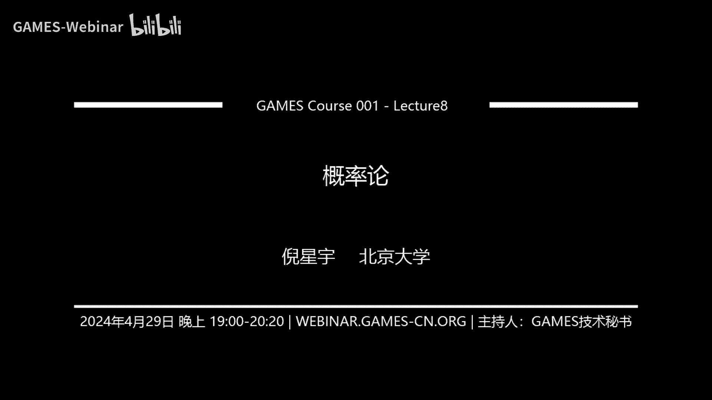

# GAMES001-图形学中的数学 - P8：概率论（一） - GAMES-Webinar - BV1MF4m1V7e3

好的好的，然后今天又又见面了，我们阔别了一个多月，然后之前都是另一位师兄，然后今天是五一假期前的最后一堂课，然后事实上就是北大已经进入到假期模式呃，但是全国的公立的，所以我们今天还是正常上课呃。

然后假期之前呢，我们就来讲一些这个相对来说比较轻松的话题，因为我们之前的几堂课，可能大家就是因为讲的内容比较深嘛，然后可能大家会显得有一点呃难弄明白，没关系，我们今天会讲一些比较简单的话题啊。

就是这个概率论呃，然后概率论呢，我们按照原来就是大家也能在推送上看到的，课程计划是分为两个课时啊，今天的第一个课时呢，我们就是回顾一下概率论的最基础的内容呃，因为概率论在各个学校的课程当中。

应该是大二的，大二的一，大二下学期的这样一门课程，然后对于大一的同学来说，可能还没有上嗯，然后呃对于大三大四的同学，如果觉得概率论已经掌握的比较扎实了的话，今天的这堂课是可以啊。

skip我们下一堂课会呃，详细的去讲概率论在图形学中的应用，然后今天呢我们还是主要是去回顾这个概率论，最基础的知识呃，这是今天我们这个课程大体的安排，然后内容比较简单，我们争取在一个小时内结束呃。

首先呢话不多说，我们就开始今天的课程嗯，在就是本科教育里面，一般的我们说的概率论，其实各个学校会把它安排成，就是概率和统计这两个部分，然后可能会合在一起上，就叫概率统计，对于图形学来说。

其实绝大部分应用更关键的是概率部分，而不是统计部分，当然如果你要做一些这个数据大数据方面的呃，比如说基于数据的机器学习这方面，你可能会用到统计这样的内容，而概率呢对cg来说要明显的更加重要一些。

因为有很多算法是基于这个概率论，相关的知识的，因此我们在这个图形学中的数学这一门课当中，我们会把概率部分放在之前来讲，然后统计部分会在后面需要用到的时候，比如说我们之后会有两节课去讲机器学习。

在那个时候如果有用到统计学的知识，我们会在那个地方进行补充，然后这次课和下一次课，我们都会聚焦在概率这个这这1part上，首先我们来看到底什么是概率，其实概率这个概念是来自于频率的。

而频率就是说如果我们有一个实验，什么叫实验呢，我们就把它理解成这个抛硬币，对我们可以把a pm写啊，没关系，我们可以选质硬笔，就是呃在相同的条件下，我们我们在制硬币，然后这NN次在这N次当中。

事件A我们可以把这里的事件A就理解为，这个硬币正面朝上，事件A发生了N次，就是正面朝上发生了N次，那么这个时候我们说比值就是N次，抛硬币的过程当中，NA次正面朝上，用NA比A称为正面朝上发生的频率。

然后我们把这个东西记作FNA，那么显然因为你的NNA既不可能小于零，也不可能大于N，所以频率是落在零一之间内的一个实数，并且呢，如果我们不仅去计算这个正面朝上的频率，同时去计算这个反面朝上的频率。

那么一个叫FA，一个叫FNB，那如果抛硬币呃，有一面向上，它的频率其实就是正面向上的频率，加上地面向上的平，那么这个就是频率，频率是与和我们的实验相关的，我们每一次在做这个实验的时候。

都会产生出一个某一个事件发生的频率出来，有了频率以后，我们来看概率是什么，概率是说如果还是这个随机试验，这个随机试验的这里我们记这个随机试验叫E，因为它就是experiment这个单词的开头的字母。

然后S是其样本空间，什么叫样本空间，就是这个随机试验可能产生的结果，对于E的每一个事件A我们为它赋予一个实数，叫他pa那么这个实数pa就是这个事件A的概率，那当然不是说我们随便给他一个数pa。

这个概率它都是有意义的，但是如果你想定义一个东西，让它看起来像概率，那么它只需要满足以下三条性质，也就是非负性，规范性和可列可加性，什么叫非负性呢，那就是说这个概率这东西它是不能是负的，什么叫规范性呢。

就是它是落在零一之间的，什么叫可列可加性呢，就跟上面这个一样，就是说如果有若干个不同的事件，每个事件都有一个概率，然后这些事件之间是互相不相容的，那么他们的总概率等于这些概率相加之和。

就是比如说正面向上概率是pa，背面向上概率是PB，那么这两个事件不可能同时发生，所以我们说要么就是正面或背面，这概率就得是pa加PB，并且我们认为一个概率如果说它是有意义的，我们要让要让他满足这条性质。

就是说当我们在进行做试验的时候，如果这个试验的次数趋向于无穷大的话，它的频率会趋向于这个P，它的频率FN会趋向于这个P，此时我们定义了这个P它就是有意义的，这个时候，这个P才能反映出。

我们所理解的这个概率的含义，那么在概率当中呢，我们先看一种最简单的这个概率的情类型，我们叫它古典概型，古典概型它其实有一个更加通俗易懂的名字，就叫等可能概型，很可能是这里的关键词。

他是说这个实验的样本呢只包含有限个元素，并且试验中，每个基本事件发生的可能性都是相同的，比如说我们刚刚说的抛硬币，抛硬币的样本中，它只包含两种基本事件，就是正面向上和背面向上这两种对吧，一个是正的。

一个是背，当然你可能会杠说我们能不能这个侧边向上，我们就不考虑这种情况，认为这种不可能，并且诶我们看从这个物理空间的对称性上来说，正面和背面朝上看起来应该是等可能的，所以因为我们知道。

这个必然发生的事件的概率为一，然后它有两种可能，所以每一种可能性的概率都是1/2，类似的，我们去看值投资，只投资的可能性是1234564，四种不同的点数，并且我们看对于。

因为投资一般都是一个完美的立方体，对于一个立方体来说，哪一面朝上看起来它的概率也应该是相等的，所以因为必然事件发生的概率是一，它的基本事件数是六，所以每一面朝上的概率都是1/6，那么对于古典概型来说。

它的总结一下，就是如果这个事件有K个基本事件，那么pa取A包含的基本事件数，除以基本事件的总数，比如说我去投两个这个硬币，然后我想说这两个硬币都朝上的概率，去求这两硬币都朝上的概率是什么。

那么显然两个硬币的可能性只有什么呀，只有正正正反反正反反，所以都朝上的概率就是四种可能性中的一种，也就是1/4，这就是古典概型，古典概型是可以，古典概型和排列组合是息息相关的。

就我们总是可以通过排列组合的方式去呃，计算某一种事件发生的概率，你可以看一下一些简单的例子，比如说，如果人出生在星期一，到星期日的概率都是相等的，那么出生在工作日的概率是多少。

我们知道从星期一到星期日有七天，然后工作日有五天，所以出生在工作日的概率就是5/7，那么出生在周末的概率呢，因为要不是工作日，就是周末，所以出生在周末的概率就是1-7分之五，等于2/7，而稍微强化一下。

在N件产品中有D件次品，然后从中任取小N件产品，恰好有K件次品的概率是多少，那这个事情也是一样的，我们可以用排列组合的方式去列举说，首先我们去决定这N件当中的K件次品，分别是分别是在分别是哪K键对吧。

那我们就会产生一个CNK，然后这个SNK的K键里面又有这个呃，就是又因为总量也有D件次品，我们还要在总共D件次品里面去选个小配件，然后我们还要对这个K件次品做一次排列，应该是长这样的。

然后再去除以它总共发生的可能性数，总共发生的可能性就是从，N件产品里选出N键，对他大概大概就是这样一个过程，我们可以去计算，从小文件里选小插好多小配件视频的概率，然后呃还有一个经典的。

经典的可能大家小时候就接触到过的一个事情，就是说一个班上有50名同学，这当中至少有两个人生日发生在同生日，是同一天的概率是多少，这个其实也是一样的，我们可以用古典概型去计算，因为根据古典概型。

每个人出生在每一天的概率，我们认为它是相等的，也就是忽略闰年的情况，就是1/365，那么对于第一个同学，也就是说如果我们可以，我们来看呃，这50个同学都生日不在同一天的概率是多少。

然后我们去减去这个概率就会得到，就会得到存在，两个人是同一天生日的概率，那这个P怎么算呢，就是第二个人他不和第一个人生日相等，那么它的概率是364÷365，然后第三个人他和前面两个人生日都不像呢。

他就得是363/365，然后一直到第50个人，也就是365-349，365-49，也就是316，这个概率，就是这50个人当中，不存在两个人相同生日的概率，这个概率是相当低的，他可能只有1%左右。

大概在这个量级，所以啊大家回想一下，大家自己从小到大的班上，基本上都有两个同学生日在同一天，就是这个原因，好对概率来说，我们光知道如何去算古典概型其实还是不够的，我们还得去建立一下。

对概率来说很重要的一些基本定理，首先呃需要补充一个定义，叫做条件概率，条件概率是说我们将P，然后这里用竖线的形式表示B，竖线A它定义成什么呢，它定义成A和B两个事件同时发生的概率。

除以A发生的事件A发生的概率，那么它是什么，它是什么意思呢，就是在事件A发生的条件下，事件B发生的概率，所以才要条件概率，意思是说有，我们假设有一个事件是已经发生了的。

这个时候我们来看另一个事件发生的概率，所以我们叫它条件概率，我们对上面说的这个条件概率的事情去做一下，把这里的这个pa给沉到左边去，我们就会得到A和B发生的的一起发生的概率。

等于A发生的概率乘以在A发生时，B也发生的概率啊，这里我们举个例子，这个比如说我们要抽卡，在那个抽卡氪金游戏里面啊，抽卡抽中五星卡的概率，我们假设是0。6%，然后在抽到五星时呢。

抽到自己想要的角色的概率是50%，那么抽一次卡，抽中自己想要的五星角色的概率是多少呢，那其实我们就是把这两个概率给放在一起，也就是0。6%乘以50%，等于0。3%，这就是条件改。

因为就是首先我们要抽中五星，然后在抽中五星的情况下，再看抽到自己想要的角色的概率，随时将这两个概率相乘，在条件概率定义以后呢，我们就可以来看这所谓的全概率公式啊，还是和之前一样，我们设有个实验是E。

然后它的样本空间是S呃，这个A呢是这个试验中的一个事件，并且我们称这个样本空间B1到BN呢，是S的一个划分，什么叫划分，这个就是说呃B1和一直到BN，它能够完备的组合出来S这个样本空间。

就比如说这个掷骰子，那么值一值二值三，一直到值六，这个就是一个S的一个划分，因为他们之间2222之间，都是不可能同时发生的，并且它们加在一起就是所有的可能性，那么在这个时候我们就有所谓全概率公式。

因为呃我们这里说pa也就是A发生的概率，它等于什么呢，它是等于B1发生的概率是概率乘以B1，发生的时候，A发生的概率加上B2发生的概率乘以B2，发生的时候，A发生的概率一直加到最后。

也就是说他其实相当于说我们把必然事件，也就是概率为一的这个事件给它分成了N种，事件分成了N种，在每一种的情况下，我们都来考察这个事件A发生的概率，然后我们把这些概率加在一起，他就得到A发生的总概率。

也就是没有这个划分的情况下，A的概率，这就叫全概率公式，利用全概率公式呢，我们就可以定义贝叶斯公式呃，贝叶斯公式是一个相当著名的这样的一个公式，它能帮助我们解决很多，大家看起来并不是非常直观的问题。

什么意思呢，我们看呃，刚刚我们一直看的都是在bi发生的情况下，A发生的概率对吗，那么我们现在想看在A发生的情况下，bi发生的概率，那该怎么算呢，那么根据定义，根据上面的乘法定理，条件概率的公式。

在A发生的情况下，bi发生的概率，它等于A和BI都发生了，就是同时发生的概率除以A发生的概率，所以我们那么还是利用这个乘法定理，A和B同时发生的概率等于什么呢，A和BI同时发生的概率。

等于BI发生的概率乘以bi发生的时候，A也发生了概率，然后我们把A发生的概率用全概率公式展开，那么得到的这个就是贝叶斯公式，我们看我们发现我们会发现很神奇的事情，就是在这边等式的右边。

我们都只有在BI发生的时候，A发生的条件概率，但是利用这些信息，我们能够算出来还在A发生的时候，bi发生的概率，这事情有什么妙用呢，呃我们可以看在前几年就是疫情的时候，大家去做这个核酸做核酸。

而我们假设人群中感染率是Q，就是人群中有Q乘以人数的，总人数的人是感染者，然后核酸检测的假阳性概率是零，也就是说呃如果你是阴性，你不会被检测为阳性，假阴性概率为P，什么意思，就是如果你是阳性。

你存在一定的可能，核酸检测是阴性，那我们现在就要看核酸阴性的就是你做核酸，然后得到的是阴性，那么此时你有没有可能是感染者，其实是有的，那么这个感染你是感染者的概率是多少，这个就可以用这个贝叶斯公式来算。

首先我们假设这个呃就是，就是嗯我看一下，就是我们设B1表示什么呢，表示是感染，然后B2呢表示是健康，然后A表示阴性，上面这个公式就是说，然后我们来套这个贝叶斯公式里面的每个数，那么PABE是什么呢。

就是说在感染的时候，你被检测出来是阴性的概率是多少，我们已已知这个值应该是P，然后P，也就是说健康的时候你是阴性的概率是多少，因为假阳性的概率是零，所以这个时候健康的时候它就是一。

然后这个PB1是什么呢，也就是你是感染者的概率是多少，因为人群中感染率是Q，所以你是感染者的概率是Q，然后PB2呢就是你是健康的人的概率是多少，那么它是一减Q好的，然后我们现在就直接去代指对吧。

我们要求的这个核酸阴性的人是感染者，他是什么意思，就是，B e a，它等于什么呢，它等于PAB1乘上P也就是PB1，也就是PQ对吧，然后去除以什么呢，除以一个PQ加上一减Q，诶这个就是核酸阴性的时候。

你却是感染者，他的概率是多少，我们可以用带一些简单的值，去验证这个式子的正确性，比如说这个假如假阴性的概率也是零，就这个核酸检验是完美无瑕的，也就是说假阴性的概率也是零。

那么我们可以看到这个分子就直接变成零了，对吧，在分子为零的情况下，核酸阴性者为感染者的概率，它就是零，然后如果说假阴性者的概率是P，是等于这个1%，然后人群中的感染者的概率呢，我们假设它是也是1%。

我们来估算一下，那么这个P乘Q是什么，它就是万分之一，也就是一负四，底下是1亿负四，加上一减Q也就是0。99，哎我们看到这个概率，他还是相当低的这样一个数对吧，也就是说这个假阴性的概率。

其实是当他低的时候，哎我们这个阴性者是感染者的概率也会低，这也很符合大家的直觉，然后我们再看，如果人群中的感染者Q这个数它是一呢，会怎么样呢，如果大家都是感染者的，如果大家都是感染者的话。

这个这个量直接变成零了，所以所以核酸阴性者也必然是感染者，PQ除以PQ等于对吧，所以这个就是贝叶斯公式，一般我们在应用当中的时候呃，所要主要的场景还可以用来计算，这种没有办法直接从正面去理解的。

这样的一些概率，我们可以通过这种这种方式去得到，一种反向的概率，好的以上就是关于概率呢最基础的一些内容，接下来呢我们来看呃，就是从这个古典概型，然后来到这个非古典概型，也就是我们来考察一下随机变量。

什么叫随机变量呢，随机变量是定义在随机试验的样本空间上的，实值单值函数，比如说我记硬币是正面是零分，硬币是背面是一分，然后现在我抛一次硬币，那么你的得分它就是一个随机变量。

刚刚我们举的这个抛硬币的例子呢，它是一个离散型随机变量，是这个零一分布，而且是P取12的时候，这样的一种特殊的领域分布，如果说某一个这个抛硬币，它的正反两面是不等价的，比如说你去参与赌博。

那么赌博的他的硬币可能是经过精心设置了，它的正面和反面也许概率就不同，这个时候如果我们称你得这个一分的概率是P，得零分的概率是一减P的话，那么在零一分布当中，我们我们就可以得到你的得分得为零的概率。

或者说得为K的概率，它就等于P的K次方乘上一减P的一减K次方，这就是领域分布，可以验证一下，你如果取K等于零，那么这个P就是一减P，如果你取K等于一，那么这个P就是P小P，如果我们去做N次零一分布。

然后去把这些东西加在一起求和会怎么样呢，我们就会得到二项分布，二项分布的概率是CNK乘上P的K次方，再乘上Q的N减K次方，这里的Q就是一减P这事情其实也很好理解，就是每一次，我们做了。

比如说我们投三次硬币，每次投硬币都有P的概率是取得一分，由一减P的概率取得零分，也就是说我们在我们要做三次，每一次都是在零和一当中选择一个结果，选择零的时候，你的概率是一减P，选择一的时候。

你的概率是P，那我们可以先看看你总共得了多少分，你总共得的是K分，也就是说你有CNK次选择一分，那么你这你这些次数概率是P的K次方，然后你还有N减K次选择零分，所以这些次数的概率是N减K次方。

一减P的N减K次方，最终就得到了二项分布的改变，然后在二项分布之外呢，就是泊松分布，泊松分布是二项分布的极限情况，他是说，如果你的这个二项分布的次数特别特别大，诶这里就然后我们把上面这个东西呢。

就因为上面的东西它全是这个K次方嘛，P的K次方，Q的N减K次方，然后我们觉得它不好算，我们能不能给它近似成一个呃连续的情况呢，因为这里有个组合数，我们想知道能不能给他把这个组合数给他干掉。

然后这个是有可能的，当二项分布在比较N比较大的时候，就会得到泊松分布，泊松分布的概率呢是长成这样的形式，然后我们之后会给大家一个具体的例子，关于如何从二项分布导出泊松分布，以及泊松分布。

它到底有什么样的意义啊，在这里呢，我们就把它作为离散型随机变量的一个类型，先列举在这，那既然有离散型随机变量，也就会有连续型随机变量，连续性随机变量是说，我得到的这个随机变量的这个值啊。

它不一定是离散的，它不一定是0123，他有可能是零点几几，他可能是个小数，这个时候我们首先要定义，那你这个连续性随机变量，它的概率是是怎么定义呢，那么我们知道就是呃，因为实数的实数是有无穷多个的。

你对于人性型随机变量来说，你取任何一个确定的实数的概率往往都是零，因此我们一般情况下需要考察所谓的分布函数，分布函数是说它的概率是这个随机变量的取值，小于等于某一个特定的数小X它的概率是多少。

你要是P大X小于等于X小于X，这个东西叫做分布函数，这样定义的话呢，我们其实有了啊，那那你有可能会问，为什么不定义成大X大于等于小X，那其实是一样的，我们只是取了一种惯例性的呃。

大家的定义有了这个定义呢，它的好处是，我们可以借助分布函数，去计算任何一个区间的概率，比如说我们想计算这个小X落在呃，这里可能应该是大X，这里是小X，呃好像啊，不对不对不对不对，就是，这里是小X。

这是也就是说我们的这个随机变量落在小X，零和小X1之间，它的概率是多少呢，那么它其实就等于FX1减去FX，因为我们这里的分布函数，其实就起到了一个这个前缀和的作用，那么倒过来呢，如果我们想去算这个P。

X大于X这个这个这个东西该怎么办，其实它就等于一减去FX，因为他的四就是随机变量总是有一个值的，随机变量落在负无穷到正无穷之间的概率是一，所以我们总是可以用这样的方式来把，通过区间的变换。

然后最终给反映到分布函数的四则运算上，然后有了这个分布函数之后呢，我们你就可以定义概率密度函数，什么是概率密度函数呢，它其实一个最简单的定义方法，你就可以把它理解成小FX等于大FX的，对于小S的导数。

这个就叫概率密度函数，或者倒过来我们去做一下这个积分，就是上面那个是，也就是说对于连续性随机变量来说，有两个非常重要的函数，一个叫做分布函数，一个叫做概率密度函数，它们两个之间是导函数和原函数的关系。

和离散型随机变量一样，我们也来举一些连续型随机变量的例子，最简单的例子就是均匀分布，比如说呃在C加加里面呃，我们想实现一个随机数发生器，这个随机数发生器会给你返回，在零一上的一个数，零一上的一个实数。

那么这个时候我们就说这个概率密度是什么呢，就是A等于一，A等于零，B等于一，这个均匀分布就是小FX等于一，然后零小于X小于零，Otherwise，那么这个东西就是也许大家会问这个大于号。

小于号还是大于等于号，小于等于号，它之间会有这个选取问题，其实在概率的意义下，这个东西的意义就没有那么大，因为在概率的意义下，我们取任何也就是PX等于零，它的概率是零是零，而PX等于一，它的概率也是零。

所以你带不带这个端点其实都无所谓，当然在啊程序实现的时候，就是你去写写代码的时候，这点还是很重要的，比如去做一个呃左端点是零，右端点是一的随机数发生器，一个最简单的写法可能是呃，这个我取加C加里面啊。

我取一个RC语言run除以一个RMAX，这个宏，然后因为这个rent的得到的数，是0~32767，在windows平台上是这样，然后red max的就是32767，所以你现在取得的数呢就是0~1之间上。

就是端点是可取的，并且因为他呢他这个时候因为我们得到的数，他只有3万2767种，可能也就是我右边说的这个PX等大S等于零，和P大S等于一的概率都是零，这个事情它不成立了，此时它不成立了。

这个时候我们就得特意去看这个端点，它是不是应该包含进来，那一般情况下我们是需要把它包含起来，所以这里特别推荐大家学习，学习用这个RANDOMAX，但是如果你不想让它包含进来，那有没有方法也有办法。

你可以把这里加一把加二，这个时候就没有做单点，也没有单点，好的呃，均匀分布以外呢，一个比较重要的分布是指数分布，指数分布的概率密度是小FX等于CA分之一，然后这个E的负X比theta次幂。

这是它的概率密度，而得到的分布函数呢，大FX是长成一减去E的E这个负X除以sas me，然后至于上面这个东西的意义是什么呢，它反映在无记忆性这这个特征上，什么叫无记忆性呢。

它是说他是说在X大于X时的条件概率，X大于X加T和X大于T是相等的，然后这里又写的不规范啊，这里应该用大X，就是就是说你之前发生了什么，我不知道你现在是零分也好，你现在是十分也好，我我跟你说。

你想再获得20分，你所需要的概率，你你得到再得到20分的概率都是相同的，那么这种分布它就叫指数分布，至于为什么是上面这样的形式呢，我们一会儿也会给出给大家一个推导，那现在我们只需要了解。

指数分布和无记忆性之间是相关联的，也就是说他和你既往得到这个结果的概率无关，你再从当前的状态出发，再去获得同样的一个大小的数，概率是相同的，然后第三种比较重要的连续性，随机变量是正态分布，正态分布是说。

就是一个概率密度，它满足右边这个东西啊，这个东西可能看起来比较复杂了，然后这里的mu和sigma都是一个常量，一个参量，一个提前知道的，而至于这个概率密度它有什么用呢，我们也是今天的最后会提到。

下面我们来看这个呃随机变量的数字特征，首先我们来了解期望的概念，所谓期望，就是说，我们把如果我们把所有随机变量能取到的值，乘以取这个值的概率，并且把它们加和这个东西就叫数学期望，那么对离散型来说。

我们就只需要从K等于一一直加到无穷，然后啊拿这个XK，就是就是这个就是啊，就是这个这写成K应该就可以了，然后pk就是取K的概率，那么这个东西呢，其实我们可以做一个这个结合律对吧。

我们可以把它改写成西格玛，K等于一到无穷呢，X大于等于小K的概率，诶为什么可以这么想，那么比如说我们在一的时候概率是P1，我们取二的时候概率是P2，我们取三的时候概率是P3，我们我们把这个二给乘两倍。

3×3倍，他是不是就是说我们有P1的概率，获得这里的一，然后我们有P2的概率在上面的基础上再加呃，就是呃话不能这么说，是我们有P1加P2加P3的概率，去获得这个一，有P2加P3的概率。

去获得从1~2之间的这个一扭P3的概率，去获得从2~3之间的这个一，所以离散型数学期望，我们又可以把它写成这样的形式，然后我们来看连续性，连续性数学期望呢，他就是把上面的这个求和给它。

改写成一个额积分的形式，也就是用小X乘以它的概率密度，然后从负无穷到正无穷之间积分，数学期望有一些很重要的性质，第一个性质是呃常数的数学期望等于它本身，第二个是常数乘以某个随机变量的数学期望。

等于常数乘上这个数学期望本身啊，第三个特征是呃，任意两个任意两个随机变量，这两个随机变量之间可能是相互关联的，他们俩之间加和的期望，等于它们分别的期望的加和啊，这个性质非常重要啊。

这是数学期望的一个很重要的特征，叫数学期望的线性性，线性性说希望是线性，任何两个这个随机变量拿过来，他们两家和的数学期望都可以这么算啊，关于如何去证明呢，大家可以想一想，我们今天就不在这里证明了。

然后第四个特点就是，如果我们这两个事件是相互独立的，也就是说他们俩之间的概率不会发生相关性，那么此时他们俩这个事件都发生了啊，这两个随机变量相乘的数学期望，就等于他们分别的数学期望的相乘，举个例子。

有个客车呢他载有20位旅客，然后旅客有十个车站可以下车，如果到达一个车站没有旅客下车呢，就不停车，然后这时候我们用X来表示总共停了多少次车，然后我们求ex，然后条件是设每位旅客在各个车站下车。

都是等可能的，并且设各位旅客是否下车，相互独立，就是不不是不存在说啊，你下车，所以我也下车，就假如不存在这种情况，我们现在来看，ex它应该是什么，也就是说对于每个旅客来说，我都要选择一次。

我在哪一个车站下车，也就是说，每个旅客在每个车站下车的概率都是1/10，那么在某一个车车站，没有旅客下车的概率是多少呢，它就是9/10的20次方，我对于任何一个车站来说，没有旅客是从这个车站呃。

就是大家都不是在这个车站下车的概率是这个，那么有一个人在这个车站下车的概率是什么呢，就是这个要是P有人在这车，这个车站下车的概率是这个，所以ex等于什么E直接就等于10P，因为期望是线性。

无论你之间是不是相互独立的，你都可以直接相加，所以我们在这个停车的，停车的次数就是上面这个东西，乘以十，有了期望的我们可以定义方差，方差度量呢是随机变量和它均值之间的偏离，程度。

均值也就是我们刚刚所说的数学期望，关于数学期望呢，还有一个呃很重要也很容易推导的性质，就是说我们之前不是说概率，所谓概率它是从频率来的，那么所谓期望呢，它是从平均来，如果我真的做了这么多次实验。

然后每次我都去计算这个得分，计算这个随机变量X，然后把它作为得分，我们把这些得分加在一起，然后去除以实验的次数，我们就会得到这个平均，当你做的实验的次数趋向于无穷大的时候。

你所得到的平均也会趋向于这个数学期望，所以我们所谓数学期望，我们一般又把它称为均值，那么所谓方差呢，它就是度量这个随机变量和它均值之间的，偏离程度的量，一般的我们把它定义为以如下的一个数学期望。

它是随机变量X减去ex，注意这里的ex已经不是一个随机变量，它是一个均值X减去ex，它作为一的平方，作为一个新的随机变量，它的数学期望是多少，然后一般的我们又把这个方差的根开根号，记作标准差。

或者又可以称之为均方差，方差就是随机变量X的函数，GX等于X减ex括号Y的平方，这个东西的数学形，那么对于离散的情况来说，他就是这么算的，对于连续的情况来说来说，它就是这么算。

然后我们又可以把这个GX给展开，你可以把它写成随机变量X平方减去2x ex，然后加上一方X，我们说方差它就这个时候方差就等于这个，方差等于这房产等于这个的，我们来看第一项，第一项就是ex方，第二项呢。

第二项是因为这是一个常数了，这时候是一个常数，所以就是二，Ex ex，而第三项压根就是一个常数，我们加过来就是一方X哎，这个东西我们可以看到这可以直接把这项消掉，这两个组合起来。

变成ex方减去E方X就是这个东西，这个就是方差，方差满足一些性质啊，第一个性质是，如果我们拿到这个随机变量乘以一个常数C，那么它的方差会变成C方倍，注意这个时候他不是C倍的。

因为我们的方差这里是有个平方在这里，然后如果是去加一个常数呢，它这个不会影响方差，接着我们来看两个不同的随机变量，我们把它加在一起，它的方差等于什么，它等于他们俩分别的方差，加上A加上一个这样的数。

加上X减ex乘以Y减1Y这个东西的数学期望，那么这个数学期望是什么呢，我们把它我们我们一会儿来看它，其实是我们把它有个定义，它叫协方差，好回过头来，我们现在已经有期望和方差这两样，我们来回过头看。

我们刚刚我们没有解释的两个呃，随机变量的分布，第一个叫泊松分布，不做分布，是说，就是这个随机变量呢是在一个区间内发生，特定事件的次数，既然是次数，那么它取值范围就是自然数零到正无穷。

第二条件是一个事件的发生呢，不影响其他事件的发生，也就是说这些事件每发生不同次呢，它不是相互关联的，不会因为发生了一次再发生一次概率就降低，第三呢是说我们事件的发生率是相同的，不会存在。

说发这个在某些时候发生的概率高一些，在某些时候发生的概率低一些，第四呢是说这两个事件呢，不能在同一个时刻发生，第五呢是说一个区间内，一个事件发生的概率与区间的大小成比例，也就是说时间越长。

发生的概率越高，举一个例子，比如说某个医院平均一天有拉姆达明，新生儿诞生，那么满足上面的条件，就是在一天内的任何一个时刻，有新生儿诞生的概率都是相同的，那么求出生这个医院某一天正好出生了K个人。

他的概率是多少，哎这个东西它怎么算呢，其实我们可以先假设一天这10克数是固定的，当然我们知道这个一天的十棵树是连续的，我们现在假设一天的时刻是固定的，比如说一天有N个时间段。

然后每个时间段内的要么有人出生，要么没有，那为了满足平均一天里有拉姆达明星上而诞生，我们就得要求每个时间段出生的概率都是，P等于拉姆达除以N，这个我这个时候我们才能才能让这个NEX。

零等于NP乘一等于拉姆的，所以每个时间段有人出生的概率都得是这个，然后这时候我们来看一天，有K个人出生的概率是多少，他就是一个典型的二项分布了对吧，他总共有N个区间，每个区间的取值可能是零或一。

然后我们用二项分布把这个东西给写出来，也就是CNK乘上P的K次方，乘上一减P的N减K次方，我们来把这个东西给它展开，展开完以后得到一个数，得到一个连乘，它等于1-2分之11减去N分之二，一直乘上一。

减去N分之K减一，乘上拉姆达的K次幂除以K的阶乘，上面乘上一减去拉姆达除以N的N次幂，以下除以一减去拉姆达N的K次幂，这个时候我们让N趋向于无穷，当N趋向于无穷的时候，有限个一减N分之一。

直到一减N分之K它们相乘都等于一，然后一减拉姆达除以N的N次幂是什么，这是一个我们在高等数学里面很熟悉的，这样一个恒等式，也是，就是一加或者一减N分之一的N次幂，它应该等于一对吧。

然后当然我们这里有一个lama在这，我们需要把它给负，拉姆达这个东西给它算上去啊，底下是一减拉姆达分之N的K次幂，哎它也是一，最终我们得到的结果就是拉姆达KK截止，然后E的负NBA负应该是X比拉姆达。

他就是这样一个东西，我们再来看指数分布，刚刚我们说指数分布最重要的特点，就是它的无记忆性，也就是以F我们把那个无记忆性给写下来，它的意思是说，PX大于等X大于等于X加TX大于等于S。

这个东西要等于PX大于等于T，我们把这个东西用这个分布函数给它写出来，它就是一减去FS加T，大FS加T除以一减去大FX等于一减去大FT，做一下这个我们把这个分母乘到右边去。

他就得到一减去大FX加T等于右边这个东西，而这时候怎么办呢，我们怎么去解呢，我们令，因为我们正好，这S和T对于任何正数都是成立的，我们干脆令T是一个小量，令，它等于德尔塔X。

令X等于X小X而做了这件事情以后，我们我们就可以发现那么大FS加T是什么呀，在FX加T就是F大，FX加DX，他等于大FX做一次一阶的泰勒展开，然后大FS是什么呢，就是大FX大F是什么呢。

它等于大F德尔塔X，也就是F0，加上小F0DX，然后我们知道F0我们可以设它为零，那么它就等于小F0带上X，然后把右边这个通通带上去，我们就得到这个结果，得到这个结果等式两端都把大FX消掉。

再把小德尔塔X约掉，我们就得到这么个一个恒等式，这时候的小F小F0这个东西其实它是一个，我们可以把它看成一个参量，我们就设它等于一除以theta，于是我们就得到theta乘上小FX等于一。

一减去大FX这是什么，这是一个微分方程，是个常微分方程，这个微分方程的解是可以猜出来的，它就等于小FX等于C2分之一，E负X比C然后大FX等于J，所以我们可以看到无无无记忆性，是指数分布的一个性质。

同时无记忆性的结果一定会导出一个指数分布，就他们俩其实是，你可以看成他们俩是一个等价的一个描述，而指数分布的期望呢是theta，指数分布的方差是这个theta方C方，然后具体是为什么。

大家可以直接代入定义社去计算一下，刚刚我们说在求这个DX乘Y的时候，DX加Y的时候，我们有一个概念叫协方差，协方差就是，这样的一个东西，它是我们就称它为随机变量，大X与大Y之间的协方差记作扣大X大Y。

同时呢我们可以借助协方差去定义相关系数，也就是我们把DX和大Y的协方差去除，以它们俩分别的标准差得到相关系数，协方差能满足一些基本的性质是，第一个是对称性，也就是大X和大Y的协方差。

等于大Y和大X的协方差，然后大X和大X的协方差就是方差本身，然后这一点，第二个性质呢是我们刚刚已经给出的，大X加上Y大Y的这个方差呢，是可以它写成他们俩分别的方差，再加上他们俩的协方差的两倍。

然后这个呢就是我们可以把这个做一下，等式代换，我们可以得到下面这个式哎，这式子是怎么证的，其实你就是直接把这个DX，按照我们刚刚说可以把它写成ex方减去一方X，可以用这个式子把他们都带下来。

或者你或者你直接把这个东西展开就可以的了，这个是关于协方差的线性性质，就是如果我把协方差当中的一项乘以A，小A立项乘以小B，那么最终相当于给协方差乘上了小A乘小，然后第三个是协方差的。

这个关于随机变量的线性性质，就是呃如果这个X1大于X1加上大X2，这个随机变量和大Y的协方差，等于这两个小随机变量的协方差相加，这时候呃我们看完了协方差的性质呢，再来看相关系数的有什么用。

相关系数就刚刚我们定义的这个东西，我们称相关系数为零，表示两个随机变量是不相关的，什么叫不相关的，相互独立一定是不相关的，就是这两个随机变量之间没什么关系，A发生的概率不会影响B发生的概率，S是取多少。

不会影响Y取多少，这个时候他们一定是不相干，但是呢不相关不一定是相互独立的，其实呢这里的相关系数呢，它这个概念上容易让大家产生模糊，其实如果更准确的说，他应该称之为线性相关系数。

比如有两个随机变量也叫X，一个叫X方，这两个随机变量显然它的它不是互相独立的，对吗，因为你大X取多少，你的大大X平方就是上面这个东西的平方，这样随机变量肯定不是相互独立的，但它是不相关的。

它不是线性相关，因为它是平方相关，如果你去计算它的相关系数的话，你会发现它的相关系数也等于零，这里提醒大家注意，然后这个概念其实是沟通了这个统计，这个概率和统计的桥梁，在统计学当中。

我们往往会用到这个相关系数，来证明一些事件与事件之间的关系，从协方差呢，方差期望我们又可以看到这个举的概念，举是什么意思呢，其实举它就是随机变量的这个性质的一种度量，比如说，X的K次方的数学期望。

我们就把它称之为X的K阶原点矩，这个东西就叫K阶矩，如果我们先把X减去它的平均，再求它的K次方的数学期望呢，它就是X的K阶中心距，类似的，如果我们把DX的K次方和Y的L次方相乘，求它的数学期望。

我们称为大X和大Y的K加L阶混合局，然后X减ex的K次方乘上Y减1Y的二次方，就是X和Y的K加L阶混合中心，做了以上的定义以后，我们再回过头来去看所谓的期望和方差，那么显然大X的数学期望ex是什么呢。

就是大S的一阶原点矩，那么方差呢就是X的二阶中心矩，类似的协方差呢是什么呢，协方差是大X和大Y的二阶混合中心距，同时我们还可以看到，我们之前看到这个恒等式，他是什么意思呀，这个是它的二阶原点矩。

这是它的一阶原点矩的平方对吧，所以二阶原点矩减去一阶原点矩的平方，得到了它的二阶中心矩，也就是说所谓的这些数期望两方差呀，它们之间的换算关系，本质上都是一个随机变量之间，举相互处之间的关系。

就是举的概念，就是举的概念，在英文中他应该写作moment，其它可以看作是一种它不在这个概率当中，它就是一个随机随机变量，性质的反应，而在统计当中呢它就是一个实验，它其实就是也可以看作一个。

随机变量的性质的反应，我们可以用统计统计的数据去去测奇迹散，为什么我们需要举呢，是因为我们往往我们没有办法真的去得到，随机变量，它的分布函数或者它的概率密度函数，我们往往都得不到这个东西。

我们做实验只能得到局，这时候如果我们想去猜他的这个分布函数，是长什么样的话，我们只能通过观察局来看看，他的这个分布函数可能是长什么样，类似的呢，我们把这个协方差矩阵写成协方差，写成矩的形式。

我们刚刚已经说过这个协方差，所谓协方差就是二阶混合中心举，那么如果我们有N个变量没，那么每两每一对，每两个变量之间都可以去建立一个协方差，或者说是这两个随机变量的二阶混合中心，去对吧，然后。

它的这个是刚刚我们提到的协方差的计算式，我们把这求出来的N乘N个协方差给列成矩阵，也就是C11表示X1和X1的相差，也就是1X1的方程，然后C12就是X1和X2的协方差，以此类推。

我们会得到一个协方差矩阵，这个协方差矩阵显然是对称的，因为协方差具有对称性，为什么需要协方差矩阵呢，就是如果我们在做一些这个统计调研，发现有N个随机变量，然后这些随机变量之间，我们不知道它是什么关系。

我们现在想考察他是什么关系，谁哪个变量和哪个变量之间可能是有关系的，要怎么做，我们就可以把这个协方差矩阵给他列出来，列出协方差矩阵以后，我们就可以根据协方差矩阵去算这个相关系数。

然后以此来判断两个变量之间，它是不是相互独立的，因为根据我们刚刚所说，它是零，说明它有可能是相互独立，它如果它的相关系数是零，说明这两位啊有可能是相互独立，但是如果它的相关系数不为零。

这两个变量一定不是相互独立的对吧，好最后我们来看这个大数定律和中心极限定理，首先我们看所谓的弱大数定律，它又叫星星大数定律，什么叫弱大数定律呢，是说如果这个随机变量是相互独立。

并且服从同一分布的随机变量序列，满足呢，每一个随机变量的数学期望都是mu，它的均值都是mu，那么对于任意大于零的小量，我们都可以说我们都成立上面这个式子，也就是说我们把XK加到一起。

然后除以N就是有多少个随机变量，然后减去mu呢，取绝对值，让它小于F性，这个事件发生的概率随着N趋向于无穷，会变变成一，或者呢上面这个东西，我们又把它用一个更加精炼的语言描述，它，称作序列。

X1把X1把的定义是就是N分之一的，就是也就是这个随机变量序列的平均值，称它为依概率收敛于零，什么叫依概率收敛于名，就是我们其实并不能保证说呃，就是当N大于某一个确定的数以后。

他一定和mu之间相差小于F型对吧，我们只是说它和迷雾之间想相差，EPPC的概率是一，这样是不一样的，虽然大家觉得这可能是一样，但是如果我们在连续随机变，连续型随机变量的情况下，会有一些我们在平时觉得。

匪夷所思的这个结论出现，对于连续性随机变量来说，概率等于一的事件有可能不发生，概率为零的事件有可能发生，最简单的例子，我们去做这个这个均匀分布，取一个0~1上的均匀分布，我们刚刚说。

因为实数的个数是唯一的，如果你在零一的随机分布上让你返回一个数，那么这个数是正好是X等于零，这个东西的概率应该是零，但是我们思考这样一个问题，我们在0~1的随机分布上去取一个数。

那你必然会给我返回一个值，一个确切的值，要是我们必然会有一个随机变量，那么在做这个实验之前，P大X等于大X0的概率是不是也是零，因为它和P大X等于零，其实并没有任何区别，但是我们在做完实验之后。

一定会给我返回一个数，所以在这个均匀分布上取值，我们永远得到的这个事件，取到的这个东西，它发生的概率就是零，但是它又确确实实的发生了，这也就是在联系，这也就是在连续型随机变量的情况下。

会出现的一个看似是悖论一样的情况，比如说零概率的事件是有可能发生的，一概率的事件是有可能不发生，还是如果一个均匀分布给我吐出来，0~1上的随机数，那么理论上说，你其他的随机数。

在零和一的开区间内的概率是一，但是你就是有可能我做这个实验，给我返回来了一个零，那这时候这个概率为一的事件，他就没有发生，也因此呢我们在做这个大数定律的时候，必须选择严谨的绕远的方式去定义。

所谓的依概率收敛于某一个数，好的，下面我们来看这个伯努利大数定律，这个伯努利大数定律呢他是说呃，如果我在N次独立重复试验当中，事件A发生的次数是FA，然后P呢是事件A在每次试验中发生的概率。

那么FA除以N减去P小于系统，它的概率是一，换句话说伯努利大数定律是什么呀，它其实就是我们去做这个，这个零一分布对吧，去做这个投硬币，也就投硬币的时候，我取正面的概率是1/2，是50%。

随着你做的实验的次数越来越大，你这个频次频率一定趋向于1/2，这其实是根据概率的定义来的，因为我们概率它的定义就是，当这个东西趋向于无穷大的时候，FA比N要和P相等，所以我们倒回去就是从概率退频率。

也必然会得到这个伯努利大数定律，而中心极限定理是什么意思呢，它是说，首先我们来看这个独立同分布的中心极限定理，它是说什么呢，他是说对于任何的服从相互独立，且服从同一分布的随机变量。

大X一一直到大XN来了之后，也可以往下一直到大S无穷，如果它的方差是他的期望是缪，方差是西格玛平方，我们定义YN是什么呢，YN是，这些就是所有随机变量的和，减去这所有随机变量的和的期望，再除以标准差。

或者我们把这东西展开，它写成这样这样一个东西，也就是所有随机变量的和减去n mu，再除以根号N乘上sigma，我们说我们定义了这个YN，它小于等于某一个数X它的概率是什么，是负无穷到X根号下二派分之一。

E的负T方除以二对DT积，这个是什么呀，或者说这个大发X这个是什么呀，它就是高斯分布的分布函数，注意我们现在根本就没有对随机变量本身，服从同一分布的这个同一做任何的假设对吗，他是任意的分部。

任意的一个分部，这就是为什么高斯分布我们称它为正态分，因为任何一个别的在别的分布上取的随机变量，我们把它加在一起，然后去求这个YN，去求这个YN，他都会趋向于一个高斯分布，比如说，在一场考试当中。

同学们的成绩，就是它可能是一个0~100上的某一个分布，然后我们把它画成这个，画成柱形图，就一分一档的一个柱形图，它一定当这个考考生足够多的时候，他一定是一个高斯，就是中心极限定理所满足，所告诉我们。

我们经常说这个呃，就在大学生经常遇到一个问题，就是比如说某门课老师要调分，然后调分的时候，有可能你原来考试上的成绩是大于85分的，然后老师给你调成八十四分，然后这时候我们说这叫被正态，为什么是被正太呢。

其实对老师来说，他可能卷子出的有难有简单，然后这个时候为了保证同学们的区分度，我们就要给他给同学们的分数做一个标准化，然后已知不管我们的卷子是简单还是难，他只只决定什么呀。

只决定同学们的分数如何在0~1晚上分布，然后而我们把这些同学们的分数放在一起看呢，它仍然会是形成一个高斯分布的这样一个图形，我们只要定义，比如说根据我们学校规定的优秀率，我们去规定一下哎。

这个点是八十四分，高于这个的点的，那都是都是优秀，用这个方法呢，老师就可以形成就可以建立一个比较准确的，而且科学的调分的手段，所以我们说这种情况叫被正态，因为老师是借助于这个正态分布来进行调分。

然后我们又可以看到啊，我们可以减记为就是任何一个随机变量，它的均值啊，减去mu除以西格玛在乘上根号N，它是和它是近似的，看成一个正态分布，或者我们又可以说这个随机变量本身的均值呢，是一个以MV期望。

以西格玛方除以N为为方差的正态分布，这样这两个描述是等价的，这样描述是等价，啊看完了这个独立同分布的中心极限定理以后，我们再来看非独立同分布的中心极限定理，第一个叫李雅普诺夫定理，所谓李雅普诺夫定理。

它放松了，刚刚我们说的这些随机变量，是在同一个分布上取得的这个性质，它只要求这些随机变量是相互独立的，并且呢每一个随便让可能有自己的期望，MK和自己的方差西格玛K方，然后这个时候哎。

我们发现如果我们定义BN方是什么呢，等于这些方差的平方，然后定义这个西格玛这个东西，我刚刚是直接写成NMD对吧，然后这时候我们老老实实把这些MK加在一起，诶，我们去定义这样的一个事情。

去做这样的一个操作，它仍然是一个正态分，也就是把任何相互独立的随机变量加在一起，只要我们做这样的一个变换，它仍然是一个随机分布，仍然是一个正态分布，只不过这个时候还有一个额外的条件。

他才这个额外条件是存在一个正数小德尔塔，使得当N趋向于无穷时，BN的二加德尔塔次幂，乘上西格玛K等于一到N的XK减去，milk的二加德尔塔次方的数学期望是趋于零，而这个事情的证明就比较繁琐。

但是只要大家只需要知道说，我把任意一些随机变量加在一起，然后使得他们都减去各自的这个期期望，然后再除以方差的平，方的和它也是一个正态分布就可以了，最后呢我们再看一种特殊情况，叫迪莫弗拉普拉斯定理。

它其实就是刚刚我们说的中心极限定理，在二项分布的这个对于二项分布的一个特例，他是什么意思呀，就是说，这个一塔NAAN是这个二项分布，那么二项分布的数学期望是P，因为我们有一个P的概率。

取以一减P的概率取零，所以它的数学期望是P，那么N次二项分布的期望就是NP，然后除以根号下NP1减P，然后小于等于X这个东西的概率，那么根据中心极限定义，它显然也是cos分布，那么如何证明这件事情呢。

因为我们知道之前我们就知道二项分布，它是零一分布的和对吧，就是我们没我们刚刚看到这个事情，你既可以把AAN给看成是二项分布，你也可以把它看成是N次零一分布，而N次零一分布根据中心极限定理。

它是可以趋趋向于这个高斯分布的，所以二项分布直接做这样的变换，它也会趋向于一个高斯分布，这就是迪莫弗拉普拉斯定，它告诉我们的是二项分布的极限是高斯分布，好的，以上就是关于概率论部分的这个基础知识。

我们一个简单的总结和回顾，也是对于可能没有上过概率论的同学，的一个快速的速成，然后大家有什么关于这方面的问题吗，好如果没有的话，那我们今天的课程就到这个地方，然后呃祝大家假期愉快，今天的课之后呢。

呃我们就是下周，下周一应该是呃我们就休息一次，因为下周一是假期的第二天我们就休息一次，然后到下下周一，也就是，5月13号，然后我们来讲这个概率论部分的第2part，然后他会利用今天我们课上的内容去。

解决一些图形学当中实际会遇到的问题，我们会介绍一些利用概率论的算法，然后中间呢这半个月的时间也更，然后大家去呃做一下我们之前遗留下来的作业，应该因为前几堂课都布置了作业，可能大家会感觉时间上有点匆忙。

然后我们概率论课程的作业，也会在5月13号讲完概率论二之后发布，好的好的好。

