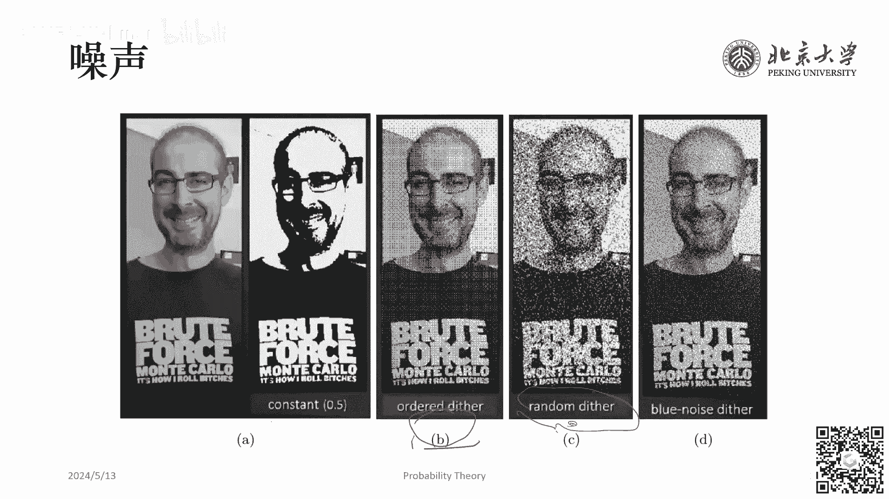

# GAMES001-图形学中的数学 - P9：概率论（二） - GAMES-Webinar - BV1MF4m1V7e3

好的。

假期回来我们继续game001的课程，然后上一次课是跟大家简要回顾了一下概率论部分最基础的知识，然后今天呢我们就要聊一下概率论在图形学当中的应用，我们先快速地回顾一下上节课都讲的哪些内容。

上节课我们是首先介绍了什么是概率，然后从古典概型出发，讲了关于条件概率以及Bayes公式相关的一些定理，之后重点讨论了随机变量，然后分成离散型随机变量和连续型随机变量。

它们分别有自己的成立自己的概率函数，其中最重要的是连续型随机变量的分布函数以及概率密度函数，随机变量具有一些数字特征，比如说数学期望方差，斜方差，矩，上节课的最后我们是回顾一下大数定律。

然后其中有弱大数定律，也就是新兴大数定律，伯努利大数定律，以及中心极限定理，这就是上节课我们所讲述的内容，也就是我们这节课课程的一些知识储备，好的，今天这节课呢。

我们主要是从两个方面去讲一下概率论在图形学当中的应用，然后第一个部分是噪声，第二个部分是蒙特卡洛积分法，这两个部分其实是有一定的相关性的，我们之后会看到这两部分的相关性，它在于什么地方。

我们首先从噪声开始去讲一下，这个噪声它和我们上节课所说的那些概率论相关的知识到底有什么关系，首先，大家可能会很奇怪，就是这个噪声这个声字，它听起来应该是某一种物理学当中声学的概念。

它和概率之间是如何建立联系的呢，我们干脆就先从这个声音的角度出发，去看声音里面所谓的噪声是什么，那么，首先我们说声音它是有颜色的，声音的颜色是来源于就是光的颜色。

因为我们平常大家所说的颜色都是指光的颜色，而光的颜色从本质上看，它其实是人眼对于不同波长的光的混合的感知，注意这里我用的词是不同波长的光的混合，而不是不同波长，因为大家都知道，比如说日光。

我们看起来它是白色的，但其实它是红橙黄绿青蓝紫各种颜色的波长的光，各种波长的光的混合，所以我们并不是说一个颜色只能对应于，一种频谱，而是每一种频谱它都有对在人眼中都会形成一种颜色，但是不同的频谱呢。

有可能对应于相同的颜色，举一个例子，比如说赤橙黄绿青蓝紫当中已经有黄这一个光线了，我们都知道是那黄光，那黄光大概是由钠原子机发出来的光，它本身就是黄色，但是我们又知道。

这个红色色光和绿色色光混合在一起会形成黄色色光，所以同样是黄色，它的来源可能有很多种，简要说一下什么是颜色之后，我们会发现，所谓声音，它和光一样，它也是一种波，只不过光是什么，光是电磁波，而声音呢。

声音是机械波，那么有波就有波长，有波长就有颜色，就是我们这样子，如果能做一下这样的类比的话，那么我们可以说声音也是具有颜色的，那么既然我们刚刚已经说，这个白光它是不同颜色的波长的光的混合，那么白声呢。

或者我们中间加一个噪子，因为类似于这样的声音其实很难被人所发出的，就人所自然当中以这种音乐的方式给出了，所以我们称它为噪声，那么白噪声是什么呢，那类一样的，它就是在一定频率范围内。

所有频率的声音的均匀混合，它就叫白噪声，因为我们知道所有频率的光的均匀混合，它会形成白光，所以所有频率的声音的均匀混合就会形成白噪声，两个比较常见的白噪声的例子。

比如电视机没有信号的时候会听见沙沙的声音，这是白噪声，或者在海边我们去听海浪拍俩岩石的声音，这也是白噪声，我们可以看到它的平谱图像右边这样，在不同的频段上，它的强度大概都是相同的，大致是相同的。

那么这种声音我们就称之为白噪声，那么从白噪声出发，我们自然可以形成粉噪声和蓝噪声，因为我们看这里是红橙黄绿青蓝紫，那么粉它显然是偏向于左侧，左侧是什么，是低频的，对吧，所以是低频强高频弱。

我们称它为粉噪声，而如果低频弱高频强，如果是这样的，我们就称它为蓝噪声，这种噪声我们就称之为蓝噪声，都是类比于光线当中的，好，那么广义的噪声，我们其实它广泛的存在于图像和视频当中，视频大家也许还好理解。

因为视频中也有声音，那么图像当中为什么也有噪声呢，就这里又经过了一次类比，就原来我们这个是光波，对吧，然后变成了声波，然后这个过程它是怎么又到图像当中去的呢，这个概念是在CV或者CG的领域当中。

我们常常用噪声这个词来指代一种具有一定随机性的扰动，或者我们称之为就一定随机性，某种随机分布，然后这样的噪声也就是基于这种随机分布生成的，因为不同的随机分布会使频域中有不同的特点，因此这个噪声具有颜色。

所以这里的逻辑是这样来的，它首先是从光学当中，不同波长的波具有不同的颜色，然后到，声学当中不同波长的声音也具有颜色，最后到我们的CG里面，我们在说图像视频的时候，它的其中的误差，它也可能会具有颜色。

然后这个时候我们说的波，或者说我们说的频谱，它要从哪来呢，比如说我们给了一张数字图像，一张m*n像素的数字图像，然后我记fxy表示它这个坐标位xy处的像素的强度。

然后我们可以对整个图像去做二维的複裂展开，展开完以后，我们称大Fuv的平方，我们这个东西它叫做功率谱，什么叫功率谱，就是现在大F的字面量小u小v，或者大P的字面量小u小v。

它本身都是某一种和谱和平谱相对应的，这样的一个参量，这就是大家概念性的理解一下就可以了，因为我们并不需要真的去掌握说如何对一个数字图像去做複裂分析，好，这时候我们来看一个很经典的问题，是叫图像的量化。

因为我们知道这个我们现在的显示技术当中，RGB一般我们在红色通道，绿色通道，蓝色通道，每个通道都有0~255，256种颜色，然后总共形成的颜色数量就是256的三方，然后这个数字它是相当大了。

所以我们一般都已经把这么多种颜色给看成是连续的了，就是颜色空间我们一般都把它能把它当成是连续的，但是假如我们的显示设备支持不了这么好的这样的显示的手段，我们显示设备只能在R通道上要么取255，要么取0。

在G通道上也是要么取255，要么取0，在B通道也是要么取255，要么取0，那么我们现在给你一个圆图，圆图是连续的一个照片，然后我们希望在某一个只能显示0或者255的。

这样的一个台显示设备上将圆图给显示出来，那怎么显示出来的结果是最接近圆图的，我们现在来讨论一下这个问题，那么，下面我们给出的这个A是圆图，而B呢，B是直接进行量化，什么叫直接进行量化。

就是我们来给一个我们每拿到一个RGB值，比如说126，我们就比一下，看它比这个127是大还是小，如果它我们看它是小于等于127，我们就置为0，如果我过来一个128，128是大于127的，我们就给1。

我们就这样把整个的0到255，这256种颜色里面的前128种算成0，后128种算成1，也就是255，如果我们去做这样的操作，我们就会得到B图，可以发现B图相对于A图，其实丢失了非常多的细节。

而我们现在要讨论的东西，就是我们如何通过某种方法，达到C的效果，我们可以看到C它也是一个，只支持显示0或255的，这样的一个显示的手段，但它显示出来的结果要比B更加接近于圆图。

而这个使得A圆图能转化为C，这样的一个效果的图，的算法就是我们和今天我们要说的这个主题，噪声是息息相关的，接下来我们来看一下，它是怎么联系起来的，我们先把问题给formalize一下，给定一张灰度图。

刚刚我们其实给了一个RGB的图，这个问题会相对难一些，现在我们给定一张灰度图，那么每个像素的亮度值呢，我们刚刚说0到255这256种是吧，现在我们干脆给它加强一下，就是0到1范围内的时数，0就是最暗的。

1就是最亮的，现在我们要把它显示在一台老式的显示设备上，在这台老式的显示设备上，每个像素，我要么取0，要么取1，要么取0要么取1，那么如何才能让显示的图像，在视觉上尽可能的接近圆图呢。

刚刚我们讨论的就是刚刚上一页当中给出的B的图片，它其实就是这个补助方案，我们把亮度小于等于0。5的像素都给显示成黑色，否则我们就把显示成白色，一种简单的解决方案是，有序抖动法。

所谓有序抖动法我们可以这样去看，假如我们显示器的分辨率是高于图像，比如说我们圆图的像素是，举个例子 圆图的像素是100*100，而我们显示器的分辨率是300*300，而显示器的每个像素只有0或1这两种。

这个时候我们怎么办，我们可以用3*3的显示像素来表示一个图像的像素，既然我们的显示能力就是0或者1，我们可以把某一块放在一起，它就有更多种的这种显示能力，比如说我们下面给出了，从0到9。

这不同的这种色块，然后我们用每个色块来表示图片当中的一个像素，怎么表示呢，怎么表示呢，如果图片当中，我发来一个圆图的像素是0。5，然后我们对应到显示器的像素，它是一个3*3的对吗。

我们是不是说这3*3的像素中，只要有大概一半的像素被填满，这个从远处看，它就比较接近于一个0。5亮度的像素的，那样一个效果，我们来比一下，这个的显示是什么，这个显示是0，对吧，这还是0。

这个显示这是1/9，这个2/9，3/9，4/9，我们发现是什么，我们发现这两个，就这种组合或者这种组合，它都在视觉上比较接近于0。5这个效果，对吗，所以我们如果拿来一个0。5，我们就给它要么是这个。

要么是这个就好，然后以此类推，后面是6/9，6/9，6/9，7/9，8/9，一直到1，每当我们拿到一个时数，因为每个像素它的亮度值都是一个0~1之间的时数，每当我们拿到一个时数。

我们就看它更接近于下面哪一种，然后我们取这一个3*3的色块，用它来表示这个圆图的像素就可以了，这个方法听起来很巧妙，对吗，但是，它虽然巧妙，但它需要显示器的分辨率是高于图像的，需要宽和高都是圆图的三倍。

如果宽和高，这个不是圆图的三倍怎么办呢，我们可以先看一下，刚刚我们所说的处理方案，它是如果我们要把它形式的写下来，它大概是什么样，它是说我们有这样一个矩阵，这个矩阵是写成这样，因为我们可以看到。

我们一开始最先填上颜色的是中间，所以它标成0，然后第二个填上颜色的是最左边，所以它变成1，然后第三个，我这样写可能更清楚一些，这是0，这是1，这是2，这是3，对吧，然后以此类推，我们这样填下去。

就会得到这个矩阵，所以它的意思是说，如果圆图像素的亮度值是大于等于mi，阶除以9的，那么相应显示的3*3像素的，第爱和第接列的亮度值，依否则取0，因为当我们拿来一个色块的时候，它都对应于一个圆图的像素。

比如说它都对应一个圆图的像素，比如ci阶，然后我们就看ci阶和mi阶之间的关系，如果它是大于等于mi阶除以9的，那么我们就给它亮度值取1，否则取0，好，那么，刚刚我们做的都是显示的像素。

比圆图的像素要高的情况，那么如果显示的分辨率和圆图的分辨率，是一致的呢，怎么办呢，那我们能不能这样做，我们不管三七二十一，我们就把圆图也做一个3*3的划分，比如说，圆图是一个有6*6像。

6*6像素的这样一个，像一个图片，6*6，这是圆图，我们现在把圆图给分成4块，每块都是一个3*3的阵列，对吧，我们把这每块的3*3阵列直接给它，拉到刚刚我们说的解决方案里。

我们直接去比较它在3*3阵列当中的，第几行第几列，然后去比较底下，去比较底下来决定它这里是，是填白还是填黑，这个方案相当于对圆图增加了一个，以3*3为周期的噪声，最后再进行二次化处理，对吗。

因为我们看圆图像素的亮度值，大于等于mij/9，如果它是大于等于这个数的，我们就质疑否则质领，而我们原来是看圆图像素的亮度值，是不是大于等于0。5，对吧，我们只不过是把0。5变成了mij/9。

而这里的mij/9，是从这上面这个矩阵来的，它看起来是完全没有规律的，就是0123的填法，看起来是完全没有规律，完全随机的，其实所以它最后就相当于，我们先对圆图增加了一个，以3*3为周期的噪声。

然后再进行二次化处理。

对吗，对我们可以给大家看一下，刚刚我们这么做的效果，首先最左侧依然是圆图，然后直接按0。5进行二次化处理，会得到第二个效果，这个效果也很艺术，对吧，但是它丢失了非常多的细节，我们现在根本看不清。

这个人物的面部特征，好，如果我们按有序抖动，就是刚刚我们说的，按3*3的阵列，然后都去依次加上一个对应的数，再做二次化处理，我们就会得到第三幅图，得到这幅图，这幅图的效果，是不是我们已经能够看清一点。

面部的特征了，然后如果我们不是用有序抖动法，而是我们在这个人物，图片的每一个像素上，都随机的增加一个值，之后再去做二次化处理，我们会得到这幅图，随机抖动的结果，这个结果看起来，就是，它非常像。

电视没有信号的时候的，那个雪花点，对，所以其实这个就是白噪声，我们一会会看它为什么是白噪声，然后，最后一个看起来效果最好的。

它是用蓝噪声的方法，去进行抖动之后得到的结果，好，现在我们用数学的形式，来表述一下，我们刚刚到底干了什么，就是我们是，如果我们，就我们刚刚在这里，提到的这个C图，也就是随机抖动法。

它就在数学上看是什么样的呢，我们先比较一下，我们不对它进行抖动，就直接去做，给定一个像素，然后，它是小于0。5就知0，大于0。5就知1，如果我们直接去判断，去做这样的操作的话，如果原图的某一个像素。

是小于0。5的，如果原图的某一个像素的大小，我们指它为C，C是小于0。5的，那么我不管这个C出现在，图片上的任何一个地方，也不管是我哪一次去做量化，我都会把这个C直接给知为0，对吧。

它是一个确定性的过程，这个C一定会变成0，所以说，对一个，C小于0。5的像素，它直接二之化后，期望的亮度就是0，因为它永远不可能产生1，所以从0到0。4999，它都会变成0，而且是确定的会变成0。

但是如果我们先把这个C，去加上一个，存在-0。5到0。5上的随机数，也就是说我们现在这个C变成了C+U，而U是一个，在-0。5到0。5上的随机数，如果是这样的话，我们再来看，这个，这个像素的。

得到的结果会变成它的期望是什么，我们这时候看这个EC8，它等于，我们现在来看，这个U，至多为多少的时候，它仍然是会得到0的结果，那么显然，这个U在-0。5到0。5-C这个区间内，我都会得到0，对吧。

因为我们就看C+U小于等于0。5，这个式子解释什么就可以了，我们解出来是U小于等于0。5-C，那么剩下的情况就是，返回的结果为1的，也就是从0。5-C一直到0。5，这个时候，我们叠加C把等于C+0。5。

这个东西的结果是返回是1，好，那么总之，由于这又是一个，在-0。5到0。5上均匀分布，它的概率密度函数就都是，取1，所以我们直接把这个积分算出来，就会得到期望，这个数学期望等于多少，它就等于C，很神奇。

对吧，我们只要在上面先盖上一个随机数，再取直接二次化处理的数学期望，我们就会发现期望等于它本身，然后我们可以看到，我们一般一张图片，它都有几百万几千万个像素，在像素点这么多的情况下，有一些像素取成了0。

有一些像素取成了1，但在随机意义下，一个同样大小，比如说在随机意义下，一个亮度为0。3的像素，不管，因为它可能会在图片当中，出现在很多个地方，都是亮度为0。3，在随机意义下。

它们这些像素做二次化处理之后的，期望仍然是0。3，因此我们只做了一个抖动，之后再进行二次化，反而能够看见，原来我们看不见的颜色，一直到这里大家有问题吗，好的没有问题的话，我们就接着往下说。

上述我们叠加的分布，它是均匀分布，因为我们叠加的是均匀分布的随机数，我们可以对它做负列分析，它产生的频谱，在各个频率上的强度，大概是相同的，也就是说我们产生了一个白噪声，我们相当于在原图上。

加了一个白噪声，然后之后再进行抖动，回到刚刚这个图，我们可以看到，白噪声它得到的效果，就你不能说它不好，就它比起你直接二次化，结果还是多反映了一些细节，使得你能够看见一些细节，但是它也模糊掉了一些。

使图像整体变得非常模糊，所以我们需要去考察，有没有什么方案来解决一下，这种这上面产生了这么多，这个白噪声的问题，那么人眼呢，是对低频信号敏感，它对高频信号是不敏感，人眼对低频信号敏感。

而蓝噪声它的高频信号是强的，而低频信号是弱的，从人的观感上来说，它是最符合人的需求的，但是蓝噪声，它的产生的算法，就相对来说没有那么简单了，因为蓝噪声对于空间频率是有要求的，我们刚刚看图片的弗利叶分析。

我们看到它的频率是空间频率，对吧，是根据跟按照你图像的像素，出现在这个空间的哪个位置有关，既然你的蓝噪声，是对空间频率有要求的，因此你不可能每个像素独立的去随机，你每个像素独立的去随机。

你随机出来的东西，它对空间频率一定也是无关的，所以我们不能每个像素独立去随机，也就是说如果我们想生成一个，满足蓝噪声的，这样一个分布的话，它需要一些特定的算法。

这个就超出了我们GEMS001课程的框架了，大家感兴趣的话，可以自己去看一下，图形学当中那些如何去生成蓝噪声的算法，总之生成的内容，可以看成是一张灰度的图像，然后我们可以用灰度的图像去抖动。

然后抖动完以后再进行量化，然后就能生成我们上一页看到的，比较好的结果，当然灰度图像有别于传统的灰度图像，因为它可能去复制，此外既然蓝噪声它是对人来说，是最符合人的需求的。

所以它也更适用于去做模拟渲染等任务，当中的采样，从某种意义上说蓝噪声生成的，这个序列就是我们后面会说到的，这个叫低差异序列，我们就往下看，来到蒙特卡洛积分的环节，在概率论当中，它可能整个概率论的课题。

对图形学当中，大家最容易接触到的就是蒙特卡洛积分，蒙特卡洛积分可能大家在一开始，接触概率概念的时候就有所了解，那个时候我们是用蒙特卡洛积分，来求解不规则图形的面积的，对吧，如何求解不规则图形的面积。

我们先在矩形的区域内去撒n个点，然后我们记落在图形内的数目是k，这里的绿点就是落在图形内，然后从概率上来说，这个图形的面积就等于n分之k乘上，矩形区域的面积，因为根据伯努利大数定律，当n趋向于无穷时。

这个a^3就是，区域真值的，这可以从我们上一节课所说的，内容当中去证明，那么我们把求不规则图形面积的，蒙特卡洛积分给它形式化一下，我们可以用它来求解一个，从a到b区间上的定积分，求解这一段上的定积分。

我们最简单的做法是矩形法，对吧，所谓矩形法就是我们先把，a到b这一段给它分成，n段，然后我们把每一段，在每一段取一个值，然后用这一段，用这个值就乘以这一段的程度，也就是b-a/n在这里，这个就不要了。

这个是个确定性的算法，因为我们在每一段当中，要取哪一个值都是确定的，这里它的值就是a+nb-ai，那么蒙特卡洛解法是什么意思，我们现在仍然是在a b上取一些值，然后用这些值去乘以区间的程度，但是。

这些值呢，是用某个分布产生的一个随机数系列，如果这个分布是均匀分布的话，解决方案就是，我们直接去用f(x，i)，这就是我们先在a b上，这个区间上随便取一个点，然后看一下这个点的值是什么。

然后用这个值去乘以b-a，我们就假设这个值它就是，整个区间上每个值都等于这个，那这当然不对，我们就再取一次，我们会得到f(x，2)乘上b-a，然后再取一直取到f(x，n)乘以b-a。

然后我们看我们得到了n个值，对吧，这n个值很有可能不一样，那我们怎么办，我们把它平均一下，所以我们再除以n，这样就实现了一个最简单的，在一个区间上去求定积分的，蒙特卡罗算法，然后我们就会想。

刚刚这个都是均匀分布，对吧，那如果我们产生的，这个a b上的随机数，它不是一个均匀分布呢，它是任意的一个分布呢，那其实也很简单，刚刚这个均匀分布，a b上的均匀分布，它的概率密度函数是什么。

是b-a分之一，对吧，它写在哪呢，写在这，相当于我们把这个，概率密度函数给除掉了，现在我们把这个概率密度函数，给它放回来，我们把它放在这个地方，它就是f(x，2)除以，概率密度函数，我们写成pdf。

这是个缩写，写成这个东西，然后一直算一直算，把算出n个出来，仍然一样，加和去平均，这样我们就得到了一个，任意分布的，蒙特卡罗积分，好，现在我们来证明一下，这个任意分布的，蒙特卡罗积分，它为什么是对的。

我们也就是说，我们要求这个东西的，数学期望它等于多少，这个东西的数学期望，因为我们的x1一直到xn，都是在同一个概率分布下去取的，所以它的数学期望是，也就是说n分之一的过程，完全可以不要。

我们直接就是在求，这个东西的数学期望，这个东西的数学期望是什么呢，我们用数学期望的定义，就是在ab上，这个是随机变量，随机变量是f(x)除以pdf(x)，然后取得随机变量的概率，是pdf(x)。

我们发现这个分母和这个因子，直接抵掉了对吧，它们俩相乘，剩下来就只剩f(x)，也就正好变成这个东西，这东西是什么，就是我们要求的积分量，我们再来看这个东西的方差，这东西的方差呢。

类似我们先把n分之一给提出来，为什么我们提的是n分之一，不是n方分之一，就是这个方差的性质，我们可以在之前的上一节课，课程当中去找到，我们先把n分之一提出来，然后里面变成了，分子是f(x)i。

分母是pdf(x)i，然后我们再看这个方差的表达式，方差表达式是等于什么，方差我们我回忆一下，方差的表达式是，e(x)^2-e^2(x)，对吧，e(x)^2是什么，e(x)^2是。

f^2(x)i/pdf^2(x)i，再乘以pdf(x)，就是这个，对它积分，再减去e^2(x)，刚刚e(x)我们求出来是i，所以e^2(x)就是-i^2，这东西等于什么我不知道，但是我们发现。

它是正比于n分之一的，这说明什么呢，说明蒙特卡洛积分法的收敛速率，是√n分之一的，因为这里求的是方差，而收敛速率我们一般看的是什么，看的是物差，或者说是标准差，也就是σ，σ是√n分之一这个级别。

也就是我们如果希望将，蒙特卡洛积分的物差降到原来的，初始的√n倍的，应该这么说，如果我们希望将蒙特卡洛积分的，物差降低两倍的话，我们需要干什么，我们需要增加4倍的采样量，也就是4倍的采样，会怎么样呢。

会得到1/2的物差，这个收敛速率相对来说，还是有一点慢的，对吧，那么怎么去提升呢，我们因为我们发现，其实蒙特卡洛积分，因为它是一个随机算法，这个随机算法，希望它能够很快的接近真值。

那么就是它只要它方差小就可以了，只要它方差小，就可以很快的接近真值，所以我们刚刚既然发现，我们总是取得某一个随机数，然后取它的函数值，再除以这一点的概率密度值的话，那么，决定收敛性的。

除了1/n就只剩PDFx了，对吧，因为别的都是已知量，f方小f方x或者积分的结果，i方都是不能变的，所以我们唯一能变的，就是这个PDFx，怎么取呢，一个直观的猜测是，a小fx比较大的地方。

我们就大概率取，小fx比较小的地方，我们就小概率取对吧，是不是这样呢，是那当然是这样，这有个定理，这个定理也就是佐证了，我们要讲的蒙特卡洛积分的，另一个很重要的特质，就是重要性采样，这个算法。

这个定理是说，当小fx与PDFx是形状相同的时候，蒙特卡洛积分的方差直接为0，我们来证明一下这件事，什么叫形状相同，也就是说PDFx，永远等于fx的k，被k是一个乘数，那么，由于从a到b区间内。

PDFx它的积分，概率密度函数的积分是1，因为总概率是1，我们会得到k就等于1/2，因为我们可以把这里用k乘以fx，给它代进去，我们代进去就会推导出k等于1/2，好，现在我们再来看这个东西的方差。

这东西的方差是什么呢，这个蒙特卡洛积分算法的方差是什么呢，展开得到这个式子，左边的f^2x/PDFx，变成了什么，变成了小fx/k，k是什么，k是1/i，所以它就变成了i乘上a到bfxdx，这是什么呀。

这就是i^2对吧，那么i^2-i^2，方差是不是为0，也就是说，结论是，小fx/PDFx越平稳，什么叫平稳，它干最好是一条水平线，越平稳，蒙特卡洛积分的方差就越小，也就是说它的收敛速度越快。

我们来考虑这个结论带来的两个问题，第一个问题，方差为0意味着什么，方差为0意味着我们只需要，采样一次就能算出这个积分的结果，对不对，这件事情它合理吗，为什么我们只采样一次，它就能算出这个积分的结果。

为什么方差可以为0，因为我们刚刚要求了fx与PDFx形状相同，你既然要求了它形状相同，你的PDFx和fx之间就是一个正比例关系，而根据这个正比例关系，你其实是知道这个k值，你必须算出这个k值，换句话说。

我们必须知道，我们必须令这个东西等于1，因为这样它才是一个合理的概率密度函数，你在思考，我们在计算这个东西的时候，你是不是自然的把积分给算出来了，因为PDFx又同时等于k。fx。

如果你都能够把这个东西给，你都能知道某一个点的PDFx等于什么了，你一定做了这个规律法，就是说你一定已经把这个k算出来，你把这个k算出来了，就意味着你一定已经把r算出来，也就是说。

但凡你存在一个和fx形状相同的PDFx，都意味着你已经把积分算出来了，这个东西是你已知的东西，所以方差可以为0，问题2，为什么要求fx在积分区间上是非负的，如果有负数怎么办。

刚刚我们是在讨论这个问题的时候，我们设了小fx在AV上总是不小一点，为什么我们要求它是非负的，因为我看我们刚刚在推导的过程当中，我们是要求PDFx永远和fx之间差的是一个，正比例关系。

如果你的k是取负值会怎么样，或者说如果你的fx是取一个负值会怎么样，你就会出现某一个点，取这个点的概率是负的对吧，会出现这种情况，所以如果有负数的话，摩特卡罗积分会，就是重要性采样的定理。

上面我们定理它是不成立的，所以有负数是个open problem，有一些siggraph的文章就去讨论说，一些特定的渲染场景里面，我们会出现负数，这个时候该怎么办，这个问题有一些文章就是在研究这个。

好我们今天当然就从最基本的开始讲了，那么刚刚我们证明的定理，它要求是说，它是说这个性状完全相同的时候方差为零，我们刚刚也说这意味着，你其实已经把积分算出来了，但绝大部分情况下，你其实算不出来积分的。

或者说你都算出来积分了，你还要做摩特卡罗积分干嘛呢，所以我们来举一个最简单的例子，比如说我们在0~2π上去积分sinx，是右边这幅图的红线，这个红线是个sinx，然后现在我们有两个不同的概率密度函数。

第一个是在0~2π上面的均匀分布，也就是说pdf1是2%，第二个这个曲线是在0~2π上，满足pdfx=πx/π^2的这样一个曲线，这曲线是右边的蓝色图线，是这个，那么用这两个概率密度函数。

谁去做摩特卡罗积分的时候，说脸速度更快呢，我们就肉眼判断一下，因为我们是要把fx和pdfx相除的，那么所以这个pdfx肯定是和fx越接近越好，也就是说显然是用蓝色的这个概率密度函数。

去做这个重要性采样要更好，好，最后我们再来看一下，蒙特卡罗积分当中的拟蒙特卡罗法，为什么说是拟蒙特卡罗法呢，因为蒙特卡罗法是建立在纯随机的基础上，而纯随机的采样非常容易产生聚集，比如说在右边的这个图上。

我们是求一个e位的积分，然后我们要撒6个点，我们看法撒了这6个点非常不均匀，这6个点三个，这6个都在一个很偏很高的位置，都在这个2附近，但实际上这个整个函数有非常小的值，但我们就是正好没有采样到。

所以为了解决这个问题，我们在实践当中常常去采用分层采样法，什么是分层采样法，就是我们先划分一个区间，再在每个区间内去做随机，比如说右边右下角，我们先把上面这个函数给它划分成，若干个区间。

这个区间这个区间这个区间，然后我们在每个区间内随机取一点，每个区间内随机取一点，这东西怎么是不是有点像回归到，我们一开始说去估算定积分的这个矩形法，它是有一点像，但现在唯一的区别就是。

我们原来在每个矩形的时候，我们可能都取这个矩形的终点的值，但现在我们可以看到，我们不一定要取这一段的终点，我们可以取在比较歪的地方，就是说我们在每个区间内随机取一个点，他也就是说他兼具了。

我们刚刚说的这个矩形法，和蒙特卡罗法的优点，我们相当于把这两个东西给binding起来，所以我们叫它拟蒙特卡罗法，或者我们又把用这样的方式去做出来的，这种分层采样的结果，称之为低差异序列。

什么叫低差异序列，差异就是对刚刚我们说的聚集的，它的反义词，低差异序列是说，我们去算下列两个量之差的最大值，首先我们在要积分的区间内，认取一个子区间，这个子区间和总区间长度，它会有一个比值。

然后我们看该子区间内，采样数和总采样数之间，它又有一个比值，我们把这两个比值相减，我们希望这两个值相减的差，它的最大值尽量的小，这个说法非常的拗口，但是总之它会产生一个，它在逻辑上会产生一个。

更近似于分层采样的结果，而不是一个纯随机的结果，因为分层采样能保证，在每一个区间内，它至少都会产生，每一个划分的区间内，它都至少产生一个点，而纯随机的方法，完全不保证这一点，在整个20世纪当中。

大家在研究随机性算法的时候，已经发现了很多，这样的低差异序列，以一为为例，最简单的就是，这个vendor-coopted序列，我们叫它VC序列，这个VC序列，它是怎么做的，它其实非常的简单。

比如说我们在实境之下数数，先算1234一直到9，对吧，这是个位数，个位数它的高位是什么，它的，它比它大的，静置的底数是10，所以我们就1/10，2/10，这样一直到9/10，就0。1一直到0。2，0。

3一直到0。9，然后区别从什么，区别从10开始，某数数数到10，比10大的实境之下，底数是100，这时候我们把10的分子，和分母颠倒一下，变成01，然后01/100，等于0。01，然后我们再数11。

因为11的个位和实位是一样的，所以它还是产生0。11，我们再看12，12我们把个位跟实位颠倒，变成21，然后21%，0。21，以此类推，一直到100，我们数数数到100。

100比它大的实境之底数是1000，我们把100颠倒，变成001，001/1000，是0。001，然后类似的0。101，0。20，这个产生的VC系列，就是一个低差异系列，在数学上可以证明。

它的差异会有一个上限，而且这个算法是可以，它是迭代的往下去做的，我们产生前100个系列，长度为101的VC系列，是长度为100的VC系列，直接在后面补一个数，这个性质也非常的方便，好。

那么刚刚我们给出了一个，一维的低差异系列，现在我们想看高维的低差异系列，该怎么产生的，我们把K进制下的，一维的VC系列，记为GKI，因为我们刚刚给的，其实是一个实境制的，VC系列的产生方法。

就是这个数数的方法，K进制是一样的，K进制是一样的，就比如说三进制，你就是1/3 2/3，然后什么，就是0/3 1/3 2/3，9/3，这种，往下走，我们GK进制下的，一维VC系列是GKI。

然后我们就可以去制造一个，高维的Horton系列，Horton系列是怎么做呢，我们找出n个这样的进制，找出n个进制，从B1一直到Bn，要求进制的底数都是互制的，比如说我们取质数的系列，2 3 5 7。

往下走，我们要求它们互制的，然后我每次产生，比如说x方向，它就是GB1I，Y方向就是GB2I，然后Z方向就是GB3I，这样我们就会产生一个，三维空间当中的一个点，然后这个点，它的每一个维度。

都是一个VC系列，它整个这些点的系列，被称为Horton系列，以二维维利，我们产生的Horton系列，大概就长这样，长这样，我们发现它很少聚集，对吧，它不是那种白噪声的那种感觉，它没有很多点对在一起。

这种情况，用这个方法去采样，而不是用纯随机的方法去采样，所产生的，蒙特卡罗算法的收敛速率，是n分之一作为底数，而不是我们刚刚说的，根号n分之一，快了很多，对吧，然后类似的。

我们可以去造这个Harmony-Sleep系列，它唯一的区别在于，我们把刚刚我们是每一个维度，都是一个一维的VC系列，现在我们把第一个维度，不让它随机，第一个维度，干脆就定义成n分之二。

然后第二个维度让它随机，从第二个维度往后让它随机，这个叫Harmony-Sleep系列，但它的相比于Horton系列，不方便的地方在于，我们需要提前给定总采样数，它不能迭代的往上去扔碟。

它必须提前去决定采样数的数目，用这个方式制造的二维的序列，长这个样子，我们可以看到它比Horton系列，确实还要差异更小一些，对吧，可以看到它聚集更少一些，而且更均匀一些。

这个是Harmony-Sleep系列，然后它的收敛速率是n，仍然是n分之一做底数，然后分子的次幂，它比它降了一下，就都是log n，分子都是一个log n的多少次幂，然后Horton系列的次幂是n。

然后而Harmony-Sleep这个次幂是n-1，这个n是维度，比如说在三维下，这就是三，这就是二，也就是说Harmony-Sleep系列，要稍微优于Horton系列，但是因为它要提前给定采样数。

所以有时候会造成一定的困扰，在图形学当中，大家可以去看那些渲染的框架，比如说PBRT，比如说米苏吧，他们在真正的实现渲染算法的时候，基本上用的都是用Horton系列，产生的随机数，而不是一个真正的。

在一个空间内去分布上去随机数，它的优势就在于此，好，最后我们来看一个问题，就是如何产生一个随机数，当然我们并不是说，我们需要从数论的原理上，去跟大家讲怎么产生一个，01上的均匀分布的，伪随机数生成器。

这也不是图形学的内容，我们假设我们已知计算机，可以在数论的基础上，实现一个0~1上的均匀分布的，伪随机数生成器，然后现在我们希望解决的问题是，我们拿到这么样一个随机数生成器，我们怎么在一个单位球面上。

进行随机均匀采样，这个问题还蛮重要的，因为我们，比如说去做路径追踪，光线追踪PathTracing的时候，你是不是有个入射角，一个出射角，我们得采样你的入射角，或者采样你的出射角，对吧。

你采样入射角出射角，都是在一个半球面上去采样，我们希望这个采样怎样的均匀，也就是我们必须面临一个，怎么在单位球面上，进行随机均匀采样的问题，这里我们给出了这种4种做法，然后其中就每种做法。

都各有自己的优势，我们简要来看一下这4种做法，分别是怎么去做的，第一种做法最简单，是拒结采样法，也就是说我们，比如说我们要生成一个二维的圆，圆周上的随机数，我们先怎么办呢，我们生成矩形内的随机数。

这个矩形内的随机数，就是一个-1到+1，然后平方这个之内的，二维的一个，坐标，它上面每个点的坐标，我们都可以把它看成是两个随机数组成，然后U1你直接均匀分母，随机数生成器生成，U2你也这么生成就完事了。

我们这样就可以生成一个，在矩形内的随机点了，但在矩形内的随机点，有的在圆内，有的在圆外对吧，你在圆内的概率是什么，你在圆内的概率是πr^2，或者说就是π/4π，比较大，这个数值比较大。

应该已经在接近于80%左右，有80%你这样产生的随机数，都在圆内，但是也有可能它在圆外，如果在圆外，我们就直接扔掉，我们不要这个随机，否则我们就相当于先生成了，一个在圆内的随机点，对吧，而且是均匀的。

否则我们再把生成的这些随机点，给一个个全部都投影到，从周围从圆心开始，投影到这个面上，投影到周围上，这样做我们可以保证，最后会生成一个，在单位圆上的均匀随机采样，但是这个方法有一定的弊端。

就是你生成这个随机点的过程，并且不再从内就丢弃这个过程，会浪费很多的计算资源，而且如果你的运气非常的差的话，你可能一个能用的都没有，你产生的所有的点都被你丢掉了，所以有没有一些确定性的方案。

我们能不能不用拒绝采样这个方法，也可以，其实大家最容易想到的，可能是三角函数变换法，这个方法是说，比如说这个方法，对三维的特化是这样，三维的球面上的值，我们一般是用这个求做标来表示，求做标会有两个角。

对吧，两个角，一个θ一个φ，然后，我们想看的是什么，我们想看的是，我们变θ，会增加多少面积，变φ又会增加多少面积，大家学过高等数学都知道，面积微元是什么，是αsinθ，然后dθdφ，换句话说。

对于φ来说是个均匀的，也就是不管你的φ去多少，也就是我们假设θ不变，去改变φ的话，不管φ在哪里，它的概率密度函数都差不多，都是一样的，也就是，因为，你的φ可以去0~rπ。

而U2生成的是个0 1之上的随机数，我们直接对它乘以rπ，就会得到φ，好，这个问题就解决了，现在我们关键是要去看θ，这个θ，它是一个什么，它是个0~π之间的数，我们看在φ不变的情况下，去改变θ。

它会改变多少面积，也就是我们可以这样去看，我们从0去积分，积分到某一个θ，我们可以去算这么一个积分，这积分等于什么呢，它等于，-cosθ，然后一个去θ，0一个去0，这是什么呢，这是1-cosθ0。

也就是说你的面积，你从，极坐标的顶开始，球坐标的顶开始一直往下去算，你产生的圆周的面积，相对于θ的变化率是这个，是1-cosθ0，也就是我们的理想情况，应该是这个东西，它是一个随机数，这个分布函数。

这个累积的分布面积分布函数，它是一个随机数，我们像这个东西，对我们像这个东西是，但它前面其实应该还有一个系数，这前面其实还应该有一个系数，为什么有这个系数，因为从0到π去做积分。

应该如果我们要把它变成分布函数的话，就是从0到π去做积分，从0到π去做积分，最初它的值是2，我们要给它归一化，所以前面还要乘一个1/2，也就是说我们希望这个东西，它是一个分布函数。

所以我们要令这个东西等于，一个随机数，变换一下就会变成，1-cosθ=2u1，也就是θ要等于什么，θ=arccos(1-2u1)，就是这个东西，θ=arccos(1-2u1)，这样我们就也实现了一个。

在球面上的随机均匀采样，是用这个分布函数来推导，然后第三种方案相对来说，就比较巧妙了，它是利用了我们上节课说到的，高斯分布的一个性质，我们高斯分布有一个非常好的性质，就是我们产生一个二维的高斯分布。

它在任何一个方向上去看，它都是一个高斯分布，也就是如果我们有一个随机变量，这个随机变量我们叫它V吧，V1和V2都是满足高斯分布的话，我们把这个随机变量去点成，任何一个方向向量，它也依然是一个高斯分布。

所以我们可以做的事情，就是我们现在每个方向上都去生成一个，我们生成一个n维的高斯分布，比如V1 V2三维里面就V1 V2 V3，这是一个高斯分布，然后它在每个方向上都是一个相同的高斯分布。

所以我们可以把高维的高斯分布，给它投影到一个球面上，它依然也是均匀的，这个方法很巧妙，但是它唯一的问题在于，生成高斯分布本身并没有那么容易，它需要用Bokes-Muller变换。

就是说我们先要从一个均匀的分布开始，去得到一个二维的高斯分布，然后再从二维的高斯分布出发，去得到一个任意维的高斯分布，大家可能会奇怪，为什么从均匀分布开始，要先得到一个二维的高斯分布。

因为高斯分布的分布函数，是一个超越函数，它是没办法积出来的，所以为了简便计算，我们一般会选择一个二维的高斯分布，因为这时候它的累积分布函数，不再是一个超越函数了，有关Bokes-Muller变换的内容。

大家可以自己去课后去了解一下，但是总之这个方案就是，我们可以先生成二维的高斯分布，再把二维高斯分布变成任意维的高斯分布，然后生成二维高斯分布的方法，我们这里也直接给出了，就是我们先给拿到了一个。

0以上的随机变量这件事情，U1 U2分别都是0以上的随机变量，然后-2 log(1-U1)乘上cos(2*U2)，会得到第一个满足高斯分布的随机变量，然后乘以sin会得到，第二个满足高斯分布的随机变量。

最后一种在球面上进行，随机进行采样的方法，比较的看起来比较的麻烦，但实际上实现起来的效率，甚至比前面的某些方法还要高，它的做法大体上来说，是我们先用一个拒绝采样，去产生一个圆盘，就是刚刚我们说的。

在一个矩形当中，我们先用拒绝采样去产生一个圆盘，再用这个圆盘给它进行变换得到一个球，这个过程的好处是，它从头到尾不涉及三角函数因算，我们可以看到三角这个方法，这个方法有Rcos。

这个方法有cos和sin，而基于圆盘的方法，圆盘倒球的方法，它从头到尾不会产生任何的三角函数因算，所以它速度反而很快，这件事情大家可能会问，就是说你既然都已经用了拒绝采样了，你为什么不直接让它在球面上。

生成一个-1到+1这里写3，然后再把它投影到球面上，而你非要先把它生成到圆盘，然后再用圆盘给映射成一个球，这个问题就在于我们刚刚给出了，在一个矩形一个正方形内，去拒绝采样产生一个圆内的概率是80%左右。

而如果是一个球内，它会变成，它变成这个概率，也就是在这个地方的分母上，乘了2，但在分子上，乘了4/3，你知道4/3是小于2，也就是说总共我们把概率乘了个2/3，现在我们直接在一个球内产生。

在一个正方体内产生一个随机数，它在球内的概率只有80%乘以2/3，所以概率要已经不足，应该说是已经快不足一半了，对吧，已经快不足一半了，所以我们先产生一个圆盘，它的好处在于你扔掉用拒绝采样。

扔掉的点它会比直接产生球内的随机数要少得多，对以上就是关于如何在单位球上，进行随机均匀采样的这种不同的思路，然后这些思路其实实现的细节，2/3两种已经给出了，就直接照抄这个式子就可以了。

然后第4种映射的方法受限于，它要写很长，大家可以自己去看一下，好的，而以上就是我们概率论部分课程的第二节课内容，我们今天这节课是有作业了，然后作业会在后续在我们的课程网上发布。

然后到时发布之后会在qq群里通知大家，今天我们的课就到此为止，然后大家有什么问题吗，好，如果大家没有问题的话，我们就下节课再见，下节课讲的内容应该是常论的初步，好。

谢谢大家，由 Amara。org 社群提供的字幕。