# GAMES001-图形学中的数学 - P1：线性代数基础（一） - GAMES-Webinar - BV1MF4m1V7e3

诶切换到这对吧，啊，这个课呢是我们就是今年的这个，现在这个春季呢来上这个课啊。

呃由我来做一个这个简单的介绍。

实际上啊开个头，但是呢实际上我们有两位同学呢，一个是离心雨啊，一个是阮梁万啊，他们都是啊我实验室的直博生啊，而且都是做物理模拟仿真这个方向的啊，这个新语呢是图灵班的这个首届的这个学生。

然后阮梁万呢是第二届的学生啊，他们都是这个啊做过这个这个啊物理竞赛啊，这些方面哈，但是他们现在主要当然是做计算机图形学啊，呃他们喜欢图形学，也喜欢数学啊。

也喜欢物理啊，啊同时呢我们这个还有一个这个助教的阵容啊，我们是有这个陶林霄啊，啊他是这个原我们的元培学院啊，这个王瑞成啊也是元培学院啊，还有朱月城啊，是图灵班2年级的学生，还有余成啊。

这个是我们2年级的信息学院的这个啊，本科生，目前啊啊都是这个做图形学研究的这个方向啊，也都是非常有经验的助教啊，在我的这个图形的这个课啊，我们又叫可视计算与交互这个课啊，他们都是都做过我的助教。

所以呢他们也都是非常有经验的助教啊，好吧，所以呢这应该是一个比较啊庞大的一个阵容吧，啊这个一个团队来讲这个课啊，希望呢跟同学们有一个非常好的一个互动。

这个呢是我们课程的大纲啊，大概分这么几块儿啊，呃几何与代数啊，数值方法啊，微分方程求解。

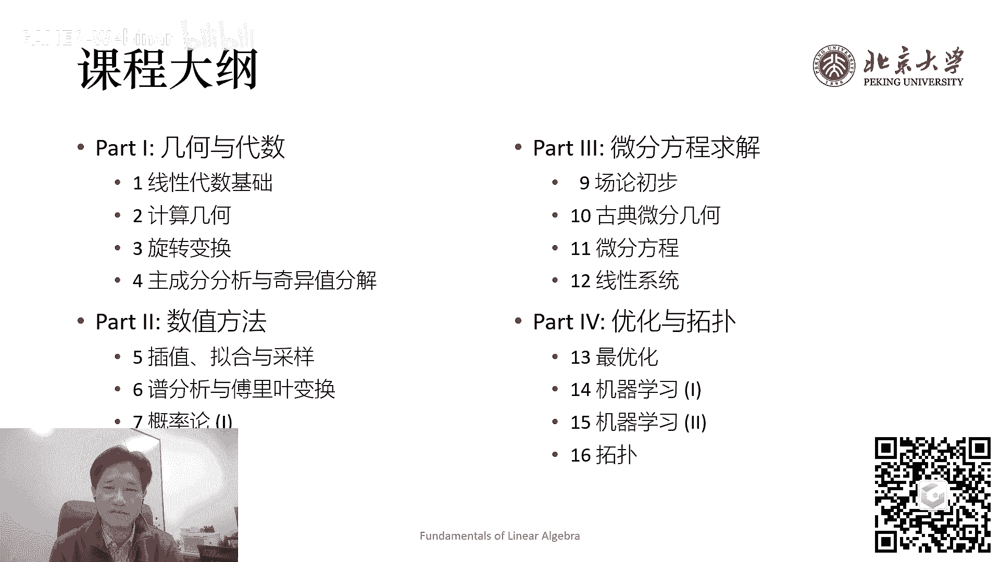

优化与拓扑啊，这是我们的参考书啊，这个呃里面有一些内容哈，如果你想展开的阅读的话，可以读一读呢啊这些书我想跟大家说一下哈。

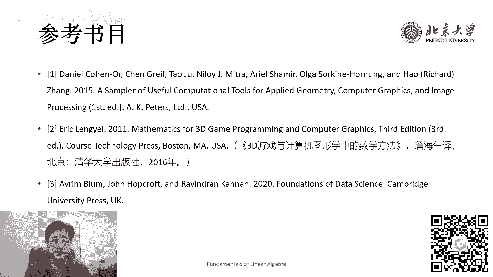

就是咱们这里列的这些数学的这个这个问题哈，啊大家可能以前或多或少都学过啊，但是这一门课呢呃大家上的时候会感受到哈，咱们不是简单的讲这些数学啊，而是讲这些数学呢怎么用啊，这个用呢非常的重要啊。

啊有很多同学这个课怎么来的呢，就是很多同学上我这个课的时候啊，他们会发现呢，原来有一些数学的好像变得陌生了啊，还有的同学呢，就是通过上我们这个图形的课以后啊，发现数学竟然这么有趣啊。

就原来学的时候觉得没有这么有趣啊，或者这么有用啊，还有很多同学说呢通过上图形学这个课，让他们更好地理解了这些数学，诶，所以这个呢是对我们是一个很好的一个鼓舞啊，也是就是在这么一个鼓舞之下，鼓励之下呢。

哎我们就说咱们就来开一个计算机图形学的，中的数学这门课啊，咱们以一个不一样的方式来讲，这样的一些数学的这个这个啊啊问题啊，嗯所以呢要起到一个什么呢，就是说让我们的数学可以看得见啊。

就所有的这些数学方法呀，很快的我们会看到他们在怎么样变成一个，我们从图形的角度能够看到它们的作用啊，这个就会脑子里面建，就建立一个很具象的这样一个概念啊，这个在之前的课堂上的课堂上的同学啊。

啊觉得这样的非常的好，还有一点呢我想呢跟啊同学们分享，就是说这里有很多的数学的方法，其实它在图形的这个好些不同的这个topic上啊，都可能会用到啊，就看起来好像这是几何问题，那是个渲染问题啊。

这是一个物理仿真的问题，但实际上它是同样的数学工具啊，它只不过是说我们在不同的这个图形的，这个问题中啊，做了一个问题的抽象啊，哎抽象到了最后最后最后发现啊，我们就是解这么一个这个微分方程。

或者偏微分方程，对吧啊，我们解解这么一个拉普拉斯啊，最后一转换他是个拉普拉斯这个问题，或者是个帕松这个这个问题啊，所以呢这是个很有意思的一种思维的方式啊，也是很有意思的一种啊，我们把抽象的数学啊啊。

放到一些很有意思的一些这个，图形的问题中来啊，这样的一种形式好吧，所以呢就说这个课呢，按说哈是一个非常有意思的这么一个课程啊。

那我前面就做这么一个简单的介绍好不好，那我们还是有请啊，我们倪新宇同学和，OK呀，李星宇同学呢和这个阮娘万同学，来来做一个这个自我介绍吧，好不好，一开始嘛互动一下啊，啊各位同学好啊，大家好，我是李欣雨。

然后我是陈老师现在的4年级的博士生，然后今天呢的晚上的课会是，我给大家讲这个关于呃，线性代数基础的相关部分内容，然后陈老师那边还准备了一个呃，40分钟的分享课件，然后呃现在正在传我，我一会会把它下下来。

所以我们先跟大家做一个简单的界面呃，然后之后我们这些PPT是会传到games官网的，然后除了games官网以外，我们还有一个课程作业的提交系统，如果大家呢就是之前上过games其他课程的话。

应该也接触过那个呃提交系统的啊，就是我们这个我们大概的这对于这门课的课程，上的安排是这样的，就是呃我们并不是说，每一次这个课程之后都会有作业，但是如果有作业的课程的话，呃它会是一个满分100分的形式。

然后呃就是不同的这个课，他的作业形式是不一样的，比如说第一节课这个线性代数，可能就如大家在之前在QQ群里面说说得难，就是很有可能是让大家去啊手写啊，不是不是手写。

是用LT或者word去写这样的证明或者计算，但是到后面的像这个计算几何这样的题目的话，那大家就可能需要去实现一些这样这个代码，就是这些会依照我们不同的这个课程，我先把它调到那个课件的那一页吧。

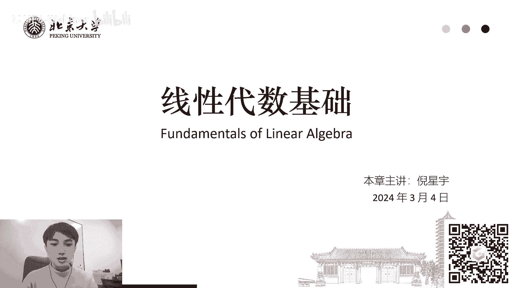

就是这一页就就是我们说是有16次课，但大家可以看到就是计划上，概率论和机器学习都是两个课时，然后因此呢，就是呃我们并不是每一节课都会有作业，然后呃最后呢，就是每门每节课的作业是满分100分。

然后达到60分算合格呃，在所有的作业中，大家完成百只要有80%达到合格，我们到时候就会以邮箱的形式，类似于001呃，101那样给大家去发这个结业的证明啊，就是可能也没有什么用。

它只是一个就是相当于鼓励性质的，这样一个方法，呃对就是是这样的，然后大家在课业作业上还有什么问题，可以可以在这个就是评论区和大家互动，好像还没有，应该快了吧，那那个梁旺，你来跟大家见个面，什么。

啊切换啥可以进直播间，看到在这哦，行行行，啊哈喽大家好，我是这个软件旺，然后啊我今天没洗头，所以这个发型比较飘逸，然后我跟星宇来给大家讲这个课，但是呃就是说实话我们俩这个比较有一些BIOS。

因为我们俩其实都是做这个物理模拟的，所以可能对于某些topic呢也不是特别的专业，所以我觉得这是一个互相学习的一个过程，然后我们在准备这个课程的时候，也是相当于是把这些概念重新啊，重新去学习一遍。

然后再反馈给大家用，我们就用我们觉得这个最能懂的方式，然后最适合这个啊图形学的方式啊，啊对我看到同学有弹幕说多讲点模拟啊，但是我们尽可能的还是啊，把这个就是统计学的各方面。

然后包括甚至一些这个啊V神的东西，也就是这个计算机视觉的部分，然后还有可视化的部分里面呃，用到的各种各样的数学知识，都给大家，这个以我们觉得最容易懂的方式去介绍一下。

然后并且是尽可能的利用图形学这个学科，他这个它的一个优点就是比较直观的，这个可视化，然后能够让大家更容易懂一些，然后哈我再补充一点，就是这个关于这个我们一共现在排的是16讲，然后我跟星宇两个人。

这个大概是就是说我们啊对半分了一下，但是呢这个啊时间就是我们没有说，就是严格的一人一个人一节课，然后所以就是说我们大概挑了一些，我们比较擅长的，比较感兴趣的，然后去给大家去讲，然后同时这个啊。

这个中间这个课程中间会有一些啊时间，就是可能会有一些冲突，比如说我马上这个西瓜这个啊，rebuttal就要来了，所以啊有可能会出现一些情况，就是我们需要推迟一些课程。

然后或者说啊尤其还有可能就是这个课程，比如说这个我们当时排了两节课，但是可能其实他啊没有那么多内容，或者说我们只排了一节课，但是这部分呢就比较重要，所以说就是呃这个课程的讲解，以及后面的这个时间安排。

可能是需要一个不断去调整的一个过程啊，然后我们啊每次直播前，也会就是把这个具体的这个时间，然后各种信息也会尽可能的反馈给大家啊，对，然后所以说就是我们还是希望，就是说通过这个课程。

大家能够以一个相对直观容易理解的方式，把这个大部分的数学基础的部分呢都过一遍，然后呢之后到大家，比如说具体就是到这个生产中，到工作中，到这个啊研究中，需要哪一部分具体的东西的时候。

有一个呃有一个pointer去找那些相关的资料对，然后我们现在这个PPT还剩3分钟就可以传完了，对这个实在不好意思，就是我们这个第一次直播经验不是很够对，那我介绍就差不多，这里，呃然后对。

然后我现在就是简要的说一下，这个关于课程大纲方面的内容，刚刚陈老师也和大家呃就是简要的介绍一下，我现在就稍微详细的说明一下这个呃，就是为什么这样设计这个课程，然后呃第一节这个几何与代数的部分。

其实我觉得他可能是呃就是最基础的数学了，然后呃线性代数这一块，主要是我们之前就是在自己学校开过这个，可是计算相关的课程，然后当时有同学反映说，这个大一学的高等数学和线性代数嗯，他不是非常切合应用。

就是大家可能上完了高数和现代之后，还不清楚这个课，他对于之后的这个研究，也以及这个课程的学习，它它能起到什么样的帮助，所以我们就是觉得有必要，就以如何应用的角度去说一下。

这个关于线性代数的呃相关的内容啊，刚刚有我看到弹幕有同学问说是用什么语言，这个是C加加吗，就是可能会有C加加和Python，应该不会有别的语言对，应该应该是这样，然后呃对相关名词都是有英文的。

相关名词都是有英文的，我我们在做PPT的时候，其实都兼顾了这一点，然后计算几何这个方面，就因为它是这个图形学的基础，就呃我们图形学涉及到的就是点线面，然后计算几何处理的就是点线面，然后旋转变换的话。

就是呃这个其实就是如果大家做过一些渲染，相关的背景了解的话，旋转矩阵在渲染当中起到了一个很重要的作用，因为它可以让你不需要真的去移动，物体的位置啊，通过一个旋转的方式，来改变这个物体的这种朝向。

然后主成分分析与极值分解，其实是线性代数的一部分，它是里面的SVD与PC这个部分，但是因为它对于科研来说非常的重要，所以我们单独的把它拿出来讲了这么一节啊，数值方法上来说呃，就是插值拟合与采样。

它是构成从离散的数据到连续的厂的这样的，一个途径，所以它在我们的研究当中，也占据了比较重要的地位，而谱分析与傅立叶变换，是，因为它能够以一种就是降维的角度，去看待原问题，能够减少到我们的这个计算复杂度。

然后概率论主要是在渲染当中用到，然后以上就是啊part one和part two的这两部分的，我们的课程设计的原因，然后现在这个陈老师那边的课件也准备好了，等陈老师讲完课以后。

我再继续给大家讲后面两部分课程设计。

OK回来了哈，这个显然显然我们不是吃这个直播饭的哈，但是经过了这门课以后哈，我觉得我们也许就可以了啊。

这样啊我还是回到我刚刚说的这个问题，我在宣传咱们这个课的时候啊，我就说这个人工智能的尽头是计算机图形学。

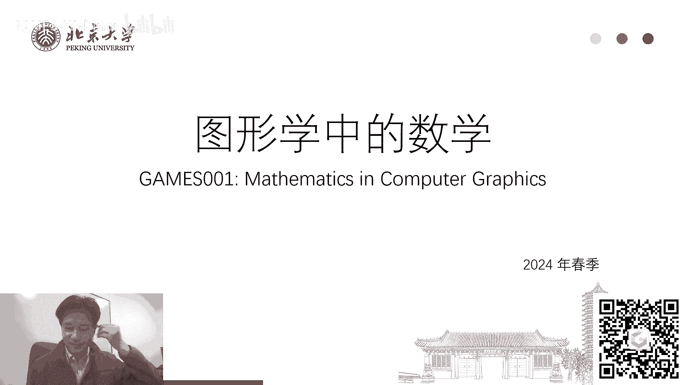

所以呢我还是得把这个解释一下啊。

好吧，计算机图形学哈，它其实是模拟一个世界哈，他是啊为了这个对我们一个现实的世界啊，作为一个一个完全真实的逼真的一个仿真啊，啊那我们大家呢也听到这个词叫世界模拟器，对不对啊，大家这个SORA出来以后。

大家就说哎SORA是不是构建了一个世界模拟器，那何为世界模拟器呢，就是对于一个世界的这个运行，它能够做一个高度精确的啊一个仿真模拟啊，所以这就是世界模拟器，那我们知道我们图形这个做到一个最好的。

这个状态，就是我们确实能够模拟一个世界啊，当然确实这个咱们的这个图形模拟世界，我们有很多的一些参数啊，不像这个server啊，这个文本一输入就可以了，但是这个世界模拟器啊。

和人工智能确实现在呢关联度非常高啊，大家也都在谈论说，SORA是不是构建了一个世界模拟器啊，那世界模拟器为什么重要，是因为如果有了一个世界模拟器，或者说它具备了世界模拟器的这个能力。

它产生的这个这个生成的这个场景啊，它就是物理真实啊，所谓的物理真实就是说它的这个物理的现象，它符合物理的规律啊，他这个人的这个动作啊，各个方面他符合这个人的行为啊，他不会不会这个这个穿帮啊。

这说白了就这么个意思啊，那我们来看一看这个说到人工智能啊，那我们这个智能到底是怎么来的，怎么来看一下啊，好不好，那要说智能怎么来的，那咱们就得研究从小孩开始研究，对不对啊，那人类的这个智能啊。

那实际上是从小到大对吧，我们不断的感知认知决策行动啊，然后再又回到感知这样的一个过程中啊，来不断的去去一个循环往复啊，这个循环反复呢来获得这个经验啊，来积累呢我们这个人类人类的智能。

所以呢这个人和现实世界打交道，变得非常重要啊，这是人怎么获得这个智能的，对不对，这是个比较概括性的一个一个介绍，那么具体来讲我们可以看看啊，一个小朋友他学会倒水，就这么一件好像是个比较简单的事情啊。

他是怎么学习的对吧，你比如说来看看啊，这个小朋友一开始倒水的时候，可能就倒的不是那么溜诶，他就水就这个洒了，是不是啊，哎慢慢的呢他这个这个从不同的角度去去尝试，对吧啊，然后又来试一下，发现还是散了吧。

要么是倒慢了，要么倒快了，对不对啊，那我们来看看刚才倒的太快了，那我们现在到他慢慢倒，慢慢倒也不行啊，啊对不对，它也还是流出来了，但是这个人的学习能力呢就非常的强啊，他通过不断的测试诶。

小朋友掌握了对吧，他又不快不慢，要正好这样呢他就学到了这样的一个能力啊，那实际上刚刚这么一个简单的一个操作哈，我们来看看在这个小朋友的脑子里面，到底他是在学什么样的东西，他可能并不知道这样的一些名词。

但是实际上他在学什么呢，形状对不对，这个这个容器啊，它是个什么样的一个形状，还有呢这个物理规律，当然他不懂物理，但是他知道这个水他以从上往下落的时候啊，它它会怎么落下来啊，然后不同的倾斜度呢。

它会有一个不同的这个落的这个速度啊，那还有当然就是他的控制对吧，他得要去控制这个这个这个姿态啊，各个方面才能达到这么一个效果啊，所以呢这就是我刚刚说的，他在学的这个过程中啊。

他的所这个占的一个一个过程啊，那这样的一个过程啊，感知认知决策行动对吧，这么样的一个过程，如果说是机器来学习的话啊，那往前走，如果是机器来学习的话，那我们也需要这个机器，跟这个现实世界有这样的一个交互。

对不对啊，这样呢他也就是来获得，因为他机器也有传感器嘛对吧，他眼睛可以看啊，手可以动啊，这样呢它也能够不断的去啊，就像人一样来去获得了这些经验啊，和这个啊这个这个能力啊。

但是这样的手段呢显然是呢啊不高效的，因为哈你这个一个机械的设备，对不对啊，他这个学习的过程呢，你想人这个成长啊，还是他毕竟他是有基础嘛，对不对，我们这个人整个身体上是有基础。

我们学习可以很快人脑就完善啊，但作为一个积极的话，那他就是要需要更多的这种尝试哈，所以呢这种人是不高效的啊，那么一个办法就是什么呢，我们把这个现实世界呢变成一个数字世界啊，对那一个机器人面对数字世界。

它可以在数字世界里面去不断的去尝试，就像刚刚在现实世界中间的那样的一些动作啊，他同样也是有这样的一个环路啊，来不断的去感知认知决策行动啊，循环反复，然后来获得获得呢，他试错对吧，迭代来获得呢。

他这个知识是这样的一个情况的话呢，那这个效率就高了对吧，我们知道啊，这个数字世界里可以打碎了，重来对吧啊，一个东西弄坏了呢，那也再来，是不是啊，它可以不断的重复啊，他不需要这个对现实世界呢。

做一个真正的这个破坏啊。

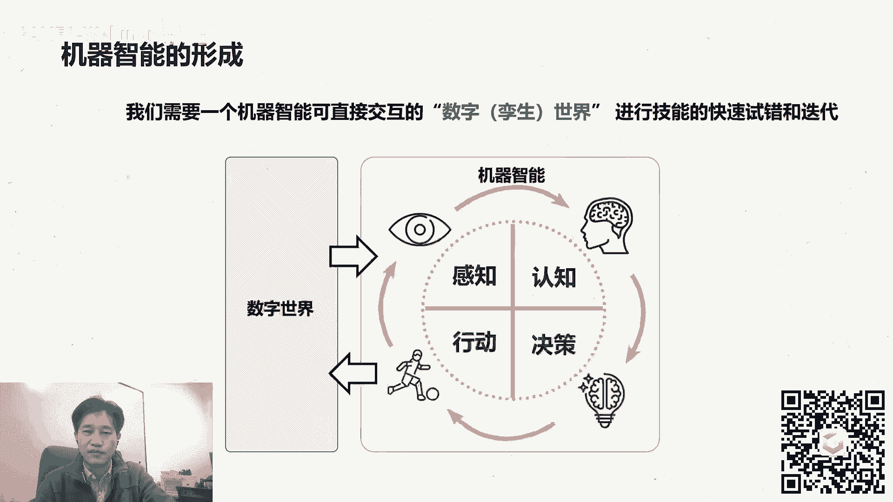

那么构建这样的一个和现实世界非常逼真的啊，这样的一个一个学科是什么呢，就是计算机图形学啊，计算机图形学就是就像southern啊，咱们的这个图形学的这个这个致富吧，算是也是图灵奖获得者。

在1965年的时候，他就说，如果说我们能够在屏幕上展示一个，这个这个数字化的这个世界哈，让人看起来是真的对吧，让人呢这个这个跟他交互的时候也是真的啊，他可能还有一些声音啊对吧，这种反馈也是真的。

然后摸起来也是真的，那它就是真的，对不对啊，所以呢，这个呢计算机图形学就是做这么一件事情，它就是构建一个数字世界啊，让你从各种感官来说，他都是真实的感官啊，和在现实中间呢是感官的是一样的。

那这是我们图形学最高境界啊，要达到的，那我们就再来看，再回到刚刚的这样的一个问题啊，就是这个一个智能体AI对吧，他来学习倒水，不是人倒水了，这AI来学习啊，那么我们要让这个AI这个智能体呀。

来学习刚刚的这些动作呢，那我们需要干什么事情呢，我们需要首先把这些容器都要建立好对吧，就是它的几何形状啊，然后呢他不会有倒水这个动作吗，那里面有水啊，水流下来它是什么样的一个动态的一个啊。

一个动态的发生啊，那这个是我们需要有准确的流体动态的模拟啊，同时我们也知道小朋友啊抓着这个这个水杯啊，去倒啊，他要控制这个水杯啊，这样呢就是他这个有一个可控的这个动作啊。

所以呢我们的图形学呢需要在底下啊，在背后啊，我们要把这样的一些东西呢都能够实现啊，才能够实现一个场景，让这个AI机器人啊，或者说是一个巨型智能体，来进行这样的一个交互啊，这个是大家看一看啊。

这是咱们这个这也是我们实验室做的工作，这么个茶壶倒水啊，这是我们辛金瑞同学做的哈，然后呢同时呢也是这个茶壶抓起来去交互啊，这个手的这个抓握的动作的生成啊等等控制啊，这些都是。

那我们可以看到生活中啊这样的一些情况呢，非常的多啊，大家看一下，你看这个布料，我们来叠衣服啊，这个我们也是在一个数字世界里面啊，给一块布啊，你怎么样去把它给叠起来哈，还有其他生活中的许多的一些场景。

比如煎鸡蛋也好啊，烘焙也好啊，甚至是切这个土豆啊等等啊，都可以非常逼真的啊，通过图形学的办法呢把它模拟出来啊，你们可以想象，如果有这样的一个交互模拟的话啊，那我们是不是你AI再去跟他交互的时候。

他是不是就可以是完全感觉到，和现实中间是一样的，对不对，他如果感觉到和现实中间一样，那么他就会获得同样的一个反馈，对不对啊，他切诶它就裂开了，这样呢他就获得经验，是不是他这样的一个经验呢。

那就是和现实世界一样的啊，那我们接下来就稍微的解剖一下啊，这个里面的有几部分啊，到底我们图形学做到什么程度了，对不对，你比如说首先几何我们图形学在早期的时候。

我们可能是通过手工啊交互的一些这个办法啊，交互性的软件来设计了很多复杂的，这样的一些形体啊，手工来构建啊，但这个呢呃不是最有效的对吧，另外一个这个办法，尤其是在我们需要获得我们一个现实的世界啊。

它的复杂的这个几何的时候啊，那我们就直接从这个现实世界中间，去数字化它啊，我们通过一些传感设备得到一些三维的测量啊，我们叫点名啊，有站点名以后呢，我们就基于我们的一些算法呀等等。

我们就能够非常快速的把它的几何构建，这是一个非常这个有效的啊，高效率的能够把自然界很复杂的这种形状啊，几何形状获取的一种方式啊，那这个我们也早期做了一些工作啊，这个你可以通过地面上开着这个这个无人车啊。

或者是空中飞的这个无人机啊也好，总的来说这个上面带着传感设备，比比如说啊像这个影像的设备啊，我们通过大量的影像，然后去重建它的三维啊，有了这样的三维以后，他一切都是精确测量的，它是三维的。

可以任意交互的这样的一个世界的一个描述，那这个世界你们看啊，因为它是从现实来捕获的，那么它就具备现实的这个场景的一种复杂性啊，那当然我们也可以地面上对吧，直接呢这个通过机关扫描啊。

这个是我们差不多10年前了啊，通过机关扫描的扫描的这个办法呢来快速的啊，直接获获得三维的这个测量啊，大量的三维的数据，我们就三维点云啊，刚刚说过，那有这样的一个大量的三维数据以后的话。

那我们就可以也是通过算法啊，我这里说到的算法，其实背后就是我们说的那些数学的基础，它可能是构成这个算法的非常重要的这个啊，这个一个一个工具啊，那我们可以看到自然界有很多各种各样的，不同的这个物体对象啊。

像复杂的这个建筑啊，树木啊等等，我们都能够通过非常有效的算法，能够把它的几何恢复啊，你想这个比例手工去交互式去建模，构建这些几何是要来的便捷得多，对不对，那再往前走，我们可以让机器人来做这个事情啊。

我甚至都不是人来操作这个事情了啊，操作这个传感设备啊，我就直接是机器人啊，那么这个机器人就厉害了对吧，因为它有传感器，它有眼镜啊，它有相机啊或者扫描设备，同时呢它也有大脑，他有计算这个能力啊。

他带着计算机啊，这样呢他在编观测对吧，就像人的眼睛一样获得影像，同时呢它边计算啊去重建，而且它还能够去决定呢啊，基于他最终的目标，比如说我要把这个场景呢完整的构建，那什么地方缺失数据呢。

它可以过去啊采集相应的数据，那这个呢又带来一个更加自动化的，这样的一个能力啊，如果场景呢变得比较复杂啊，更加复杂，对吧或者是更大的一个场景，那一个机器人呢可能还不够有效。

那我们就可以多个机器人来做这个事情啊，多个机器人协同合作啊，那机器人之间还是很和谐的对吧，或者说你设计算法让它变得和谐啊，不像我们人分工的时候，有些时候比如说我这个肚子饿了对吧，我想少做点啊。

啊经纪人呢他们互相之间协商的啊，非常的好啊，大家一起独立，没有人偷懒啊，这个方面你们如果感兴趣呢，有一期这个走进科学啊，央视啊，这个是啊讲述呢咱们这个工作啊，啊大家呢也如果感兴趣的话呢，可以看啊。

这是我以前啊这个这个实验室做的事情啊，大家可以去啊，找到视频就看一下啊，那我们接下来再看一下啊，这个啊物理反正这个事儿啊，这个可是一个很重要的事情啊，因为这个我们对这个世界对吧。

的一个所谓的真实性的一个感知，是在于它的一些动态现象，它符合物理规律啊，如果你乱动一气，那这个东西它不符合物理规律，那你就你就不觉得它是真实的对吧，所以这个物理非常重要啊，那现实生活中啊。

这个物理的这个现象呢非常的多啊，这个可能你们从高中数学啊或者生活中啊，也看到了很多一些啊物理现象啊对吧，像这些呢都是都是大家呢见过的一些现象啊，这些呢就都是通过我们图形学的算法呢啊，算出来的啊。

这个里面就包括很多，包括这个不同的这个材质啊，这个的物体，比如说弹性啊或者是粘弹性体啊，像血啊，奶油啊对吧，这样的一些啊，还有呢这些这个非常大尺度的这个变化的，这样的一些这个运动，啊还有就是衣服对吧。

这个你如果说有数字人的话，那么他就穿衣服，对不对啊，他这个衣服的动态人在动的时候啊，他的这个这个衣服的皱褶啊，各个方面啊，这个你都能够非常真实的这个这个展示出来啊，还有其他的啊等等这种的。

就相当于呢它是这种薄壳型的啊，这种物体啊，所以呢它都有它的这个啊，非常这个很很这个特别的这种物理的，这样的一些这个这个属性啊，还有就是流体啊，这个流体当然就是很好玩了啊，这个水啊，烟雾啊。

这个啊还有这种夜魔啊等等啊，这种五官实色的特别漂亮啊，这样的一些现象，这些呢都是我们可以通过高逼真的这个，物理仿真呢来实现啊，就基本上能够这个以假乱真吧，啊这是我们的目标啊，像星宇梁望啊。

几位同学呢就都是做这方面的研究的哈，这些这里好些工作呢都是我们实验室发表的啊，还有这个工作啊，这个是我们2万同学的这个发表的工作，就是前面不是说了这个有刚体啊，流体啊。

不同的这个这个这个材质的这个物体嘛，啊其实有很多的场景啊，是这样不同的材质的一个这个混合啊，比如说这个固体啊，这个落在这个液体上面，对吧啊这种现象呢大家啊比较的常见啊，像这种的话。

他就哎非常非常有意思非常有意思的，但是他很有挑战啊，因为它是两个不同的形态，但是不同的物理对吧，你怎么样把他们这个融合在一起啊，还有就是磁流体啊，这也是很重要的，这个就简单的展示一下啊。

这是我们新宇同学啊做的工作啊，这个磁流体它是大家也也不见得，生活中见得那么多啊，但是呢你们来看一下这个这个视频的话，会发现啊，这是个很有很有意思的这个这个现象哈，啊OK就不多放了啊。

这里面还有这种所谓的啊可编程的这个词，弹性磁弹性的材料做成这种软体机器人，说是机器人吧，其实它就是个薄壳，然后外边呢有这个啊磁场啊，他通过这个磁场的改变呢，他就造成了他这个形变啊。

啊他这个形变呢就让你感觉到了，他在自己这个驱动哈，像有个马达似的，好像在驱动它似的啊，在这个液体里面呢，这个这个要么是液体里面游过去哈，要么是在这个一个坡面上啊爬过去啊。

但这个里面呢其实就是磁场没有接触啊，这个对他进行控制来实现这样的一些动作啊，其实像这样的一些模拟仿真，对于我们设计一些医疗，这个微型的这个医疗机器人啊，啊变得非常重要啊。

就是其实在这个微小的这个这个手术的时候啊，我们是需要有这样的这种微小的设备，进入到人体的器官里面去，血管里面去，其实他就需要有这样的一些模拟啊，我还有很意很有意思的事情，我刚刚跟我这个做几何啊。

从现实世界中去捕获它的几何啊，几何啊，这个一样，我们从现实生活中啊，去捕获一些这个物理的这个现象啊，你比如说这是一片荷叶对吧，我们可以通过这个风一吹呀，一拉它就会形变，这个形变呢我们可以把它捕获下来。

我们捕获下来以后啊，我们就能够对它进行一个反向的跟踪啊，然后呢做一个物理过程的一个繁衍啊，所谓的繁衍就是说我能够反过来恢复它，它的几何是什么样子的，它的这个材质是什么样子的，它的物理特性是什么样子的啊。

然后获得了这个以后，我们就可以再往前去模拟它，就相当于我们把现实生活中的这样的一个物体，数字化了，这个数字化不只是个形状，数字化是它的整个物理的这个材质，各方面的一个数字化，他有这样的一个描述以后啊。

我们再去同样的一个荷叶，如果是有不同的外力作用，比如说这些水珠洒下来，或者说风锤过去，它到底会是什么样子的，诶你就可以再去前线的去啊模拟，所以这是很有意思，这个就是从生活中。

从现实世界中啊去获得这个物理啊，那这样的情况当然同样对吧，有好多不同的这种物理现象，生活中啊，刚刚的是这个一片荷叶哈，这里是烟雾啊，这个流体吧啊，这样的我一个烟雾呢在往上升的时候。

我也有不同的视频士兵从不同的角度去捕获它，那么这样我们也可以繁衍呢，他的一些物理的这个一些参数，比如说它的密度场啊，速度场这样的一些东西，这样的话呢我们就可以再拿着这样的东西呢。

像这坨烟呢我们就已经把它数字化了啊，这样的话我们可以再去前线的去模拟它啊，这个就变得非常有意思啊，还有在这个自然就我刚说的物理现象，其实动态的东西除了物理自然这个物理的现象。

还有一个很重要的一个动态的东西，就是我们的这个动物吧，啊人体是中间人是很重要的对吧，那么这个人体他怎么运动，怎么运动，看起来符合一个人的这个真实动作对吧，不懂得性格啊等等，这个呀。

也是我们要从这个实际的这个人体的动作呢，去学习啊，那我们要学习的话啊，首先呢我们就要从一个视频观察中呢，把他的这个三维的这个运动的，这个这个这个状态呢要重建啊，就像这个每一个图片的边上。

都有一个像骨架一样的东西啊，就是那么一个骨架我们要去重建它好，所以呃因为你输入的只是个视频嘛，但是你重建的是三维的对吧，你怎么样让它重建的就是一个三维中间啊，这个是物理也算是物理这个这个正确的啊。

这样的一个三维骨架运动，这个其实也是很有难度的哈，因为你只有得到一个正确的三维的东西，你才能学它的吧，否则你就学学差了啊，这就不好啊，所以这个里面呢其实啊也是及时反过来，又利用了图形学啊。

这个对股价的一些约束啊对吧，他如果是三维的东西，它运动的时候它有一些物理的一些约束，那这样的一些约束能够帮助我们去重建啊，那如果我们学到了很多的这样的一些动作以后，实际上呢那我们就可以用学到的动作。

再去驱动这个一个新的啊一个形体啊，这个形体可能高矮胖瘦啊，可能和他原来的这个形体不大一样，对不对啊，但是呢，只要我们掌握了它的一些基本的这个规则，那我们可以把它桥适配上去啊。

叫叫叫RETARGETING啊，上去这样的，他如果胖一点啊，那我们的动作该是什么样的，他如果个儿矮一点，我们动作该是什么样的啊，所以就是就是这样的一个意思哈，啊还有所谓的风格吧啊这个人体的动作。

比如说同样是走路啊，这个人走路呢你老远一看啊，你知道这是张三，那是李四，对不对，他每个人的动作都有自己的风格啊，所以呢，如果说我们数字化展示这个不同的人体的，这个动作啊。

那其实你还要把这些很微妙的风格式的东西呢，也要展示出来对吧，也要生成出来，这样呢就是感觉到对吧，他就是有些变化啊，他有他的个性啊，他不至于是一个好像千篇一律的东西啊，所以这个呢也符合就是我们真实世界啊。

看到的东西，当然对于这个这个我们生成的这些动作，我们要能够控制它是非常重要的，所谓的控制就是说这个环境，它跟这个环境呢要能交互啊，就是说你像这里啊，他都是有一些这个对象，这个数字人对不对。

他要么是自己去碰一个东西，要么是怕他他被某一个东西去去砸着了哈，他的这个动作的变化等等，这些呢就是他和这个场景之间啊，它又有交互啊，他不是说你给他规定了一些动作，她做的还挺漂亮的，对不对啊。

那样呢它就没有交互性啊，所以这个交互你要能够控制它啊，这个变得呢非常的重要啊，还有呢很重要的是什么呢，就是他又有学习能力啊，他有这个自我学习的能力啊，你看他从不会一个动作到慢慢会一个动作啊。

这个它是可以通过不断的学习呢这个做到啊，而这个学习呢，它是在数字的这个环境中来完成的啊，这个有些时候他学的是比比人还快啊，比这个人的这个学习能力还强啊，啊，这个呢是我们实验室刘立斌老师们做的工作哈。

那当然在这个世界哈，除了我们这个人这种这个两足动物哈，实际上有很多这个四足动物，那当然还有这个这个这个八爪鱼对吧，还有这个章鱼哈哈，各种各样的形体拓扑结构的这种这种生物啊。

那这个就是就是这个啊就变得更有趣了哈，我看这个有同学学的学习呃，有有同学留言还说是强化学习，这是不是AI的范畴了，是的，这个有很多东西它越来越和AI呢发生交集啊，就很多时候他是互相促进的哈。

这个我后面还会再稍微讲一点啊，另外呢其实这个人体的生成，我们知道就像这个人人还要说话，对吧啊，人有个性对吧，这个人的这个动作呢和他说的事情有关系啊，比如说你是在做一个演讲啊，你该是怎么样的动作啊。

你是在抒情，你该是什么样的动作啊，这里有个多模态啊，所谓的多模态的这个也就是说我又有声音，又有文字啊，声音呢是想他是他的这个嘴巴里面的表达啊，大家可以听一下嗯，怎么听不到啊，听到这个声音啊啊OK。

Survival we eat the food，We taste burning processes，Current feat，So what's going on here。

It turns out that，We're fighting one of the most evolutionarily conserve learning processes。

Currently known in science，When it's conserved back most basic nervous systems，known demand的。

他是有了this for word based learning processes，Called positive and negative reinforcement。

And basically goes like this，We see some food that looks good，Our brain says calories，Survival。

We eat the food，We taste it taste good and especially with sugar。

Our bodies and a signal to our brain，差不多了哈，大家得到一点这个idea啊，就是说诶你看他说话的时候，他的这个动作是自动生成的，这不是这不是人控制的啊。

这个你们确实是有AI啊，这个你们猜着了哈，还有对这个世界的深沉啊，其实还是不断地和人呢学习啊，就是我们可以把人和虚拟之间的加一个桥梁啊，就是说我们把人的动作，引入到一个数字世界里面去啊。

这样的就数字和真人之间不断地相互，这个交互呢，我们来生成越来越丰富的一些场景啊，也是让我们这个数字世界呢，就变得就是他能够不断的对吧，就是有人的真实性的存在啊，那这个这个就很有意思啊。

你看我们通过戴一个手套，对不对，戴了这个手套以后呢，我们的手的动作呢就进入到了它就数字化了啊，这样我们在这一个数字世界里面，我们就拿东西呀去做一些动作啊，它就是有一个数字的这个这个这个记录啊。

那这样的一个数字记录呢，实际上因为它数字化了嘛，我们就可以学习它，对吧啊，我们就得学习这些动作，就说哎这人到底是怎么拿这些东西的，是不是啊，我们就学，所以呢学你学到了以后呢。

当然你的这个机器人就有这个能力了，是不是啊，啊我来播放这么一个视频来看看啊，我们这是一个很综合性的方式，怎么样把所有的这些东西啊，这个串起来啊，几何的东西，这个动作的东西啊，然后实际的和虚拟的。

把它给整个给组合在一起啊，这样呢我们看到的是一个数字化的一个场景啊，但实际上呢它是有数字化现实，然后真人的表演，然后一起这样形成的这样一个场景。

And live inside the chee without a micle to my mahoto boss here，I came。

I could be brave or just insane，We'll have to see，But maybe i'm not sleepy town，Will sick one day。

I'd like her down，And see my face，And think，How do you do too long。

and chasing all the light that shine lights sunshine b好吧，这个感受一下就不一定看完啊，好那我们接下来讲讲，我们刚才已经讲得足够多了。

就说一个好像是世界模拟器这样的东西啊，但是通过cg做的好啊，这样的一个东西，到底他回过头来，对我们这个智能又有什么样的一个作用啊，智能也就是说我们怎么样去用我们这样的一个，世界模拟器来培养一个智能体啊。

培养打引号啊，就训练啊，你比如说自动驾驶对吧，我们知道这个自动驾驶要上路哈，这个车要上路啊，你肯定要跑好多地方，对不对，你要不断的测试，但是你想一想，你如果用没这个能力的时候。

你这个无人驾驶它的智能系统，它没那个能力的时候，你会让他上街吗，对吧啊，这个是很危险的啊，这第一第二呢他在一个现实的这个世界去跑啊，它这个场景是有限的啊，那在一个数字场景就不一样了啊，数字化的世界里面。

我可以随便刚刚大家看到啊，我可以改变路面的情况，我可以改变天气，我可以改变这个现在这个行人对吧，这个穿越的一个各种不同的情况啊，这个都是一瞬间就可以改变，那么这个无人驾驶系统这个大脑它没有生子啊。

这个大脑在这个CYBER空间呢，他就不断的得到这个训练啊，他不断的训练，而且呢说白了你在这个里面，就他就是他就只是消耗你的计算能力啊，你跑个10万公里，跑个百万公里都有可能，他就是耗你的CPU而已对吧。

它不会撞车，他也不会这么低啊，所以呢这个呢就是一个非常基本上，可以说是现在许多无人系统的一个标配啊，就说他一定要先在一个数字世界里面学习，学好了本事以后，然后再去在一个物理的啊。

这个身体里面就是一个物理的车里面他去跑啊，是这样的，你包括像比如说这里的一个机器人，我们从设计的时候啊，设计它的形状开始，就要模拟它的一个走动的一个能力，跑动的能力对吧，跳跃的能力等等啊。

然后直到就说这个能力呢具备了以后，我们再生成呢把它制造出来，而制造的时候当然还要进行测试对吧啊，不断的这个迭代啊，但是有大部分的时间是在这个数字空间里面，去训练测试啊，然后再做出来以后呢。

他就能够快速的这个形成了他的这个，这个能力啊，那当然这个还有很多的一些场景，我就不一一说了哈，这个你比如说做手术啊等等，或者是帮助我们这些，甚至有一些这个像啊辅助一些这个残疾人啊，对吧等等啊。

这样子就是说我们说白了就是把这个机器的啊，像机器人和这个人体啊，这个这个有机的结合起来啊，这个呢有很多的一些啊工作，那么说到这个这个智能体的这个训练，这个事儿啊，其实啊我们正在这个开发啊。

这样的一个所谓的大任务平台啊，也就是说在这样一个空间里面，你可以生成无穷的任务啊，就说你是一个厨房对吧，来做菜，还是说你在办公室什么样的一些场景，他是可以这个随时呢生成，然后随时的去生成一些任务。

比如说去拿这个水杯啊，去榨这个汁对吧啊，是切个黄瓜等等，它可以随时生成这样的一些任务啊，而这样的一些任务的话，对智能体来说呢，就是一个非常好的一个学习的机会啊，当然你还甚至可以模拟一个整个社会系统啊。

这个社会系统里面有好多的人在街上对吧，现在呢还只是说完成一些技能啊，但实际上呢我们可以把这样的一个系统，不断的扩充，不断的这个这个这个让他的这个能力加强，所以呢这就是我们这样的一个基于图形学啊。

构建的这样的一个所谓的世界模拟器吧，啊，或者说对于这个智能体来说，是一个产生无穷任务的这样一个平台啊，这样的在这个智能体啊，这个这个训练中间的发挥啊，具它的作用啊，这个费呃这个费曼哈这个FEYMAN啊。

他说过一句话啊，这个他说呢呃如果我不能这个这个生成，我就不能理解啊，如果放在我们这个上下文的话呢，实际上就是说我们cg啊是生成这个世界对吧，我们深圳这个世界是，当然也是因为我们理解了这个世界啊。

之所以我们能够深圳这个世界，是因为我们就是这个理解了这个世界，同时呢，也是能够帮助我们来更好地理解这个世界啊，所以这两个之间啊，它是不断的这个这个互相促进的啊，这个所以呢图形学这个也也也是就是体现了。

图形学和我们的这个人工智能之间啊，一个非常这个强的这个关系啊，啊我再回到我们cg的话啊，图形学那么几何的形状的构建，这个物理的规律的体现，还有运动的控制，这就是我们的核心的核心啊，核心的核心模块啊。

在这样的一些核心这个模块的这个底下呢，实际上就是我们的这个算法啊，然后算法呢实现这些算法，他最这个最最重要的是什么呢，呃那就是里面有很多的一些数学工具啊，说白了我们有一个很好的工具箱啊。

那这个呢也就是回到了咱们这门课啊，就是图形中的数学啊，我算是跟大家呢做了一个小小的d two哈，就是呃来呃至少呢就是让大家感受一下啊，图形学呢还是非常的神奇的啊，啊这么一个神奇的这个这个事件呢。

我们要啊来做点拆解啊，其实这门课呢就稍微来拆解一下啊，这个也让大家有信心，其实把它拆解到了最后就是我们这些数学工具，有了这些数学工具呢，我们就可以这个打造出非常精彩的世界啊，好吧。

我就大概是就做这么一个，做这么一个开场的一个介绍啊，这个还只是个引子啊，真正的精彩呢是我们的这个两位呃，博士生老师啊，那我们就接下来就进入到这个真正的这个，课程的内容好不好啊，我也希望未来有机会啊。

跟同学们呢在这个呃现实生活中吧，啊在线上线下能有更多的互动，好吧好，谢谢各位呃，刚刚我们介绍了这个part one和part two。

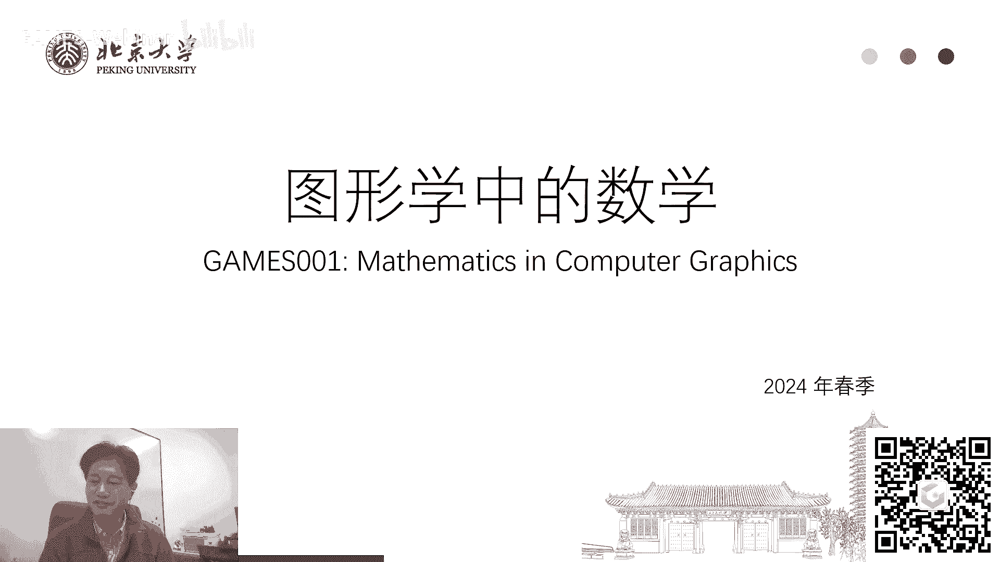

这两部分的主要的呃课程的目的，然后我们现在看一下这个342部分，然后首先这个第三部分是微分方程求解，然后这一部分的主要内容是为物理模拟服务的，因为呃从场论，然后到这个微分几何呃。

以及后面求解微分方程为为为了求解微分方程，还要构建线性系统啊，这整个的一个过程都是呃，物理模拟所需要的相关的内容，然后最后一部分是优化与拓扑，优化与拓扑这个方面主要是为了实现，刚刚陈老师给大家介绍的。

就是虚实结合的相关的内容，也包括我要通过一些人工智能的手段，去驱动我场景内的呃，这样的对象所需要用到的一些算法，然后最最后一节课的拓扑是，因为其实在CRAPH上有很多呃。

就是用一些拓扑知识来进行一些很巧妙的设计，的这样的一些文章，然后所以我们也初步的简略的介绍一下，关于拓扑的一些内容，呃有同学问是常微分多还是偏微分多啊，应该是偏微分比较多一些啊，我把摄像头关掉。

就已经跟大家见过面了，把摄像头关掉，然后右下角的这个logo我也调小一点，好的呃。

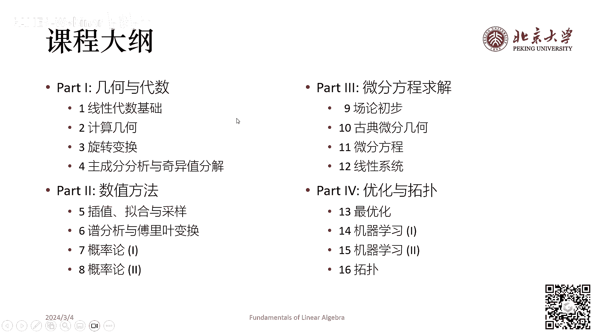

然后我们就进入今天的这个正题部分，建议大数基础，然后现在是八点钟，我们就讲到这个大概九九点，然后下一节课没有讲完的，就接着留到下节课讲，因为呃正好这节课我们要赶上了这个craft呃，这个robot。

所以就可能原本也如果这节课讲完的话，下节课也可能需要gap一次。

所以啊我们就没有讲完的部分，就下节课再说，然后呃既然是讲线性代数，那么大家其实接触到的线性代数的这个呃学习，可能有两种模式，第一种模式或许是绝大部分同学，在大学的教材里面所学到的。

上来给大家先定义行列式，然后大家先学会了行列式的计算，然后去讲矩阵的求解这样的一个途径，然后呃但是呢在国外的，包括大家在网上能看到的这样的呃讲义视频，他们走的路径都是先从向量开始说，先介绍什么是向量。

然后什么是向量空间，然后法，行列式在他们那里并不是一个非常重要的，这样的一个部分，然后呢呃我个人呢因为我们今天的这门课，它不是一个就是让大家从就是能够做到，因为我们课程容量的限制嘛。

因为它线性代数学的时候，其实是整一学期都在学线性代数，而我们只是这样用一两节课的时间，给大家讲线性代数，所以我们必然不可能用一种就是从行列式切入，还能把大家每个点都知识点都铺到，所以我们选择一个。

就是让大家能够最快的get到，线性代数到底是干什么的，他研究什么样的问题，然后想要达到什么样的目的，以这样的一个思路来介绍这个线性代数，所以我们也会选择和国外的教材一样，从向量开始去讲。

然后呃因为从向量开始去讲，对我们图形学来说，它还有一个更和与我们相符的地方，就是因为图形学的研究对象，它就是向量呃，不管我们是点的位置也好，我们考虑点的法向量也好，他们其实本质上都是向量。

那么什么是向量呢，我们因为我们的这个前置课程里面，是要求大家学的线性代数的，所以我们现在大家可能在大家脑海里，有两个向量，第一个向量是在中学的数学和物理，当中去学过的那个向量，大家那时候物理上叫它矢量。

然后数学上叫它向量，它们是既有大小又有方向的量，并且它们的运算满足平行四边形法则，平行四边形法则，就是如我们这边右图所展示的那样啊，一个蓝色的V和一个红色的W，然后两个相加得到了一个以这两条边为这个呃。

以这两条边组成的平行四边形的对角线，然后这个就是这样向量相加的结果，然后会给大家又学过这个线性代数的，这样的一个向量，那么线性代数里面的向量，是把向量定义为向量空间当中的元素。

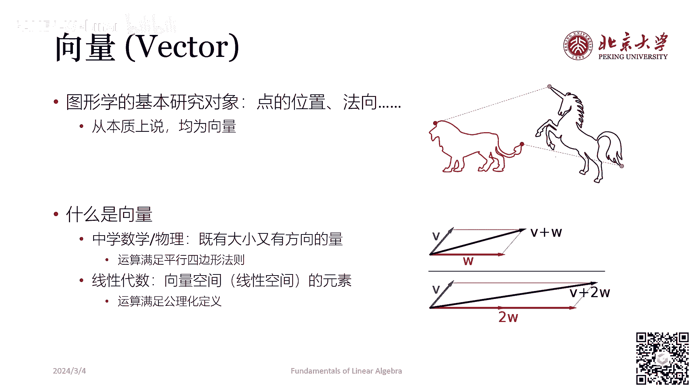

然后这些向量之间的运算，是要满足公理化定义的，什么是公理化定义呢，啊这个就是公理化定义，公理化定义是说在一个向量空间，它是定义在某一个数域F上，然后它的在上面需要定义它的向量之间的加法。

和向量与标量的之间的乘法，然后它要满足这八个运算率，第一个是向量的加法的结合律，也就是又加V加W的和，可以写成U加V的和加上W，然后第二个是向量加法的交换律，然后是向量加法的单位元逆元。

然后是标量乘法与数据乘法的结合律，标量乘法的单位里面，标量乘法对向量加法的分配率，以及标量乘法对数据加法的分配率，这些知识就是大家已经应该是都学过了，就是想要给大家回顾一下，然后在图形学应用当中。

数我们这里的数域F呢一般取为实数域R，但是呢这一点并不是就是完全笃定的，因为呃其实我觉得很多图形学的文章，他都带有一点啊这个整活炫技的成分，然后他们会巧妙地使用这个复数域。

引入复数域来解决一些实数域当中的问题，其实呃我觉得这样的思路也是很常见的，就是在物理当中，我们去定义这个量子力学的时候的，波函数的时候，我们其实也引入了复数语，而我们实际上研究的所研究的内容。

它本身反映在这个人们面前的现象，它依然是用实数语表达了这样一个东西，这里的复数语，其实是为我们提供了一些人看不见的信息，对对点乘和叉乘是不在这个体系内的，就是所谓的向量空间是可以没有点乘的。

然后至于叉乘就更遥远了，然后这样的一个这个公理化的定义，它有什么好处呢，就是我们现在研究的向量，它就不再仅仅是我们中学数学当中的那种，二维的，三维的那样的向量，它可能具有很高的维度。

然后它们之间的加法和乘法，也许和大家想象的也会有那么一点不同，但是只要满足这一些运算规律的东西，我们都可以用一个相同的方法去考察它，那么它能为我们提供相当大的便利。

就是我们可以通过二维和三维去直观地理解，什么是向量空间，然后在用的时候却去用很高的维度，这样和会很方便的去帮助大家去进行，抽象性的学习。

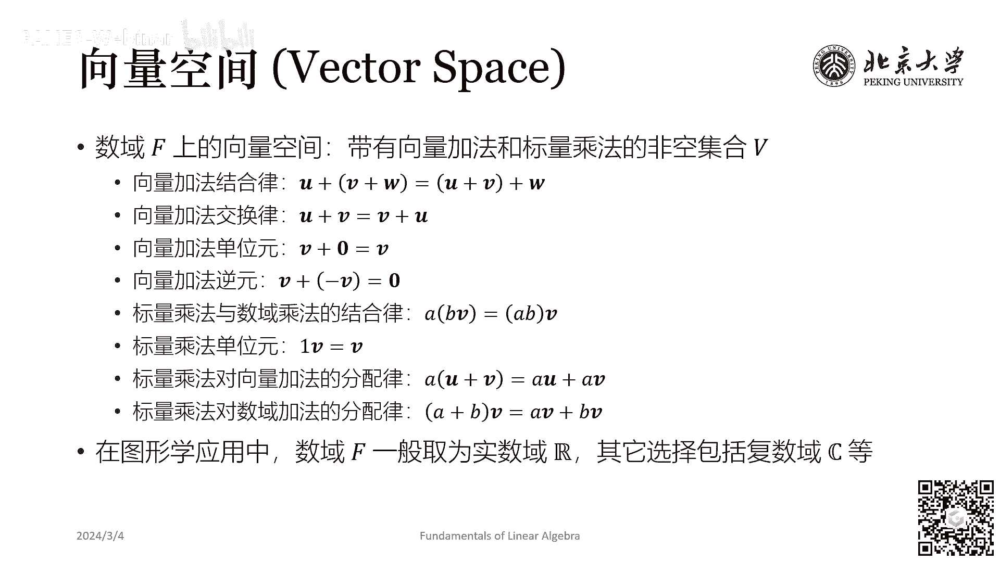

然后定义了这个向量空间以后，就呃存在这个线性组合的概念，所谓线性组合就是是说在一个向量构成的集合，从U1到UN中，我们如果存在不全为零的一组数，使得乘以A1乘U1，加A2乘U2。

一直加到AN乘UN等于零，如果存在这样一组数，并且这些A并不全为零，那么我们就说明这个一其中的U1，它就可以写成负A1分之A2U2减去负啊，减去A1分之A3U3。

一直减到A1分之ANUN这样的一个形式啊，当然这里要求A1不等于零啊，这样我们就可以，我们就称U1是U2到UN的线性组合，那我们也可以称U1到UN是线性相关的，所以说到底什么叫线性相关，什么叫线性无关。

那它其实就是说这些数之间能不能用一组数，让他们等加起来等于零，用一组数乘上去，让他们加起来等于零，它就是线性相关的，如果不存在这样的一组数，它就是线性无关的，那么为什么要定义线性相关和线性无关的概念。

概念呢，那是那是因为说，如果我们能在空间中找出许多线性无关的向量，然后我们把这些线性无关的向量的，个数的最大值，我们就它叫做这个向量空间的维度，然后呃维度的概念我们把它记成DEM。

v dim其实是dimension的缩写，然后呃这个video这个向量空间，这个向量空间的维度呢，它有一个非常嗯重要的，对我们来说非常重要的意义，就是维度，个线性无关的向量构成了空间的一组基石。

任何空间中的向量都可以唯一地表示为，这组基石的线性组合，那么如何去证明说，它可以唯一的表示为这组基石的线性组合呢，其实大家只需要去想，如果我们存在一个向量，可以表示成有两种这些基石的线性组合方法。

然后我们把这两种方法相减就会得出，要么它是线性相关，它不是线性无关的，然后要么这两个表达是完全一样的，然后呃线性组合的系数呢，就被称为是这个矢量在这组基下的坐标，然后这样的话我们就避免了。

从呃高中的那套角度上说，先上来将矢量定义为这样的一个坐标组，这样的定义方法，而是选择了运用这样的一套思路去定义向量，这样定义的向量呢呃它最大的区别在于，他有可能不是用坐标表达的。

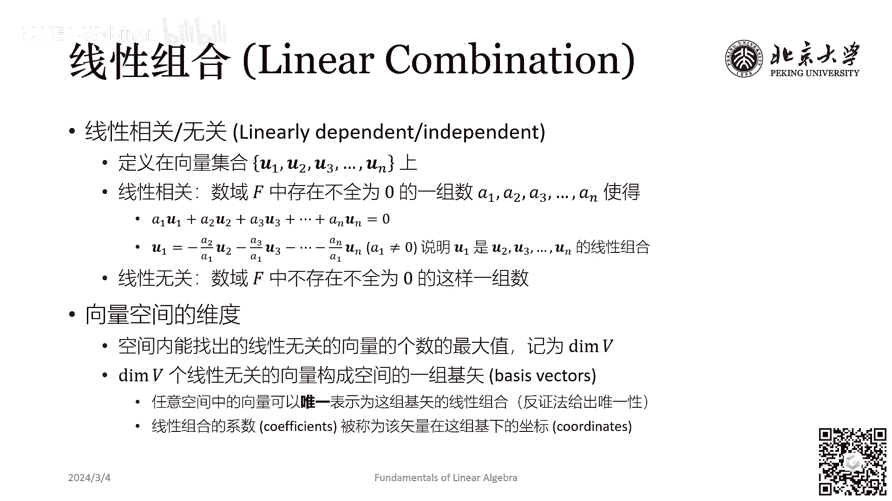

他也许只是一个抽象的概念，然后我们刚看了维度以后，我们现在就来看看图形学研究的维度啊，图形学研究的维度呢，我们就我个人把它粗略的分开，分别成了从低维向量和向量空间，以及高维向量和向量空间。

然后呃低位向量呢，呃其实我们大家涉及到的都很多，就是我高中所学的，然后这个呃数学物理里面所用的，比如说欧几里德空间，它就是定义为XYZ，然后呃，明可夫斯基空间是研究狭义相对论当中所用的。

它用的是XYZICT，然后第三位是一个虚的眼，然后这里的I是这个虚数，然后C是光速，T是时间，然后这样也可以构成一个空间，它是四维的一个空间，然后呃除了这个物理空间以外，因为物理空间。

其实我们中学当中用到最多的空间，因为呃不管是mesh也好啊，曲线也好，点云它的坐标以及这些坐标的导数，都是用这个物理空间的坐标表达的，那么除此以外，我其实觉得同学当中还有一个很重要的空间，是低维空间。

是颜色空间，颜色空间呢它是呃常用的两种颜色空间，可能大家都听说过一个叫RGB颜色空间，一个叫CMYK颜色空间，那可能大家或多或少都听过颜色空间，这个概念，但是为什么颜色空间也是可以被称为空间的。

它究竟是不是一个向量空间，然后这个问题呃其实留待大家思考一下，然后呃或者大家或许大家可以思考一下，就是颜色空间在满足什么样的公理的情况下，它可以构成一个向量空间。

然后这个问题是我们今天的作业题的第一题啊，到时候就是可能大家对这个问题感兴趣的同学，可以通过作业来学习一下，到底为什么颜色空间也是个向量空间，而除了低维的向量以外，图形学还会研究高维的向量，对。

就是刚刚那八条，就是刚刚那八条，为什么颜色空间也符合刚刚那八条，就是进行怎样的定义时，颜色空间符合那八条，然后呃高位向量呢，呃就是图形学研究的另另一种内容了，比如说灰度数字图像中所有像素值。

我们可以把它组成一个向量呃，以我们现在电脑常用的显示屏的尺寸为例，1920×1080，就是1080P的这样的一个灰度数字图像，它的维度有200万，直达，就是这200万个实数都是0~1之间的实数。

这个是他们都是这个灰色灰度，数字图像的自由度，然后这整个构成的一个维度为200万的向量，就是它整个变化的空间的维度，然后呃图形学当中，尤其是我们在模拟和动画当中，还需要去处理。

二维或者三维图形的所有自由度组成的向量，比如说这个我右边放这个图，有很多同学在弹幕里开始打了，就是呃原神中纳西达，他运动的顶点自由度数为4万5459，然后这个是顶点自由度数，是我成了三之后的结果。

也就是说它这个模型的顶点数是1万5000，153啊，这个是L0模型，因为就是如果大家呃当当然，我默认大家没有学过后面的这个渲染的课程啊，就是L0模型是指放大到精度最高的，这个状态下的模型的顶点数。

因为呃L就是图形学中一个惯用的技术，叫LOD技术，就我摄像机离角色近的时候，它顶点数就多，摄像机离角色远的时候，它顶点数就会减少，然后呃我们在c graph的文章中，进行水体模拟的时候。

我们求解的向量维度一般至少要达到100万，然后呃一些比较酷炫的效果，需要1000万的销量才能做到，所以我们可以看到这文学研究的向量，实际上是包括这个地位向量和高位向，而且这两者之间差了非常的多。

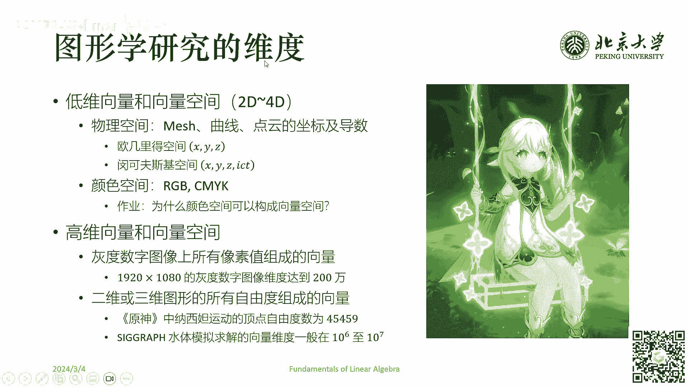

然后有了这个线性组合的概念呢，就可以去定义线性映射，这个线性映射的意思是说呃，我线性映射呢，它能将一个向量空间映射到另一个向量空间，它映射方法是呃，就是我们用F这个函数来标记起来。

然后我们发每发进去一个V当中的向量，它就会给我生成一个W当中的向量，然后呃并且它需要满足FU加V等于FU加F和F，阿尔法为等于阿尔法FV，这样的就可以一个称是保向量加法，一个是保数量乘法。

然后呃只有说大家能够做到这样的映射，它才称之为线性映射，然后线性映射它的它会有几个好处，第一个它是保证加法的单位元，也就是零元是不变的，在一个空间内的这个加法单位元，你经过线性映射。

会得到另一个空间内的加法单位，然后第二个是呃，第二个其实就是把上面两条这个线映射的定义，给写到一起，就是我们可以把FAU加BV写成A倍的FU，加B倍的FV，这个其实看起来只是把这个两个定义写在一起。

但它有一个很重要的推论，就是我们对于线性空间，或者说向量空间进行线性映射，它就相当于说把这个线性空间里的所有的基石，做一次线性映射，然后其他的坐标都不变，然后乘在一起的结果，就会得到新的线性映射的结果。

也就是现在向量空间的维度，也决定了线性映射的复杂度，然后呃我们可以看一下到底哪些东西，哪些运算，它可以构成一个线性映射呃，在低维空间里呢，呃缩放或者旋转它都是线性映射，而平移它不是线性映射。

而这个事情怎么理解呢，我们可以看到右边其实给出的是一个旋转的，线性映射的图案，呃，我们这里是将V加W这个向量给旋转到了啊，V加W这个位置，然后呢，它又可以写成是我先旋转RV再旋转RW。

然后把它们俩相加的结果，这就是一个呃旋转，这个作为线性映射，它应该要满足的性质，但是平移并不满足线性映射的性质，欢迎大家可以试想一下，如果两个向量呃，它这个加在一起，平移和先平移再加在一起。

它显然是不一样的，你会导致它被平移了两次，但是我们在计算机图形学当中，我们又常常需要平移，就是这个平移，那我们这个匝道和缩放旋转具有同等的地位，因为我们一个模型可能需要转机，需要转也需要移。

然后我们就会定义仿射变换这个东西，它是缩放旋转加平移的和。

然后我们先搁置这个仿射变换如何实现，不表我们现在来说一说这个矩阵的概念，然后什么是矩阵呢，矩阵嗯，我我我们在这个同学当中，我们不把它认为是一个二维的数字阵列，就是如果你把矩阵仅仅理解为一个。

二维的数字阵列的话，其实呃很多时候会错过一些，这个矩阵的内在的意义，而去陷入到这个数学计算的细节当中去，我们认为矩阵，它就是对线性映射的一种表示方法，然后呃如何去理解这个表示方法呢。

我们这里强烈推荐大家去看这个three啊，Three blue one brown，他们的那个视视频好像是three brown one blue，然后呃他们的这个线性代数的视频当中。

会对于矩阵的定义有一个非常直观的动画讲解，然后矩阵运算的意义，既然我们说矩阵，它就是对线性映射的一种表示表述了，那么矩阵与向量的乘法呢，那它给出的是向量在新的空间里的坐标，就是如果我的向量定义成。

我向量在元空间内的坐标，那么它盖上去一个矩阵的结果，就是它在新的变换空间里的坐标，所以这个矩阵运算，就相当于给出了一个线性映射的定义，然后啊矩阵所谓矩阵的乘法呢，它就又可以理解成对空间的多次相继。

变换的合成，它为什么可以合成，这就是线性代数的性质带来的性代数的性质是，我先将这个坐标进行一次线性映射，再进行粒子线性映射，可以先看成把线性映射组合完以后，再再去做对坐标进行一次映射。

这个是矩阵的所带来的一个啊，对于线性映射合成的一个比较直观的表达，然后一些特殊的矩阵，我们把方就是N乘N的矩阵记作方阵，然后它其实暗示了变换前与变换空间后的空间，有相同的维度。

然后啊如果一个矩阵是单位矩阵，它其实意思就是说，这个坐标进入这个线性映射之后，什么也没有发生。

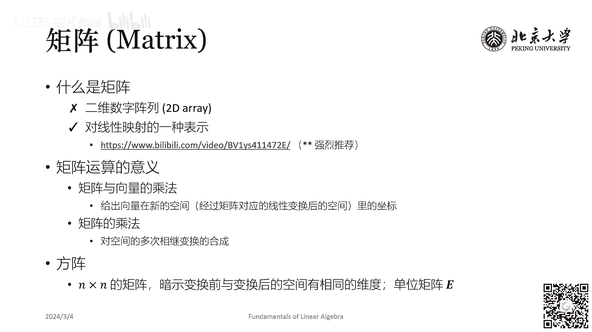

他会获得一个完全相同的这个空间，然后我们有了矩阵以后，我们再重新来回过头来，看一看矩阵的那些单目运算，它们对应的意义到底是什么，然后第一个矩阵的单目运算就是转制呃，在这个线性代数课程里面，矩阵的转置。

是说帮将矩阵里所有的元素的下标行列，都给互换，比如说原来第一行第二列的元素，现在成了第二行第一列的元素，然后我们说转置的意义，其实是矩阵对应的线性变换，在它的对偶线性空间里的逆变换，对应的矩阵。

当然这个事情，可能大家不是特别容易直观的理解，但是就是呃因为这涉及到队友空间的概念啊，为什么叫单目运算，是比如比如说A加BA减B它就是生物影响，然后如果你这个这个发进去的变量，只有一个的话。

那就是单目运算，然后这里我把所有的矩阵，单目运算作为一个组合去讲一讲，这些弹幕运算的这个呃物理意义都是什么样的，嗯啊回到这个转置上来，就是转置，它其实和逆是有一定的关联。

它并不是就是我们其实经常能看到啊，它就是用转制来实现的，那么为什么存在这样的实现，就是因为矩阵的转置，其实就是在某个空间里的逆变化，然后这个某个空间是对偶空间，然后这个这个理论会比较复杂的。

大家感兴趣的话，可以之后课后去了解一下，然后呢在复数域上的共轭呢，其实和实数域上的共轭是不一样的，复数域上在共轭除了将转制以外，还要将所有的复数，比如说原来的A加bi都改成A减BI。

原来的A减BI都改成A加BI，然后这样得到的东西叫做共轭矩阵，我们把它记成AH，然后他和实数域下的转置矩阵，在意义上是完全等同的，就是因为实数域其实不是一个，对于开根号完备的这样的一个额数据嘛。

所以其实实数域上的转置矩阵，可以看成负数域上的共轭矩阵，在虚部为零的时候的特例，然后转制之外的第二个矩阵的单目运算，就是行列式运算，行列式运算，其实它对应的是矩阵所对应的线性变换。

对于空间的拉伸程度的度量，就是我们知道线性变换，刚刚我们已经说到旋转式线性变换，缩放式线性变换，然后这个拉伸也是线性变换，然后我们每个线性变化，你既然都是在对原来的图形进行拉扯。

那你其实肯定会把原来的图形拉扯的面积呀，发生改变，T如果是二维就面积发生改变，如果是三维就是体积发生改变，那么行列式它其实就是对这个拉伸程度的度量，它的物理意义就是这个东西，然后它的计算方法。

这个大家肯定都学过，就是在N阶方阵当中，我们要选N个元素，使得每行每列各有一个元素被选出，然后把这些选出的元素求乘积之后，再把不同方案的乘积乘以正一之后加和，这个就是行列式的这个计算定义的方法。

然后呃对于这个真正应用当中呢，当然当然就是如果大家去调一些数学库的话，它里面的这个行列式的计算方法会有一些优化，不是这里说的这么简单，但是大大概可以这么理解，就对低位矩阵来说。

我们可以将N条主对角线分别计算乘积的和，减去N条次对角线，分别计算乘积的和对高维矩阵呢，就是我们在用这个高斯消元，把它全部都削成对角线之后，再取对角线元素的基，然后这里写错了，这应该是对角线元素的积。

然后呃行列式的性质是，如果一个东西它的转置行列，行列式是不变的，然后交换它的行列的话。

这个行列式会取反，就是其它的相反数，然后我们来看这个另外三个矩阵大模运算，第一个是矩阵的G也就是trace矩阵的G，它的定义是矩阵的对角线元素之和，然后啊，这我的意义就直接写成了矩阵特征值之和。

但是我们目前还现在还没有定义，这个特征值是什么，然后我们之后讲特征值的时候，才会回过头来看记这个东西，然后记它有一些非常好的性质，第一个性质是啊转制不改变，记这个很好理解，因为你爱行爱列。

转置完还是爱行爱列，然后第二个性质是转职，有交换率，就是ab的G等于BA的G，然后第三个性质是转置的，有加法上的交换，就是A加B的G等于B加A的G，这个也很自然，然后G之外就是逆，然后逆它指的是。

我们一般把它记成A的一次幂，它既是写成所有啊，只要我满足A乘上A的一等于单位矩阵，那我们就称为这个A的一，是这个A的逆，然后逆其实呃，我相信大家应该就可以很快的说出来，逆的这个物理意义是什么。

它就是矩阵对应的线性变换的逆，变换所对应的矩阵，然后呃，它当然它也可以称之为是矩阵的特征值的积，然后呃对于逆的求解呢，从最暴力的做法是伴随矩阵法，然后不那么暴力的做法是高斯消元法。

就是我先把一个单位矩阵，接在我要消炎的矩阵右边，然后当我把我要消炎的矩阵消沉，单位矩阵的时候，那边的单位矩阵就会被正好变换成它的逆矩阵，然后need的性质也是ab的逆，等于B的逆乘以A的逆啊。

这个事情很容易证明，然后第二个就是呃这个A的呃，行列式乘上A逆的行列式等于一，然后这个事情其实呃也很好证明，因为我们其实只要在行业是呃两端都去，就我们就看这个need的伴随伴随式的。

它的定义是什么就可以了，因为所谓伴随矩阵是说，A的每个元素的代数余子是AI界构成的矩阵，然后代数余子是呃AI界，这个矩阵呢是什么意思呢，其实就是它是等于它的余子式，乘上一的I加J次幂。

然后J的余子式就是删除第I行，第J列之后的行列式的值，然后呃一个性质是A矩阵乘上它的伴随矩阵，等于它的伴随矩阵乘上，它本身也等于它的行列式的值，乘上单位矩阵，然后用这个性质就可以证明。

刚刚我们说的A的行列式乘上A逆的行列式，等于一。

然后讲完了这个回，带大家回顾完这个矩阵的单目运算，以及它们的物理意义以后呢，我们就来看一看矩阵的特征值，然后对于某些，这个向量U满足拉姆达U等于AU的数，拉姆达我们称它为特征值，然后这里显然就是这个A。

我们还要规定它必须是方阵呃，这样的得到的U呢我们称为特征向量，然后每个特征值对应的特征向量呢，就可以构成一个向量的子空间，为什么是子空间呢，他们会回想到这个向量空间需要满足定义，我们会发现呃。

如果你一个向量满足拉姆达U等于AU，然后另一个向量又满足拉姆达V等于AV的话，那么拉姆达倍的U加V，也一定会等于A倍的U加V，所以只要把前两个式子加起来就可以了，那么它其实就正好满足了。

这个向量空间里面所说的，向量的加法的这个那个定律，然后如何去求解特征值呢，啊我们可以把这个就是拉姆达U等于AU的右端，减到左边来，把它写成拉姆达乘上一个单位矩阵，减去A矩阵。

然后再乘上某个向量U等于零的形式，那么这个事情它对应的是什么呀，它对应的其实是一个线性方程组，然后这个线性方程组，我们希望这个U是非零解的，因为如果U是全零的话，那么前面不管等于什么东西。

你都可以解出一个它都是零了，那就没有意义了，我们希望U是非零的，那么前面的这个矩阵，也就是这个线性系统对应的矩阵，它的行列式值一定要等于零，因为如果它不等于零的话，你就直接他就全是零了。

所以这前面的事情必须等于零，那么这就构成了求解特征值所需要满足的方程，然后这个方程是一个一元的N次的方程组，那么呃就是特征值，这样定义完以后，我们就会看到对于某些向量。

特定线线性变化的作用是合数成等价的，那这就是测量值的意义，就特征值它找出了一些在某些某些向量，在某个特定的线性变换下，它的作用是数乘，然后刚刚看到有同学问这个特征值，在图形学的应用有哪些。

然后我们就会看到，下面我就会给出一个这个特征值，在统计学当中的应用，因为呃如果大家只是学过线性代数，没有学高等代数的话，大家可能没有讲过矩阵多项式，然后矩阵多项式的特征值是这样。

就是首先我们定义矩阵多项多项式，它就是将一个多项式里面的这个所有的，原来我们写X的地方都换成这个矩阵，然后它就会构成一个矩阵多项式，然后矩阵多项式会有一些特别好的性质。

第一个性质是如果拉姆达是A的特征值，那么F拉姆达一定是FA的特征值，然后第二个是设A的特征值是拉姆达，一到拉姆达N，那么FA的特征值就由F兰姆达一到F兰姆达N，完全给出。

就是这所有的矩阵特多项式的特征值，你只要考察它的自变量的特征值就足够了，你知道多项式长什么样，你又知道自变量长什么样，你就知道矩阵多项式的特征值是什么样，那么呃我们一般的。

我们把这个最大的特征值称为谱半径，然后我们又把最大最小的特征值的比。

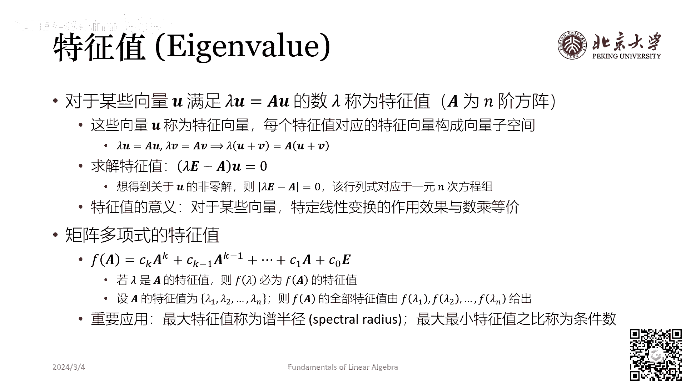

称为条件数。

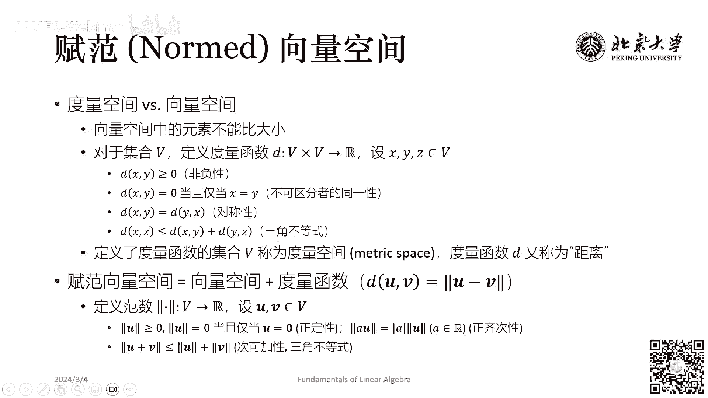

呃，对对哦，我这里面有没有把那个呃做到课件上去，然后我们可以这样去思考思考这么一个问题，如果我这个矩阵多项式就是A的K次幂的话，那么它的多项式的特征值，如果它的最大特征值又都是小于一的数。

这里就会发生一件非常美妙的事情，就是你随着多项式A的K次幂的K升高，你的最大特征值一直在下降，因为你的所有的FA的全部特征值，都是由F拉姆达给出的，而F拉姆达的最大值，或者说绝对值的最大值是小于一的。

那么你FA这个对应的矩阵的最大特征值，就相当于是一定是小于，等于刚刚的那个lambda的K次幂了，那么也就是说对于矩阵多项式来说，只要它的拉姆达是绝对值是小于一的，那么它的谱半径随着次数的增加在缩小。

我们在图形学当中会遇到很多的，求解矩阵的方程的这样的算法，而这些算法当中他们在判定收敛条件的时候，都会用到谱半径，就是因为我们如果能发现，这个谱半径一直在缩小，那么就说明这个算法是收敛。

那么谱半径在这里就起到了，这个收敛判决的作用，然后条件数呢它类似的，它也是就是条件数最大最小特征值的，比如果就是很小，那么这个东西的特征这个条件数就就低，条件数低的矩阵就好解。

然后如果最大特征值和最小特征值之间，差的特别大，就说明我们考虑的各个维度之间，它的权重差异特别大，那么这样的矩阵方程就很难解，所以矩阵多项式的特征值上来的一个用处，就是用来判定这个矩阵的收敛性。

当然特征值还有很多别的用处啊。

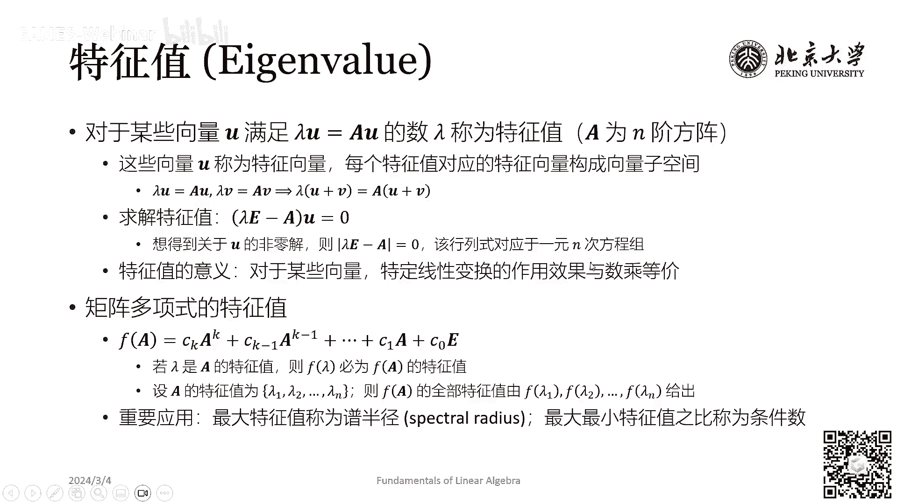

这只我只是随随便举了一个例子，然后呃现在我们就可以去，就是基本讲完了，这个向量也也不算讲啊，就是大家回顾了一下向量和矩阵，以及向量空间的内容，然后我们再来看一下这个我们平常说的点乘。

叉乘这些运算到底是怎么引入的，在引入点乘之前，我们先要看为向量去引入负数这个概念，我们向所谓范数就是这个在英文中就是NO呃，你把它称之为长度，其实也大小，我觉得都是没有问题的，模长其实都是一个概念。

就是当然有有时候感觉就是学计算机，他喜欢用范数这个说法，可能是因为这个说法听起来比较高大上一点吧，然后呃，度量空间和向量空间最大的区别是什么呢，就是向量空间中的元素是不能直接比大小的，因为你一个向量。

每个向量的方向都是不同的，我是不能直接说我一个向量就比另一个向量大，一个向量比另一个向量小的，但是如果一个集合V里面存在一个度量函数，满足以下的四个性质呢，那这个集合是由我们是可以称之为度量空间的。

这个性质，它的性质是这样的，第一个它要满足非负性，也就是说任意两个元素之间的距离，这个度量我们就可以把它理解为，去任意两个元素，比如说地图上的两个点，他们俩之间的距离它要大于等于零的，我不不能存在。

说我这个某两个点间的距离小于零对吧，这个事情非常就不符合我们的直觉，然后第二个事情是，当这个距离等于零的时候，这两个东西就是相同的，如果这两个东西是不相同的，他们俩一定不等于零。

这个叫不可区分者的同一性，然后这个这个要求其实还是挺重要的，一会儿我们会看到一个不符合这个要求的，所谓的范数，然后第三个是对称性，也就是X到Y的距离，和Y到X的距离得是相同的，然后第四个是三角不等式。

也就是这个这个我觉得也可以把它理解为，这个叫不会不能通过第三点来优化距离，这样的一个性质，因为呃我计算X到Z的距离，他就应该已经是X到Z之间的最小距离，你不应该存在说我取了一个中间点。

然后算X到Y的距离，再算Y到Z的距离，它居然还更小这件事情，所以X到Z就一定是最小的，然后这个性质我们叫它三角不等式，然后这样定义一个集合，如果它能满足这样的一个度量函数，它就叫做度量空间。

那么所谓的负反向量空间呢，它是向量空间和加上度量函数，然后这里的度量函数呢，它就是呃是将这个DUV定义成U减V的，这个范数，范数就是旁边加两杠，然后其实在高中数学物理里面，它一般都会加一杠。

写成和绝对值相同的一个形式，然后现在啊就是在计算机科学的研究里面，大家比较习惯是啊，对于向量我们用加两杠的这样一个写法，然后对于标量还是用加一杠的那个绝对值的写，然后呃所谓的这个举呃。

这个向量空间里的范数呢，就是给定向量空间里的两个向量，一个是U，一个是V，然后我们要求首先对于U考察U这个销量本身，U的范数一定要是大于等于零的，然后U等于零，当且仅当啊就是U的范数等于零。

就这两件事情要是等同的，我在这个校长空间里面，我把这个性别叫做正定性，其实它就对应于上面所说的，不可区分者的同一性，然后它还有一个正其次性的概念，就是因为向量空间里面我们可以定义数乘。

那么我们要求对于这个U这个向量乘以A，再取它的范数要等于A取范数，也就是绝对值，再乘上U的函数，这两个事情必须是等同的，然后第三个也就是次可加性，和上面一样的三角等式，就是任何两个向量相加之后的范数。

要小于等于它们分别的范数之和。

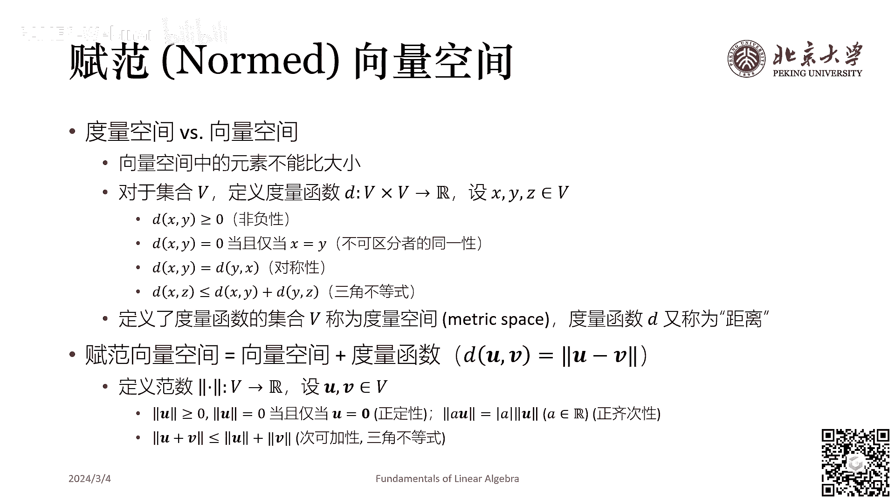

然后这样我们就可以定义复范向量空间，然后复范向量空间，一个最大家最常用的复范向量空间，就是内积空间，内积空间，一般在线性代数里面把内积空间记成UV，然后用尖括号括起来这样一个东西，然后在一般意义下。

就是呃他要求满足以下这个四条性质，第一个性质是U和V的内积，要等于V和U的内积的共轭，这个是在复述一下，然后再实数一下，其实这个共轭你就可以不看，就是说就是说那些具有呃这个交换，就交换率就可以了。

然后但是在呃复述一下，大家要记得，就是U和V的那集和V和U的那集是不一样的，然后内积也是具有线性性的，也就是U和V加W和的那集，是等于U和V的那集，加上U和W的那几，然后内机也要满足对速成的。

这个就是线性性，也就是U和av的那集要等于A乘上UV的那几啊，最后一条性质是U和U的，自己本身的内积需要是一个大于等于零的数，然后右边呢啊放了一幅图，就是给出了我们现在定了这么多东西。

然后他们之间的关系是什么样的，就是首先线性空间是一个很很，是一个很大的部分，然后度量空间又是一个很大的部分，然后在度定义了度量空间，定义了度量的这个线性空间的里面，有一部分是复范线性空间。

然后因为我刚刚看到这个范数，我们的定义是把它就是把度量这个东西，看成是两个向量相减之后的范数的，所以度量空间和线性空间的交的一部分，是复范线性空间，然后在复范线性空间里存在这么一个类型，叫内积空间。

这就是这些空间的这样的一个抽象的概念，然后复范线性空间和内积空间的关系，是什么样的，就是我们的这个复范线性空间，它其实只给出了向量的长度对吧，我们其实并没有要求任何别的东西。

但内机除了给出向量的长度以外，它还能给出向量的夹角。

对，然后就是我们来看内机是如何给出，向量夹角的呃，内机与正交的概念是这样的，因为我们在内机当中，我们取U和V的内积，再除以U的模长乘以V的模长，也就是U的和U的那集，乘上V和V的那集，再开根号啊。

这个得出来的是两个向量夹角的余弦，也就是CAUV是等于r cos刚刚这这个东西的，如果cos theta u v等于零，也就是说如果他们俩的夹角是90度，这个时候我们就称为这两个向量是正交的。

然后正交基底是这样，就是一组两两之间互相正交的向量基底，然后他又是这个呃，我们又可以定义单位基地，单位基地就是说如果这个基地的模长都是一，它就是单位基地，然后正交基底加上单位基底就可以升。

就称之为单位正交基底，然后只要通过施密特正交化和规范化，就可以使任意一组向量空间的基地，都成为单位成交基地，单位正交基地的性质是这样的，就是如果我们设U是U1，U1加U212加U3E3。

V是V1加V212加V3E3的话，那么U和V的那集就等于它的每一个坐标，直接相乘再相加，当然我们之前在高中学习这个内机的时候，我们其实只是学了就是坐标形式的，并且是这个正交基底下的坐标形式。

然后我们今天的这节课，那我们今天可能讲不到那里，我们会提出说两个内积，它不一定就等于对应的坐标相乘再相加，因为并不是所有的机理都是单位正交基底，然后呃在单位正交基地的基础上，如果有存在一个线性变换。

使得一组单位正交基地，变成了另外一组单位正交基地，那么这样的一组变换，我们就称之为单位正交变换，然后单位正交变换它的有个性质是，它不改变任意两个向量的内积，因为还是还是一样的。

就是大家可以回想刚刚我们的这个证明过程，所以啊单位正交变换它对应的单位正交矩阵呢，它其实我们称之为旋转，它就是它不能完全等同于旋转矩阵，它是满足于它，它显然是和旋转矩阵一样。

满足A的转置和R的逆相等的这样的一个矩阵，但是呃还存在一个守信的问题，就是我们说在有哪些线性变换，不改变两个向量的内积呢，除了除了把模型转一圈，还可以给模型照镜子，我的镜子里面的世界。

它的内机和我们的现实世界的内机，也是任意两个向量都是完全相等的，所以呃旋转呢加上镜像空间内的旋转，这两个事情一起构成了所有的单位正交矩阵，然后我们呢把所有的这个呃在RN空间当中的，单位正交基底。

加上原点构成的坐标系呢称之为笛卡尔坐标系，然后在笛卡尔坐标系下，由于这个任何两个向量的内积，就等于它对应的坐标相乘，再加和的结果，所以我们也可以用这个转置和向量乘法，和矩阵乘法的形式去定义内积。

把这个内积写成U的，转置成V或者V的转置乘U。

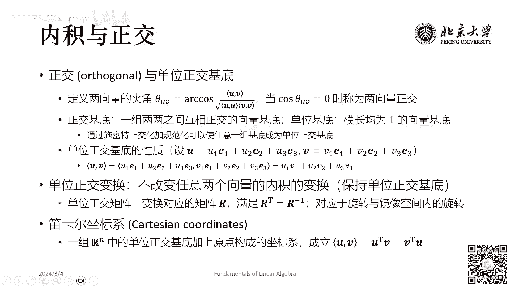

然后这里呃我们稍微拓展一下，去谈一下这个要正空间，然后呃我这里采用了物理上的译名叫妖正空间，我并没有用数学上的译名，这个有空间就很多人可能和我一样，当时刚学到有空间的时候。

就觉得他这个翻译有什么玄妙之处的，他是不是和这个呃地支有什么关系，因为地支有12个，那是不是有12种不同的空间，但事实上不是的，这个有空间就是根据这个英文unitary音译过来的，所以我觉得他这个翻译。

实在是让人不是非常的理解，所以我觉得物理上的这个翻译更好，腰正腰就是单位的意思，正就是这个正定的意思，所以叫叉腰正空间更符合这个空间的意义，然后所谓腰正空间，它就是定义了内积的复数域C上的线性空间。

然后呃，他这里的内积呢是通过埃尔米特函数来给出的，然后这个埃尔米特函数其实是一个，跟我刚刚说的对函数很像的东西，但是它是和呃在复数域当中定义的，然后腰正变换呢，就是将腰正空间中的单位正交基底。

变换为另一组单位正交基地的变化，它听起来和我们刚刚说的这个单位正交变换，也非常的像对吧，但是呃单位正交变换其实是腰正变换，在实数域啊，什么特例在复数域中的这个这种变化呢，就叫腰正变换。

然后腰正空间和妖正变换的意义是什么呢，呃其实它最重要的用处就是在量子力学当中，因为量子力学的波函数是在复数意义上定义的，然后我们说一个量量子算符，它如果需要可能被我们是正常的世界要观察，观察到的话。

就是最后我们又会去取这个它的这个波函数，所对应的，把它算成这个概率密度，所以呃这个过程当中我们需要消化器算特征值，这个特征值的表象，就是这个算符的特征值的表象，就是我们真实去观察一个量子态之后。

得到的结果，然后这个里面就会涉及到这个腰正性的概念，就是一个算子，如果他是保内积的，那我们就称为这个算子叫腰正算子，然后呃量子力学它是波函数，就是函数上为什么也能定义内积呢。

其实呃我们在这个图形学当中也会遇到，非常多的函数上定义内积的情况，因为所谓的函数空间，它其实就是无限维的向量空间，你你一组就是如果你看呃我们的一个函数，它其实是发给我一个值，然后我给他吐出来一个值。

然后我们的向量呢，你也可以看成是发给我一个下标，我给你吐出来一个值，那这个函数它其实就是无无穷维的下标对吧，我们可以这样去理解这个东西，所以啊对有同学说，这个乘积的积分是函数的内积吗，啊是这样。

就是一般情况下我们是把两个函数的乘积，然后在它的定义域上的积分，给算成这两个函数的那几，然后我们之前所讨论的一切定义的概念，全部都可以往函数空间上去拓展，比如说这个呃这个内积呀，也包括什么妖正变换啊。

这些全部都可以往函数上去拓拓展，就大家如果看见某个时候忽然跟你说，我定义一些函数的内积，然后甚至去求函数的特征值啊，大家不要太觉得恐慌。

你就把它理解成是一个无穷维的向量空间，就可以，然后我们现在补完了所有的这个矩阵的，基础知识以后，就可以来看一下这个东西，在图形学中的应用了啊，对这个可能刚刚会感觉知识有点陡峭。

但是那些内容就是如果感兴趣，大家可以去看这个相关的，包括西RAPH论文，也包括这个量子力学的，其实啊就是量子计算，他们也会以这些东西为它的基础，然后如果不感兴趣的话。

我们还可以从回到这个更简单的这个图形学的，线性代数上来，比如说我们刚刚忘掉那些高维的向量空间，我们现在回到最低维的向量空间上去，在二维的世界当中，如果我存在哪些线性变化呢，首先我存在这个缩放。

二维的缩放是什么样的，二维的缩放其实就是一个对角矩阵，比如说如果我的X和Y的话，然后呃最早起真的一一是SX，然后二二是SY，然后他说他指的就是我在X方向上的拉，这个缩放和Y方向上的缩放。

我看到右边最上面这幅图，然后左边这个钟表，在经过这样一个矩阵缩放之后，我们会发现它在Y方向被拉伸了，然后在X方向被压缩了，这就是这样一个缩放矩阵的结果，然后第二个就是这个剪切矩阵，这个剪切的矩阵的啊。

形式呢大概是可以写成，就是它相当于是一个单位矩阵，加上一个某一侧的一个缩放量S，然后比如说右边，我们看到一个沿Y轴的这个剪切是这样的，就是它的一一和二二的下标的数都是一，然后它的二一这个下标数是S。

然后我们经过这样一个，呃呃说反了啊，这个沿X方向的，然后沿X方向的这个剪切之后，得到的是右边第二幅图这样的一个形状，然后第三个就是旋转，然后二维的旋转是以这样的，这个三角函数给出的。

这个fine就是它沿逆时针方向的旋转角度，呃我们看到右边这幅图是旋转45度的结果，因为大家可以看到那1。707是什么东西啊，其实是二分之根号二对吧，根号二其实是cos4分之派对，cos45度之后的结果。

这个是二维的。

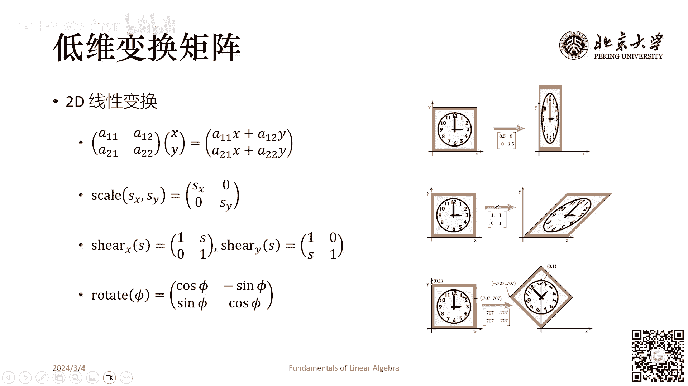

这个二维的大家就是肯定或多或少都接触过了，然后我们就可以看到来到三维，然后三维的呢啊，其实三维的缩放和之前是一样的，三维的缩放是XXXYXZ，然后三维的这个剪切是解释一个单位矩阵。

然后加上在某某些角落加上S2和S，然后三维的绕Z轴的旋转旋转矩阵长，长底下这个样子，就是其实可以看到它和前面是完全相同的，只不过是说我多加了一个维度，然后在最右边的Z轴，那个三三的那个元素那里摆了个一。

但是就是这个东西它完备了吗，它不完备对吧，因为我们在三维当中，我们不能说这个东西还是总是绕Z轴旋转，我们希望它能绕任意轴旋转，然后这个时候怎么办呢，其实呃最简单的方法就是，我们把这个绕Z轴的旋转。

左边乘上一个旋转矩阵的逆，右边乘上一个旋转矩阵，我们先把你要的旋转轴给转到Z轴上去，然后把它转一转，然后再把这个旋转转回去，这样就实现了绕任意轴的旋转，然后这个呢这个旋转。

因为是图形当中非常重要的一个部分的内容，我们之后会有专门的一讲来讲关于旋转的知识。

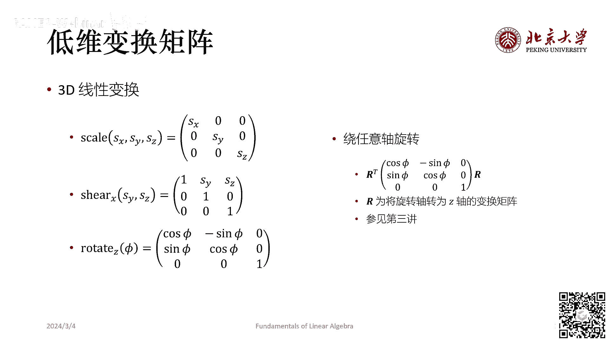

然后我们对会讲四元数，会讲四元数，四元数是在这个图形学，尤其是刚体的运动当中，是完全不可或缺的这样一个存在，因为你用别的一切旋转表示方法，都会存在这个锁的问题，会导致有些方向应该能转，但转不过去。

所以四元数在同学当中很重要，然后我们回到这个问题，刚刚我们说到我们讲了讲缩放，讲了讲这个剪切，又讲了讲这个旋转，那么我们还是没有解决平移怎么办这件事情，然后平移的怎么办呢，那我们就引入齐次坐标。

所谓齐次坐标就是说我们用原来N维坐标，它就是N个数，但是我们现在要用N加一个数，来表示这个N维坐标，比如说呃在二维当中，我们现在的三个坐标是XYW，然后它表示的实际的坐标，其实是X除以W和和Y出一大堆。

然后在三维呢原来的这个坐标是XYZW啊，类似的也改成了S除以W，Y除以WZ除以W，这样的来表示一个三维当中的点，我们看右边这幅图，其实就是二维的这个笛卡尔坐标系里面的一二。

这个点它在齐次坐标下可以写成121，也可以写成242，也可以写成三十六三，但它们指向的都是同一个点，然后我们而且这些点之间，你可以在三维空间中，可以用一个轴把它们全都联系起来啊。

这个事情其实呃就是还是挺直观的对吧，然后你定义了这个引入了这个新坐标以后，我们就可以去平移了，平移的做法是呃，我们把这个可以定义这个二维仿射变换矩阵了，二维仿射变换矩阵的左上角的四个元素。

和这个二维变换矩阵的四个元素是完全相同的，然后右边第三列多加了TXTY和一，然后我们把它乘上去，就会发现它等于说是一个旋转缩放之后，一边有一个加TX，有一个加TY，这样我们就实现了这个平移这个过程。

然后呃，一般来说，这个平移变换是在线性变换完成之后进行，我们看这个上面这个矩阵乘法也能看出来，我们是乘完了以后再加的TXTY，所以默认顺序就是胡迪尼亚布兰德，这种商业的图形软件里面。

默认的顺序都是先缩放再旋转再平移，当然这是默认的顺序，它是可以改的，就是因为它都是其次坐标下的线性变换，所以线性变换是可以任意组合的，你当然也可以实现说先平移再缩放再旋转。

只是说以缩放旋转平移这样的顺序来执行，对于计算机来说，就他的建立来说，这个方程的建立来说是最自然的。

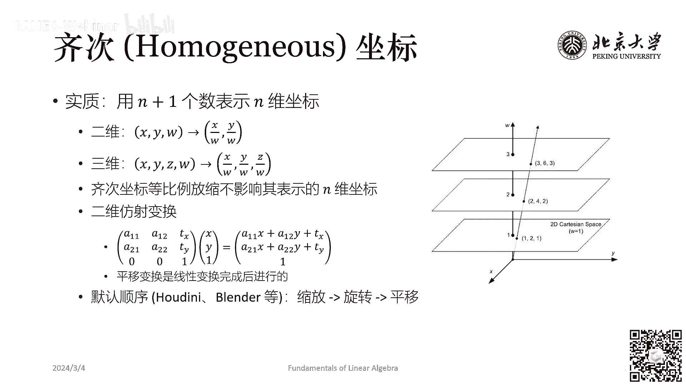

然后呃在有了矩阵，又有了一些基础的矩阵变换之后呢，我们可以看看一看，这个就是矩阵的变换是什么东西，我刚刚讲了线性变换，因为矩阵就是线性变换，那么既然矩阵是线性变换的表示，那么矩阵的变换是什么。

矩阵变换其实是线性变换的变换，就是这样东西，它其实不是一回事，然后呃最重要的两种矩阵变化呢，就是相似变换和合同变换，相似变换是说呃存在一个可逆矩阵P，使得P的逆乘，以这个矩阵再乘以P等于B。

这个时候我们就称为矩阵AB是相似的，然后它的意义是什么呢，其实A和B它是同一个线性变换，它只是在不同的基底下，它所才形成了不一样的矩阵，因为这个P它对应于一个这个不改变空间，维度的这样一个线性变换。

所以它只是改变了这个就是空间里的坐标，的基底，就是我把基基底给改掉了，所以他才导致了说这这两个矩阵不一样，所以A和B就是同一个线性变换，在不同基底下的表象，然后相似矩阵可以对角化啊。

我们可以利用相似这个性质来进行对角化，就是当存在N个线性无关的特征向量的时候，我们就可以将矩阵其相似为一个对角矩阵，那么它其实意意思是说，在某一个特殊的基底下，这个矩阵对应的线性变换。

就等价于一个纯缩放的变化，其实这个事情啊，我觉得大家也可以这样去理解一下，就是比如说我沿这个X轴拉一拉，再沿45度角拉一拉，这个东西在笛卡尔坐标系下，它一定不是一个对角矩阵。

但是如果我的基底分别取向X轴和X方向，沿45度角的那个向量的话，它在这一组基底下这样的一个变化，它就是一个纯缩放变换，所以这个时候他就会成为一个对角矩阵，所以对角矩阵就是纯缩放变换。

刚刚让大家在低维的二维和三维的那里也看到，然后呃相似变换以外就是合同变换，合同变换的含义是说它和相似变换非常像，但是它的就是变换的矩阵原来是P逆乘A乘P，现在变成了C转置乘A乘C。

如果存在一个肯定矩阵C，使得它的逆乘以A再乘以C等于B的话，这时候我们称为矩阵，A和B是合同的来记作A就是两个波浪线B，然后这个的意义是什么呢，它其实是同一个二次型在不同机底下的表象。

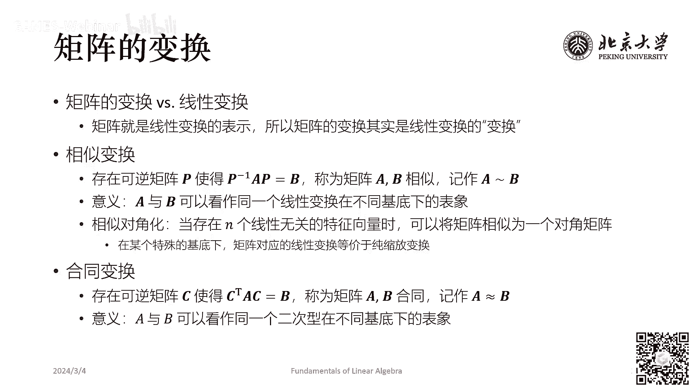

然后这个事情其实在同学当中有很大的应用，比如说从医学当中，大家会学到这个贝塞尔曲线，然后呃BEL啊，nerves曲线，尤里被塞尔这些种种的曲线，还有他们对应的曲面，然后这些曲面它其实都可以写成二次型。

比如说我们在高中的时候，大家学过的圆锥曲线，它的标准形式是这样，X平方加2BXY加C，Y方加2BX加2UY加F等于零，然后这个东西它就可以写成一个二次型，什么叫二次型呢，就是它可以写成一个矩阵。

一个向量的一个行向量乘以一个矩阵，再乘以一个列向量，然后这样乘出来之后等于零，这个东西我们就把它称之为一个二次型，然后它一般形式就是X展值乘A再乘X，然后X就是坐标，这个A就是这个二次型。

这个矩阵就是这个二次型，然后我们来看合同变换，它干了什么，合同变换就是X的转置，乘了中间的这个矩阵的变化，然后又乘以S，然后我们利用这个矩阵的运算性质，稍微变形一下。

我们可以把它写成C这个矩阵先作用到X上，然后再把CX的结果转至再乘以A，然后再乘到这个CX上，然后这样等于，所以它其实只是说我们把X都给变化了，基底对吧，我们把基底变化了，变换完了以后。

这个A也要相应的发生变化才行，因为如果你只变X，那你其实就相当于取得另一组坐标，去算这个二次型，如果为了保证这个二次型不变，我要把中间的A也给变掉才对，所以这个时候这个A要换成之前说的那个B。

这个这个这就是合同变换的意义，那么一个最基础的应用就是说呃，比如说上面我给了一个圆锥曲线是长这样的，它有非常多的交叉项，比如说2BXY，然后这个还有这个2DX，201Y这些东西我们在高中都没有学过。

因为椭圆的方程，我们高中学的就是X方除以A方，加Y方除以B方等于一，然后这个方程是什么呢，这个方程是一个长轴和短轴，分别和X轴与Y轴平行的这样的一个椭圆，如果我想把一个朝任意方向的椭圆。

变成一个标准形式的椭圆，我就要进行合同变换，就是我需要把它的这个椭圆的系数矩阵，进行合同变换，然后他因为椭圆的系数，就是这个标准形式的椭圆，它直接写下来，就是下面这样一个形式。

就是XY1乘上乘上这个矩阵，再乘以XY1，然后中间是一个，只有一对角线上有元素的这样一个形式，我要把上面这个矩阵表示给，转化成下面这个矩阵表示，就需要经过合同变换啊，这个就叫二次型。

然后二次型二次型，它在它可以与分析进行一定的结合，就是呃我们把所有二次型满足X转置乘以A，又乘以X大于零的这样的一个矩阵，就对于任意的向量X都满足，这种事情的这样一个矩阵，我们把它称之为正定矩阵。

在这个正定矩阵当中呃，呃有正定矩阵有一个应用领域是在于解方程，因为尤其是高远的，应该叫多元的函数的解方程呃，比如说我要求一个二元的可微函数FXY，那么它的二阶的微分可以写成右边这个形式。

就是DXDY乘上，中间是一个二次型，它是偏方F比偏X方，然后偏方F偏Y方是它对角线，然后它非对角元是偏方F偏X偏Y，然后这个是一个二次型，这个二次型给出了这个二元可微函数，沿任意方向的二阶导数。

所以如果上面的这个这个这个二次型是恒正的，它其实意思是说这个二阶的导数，沿任何方向都是很正的，它其实就是说我的这个二元可微函数，在这个特定的XY值处是几小时，也就是说我们通过这个算法。

找到了这个地方的一组极小值，也许大家在解这个矩阵方程的时候，尤其是这个解模拟的时候，对一个挤占方程往往需要要求说呃，这个方程是正定的，为什么他需要这个方程是正定的，其实它就是他的药。

这个二阶导数的方程正定，就是保证说我能去优化到这个最优解，如果这个二阶的方程不正定，也就是右边这个东西存在某个方向，它的二阶导数不是恒大于零的，那这个点它就不会有可能它就不是极小值点。

所以这个我们在优做优化或者解方程的时候，去要求镇定性，就是这个原因，然后正定矩阵的性质是说正定矩阵的特征值，它是全部都是正数，当然逆命题是不成立的，另外就全特征值都为正数，它也不一定是正正定矩阵。

然后呃正定矩阵之外呢，有个稍微宽一点的条件叫半正定矩阵，那就是满足X转置乘，A乘X是恒大于等于零的矩阵，然后这个时候它有可能它乘出来，就不不是完全大于零的，那这个时候这个这个点。

它就有可能不是极小值点啊，可能是一个N点，但但是不管怎么说，这也依然是一个比较强的一个性质啊，不是而不是安点，是那个平稳点，然后这个时候但它也是一个比较强的性质，所以我们有时候就是。

如果你这个矩阵它不是正定，那是半正定的，那他也会有自己对应的一些这个结算的方法，然后呃正定矩阵，我们可以看到刚刚这个矩阵它不仅是正定的，就是就是刚刚我们看这个二阶微分中间，这个矩阵它不仅是正定的。

它还是对称的，也就是它的转置和它本身是相同的，所以啊我们又把这种矩阵，这这这样的矩阵呢，就是这种实数域上对称矩阵呢，又称之为实对称矩阵，然后呢，一个实对称矩阵，一定可以被一个正交矩阵对角化。

正交矩阵就像我刚刚说的是，我们是通过相似变换来把矩阵对角化的，而这个呃相似变换对角化靠的是P逆乘以A，再乘以P本身，然后如果他是正交矩阵的话，就相当于说它既是一个正交变换，又是一个这个呃合同变换。

然后呃对于实对称矩阵来说，刚刚我们说的那个逆命题不成立的时候，它便是它是成立的，也就是说只要特征值全为正数，那就是正定正定矩阵特征值，这就是对实对称矩阵来说，只要特征值为正数就是正定的，这是我们常用的。

判断一个实对称矩阵，是不是正定矩阵的一个办法，然后在复数域上的呃，这个矩阵啊，我们这里补充一下，他们说实对称矩阵是说满足A的转置等于A，这个是在实数以下满足的，如果再复述一下。

他其实要求的是A的这个这个共轭矩阵的，它是等于A的，这个我就来复复述一下吧，埃尔米特矩阵共轭转置矩阵和它本身相等。

这种矩阵叫做埃尔米特矩阵，然后今天的呃对，然后看老师应该是到了九点钟，然后我们今天这个课件，刚刚带大家把这个比较基础的知识都回顾了，然后下一节课我们还需要讲述的内容是啊，矩阵分解。

然后以及矩阵的各种各样的范数，以及矩阵的导数，还有张亮的相关的内容啊，这些我们就留到下周一去讲，然后因为今天课没有讲完，所以我们的作业题也这个，下周一的时候在布置啊，大家有什么问题吗。

啊有没有更进一步的讲解，是有一些这个课，刚刚我对他就是线性代数的最基础的内容，可以去看这个呃three b one b的他们的那个视频，这个视频在B站上有官方中文版啊，去搜一下，很容易就哦找到了。

然后呃别的一些就是内容的话，呃线性代数还有一本书叫linear algebra done right，这本书是挺好的，就大家可以去提前去看一下，然后作为一个学习对，然后这个这是这是现代复习啊。

这个就前面内容都是现代复习啊，就是因为这个我们但要快速的带大家get一下，我们到底要用到哪些现代知识，所以这些东西并不是一个叫我觉得不算一个，就是教学的过程和下节课关于求导和范数的。

以及张亮的部分可能会稍微讲细，啊作业的形式，我们在刚课程刚开头的时候说过了，作业的形式是呃，以这个要求大家以一个PDF文档的形式，就本节课的作业是PDF文档的形式，去做一些证明和计算题。

包括我刚刚其实已经留了两个作业，第一个作业是那个证明在特定的假设下，颜色空间是一个向量空间，然后第二个证明是证明，关于矩阵多项式的特征值，呃函数求特征值没有太听清楚啊。

就是对这个课会有上传GAMC的录播，对我之后结束这个课程的时候，就会有录像，公众号，公众公众号我也不是很清楚，可能之后要问一下这个技术技术人员，啊函数求特征值，就是说一个矩阵函数的特征值。

等于它的特征值的函数，其实这个结论非常容易记记住，就是也是比较想当然的一个结论，函数空间因为不是这个图形学研究的重点，因为图形学是往往是选择，把函数空间给用向量去表，向量空间去表示，而不是倒过来。

因为我们研究的终究是一个离散的问题，所以呃就是函数空间，我只是说大家如果看到这个概念的话，你可以把它理解成向量空间，但是事实上在图形学当中，你反而是要把一个函数空间给看成，变成一个向量空间，才能去算。

而这些数学的证明，其实呃大家就是如果你掌握了的话，对你之后比如说学习研究来说会轻车熟路一些，但如果你不掌握的话，你知道有这么一回事，然后你记住去用，其实也问题不大。

但是就是如果当你需要去产出一些东西的时候，你会觉得如果你会证明的话，你能做一些别人想不到的事情，啊总总之就是这节课呃，因为时长的关系，我们就是先把这个，大家可能就我们刚讲的所有内容。

就是大家在现代课本上听过的概念对，是这样，然后之后下节课我们会讲一些，大家可能在现代课本上属于遗珠的部分，他没有他提到的一些啊，那些部分可能会讲的详细一些，作业系统的网址啊，在这一页的PPT。

在在我们PPT的最后一页，但是今天因为没有讲完，所以大家也不用太着急，我下节课会放出来，啊是有很多现代课本上没有，我主要是讲了一些，跟这个这些现在课本上提到的概念，它本质上的几何意义。

或者说物理意义是什么，对参考文献我今天会把，我今天会把这个就是前面的26页的PPT，给大家发到，发给这个我们的技技术技术人员，然后他们先传一下。

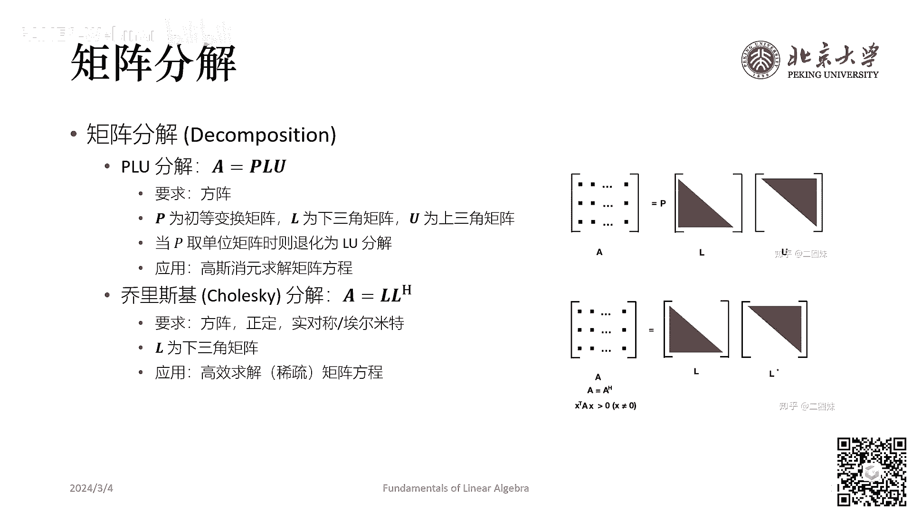