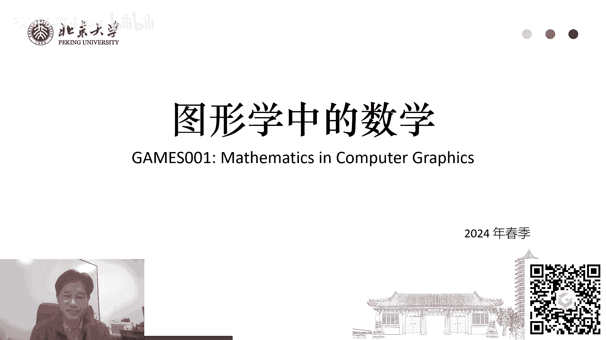

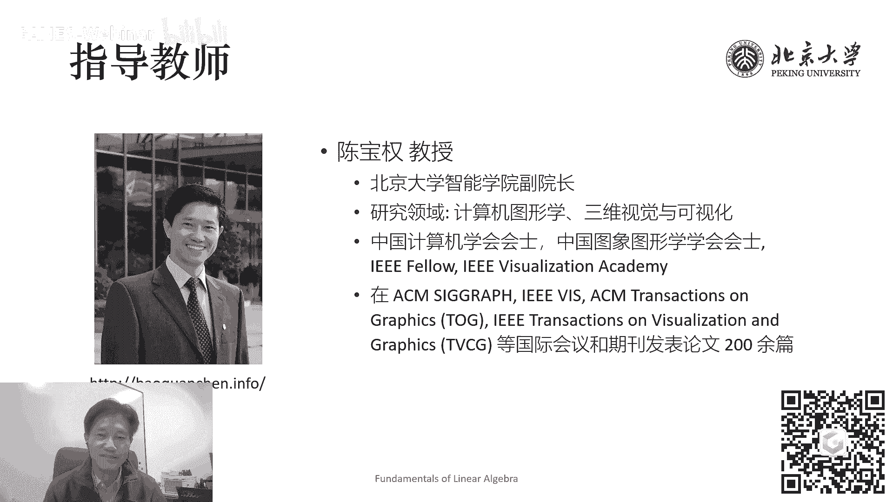


# GAMES001-图形学中的数学 - P1：线性代数基础（一） 🧮


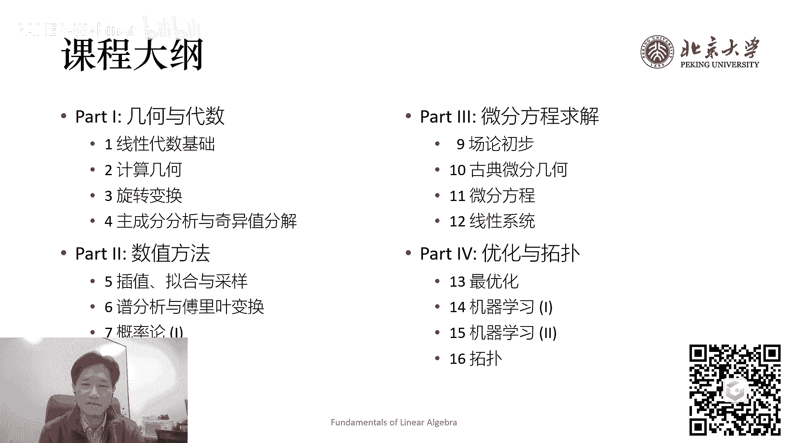

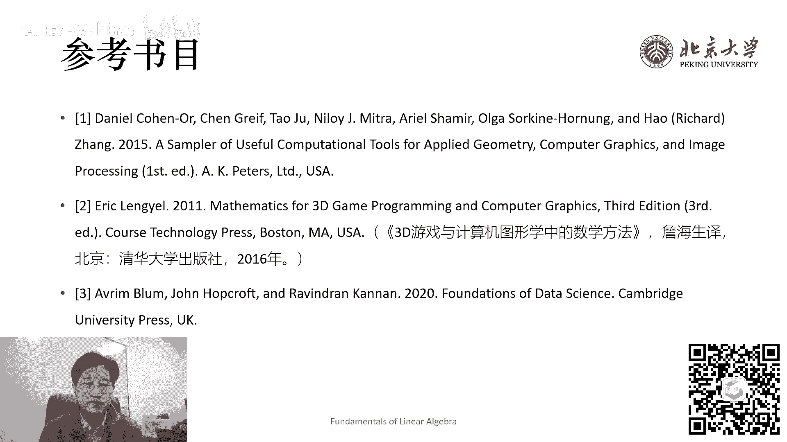

在本节课中，我们将要学习计算机图形学中至关重要的数学基础——线性代数。我们将从向量和向量空间的基本概念开始，逐步理解矩阵、线性变换及其在图形学中的直观意义和应用。课程内容旨在帮助大家建立图形学视角下的数学思维，让抽象的数学概念变得“看得见”。

---

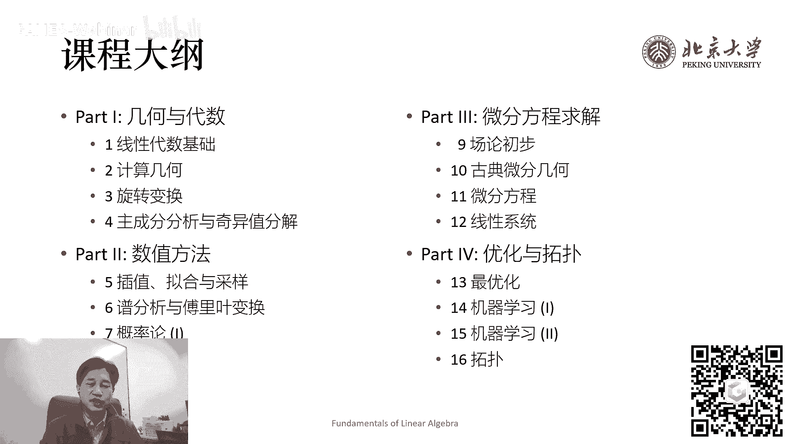

## 课程介绍与团队阵容 👥

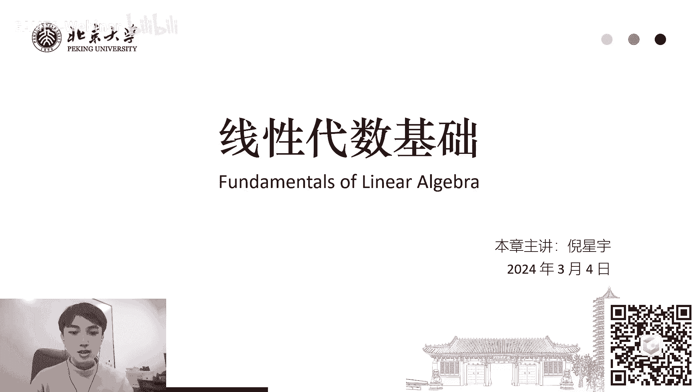

本课程由陈宝权老师及其团队主讲。课程讲师包括陈老师实验室的直博生李新雨和阮梁万，他们均从事物理模拟仿真方向的研究。助教团队由陶林霄、王瑞成、朱月城和余成组成，他们都是具有丰富图形学教学和研究经验的本科生或研究生。

这是一个庞大的教学团队，希望与同学们有良好的互动。

---

## 课程大纲与设计思路 📚

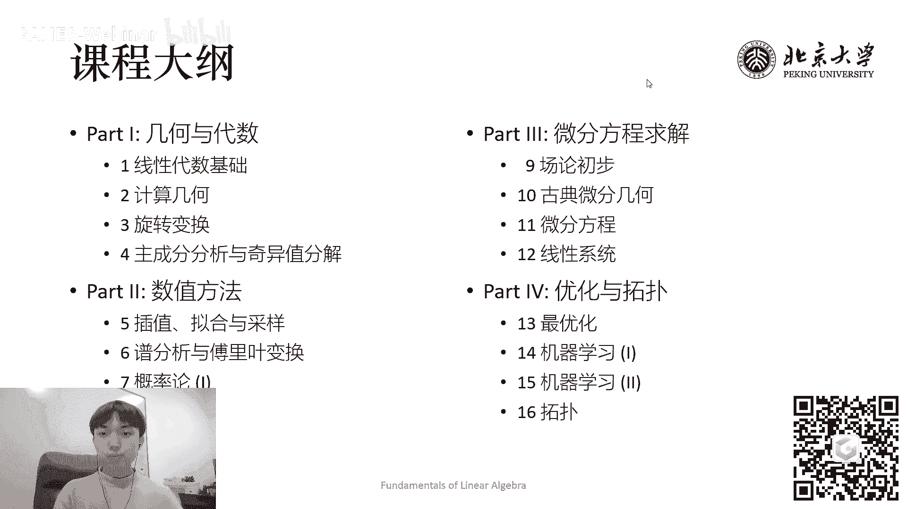

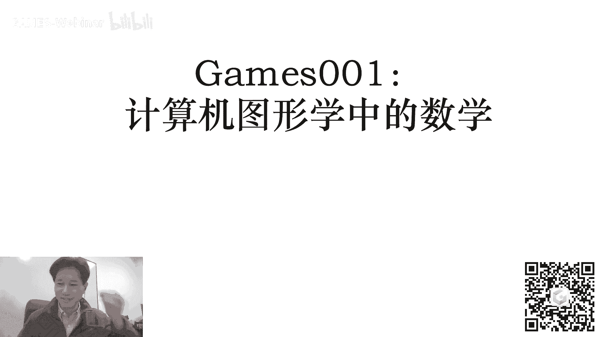

课程大纲主要分为四个部分：
1.  几何与代数
2.  数值方法
3.  微分方程求解
4.  优化与拓扑

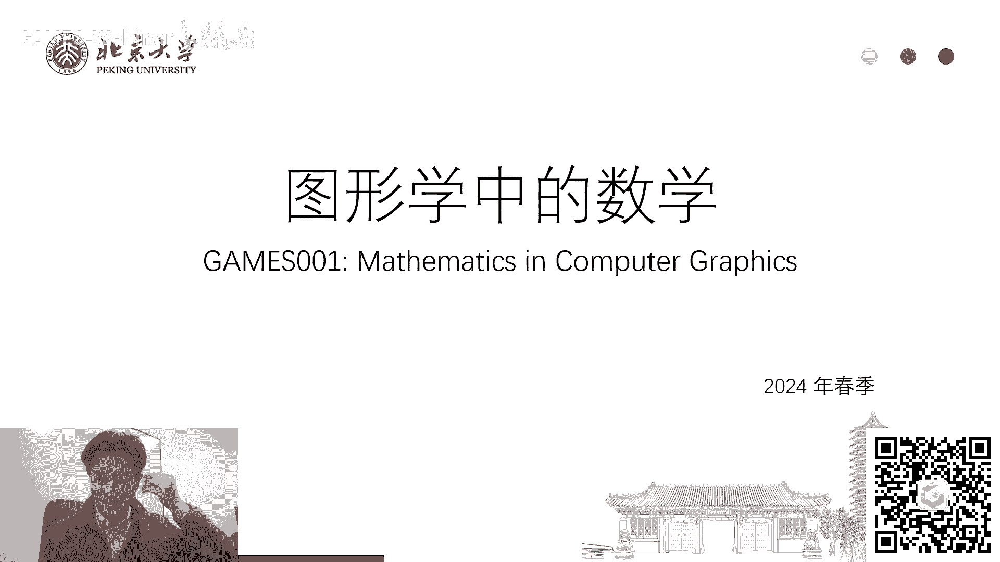

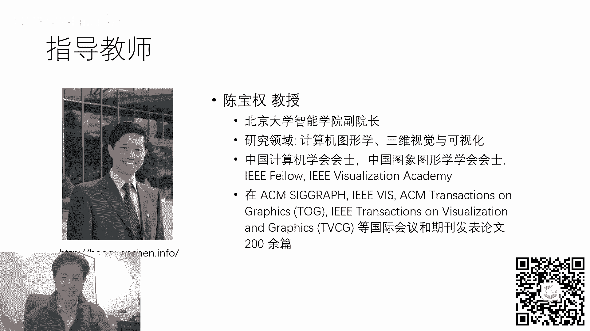

本课程并非简单地复述数学知识，而是重点讲解这些数学工具在图形学中的具体应用。课程设计的初衷是让数学变得“看得见”，帮助大家在不同图形学问题中识别出共通的数学本质。

例如，许多看似不同的图形学问题（如几何处理、渲染、物理仿真），经过抽象后可能都归结为求解同一个微分方程（如拉普拉斯方程或泊松方程）。这种思维方式非常有趣。

---


## 图形学与人工智能：世界模拟器 🌍

计算机图形学的核心目标是构建一个高度逼真的数字世界，即“世界模拟器”。一个成功的世界模拟器能够生成物理真实、符合客观规律和人类行为逻辑的场景。


智能体（如AI）通过与这样的数字世界交互（感知、认知、决策、行动），可以高效地学习和积累经验，这比在现实世界中试错要安全、快速得多。因此，图形学构建的高保真仿真环境，成为了训练人工智能（如自动驾驶、机器人）的关键平台。

图形学通过三大核心模块来构建这个世界模拟器：
1.  **几何形状的构建**：从现实世界数字化或算法生成复杂形体。
2.  **物理规律的体现**：高精度模拟各种动态现象（刚体、流体、布料等）。
3.  **运动的控制**：生成并控制符合物理规律和风格化要求的运动。

实现这些模块的算法，其底层依赖正是各种数学工具。这便引出了我们这门课的主题——**图形学中的数学**。

---

## 第一部分：向量与向量空间 ➕

上一节我们概述了图形学与数学的紧密联系，本节中我们来看看最基础的数学对象——向量。

### 向量的两种视角

大家可能接触过两种向量的定义：
1.  **中学视角**：既有大小又有方向的量，运算满足平行四边形法则。
2.  **线性代数视角**：向量空间中的元素，其运算满足一系列公理。

本课程采用第二种，更抽象但应用更广泛的公理化定义。

### 公理化定义

一个定义在数域 **F**（图形学中通常取实数域 **R**）上的**向量空间**，需要定义向量加法（`+`）和标量乘法（`·`），并满足以下8条公理：
1.  加法结合律：`(u + v) + w = u + (v + w)`
2.  加法交换律：`u + v = v + u`
3.  加法单位元：存在 `0`，使得 `v + 0 = v`
4.  加法逆元：对任意 `v`，存在 `-v`，使得 `v + (-v) = 0`
5.  标量乘法结合律：`(ab) · v = a · (b · v)`
6.  标量乘法单位元：`1 · v = v`
7.  标量乘法对向量加法的分配律：`a · (u + v) = a·u + a·v`
8.  标量乘法对标量加法的分配律：`(a + b) · v = a·v + b·v`

这种定义的好处在于，它不再局限于二维或三维的几何向量，可以描述更高维甚至抽象的对象。

### 线性组合、相关性与维度

以下是关于向量组性质的核心概念：

*   **线性组合**：对于向量组 `{v₁, v₂, ..., vₙ}`，形如 `a₁v₁ + a₂v₂ + ... + aₙvₙ` 的表达式称为这些向量的一个线性组合。
*   **线性相关**：如果存在一组不全为零的标量 `{a₁, a₂, ..., aₙ}`，使得 `a₁v₁ + a₂v₂ + ... + aₙvₙ = 0`，则称这组向量线性相关。这意味着其中至少有一个向量可以被其他向量线性表示。
*   **线性无关**：如果不存在这样一组不全为零的标量，则称这组向量线性无关。
*   **基与维度**：向量空间的一组**基**是**线性无关**且能**张成**整个空间的向量组。基中向量的个数称为向量空间的**维度**（`dim(V)`）。空间中的任何向量都可以**唯一地**表示为基向量的线性组合，组合系数称为该向量在此基下的**坐标**。

### 图形学中的向量空间

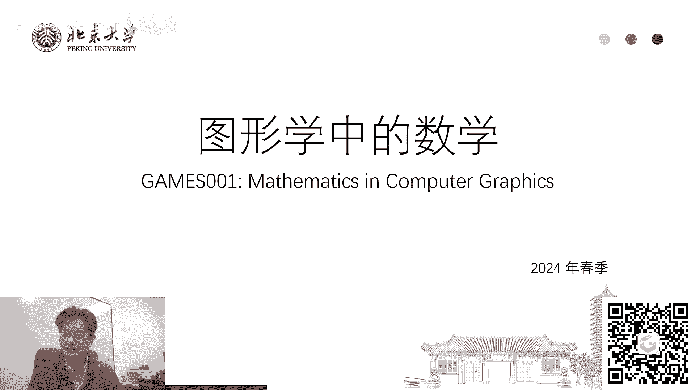

图形学中既处理低维向量，也处理极高维度的向量：
*   **低维向量空间**：如表示点位置的**欧几里得空间**（`ℝ³`），表示颜色的**RGB颜色空间**等。
*   **高维向量空间**：如一张`1920×1080`灰度图像的所有像素值可视为一个约200万维的向量；一个具有1.5万个顶点的三维模型，其所有顶点的位置坐标构成一个4.5万维的向量；流体模拟中求解的向量维度常达到百万甚至千万级。

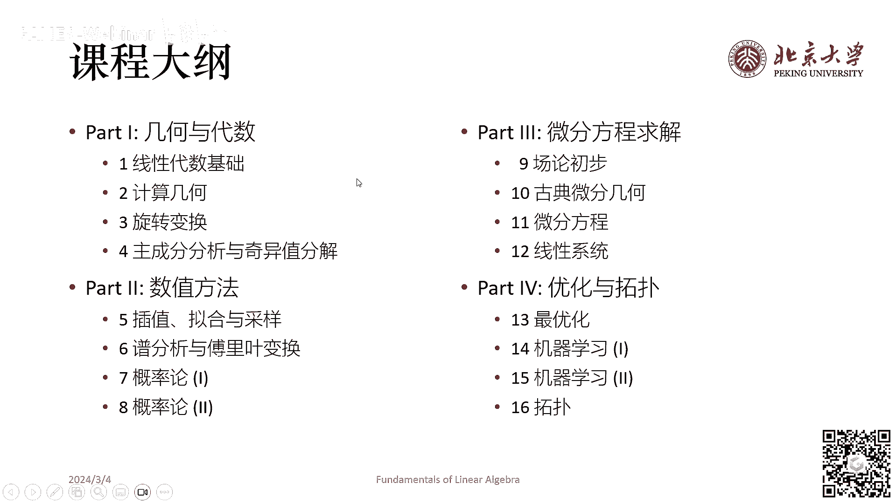

---

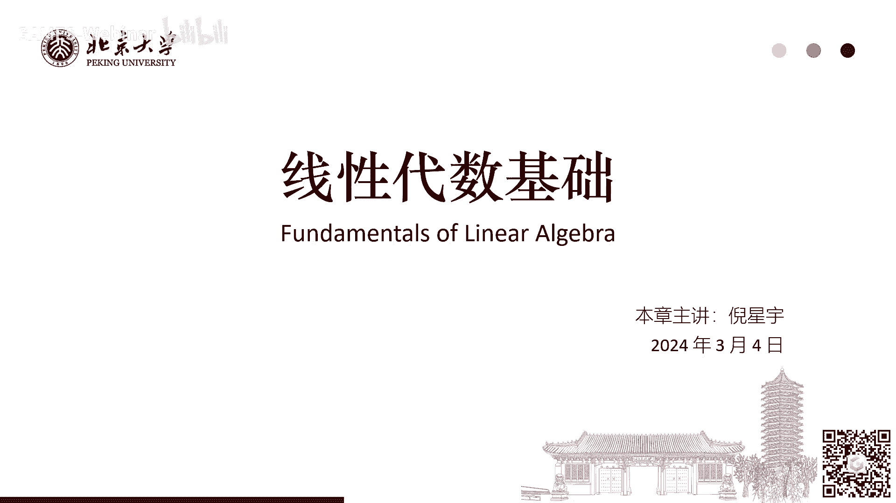

## 第二部分：矩阵与线性变换 🔄

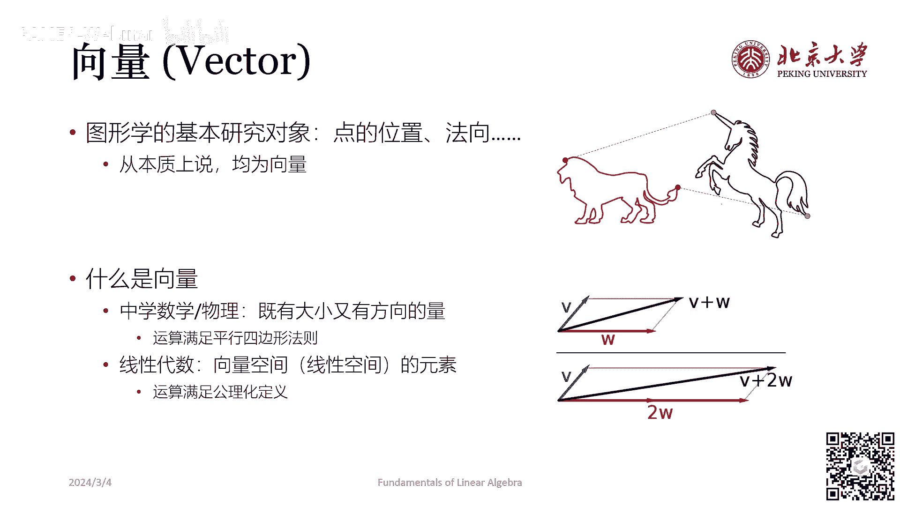

上一节我们介绍了向量空间的基础，本节中我们来看看描述向量空间之间映射的工具——矩阵。

### 线性映射


一个从向量空间 `V` 到 `W` 的映射 `f: V -> W` 如果满足以下两条性质，则称为**线性映射**：
1.  保加法：`f(u + v) = f(u) + f(v)`
2.  保标量乘法：`f(a · v) = a · f(v)`

这意味着线性映射完全由它对一组基的作用所决定。在低维空间中，**缩放**和**旋转**是线性映射，而**平移**不是。

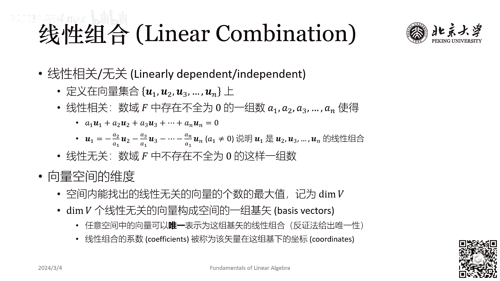

### 矩阵：线性映射的表示

矩阵是线性映射的一种具体表示方式。
*   **矩阵与向量乘法** `A · x`：表示向量 `x` 经过线性映射 `A` 后，在新空间中的坐标。
*   **矩阵乘法** `A · B`：表示先后进行 `B` 和 `A` 两个线性映射的复合。
*   **单位矩阵** `I`：表示恒等映射，即什么都不做。
*   **方阵**：表示映射前后空间维度相同。

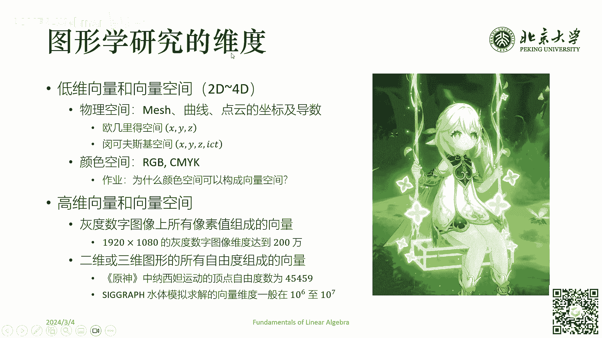

### 矩阵的单目运算及其意义

以下是矩阵常见单目运算及其几何/物理意义：

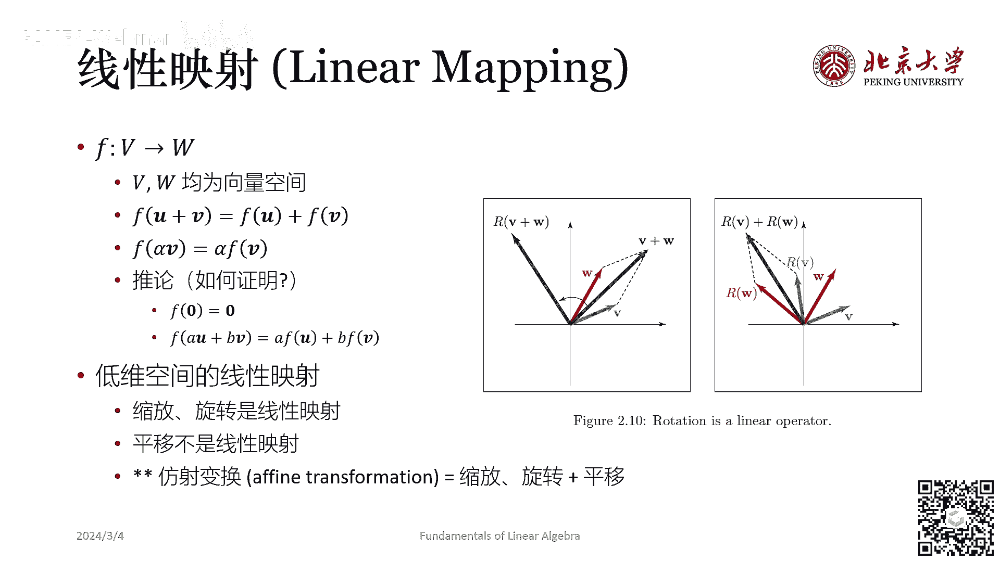

*   **转置 (`Aᵀ`)**：对应原线性映射在对偶空间中的“逆转置”映射。在实数域上，转置与求逆有密切关系。
*   **行列式 (`det(A)`)**：对应线性映射对空间的**缩放因子**（面积/体积的变化率）。`det(A) = 0` 表示映射将空间压缩到了更低维度。
*   **迹 (`tr(A)`)**：矩阵主对角线元素之和，等于其所有特征值之和。
*   **逆 (`A⁻¹`)**：对应线性映射的逆变换。只有行列式不为零（即映射是可逆的）的方阵才有逆。

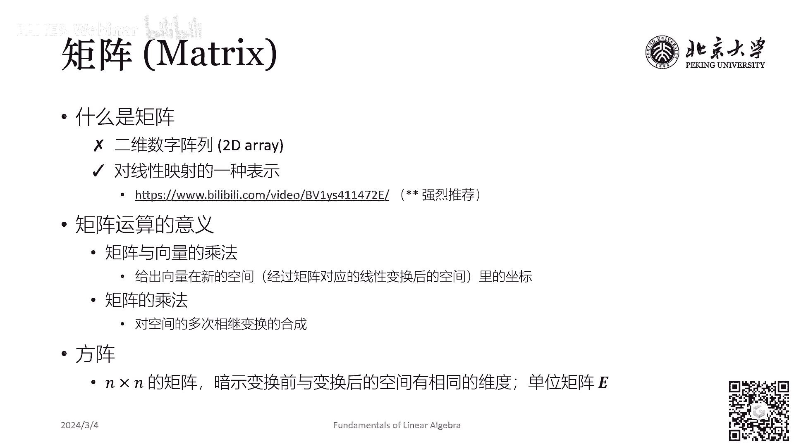

### 特征值与特征向量

对于一个方阵 `A`，如果存在标量 `λ` 和非零向量 `v`，满足 `A · v = λ · v`，则称 `λ` 为 `A` 的**特征值**，`v` 为对应的**特征向量**。

*   **意义**：特征向量是在该线性变换下方向保持不变的向量，特征值则是其长度的缩放倍数。
*   **求解**：通过解特征方程 `det(λI - A) = 0` 得到特征值，再代入求解特征向量。
*   **矩阵多项式**：若 `f(x)` 是一个多项式，则矩阵多项式 `f(A)` 的特征值为 `f(λ)`，其中 `λ` 是 `A` 的特征值。这在分析迭代算法的**收敛性**（谱半径）和矩阵的**条件数**时非常重要。

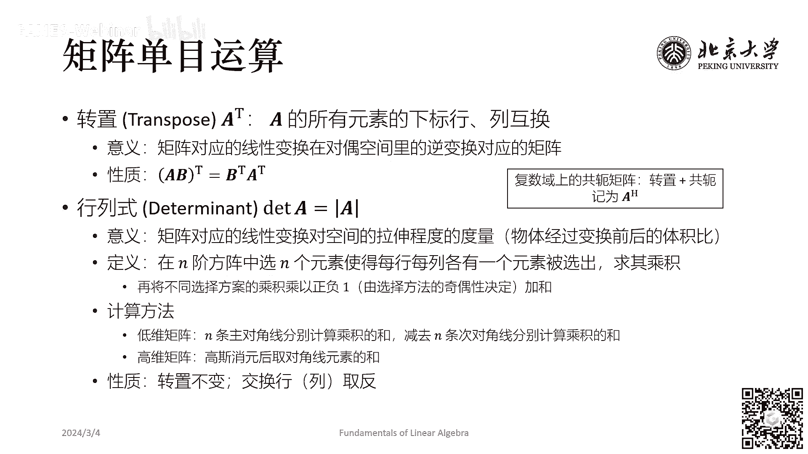

---

## 第三部分：内积、范数与度量 📏

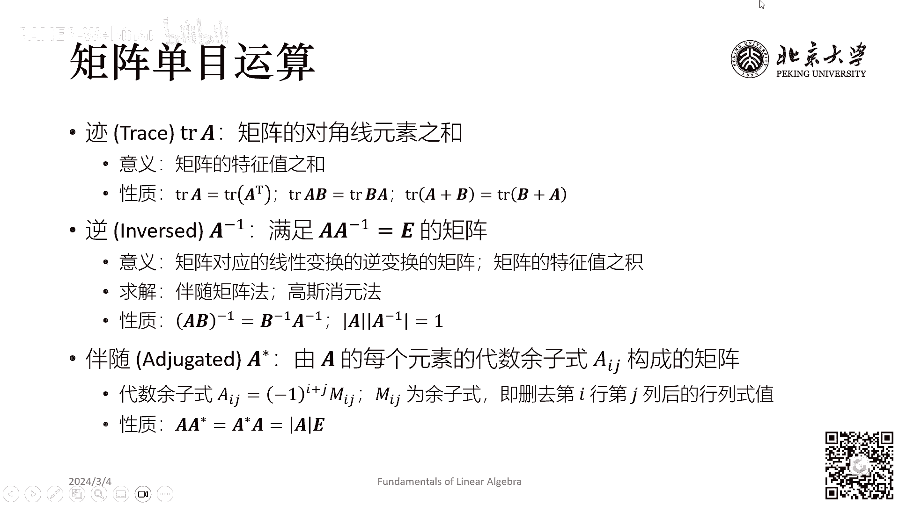

上一节我们讨论了矩阵表示的线性变换，本节中我们为向量空间引入度量“大小”和“角度”的概念。

### 从度量空间到赋范向量空间

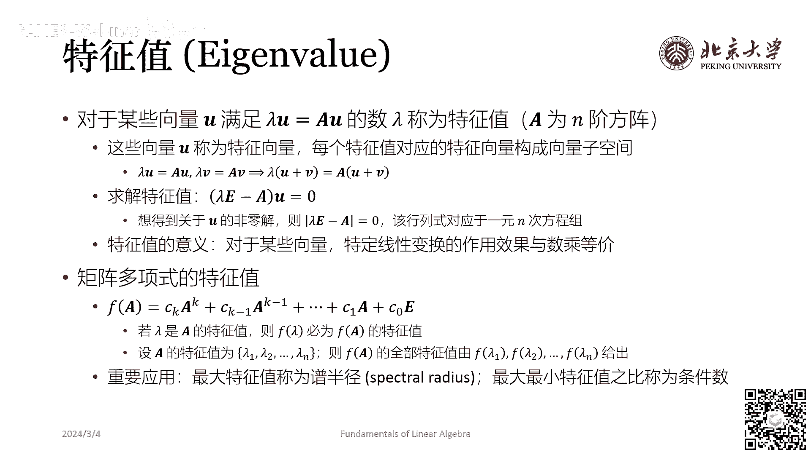

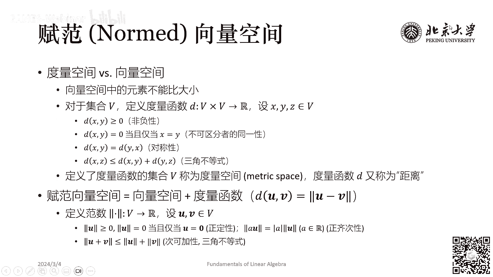

*   **度量空间**：定义了距离函数 `d(x, y)` 的集合，满足非负性、同一性、对称性和三角不等式。
*   **赋范向量空间**：在向量空间上定义**范数** `||v||`（可理解为长度），满足：
    1.  正定性：`||v|| ≥ 0`，且 `||v|| = 0 ⇔ v = 0`
    2.  正齐次性：`||a·v|| = |a| · ||v||`
    3.  三角不等式：`||u + v|| ≤ ||u|| + ||v||`
    范数可以诱导出一个度量：`d(u, v) = ||u - v||`。

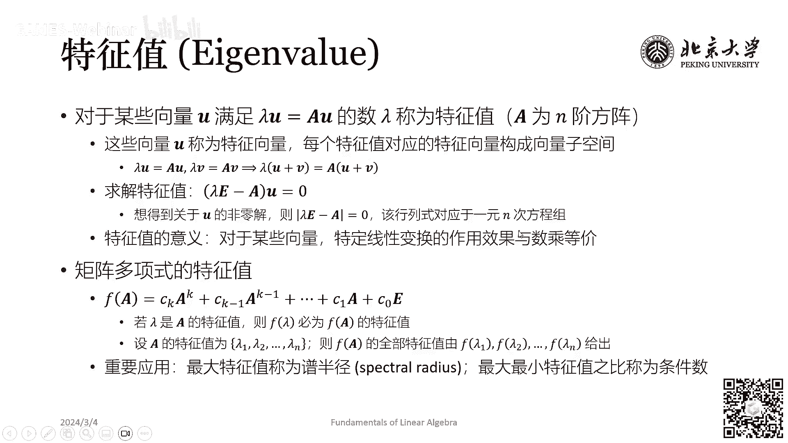

### 内积空间

**内积空间**是定义了内积运算 `⟨u, v⟩` 的向量空间，内积满足共轭对称性、对第一个变量的线性性和正定性。内积可以诱导出一个范数：`||v|| = √⟨v, v⟩`。

*   **夹角与正交**：两个向量的夹角余弦定义为 `cos θ = ⟨u, v⟩ / (||u|| · ||v||)`。若 `⟨u, v⟩ = 0`，则两向量**正交**。
*   **标准正交基**：一组两两正交且范数均为1的基。在此基下，内积计算简化为对应坐标相乘之和：`⟨u, v⟩ = Σ u_i * v_i`。这对应坐标形式的点积。
*   **正交变换与正交矩阵**：保持内积不变的线性变换。其矩阵表示 `Q` 满足 `QᵀQ = I`（即 `Qᵀ = Q⁻¹`）。正交变换包括旋转和镜像。

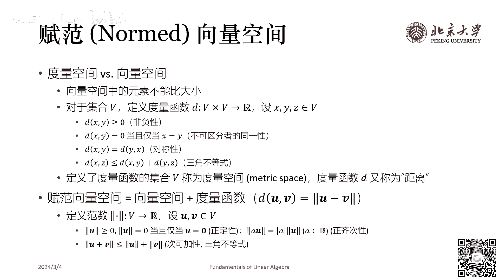

### 酉空间（幺正空间）

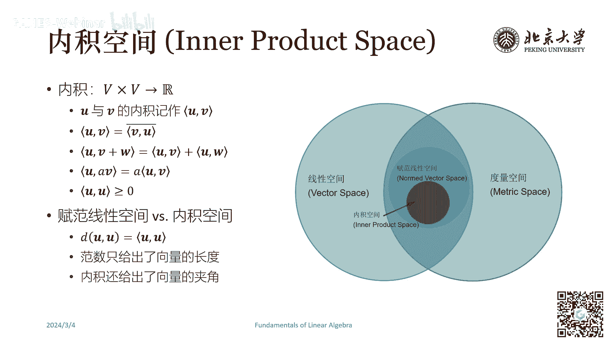

**酉空间**是复数域上的内积空间，其内积由埃尔米特函数给出。**酉变换**是酉空间中的保内积变换，其矩阵 `U` 满足 `UᴴU = I`（`Uᴴ` 为共轭转置）。这是正交变换在复数域上的推广，在量子力学等领域有重要应用。

**函数空间**可以视为无穷维的向量空间，其上也可以定义内积（如两个函数乘积的积分），并拓展内积空间的所有概念。

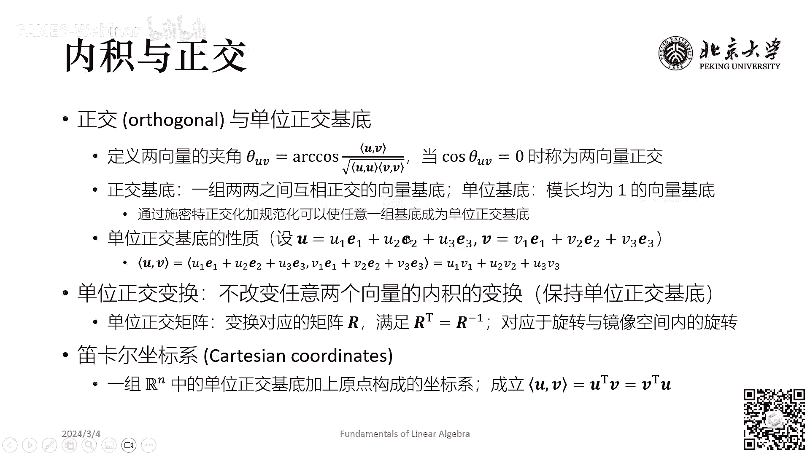

---

## 第四部分：图形学中的线性代数应用实例 🎮

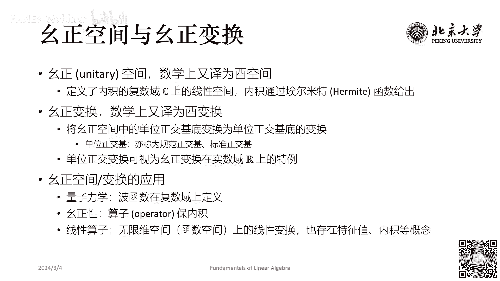

前面我们回顾了线性代数的基础理论，本节我们来看一些在图形学中的具体应用。

### 基本二维/三维线性变换

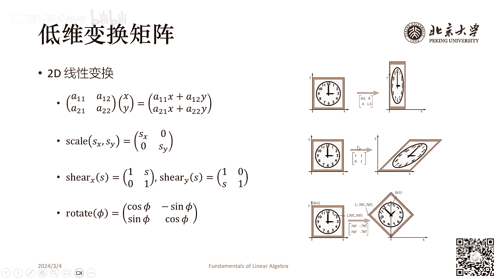

以下是一些基本变换的矩阵表示：
*   **缩放**：`S = diag(s_x, s_y, s_z)`
*   **剪切**：例如在三维中，`H = [[1, 0, sh_x], [0, 1, sh_y], [0, 0, 1]]`
*   **旋转**（绕Z轴）：`R_z(θ) = [[cosθ, -sinθ, 0], [sinθ, cosθ, 0], [0, 0, 1]]`
绕任意轴 `n` 的旋转可以通过相似变换实现：先旋转使 `n` 对齐Z轴，绕Z轴旋转，再旋转回去。

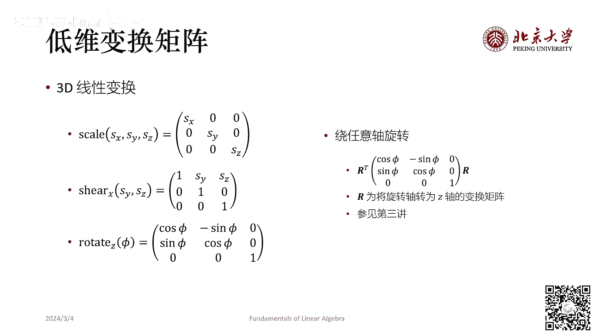

### 齐次坐标与仿射变换

为了解决**平移**不是线性变换的问题，我们引入**齐次坐标**。将 `n` 维点 `(x, y, z)` 用 `n+1` 维向量 `(x, y, z, 1)` 表示。
在齐次坐标下，**仿射变换**（线性变换+平移）可以用一个矩阵统一表示：
```
A = [[R, T],
     [0, 1]]
```
其中 `R` 是 `3x3` 的线性变换（旋转、缩放等）矩阵，`T` 是 `3x1` 的平移向量。默认变换顺序为缩放、旋转、平移。

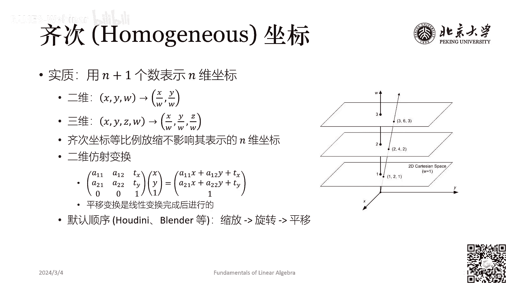

### 矩阵的变换：相似与合同

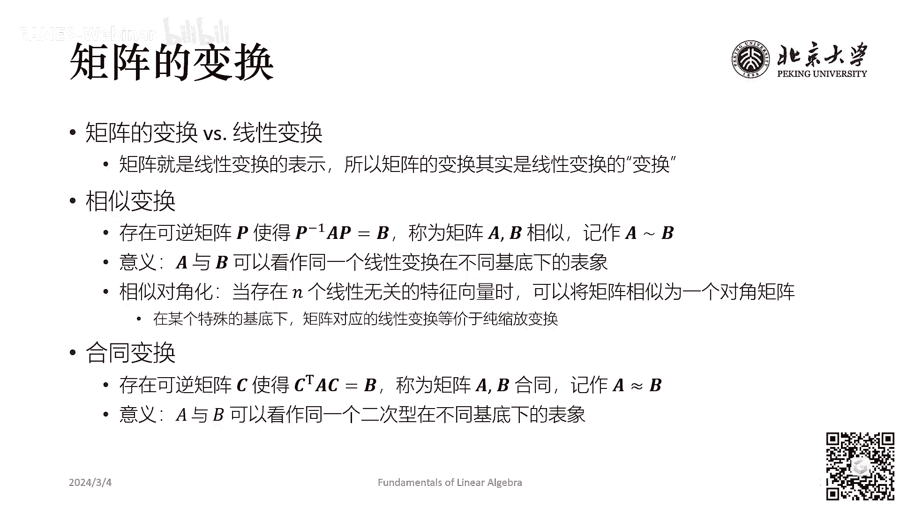

*   **相似变换**：`B = P⁻¹AP`。`A` 和 `B` 是同一个线性变换在不同基下的矩阵。相似变换可用于矩阵对角化，即在某组基下将变换表示为纯缩放。
*   **合同变换**：`B = CᵀAC`。`A` 和 `B` 是同一个**二次型**在不同基下的矩阵。二次型形如 `f(x) = xᵀAx`，在图形学中可用于表示圆锥曲线、曲面等。

### 正定矩阵与实对称矩阵

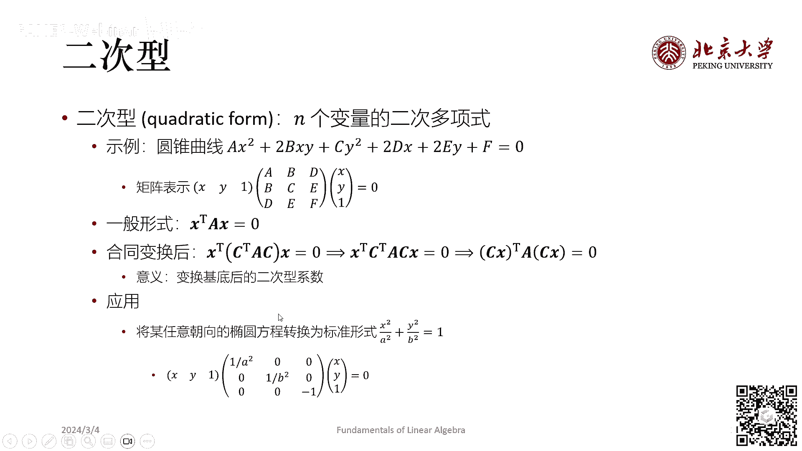

*   **正定矩阵**：对于任意非零向量 `x`，都有 `xᵀAx > 0`。正定矩阵的特征值全为正数。
*   **实对称矩阵**：满足 `Aᵀ = A`。实对称矩阵一定可以被正交矩阵对角化，且其特征值均为实数。在图形学的优化问题中，目标函数的Hessian矩阵（二阶导数矩阵）若是实对称正定矩阵，则保证了该点是局部极小值点。

---

## 总结与下节预告 🔮

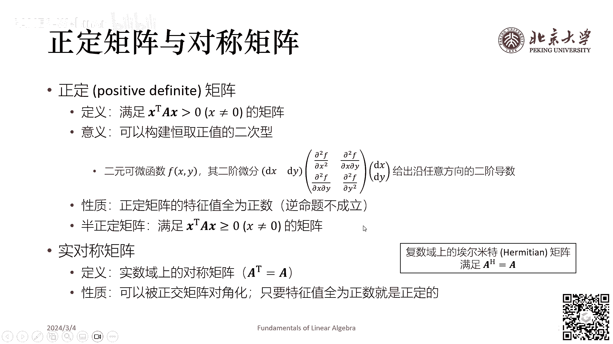

本节课中我们一起学习了线性代数在图形学中的基础框架。我们从向量空间和线性映射的公理化定义出发，理解了矩阵作为线性变换表示的本质，探讨了特征值、内积、范数等概念及其几何意义，并初步了解了它们在图形学变换和表示中的应用。

下节课我们将继续深入，涵盖以下内容：
*   矩阵分解（如SVD）
*   矩阵的各种范数
*   矩阵的求导
*   张量的基本概念

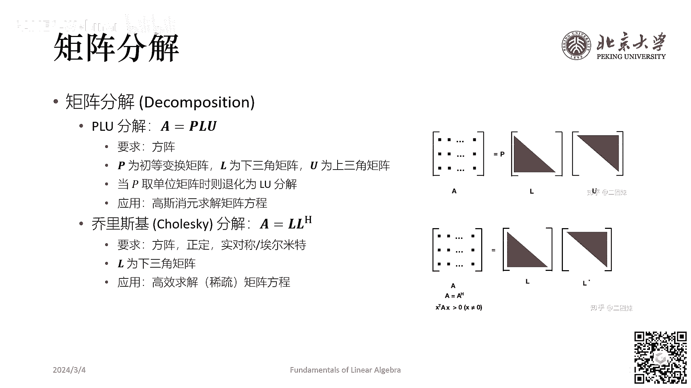

这些内容是解决图形学中许多高级问题（如优化、物理模拟、数据处理）的关键数学工具。