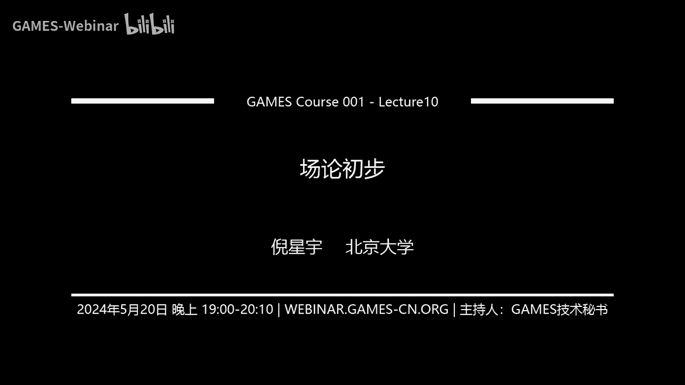
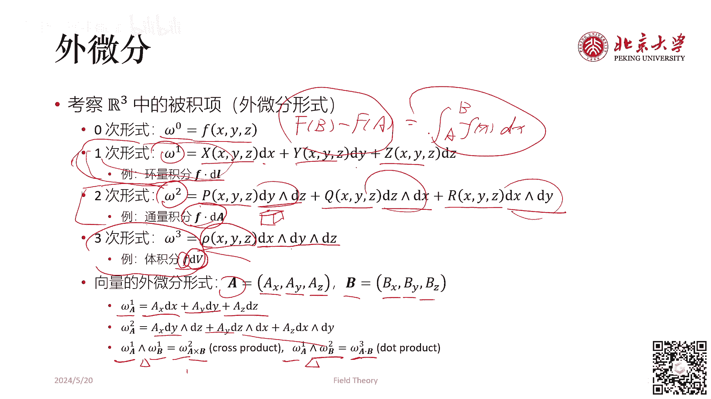
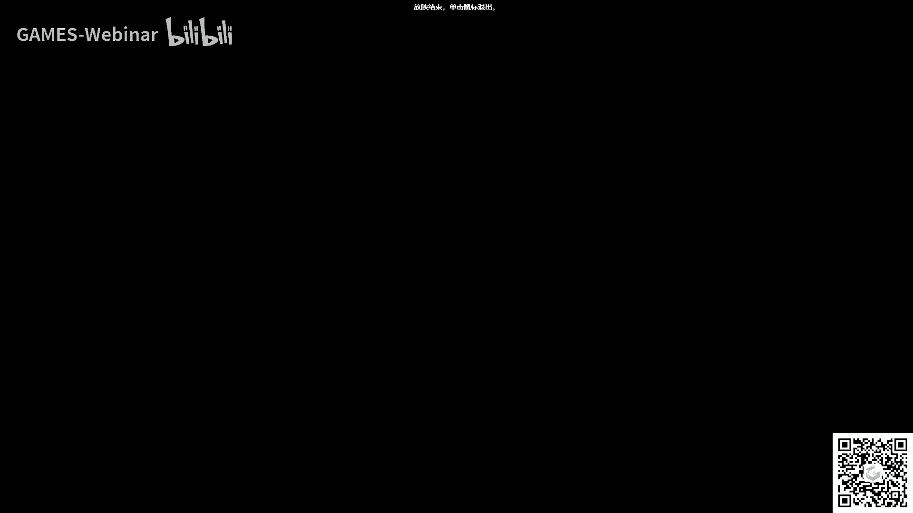

# GAMES001-图形学中的数学 - P10：场论初步 - GAMES-Webinar - BV1MF4m1V7e3

好啊，同学们好，今天我们来讲场论初步这一节课，呃首先我们来看一下什么是场呃，在物理学当中，我们是把某个物理量在空间，一个区域内的分布都称为常，比如说我这里举的几个例子，像是温度场，密度场，引力场，电场。

磁场，它们其实都是场，然后呃其实长这个概念说起来玄乎，但是其实我们完全可以把它理解为一个定义在，自变量是空间中的位置，因变量是标量或向量的一种特殊的多元函数，凡是这样的多元函数，我们都把它叫做场。

然后形成这个函数呢就是场函数或者额场，是个物理学的概念，我们可以这样理解，然后场函数我们把变成一个数学的概念，一般来说最简单的常函数的例子，就是二维的常函数额，我们可以把它写成FR。

然后这个R是一个向量，是一个二维向量，当然我们也可以把它展开写成X坐标和Y坐标，就是FXY3维也是同理，可以写成FXYZ，然后我们所谓的场论，初步呢我们其实更多的是指一种数学的，而非物理的去研究这个场。

因为我们知道在物理上也有一个场论，而物理上的场论它往往是涉及到呃，类似于量子场论，经典场论这样的一个区分，它的目标是研究物理场的变化，以及在这个变化当中所激发出来的，各种各样的呃能量之类的东西。

而我们不涉不会涉及这些，我们这里所说的场论初步，其实完全可以理解为一种矢量分析，但是因为啊经典的高等数学教科书上，就是叫场论初步嘛，所以我们这里也叫常论初步呃，和大家在高数当中学到的知识做一个衔接吧。

首先我们考察最简单的厂，最简单的厂就是标量场，标量场一般来说呃，我们把它用F字母F来表示，它有三个自变量，也就是XYZ，这也就是说它是一个三维当中的标量场，在三维当中的标量场呢。

我们首先希望来看一下这个标量场上，某一个点在某个方向上的导数，也就是方向导数，这个相信大家在学多元函数，微积分的时候也都有所接触，我们这里就简要回顾一下，方向导数，是说给定某个方向D。

这个D我们也可以把它写成什么样的形式，然后在四这个直角坐标系中展开成DXD，Y d z，然后所谓的偏F比偏D是什么意思呢，是说我们对于T趋于零，然后X加上TDXY加上TDYZ，加上TDZ之后。

再减去FXYZ，再除以刚刚我们说的这个T然后取一个极限，这个取极限的操作，就是我们一般求导数的定义也是一样的对吧，我们要有一个取极限的操作，然后取完这个极限之后。

我们自然地根据这个呃多元函数微积分的原理，我们就会把它得到它等于什么呢，它等于DX，也就是刚刚我们这个方向D的X坐标，X方向坐标乘以偏F偏X加上DYY乘以偏F，偏Y加上DZ比偏F偏Z。

我或者我们把上面这个东西，写成一个矢量的形式，就是一个方向D的矢量乘上F的，这个我们把它记作倒三角F这样的一个矢量，这个倒三角F呢，他的每个分量就分别是偏F偏X偏F，偏Y偏偏Y偏F偏Z。

这个倒三角F我们读作gradient，f grain是这里的gradient的缩写，也就是F的梯度的意思，它的性质是沿着梯度方向的方向，导数是最大的，或者说梯度方向是导数增长最快的方向，为什么呢。

我们只需要去考察这个不等式就可以了，我们任取一个向量ABC，用它去点乘这个刚刚我们说的这个gradient f，它一定是小于等于gradient f的平方，除以绝对值的，当当然这个是也就是小于等于呃。

gradient f肯定是小于等于这个的啊，这这个事情很好理解，因为你在一个向量长度不变的情况下，让他去这个向量去点成另外一个向量，它们的点击最大的情况，也就是这两个向量方向完全相同的时候。

所以我们刚刚用到的这个倒三角算子呢，它的学名叫做向量微分算子，我们把它形式化的写一下，它其实就是偏偏X5不知道偏什么，先留个空，然后偏偏Y我也不知道偏什么，留个空，偏偏Z不知道偏什么，留个空。

我们称它叫做P型算符，然后在这个打公式的时候，比如说在latex或者word当中，你需要敲nebula，它叫nba operator，或者有一个简单的说法叫deo operator，为什么呃。

我们把它形式化的写成这样一个倒三角的形式，是合理的呢，我们看呃，如果我们认为这个倒三角是一个矢量，看成一个矢量，然后这个矢量往右边叠加一个标量的话，根据矢量和标量的运算法则。

我们应该直接把标量给乘到矢量的，每个分量当中去，所以就自然而然的把这每一个，不知道偏什么的地方都填上了这个标量，看完了标量场的梯度以后，我们来看向量场的通量，所谓通量呢它的英文是flux，举个例子。

在流体的速度场当中，我们取了一个有向的曲面S，所谓有向就是说呃我随便画一个曲面，比如说一个正方形的面，我还同时规定了它的正方向，比如说我们认为这个这个方向是朝外的，那么这个就叫有向曲面，我们要求什么呢。

求单位时间内穿过该曲面的流体体积，那么根据初中物理的知识，如果这个速度，流体的速度是始终垂直于这个曲面的，那么显然有单位时间内穿过这个曲面的体积，就等于什么呀，等于U的大小。

这个速度的大小乘以DA做积分对吧，这样我们就能求出来，因为速度是始终垂直于曲面的嘛，所以我们就能直接能求出来，这个单位时间内穿过该曲面的流体体积了，但是呢如果这个曲面和速度之间有夹角。

比如说这个流体速度长这样哎，这个地方它有一个夹角，这夹角可能是theta，这时候怎么办呢，这时候我们说我们在单位时间内，穿过该曲面的流体体积是要小于当流速流，流速场和曲面完全垂直的时候，穿过它的体积的。

这个时候它穿过的流体体积是多少呢，我们给它计算一下，它其实是等于速度U点乘上法向N，也就是速度U点乘一个法向N，这样算出来一个流体体积，单位时间内超过曲面的流体体积，或者我们把NDA写成DA这个矢量。

也就是我们定义曲面的面积，微圆是它的面积大小乘以它的法向量，如果我们这样定义的话，我们就可以把这个积分式给改，直接写成U点成DA，然后我们再来看一下，物理中常见的一些通量，首先在渲染当中。

大家可能会接触到所谓光通量的概念，它的意思是每单位时间到达，离开或通过曲面的光强度，那么也是一样的，我们要把这个光强的去乘以，它和曲面之间的夹角，夹角的余弦值，这个通量和速度场通量其实是几乎是一回事。

所以大家应该都能理解，但是磁感应强度，这个也就是我们在高中物理当中会学到的，表示磁场的这个符号B它是磁感应强度，这个磁感应强度呢它也是一个通量，它的英文呢如果你直接看磁感应强度的话。

它英文是magnetic induction density，但事实上它还有一个名字叫magnetic flux density，也就是说所谓磁感应强度，它本质上是磁通量强度。

因为我们说磁感线我们会数磁感线的条数对吗，所谓磁感线这个条数的概念，就是一个对于额通量大小的一个形式化的表述，我们把它称之为条数，那么看完了这个常见的通量以后呢，我们再来看一下呃。

通量所引引入的这个圆和汇的概念，首先我们说圆和会是一对相反的概念，其中呢会，我们可以把它看成是某种意义上的复原，就汇合圆，我们完全可以把它看成一回事，它是个复原，那么圆是什么意思呢。

就是对于这个物理场来说，源是制造这个物理量的一个源头，什么叫制造物理量呢，比如说呃在这个空间当中有一个地方，它在不停的往外生成水，它在凭空的产生水，那么它会发生什么呢，我们如果取定一个闭合曲面。

把空间包住，如果其中没有源，就没有一个地方在制造水，那么通量一定是零，为什么呢，因为流进曲面的水总是会流出，除非水在该封闭曲面内出现或者消失，当然我这么说是有一点不严谨的。

因为我这里假设流体的这个体积是不变的，但流体体积有可能是会变的，但是呃我们可以这样去思考，我们可以把它看成是这个呃M7乘以V对，我们可以把它看成是M就乘上一个额，这个这个地方的密度肉围。

如果这样去写的话，那那这个就是下面这么说就是对的了，就是你不可能凭空的去生成一个质量，所以你的只要你一个闭合曲面内没有圆，也就是说也同时也说明没有会，那么此时通量就必然为零，因为流进曲面的水总是会流出。

定义完了通量以后，我们就可以定义散度了，散度在英文当中称之为divergence，他的考察对象是一个向量场，这个向量场呢我们把它的分量形式都给写出来，它的分量形式是FXFYFZ。

然后这个时候我们定义散度的表达式是什么呢，它等于在空间中某一点附近，取一个无穷小的体积，然后我们看这个无穷小体积的表面，在这个算这个无穷小体积的表面的通量，这个行向量场的通量，然后算完通量以后。

再除以这块空间的体积，并且呢我们这里说体积趋于零，它是什么意思，它是要求在任何方向上的直径都一致的趋于零，为什么要加这样一个限制条件呢，因为体积趋于零，你完全可以诶，比如说我让一个长方体的体积趋于零。

我完全可以只在高上把他这个高，无限的压缩变成零，然后它底面积呢还是一个有限大的数，如果是这样的话，它就不是我们这里所说的一致区域零，我们要求的是，这个德尔塔V要在这个点附线附近无限的收缩。

各个维度上都无限的收缩，那么如果做如上定义之后，我们可以形式化的说散度到底是什么东西，它就是在某一点附近，包含该点的无穷小封闭曲面的平均通量，那么上面这个定义它的表达式，在直角坐标系当中该如何表达呢。

我们取一个立方体，右下角所说的这样一个立方体，然后我们去计算一下它这个立方体的通量，因为我们要求散度存在的时候，是只要在任何方向上的直径一致的趋于零，那么散度都应该是相等的，如果做这样的定义。

我们可以直接推导出来，散度等于什么呀，散度等于偏FX比偏X加偏FY，比偏Y加偏FZ比偏Z，那么这时候我们就会神奇的发现，我们刚刚引入的这个P型算子，它有一个妙用，就此时这个式子看起来在形式上。

就是这个P型算子点乘一个F这个矢量，所以表现为一个点乘的形式，这也是为什么，这个地方我们写了一个点乘的符号，定义完了散度以后，我们来看散度的相对大小的意义，首先什么叫无伞，我们刚刚已经说过。

通量的概念是通量为零的时候，说明什么，说明在这一个区间内没有圆，没有汇，或者圆和会相抵，就是在这个空间在这块体积内生成的水，又在这块体积内消失了，所以我们把这一块体积给圈起来，就会发现没有水流出。

也没有水流入，就流出和流入是相等的，这块体积里的水没有增多，也没有减少，那么散度它只是无穷小的通量，无穷小的平均通量，所以无散和这个通量为零之间，应该是有某种联系的，也就是说无散。

其实它所表达的含义就是所度量的这个点，这个所度量散度的这个点，它的附近没有圆，这就叫无散，记作就是F的divergence等于零，什么意思呢，就是说场线不在该点处产生或者消失，对于流场而言。

这就意味着它的体积是不变的，那么有散的概念呢，就与无散正好相反，它对于流产而言意味着什么呀，在该点附近是有体积增加或者减少的，我们来看右边这幅图上面，红色的圆圈圈中的地方，这个速度场是向中心聚集的。

如果你考察这个，把这个红圈看成是这个外面取得一一块，这个曲面的话，我们会发现，这个曲面上所有的流速都是朝曲面内的，因此是什么呀，因此这个曲面所包含的体积，里的水是一直在增多的，比如这个这个地方是什么。

这个地方有会，我们再看绿绿色的这块，这个圈所包含的地方，这里的水都是从里面往外流的，那这说明什么呀，说明这个绿色的空间所包含的地方，它有圆，如果我们把这个红圈不断的缩小，缩小成半径为零。

把这个绿圈也不断的缩小，缩小成半径为零，那么我们就会得到上面红圈的地方，它的散度diversions是小于零的，而上面下面绿圈的地方求出来，它的散度是大于零的，那么根据上面我们的分析。

因为散度它本身就是无穷小的平均通量，那么我们把无限个无穷小的平均通量加在一起，正负相抵，就会得到有限大的通量，有限有限的一个区间内的通量，所以我们就自然的有自然的推导出了，当然不是非常严格的推导出了。

这里的高斯散度定理，他的意思就是说，我给定空间中任意一块体积，我们求这块体积内的向量场的散度的积分，等于什么呢，等于我们求这个体积的表面表面，然后在这个表面上求向量场的通量，这两个东西一定是相等的。

为什么，因为散度本身就是平均通量，案例是呃，大家如果学过普通物理的话，应该会知道，在静电场和静磁场当中，都是有这个高斯定理的应用的，在静电场静电场当中呃，他的写法是，右边应该是这个呃。

好像Q比XC用零吧，对大大概是这样一个形式，它意思就是说这个呃，电场强度的散度等于什么呢，就是说如果这是电厂，我们对这个东西做一个积分，就这个表面上求电场强度的通量，它等于什么。

它等于这个闭合曲面内包含的电荷，电荷量乘以一个一个因子，这个因子应该是FCM0分之一，这是静电场当中的高斯定理，而静磁场当中的高斯定理说的是什么，说的是它等于零，也就是说磁场是没有圆的。

没有一个地方可以生成磁场，没有个地方可以小小事磁场，此外还有这个流场不可压条件，流场不可压条件是说当流体是不可压的时候，我们有速度场的散度为零，那么这个东西是怎么来的呢，就是我们考察一团流体。

我们校这里的体积不增多，也不减少，那么也就是意味着这个流体的通量要是零，就是流体在这个这块区域内的通量要是零，通量是零，每任何任取一块，它的通量都是零，也就意味着它在上面的散度处处都得为零。

也就是得到流畅的不可压场解，就是高斯散度定理，讲完了向量场的散度以后，我们再来看向量场的环量，环量英文叫做SECURATION，或者我们称它为涡量，也是vertex，它的这个最直观的例子是。

我们在流体速度场中取一个闭合的曲线，然后我们要求流体沿着该曲线旋转的强度，这个旋转的强度如何定义呢，我们是这样定义的，如果速度始终平行于曲线的切向，比如说我们在取了一个闭合的曲线。

如果这块闭合曲线上的流体的速度场，也和这个曲线的走向完全一致，也就是速度始终平行于曲线的切向，我们就直接用伽马等于什么呢，等于沿着这个曲线做一次积分，然后流体的速度乘以这个曲线威严的长度。

那么如果速度与曲线的切向之间是有夹角的呢，我们跟之前算通常的时候一样，我们要去乘上这个夹角的余弦，就是我们用U点成tall，tall就是这个切方向，那么这里也就是u tall乘以。

它们俩之间加到余弦对吧，然后类似的，我们可以把这个曲线微元的写成它的大小，DL乘以它的方向，tour这个单位矢量写成U点DL的形式，有了这个环量的概念以后，我们再来看我们旋度是什么。

首先我们来看二维的旋度，旋度我们把记作rotation或者car，他的考察对象是一个向量场，然后这时候我们给定的是一个二维的向量场，也就是PXYZ，QXYZ这样组成的这样一个向量场。

那么这个向量场呢一样的，我们现在先来看看，这个向量场是如何计算环量的，我们在空间当中留任取一个闭合的曲线，然后我们来求这个曲线的环量，也就是F点乘DL再除以德尔塔S，德塔S是什么。

德塔S是因为我们现在考察是一个二维的对吧，所以我们这曲线一定是画在二维平面上，我们在二维曲明面上任画了一个闭合曲线，那么这个闭合曲线一定围成了一个面积，这个面积就是德尔塔S，跟之前一样。

当这个面积一致的趋向于，在各个维度上一致的趋向于零的时候，它怎么计算呢，我们发现因为F是等于这个X方是PY方是Q，那么DL呢我们可以看成X方向是DX，Y方向是DYY，我们直接把点乘写开。

就是PDX加QDY，这个PDX加QDY的积分要怎么算呢，还是一样，因为我们既然德尔塔X趋于零是一致的，趋于零，不管我们取这个曲线是如何取的，我们干脆就把这个曲线取成一个方形，一个矩形取成这样一个曲线。

这最最外面这个就是这个曲线，然后我们来计算这个环路的积分，这个积分计算的结果是什么呢，可以一条边一条边的给他算一下，一条边一条边的算一下，然后再除以这个面积4AB，最后得到的结果就是偏Q比偏X减去。

偏P比偏Y这样我们就定义了二维的咸度，定完二维的选度以后，我们自然要看看三维的选度是什么，那么三维的旋度呢我们怎么定义呢，我们可以把它看成是我们取这个环路的时候，我们把这个要求。

这个环路始终是和某它的环路的法向，法向量始终是与某一个方向平行的，比如说我们首先我们刚刚算的这个，这个是什么呀，这个相当于，如果我们把这个屏幕看成是XOY平面的话。

那么这个XOY平面的法向法向就指向Z项，对吧，所以我们刚刚算的其实是这个刚算，其实这个这个在哪儿呢，在这儿我们刚刚测出算的是这个回路，那么类似的我们再把各个回路都算一下，X方。

X方的回路是这个他解出来的结果是偏R比，偏Y减偏Q比偏Z，然后Y方向的回路是这个，它解出来结果是偏P比偏Z减，偏R比偏X我们把答案都写下来，就得到了这个向量场的旋度的表达式。

我们记住curl f等于root f等于什么呢，等于刚刚我们说的每个方向的这个环环量，给额选度给他加放在一起，哎我们又发现一件神奇的事了，这个P型算符我们刚刚定义过，是偏偏X偏偏Y。

它在形式上就等于P型算子去叉乘一个F，得到的结果就刚好是这个选人选度的表达式，那么我们在刚刚推导二维旋度的时候，我们其实用了这样得到了这样一个结果对吧，这个公式呢它本身又称之为格林公式。

我们怎么去更细节的去理解格林公式呢，比如说我我们他其实是说在，我们把空间划分成一个小区域，哎每个区域呢都有一个这样的环，他们都在绕，如果我把这些小区域给叠加起来会怎么样啊，我们就只剩下最外面一个环。

这就是这个二维显度，就是二维旋度，我们在推导的时候所发现的这个东西，注意我们这里称之的格林公式呢，和微分方程当中的格林公式恒等式，它不是一回事呃，微分方程我们应该会在下下下下节课讲到。

然后我们刚刚在推导的时候，就右上角，这里我们发现这个因为定义是，我们求这个旋度的时候，我们不是有一个德尔塔X趋于零，然后使得一个环量变成了旋度嘛，和我们刚刚推导这个高斯定理一样。

我们也把这个无限个这样小的旋度加在一起，他理论上说就应该变成一个环量了，对吗，呃答案也是这样的，他其实就是刚刚我在右上角所画的这个回事，我们把无限个这样小的旋度加在一起，它每个其实都是一个环量。

这些环量叠加在一起会正好消掉，这个比如说我们考察这个线，我们会发现左边的环量在这个位置是朝上的，右边的环量在这个线上是朝下的，这两个地方正好抵掉了，最后剩下的东西就就是沿着最外层的这个环流。

那么它写下来之后结果是什么，就是F点tall乘以DL等于什么呢，等于这个旋度，就像这个这也是旋度乘以面积乘以面积，然后因为这个时候呃，刚刚我们是二维的，我们能保证，能保证这个法法向量一定是沿Z方向的。

那现在我们不能保证这件事情，我们的取法的法向量方向是不确定的，所以啊我们需要加上这个法向量的方向的点乘，也就是所谓斯托克斯旋度定理，它就是二维的格林公式在三维当中的推广，如果我们将斯托克斯公式。

在XOY平面上做投影，我们就立刻得到了，我们刚刚上面所列的这个格林公式，好以上的内容都是大家在高数的这个市场分析，或者说长论初步的这一章节当中，应该已经接触过了，接触过的内容，然后接下来的东西呢。

就是我们从以上的内容出发，所要给大家补充的一些知识了，首先我们来看拉普拉斯算子，拉普拉斯算子它的定义是什么，它的定义是先拿先求一个梯度，再求一个散度，因为是点乘的形式呢，简记起来就是这个P型算子的平方。

那么如果是标量场的话，哎我们把标量场先求个梯度，它变成一个矢量场，实际上场再求一个散度，他又变回了一个标量场，而如果给定的是一个向量场呢，向量场的梯度是一个二阶的张量，这个二阶的张量去求散度呢。

求出来的结果还是一个矢量，或者我们在直角坐标系下，可以把这个求梯度求散度的过程给展开，展开的结果就是求X方向的二阶导数，Y方向上的二阶导数，Z方向的二阶导数，然后这个东西直接作用在phi上。

直接作用在phi上，啊这这个写法，这有啊，这有写错，它不是，它不再是一个矢量，就P型算子的平方，它形式上应该等于这个对吧，我一会儿改一下，毕竟算子平方应该等于这个，也就是说，如果你把作用在标量场上。

它其实是等于求的这个东西作用在矢量场上，孔里，好这是补充的一个定义，也就是拉普拉斯算子，它就是我们刚刚一直在用的，这个P型算子的平方，然后我们刚刚定义的散度，旋度梯度，它们之间有很多很神奇的矢量恒等式。

比如说首先我们求这个一个向量场的，刚刚我们说他的拉普拉拉斯算子的作用之后的，结果等于什么呢，它等于这个向量场的散度，求梯度，再减去这个向量场的旋度的旋度，哎，这个东西是为什么呢，然后这个还有一个结论是。

标一个标量场的梯度，再对它求旋度，结果一定是零，然后一个标量场的旋度再对它求散度，一个矢量场的旋度再对它求散度，结果也一定是零，这样式子非常重要，我们一会儿再证明亥姆霍兹分解定理的时候。

是需要用到这样的结论的，然后至于他们怎么证明呢，其实大家完全可以以为暴力展开的方式，尝试证明一下，当然我们这节课最后会告诉大家，有一种简便的计算方式好，除了刚刚那几个基本的以外，如果是有多个场的话。

那么这些场函数的组合，它们之间也会有一些在矢量微分上的恒等式，而这些恒等式在证明一些基本定理，或者是去开发一些算法的时候还挺有用的，当然呃这个说实话，我也不是很能完全把这些公式都给记下来。

所以呃我今天把都列在PPT上，是如果大家以后需要的话，也可以翻看我的PPT，然后这上面基本上是列举了所有大家常见的，需要用到的矢量微分的恒等式，就你就把它当表查就可以了，我们简要的回顾一下。

它其实是一个呃两个标量场相乘的梯度，两个矢量场点击的梯度，然后一个标量场乘一个矢量场的散度，一个矢量场和另一个矢量场差成的散度，然后一个标量场和一个矢量场相乘以后的旋度，和两个矢量场叉乘以后的旋度。

它们分别都可以展开，他们展开方式，建右边这个式子，另外还需要补充的一个知识点是所谓wish wish，什么是位置，位就是位置矢，就是矢量，wish就是位置矢量，它是一种特殊的场函数。

一般呢我们把它写成啊XYZ这里呃，这里我用一个R带一个呃，实际上箭头的方式来表示一个手写体，是因为等会我们可能既要出现矢量哪儿，又要出现标上哪儿，为了避免大家这个引起不必要的困扰，所以我们这底下。

这这些没有用这个粗体的R来表示向量，然后他等于什么呢，就是啊XYZ等于XYZ本身，然后未十场有一些非常特殊的微分运算的规则，微分运算的结论，比如说未时场的散度等于三，且很好验证啊，未十场的梯度呢。

未十场啊，注意这个地方没有上面的这个向量符号了，它是它等于R等于我们把它展开，它其实是等于这个的对吧，然后我们可以证明这个R，它的梯度等于R向量除以它的大小，也就是得到的是R所对应的方向向量。

然后这个R向量的旋度呢是零，然后我们对这个东西求一个倒数，比如说R分之一，它也有一些性质，R分之一的梯度哎，等于这个，然后如果我们是把这个，就是呃未使的大小，R呢作为一个自变量放进一个函数里。

那么这个FR的梯度是什么呀，它等于F本身的导函数F1撇，再乘以这个未使的方向向量，然后额也可以对1/2求上这个额，拉普拉斯做应用一个拉普拉斯算子，它的结果是四派德尔塔啊。

这个东西又超出了我们今天课程的内容，因为我们这里涉及到一个狄拉克德尔塔函数，然后我们会在微分方程那一节当中啊，更加详细的给大家说明这件事情啊，类似的还有这个F2乘以啊，方向的R的方啊。

未使的这个旋度它也是等于零的，然后这个位是R的，直接求梯度，我们知道他应该得到的是一个张量，然后这个张量是什么呢，也就是单位张，这个张量是单位张量，或者是呃我们任取一个长矢量AAH点。

成wish之后再去求梯度，它等于什么呢，它等于A先去形式上的点乘这个P型算子之后，把R放在右边，那么结果等于什么，结果就是A向量本身，或者是呃E的IA点R次幂，我给他去求这个gradient。

它等于什么，它等于我把这个系数给提到前面去，然后变成I乘上A乘上ERADC，这都是一些非常常用的这个矢量场的，微分的恒等式，好现在我们已经有了基本的关于这个矢量，微积分的一些基本知识了。

现接下来我们要看一下，在矢量分析当中非常重要的一个定理，也就是汉姆霍兹分解定理，首先我们来看这个影，看影里一引里一是对无缘场而言，无缘也就是无散，我们刚刚已经说明过这件事情，首先有个结论叫有事必无散。

什么叫有势必无散呢，就是说对于某一个向量场，A如果存在一个向量的势函数pros，使得A是这个pros的旋度的话，那么A的散度为零，那么它的逆定理也是成立的，如果无散必有事，也就是说如果A的散度是零。

那么必然存在一个向量的势函数，POS使得A等于cos的选度，如何证明呢，如何证明一定存在这个向量式函数呢，这就涉及到还是涉及到微分方程相关的知识啊，大家感兴趣的同学可以课后去了解一下啊。

这里我们要说明的是，cos是不唯一的，我们会有很多当满足这个使得A等于cos的旋度，这样的pros，所有满足条件的菩萨之间，相差一个gradient的five，而five是一个任意的变量差。

这事情怎么证明，这其实是这个其实是为什么啊，为什么这个事情，因为我刚刚已经说了，有这样一个恒等式对吧，有这样一个很冷事好，下面给出的就是一个额，满足这个无伞的庇偶式的这样一个厂，对它大概长右边这个形状。

它的形式是X方是负YY方是X，你可以去考察一下它的旋度，散度，迷你2002是对无旋场而言的，首先他的第一个陈述是有势必无旋，是说，如果存在一个标量的势函数，F使得A这个向量场是five的梯度的话。

那么A的旋度一定是零，其实我刚刚已经说过了对吧，他为什么呀，他是因为这个东西一定等于零，他的逆定理也是挺成立的，无旋必有式，如果A的旋度等于零，那么就一定存在一个标量的势函数，F使得A是five的梯度。

如何证明也依然是涉及到这个微分方程的知识，同时Y也是不唯一的，所有满足条件的phi之间是相差常数的啊，这个事情可能大家都考证明一些，因为偏five加C，如果C是一个常数的话。

在求梯度的时候是不会参与到计算当中，然后一样，下面也给了这样一个例子，然后考考虑过无旋场，也考虑过无源场以后我们来看这个无弦无延场，如果A的旋度是零，并且A的散度也是零，A是一个向量场啊。

那么既存在一个标量的势函数F，使得A等于gradient f，也存在一个实样的势函数，普S使得A等于这个root，Ps，所以呢就显然有以下的恒等式。

也就是首先five的散gradient的divergence等于零，也就是拉普拉斯方程，拉普拉斯算子phi等于零，同时cos的旋度的旋度也等于零，也就是双旋度方程。

并且此时一定满足gradient fine等于POSIROTATION，这是无选无盐场，下面也给了这样一个例子，好最终我们要得到的结论是什么呀，是任意的一个场，也就或者我们称它为有弦有连场。

对于一般的矢量场呢，它有可能既有圆又有悬，此时呢我们的亥姆霍兹分解定理是说，它可以将其分解为，一个无旋场和一个无源场的叠加，我们把它写下来，就是首先它有一个呃，无弦场AP和一个无缘场A2。

那么无弦场就是因为无弦嘛，所以你把它可以写，根据之前我们的定理，可以把它写成gradient的five，因为无缘，我们可以把它写成这个rotation和S，我们来看一看这个亥姆霍兹分解。

为什么一定是存在的，因为方程five的拉普拉氏就是拉布拉斯算子，作用在phi上，等于这个我们要分解的向量场的divergence，这个方程是有解的，那么这方程有解说明什么，说明。

这个gradient f减去A然后外面再去，divergence等于零是有解的，那么此时根据引理一知道一定存在一个pros，使得gradient f减A等于PRESIROTATION，所以我们在移下项。

就会得到A等于grad的fine加上呃减啊，对A等于这个就等于A等于这个，也就证明完毕了，然后我们还可以证明唯一性，就是如果存在两个F1，一个phi1，满足这个上面这个方程，F2也满足上面这个方程。

那么一定会得到F1减F2的拉布拉乘等于零，也就是说，fine1减FI二一定是一个常数，啊当然就是如果我在有边界条件的情况下，它不一定是个常数啊，这叫拉拉方程，但是这个地方它没有边界条件。

我没有给边界条件，所以它之间应该是肯定是只能差一个常数，所以也就是说AP呢，因为我们又可以写成F1的gradient，又可以写成F2的gradient，所以它是唯一的。

因为这两个东西的gradient也是唯一的，因为他们两之间差的是一个常数，然后同时呢因为AR等于A减AP嘛，所以这个分解也是唯一的，但是由于刚刚我们的盈利一知道呢。

就是对于任何满足POS1和POS2之间相差，是某一个变量场的gradient的两个cos它都有，它的旋度是相同的，所以cos是不唯一的，也就是分解为一，但是式函数是不唯一的，不管是标量式还是矢量式。

他都是不是唯一的，那么能不能让这个势函数也为一呢，是可以的，怎么让势函数为一，我们我们刚刚知道这个英语一，知道这个pros减一减cos2，它是某一个标量场的gradient嘛。

然后我们现在想解这样一个方程，这个方程叫做F的拉普拉斯的散子，作用之后的结果等于cos的散度减去一个G，当我们比如说一般情况下，我们把G取零，也就是说我们要解这个方程，这个这个方这个时候继取零。

我们称之为洛伦兹规范，这样我们会解出来一个标量场F，我们把cos减去这个标量场F，得到一个生成一个新的佛S，这个活塞一定是唯一的，这个时候我们就把分解给规范化了，我们把做到了。

让这个让这个矢量式process，也变成了一个唯一的结果，讲完了以上的内容以后呢，我们要稍微拓宽一下我们的视野，去看一下这个外微分的概念，因为呃可能很多刚开始接触，实际上分析的同学。

最头大的地方就在于它有很多个三个吧，偶尔会大于三三个市值梯度散度旋度大于三，是前面里面可能还会有拉普拉神算子，这个双显度算子之类的，各种各样的算子，可能看到这么多算子，然后这么多不同的概念混在一起。

整个人头脑就不清楚了，然后就在想有没有一种统一的概念，能把这些算子给它合并一下，这些算子之间是否有某种微妙的联系，为什么，比如说为什么这个P型算子既能拿来表示梯度，又能拿来表示散度，又能拿来表示旋度呢。

那么有没有这样一种数学可以去概括，我们在在这之前说的这么多概念呢，答案是肯定的，这个概念就是微Y微分的概念，这个是超出了大家学的高数的相关内容的，外微分的概念从哪来呢，是从积分的定向当中来。

积分的定向是什么意思，在线积分的定向是说，这个A左端点A到右端的点B上去积分FX，它等于什么，它等于我把积分上下限交换之后取负号，这个事情就这是定义对吧，就是这个限积分上下限的定义。

那么在面积分当中有没有类似的呢，答案是肯定的，在面积分当中，我们去求FXY对XY这个重积分，DXDY这样一个重积分，如果我去换元，换元之后结果是什么呀，换元之后是相当于FXXUVYUV。

然后我们要把DSDY变成DODY之后，我们要乘以一个雅克比矩阵，它在形式上写成偏XY比偏UV，然后最右边是DODV这东西雅克比几啊，牙科比行列式，它展开之后是什么结果呢，是偏X偏U偏X偏V。

偏Y偏U偏Y偏V写成一个22的行列式，这个行列式计算之后的结果乘在DUDV上，就等于DXDY，这个就是我们大家高等数学当中在讲多元函数，微积分的时候已经接触过的内容，但是大家有没有想过。

我们在学行列式计算的时候，有一个很重要的性质，就是如果我们把某一行和某一行交换，或者某一列和某一列交换，行列式是要变号的，也就是说某种意义上说，如果你把它写成偏XY，偏UV。

偏VUDUDV这个东西和它结果是不一样的，对吧，他们俩之间应该差一个负号，这个事情很反直觉，就是我们在做换元的，在做积分换元的时候，为什么居然会和这个换的圆的先后顺序有关，这个先后顺序决定了什么。

这个先后顺序决定的东西，就和我们刚刚的说的线积分的上下限一样，它决定的是这个面积分的方向，就是哪一面哪一个方向，哪一个方向是这个面的正方向，它其实是决定了这一回事，如果我们就认为上面所给出的这个东西。

它是一个定理，它是一个已经被验证过的东西，我们看看接着往下推导，能得到什么，他能得到DXDX，也就是说我们如果，就是硬换它会等于什么，它等于偏xx偏UVDODVA。

因为两个X同时出现在这个雅克比行列式的分，分子上，结果会怎么样，结果一定是零，也就是DXDX等于零，然后DYYDX呢像我们刚刚所说的，他会和DXDY之间应该差一个负号对吧。

DYDX和DXDY应该差一个负号，这告诉我们什么，告诉我们，在普通的微分乘积应该是具有交换力的，你DXDY乘和DYDS应该没有区别，但是你在重积分当中，你不能交换顺任意交换顺序，你把这个积分谁写前。

写后可能会改变符号，可可能会改变最后积分结果的符号，那么有没有一个运算能表达，我们刚刚所说的这种交换性质呢，这个运算就叫外积运算，外界影响他写作这个一个三角是一个缺陷，缺口的三角。

它的英文叫做wedge符号，它的定义就是哎我们刚刚所说的每一条性质，DXY值DX是零，DY外置DY是零，DZY置DZ是零，DXY置DY是和DYDX连差负号叉符号，差符号，然后它同时它还要有结合律。

DXY轴，DYY再外置dz和DXY轴，DYY轴ZZ的结果应该要相等，那么我们定义这样一个运算，这个运算叫它外积运算，那么利用外经运算呢，我们就可以很容易的去导出，我们刚刚所说的面积分定向了。

首先DX是什么，Dx，我们把它用一一元的这个呃呃，不是我们把它用这个呃链式法则展开，它等于PX偏U乘DU加偏X偏V乘DV，而DY是什么呢，是偏Y偏U乘DU加偏Y偏V乘DV好，我们说面积微元从哪来。

它从DX这个V方向这个长度为圆，wedge dy y这个长度为，原来它等于什么，它等于这个的东西，wedge这个东西，然后我们把它展开展开之后，在应用上面的这些运算律，我们就会直接得到。

它等于PX偏U偏Y偏V减去TX偏V，偏Y偏U外面乘DU乘DV，大家可以验证一下，这个其实不难验证，好，那么现在呢我们给定一些在啊，三空间当中的一些被积项，就是我们要知道Y微分这个概念，它我们叫它Y微分。

那它其实是在积分当中得来的这样一个概念，那么在这个R3当中，我们在做积分的时候，其实这个线被积项是有规律的，我们可以整理一下不同的被积项的规律是什么，那么被积项有零次形式，零次形式的被积项是被积项。

就是FXYZ，它不成一个微元，还有依次形式，依次形式，比如说我们刚刚所说的环量积分，依次形式的环绕积分就是，X方向乘DX加上Y这个乘DYY加Z乘dz，这都是一个标量函数啊，X大X大Y大Z都是标量函数。

这个环绕积分你给它展开一定是上面这个形式，我们记他做欧米伽一，然后还有二次形式，我们记它做欧米伽二，它等于什么呀，它等于一个某一个未知的标量函数，然后乘以DIY外置DZ。

然后一个未知的变量函数乘以DZY的DX，加上某个未知的根号函数，乘以DXYDYY，比如说我们在求通量积分的时候的F点乘DA，它就是二次形式，因为我们求通量的时候，你我去，你如果取这个面是一个立方体的话。

它就是DYYDZDZYHDS，DSYHDY对吧，这是同样积分，然后最后还有一个三次形式，三次形式是只有一个未知的变量函数，我们叫它入XY，然后他的这个VN是什么呢，是DXY值DYYY值dz。

比如说体积分，我们要求某一个标量函数，当然有可能是矢量在这个体积内的积分，那他就是这个体积，微元表达方式就是DXYHDYYGTC，然后下面我们来看一下，这个某一个向量的这个外微分形式，比如说。

A向量我们记它的三个分量分别是XAYAZ，B向量三个分量分别是BXBYBZ，那么A的一次形式是什么呢，也就是说如果我们把这个A作为被积项去考察，它的依次形式是什么，是XDX加AYDY加AZDZ。

那么它的二次形式什么一样的，我们把刚刚PQR都代入成A对吧，就这是一个很非常简单直观的定义，定义完以上内容之后，我们来看欧米伽a e wet，欧米伽BE是什么结果，其实大家可以用这个我们刚刚定义的这个。

外积的运算法则去验证一下欧米伽A1Y值，欧米伽B1，它等于欧米伽A叉乘B的二次形式，也就是说两个向量的一次外微分形式，做外积会得到它们这两个向量的差，乘的二次Y微分形式，这是一个很重要的性质。

可以帮助我们去证明很多，刚刚我们提到的矢量微分恒等式，同样的这个A的一次外微分形式，和B的二次外微分形式做外积呢，它会得到A和B的点乘的三次Y部分形，外微分形式我们已经说过了。

下面我们再来看外微分到底是什么，我们是怎么过来的，我们是先讲讲了什么叫外机，然后讲了什么叫Y微分形式，最后我们来看什么叫外围分，Y微分和微是微分的推广，它的符号和微分一样，也是D。

我们首先把去考察零次形式的Y微分，零次形式是什么，是FXYZ，这个时候他应该因为他是我们普通微分的推广，普通微分就是作用在零次形式上，就作用在某一个函数上，所以零四形式就是偏F偏X偏X乘DX加。

偏F偏Y乘DY，Y加偏F偏Z乘dz，这和高等数学当中的定义是完全相同的，也就是说同时我们看到右边得到这个东西，就是我们刚刚定义过的一次形式对吧，也就是说零次形式的外微分，要产生一个依次形式。

哎我们同时又发现这里的依次形式是什么，它是向量gradient f所生成的一次形式，也就是说D欧米伽F0等于omega gradient f1，那么我们再来看对于一次形式去做Y微分，会得到什么。

我们依次形式就是ax b x加AYDY加AZ，DZ去对它做Y微分，它等于什么呢，它等于DAXY值，DX加上DAYY，直DYY加DAZY者DZ哎，这个为什么是这样定义的呢，其实是这样的。

对于两个不同的东西的乘积，他的外微分我们认为它和普通的微分一样，具有这样的定义，只不过中间我们要把这个点乘符号，给改成外积符号，同时呢又因为我们等会会跟大家跟大家说，有一个啊POINCARE。

盈利是任何形式的外微分的，对它做两次，就是地方欧米伽要等于零，所以我们看到这个地方，ax它不是一个Y微分形式，或者说它是一个这个零次Y分形式，而DS呢它它已经有一个D在这了，然后D方X1定等于零。

所以这样我们把前面这个式子展开，就自然会得到这个结果，然后DAX这东西又可以什么又可以展开对吧，最终我们得到什么，最终我们得到的就是A的旋度的二次形式，因为因为我们注意这里的DIX还是可以展开成。

偏IX偏XDX加上偏AY偏YDYY，呃呃加上偏X的，加上偏爱X，偏ZDESIG的对吧，我们是拿这个东西外置DX，这东西外置DX里面这一项一定没有，因为DXY值DX等于零。

所以最后我们得到是偏ax比偏Y乘上DYY，外置DX加上偏IX比偏Z乘上DZY是DX，我们再把后面每个东西都展开，最后再整理一下，得到的结果就是A的旋度的二次形式，也就是结论是一次形式的外微分。

会产生对应的向量场的旋度的二次形式，同时那么我觉得到这里为止，大家可能已经有一点感觉，我如果直接跟你说，二次形式的外微分，会产生对应向量场的散度的三次形式，大家可能都已经不会觉得有什么奇怪的。

然后这件事情也确实很容易证明结论，就是说，因为因为我们发现这个地方，DX后面有DYYY是DZ，而DAX根据这个地方你给他D1下之后，它仍然是一个有一个DS有个DY有个DZ。

不管你是出DY出DYY还是DZ，因为后面都有了DYYY就DYY等于零，DZY就DZ等于零，所以你只会留下偏X比，偏X乘DXY置DIY外置dz这一个结果，也就是说，二次形式的外微分。

产生对应向量场之散度的三次形式，刚我在这里这么说，大家肯定会觉得很抽象，这个这个关于外微分的理解，强烈建议大家，就根据我们之前对于外微分的定义，一步一步的去推这些恒等式，当你自己把这些恒等式。

在草稿纸上给它推出来之后，你才能真正掌握这个Y微分这一套运算的规则，就你听我这么讲，我只能把最终的结论正确答案告诉你，就是这个中间这个推导过程是不能省的，就我在这里简要的推导一下。

可能也也没有帮助大家去理解这个事情，还是大家要自己去尝试去退，刚刚我们以上的推导是用到了这个POINCARE，引理的，他是说对于任意形式的外微分D方，欧米伽都等于零，这个引理是有逆定理的。

对于P次形式的Y微分欧米伽，如果D欧米伽等于零，那么必然存在一个P减一形式的阿尔法，使得D阿尔法等于欧米伽，Y微分有什么用呢，它第一个用处就是我们可以用Y微分来证明，矢量分析的恒等式。

首先我们实际上分析的恒等式，刚刚我们说了一个对于一元场的恒等式，gradient fied的旋度等于零和rotation，PRESI散度等于零，这两个性质对吗，这两个性质怎么证明啊。

哎我们知道这个梯度是什么，梯度是，梯度是依次形式对吧，梯度是，是这里D欧米伽F0等于omega，gradient的F1对吧，然后D欧米伽A1又等于欧米伽gradient a，rotation2对吧。

呃omega a rotation2对吧，也就是说，我们这里的gradient f的旋度是什么呀，它等于D方，地方five等于什么，地方Y等于零啊，因为地方等于零，所以这个东西等于零，那么类似的。

这个posse旋度是什么呢，它是对于一次形式求Y微分会得到旋度，依次请示D1下会得到宣读，散度呢又是对旋度再去求一次Y分，同样的，因为地方five等于零，也就是说先求旋度再求散度等于零。

同时刚刚这个我们还可以用它来证明，一些多元场函数放在一起的，实际上分析和等式，比如说F和G的差乘求散度，我们说它等于G的G点乘上F的旋度，减去F点乘上G的旋度，这事儿怎么证明呢，我这里写了一下。

首先我们根据之前已经给出的结果，F和G差乘的二次形式等于什么，等于F的一次形式，和G生成的一次形式之间去做外积，那么我们来考察一下这个右边这个等式，右边的这个Y积对它求一次外微分的结果。

它等于D欧米伽F1取Y积，一个欧米伽G1加上欧米伽F1，取Y值，一个D欧米伽G1，然后我们刚刚已经说过了，一次形式，求Y微分会生成二次形式，二次形式代表旋度，所以它代表的是F的差城的二次。

F的旋度的二次形式，然后这里也一样是G的旋度的二次形式，那就等于这个东西，而我们又知道什么呢，我们又知道这个F叉乘G求散度的三次形式，等于什么呢，它等于F叉乘G的二次形式的Y微分，也就是，也就是什么。

也就是F的旋度的二次形式，Y者欧米伽即加欧米伽F1，Y者欧米伽即选入二次形式，所以我们把这个东西，这个东西再利用我们刚之前说的一个一次形式，和一个二次形式外积到一起，等于点乘，这个性质利用起来。

他就会得到这样的结论啊，这里是减号，这里是减号，就会得到这样的结论，大家可以自己在草稿纸上推一下，其实很很神奇，你第一次用外微分证明沈阳分析恒等式的时候，你会觉得很神奇，Y微分的第二个用处。

就是通过外微分这样的方法，我们可以把这个之前我们说的高斯公式也好，格林公式也好，斯托克斯公式也好，全部统统的写成这样一个形式，也就是某一个积分域上对欧米伽做积分，等于什么呢，等于在这个积分E上。

在这个积分域内部包含的这个空间上，对D欧米伽做积分，那么如果你这样去看的话，你会发现高斯公式它是符合这个特征的，为什么，因为高斯公式是说什么，高斯公式是说我对于呃，通量的积分等于内部的散度的积分。

通量是什么，通量积分是，二次形式对吧，也就是它等于三次形式的一个体积分，三次形式它的散度的一个体积分，那么斯托克斯定理是什么呢，他是说环量积分等于这个旋度的面积分对吗，那么环量积分是个一次形式。

而旋度的这个面积分是个二次形式，然后其实零次形式和一次形式也是对应起来的，那么零次形式是什么，我们的牛顿莱布尼茨公式说FB减FA等于，这个东西它其实就是说这是一个零次形式，这是一个依次形式的积分。

好以上就是我们今天课程的内容，当然我很快的把这一节整节课的知识，给大家都回顾了一遍，但是不能保证大家能够在课上一直能跟得上，这个，尤其是后面外微分部分的推导，然后本节课也和之前一样。

准备了练习题供大家去呃，在温习我们课上所教的内容的基础上，去检验一下自己，是否真的理解了矢量分析以及外微分的知识，然后这一些知识对于你去实现，或者开发图形学相关的算法当中，都有着很重要的应用。

其实而且它最最直接的应用，就会在我们接下来的两节课，也就是呃古典微分几何以及偏微分方程，这两节课当中用到，当然如果大家不是很喜欢这个Y微分，这一套运算的法则的话，其实我用我们在这个这学期。

这个games001第一节课的线性代数，最后的部部分里面所讲述的，这种张量运算的方法去验证指标运算，去证明上面的那些恒等式也当然是可以的，只不过用指标运算的方法要更加的复杂。

而且要更加的缺乏几何直观一些，如果大家真的能运用熟练的话，Y微分会成为大家做相关的场定义，在场上的这样的研究不可缺少的工具，好以上是本节课的内容，我们就讲到这里，大家有什么问题吗。

看很多同学都觉得有一点懵，可能确实可能确实因为我们课时的关系，没有办法特别展开的，详细的给大家去推导，这个Y微分的每一个呃细节，但是我个人备课感觉下来这个外围分呃，你仅仅是从应用的角度上来说。

你从那几条定义出发，去推导之后的运算并没有那么困难，并没有那么困难，如果感觉刚刚听的不是特别懂的同学，课后我们可以对照PPT和这个课程的回放，来做一下作业试一试啊，相信大家做完作业之后就基本上能掌握了。

