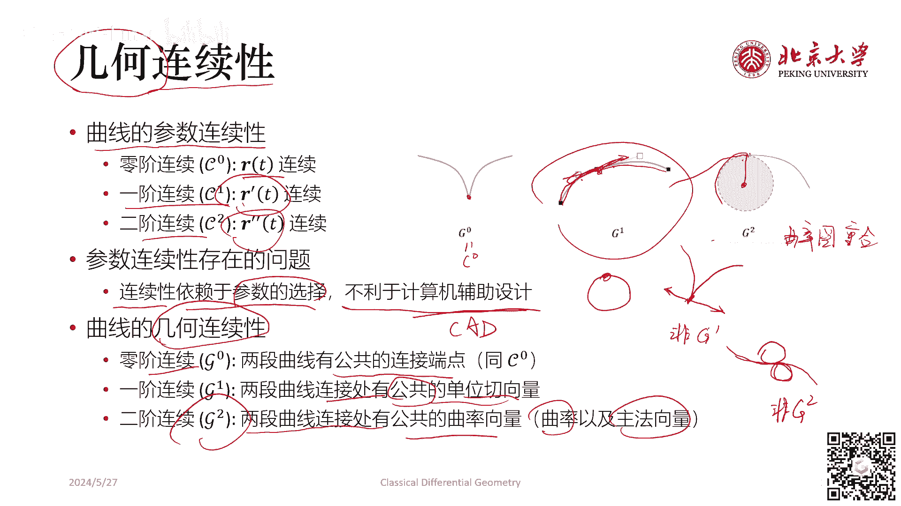

# GAMES001-图形学中的数学 - P11：古典微分几何 - GAMES-Webinar - BV1MF4m1V7e3

好的呃行，能听到我们就进入今天的内容，然后今天我们要讲的这课题是古典微分几何，首先我们来解释一下为什么微分几何，还有古典微分几何的说法，我们说所谓的古典微分几何，是和现代微分几何相对的啊。

古典微分几何是一种外运方法，什么叫外运呢，它是就我们身处在一个三维的世界当中，我们就研究镶嵌在这个三维空间中的，二维的曲面，而曲面的研究曲面的概念和方法呢，又是从研究三维空间中的一维曲线派生而来的。

所以呢古典微分几何，本质上就是三维空间中的曲线论和曲面论，而现代微分几何呢它是一种内运方法，它的意思是我们就是在所处的这个流行之内，我们研究的就是任意维度的流行，它本身我们并不是站在一个超越这个流行。

或者说这个曲面的一个空间当中，而是就在这个曲面当中，就在这个流行当中，然后去研究它本身的方法，所以呢这种研究的对象就呃是更多的是那种，人类无法在我们的三维空间当中去想象的，这样的一种呃流行。

比如说广义相对论，因为他研究的是这个四维的时空，那么它我们没有办法在三维空间内，给它做一个呃映射，很简单的去做一个映射，所以我们没有办法去用外用的方法去考察，而微分几何，它和图形学来说。

最大的联系也就在古典微分几何这一边，因为我们图形学的研究对象，其实是在三维欧几里德空间的可视化，呈现在这个空间里呢，有各种各样的几何体，然后我们要把这些几何体它的运动画出来。

我们无非图形学就是在干这样的事，而这恰好对应于古典微分几何的范畴，所以为了进行图形学的研究和这个呃编程呢，我们很多时候需要一些古典微分几何的知识，然后今天这堂课呢，我们就来简要回顾一下。

古典微分几何当中的一些重要的概念，呃然后因为我们课时是非常紧的，所以呃可能我们接下来所涉及到的内容，更多的是希望大家接触到有这样的一个概念，这样一个说法，至于其中详细的这个定理的证明。

以及呃一些直接的推论呢，大家可能还要参考这个本科，数学系的相关的书籍，首先我们来看曲线，讲曲线呢要从参数曲线来讲起，因为在这个三维欧几里得空间呢，它的曲线和我们在纸上画的曲线是不一样的。

它它的走向可能并不是在一一个平面当中，所以我们可以用一个从区间AB到，三维欧几里的空间的连续映射来表示一个曲线，或者呢我们这样的，我们也可以把这样的曲线称之为参数曲线，参数曲线呢它就是一个向量函数了。

然后这个向量函数也被称之为参数方程，它定义方法就是就是我们给一个参数T，然后呃我们会给在每一个T的这个参数下，这个时候曲线上点的位置坐标是什么，然后写成向量函数XTI加YTJ加ZTK。

或者写成一个向量的形式，就是RT等于XYZ，然后我们称如果XTYTZT它是连续可微的，我们就称这整个曲线啊T是连续可微的，而这里的I1撇T呢，呃这里我忘加一撇了，I1撇T也就是这个X1撇T。

Y1撇TZ1撇T呢是曲线的切向量，满足I1撇T不等于零，向量的点称为曲线的正则点，那我们根据高数上多元函数微积分的知识，我们还可以得到这个切线方程，它就是XUU又是另一个这个参数。

等于RT加上UI1撇T，这样我们就得到了一个直线的方程，这个直线就是过曲线上一点所产生的切线，我们称一个参数曲线是正则的，当且仅当它处处是正则点，并且它的参数方程是它自变量T的三次以上。

连续可微函数为什么是三次以上，一会我们会看到在曲线论当中，我们所考察或者说研究的曲线呢，它需要具有一定程度的连续可微的性质，于是我们就可以定义曲线的弧长，曲线的弧长呢呃可以直接写成积分。

就是从这个参数从一个端点到另一个端点，然后我们将中中途呢这个I1撇TDT，I撇T的绝对值，就或者说模长乘以DT成为曲线的弧长，为什么，因为因为显然有DR等于DRBDT，因为显然有这样的等式。

所以我们的弧长的积分式就这样，这样的形状我们也可以把这种形式拆开，也就是把它还原回来，里面写成DR就是DXDYDZ，定义了弧长以后，我们可以对每一个曲线，定义一个特殊的参数方程。

这个参数方程是用它的弧长作为参数的，比如说我们可以令s st表示，从A1直到这个参数T这一段的弧长，那我们就可以用这个弧长为参数，构建一个新的曲线方程，那么我们会发现呢。

这里的DS它就等于R1撇TDT它是弧长微元，并且与坐标系的选取是无关的，我们可以看到曲线参数是弧长参数的，充要条件是I1撇T它的模长等于一，为什么呢，因为如果I撇T的模长等于一的话，DS就等于DT。

也就是说DT就是弧长参数，的微分，然后这个时候呢，我们的切向量场同时也是单位向量场，我们可以看到切什么是切向量场，我们刚刚说的切向量场I1撇T对吧，I1撇T如果你满足I1撇T的模长都等于一。

那么它显然就是一个单位的向量场，那么我们可以把这个I1撇，我们现在就不妨用这个S来表示，以曲线的弧长为自变量的参数，参数方程的参数方程，然后我们记他为rs，刚刚我们说到曲线的切向量是IPS。

我们把IPS用一个特殊的这个呃向量函数记下来，叫它阿尔法S，那么这个时候呢，我们可以定义曲率，卡帕等于阿尔法对S求导的结果，同时我们会发现呢，这个卡帕它等于D阿尔法比DS的模长。

这个东西它又恰好等于曲线，我们在沿着曲线走的时候，上面的转角，也就是我们在这个呃之前所了解的曲率的概念，就是二维上我们了解曲率的概念，比如说我们一开始在S这个点这个点的时候。

它的切线的角度是朝阿尔法S这个方向，然后我们在曲线上往前前进一段距离，到S加德塔S，这时候曲线的角度，曲线切线的角度变成阿尔法S加德尔塔X，然后我们来考察一下阿尔法S。

加德尔塔X减阿尔法S也就是这样一段长度，然后这段长度的对应的夹角是德尔塔西塔，然后我们显然可以证明这个德尔塔，theta比德尔塔S，当德尔塔X趋于零的时候，它就正好等于迪阿尔法比DS。

因此呢我们如果刚刚我们看到这个区域，是对第二化DS取得一个模长之后得到的，如果我直接去把那个模长给去掉，D阿尔法比DS等于阿尔法一撇S，这个阿尔法一撇S是什么呢，我们叫它称之为曲线的曲率向量。

它叫曲率向量，也就是它的模长是曲率，它本身还有一个方向，他们俩的组合叫曲率向量，然后啊我们很显然可以得到这样的结论，就是曲线C为直线，当且仅当卡帕始终等于零，因为只有卡帕始终等于零的时候。

这个曲线在前进的过程中，才不会发生角度的弯折，同时我们发现，既然我们刚刚说S是弧长参数，那么阿尔法S的模长也就始终等于一，始终等于一，意味着我们也就是说阿尔法一撇四，本该这么写。

比如说阿尔法方S它也始终等于一，我们对这个东西求对S求一次等式，两边对X求一次导数，左边就会变成二，阿尔法一撇S点乘阿尔法X等于零，所以我们就得到了这个式子，阿尔法一撇S点乘阿尔法S等于。

也就是曲率向量和它的单位切向量之间的夹角，一定是90度，我们将阿尔法EPS称之为是曲线C的一个法向量，并且呢如果卡帕S也就是曲率不等于零，那么阿尔法一撇S的方向其实是什么，其实是唯一确定的。

我们直接可以把定义一个新的向量函数，叫贝塔S，它就是阿尔法一撇S，做一次单位单位化之后的结果，这个方向贝塔S的方向我们就是称它为主方向，那么贝塔斯就称之为主法向量，然后我们写一下就会得到阿尔法一撇S。

它相当于是卡尔法S，也就是曲率乘上贝塔S，也就是这个曲率的方向，也就是我们把曲率向量写成了，曲率乘上一个曲率方向的这样一个结果，这个曲率方向呢也就是主主方向，主法向量，定义了曲率以后。

我们刚刚已经得到了两个特殊的方向，一个是切向量，一个是主法向量，那么我们还发现这个切向量和主法向量啊，它还是垂直的，那么由这两个垂直的向量，我们立刻可以生成一个新的方向，叫伽马S。

它就等于刚刚这两个互相垂直的向量，叉乘的结果，而且我们看到这个阿尔法S和贝塔S，它的模长都是一，所以伽马S的模长也显然是一，也就是说，在正则曲线上，所有曲率不等于零的点。

都有一个完全确定的右手单位正交坐标系，这个单位正交坐标系的原点是S，然后它的三个方向的单位向量分别是阿尔帕斯，贝塔S和伽马S，我们称这样组成的一个单位，正交坐标系呢叫啊friend标价。

然后由切线主法线，次法线我们刚刚生成的贝塔S啊，生成的伽马S就是次次次法向量，它叫次法线为法向量的平面，以这三个这个切法呃，以这三个向量为法向量的平面，又分别称之为法平面，从切平面和密切平面啊。

这个就是一个概念，大家不需要去记忆啊，然后呃因为我们刚刚看到的都是这个定义，在参数就是弧长参数的曲线下所给出的，曲率的可以及曲率向量之类的表达式，那么如果是在一般参数曲面，就是我们每这个它就是T。

我们不这个T并不满足阿尔法一撇，S的模长等于一，如果不满足这个性质的话，我们可以讨论一下，在一般情况下，他的卡帕和伽马分别应该长什么样，然后这个时候他的额这里有个向量符号。

这时候它的曲率可以写成是参数方程的，一次导叉乘二次导取模长除以一次导的三次方，然后伽马也就是刚刚我们说的这个次法向量呢，就是分子不变，但是把模长去掉，然后分母写成这个一次导叉乘二次导的模长。

刚刚我们定义了一个什么，定义了这个一个finance坐标系，然后我们会发现我们多定义了一个次法向量，伽马是这个切向叉乘主主法线方向，主法线方向也就是区域所指向的方向，这样差乘完结果得到一个次法向量。

那么这个次法向量它到底是什么呢，我们其实有一个直觉，因为我们的这个次法向量的所在的平面，次法向量以次法向量为法向量的平面，其实是由切线和主法线章程的这样一个平面，切线和主法线章程的一个平面，所以。

他还满足什么性质呢，假如这个曲线一直在一个平面内，假如这个曲线就在比如说就在我们这个直面内，那么我随便考察一个点，它的切线朝这样，他的主法线朝这样哎，那么这个密切平面它就正好是我们的纸面对吧。

那我们会看到在每个点它的主法线，它的切线全都是在这个纸面内，所以如果曲线是，平面曲线，那么说明什么，说明它的密切平面始终是不变的，也就是说我们有一个直觉是次法向量的变化率。

实际上刻画了曲线偏离平面曲线的程度，也就是我们看到的说就是这个伽马一撇S，伽马一撇S，也就是我们刚刚把这个呃次法线再给，对于这个弧长参数求一次导数，它等于什么呀，它因为我们知道。

这个伽马本身是阿尔法叉乘贝塔，所以它的导数就是阿尔法一撇叉乘贝塔，加上阿尔法叉乘贝塔一撇，然后我们又知道这个阿尔法一撇，和贝塔一定是垂直的，因为因为阿尔法一撇就是呃呃，阿尔法一撇一定和贝塔是平行的。

因为我们知道贝塔就是从阿尔法一撇的，这个做了这个单位化之后得到的，所以最后我们就得到伽马一撇是什么呢，是阿尔法叉乘贝塔一撇，而由于贝塔叉乘伽马一撇等于什么呢，它其实我们可以把它在，呃就是刚我们看到说。

2fs，啊对我们可以把它展开，就是用这个向量恒等式把它展开，上节课我们讲到了这个点，就是我们可以用，我们相当于要去展开这样一个东西，用这个矢量二重积的恒等式，我们可以把它写成贝塔点贝塔一撇。

阿尔法减去贝塔点阿尔法，贝塔一撇，然后这东西我们又发现这个贝塔点，贝塔一撇是啥呀，因为贝塔也是单位的，也始终是保证模长为一的，所以它等于零，然后贝塔和阿尔法是垂直的，所以它也是零。

最后我们就会发现贝塔叉乘伽马一撇，它是零，所以呢所以我们的伽马一撇，它就可以写成某一个东西，就它一定和贝塔方向是这个平行的，伽马一撇一定和贝塔方向是平行的，因为它们它因为这两个方向的差乘等于零。

所以它一定是平行的，那我们可以记伽马一撇等于负tall乘贝塔，那么这个tall是什么呢，tall我们又可以因为贝塔是单位的，我们可以把伽马一撇直接投影到贝塔上去，得到t tall就是负伽马一撇点乘贝塔。

我们把这个东西叫做挠率，那么，平我们刚刚看到的这个结论，就是说平面曲线它的密切平面始终不变，对应为挠率始终为零，对应为脑力始终为零，对我们这里可以证明一下，就是当这个脑力始终为零的时候。

我们可以去考察R点乘伽马零，这个这个标量的对S求偏导的结果，求导数的结果，然后它就又等于R点成伽马，因为，对因为因为这个拓一撇等于零嘛，然后最最终我们就会发现它相当于说是I撇，点伽马等于零。

也就是它始终在一个平面内，同样的我们会发现呢这个，tall也就是劳力，它等于什么，它等于参数方程的一次导数，就如果这个单位这个自变量是T不是S的话，这个脑力可以写成参数方程，一次导叉乘二次导。

点乘三次导，再除以一次导和二次导叉乘的平方，当然如果你这么写之后，你就会发现再用上面这个结论，我们会发现这个曲一个曲线它是平面曲线，当且仅当什么呀，当且仅当它的参数方程，一次导数，二次导数。

三次导数所形成的行列式是零，就是一次，因为行列式是什么，就是这个一次导构成的行列式X1Y1Z一，然后二次导的X2Y2Z2X3Y3Z3，这个就是说它要等于只有它等于零的时候，这个曲线才是一条平面曲线。

好那么最后呢我们来看一下这个FLANNE的公式，它是说什么，就是我们现在把这个我们刚刚所定义的几个量，全部都给写下来，第一个是单位切向量，这个IPS它是我们把它定义成阿尔法S。

然后阿尔法APS呢它等于什么，它等于曲率乘上这个曲率方向，那就开发S乘以贝塔S除法线方向，然后啊我们有这个挠率呢等于什么，伽马APS等于负T乘以贝塔，然后我们现在可以在这个FNATE坐标系下。

用阿尔法贝塔伽马这个基底来展开贝塔一撇S，因为前面的我们都已经就是别的量，我们都已经展开过了，现在我们就来展开一下这个贝塔，一撇S它它是什么样的，然后因为他是基底嘛，我们就直接考察点乘就完事了。

然后贝塔一撇，它的S点阿尔法呢就得到负KA贝塔一撇S点，贝塔得到零，贝塔一撇S点伽马得到透，所以综上我们得到的是什么，综上得到贝塔一撇X等于负卡帕乘阿尔法，加上T乘伽马，然后我们把写成一个矩阵的形式。

就长这样，也就是说我们刚刚所得到的这个哎，这里没有一撇，这里没有一撇，也说我们得到的这个FANNE坐标系的标价，矢量的导数等于一个反对称矩阵，乘上friend坐标系的标价本身。

也就是说这个标价本身沿着曲线的运动方程，就由这个形式给出了，我们会发现这运动形式只涉及到曲线的曲率，和这个曲线的脑力，这还是很神奇的，在曲线论的最后呢，我们要交代一下这个曲线论的基本定理。

曲线论的基本定理是说，我们刚刚既然已经定义了这个曲线的曲率，和曲线的挠率这两回事了，我们给出的定理是，如果曲率和挠率分别是相等的，则这个曲线是全等的，这个概念怎么理解呢。

就是说如果我们有两个这个正则参数曲线，一个叫R等于RES，一个是R等于R2S，如果它们的曲线啊，如果他们的曲率初数都不为零，并且曲率和挠率分别都是相等的，也就是说卡帕1S和卡等于卡帕2S。

toe s等于托2S那么这说明什么，说明在这个三维空间中一定存在一个刚体运动，西格玛可以将曲线RES变为rs，也就是说IES和R在形状上看是完全相同的，只不过它们的朝向，它们整体可以做一些旋转。

做一些平移，但是它们的形状是完全一致的，刚体运动就是只有旋转和平移的运动，然后呃这里我们还给大家一个结论，就是说由曲率和挠率可以唯一确定曲线的形状，这个曲率和挠率可以任意一个给定。

你可以任意给定一个连续的曲率，一个人连续的挠率，然后我们就可以唯一的确定一个曲线，它长什么样了，这事情怎么做到呢，因为我们可以列一个常微分方程组，对，我们可以把这个曲率和每个这个曲率和挠率的。

表达式写写成一个常微分方程组，然后我们把这个常用方程组给解一下就行，然后呃因为我们刚刚取了这个frame内的标价嘛，然后在这个标价下呢，其实这个曲线还有一个近似形式，就是在曲线上某一点附近。

这曲线可以被写成线线的方程，可以被写成这个就是SS是阿尔法零方向啊，就是S2分之卡帕S方，六分之卡帕托S3方，然后这个这个近似的曲线呢，我们可以看到他是其实是一个三次函数啊，这个近似的曲线在原点处。

和原曲线有相同的区域，脑绿和friend的标价，然后同时我们可以定义相切相切，就是说如果这个曲线C1和C2，相较于这个一点，在C1上有点P1，在C2上有点P2，所以相切，就是说他们两个的接近。

是几阶和这个期限一致的，就是说这个P1和P2的长度，除以这一段弧长的K次幂是等于零，但是如果你给它加一次幂，它就不等于零，这个时候我们就说他是这个，这个N阶切除了。

也就是从在一到N在这个地方它都是极限为零，但是如果是N加一，它极限就不为零，这个就叫N阶切除啊，这个概念呃不是特别重要，但大家知道这个相切，它其实和曲面上的就是和在就是说曲线的相切，和这个曲线有多相似。

在这个点附近有多相似有关就可以了，然趋力语言这个概念，可能大家在就是高中物理里面，我们在求额角加速度的时候，其实已经用到这个概念了，就是我们刚刚已经定义了一个这个去绿了嘛，然后还定义了一个主法线方向嘛。

然后我们如果说我们在将圆心rs0，加上贝塔S0除以开发S0，这个地方画做一个圆，然后这个半径呢是一比卡帕S0，那么我这个圆周在圆与圆曲线，一定在rs0处是相切的，并且它的密切平面和曲率都是重合的。

所以说明二者呢有在这个点有二阶以上的切除，那我们称这个一比开帕S0就叫做曲率半径，就叫区域半径，区域半径是在物理当中，我们是把它用来决定这个呃角加速度的大小，就是圆周运动的加速度的大小。

好我们接下来就要从曲线来拓，拓展到曲面的概念了，然后呃我们来看一下这个弹幕，然后有同学说能讲一讲纹理映射的原理吗，然后我们这个啊这里就呃说明一下，我们这个001的课程。

它是补充图形学学习过程中所需要的数学知识，而纹理映射它本身是图形学的一个部分啊，大家可以去参考后面的这个课程，应该是在101和202当中，有提到关于纹理映射的相关的原理，有相关书籍推荐吗。

就是推荐这个呃，微分几何应该是北大有一本这个微分几何的，大家可以去搜索这个微分几何，北京大学出版社，好我们接着去讲这个参数曲面，刚刚我们已经定义过参数曲线了对吧，参数曲线是在一个一维的区间上。

到这个三维欧几里得空间的连续映射，那么参数曲面呢就是在一个二维的区区域，到三维的连续映射，因为一维是区间嘛，那么二维是一个连通的开子集地，我们我们可以把它叫做区域啊，还有可以加个区域，这就是我们一样的。

那么现在我们也要有两个参数坐标了，因为我们的定义域是在二维上，所以我们这个两个参数坐标分分别叫U和V，然后呃一样的，它也它还可以写成XUVYUV，ZOV这样的形式，那么我们会显然会发现。

如果我们固定其中一个坐标不变，然后另一只动另一个坐标，我们会生成一条参数曲线对吧，然后这些曲线呢都是在这个D中，平行于坐标轴的直线的映射的结果，所以我们又把UV又称为驱蚊坐标，比如说这个是定义域。

定义域是在二维空间，UV这个空间当中的一个棋盘格，而这个棋盘格，如果我们把它映射到三维的曲面上呢，诶他们就会，他们显然不一定在不一定还互相垂直了，也不一定还是一条直线，然后呃。

我们就把这个刚映射过来的这一些棋盘格上，每一条线呢都称为这个驱蚊线，然后呃这个UV呢可以看出来就是驱蚊坐标，然后啊和这个曲线类似的，我们也一样，有这个正则的定义，正则是说什么呢。

是说我们要求这个定义域中的点，和曲面上的点要是一一对应的，我们不能是曲线上有好几个点，对应曲面中一个点也不能反过来，然后如果呢呃满足这样的性质，并且我们还要定义切向量，切向量是在每个点处的这个参数方程。

对它的每一个自变量的偏导数，比如说我们就记作R下标，URURU等于偏R比偏U好，RV等于偏R比偏V，我们要求这两者必须是线性无关的，也就是RU叉乘RV要不等于不等于零。

也就是are you不能和are we平行，同时与曲线类似呢，我们要求这个参数方程是三次以上连续可微的，当然这个性质其实在曲面当中，我们往往给他这个放宽到两次了啊，往往给他放宽到两次了。

然后处处满足这个正则条件的参数曲面，我们就称之为正则参数曲面，那就是我们可以去研究的这样的参数曲面，是我们研究对象，但是呃这里要注意就是正则曲线，我们刚刚说了，正则曲线它是等价于正则参数曲线。

但是正则曲面它不等价于正则参数曲面，这是为什么呢，就这个参数，因为我们可以考虑有一些曲面它是正则的，但它不是正则参数的，比如说球面球面就无法表示为正则参数曲面，因为球面有几点在球面的极点的这个地方。

你没有办法把它写成一个连续可微的形式，所以呃球面并不能直接写成一个，完全的正则参数曲面，所以呢我们但是球面又是可以被我们研究的，如何研究呢，我们可以发现球面的每一上面的每一个点。

它在领域内都可以写成正则参数曲面对吧，因为我们的球坐标只要你不在极点就完事了，那当然是一个球上的每一个点，它都可以不是极点，当然也都可以是几点，所以我们只要在每个点附几点附近，重新做一个参数化。

然后是这附近的这一片变成正则参数曲面，然后这些正则参数曲面，它之间可以拼在一起就可以了，那我们我们这个曲面论研究的正则曲面，也包括这种由正则参数曲面拼接得来的曲面，然后呃同时呢我们还就是参数曲面呢。

那既然是参数嘛，你的参数可能可以变换，就是我们可以定义这个U等于YOUTUBE的，VTUL的函数，然后V等于也是YOUTUBE的VTUL的函数，那么额他什么时候它是容许的呢。

那我们只要求他的这个啊雅克比矩阵的行列式，只要它不等于零，那么它就是容许的，同时啊，我们会发现这个曲面呢呃它其实是有方向的，一个曲面，一个三维空间中的曲面，其实有可以决定两个方向，一个是曲面正方向。

一个曲面的这个呃反方向对吧，因为曲面的法向量它只能朝向曲面的一侧，所以我们一般是将URU叉乘RV的结果，作为法向量的方向，所以如果你希望这个在参数变换之后，反方向不变，你同时还要满足什么呀。

你还要满足这个上面这个行列式的结果，是大于零的，因为你小于零就会改变这个反方向，然后我们再来看这个呃，曲面上定义的一些基本概念，第一个我们来看这个曲面的切向量和切平面，刚刚我们其实已经定义过曲面的切方。

切向量了对吧，他就是这个曲面参数方程，对它的每个自变量的偏导数，然后呢啊这里我们给出一个结论是，参数曲面上过一点的任意一条，连续可微曲线的切向量，也就是曲面在该点的切向量，都是曲面在该点的切向量。

为什么呢，因为我们刚刚说到，曲面对它的两个自变量的偏导数，分别是RU和RV，这AU和RV在该点处一定都是曲面切向量，因为RU点乘N等于零，RV点乘N也等于零，那么由AU和av的任意线性组合。

得到的这样的向量呢，它也肯定是曲面的切下来，那么如果我给定曲面上一个曲线，UT等于U0加AT，VT等于V0加BT，然后这这个东西哎，我们把他对于这个DT求一下导数，我们会发现它就等于A2U加上BRV。

那么根据刚刚我们说的这个定理，曲面上过一点，任意一条连续可微的切向量都被定义成曲面，在该点的切向量的话，那么我们就能证出来，ARU加BRV也是这个曲面的切向量，当然这两个定理是可以互相定义的。

就是你要么定义上面这个东西，你就会证明证得下面这个结论，你要么定义下面这个东西，你会证得上面这个结论，这样是可以互相证明，总之它是关于切向量如何定义这样的一个问题，引入的一个问题，那么什么叫切平面呢。

切平面就是由切所有的切向量，所形成的一个空间，也就是RU和RV所张成的空间，因为我们刚刚说过，由RU和RV的任意线性组合得到的向量，它都是切向量，也就是说X拉姆达缪就是这个曲面的参数啊。

这个曲面参数它在RUV加上拉姆达美的RU，加上MB的RV，这个也就是这个曲面，这里我们可以看到这中间这个方块，它是曲面在P这个地方切平面，那么切平面和曲面在这个点处，它的法向量是相同的。

就是说这个切实实上，事实上，这个切平面就是由曲面在这点的法向量所唯一，确定的啊，有同学问会有录屏吗，是会有的，我们这个games系列的课程，每一节课都是有录屏的，那么与刚刚我们说的参数曲线呢。

finite标价一致啊，这个曲面呢也也有个自然标价，这个自然标价就是呃在曲面上一点，然后它沿某个方向的单位切向量，沿这个自变量U方向的单位切向量，沿自变量V方向的单位切向量呃，它不一定是啊，不好意思。

它不一定是单位的啊，沿U方向的切向量，沿V方向的切向量以及这个点处的法向量，由它们构成的东西叫做自然标价，但这个自然标价和我们刚刚说的参数，期限的自然标价不同，你们可以看到，首先它不是单位的。

这个不是单位的，这个也不是单位的，然后N虽然是单位的，但是前面两个都不是，并且N虽然和AU和av都垂直，但AU和RV不一定垂直，然后续我们事实上都在研究的是自然标价下，曲面所满足的一些性质。

然后呃我们来介绍一下影视曲面的概念，影视曲面其实就是它由隐函数来定义，就如果FXYZ，它是定义在R3这个空间上的连续可微函数，只要偏F偏X偏F偏Y偏F偏Z，也就是F的梯度它不为零，那么我任取一个常数C。

它FXYZ在这个常数C的等值面，它就一定是一个正则曲面，然后同时呢这个偏F偏X偏F偏Y偏F偏Z呢，一定是垂直于等值面上的曲线的，所以它是一个法向量，他是一他是这个正则曲面的法向量啊。

这个其实好像啊高等数学这个呃课的上册的，最后好像是有这个相关的内容啊，至少北大版是有的，关于影视曲面的这个定义，我们就不在这里赘述，现在我们来看这个曲面一些最重要，最重要的性质。

也是大家可能在接触微分几何的概念之前，不会听到的这样的一些定义，首先我们来考察正则参数曲面，它的微分就是我们把参数方程做一个微分，然后先用全微分公式，正则参数曲面DR等于什么呀。

等于RU乘以DU加上RV乘以DV，这意味着什么，其实就意味着下面这个这个极限的式子，就是其实是微分的定义啊，这是二元函数微分的定义，就是说那么我们知道DR是什么，DR其实是一个线的微圆，是一个限元。

我们可以考察这个线圆的长度，也就是说我们可以将考察DR的这个模长的平方，就是DR点乘DR，我们把它展开，用他的微分式展开，你会发现它等于这个东西点成这个东西，然后我给他暴力的展开，展开之后。

它会它可以写成E，我们记一个符号叫EUV乘上DU方，加上2FUV乘上DODV，加上GUV乘上DV方，这里的E是什么呢，它其实是RU点乘RU，然后这里的F是什么呢，是RU点乘RV，这里的G是什么呢。

是RV点乘RV，也就是说我们的EFG刚定义的这三个函数，相当标量函数，其实给出了基底RU和RV下曲面的线，圆点基的一个度量，因为我们刚是才求点击的时候，得到的这三个函数的。

或者呢我们可以把刚刚我们求点击这个过程呢，给它写成一个这个，矩阵的形式也就是DX方等于DODV，乘上这个矩阵，再乘上一个DODV，这是前面是行向量，后面是列项，那么我们将这个刚定义的这三个函数。

EFG或者写成矩阵形式的这个对称矩阵，称之为曲面的第一基本型，它叫曲面的第一基本型，第一基本型决定了什么呢，它决定了曲面下线圆点击，也就是决定了曲面线圆的长度，第一基本型决定了曲面线圆的长度。

我们来考察一下，这个第一基本形构成的矩阵的行列式，比如说我们写成这个矩阵，然后对它求一个行列式，它等于1G减F方，我们把它展开就会发现他是RU方，点成RV方，然后后面是一减上cos方的。

RU和RV之间的夹角啊，这个大家可以展开一下，然后一减cos方是什么，就是sin方对吧，也就是说它是什么，它其实是are u叉乘RV的模长的平方啊，U差上RV的模长的平方，所以一定是大于零的。

也就是说这个中间的曲面，第一基本型所构成的矩阵是一个正定矩阵，它意味着长度一定是非负的，唉这些都是很好理解，然后最后我们还会看到说啊，在这个are u和RV如果它是正交的，也就意味着这个F要始终为零。

也就是说参数曲线网啊U0T和RTV0，如果它是正交的，那么就一定F始终为零，或者如果F始终为零呢，那么那个参数曲线也是相互正交的，也就是说are u和RV始终是正交的，然后刚刚我们已经知道。

如这个曲线把曲面上取一个线圆，怎么去计算它的长度啦，就是用这个第一基本形去计算它的长度，那么如果我在切面上任何画一个曲线，我怎么算这个曲线的长度呢，我们就只要对它的这个线圆做积分就好了嘛。

就限元做积分就好了嘛，然后我们就把它写开，哎，我们这个曲线是定义为这个自变量T的函数的，那这个就啊是一个很直接的推论，那么现在来看曲面面圆的面积，就是说呃如果我在曲面上去取一个取一个面。

也就是说我如何把一个曲面的面积，写成DU和DV的函数呢，那么我们看到你沿着DU方向走一截，沿着DU方向走一截，就是are u德尔塔U，你沿着这个DV方向走一截，就是av德尔塔V。

它们两个所形成的这个平平行四边形的面积，其实就是曲面面圆的面积，这个平行四边形的面积是怎么给出的，其实是are u叉乘RB给出的对吧，因为我们知道这个两个向量叉乘，得到的是两个向量构成的平行四边形。

就是它大小，它的面积在大小上和它差乘是相同的，那我们刚刚已经给给出这个are，U叉乘RV平方是什么，就在前移啊，U叉乘RV的平方就是EG减F方嘛，所以也就是我们同时证明了。

漆面面圆也可以写成这个D1基本型的行列式，开根号之后，点乘DU点乘DV的结果，这也是一个很重要的结论，第一基本型揭示了一个概念，叫做揭示了两个概念，一个叫保长，一个叫保角，就是因为一个正则参数曲面。

你不可能只有一种参数方法，参数化的方法，你其实往往对应了好多种不同的参数方程，比如说我们现在有两个这个正则的参数取名，第一个是R等于R1U1V一，第二是R等于R2U2V二，然后我们现在呢存在一个变换。

它使得U2可以写成U1V1的函数，V2也可以写成U1V1的函数，那么我们就可以我们对这个变换呢，我们怎么去考察这个变换呢，也就是说有一种变换叫保长变换，它可以将曲面S2的参数，就是你现在是U2V2嘛。

我们把这个曲面S2的参数也给变换为，U 1v1，同时呢我要保持它切向量的长度不变，那么你保切向量的长度意味着什么，就保长度必然是保内积的，为什么，因为内积是什么呀，我们把内积写开，我们把内基做一个展开。

内基其实是这两个向量相加的长度的平方，减去每一个向量长度的平方对吧，所以如果你在变换前后，这个三个长度都是不变的，那么你的内每你的内积也是不变的，也就是说你切向量的，如果你切向量长度都不变。

你切向量的内积液肯定不变，也就是说在曲面上保内积，那么保长意味着保内基，保内积意味着保第一基本型，因为刚刚我们已经知道，这个第一基本型是在算内积的时候，算出来的东西，也就是也就是说这个E1U1V一。

要等于E2U1V一，比如说如果这两个切面之间是保持，这他们俩存在一个变换，这变换是保长的，那么他们俩要有共同的第一基本性，共同的E共同的F共同的G，除了保长以外呢，这个变化还可以是保角的。

也就是说将曲面S2的参数给它变换为U1，V1之后呢，它切向量的夹角是不变的，刚刚我们说切向量长度不变强，它要求切向量夹角不变，那么夹角怎么算，夹角两个向量的夹角是他们俩的点乘，除以每个向量的模长对吧。

那么我们这里给出两个定理，第一个定理是保角的，充要条件是D1基本形成正比例，啊这事情就是我们可以考察一下原因，就是呃因为我们可以先看RU和RV的夹角，AU和RV的角角，要是它是F1除以呃。

根号下E1G1，那么这个东西在变换前后得是不变的对吧，那它在变换前后不变，就意味着12F2除以根号下122，它也等于这个东西，那同样的我们可以取这样一个切向量，这样这一对切向量的夹角啊。

他就得到这样一个恒等式，再取这一对切向量的夹角，就要得到这样一个恒等式，这两个东西相等，然后我们把这个东西给求解一下，求解之后，我们就必然要满足什么呀，要满足E1等于K倍的E2，F1等于K倍的F2。

G1等于K倍的G2，并且K2是大于零，所以如果两这个变换之后，两个曲面的参数方程满足这个性质，我们就称这个这这个变换是保角变换，定理二是说，任意两个正则曲线参数，曲面在区局部上都可以建立一个保角的对应。

这个定理其实呃在统计学当中应用很广泛啊，因为我们这这就和纹理映射有关，我们在做纹理映射的时候，我们其实希望这个呃我们的纹理，因为我们纹理是一张，一张这个平面上的贴图。

而我们映射到的额是一个三维式中的曲面对吧，那我们希望它映射过来之后，不要丢失太多的信息，不要尤其是我们希望在存储的时候要尽量均匀，就你参数化要尽量均匀，因为其实存纹理贴图的这个过程。

就是曲面的参数化的过程，我们希望这个参数化减量均匀，那怎么去衡量这个均匀呢，那一个指标就是保角的，就是说这个纹理到曲面的映射是保角的，我们在同心学当中建立了很多种方法，来给定一个曲面。

生成它的一个倒角的参数化方式啊，这个大家可以去看这个games系列的后续课程，以及相关的这个图形学的论文，介绍一下这个可展曲面的概念，什么叫可展曲面呢，就是我们先看直吻面。

一条曲线在空间中运动所产生的曲面，它就叫直纹面，这个曲线可以任意的方式运动啊，但是他必须以一个整体来运动，比如说呃我们可以用这个数学的形式来讲一下，什么叫做直纹面，直纹面可以写成一个向量函数。

加上V乘上另一个向量函数这样的形式，那V就是曲线运动的速度啊，你可以这样去理解，然后呃就是我们称之为前面的这个东西叫准线，然后V乘上LU这东西叫做直母线，就是它运动的方向，比如说柱面呢。

它就等于直母线的直母线是一个子母线，后面这个东西的U干掉了，也就L始终是一个定值，那么就会产生注明，然后如果前面的A是个定值，就会产生锥面，就是从一个点出发，就会产生锥面，这个就是柱面，这是柱面。

柱面就是L始终朝一个方向对吧，L始终朝一个方向，以沿这个这个这里这个曲线沿这个方向动，就会形成柱面啊，这个就是说呃我这里我我这个曲线，沿这个沿这个方向不断这样一条从这个点出发，然后我会发出无无数条射线。

然后然后这些射线之间，你也可以把它看成是个运动的关系嘛，然后这些它运动结果就会产生一个锥面，然后第三个就是切线面，切线面是说我给一个空间上的曲线，然后它的切线不断的不断的有，它的切线可以形成一个面。

我们注意到这是空间曲线啊，就我们的这个切线，它这些切线它是，它它不一定落在一个平面内，如果落在一个平面内，那你可能就构不成一个这个，你给你构成了这个曲面，它可能就跟柱面没什么区别了。

就它不一定在一个平面内，什么叫可展曲面呢，我们先把可展曲面定义为，如果直纹面的切平面，沿每一条直母线都是不变的，也就是说我们他是说A撇ULUL1撇U，我妈写成行列式，这个行列式的结果是零。

然后有一个定理是说，可展曲面一定是柱面，锥面，切线面，以及三者以充分连续可微的方式拼接的结果，它叫可展曲面，可展曲面在局部上呢，都是可以和平面建立保长对应的，或者我们可以把这个可展曲面就定义为。

在局部上，在每个局部上都可以和平面建立，保长对应的曲面，叫做可展曲面，我们也可以完全可以这样去定义啊，这这这其实是什么意思呢，就是我们可以想象，如果有一有一块布料，这个布料是处处不可拉伸的。

什么叫不可拉伸，就是布布料上任意两个点，当这个布料被揉成揉成一个布团以后，我们在这个曲面上去看这两个点之间的距离，就沿着曲面去看这两点的距离，它是不变的，也就是说，曲面上任意两个点之间的距离是不变的。

那么它就是和可以和平面建立了一个保，他就是和平面建立一个保长对应，或者我们就可以把可展曲面的几何，看成是不可拉伸的，布料，运动的结果，他就是不可拉伸的布料，你能解的，因为不可拉伸的布料，你放平的时候。

它它就是一个平面嘛，然后你运动之后，它又揉成了一个东西，这个东西需要是可展曲面，曲面刚我们考察了他的第一基本性，那他既然有第一基本型了，也就必然还会有第二基本性，曲面的第二基本性是什么呢。

它是对曲面弯曲程度的刻画，我们知道第一基本型，它是对曲面上的长度的刻画，那么第二基本型就是在曲面上某一点附近，弯曲程度的刻画，事实上他是什么样，就是曲面上取一点，我们看到这个这是个曲面啊。

这个S这是一个曲面，这是个曲面上面这个东西它是一个曲面，我们考察漆面上一点U0V0，我们在在曲面上，在附近再取一个点，叫U0加德尔塔UV0，加德尔塔V，然后我们考察这这两个点之间的距离，那就是RU0。

加德塔UV0，加德尔塔V减去RU0V零，然后我们把这个距离呢向曲面的法方向，投影法向量方向投影，投影之后的结果，我们可以把它整理一下，它等于什么呢，它等于12的L乘德尔塔U方。

加上2M乘德尔塔U德塔V加上N乘德塔V方，也就是说，如果他在取极限的时候，这个德尔塔也会变成微分微分，就是长这样的形式，就刚刚我们给出的结论是D方R点N等于什么，等于LDU方加IMDUDV加NDV方。

然后D方R点N呢又可以写成是负，DR点乘DN的形式，这就是一个微分运算，是个微分运算，那可以看一下这个为什么是为什么是等价的，其实我们看考察的就是DR点N，你给它取D取微分之后会是什么。

因为DR我们刚刚知道，N其实是由DR得到的是吧，我们这RU插上RV得到的N，所以DR点N1定是零，也就是说DDR点N1定是零，我们就会发现D方R点N加上DR点DN等于零，也就是这个也就是这个恒等式。

前面这个恒等式，刚我们这里涉及到了三个曲面上的这个量，LMN这里的L是什么呀，它是对U方向取二阶导数啊，UU点乘N或M呢是在UU方向取一次导数，在V方向再取次导数的二阶混合偏导数。

RUV点成NN呢是在V方向取二阶偏导数，点乘N，然后同同样的类似于这样底下的这个恒等式，类似于这个恒等式，我们可以把L写成RU点成NU，把M写成RU点成NV或者是RV点成NU，而N写成RV点乘NV。

这里的下标都不表示对这个方向求偏导，那么这个第二基本形有什么用呢，我们先来看两个特殊的曲面的第二基本型，第一个特殊的曲面就是平面，我们知道平面的第二基本形式是什么呢，我们可以算一下。

我们会发现平面的第二基本形啊，它恒等于零，为什么我们看这个定义，如果这个东西它是一个平面的话，你在平面上取一个附近取一个长度，这个长度是不是还是跟N完全垂直的呀，所以你你算出来的这个长度有长度。

在N方向上的投影也一定是零，所以说平正则曲面是平面的一部分，当且仅当它的第二基本形式恒等于零，然后我们已经证明了这个啊必要性，下面我们也可以证明充分性啊，充分性是类似的啊，就是说就是我们在一组基底上。

然后我们得到了一个这样的结果，还是DR点N等于零，就是说一个方向和一个法方向，他们俩点乘一定是始终，他们俩点乘始终等于零，也就是他们俩始终是垂直的，根据平面的定义，我们就会发现这样会生成一个平面。

类似的呢，我们可以看球面的第二基本形，那么球面的第二基本型有什么特征呢，它始终是该球面自己第一基本形的非零倍，它始终是自己低基本型的非零倍，也就是说D方R等于什么，等于负DR点DN等于负球面的半径。

负R分之一的DR变成DR，我们刚刚知道这个，这里有个地方啊，点N看点N，他说D方R点N也就是第二基本型，是第一基本型的DR点DR的负R分之一倍，然后我们来看曲面的曲率是什么。

我们刚刚定义了曲线的曲率对吧，那么我们可以用曲线的区域，去派生一个曲面的曲率出来，假设在曲面上有一个曲线，曲线有个参数方程，也就是说U是S的函数，V是S的函数，那么这个曲线呢有一个单位切向量。

它是RU乘U1撇S加上RV乘上V1撇S，那么同时它就会有个区域向量，曲对向量是阿法阿尔法S的，这个导数就是阿尔法一撇S，阿尔法一撇S等于KA乘以贝塔，这都是之前的定义呀，它等于什么呢。

它等于RUU然后U1撇方2RUVU1撇，V撇加啊VVV1撇方加RUU两撇，加RVV两撇，我们把这个曲率向量向曲面的法向做一个投影，投影完之后，我们就会发现卡帕N等于阿尔法一撇，点点乘N等于什么呢。

它就等于L乘上U1撇方，加上2M乘上U1撇V1撇，加上N乘上V1撇方，这时候我们将卡帕N就称为曲面上，刚刚我们考察这条曲线的法曲率，并且我们发现法曲率止于曲面的第二基本型，LMN和曲线的单位切向量有关。

单位切向量有关，就是这里的U1撇V1撇，只和这两个量有关，只和一个第二基本型，一个U1撇V撇有关，然后梅尼埃定里给出了是说，如果曲面上两条曲线，在某一点有相同的单位切向量，那么它的法曲率是相等的。

这定理，其实从我们刚刚这个计算结果，已经完全可以看到了是吧，你有两条切线在某一点有相同的单位切向量，说明你的U1撇和V1撇是分别相等的，你U撇V撇分别相等，你计算的区域向的法向投影。

也就是法区域就一定是对应相等，同时呢我们发现这个U1撇，这东西挺有意思的对吧，这是什么呀，就是U1撇是DU比DS，它也就是上面是DU方夹，是这个DS方类似的呢，上面是DODV以下也是DS方。

上面是DV方，底下也是DS方，DS方是什么，DS方就是第二方，就是第一基本形，就是EDU方加2FDUDV加上GDV方，这是它的分母，这分母是第一基本型，分子是第二基本型，这个东西就叫法区。

这个东西就叫法区，那么既然法区律只和这个第二基本型以及，也就是说，我们现在就发现这个法区域，只和第二基本型以及一个曲面的切向量有关，所以呢我们不妨把法曲率就定义成切放。

用切某一个切方向DUDV来定义法曲率，我们就抛弃那条曲线，直接这样去定义法曲率，这时候呢我们就会发现呢在法截面上，法结线的平面区域与法区域在数值上是相等的，法截面是什么。

法截面就是我们刚刚取了一个切方向嘛，这个切方向和曲面的法方向一起，它会构成一个平面，这个平面我们叫它法截面，而法截线呢就是法截面与曲面的交线，就是比如说这曲面就是一个平的，然后我在这个地方取了一个方向。

叫它这个切方向啊，这个前面有一个这个法方法法向反方向嘛，然后他们俩所得到的法界线就长这样，这就是法界线，刘刷，我在法截线，这是二维吗，这在二维的一个线，它显然会有一个平面区域，这个平面区域就是法区域。

法器律会成立一个欧拉公式，欧拉公式是说在正则参数曲面上，在任意一个固定点呢，它的法区域，因为法区域我只要给一个切方向，我就能生成一个法区域，这个法确率必然在两个彼此正交的切方向上，分别取最大值和最小值。

而且呢我们把法区域取最大值的，可或最小值的方向呢称为曲面，在该点的主方向，相应的法区域呢称为曲面，在该点的主区域，那么主区域就是卡帕一，卡帕二，然后取最大值的这个法方额。

法法方向呢我们可以取一个这个角度参量，角C塔零，那么欧拉公式其实给出了，就是说在这一点任取一个反方向，任取一个法方向，我都会得到一个法曲率，这个法曲率等于卡帕一乘cos方，theta减theta0。

加上卡A2乘sin方，theta减CA0，卡帕一和卡帕二分别都称之为主曲率，且开帕一大于等于卡帕二，这个欧拉公式怎么证明呢，其实有一个比较简单的方法去证明，但这个方法呢需要一个额稍微深入一点的数学。

我们来考察高斯映射，高斯映射它把任意一个曲线啊，曲面上的点呢映射为这一点的法向量长，右边这样这个曲面上有一点R，它有一个法向量N我们从R映射到N，从R映射到N有，那么我在曲面上的一个区域呢。

都会映射到三维空间中，球面上的一个区域，因为这些法方向之间应该是连续过渡的，这些法向量之间应该是连续过渡的，那么从这个映射叫高斯映射，就是右边这幅图这个的映射叫高斯映射。

从高斯映射呢我们可以得到一个诱导的切映射，诱导切映射是说，我对于每一个这个诱导牵引式，要满足什么性质呢，满足g star r u等于NU，也就是啊，在U方向的偏导数会生成N在U方向的偏导数。

而在V方向的偏导数会生成N，在V方向的偏导数，这是从高斯映射得到的诱导切映射，这个诱导切映射取一个负号，有个名字叫做位因因加藤映射叫未因加藤映射，回音加藤一首，这里还有个点成V1加藤映射。

是说第二基本型它等于什么，它等于负DR点DN嘛，刚刚我们已经说出了第二基本型，它就等于负DR点DN，那么既然我这个魏因加藤映射，具有把DR映射成DN的能力，映射成负DN的能力。

所以我们利用位因加成映射吧，记住W的话，这个第二基本型就可以写成WDR点乘DR，也就是说他是这个时候，这个微因加等映射是一个线性映射，这个线性映射呢那它就会有特征值，特征值。

就是使得魏因加藤映射作用在一个切向量上，它等于拉姆达直接乘这个切向量的结果，那么这个时候得到的DR呢就称之为特征向量，这个特征向量呢，我我们这个特征值会发现发现什么呀。

特征值它就是卡帕N等于WDR点DR，除以DR点DR，那么WDR点DR是第二基本型，DR点DR是第一基本型，第二基本形式一旦你写成WDR的形式，你就会发现它等于第一基本形成一个兰姆达。

就是说兰姆达就是这个特征向量方向的法区域，同时我们发现这个微因加藤映射具有共轭性，就如果我任取两个这个呃切向量，一个叫DR，一个叫德尔塔，我不管是把W作用在DR上，还是作用在德尔塔R上。

他俩点乘的结果都是相同的，这说明微因加层映射具有共轭型，那么二维向量空间到自身的自共轭映射呢，一定有两个十字特征值，一定有两个十的特征值，我们把它分别记作兰姆达一和兰姆达二。

并且我们假设拉姆达一是大于等于兰姆达二的，那么根据这个线性代数的相关知识，当兰姆达一不等于兰姆达二时，这个特征向量一定是正交的，否则呢，也就是说兰姆达一等于兰姆达二的时候呢，任何向量都是特征向量。

这个时候我们就可以证明这个欧拉公式了，因为我们假设这个拉姆达一不等于拉姆达二，也就是我们还会有两个特征向量，特征向量一个是WE1等于拉姆达111，W12等于兰姆达212，那么任何切方向呢。

我们都可以把它用这两个特征向量展开，因为这个特征向量是正交的嘛，特征向量正交，也就是说特征向量E等于cos theta，一一加sin thet12，那么WE是什么，就作用在这两个特征向量上。

变成拉姆达1cos theta11，加上兰姆达2sin西塔一二，于是我们可以去计算E方向的法曲率，卡帕西塔等于WE，点E除以E点E又是兰姆达1cos方形，加上兰姆达2sin方Y，这里的兰姆达一。

也就是卡帕一是比较大的那个主曲率，兰姆达二是等于卡A2，等于比较小的那个主曲率，这样都是主区域，也就是主曲率其实是未因加藤映射的特征值，那么如果拉姆达一等于拉姆达二，那就更好证明了对吧。

这个时候他任意方向的法系列相同，所以欧拉公式仍然是一定是成立的，这时候我们把这样的点呢就称为起点，也就是说如果在某一个点处，它的法曲率的最大值和最小值相等，或者说它的特征值两个特征根重合。

那么这样的曲面上的点我们叫做起点，在起点处呢，第一基本型和第二基本型的呃，就是第二，基本型和第一基本型的比值呢是恒定的，就是卡帕，所以呢LMN和EFG是成比例的，这个比例如果是零，我们称之为平点。

如果比例不是零，那我们称之为圆点诶，我们刚发现，我们考察的平面和曲面的第二基本型，这时候我们也可以用更简单的形式表述了，就曲面是平面，当且仅当它上面的点都是平点，曲面是球面，当且仅当它上面的点都是圆点。

然后利用这个主曲率，一个主曲率，一个大主曲率，一个小主曲率嘛，我们取它们的平均值叫做平均曲率，平均曲率可以写成，第二基本型和第一基本型的函数和高斯曲率，高斯曲率就是这个两个主曲率相乘。

它也可以写成第二基本型和第一基本型的函数，我们可以看到这里的分母是第二基本型的函数，分子是第一基本型的函数，这个是二，这个是一，这个定义叫平均曲率和高斯曲率，然后曲率的概念在我们做这个物理模拟的时候。

其实就很重要了，因为我们在这个很多，比如说表面张力定义的是平均距离的函数对吧，它是等于西格玛H就是表面就是决定表面张力，然后同时呢，我们在这个呃定义布料的弯曲的能量的时候。

我们也可以往往把它写成这个平均曲率的，某一个次幂一倍卡帕啊，K乘上H方倍魔王也这样去定义，而高斯曲率呢，高斯曲率其实是这个曲面一个更重要的性质，我们一会来说这个高斯曲率它意味着什么。

刚刚我们在讨论曲线的时候，给出了一个曲线的唯一性定理是说，如果曲线的呃，这个曲率和挠率是始终对应相等的，这个时候我们曲线的形状也是完全相等的，那么对曲面来说，情况稍微复杂一些，是说。

如果第一基本型和第二基本型是分别相等的，那么这会构成这两个曲面是完全相等的，两个曲面间都只差一个刚体运动，但是不一样的地方在于曲线，我们刚刚说你给出任意一个连续的曲率，任意一个连续的脑力。

你都可以生成一个曲线，并且这个你你想怎么给怎么给，但曲面并不是这样，曲面的第一基本型和第二基本型，你是不能乱给的，它的第一基本型和第二基本型是互相耦合的，也就是说，你不是任意给EFGLMN。

都能构成合法曲面的，那么什么样的EFGLMN能构成合法曲面呢，它是有一个充要条件，这个充要条件叫高斯柯达齐方程，然后这个方程就超出了我们今天所说的内容，大家有感兴趣的话，可以去看一下。

用这个方程呢可以证明一个非常漂亮的结论，叫高斯绝妙定理，高斯绝妙定理说，曲面的高斯曲率是由其第一基本型完全决定的，也就是说它是由EFG完全确定的，如果我知道曲面上任何一个点能第一基本型。

我同时就也知道了，曲面上任何一个点的高斯曲率，当然大家可能会问啊，我上一页给出的这个高斯曲率的表达式，明明它的分子是第二基本型，分母才是第一基本型，那你凭什么就是只知道低基本型。

你就能给出这个高斯曲率呢，因为我们发现它的分母是什么分母啊，分子是什么，分子是LN减M方，我们用这个高斯柯达系方程可以证明，LN减M方，事实上它可以写成EFG以及EFG的，对于UV的偏导数。

用它们的函数来表达LN减M方，这个东西只和第一基本性有关，那么我们知道这个当第一基本型不变的时候，称之为保长变换对吧，那么第一基本型，而低基本型完全决定了高斯曲率，也就是说高斯曲率是保常变换下的不变量。

那么一个这个可展曲面，我们刚刚是说可展曲面一定要在局部能够保长，变换到一个平面，而一个平面的高斯曲率是什么，高平面的高斯曲率是零对吧，而平面的高斯曲率等于零，所以说无起点一个曲面。

或者我们说无起点的曲面，它是可展曲面的充分必要条件，又可以写成高斯曲率始终为零，高斯曲率使用为零，高斯曲率为零，说明这个曲面至少在，至少它的两个主曲率中有一个得是零，它的高斯曲率才始终为零。

这个定理它为什么叫高斯绝妙定理呢，因为他给出了一个非常重要的性质，是说我们研究曲面的弯曲程度，并不需要站在曲面之外，因为第一基本型给出的是对长度的度量，就是在我们这个传统曲面论的曲平面。

曲面论的概念当中，第一基本型给出的是关于长度的，而第二基本型看关呃，考察的是关于弯曲的，同时曲率考察也是关于弯曲的，有平均曲率H高斯曲率K这都是关于弯曲的，这是平起，这是高曲。

而我们说这个K居然完全是由长度来决定的，其实这个结论说明，我们可以站在一个曲面之内来考察，这个曲面的弯曲性质，这也就是我们刚刚所说的现代微分几何，或者说黎曼几何，它的源头，就是一个曲面的弯曲。

并不需要站在曲面之外才能看出来，我们只要在曲面之内测一测它的长度，测一测它上面微圆的程度，我们就能得到关于曲面弯曲的性质，这是这就是为什么这个定理叫做高斯绝妙定理，这其实是一个非常神奇。

非常漂亮的一个性质，最后呢我们来看一下，刚刚我们已经大体上介绍了，关于曲线和曲面的相关的一些定义和一些定理，最后我们来看一个，大家可能比较关心的一个问题，在前几集呃。

我看见在我们的QQ群当中也有同学在讨论，就是关于曲线和曲面的连续性问题，在图形学当中，我们广泛涉及到的是几何连续性，而几何连续性呢，它并不是一个非常显然的连续性，非常显然的连续性叫参数连续性。

参数连续性是，因为我们曲线我们给定了一个参数方程，这个参数方程既然它是一个方程，我们就可以很容易地定义它是几阶连续的，比如说这个连接连续，就是说RT是连续的，一阶连续呢是说这个R1撇T是连续的。

就他对T求一次导数之后就连续的，二阶连续呢是说R两撇T是连续的，这些东西都非常好好理解，但是参数连续性存在一个问题，就你的连续性是依赖于参数的选择的，你在有一些情况下，有些参数的选择下，它可能是连续。

但有些参数的选择下可能就不是连续了，这其实是不利于计算机辅助设计或者说cad的啊，这叫CAAD，我举一个最简单的例子，就是刚刚我们说的这个呃曲面的例子，这个球面的例子，球面的极点处。

它参数方程是不连续的，但是这个几点选取是有任意性的，事实上我们看一个球面，我们感觉它非常光滑对吧，他不应该不连续，于是呢在同学当中，大家就定义了一种连连续性叫做几何连续性，对于曲线来说。

两段曲线是连接连续的，意味着什么，意味着它有公共的连接端点，这个和C0是一样的，比如说G0，我们往往不把它和C0做区分诶，在这个点处左边有一段曲线，右边有段曲线，它们俩只要在这一点重合了。

我们就叫它连接连续的零阶几何连续的，那么一阶几何连续呢是说对于，两段曲线在这个点下处相交，它们在相交处会有两个切方向，两个这个切向量，我们需要这两段曲线，在连接处的单位切向量是公共的，他们俩要是要重合。

当然有人可能会杠说啊，那这个东西它是G1的吗，就是说这个点处单位切向量朝这个方向，这个点处单位切向量朝这个方向，那么它就不是G1的，这样就不及这个单位向量是反平行的，它不是平行的，这时候它不是记忆的啊。

这种情况不非记忆这种情况，飞机必须像上面这个它才是记忆的，也就是说这个点，这个我沿着某一个固定的方向去考察这个曲线，在这个点处，它单位切向量左端和右端得是重合的，那么二阶连续是什么，是什么呢。

就是这个连接处不仅有公共的单位，且向量切向量，它还有公共的曲率向量，它还有公共区域想，也就是在这点处，你的单位圆，因为你我们的单位圆，是拿曲率和主法向量来决定的对吧，或者我们可以换一种方法理解。

就是两段曲线在连接处有公共的区域相连，有公共区域向量，那么类似的啊，去公共的切立项意味着公共的单位圆，但如果你的连接方式是说你的，你有一个大小相同但方向相反的单位圆，你是不是G2的呀，你不是G2的。

你不是jr的啊，G2他这个也是非G2，G2要要求单位圆是重合的，就是说你只能这样，G2要求单位圆是重合的，但额不是不是单位圆是曲率，语言是重合的，G2要求曲率语言重合，这是对于曲线来说的。

那么对于曲面来说也是一样的，曲面的连接连续是说这个参数方程连续，一阶连续，就是说参数方程的两个偏导数都是连续的，二阶点是二阶连续，是说这个二阶偏导数，二阶混合偏导数都是连续的。

同样的它我刚已经举了球面的例子了，这个参数连续性不好用，我们还要定义曲面的几何连续性，曲面的几何连续性是说，我两块曲面在它连接的地方有公共的连接线，它可以正好拼到一起，那么它和C0是一样的，一阶联系。

是说两块曲面的连接线上有公共的单位法向量，公共的单位法啊，嗯单位法向量就是N等于这个啊U差RV，然后给它做一个正交化啊，做一个单位化就等于这个，就是单位法向量是一致的，也就是啊。

如果有同学说这个单位含量有的是朝这边，有的是朝另一边，那这个东西它是不是是不是几何连续的，它也不是几何连续的，就其实几何连续它更多是在你的肉眼直觉上，你肉眼直觉上觉得他不够连续，它一定不是连续的。

它一定不是联系的，这个单位法向量一定得是重合的，当然你可能说，这里只和这个参数化的方向有关嘛，所以只和这个参数化的方向有关，这个参数化决定了这个N是沿着就是这个方，对左边这块曲面来说。

我可能也以这个方向为正方向，对右边我可能以这个方向为正方向，但其实你看起来他好像还是应该是连系列，这个时候其实是说明，你右边这个曲面的参数化的，这个选择的参，这个参考系和左边的这个属性是相反的。

比如说左边左边是右手型，右边可能选择左手系，那这样是不对的，这样是不对的，就这个这两个曲面从在几何连续性上看，他应该是几何连续的，只不过你这个参数化的方式，使得它的单位法向量朝向了不同的方向啊。

这这这个事情是和你的这个参数化有关的，我们需要首先保证这个参数化是属性相同的，当然一个反反面例子是，如果这样去定义一个曲面，也就是这个点这个法法向量朝这，这个点法向量朝这，它那这个东西是不是几何连续啊。

你这肉眼看它不够连续，就他一定不是几何连学，它不是几何连学，它不是几何这个一阶连续，那么什么是二阶几何连续呢，就是两段曲面在连接线上，不仅有公共的单位法向量，它还有公共的法曲率，这个法曲率是沿任意方向。

在两个平面上都会返回，我给我一个相同的法区域，这就叫二阶连续，所以我们可以看到曲面的几何二阶连续，其实是一个非常非常要求，非常非常高的这样一个性质，要求非常非常高的一个性质。

好好以上呢就是我们今天课程的内容，大家有什么问题吗，对几何一阶连续需要是同向的，我们刚刚已经说过了，这个几何一阶连续，说的这个单位切向量一定得是同向，就是你在你在肉肉眼上看，如果你觉得它不够连续。

那它一定不是几何连续的，就几何连续，它是一个几何的概念，是一个你肉眼上应该有，在直觉上看它很连续的这样一个概念，所以就是如果他是不同项，其实这东西非常不连续对吧，就我们刚举的这个例子，你在这个地方。

它是这个切向，切方向是相反的，但看起来非常不连续，好的好的，那我们今天的课程就到这里，然后错过了课的小伙伴，可以之后去看我们直播的回放，然后我们下节课的内容是关于微分方程，然后今天这节课也是有作业的。

然后之后主教会在群里给大家下饭。

