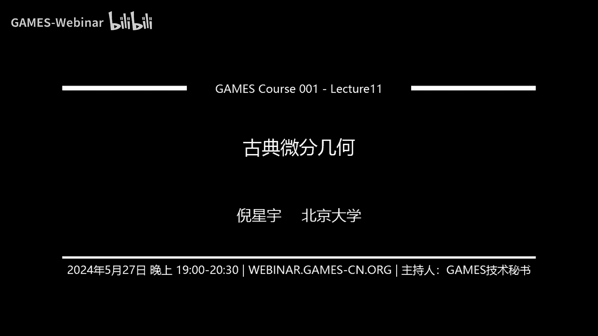
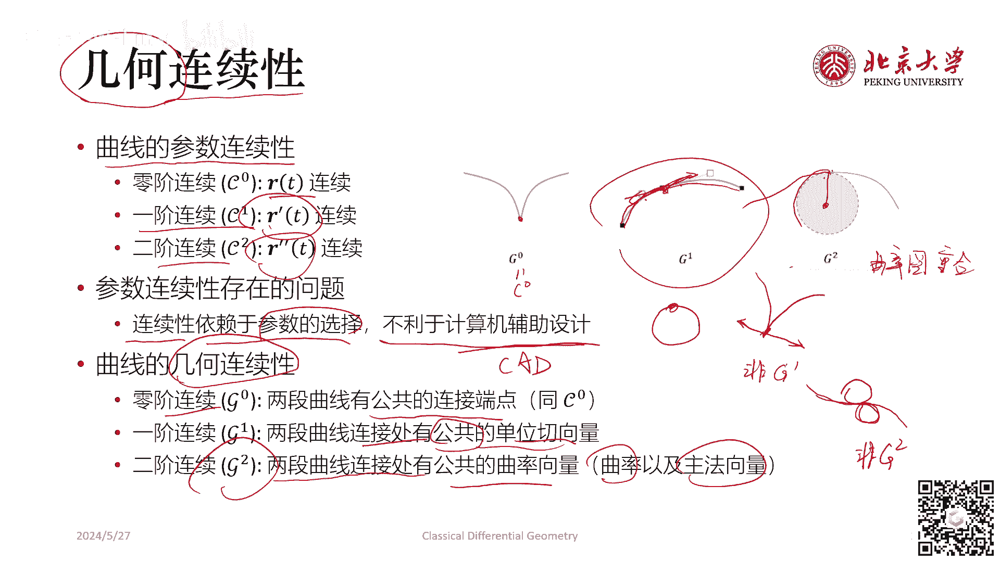

# GAMES001-图形学中的数学 - P11：古典微分几何 📐

在本节课中，我们将要学习古典微分几何的核心概念。古典微分几何是研究三维空间中曲线和曲面的数学分支，它与图形学紧密相关，因为图形学处理的对象正是三维空间中的几何体及其可视化。我们将从参数曲线开始，逐步深入到曲面的基本理论，理解如何描述和分析它们的形状与性质。

## 为什么是古典微分几何？🤔

古典微分几何是一种“外蕴”方法。这意味着我们身处三维世界中，研究的是嵌入在这个三维空间中的二维曲面。而研究曲面的概念和方法，又是从研究三维空间中的一维曲线派生而来的。因此，古典微分几何本质上是三维空间中的曲线论和曲面论。

与之相对的现代微分几何是一种“内蕴”方法，它直接在任意维度的流形内部进行研究，而不依赖于将其嵌入更高维的空间。图形学的研究对象是三维欧几里得空间中的可视化几何体，这恰好对应于古典微分几何的范畴。因此，掌握古典微分几何的知识对于图形学的研究和编程至关重要。

## 曲线论 🧵

上一节我们介绍了古典微分几何的研究范畴。本节中，我们来看看如何用数学描述三维空间中的曲线。

### 参数曲线

在三维欧几里得空间中，曲线可能不在一个平面内。我们可以用一个从区间 `[a, b]` 到三维空间的连续映射来表示一条曲线，这被称为参数曲线。

参数曲线是一个向量函数，也称为参数方程。其定义是：给定一个参数 `t`，对于每个 `t`，给出曲线上对应点的坐标。

**公式**：
`r(t) = (x(t), y(t), z(t))`

如果 `x(t)`, `y(t)`, `z(t)` 连续可微，则称该曲线 `C^1` 连续可微。导数 `r'(t) = (x'(t), y'(t), z'(t))` 称为曲线在 `t` 处的切向量。满足 `r'(t) ≠ 0` 的点称为曲线的正则点。

根据多元微积分的知识，过曲线上一点 `r(t0)` 的切线方程可以表示为：
**公式**：
`L(u) = r(t0) + u * r'(t0)`

一条参数曲线被称为正则的，当且仅当它处处是正则点，并且其参数方程是自变量 `t` 的三次以上连续可微函数（`C^3`）。高阶可微性是为了保证后续定义的曲率等概念有意义。

### 弧长参数

定义了曲线后，我们可以度量它的长度。曲线的弧长 `s` 定义为切向量模长的积分。

**公式**：
`s(t) = ∫_{a}^{t} ||r'(τ)|| dτ`

其中，`ds = ||r'(t)|| dt` 是弧长微元，它与坐标系的选取无关。

利用弧长，我们可以对曲线定义一个特殊的参数化：以弧长 `s` 自身作为参数。此时，新的参数方程记为 `r(s)`。可以证明，曲线参数是弧长参数的充要条件是切向量的模长恒为1，即 `||r'(s)|| ≡ 1`。此时，切向量场是单位向量场。

### 曲率与Frenet标架

我们记弧长参数下的切向量为 `α(s) = r'(s)`。曲率 `κ(s)` 衡量了曲线弯曲的程度。

**公式**：
`κ(s) = ||α'(s)|| = ||dα/ds||`

`α'(s)` 称为曲率向量，其模长为曲率，其方向指向曲线弯曲的方向。可以证明，曲率向量 `α'(s)` 与单位切向量 `α(s)` 垂直，即 `α'(s) · α(s) = 0`。

当曲率 `κ(s) ≠ 0` 时，曲率向量的方向是唯一确定的。我们定义**主法向量** `β(s)` 为曲率向量的单位化方向：
**公式**：
`β(s) = α'(s) / ||α'(s)|| = α'(s) / κ(s)`

由此可得关系：`α'(s) = κ(s) β(s)`。

现在，我们有了两个互相垂直的单位向量：切向量 `α(s)` 和主法向量 `β(s)`。通过叉乘，我们可以得到第三个单位向量，称为**次法向量**：
**公式**：
`γ(s) = α(s) × β(s)`

这样，在正则曲线上所有曲率不为零的点，我们都得到了一个由 `{α(s), β(s), γ(s)}` 构成的右手单位正交坐标系，称为 **Frenet标架**。这三个向量分别定义了曲线的切线、主法线和次法线方向。

### 挠率

次法向量 `γ(s)` 的变化率刻画了曲线偏离平面曲线的程度。我们定义**挠率** `τ(s)` 如下：
**公式**：
`τ(s) = -γ'(s) · β(s)`

可以证明，`γ'(s) = -τ(s) β(s)`。挠率 `τ(s)` 衡量了曲线“扭转”的程度。平面曲线的挠率恒为零。

### Frenet公式与曲线论基本定理

Frenet标架的三个单位向量关于弧长的导数满足一组优美的方程，称为Frenet公式。

**公式**：
```
α'(s) =  κ(s) β(s)
β'(s) = -κ(s) α(s) + τ(s) γ(s)
γ'(s) =         -τ(s) β(s)
```
这可以写成矩阵形式，描述了标架沿曲线运动的规律。

曲线论的一个基本定理指出：两条正则参数曲线，如果它们的曲率 `κ(s)` 和挠率 `τ(s)` 作为弧长的函数处处相等，那么这两条曲线在三维空间中只差一个刚体运动（旋转和平移）。也就是说，**曲率和挠率唯一地确定了曲线的形状**。

## 曲面论 🎨

上一节我们学习了如何描述和分析曲线。本节中，我们将概念拓展到更复杂的二维曲面。

### 参数曲面

类似于曲线，参数曲面是一个从二维区域 `D` 到三维空间的连续映射。

**公式**：
`r(u, v) = (x(u,v), y(u,v), z(u,v))`, `(u, v) ∈ D`

参数 `(u, v)` 称为曲纹坐标。固定 `u` 或 `v` 会得到曲面上的一族参数曲线，称为曲纹线。

我们要求映射是——对应的，并且偏导数 `r_u = ∂r/∂u` 和 `r_v = ∂r/∂v` 线性无关（即 `r_u × r_v ≠ 0`）。满足这些条件的参数曲面称为正则参数曲面。曲面在该点的法向量 `N` 由叉积给出：
**公式**：
`N = (r_u × r_v) / ||r_u × r_v||`

需要注意的是，有些曲面（如整个球面）无法用一个全局的正则参数方程表示，但它的每一点附近都可以用正则参数曲面来描述。我们研究的正则曲面也包括由这种局部参数化拼接而成的曲面。

### 第一基本形式

曲面的第一基本形式刻画了曲面上的度量，即如何计算曲面上曲线的长度和角度。

考虑曲面上一个线元 `dr = r_u du + r_v dv`。其长度的平方为：
**公式**：
`ds^2 = dr · dr = E du^2 + 2F du dv + G dv^2`

其中：
- `E = r_u · r_u`
- `F = r_u · r_v`
- `G = r_v · r_v`

矩阵 `[[E, F], [F, G]]` 称为曲面的**第一基本形式**。它是一个正定矩阵，完全决定了曲面上的内积结构。
- **长度**：曲面上一条曲线 `(u(t), v(t))` 的长度为 `∫ sqrt(E u'^2 + 2F u'v' + G v'^2) dt`。
- **面积**：曲面上一个面元 `dA` 的面积为 `sqrt(EG - F^2) du dv`。
- **保角性**：两个曲面之间的映射如果保持角度不变，则称为保角映射。其充要条件是它们的第一基本形式成比例。

在图形学的纹理映射中，寻找一个“均匀”的参数化（即保角映射）是一个重要课题。

### 第二基本形式与曲率

第一基本形式描述了曲面“内在”的度量。第二基本形式则描述了曲面在三维空间中“外在”的弯曲程度。

考虑曲面上一点 `P` 和邻近点 `Q`，将向量 `PQ` 投影到 `P` 点的法向量 `N` 上。这个投影值在二阶近似下由第二基本形式给出。

**公式**：
`II = L du^2 + 2M du dv + N dv^2`

其中：
- `L = r_uu · N`
- `M = r_uv · N`
- `N = r_vv · N` （注意这里的 `N` 是标量函数，与法向量符号相同但含义不同）

第二基本形式也可以写成 `II = -dr · dN`，其中 `dN` 是法向量的微分。

### 法曲率与主曲率

在曲面上过一点 `P` 有无数条曲线。这些曲线在 `P` 点的曲率向量在曲面法向量 `N` 上的投影，称为曲线在该点的**法曲率** `κ_n`。

一个重要结论（Meusnier定理）：过 `P` 点具有相同切方向的所有曲线，在 `P` 点的法曲率都相同。因此，法曲率可以只由切方向 `(du, dv)` 决定：

**公式**：
`κ_n = (L du^2 + 2M du dv + N dv^2) / (E du^2 + 2F du dv + G dv^2) = II / I`

当切方向变化时，法曲率 `κ_n` 会变化。存在两个彼此正交的切方向，使得法曲率分别取到最大值 `κ_1` 和最小值 `κ_2`。这两个方向称为**主方向**，对应的曲率 `κ_1` 和 `κ_2` 称为**主曲率**。

### 平均曲率与高斯曲率

由两个主曲率，我们可以定义两个重要的曲率标量：
- **平均曲率 H**：主曲率的算术平均。`H = (κ_1 + κ_2) / 2`。在物理中，表面张力与平均曲率有关。
- **高斯曲率 K**：主曲率的乘积。`K = κ_1 * κ_2`。高斯曲率具有极其重要的几何意义。

**高斯绝妙定理**指出：曲面的高斯曲率 `K` 完全由它的第一基本形式 `E, F, G` 决定，而与第二基本形式 `L, M, N` 无关。这意味着，一个曲面是“弯曲”的，这个性质可以通过测量曲面本身上的长度和角度（内蕴几何）来得知，而无需站在曲面之外观察。这一定理是现代微分几何（黎曼几何）的起点。

- 平面：高斯曲率 `K = 0`，平均曲率 `H = 0`。
- 球面（半径R）：高斯曲率 `K = 1/R^2`，平均曲率 `H = 1/R`。
- 可展曲面（如圆柱、圆锥）：高斯曲率 `K = 0`。

## 几何连续性 🧩

在图形学和CAD中，我们经常需要将多段曲线或多块曲面拼接起来。连续性决定了拼接的光滑程度。

### 参数连续性 (C^n)

参数连续性直接检查参数方程本身的导数是否连续。
- `C^0`: 曲线/曲面位置连续。
- `C^1`: 一阶导数（切向量/偏导）连续。
- `C^2`: 二阶导数（曲率向量/二阶偏导）连续。

参数连续性的问题在于它依赖于参数化的选择。同一个几何形状，不同的参数化可能导致不同的连续性判断。

### 几何连续性 (G^n)

几何连续性关注的是几何形状本身的光滑性，与参数化无关。
- **G^0**：与 `C^0` 相同，位置连续。
- **G^1**：在连接处有**公共的**（且同向的）单位切向量（对曲线）或单位法向量（对曲面）。肉眼观察是光滑的切线过渡。
- **G^2**：在连接处不仅有 `G^1` 连续性，还有公共的曲率向量（对曲线）或公共的法曲率（对曲面）。这要求曲率圆或弯曲程度平滑过渡。

几何连续性更符合我们对“光滑”的直观感受，因此在计算机图形学中更为常用。

## 总结 📚

本节课中，我们一起学习了古典微分几何的基础知识。

我们从**参数曲线**开始，引入了弧长参数、**曲率**和**挠率**的概念，并借助**Frenet标架**和**Frenet公式**描述了曲线的局部性质。曲线论基本定理告诉我们，曲率和挠率唯一确定了曲线的形状。

接着，我们将概念扩展到**参数曲面**。**第一基本形式**描述了曲面上的内在度量（长度、角度、面积），而**第二基本形式**描述了曲面在空间中的外在弯曲。通过分析**法曲率**，我们得到了**主曲率**、**平均曲率**和**高斯曲率**。**高斯绝妙定理**揭示了曲面的内蕴几何性质，即高斯曲率仅由第一基本形式决定，这是现代微分几何的基石。

最后，我们讨论了图形学中至关重要的**几何连续性**概念，它比参数连续性更能反映形状拼接的光滑直观感受。



掌握这些古典微分几何的概念，将为学习图形学中的几何建模、纹理映射、物理模拟等课题打下坚实的数学基础。