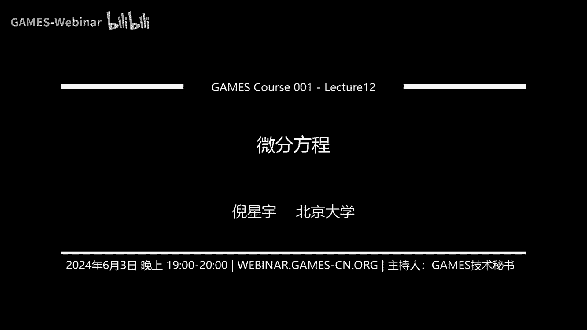
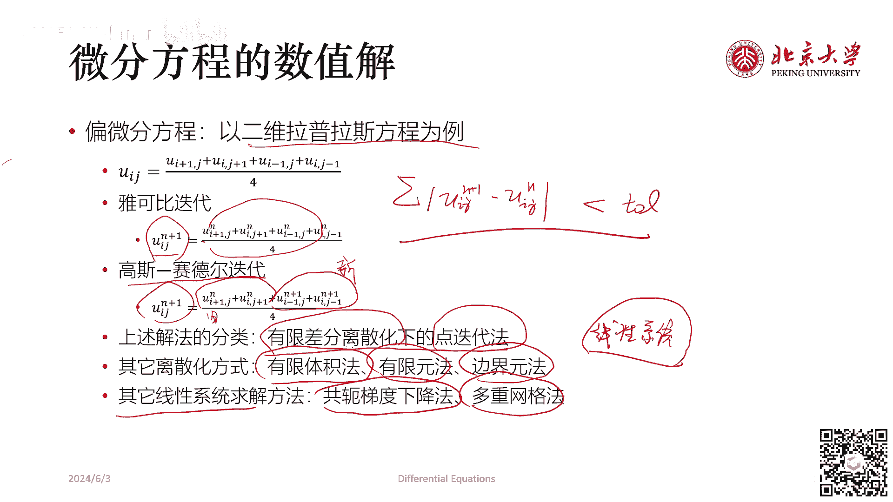
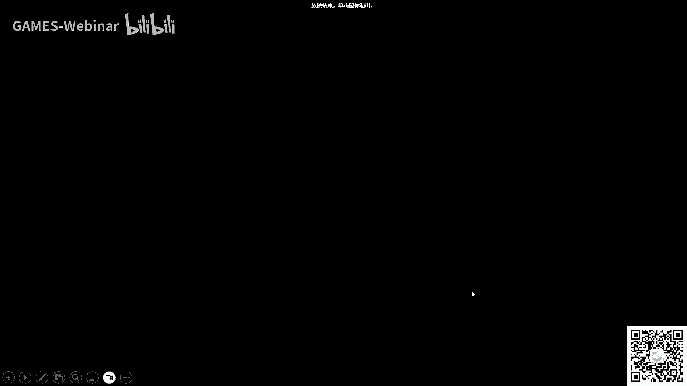

# GAMES001-图形学中的数学 - P12：微分方程 🧮

在本节课中，我们将学习图形学中至关重要的数学工具——微分方程。我们将从最简单的常微分方程出发，逐步深入到偏微分方程，并介绍其求解方法，包括分析解法和数值解法。课程最后，我们会看到如何将偏微分方程离散化为线性系统，为后续的数值计算课程做好铺垫。

微分方程是描述未知函数与其导数之间关系的方程。求解微分方程，就是找到满足该关系的未知函数。根据未知函数是一元还是多元，微分方程可分为常微分方程（ODE）和偏微分方程（PDE）。

微分方程有多种求解方法，本节课将大体介绍以下四种：
*   **通解法**：针对特定形式的简单方程，直接给出包含任意常数的通解公式。
*   **分离变量法**：将方程整理为变量可分离的形式，然后两边积分求解。
*   **格林函数法**：利用已知点源（如点电荷）的解，通过叠加原理求解复杂源项下的方程。
*   **数值法**：通过离散化，将微分方程转化为代数方程组进行数值求解，这是计算机图形学的核心研究内容之一。

---

## 常微分方程（ODE）求解方法回顾

上一节我们概述了微分方程的基本概念和分类，本节中我们来看看具体的求解方法，首先从常微分方程开始。

### 分离变量法

分离变量法是求解一阶常微分方程的经典方法。其标准形式为：
`g(y) dy = f(x) dx`

以下是求解步骤：
1.  将方程整理为标准形式，使等式一端只含变量`y`和`dy`，另一端只含变量`x`和`dx`。
2.  对等式两边同时积分：`∫ g(y) dy = ∫ f(x) dx + C`。
3.  计算积分，得到包含任意常数`C`的通解。

**例题**：求方程 `x(1+y²) dx - y(1+x²) dy = 0` 的通解。
1.  整理方程：`y/(1+y²) dy = x/(1+x²) dx`。
2.  两边积分：`(1/2) ln(1+y²) = (1/2) ln(1+x²) + (1/2) ln C`。
3.  化简得通解：`1+y² = C(1+x²)` 或 `y = ±√[C(1+x²) - 1]`。

### 一阶线性微分方程

一阶线性微分方程的标准形式为：
`y' + P(x)y = Q(x)`
若 `Q(x) ≡ 0`，称为**齐次方程**；否则称为**非齐次方程**。

**齐次方程解法**：
方程 `y' + P(x)y = 0` 可通过分离变量求解。
1.  分离变量：`dy/y = -P(x) dx`。
2.  积分：`ln|y| = -∫ P(x) dx + C₁`。
3.  解得通解：`y = C e^{-∫ P(x) dx}`，其中 `C = ±e^{C₁}`。

**非齐次方程解法**（常数变易法）：
方程 `y' + P(x)y = Q(x)` 的通解为：
`y = e^{-∫ P(x) dx} [ ∫ Q(x) e^{∫ P(x) dx} dx + C ]`
该解可理解为：**非齐次方程的通解 = 对应齐次方程的通解 + 非齐次方程的一个特解**。

### 伯努利方程

伯努利方程是一类非线性方程，形式为：
`y' + P(x)y = Q(x) yⁿ`，其中 `n ≠ 0, 1`。
求解时，可通过变量代换 `z = y^{1-n}`，将其化为一阶线性微分方程求解。

### 可降阶的高阶微分方程

对于某些高阶方程，可以通过代换降低阶数。
*   若方程为 `y⁽ⁿ⁾ = f(x)`，直接积分`n`次即可。
*   若方程为 `y'' = f(x, y')`，可令 `p = y'`，则 `y'' = p'`，原方程化为 `p' = f(x, p)`，这是一个关于`p`的一阶方程。
*   若方程为 `y'' = f(y, y')`，同样令 `p = y'`，利用链式法则 `y'' = p * dp/dy`，原方程化为 `p * dp/dy = f(y, p)`，这是一个关于`p`和`y`的一阶方程。

### 二阶线性常系数微分方程

二阶线性常系数齐次方程形式为：
`y'' + p y' + q y = 0`，其中 `p, q` 为常数。
其解法是寻找形如 `y = e^{rx}` 的解（特解）。代入方程得到**特征方程**：
`r² + p r + q = 0`
根据特征根的情况，通解形式如下：

以下是特征根不同情况下的通解形式：
*   **两个不等实根 `r₁, r₂`**：`y = C₁ e^{r₁x} + C₂ e^{r₂x}`
*   **两个相等实根 `r`**：`y = (C₁ + C₂ x) e^{rx}`
*   **一对共轭复根 `α ± iβ`**：`y = e^{αx} (C₁ cos βx + C₂ sin βx)`

对于非齐次方程 `y'' + p y' + q y = f(x)`，其通解为对应齐次方程的通解加上该非齐次方程的一个特解。特解形式通常根据 `f(x)` 的形式（如多项式、指数函数、三角函数及其组合）用待定系数法猜测。

---

## 偏微分方程（PDE）简介

前面我们回顾了常微分方程的经典解法，本节我们将进入更复杂的领域——偏微分方程，它在物理模拟和渲染中应用广泛。

### 分类与典型方程

对于二元二阶线性偏微分方程：
`A ∂²u/∂x² + 2B ∂²u/∂x∂y + C ∂²u/∂y² + D ∂u/∂x + E ∂u/∂y + F u = G`
可根据判别式 `Δ = B² - AC` 对其分类：

以下是三种基本类型的偏微分方程及其典型物理实例：
*   **双曲型 (`Δ > 0`)**：描述波动现象，如**波动方程** `∂²u/∂t² - a² ∂²u/∂x² = 0`。
*   **抛物型 (`Δ = 0`)**：描述扩散或热传导现象，如**热传导方程** `∂u/∂t - a² ∂²u/∂x² = 0`。
*   **椭圆型 (`Δ < 0`)**：描述稳定状态或势场分布，如**拉普拉斯方程** `∂²u/∂x² + ∂²u/∂y² = 0` 和**泊松方程** `∇²u = f`。

### 分离变量法求解PDE

分离变量法是求解PDE的重要分析手段。其核心思想是假设多元函数解可写成多个单变量函数的乘积。

**以波动方程为例**：
求解 `∂²u/∂t² - a² ∂²u/∂x² = 0`，边界条件 `u(0,t)=u(L,t)=0`，初始条件 `u(x,0)=φ(x), ∂u/∂t|_{t=0}=ψ(x)`。
1.  **假设变量分离**：设 `u(x,t) = X(x)T(t)`。
2.  **代入方程并分离变量**：得到 `T''/(a²T) = X''/X`。由于左边只含`t`，右边只含`x`，两者相等必等于常数 `-λ`。
3.  **转化为两个ODE**：
    *   时间部分：`T'' + λa² T = 0`
    *   空间部分：`X'' + λ X = 0`
4.  **结合边界条件求解**：边界条件 `X(0)=X(L)=0` 决定了 `λ` 只能取特定值 `λ_n = (nπ/L)²`，对应的空间解为 `X_n(x) = sin(nπx/L)`。时间解为 `T_n(t) = A_n cos(nπa t/L) + B_n sin(nπa t/L)`。
5.  **叠加得到一般解**：`u(x,t) = Σ_{n=1}^{∞} [A_n cos(nπa t/L) + B_n sin(nπa t/L)] sin(nπx/L)`。
6.  **利用初始条件定系数**：将初始条件代入，利用傅里叶级数展开确定系数 `A_n` 和 `B_n`。

### 球谐函数

球谐函数是拉普拉斯方程在球坐标系下经分离变量法得到的一组特殊解，它是图形学中表示球面函数（如环境光照）的重要基底。

在球坐标系 `(r, θ, φ)` 下，拉普拉斯方程 `∇²u = 0` 的解可分离为 `u(r,θ,φ) = R(r) Y(θ,φ)`。进一步分离 `Y(θ,φ) = Θ(θ)Φ(φ)`，求解过程会引出**连带勒让德方程**。其归一化解称为**球谐函数** `Y_l^m(θ,φ)`，其中 `l=0,1,2,...` 为阶数，`m=-l,...,l`。

**实数形式球谐函数**（常用于图形学）可表示为：
`y_l^m(θ,φ) = N_l^{|m|} P_l^{|m|}(cosθ) * { cos(mφ), m>0; 1, m=0; sin(|m|φ), m<0 }`
其中 `P_l^m` 是连带勒让德多项式，`N_l^m` 是归一化常数。

当 `m=0` 时，连带勒让德方程退化为**勒让德方程**，其解为勒让德多项式 `P_l(x)`，具有正交性：`∫_{-1}^{1} P_n(x) P_m(x) dx = 0 (n≠m)`。

在图形学中，球谐函数用于低频环境光的紧凑表示。任何球面函数 `f(θ,φ)` 都可以用球谐函数展开：`f(θ,φ) ≈ Σ_{l=0}^{L} Σ_{m=-l}^{l} c_l^m Y_l^m(θ,φ)`。只需存储前几阶的系数 `c_l^m`，就能较好地重建原始函数，极大节省存储和计算开销。

---

## 格林函数法

上一节我们利用分离变量法求解了特定边界下的PDE，本节介绍另一种强大的工具——格林函数法，它特别适合处理点源或特定边界条件的问题。

### 点源与狄拉克δ函数

考虑静电学问题：已知电荷密度分布 `ρ(r)`，求电势 `φ(r)`。根据高斯定理的微分形式，有泊松方程：
`∇²φ = -ρ / ε₀`
对于位于 `r₀` 的点电荷 `Q`，电荷密度在数学上无法用普通函数描述，为此引入**狄拉克δ函数** `δ(r - r₀)`。其定义为：
*   `δ(r - r₀) = 0`，当 `r ≠ r₀`。
*   `∫_{全空间} δ(r - r₀) dV = 1`，若积分区域包含 `r₀`。
点电荷密度可写为 `ρ(r) = Q δ(r - r₀)`。

### 泊松方程的基本解与格林函数

点电荷产生的电势是已知的：`φ(r) = Q / (4πε₀ |r - r₀|)`。这启发我们定义泊松方程 `∇² G(r, r₀) = δ(r - r₀)` 的解 `G(r, r₀)` 为**基本解**（或自由空间格林函数）。对于三维无穷远边界（`φ(∞)=0`），有：
`G(r, r₀) = -1 / (4π |r - r₀|)`
因此，点电荷电势解为 `φ(r) = (Q/ε₀) * G(r, r₀)`。

利用叠加原理，对于任意电荷分布 `ρ(r)`，在无穷远边界下的电势解可通过积分得到：
`φ(r) = (1/ε₀) ∫ ρ(r₀) G(r, r₀) dV₀`

### 镜像法

对于非无穷远边界，如无限大接地导体平面附近点电荷的问题，可以利用**镜像法**构造格林函数。例如，在平面 `x=0` 电势为零的边界条件下，位于 `(x₀, y₀, z₀)`（`x₀>0`）的点电荷 `Q` 的格林函数解为：
`G(r, r₀) = -1/(4π) [1/|r - r₀| - 1/|r - r₀'|]`
其中 `r₀' = (-x₀, y₀, z₀)` 是镜像点。这相当于原电荷与一个关于平面对称的异号镜像电荷共同产生的电势。

### 格林恒等式与边界元法

格林第三恒等式将区域内部某点的函数值用其边界上的函数值及法向导数表示出来。设 `G(r, r₀)` 是拉普拉斯方程的基本解，`ψ(r)` 是区域内满足拉普拉斯方程的函数，则有：
`ψ(r₀) = ∮_{∂V} [ G(r, r₀) ∂ψ/∂n - ψ(r) ∂G/∂n ] dS`
这个公式构成了**边界元法**的数学基础，只需在边界上离散化即可求解区域内的场，降低了计算维度。

---

## 微分方程的数值解法

前面介绍的方法主要适用于具有规则边界和简单源项的分析解。对于复杂的图形学问题，我们通常需要借助数值方法。

### 常微分方程的数值解（欧拉法）

对于初值问题 `y' = f(x, y), y(x₀)=y₀`，最简单的数值方法是**显式欧拉法**：
`y_{i+1} = y_i + h * f(x_i, y_i)`
其中 `h` 为步长。该方法为一阶精度。更高效、高精度的方法有龙格-库塔法等。

### 偏微分方程的数值解（以拉普拉斯方程为例）

考虑二维拉普拉斯方程 `∂²u/∂x² + ∂²u/∂y² = 0`。我们在均匀网格上离散，网格间距为 `Δx = Δy = h`。用中心差分近似二阶导数：
`∂²u/∂x² ≈ (u_{i+1,j} - 2u_{i,j} + u_{i-1,j}) / h²`
`∂²u/∂y² ≈ (u_{i,j+1} - 2u_{i,j} + u_{i,j-1}) / h²`
代入方程 `∇²u=0`，得到离散后的方程：
`(u_{i+1,j} + u_{i-1,j} + u_{i,j+1} + u_{i,j-1} - 4u_{i,j}) / h² = 0`
即：
`u_{i,j} = (u_{i+1,j} + u_{i-1,j} + u_{i,j+1} + u_{i,j-1}) / 4`
这表明每个内部点的值是其四个邻点值的平均。

我们可以用迭代法求解这个大型线性系统：
*   **雅可比迭代**：用上一轮所有邻点的值更新当前点。`u_{i,j}^{(k+1)} = (u_{i+1,j}^{(k)} + u_{i-1,j}^{(k)} + u_{i,j+1}^{(k)} + u_{i,j-1}^{(k)}) / 4`
*   **高斯-赛德尔迭代**：使用已更新的新值进行迭代，收敛更快。`u_{i,j}^{(k+1)} = (u_{i+1,j}^{(k)} + u_{i-1,j}^{(k+1)} + u_{i,j+1}^{(k)} + u_{i,j-1}^{(k+1)}) / 4`

迭代直到相邻两次迭代的误差小于给定容差为止。

---

## 总结与展望

本节课中我们一起学习了图形学中微分方程的核心知识。我们从常微分方程的分离变量法、常数变易法讲起，回顾了二阶线性常系数方程的解法。随后，我们进入了偏微分方程领域，学习了根据判别式对二阶线性PDE的分类，并深入探讨了分离变量法在求解波动方程和引出球谐函数中的应用。接着，我们介绍了处理点源和边界问题的强大工具——格林函数法，包括基本解、镜像法和格林恒等式。最后，我们探讨了微分方程的数值解法，包括欧拉法，以及如何将拉普拉斯方程离散化为线性系统并用迭代法求解。

本节课起到了承上启下的作用：我们通过离散化，巧妙地将一个连续的偏微分方程（如拉普拉斯方程）转化为了一个关于离散网格点值的线性方程组 `A x = b`。如何高效、稳定地求解这类大规模线性系统，正是我们下一节课——**线性系统求解**所要讨论的核心内容。数值求解线性系统是连接数学理论与图形学实践的关键桥梁。