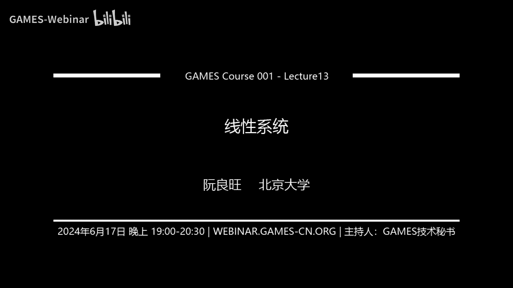
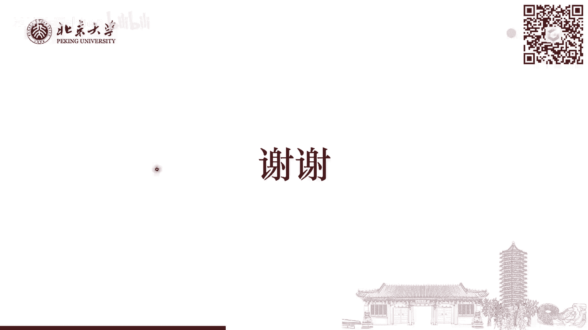

# GAMES001-图形学中的数学 - P13：线性系统 - GAMES-Webinar - BV1MF4m1V7e3

## 概述

在本节课中，我们将学习线性系统求解的相关知识，包括直接求解方法和迭代求解方法。

## 直接求解方法

### 高斯消元法

高斯消元法是一种直接求解线性方程组的方法。其基本思想是通过行变换将矩阵转化为上三角矩阵，然后逐行求解。

**公式**：

```
A = LU
```

其中，L为下三角矩阵，U为上三角矩阵。

### LU分解

LU分解是将矩阵A分解为下三角矩阵L和上三角矩阵U的乘积。

**代码**：

```python
def lu_decomposition(A):
    # 实现LU分解
    pass
```

### LLT分解

LLT分解是将对称半正定矩阵A分解为下三角矩阵L和上三角矩阵L的转置的乘积。

**代码**：

```python
def llt_decomposition(A):
    # 实现LLT分解
    pass
```

## 迭代求解方法

### 不动点迭代

不动点迭代是一种迭代求解线性方程组的方法。其基本思想是通过迭代更新解向量，直到收敛到真实解。

**公式**：

```
X_{k+1} = M^{-1}(B - AX_k)
```

其中，M为矩阵A的近似矩阵。

### 雅可比迭代

雅可比迭代是一种不动点迭代方法，其近似矩阵M为矩阵A的对角矩阵。

**代码**：

```python
def jacobi_iteration(A, B, tolerance=1e-6, max_iterations=1000):
    # 实现雅可比迭代
    pass
```

### 高斯-赛德尔迭代

高斯-赛德尔迭代是一种不动点迭代方法，其近似矩阵M为矩阵A的对角矩阵加上下三角矩阵。

**代码**：

```python
def gauss_seidel_iteration(A, B, tolerance=1e-6, max_iterations=1000):
    # 实现高斯-赛德尔迭代
    pass
```

## 子空间方法

### 共轭梯度法

共轭梯度法是一种子空间迭代方法，其基本思想是在子空间中寻找最小化残差的解。

**代码**：

```python
def conjugate_gradient_method(A, B, tolerance=1e-6, max_iterations=1000):
    # 实现共轭梯度法
    pass
```

## 总结

本节课介绍了线性系统求解的几种方法，包括直接求解方法和迭代求解方法。在实际应用中，需要根据矩阵的特性选择合适的求解方法。

**本节课我们学习了以下内容**：

* 线性系统求解的几种方法
* 高斯消元法、LU分解和LLT分解
* 不动点迭代方法
* 子空间方法
* 共轭梯度法



希望这节课的内容能够帮助大家更好地理解线性系统求解。