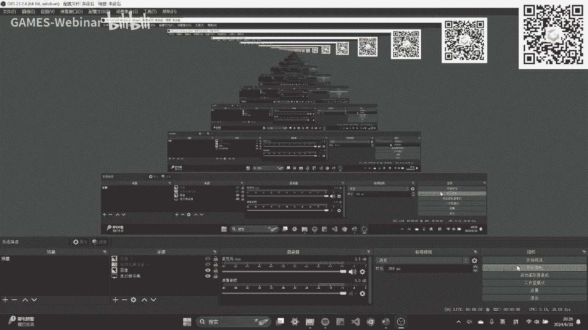

# GAMES001-图形学中的数学 - P14：生成模型的案例分析 - GAMES-Webinar - BV1MF4m1V7e3

大家好，今天我们将探讨图形学中深度学习的一些数学知识。在之前的课程中，我们介绍了概率论、线性代数等基础知识。随着图形学和深度学习的发展，许多图形学技术都与深度学习相关。深度学习领域也在不断发展，因此，本节课我们将关注如何利用数学为深度学习提供更好的建模。

## 深度学习与数学

要了解深度学习中可能用到的数学知识，可以参考一些在线教程，它们涵盖了微积分、线性代数、概率论等方面的知识。然而，本节课的重点不在于全面介绍深度学习中的数学知识，而是通过案例分析来展示概率论等基础知识如何与深度学习中的前沿技术建立联系。

## 深度学习的基本理解

我们可以通过拟合的概念来理解深度学习。例如，在差值拟合中，我们假设Y和X之间满足某种分布，并通过优化直线与实际数据之间的误差来得到最佳参数。深度学习可以看作是一个充满待定参数的函数，通过定义损失函数并优化参数来学习。

## 生成模型

生成模型是深度学习中的一个重要领域。以下是一些常见的生成模型：

* **生成对抗网络 (GAN)**: 通过对抗训练生成逼真的图像、视频、音频等。
* **变分自编码器 (VAE)**: 通过编码器和解码器学习数据分布，并生成新的数据。
* **扩散模型**: 通过逐步添加噪声和逐步去除噪声来生成数据。

## KL 散度

KL 散度是衡量两个概率分布之间差异的一种方法。如果两个分布相等，则 KL 散度为零；如果两个分布不相等，则 KL 散度大于零。

## 变分自编码器 (VAE)

VAE 通过编码器和解码器学习数据分布，并生成新的数据。编码器将数据映射到隐空间，解码器将隐空间的数据映射回数据空间。

## 扩散模型

扩散模型通过逐步添加噪声和逐步去除噪声来生成数据。它将数据从纯净状态逐步转换为噪声状态，然后再逐步去除噪声，最终恢复原始数据。

## 总结

本节课介绍了深度学习中的数学知识，并通过案例分析展示了概率论等基础知识如何与深度学习中的前沿技术建立联系。学好数学对于理解深度学习至关重要。