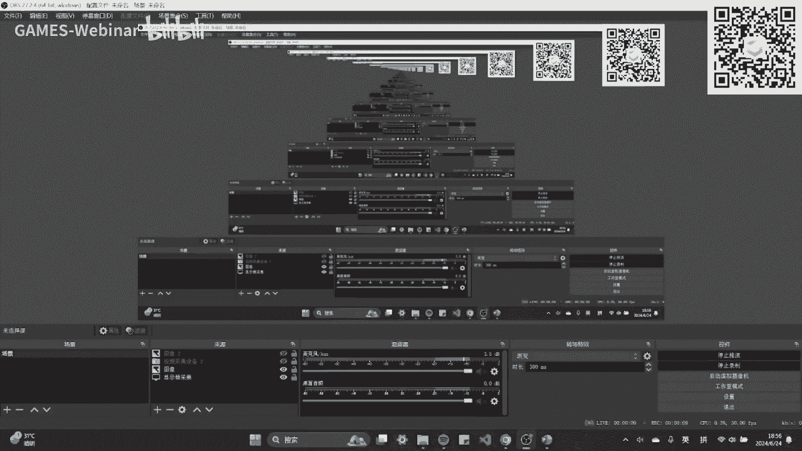
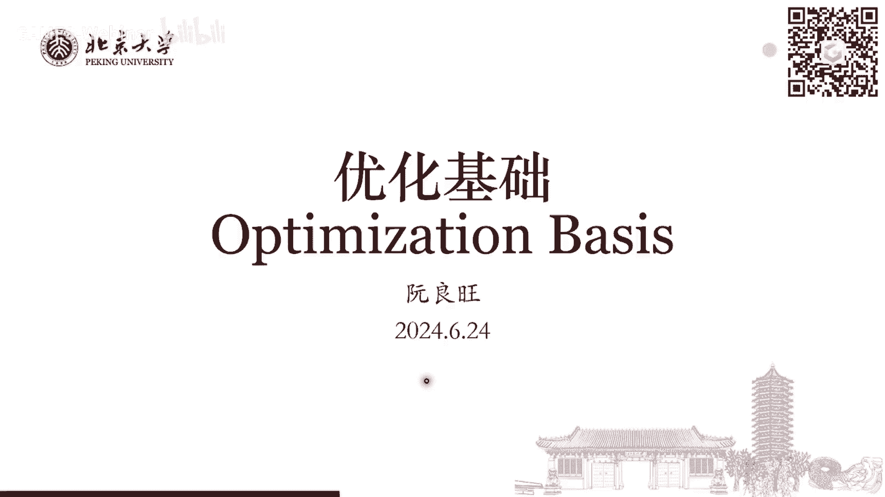
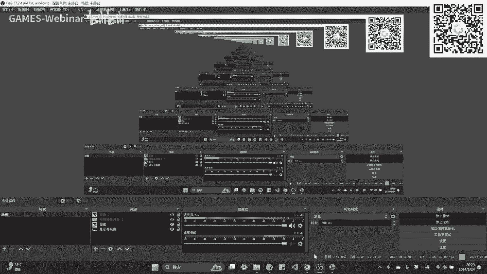

# GAMES001-图形学中的数学 - P15：优化基础 - GAMES-Webinar - BV1MF4m1V7e3

喂大家能听到吗，有声音吗。

OK那我们就开始，今天给大家介绍这个优化基础相关的部分。

然后呃这部分优化本身是一个，这是一个涵盖内容非常多，然后同时也非常难的一个一个大的学科，其实是，然后我们今天只有只有这个一个多小时的时间，所以肯定没有办法，就是给大家介绍的特别的啊详细，特别的这个具体。

所以说嗯我们今天的话我的计划是说呃，尽可能的用一些比较简单的例子，然后把优化里面的一些比较重要的概念引出来，然后呢就是大家这个对于具体算法，这之后的一些比如说更高级的优化算法的话。

可以就是大家顺着这个这些教材，然后自己去学习深入的学习，然后今天呢只是一个相对来说啊，非常非常入门的一个介绍，而且也肯定不可能面面俱到的，把这些很多东西介绍清楚，对我们还是以一些比较简单的例子。

作为一个切入点，然后给大家看一看，这个优化里面会有哪些比较呃，大家经常用到的概念啊，算法之类的东西。

OK那么一个优化问题它会长成什么样子呢，它可以一般来说就是，他可以写成下面这个样子呃，一个比较通用的样子，其中X是我们带优化的，这个变量可以是连续的，也可以是离散的，那FX就是我们的优化目标。

所以是离散的，也可以是连续的，也可以是啊可导的或者不可导的啊，各种各样的都可以，然后呢X还要满足一定的约束条件，用C来表示，那么这个C里面就可以包含了各种各样的东西，比如说有等式的约束，有不等式的约束。

也可以是一个啊子空间或者是某个取值范围，所以一般来说一个优化问题，就可以写成这样一个通用的形式，那么这么一个通用的形式，我们呃怎么去设计算法去优化这样一个问题啊，也要根据这个问题的具体形式去决定。

那么我们就先来看一个最简单的情况，也就是无约束优化问题，无约束要问题就是我们没有约束，然后呢我们再做一些额外的假设，比如说我们假设这个FX是一个连续可微的函数，X是一个连续的一个呃向量对吧。

它是一个N维的向量，那么对于这样一个5月数位号问题，这个也是我们啊平常最能就是在很多时候，最能接触到的优化问题，那么我们先来看一看怎么去啊，优化这样一个问题，那么我们这里给几个例子。

比如说我们之前介绍过这个最小二乘法，他说的是对于我们给定了一个数据集里面，一共比如说有N个点X0Y0，一直到XN减一，YN减一，然后我们希望去拟拟合出一个曲线或者直线，来去呃，来去近似整个数据集。

那么我们可以假设这个Y和X之间，满足这样一个呃函数的一个关系，那么G0到GK减一是我们给定的这个函数，然后A0到AK减一是一系列的系数，那么G0和GK减一，可以是比如说有常数线性线性项。

二次项数X的平方，X3次方或者X乘以Y等等，这样的这些基本的函数在里面，A零一直到AK减一，就是他们的这个组合系数，那我们希望我们要去优化这个A，然后去让这个额把A带进去，这个系数带进去。

然后把各个X带进去，得到这个函数值和数据集里的这个函数值Y，它们之间的差距要尽可能的小，所以我们就要优化这样一个目标，比如说右边这个图例看，展示的就是大家最熟悉的这个呃。

这个线性函数和一次函数的最小化生法，那么这样一个优化目标，我们可以写成更啊更紧的形式，我们可以把所有这些G1些基本的函数，那么在对应的X0到XN减一的错的函数值，写成这样一个大的矩阵G矩阵。

然后同时也把Y排列在一起，那我的优化目标这个对I的一个求和，我就可以写成后面这样一个啊，矩阵乘法的一个形式，那么这个矩阵乘法呃，最后这个形式是Y减去G乘以A的模长的平方。

它可以进一步展开来变成下面这个样子，那么这个样子就是一个针对于这个参数，A的一个优化，有一个优化优化目标对吧，并且呢我们可以看到它这关于这个参数A，它是一个二次的优化目标，A在其中是一个向量，然后呢。

这后面的这个G转置乘以G就是他的这个啊，一个中间这个矩阵。

OK那么我们还有一些其他的情况，也会有这个优化问题，比如说在几何里面，我们尽量涉及到有问题，就是这个曲面的参数化是什么意思呢，就比如说我们有一个球对吧，我们要我们这个球假如是一个math来表示的。

然后呢，我们要为这个球上的每个顶点，去定义一个二维的纹理坐标，UV我们也可以直接称为这个UV坐标，那么这个UV坐标是什么，你可以理解成他是这个球上的，比如说我们这个地图对吧，地图它是一个二维的东西。

那么我就有X对应的X和Y坐标，也就是我们这里的UV坐标，那么我只要每个球上的每一个点，都有一个UV坐标，我就可以对应的把这个地图贴到这个球上来，那它就是一个地球对吧，所以UV坐标定义了这个三维曲面。

到这个二维的贴图的一个映射关系，那么我们的问题是说，假设我有一个任意的一个三维的一个match，比如说下面图，下面图里展示的这张人脸，我们要怎么去确定它里面的啊，每个顶点上的UV坐标。

然后以使得整个呃UV坐标贴到这个贴图，贴到人脸上之后，他的这个distortion或者这个拉伸形变是最小的，相当于是什么，相当于是我现在有一张脸皮，我要给他崩到这个人脸的这个模型上。

然后我希望我定义的这个UV坐标呢，它能尽可能的使这张脸皮，它的这个拉伸变化是最小的，这样的话我能保证我这个贴图贴上去呢，它是尽可能均匀的，不会出现一些比较啊错误的一些artifact对吧。

那么这么一个问题，他也可以写成一个对应的优化问题，有个最简单的做法，就是嗯，嗯称之为这个叫弹簧试点的一个优化方法，它怎么来定义呢，就是我去假设我们每个顶点上都有一个呃，每个顶点上都有一个UV坐标。

UI和V呃VI，然后我去看这个mesh上的每条边，我希望对于这个max上的每条边对应的两个顶点，它们之间的这个UV坐标的差值是尽可能最小的，那么也就是说，我便利这个整个match的所有的这个边。

然后把这个每条边上算一个两个顶点之间，UV坐标的对应的一个平方的差值，那把所有这些差值加起来，我希望这个最后最后的这个差值是尽可能小的，那么通过这种方法呢，我就可以近似的认为说。

我这是这个UV最后求出来，它应该是啊，尽可能的均匀的分布到整个mesh上的对吧，所以这个对应出来也是一个。

无约五约数的优化问题，那么再比如说在这个物理模拟里面，我们可能又涉及到这个弹性体的模拟，那么如果我们使用这个影视欧拉法，进行这个时间积分的时候，那么在这个时间步的每一步，弹性体模拟。

等价于优化下面这样一个增量能量的一个形式，这个增量能量有两项，第一项是这个我们叫这个啊inertia项目，也就是这个惯性项，然后第二项呢，这个FX就是整个弹性体的总弹性势能，那我们可以证明说是。

只要你去优化这样一个呃这样一个增量能量，那么你求出来的这个最小化的这个X，它就是我们这个下一个时间步，它的这个整个弹性体的位置X，那么这个东西就是大家会在这个，比如说game4103。

还有game3201这样的物理模拟课里面，可能会见到这样一个优化问题的一个形式，那么上面列举的这几种啊，这几个例子里面，我们最后要解决的都是这样一个去最小化FX，这样一个优化问题。

OK那么对于这样的优化问题，我们应该怎么去求解呢，对吧，大家应该或多或少都有一些了解对吧，比如说我们最简单的就是什么，拿梯度下降法对吧，那在图上呢，就是比如说我们假设有一个啊，有一个很复杂的一个函数。

一个J那么梯度下降法呢就是就像你下山一样，就是我每次沿着这个梯度的方向，往前走一段距离，然后呢一直这样走，那么一理想情况下，我就可能跑到这个呃这个最优点上来，那么这样一类的优化方法。

其实它有一个通用的一个名字，就叫这个线搜索方法，他写出来就是一个非常简单的形式，就是XK减1DK加一部的位置，等于XK加上阿尔法的K乘以PK，那么其中pk表示的是我的一个下降方向。

阿尔法K表示的是下降的步长，也就是说在每一步迭代的时候，我需要确定两个量，就是你沿哪个方向走多远的距离，那么一直这样迭代下去之后，就是我希望你最终能够，收敛到这个全局最优点上来，OK那么我刚才说了。

说这个额这种这一类的线搜索方法，大家最熟悉的肯定是梯度下降法对吧，也是应用最广泛的方法，那么梯度下降法在这里面，他直接就选择了我们的每一步的这个搜索方向，pk就是这个函数的负梯度负拿不到F。

那么同时也就是这个F是这个函数所下降，最快的方向，那么我怎么确定我们在这个方向上要走多远呢，对吧，那我们可以把它变成一个一维的一个优化问题，就是我固定了pk，然后唯一不知道就是阿尔法K。

然后我在这个方向上进行搜索，确定一个阿尔法K然后让这个函数值最小对吧，这是一个很合理的策略，那但是呢，如果我想直接去解决这样一个一维的优化问题，它同样也是不容易的对啊，我可能在这个一位优化问题上。

我还要套一个子迭代去优化阿尔法K，然后让这个这个这个这个这个问题最小，所以所以他可能需要一个一个，再套一个迭代算法去解的对吧，那这个可能时间就比较长了，那么在实际中，我们可以用一个近似的条件去代替。

这个最小化阿尔法K的这个优化任务，那就是啊非常常见的这个armor条件，它写成一个什么样子呢，是说我其实不需要这个阿尔法K，让这个后面这一项取到最小，而是我只需要找到一个阿尔法K。

满足下面这样一个不等式就可以了对吧，这个不等式就是说我的这个盐啊，pk走阿尔法K这么长之后，到达这个位置，它对应的函数值要等于要小于，等于原来我出发点的这个函数值，加上一个后面这坨东西对吧。

然后其中的C1是一个给定的一个常数，是我们可以给定的，比如说一般来说取到0~1之间，然后对于一般的问题，我们可以把它取到非常小的一个值，比如说我们甚至可以取到一一的四次方对吧，当然你取到一负一啊，0。

10。5，这些都有，就要根据具体问题来确定，那么这个AR米九条件，它具体对应的是一个什么东西呢，其实也非常好理解对吧，我们可以根据这个图来理解后面这一项，GK转置啊。

就这一项C1乘以阿尔法K乘以PA转置，乘以兰姆达F这项表示什么意思呢，如果C1等于一的话，那么这一项阿尔法K乘以PK转置，乘以拉姆达F其实也就是啊我走了这么长，走了阿尔法k pk之后。

去点乘上对应的这个F的梯度，那也就是我如果把FX在XK做这个局部，做线性展开，那我们可以找到它的一个切线对吧，那么这个切线长成什么样子呢，长成就是后面这个一次函数的形式，对吧，那么如果C1小于一。

那也就是我改变了这个切线的斜率，把它的斜率变小了一点，然后我要去找一个阿尔法K，让这个具体的这个函数值要小于这个啊，这个我们改变了斜率的切线，那在这个图中来看的话。

其实也就是我们要找到这个FX中间这一段，他在这个我们减小了斜率的切线下面，那换句话说，就是说我希望这个阿尔法K它不能取得过大，比如说我阿尔法K如果取到这个地方了，那这个时候他就跑到曲线上面去。

切线上去了，它就下降到不够多，一个合理的阿尔法K只能在这一段的下面，在这个中间的某个位置上能够保证它下降的呢，要比这个切线，这个不是这个弱化的切线下降的要更快，那么我只要满足了这个条件的话。

我就能把保证这个FK他是以某个速率，保证以某个速率再往下降的，那么最终这个算法就能保证收敛，所以这个就是这个对应的这个RV9条件，那么这个条件我要如何达到呢，一般来说最简单的做法，我可以从阿尔法。

K等于一个比较大的初始值开始，比如说从一开始对吧，一的时候假设我跑到了这个位置，我发现它的这个函数值比我的这个呃，弱化的这个切线要更高，那这就说明我这个阿尔法太大了，它跑的太远了。

我们应该减小这个阿尔法，那我们可以直接把阿尔法乘以一个某一个值，比如乘以1/2，我直接阿尔法取一半，然后取半发现呢，它正好这个点呢跑到了这个弱化的线线下面，那这个时候这个阿尔法就是可以接受的。

可以接受的，那这个时候我们就可以直接停止对吧，如果这个条件如果你减小二分，你乘了1/2之后，这个条件依然不满足，那我就接着往下减，接着往下减对吧，直到说这个阿尔法趋向于零。

那这个时候这个条件一定是能满足的对吧，因为我只要离得这个点足够近，那么这个函数在这个点局部，它就是近似的一体一个切线对吧，那我一定是能够满足这个啊，我们上链的这个条件，所以啊所以所以这个昂利的条件。

我只要阿尔法取得足够小，一定是能达到的，但是如果你取的太小的时候呢，那就代表这个点，那其实每一次跑只跑一个非常短的距离，那他收敛就很慢了，所以说我们应该从一个尽可能比较大的一个，初始值开始。

比如阿尔法等于一开始，然后逐步去减小阿尔法，然后直到减小到某个时候，他第一次让这个arm就条件满足了，那这时候我们就停下来，然后走对应的这个步长对吧，那我们写成算法来看，梯度下降算法，就是这样一个算法。

我们确定了这个下降的这个方向，就是这个函数的负梯度，然后呢我们通过这个线搜索的方法，是让它满足我们给定的这个奥米就条件，来使得整个函数值是保证下降的，然后呢让这个X在这个DK方向走TK的长度，走这么远。

然后我们就可以进行到下一步了，所以这就是一个啊最简单的梯度下降法，那么梯度下降法它是不是一个好的算法呢，它确实是一个好的方法，但是呢我们可以注意到，在梯度下降法的时候呢，我们其实只利用了这个优化目标。

FX它的一阶信息，也就是他的梯度信息，那么那么有没有可能，我们使用这个函数的这个二阶信息，局部的二阶信息，也就是曲率信息，来使得我们有更快的这个收敛速度呢，那么这个方法对应的就是牛顿法，牛顿法。

它与这个梯度下降法最大的区别，就在于说我们现在是应该在这个SK，我们叠到SK这个位置上，我们现在这个SK的附近呢，要给函数做二阶的展开，那就会有两项对吧，第一项是这个跟刚才一样，是这个梯度项。

然后面的是一项这个二次项，对吧，然后其中的这个拉姆达平方FX，就是他的这个二阶导FX的二阶导数，然后呢我希望额我希望我选择了下降方向，这个P它能够最小化后面的这一部分后。

最小化这个函数在FXXK附近的这个，二阶展开的形式，我们选择这样一个pk，来作为我的这个优化的这个方向，而不是直接使用它的这个梯度方向，那么那么这样这么来做的话，那我们就去看后面这一个这个展开式的。

它的这个最小值应该在什么时候取到呢，那我们就可以直接对它求一个啊，求一次导对吧，让它的这个梯度等于零，那么自然就可以得到这个最小点出在什么位置，那么这地方你就可以直接看出来。

这个最小值应该出现在这个GK等于负的呃，兰姆达的平方，F的逆再乘以兰姆达F也就是负的二阶导的逆，再乘以一阶导，这个东西是对应的牛顿迭代的，它的梯度方向，它不再是像这个梯度下降里面。

直接等于这个额函数本身的这个负梯度，而是在前面乘了这样一个二阶导的逆，这样一个矩阵，那么前面这样一个二阶导，它对它它是一个矩阵，这个大家应该能看出来对吧，因为我们对这个FF求了一个，如果求一阶导的话。

它是一个N维的向量，那么如果我再求次导的话，那N维向量你的每一个值都要求一次二阶导，那一次出来是个N乘N的一个矩阵，我们这个矩阵有一个名字叫这个彩森矩阵，也就是说对于牛顿法而言。

我们需要它的下降方向是我们需要在梯度前面，负梯度前面乘以一个海森矩阵的逆来这样得到，那么如果这个前面这个海森矩阵，它不是一个正定的一个矩阵，这个时候可能会发生什么呢，那我们可以看一下，如果他不正定的话。

假设我在这个呃，假设我在FX这个方向上，我在我在这个我在这个我在这个XK的方向，XK的方向，XK这个起点这个位置往前走了，这个P首先走了这个pk，然后这个pk由上面这个式子给出。

那么我去观察这个FKFX这个函数值，它变化了多少，那我们可以使用这个FX在这个地方的一阶，近似对吧，它变化多少呢，应该是它的本身的梯度横移或走的距离，那我们把pk这个等式带进去。

那么就会发现它这个变化的距离，应该等于后面这坨东西，那么后面这个东西是什么，你可以看到它是一个负的某个向量，乘以海参矩阵的逆，再乘以这个向量对吧，它是一个二次型的形式。

那么如果中间的这个海森矩阵它不是正定的，那就代表着我们有可能这个梯度方向，如果非常的不行啊，非常的这个啊，不幸它正好对应的这个海森矩阵的，这个某一个负的特征值的特征向量的话，那么整个后面这坨东西。

它就有可能出现的是一个正的值，对吧，那么这个时候呢代表意味就是说，如果我沿这个pk的方向走，那么有可能这个函数值不一定是下降的，但有可能是上升的对吧，这个是一个很反直觉的一个东西，那么在梯度下降法里面。

在梯度下降法里面，我们前面是没有乘这个海森矩阵的，或者说你可以认为这个海森矩阵这个地方，它是一个单位阵对吧，那么单位证它一定是正定的，所以我能够保证，如果我往前走pk。

那么我去看这个FX的变化大概率一定是下降的，但是如果我使用牛顿迭代，前面我乘了一个矩阵的逆，那么如果这个矩阵它不正定的话，那么后面这一项他就有可能是一个正的值，是个正的值的结果，就代表着我走pk之后。

这个函数值它是有可能上升的，那么这是一个非常坏的一个结果对吧，我希望跑着跑着我的这个函数值还往上升了，那最后可能就解炸了对吧，所以说如果啊是在使用牛顿迭代的时候，我们这个pk不能简单的写成这个样子。

我们要呃检查下这个海森矩阵，如果发现这个海森矩阵它是一个啊负定的阵，负定的矩阵的，那这个时候呢我们可以用一些额外的处理，某些额外的处理，因为这个海森矩阵的这个具体形式，一般你知道的对吧。

我们可以做一些额外的处理，然后将其投影回一个正定的矩阵，那么这种方法就称为投影牛顿法，或者呢我们就可以退回这个，在这种时候我们就退回梯度下降法，让他直接沿着这个梯度往下走，就可以，那么这个就是牛顿迭代。

如何去确定它的下降方向，你会发现我们相比于这个梯度下降，我们最大的变化就是，前面乘了一个海参矩阵的逆对吧，我们在前面乘一个海森矩阵的逆，然后呢我们确定了下降方向之后呢，我们还要再呃。

还要在这个进行刚才一样的这个线搜索，就是我们依然要满足，这让这个阿尔法K前面走的那个步长，还要满足这个armor条件来保证我的整个算法，这是一个下降的，OK那这里给出来就是一个牛顿迭代算法。

一个基本的流程对吧，那么牛顿迭代算法，它跟梯度下降法最大的不同就在于，我在这一方计算它的下降方向的时候，我需要前面乘以一个海参矩阵的逆，也就是要解这样一个呃一个矩阵方程对吧，那我花了这么多额外的时间。

理论上我们应该期待他有更好的收敛效率，对不对，那么是不是这样呢，你可以想象说，因为牛顿迭代它使用了这个函数，局部的这个二阶的信息，我使用的信息更多了，所以他应该来说它的下降是更快的对吧。

比如说我们这地方给个例子，假设我有有这样一个一个优化问题对吧，一个二维的优化问题，一个FX它长成他的landscape，长成这个样子，我要从这个点优化到这个点，如果这个时候你去分别使用牛顿迭代和这个。

梯度下降的话，你会发现牛顿迭代的呢，往往他只需要非常少的几步，两三步，它一般就可以啊，达到一个很好的一个收敛效果，但是梯度下降呢还有一个很明显的问题，就是他可能出现震荡的情况，对吧。

就是虽然我沿着这个梯度方向往前走一段距离，这个距离是要满足这个欧米九条件的，来保证我这个函数值上升的而下降的，但是我依然可能好过了对吧，比如说我这个最优点在这。

但是呢我这个gradient decent一下子给他跑过了，因为我局部我只有他的这个梯度信息，我不知道我应该走多远对吧，然后跑过了之后我再跑回来，那么只有这样慢慢的震荡之后，他才会收敛。

但是牛顿法呢它就不会有这个问题，因为我已经我已经近似知道这个这个函数，它局部的这个二级信息是什么，那我就可以更有目的性的去控制它的这个步长，来保证它不会出现这种震荡的情况，所以来，所以总的来说。

牛顿的下降是要比梯度下降要快很多的对吧，这个也合理，因为我利用了这个这个呃，这个除了一阶信息之外的二阶信息对吧，但是与之相应的呢就是牛顿下降，它每一步我都需要解一个在这个算法里一样。

我们需要解这样一个矩阵方程，来得到他的这个下降方向，所以我们每一步的开销是变更大的，那这个时候呢，如果这个矩阵方程我们实现的不好的话，那他有可能最后这个收敛效率，反而是要比这个梯度下降要慢很多的。

所以这个就是牛顿下降它的一个问题，那么解决这样一个问题，我们可以使用一个方法叫这个拟牛顿法，它与牛顿法最大的区别是什么呢，就是我其实不需要严格的去解，这样一个海森矩阵的矩阵方程，来得到我的下降方向。

我们可以去近似的找到一个更简单的矩阵，BK来去近似整个系统的这个额海森矩阵，然后我用这个bk代替这个海森矩阵，得到我的这个下降方向，然后像牛顿法一样去收敛呃，去迭代收敛，那么这样来做的时候呢。

如果这个bk他选的好，那我们就可以期待说，首先BK它近似于这个海森矩阵，那么它的收敛效率应该是近似于一个牛顿法的，那同时呢BK它要比这个海参矩阵更容易计算，那么这个bk呢它它每一它在每一个时间步内。

每一个迭代步数内要解它的这个方程，解的就会比牛顿法要快一些，所以我们期待说你用理论法，最终它这个实现效率应该是要比这个啊，牛顿法要更快的，OK吧就就这样一个简单的一个思想。

那么比如说我们可以把梯度下降呢，把它也看成是一种拟拟牛顿法对吧，那么它使用这个近似的海森矩阵的矩阵呢，就是这个单位矩阵对吧，我们直接把一个单位矩阵的逆乘在前面，能在这个梯度的前面，那相当于就是直接。

我们把梯度作为这个下降方向对吧，那么由于这个单位矩阵呢虽然它计算的很简单，但是它离这个真正的海森矩阵呢比较远，所以你可以期待说这个梯度下降算法，它的收敛效率是要比这个啊。

真正的这个牛顿下降是要慢一些的对吧，那我们也可以对这个方法进行一个，最直接的改进，就是什么，我可以把这个把先举这个对角项拿出来，构造一个对角矩阵，把它作为bk对吧，那这个时候呢它的这个方法的这个啊。

这个计算的效率呢，就会更接近于这个梯度下降法，我就不需要去再解这个矩阵方程了，但是呢它的收敛速度，我期待是要比这个梯度下降法要更快的，所以这个就是你牛顿法的一个基本思想，那么接下来就可以介绍一下你用法。

其中几个比较经典的算法，那么重点要介绍的是这个BFGS算法，这个呢也是现在来说呃非常通用的一个方法，大家如果去使用各种各样的工业软件，或者一些数值求解器的时候呢，你会发现它会把这个BF gs s。

或者这个l BF gs s作为它的一个默认的一个，优化算法，在使用。

OK那么BF gs s这个算法，它的名字来源是什么呢，他其实是这个四个老哥的名字对吧，就是这张照片里面的四个老哥，就从左到右，分别就是这个BFG和S，是他们四个人在上个世纪提出了这个算法。

然后他们就叫这个这个算法，就把它叫成这个BFGS算法。

那么EFGS算法是一种拟牛顿法对吧，我们刚才介绍了这个拟牛顿法的，这个基本的一个思想，那么BFC啊，BFGS算法在实现这个思想的时候，他的想法是说我们在每一步迭代时候呢。

我们去额外的更新维护一个一个矩阵，BK用来近似整个系统真正的海森矩阵，在迭代最开始的时候呢，我们把这个B0初始化成一个比如说单位矩阵，或者是就在或者是其他的一个，比如说在这个点上啊。

呃比如说在我的这个初始值这个位置上，他真正的还是对吧，这个都可以，然后呢在每一次迭代的过程中，过程中我们设计一种更新的方法，把BK加上一个德尔塔bk，然后更新到BK加一，然后用这个bk加一。

作为下一步我的这个海森矩阵的近似，然后一直这么做下去，那么自然有个问题，就是说我们这个德尔塔比K要具体怎么构造，对吧，那么EFGS算法在构造德尔塔BK的时候呢，要求额这个德尔塔BK要满足一个一个关系。

这个关系是什么，就是说是这个bk加一，他应该是这个SK加一处的，这个海森矩阵的一个近似，那我们就可以把这个啊SK啊，把这个FX在这个SK加一附近，做这个二阶展开对吧。

然后呢我们就应该有下面这样一个关系成立，应该有这个XK加一处的梯度，减去XK处的梯度，应该等于这个bk加一乘以SK加一减去SK对吧，因为BK加一是我要近似的二阶导对吧，那么这个二阶导乘以一个德尔塔X。

它理论上就应该对应的是这个梯度的差对吧，所以我们就就用这样一个简单的关系，来作为这个德尔塔BK要满足的条件，那么我们假设说，只要这个德尔塔BK满足了这个条件，满足了下面这个等式关系。

那我就可以近似的认为说这个bk加一，那就是这个海森矩阵的一个近似，对吧，那么这个关系呢就可以简写为下面这样一个，形成相乘的关系对吧，我们就把这个啊SK加一处的梯度，减去SK处的梯度。

把它剪辑成YK然后SK加一减去SK减成SK，也是我的bk加一又满足这样一个关系，只要我的S啊BK加一满足这样一个关系，我就可以近似认为BK加一，是这个啊是这个海森矩阵的一个近似。

那我就可以把贝K加一用于我们这个啊，牛顿法的中间的这个计算上了，Ok see u，所以这个就是BSGS法，BFGS算法一个基本思想对吧，我们要去更新这个BK，然后让它满足下面这样一个条件。

那么具体我们要怎么去得到这个德尔塔bk呢，那么我们可以进一步，假设说这个BSBFJ的算法，假设说这个德尔塔塔pk它是一个置为二的更新，它可以写成A乘以UUT，加上B乘以BBT可以写成下面这个样子。

其中U和V是两个向量，然后A和B是两个常数是吧，相当于说我假设德塔BK满足这样一个形式，然后其中的AUBV都是我带进了这些呃，向量和标量，然后我希望我去反求这四这这些标。

这些这些变量让这个德塔bk带到这个里面，带到这个形式里面来，满足这个YK等于bk加一乘以SK这个条件，那我们就可以看一看，带进去之后呢，把这个人叉DK的具体形式带进去对吧。

然后我们挪一挪这个项就可以得到这个关系，下面这个关系，对吧，这个等式呢右边是我已知的东西，就是YK减去bk乘以SK，这些东西都是我已知的，左边就是我要呃，左边是我带求这些系数，那我们就可以观察一下。

说这个系数它其实是什么，这个A乘以UT再乘以SK，它其实是一个标量，然后U是一个向量，然后B乘以V转置乘以SK，它其实也是一个标量，然后它乘以V1个向量对吧，那是两个向量，两个标量乘以向量，结果相加。

等于后面这样一个YK减pk加BK乘以SK，那我们一个最直接的取法，我们就可以让这个前面这个A乘以U转置，乘以SK等于一，然后U等于YK，然后B乘以V转置乘以SK等于一，然后V等于EK乘以SK。

那么只要满足这四个式子的话，那么我就可以保证说这个bk加一乘以XK，等于YK了对吧，那么由这四个式子，我们就可以直接得到这个AB，UV分别等于多少，那么得到之后呢，我们再反倒回去德尔塔bk。

我们就可以得到一个德尔塔BK的，这个具体形式，就可以写成下面这个样子，那么这个样子这个形式呢，也就是这个BFGS算法最核心的一个，一个形式，就是说我如何去更新这个bk。

使它始终保持是这个系统的action矩阵的一个近似，就是我每一次啊，好拿这个BK算完下降方向之后呢，我还要再把这个YKSK都算出来，然后往里带，然后去更新这个bk到BK加一。

然后用把它作为下一步这个核心矩阵的近似，那么这个形式的BK加一，他可以，它其实是可以使用这个SMW这个公式呢，写出它的一个显示的逆矩阵的，这个公式长什么样，就这个地方也下面列出来了。

因为这个后面这两个矩阵虽然它看起来复杂，那它其实就是一个两个值为一的矩阵对吧，那我们就可以利用这个定理去写出它的，逆矩阵的这个显示形式，其实它就是下面这个样子，对吧，所以BFGS算法。

它里面的这个近似的这个还剩矩阵，B它确实它的逆矩阵，逆矩阵是一个啊，是一个好求的东西哦，这个地方呃，这个地方应该是bk的逆矩阵啊，这地方应该是写错了，不好意思，这话应该是b k-1，Ok。

呃OK那我们呃那到这里，其实我们这个BFGS算法就已经这个推完了，对吧，我们就得到了这个呃每一帧里面，我的这个下降方向是要怎么来的，那我们还有个问题是说在牛顿法里面，我们刚才说了。

如果整个海森矩阵它不是一个正定矩阵的话，那么这个这个算法它是有可能不收敛的对吧，你只要这个矩阵是不正定的，那么有可能这个这一步的这个下降方向，它会导致函数值的上升，那么BFGS它好就好。

在说它这么写了之后呢，它能够保证我一直这么更新下去，这个bk bk加一这些矩阵，它一般来说都是正定的，怎么证明呢，就是我们可以把刚才这个形式给他做一下，这个变换，变换成这个形式，这两个形式直接一个额。

一个一个一个等价的一个形式，就是大家可以去检查一下，它是等价的，那么改写成这个形式之后呢，你就会发现前面一部分，他一定是一个正定矩阵对吧，只要我的BKBK的逆是一个正定矩阵的话。

那么前面部分一定是一个正定矩阵，而后面一部分呢它是一个秩为一的矩阵，只要这个常数SK转置乘以YK，它是一个大于零的值，那么这个SK乘以SK转置，它应该也是一个正定的矩阵，那换句话说，只要我在迭代过程中。

能够保证XK转置乘以YK一直都大于零的话，那么BF g s算法生成了这一系列的，这个近似的H胜矩阵，它就一定是正定的，那我就能保证BFG的算法一体式，是一直朝着这个减小的目标进行的。

OK那么这个SK转置乘以YK它是大于零，是不是一直乘以，这个就是6月份这个问题的具体形式来保证的，对吧，我们可以回去看一下这个SK是什么，SK是这个SK加一减去，SKYK是这个两个点处的这个梯度差对吧。

所以说只要你的这个问题，他是一个长的来说还比较好的问题，那么他这个额他这个YK乘以哎，YK转置乘以SK的话，那么他这个应该来说一般来说是一个正的值，那这个时候BFGS它就是能够收敛的对吧。

那反之如果你这个地方它不能一直保证的话，那么BFGS算法它是也有可能不收敛的对吧，这个要具体情况具体分析，Ok，那么这地方就是给出了这个EFGS算法，的一个整体的流程对吧。

我们下降方向DK呢跟牛顿法一样，它是需要解一个矩阵方程得出来的，但这个矩阵方程呢是由这个近似的海参矩阵，给出的，那么这个近似的海参矩阵，它是通过这个BFJ算BIG的算法，进行这个迭代更新的。

那么它的逆矩阵也是一个显示，可以给出来的东西，所以总体来说BFG的算法，它的这个呃，他的这个速度呢，是要比这个牛顿法要相对来说要快一些的，OK那么BFGS算法，虽然说我们说他已经是比牛顿法要更好了。

但是呢他还是有一个问题，就是说我们需要一个N乘N的空间，来储存这个稠密的矩阵，BK逆或者是bk对吧，我们需要把这个矩阵存出来，然后再不断的去更新它对吧，那么如果我的问题比较规模比较大的时候呢。

比如说我们像额上一节介绍的一样，就是我要有一个非常大的一个mesh，还有几百万个节点，那这个时候呢，N乘N就是一个很大很大的空间了，那这个时候呢这个BFG的算法，它可能就他就会啊。

不管是计算上还是储存上，就会比较效率就会降下来的，那么为了解决这个问题呢，大家就想出了另外一个DFGS的改进，叫这个LBFGS，那么这个L它表示的意思就是limited。

就是这个啊约束了内存的DFJ的算法，那具体怎么约束呢，其实想法也非常简单，就是BF g s算法是我从第零步开始，然后一直追踪这个闪现矩阵的更新对吧，那么LBFTS呢，就是说我只保留最近M4迭代的更新。

德尔塔bk对吧，我只保留最近M次迭代更新，那么对应的就是一个秩为2M的一个矩阵，那么这么一个质为2M的矩阵，只需要存这个2M乘以N，这么多变量就可以对吧，相当于是2M的向量，那么我我由于我限制了这个。

最近只保留M4迭代的话，那么我整个计算空间他就重新回到了这个呃，这个OM对吧，回到了N的这个线性上来，因为我不再需要直接去储存这个N乘N的矩阵，对吧，我只需要去储存这arm的向量就可以，那么这个东西呢。

它其实也就对应着我们之前介绍过的，使用这个SBD算法去压缩矩阵，他的想法是一样的对吧，SBD算法是说，我用这个矩阵的前多少个特征值和特征向量，就可以表示这个矩阵的大部分的信息对吧，那对于LBF而言。

就是说我使用最近M4迭代更新的，这2M2至为2M的这样一个低质矩阵，是近似真正的这个海神，那么用这种方法，我就可以把这个计算和储存的这个开销降下来，当然是那如果这样做的话。

我就要牺牲一些这个BFG的算法，他的这个收敛速度了对吧，但是总体来说呢，那对于这个规模比较大的问题呢，它的这个提升就是更更明显的，就是说我不再需要这一个N乘N的空间，来去组合计算了。

所以说啊这个LBFJ，LBSJS算法是很多这个数值工业软件，它的默认优化算法，它的它能够比较好的去平衡这个呃，这个需要的总的这个迭代的步数和，每次迭代的开销，OK那我们也可以回忆一下，在上一次的时候。

我们介绍这个活动点迭代对吧，那么不动点迭代，我们介绍不动点迭代去求解这个矩阵方程，那我们回过头来这个地方看一下，其实我们也可以发现这个不动点迭代解方程，它其实也是一种拟牛顿法，怎么看呢。

就是我们可以把这个假设A正定的话，我们可以把这个求解，X等于B这样一个矩阵方程的问题，等价的写成下面这样一个最优化的问题对吧，这个最小化问题他的解对呢，就是X等于B那么对于这样一个优化问题。

如果我使用拟牛顿法对吧，我就看看他的梯度呢等于X减去B，它的二阶导数呢，或者它的hash矩阵其实就是A对吧，那我们使用JCIN或者高saddle，这样的不动点迭代的形式的时候呢。

它的更新长成这个样子对吧，这是我们上一次给出来的，那么改写一下，就会发现这个B减去A乘以SK，其实也就是FX的负梯度，那么对应的这个M逆呢，它其实也就是我们的这个拟牛顿了，拟牛顿里面的那个还是矩阵。

对吧，如果M矩阵直接等于A的话，那这个时候我只需要一步迭代就可以收敛，那算代价就是这个A矩阵的逆，本身是一个很难算的东西对吧，那如果我用一些更简单的矩阵，比如说这个啊单位矩阵呀，或者说下三角矩阵。

来近似这个本身的海神矩阵的话，那么我就可以去平衡整个算法的这个收敛，和它的这个呃计算速度了，所以说我们说不动点迭代，也可以看成是一种理牛顿法，OK那到这里我们就介绍完了这个带约额，不带约束的优化算法的。

发的这个呃比较核心的几种方法对啊，就是梯度下降法，然后牛顿法，然后以及牛顿以及拟牛顿法啊，其中特别注意的就是这个啊，BFGS和LBFGS算法，这个也就是呃大家最常用的几种算法，那我们下面就来看一下这个。

如果我的优化问题，是一个带约束的优化问题的话，我们应该选择什么样的方法去求解，那么这个带约束的优化问题，它相比于不带约束的问号，不带约束的优化问题多的就是一个约束对吧，那这个约束呢。

它可以分为等式约束和不等式约束，我们可以就是常见的一些约束，我们可以列在这些地方，比如说如果我们要做模拟的话，我们当然希望两个物体之间不能发生穿透对吧，那么其实写成约束了。

可以写成两个物体之间的这个最短距离D，它是一定要大于等于零的，然后以及我们如果有关节的话，比如说人手上他有一个关节的话，那我就希望说这个人手的呃两个部分，但在这个地方它的位置应该是一样的。

然后同时呢这个关节的角度也有一些限制，就是你不能弯的过短啊，弯的弯的过小或者过大对吧，然后我们还有其他的，比如像规划啊这样的一些约束，它就是一个等式约束，所以说在图形学中，这个约束是非常常见的。

那么对应的带约束的优化问题，也是一个非常常见的问题，对吧，那么这今天呢为了讨论的这个简单，我们就只考虑这个等式的约束，对我们就先不管这个不等式约束，那写出来就是说我有一个最小化FX的目标函数。

然后我希望呢X去满足这样一个，GX等于零的啊，这些条件对于这样一个等式约束优化问题，那我们首先回答第一个问题，是说额这个优化问题达到最优的时候，我们应该满足什么样的条件，对吧。

那我们可以以一个二维的一个例子来切入是吧，假设我们有一个二维的优化问题，最好画FXY，然后呢我也只有一个约束GXY等于零，那么也就是说所有的这个可行的XY这些点，它应该对应的是GX。

GXY这个二维函数的零等值面，零等值线对吧，我这个点只能在这个JXY等于零，这条线上进行进行滑动，那么什么时候FXY可以取到最小呢，那就应该是这个F本身的这个梯度，它应该是垂直于这个等值线的。

那么这个时候呢，我们说FXFXY在这条线上取到了最小，为什么呢，假设说我们在另外一个点上，这个点上它的F本身的这个梯度，它和这个曲线是不垂直的，那就意味着我在这个点上，沿曲线的某一个方向往前走一点。

它是有可能继续使这个FX继续下降的对吧，那他就一定不是最小值点，所以说如果你是最小值点的话，那么一定有这个FXXFXY在这个点的梯度，它是要跟这个曲线的这个切线是要垂直的对吧，那么换句话说。

这个在最优点上，这个F的梯度应该和季度梯度是要平行的，因为G的梯度本身是垂直于这个零等值线对吧，那么写成数学，也就是说存在一个实数LANA，我们能够满足这个F的梯度，等于拉姆贝的G梯度，这是一个呃。

这是只有这个一个优化的一个二维的情况，那我们就可以把这个问题呢，那就对应成一个高维的流行对吧，GXYGXYZ什么时候各种各样啊，GX等于零，X是一个高位的向量，那这个时候X它就不再是一个零等值线了。

那就可能是一个等值面或者等值起，它又是一个高位的流行了，但是呢我们的这个垂直关系应该依然是满足的，就是FX在这个点上的梯度，它是一定要跟这个本身这个约束的，这个流行是要垂直的。

所以这里我们就给出了这个额带等式，约束的优化问题，它在最优点应该满足的这个最优条件是吧，写出来就是两条，第一条是这个最优点，X星一定是要满足这个约束的，满足所有的约束的，那同时呢我们应该存在一组拉姆达。

使得这个FX的梯度，等于GX梯度的一个线性组合，那么只要这个条件满足，那么X星这个点，它就一定是这个FX的一个最小点，啊一定是这个原来优化问题的一个最优点，OK那么这样一个最优最优形式呢。

它看起来依然比较复杂对吧，那我们这里就引入一个非常重要的概念，叫这个拉格朗日乘子或者拉格朗日函数的概念，来，把这个我们刚才推出的这个最优条件进行简化，那么对于这样一个形式的一个最优化问题呢。

我们可以定义它对应的这个拉格朗日函数，LL是同时是X以及一组对应的这个变量，兰姆达一，一直到拉姆达N所有这些变量的总的函数，它写出来的形式长成后面这个样子对吧，它是一个同时包含了X和拉姆达的一个函数。

那么这个拉姆达的个数呢，就对应我这个具体的约数的个数，然后每个元素前面都会乘一个拉姆达，那么如果我们定义了这样一个拉格朗日函数，其中拉姆达呢就称之为拉格朗日乘子，如果我定义了这样一个函数的时候呢。

我们刚才说的这个最优解，它满足的这个条件呢，其实可以简单的被写为L的梯度等于零，那么为什么呢，我们可以来算一算这个L的梯度具体是什么，对吧，那如果我把拉格尔的函数呢，对这个拉姆达取梯度。

因为整个东西后面出现拉姆达值这个地方对吧，那我如果对拉姆达I求导的话，那我求出来就是负GI，如果它等于零的话，那就代表GI等于零对吧，GI等于零，也就是我的X要满足我们列出来的约束。

如果这个拉格朗日函数对X求导等于零呢，我们可以得出来LXLL对X求极度减去，西格玛拉姆达I乘以GI对X求梯度等于零，那么这个条件刚好也就对应着，我们刚才堆出来的那个最优化，要满足的第二个条件对吧。

所以刚才推出的两个条件，其实可以被简单的写为，拉格朗日函数的梯度等于零这一个条件，对吧，那看起来就简洁很多了，那么这样一个一个结论，是不是意味着，我们直接去最小化这个拉格朗日函数。

就可以得到这个原问题的解呢，那这个是不对的对吧，为什么呢，你去观察这个拉格朗日函数的形式，它的后面是一个拉姆达I乘以GI的一个形式，如果我随便取一个X，让这个GX不等于零的时候。

这个拉姆达I他就可以去选一个很大的值，比如说我可以选成正无穷，就比如说我假设有一个有一个X值点，让GIX大于零，那我的这个拉姆达I就可以选择一个正无穷，那这个时候呢L它就是一个负无穷的值对吧。

所以说如果我去最小化L的话，那么这个最小化的结果一定是一个啊，负无穷的值，那我最小化L就是没有意义的对吧，那我们这个L梯度等于零的条件，到底是怎么来的呢，那么这里就可以引入啊。

另外一个重要的概念就是这个明max问题，对我们的拉格朗日函数写成这个样子，然后我们说与原来这个带约束的优化问题，等价的这个拉格朗日函数的优化问题，其实它不是一个单纯的，最小化或者最大化的问题。

而它而是一个MMAX的问题，写成下面这个样子，我们要对这个拉格朗函，拉格朗函数中的X取最小，然后对其中的拉姆达取最大，这么一个明max的问题，那么这个min max问题，它也就是是一个非常有意思的问题。

我们可以怎么想象它呢，我们可以想象说，我们是有X和拉姆达两组玩家在博弈，X希望这个L取最小，拉姆达希望这个L取最大，当我们看这两个玩家在玩的时候呢，如果X他一不小心取到了一个GIX不等于零。

那么这个时候拉姆达I就一定能够取到，正无穷或者负无穷，来使得L这个函数它趋向于负无穷呃，趋向于这个正无穷，那这个时候相当于X就输了对吧，因为拉姆达拉姆达的目的是要最大化这个L，我现在把L看到了正无穷。

那X1定输了，所以X想要最小化这个L的时候呢，那X1定要让这个GIX平等于零对吧，只要它等于零，那你这个拉姆达I不管取多大，后面这个值后面这个值永远是零，所以说如果X想赢的话，那他就只能让GX等于零。

同时呢X如果满足GX等于零了，那后面一项是零的，那么这个时候X的任务就是什么，X任务就是尽可能的最小化FX，那么这样一个结论是什么，就是说对于这样一个博弈的问题，他在博弈到最后这个平衡点上。

它对应的那个解就是我原来的这个啊，带约束的优化问题的解，就是X既要满足让GX等于零，同时要最小化FX，对吧，所以说如果是拉格朗日函数的，去看他对应的优化问题的话。

他就不是一个单纯的最小化或者最大化的问题，而是这样一个min max问题，那并且呢我们可以想象说，你既然是min max问题，那么达到平衡点的时候呢，那自然这个L它关于X的梯度。

以及关于拉姆达梯度都应该是零了，对吧，那这个对应的就是我们刚才列举的这个额，最优化的这个平衡点要满足的条件啊，这个最优点应该满足的条件，所以说呃这个我们刚才说的这个啊。

我们我们最开始说的这个带约束的优化问题，到这一步呢，就会被我们变成了这样一个min max的一个形式，对吧，由于它是min max的形式，所以我没有办法直接用啊，前面介绍这些无约束优化方法。

直接去优化它，那因此呢，如果我们想迭代的去求解这样一个明max问题呢，其实我们最终还是要回到这个呃，去求解这个最优点满足的这个性质上来，就是我要找到一组X和拉姆达，让他满足这两个条件。

那么这样一个条件我们怎么去迭代求解它呢，我们可以使用牛顿法，在最开始的时候，我们介绍牛顿法是这个说牛顿法是优化SLEX，一个二阶方法对吧，那么我们如果换一个角度优化FX。

其实也就是解一个FX的梯度等于零的方程对吧，那我们的牛顿法就可以应用到这个解，这样一个啊梯度等于零的方程中来，那换句话说，如果说我直接去考虑我有一个方程PX等于零，我使用牛顿法去解它。

那我就应该在迭代的每一步，把这个GX这个函数做一阶展开，然后把它长成这个样子，然后呢，我去看这个一阶展开，对应的这个近似出来的解是多少，把它作为我的这个更新的步长，那么在图上来看，牛顿法去解方程。

它的过程是什么样的，就是我从比如说这个红色的线，是我要代解的方程，然后我从S0开始，我干的事情其实就是在X0附近画出这个方程，这个曲线它的切线出来，然后找到它在X轴上的交点。

把这个交点作为我下一步的这个更新的，这个位置，然后一直这么进行下去的话，我最终就可以收敛到他真正的这个额，真正的这个解上来对吧，那由于我是在这个GX对它进行一阶近似，那你如果对应到最开始。

那就是你某个优化问题FX的话，那就是对它进行二阶展开对吧，你假设PX是某个函数的梯度的话，某个优化问题的梯度的话，那么这个你对PX1阶展开，其实也就是对FX2阶展开，所以它确实就是牛顿法对吧。

OK那我们可以看一下具体这个啊，德尔塔X长成什么样子对吧，我们把德塔X它的展开式放在这个地方，然后呢我要去找到它的这个近似的解，那也就是这个要求这个东西等于零对吧，等于零之后，你一下项加派X。

它就应该等于啊这个P的梯度的逆，再乘以P的GP这个函数值本身对吧，那这个东西就是对应的这个牛顿法解方程，OK那我们现在呢就可以用这个牛顿法去求解，我们刚才给出的这个拉格尔函数。

它的这个平衡点满足的方程对吧，我们可以把拉姆达I写成一个矢量RN，然后这个N的维度呢是我这个约数的个数，那么对应的拉格朗日函数可以写成，F减去拉姆达转置乘以G，额那么最优化条件是什么。

最优化条件就是两条，第一条G等于零，然后以及呢，这个F的梯度减去兰姆达转置，乘以G的梯度等于零，如果我们使用刚才介绍一个牛顿法，去解这两个形式的话，那么在迭代的DK部，我们可以把这个这两个方程。

在这个XK兰姆达K附近做这个线性展开，然后让它等于零，就本跟刚才的过程一样，怎么写出来，就是这样的两个式子，那么这两个式子呢如果你去再给他写，写成一个大的矩阵方程，对应的就是下面这样一个方程，对吧。

可以看到这个方程它的左边是一个对称的矩阵，但是这个对称矩阵呢它右下角有部分是零，然后同时呢它整个方程也不一定是正定的，一般来说它是一个不定的方程对吧，然后我去解决解这样一个啊矩阵方程。

就可以得到这个德尔塔SK和德尔塔拉姆达K，把它作为我的这个额下降方向，然后去更新兰姆达XK和朗姆达K，直到最终它收敛到我们想要的那个平衡点上来，对吧，那这个就是使用牛顿法去求解这个嗯。

这个拉格尔函数的一个一个具体的形式，那么由于我左边这个矩阵方程，它是一个不定的方程，那么我能使用的求解器，就是我们上一节介绍的这个，比如像LU分解，或者这个MRS分解这样的一些形式。

那么这个就有可能限制他的这个求解的速度，对吧，因为如果是啊正定的矩阵方程的话，我们有一些很快的求解器可以解它，但如果是不定的话，那它解下来可能就比较慢了，OK所以说额，如果我们用牛顿法去直接求解。

这个最优条件的话，他一般来说不会是一个特别快的方法，因为实线上的原因，它不是一个不会是一个不呃，一般来说不是一个特别快的方法，那么我们还有一个做法，是称之为把这个原问题转化成对应的对偶问题，来去优化它。

那么这个对偶问题，一般来说有着比原问题更好的形式，以及更快的求解器，那么这个对偶问题从哪里来呢，其实最简单的理解方法，就是从我们刚才介绍的这个min max，这个拉格朗日函数这个形式。

来把一个问题从原问题变换成对偶问题，其实可以完全理解成，就是我把这个原来这个先最小化X呃，先最大化拉姆达，再最小化X这样一个过程，把它调个顺序，变成先最小化X再最大化拉姆达的过程，对吧这个也很合理。

这个相当于什么，相当于是我们不是，假设说X和X和拉姆达是两队玩家，他们一个在啊，他们在博弈嘛，一个想最小化L，一个想最小化L，一个想最大化L，那么开始的原问题是拉姆达先先走第一步，然后X再走第二步对吧。

那我们现在调换个顺序，让X走先手，拉姆达，拉姆达走后手，那么这样的方法，我就可以把这个原问题转化成对应的对偶问题，那么这个对偶问题和原问题的关系，到底是什么呢，一般来说呃，对于一个任意的函数L。

我们总是有下面的弱对偶关系成立，就是我把这个min max顺序交换之后呢，它的这个这个最优点，它的这个值一定是会小于等于啊，原来这个值的，然后呢如果这个L函数呢，他还满足一些额外的性质。

比如说这个原函数FX和约束gs x都是凸的，那么这个下面这个强对偶关系就成立了，就是对有问题的这个最优点的这个解，它和原问题是相等的，那么这个地方呢，我们就涉及到夫初级和凸函数的概念了。

那么这个概念呢我们今天是没有办法，就是没有时间给大家做这个延伸了，它是一个优化问题中的，一个非常重要的一个概念，就是它衍生出来一个专门优化中的，一个研究方向，就是个凸优化，但是我们今天啊。

今天因为我们主要是这个实践课程嘛，所以我们呃可以牺牲一些理论上的，这个严谨的程度，就是我们可以假设大部分我们见到的方程，见到的函数都可以假设它是近似凸的，或者我们可以通过某种手段把它转化成对应的。

to do函数对吧，那么这样的话呢，我们就可以默认这个强对偶条件，它是一定成立的，而事实情况呢也是如此，就是说大部分大家接触到的优化问题，如果去做这样一个对偶转换的话。

那么一般来说这个转化是可以转化过去的，对吧，我们这地方就不去啊，纠结说这个到底哪些哪些呃，哪些问题，它是它是满足这个强对偶强对偶条件的，我们就假设说这个强对偶条件成立，那我们可以看一看。

接下来我们可以做一些什么东西对吧，那如果这个强对偶关系成立，意味着什么呢，意味着我们这样一个原问题可以变成对应求解，后面这样一个对偶问题，这个对偶问题的解和原问题的解是一样的。

那么这个对偶问题可以写成什么样子呢，我们可以定义一个新的函数G拉姆达，它就是拉杠完函数对X取最小值，如果我们能给出这个G拉姆达的具体形式，那我们就不用去解原来的这样一个，带约束的优化问题。

而是可以直接求解，下面这样一个无约束的优化问题，如果强对偶关系成立的话，那么这样一个无约数字化问题，最终的解应该和原问题的解是一样的，那么在这里面，这个G拉姆达就称为这个对偶函数。

那么对应的这个G拉姆达的优化问题，也就称为对偶问题，那么它相比原问题呢，它因为它是个无优化问题，所以他解起来就更容易了，那我们可以给一个具体的例子来给大家看一看，这个对偶问题到底是什么对吧。

比如说我们这样一个解析的问题，我们有一个二维函数啊，我们有一个二维的约束，GXY等于X的平方加Y平方减一等于零，那也就是说这个点呢，它是要在这个圆上运动的对吧，那我们希望在圆上去最小化。

我们目标函数FXY等于X加Y是对吧，那么也就是说额那么在这个地方图上画出来，就是这个FXY的形式是吧，如果他画这个呃等直面的话，它就是这样一条一条的直线，那这时候大家脑子里想一下。

就是它那个形式在什么时候应该取到最小呢，应该是在这个X等于Y这条线上对吧，在接近于零点的X等于Y这条线上，这个点是啊是最小的，但这个是我们的几何观察对吧，那我们下面看一下。

如何去用刚才介绍的这个额就有问题的方法，去优化这样一个带约束的优化问题，我们写出对应的拉格朗日函数L，它整成这个样子，然后我们去求对应的对偶函数，G拉姆达等于拉格朗函数，对X取最小值。

当这个拉姆达它是一个大于等于零的数，的时候呢，我们可以注意到L关于X和Y，它是一个开口向下的一个一个二参数，那么这个二次函数显然是可以取到负无穷的，那于是呢，这个G拉姆达在拉姆达大于等于零的时候。

它对应的值就是负无穷，当拉姆达小于零的时候呢，这个L它关于XY，就是一个开口向上的二次函数，那这个时候我就可以取XY的最小值是吧，它就应该是X等于Y等于二兰姆达分之一，在这个时候呢。

这个开口向上的二次函数，它能够取到最大值和最小值，把X等于Y等于阿拉阿诺分之一代入进去，我们可以得到这个额，G兰姆达等于拉姆达加上二兰姆达分之一对吧，所以这个对偶函数我们是可以直接求出来的。

他在拉姆达小于零的时候呢，是这个样子，画到图上，也就是下面这条红线，在拉姆达大于等于零的时候呢，既拉姆达取到了负无穷，那么我们就要问，G兰姆达什么时候可以取到最大呢，它的对偶问题什么时候可以取到最大呢。

那显然就是在这个点上对吧，在拉姆达小于零的时候，在这个这个双曲线的这个点上，它可以取到最大值，这个点我们可以解析的算出来，是拉姆达等于负根号1/2的时候，即可以取到最大值，那这个时候呢。

X和Y它对应的值我们就可以求出来，等于负的二分之根号二，然后我们就可以从几何上这个图上来看出来哦，原来这个时候他确实是呃，我们刚才原问题里面的那个最优点的解，所以说我们就用这个例子给大家展示了。

说我们原来这样一个带约束的优化问题，在转化成对应的对偶问题的时候，还可以转换成一个无约束的优化问题，我们可以直接得到这个无约束优化解的解，然后啊然后去啊对应到原问题的解上来。

所以这是在面对待约束优化的一个中，一个非常重要的概念，就是对偶问题的概念，那么有了这样一个基本想法之后，我们就可以去设计这个对应的这个优化算法，也就是这里这里提出的这个对偶上升法，对偶上乘法。

利用了对偶问题的形式去交替的更新，这个SK和兰姆达K在算法的每一步的时候，我们首先去固定拉姆达K，假设它是个固定的值，然后去单独优化X的部分，这一步相当于什么，相当于是我去计算G兰姆达K的这个值是多少。

对吧，因为G兰姆达K它就是额，就是这个X取到这个最小值的这个点对吧，然后有了G兰姆达之后呢，我再用梯度上升的方法，因为我要最大化这个GG兰姆达对吧，所以我是梯度上升的方法去更新拉姆达K。

它等于它对应的是下面这个形式，我需要把这个对偶函数G对拉姆达求梯度，然后加到这个兰姆达K上来，那么这个对偶函数它的梯度是等于多少呢，我们注意到这个对偶函数G拉姆达，它可以写成LX星乘以拉姆达。

其中X星呢它也是拉姆达的一个函数，表示的是说我给定一个拉姆达之后，这个X是L取到最小的时候，那个值就是X星，那么由于X星呢，它是这个对应拉姆达时候的L的最小值点，那因此它应该满足这个L对于X星的导数。

是零的，那我们就可以使用链式法则去计算G，它的对于拉姆达的梯度对吧，可以写成LX星拉姆达对于拉姆达求梯度，也就等于L首先对X星求梯度，然后在X星对拉姆达求梯度，加上L直接对拉姆达求梯度。

这个就是链式法则对吧，然后我们说了，说这个S星呢，他是要保证能够取到L的最小值的，所以在这个点上应该L对X型的导数是零，所以只有只剩下最后一项L对拉姆达求梯度，L对拉姆达求梯度是什么呢。

那也就是负的G了，因为拉L等于F减去拉姆达转置乘以G，所以说对偶函数在这个拉姆达这个点上，它的梯度呢应该等于负G，于是代入这个我们刚才这个梯度上升法的公式，我们就可以得到拉姆达本身的更新公式了。

就是拉姆达K加一等于兰姆达K减去，阿尔法K乘以GSK加一，那到这里我们就推出了这个对偶上升法的一个，算法流程对吧，我们就分两步，在每次迭代的时候分两步，第一步首先更新SK到SK加一。

然后第二步呢再用更新过的SK加一，去更新拉姆达K，这个就是梯度上升法，可以发现它相比于这个牛顿法来说的话，它看起来更简单，就是他把相当于把我们刚才的，带约束的优化问题，变成了两个无约束的优化问题。

那么这两个无约束优化问题，第二个我是使用这个梯度上升法去解它的，那第一个呢关于X这个号优化问题，我可以也使用梯度法去解它，那么这样就可以相当于就是一个一阶的方法，就是我可以在不知道这个L的二阶信息。

的情况下去优化X和拉姆达，那么除了我们刚才介绍的这个呃，牛顿法和这个梯度和这个对偶上升法之外呢，还有一个非常直接的方法去求解，带等式约数的优化问题，那就是罚函数法法函数的方法，函数法的想法非常的简单。

那么就是我把这个罚函数，把这个约束函数作为一个罚函数，作为一个惩罚加到了目标函数里，那么其中拉姆a new是一个我给定了一个约束的，强度越大，代表这个约束越强，那如果我去直接做这样一个问题的。

无约束优化的时候呢，你就可以想象后面这一项他如果尽可能小的话，那就是GX要尽可能接近于零，那GX接近于零的时候呢，我就相当于是只优化了前面这个FX这一项，所以说法函数法，它只能近似的去求解到这个最优点。

就是近似，让这个约束近似满足，然后FX也是近似最优，但它的好处呢就是它这个形式非常的简单，那除了他这个解释近似之外呢，同时这个mu呢也是一个很大的问题，就是我需要去调节这个缪的值。

来让整个算法它的效果比较好，如果你的mu取得比较大的之后呢，这个算法就可能比较难收敛，因为我这地方后面有一项很很大的一个，二次项在后面，那如果密度很小呢，那代表这个约束很软。

那这个GX可能就离零偏差的比较远，所以我一定要选择一个合适的mu，来使得额X同时满足约束，并可并且呢尽可能最小化FX，所以说罚函数法呢，它是一个简单的一个近似的方法，就是在如果这个啊精度要求不是很低的。

不是很高的地方呢，我们也可以使用法痕除法，OK那我们前面讨论的都是这个额不等式约，额等式约束的情况，那最后呢就是给大家简单展示一下，如果我们出现了不等式约束的话，我们应该是一个怎样的基本思想来处理它。

那么不等式约束呢，处理起来它与等式约束最大的区别在哪呢，最大区别在于说，如果说这个最优点是被包含在了，这个不等式约束里面的话，那么这个不等式约束，其实我是可以当它不存在的，对吧，如果我这个最优点。

在这个不等数范约束的范围里，那我其实这个不等式约束跟没有约束是一样的，它唯一的有发挥作用的地方，恰恰是在这个不等式约束，变成等式约束的这条线上，在它的边界上，如果这个最优点。

没有被包含在这个不等式约束的区域内，的时候呢，那这个时候，其实我们只需要在这个不等式约束的边界上，进行搜索，然后找到它的最优点，对应的就是我整个问题的最优点，所以说不等式约数非常非常直接。

就是说如果你的这个解，自由点的解包含在了这个不等数范围里面，这个不等数据接触，当它不存在就可以，如果这个最优解在不等式外面，那这个不等式约束当成等数约数一样处理，就可以。

所以这是一个不等式约束处理的基本思想，那么它所引入的困难恰恰就在于判断，说到底哪些约束是我要被，是被我要考虑在内的约束，哪些约束是我可以忽略掉的约束，那么这样一个选择问题呢，它其实是一个策略的问题。

就是啊到底哪些东西你应该保留，哪些东西应该扔掉，它不再是一个连续的优化问题，而是一个离散的优化问题，对吧，我要选择哪些约束是要保留的，哪些约束是要舍弃的，所以是这个地方导致不等式约束处理起来呢。

要比这个等式约束更麻烦一些，那么关于不等式约束呢，我们可以简单的啊，给大家看一下它的拉格朗日函数的形式，那么对于这样一个通用的一个，带不等式约束的优化问题，我们依然可以定义其对应的拉格朗日函数。

长的下面这个样子，那么只不过相比于等式约束，不等式约束呢，那也有一个对应的MMAX问题，可下面这个样子，这个明max问题，它与等式约束最大的区别，就在于中间这个mu的这一项。

这个mu它是由取值范围限制的，为什么会出现这样一个结果呢，我们可以来看一下，我们刚才说这个等式约束的情况下呢，我们是X和拉姆达两个人在玩游戏，X希望L取最小，拉姆达希望L取最大。

那么呃最后平衡的结果就是，X必须让这个啊等式约束HX等于零，才能让他自己获胜，那么如果把缪考虑进来，把不等式约数考虑进来呢，我们限制说缪只能取到大于等于零的值，那这个时候如果X依然想获胜的话。

那么GX它就一定只能取小于等于零的值，为什么，因为如果GX1旦取到大于零的值的话，new就可以取到一个正的值，来使得L趋向于正无穷，那这个时候X那就输了对吧，所以X想赢的话，他一定要让L。

他一定要让GX是要小于等于零的，只要它小于等于零，那么mu这个时候呢，就一定不可能让它变成正无穷对吧，因为密我限制只能取正的值，只能取大于等于零的值对吧，所以如果啊如果X让GX小于零了。

那这个时候缪的最优解只能是取mu等于零，让它乘起来等于零，而它不能通过让缪取一个负的值，来整个来让整个函数变成正无穷，所以说只要我限制了缪大于等于零的这个条件，让他参与博弈的话。

那么之后这个博弈的平衡点就是，这个X满足HX等于零的限制，同时以及GX小于等于零的限制，满足这两个限制的基础上，然后再让FX取到最小化，所以说如果有不等式约束的存在的时候呢。

那么这个啊0max问题的形式，也会对应改成下面这样一个形式，那同时那么同样的，就是我们有了这样一个in max问题的形式之后呢，我们也可以导出对应的这个最优化条件，称之为KKT条件。

然后也可以找它它对应的这个对偶问题，然后找到它对应的对偶对偶优化算法，那么这个地方由于我们这个今天的时间限制，我们这里就不展开了，所以回顾一下今天呃和大家一起看的这些方法。

我们其实主要关注的就是两类问题，第一类是无约束的优化问题，第二类是带等式约束的优化问题，对于无约束优化问题而言，我们可以选择使用这个梯度下降法，牛顿法，拟牛顿法来进行优化，其中梯度下降算法。

梯度下降法只使用了优化问题的这个一阶信息，牛顿法使用了优化问题的二阶信息，那么相对来说牛顿法它的收敛效率是要更高的，但是牛顿法它的问题就在于，在迭代的每一步，我需要去通过求解一个矩阵方程。

来获得它的这个下降方向，那么这一步相对来说是比较耗时的，那么拟牛顿法解决解决这个问题的方法，就是我用一个更简单的函数，更简真的矩阵去近似牛顿法里面的H称矩阵，让它更方便的可以解呃。

求出它的这个逆矩阵出来，那么常见的方法，就比如说像这个BFGS和LBFGS方法，这是针对无约束的优化问题，那么针对于带等式约束的优化问题呢，我们首先介绍这个拉格朗日函数与对偶的概念。

告这个讨论了说在什么情况下，这个函数可以这个等式约束优化问题，可以取到最优，那么如果我去直接求解这样一个自由条件的话，使用的方法我们可以使用这个牛顿法，它依然是一个二阶方法，但是他的问题在于说。

使用牛顿法去解决这样一个呃，一个最优条件的时候呢，那写出来的方程是一个无定的方程，那么求解的时候可能需要注意一下，使用合理的求解器，那么同时呢，我们还使用了来提出了这个对偶上升法。

去解决这个带等数学数据优化问题，他的想法是说，把这个等式约束的问题，转换成一个对应的对偶问题，这个对偶问题是一个无约束的优化问题，我就可以分别迭代的去更新S和对应的啊，拉格朗日乘子拉姆达。

然后让他收敛到最终的这个平衡解，所以这个就是我们今天啊给大家介绍的，这两类问题的分别对应的最简单的求解方法，当然我们今天没涉及到的东西有非常多对吧，比如说对5月数优化问题而言，如果我们的函数是不可导的。

怎么办，然后或者是我的这个空间就是离散的，我们是一个组合优化的问题，该怎么办，然后以及像这个等式约束，如果变成不等式约束怎么办等等等等，各种各样的问题不包含，像比如说我们的问题。

如果是非凸的问题该怎么办，这些问题我们今天都没有涉及，所以今天今天的介绍呢，只能是一个简单的一个入门介绍，那我觉得这今天介绍这几种算法，也恰恰是我们应用中，就是碰到问题中用的最广泛的方法对吧。

如果大家涉及到更那更难的问题，或者需要更快的优化算法的时候呢，大家就可以再进一步深入的去学习，这个优化相关的知识，你这是一个一般来说，优化都是一个一个一学期的课程，就是内容分量量非常大的。

所以大家如果对这块感兴趣的话，可以自己再深入学习对吧，我们今天进行一个非常基础的入门的介绍，OK那今天我的分享就在这就到这里了，大家看有什么问题吗，传说哎这个这，OK我们这个直播都是有回放的。

所以就是大家可以觉得今天可能讲的比较讲，一是就是讲的内容比较多，二是讲的比较快，所以大家如果有具体没太搞清楚的地方，可以再去看看这个回放，OK如果没有问题的话，那我今天就下播了。

