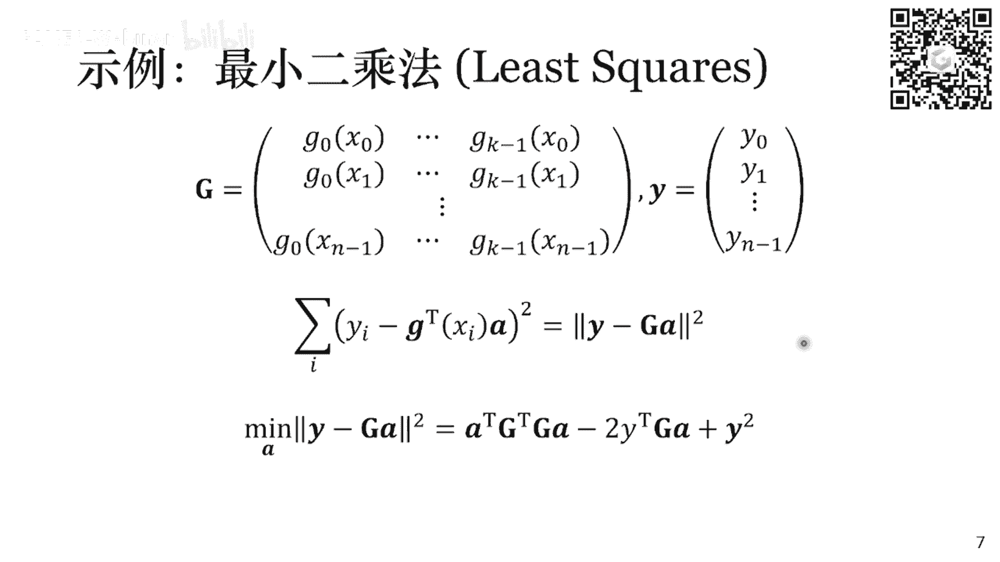

# GAMES001-图形学中的数学 - P15：优化基础 🧮

在本节课中，我们将要学习优化问题的基础知识。优化是图形学中一个非常重要的工具，涵盖内容广泛且深入。由于时间有限，我们将通过一些简单的例子，引出优化中的核心概念和常用算法，为大家提供一个入门级的介绍。



## 无约束优化问题


一个通用的优化问题可以写成以下形式：
```
minimize f(x)
subject to c(x) = 0
```
其中，`x` 是待优化的变量，`f(x)` 是优化目标，`c(x)` 是约束条件。本节我们先来看最简单的情况：无约束优化问题，即没有 `c(x)` 约束。

在图形学中，无约束优化问题非常常见。例如，最小二乘法拟合曲线、曲面参数化、物理模拟中的能量最小化等，最终都归结为最小化一个函数 `f(x)`。

### 线搜索方法

对于无约束优化问题，最直观的求解思路是迭代地寻找下降方向。这类方法统称为线搜索方法，其通用形式为：
```
x_{k+1} = x_k + α_k * p_k
```
其中，`p_k` 是第 `k` 步的搜索方向，`α_k` 是步长。算法的核心在于每一步如何选择 `p_k` 和 `α_k`。

#### 梯度下降法

最经典的线搜索方法是梯度下降法。它选择当前点的负梯度方向作为搜索方向，因为这是函数值下降最快的方向。
```
p_k = -∇f(x_k)
```
确定了方向后，我们需要确定步长 `α_k`。一个理想策略是沿着该方向进行一维搜索，找到使函数值最小的 `α_k`。但这本身也是一个优化问题，计算成本较高。

实践中，我们常用 **Armijo条件** 来近似地选择一个可接受的步长。该条件要求新的函数值必须小于等于一个由当前点函数值和梯度构造的线性估计值：
```
f(x_k + α_k * p_k) ≤ f(x_k) + c_1 * α_k * p_k^T * ∇f(x_k)
```
其中，`c_1` 是一个小常数（如 `0.0001`）。算法可以从一个较大的 `α_k`（如 `1`）开始，不断乘以一个衰减因子（如 `0.5`），直到满足 Armijo 条件为止。这样可以保证函数值稳定下降并最终收敛。

梯度下降法只利用了函数的一阶（梯度）信息，实现简单，但收敛速度可能较慢，尤其是在目标函数呈“狭长山谷”状时，容易产生震荡。

#### 牛顿法


为了获得更快的收敛速度，我们可以利用函数的二阶信息（曲率），这就是牛顿法。牛顿法在当前位置 `x_k` 对函数做二阶泰勒展开，并最小化这个近似二次函数：
```
f(x_k + p) ≈ f(x_k) + p^T * ∇f(x_k) + 0.5 * p^T * ∇²f(x_k) * p
```
令其关于 `p` 的导数为零，可解得最优的搜索方向为：
```
p_k = -[∇²f(x_k)]^{-1} * ∇f(x_k)
```
这里，`∇²f(x_k)` 是函数在 `x_k` 处的海森矩阵（Hessian Matrix）。牛顿法的方向不仅考虑了梯度，还通过海森矩阵的逆进行了“缩放”，能更准确地指向极小值点，因此通常比梯度下降法收敛更快、步数更少。

然而，牛顿法存在两个问题：
1.  **计算开销大**：每一步都需要计算并求解一个涉及海森矩阵的线性方程组。
2.  **收敛性保证**：只有当海森矩阵正定时，`p_k` 才是下降方向。否则，函数值可能上升。实践中需要对非正定的海森矩阵进行修正（如投影牛顿法）或退回梯度下降。

#### 拟牛顿法

拟牛顿法旨在结合梯度下降法和牛顿法的优点。其核心思想是：不直接计算复杂的海森矩阵，而是用一个更简单的矩阵 `B_k` 来近似它，并不断更新这个近似。
```
p_k = -B_k^{-1} * ∇f(x_k)
```
`B_k` 的更新需要满足所谓的“拟牛顿条件”：
```
B_{k+1} * (x_{k+1} - x_k) ≈ ∇f(x_{k+1}) - ∇f(x_k)
```
这个条件源于海森矩阵的定义（梯度变化与自变量变化的关系）。

**BFGS算法** 是最著名的拟牛顿法之一。它通过一个秩为2的矩阵更新公式来迭代 `B_k`，并能保证在迭代过程中 `B_k` 保持正定，从而算法稳定。BFGS 通常比牛顿法计算更快，且收敛速度接近牛顿法。

**L-BFGS算法** 是 BFGS 的“内存受限”版本。它不存储完整的 `N×N` 矩阵 `B_k`，而是只保留最近 `m` 步的更新向量，用这些向量隐含地表示 `B_k`。这大大降低了存储和计算开销（从 `O(N²)` 降至 `O(mN)`），特别适用于大规模优化问题，是许多工业软件的默认优化器。

上一节我们介绍了无约束优化的几种核心算法。接下来，我们将目光转向更一般的带约束优化问题。

## 带约束优化问题

在图形学中，约束无处不在，例如物体不能穿透、关节角度有限制、路径规划等。本节我们主要讨论带等式约束的优化问题，其形式为：
```
minimize f(x)
subject to g(x) = 0
```

### 最优性条件与拉格朗日函数

对于带等式约束的问题，最优解 `x*` 需要满足两个条件：
1.  **可行性**：`g(x*) = 0`
2.  **梯度条件**：在最优解处，目标函数梯度 `∇f(x*)` 必须与约束函数梯度 `∇g(x*)` 平行。这意味着 `∇f(x*)` 垂直于约束曲面，无法再沿约束曲面移动使 `f(x)` 下降。数学上可写为存在拉格朗日乘子 `λ`，使得：
    ```
    ∇f(x*) = λ * ∇g(x*)
    ```

为了统一这两个条件，我们引入 **拉格朗日函数**：
```
L(x, λ) = f(x) - λ^T * g(x)
```
可以证明，原优化问题的最优解 `(x*, λ*)` 正是拉格朗日函数的驻点，即满足：
```
∇_x L(x*, λ*) = 0
∇_λ L(x*, λ*) = 0
```
这等价于上述的最优性条件。因此，求解带约束优化问题转化为求解拉格朗日函数的驻点。

### 求解方法：牛顿法与对偶上升法

#### 牛顿法求解 KKT 系统
我们可以直接使用牛顿法来求解拉格朗日函数梯度为零的方程组（即 KKT 条件）。在每一步迭代中，需要求解一个形如下式的线性系统：
```
[ ∇²_xx L   ∇g ] [ Δx   ] = - [ ∇_x L ]
[ ∇g^T      0   ] [ Δλ   ]   - [ g    ]
```
这个系统的系数矩阵是对称但不定的，需要使用专门的线性求解器（如 LU 分解）。牛顿法收敛快，但每一步计算开销较大。

#### 对偶上升法
另一种思路是利用 **对偶问题**。我们定义对偶函数 `g(λ) = min_x L(x, λ)`。可以证明，在一定的凸性条件下（强对偶成立），原问题等价于最大化对偶函数：
```
maximize g(λ)
```
这是一个无约束优化问题！**对偶上升法** 就是交替优化原变量 `x` 和对偶变量 `λ`：
1.  **固定 λ，优化 x**：`x_{k+1} = argmin_x L(x, λ_k)`。这相当于计算 `g(λ_k)` 及其对应的 `x`。
2.  **固定 x，优化 λ**：使用梯度上升法更新 `λ`。可以推导出，对偶函数 `g(λ)` 在 `x_{k+1}` 处的梯度为 `-g(x_{k+1})`。因此更新公式为：
    ```
    λ_{k+1} = λ_k + α_k * g(x_{k+1})
    ```
对偶上升法将原约束问题分解为两个相对简单的子问题，实现容易，尤其适合约束可分离的情况。

#### 罚函数法
这是一种非常直观的近似方法：将约束作为惩罚项加入目标函数。
```
minimize f(x) + (μ/2) * ||g(x)||²
```
其中 `μ` 是一个很大的正数。当 `μ` 很大时，解会迫使 `g(x)` 接近零，从而近似满足约束。但 `μ` 的选择需要权衡：太大导致问题病态难收敛，太小则约束不紧。罚函数法简单，但通常只能得到近似解。

### 关于不等式约束
对于不等式约束 `h(x) ≤ 0`，其基本思想是：如果最优解在约束内部（`h(x) < 0`），则该约束不起作用（可忽略）；如果最优解在边界上（`h(x) = 0`），则将其视为等式约束处理。难点在于事先不知道哪些约束是“活跃”的。这引入了 **KKT 条件** 和更复杂的算法（如内点法、有效集法），此处不再展开。

## 总结 🎯

本节课我们一起学习了优化问题的基础知识：

1.  **无约束优化**：我们介绍了梯度下降法（利用一阶信息）、牛顿法（利用二阶信息，收敛快但计算贵）以及拟牛顿法（特别是 **BFGS/L-BFGS**，用近似矩阵平衡速度与开销，是大规模问题的常用选择）。
2.  **带等式约束优化**：我们引入了 **拉格朗日函数** 和 **对偶问题** 的核心概念。求解方法包括：
    *   直接用牛顿法求解 KKT 系统。
    *   **对偶上升法**，通过交替优化原变量和对偶变量，将问题转化为无约束优化。
    *   **罚函数法**，一种简单直观的近似方法。


优化是一个博大精深的领域，本节课仅是一个入门介绍。大家在实际应用中遇到更复杂的问题（如非凸优化、不可导问题、大规模不等式约束）时，可以在此基础上进一步深入学习。