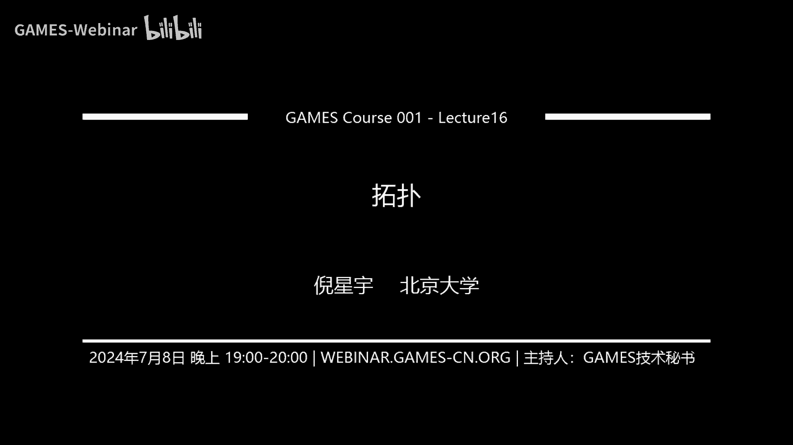
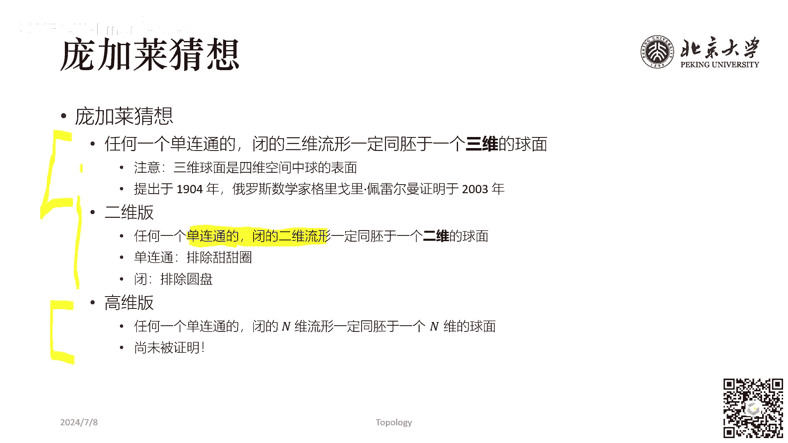

# GAMES001-图形学中的数学 - P16：拓扑 - GAMES-Webinar - BV1MF4m1V7e3

## 概述
在本节课中，我们将学习拓扑学的基本概念，包括同胚、亏格、欧拉示性数、回转数、卷绕数、若尔当曲线定理、布劳威尔不动点定理、毛球定理和庞加莱猜想。

## 什么是拓扑？
拓扑学是研究图形和图形之间位置关系的几何学。它主要关注图形的相对位置，而不考虑图形的大小或形状。

### 同胚
两个图形如果可以通过弯曲、延展、剪切等操作相互转换，则称它们是同胚的。

**公式**： \( f: X \rightarrow Y \) 是同胚当且仅当 \( f \) 是双射，连续，并且 \( f^{-1} \) 也是连续的。

### 亏格
亏格是曲面中最多可以画出N条闭合曲线，同时不将曲面分开的N值。

**公式**： \( g = N \)

### 欧拉示性数
欧拉示性数是一个不碎、不随同胚改变的拓扑不变量。

**公式**： \( K = V - E + F \)

### 回转数
回转数是曲线绕过某点的总次数的整数。

**公式**： \( \text{扭转数} = \frac{\text{曲线的总曲率}}{2\pi} \)

### 卷绕数
卷绕数是曲线绕过某点的总次数的整数。

**公式**： \( \text{卷绕数} = \frac{\text{曲线的总曲率}}{2\pi} \)

### 若尔当曲线定理
若尔当曲线定理是计算几何中用光线投射算法判断点与多边形关系的策略。

### 布劳威尔不动点定理
布劳威尔不动点定理是说一个从欧几里得空间的某个给定的凸集的子集设到它自身的连续函数，有至少一个不动点。

### 毛球定理
毛球定理是说球面上的连续的切向量必然存在零点。

### 庞加莱猜想
庞加莱猜想是说任何一个单连通的闭的三维流形，必然同胚于一个三维的球面。

## 总结
本节课我们学习了拓扑学的基本概念，包括同胚、亏格、欧拉示性数、回转数、卷绕数、若尔当曲线定理、布劳威尔不动点定理、毛球定理和庞加莱猜想。这些概念在图形学中有着广泛的应用。