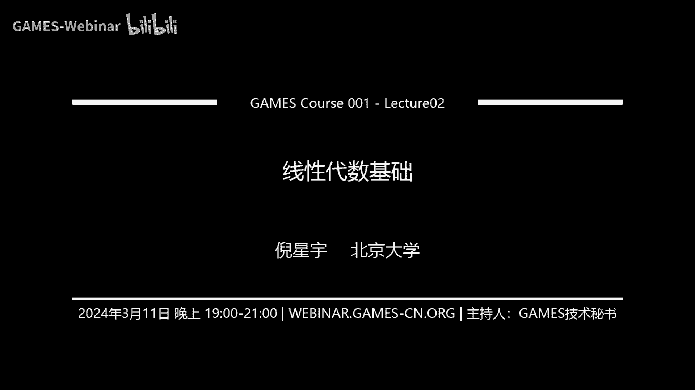
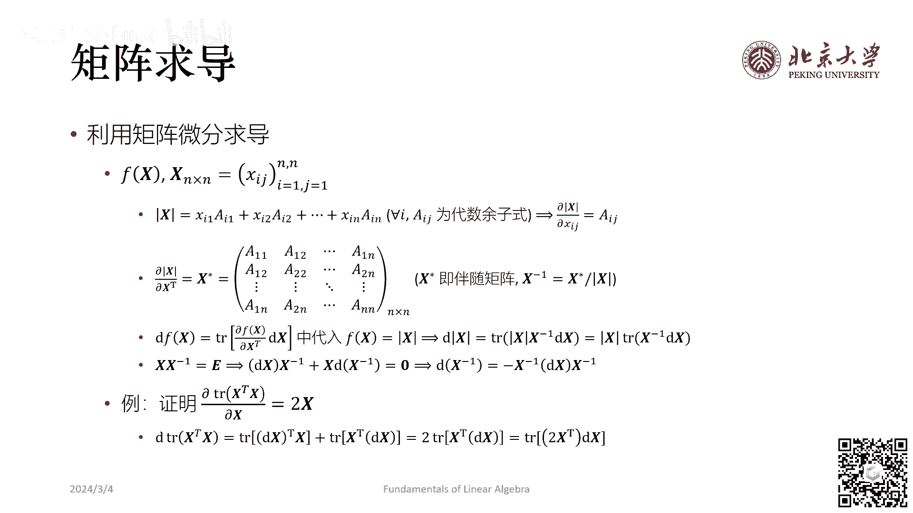
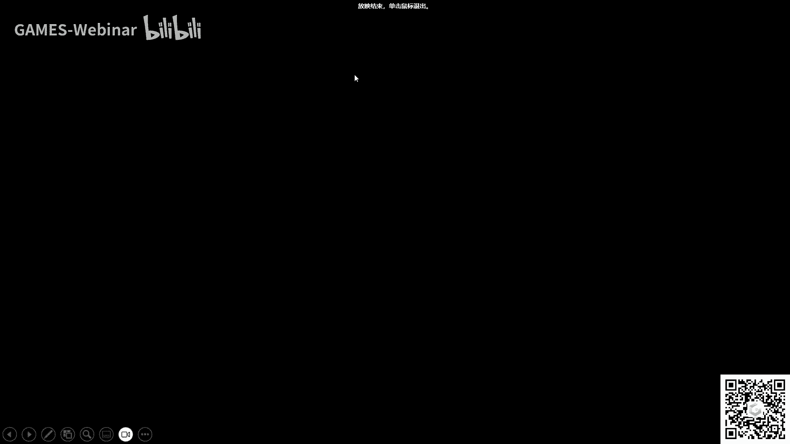

# GAMES001-图形学中的数学 - P2：线性代数基础（二） - GAMES-Webinar - BV1MF4m1V7e3

今天我是换了一个设备一个小话筒。

所以应该比上周的收音要好一些，然后我们还准备了一个手写板，因为这周会有一些推导方面的内容，所以用手写板的话比较用PPT充当一个黑板的功能，然后上课之前我们先有一些课前的事情跟大家交流一下。

第一个是纠正一下上次课程中的我的一个口误，就是上次提到的腰症变换，腰症矩阵里面的腰症指的是单位正规，就是这里的正指的是正规，或者是正交它其实不宜理解为正定，因为正定和正规并不是一个意思。

然后第二个是关于我们这个课程的定位，然后这些课给大家重新重新一下，就是首先我觉得我们这个课它的意义不在于说让大家把每一门，就是我们课上要给大家讲的数学内容全部从头到尾的讲，我觉得那样是不现实的。

其实我们更多的是希望能够通过这样一门课，让大家对图形学大概设计到哪些数学，哪些数学里面的哪些概念比较重要，这个事情有一个提纲切领的认识，当大家之后在真的学习科研工作当中用到这些知识的时候。

可以就通过我们这个课程当做一个索引去接触那些，真正的比如说一本书一样去介绍的这样一门数学课，所以这个课定位是这样，所以有可能会出现某些地方它讲的，可能会大家觉得比较快，然后没有办法从头到尾的跟下来。

但是我觉得这个事情它依然是有意义的，然后另外就是我觉得GAMES课程它其实是一个共创性质的课程，就是我们第一次以这样的形式开这样一门课，肯定会存在很多方面的不足，然后也欢迎大家批评指正。

然后如果大家有更好的，就是对于我们这些同名课程有自己更好的建议，或者是更好的这样的上课的组织方式的话，也可以向GAMES官方提出申请，然后之后可以由大家来开GAMES001的第2版，第3版这样。

然后我们一起维护中文的图形学社区，然后第3就是大家上周应该也已经看到了，就是关于GAMES002课程的广告也已经发布了，然后可能有一些同学对GAMES002要达到什么样的目的，还有一些疑惑。

然后我这里可以帮助大家做一些解答，002不是我讲，但是就是002课程的提出建设这个过程里，我也有参与就是关于为什么要有这样一门课，因为其实我们在北大开设图形学的过程当中，会发现就是即便是北大的本科生。

在一些图形学的应用程序工具的掌握上，大概是大二大三的同学吧，也依然存在一些不足，就是每次当我们当助教的时候，然后可能要手把手的教大家如何配置环境，就是会有很多同学问，那么这个东西为什么会出现这样的问题。

那个东西要怎么安装，其实我觉得图形学相比于计算机科学的其他方向，它有一个显著的特征就是，需要配环境，而且有数不清的环境需要去配，所以就是我觉得配环境可能是每个搞图形学的人，不得不掌握的技能。

所以如果有这样一门课能够专门的去，讲一下关于图形学的工具，有哪一些推荐，然后掌握到什么样的程度，我觉得也是帮助大家快速的上手图形学一个很重要的过程，大家对002课程有什么疑问。

我可以尽我所能现在回答一下，有同学问说环境限定操作系统或者编程语言吗，是不限制的，我们在这段时间的，在北大开设图形课的历程当中，我们发现其实很多问题就来自于，大家每个人用着不一样的操作系统。

然后其实我们比如说我们每次准备材料，我们可能会主体是在Windows系统上整理的，因为我们觉得图形这门课它跟别的一些计算机的，子页域不一样，它是反而是在Windows系统上最容易开发的这样一个。

就是领域，然后但是会有同学他就是抱着Mac的电脑来，然后他就问你为什么在他那个地方装不了，所以我们的解决方案就是我们所推荐的工具，基本上都是很容易做到跨平台的。

然后我们推荐的代码的方式也是以跨平台为我们的宗旨的，对所以应该是不要求的，就比如说OpenGL，可能大家真的在游戏开发线OpenGL已经跟不上时代了，然后大家会选择用Vulkan或者是Direct3D。

那么D3D这东西它就是只支持Windows的，然后如果你是用OpenGL的话，那么只有Windows和原生的Linux系统是支持OpenGL的最新版，应该是4。6的。

而Mac对OpenGL的支持是停留在4。1版上，然后Mac有一个自己的专属的图形的API叫Metal，但是这个东西的普及率实在是有点堪忧，然后Vulkan的话很多人都会说是下一代次时代的API。

但是Linux和Windows原生支持Vulkan，但是Mac的Vulkan实际上是实现在Metal上的，它的性能也会打一定的折扣，所以其实你让我从原则上，就是从个人的感情上推荐的话。

我是不建议用Mac来开发图形的，但是真的就是Mac的市场占有率还是比较高的，确实有很多同学会用Mac来学习图形学，所以我们就是在准备，比如说我们每次开课在准备Lab的时候都考虑了这一点。

这些就是002需要去跟大家讨论的内容了，上次我也没有摄像头，好吧，那关于002的课程咱们就这样好吧，我们就话不多说继续上周我们没有讲完的课程，大家有关于002的问题也可以在这里留言，我们都可以看到。

上次我们是讲到，矩阵分解这一节，然后我们今天就来看一看图形学当中，涉及到的矩阵分解方式究竟有哪几种，首先最简单的一种分解就是PLU分解，然后什么叫PLU分解，它其实所有的矩阵分解基本上都等于说。

一个矩阵等于若干个矩阵相乘，然后所谓PLU分解，就是在一般意义上我们称为有PL和U三个矩阵去分解，这个麦克风的声音来看看能不能调大一点，这个从LU分解。

PLU分解它就是说我们的矩阵可以分成这样PL和U三个矩阵，其中P称为初等变换矩阵，而L是下三角矩阵，U是上三角矩阵，我们如果像右边这幅图这样，如果能把矩阵分解成这样的三个矩阵相乘。

这样的分解方式我们就称为PLU分解，那么我们来举一个例子，比如说如果我们有这样的一个矩阵，就是A=960，然后这里是654，然后3 4 10，这样的一个矩阵，它的PLU分解是怎么去做呢。

我们可以这样去想象，首先我们将这个矩阵的第三行乘以三，然后减到第二行上去，我们就会得到A0矩阵，A0=960 0 1 4 3 4 10，我应该没有抄错系数吧，对应该没有抄错系数。

是说把第一行乘以-2/3加到第二行上去，我们可以把这个变换矩阵写出来，它等于100-2/3 10 001，就用到A矩阵上去，这样我们就得到A0，那么得到A0以后呢，我们还要继续对上面的式子进行还原。

然后这次的做法是我们再将第一行乘以-1/3加到第三行上去，这个结果是什么呢，是A1=960A，A1=960A，A1=960A，然后我们可以记这个东西是什么呢，我们把它记为=11A0。

或者或者我把这个11的形式给出来，这边这个矩阵我们叫它10矩阵，然后这个矩阵呢，它是100 010，然后-1/3 010，这个给它作用到A0上去，这个矩阵我们叫它11矩阵，然后呢。

它就只剩我们我们就是在做高斯敲蜻蜓，就是在做高斯敲蜻蜓，A2它就等于继续还原，它等于960 014 002，它可以写成是100 010 0-2 1，然后我们把它作用到A1上去，这个矩阵我们叫做A2矩阵。

然后我们把所有的式子都写在一起，就会发现我们刚刚干了一个什么事呢，就是U等于A2，它等于A2等于12A1，而A1等于11A0，A0等于10A，所以这个就导出什么，导出L，对。

就是A等于12乘以11乘以1，就是A等于12乘以1乘以0的逆再乘以U，然后这个得到的就是L，这个就是L，因为这里的1211和10，它们本身都是下三角矩阵，然后我把下三角矩阵乘在一起。

它也依然是下三角矩阵，然后再对它取逆也是一样的，总之我们最后会得到这个通过高斯敲蜻蜓，每组高斯敲蜻蜓，如果我们把变换矩阵给存下来，变成到一起再取逆的话，它就会得到一个下三角矩阵。

所以每一个高斯敲蜻蜓就等于，等价于一个LU分解，那么这里的P是什么呢，我们可以看到刚刚整个变换过程当中，我们只涉及到，把某一行乘以一个数，加到另一个数另一行上去，但并没有涉及到说。

我们把其中矩阵任意两行，给互换这样的操作，但有时候我们为了数值的稳定性，比如说我们希望主源尽可能的大，然后这个条件数尽可能好，或者类似的理由，我们还会希望在前面去成一个变换矩阵，去把某些行给交换。

然后这个时候就会多出来，这个置换矩阵P，所以高斯敲蜻蜓，总归意义上说它是一个PLU分解，然后如果你不进行换行的操作的话，它就是一个LU分解，这个就叫PLU分解，然后用LU分解来解方程。

我相信大家都明白是怎么回事了，其实它就是等于我们用高斯敲蜻蜓去解了一个方程，我们来清除一下，然后第二个分解是乔里斯基分解，乔里斯基分解是把一个矩阵分解成，它本身再乘以另一个它本身的转制，或者再复述一下。

就是它本身的R转制公额矩阵，然后乔里斯基分解是有一定的条件的，它不像LU分解，我们只要是在任何一个方阵的情况下都可以做，而乔里斯基分解要求我们这个方阵，它得是一个十对称的镇定矩阵。

在这其中L也依然是一个下三角矩阵，那么L的转制公额它显然也是一个上三角矩阵，所以它跟LU形式上是一样，形式上都等于说是一个下三角乘以一个上三角，但不同之处在于乔里斯基分解的上下三角矩阵之间。

还互为转制公额的关系，好 那我们看一下乔里斯基分解的示例，比如说连矩阵是4 12 -16 12 37 -43，然后是-16，就是这样一个矩阵，然后这个矩阵我们不加正名的给出，它等于下面这两个矩阵的成绩。

矩阵的成绩，然后是-16，它等于这样的一个矩阵的成绩，还可以验算一下它应该是对的，然后乔里斯基分解要怎么去求呢，因为这个乔里斯基分解它本身是具有，可以把一个n阶方阵的乔里斯基分解的问题。

归约为一个n-1的方阵的乔里斯基分解的问题，所以通过这样的方式，它有一套自己的算法去求乔里斯基分解的方案，然后因为具体的求法，其实在图形学应用当中，大家并不需要过多的关注，大家基本上绝大部分情况下。

都是给定一个方程让你去解，然后你这个时候要想到用乔里斯基分解去解，所以一般情况下是这样的一个状态，遇到这个乔里斯基分解，然后乔里斯基分解的好处和LU分解是一样的，就是它们的差别在于复杂度。

LU分解因为等价于高斯消阴，一般来说求解的复杂度是在n三方的级别，n是矩阵的阶数，然后乔里斯基分解因为它的一些很好的性质，比如说实对称这样的性质，使它可以归约为此问题，所以它的复杂度是n平方的一般来说。

所以这个求解的复杂度就直接降了一级，然后当我们拿到一个，不管是LU分解也好，乔里斯基分解也好，我们可以将这个解方程给简化，比如说A矩阵它等于L乘以U，有路波有路波，这个路波会在上完课的几天之后。

可以在B站上看到，然后我们要求解方程ax等于b，这时候我们可以将LU来代替A，然后写成x等于b的形式，然后我们又可以把它写成L乘以Ux等于b，所以我们可以先拿一个下三角矩阵去解出ly等于b出来。

所以我们就会得到Ux等于y，然后这样我们就可以解出x，它归根结底就是这样一个过程，然后如果是乔里斯基分解的话，其实一样的，你直接把U给转换成L转制就可以了，这个就是矩阵分解的最简单的两种情形。

然后稍微麻烦一点的两种，第一种是QR分解，QR分解是一个对矩阵几乎没有任何要求的分解方式，你看这里它要求是m乘n只要它是列满制的，那么我们这个方程就可以做QR分解。

分解结果我们会首先分解出一个L乘以矩阵，然后再分解出一个上三角矩阵，然后这时候因为m它有可能和n不相等，当m大于n的时候，这个R的下半部分就是0矩阵，因为它上三角嘛，上三角以下部分就都是0。

然后QR分解有很多种方法去计算，比如说式密特征交换啊，这个Givens变换或者Householder变换之类的，然后它的应用也是和乔里斯基分解类似的，然后是求解稠密的矩阵方程所需要应用的东西。

然后特别的就是如果大家知道，在我们做软体仿真的时候会遇到形变梯度这样一个概念，我们形变梯度一般来说会把它分解成RS，其实一样嘛，当然这个R就对应于这里的Q，然后这个S就对应于这里的R，它意思就是说。

比如说我有一个软体，然后这个软体发生了一些变化，然后我现在把这个变化里面的旋转部分给提出来，那么剩下的部分才是真正的变化，才是真正的软体的变形，因为软体的变形如果它全是旋转部分的话。

它其实对应的就是钢体，它其实就变成一个不能进行形变的这样一个固体了，所以只有剩下的这个部分S才是真正的软体的形变，QR分解一般来说它的作用就是这样，然后我们可以简单地看一下，用最暴力的方法。

就施密特正交化是怎么去做QR分解，其实大家不掌握也没有太大的关系，这就是一个最简单的概念，大家有一点印象就可以了，(画面中)，原来是给出一个矩阵，然后这里给的矩阵是122212121。

好 是这样一个矩阵，然后我们先对它做施密特正交化，施密特正交化大家现在应该都学过，我就不在这里赘述了，首先会得到B1=A1，A1就是它的第一列，等于直接拿到等于121，然后B2=A2-B1=1-1。

然后B3=A3-1/3B2-7/6B1，这些系数都是点程算出来的，等于1/2-1/2，这样就拿到B1 B2 B3，也就相当于拿到Q，这个还没有做正交化，但如果我们再做一下它的正交化，就是皈依化。

如果我们再做一下皈依化的话，就会直接得到Q=1/6，然后2/6，1/6，我们直接把B1皈依化拿过来，然后这个是1/3-1/3，然后是1/3，然后1/2 0-1/3，就直接得到Q矩阵了。

也就是做Smith正交化就会得到Q矩阵，然后R矩阵呢，R矩阵其实是这么得来的，就是刚刚我们在做正交化的过程当中，我们不是有一些系数吗，首先是皈依化系数，我们把皈依化系数抄在中间。

然后是刚刚计算这些单位向量的系数，然后这就得到了R矩阵，这R矩阵算出来的结果是√6，7/√6，然后√3，1/√3，1/√2，这样就得到这个QR分解。

其实QR分解最暴利的计算方式就是直接做Smith正交化，然后整个流程大概就是这样，然后在QR分解之外呢，最后一种也是可能不管做CV也好CG也好，大家都不得不去接触的这样一种矩阵分解方式，就是奇异值分解。

然后奇异值分解一般大家都会把它简称为SVD，这个SVD其实就是奇异值分解，它的一个缩写，所以如果我看到有人说SVD分解啊，然后这其实就语义重复了，所以我们一般就称为奇异值分解或者SVD。

然后它分解的三个矩阵，一个是U矩阵，然后一个是Sigma矩阵，然后一个是V矩阵，V矩阵一般在形式里出现，我们会用V转制的形式出现，然后它对于任何矩阵都是可以去求的。

甚至不要求这是一个列满值或者行满值的矩阵，然后其中呢，我们可以看到第一个U矩阵它要是个优正矩阵，也就是我们可以把它理解为一个，再述一下就是旋转矩阵，这是一个旋转矩阵，然后这也是一个旋转矩阵。

就是说这里以它的转制的形式出现，然后中间是一个对角矩阵，这样一个过程就是SVD，一般呢，我们将对角矩阵当中这个对角，所有对角元都称为奇异值，然后这里的奇异值它们都是非负的。

右边给的这幅图是关于SVD的一个示意图，我们一开始这个矩阵它长上方这个样子，然后这M这些图是网上copy的，我们可以把这个理解为A，然后这样一个矩阵我们先做一次旋转，也就是这个V转制所对应的旋转。

它会将这个红线和黄线进行，就是整个圆做一个旋转，转到这样一个程度，然后我们去做这个Sigma，Sigma它的意思是，在沿着现在的每个轴去做缩放，也就是scale，然后缩放之后结果就是右下角这样。

你们可以看到它相当于是在这个X方向，做了拉伸在Y方向做压缩，然后最后我们又对应了一个旋转的变换，把下面的这样一个图形，又给变换到最上方一个图形，然后这些操作的写到一起，就是直接一个A过去的结果。

然后它等价于先旋转再缩放再旋转，然后这个过程就是SVD，然后SVD有一些比较特殊的情况，就是因为大家其实在学现代的时候，都学过的概念叫特征值，因为我们之前上节课也回顾了，什么叫特征值。

特征值是所有让它满足，这个AX等于λX的，这样的实数我们叫它特征值，但不一定是实数，只是在实数域下我们这样去看，那这样的数我们叫它特征值，然后而这个奇异值是做SVD分解之后，中间的这个对角矩阵的对角元。

那么这两个值它们之间有什么关系呢，我们可以这样去看它，就是如果当m和n是相等的时候，然后我们将A矩阵的转制和A矩阵乘到一起，然后再对它开根号，当然这个开根号是形式上的，我们也可以把这个根号给写出来。

它其实意思是什么呢，就是我们把A等于uσv转制这个等号，给它写进去，把每一个A转制也给写成v×σ转制，σ转制就是σ本身，然后再乘以u转制这样的形式，然后因为u转制乘u它是单位矩阵，所以就消掉了。

最后我们就会得到v×σ^2×v转制在开根号，那么这个东西就等于v×σ×v转制对吧，然后v是什么，v是一个旋转矩阵，v转制是这个旋转矩阵的逆矩阵，然后中间剩下的这个东西它就是特征值。

因为如果你能够把任何一个矩阵通过相似变换，变换成只有对角矩阵的话，那么这个对角元就会对应一个特征值，所以这里给出的结论是说，当A为实对称镇定矩阵的时候，特征值与奇异值是重合的，因为只有在实对称镇定矩阵。

你才能用一个正交矩阵去进行对角化，这个是我们之前回顾，上一课大家回顾的这样一个概念，就是实对称镇定矩阵可以被正交矩阵通过相似变换，得到一个对角矩阵，所以此时的特征值与奇异值是重合的，对 当然换句话说。

这个就告诉我们，如果它不是实对称镇定矩阵的话，它特征值和奇异值可能是不一样的，这个时候是游戏需要小心的情况，好 讲完了矩阵的分解以后，我们继续去探讨线性代数里面，没有涉及到的一些矩阵的概念。

比如说向量与矩阵的范数是如何定义的，然后我们上节课其实已经说过了，这个范数它在英文上就是norm 对吧，或者说它就是母，这是一个东西，然后我们定义范数，首先是在向量上定义向量范数。

然后我们再将向量范数给推广到矩阵范数上，所以我们就先来看这个向量范数，模是什么模，就是对长度的一个度量，首先我们来看L0范数，L0范数它是说一个向量，它的L0范数等于其中非0元素的个数。

我们把它记作L0，然后L1范数是一个向量，我们把它每一个分量的绝对值相加，这个得到的叫L1，L2范数是大家最熟悉的一种，是我们将一个向量，它当中的每一个元素的平方相加，再开根号，这样得到的是L2范数。

我们又将L2范数称之为，欧基里德范数或者是弗洛比姆斯范数，然后这个手写笔它不太听使用，我们总结一下，L1和L2都可以写成是将x1的p次蜜，sigma起来，然后再除以，不是再除以。

再开这个p次方根得到的结果，所以我们如果p趋向于无穷会得到什么，p趋向于无穷就会得到，x无穷等于整个矩阵当中元素的最大值，这个事情其实就需要用分析去证明了，它不是代数角度的事情，大家高数课应该都学过了。

就是x1除以x2的p次蜜，当p趋向于无穷的时候会发生什么，如果x1<x2就是0，如果s1>x2就是无穷，然后如果s1=x2是1，其实我们就是利用了这个结论，定义为L无穷的范数，上节课我们其实回顾过范数。

就是要满足的性质，范数它是定义在一个结合上，然后我们希望它能够满足，正定性正其次性和三角不等式，就是矩阵范数需要满足这三个性质，正定性是说任何一个向量的程度是大于等于0的，而且非0向量的程度是大于0的。

正其次性是说我在一个向量上去乘以一个时数，然后我得到的新向量的范数，要等于原向量的范数乘以时数的绝对值，然后三角不等式是说a+b的摩长，要小于等于a的摩长加上b的摩长，这个叫三角不等式。

然后我们可以验证一下，其实L0范数是不满足这三个性质的，而且它好像一条都不满足，对吧，因为它只是L0范数只是对一个向量当中，非0的个数的度量，所以事实上L0范数它不是一个真正的范数。

因为它不能构成一个度量范数，所以我们在说L0范数的时候，其实一个概念性的称呼有一个L0范数的存在，它本质上不是范数，比如说我们什么时候用到范数最多呢，在这个机器学习的时候。

我们会定义一个objective function，然后它可能是等于，它可能是等于某一个向量和另一个向量的相减，然后求它的摩长，如果你采用的是，这个L0范数的话，它的优化效果是很差的，为什么呢。

因为其实就是它其实本质上不是范数，它不可导，就是当你某一个元素的值改变的时候，整个向量的摩长并不会随之立刻发生改变，所以它的优化目标，作为优化目标的性能是非常低下的，有了向量范数。

我们才可以去定义矩阵范数，矩阵范数和向量范数是一样的，如果说向量范数是，是有一个向量的集合，然后它的一个程度的度量的话，矩阵范数是一样的，你如何理解矩阵范数，就是我们用了一个时数去表达，一个矩阵的大小。

就矩阵，大家可能不知道矩阵的长度是什么东西，但我们可以把矩阵范数理解为，一个矩阵集合，然后它上面的每个元素都有一个大小，这个就是矩阵范数一个直观的理解，然后我们怎么去定义这个大小呢，首先，第一种。

其实有很多种不同的定义方式，然后第一种定义方式就是诱导范数，诱导范数的矩阵范数，是和向量范数是严格上统一的，它定义是说，一个矩阵的范数，它等于这个矩阵，作用在任何一个向量上，所求得的最大的范数。

所求得最大的向量范数，要求这个向量的摩长等于，或者我们如果在向量摩长不等于的情况下，就是求出这个，矩阵作用在这个向量之后，得到的向量的范数除以原向量的范数，然后我们把这个，比值的最大值记作矩阵的范数。

刚刚我们讲过向量的LP范数了对吧，所以我们用矩阵，用向量的LP范数，就可以直接得到矩阵的诱导LP范数，然后它的定义就是像这样，然后从这个几何意义上说，如果我们给出如上的，这样的诱导范数的定义的话。

其实A它的几何意义就更加明显，它是作为先进变换的时候，产生的对向量摩长的最大的放大倍数，我们直接解读这个式子，它就是说存在某一个向量，然后这个矩阵作用在这个向量上。

会使得这个向量变成一个摩长非常大的向量，然后它们两个的比值，其实就是A产生的最大的放大倍数，然后既然是诱导范数，它和向量范数要是相容的，这个相容性是什么样呢，它其实是说，A矩阵作用在X向量上。

得到的新向量的范数，它要小于等于，A本身的范数乘以原向量的范数，而这个事情其实可以直接用定义去证明，因为X比上X是小于等于，对它求max的，而求max的定义是矩阵的范数，所以我们把它换一下位置。

就会得到上面这个数，所以诱导矩阵范数的相容率是很容易证明的，然后有几种常见的诱导矩阵范数，第一种叫诱导矩阵L1范数，然后它得到的结果是，A的所有列向量的最大绝对值的和，就是A的所有的列向量。

我们可以看到这里先把列固定了，然后对每一行求和，求和之后看谁最大，得到的结果就是矩阵的诱导L1范数，然后矩阵的诱导L2范数，得到的是A的最大奇异值，刚刚我们已经定义过奇异值了，所以该范数又称为普范数。

为什么，因为我们一般会将某一个矩阵的最大奇异值，这个东西叫做它的普范进，然后A的无穷范数和A的E范数，它是正好对应的，刚刚我们求的是所有列向量的最大绝对值和，然后现在求的是所有行向量的最大绝对值和。

这是一道作业题，如何去证明左边这三个事情，好，刚刚我们说的是诱导范数，而矩阵除了从向量诱导得到范数以外，还有另外两种范数的定义方式，第一种是直接基于矩阵的元素形式去定义范数。

那么我们这里又会称作L级范数，大家约定俗成就喜欢这么说，所以得区分一下究竟是用哪种方式定义的范数，然后元素形式范数可以理解为，我们把矩阵先降为成向量，然后直接使用向量的LP范数去定义矩阵的范数。

比如说有个矩阵是有个2*2的矩阵是长这样，那么它的范数呢，我们又把它写成这个向量的范数，它干了这么一件事情，它其实也可以看成是用向量范数给定义的东西，但它更暴力一些，它其实会忽略了很多矩阵的。

因为它有行有劣所带来的信息，那么第一种就是A1，矩阵的A1范数是直接求它每个元素的绝对值和，然后第二种是A2，F2其实就是Flow of Unions或者是欧几里德，或者是舒尔范数或者是LR范数。

都是这个东西，它指的是将矩阵的每一个元素先求平方，然后取它们的和再开个号，然后这个东西它等价于Trace A转至A，这个怎么证明其实是很容易证明，就直接验算一下就可以了，然后矩阵的无穷范数是一样的。

跟向量的无穷范数一样，就是我们求它的每一个元素的最大绝对值，这个就叫L无穷范数，然后在这个优打范数向量元素形式的范数以外，还有一种shutting范数，它是一种不随腰正变换而改变的范数。

如何做到这一点呢，因为我们知道腰正变换是不改变起义值的，所以shutting范数其实就是相当于定义在矩阵的起义值上的范数，第一种定义方式，就是A1是它起义值的和，这个范数我们称为和范数。

然后A2和上面的这个是等价的，这两个是一样的，然后A无穷它和普范数是一样的，然后为什么是这样定义呢，因为shutting范数其实相当于我把起义值给写成一个向量，就是我写成一个向量。

长sigma1 sigma2一直到sigman，然后我求这个向量的L1范数，就是矩阵的shutting1范数，然后求这个向量的L2范数，就是矩阵的shutting2范数，以此类推，这些性质都还挺有意思。

而且不是非常难去证明，我们希望大家，这应该也是一道作业题，我现在就证明这个事情，它应该也是一道作业题，然后第三个关于矩阵部分的线性代数的实义，是矩阵求导，这个其实在科研当中经常用到。

但是我们的现代课程并没有去补充这部分的内容，然后矩阵求导在图形学当中的应用，我个人总结是，以下两点，当然这是诱于我的学术领域所带来的，它本身的应用远远不止这两点，第一点是在伴随方法中。

就是adjoining method，它去求某一个物理量，相对于初始参数的导数，比如说一个，我举一个高中物理的例子，一个斜抛运动，斜抛运动的参数，一个是抛角，一个是初速度，初速度是个向量。

然后在若干时间以后，它会落在某一个位置，这个位置可能会是一个高度，然后我想求高度相对于初始参数，它的一个偏导数，然后我们的伴随方法，adjoining method，它就是求解这个问题的。

只不过我们现在遇到的问题，比起高中物理要复杂得多，我们的初始参数不仅是θ和v0两个，我们得到的东西也不只是高度这一个，这个时候我们就其实，在这个过程当中就会遇到矩阵求导，第二个应用是在软体缝阵当中。

给出势能函数求它的应力张量，就是我们会得到一个，会给大家一个这样的形式，这个叫hyperelastic function，超弹性，然后这个是弹性势能，这个Psi这个函数给定的叫弹性势能。

然后F这个它叫形变梯度，这是一个3×3的矩阵，然后弹性势能是一个标量，然后我们会需要去求它的皮欧拉stress，等于偏Psi比偏F，然后这是一种应力张量。

从这个皮欧拉stress可以得到柯西stress，然后从柯西应力张量，我们又可以直接去求出弹性力，整个流程是这样，所以可以可见其中通过，左边的弹性势能函数去求皮欧拉stress，这个过程是很关键的。

这个过程就是一个矩阵求导，以上是矩阵求导两个比较，我个人会用到的应用版，在讲矩阵求导之前，我们先要讲关于矩阵求导的布局，矩阵求导有两种布局，第一种叫分子布局，第二种叫分母布局。

然后它求出来的结果是不一样的，比如说F和X现在它们都是向量，然后F是一个2×1的向量，X是一个3×1的向量，也就是大家都是列向量，然后所谓分子布局，就是我们拿一个列向量去，对一个行向量求导。

这个过程就叫分子布局，因为此时分母转质了，求出来的结果是一个2×3的矩阵，然后另一种求法呢，是我们将一个行向量，对一个列向量求导，这个时候分子转质了，然后求出来是一个3×2的矩阵，所以如何去记忆布局呢。

谁转质就不是谁的布局，分母转质了就是分子的布局，分子转质了就是分母的布局，这个就叫矩阵求导的布局，然后从本质上说，m个边缘的矩阵，对n个边缘的矩阵求导，所得的结果都是m×n个边缘，因为它们都是线性的。

也就是说F有多少个未知数，X有多少个自由度，它每个都得求一遍，你不管是用哪一种布局求导，求出来都相当于要算偏Fi比偏Xj，每一个都少不了，但是区别在于，所得的结果是按什么规则排列的，是不一样的。

左边我们得的是一个2×3的矩阵，右边得的是一个3×2的矩阵，这个事情大家必须时刻注意到，你当前所用的是一个什么布局，如果你混用不同的布局，最后就会发现，你矩阵求导求出来的中间量，没办法乘在一起了。

因为它们成了一个，不相容的矩阵乘法，然后我们从这个简单到困难的顺序，来讲一下，不同矩阵函数求导的方式，然后第一个案例是，向量边缘的实质标量函数，也就是说J的F是实数，Rx是一个向量，这里的向量。

我们一般都默认它是列向量，然后我们一般对向量边缘的，实质标量函数求导，我们是选用这样的布局方式，也就是我直接将一个向量给写成，一个标量堪称对向量的，每一个元素求偏导，然后过程最后再组装成一个列向量。

它是这样一个形式，然后向量边缘的实质标量函数求导，它有一些比较重要的运算法则，第一个是如果标量函数是个常量，就是说不管对，那你不管发入任何的向量，它都会得到这个成数，所以它的求导就是0。

然后第二个是线性性，就是如果F和G都是实质的标量函数，那么C1FX加C2GX再对X求导的结果，是C1乘上F对X求导的结果，加上C2乘G对X是求导的结果，然后是乘法法则，因为F和G都是标量。

所以乘法法则也很简单，它和我们学过的就是未知分里面的概念是一样的，就是F对于X求偏导，这个得到的是一个列向量乘以一个G，G是一个实数再加上一个实数乘以一个列向量，最后得到一个列向量，然后除法也是类似的。

因为你的F和G都是实数，所以其实根本就什么都没有变，什么都没有变，形式上完全没有变，你的G^x仍然是一个实数，所以你可以把它直接放在最外面除掉，然后向量变的实质标量函数的常用公式是，第一个是。

我们首先要给出定义，我们定义A和B都是n阶的列向量，是常数向量，然后n乘n是n阶的常数矩阵，A是n乘n的常数矩阵，然后第一个结论是，X转制乘以A或者是A转制乘以X，其实它对应的都是内基对吧。

然后我们内基得到的就是一个标量函数，这个标量函数对于其中的边缘X求偏导，得到的结果都是那一个不边缘A，这个验证是很容易的，它只要把定义全部都写出来，就很容易得到这个结果，然后第二个结论是。

X转制和X相乘，也是得到一个标量函数，然后这个标量函数对于X求偏导得到是2X，这结论如何去记忆呢，其实它就是将上面的这个X转制A和A转制X，你可以把它看成一个是边缘，另一个是常数。

其实可以把它看成是这个，就是A等于X，然后第三个结论是，X转制乘上这个常数矩阵A再乘以一个X，然后它对X求偏导得到的是AX加上A转制乘以X，这个也可以直接去验证其结果，相对来说还比较简单。

然后比较复杂是下面这个事，然后就是A转制乘以X，然后再乘以X转制再乘以B，然后它对X求偏导，这个求偏导的结果是，A乘上B转制乘以X，加上B乘上A转制乘以X，这个证明就比较复杂了。

然后我就不在这里告诉大家大概怎么去理解，反正这个结论也比较重要，之后会跟大家说一下，如何去计算矩阵求导，如何用比较简单的方式去计算矩阵求导，然后我们现在再来看矩阵边缘的实质表现函数。

刚刚我们的函数返回的值都是实数，但是函数接收的东西不一样，刚刚是向两下变成矩阵，现在是矩阵边缘，矩阵边缘我们首先定义这个矩阵，然后一样就是我们如果求F，F对于它的变量X是一个M。

作为一个M乘N的矩阵的偏导数的话，就相当于每一个F对于X的每一个对应的元素求偏导，然后再把它按照矩阵的形式组织起来，然后运算法则跟刚刚几乎没有区别，因为我们仍然F本身它仍然是一个实数。

所以它是不会影响我们运算法则的，这个运算法则是线性法则是成立的，乘法法则是成立的，除法法则是成立的，它们都是成立的，然后这个时候矩阵边缘的实质表量函数的常用公式，和向量边缘就不一样了。

因为我们毕竟它的自变量不一样，自变量不一样的话，第一个我们来看，当A是一个M阶列矩阵，B是一个N阶列矩阵，然后A转质乘以X乘以B，我们注意到X是一个M乘N的，所以A转质是一个E乘M的。

这样得到的是一个表量，这个表量对于它中间唯一的变量X从偏倒，所得的结果就等于把，它旁边的两个常量给写到一起来，但是要写成A的，就刚刚这里写的是A转质，这里要写成A再乘以一个B的转质，这样形式可以出来。

然后类似的就是，如果我们将上面的整个式子都给转质一下，给写成A转质乘以X转质乘以B，我们得到就是B乘A转质，这样结论就是你要正一个另一个都是显然，第三个结论也是相对来说比较困难的。

它是A转质乘以X再乘以X转质再乘以B，然后它得到了一个表量，这个表量再去对矩阵X求偏倒，然后它求出来的结果是相当于把上面两个结论用了两遍，它等于AB转质乘以X加上BA转质乘以X，然后还是跟刚刚一样。

如果我们把转质的顺序换一换，它得到的就是XBA转质加上XAB转质，这些都是矩阵边缘的实质表量函数，现在我们来看这个矩阵函数的微分，为什么要说矩阵函数的微分呢，因为它帮助我们去算刚刚我们看到的这些。

这些这个函数的求倒，它能帮助我们以一种比较简单的方式去计算，首先我们是定义依然是相量边缘的实质表量函数FX，然后它是一个N阶的列向量，那么DFX是什么呢，DFX其实如果我们把它看成多元微积分。

它就是相当于对每一个，这个向量的元素求偏倒再乘以对应元素的微分，对吧，然后这个结论大家在高等数学里都是写过的，是没有写成矩阵相乘的形式，但如果把它写成矩阵相乘的形式有什么好处呢。

这是行向量乘列向量是一个内积，然后因为它得到是一个实数，所以它就等于它的这样相乘得到的trace对吧，因为你现在是一个1乘1的矩阵，那你1乘1的矩阵的trace就是它本身，就本身唯一的那个元素。

然后我们现在再看矩阵边缘的实质表量函数，它的微分又是什么样呢，它的微分其实跟刚刚是完全类似的，我们先把这个就是F这个表量函数，对于X的这个偏倒写成一个矩阵。

然后再把这个矩阵的每一个元素的微分写成一个矩阵，我再把这两个矩阵相乘，然后求它的trace，注意到这个地方是n乘m，这里是m乘n，就是我这里相当于在求完偏倒以后，还加上了一个转制得到一个n乘m。

我们可以验算一下，它其实刚好也是等于，F对于X的每一个元素求偏倒，再乘上对应元素的微分，我们把刚刚的结论整理一下，就是，我看一下，对没错，我们把刚刚结论整理一下，给定我们一个矩阵边缘的实矩阵函数。

F是一个矩阵，就是所得到的量是一个矩阵，然后它的这个自变量也是一个矩阵，这结论会有这样定义的两个矩阵，就是音变量和字变量，然后我们可以将，这个函数矩阵，矩阵的函数，注意这里这个现在它是一个，每一个都是。

就是我直接将一个微分算子，作用到要在这个矩阵上，然后它可以写成，把矩阵中的每一个元素求一个微分，然后再把它排列成一个矩阵，就刚刚我们回忆一下上一页，上一页我们其实给定的是，它本质上都是一个实数的微分。

不管你是矩阵函数，向量函数还是矩阵函数，我们所求的都是一个实数的微分，因为这个函数本身是个实数，然后我们最终求的结果，这里都加了trace，所以得到的也是一个实数，而这个地方，这个地方我们所求的微分。

是一个矩阵的微分，所以我们最终这个矩阵的微分，得到的也应该是个矩阵，而其中的每个元素对应的是，一个实数的微分，那么它有哪一些规律呢，第一个是常数微分法则，如果是一个m*n的矩阵的话。

然后这个矩阵中的每个元素，都是不变的话，它的微分就是0，然后第二它是线性的，线性性也很好理解，然后第三个就是微分的乘积法则，微分乘积法则和之前，我们看到那些实数的求导的法则，就不一样了，因为它是矩阵。

它的先后顺序会影响它的乘法，比如说，这个我们将两个矩阵函数，f和g的乘积求微分，它得到的是先对f求微分再乘积，再加上f求微分乘以，我感觉我舌头有点打结，就这一部分确实有一点绕，但是我们可以就是。

站在一个比较宏观的角度去看，其实它等于说，就是形式上看，和我们学过的微积分里面是一样的，就是两个数相乘，它的微分等于其中一个微分，乘以另一个数，但是和微积分里不同的地方在于，它的顺序很重要。

就是如果你是对f求微分，那么不能把f写到后面去，f要写在前面，然后如果你是对g求微分，你也不能把dg取到前面去，你得仍然维持f在前，所以这里的乘子顺序是一定不能交换的，这就是微分的乘积法则。

然后这个法则也很容易推广，比如说f乘g乘以h，你就可以把它写成是，第一种是df，第二个是dg，第三个是dh，然后它顺序都是先f再g再h，这个顺序是不能换的，微分转制法则是这样。

就是这个可能是最简单的一个法则了，就是说一个矩阵函数的微分的转制，等于它先转制再微分，这个结果是一样的，我觉得大家理解这个东西，要抓住的点在于，这个函数本身是输进来什么，吐出去什么，比如说这样一个函数。

我进来的是vector，我输出的是个scalar，所以它的微分是什么，也是一个scalar，然后我们再看这里，我输进来是一个矩阵，我输出去也是一个矩阵，那你如果对它求微分，我会得到什么。

我得到也一定是一个矩阵，或者说微分，它是差分的推广，对吧，差分就是说我有一个y-x，然后我们叫它delta f，如果这个y无限靠近于x，我就叫它微分，所以微分是不可能改变，我的函数的形状的。

微分是不可能改变函数的形状，因为它其实就是函数取不同的自变量，然后只是这两个自变量非常靠近，然后我相减，得到的结果就成为微分，所以微分是不改变自变量，而不改变函数的形状，我明确的这一点。

大家就会很容易理解矩阵函数的微分，也一定是一个矩阵这件事情，然后我们为什么要说矩阵微分呢，因为我们可以利用矩阵微分来求导，比如说现在的f我们回归一个实数，这个实数函数我输进来是一个矩阵。

然后这个矩阵首先我对它求微分，它就相当于对其中的每一个边缘求微分，然后我将这个函数，以分子布局的形式，这个矩阵求偏导，它得到的是这样一个n*m的矩阵，根据我们之前看到的性质，所以很容易证明这样一个实际。

就是f这个函数的微分，它等于偏导数乘以矩阵的微分，在外面求一个trace，这个形式在大家如果说都是相量的情况下，是很容易理解的，因为一个相量的相量函数的微分，等于对相量每一个边缘求偏导。

乘以对应边缘的微分，其实对矩阵也是一样，然后我们就可以利用这个结论来求偏导，求偏导方式就是我们先求这个东西的微分，再求它的自变量的微分，然后我们看这个东西和它自变量之间的关系，然后剩下的就是偏导。

举个例子，比如说我们现在定义，我想去求dx-1是什么东西，或者说我想去求pnx-1比pnx是什么，这个形式其实大家会经常遇到，因为我们经常定义的这个标量函数里面，用到的不是x本身而是x的逆。

但我现在却要把它对x去求偏导，所以我们得拿到这个值，这拿到方式就要用到这个逆矩阵的最原始的定义，就是代数余子式的形式所定义的逆矩阵，用代数余子式的形式定义的逆矩阵是这样的。

就是我们首先可以将x的行列式值，写成x的第2行第一列的元素乘以Ai1，Ai1是这个东西删去第2行第一列所形成的代数余子式，然后把所有的第2行第2列，一直到第2行第2列全部都做完，我们就会得到行列式值。

这个是大家学行列式的时候的一种计算方式，然后它告诉我们什么呢，它其实是说，x作为一个矩阵，它的行列式值对于，其中的每一个元素x ij求偏导得到的是Ai1，也就是代数余子式，然后借助这个结论呢。

我们可以去求x的行列式对于x这个矩阵的偏导，然后这个矩阵就是因为我们对每一行每一列的元素求导，都会得到这个元素对应的代数余子式，也就是说我们如果将行列式对于x本身求导。

我一定会求出来一个由代数余子式构成的矩阵，然后这个矩阵是有定义的，在性性代数里面它就是伴随矩阵，然后伴随矩阵和行列式的关系在于，通过它们俩可以引入逆的概念。

就是x矩阵的逆等于x的伴随矩阵除以x的行列式值，好我们有了上面的这些结论以后我们再来看，dfx=Pnfx/Pnfx*dx的trace，这个结论是如何被利用过来求导，我们代入左边的矩阵的实质标量函数。

等于fx=x的绝对值，那么我就直接形成了dx=trace，然后里面是x的绝对值乘以x的逆再乘以dx，因为Pnfx/Pnfx*dx=x*x*=它乘以它，所以我把它写过来。

然后写过来以后可以看到因为x是个标量，x绝对值是个标量就可以提出来，提出来之后里面剩下的就是x的逆乘以dx，然后求它的trace，然后我们注意到这个x乘以x的逆，它其实是单位矩阵。

然后我们在左边的这个东西两端去求偏导，去求微分，去求微分我们整理一下就会得到dx的逆，等于-x的逆乘以dx再乘以x的逆，这样我们就求完了，我们就求出了这个行列式对于x求偏导的结果是什么。

因为我们整理了一下，发现我们剩下的这个东西就是行列式求偏导的结果，然后作为例题我们来证明一下下面这个结果，就是我们去求x转至乘以x，它的trace对于x求偏导等于2x这个结果，因为这个x转至乘以x。

它的微分我们把微分先写进去，等于先求x的微分转至乘以x，加上x的转至乘以dx，然后再求它的trace，这两个trace里面的内容，因为我们将这个转至一下，因为转至不改变g。

所以得到就是两倍的trace x转至乘以dx，或者写一下变成trace两倍的x转至乘以dx，也就是这个东西等于trace这个东西乘以dx，那么这个东西就是偏导，就是它对它的偏导。

我们都利用的是这样一个式子，对吧，就结论是什么，结论就是如果我们将任何一个式子，可以写成左边一个微分，然后右边等于某个东西的trace，这trace里面又有一个微分的话。

那么剩下这个东西就是左右两个事情的偏导，差一个转至，差一个转至啊，差一个转至，这里我们特别说明一下，这个x转至x这个式子，就是我们经常要去解这样的矩阵方程，ax-b，但这个方程是不是一定有解的。

它其实不一定有解，在不一定有解的情况下，我们希望去求得一个x，使得ax-b的模尽量的小，然后ax-b的模，如果我们取二范数的话，它其实是等于ax-b的转至乘以ax-b。

等于x转至a转至a-2b转至ax+b转至b，然后我们定义这个叫f，而我们希望这个东西最小，也就是说我们希望它的偏导等于0，这是一个对向量求导的形式，然后这个偏导根据我们刚刚给出的结论。

大家可以自己证明一下，然后这个得到的结论是，偏f-b偏x等于这个，当它取最小值的时候它应该等于0，然后整理一下得到a转至ax等于a转至b，我们把a写到右边去，也就是说我们得到了x。

在最小二乘的意义下解出了ax等于b的结果，而这里面是a，这里面涉及到了一个矩阵叫a转至乘以a，所以一个矩阵和它本身的转至相乘，这个结果是很重要的，这个结果可以被用来去求解。

它所对应的矩阵方程在最小二乘意义下的解，然后因为这个东西它形如一个逆的形式，因为如果它不是最小二乘意义，我们得到的东西应该是a-1b，然后因为这个a-1解不出来，我们才用这个东西去替代了a-1。

所以它又被称为尾逆，然后刚刚的这个过程里面，我们用到了矩阵的范数，也用到了矩阵的求导，但它这个求导其实相对来说简单一些，它其实没有涉及到矩阵函数的，就是输出一个矩阵。

它的输出仍然是一个向量而不是一个矩阵，这里的输出是个标量，这个就是矩阵求导，然后如果大家有什么不明白的地方，其实可以沿着课件上面给的这些结论去推一遍，其实就会发现这些结论并没有大家想象的那么繁琐。

其实它们都是很显见的结论，然后这些结论呢，我们之后这节课最后会给大家分享一些，如何快速地找到这些结论的工具书，然后到时候大家就变成查表了，就是不需要自己去算这个求导，你可以直接去看某一样形式的矩阵乘法。

它对于其中的自变量求导会给出什么样的结果，最后我们就到了这节课最后一个部分，这节课最后是给张亮的一些初步的知识，为了讲张亮的初步知识之前，我们先要补充一下向量的各种基，然后第一种基就是向量的内积。

向量的内积又被称为标量基，向量的标量基是说，两个向量的乘法会得到一个标量，然后它的值是向量的摩长之积乘以加短的雨线，这个大家都非常的熟悉，然后向量的向量基又被称为差基，它意思是说。

我两个向量的差基得到另一个向量，然后这个向量的方向垂直于原来的两个向量，而它这个向量的正反，什么叫正反呢，我们一会儿再说是由右手螺旋定则来确定，然后它有两个结论，第一个结论是，向量的差基的摩长是等于。

两个参与差基的向量的摩长乘以它们两角角的正弦，然后向量的差基得到的向量，是参与差基的任何一个向量的内积都等于零，然后在二维的情况下，向量的差基得到的结果是ax by-bx ay，然后这是一个实数。

在三维的情况下，它可以用行列式的形式写成，ax ay az bx by bz，然后上面是ex e y e z，然后它形式上长这样一个形式，然后所谓右手螺旋定则是说，如果我的参与差成的一个向量是a向量。

另一个向量是b向量，然后得到的这个向量和ab之间乘右手螺旋定则，如果大家将自己的手，就是手指从a往b那边，四个手指就除了拇指以外的四个手指，从a往b转的话，那你拇指朝向的方向就是它们俩差成得到的方向。

这个是差基，这样的概念大家应该都接触过，然后要区别一下，这个向量的差基和向量的外积，因为其实有很多错误的说法会认为，向量的外积就是向量的差基，但外积和差基并不是一个东西，向量的差基呢。

除了刚刚我们给的这个行列式形式以外，我们还可以用矩阵的形式给出，然后这个矩阵的形式是这个所对应的，差基对应的矩阵是一个反对称矩阵，所以反对称矩阵就是说它加上它的转制等于0。

它的形式在这个Dcard的指标系下就长这样，然后我们在图形运算当中，因为我们可能会，差基可能会是我们的这个，就是参与计算的一个很小的一个运算，然后如果我们把这个运算用，这个行列式的形式写的话。

它就不低于我们运算的统一性，所以我们一般会把用矩阵的形式写，使得整个比如说我要得到的某一个函数F里面的，东西它全都是矩阵乘法，各种各样矩阵乘法，然后各种各样矩阵乘法相加，因为，因为我们之前已经说过。

上节课已经说过，就是内积可以写成相量的转制乘以相量，然后我们等会又会说外积等于相量乘以相量的转制，所以如果我们能把内积也写成矩阵乘法的形式的话，我们的所有相量之间的积就全部都是矩阵乘法。

然后全部都是矩阵乘法，我们就可以按照刚刚才讲的矩阵求导的法则去求导，这件事情非常的好，就是我们能建立一个很统一的表达形式，相量的外积，刚刚其实已经说了，就是我们将这个相量作为一个列相量。

我们把列相量写在前面，把它的把横相量写在后面，这应该是个B，把横相量写在后面，然后结果就相当于说是，这样一个列相量乘以这样一个横相量，是等于它们的每一个元素分别相乘，然后形成一个矩阵。

XBX SBY SBZ AY BX AY BY AY BZ，这样会形成一个矩阵，然后我们可以观察一下它的对角元，是AX BS AY BY AZ BZ，也就是说外积的trace正好等于内积。

这个是相量之间的外积，有了内积外积和X积之后，我们来看到底什么叫张量，我觉得张量其实它是理解，这个矩阵和相量的运算的一个，更本质的这样一种表示方式，因为我们平时在说矩阵和相量运算的时候。

如果我们用它来表示线性空间的话，相当于基底已经给定了，但是张量的时候我们就会显示的感受到，基底这个东西是很重要的，它一直在参与我们的运算，而不是被我们忽略的，然后它能帮助我们更清晰的去理解。

线性空间以及线性运算的，它们的本质到底是什么，然后说到张量，我们一般会有斜变和逆变的概念，斜变和逆变的概念，是针对张量的分量而言，在相量空间当中，因为基底是人为给定的，所以这个相量本身是本质的。

相量本身是无所谓斜变和逆变的概念，就相量就是一个确切的东西，然后什么是斜变逆变，其实我们把相量写成分量的形式，才会出现斜变和逆变，比如说三维的O式空间当中的位移X，我们把它写成。

沿着E1这个基底方向的大小为X1的位移，加上沿着E2这个方向的大小为X2的位移，加上E3这个方向的大小为X3的位移，如果E2的摩长增大了，那么坐标XI相应的会减小，所以XI是逆变的。

就是如果它的基底是增大的，基底的摩长增大，这个数反而会减小，所以它是逆变，然后如果EI的摩长增大，那么这个X在EI方向的投影的摩长，反而会增大，这不是投影，就是X这个相量和EI的点击，反而会增大。

所以它就是斜变，也就是说某一个东西，如果它是，就是和随着相量摩长的增大而减小的，它就是逆变，如果随着相量的摩长增大而增大的，它就是斜变，就是这样的一个定义方式，然后我们将X和这个基底的点击。

这个东西我们就记作XI，XI就等于X和EI的点击，当然这可能和大家熟悉的结论不一样，因为熟悉的结论我们还要在这里再除掉一个东西，因为我们还要保证这个EI是归一的，我才能这么去写。

但现在我们就不考虑这个事情了，我们的基底无所谓归一不归一的概念，我们的基底就是基底，就是我有若干个基底，然后这些基底是不是摩长为一，我现在已经不关心这件事了，所以在一般的情况下。

如果你的这些基底它的摩长不为一的话，它不是单位的话，那么显然你的XI是不可能，就是XI的斜变分量是不可能等于它的XI的逆变分量，然后这个时候我们可以定义一组新的基底。

然后注意我们现在这个基底的下标都变成了上标，然后这个新基底和原基底之间的关系满足，斜变的EI乘上点乘逆变的E界得到的是ΔI界，ΔI界是克罗内克符号，只有当I等于一的时候它是1，当I不等于一的时候它是0。

这个时候我们刚刚的位移就可以用逆变基底来展开了，逆变基底展开就会写成这个X1的斜变分量乘上它的逆变基底，斜变分量乘上逆变基底，跟刚刚正好是对称的，然后如果我们启用爱因斯坦球和符号的话。

它是说我们可以将刚刚的这个向量写成XI和乘EI的形式，然后它其实就是当我们看到这两个指标是相同的，我们就暗含了，暗含了，暗含了一个σ，就相当于说，这个式子是这个式子的一个减计。

然后逆变与斜变分量之间它是什么样的关系呢，首先，斜变分量等于向量本身与它的斜变基底的点乘，逆变分量等于向量本身与它的逆变基底的点乘，然后所以如果我们将这个，这里好像多写了一些东西，这个I应该是多余的。

如果我将X写成，对对对，它不是多余，就是左边的第一个式子，我将这里的X用X借E借给代替，我们就会得到这样一个形式，然后这样一个形式我们再将X借，因为它是一个标量，我们把X借提出来。

然后右边剩下了一个EI点乘E借，所以我们就会发现，XI它的斜变分量等于它的逆变分量乘上了一个标量，然后当然这里漏了这里有个σ，然后这个标量是，它的斜变基底EI和斜变基底E借的点乘。

我们将这个点乘出来的结果记作GI借，那么最后因为GI借的有两个参量，每个参量的取值都是123，所以我们得到了一个度规张量，这个度规张量的GI借就是EI和E借点乘的结果，然后通过度规张量。

我们能够把XI和X借给关系到一起来，然后我们已知斜变和逆变的概念，都是由于基底的选取而产生，所以标量因为它是零阶张量，它就没有分量的概念，所以就无所没有什么斜变标量，逆变标量之分，因为标量它没有分量。

没有分量就没有斜变逆变，然后始量呢，始量它是一阶张量，所以什么是一阶张量，就是它是斜变或者逆变基底的线性组合，我们刚刚已经给出了两种不同的线性组合方式，所以它只有一个指标来决定它是斜变还是逆变。

所以我们有时候也会说，这是逆变始量还是斜变始量，但这么说是不准确的，其实它的分量是斜变的还是逆变，始量就是始量，但是始量因为它只有一个指标，所以这个一个指标本身是有斜变性或者逆变性，那么张量呢。

就是我们一般所称的张量都是说二阶张量，二阶张量是有两个指标，比如说我们刚刚给出的克罗内克福号，delta ij，它就是一个二阶张量，你可以看到它有一阶逆变，一阶斜变，因为它有一个这个。

有一个这个指标是写在下标上，有一个指标是写在上标上，所以我们称它为一阶混合张量，然后如果是二0张量呢，它其实就是二阶逆变的，一阶斜变，如果是一这个零二张量呢，它其实就是零阶逆变的，二阶斜变。

规律是什么样的，比如说二零张量，tμν和tαβ，它之间的关系是，偏xμ/偏xα，然后是偏xν/偏xβ，这样得到的就是二零张量的变化规律，然后一一张量的变化规律呢，是跟刚刚不一样的地方在于μ是一样的。

μ仍然是就是拿左边的这个xμ，右边的是xαα，这个它们两个求偏倒，但是在ν和β的关系上不一样，这个时候是xη的β分量和xν的分量求偏倒，它们俩是颠倒一个个，它们的变化规律就有区别，然后具体来说。

这个病就是张量的不同的记号有什么关系呢，就是我们知道我不管是用这个，就是用逆变还是斜变，我分量来表示的质量都本质上是一个质量，那我们不管用二零张量还是一一张量来表示的张量，它其实本质上也都是那一个张量。

只不过，这一个张量呢，我们在不同的基底选取下有着不同的理解方式，比如说回顾一下，我们在线性代数里面矩阵是如何用来表达线性变化，其实矩阵表达线性变化有两种方式，第一种是我们认为基底是不变的。

当矩阵作用到这个基底所对应的某一个固定基底的某一个坐标所对应的向量上，矩阵更改了这些坐标，所以此时的矩阵元构成的就是一个二零阶张量，还有一种，那个矩阵表示线性变化的理解方式是我们假设坐标是不变的。

但是矩阵碰到坐标会改变这个基底，某一个矩阵会把某一个基底给改变，这个时候我们的矩阵元构成的就是零二阶张量，然后不管你是用哪一种，这个二零阶也好零二阶也好，你都可以表示所有的线性变化。

它只是一种我们理解变线性变化的方式不一样，这是我们来看并使的概念，并使就是两相当的张量级，只不过在物理上呢，就是一开始大家没有线性代数的认识，我们用一种比较直观的方式去解释。

比如说X它是就I和J都是基底，X是AI+BJ，Y是CI+DJ，那么XY就是作为一个并使，它就是ACII+ADIJ+BCJI+BDJJ，这就是一个并使，然后并使和点击之间是有结合率的。

XY作为一个并使去点成Z，等于X乘上Y先点成Z，然后X点上YZ的并使，它等于X先点成Y然后再乘Z，这可以用张量级的矩阵形式来证明，因为我们刚刚看到的这个所谓的X和Y的并使，它其实就是这个XY转制。

如果我们写成分量的形式呢，就等于说我们刚刚用这个并使得到的张量，它的TIJ作为一个20J的张量，是等于XI乘上YJ，那么并使这个东西它并不是一个非常，就是量定义的这样一个概念。

就是它和最根本的张量分析之间有一定的差别，就是从张量分析的角度上来说，我们可以定义张量的并成，这样的并成是说MNJ的张量与PQJ的张量并成，我们会得到一个MN+P N+QJ的张量。

然后这个并成方式其实是很简单的，比如说X是一个10J的张量，它是等于XIEI，然后Y是一个10J的张量，它是等于YJEJ，然后我们将它并成就会得到TIJ，TIJ我们是直接把XI和YJ给写到一起来。

也就是XI EI YJ EJ，我直接把他们两个给写到一起来，写到一起来之后，我们把里面的所有这个分量给提出来，写成XI YJ，然后把所有的基底给写到后面去，就得到了XI YJ EI EJ。

这就是这个张量的形式，注意这个基底的顺序是不能交换的，我在做并成的时候只能把，它的分量提出来写到一边，把它的这个基底提出来写到另一边，但是这个过程当中是不能交换任意两个。

这个分量或者任意两个基底的顺序的，这个叫并成，并成完以后我们可以定义张量的缩并，缩并就是刚刚如果我们定义了，有这样一个张量，它有三个分量分别是XI三个维度，一个分别是XI YJ和ZK。

然后它有三个基底分别是EI EJ和EK，我们也就说它原来是XI EI YJ EJ ZK EK，这三个张量给并成到一起的，这时候我想缩并这个斜变的基底EJ和，逆变的基底EK，我们就将EJ和EK的。

给改写成ΔJK，然后别的都不变，然后注意到ΔJK乘以ZK之后会得到ZJ，所以最后我们就得到了一个始量，这个始量的每一个分量的值等于XI YJ ZJ，也就是它其实是XI SIGMA YJ ZJ。

然后缩并一般是在一对斜变和，逆变的基石之间展开的，然后是我们可以利用克罗内克符号，使张量的结数降低E，也就是逆变降低E 斜变降低E，缩并后的张量与被缩并的基石是独立的，也就是说我不论I和J所对应的基石。

EI和EJ如何选取，现在就再也不会影响缩并后的张量，这个形式上是长什么样，因为我在这个张量的形式里面，已经不包括被缩并的基底了，比如说在三维空间当中，AIJ乘上EI再乘上EJ，它的缩并结果就是零阶张量。

A1+AR2+A33，这就是一个与基底选取无关的量，它其实是G，就是某一个张量某一个二阶的张量长这样，然后如果我将它的两个基底都给缩并了，这样我们就会得到它的G，那么我们知道一个张量的一个矩阵的G。

它是和基底的选取无关的，什么叫基底的选取，也就是不随相似变换而改变，这就连起来了，就是说我们缩并的东西，就是不再影响它求解值的，然后这时候我们再来看到底什么叫点击。

这样的点击就等于先将它们两个连力做连程，然后再缩并的结果，那么对于高阶张量来说，它的点击形式就有可能有很多种，因为你缩并是在任意两对基底之间展开的，你并不知道是哪两对基底，如果我们选择了这两对基底。

分别是T的最后一个基底和S的第一个基底的话，我们就可以把这个点号写在它们两个中间，写成T点成S，然后如果这两个张量呢，我希望它这个缩并的时候同时缩并两对，那我们这两对怎么去选，它就是有学问的。

比如说如果我缩并T和S的倒数第一个基底，再去缩并T和S的倒数第二个基底，就是说Ti界EiE界这是第一个张量，然后Sk也要EkE也要这是第二个张量，如果我们以并联的形式去做双点击的话。

它相当于我将Ei和Ek缩并，E界和E也要缩并，第一个得到ΔiK第二个得到ΔjL，然后如果是并联式的话，相当于我先将这个E界和Ek缩并，再把Ei和E也要缩并，它是这样联系，这个是Ei和Ek。

这是E界和Ek，给出我们给一些实例，比如说刚刚我们给的，下面这个是并联式，我的问题，这里应该是，不是上面是并联式下面是串联式，串联式的这两个点不应该写在中间，而应该写在这里，它应该写成这样，T两点S。

它应该长这样，之后会把刻件修改一下，然后我们来看一下，如何用上面的结论去证明，我们说的相量的，就是相量的并成的成法的结合率，那么X和Y的并成就相当于，XiY界然后EiE界是它的两个基地，按顺序写下来。

然后点成ZkEk，这是第二个相量，我们是先把这些每一个分量写下来，再把它们的基地给按顺序写下来，然后我们注意点成，这个点成是写在这的，它相当于要把这个东西和这个消掉，然后我们把这个和这个消掉就得到Ei。

然后dkJk，然后Zk和dkJk会消掉，把K换成J，得到XiYJZJ再乘以Ei，然后最终我们再把这个式子给整理一下，它就等于X乘上Y先点成Z的结果，然后类似的我们还可以去证明。

U点成U的gradient，等于U先乘上gradient再去，作用到U上的结果，然后具体的证明过程，我就不在这里赘述了，然后这个结论是很重要的，它是说在流体模拟当中，它给出的是纳维斯托克斯方程。

左势的一项很重要的概念，当这里的U起作速度的时候，上势就是随体导数，随体导数是说，在一个速度场当中，我放一个值，放一个东西在这，然后过一段时间，它飘到另一个地方，这是一个速度场，然后速度场当中。

它会满足这样的形式，因为我这个东西，它不仅自己在变，它还在沿着速度场在动，所以我们得多加一项，沿着速度场在动，一般情况下，为了我们省字数，我们还会把偏比偏XJ，剪辑为这个partial J。

然后偏UK比偏XJ，我们又可以把它剪辑为，这个UK，然后逗号一个J，这个逗号表示求导，大家看到，有一些这样记号的时候，逗号是区分分量，和它求导的分量之间的，这样的一个关系，所用的符号。

然后我们可以用张量，去表示XJ，这里要引入这个，列为奇维塔符号，它意思是说，它是一个三阶的张量，它只有在这个三阶的张量，取成IJKJKI和KIJ的时候，是等于1，然后KJIIKJJIK的时候。

是等于负义，下标有重复的时候，都是为0，而这个，这其实就是行列式，它其实就是行列式，它其实就是可以用来定义行列式，然后一般意义下，这个列为奇维塔符号，和我们刚刚说的，克罗内克符号之间，是有一定关系的。

如果这个IJK写在下标上，乘上IMN写在上标上，它会得到DATAJM，DATAKN减去DATAJN DATAKM，然后类似的我们还会有，这个EPSILONJMN EPSILONIMN。

它的缩并完之后的结果是，2DATAJI，然后EPSILONIJK和EPSILONIJK，它的缩并完结果是6，然后前面两个结论就比较难说明，我们可以看一下最后这个，最后这个是很显然的，因为当你IJK分别。

从1去到3的时候，只有这几种情况，它是这6种情况，它是非0的，所以这6种情况相加就是6，因为1乘1加上-1乘-1，再加1乘1加-1乘-1，加1乘1加-1乘-1，都要等于6，然后剩下都是0。

所以用张亮表示插机，就是我们先将这个项量写出来，再把另一个项量写出来，然后求它们两个之间的插机，它就等于XIYJ，把它的分量写出来，然后后面我们去做一次，这个插机的结果就是，我把这个列为7维塔符号。

写在这里，IJK，然后作用，然后只剩一个这个基底，就是EK，在单位的正交基底下，我们就可以忽略这个斜边和逆边，写成一个更直观的形式，就是XIYJ，然后EK，就是X插程Y的K分量，等于XIYJ。

乘以一个EK，我们可以利用这个张亮的，这个相量形式表达的列为7维塔符号的插程，来证明一些和插程相关的恒等式，比如说X插程Y，它的摩长的平方等于X的平方，Y的平方，减去X和Y的内积的平方。

比如说这样一个结论，而这结论的证明就参见底下的一个过程，大家可以课后的时候对照科研看一下，然后它其实就是完全利用了，我们上面给出的这些恒等式的结果，最后就是我们要说明一下，张亮的本质是什么。

张亮的本质其实就是，我们可以通过这个所谓队友线性空间的概念，去理解张亮的本质，但是就出于课程的这个内容的考虑，我们就不在这里说了，我个人在这里想通过张亮，跟大家讲一点是说，首先第一个，张亮是比，矩阵。

跟本质的一种表，当我们在说，矩阵的时候，我们往往是把基底给忽略了的，我不知道基底是什么，但是我们在说张亮的时候，我们必须时刻记得，我们所对应的某一个斜变或者逆变的分量，或者是既有斜变又有逆变的分量。

它是在怎样的基底的定义下，才存在这个分量，所以张亮是比矩阵更加本质的表达，它会强迫我们一直记得，有一个基底这样的概念，然后第二，张亮可以用来，简便计算，假如说你不太理解什么叫逆变，什么叫斜变。

那么至少可以用，我们就忘记那些事情，我们直接说向量x等于xi，Ei，然后向量y，等于yj，Ej，然后我们在计算x点成y的时候，它相当于写成xiEi，yjEj，点成，这时候我们考虑到。

如果i和j是单位正交基底，那么Ei点成Ej就是Δij，最终我们就得到了xiyi，这是不是正是我们在，欧几里德空间当中所熟悉的，求内积的方式，在欧几里德空间当中，我们求内积大家最熟悉的。

就是将对应的分量相乘，然后用账号的形式来，验算的话，它会强迫你记得，这里有一个基底的概念，为什么它等于，对应的分量相乘，是因为这些基底相乘，等于Δij，如果这个结论不满足，它就不一定等于，等于这个概念。

比如说如果Ei乘Ej，不是一个Δij，而是某一个矩阵Gij的话，我们的内积就必须，写成这样的形式，所以通过这个例子，我们就可以看到，一 蟑螂式比矩阵，更加本质的表达，其二 蟑螂式可以用来，简便计算。

它可以帮助我们去证明，一些东西，比如说去证明，当Gij等于Δij的时候，x。y就是xi，或者是左边我们看到的，这些向量的差成的恒等式，如果我们再引入，列为奇畏塔符号以后，我们会发现一些，就是看起来。

如果你，就是纯粹观察，你很难，由于注意力涣散，而没有办法注意到的事情，都可以用蟑螂分量的形式，把它证明出来，所以这是第二个结论，蟑螂可以用来简单计算，第三个，我讲蟑螂的理由是，当大家看到在图形学中。

大量出现的蟑螂的时候，比如说，这个杜规蟑螂，也就是刚刚我们说的，Gij，比如说我们说的，柯西印尼蟑螂，σ，它们其实，并没有什么特殊的东西，我们一般在图形学里面，所谓的张量都是二阶，都默认是二阶。

然后而二阶的张量，它和矩阵表达，对应的是同样的物理背景，它们都是一个线性，对一个线性变换，或者是一个，这个线性空间上的，线性映射的这种，表达而已，所以你从某种意义上说，它就是一回事，无论是。

你称它为杜规蟑螂也好，还是你把这个Gij，给写干脆写成G11 G12，这样写成一个矩阵也好，它都是对同样的一件事情的表达，当你觉得，你在图形学看论文，你看到一些论文上写着，某某张量。

你觉得你理解不了的时候，你就尝试把它作为，一个二阶矩阵去理解，也不一定是二阶矩阵，你就一般强项密道是三阶矩阵，我们说的是，就是把它看成一个矩阵去理解，一个和所考虑问题相关的，这样一个二乘二。

或者三乘三的矩阵去理解，然后，但是当这个论文的作者，在使用张量这个词的时候，他想说的是，这里面的每一个数，G11 G12，它的存在都依赖于基底的定义，只有在特定的基底下，它才长这样，就是作为初学的话。

大家可以记得这件事情，我觉得就很不错了，就是张量可以用来简便计算，我们可以把任何一个，矩量写成，它的分量和它的基底相乘的，并求和的形式，然后，我们在运算的时候，把它们用爱因斯坦求和符号。

给省略掉sigma，然后我们看到同样的下标，就把它们乘在一起，然后求sigma，利用这个结论，可以证明许多恒等式，然后这些恒等式，都是在大家，看文章或者是，做研究的过程当中会用到，所以我们作为练习的话。

我们作业题里面会有一个张量，用来做简便计算的，这样的一个作业题，大家可以试着去做一下，好，最后呢，以上就是我们关于，线性代数的这个课程的内容，我们是总共是讲了三个小时，然后，推荐的教科书呢，不好意思。

推荐教科书呢，第一本是这个，这一本书，它是以非常的，就是直观的数学图像，去讲述的线性代数，在网上都可以查到，然后第二个呢，是你们今天讲的矩阵求导里面，我所说的，大家可以作为工具书去查的。

它里面给了各种各样，不同形式，什么ax b，然后偏这个就是类似于，长这样，就各种各样，它各种各样的变形，求导求出来的结果是什么，它一个，一本小册子的形式，全部都告诉你，然后你也不，你如果不喜欢。

不喜欢自己去推，为什么的话，你可以直接抄这本书，它上面是什么样的，你就认为是什么样的，就可以了，然后，另外的三本书呢，是供大家理解，我们今天所讲的，这些拓展用的，一个是矩阵分析运用，然后是张杨分析。

还有这本物理几何学导论，它要发比样的，我们这三小时所说的内容，然后它也包括了，我们这门课程后续的一些，讲述的东西，然后如果学有一日的同学，我觉得这些都是非常好的，这个教科书，然后网站第一个。

3blue1brown，上上节可以给大家推荐过，它是讲这个线性态数的，呃，线性态数，以一种动画的形式，跟大家说线性态数的，呃，这个直观理解是什么样的，然后第二个，Matrix Calculus。

它给出了一个我们今天，就是大家看到那些非常头大的，矩阵求导的一个在线的计算，计算工具，就是如果这个是工具书，这个这个相当于搜索，搜索引擎，好那就当需要需要用到，矩阵求导的时候可以用这。

要么用要么去查这本书，要么你就输到这个上面来，最后说一下我们这个第一节课，线性态数课的作业题，然后作业总共是七道，在图形起源当中有所应用的，线性态数的证明或者计算，然后要求大家是用。

Latex或者Word等工具，以规范的公式排版书写，就是我觉得这个对于做这个，进行一些计算机科学的，这个研究的同学来说是必不可少，所以希望大家用规范的公式排版书写，然后字号字体等格式就是不限。

然后最后我们，就是让大家注册上那个，就是课后有同学问，所以我们发在提前发在群里，就是注册在线课程系统的网址，是在这里，然后大家注册完以后会，我们今晚会把这个提交地址，给创建脑作业中去。

然后大家以规范的公式排版书写，之后导出为PDF文档，然后上传到这个系统上，我们就能看到，然后每次作业的满分是100分，然后达到60分就视为本次作业通过，然后全部课程作业。

因为我们也不一定每次课程都有作业，全部课程作业当中通过80%的呢，就可以获得这个结业认证，到时候可能是以推送的形式，以邮件的形式，然后给大家就是相当于一个证明，然后其中的优秀者或许会有奖励。

然后这个我们也跟这个Games官方，去了解一下，就是奖励大概会什么样的形式，然后每次作业是给五周的时间，今天的作业就布置的时限，就是3月12日的零点，一直到4月16日的零点，这段时间大家都可以提交。

以上是关于这节课的内容以及作业，大家有什么问题吗，会有答案会有答案，批改结果的话，可能这个我们到时候不一定有，就不一定，下节课讲什么，下节课讲计算机，这是一个比较轻松愉快的话题。

就是比较计算机的一个话题，对下节课没有这么多同事，你希望看具体公式应用场景，他也没有了，下节课没有这么多同事，下节课我们就是回到一个比较，计算机的角度，因为现行代数这块，他确实因为他是所有的东西的基础。

我也很希望说我们能够给他加一些，具体的用力，我也试着往科建里面去，加了很多，他大概用在什么地方的讲解，但确实有一些隔靴搔痒，因为现行代数，实在是如果你不从很理论的角度去讲的话，你就很多东西都讲不清楚。

所以我只能第一节课，把他作为工具书去用，有哪一些知识点，然后我尽量把用到的所有的公式，我们做作业用到的所有公式，全部都放在PPT上，PPT公布之后，大家可以照着PPT再去演算一遍。

因为让大家在几个小时之内，把这些东西全部都学会，我觉得确实比较困难，当然也有个人讲述水平的局限，是CAGD还是另外那个计算集合，就是你不管是哪个计算集合，它对应的东西其实是差不多的，我们想说计算集合。

我觉得应该是你所说的另外那个计算集合，我们要讨论的是点线面的表达，然后他们的位置关系，他们的焦点，大概是这个方面，然后矩阵导数那一块，确实这个地方比较的绕，我们可以回去看一下，就类似于讲招要那个地方。

我也以几个我觉得比较重要的点，第一个点是，我们的点击量，我们可以看到，我们的点击量，我们可以看到，我们的点击量，我们可以看到，我们的点击量，我们可以看到，我们的点击量，我们可以看到。

第一个点是实质函数的偏导数，它的形式是由自变量来决定，比如说偏F比偏X，这的X可能是向量，可能是矩阵，如果F是个标量，我偏出来的东西，如果X是向量，我偏出来的就是向量，如果X是矩阵，我偏出来的就是矩阵。

然后它的每一个元素都等于，标量对于它的每一个分量的偏导，然后以它本身的形式给写出来，然后第二个是，这个函数的微分，它的形式是由音变量来决定，就是DF和F是一样的，如果F是标量，那么DF就是标量。

如果F是矩阵，DF就是矩阵，而且它长的形状是完全相同，第三个就是这个式子，如果我们能将，如果我们得到了某个式子是长这样的，DF F是个标量函数，它等于trace，这里是某个矩阵，然后乘上这个标量函数的。

标量矩阵函数的，这个字变量的微分，形成了这样一个东西的话，那么这个A就等于偏FXB偏X，这是一个帮助大家去快速的算出偏导数的方法，就是如果我们能通过某种蹊跷的方式，整理出上面这个式子。

那么我们这里的A就自动等于这个，然后这个结论呢，就是这些矩阵求导的这些结论呢，我们如果大家想要去用的话，就刚刚我们说的可以去查工具书，或者是去搜索引擎，如果你不太会不太愿意自己去算。

这个就是关于矩阵求导的部分，我想和大家去说的这样的东西，我个人是觉得这些东西，因为我们这是第一节课，第一节课我还是希望把整个我们所用到的最基础的数学工具给大家说一下，然后从第二节课开始。

我们就不会以这样的形式，就是一个知识点一个知识点，跟大家去讲这种怎么计算，这种他们要满足什么运算率，这种这样去讲，从第二节课开始，我们所涉及到的数学内容，基本上就是紧密结合在为图形学服务的目的了。

然后但是为了这个课程的完备性，所以我们必须要有这么一节，然后我尽量把所有的知识都写在了PPT上，然后当之后大家在看后面的内容，然后所遇到某个概念不太清楚，某个东西不太了解的时候。

可以大家去翻第一节课PPT，然后如果能达到这个目的的话，然后第一节课的意义就完成，好吧，行。

然后大家如果没有其他的问题的话，我们就下课，然后下节课我们就开始正式讲一些和图形学关系比较密切的数学问题。

一些数学的专题了。