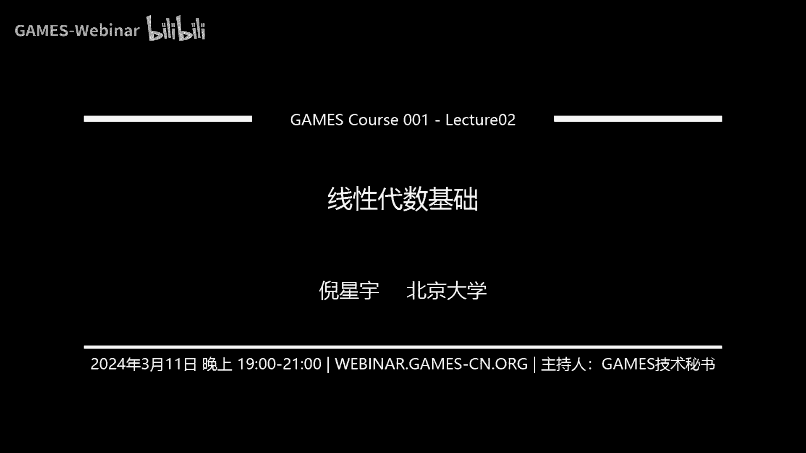
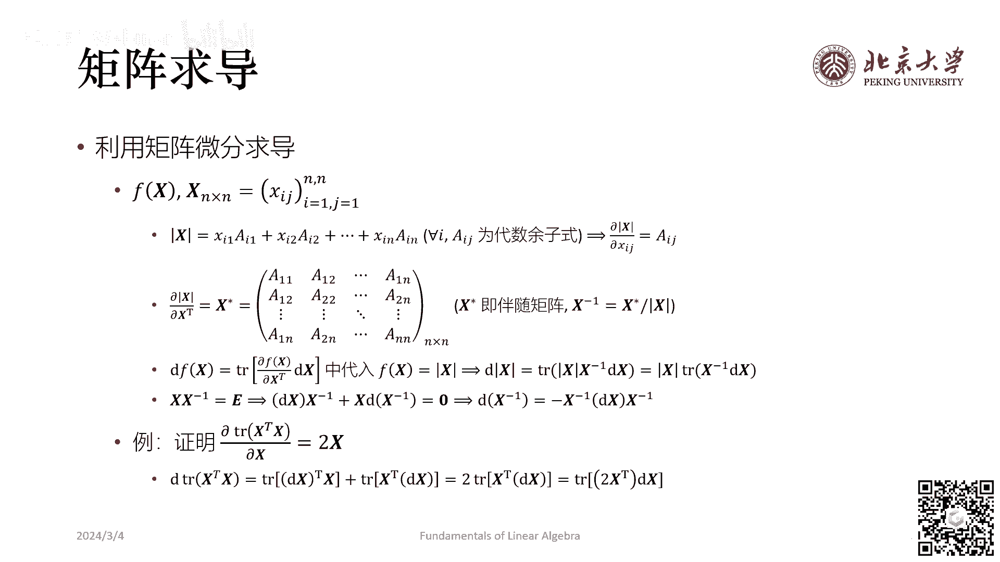

# 📘 GAMES001-图形学中的数学 - P2：线性代数基础（二）

在本节课中，我们将继续学习图形学中至关重要的线性代数知识。我们将重点探讨矩阵分解、矩阵范数、矩阵求导以及张量的初步概念。这些内容是理解图形学算法和进行相关科研工作的数学基石。

---

## 🔍 课前说明与课程定位

首先，纠正上节课的一个口误：正交变换中的“正”指的是正规或正交，不宜理解为正定。

本课程的目标并非详尽讲解每一门数学课，而是提纲挈领地介绍图形学涉及的核心数学概念。当大家在后续学习或工作中需要深入时，可以此课程为索引，去查阅更系统的资料。课程内容可能较快，但旨在建立整体认识。

GAMES课程是共创性质的，欢迎大家提出改进建议。关于GAMES002课程（图形学工具与环境配置），它旨在帮助大家快速上手图形学开发中繁杂的环境配置问题，推荐的工具和代码均以跨平台为宗旨。

---

## 🧩 矩阵分解

上一节我们介绍了矩阵的基本运算，本节中我们来看看图形学中常用的几种矩阵分解方式。

### PLU分解

PLU分解是指将一个矩阵分解为三个矩阵的乘积：**P**（置换矩阵）、**L**（下三角矩阵）和**U**（上三角矩阵）。其形式为：
\[
A = P L U
\]
如果不进行行交换操作，则称为LU分解（\(A = L U\)）。该分解本质上等价于高斯消元法。

以下是PLU分解的一个计算示例：
给定矩阵 \(A = \begin{bmatrix} 9 & 6 & 0 \\ 6 & 5 & 4 \\ 3 & 4 & 10 \end{bmatrix}\)，通过一系列行变换（相当于左乘一系列下三角矩阵 \(E_i\)），最终可以得到 \(U = E_n ... E_1 A\)，从而 \(A = (E_n ... E_1)^{-1} U = L U\)。若涉及行交换，则引入置换矩阵 \(P\)。

### 乔里斯基分解

乔里斯基分解要求矩阵是实对称正定矩阵，并将其分解为一个下三角矩阵与其转置的乘积：
\[
A = L L^T
\]
其中 \(L\) 是下三角矩阵。与LU分解形式类似，但上下三角矩阵互为转置。其求解复杂度（\(O(n^2)\)）低于LU分解（\(O(n^3)\)），常用于求解稠密线性系统。

**应用示例**：求解方程 \(A x = b\)。将 \(A\) 替换为 \(L L^T\)，则先解 \(L y = b\)，再解 \(L^T x = y\)。

### QR分解

QR分解对矩阵的要求较低（列满秩即可），将一个 \(m \times n\) 矩阵分解为一个正交矩阵 **Q** 和一个上三角矩阵 **R** 的乘积：
\[
A = Q R
\]
当 \(m > n\) 时，\(R\) 的下半部分为零矩阵。计算方法包括施密特正交化、吉文斯变换或豪斯霍尔德变换。

**在图形学中的应用**：在软体仿真中，形变梯度 \(F\) 常被分解为旋转部分 \(R\)（对应 \(Q\)）和形变部分 \(S\)（对应 \(R\)），即 \(F = R S\)。

以下是使用施密特正交化进行QR分解的简要步骤：
给定矩阵 \(A = \begin{bmatrix} 1 & 2 & 2 \\ 2 & 1 & 2 \\ 1 & 2 & 1 \end{bmatrix}\)。
1.  对列向量进行施密特正交化，得到一组正交基。
2.  将该组正交基单位化，得到正交矩阵 \(Q\)。
3.  \(R\) 矩阵由正交化过程中的系数构成，\(R = Q^T A\)。

### 奇异值分解

奇异值分解是极其重要的分解，适用于任意矩阵，将其分解为三个矩阵的乘积：
\[
A = U \Sigma V^T
\]
其中 \(U\) 和 \(V\) 是正交矩阵（旋转），\(\Sigma\) 是对角矩阵（缩放），其对角线元素称为奇异值，均为非负实数。

**几何意义**：SVD将任意线性变换分解为“旋转-缩放-旋转”三个步骤。

**奇异值与特征值的关系**：对于实对称正定矩阵 \(A\)，其特征值与奇异值重合。更一般地，矩阵 \(A\) 的奇异值是 \(A^T A\) 特征值的平方根。

---

## 📏 矩阵范数

为了度量矩阵的“大小”，我们需要定义矩阵范数。首先从向量范数出发。

### 向量范数

向量范数是对向量长度的度量，需满足正定性、齐次性和三角不等式。常见的向量范数有：
*   **L0范数**：向量中非零元素的个数。注意，它不满足范数的齐次性，严格来说不是范数。
*   **L1范数**：\(\|x\|_1 = \sum_i |x_i|\)
*   **L2范数（欧几里得范数）**：\(\|x\|_2 = \sqrt{\sum_i x_i^2}\)
*   **L∞范数**：\(\|x\|_\infty = \max_i |x_i|\)

### 矩阵范数

矩阵范数是矩阵“大小”的度量。一种重要的定义方式是**诱导范数**（由向量范数诱导而来）：
\[
\|A\|_p = \max_{x \ne 0} \frac{\|A x\|_p}{\|x\|_p}
\]
其几何意义是矩阵 \(A\) 作为线性变换时，对向量模长的最大放大倍数。

常见的诱导矩阵范数：
*   **诱导L1范数**：列和范数，\(\|A\|_1 = \max_j \sum_i |a_{ij}|\)
*   **诱导L2范数**：谱范数，等于 \(A\) 的最大奇异值，\(\|A\|_2 = \sigma_{\max}(A)\)
*   **诱导L∞范数**：行和范数，\(\|A\|_\infty = \max_i \sum_j |a_{ij}|\)

此外，还有基于矩阵元素的**元素形式范数**（如Frobenius范数 \(\|A\|_F = \sqrt{\sum_{i,j} a_{ij}^2}\)）和基于奇异值的**Schatten范数**。

---

## 🧮 矩阵求导

矩阵求导在图形学中应用广泛，例如在伴随方法中求导，或在软体仿真中由弹性势能求应力张量。

### 布局约定

矩阵求导有两种常见布局：**分子布局**和**分母布局**，其结果矩阵的形状不同。核心规则是：**谁转置了，就不是谁的布局**。必须始终保持使用同一种布局，以保证矩阵乘法的相容性。

### 标量函数对向量/矩阵的求导

对于一个实值标量函数 \(f(x)\)，其中 \(x\) 是向量或矩阵，其导数（梯度）是一个与 \(x\) 同型的向量或矩阵，每个元素是 \(f\) 对 \(x\) 中对应元素的偏导。

**常用公式（向量情形）**：
1.  \(\frac{\partial (a^T x)}{\partial x} = a\)，\(\frac{\partial (x^T a)}{\partial x} = a\)
2.  \(\frac{\partial (x^T x)}{\partial x} = 2x\)
3.  \(\frac{\partial (x^T A x)}{\partial x} = (A + A^T)x\)

**常用公式（矩阵情形）**：
1.  \(\frac{\partial (a^T X b)}{\partial X} = a b^T\)
2.  \(\frac{\partial (a^T X^T b)}{\partial X} = b a^T\)

### 利用微分求导

一个实用的技巧是利用矩阵微分来求导。对于实值标量函数 \(f(X)\)，若有：
\[
df = \text{tr}(A^T dX)
\]
则 \(\frac{\partial f}{\partial X} = A\)。这提供了一种相对简便的计算偏导的方法。

**应用示例：最小二乘法**
求解超定方程 \(A x \approx b\) 的最小二乘解，即最小化 \(\|A x - b\|_2^2\)。令目标函数 \(f(x) = (A x - b)^T (A x - b)\)，令其梯度为零：
\[
\frac{\partial f}{\partial x} = 2A^T A x - 2A^T b = 0
\]
解得 \(x = (A^T A)^{-1} A^T b\)。矩阵 \((A^T A)^{-1} A^T\) 称为 \(A\) 的伪逆。

---

## 🧱 张量初步

张量是比矩阵更本质的数学对象，它明确包含了基底信息，能更清晰地描述线性空间和运算。

### 向量的积

*   **内积（点积）**：\(a \cdot b = a^T b\)，结果为标量。
*   **叉积**：\(a \times b\)，结果为向量，方向垂直于 \(a\) 和 \(b\)，遵循右手定则。可用行列式或反对称矩阵表示：\(a \times b = [a]_\times b\)，其中 \([a]_\times\) 是由 \(a\) 的分量构成的反对称矩阵。
*   **外积**：\(a \otimes b = a b^T\)，结果为矩阵。

### 张量的基本概念

*   **协变与逆变**：这是针对张量**分量**而言的。当基底（协变基底）的模长增大时，其对应的分量（逆变分量）会减小；反之，与对偶基底（逆变基底）点乘得到的分量（协变分量）会增大。
*   **度规张量**：协变基底之间的内积 \(g_{ij} = e_i \cdot e_j\)。它建立了协变分量与逆变分量之间的联系：\(x_i = g_{ij} x^j\)。
*   **爱因斯坦求和约定**：省略求和符号 \(\sum\)，约定重复指标（一上一下）即表示求和。

### 张量的运算

*   **并积**：将两个张量直接相乘，得到高阶张量。例如，向量 \(x\) 和 \(y\) 的并积：\(T = x \otimes y\)，分量 \(T^{ij} = x^i y^j\)。
*   **缩并**：对一对协变和逆变指标求和，使张量阶数降低。例如，矩阵的迹就是对其行指标和列指标的缩并：\(\text{tr}(A) = A^i_{\, i}\)。
*   **点积**：先进行并积，再进行缩并。根据缩并的指标对不同，有单点积、双点积等。

**在图形学中的应用**：张量提供了一种统一且清晰的记号系统。图形学论文中常出现的“张量”（如柯西应力张量、度规张量）大多是二阶张量，本质上对应一个矩阵，但强调了其分量对基底的依赖性。利用张量记号（如爱因斯坦求和约定）可以简便地证明许多向量恒等式。

---

## 📚 课程总结与资源推荐

本节课我们一起学习了图形学中线性代数的进阶内容，包括：
1.  **矩阵分解**：PLU分解、乔里斯基分解、QR分解和奇异值分解的原理与应用。
2.  **矩阵范数**：向量范数与矩阵范数的定义，以及诱导范数等重要概念。
3.  **矩阵求导**：布局约定、基本公式以及利用微分求导的技巧，并了解了其在最小二乘等问题中的应用。
4.  **张量初步**：协变与逆变、度规张量、并积与缩并等基本概念，认识到张量是更本质的数学表达工具。

**推荐资源**：
*   **教科书**：《线性代数应该这样学》、《Matrix Cookbook》（矩阵求导工具书）、《矩阵分析与应用》、《张量分析》、《物理几何学导论》。
*   **网站**：[3Blue1Brown](https://www.3blue1brown.com/)（线性代数可视化），[Matrix Calculus](http://www.matrixcalculus.org/)（矩阵求导在线计算）。

希望本课程能作为大家学习图形学数学的路线图，在需要时能按图索骥，深入探究。

---