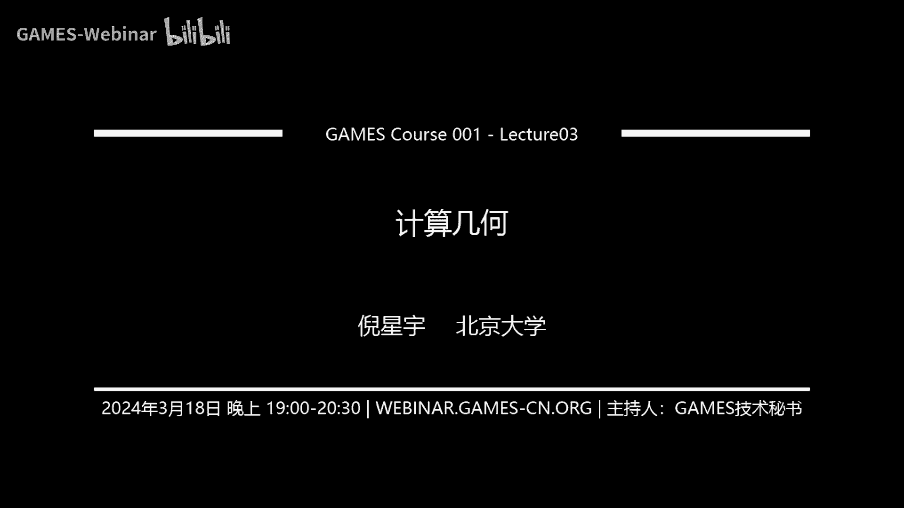

# GAMES001-图形学中的数学 - P3：计算几何 - GAMES-Webinar - BV1MF4m1V7e3

## 计算几何概述

在本节课中，我们将学习计算几何的基本概念和算法，包括点、线、面、多边形、凸包等，以及它们之间的关系和计算方法。

## 坐标系

### 坐标系定义

坐标系是由原点和坐标轴构成的，用于表示几何图形的位置和方向。

### 笛卡尔坐标系

笛卡尔坐标系是一种常用的坐标系，其坐标轴相互垂直，且长度相等。

### 右手系和左手系

右手系和左手系是两种不同的坐标系方向，用于确定坐标轴的方向。

## 点、线、面

### 点

点可以用坐标表示，也可以用向量表示。

### 线

线可以用参数方程表示，也可以用向量表示。

### 面面

面可以用隐式方程表示，也可以用参数方程表示。

## 点线面之间的关系

### 点与直线的距离

点与直线的距离可以用点到直线的向量与直线的方向向量的叉乘除以直线的方向向量的模长来计算。

### 点与面的距离

点与面的距离可以用点到平面的向量与平面的法向量的点乘除以平面的法向量的模长来计算。

### 线与线的位置关系

线与线的位置关系可以用线向量的叉乘或点乘来判断。

## 多边形

### 多边形周长

多边形周长是所有边长之和。

### 多边形面积

多边形面积可以用叉乘法或投影法计算。

## 凸包

### 凸包定义

凸包是包含给定点的最小的凸多边形。

### 凸包计算

凸包可以用扫描法或增量法计算。

## 最小圆覆盖

### 最小圆覆盖定义

最小圆覆盖是包围给定点的最小圆。

### 最小圆覆盖计算

最小圆覆盖可以用暴力法或随机增量法计算。

## 总结

本节课介绍了计算几何的基本概念和算法，包括点、线、面、多边形、凸包等，以及它们之间的关系和计算方法。这些知识对于图形学中的几何计算非常重要。