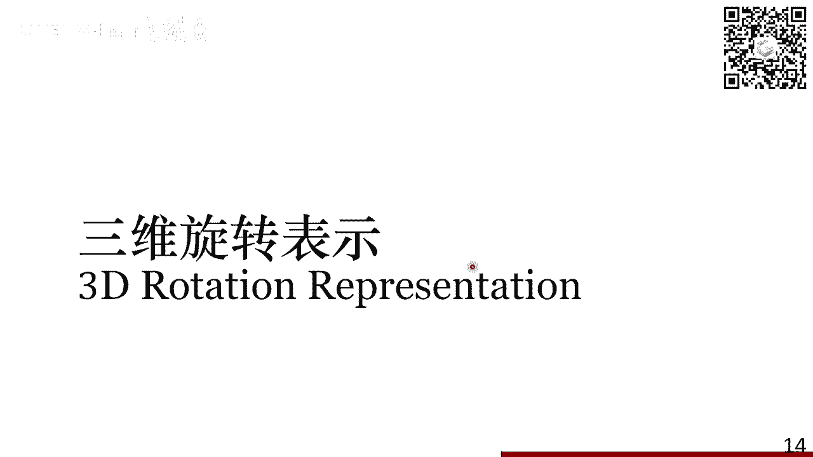
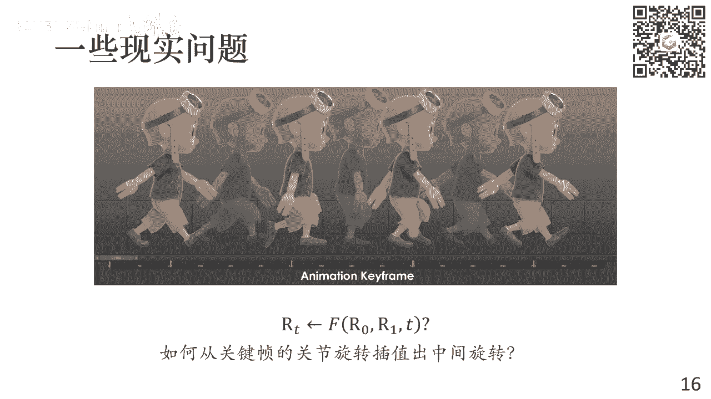
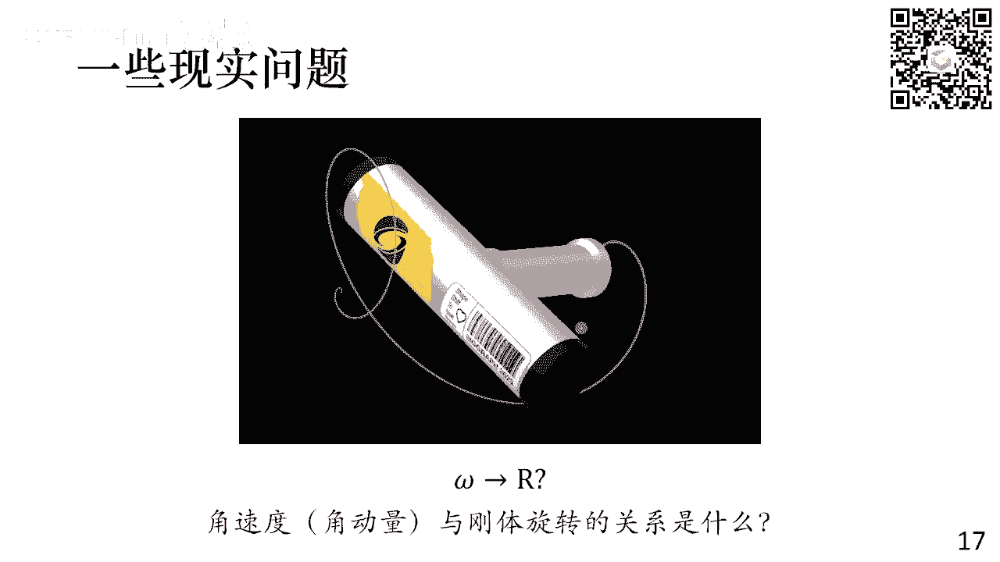
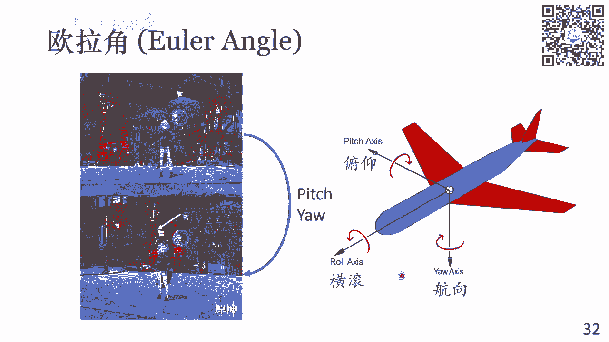
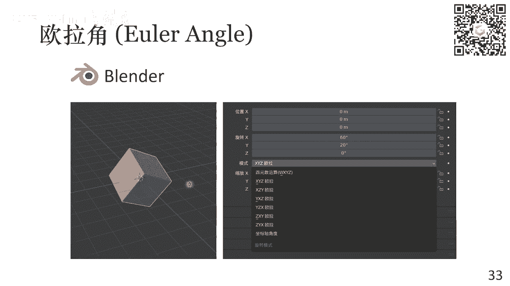
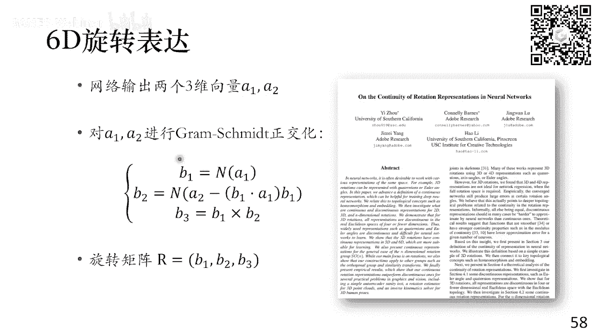
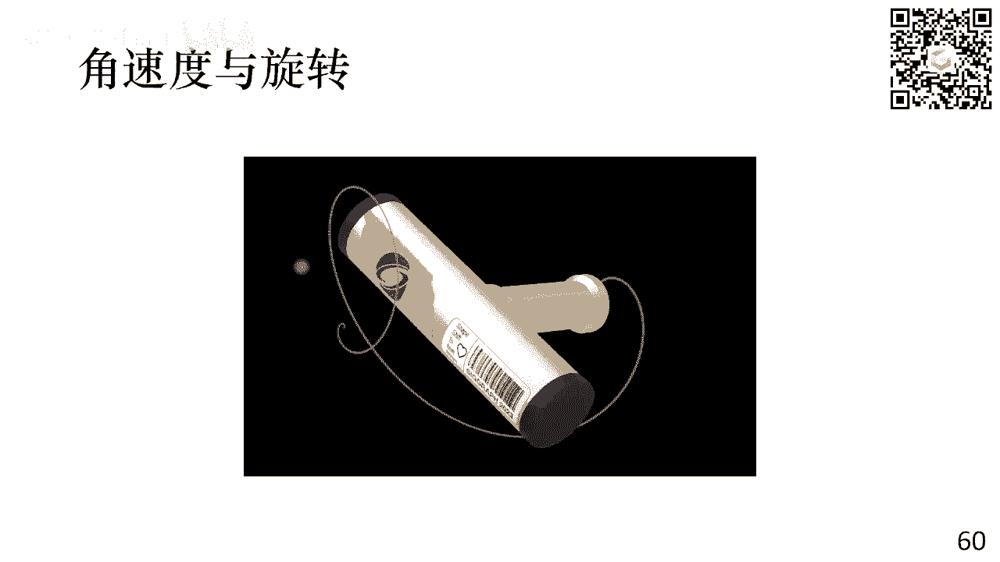
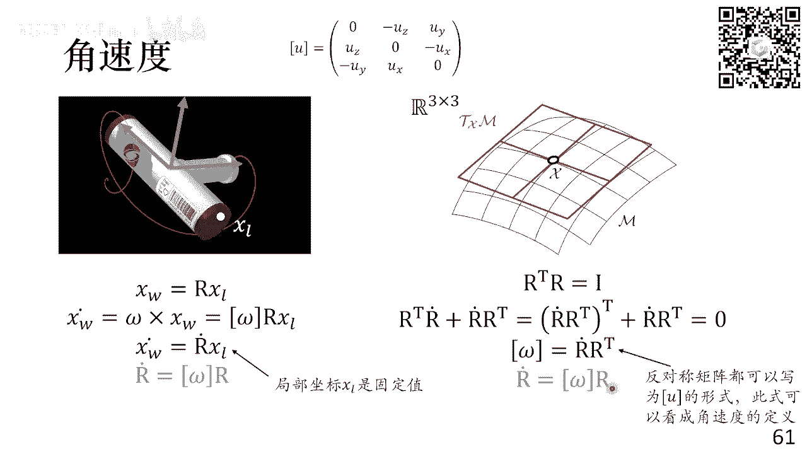
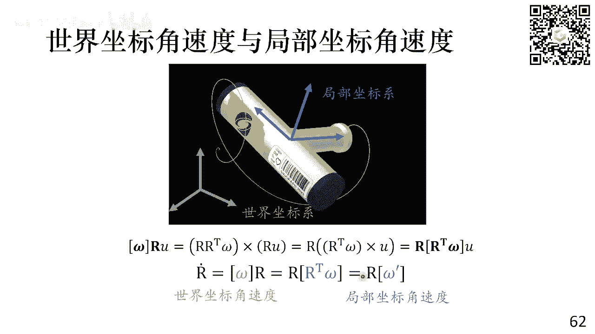

# GAMES001-图形学中的数学 - P4：旋转变换 - GAMES-Webinar - BV1MF4m1V7e3

然后跟大家打个招呼啊，这个声音还是有点小嘛，那我说话声音大一点好吧，就是给大家打个招呼，就是我是凝聚另外的另一名，这个叫这个呃助教了，然后我叫阮良旺，然后现在是博士3年级，研究的方向跟新语是一样的。

也是物理模拟，然后呢今天这节课是我开始讲，然后我之后的呃四节课应该都是我，OK那我就把这个我把我自己关了，然后把这个PPT放出来，大家能现在看到PPT吗，可以是吧，OKOKOKOK那好。

那今天就给大家介绍一个旋转方面的知识，然后呢，然后呢就是我们这个课程大纲在这个地方，然后前面两节这个线性代数，基础和计算几何是新语讲的，后面的这个从宣传变化开始的，这个四节课都是我来讲，我连着讲四周。

然后再是新语，后面再去讲，然后后面的分的话，我们在之后再给大家说，呃，那我就直接这个进入正题啊，这个旋转变换呢，大家在之前讲这个线性代数的时候，其实已经接触到了。

就是比如说我们这地方给一个非常简单的例子，就是我们绕X轴旋转30度，那么这个就是这个模型上它有个P点，它的坐标经过这个旋转变换之后呢，就会变到这个PP这个PP和P之间的关系。

就是可以写成一个矩阵乘法的关系，中间这个矩阵呢就是这个旋转矩阵对吧，然后他跟角度的关系，大家可以很直观的看到，就是这个地方有cos sin，这个应该是之前已经介绍过的对吧，这个应该没什么问题。

那么下面给大家看一个现象，就这个现象它非常有意思，他是这个NASA在空间站里拍的，就是有这么一个一个T字形的这个扳手，你把它拿出来，这边转的话啊，它会有一些非常有意思的运动。

那么这个时候你看这些旋转的话，看这个扳手的这个旋转，它跟我们刚才描述那种简单旋转，它就有本质区别，它是这个一个非常复杂的，它是没有定轴的一个旋转，那么我们如何去model这样的旋转。

其实就是我们今天讨论的这个主要的问题，就是如何去表示它，然后去如何去分析这个旋转本身，对我看到同学已经马上知道，这个是这个中间轴定理，说明这个物理基础非常不错，但是我们今天不讲物理。

那我们从这个呃旋转矩阵出发，就是我们说旋转是一个线性变换，那我们看一个一般的旋转，它应该满足一个什么样的要求呢，就是假设我们给定一个任意的，一般的三维的线性变换，这个P撇等于A乘以P。

那么旋转它有个特性，就是你一个物体发生旋转呢，它是一个刚性的变化，那么物体的任意两点之间的距离，是不应该发生改变的，那换算公式就是说，这个P1撇和P1撇之间的距离，在发生旋转之后。

他应该是和这个PQ是一样的，那么我们可以把它写为下面这个关系，就是把这个模长把它变成两个这个向量节点乘，它可以变成下面这样一个式子，这个式子呢它应该是对于任意的这个点，P和点Q都成立的。

就是我在这个模型上随便选两个点，它都是对的，那么很明显，这个式子呢，它是一个关于这个A转置乘以A的一个，然后我把这个激光笔调出，他应该是这个意，你能跑哪去才算呃，他应该是一个A转置乘以A的一个线性方程。

那么这个线性方程呢，它只有这个A转置乘以A，一共是我们算他这个对称矩阵一共六个未知数，但是呢这个细减Q它是无穷多对的，那么这个线性矩阵它成立的话，那么唯一的条件这个A转置A它是一个正，它是一个单位矩阵。

它是个I，那么你对于任意的这个P和Q，上面这个式子成立，那么对于A这个关系来说的话，那也就是说A它是一个正交矩阵，那我们可以干些什么事呢，我们可以干些这样的事情，就是我随机采样一些正交矩阵。

然后把它作用到这个模型上，然后你就会看到我们生成的这些变化呢，其实看起来真的就是各种各样的一个，自由的旋转，但是呢不是所有的选啊，不是所有的正交矩阵，它表示的都是旋转变换，比如说我们这地方举个例子。

就是我只有一个兔子，把它呢沿着这个Y轴这么转，但是呢底下这个兔子，这个兔子呢它在上面是有本质区别的，为什么呢，是下面这个兔子，它无论怎么转，你都不可能转到下面这个兔子这个样子。

大家可以在这个脑子里大概想象一下，就这个兔子它转一圈，它是不会出现下面这种情况的，但是呢下面，但是但是这两个兔子它都是同一个兔子，它们唯一的区别是什么呢，唯一的区别实际上是上面和兔子。

和下面的兔子实际是一个镜像的关系，就是它们之间有一个反射，如果我们线性变换写出来的话，就是对于一个兔子来说，我们可以把它的这个Z轴给它乘一个一，那么这个A矩阵呢它就是一个反射变换。

这个反射变换呢它同样是一个正交矩阵，你可以验证这个A乘以A转置，它是一个单位矩阵，但是呢它是永远无法通过旋转得到这个结果，所以说我们最终可以得出这样一个结论，就是说能够表示旋转的这些矩阵。

它实际上是这个啊特征值为正一的正交矩阵，我们这里必须强调它的特征值是正是正一的，如果是一的话，代表就是有反射的成分，那么所有的特征值为正一的N为正交矩阵，它的集合就称为这个特殊正交群，也就是这个SON。

大家可能在这个呃，在不同的地方看到过这个这个词，就是这个SON代表旋转变换，那么这个地方它的含义其实它就是字面意思，就是这个special osaka group，OSAKA代表这个矩阵是正交矩阵。

special代表它的特征值是正一，然后里面这个N代表的就是它的这个位数，那么所以二维旋转矩阵的集合就是这个S2，三维旋转矩阵的集合就是S3，那么我们说这个旋转矩阵它是一个群，就是成为这个特殊正交群。

那他自然就要满足这个群的一些特征群，它这个地方就是我们其实没必要去啊，非常数学的定义一个群是什么东西，但大家可以有个基本的概念，就是说群里的这些元素，它如果进行这些啊运算的时候。

他得到的这个元素最终还是在这个群里的，所以它对运算是封闭的，那么反应到这个旋转上来说的话，就是说我们有任意两个旋转矩阵，它相同之后呢，得到的结果依然是一个旋转，这个也很容易理解。

就是说两个正交矩阵相乘的话，他一定也出来是一个正交矩阵，并且它的特征值是一样的啊，特征值都是一，然后并且它除了满足这个相乘之后还是旋转，它还满足这个结合律，就是我任意去交换这个结合的顺序。

我可以先R0乘以R1，然后再整体乘以R2，也可以先R0再乘以这个R1和二的整体，所以它是满足这个结合律的，这是旋转的第一条性质，那么旋转的第二性质是说旋转是可逆的，对于任意一个旋转R它代表一个旋转变换。

那么它的逆变换旋转矩阵乘转置，这个是由这个旋转的正交矩阵的性质来保证的，那么如果我有一个左边这个模型，它通过一个R旋转变到右边之后，我就可以通过一个R转置，把它从右边变到左边来，但是呢旋转它有一个三啊。

它有一个比较奇怪的地方，这里注意这里我们强调的是三维旋转，对于二维旋转的话，就是你就在二维二维里面，你先转十度，然后再转20度，和你先转20度再转十度，它结果是一样的，在这三维里面呢。

由于你这个旋转它是还有一个旋转轴的概念，比如说我们这里可以举个例子，一个非常直观的例子对吧，我们这里啊有一个模型对吧，我先把它沿X轴转90度对吧，它会变成这个样子，然后呢我再沿Y轴转90度。

它就会变成这样一个头朝上，然后四只脚朝右的这样一个朝向，那如果对于同样的一个模型，我先沿Y轴先这个沿Y轴转90度，它会先改成一个朝向，然后再转，再沿X轴转90度呢，它就会躺下。

这个时候你会发现他这个四个角是朝左的，所以说三维旋转它是不满足这个交换率的特征，那好那我们现在知道这个旋转，它到底是个什么东西，这对应的是一个特征值为一的正交矩阵，那我们接下来的问题就是说。

我们如何去表示一个三维的一个旋转，这个东西，它对于图形来学来说，是一个非常重要的一个课题。

比如说我们可以举一些例子，假如啊假如我们在这个游戏里面对吧，我们要这个操作鼠标去移动这个镜头，那么你鼠标在这个屏幕上，它的这个移动轨迹是一个二维的东西，就是它只有这个X方向和Y方向这个位移，然后呢。

但是你这个旋转矩阵我刚才说了，他是个矩阵，它是个3×3的东西，那你鼠标的这个操作，它是如何映射到最后的旋转矩阵的变化，也就是说我如何去通过这个鼠标去控制，这个相机的一个朝向，再比如说在这个角色动画里。

我们有一系列的这个我们称之为关键帧动画，什么意思啊，就是说对于一个完整的人体运动的，一个序列来说，它里面会有非常非常多的针，但是在艺术家创作的时候呢，我往往只会指定他中间的几帧关键帧，来表示这个人物。

如果必须他在这个时刻达到这个动作，然后这中间的所有这些动作，其实都是通过差值来插值出来的，那么对于人体决赛而言的话，他的这个呃各个关节之间的这个表示，就是这个各个关节之间差的就是一个旋转变换。

那么我如何去在这个关键帧的关节旋转之中，差值出了这个角色之间的这个中间的这个旋转。

以及再比如说我们回到这个开头展示的，这个例子，就是这个T字形的扳手在这里转，那么我们在物理上去描述一个物体旋转的时候，那么自然啊去建立它的方程的时候，使用的其实是角速度，也就是这个啊也就是角动量对吧。

我们是用角动量角速度来建立方程的，但是最终呢，我们是要回到这个物体的这个坐标上来，回到它的呃，这个旋转矩阵本身，我才能把这个物体给它渲染出来，假如我们要模拟这样一个东西。

那么这个角速度与刚体旋转之间的关系。

到底是什么，这个也是值得研究的，然后再比如说呃现在这个神经网络对吧，是一个非常强大的一个工具，那么我们如果再用神经网络去解决一些，这个跟三维旋转有关的这些任务的时候。

比如说我要去估计一个物体的一个未知啊，或者去生成一些角色的动作，那么这个时候呢，我就不可避免的需要网络去输出一些呃，旋转矩阵，那么这个网络它如何去输出这些矩阵，这些问题他们合在一起呢。

其实就是本质上就是我要去研究，如何我在计算机里去表示这个旋转矩阵，表示旋转本身，然后再用这个参数化这个事情，参数化之后的这个旋转去完成我想要的任务，就是那么在具体啊，对我可以这地方稍微停一下。

就是关于这个前面这部分介绍的内容，大家这个有什么问题吗，有问题可以在弹幕里直接打出来，应该还是就大家比较熟悉吧，如果没有的话，可以直接回一个没有，这样我们就不用浪费时间，就是在今天这个直播。

因为我们是直播课嘛，所以就是说大家如果中间有问题的话，就是可以随时的这个在这个弹幕里面反馈出来，OK我看到有人说没有行，没问题，OK那我们在旋转啊，我们在描述我们在讲这个旋转啊，表示之前。

我们先啊需要研究位置，就是旋转它的自由度是多的，因为我们只有知道这个旋转的自由度，个数之后呢，我才能去这个啊对旋转，就我知道我应该用多少个参数去对旋转进行，这个啊进行这个描述对吧，那么对于二维情况来说。

就是左边这个图它非常简单，就是二维旋转的话，我只需要用一个角度就可以描述描述对吧，正的就是它是一个，比如说我这个图里面画的正的话，它就是一个顺时针旋转，E的话，负C大小于零的话，它就是一个逆时针旋转。

然后C2的大小代表他这个啊旋转的这个啊，这个角度大小对吧，那三维情况呢，三维情况，如果我们根据这个旋转本身的定义来说的话，那就对于一个旋转来说，我首先定义一个旋转轴对吧，我绕哪个轴进行旋转。

这个旋转轴U它是一个属于一个三维向量，但是呢我们会给这个三维向量加一个约束，就这个U它的模长应该是一对吧，因为呢如果我因为这个U本身，我它只有它的方向有用，它的大小其实是没有用的。

真正描述这个旋转的大小是这个西塔对吧，它是还有额外的一个参数，所以总共来说的话，三维旋转它的自由度应该是3-1，然后再加上C它的一，所以是三，那么我们可以换一个角度去理解这个问题。

就是对于二维旋转来说的话，我们都说旋转是旋转矩阵对吧，然后呢对于二维旋转也好，三维旋转也好，它都是一个特征值为一的一个正交矩阵，那如果比如说我们以二维为例，那么二维的话，它满足这个条件。

就是这个R转置乘以R等于一个identity matrix，等于一个单位矩阵，那给他写开的话，它对应的其实只有三个方程，为什么只有三个呢，因为这个R转至R，它本身一定是一个对称的矩阵。

那么它啊这个不相干的这个自由度的个数，那只有它的这个对角元素两个，再加上一个啊，这个啊非得教育对吧，所以是2+1=3，那写出来呢就对应的是这个这个方，右边展示的这个方程，就是你对角元素上应该是一。

然后非调到元素上应该是零，所以说RT乘以R等于I，它其实对应的是三个方程，那R本身作为一个22的一个矩阵，那么它是一个四个自由度，所以它剩下的自由度呢就是34-3=1，对吧，对于三维形状而言的话。

这个故事是类似的，3号选项的话，R是一个33的矩阵对吧，那RT乘以R等于I的话，对应的是几个方程，还是一样对吧，对角线三个方程，然后呢剩下六个，由于你是对称矩阵，所以我只有三个是独立的。

所以是3+3=6，所以也是啊，所以所以是六个六个方程，那么一样的，我们可以算93×3，等于九九个自由度，减去六六个约束，那剩下的就是三个自由度，所以跟刚才计算的结果一样，二维旋转的话它是一个自由度。

三维旋转的话它是三个自由度，那么呃介绍完自由度的时候，我们可以引入一个稍微抽象一点的概念，就是个流行的概念啊，我们今天肯定是不会在数学上给大家严格定义，流行是什么东西，我引入流行。

只是为了大家一个直观上的一个想象，就是说想象我们研究的这个旋转，它在空间中到底是一个怎样的分布，那么流行是一个什么东西呢，我们可以举一些简单的例子啊，比如说左边这个这不画一个圆对吧。

因为这个圆我们称之为它，就是一个二维空间中的一维流形，首先它是为什么是二维空间呢，因为我是在这个平面上画的对吧，那为什么它是一维流形，因为对于这个圆来说，不考虑它的理念，我只考虑这个圆的边界。

它其实在局部的地方，处处它都是近似于一个一个线段对吧，那么一个线段的话，它就是一个一维的东西，所以这个圆它就可以认为是一个，二维空间中的一位六级，然后下面这个例子呢，这个是一个什么东西。

这是一个克莱因瓶对吧，克莱因瓶我称之为是三维空间中的二维流形，那首先还是一样，为什么它是三维空间呢，因为我这个东西是一个三维的模型对吧，我是把它画在三维空间里的，那为什么说它是二维流行，就是还是一样。

你去看这个特莱因瓶的每个局部，你假设你离他非常近的话，你在局部来看的话，它其实还是一个平面，对吧，它本质上不是一个三维有实体的东西，它本质上还是一个平面这种曲面组合成的东西。

所以它是一个三维空间中的二维游戏，所以流行是什么东西，大家可以用这个这两个例子，获得一个直观的一个一个理解，它其实就是说的就是说它局部来看的话，它其实是一个低维的东西，但是呢你没有办法把它展开展。

形成一个啊一个一维的东西，比如说这个圆，他没有办法把它展开成我就是一维的一条线，它是不行的，因为它是一个首尾相接的圆嘛，它只有在二维空间里面，我才把它画了出来，所以这就是流行。

那么为什么介绍流行这个概念呢，其实是跟刚才介绍这个自由度的概念，相联系起来，那么对于一个任意的一个啊，所有的旋转我可以这样想象啊，比如说二维情况下，每一个旋转它都是一个2×2的矩阵，对不对。

那假设我整个空间都是一个整个空间，就是一个四维的空间，假空间就是四维空间，空间中的每一个点代表其实是一个矩阵，比如说我在这个矩阵，在这空间里面随机踩一个点，那么这个点拿出来。

它对应的就是一个2×2的矩阵，那个2×2矩阵表示，就是一个任意的一个线性变换，那么旋转是什么，所有的旋转在这个空间中它会是一个一维流行，为什么是一维呢，就是我们已经说过了，这个旋转二维空间中的旋转。

它的自由度是一代表，只有啊，这我只能动一个啊，一个自由度去改变不同的旋转，那对于二维空间中，这个自由度是什么，就是它的角度对吧，所以所有的旋转，在这个空间中会组合成一条一条曲线，这个曲线长什么样子。

我们其实不用管，我暂时不用管它，我们就认为它是一条曲线，然后我在这个曲线上采样的话，任意采样一个点，它都是一个旋转变换，然后并且呢在这个点附近，就是曲线上相邻的点接近的点，它在空间中。

它最终表示这个旋转变换它也是接近的，就它这个东西是一个连续的，所以这是一个二维的一个旋转的它的一个途径，那么对于三维旋转这个情景就会复杂一些对吧，首先三维的话大家知道三维旋转是什么，是3×3的矩阵对吧。

所以是一个久违的一个空间，然后呢三维旋转的自由度是多大呢，是三对吧，所以就是一个对应的三维流行，大家应该是，就是我觉得应该是没有同学能够想象出来，一个九维空间中的一个三维流行。

它对应的会是一个什么样的东西对吧，就我们能想到的可能还是只有这个一维流行，二维流行，最多三维流行，但是九维空间中的三维逻辑可能就有点难了，那么为什么去哦对呃，然后呢引入这个流行这个概念之后呢。

我们对于这个呃旋转，它其实有一个啊更精确的一个描述，就是说旋转首先它是群对吧，我们刚才已经说了，它是一个叫这个啊特殊正交群的一个东西，那同时呢我们这里又介绍说旋转，它所有的旋转是组合成一个流行的。

那么如果一个东西它既是群，然后他同时又是一个流行的话，我们就称之为这个东西叫群，大家可能在其他的地方，比如说一些机器人的一些教材里面看到的，就是用李群，李代数这些东西去描述去推导这个旋转的概念。

它其实就是从呃从这里来，就是前线上去理解的话，是从这里来的，OK这里有问题吗，大家，啊行看起来没有问题，那我就继续对我们引入这个旋转的这个概，我们引入流行的这个概念是为什么呢。

是我们其实可以在这个比如流行概念之后呢，对很多东西有一些直观上的理解，比如说我们刚才提到了，说在这个关键帧动画里面会有旋转的差值对吧，那么旋转差值这个事情，为什么是一个是一个难的东西呢。

因为如果我比如说我直接啊用旋转矩阵，用3×3的矩阵去表示旋转的话，我直接在这里面做线性插值，它会出问题，问题是什么，是你中间比如说我直接做线性插值，插这个插出来一个RT。

这个RT它其实不一定在这个流行上的，假设我的这个流行是一个，比如说类似一个甜甜圈的一个东西，我现在不管它这个形状是什么，反正他一定是个曲面，那么我随便选两个点去做线性差值的话，那么中间插出来这个点。

它就不一定在这个流行上，那于是呢，这个点它代表的就不一定是个旋转变换对吧，那所以你直接做线性插值的话，叉出来一定会是奇怪的东西，比如这个地方上面这条线，你画的就是它可能会先变小，然后变拉伸。

然后再慢慢的回到这个右边的这个R1的状态，那我真正要做的是什么，我要做的是在这个流行里面，找到一条合理的路径，然后在这个路径上选一个点进行插值对吧，我最终要找的应该是一个RT这样的一个点，它在流行上。

然后同时呢，它在R0和R1连接的这个曲线上对吧，并且呢大家可以想象出，这个曲线应该是应该是最短，越短越好，因为如果短的话，代表我这两个之间的这个走的这个路径是啊，走这个他们之间这个差别也是最小的。

那自然是这个时候我插值过去，它应该是一个啊最合理的一个动词，所以这个是旋转差值，如果我用流行视角去看这个旋转差值的话，它会有这样一个结，它同时它有助于我们去了解这个角速度的概念。

在比如说呃在正常的这个O极地的空间里面，我们有一条轨迹，这个点在这条轨迹上运动，那么它的这个每个点的速度，我要求他的话，我只需要把它说的这个位移X拿出来，这个时间求个导数，它对应的就是速度对吧。

位移它是一个三维的向量，速度也是一个三维的向量，但是对于旋转来说的话，旋转它是一个3×3的矩阵，我如果对于这个3×3的矩阵直接求导的话，他求出来也会是一个3×3的一个东西吧。

但是角速度呢大家如果这个啊有了解的话，角速度应该是一个三维的一个矢量对吧，它不是一个3×3的矩阵，所以你欧米伽和欧米伽角速度和这个矩阵求导，它们之间肯定不是一个直接相等的关系，但是呢什么东西是三维的呢。

我们刚才说了，这个旋转它组成的这个流行是三维的，但于是我在这个任意这个流行上一点，选择它的这个切空间，这个切空间实际上是三维的一个东西，那么角速度与旋转之间到底是什么关系。

这个角度其实就是这个切空间上的一个矢量，对吧，它本身是三维的，但是这个旋转它是一个manifold，它是在九维里面，再比如说我们今天要讲这个旋转的表示问题，那么其实对应一个什么样的问题。

对应一个流行的参数化问题，就是我有一个任意的一个流行，比如长得奇奇怪怪的，我要把它这个比如说我给他贴上贴图对吧，如果大家这个学习这个games101的话，我给他贴上贴图。

那我自然知道每个点的UV坐标对吧，这个UV坐标它其实是一个二维的东西，比如说底下画这样，它其实是个二维的东西，但整个模型呢它是个三维的东西，所以我的任务是要把这个三维的模型给它。

映射到这个二维空间里面去，其实就是给这个模型做参数化对吧，这个就是啊我说对流行进行一个参数化的步骤，它对于旋转而言的话，旋转本身是个3×3的一个矩阵，然后我们要去为他这个寻找不同的，这个表达的方法。

那么我们一样的也是对它进行这个啊，找他的这个参数化的问题，就是最终我这个问题，它是一个对应一个自由度为三的东西，而不是一个9×3乘三的一个矩阵，那么所以我们今天介绍，比如像各种各样的方法。

这个欧拉角也好，轴角也好，虽然数也好，各种各样的方法，它本质上其实就是在以不同的方法，对旋转这个流行进行参数化的过程，OK这个就是其实今天想给大家介绍的，这个重点内容的一个呃。

一个整体的一个一个一个直观上的理解，OK吧，那么大家如果没有什么问题的话，那我们就直接开始进入这个比较细节的东西，那首先我们来看旋转，旋转的第一种表示这个欧拉角表示呃，我们刚才说了。

说这个旋转它是一个呃三呃，三个自由度的东西对吧，那么自然可以想到我有办法，比如说我把这个旋转分解分解到各个轴上，然后你绕各个轴的这个旋转的角度，来表达整个的一个旋转，那么这个表示方法就是这个欧拉角。

比如说这个地方大家可以看这个呃，动画和左边的这个图，就是我有这样一个一个球，然后我要对它进行旋转，我可以分解成三步，哪三步呢，第一步我先沿这个Z轴把它转阿尔法角，然后呢在转完之后，我再沿这个X轴。

就是左边这个图里面这条绿色的轴，把它转一个贝塔角，那这个时候Z轴它就会有这样一个偏移对吧，然后转完之后呢，我最后再沿这个Z轴去给他转一个伽马角度，完成三次旋转，那么这三次旋转呢对应就会有三个参变量。

只是一个阿尔法和伽马和贝塔，那对应就是一个自由度为三的东西，那么理论上这个东西它就应该表示，可以表示我的一个任意一个旋转，那好在推导这个欧拉角之前，我们先再回啊，再再再再回顾一个东西就回顾啊。

就是在讲一个东西，就是这个旋转与坐标变换的关系，我们刚才所有介绍的东西，讲这个旋转矩阵的时候，我们都是固定在这个，我们称之为世界坐标系下的，去考虑的就是我有一个固定不动的一个坐标系。

然后我去看你们那个模型，它里面的点会怎么动，那比如说假设我旋转前在这个模型上有个点P，那么旋转之后呢，它在世界坐标系下，在这个不动坐标系下会变到这个PW1撇，这个W就是word视觉坐标系。

那同时我还有另外一种观测方法，就是我有个最高系，固定在这个这个模型上没有动，这是个蓝色的坐标系，那么对于这个模型上任意一点，由于我整个旋转变换是一个刚性的变化，那么这个点它相对于这个蓝色坐标系的。

这个坐标是在旋转前后是不应该发生变化的，所以说如果我有这样一个局部坐标系的话，那么这个它的坐标PL1撇，他应该是在整个旋转过程中不会发生变化，还是之前的还是钱的坐标P对吧。

那好那如果我们只在这个世界坐标系下考虑，我们有下面这样一个旋转关系，就这个其余word1撇等于R乘以P，这个R就是我们之前一直用的这个旋转矩阵，然后由于这个P呢，它其实是等于这个PL1撇的对吧。

我们也可以把它理解成下面这个形式，就是p word1撇等于R乘以PL1撇，那于是呢这个棋这个时候这个时候你看等式，左右两边它其实表述的都是旋转之后的状态，他们唯一区别的是什么。

是对于同一个点P我选择了不同的坐标系，表示左边的这个p word1撇，就是在世界坐标系下的，表示右边的这个PL1撇，p local1撇，它是在局部坐标系下的，表示这两个表述表述的是根本上是同一点。

但是呢中间会插一个旋转矩阵，所以下面这个式子其实代表的就是一个，对于同一个点，如果我换一个呃坐标系的话，那么它的这个坐标变换应该是什么，这个东西就是大家如果在，比如说在做做渲染的时候就会用到。

就是我有一个啊，我比如我对任意这个模型上的任意一个三角形，我要知道它旋转之后，在这个世界的标签下，它会啊在什么位置，那我就需要乘一个旋转矩阵O，那好有了这个理解之后呢。

我们就可以去推导这个欧拉角本身的公式了，对吧，我们刚才介绍这个旋转的顺序，先沿Z轴转阿尔法角，然后再沿这个X轴转啊，转贝塔角，然后再引进轴转伽马角，阿尔法贝塔伽马三个角度。

那么可以推推他这个坐标转换关系，那么首先呢，这个XW就是这个模型上固定的这一点，他在睡坐标系的位置，他应该是等于R1乘以XL11撇啊，XL1XL1代表的是他在这个他的这个呃，其实这个图中。

这个蓝色旋转转完之后的那个坐标系，就是我第一次旋转转完之后的坐标系，这两个坐标系之间差的只有这个，第一个阿尔法角表示这个旋转R1，那么他们两个之间的坐标变化关系，就是这样一个关系对吧。

那这个关系我可以进一步继续继续下去，就这个XL1他是在这个蓝色装完之后，这个坐标系里，我还可以把它进一步啊，进一步变到右边的这个坐标系，变到下一步，这个坐标系也就是这个绿色转完。

这个贝塔角转完之后的这个坐标系里，它就会多出一个R2对吧，然后多出来一个XL2，然后呢最后一步一样的，它有个伽马旋转，伽马旋转之后呢，我一样的可以把它拆开，拆到最后。

那这个时候呢这个XL3其实就是在固体的，在这个啊旋转模型上，绑定的这个红色坐标系对吧，它本身的局部坐标系下的坐标，XL3XW是说这个点在世界坐标系下的坐标，他们之间的这个差的就是这个R12。

R3这样一个矩阵对吧，那么这样一个矩阵，就是我欧拉角代表的这个旋转矩阵，我把这个矩阵拿出来，把它写开，就可以写成这个Z阿尔法贝塔伽马，呃关于这个大家有问题吗，讲一下左乘和右乘R呃，右乘R。

我们这地方选的就是这些X都是一个列向量，所以如果你要乘的话，一般都是左边乘，为什么是插在中间，是什么东西，插在中间，RR为什么插在中间嗯，我这R都是在左边啊，你说为什么是在这个每次是在中间乘的。

而不是在这个R1的左边乘，其实我是这个他推导这个关系是，这个XW等于R1乘以XL1嘛，然后这个SL1它拆开的时候，它拆开成了R2乘以XL2，嗯我理解这个问题，对对对，就是我在推这个东西的时候。

他这个他这个坐标的关系，这个XL1我这里推的是坐标的关系啊，XL1这个坐标它会变成右边这个东西，然后一样这个地方XL2这个东西它会拆开，变成R3乘以XL3，所以你一路推不下来的话，它是一个又称关系。

当然这个呃关于左乘右乘啊，再一个我们待会会有一个概念，会跟这个东西有关好吧，但这个推导的话应该是没有什么问题，所以旋转矩阵我们拿到了，然后每一个旋转矩阵你看它的一个局部的话，这个Z阿尔法。

它其实就是一个，就是单纯的一个绕Z轴的一个旋转矩阵，所以他这个Z这个轴是没有变的，所以这是001001，那它唯一的是XY，会有一个2×2的一个旋转矩阵对吧，X贝塔是一样的，它的X轴是没动的。

然后Y和Z会有一个转矩阵，Z的话一样对，所以这就是欧拉角的三个三个分量，然后你就可以直接把这三个矩阵乘起来，你先建立每一个矩阵，三个乘起来，得到最终的阵，OK这就是这种情况下，欧拉角。

为什么说他是这种情况下的欧拉角，因为欧拉角它实际上有非常多的这个选择方法，对吧，我们只说了这个旋转，它本身是三个自由度，然后呢，我们没有说，你非得就是按照我们刚才这个顺序来，就是我非得先自己转。

然后X转，然后再自己转对吧，你可以自由选择，比如说我先X转，然后再自己转，再X转，或者什么先X转再绕绕X转，再绕Y转，再绕Z转对吧，你想一想这几个字母这么多组合对吧，它有很多很多种组合组合方式。

然后只要不是比如说你沿X轴转完之后，我接着再沿X轴转，那这样的话你两次就重复了吗，这种情况除外，其他的所有的组合都是可以符合要求的对吧，都是可以符合要求，就表示所有的旋转。

但是呢注意的就是每一个啊这个顺序，他最后得到这个旋转矩阵都是不一样的，它的形式都是不一样的，这个是为什么，就是刚才提到说旋转群，它是不满足这个交换率的，就你先沿X轴转，再沿Z轴转和先沿Z轴转。

再沿X轴转，它的结果是完全不一样的，所以说每一个这个啊选择的方式，它都会对应有这个不同的结果，那么在如果大家可以上这个维基百科，或者是在其他资料上的话，他就会把这个呃不同的组合方式。

它对应这个旋转矩阵给大家列出来，可以方便大家查表，然后去用，那么除了这个不同轴的这个组合的顺序之外呃，欧拉角还会有一个比较烦人的东西，就是这个内旋和外旋的区别，什么叫内旋和外旋呢。

就是刚才给大家介绍这种旋转方式，它对应的是内旋，就是说我每次旋转都是绕过之前旋转之后的，那个自爆系转的对吧，所以大家刚回去看一下刚才这个视频，我都是先比如我先转完了，转到红色坐标系之后。

我再沿红色这个Z轴去转啊，再沿红色的X轴去转对吧，然后转完之后呢，最后一次我再沿Z轴转的时候，我也不是绕这个蓝色的Z轴转，是绕这个红色自由转，这个东西就称为内旋，那么与之对应的就是外旋，外旋。

说的意思就是说，每一次这个旋转的这个沿的轴，都是我最外面固定的这个世界多导系的轴，我先沿地轴转，我就是沿这个世界多导系的Z轴转，这个时候他的XY角度就会发生一些偏移对吧，然后我再转的时候呢。

我不是沿我转完之后走到西转，而是沿沿着它本身的这个啊，沿着本身的这个世界坐标系的Y轴转，然后Z轴X轴一样，我还是沿着本身的这个视觉做标系的X轴去转，那么这个东西叫外旋，内旋和外旋，它们之间是有联系的。

大家可以去想象一下他的联系是什么，对有同学提到，就是说它跟这个三个矩阵的旋转的这个，相同的顺序有关，OK这个是是对的，它确实是有关的，那么这个东西我们把这个东西留成一个作业，大家可以回去去尝试推一推。

那他用了数学，就是我们刚才介绍这个坐标变换，然后还有这些东西，你可以跟着就是跟我这个方法，就欧拉推欧拉角这个公式这个方法一样，去尝试一下，再看一看这个内旋和外旋，它这个旋转矩阵到底对应的是一个。

什么样的关系，对吧，那总的来说就是欧拉角这个东西，它虽然很直观对吧，我就是绕三个轴转一下，但是呢由于它有非常多的这个顺序的选择，然后以及这个内旋外旋的规范，所以在用的时候一定要谨慎，就是不同的这个软件。

它的里面的这个呃这个顺序规定，可能就完全不一样对吧，那么我们回到我们刚才提出的一个问题，就比如说在一个游戏里面，我们需要去移动这个鼠标，去纵使这个相机的转动，那这个时候呢有一个通用的一个。

一个大大的一个规范吧，这个规范从外来从这个啊飞机航空业那边来，就是他们对于这个三个角，它其实是有一些这个呃这个具体含义的，比如说右边这个图可以想象，对于一个飞机而言，绕着这个机体本身的这个转动。

它叫row axis，那它就是一个平稳的一个角度，它不改变这个飞机的航向，而绕垂直于这个飞机的这个这个方向，这个yangles access就是代表这个机翼，这个飞机的它往里飞一个航向角度。

然后呢在水平另外一个轴上，这个PHX上它代表的是这个飞机的俯仰，代表你的飞机往上飞还是往下飞对吧，这个大家都能想象，那么对于这个我们这个游戏里面这个相机来说，你可以把它想象成一个飞机对吧。

无非就是控制这个飞机机头朝朝哪个地方，那么其实你需要调节的，其实就是它的这个航向角和俯仰角，所以大家如果去看一些这个一些代码的话，你就会发现它里面关于这两个角度的叫法，其实一个就叫PCH，一个叫要。

但是一般来说我们不需要这个row x，你也不希望这个相机对吧，他在这边翻转的人可能会比较晕。

对我们刚才提到说不同的软件，它其实规范是不一样的，比如我们这地方给大家看一下，这个blender的界面，bender里面它就会有非常多的不同的，这个旋转的这个方式，这个啊XYZ啊。

然后XZYYXZ啊这些之类的东西对吧，这个就大家可以去啊，如果blender也是开源的，免费的，可以去玩一玩，然后看看他这个不同的这个啊角度的这个选择，大家这个就是blender这个做的比较好。

就是说如果你去改变这个他的这一个选择的话，它会自动帮你把这个角度换算过来，就是我这个设置是X60，然后Y20G0，然后你换一个，比如说XYZ换到什么什么YXZ的话，他这三个角度值是会改变的。

它这个物体的朝向是不会不会改变。

但这三个角度是不一样的，那好那欧拉角它的优势大家也看到，就是它非常直观对吧，但它有个非常致命的问题，称之为这个block就是万向锁的问题，这个万向锁代表什么含义呢，就是我们看这个右下角的这个情况。

这个情况是说当我的这个航向角就是个紫色的，这个环和这个俯仰俯仰轴就是个绿色这个环，他们俩平行的时候，这个时候你去转这个蓝色的环，以及转外面这个紫色的环，对于这个飞机来说，它这个转动的方式都是一样的对吧。

它都是对应这个飞机的一个横滚的一个动作，对吧，那比如说我们单独把这个点拿出来，你就会发现这个飞机做不了沿一个轴的旋转，是哪个轴呢，所以这个飞机的它的航向还是改变不了的，就你不管怎么转。

这个飞机只能冲上它，在这个这个configuration下，在这个配置下，它是不能让这个飞机去改变它的形象，所以说这个现象就称之为一个block，称之为万向锁的现象，他表示就是说虽然我的这个呃。

我是一个三个自由，三个参数去表达一个三维的一个呃，三维的一个流行，但是呢这个地方它是一个对应的一个基点，它是一个对它是一个基点，就是说我明明是有三个参数，但这三个参数在这个点上只能控制两个方向。

还有一个方向是被lock住的，那这个东西就非常的不好对吧，就是如果我要做一些，比如说我就是希望在这个点附近，它是连续的，然后需要可能一些别的操作的话，那这个时候这个问题就比较严重，所以啊万向锁是欧拉角。

一个非常严重的一个问题，那我们接下来看另外一个表示，就是这个轴角表示，轴角表示其实它是一个旋转的一个定义，表示我有一个就是我给定一个旋转轴，给定一个转动的C大脚，那它就可以定义一个旋转对吧。

刚才也给大家算过了，它实际上虽然是这个两个一个向量，一个标量，但它实际对应的自由度是三个，那么我其实还可以把它换一个写法，写成这个旋转向量的一个形式，怎么写呢，就是我把这个C塔角横到这个旋转轴上。

乘到优胜，那这个时候呢他就是一个三维向量对吧，那这个三维向量的，它的模长表示的就是旋转角度，它的方向对应的就是旋转轴对吧，所以我就可以用一个向量，一个三维的向量表示一个完整的旋转。

那我们接下来需要推什么呢，我们需要推一个东西，就是这个主角表示加我给你一个U和西塔，那对应的这个旋转矩阵到底是什么，怎么来推呢，就需要到这个呃，这个下节课睡到这个计算几何的一些东西对吧。

他推的一个核心思路是什么，是我把这个旋转之后的这个向量，VIVT这个向量把它分解到两个方向上，第一个方向是跟这个旋转轴平行的方向V平行，第二是这个垂直这个旋转轴的方向，这个平面上，两个方向上。

然后呢我去分别看这两个方向，它旋转经过旋转之后会怎么动，那么在这个平行分量上，这个V平行它的它就很自然他就不会动对吧，核心的就是我把这个垂直方向的分量，从原来这个B垂直变到了现在这个方向，那我就可以啊。

看下左边这个公式的形式，就是我一个旋转向量，它等于一个平行分量，加上一个旋转之后的平行分量啊，旋转之后的这个垂直分量，然后那个平行分量呢它是不会动的，你可以直接写开，就把它啊V投影到这个U上。

然后再乘以这个U的方向，然后后面这个V垂直的旋转之后的向量呢，它可以写成后面这个形式，cos z大乘以V垂直，加上sin c塔乘以U叉乘B垂直，这个对应的其实是一个二维的一个旋转公式，对吧对吧。

一个cos西塔，一个三西塔，然后呢这个V垂直就是我原本的这个方向，然后U叉乘V垂直，U在U是旋转轴对吧，VU叉重力垂直对应就是一个W的方向，就是跟这两个东西都垂直的方向。

然后呢我可以把这个东西给他带进去，然后呢然后在这个VV垂直，它又可以写成V减去V平行对吧，然后这个三叉乘我也可以写成这个点乘，减去本身的一个形式对吧，这是三叉程度的展开式，好把这一堆公式都搞到一起。

然后就可以得到最后这个旋转一个表达，在旋转公式的表达就是我最后这个旋转之后，这个向量它应该等于什么什么什么什么，还有一个很长的式子，然后为了把这个故事简化一下，让大家看得清楚一点，我们可以干点什么事呢。

我可以把这个右边这个故事里面的V1提出来，就是看第一个公式里面把V提出来，那么第一项就是个identity matrix，然后后面这一项U叉乘U叉乘V这个东西，我可以用这个叉乘的矩阵表达。

就是把U外面加一个方括号的形式，把它写成矩阵形式，那我插两次就把这个矩阵平方对吧，然后后面一个3C大乘以U叉乘V那样的，就是把U写成叉乘矩阵的形式，把它写成这个形式，然后拿这个矩阵去乘以这个V。

对应的就是一个叉乘，所以最后我就可以把这个旋转矩阵给它，单独拿出来，它写成这个样子，它是一个关于U和CA的一个方程，这个公式呢也称之为罗德里格旋转公式，OK吧，具体推到我这里。

就只是给大家简单介绍一个那个逻辑，然后大家想推的话，可以回自己在首推一下，关于这个公式，大家有问题吗，这个公式还挺重要的，就关于这个公式本身大家能看懂吧，我正好喝口水，行没有人说，那我就默认大家都会了。

OK那么有了这个旋转矩阵的表达之后，我们只解决一个方向对吧，就是我有了U和C大之后，我怎么去得到一个旋转矩阵R，那么反过来还有一个方向，就是这个我有一个旋转指针R，我怎么得到它这个旋转轴U和时间角度。

西塔对吧，那这个东西怎么做呢，我们可以从这个旋转公式本身推一些性质出来，比如说我去考虑这个旋转矩阵呢，它的trace，可以推一推identity matrix，一个单位矩阵，它的trace就是三对吧。

然后U啊这个叉乘矩阵的平方，它的trace应该是多少，这个东西，啊这个也可以，大家就把这个U叉乘的这个公式，给他带进去对吧，然后注意到这个U的它的模长是一，所以你可以自然得到它这个case是多少。

应该是二对吧，然后把它带进去，然后最后这个U本身插上矩阵，它的这个trace它是零，OK3个东西带进去之后，我们可以得到这个R，它的trace就是12倍的cos theta呃，这个东西它非常好。

是因为这个东西它跟U没有关系了，所以我就可以单独把这个东西拿出来，然后也可以定义这个呃theta和全是矩阵R关系，那就是这个关系对吧，C它等于trace r减去12。

然后再取个r cos自然就是这个旋转角C塔，那有了心态之后，我们要算这个旋转轴U怎么算呢，我们先推一个东西，就是推这个啊叉乘矩阵的平方，它的具体含义是什么，它的具体形式是什么，我们可以怎么推呢。

我们可以把这个叉乘矩阵U的平方，给它乘以一个任意的向量V，这个V是一个任意的向量，然后把它展开就是U叉乘叉乘B，然后利用这个二叉三叉乘的这个形式给它展开，展开完之后把它写成矩阵形式。

就可以到后面这个式子，由于我的V1是一个任意选择的一个向量，所以我把两边的这个V是可以直接约掉的，那可以得到这个啊叉乘矩阵的平方，它实际上等于U乘以U转置减去identity，这么一个形式对吧。

你会发现这个啊U叉乘矩阵的平方，它其实是一个对称矩阵，虽然U本身是一个U叉乘矩阵，本身是一个反对称矩阵，但是它平方之后会是一个对称矩阵，那我观察这个式子就会发现I是一个对称矩阵，这一项也是一个对称矩阵。

只有最后一项是一个非对称矩阵，是一个反对称矩阵对吧，那我可以干点什么事，我可以把R减去一个R转至，那么前面两项由于它是对称矩阵，就会直接消掉，只剩下最后一项一个反对称项。

那就得到两倍的sin西塔乘以这个啊，U的查成矩阵，那么CA我们之前已经推出来过了，才是这个形式对吧，那我就可以把CR带进去，然后利用这个形式导出来，这个U最后是长成这个样子，所以有了这个旋转矩阵之后。

我也可以推出来这个旋转轴和旋转角度是什么，这样两个方向都能推了，那同时，旋转矩阵还有一个非常神奇的一个形式啊，就是这个指数形式，就是这个啊我们刚刚说这个R和U和C的关系。

它其实是罗德里格公式给出来的关系，对吧，是这个关系，那么其实呢我可以把它写成这样一个指数形式，就是这个啊theta u叉乘矩阵，然后把它一个矩阵，一个3×3的矩阵，把它放到指数上。

然后我们可以把这个C大乘进去，利用我们最开始定义的这个旋转向量的形式，把它写成后面这个式子，这个式子非常的干净，就是说我最终这个啊旋转向量和这个啊，旋转矩阵R他们之间的关系，就是一个指数的关系。

那么这个指数是哪里来的呢，对于一个啊我们可以这地方推一下，就是对于一个任意一个3×3的矩阵，如果我要算它的指数的话，其实我利用的是这个指数的展开形式，就是把它展开成这个泰勒级数，展开成这个一加上。

就是E的X方等于一加X加上二阶乘分之一，乘以X的平方，加上三阶乘分之1X3次方，一直往下加下去对吧，然后里面的这每一项我都可以去计算，比如说我们刚才算这个U的啊，这个参数矩阵的平方等于U乘以U转置。

减去I对吧，然后呢我可以把它再乘一个U，然后就会你就会发现什么，把这个U乘到左边来，U叉乘矩阵乘以U它应该是零对吧，因为U叉乘U本身应该是零，实际上只会剩下一个负U的插入矩阵，那一样。

你可以得到这个U插入矩阵的四次方，五次方，五次方之后它就会有一个回归，就是这个U叉乘矩阵本身的五次方，它是等于U叉乘矩阵本身的，所以这个式子它是不需要无限的推下去，它是一个本身是一个呃。

1234循环的一个东西，那我就可以把这个循环利用的，把这个利用这个循环放到这个展开式里面来，对吧，我可以把所有的这个呃U差矩阵这一项，然后以及这个U差矩阵的平方平方这一项两项，把它前面的系数合到一起。

它就会变成这个样子，好这个系数大家应该就比较眼熟了对吧，西塔减去三阶乘分之一下三次方，加上五阶乘分之1+5次方对吧，后面一样的，前面一个系数对应的是sin theta的展开。

后面一个系数对应的是一减去cos西塔展开对吧，所以我又把它从一个级数变成一个紧的形式，变成一个compact的形式，那这个形式正好就是罗德里德的旋转模式，所以说这个指数形式也是一种从这个C塔角啊。

C塔旋转向量到这个旋转矩阵的一个，正确的表达方式，那么这么巧的东西，它当然不是一个巧合，纯粹的巧合，它其实反映的是一个更本质的东西，就是从李代数到李群的一个指数映射关系，这个可能啊。

我们肯定今天是不会讲到这个东西的，大家如果有兴趣的话，可以去就可以去研究一下这个东西，它啊非常有意思，就是他描述是，其他是你从切空间上拿一个向量出来，然后你去往前走。

你走的时候对应的其实是应该是在球面上，在那个曲面上走，在流行上走，导致结果是你会啊，积分积出来一个指数模式OK了，但这个地方我们今天就不涉及了，我们只是把它拿出来用就拿出来，甚至不是用。

只是拿出来给大家看一下，就是说有这样一个东西存在，OK有了指数啊，有了主角表示之后呢，我们可以研究一下一个问题，就是主角表啊，就是我怎么去插值一个旋转对吧，怎么差值呢，我们就可以利用这个。

我们刚才推出的这个主角表示，与旋转矩阵的关系，我们可以分成这么几步进行，第一步我首先求一个啊，求一个这个呃，比如说初始状态是R0T等于零的时候是R0，T等于一的时候才是R1，我要插中间T的状态。

那我们可以算一个相对旋转矩阵，德尔塔R它是等于R1乘以R0转至R0转置，其实也就是R0的逆对吧，那么这个DR反映的就是从R0到R1，的一个相对旋转，然后可以把这个相对旋转通过主角表示。

转化成一个转动角度，西塔和相对旋转的轴加一下U，那我接下来要擦除的时候呢，我就可以固定这个旋转轴，固定旋转轴不动，然后只是插值它的旋转角度，CA武器得到一个C塔，T等于T乘以这个相对旋转小度德尔塔C塔。

然后用这个C塔T和这个中间相对的旋转轴，两个东西，再用一次这个罗德里的公式，得到这个中间的旋转的德尔塔RT，然后再把这个德尔塔RT乘到R0之上，就可以得到最终的旋转绝RT了，OK了。

这就是如果你要主角表示，去做这个旋转的差值的话，它也可以插插出来，就是这样一个一个形式，你可以看到它中间插值的都是对的，但是呢有一个事情是错的，就是我们刚才不是介绍这个旋转向量吗。

这个旋转向量如果你直接把它做线性插值的话，查出来的结果是不对的，比如说这个地方展示了一个例子，就是左边西塔零代表一个旋转对吧，代表是绕这个啊，100这个轴转了3/2的3/2派。

3/2派这个角度末状态是绕这个啊，Y这个轴转32派的角度对吧，两个旋转向量，如果我直接去拿这个旋转向量做线性插值的话，它叉出来会是一个非常诡异的结果，就是它确实是啊中间状态是旋转。

但是呢它不是走的最短路径对吧，它会看起来就是绕弯弯绕，绕的绕了很多圈之后才回到这个右边这个状态，但是如果你直接去算它的这个相对旋转，然后再用相对旋转的相对角度做线性插值的话，那么它插出来的话。

直接一定是就是直接就是对的，就是因为我是绕一个轴的，直接做了一个旋转，所以就是这个注意的点，就是说大家如果用旋转向量去做插值的话，不能使用旋转向量直接插值，而且是用相对旋转，那好介绍完这个旋转向量之后。

我们最后再介绍另外一种方法，就这个四元数，四点数其实是一个比较重要的概念，就是大家如果在呃用一些数据库的时候，里面的旋转向量大，旋转矩阵大概率是四点数来表达的，它是一个比较重要的东西。

然后同时也是一个相对来说比较难的东西，对啊但是我这个前面你介绍这个旋转向量啊，这些基础的话，其实理解起自然数的话也不是那么难，我尽量以一个相对呃直观的方式，给大家介绍一下，然后这个虽然数的发明的历史。

这个也是非常有这个说头，就是这个啊哈密顿勋爵这老头，然后他在这个有一天，因为他脑子里面一直在想这个问题，就是他在想如何去表达这个三维的旋转，用一个什么样的一个数据结构，也不是数据结构。

用一个什么样的数去表达它，好好现在想一直在想这个问题，然后某一天走到这个桥边，走到桥上的时候，突然脑子灵光一现，对墙上写了一个flash of genius，天才的灵光一现，然后他就顿悟了。

顿悟了这个四眼数应该是一个什么样的故事，然后他就他就立马回家去把这个东西推完，推完之后，因为爱情就是对的，所以呢这个桥它也是一个就是一个一个景点，现在就是很多数学家就是什么。

可能有些传统就是啊有时候灵光没有，就是这个没有什么思路的时候，把桥上一走，说不定就灵光乍现，此刻这个哈密顿勋爵灵魂附体，然后就想出来了，好吧，非常有意思的一段故事答疑。

这个东西是建立在这个它本身思考这个问题，很长的一个基础上，那么在介绍这个四元输出前呢，我们可以先从二维旋转入，因为二维旋转，其实大家一般来说会知道这个东西就是复数，它是可以表示二维旋转。

对复数应该是大家都理解的东西，就是啊我在实数上加了一个虚轴，然后用它去啊表示一个复平面，然后这个复平面它正好对应的，有一些旋转的结构，在那我们可以回顾一下二维旋转，它的矩阵表达和复数表达之间的对应关系。

那么这对应是什么呢，就是对于二维旋转来说，我可以用一个旋转矩阵来表达它，就是左边左上角这个形式，那同时我也可以用一个复数去表达它，就是我对于一个XY它可以写成一个复数形式，X加IY。

那么变换之后的这个Z1撇和变换之前的Z，它们之间就是差了一个辅助相乘的关系，那么这个复数相乘是从哪里来的，是从我们可以从下面这里来，就是你去推这个啊，两个复数相乘它的这个乘法的关系。

你就会发现C乘以一个任意的复数Z，它的实部和虚部分别写成这个样子，然后在左边，如果你去拿一个这样一个形式的一个旋转矩阵，对吧，就这样一个反对称矩阵去乘，去乘以一个XY，那么你得到的这个X分量和Y分量。

它正好就对应着复数的这个实部和虚部，那换句话是什么意思呢，就是说复数的乘法cc和Z两个复数的乘数，它其实是可以写成矩阵形式的，它写成矩阵形式，就是我把C变成一个一个反对称的矩阵对吧，跟刚才一样。

就是这个U可以变成一个反对称矩阵，C也可以C变成一个反射矩阵，展成这个这个样子，然后把它跟自己做矩阵乘法乘出来之后，这个X分量和Y分量，它对应的就是这个乘完复数的实部和虚部对吧。

所以说我们可以认为这个C加个方括号，这个东西，它对应的就是这个复数本身的一个矩阵表达，我们可以验证一下，怎么验证呢，比如说对于一个单位啊，纯虚纯虚复数I对他有这样一个关系，就是I的平方等于一。

A的三次方等于负AA的四次方，就等于一这样一个循环关系对吧，那么你对应左边这个，如果把I它的这个矩阵形式写出来，因为它的实部是一，实部是零，所以它的对角线是零，然后它的虚部是一。

所以它这个非对角线一个是负极，一个是一对吧，然后你说你把这个矩阵给它乘一次，乘出来就是一负一，那这个时候对角线上是一，它的实部就是一，非对角线是零，那虚部就是零，所以它这个地方这个矩阵代表的复数。

就是这个一对吧，然后我接着再乘它也会变成这样的结果，这个结果就是负A代表了这个复数啊，复数额负I这个复数的矩阵，标量I的四次方又会回到一个单位矩阵，单位矩阵就是一，所以复数和这个矩阵之间。

是有这样一个对应关系的，那么我们刚才对吧哦对，然后复数还有一个特别的东西是什么，特别的东西是这个复数，它可以写成指数形式对吧，这个公式应该大家都知道，这个公式是就是这个应该叫什么欧拉公式。

E的I派加一等于零对吧，就是这个公式，那么你同样如果复数有这样一个指数形式的话，那么这边这边的矩阵，它也就会有这样一个指数形式，就是我把这个啊这个矩阵，把它写到这个指数里面来。

那对应的就会是一个这样一个级数的形式，然后你把这个级数展开，跟我们刚才推那个三维旋转的，那个罗德里的公式，跟指数的关系一样，把它合并一下，对应的这个项提到一起，然后看一下前面的系数。

就会发现一个是cos theta，一个是sin theta，然后你把它存起来再拿出来，你就会得到这个最开始我们的这个旋转矩阵，OK吧，所以复数和矩阵两个东西他们描述的是同一个，就是可以描述同一个概念。

都可以用来表示这个二维旋转，那么四元数是什么，四元数其实就是我们引入的一个，跟三维矩阵相对应的一个用来表示啊，三维旋转的一个代数，可以这么来想，它，对吧就是四元素是啊适用于旋转的一个虚数。

那如果你二维旋转有那些虚数表达的话，那我三维旋转就可以有一些对应的四元数表达，好吧那好，那我们虽然说是什么东西呢，算数它跟复数有点像，只不过呢它除了有个I之外，它还会有J有KIJK3个东西都是啊。

都是这个虚数，可以认为是类似于虚数的东西，那么复数对应的是复平面的话，那么四元数对应就是一个四维的空间，就是它有四个轴，分别是实数轴，然后A的轴，J的轴和K的轴，那么IJK3个东西。

三个这个可以称为类似于这个基石的一个东西，他们之间满足这样一个相乘的关系，就是A的平方等于一，J的平方等于一，K的平方等于一，同时IJK3个相乘也等于一，这就是四元数额，最开始的定义就是定义这么一个数。

它满足这样的运算规则，那么由此我就可以去啊，推导出这个四元数的乘法怎么推呢，就是我把这个两个四元数，比如说呃这两个数数一共八个系数对吧，A b c d e f g h，然后我去看它对应的这个复数相乘。

比如说这个啊bi乘以FI它对应的就是BF，然后A的平方A的平方是一，那对应最后乘出来是个实数对吧，然后呢其他的比如说J乘以K怎么办，J乘以K怎么办，这乘以K我们可以从刚才的那个定义里面推。

就是A的平方等于IJK对吧，所以这乘以K就等于A了，两边同时约掉一个I嘛，对吧，所以它有这样的相乘关系，那么呃我就可以把它对应的都展开，那么乘出来之后，两个四元数乘法。

它就会写成这个相对来说比较复杂的形式，它最后乘出来还是一个四元数，还有一个十部，有个I对应的虚部，有个J对应的虚部，有个K对应的虚部，它前面的系数都比较长，那么为了这个做这个简便计算呢。

右边会放一个乘法表对吧，你可以去查，就这个比如说1×1等就是一，然后I乘以I，这就是一，没说你可以去查这个乘法表，那除此之外呢，我可以把它写成这样一个矩阵的形式，跟刚才这个虚数一样，两个四元数相乘。

我可以先把第一个四元数变成一个反对称，矩阵的形式，反正写出来是这个样子，然后把它和后面一个向量做这个矩阵乘法好吧，就是我可以用上面这种方法，然后去对乘法表，然后也可以直接用这个矩阵去算。

他的这个自然数的这四个分量，这个关于四元数乘法，大家有问题，Ok，那么虽然数乘法我们刚才是这么定义的对吧，那其实还有一个另外的写法，造这个REMADY的一个形式，也就是说资源数虽然它是啊四个分量对吧。

但是我可以选择这样一个写的形式，把它写成一个一个标量，加上一个类似于矢量的东西，就是A是一个标量，然后V它是对应类似于一个矢量的东西，这个矢量它有三个维度，然后呢每个维度上有个基石，对应的是IJK。

这我可以把一个四维呃，四呃四个参数的东西写成这样一个一个标量，加上一个视量，那么这样写有什么好处呢，这样写的好处就是说两个线数相乘，可以简便的写成下面这样一个紧的形式，这个形式怎么来的呢。

就是你去分别去看，我们刚才推出来这个形式，你去看，比如说A乘以E，对应的就是这两个四元数的标量部分，的乘法对吧，然后BF负BF减cg减去DH，负BF减cg减去DH，它其实对应的就是后面两个向量的部分。

这两个向量这两项，你可以把它理解成就是正常的向量，它就不是四元数了，这两个向量做点乘对吧，所以说如果你把两个四元数写成这个形式的话，那么它的这个乘法其实是有个简便的记法，形成下面这个样子。

然后为什么虽然数跟这个旋转有关系呢，这个地方其实就已经能体现出来，为什么，因为你发现这个地方有个V叉乘上U，它其实是有个叉乘的结构在的，那么这个东西就有可能，我们后面就会利用这个东西去构造它。

这个把它去跟那个旋转矩阵建立联系对吧，所以选择矩阵里面也会有查成，那同时通过这个公式，大家可以发现这个四元数的乘法，它也也是不满足这个交换率的，就是Q1乘以Q2和Q2乘以Q1，它是不一样的对吧。

因为我这地方有个叉乘在，如果叉乘你交换顺序的话，它是会加一个符号的，然后同时对于这个如果两个四元数，如果对一个四元数来说，它的实部是零，就是个A等于零或者一等于零的话，我们称这样算数为纯四数。

或者叫纯虚数元素都可以，那么这个时候他的这个乘法就会有一些简化，因为它A和E都是零嘛，所以它的对应乘出来，这个实部就只有一个负的点乘，然后虚部就只有一个叉乘，所以这个纯虽然数的乘法。

它就是一个能够反映向量之间进行操作的，一些东西，然后我们在上一页4S也介绍这个，虽然数它可以写成这样一个矩阵形式，那么这样一个矩阵形式呢，你也可以把它简化简化成利用这个啊，标量加向量的方式。

把它简化成右边这个形式对吧，跟左边其实是一模一样的对吧，这地方有个A然后BCD对应就是微转制，ACD就是E，然后对角线A挪出来，剩下的这个东西，它就对应的是一个叉乘矩阵的形式，就是把V1拿出来。

然后写那个查询组织，查指针就长成这个样子对吧，所以对于四元数来说的话，我们其实介绍了三种表示，第一种是这个开始定义它的这个分量表示，第二种是一种向量表示，第三种是一种矩阵表示。

这三种表示它们表示的都是同一个四元数，那么我们可以分别在这三个表示下去，定义这个自然数的共轭，一个虽然说的共轭就像虚数的共轭一样，他就是把这个对应的这个虚根，这个IJK前面这个正号变成一个负号对吧。

就这样一个Q在分量形式上写出来，这个Q它的共轭q star就是这个A，然后后面三个是负号，那么定义功课有一个好处，就是Q乘以q star本身啊，Q乘以q star两个东西相乘乘出来。

你会发现它是一个纯实数，它后面的那些虚虚量全都相互抵消了，大家可以使用那个最开始那个乘法表，回去自己推一推，你会发现后面那些IJK前面的系数全都是零，只剩下最开始的这个实数，A方加B方加C方加D方。

那么这个东西它又很好，它实际上代表的是这个Q，我们可以定义，它是它这个Q4元数的模长的平方，对我就是把四个啊四个这个参数拿出来平方，然后给它加和，我们也可以从向量形式下来看这个形式，看这个看这个过程。

对一个一个四元数可以写成它的一个向量，表达AV，然后它的共轭就是在这个V前面加一个负号，那么Q乘以q star两位相乘，它对应的实数部分，我们可以回到刚才这个啊。

这个GRAMMAGE的这个形式是等于AE减去V，减乘一，就是前面两个标量相乘，减去后面两个矢量点乘，那么后面两个前面两个标量乘，就是A方面两个矢量乘就是V减去V，就是V点乘V。

所以就是啊A方加上B减乘一，那这个东西它也就是A方加B方加，C方加D对吧，那么后面这一项啊，纯虚的这部分，因为后面这一项里面它存在这个U叉乘V，所以这项是零，然后同时前面AU加上EV对应到我们这个形式。

就是ab减去av它正好也抵消了，所以也是零，所以通过向量表达，你可以简单的看到说两个共一个啊，虽然数乘以它的共轭对应的乘出来，它就是一个纯实数，对矩阵形式下一样的矩阵形式，给大家推一下这个两个矩阵相乘。

分块矩阵相乘，乘出来之后，它对应的也是一个对角，类似于分块对角的形式啊，就纯对角的形式，这个纯对角矩阵就是一个啊单位啊，就这个不是什么东西，这个纯实数对应的矩阵，所以我们三种表示都可以推到同样的结果。

就是如果我们定义的这样一个共轭的话，我们虽然数乘以它的共轭，代表的就是最后得出来就是一个纯实数，那么利用这个纯实数，我们就可以去定义一个算数的逆，Q的逆，它可以显示后面这个形式。

为什么它可以显示后面这个形式呢，因为你左右两，你左边乘一个Q的话，那么自然就会有这个Q模长的平方分之一，乘以Q乘以Q2，那么结果就是一了对吧，所以Q乘Q逆等于一，那么QE就可以展开成这个形式。

所以利用共轭我们可以去推出这个呃，虽然说的逆应该长成什么样子，然后呢，如果我们这个算数是一个单位数，单位次数就是说这个Q它的模长是一的话，那么就会直接有这个Q的逆，等这个Q等于就是说单位四元数。

它的逆就是它的共轭，OK应该没什么问题吧，那好有了这个素数的定义之后，以及他的一些兴趣之后，我们接下来就可以去看这个四元数和旋转，之间的关系到底是什么，假设我们考虑的一个情况。

比如说我有一个三维空间中的向量V，我要对它进行旋转，那么首先这个V我可以把它写成一个，纯虚四元数的形式对吧，我可以把它实数直接为零，然后我考虑一个任意的一个四元数。

Q它写成Q等于ST这个形式的Q的四元数，横到这个V上去，我们来看一下Q乘以V乘出来是什么结果，那么Q乘以V，根据前面那个GRAMMAGE的那个形式，你可以变成这样一个形式。

如果我们先忽略掉这个层级的这个实部，我们先只看它的虚部，就会发现一些很有意思的结论，我这边下面这个公式是我们前面推出来，这个罗德里的公式对吧，那么可以对应一下，这里有一项S乘以BS是个标量对吧。

然后罗德里公式里面有个cos c a乘以B，后面有一项T叉乘B有个矩阵叉乘的形式，罗列公式里面也有一项一个一个向量叉乘，一个V的形式对吧，那么如果我对应起来。

我就定义这个Q把他的S定义成cos theta，然后这个T定义成三，THEA乘以U定义这么一个四元数，然后把这个四元数乘到这个U乘到V上来，QV等于后面这个结果，那么后面这个它的关注它的这个虚数部分。

不是他纯虚的部分，那么这个公式看起来就比较接近于，这个旋转变换的这个形式了，但是呢这个形式它差了中间这一项，然后以及它还有这样一个实部，在这个地方，这个实物具体是什么含义，我们其实并不清楚对吧。

那么这个四元数与旋转之间的对应关系，到底是什么，这里我就不去给大家去讲背后到底是为什么，因为这个东西讲起来其实挺挺难的，我自己其实也没有完全弄明白，但是呢我们可以啊可以直接去推这个结果。

就是我假设我告诉你说我们可以啊，Q还是取这个形式，但是我们不直接把这个Q乘到这个V上，而是后面再乘一个Q的逆，这个东西它会有一些好的结果，但我们可以推一下这个结果对吧。

我们刚才说的这个对于单位虽然数而言，它的逆对应的就是它的共轭对吧，那么这个东西它是不是一个单位四元数的，应该是的吧，因为这个cos theta的平方加sin的sin，theta的平方就是一。

所以Q是一个单位四元数，那么它的逆就是这个cos theta-3C塔U，然后呢这个我们可以看这个QV乘以Q的逆，他最后推出来是什么样子，这个地方为了推导了简化，我们可以把这个cos theta。

sin c塔简写成C和SC就是cos theta，S就是sin theta，然后呢你把这个算数乘法写开，利用这个grammar的这个形式给它展开，先展开前面两先展开，后面两项变成后面这个结果。

再乘以前面那个，然后等等等等，一直到这个公式，这个公式就是我们最终推出来的这个啊，QV乘以QE这个乘法的结果，我们还可以进一步化解，比如说这个实数部分，cs一点乘U减去后面这坨东西。

你再去会发现什么U啊，然后U点乘V叉乘U，V叉乘U1定是一个垂直于U的东西，那么你去点乘一个U的话，它结果一定是零，所以后面的项是零，那么前面这个实数部分就只剩下这个cs v。

点乘U减去SU点乘CV对吧，那自然就是零对吧，所以他最后乘出来这实部分就是零，然后虚数部分我们可以把这些东西给它展开，对啊，利用这个三叉乘的这个公式把这项打开，然后跟前面几项结合在一起。

可以写成下面这个形式对吧，然后下面这个形式呢它又非常妙的，我们看一下这下面这个形式，分别前面的系数是什么，C的平方减去X的平方，也就是cos西塔的平方减去sin西塔的平方，这个其实就是二倍角公式对吧。

那对应的就是cos2theta，然后2SC就是二乘以sin theta乘以cos theta，就是sin2theta对吧，然后两倍的X的平方，两倍SC的平方也一样的，用倍角公式一减去cos2C的那好。

那这个形式它就跟我们的这个罗德里的公式，就完全一样了对吧，只不过阿里公式里面都是cos theta，Sin theta，在这个地方推出来的是这个cos2theta，Sin2，西塔一减cos2theta。

除此之外，其他的一模一样，所以说这个QV乘以QE的这个形式，它其实对应的就是旋转，并且它对应的不是旋转的CA，而是一个旋转了两倍的C塔西，那么利用这个公式，我们就可以写出这个四元数与旋转，这个对应关系。

这对应关系是什么呢，是对于空间中任意一个向量V1个三维的向量，我可以先把它写成一个四元数，然后把实部置为零，然后Q呢是一个单位四元数，它的实部是cos2分之theta，然后sin，然后虚部是sin。

二分之theta乘以UU是对应的旋转轴，然后呢我只要把U乘以V再乘以Q，新利用四元数乘法的那个公式长出的这个结果，最后得到的就是这个最终的这个旋转，之后的向量，对吧，所以说啊旋转三维中的旋转。

它和四元数之间有这样一个对应关系，然后他这个地方非常妙的是，他需要用这样一个三明治乘法的结构，就是我要把V放在两个Q的中间，然后同时呢这个Q代表也不是直接转C塔角，而是转二分之1C塔角。

这个其实就是啊四元数的这个呃，这个这个和旋转的关系，然后至于为什么会有这样的旋转关系，大家可以去看一下这个，比如说这个随时brown brown，one brown这个视频还有非常好的这个可视化的解释。

然后以及呢这个网上也有一个这个呃，这个这个这个我不知道怎么读fate，这个这个同学给了一个非常好的一个呃，一个教程，大家如果想详细了解里面的这些门道的话，可以去看一下这些资料。

但是呢啊如果你只是想用的话，你就把这个公式记住就可以，就是说这个四元数与旋转之间，满足这样一个关系，OK吧这个其实是虽然说最核心的一个公式，大家就能理解就挺好的，看看嗯嗯，OK大家有问题吗。

那具体推导的话，大家可以下去自己推一下试，Q的自由度也是三和前面一致，对对这个我们后面也会讲，就是对，就是Q虽然是四元数，但是因为我的Q是单位给他加一个约束，所以它自由度是三，OK没问题，那我们就继续。

那虽然数额它用它来表示旋转，它也会有一些对应的性质，比如说我们说旋转它是满足这个呃结合律的，它是一个乘法群嘛，它是满足群的这个结构的，那么虽然数也是一样的，对于多次旋转来说的话，我其实不需要把这个写用。

把它写成这个三明治乘法的形式，我只要单次做，就是这个把这个四元数拿出来，然后一路给他乘过去，就可以得到最终的旋转对应的那个四元数，Q为什么呢，你就可以一步一步来嘛对吧，我第一次旋转这个啊V1等于Q1。

V乘以Q1star，然后第二次旋转V2呢，它是在V1的基础上再乘以Q2，然后把V1写进写进来，它会显示后面这个形式，那你你看后面这个形式，它其实就是直接做了一次啊，Q2乘以TV的这个四元素对应的选择。

然后这个地方利用到一个素数的这个呃go呃，这个呃共轭的一个一个一个公式，就是Q1的共轭乘以Q2的共轭，等于Q2乘以Q1几次元素的共轭吧，大家可以推一推，然后还有一点非常重要。

就是算数里面Q和负负Q表示的是相同的旋转，这点可能比较奇怪，就是我把Q加一个负号的话，但是从公式上还是很直接的，就是你加一个负号之后，因为我成了Q两次，所以这个-1×-1，它就变成一了。

所以Q和负Q表示的其实是相同的选择，然后其次呢四元数它同样有指数形式，这个指数形式呢跟我们之前的那个啊，矩阵的指数形式是一样的，对应起来的对吧，我们刚才在二维情况里面说说，二维矩阵有指数形式。

二维复数也有指数形式，然后我们又推了三维矩阵，有辅助，有有指数形式的话，然后对应的四元数对应的也有它的指数形式，它指数形式就长成这个样子，就是这个Q2分之cos2分之theta sin，二分之塔U。

这个四元数它可以写成这个二分之THETU的，好一个指数形式，这个U就是一个四元数，它是一个表示旋转轴的一个纯算数，那这样的话我们的旋转矩阵就可以写旋转向量，也可以写成下面这个形式，这个指数形式呃。

只是给大家看一看，就是基本上没啥用，你要算的话，实际算的话还是得回到那个刚才定义那些gram，那些公式里面去还好，那么有了虽然数之后呢，我们其实对于旋转流行本身，就会有一个非常直观的了解。

我们刚才说就是旋转矩阵啊，旋转矩阵它的自由度是三对吧，它对应是一个九维空间中的三维向量，但是如果我采用四维虽然数去表达的话，自然数本身它是在四维空间里的，因为它有四个参量嘛。

然后同时呢能够表示旋转的四元数，它一定是单位四元数，他就会那意思就是说对于一个四元数来说，只要它是单位四元数，它就代表一个旋转，那么所有单位四元数，在这个四维空间中组合起来。

它就对应的是一个四维的一个球体对吧，也不是球体，就是球的表面，说球体可能不太准确，所以你用四元数去观察旋转的话，它对应的就是一个四维空间中的三维流行，那这个东西比如说我们接下来再讨论一个问题。

就是还是回到这个旋转的差值问题上来，它就会有一个非常直观的理解对吧，我要在一个球面上进行插值，我有球面上有两个点，一个是Q点，一个是Q1，代表两个旋转R0和R1，我要这个球面上做差值的话。

那我自然是要在这个球面上找一个弧对吧，一般来说还是找的这个最大的这个弧，然后在这个湖上做这个差值，这是一个很急的想法，那我们确实可以这么做，比如说我们先看第一种插值方法叫ENERT方法。

N2方法怎么做呢，就是我有两个四元数，比如说这个Q0和Q1，我先给他做线性差值，差值差完之后，它就不是单位四元数了对吧，那我直接给他做一次normalization，那这个时候呢你这个点一定落在弧线上。

于是我就完成了一个差值，但是这么做差值的结果呢，就是右上角这个展示的样子，你就会发现它对吧，他有一个很明显的问题是什么呢，他先开始转的慢，中间一下会转的特别快，然后再到末尾的地方就转的慢了。

这个是为什么呢，我们可以通过这个图来表示对吧，假设这个我们把这个球面上这个弧，这个截面单独拿出来，它是个圆对吧，然后呢我在上面做这个alert，然后你会发现一个什么问题。

就是虽然我这个东西我做n up时候，其实我就是在V0和V1这条线上动了，他在这条线上，在它这个这个叫什么来着，这个叫弦对吧，这个圆的弦上啊，匀速运动，匀速差值，但是如果你做一次NOONZATION。

把它project到这个湖上之后呢，他在湖上扫过的长度其实不是一个匀速的过程，它就是一个会先慢后快的过程，比如说我们取几个点观察，取它的这个四等分点对吧，0。250。50。75，你看它对应的这个位置。

你就会发现，虽然他的这个弦上是四等分的，但是它对应到弧上的话，中间这段会特别长，它在湖上的这个速度不是一个匀速，而这个弧上速度不是一个匀速导致的结果，就是你最后旋转的速度不是一个匀速。

为什么我们可以推一下对吧，假设我们有两个四元数，一个Q0，它是一零对，就是取一个点固定了Q1，它是一个cos2分，最大sin2分3U它代表一个旋转，我们可以算一下这个Q0和Q1，两个四维向量的夹角。

两个四维向量的夹角啊，算两个向量夹角，这个我们计算几个，特别讲，你先算点乘，然后再除以两个向量的模长对吧，你算cos两个两个向量的夹角，cos1F然后你用那个点乘公式算一下。

你会发现它等于二分之1theta对吧，因为两个东西都是单位算，所以分母是一，然后分子是cos2分之C塔，那这个公式代代表什么含义，cos y等于cos2分之西塔，那代表F和theta之间就有这样的关系。

F等于12的西塔，这代表什么含义呢，就是说如果我从上面这个样子到下面这个样子，他转过了其他角，那么其实对应四元数，它在球面上扫过的角度是二分之C塔，它是之间有这样一个成比例的关系。

所以说如果我这个在这个扫过的这个弧上的，这个角度，它不是一个匀速的话，那么你扫过的这个theta角它也就不是一个匀速，他这个实际的这个旋转角度，theta就不是一个匀速的旋转。

那导致的结果就是这个它会有这样，上面这个信息，他先转的慢，然后再转快，然后再转的慢，这么一个很明显的这样一个加速，减速的一个过程，所以这个过程我们是不希望的，那么解决方法也很简单。

那你就让他这个角度是均匀变化的就可以了，怎么让它均匀变化，就对应的这个另外一个插值方法叫SLP对吧，就是会叫sophical lb linear interpolation slip。

它代表的含义就是说我这个差值这个向量呢，它在这个空间中，它是以一个啊匀速的角速度去扫过这个弧面的，也就是说在T时刻，它跟V0的夹角是t theta，然后跟V的夹角是一减T乘以C塔。

然后这个东西它会对应出来一个公式，就是左边这个公式，它也会对应两个系数，然后这两个系数它就不再简单是T和一减T，而是这样一个啊，需要计算一个sin值的一个东西。

然后theta代表的是这个两个四元数之间的实际，这个夹角，那我们可以看一下这个serve插值的结果，它就比这个N2要好很多，它就是一个匀速转动的一个东西对吧，所以如果你希望你插着结果是匀速转动的结果。

那尽可能的还是用这个slap，然后这个公式它本身它呃，它本身这个推导我这里就不推了，然后我们作业里面应该是有道题，就是大家可以去尝试推一下，这个公式到底是什么样子，这个如果你上网找的话。

也肯定能找到很多的推导，但如果你感兴趣的话，你可以自己推一下，试一试，它具体的思路就是你去算这个VT呃，跟V0的点乘，然后和V1的点乘，然后让他满足这个夹角关系，然后建立两个方程。

然后把这个方程系数解出来，就是这两个系数对啊，但是也有一点值得说的，就是说虽然SK能够保证角速差值啊，角速度是稳定的，但是它计算起来会比N乐要慢，其实很明显，因为SQL你需要算这个sin theta。

但是NERF的话，你其实只需要做一次简单的线性插值就可以，所以NERF会比SP快很多，然后呢在什么情况下，他们两个结果是相近的，如果你的这个差值的，两帧之间的这个角度变化不是特别大的话。

就是它的两个点很近的话，其实ENDER和swap是看不出来明显差别的，所以说如果你的差值的这个变化，角度不是很大的话，用NERF可能也看不出来明显的这个artifact，但是如果你为了这个东西。

它百分之百准确，为了它的这个稳定性的话，可以用SR，但是同时SP也是需要注意的地方，就是这个比如说我C它角度特别小的话，这个sin c塔它可能就特别小，这时候你需要处理一些额数值上的问题，OK吧。

所以这就是四元数非常重要的一个概念，呃虽然说为什么大家用的多，其实也是因为他这个他这个差值大家会经常用，然后还有一点需要注意，就是这个虽然数，我们刚才介绍了一个四元数的概念。

一个一个性质是正Q和负Q表达的是相同的，旋转，对吧，那么我在Q0和Q1Q1之间差值的时候，看右边这个图的话，它其实就两种选择，我可以从Q0到Q1走一个很长的弧过去，我也可以从Q0到负QE走，有很短的弧。

然后因为Q1和FK表示表示的这个旋转，其实是同一个旋转，那么其实你这个短弧和长弧，它都是两个旋转之间的差距，它反映的区别是什么呢，是这个长弧，它反映的就是你去一个一个相对来说比较长的，那个呃。

角度距离相差比较大的那个角度方向进行旋转，暖和就是走的距离会更短一点对吧，你从这个两个这个视频上明显看到，长湖它是绕了一大圈，回到那个角度，但是短弧其实走一个最短最短角，所以在进行插值的时候呢。

虽然数插值的时候也需要注意一下这个点，就是如果你发现你要插值的两个四元数之间，的夹角是大于1/2的呃，二分之派的时候就是大于90度的时候，你就可以把它其中一个取反，然后走一个最短，少走一个短对。

走一个优弧去完成这个差距，所以总结来说的话，我们今天主要介绍就是旋转的三种表示方法，第一种是欧拉角，第二种是轴角，第三种是次元数，然后对于欧拉角来说的话，总体来说他操作是很直观的，它的意义也很直观。

但是它的规范是非常复杂的，同时呢它最大的问题是它有万向锁，并且如果你要你要使用欧拉角进行插值的话，这个可想而知，效果应该是不会特别好，因为他这个走的这个路径，肯定不是一个最短路径，然后对于主角来说的话。

其实它就是旋转本身的定义，然后呢它也可以进行插值，它差值的结果其实跟12，如果你使用对的差值方法，就是我们刚才介绍这个相对差值的旋转方法，和四元数的12结果是等价的，这个其实也是我们作为题的一部分。

就是大家可以推一下为什么等级啊，呃但是呢所有主角相对于四元数来说，用的还是相对少一点，为什么，因为它需要大量的矩阵运算，但是四元数的话，你你啊旋转之间做运算之后，你只需要做这个四元数本身的运算。

它其实是会更方便一些，它计算效率会更高的，那自然数它就会非常好的，这个一些性质就是它计算效率很高，同时这个组合起来也方便，查找起来也方便，采样也方便，但是它唯一的问题就是。

你虽然说理解起来会稍微有点麻烦，就是他需要这个他不是特别直观，它最直观的理解方式，反而是就你把四元数转换成主角，用主角去理解这样一个旋转的话，它会更直观一些，OK吧，所以这就是啊一般是比较常用的几种的。

这个旋转的表示方法，就是在不同的情况，不同情况下，根据情况使用就可以，呃然后我们在开始的时候提了一个问题，是说这个我们网神经网络对吧，他可能输出旋转，那么你只用神经网络去输出旋转，不管是做回归也好。

还是做预测也好，还是做别的做生成，那么对于一个神经网络来说，它适合的这个旋转表达应该是什么呢，呃这个地方的问题在于说，我们之前介绍的欧拉角，主角四元数其实都不一定适合他们，有一些通用的问题。

最大的通用问题是他们有多异性，就是说比如说以欧拉角为例的话，相差二派角度就是360度的角度的话，它表示的是相同的旋转，如果你转十度和转个370度，它代表的是相同的含义。

那这个时候如果你让网络去输出这个角度的话，他有可能露出十度给你，他也有可能会输到360，370度给你，这两个结果，他最后的那个loss值可能都是一样的，你因为你的目标是只跟最后的旋转是有关的。

那这个时候网络它就会面对这样的独立性，它就会有很多个的，相当于是不同的这个minimum的结果，以免了优化方向，那只有他就可能出现一些优化上的问题，对于主角来说是一样的对吧。

你啊沿Z轴绕C大角表示的旋转，和你绕负Z轴转太减C塔角是一样的，虽然数的话Q和负Q的结果是相同的，所以说这三种表示方法在表达旋转的时候，都不可避免地出现了多异性的问题。

这个东西会可能就会影响到你网络的优化，那如果你做一个操作，就是啊，比如说我强强就强制我说你的这个，比如说欧拉角里面，所有的角度范围都是0~2派，这个时候也会出现问题，就说比如说右边这个图上画的就是。

呃明明我在零点附近，它可能有一个正的角度，有一个负的角度，它表示的旋转其实是相邻的一个旋转对吧，你往X正方向转一点和X负方向转一点，这其实是一个很接近的结果，但是你在角度上看。

如果我把它强制限制到了0~2派的话，那么这个你就正的那个方向，还好说负的那个方向它就立马会啊变到一个啊，你的这个二派的附近，比如说因为我原来是正十，-12个东西是相近的，但由于你限制了我的角度范围。

在0~2派，它就会变成正十和-350啊，这个东西就是一个不连续的现象，不连续的对于网络优化说，总量也是非常难以处理的，所以说啊之前介绍这些旋转方选项表示方法，它可能在啊。

对于神经网络来说可能都不是最优的，那么这个问题它也是一个，就是一个研究的问题嘛，就会有research researcher，有研究者去提出，更好的适用于神经网络的行动表，比如说这个地方非常经典的。

这个6D的旋转表达，虽然说我们我们说旋转，它本身的自由度是三维的，但是呢我们可以让网络输出一个6D的向量啊，66D自由度的一个一个东西，它实际上代表两个向量A1和A2，然后呢我干点什么事呢。

就是对A1和A2进行这个史密斯正交化，对吧，我固定A1把A1作为我的第一个方向，然后把它做MALIZATION，然后B2呢我让他和A1正交对吧，我从A2里面减去这个和，减去这个他在B1上投影的部分。

剩下这个呃和B1垂直的部分，然后B3呢就是把B1和B2相乘起来，那么这样的话我就能保证B1B2，B3都是normal，都是单位向量，并且它们是相互垂直的，那于是我就可以把他们三个组合成，一个旋转矩阵。

变成一个R，然后并且我能保证它是一个正交矩阵，并且它的特征值是正一的，那它表示的就是一个旋转，那么很显然的是，这个6D的旋律表达它是冗余的对吧，就是我有很多的啊，因为本质上旋转是三维的对吧。

所以我就有很多的输出，他其实对应的是同一个旋转，它的好处是什么，它好处是在它是连续的，就是你虽然有冗余，但是你冗余的那一片基本上都是连续的，就是我是把一个区域映射到了一个。

把一个连续区域内的一片的六维的向量，映射到了同一个旋转上，那这种连续性对于网络来说就是他非常喜欢的，那就是6D旋转的，在某些特定的任务上，他就会表现的比这个之前的，不管四元数也好还是轴角也好。

他表现的更好一些，但这个东西也不是绝对的，就是说这个具体要看你用神经网络的时候呃，到底是一个什么样结构的神经网络对吧，比如说你有些例外，比如说呃这个地方这个three digglitting。

这边paper是吧，大家如果读过它的话，你会发现它里面的这个旋转的表达，其实是一个就是四元素的表达，虽然它不是神经网络，但是它也是一个优化问题对吧，但是它里面用的这个优化的表达还是四元数。

然后同时呢除了6G之外，我们还有9D的表达，就是再加三个维度，我除了能model这个旋转，我还能model这个旋转的不确定度对吧，这就是一个就是研究上的问题了，大家如果对这个方向感兴趣的话。

你可以去看一看这些论文，然后再再再再想一下，但是一般来说如果是一个，如果你直接拿来用的话，那你可以先试试这个6D6D一般还可以吧。

OK那介绍完旋转表达之后，对我们学生表达到这里就基本上介绍完了对吧，就是还剩下最后一个问题，就是这个角速度与旋转之间的关系到底是什么，对吧这个东西它会用在什么地方呢，就是如果你要做模拟对吧。

就是如果你要模拟一个刚体，那你建立方程都是角速度的方程，如果去我如何利用角速度去更新，最后这个刚体的旋转，所以我就必须去知道，这个角速度与旋转矩阵之间的关系。

那么接下来就看一下这个关系，我们先从一个就是啊，非常具体的一个情况来开始推，就比如说我这样一个T字形的一个扳手，然后呢它上面固定了有一个局部坐标系对吧，这个蓝色的局部坐标系啊，上面有一个点XL。

这个XL呢，它是这个点在局部坐标系下的局部坐标XL，然后呢它对应的也有一个全局坐标对吧，就是这个点，它在全局世界坐标系里面的坐标到底是什么，是XW那么XW和XL之间满足这样一个关系。

这个我们在前面就已经推过了，大家应该还记得，就是在这个讲欧拉角的时候，推过了这个啊，不同坐标系的这个啊这个啊坐标转换，那好那如果我现在去考虑这样一个点，它在旋转之中，它的速度到底是多少。

我觉得可以去看这个啊，这个点XW它上面点一点，就是代表他对时间求导XW一点，就是这个XW对于时间的导数，它应该等于什么呢，应该等于角速度差乘XW对吧，这个就是角速度本身的定义，一个点的速度等于角速度。

叉乘上，如果是纯旋转的话，就是角速度，欧米伽叉乘，它相对于这个你观察点的那个圆形的那个位置，和W对吧，那这个叉乘呢，我就可以写成一个叉乘矩阵的形式对吧，还是这个地方就U叉乘矩阵的形式。

然后呢XW我可以代入上面，就是RR乘以XL，所以这个就是在世界坐标系下，这个这个点它的速度表达式，那么还有另外一种推法是什么呢，是我直接从这个XW的形式出发，我直接对他对时间求导XW一点。

它就应该等于什么，等于R1点乘以XL加上R乘以XL一点对吧，这是乘法的求导公式，但是呢XL因为它是在局部坐标系的，我认为这个点它是随着这个东西一起动的，所以它在局部坐标系下是一个固定的一个值。

所以XL一点就等于零了，那么这个XW一点就只剩下R1点乘以XL一点，那于是我把这个式子，第二个式子和第三个第三个式子结合在一起看，我就可以立马得到下面这个关系，就是一个旋转矩阵求导。

它等于一个角速度的一个叉乘矩阵，乘以这个旋转矩阵本身，那这个公式对应的其实就是旋转矩阵，求导的和角速度之间的关系，或者说我们建议的角速度，与旋转矩阵之间的关系。

OK我们也可以从另外一个视角去想这样一个问，题对吧，我们刚开始我们就开始说了，说这个旋转它是一个流行，它是一个三维流形，而角速度其实反映的是它的一切空间的情况，那我们可以怎么看这个事情呢。

我们还是回到这个旋转矩阵的表达，旋转矩阵，我认为它是一个九维空间中的三维流行啊，那么旋转矩阵转置乘以旋转矩阵本身，它是一个单位矩阵，这是我的约束对吧，我可以把这个约束对时间求导那么一样，左边是这个呃。

左边的这个是这个按时间求导的，这个乘法的这个展开，然后注意到后面这个矩阵R1点乘以R转至，包括前面前面这个吧，前面这个R转置乘以R1点，它其实就是R1点乘以R转置，在外面套一个转置是吧，你把转置搞进去。

它就是这个结果，那么加起来等于右边单位矩阵对时间求导，那就是零对吧，那么这个式子告诉我们什么，告诉我们说这个R1点乘以R转置，它是一个反对称矩阵，一个矩阵的转置加上它本身等于零。

那么这个矩阵就是一个反对称矩阵，我们可以定义这个反对称矩阵，为这个这样一个形式，这个形式其实我可以理解成是欧米伽的，这个角度的一个定义是，我先不管我们的物理意义是什么，我就给它定义成这个样子。

因为他反正是一个反对称矩阵，它一定是长成这个样子对吧，那好我定义它之后，我再把它把这个R转至两边乘一个R，那就可以得到这个R1点等于欧米伽，欧米伽的叉乘9×2，所以我们从不同的视角导出了相同的公式。

并且我们可以立马知道这个右边这个推导里面，这个欧米伽的具体物理含义，其实就是这个刚体的角速度，对这里可能呃可能理解起来有一点有点难，因为这地方涉及到求导，新宇在前面讲线性代数据。

给大家讲这个矩阵求导应该怎么求，然后大家如果不是就是呃，如果不是做simulation的话，不是做模拟的话，其实这部分也不是特别需要了解，一般只有模拟情况才会出现，你要对时间求导的。

OK那角速度我们现在定义了。

但是呢关于角速度还想再多说一点，就是这个角速度我们刚才推的这个角速度，它其实是在定义在这个视觉坐标系下的角速度，但是呢我们有的时候也会用到另外一种定义，就是把这个角速度，分解到这个局部坐标系上来看。

那么这个时候它就会变成另外一种形式，我们可以推一下这个形式长什么样子，怎么推呢，就是我把这个欧米伽叉乘矩阵乘以R，后面乘以一个任意一个向量U，这个U向量是一个任意的三位向量，我不管它是什么。

然后我把这个式子展开，它对应的就是omega叉乘RU，然后欧米伽呢我前面给他乘以个RRT，因为R本身是一个正交矩阵，所以RT就是单位矩阵就成了，就相当于没乘，那写成这个样子，你就可以看到叉乘的两个向量。

它的左边都有一个旋转矩阵，R我就可以把这个R矩阵提出来，为什么可以提呢，就是你想两个两个矩阵，两个向量它先旋转R角度，然后再查成和我先插成在一起啊，再旋转R角度，它出来的这个结果应该是一样的对吧。

所以我可以把这个R矩阵单独提出来，取出来之后里面就只剩下这个RT omega x成U了，然后再把这个叉乘写成矩阵相乘的形式对吧，它就变成后面那个式子，然后由于我的U是任意选的，所以我的左边这个欧米伽R。

它就等于右边这个玩RT欧米伽对吧，然后这个欧米伽R我们刚才已经推过了，他是这个R矩阵的导数，它又等于欧米伽R又等于R乘以RRT欧米伽，这个RT欧米伽是什么，它其实就是这个角速度通过一个坐标变换。

变换到局部坐标系下的结果，对吧，因为我们之前推过了，说一个向量从局部坐标系变换到世界坐标系，中间差的是一个旋转矩阵R，那么现在我把一个向量从一个世界坐标系，转换到局部坐标系的话。

我只需要在前面乘个转置就可以，因此这个我就可以把它写成这个，R乘以欧米伽一撇，欧米伽一撇就是局部坐标系下的角度，把角速度，所以对于同样一个选项指针求导，我既可以写成欧米伽乘在R左边的形式。

又可以写成RR乘以欧米伽在右边的形式，唯一的区别就在于说，如果你乘在左边，那么这个欧米伽表示，就是世界坐标系下的坐标和角速度，然后如果你乘在右边的话，那么这个欧米伽表示，就是局部坐标系下的角速度。

所以这个要具体看，你就是啊算出来是哪个角速度，然后再把它更新到按照对应的这个位置。

更新到这个R上，OK吧，所以推完了这个角速度与旋转矩阵的关系，我们可以最后来看一下，这个四元数与角速度的关系，因为很有可能你这个旋转最后表示的，它就是一个四元数的表达。

那么角速度与四元数之间的关系是什么呢，我们可以用刚才类似的推法去推一遍，但这个推导可能呃有一些，有些有些有些有些繁琐吧，就是我大概过一遍，就是我还是一样，XW等于呃Q乘以XL乘以Q星对吧。

这是四元数的旋转，然后我两边同时对时间求导，然后因为XL是一个呃固定的向量，所以它求导出来是零，所以只有两项，然后两项后面这一项呢我可以用这个呃，虽然说的这个共轭的这个成绩。

共轭的公式给它变成里面这个样子，然后呢由于XL它是一个纯虚数，所以它的共轭等于它本身，那这样一看的话，我最后等于啊这样一个四元数，减去这样一个四元数的共轭啊，减去它本身的共轭。

然后又因为这个我旋转完了之后，这个矩阵它也是一个啊，这个向量它也是一个呃，这个什么这个四元数它也是一个纯虚数数，所以说我减它，那么结果就是等于两倍的，它对吧，这是一种推法，然后我还可以干什么。

我还可以从这个角速度的方式去理解它，就是这个XW一点，它应该等于一个角速度差差乘上XW，那如果用四元数写的话，可以写成这个四元数乘积的形式，那么你把它展开展开之后，就可以写成后面这个形式对吧。

然后我也可以认为，这个欧米伽是在局部组压系下定义的话，那我只需要把先把这个欧米伽叉乘上XL，在局部坐标系下插重插完，然后再转到这个世界坐标系下，所以这两种推导方法表示都是这个啊XW一点。

那么两种方法等起来，我就可以推导出来，这个自然数求导Q1点和这个角速度的关系，就这个Q1点等于12，欧米伽Q等于二分之1Q欧米加一撇，这个就是把四元数与角速度之间的关系，当然这个推导的话。

大家如果有兴趣的话，可以退，如果没兴趣的话，你可以直接记公式就可以，好吧，那我们今天就基本上把旋转讲到这里，然后这里列了一些参考资料，然后我觉得都是啊讲的很好的一些资料，大家如果有兴趣的话。

可以去翻一翻，包括像这个刘老师的这个games105，应该是games205，人体动画里面也有一张，专门去讲这个线性代数和这个宣传表达对，所以大家如果有兴趣的话，可以去看一下这些资料。

然后我们今天的这个哇这个刚好讲完九点了，刚好讲完，今天这个宣传就讲到这里，大家如果有什么问题的话。

