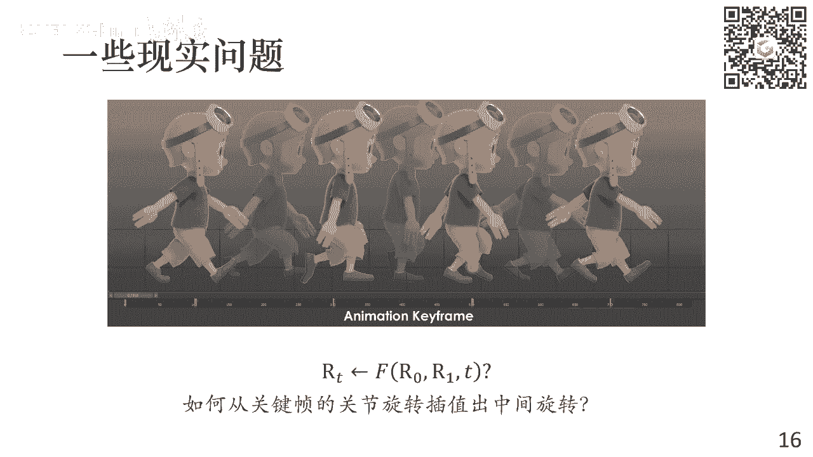
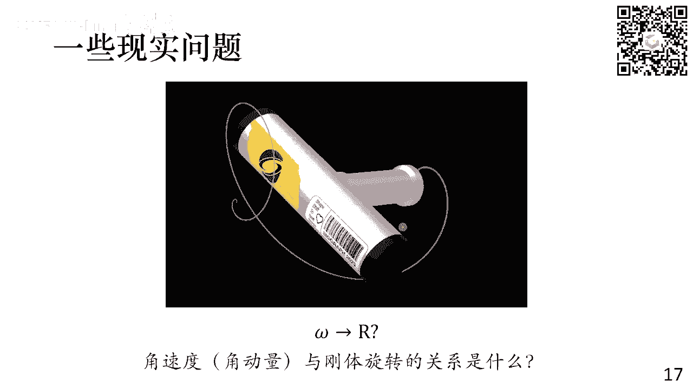
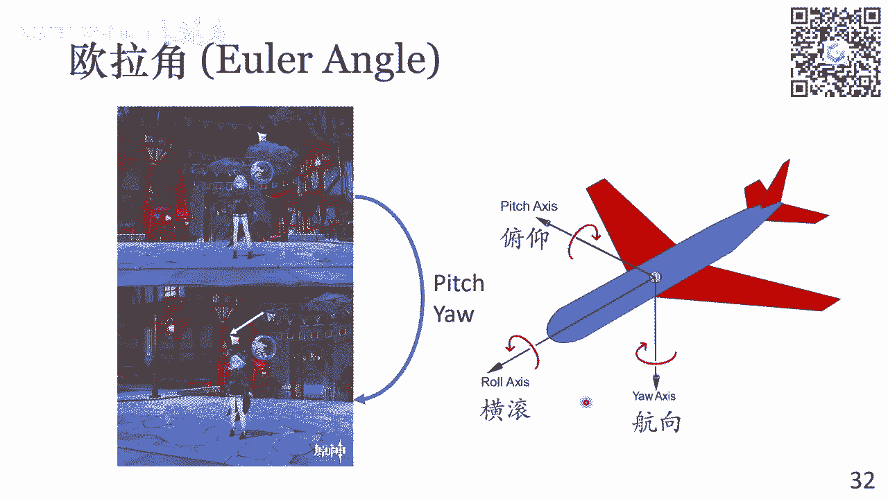
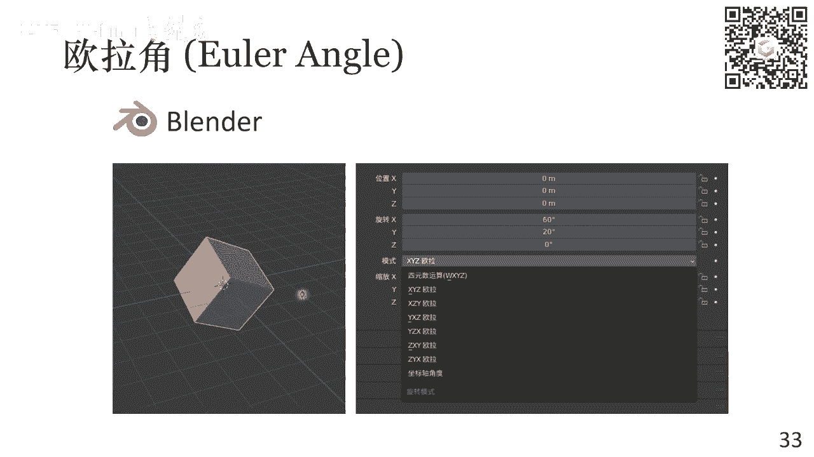
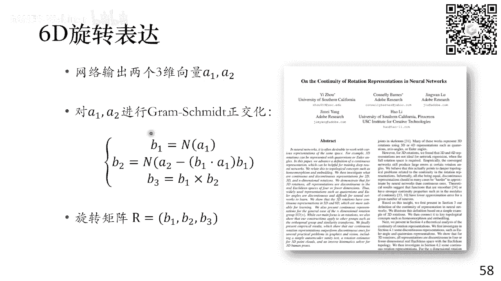
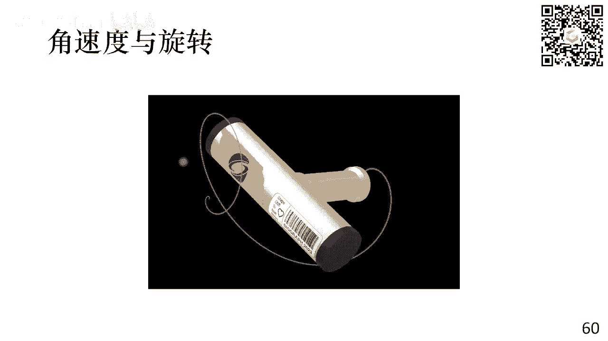
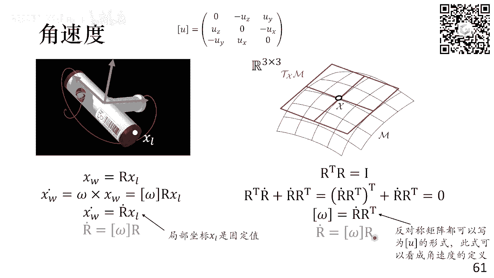
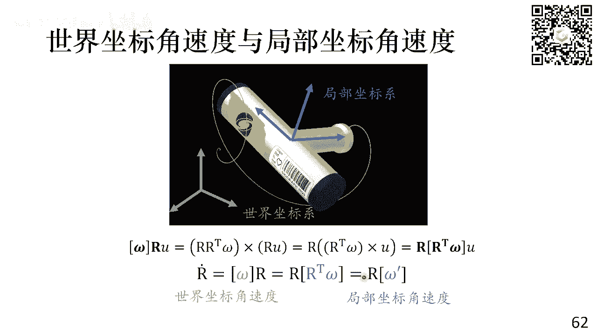

# GAMES001-图形学中的数学 - P4：旋转变换 🌀

在本节课中，我们将要学习图形学中一个核心概念——旋转变换。我们将从旋转的基本定义出发，探讨其数学性质，并详细介绍三种主要的旋转表示方法：欧拉角、轴角（旋转向量）和四元数。每种方法都有其独特的优势和适用场景，理解它们对于处理三维空间中的旋转至关重要。

## 旋转的基本概念与性质

上一节我们介绍了线性代数的基础知识，本节中我们来看看旋转变换的具体定义和性质。

旋转是一种特殊的线性变换，它保持物体上任意两点间的距离不变，即是一种刚体变换。对于一个三维空间中的点 `P`，经过旋转变换 `R` 后得到点 `P'`，其关系可以表示为：

**公式：** `P' = R * P`

其中 `R` 是一个 3x3 的矩阵。为了保持距离不变，旋转矩阵 `R` 必须满足正交性，即 `R^T * R = I`（`I` 是单位矩阵），并且其行列式 `det(R) = +1`。所有满足这些条件的 3x3 矩阵的集合称为**特殊正交群**，记作 `SO(3)`。

以下是旋转矩阵的几个关键性质：

*   **群的性质**：两个旋转矩阵相乘，结果仍是一个旋转矩阵。旋转运算是可结合的，即 `(R0 * R1) * R2 = R0 * (R1 * R2)`。
*   **可逆性**：旋转矩阵的逆等于其转置，即 `R^{-1} = R^T`。这意味着你可以通过逆旋转回到初始状态。
*   **非交换性**：在三维空间中，旋转的**顺序**至关重要。先绕X轴转90度，再绕Y轴转90度，与先绕Y轴转再绕X轴转，得到的结果完全不同。这体现了三维旋转不满足交换律。

## 旋转的自由度与流形

在深入具体表示方法前，我们需要理解旋转的“自由度”。自由度描述了完全确定一个旋转所需的最少参数个数。

*   二维旋转的自由度是 **1**（一个角度 `θ`）。
*   三维旋转的自由度是 **3**。这可以从旋转矩阵的约束推导出来：一个 3x3 矩阵有 9 个参数，正交性条件 `R^T * R = I` 提供了 6 个独立约束（因为是对称矩阵），因此剩余的自由度为 `9 - 6 = 3`。

我们可以将所有的三维旋转想象成一个**三维流形**，它“嵌入”在九维的矩阵空间中。这个流形是连续的，并且局部看起来像一个三维空间。理解这一点有助于我们思考如何进行旋转插值、求导等操作。例如，直接对两个旋转矩阵做线性插值，得到的中间矩阵很可能不在这个流形上（即不是一个有效的旋转矩阵），因此我们需要更聪明的方法。

## 旋转的表示方法

理解了旋转的本质后，我们来看看如何在计算机中具体地表示和操作一个旋转。以下是三种最常用的方法。

### 欧拉角 (Euler Angles) ✈️

欧拉角是一种非常直观的表示方法。它将一个复杂的三维旋转分解为绕三个坐标轴（例如X, Y, Z轴）依次进行的三个基本旋转。这三个旋转的角度（例如 `(α, β, γ)`）就是欧拉角。

以下是使用欧拉角时需要注意的关键点：

*   **旋转顺序**：绕轴的顺序至关重要（如XYZ, ZYX, ZXZ等），不同的顺序对应不同的最终旋转。在图形学软件（如Blender）中，必须明确指定顺序。
*   **内旋与外旋**：内旋指每次旋转都围绕**上一次旋转后**的新坐标系轴进行；外旋指每次旋转都围绕**固定的**世界坐标系轴进行。两者可以通过旋转矩阵乘法的顺序转换。
*   **万向锁 (Gimbal Lock)**：这是欧拉角最严重的问题。当第二个旋转角（如俯仰角 `β`）为 ±90° 时，第一个和第三个旋转轴会重合，导致丢失一个旋转自由度。此时，系统无法通过欧拉角表示绕特定轴的旋转，在动画插值时会产生不自然跳动。

尽管有万向锁问题，欧拉角因其直观性，仍被广泛用于用户界面（如游戏相机控制中的偏航Yaw和俯仰Pitch）。

### 轴角与旋转向量 (Axis-Angle & Rotation Vector) 🔄

轴角表示直接描述了旋转的本质：绕空间中的某个单位轴 `u` 旋转一个角度 `θ`。这正好对应了三维旋转的3个自由度（`u` 是三维单位向量，有2个自由度；`θ` 是标量，有1个自由度）。

我们可以将其紧凑地写成一个**旋转向量**：`v = θ * u`。这个三维向量的方向是旋转轴，长度是旋转角度。

给定轴 `u` 和角 `θ`，对应的旋转矩阵可以由**罗德里格斯旋转公式 (Rodrigues‘ Rotation Formula)** 给出：

**公式：** `R = I + sin(θ) * K + (1 - cos(θ)) * K^2`
其中 `K` 是向量 `u` 的叉乘矩阵（反对称矩阵）。

反之，从旋转矩阵 `R` 也可以反解出轴和角：
*   `θ = arccos((trace(R) - 1) / 2)`
*   旋转轴 `u` 与 `R` 的反对称部分 `(R - R^T)` 相关。

旋转向量也可以方便地进行**插值**。正确的方法是：计算从旋转A到旋转B的**相对旋转**，将其表示为轴角 `(u, Δθ)`，然后对角度进行线性插值 `θ_t = t * Δθ`，再利用罗德里格斯公式构造中间旋转。**注意**：直接对两个旋转向量做线性插值通常得不到最短路径的平滑旋转。

### 四元数 (Quaternions) 🧮

四元数是表示旋转最强大、计算最高效的工具之一。它是一个四维超复数，通常写为：
`q = [s, v] = s + xi + yj + zk`，其中 `s` 是实部，`v = (x, y, z)` 是虚部（向量部分）。

用于表示旋转的必须是**单位四元数**，即满足 `s^2 + x^2 + y^2 + z^2 = 1`。单位四元数可以表示绕轴 `u` 旋转 `θ` 角：
**公式：** `q = [cos(θ/2), sin(θ/2) * u]`

一个三维向量 `v` 的旋转可以通过四元数乘法（“三明治”乘法）实现：
**公式：** `v' = q * v * q^{-1}`
其中 `v` 被提升为纯四元数 `[0, v]`，`q^{-1} = q*`（共轭四元数，对于单位四元数）。

四元数的优势包括：
*   **高效组合**：多个旋转连续作用，只需将对应的四元数相乘。
*   **平滑插值**：可以在四维单位球面上进行球面线性插值 (Slerp)，得到角速度恒定的最平滑旋转路径。其公式为：
    **公式：** `Slerp(q0, q1, t) = (sin((1-t)Ω) / sinΩ) * q0 + (sin(tΩ) / sinΩ) * q1`
    其中 `Ω` 是 `q0` 与 `q1` 之间的夹角。
*   **避免奇异性**：没有万向锁问题。

需要注意的是，四元数 `q` 和 `-q` 表示**同一个**旋转。在进行Slerp插值时，应确保选择最短弧，通常通过检查点积 `q0·q1`，若为负则将一个四元数取反。

## 角速度与旋转的微分关系 ⏱️

在物理模拟中，我们经常需要处理旋转随时间变化的情况，这就涉及到角速度 `ω`。

旋转矩阵 `R` 对时间的导数与角速度 `ω`（在世界坐标系下）满足以下关系：
**公式：** `dR/dt = [ω]× * R`
其中 `[ω]×` 是角速度向量 `ω` 对应的叉乘矩阵（反对称矩阵）。

这个公式的物理意义是：刚体上一点的世界坐标速度 `v = ω × (R * p_local)`。

如果角速度 `ω'` 是定义在局部坐标系下的，则关系变为：
**公式：** `dR/dt = R * [ω']×`

类似地，对于四元数 `q`，其微分方程为：
**公式：** `dq/dt = (1/2) * ω * q` （世界坐标系角速度）
或 `dq/dt = (1/2) * q * ω'` （局部坐标系角速度）
这里的乘法是四元数乘法，`ω` 需写为纯四元数 `[0, ω]`。

这些方程是进行刚体动力学数值积分的基础。

## 神经网络中的旋转表示 🤖

当使用神经网络处理旋转（如姿态估计、动作生成）时，传统的表示方法可能面临挑战：
*   **奇异性**：欧拉角有万向锁。
*   **周期性/多值性**：轴角中，`(θ, u)` 和 `(2π-θ, -u)` 表示相同旋转；四元数中 `q` 和 `-q` 相同。这会导致损失函数存在多个极小值，不利于优化。
*   **约束**：旋转矩阵需要正交约束，四元数需要单位约束。

一种在实践中表现良好的表示是 **6D 连续旋转表示**。网络输出一个6维向量 `[a, b]`，然后通过以下过程得到一个有效的旋转矩阵：
1.  将前3维 `a` 归一化得到第一个基向量 `b1`。
2.  将后3维 `b` 减去其在 `b1` 上的投影，然后归一化，得到与 `b1` 正交的第二个基向量 `b2`。
3.  通过叉乘 `b3 = b1 × b2` 得到第三个正交基向量。
4.  组合 `[b1, b2, b3]` 即得到一个合法的旋转矩阵 `R ∈ SO(3)`。

这种方法避免了显式的周期性，提供了连续的映射，更易于神经网络学习和优化。

## 总结

本节课中我们一起深入探讨了图形学中的旋转变换。我们从旋转作为特殊正交群 `SO(3)` 的基本定义出发，理解了其三维流形的本质。然后，我们系统地学习了三种核心的旋转表示法：
1.  **欧拉角**：直观但存在万向锁，适合用户交互。
2.  **轴角/旋转向量**：直接体现旋转几何，是推导的基础。
3.  **四元数**：无奇异性、计算高效、插值平滑，是存储和计算旋转的优选。

我们还探讨了旋转的微分与角速度的关系，这是物理模拟的基石。最后，我们了解了在为神经网络设计旋转输出时，6D连续表示等现代方法的优势。

掌握这些表示方法及其相互转换，是进行三维图形编程、机器人学、动画和物理模拟的必备技能。希望本教程能帮助你建立起清晰的概念框架。