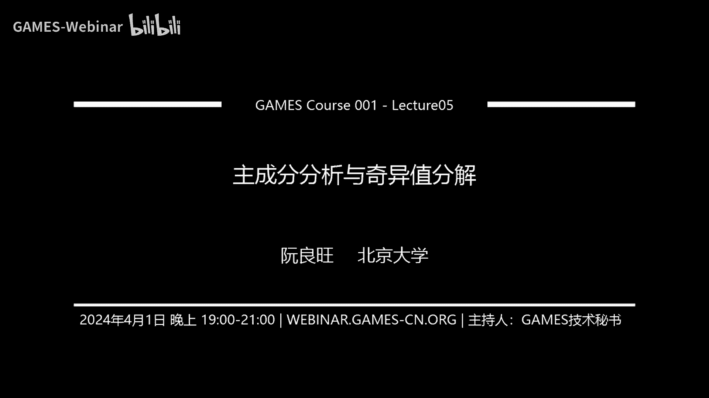

# GAMES001-图形学中的数学 - P5：主成分分析与奇异值分解 🧮

在本节课中，我们将要学习线性代数中两个极其重要的概念：奇异值分解与主成分分析。它们在图形学、数据科学和机器学习等领域有着广泛的应用。我们将从实对称矩阵的性质出发，推导出奇异值分解，并探讨其在求解矩阵方程、理解几何变换等方面的应用。随后，我们将介绍主成分分析这一降维技术，并了解其在点云处理、数据压缩等图形学任务中的应用。

## 实对称矩阵的性质 🔍

上一节我们介绍了矩阵的基本概念。本节中，我们来看看一类特殊的矩阵——实对称矩阵，并证明其两个关键性质，为后续推导奇异值分解奠定基础。

**定理一：实对称矩阵的特征值是实数。**
对于任意一个实对称矩阵 **S**，存在特征值 λ 和对应的特征向量 **x**，满足 **Sx** = λ**x**。我们假设 **x** 已归一化，即 **x**ᴴ**x** = 1。对等式两边取共轭，得到 **Sx**ᴴ = λ* **x**ᴴ。由于 **S** 是实对称矩阵，其共轭等于自身。在等式左边乘以 **x**ᵀ，得到 **x**ᵀ**Sx**ᴴ = **x**ᵀλ* **x**ᴴ = λ*。另一方面，对原式 **Sx** = λ**x** 两边转置，得到 **x**ᵀ**S** = λ**x**ᵀ。在此式右边乘以 **x**ᴴ，得到 **x**ᵀ**Sx**ᴴ = λ**x**ᵀ**x**ᴴ = λ。比较两个结果，得到 λ = λ*，因此 λ 是实数。

**定理二：实对称矩阵不同特征值的特征向量相互正交。**
取两个不同的特征值 λ₀, λ₁ 及其对应的特征向量 **x₀**, **x₁**。从等式 **x₀**ᵀ**S** = λ₀**x₀**ᵀ 出发，右边乘以 **x₁**，得到 **x₀**ᵀ**Sx₁** = λ₀**x₀**ᵀ**x₁**。由于 **Sx₁** = λ₁**x₁**，代入得 **x₀**ᵀλ₁**x₁** = λ₁**x₀**ᵀ**x₁**。因此有 λ₀**x₀**ᵀ**x₁** = λ₁**x₀**ᵀ**x₁**。由于 λ₀ ≠ λ₁，要使得等式成立，必须有 **x₀**ᵀ**x₁** = 0，即 **x₀** 与 **x₁** 正交。

基于以上性质，任意实对称矩阵 **S** 可以进行特征值分解：
**S** = **QΛQ**ᵀ
其中，**Q** 是由特征向量组成的正交矩阵（满足 **Q**ᵀ**Q** = **I**），**Λ** 是由特征值构成的对角矩阵。

如果 **S** 是半正定矩阵（即所有特征值 λᵢ ≥ 0），我们可以定义其平方根矩阵 **P**：
**P** = **Q√Λ Q**ᵀ
使得 **P**² = **S**。此外，实对称矩阵的迹等于其所有特征值之和：`tr(S) = Σ λᵢ`。

## 奇异值分解的推导 🧬

理解了实对称矩阵后，本节中我们来看看如何将其性质推广到任意矩阵，从而得到奇异值分解。

考虑一个任意的 m × n 矩阵 **A**，其秩为 r。构造矩阵 **S** = **A**ᵀ**A**。**S** 是一个 n × n 的实对称半正定矩阵。根据上一节的结论，**S** 可以进行特征值分解，找到 r 个相互正交的特征向量 **vᵢ** 和对应的特征值 λᵢ (λᵢ ≥ 0)。

我们有以下关系：
**A**ᵀ**A vᵢ** = λᵢ **vᵢ**

接下来，我们定义一组新的向量 **uᵢ**：
**uᵢ** = (1 / √λᵢ) **A vᵢ** (对于 λᵢ > 0)

可以证明，这样定义的 **uᵢ** 也是一组正交基。然后，我们通过施密特正交化，将 **vᵢ** 扩充为 **Rⁿ** 空间的一组标准正交基，将 **uᵢ** 扩充为 **Rᵐ** 空间的一组标准正交基。对于扩充的向量（对应 λᵢ = 0），有 **A vᵢ** = **0**。

将所有这些关系用矩阵形式表示。令 **V** 的每一列为 **vᵢ**，**U** 的每一列为 **uᵢ**，**Σ** 是一个 m × n 的“对角”矩阵，其前 r 个对角元 σᵢ = √λᵢ，其余元素为 0。则上述关系可以写为：
**A V** = **U Σ**

由于 **V** 是正交矩阵，**V**ᵀ = **V**⁻¹。在等式两边右乘 **V**ᵀ，我们得到奇异值分解的最终形式：
**A** = **U Σ V**ᵀ

其中：
*   **U** 是 m × m 的正交矩阵。
*   **Σ** 是 m × n 的矩阵，其对角元 σᵢ 称为 **A** 的**奇异值**，数量等于矩阵的秩 r。
*   **V** 是 n × n 的正交矩阵。

## 奇异值分解的应用：矩阵的逆与方程求解 ⚙️

上一节我们得到了奇异值分解的形式。本节中我们来看看它在解决线性代数核心问题——求逆和解方程——中的应用。

**1. 矩阵的逆**
对于一个可逆的方阵 **A**，其奇异值分解为 **A** = **UΣV**ᵀ。那么它的逆矩阵可以方便地求出：
**A**⁻¹ = (**UΣV**ᵀ)⁻¹ = **V Σ**⁻¹ **U**ᵀ
其中 **Σ**⁻¹ 是将 **Σ** 的非零对角元取倒数得到的对角矩阵。

**2. 矩阵的伪逆与方程求解**
对于非方阵或不满秩的矩阵 **A**，严格意义上的逆不存在。但我们可以在最小二乘意义下定义**伪逆** **A**⁺，用于求解方程 **Ax** ≈ **b**。

以下是求解不同类型方程时伪逆的形式：

*   **超定方程（方程数 > 未知数）**：通常无精确解，转而求最小化残差 ||**Ax - b**||² 的解。该解为 **x** = **A**⁺ **b**，其中 **A**⁺ = (**A**ᵀ**A**)⁻¹**A**ᵀ，称为**左逆**。利用SVD，**A**⁺ = **V Σ**⁺ **U**ᵀ。
*   **欠定方程（方程数 < 未知数）**：有无穷多解，转而求满足 **Ax = b** 且范数 ||**x**|| 最小的解。该解为 **x** = **A**⁺ **b**，其中 **A**⁺ = **A**ᵀ(**A A**ᵀ)⁻¹，称为**右逆**。利用SVD，同样有 **A**⁺ = **V Σ**⁺ **U**ᵀ。

在SVD框架下，**Σ**⁺ 是一个 n × m 的矩阵，它是 **Σ** 的“转置”，并将其非零奇异值替换为相应的倒数。伪逆 **A**⁺ = **V Σ**⁺ **U**ᵀ 是一个统一的表达式，涵盖了左逆、右逆以及可逆方阵的逆。

## 奇异值分解在图形学中的应用实例 🎨

理解了奇异值分解的数学原理后，本节中我们来看看它在图形学中的两个具体应用：理解线性变换和形状匹配。

**1. 理解线性变换**
任意一个线性变换 **x'** = **A x**（**A** 为3×3矩阵）都可以进行SVD分解：**A** = **UΣV**ᵀ。这个分解可以理解为三个连续的变换：
1.  **V**ᵀ **x**：旋转（因为 **V** 是正交矩阵）。
2.  **Σ (V**ᵀ **x)**：沿坐标轴的缩放（拉伸或压缩）。
3.  **U (Σ V**ᵀ **x)**：再次旋转。
因此，任何线性变换本质上都可以分解为“旋转-缩放-旋转”的组合。这被称为**极分解**的另一种形式：**A** = **RS**，其中 **R** = **UV**ᵀ 是旋转矩阵，**S** = **VΣV**ᵀ 是一个对称正定矩阵，代表拉伸。

**2. 形状匹配算法**
形状匹配的目标是：给定一组点从位置 **qᵢ** 变形到 **pᵢ**，找到一个最优的刚性变换（旋转 **R** 和平移 **t**），使得变换后的 **qᵢ** 尽可能接近 **pᵢ**。即最小化目标函数：
Σᵢ ||(**R qᵢ + t**) - **pᵢ**||²

求解步骤如下：
1.  计算两组点的质心：**q_c** = (1/N) Σ **qᵢ**, **p_c** = (1/N) Σ **pᵢ**。
2.  计算去质心坐标：**q̃ᵢ** = **qᵢ** - **q_c**, **p̃ᵢ** = **pᵢ** - **p_c**。
3.  构造矩阵 **H** = Σᵢ **p̃ᵢ q̃ᵢ**ᵀ。
4.  对 **H** 进行奇异值分解：**H** = **UΣV**ᵀ。
5.  最优旋转矩阵 **R** = **V U**ᵀ（需检查行列式，若为-1则需调整）。
6.  最优平移向量 **t** = **p_c** - **R q_c**。

该算法在图形学的碰撞处理、模型对齐等领域有广泛应用。

## 主成分分析：数据降维技术 📉

上一节我们看到了SVD在几何上的应用。本节中我们来看看另一个紧密相关的技术——主成分分析，它主要用于数据降维和特征提取。

PCA的目标是：对于一个高维数据集，找到一个低维子空间，使得数据在该子空间上的投影能最大程度保留原始数据的方差（即信息）。

**算法推导：**
假设我们有 N 个 d 维数据点 **x₀, x₁, ..., x_{N-1}**。
1.  计算数据集的均值：**μ** = (1/N) Σ **xᵢ**。
2.  计算协方差矩阵：**S** = (1/N) Σ (**xᵢ** - **μ**)(**xᵢ** - **μ**)ᵀ。
3.  对协方差矩阵 **S** 进行特征值分解：**S** = **QΛQ**ᵀ。特征值 λᵢ 从大到小排列，对应的特征向量 **qᵢ** 称为主成分。
4.  选择前 k 个最大的特征值对应的特征向量 **q₀, q₁, ..., q_{k-1}**，构成投影矩阵 **P**。
5.  任何数据点 **x** 的 k 维降维表示为：**y** = **P**ᵀ(**x** - **μ**)。

**为什么最大特征值对应的特征向量是最佳投影方向？**
最大化投影后数据的方差，等价于最大化 **v**ᵀ**S v**，其中 **v** 是投影方向（单位向量）。而 **v**ᵀ**S v** 的最大值就是 **S** 的最大特征值，在 **v** 为对应特征向量时取到。

## 主成分分析的应用与局限 🖼️

掌握了PCA的基本原理后，本节中我们来看看它在图形学中的典型应用，并认识其局限性。

**应用实例：**
1.  **点云法向估计**：对于点云中一个点，取其邻域内的点构成一个局部数据集。对该数据集进行PCA，最小的特征值对应的特征向量方向近似为该点的法向方向。前两个特征向量则张成切平面。
2.  **数据压缩**：例如，一张 512×512 的图片可以看作一个 262144 维的数据点。对多张人脸图片（数据集）进行PCA，可以得到一个低维的“特征脸”空间。任何一张新人脸都可以用少数几个主成分的系数来近似表示，从而实现压缩。
3.  **模型降阶**：在物理模拟中，系统的自由度可能极高。可以预先运行多次模拟，将结果作为高维数据点，然后用PCA提取主要变化模式。后续模拟只需在低维的主成分空间中进行，大幅提升计算效率。

**局限性：**
PCA是一种**线性**降维方法。它假设数据的主要结构存在于一个线性子空间中。对于具有非线性结构的数据（例如一个三维空间中的螺旋线或圆圈），PCA无法有效降维。此时，需要借助非线性降维方法，如：
*   **核PCA**：先将数据通过非线性函数映射到高维空间，再在高维空间中进行线性PCA。
*   **自编码器**：使用神经网络学习数据从高维到低维（编码）以及从低维恢复至高维（解码）的非线性映射，其隐空间表示即为降维结果。

## 总结 📚

本节课中我们一起学习了图形学数学基础中的两个核心工具：奇异值分解与主成分分析。

我们首先从实对称矩阵的性质出发，严谨地推导出了任意矩阵的奇异值分解形式 **A = UΣVᵀ**。我们探讨了SVD在求解矩阵逆、伪逆以及线性方程组（超定、欠定）中的应用。在图形学中，SVD帮助我们理解线性变换的几何本质（旋转与缩放），并构成了形状匹配等算法的数学基础。

随后，我们介绍了主成分分析这一数据降维技术。PCA通过计算数据协方差矩阵的特征向量，找到数据方差最大的投影方向，从而实现高效的数据压缩和特征提取。我们看到了PCA在点云处理、图像压缩和模拟加速中的应用，同时也指出了其作为线性方法的局限性。

这些概念是连接线性代数与图形学应用的重要桥梁，理解它们将为学习更高级的图形学主题奠定坚实的基础。